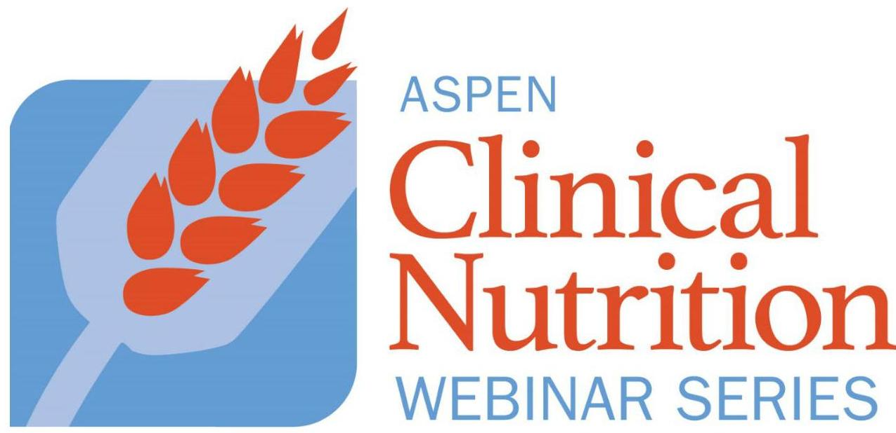
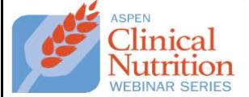

# Nutrition Support Fundamentals Course Fluids and Electrolytes

**Wednesday, July 30, 2025**
3:00 pm – 4:30 pm ET

## SESSION HANDOUT

|   | Page  |
| --- | --- |
|  Accreditation Information | 2  |
|  How to Claim CE Credit and Access CE Transcript | 3-6  |
|  How to Access Recording and Handout | 7  |
|  Session Slides | 8-48  |
|  Self-Assessment Q&A | 49-51  |

--- page 1 ---

Nutrition Support Fundamentals Course: Fluids and Electrolytes July 30, 2025, 3:00 pm - 4:30 pm Eastern Time

Course Goal and Target Audience: The American Society for Enteral and Parenteral Nutrition (ASPEN) programs are designed for dietitians, nurses, pharmacists, physicians, and researchers who practice the sciences of clinical nutrition and metabolic support. This course is ideal for nutrition professionals such as dietitians, nurses, pharmacists, physicians, and others seeking a comprehensive overview of core nutrition support topics. This course and all of its parts is designed at the intermediate learning level.

## Course Objectives:

## Fluids and Electrolytes

1. Assess fluid and electrolyte needs of a patient
2. Develop a therapeutic plan for fluid and electrolyte requirements
3. Prevent and manage complications of fluid and electrolyte abnormalities

Successful Completion: CE credit must be claimed by August 30, 2025. To obtain credit for the webinars, attendees must participate in the entire live program and complete an evaluation in ASPEN's eLearning Center. Certificates are stored in and can be printed from the eLearning Center. ASPEN submits data as required to the CPE Monitor for pharmacists. ASPEN submits physician earned CME credit to Pars. ASPEN does not submit data to any other credentialing organization.

Pharmacists and physicians, please note that ASPEN will upload earned CE credit into the appropriate system within the required timeframe. Any credit not claimed by the deadline will not be entered. Please provide your correct information when completing your evaluation and claiming your CE credit. ASPEN submits only the information that is entered by the pharmacist or physician when credit is claimed and is not responsible for following up to obtain any corrected information to ensure an error-free submission.

## Policies and Information:

Non-Commercialism. ASPEN subscribes to the Standards for Integrity and Independence in Accredited Continuing Education. ASPEN does not provide programs that constitute advertisement or include promotional materials. ASPEN does not endorse any products.

Privacy and Confidentiality. ASPEN respects the privacy of its members and customers. Companies that receive personal information from ASPEN to execute the business of ASPEN may use information only for that purpose.

Grievances. Grievances must be submitted in writing to Senior Director, Education and Research at ASPEN, 8401 Colesville Road, Ste 510, Silver Spring, MD 20910.

## Commercial Support and Sponsorship:

Commercial Support: None

## Accreditation Statement

In support of improving patient care, The American Society for Parenteral and Enteral Nutrition (ASPEN) is jointly accredited by the Accreditation Council for Continuing Medical Education (ACCME), Accreditation Council for Pharmacy Education (ACPE), and the American Nurses Credentialing Center (ANCC), to provide continuing education for the healthcare team.

ASPEN designates this live activity for a maximum of 1.5 AMA PRA Category 1 Credits ${ }^{T M}$. Physicians should only claim credit commensurate with the extent of their participation in the activity.

Pharmacists: ASPEN designates this activity for a maximum of 1.5 contact hours/0.15 CEUs. ACPE UAN: JA0002345-0000-25-123-L99P. Knowledge activity.

Nurses: ASPEN designates this activity for a maximum of 1.5 nursing contact hours.

Dietitians: ASPEN designates this activity for a maximum of 1.5 CPEUs.

|  Commission on |   |
| --- | --- |
|  Dietetic Registration | Completion of the 60,000 profession specific or PCE activity awards CPE to One PCE credit $\rightarrow$ One CPEU.  |
|  Academic Accreditation and |   |
|  Education (ACCME), Accreditation Council for |   |
|  Pharmacy Education (ACPE), and the American Nurses Credentialing |   |
|  Center (ANCC), to provide continuing education for the healthcare |   |
|  team. |   |

ASPEN designates this live activity for a maximum of 1.5 AMA PRA Category 1 Credits ${ }^{T M}$. Physicians should only claim credit commensurate with the extent of their participation in the activity.

Pharmacists: ASPEN designates this activity for a maximum of 1.5 contact hours/0.15 CEUs. ACPE UAN: JA0002345-0000-25-123-L99P. Knowledge activity.

Nurses: ASPEN designates this activity for a maximum of 1.5 nursing contact hours.

Dietitians: ASPEN designates this activity for a maximum of 1.5 CPEUs.

|  Commission on |   |
| --- | --- |
|  Dietetic Registration | Completion of the 60,000 profession specific or PCE activity awards CPE to One PCE credit $\rightarrow$ One CPEU.  |
|  Academic Accreditation and |   |
|  Education (ACCME), Accreditation Council for |   |
|  Pharmacy Education (ACPE), and the American Nurses Credentialing |   |
|  Center (ANCC), to provide continuing education for the healthcare |   |
|  team. |   |

ASPEN designates this live activity for a maximum of 1.5 AMA PRA Category 1 Credits ${ }^{T M}$. Physicians should only claim credit commensurate with the extent of their participation in the activity.

Pharmacists: ASPEN designates this activity for a maximum of 1.5 contact hours/0.15 CEUs. ACPE UAN: JA0002345-0000-25-123-L99P. Knowledge activity.

Nurses: ASPEN designates this activity for a maximum of 1.5 nursing contact hours.

Dietitians: ASPEN designates this activity for a maximum of 1.5 CPEUs.

|  Commission on |   |
| --- | --- |
|  Dietetic Registration | Completion of the 60,000 profession specific or PCE activity awards CPE to One PCE credit $\rightarrow$ One CPEU.  |
|  Academic Accreditation and |   |
|  Education (ACCME), Accreditation Council for |   |
|  Pharmacy Education (ACPE), and the American Nurses Credentialing |   |
|  Center (ANCC), to provide continuing education for the healthcare |   |
|  team. |   |

ASPEN designates this live activity for a maximum of 1.5 AMA PRA Category 1 Credits ${ }^{T M}$. Physicians should only claim credit commensurate with the extent of their participation in the activity.

Pharmacists: ASPEN designates this activity for a maximum of 1.5 contact hours/0.15 CEUs. ACPE UAN: JA0002345-0000-25-123-L99P. Knowledge activity.

Nurses: ASPEN designates this activity for a maximum of 1.5 nursing contact hours.

Dietitians: ASPEN designates this activity for a maximum of 1.5 CPEUs.

|  Commission on |   |
| --- | --- |
|  Dietetic Registration | Completion of the 60,000 profession specific or PCE activity awards CPE to One PCE credit $\rightarrow$ One CPEU.  |
|  Academic Accreditation and |   |
|  Education (ACCME), Accreditation Council for |   |
|  Pharmacy Education (ACPE), and the American Nurses Credentialing |   |
|  Center (ANCC), to provide continuing education for the healthcare |   |
|  team. |   |

ASPEN designates this live activity for a maximum of 1.5 AMA PRA Category 1 Credits ${ }^{T M}$. Physicians should only claim credit commensurate with the extent of their participation in the activity.

Pharmacists: ASPEN designates this activity for a maximum of 1.5 contact hours/0.15 CEUs. ACPE UAN: JA0002345-0000-25-123-L99P. Knowledge activity.

Nurses: ASPEN designates this activity for a maximum of 1.5 nursing contact hours.

Dietitians: ASPEN designates this activity for a maximum of 1.5 CPEUs.

|  Commission on |   |
| --- | --- |
|  Dietetic Registration | Completion of the 60,000 profession specific or PCE activity awards CPE to One PCE credit $\rightarrow$ One CPEU.  |
|  Academic Accreditation and |   |
|  Education (ACCME), Accreditation Council for |   |
|  Pharmacy Education (ACPE), and the American Nurses Credentialing |   |
|  Center (ANCC), to provide continuing education for the healthcare |   |
|  team. |   |

ASPEN designates this live activity for a maximum of 1.5 AMA PRA Category 1 Credits ${ }^{T M}$. Physicians should only claim credit commensurate with the extent of their participation in the activity.

Pharmacists: ASPEN designates this activity for a maximum of 1.5 contact hours/0.15 CEUs. ACPE UAN: JA0002345-0000-25-123-L99P. Knowledge activity.

Nurses: ASPEN designates this activity for a maximum of 1.5 nursing contact hours.

Dietitians: ASPEN designates this activity for a maximum of 1.5 CPEUs.

|  Commission on |   |
| --- | --- |
|  Dietetic Registration | Completion of the 60,000 profession specific or PCE activity awards CPE to One PCE credit $\rightarrow$ One CPEU.  |
|  Academic Accreditation and |   |
|  Education (ACCME), Accreditation Council for |   |
|  Pharmacy Education (ACPE), and the American Nurses Credentialing |   |
|  Center (ANCC), to provide continuing education for the healthcare |   |
|  team. |   |

ASPEN designates this live activity for a maximum of 1.5 AMA PRA Category 1 Credits ${ }^{T M}$. Physicians should only claim credit commensurate with the extent of their participation in the activity.

Pharmacists: ASPEN designates this activity for a maximum of 1.5 contact hours/0.15 CEUs. ACPE UAN: JA0002345-0000-25-123-L99P. Knowledge activity.

Nurses: ASPEN designates this activity for a maximum of 1.5 nursing contact hours.

Dietitians: ASPEN designates this activity for a maximum of 1.5 CPEUs.

|  Commission on |   |
| --- | --- |
|  Dietetic Registration | Completion of the 60,000 profession specific or PCE activity awards CPE to One PCE credit $\rightarrow$ One CPEU.  |
|  Academic Accreditation and |   |
|  Education (ACCME), Accreditation Council for |   |
|  Pharmacy Education (ACPE), and the American Nurses Credentialing |   |
|  Center (ANCC), to provide continuing education for the healthcare |   |
|  team. |   |

ASPEN designates this live activity for a maximum of 1.5 AMA PRA Category 1 Credits ${ }^{T M}$. Physicians should only claim credit commensurate with the extent of their participation in the activity.

Pharmacists: ASPEN designates this activity for a maximum of 1.5 AMA PRA Category 1 Credits ${ }^{T M}$. Physicians should only claim credit

## 2000 and 2001: an equal opportunity to enter into the program

## 2001: an equal opportunity to enter into the program

## 2002: an equal opportunity to enter into the program

## 2003: an equal opportunity to enter into the program

## 2004: an equal opportunity to enter into the program

## 2005: an equal opportunity to enter into the program

## 2006: an equal opportunity to enter into the program

## 2007: an equal opportunity to enter into the program

## 2008: an equal opportunity to enter into the program

## 2009: an equal opportunity to enter into the program

## 2010: an equal opportunity to enter into the program

## 2011: an equal opportunity to enter into the program

## 2012: an equal opportunity to enter into the program

## 2013: an equal opportunity to enter into the program

## 2014: an equal opportunity to enter into the program

## 2015: an equal opportunity to enter into the program

## 2016: an equal opportunity to enter into the program

## 2017: an equal opportunity to enter into the program

## 2018: an equal opportunity to enter into the program

## 2019: an equal opportunity to enter into the program

## 2020: an equal opportunity to enter into the program

## 2021: an equal opportunity to enter into the program

## 2022: an equal opportunity to enter into the program

## 2023: an equal opportunity to enter into the program

## 2024: an equal opportunity to enter into the program

## 2025: an equal opportunity to enter into the program

## 2026: an equal opportunity to enter into the program

## 2027: an equal opportunity to enter into the program

## 2028: an equal opportunity to enter into the program

## 2029: an equal opportunity to enter into the program

## 2030: an equal opportunity to enter into the program

## 2031: an equal opportunity to enter into the program

## 2032: an equal opportunity to enter into the program

## 2033: an equal opportunity to enter into the program

## 2034: an equal opportunity to enter into the program

## 2035: an equal opportunity to enter into the program

## 2036: an equal opportunity to enter into the program

## 2037: an equal opportunity to enter into the program

## 2038: an equal opportunity to enter into the program

## 2039: an equal opportunity to enter into the program

## 2040: an equal opportunity to enter into the program

## 2041: an equal opportunity to enter into the program

## 2042: an equal opportunity to enter into the program

## 2043: an equal opportunity to enter into the program

## 2044: an equal opportunity to enter into the program

## 2045: an equal opportunity to enter into the program

## 2046: an equal opportunity to enter into the program

## 2047: an equal opportunity to enter into the program

## 2048: an equal opportunity to enter into the program

## 2049: an equal opportunity to enter into the program

## 2050: an equal opportunity to enter into the program

## 2051: an equal opportunity to enter into the program

## 2052: an equal opportunity to enter into the program

## 2053: an equal opportunity to enter into the program

## 2054: an equal opportunity to enter into the program

## 2055: an equal opportunity to enter into the program

## 2056: an equal opportunity to enter into the program

## 2057: an equal opportunity to enter into the program

## 2058: an equal opportunity to enter into the program

## 2059: an equal opportunity to enter into the program

## 2060: an equal opportunity to enter into the program

## 2061: an equal opportunity to enter into the program

## 2062: an equal opportunity to enter into the program

## 2063: an equal opportunity to enter into the program

## 2064: an equal opportunity to enter into the program

## 2065: an equal opportunity to enter into the program

## 2066: an equal opportunity to enter into the program

## 2067: an equal opportunity to enter into the program

## 2068: an equal opportunity to enter into the program

## 2069: an equal opportunity to enter into the program

## 2070: an equal opportunity to enter into the program

## 2071: an equal opportunity to enter into the program

## 2072: an equal opportunity to enter into the program

## 2073: an equal opportunity to enter into the program

## 2074: an equal opportunity to enter into the program

## 2075: an equal opportunity to enter into the program

## 2076: an equal opportunity to enter into the program

## 2077: an equal opportunity to enter into the program

## 2078: an equal opportunity to enter into the program

## 2079: an equal opportunity to enter into the program

## 2080: an equal opportunity to enter into the program

## 2081: an equal opportunity to enter into the program

## 2082: an equal opportunity to enter into the program

## 2083: an equal opportunity to enter into the program

## 2084: an equal opportunity to enter into the program

## 2085: an equal opportunity to enter into the program

## 2086: an equal opportunity to enter into the program

## 2087: an equal opportunity to enter into the program

## 2088: an equal opportunity to enter into the program

## 2089: an equal opportunity to enter into the program

## 2090: an equal opportunity to enter into the program

## 2091: an equal opportunity to enter into the program

## 2092: an equal opportunity to enter into the program

## 2093: an equal opportunity to enter into the program

## 2094: an equal opportunity to enter into the program

## 2095: an equal opportunity to enter into the program

## 2096: an equal opportunity to enter into the program

## 2097: an equal opportunity to enter into the program

## 2098: an equal opportunity to enter into the program

## 2099: an equal opportunity to enter into the program

## 2010: an equal opportunity to enter into the program

## 2011: an equal opportunity to enter into the program

## 2012: an equal opportunity to enter into the program

## 2013: an equal opportunity to enter into the program

## 2014: an equal opportunity to enter into the program

## 2015: an equal opportunity to enter into the program

## 2016: an equal opportunity to enter into the program

## 2017: an equal opportunity to enter into the program

## 2018: an equal opportunity to enter into the program

## 2019: an equal opportunity to enter into the program

## 2020: an equal opportunity to enter into the program

## 2021: an equal opportunity to enter into the program

## 2022: an equal opportunity to enter into the program

## 2023: an equal opportunity to enter into the program

## 2024: an equal opportunity to enter into the program

## 2025: an equal opportunity to enter into the program

## 2026: an equal opportunity to enter into the program

## 2027: an equal opportunity to enter into the program

## 2028: an equal opportunity to enter into the program

## 2029: an equal opportunity to enter into the program

## 2030: an equal opportunity to enter into the program

## 2031: an equal opportunity to enter into the program

## 2032: an equal opportunity to enter into the program

## 2033: an equal opportunity to enter into the program

## 2034: an equal opportunity to enter into the program

## 2035: an equal opportunity to enter into the program

## 2036: an equal opportunity to enter into the program

## 2037: an equal opportunity to enter into the program

## 2038: an equal opportunity to enter into the program

## 2039: an equal opportunity to enter into the program

## 2040: an equal opportunity to enter into the program

## 2041: an equal opportunity to enter into the program

## 2042: an equal opportunity to enter into the program

## 2043: an equal opportunity to enter into the program

## 2044: an equal opportunity to enter into the program

## 2045: an equal opportunity to enter into the program

## 2046: an equal opportunity to enter into the program

## 2047: an equal opportunity to enter into the program

## 2048: an equal opportunity to enter into the program

## 2049: an equal opportunity to enter into the program

## 2050: an equal opportunity to enter into the program

## 2051: an equal opportunity to enter into the program

## 2052: an equal opportunity to enter into the program

## 2053: an equal opportunity to enter into the program

## 2054: an equal opportunity to enter into the program

## 2055: an equal opportunity to enter into the program

## 2056: an equal opportunity to enter into the program

## 2057: an equal opportunity to enter into the program

## 2058: an equal opportunity to enter into the program

## 2059: an equal opportunity to enter into the program

## 2060: an equal opportunity to enter into the program

## 2061: an equal opportunity to enter into the program

## 2062: an equal opportunity to enter into the program

## 2063: an equal opportunity to enter into the program

## 2064: an equal opportunity to enter into the program

## 2065: an equal opportunity to enter into the program

## 2066: an equal opportunity to enter into the program

## 2067: an equal opportunity to enter into the program

## 2068: an equal opportunity to enter into the program

## 2069: an equal opportunity to enter into the program

## 2070: an equal opportunity to enter into the program

## 2071: an equal opportunity to enter into the program

## 2072: an equal opportunity to enter into the program

## 2073: an equal opportunity to enter into the program

## 2074: an equal opportunity to enter into the program

## 2075: an equal opportunity to enter into the program

## 2076: an equal opportunity to enter into the program

## 2077: an equal opportunity to enter into the program

## 2078: an equal opportunity to enter into the program

## 2079: an equal opportunity to enter into the program

## 2080: an equal opportunity to enter into the program

## 2081: an equal opportunity to enter into the program

## 2082: an equal opportunity to enter into the program

## 2083: an equal opportunity to enter into the program

## 2084: an equal opportunity to enter into the program

## 2085: an equal opportunity to enter into the program

## 2086: an equal opportunity to enter into the program

## 2087: an equal opportunity to enter into the program

## 2088: an equal opportunity to enter into the program

## 2089: an equal opportunity to enter into the program

## 2090: an equal opportunity to enter into the program

## 2091: an equal opportunity to enter into the program

## 2092: an equal opportunity to enter into the program

## 2093: an equal opportunity to enter into the program

## 2094: an equal opportunity to enter into the program

## 2095: an equal opportunity to enter into the program

## 2096: an equal opportunity to enter into the program

## 2097: an equal opportunity to enter into the program

## 2098: an equal opportunity to enter into the program

## 2099: an equal opportunity to enter into the program

## 2010: an equal opportunity to enter into the program

## 2011: an equal opportunity to enter into the program

## 2012: an equal opportunity to enter into the program

## 2013: an equal opportunity to enter into the program

## 2014: an equal opportunity to enter into the program

## 2015: an equal opportunity to enter into the program

## 2016: an equal opportunity to enter into the program

## 2017: an equal opportunity to enter into the program

## 2018: an equal opportunity to enter into the program

## 2019: an equal opportunity to enter into the program

## 2020: an equal opportunity to enter into the program

## 2021: an equal opportunity to enter into the program

## 2022: an equal opportunity to enter into the program

## 2023: an equal opportunity to enter into the program

## 2024: an equal opportunity to enter into the program

## 2025: an equal opportunity to enter into the program

## 2026: an equal opportunity to enter into the program

## 2027: an equal opportunity to enter into the program

## 2028: an equal opportunity to enter into the program

## 2029: an equal opportunity to enter into the program

## 2030: an equal opportunity to enter into the program

## 2031: an equal opportunity to enter into the program

## 2032: an equal opportunity to enter into the program

## 2033: an equal opportunity to enter into the program

## 2034: an equal opportunity to enter into the program

## 2035: an equal opportunity to enter into the program

## 2036: an equal opportunity to enter into the program

## 2037: an equal opportunity to enter into the program

## 2038: an equal opportunity to enter into the program

## 2039: an equal opportunity to enter into the program

## 2040: an equal opportunity to enter into the program

## 2041: an equal opportunity to enter into the program

## 2042: an equal opportunity to enter into the program

## 2043: an equal opportunity to enter into the program

## 2044: an equal opportunity to enter into the program

## 2045: an equal opportunity to enter into the program

## 2046: an equal opportunity to enter into the program

## 2047: an equal opportunity to enter into the program

## 2048: an equal opportunity to enter into the program

## 2049: an equal opportunity to enter into the program

## 2050: an equal opportunity to enter into the program

## 2051: an equal opportunity to enter into the program

## 2052: an equal opportunity to enter into the program

## 2053: an equal opportunity to enter into the program

## 2054: an equal opportunity to enter into the program

## 2055: an equal opportunity to enter into the program

## 2056: an equal opportunity to enter into the program

## 2057: an equal opportunity to enter into the program

## 2058: an equal opportunity to enter into the program

## 2059: an equal opportunity to enter into the program

## 20510: an equal opportunity to enter into the program

## 20511: an equal opportunity to enter into the program

## 20512: an equal opportunity to enter into the program

## 20513: an equal opportunity to enter into the program

## 20514: an equal opportunity to enter into the program

## 20515: an equal opportunity to enter into the program

## 20516: an equal opportunity to enter into the program

## 20517: an equal opportunity to enter into the program

## 20518: an equal opportunity to enter into the program

## 20519: an equal opportunity to enter into the program

## 20520: an equal opportunity to enter into the program

## 20517: an equal opportunity to enter into the program

## 20518: an equal opportunity to enter into the program

## 20519: an equal opportunity to enter into the program

## 20521: an equal opportunity to enter into the program

## 20510: an equal opportunity to enter into the program

## 20511: an equal opportunity to enter into the program

## 20512: an equal opportunity to enter into the program

## 20513: an equal opportunity to enter into the program

## 20514: an equal opportunity to enter into the program

## 20515: an equal opportunity to enter into the program

## 20516: an equal opportunity to enter into the program

## 20517: an equal opportunity to enter into the program

## 20518: an equal opportunity to enter into the program

## 20519: an equal opportunity to enter into the program

## 20510: an equal opportunity to enter into the program

## 20511: an equal opportunity to enter into the program

## 20512: an equal opportunity to enter into the program

## 20513: an equal opportunity to enter into the program

## 20514: an equal opportunity to enter into the program

## 20515: an equal opportunity to enter into the program

## 20516: an equal opportunity to enter into the program

## 20517: an equal opportunity to enter into the program

## 20518: an equal opportunity to enter into the program

## 20519: an equal opportunity to enter into the program

## 20510: an equal opportunity to enter into the program

## 20511: an equal opportunity to enter into the program

## 20512: an equal opportunity to enter into the program

## 20513: an equal opportunity to enter into the program

## 20514: an equal opportunity to enter into the program

## 20515: an equal opportunity to enter into the program

## 20516: an equal opportunity to enter into the program

## 20517: an equal opportunity to enter into the program

## 20518: an equal opportunity to enter into the program

## 20519: an equal opportunity to enter into the program

## 20511: an equal opportunity to enter into the program

## 20512: an equal opportunity to enter into the program

## 20513: an equal opportunity to enter into the program

## 20514: an equal opportunity to enter into the program

## 20515: an equal opportunity to enter into the program

## 20516: an equal opportunity to enter into the program

## 20517: an equal opportunity to enter into the program

## 20518: an equal opportunity to enter into the program

## 20519: an equal opportunity to enter into the program

## 20511: an equal opportunity to enter into the program

## 20512: an equal opportunity to enter into the program

## 20513: an equal opportunity to enter into the program

## 20514: an equal opportunity to enter into the program

## 20515: an equal opportunity to enter into the program

## 20516: an equal opportunity to enter into the program

## 20517: an equal opportunity to enter into the program

## 20511: an equal opportunity to enter into the program

## 20512: an equal opportunity to enter into the program

## 20513: an equal opportunity to enter into the program

## 20514: an equal opportunity to enter into the program

## 20515: an equal opportunity to enter into the program

## 20516: an equal opportunity to enter into the program

## 20517: an equal opportunity to enter into the program

## 20511: an equal opportunity to enter into the program

## 20512: an equal opportunity to enter into the program

## 20513: an equal opportunity to enter into the program

## 20514: an equal opportunity to enter into the program

## 20515: an equal opportunity to enter into the program

## 20516: an equal opportunity to enter into the program

## 20517: an equal opportunity to enter into the program

## 20511: an equal opportunity to enter into the program

## 20512: an equal opportunity to enter into the program

## 20516: an equal opportunity to enter into the program

## 20517: an equal opportunity to enter into the program

## 20511: an equal opportunity to enter into the program

## 20512: an equal opportunity to enter into the program

## 20512: an equal opportunity to enter into the program

## 20513: an equal opportunity to enter into the program

## 20514: an equal opportunity to enter into the program

## 20515: an equal opportunity to enter into the program

## 20516: an equal opportunity to enter into the program

## 20517: an equal opportunity to enter into the program

## 20511: an equal opportunity to enter into the program

## 20515: an equal opportunity to enter into the program

## 20511: an equal opportunity to enter into the program

## 20517: an equal opportunity to enter into the program

## 20511: an equal opportunity to enter into the program

## 20512: an equal opportunity to enter into the program

## 20515: an equal opportunity to enter into the program

## 20516: an equal opportunity to enter into the program

## 20511: an equal opportunity to enter into the program

## 20511: an equal opportunity to enter into the program

## 20512: an equal opportunity to enter into the program

## 20512: an equal opportunity to enter into the program

## 20513: an equal opportunity to enter into the program

## 20514: an equal opportunity to enter into the program

## 20515: an equal opportunity to enter into the program

## 20516: an equal opportunity to enter into the program

## 20511: an equal opportunity to enter into the program

## 20511: an equal opportunity to enter into the program

## 20512: an equal opportunity to enter into the program

## 20512: an equal opportunity to enter into the program

## 20515: an equal opportunity to enter into the program

## 20511: an equal opportunity to enter into the program

## 20512: an equal opportunity to enter into the program

## 20512: an equal opportunity to enter into the program

## 20513: an equal opportunity to enter into the program

## 20513: an equal opportunity to enter into the program

## 20514: an equal opportunity to enter into the program

## 20511: an equal opportunity to enter into the program

## 20514: an equal opportunity to enter into the program

## 20515: an equal opportunity to enter into the program

## 20511: an equal opportunity to enter into the program

## 20511: an equal opportunity to enter into the program

## 20511: an equal opportunity to enter into the program

## 20511: an equal opportunity to enter into the program

## 20511: an equal opportunity to enter into the program

## 20511: an equal opportunity to enter into the program

## 20512: an equal opportunity to enter into the program

## 20511: an equal opportunity to enter into the program

## 20512: an equal opportunity to enter into the program

## 20512: an equal opportunity to enter into the program

## 20512: an equal opportunity to enter into the program

## 20512: an equal opportunity to enter into the program

## 20512: an equal opportunity to enter into the program

## 20512: an equal opportunity to enter into the program

## 20512: an equal opportunity to enter into the program

## 20512: an equal opportunity to enter into the program

## 20512: an equal opportunity to enter into the program

## 20512: an equal opportunity to enter into the program

## 20512: an equal opportunity to enter into the program

## 20512: an equal opportunity to enter into the program

## 20512: an equal opportunity to enter into the program

## 20512: an equal opportunity to enter into the program

## 20512: an equal opportunity to enter into the program

## 20512: an equal opportunity to enter into the program

## 20512: an equal opportunity to enter into the program

## 20512: an equal opportunity to enter into the program

## 20512: an equal opportunity to enter into the program

## 20512: an equal opportunity to enter into the program

## 20512: an equal opportunity to enter into the program

## 20512: an equal opportunity to enter into the program

## 20512: an equal opportunity to enter into the program

## 20512: an equal opportunity to enter into the program

## 20512: an equal opportunity to enter into the program

## 20512: an equal opportunity to enter into the program

## 20512: an equal opportunity to enter into the program

## 20512: an equal opportunity to enter into the program

## 20512: an equal opportunity to enter into the program

## 20512: an equal opportunity to enter into the program

## 20512: an equal opportunity to enter into the program

--- page 2 ---

# Nutrition Support Fundamentals Course: Summer 2025 CE Credit Deadlines

|  Webinar Topic | CE Credit Deadline*  |
| --- | --- |
|  Fluids and Electrolytes | August 30, 2025  |
|  Parenteral Nutrition (PN) and Home PN | September 6, 2025  |
|  Nutrient Deficiencies and Malnutrition Assessment | September 13, 2025  |
|  Enteral Nutrition (EN) and Home EN | September 19, 2025  |
|  Enteral Nutrition and Parenteral Nutrition Access | September 27, 2025  |
|  Gastrointestinal (GI) Disorders | October 4, 2025  |
|  Acid Base | October 10, 2025  |
|  Critical Care and Statistics | October 12, 2025  |
|  Ethics for the Nutrition Professional | October 17, 2025  |
|  Pediatric and Neonatal Nutrition Support | October 19, 2025  |

*Please note that CE credit cannot be claimed after the deadline

--- page 3 ---

# Nutrition Support Fundamentals Course: Summer 2025 CE Credit - Important Information 

## Please note the following:

- CE credit CANNOT be claimed for missed webinars. You must attend the live webinar broadcast at the scheduled time to claim CE credit for that webinar.
- CE Credit is calculated on a per webinar attended basis. If you miss a webinar, you can still receive CE credit for other webinars attended.
- CE credit will be granted for each webinar attended up to a maximum of 15.5 CE credits for the entire course.
- You must complete the evaluation after each webinar to receive CE credit for that webinar.
- You must complete the Overall Conference Evaluation to receive your course certificate. This form will be available at the end of the course.

## IMPORTANT INFORMATION FOR PHARMACY PARTICIPANTS! Pharmacy participants should claim CE credit as soon as possible following each session attended.

Due to Accreditation Council for Pharmacy Education (ACPE) and National Association of Boards of Pharmacy (NABP) guidelines, ASPEN is required to submit CE credits claimed by Pharmacy participants within 60 days of the end of a session. Because this course takes place over several weeks with multiple webinars, Pharmacy participants are strongly encouraged to claim CE credit immediately following each session, so you do not forget or miss claiming credit within the required 60-day period.

Pharmacy participants are required to submit their birthdate (MM/DD), submit their NABP ID \#, and complete the session evaluation to claim CE credit. For more information or to create your NABP ID, please visit www.nabp.net.

ASPEN is not responsible for late or incorrect submissions by the participant.

--- page 4 ---

# Nutrition Support Fundamentals Course: Summer 2025 How to Claim CE Credit 

## Log into eLearning Center

Step 1: Log into the ASPEN eLearning Center at https://aspen.digitellinc.com.
(Your login is the same email and password you use for the main ASPEN website.)

## To Claim CE Credit

Step 2: Click on the "My Account" button at the top right of the screen.
Step 3: Click "Live Events" in the dropdown menu.
Step 4: Find the Nutrition Support Fundamentals Course Summer 2025. Under the course title and dates, "Attend Event" (note: you will see "Review Event" after the course ends).

Step 5: Click on "Evaluations" in the menu under the course title and dates.
Step 6: Click on the "Take Evaluation" button under the appropriate session heading.
After completing the evaluation, you should see a statement of completion with the date and time. The CE credit will now appear on your CE transcript.

--- page 5 ---

# Nutrition Support Fundamentals Course: Summer 2025
How to View CE Credit and Access CE Transcript

To View CE Credit
Step 1: Click on the "My Account" button at the top right of the screen.

Step 2: Click "CE Transcript" in the dropdown menu.

Step 3: Find the Nutrition Support Fundamentals Course Summer 2025 and click on the Course Title. You should now see the CE credit listed for each session for which you have completed the session evaluation.

To Access CE Transcript
Please note that you will not be able to print your CE transcript until the end of the course. After the last course session, follow the steps below to access your transcript.

Complete steps 1-3 above.

Click on the "Overall Evaluation" button at the bottom of the course information and complete the overall evaluation. This button will only work after the last course session.

A button that says "Print Transcript" should appear at the bottom of the course information. Click on the "Print Transcript" button to print a copy of your CE transcript. All course sessions for which you completed the individual webinar evaluation and the corresponding CE credit will appear on your final course transcript. The transcript will be saved in your eLearning Center account.

--- page 6 ---

# Nutrition Support Fundamentals Course: Summer 2025 How to Access Recording and Handout 

Step 1: Log into the ASPEN eLearning Center at https://aspen.digitellinc.com. (Your login is the same email and password you use for the main ASPEN website.)

Step 2: Click on the "My Account" button at the top right of the screen.
Step 3: Click "Live Events" in the dropdown menu.
Step 4: Find Nutrition Support Fundamentals Course Summer 2025. Under the course title and dates, click on "Attend Event" (note: you will see "Review Event" after the course ends).

Step 5: Click on "Recordings" in the menu under the course title and dates.
Step 6: Find the appropriate webinar session and click on the "View Archive" button.
To listen to the recording, click inside the webinar player.
To download the recording, click "Download MP3" underneath the webinar player on the right side of the screen.

To download the handouts, click on the "Download Handout" underneath the webinar player on the right side of the screen.
*The webinar recording will be available in the eLearning Center within 3 business days following the scheduled broadcast date. Please note that you cannot claim CE credit if you did not attend the live webinar broadcast and only listen to the webinar recording.
**If you miss the live webinar broadcast, you can still access the webinar handout and recording in the eLearning Center.

--- page 7 ---

# Nutrition Support Fundamentals Course

## Fluids and Electrolytes

**July 30, 2025 3:00 – 4:30 PM ET**

## Using the Webinar Player

Click on the tabs on the left side of your screen to access the webinar player functions.

- **Info Panel**: View session and presenter information
- **Chat**: Communicate with other session attendees
- **Polling**: Answer polling questions
- **Resources**: Download handout and reference material
- **Questions**: Submit questions for presenters

For technical assistance, click Request Support.

--- page 8 ---

# Anne Tucker, PharmD, BCNSP, FASPEN

Clinical Pharmacy Specialist - Critical Care/Nutrition Support
The University of Texas MD Anderson Cancer Center
Houston, Texas

## Disclosures

Consultant for Up To Date, Inc.

I attest that clinical recommendations are evidence-based and free of commercial bias (e.g., peer-reviewed literature, adhering to evidence-based practice guidelines).

--- page 9 ---

# Learning Objectives 

Upon completion of this session, the learner will be able to:

- Assess fluid and electrolyte needs of a patient
- Develop a therapeutic plan for fluid and electrolyte requirements
- Prevent and manage complications of fluid and electrolyte abnormalities

## Fluids

--- page 10 ---

## Total Body Water (TBW)

- Water content of the body
- Decreases with increasing age
- 75-80% lean body mass (LBM) for infants
- 60% LBM for children
- 60% LBM for males (< 70 y/o)
- 50% LBM for females & elderly males (> 70 y/o)
- 45% LBM for elderly females (> 70 y/o)
- Affected by body composition
- Water content of fat ~10%
- Water content of muscle mass ~75-80%

## Water Exchange – 60-80 kg patient

|   | Average Daily
Volume (mL) |  | Average Daily
Volume (mL)  |
| --- | --- | --- | --- |
|  Water gain |  | Water loss |   |
|  Sensible |  | Sensible |   |
|  Oral fluid | 800 – 1500 | Urine | 800 - 1500  |
|  Solid food | 500 - 700 | Gastrointestinal | 0 - 250  |
|  Insensible |  | Insensible |   |
|  Water oxidation | 250 | Lungs/skin | 600 - 900  |
|  **TOTAL** | **1500 - 2500** | **TOTAL** | **1500 - 2500**  |

--- page 11 ---

# Maintenance Fluid Requirements 

- Holliday-Segar formula (generally used for pediatrics)
- $100 \mathrm{~mL} / \mathrm{kg}$ for the first 10 kg , then ADD
- $50 \mathrm{~mL} / \mathrm{kg}$ for the second 10 kg , then ADD
- $20 \mathrm{~mL} / \mathrm{kg}$ for each $\mathrm{kg}>20 \mathrm{~kg}$
- Adjusted Holliday-Segar formula
- 1500 mL for the first 20 kg of body weight, then ADD
- Ages $\leq 50$ years: 20 mL per kg of remaining body weight
- Ages $>50$ years: 15 mL per kg of remaining body weight

## Maintenance Fluid Requirements, cont.

- Weight and age-based formula
- Ages 18-55 years: $35 \mathrm{~mL} / \mathrm{kg} /$ day
- Ages 56-75 years: $30 \mathrm{~mL} / \mathrm{kg} /$ day
- Ages $>75$ years: $25 \mathrm{~mL} / \mathrm{kg} /$ day
- Fluid-restricted adults: $\leq 25 \mathrm{~mL} / \mathrm{kg} /$ day
- $1 \mathrm{~mL} / \mathrm{kcal}$ ingested
- 1500-1600 mL/m² per 24 hours

--- page 12 ---

# Calculating Fluid Requirements

- 65 year old male – 70 kg

|  **Holliday-Segar formula** | **Adjusted Holliday-Segar formula** | **Weight and age based formula**  |
| --- | --- | --- |
|  100 mL/kg x 10 kg = 1000 mL | 1500 mL for first 20 kg | Since 65 years old,  |
|  50 mL/kg x 10 kg = 500 mL | Since > 50 year old, ADD | 30 mL/kg x 70 kg = 2100 mL/day  |
|  20 mL/kg x 50 kg = 1000 mL | 15 mL/kg x 50 kg = 750 mL | Divide by 24 hours for infusion rate  |
|  Add together = 2500 mL/day | Add together = 2250 mL/day |   |
|  Divide by 24 hours for infusion rate | Divide by 24 hours for infusion rate |   |

# Factors that Alter Fluid Needs

## MORE

- Fever*
- Vomiting / NG output
- Diarrhea
- Ostomy / fistula output
- Hyperventilation (10-60%)
- Excessive sweating (10-25%)
- Burn injury
- Prematurity

*12.5% for each 1° C above normal

- NG, nasogastric
- SIADH, syndrome of inappropriate antidiuretic hormone

## LESS

- Fluid overload
- Heart failure
- Renal failure
- SIADH
- Ascites
- Anasarca

## ASPIR

- LEADING THE SEGNATE AND PRACTICE OF CLINICAL NUTRITION
- American Society for Parenteral and Enteral Nutrition

--- page 13 ---

# Estimating Minimal Adult IV Fluid Needs 

$1,000 \mathrm{~mL}$ urine output
Add 500 mL for insensible loss
Add net GI loss (mL) or subtract net GI gain (mL)

Oral Intake 1,000 mL
Stoma out $1,500 \mathrm{~mL}$
Net GI Loss 500 mL

Oral Intake 1,000 mL
GI loss 0 mL
Net GI Gain 1,000 mL

## Evaluating Fluid and Sodium Status

- History and Physical Exam
- Vital Signs
- Daily Weights
- Intake and Output Records
- Serum electrolytes, BUN, Cr and osmolality
- Urine Na, urine specific gravity, urine osmolality

--- page 14 ---

# Fluid Volume Assessment 

## Fluid Deficit

- Decreased skin turgor
- Dry mucous membrane
- Weight loss
- Sunken eyes / dark circles
- Orthostasis ( $\downarrow$ BP / $\uparrow$ HR)
- Oliguria
- BUN / Cr ratio > 15
- Elevated hematocrit
- Elevated urine specific gravity
- Urine $\mathrm{Na}<20 \mathrm{mEq} / \mathrm{L}$

## Fluid Overload

- Edema
- Ascites
- Weight gain
- Rales / crackles on chest auscultation
- Pulmonary edema / effusions
- Elevated jugular venous pressure

BP, blood pressure; HR, heart rate
aspen
LEADING THE SCIENCE AND
PRACTICE OF SURVEYS, NUTRITION
American Society for Parenteral and Enteral Nutrition

## Selection of Fluid Choice

- Evaluate patient condition
- Crystalloid vs. colloid
- Crystalloid differences by solution tonicity (and additional electrolytes if present)
- Maintenance fluids - hypotonic (typically $1 / 2$ NS concentration)
- Resuscitation fluids - isotonic (NS, Lactated Ringers, Plasmalyte)
- Replacement fluids - geared to the type of fluid lost

--- page 15 ---

# Composition of Plasma & Crystalloids

|   |  | mEq/L |  |  |  |  |   |
| --- | --- | --- | --- | --- | --- | --- | --- |
|  Fluid | Tonicity | Na | Cl | K | Ca | Mg | Buffers  |
|  Plasma | Isotonic | 140 | 103 | 4 | 5 | 2 | Bicarb (25)  |
|  D5W | Hypotonic | - | - | - | - | - | -  |
|  0.225% NaCl | Hypotonic | 38 | 38 | - | - | - | -  |
|  0.45% NaCl | Hypotonic | 77 | 77 | - | - | - | -  |
|  0.9% NaCl | Isotonic | 154 | 154 | - | - | - | -  |
|  Lactated Ringer's | Isotonic | 130 | 109 | 4 | 3 | - | Lactate (28)  |
|  Plasma-Lyte | Isotonic | 140 | 98 | 5 | - | 3 | Acetate (27)  |
|  3% NaCl | Hypertonic | 513 | 513 | - | - | - | -  |

Adapted from: Mario PL. Colloid and Crystalloid Resuscitation. In: *The ICU Book*, 2007 ed. Philadelphia, PA: Lippincott, 2007:233-53.

## Gastrointestinal Losses

|  Body Fluid Type | mEq/L |  |  |   |
| --- | --- | --- | --- | --- |
|   | Na | Cl | K | HCO₃⁻  |
|  Stomach | 60 | 130 | 15 | 0  |
|  Duodenum | 140 | 80 | 5 | 0  |
|  Pancreas | 140 | 75 | 5 | 115  |
|  Bile | 145 | 100 | 5 | 35  |
|  Ileum | 140 | 104 | 5 | 30  |
|  Colon | 60 | 40 | 30 | 0  |

Gastric fluid loss replacement 0.45% NaCl (1/2 Normal Saline) + 10-20 mEq KCl/L

Canada TW et al. ASPEN Adult Nutrition Support Core Curriculum. 3rd ed. 2017:113-37.

--- page 16 ---

# Gastrointestinal Losses

|  Body Fluid Type | mEq/L |  |  |   |
| --- | --- | --- | --- | --- |
|   | Na | Cl | K | $\mathrm{HCO}_{3}$  |
|  Stomach | 60 | 130 | 15 | 0  |
|  Duodenum | 140 | 80 | 5 | 0  |
|  Pancreas | 140 | 75 | 5 | 115  |
|  Bile | 145 | 100 | 5 | 35  |
|  Ileum | 140 | 104 | 5 | 30  |
|  Colon | 60 | 40 | 30 | 0  |

Small bowel fluid loss replacement Balanced crystalloid (e.g., Ringers Lactate, Plasmalyte) Bicarbonate or acetate-based customized fluid $0.9 \% \mathrm{NaCl}$ (Normal Saline) Canada TW et al. ASPEN Adult Nutrition Support Core Curriculum. 3rd ed. 2017:113-37.

## Third Space Fluid Losses

- Abnormal fluid shifts from the intravascular space to the tissues
- Fluid is poorly exchangeable
- Tissue water is increased at expense of intravascular volume
- Frequently seen with the following conditions
- Intestinal obstruction or ileus
- Peritonitis
- Pancreatitis
- Pleural effusions or ascites
- Trauma

--- page 17 ---

# Peripheral Edema 

Pitting edema

- Most common type
- Responds to diuretics
- Causes
- Heart failure
- Cirrhosis
- Nephrotic syndrome
- Pregnancy
- Nutritional edema
- Idiopathic edema

Non-pitting edema

- Disturbance of the lymphatic system (e.g., lymphedema)
- Not likely to respond to diuretics
- Causes
- Mastectomy
- Radiation
- Tumors
- Trauma

Self-assessment Question \#1

Which of the following sodium concentrations ( $\mathrm{mEq} / \mathrm{L}$ ) is the most appropriate choice to use when formulating a parenteral nutrition plan for a patient with high output ileostomy output?
A. 38.5 mEq sodium per Liter
B. 77 mEq sodium per Liter
C. 115 mEq sodium per Liter
D. 154 mEq sodium per Liter

--- page 18 ---

# Electrolytes

## Electrolytes

|  Electrolyte | Adult Serum Concentrations | Adult Requirements  |
| --- | --- | --- |
|  Sodium | $135-145 \mathrm{mEq} / \mathrm{L}$ | $1-2 \mathrm{mEq} / \mathrm{kg} /$ day  |
|  Potassium | $3.5-5 \mathrm{mEq} / \mathrm{L}$ | $1-2 \mathrm{mEq} / \mathrm{kg} /$ day  |
|  Chloride | $98-108 \mathrm{mEq} / \mathrm{L}$ | As needed to maintain acid-base balance  |
|  $\mathrm{CO}_{2}$ | $23-30 \mathrm{mEq} / \mathrm{L}$ | As needed to maintain acid-base balance  |
|  Calcium | $9-10.5 \mathrm{mg} / \mathrm{dL}$ | $10-15 \mathrm{mEq} /$ day  |
|  Phosphorus | $2.5-4.5 \mathrm{mg} / \mathrm{dL}$ | $20-40 \mathrm{mmol} /$ day  |
|  Magnesium | $1.7-2.4 \mathrm{mg} / \mathrm{dL}$ | $8-20 \mathrm{mEq} /$ day  |
|  *Variations in lab values exist between institutions |  |   |

--- page 19 ---

# Sodium (Na) 

- Normal serum sodium (Na) 135 - 145 mEq or mmol / Liter
- Total body Na is $40 \mathrm{mEq} / \mathrm{kg}(2,800 \mathrm{mEq})$ in a 70 kg patient
- One third fixed in bone
- Two thirds exchangeable (mostly extracellular)
- Adequate intake (AI) is $1500 \mathrm{mg}(65 \mathrm{mEq})$ daily
- Renal Na reabsorption efficient ( $<1 \mathrm{mEq} / \mathrm{L}$ )
- Major extracellular cation functions in regulation of extracellular fluid volume, osmolarity and membrane potential of cells

Sodium Disorders

- Disorders are a result of alterations in water balance
- Hyponatremia
- Serum Na less than 135 mEq or mmol / Liter
- Common electrolyte disorder
- Hypernatremia
- Serum Na greater than 145 mEq or mmol / Liter
- Much less common
- High morbidity and mortality

--- page 20 ---

# Clinical Presentation

|  |   |
| --- | --- |
|  **Hyponatremia** |   |
|  **Severity** | **Symptom**  |
|  Moderately severe | Nausea without vomiting  |
|   | Confusion  |
|   | Headache  |
|  Severe | Vomiting  |
|   | Cardiorespiratory distress  |
|   | Abnormal and deep somnolence  |
|   | Seizures  |
|   | Coma (Glasgow Coma Scale ≤ 8)  |

|  |   |
| --- | --- |
|  **Hypernatremia** |   |
|  **Severity** | **Symptom**  |
|  Mild to moderate | Lethargy  |
|   | Weakness  |
|   | Confusion  |
|   | Restlessness  |
|   | Irritability  |
|  Severe (or rapid increase) | Twitching  |
|   | Seizures  |
|   | Coma  |
|   | Death  |

--- page 21 ---

# Hyponatremia Algorithm 

Plamsa osmolality ( $\mathrm{mOsm} / \mathrm{kg}$ ) $=$
$2 \times[$ serum Na$]+[$ glucose $] / 18+[$ BUN $] / 2.8$

## Hyponatremia Algorithm

Plamsa osmolality ( $\mathrm{mOsm} / \mathrm{kg}$ ) $=$ $2 \times[$ serum Na $]+[$ glucose $] / 18+[$ BUN $] / 2.8$

| Step 1:   Measure plasma osmolality | Step 2:   Measure urine osmolality | Step 3:   Determine ECF volume status | Hyponatremia workup |
| :--: | :--: | :--: | :--: |
|  |  |  | History and physical |
|  | 100 mOsm/kg Inappropriate renal dilution |  | Initial   Serum osmolality   Urine osmolality   Urine Na   Urine potassium |
| $>280 \mathrm{mOsm} / \mathrm{kg}$ Isotonic or hypertonic hyponatremia | $>100 \mathrm{mOsm} / \mathrm{kg}$ | Appropriate renal dilution | Additional   Extracellular fluid (ECF) status   Thyroid stimulating hormone (TSH) |
| Hyperglycemia Hypertriglyceridemia Mannitol retention | Hyperglycemia Hypertriglyceridemia Mannitol retention | Excessive water intake   Primary polydipsia   Beer potomania   Low solute intake (tea and toast diets) | Cortisol Uric acid |
| Na correction in hyperglycemia $=$ serum $\mathrm{Na}+0.016$ (serum glucose - 100) |  | Hypervolemia |  |

## Hyponatremia workup

History and physical
Initial
Serum osmolality
Urine osmolality
Urine Na
Urine potassium
Additional
Extracellular fluid (ECF) status
Thyroid stimulating hormone
(TSH)
Cortisol
Uric acid

Castillo JJ et al. The Oncologist 2012;17:756-765.
Verbalis JG et al. Am J Med. 2013; 126:S1-S42.
Kraft MD et al. Am J Health-Syst Pharm. 2005; 62:1663-82.

Castillo JJ et al. The Oncologist 2012;17:756-765.
Verbalis JG et al. Am J Med. 2013; 126:S1-S42.
Kraft MD et al. Am J Health-Syst Pharm. 2005; 62:1663-82.

## Hyponatremia workup

History and physical
Initial
Serum osmolality
Urine osmolality
Urine Na
Urine potassium
Additional
Extracellular fluid (ECF) status
Thyroid stimulating hormone
(TSH)
Cortisol
Uric acid

## aspen

LXA8966 THE SCIENCE AND PRACTICE OF CLINICAL NUTRITION

--- page 22 ---

# Anti-Diuretic Hormone (ADH) 

Arginine vasopressin (AVP)

--- page 23 ---

# SIADH 

Sustained or intermittently elevated ADH level inappropriate for osmotic and volume status that would normally inhibit ADH secretion
Diagnosis of exclusion

| Essential Criteria | Supplemental Criteria |
| :-- | :-- |
| Effective serum osmolality $<275 \mathrm{mOsm} / \mathrm{kg}$ | Serum uric acid $<0.24 \mathrm{mmol} / \mathrm{L}(<4 \mathrm{mg} / \mathrm{dL})$ |
| Urine osmolality $>100 \mathrm{mOsm} / \mathrm{kg}$ at some level | Fractional excretion of uric acid $>12 \%$ |
| of decreased effective osmolality | Serum urea $<3.6 \mathrm{mmol} / \mathrm{L}(<21.6 \mathrm{mg} / \mathrm{dL})$ |
| Clinical euvolemia | Fractional excretion of urea $>55 \%$ |
| Urine $\mathrm{Na}>30 \mathrm{mmol} / \mathrm{L}$ (normal dietary sodium | Fractional excretion of $\mathrm{Na}>0.5 \%$ |
| and water intake) | No change in Na level with $0.9 \%$ sodium |
| No adrenal, thyroid, pituitary or renal | chloride $(\mathrm{NaCl})$ administration |
| insufficiency | Na correction with fluid restriction |
| No recent diuretic use |  |

## Causes of SIADH

Respiratory (small cell lung cancer, pneumonia, abscess, tuberculosis)
Neurologic (tumors, trauma, meningitis, abscess, subarachnoid hemorrhage, pain, anxiety, nausea)

## Medications

- Anticancer agents: cyclophosphamide, ifosfamide, vincristine, cisplatin, carboplatin
- Anticonvulsants: carbamazepine, oxcarbazepine
- Antidepressants: SSRIs, TCADs, MAOI, venlafaxine
- Antidiabetic agent: chlorpropamide
- Antipsychotics: phenothiazines, haloperidol
- Miscellaneous: opiates, 3,4-methylenedioxy-methamphetamine, NSAIDs
- Vasopressin analogs: desmopressin, oxytocin, terlipressin, vasopressin

--- page 24 ---

# Hyponatremia Management 

- Identify and treat underlying cause
- Discontinue hypotonic or electrolyte-free fluids
- Dextrose 5\%, 0.45\% NaCl, free water flushes, extra free water in parenteral nutrition
- Replace Na deficit and/or increase Na intake
- Change in serum $\mathrm{Na}=$ infusate $\mathrm{Na}-$ serum Na

TBW +1

- Hypertonic saline (3\%) for severe symptoms
- Limit serum Na correction to 8-10 mEq or mmol / Liter per day
- Prevention of osmotic demyelination syndrome
- Greatest risk: serum $\mathrm{Na} \leq 105 \mathrm{mEq} / \mathrm{L}$, alcohol abuse, malnutrition, liver disease, concurrent hypokalemia, chronic hyponatremia

Braun MM et al. Am Fam Physician. 2015; 91(5):299-307.
Kraft MD et al. Am J Health-Syst Pharm. 2005; 62:1663-82.

## Hyponatremia Management

| Hyponatremia Type | Treatment (plus treat or remove underlying cause) |
| :--: | :--: |
| Hypertonic | Insulin (hyperglycemia), discontinue mannitol |
| Hypotonic |  |
| Hypovolemic | Isotonic fluids ( $0.9 \% \mathrm{NaCl}$, lactated ringers), discontinue diuretics, steroids (adrenal insufficiency) |
| Euvolemic | Fluid restriction $\pm$ loop diuretics, concentrate PN, ensure at least isotonic fluids (PN concentration $=154 \mathrm{mEq} \mathrm{Na} / \mathrm{L}$ ), NaCl tablets, urea, vaptan (SIADH); glucocorticoids (deficiency); thyroid hormone replacement (hypothyroid) |
| Hypervolemic | Na and fluid restriction, concentrate PN, diuretics, vaptans |

--- page 25 ---

# Hypernatremia

- Too much sodium relative to water
- All cases reflect hypertonic state
- Types divided by ECF volume status

|  Hypernatremia | Na / Water Balance | Common Causes  |
| --- | --- | --- |
|  Hypovolemic | ↓ Na / ↓↓ water | Osmotic or solute diuresis, post-obstructive diuresis, vomiting, diarrhea or excess laxative use, high insensible losses  |
|  Euvolemic | nL Na / ↓ water | Central diabetes insipidus, nephrogenic DI (hypercalcemia, hypokalemia, amphotericin B, cidofovir, foscarnet, demeclocycline, lithium)  |
|  Hypervolemic | ↑↑ Na / ↑ water | Hypertonic saline or Na bicarbonate infusions, hyperaldosteronism  |

# Hypernatremia Management

- Identify and treat underlying cause
- Discontinue hypertonic fluids
- Correct water deficit
- Water deficit (L) = TBW x [(serum Na − 140)/140]
- TBW = 0.6 x weight (males) or 0.5 x weight (females)
- Administer 50% within first 24 hours, remainder over next 24-48 hours
- Isotonic fluids (0.9% NaCl, lactated ringers) for hemodynamic instability
- Switch to hypotonic fluids / free water when stable
- Limit serum Na correction to 8-10 mEq or mmol / Liter per day
- Prevention of cerebral edema

Braun MM et al. Am Fam Physician. 2015; 91(5):299-307. Kraft MD et al. Am J Health-Syst Pharm. 2005; 62:1663-82.

--- page 26 ---

# Calculation of Water Deficit 70 kg male with a serum Na of 160mEq/L 

- Water deficit (L) $=$ TBW $\times[($ serum $\mathrm{Na}-140) / 140]$
$=70 \times 0.6[(160-140) / 140]$
$=42[20 / 140]$
$=6$ Liters
- TBW $=0.6 \times$ wt (males)
- Administer 50\% within first 24 hours, remainder over next 24-48 hours
- Can give as free water oral/enterally or hypotonic fluid intravenously (5\% dextrose, $0.2 \% \mathrm{NaCl}, 0.45 \% \mathrm{NaCl}$ )

Hypernatremia Management

| Hypernatremia Type | Treatment (plus treat or remove underlying cause) |
| :--: | :--: |
| Hypovolemic | Replace free water deficit (oral water, enteral water flushes, dextrose 5\% in water, $0.45 \% \mathrm{NaCl}$, addition of sterile water to PN), insulin (hyperglycemia), amino acid dose reduction (solute diuresis) |
| Euvolemic | Desmopressin (central diabetes insipidus)   Remove offending agent, potassium replacement, thiazide diuretics, Na restriction (nephrogenic diabetes insipidus) |
| Hypervolemic | Loop diuretic, hypotonic fluids (Na overload), spironolactone/adrenalectomy (hyperaldosteronism) |

--- page 27 ---

# Self-assessment Question \#2 

A patient presents with hypotonic hyponatremia and is currently on sertraline. What subtype of hyponatremia would you suspect?
A. Hypovolemic
B. Euvolemic
C. Hypervolemic
D. None of the above

## Self-assessment Question \#3

Which of the following sodium concentrations ( $\mathrm{mEq} / \mathrm{L}$ ) is the most appropriate choice to use when formulating a parenteral nutrition plan for a patient with SIADH?
A. 38.5 mEq sodium per Liter
B. 77 mEq sodium per Liter
C. 115 mEq sodium per Liter
D. 154 mEq sodium per Liter

--- page 28 ---

# Potassium (K) 

- Normal serum potassium (K) $3.5-5 \mathrm{mEq}$ or mEq / Liter
- Most abundant intracellular cation
- Normal intracellular concentration $140-150 \mathrm{mEq} / \mathrm{L}$
- Functions in maintaining resting membrane potential, metabolism, protein and glycogen synthesis
- Na-K-ATPase pump regulates entry of K into the cell
- Intracellular shift: insulin, catecholamines, alkalosis
- Extracellular shift: glucagon, acidosis, aldosterone (allows renal elimination)
- Kidneys can decrease K excretion to no lower than $10 \mathrm{mEq} / \mathrm{L}$

Intracellular Buffering of Potassium

--- page 29 ---

# Hypokalemia 

- Serum potassium $<3.5 \mathrm{mEq} / \mathrm{L}$
- Signs / symptoms
- Muscle weakness, cramps
- Easy fatigability
- lleus
- ECG changes

Etiology of Hypokalemia

- Kidney losses- diuretics, hyperaldosteronism, amphotericin, aminoglycosides
- Gl tract losses
- Diarrhea ( $10 \mathrm{mEq} / \mathrm{L}$ )
- Emesis / NG losses (up to $50 \mathrm{mEq} / \mathrm{L}$ )
- Skin losses - burns, strenuous exercise on hot humid day
- Altered distribution - alkalosis, catecholamine surge, excessive insulin
- Dietary - inadequate intake, large volumes of IV saline, pica

--- page 30 ---

# Hypokalemia Management 

- Dietary modification, salt substitutes
- Replacing hypomagnesemia first may help with hypokalemia correction
- Oral potassium therapy
- Asymptomatic, able to take oral medications
- Gastrointestinal adverse effect - large doses should be divided
- Liquid preparations may cause diarrhea
- Parenteral potassium therapy
- Symptomatic, malabsorptive conditions, unable to take oral medications
- Adverse effects - phlebitis, hyperkalemia, arrhythmias
- Potassium-sparing diuretics

## Parenteral Potassium

- Empiric potassium dose in PN: 1-2 mEq/kg/day
- 10 mEq of K intravenously increases serum K by $\sim 0.1 \mathrm{mEq} / \mathrm{L}$
- Assumes normal renal and gastrointestinal function
- Decrease dose by $50 \%$ in renal impairment
- Dilution
- Sodium chloride-containing solutions
- Peripheral IV infusion: dilute 10 mEq potassium / 100 mL maximum
- Central IV infusion: can give more concentrated; check institutional policy
- Infusion rates
- $\leq 10 \mathrm{mEq} / \mathrm{hr}$ : no cardiac monitoring / peripheral IV access
- $>10 \mathrm{mEq} / \mathrm{hr}$ : cardiac monitoring / central IV access

--- page 31 ---

# Hyperkalemia 

- Serum potassium $>5 \mathrm{mEq} / \mathrm{L}$
- Signs / symptoms
- Muscle weakness, paralysis
- ECG changes
- Arrythmias

49

## Etiology of Hyperkalemia

- Traumatic blood draw - hemolyzed specimen
- Excessive intake - usually IV administration
- Altered distribution - acidosis, succinylcholine
- Massive cellular breakdown - intravascular hemolysis, burns, crush injuries, tumor lysis syndrome
- Impaired renal excretion
- Acute kidney injury (AKI), chronic kidney disease (CKD) 4/5
- ACEI, ARBs, K-sparing diuretics, aldosterone antagonists, NSAIDs, trimethoprim, tacrolimus

--- page 32 ---

### **"K Cocktail" K > 6 mEq/L or ECG changes**

- Stabilize myocardium
- Shift potassium intracellularly
- Remove potassium

- 1-2 minutes
- 30 minutes
- 60 + minutes

### **Hyperkalemia Management**

|  Agent | Dose / Route | Onset / Duration  |
| --- | --- | --- |
|  **Myocardial stabilization** |  |   |
|  Calcium gluconate | 1-2 grams IV | 1-2 min / 10-30 min  |
|  **Cellular incorporation (ECF to ICF shift)** |  |   |
|  Regular insulin + Dextrose 50% | 10 units IV
25 gram IV | 15-45 min / 2-6 hours  |
|  Sodium bicarbonate | 50-100 mEq IV | 30 min / 2-6 hours  |
|  Albuterol | 10-20 mg nebulized | 30 min / 1-2 hours  |

--- page 33 ---

# Hyperkalemia Management

|  Agent | Dose / Route | Onset / Duration  |
| --- | --- | --- |
|  **Increase potassium elimination** |  |   |
|  Furosemide | 20-40 mg IV | 5-15 min / 4-6 hours  |
|  Sodium polystyrene sulfonate | 15-60 grams PO or PR | 60 min / 4-6 hours  |
|  Patiromer (not for acute use) | 8.4 grams PO daily | 7 hours / 24 hours  |
|  Sodium zirconium cyclosilicate | 10 grams PO 3 times daily x 48 hours, then 10 grams PO daily | 1 hour / 3.5 days  |
|  Hemodialysis | 2-4 hours | Immediate / Variable  |

# Self-assessment Question #4

Which of the following is/are important considerations when ordering parenteral potassium supplementation?

- A. Location of patient
- B. Type of intravenous access
- C. Renal function
- D. All of the above

--- page 34 ---

# Self-assessment Question \#5 

A patient presents with peaked T-waves on ECG and a serum potassium of $6.5 \mathrm{mEq} / \mathrm{L}$. Which of the following is used in the treatment of hyperkalemia with the mechanism of increased potassium elimination?
A. Furosemide
B. Calcium gluconate
C. Albuterol
D. Insulin

## Magnesium

- Second most abundant intracellular cation
- $50 \%$ in bone and $50 \%$ in soft tissue
- Normal serum magnesium $1.7-2.4 \mathrm{mg} / \mathrm{dL}$
- Absorbed in the jejunum and regulated by the kidney
- Important as enzyme cofactor, nature's calcium blocker, neuromuscular transmission and cardiovascular tone, metabolism
- Maintaining high-normal range serum $\mathrm{Mg} \sim 2.7 \mathrm{mg} / \mathrm{dL}$
- Reduces ventricular ectopy
- Improves $\mathrm{K}^{+}$retention
- Hypermagnesemia not common, typically associated with renal dysfunction
- Treatment reduced intake, increased excretion, supportive care measures

--- page 35 ---

# Etiology of Hypomagnesemia 

- Poor intake
- Malabsorption / gastrointestinal loss
- Small bowel diseases, gastric bypass, alcoholism, laxatives, diarrhea
- Intracellular shift (insulin)

## Hypomagnesemia and Proton Pump Inhibitors

- Long term PPI use may be associated with hypomagnesemia
- Hypomagnesemia may persist despite Mg supplements
- Mg levels returned to normal after stopping PPI's
- Histamine-2 receptor blockers (e.g., famotidine) without effect

--- page 36 ---

# Hypomagnesemia Management 

- Dietary modification
- Oral magnesium therapy
- Asymptomatic, able to take oral medications
- Magnesium oxide and magnesium hydroxide
- Adverse effect - abdominal cramping, diarrhea
- May be difficult to replace magnesium deficits orally if large doses for multiple days are required due risk of diarrhea
- Parenteral magnesium therapy
- Symptomatic, malabsorptive conditions, unable to take oral medications
- Adverse effects - phlebitis, injection site pain

## Parenteral Magnesium

- Decrease dose by $50 \%$ in renal impairment
- Empiric magnesium dose in PN: 0.3-0.5 mEq/kg/day
- 8 mEq of Mg intravenously increases serum Mg by $\sim 0.1 \mathrm{mg} / \mathrm{dL}$
- Assumes normal renal and gastrointestinal function
- Dosing
- Serum Mg 1-1.5 mg/dL: 8-32 mEq, up to $1 \mathrm{mEq} / \mathrm{kg}$
- Serum $\mathrm{Mg}<1 \mathrm{mg} / \mathrm{dL}$ : 32-64 mEq, up to $1.5 \mathrm{mEq} / \mathrm{kg}$
- Infusion rates
- $\leq 8 \mathrm{mEq} \mathrm{Mg}$ per hour
- Prevents renal wasting and infusion reactions

--- page 37 ---

# Self-assessment Question \#6 

A patient is noted to have a serum magnesium of $1.5 \mathrm{mg} / \mathrm{dL}$. Serum creatinine is $2.2 \mathrm{mg} / \mathrm{dL}$. What is an appropriate recommendation for magnesium sulfate IV?
a. Magnesium supplementation is not indicated
b. 16 mEq magnesium sulfate
c. 24 mEq magnesium sulfate
d. 48 mEq magnesium sulfate

## Calcium

- Majority of calcium stored in bones and teeth
- $1 \%$ is extracellular and $60 \%$ of that is bound to albumin
- Normal serum calcium 9-10.5 mg/dL
- Normal serum ionized serum calcium
- $4.4-5.4 \mathrm{mg} / \mathrm{dL}$
- $1.1-1.35 \mathrm{mmol} / \mathrm{L}$
- Albumin-corrected $\mathrm{Ca}^{2+}$ equation (not reliable in critically ill)
- Corrected $\mathrm{Ca}^{2+}=0.8$ (4 - measured albumin) + measured $\mathrm{Ca}^{2+}$
- Essential for normal muscle contraction, nerve function, blood coagulation and bone formation

--- page 38 ---

# Hypocalcemia Management 

- Correct hypomagnesemia if present (reduced parathyroid hormone)
- Oral calcium therapy
- Asymptomatic, able to take oral medications
- Elemental calcium content or oral products varies by salt (9-40\%)
- Adverse effect - constipation
- Oral vitamin D therapy
- Parenteral calcium therapy
- Symptomatic, malabsorptive conditions, unable to take oral medications

--- page 39 ---

# Oral Calcium Supplements

|  Calcium Salt | Elemental Ca
(mEq/g) | Elemental
Ca % | Formulation | Admin
Route  |
| --- | --- | --- | --- | --- |
|  Calcium chloride | 13.6 | 27 | 1 g / 10 ml | IV  |
|  Calcium gluconate | 4.56 | 9 | 1 g / 10 ml
500 mg tab | IV or PO  |
|  Calcium acetate | 12.7 | 25 | 667 mg tab | PO  |
|  Calcium carbonate | 20 | 40 | 500 mg tab | PO  |
|  Calcium citrate | 10.5 | 21 | 950 mg tab | PO  |

# Parenteral Calcium

- **Empiric calcium dose in PN: 10-15 mEq/day**
- Always check calcium-phosphate compatibility
- Calcium may be removed from PN for short periods in adults
- **Gluconate salt preferred in PN and peripheral IV**
- 1 g calcium gluconate = 4.65 mEq elemental calcium
- 1 g calcium chloride = 13.6 mEq elemental calcium
- Bolus dosing versus continuous infusions
- Adverse effects: infusion-related, hypotension, bradycardia

--- page 40 ---

# Hypercalcemia 

- Acute > hypercalcemia of malignancy
- Chronic > primary hyperparathyroidism
- Treatment
- Treat underlying cause
- Hydration $\pm$ loop diuretics
- Calcitonin (rapid onset, tachyphylaxis)
- Bisphosphonates (slower onset, longer duration)
- Steroids
- Surgery (primary hyperparathyroidism)

Kraft MD et al. Am J Health-Syst Pharm. 2005; 62:1663-82.

## Phosphorous

- Primary intracellular anion
- Major component of bone and teeth
- Normal serum phosphorus $2.5-4.5 \mathrm{mg} / \mathrm{dL}$
- Essential part of nucleic acids, phospholipid membranes and nucleoproteins. Key role in macronutrient metabolism
- Hormonal regulation
- Vitamin D
- Parathyroid hormone
- Calcitonin
- Hyperphosphatemia rare, typically associated with renal dysfunction
- Treatment reduced intake, phosphate binders

--- page 41 ---

# Etiology of Hypophosphatemia 

- Poor intake
- Poor absorption
- Phosphate binders, vitamin D deficiency, laxatives, diarrhea
- Increased renal excretion
- Hyperparathyroidism, burns
- Diuretics, corticosteroids, foscarnet

## Hypophosphatemia Management

- Oral phosphate therapy
- Asymptomatic, able to take oral medications
- Neutraphos, KPhos neutral, sodium phosphate liquid
- Adverse effect - abdominal cramping, osmotic diarrhea
- Parenteral phosphate therapy
- Symptomatic, malabsorptive conditions, unable to take oral medications

--- page 42 ---

# Parenteral Phosphate 

- Decrease dose by $50 \%$ in renal impairment
- Empiric phosphate dose in PN: 0.3-0.5 mmol/kg/day
- Check Na and K to determine appropriate phosphate salt
- $1 \mathrm{mmol} \mathrm{K}_{3} \mathrm{PO}_{4}=1.5 \mathrm{mEq} \mathrm{K}$
- $1 \mathrm{mmol} \mathrm{NaPO}_{4}=1.33 \mathrm{mEq} \mathrm{Na}$
- Phosphorus replacement dosing
- Serum P 2.3-2.7 mg/dL: 0.08-0.16 mmol/kg
- Serum P 1.5-2.2 mg/dL: 0.16-0.32 mmol/kg
- Serum $\mathrm{P}<1.5 \mathrm{mg} / \mathrm{dL}: 0.32-0.64 \mathrm{mmol} / \mathrm{kg}$
- Infusion rate $\leq 7$ mmol phosphate per hour

LIAISING THE SCIENCE AND
PRACTICE OF CLINICAL NUTRITION
American Society for Parenteral and Enteral Nutrition

## Calculating Na and K in Phosphate Supplementation

Sodium Phosphate ( $\mathrm{NaPhos} / \mathrm{NaPO}_{4}$ )
$1 \mathrm{mmol} \mathrm{NaPO}_{4}=1.33 \mathrm{mEq} \mathrm{Na}^{+}$
$30 \mathrm{mmol} \mathrm{NaPO}_{4}=30 \times 1.33=\sim 40 \mathrm{mEq} \mathrm{Na}^{+}$

Consideration in sodium-sensitive disease states / conditions

- Heart failure
- Ascites
- Renal failure
- Nephrotic syndrome
- Anasarca
- Elevated or near elevated serum sodium levels

Potassium Phosphate ( $\mathrm{KPhos} / \mathrm{K}_{3} \mathrm{PO}_{4}$ )
$1 \mathrm{mmol} \mathrm{K}_{3} \mathrm{PO}_{4}=1.5 \mathrm{mEq} \mathrm{K}^{+}$
$30 \mathrm{mmol} \mathrm{K}_{3} \mathrm{PO}_{4}=30 \times 1.5=\sim 45 \mathrm{mEq} \mathrm{K}^{+}$

Consideration in potassium-sensitive disease states / conditions

- Acute kidney injury
- Chronic kidney disease
- Patients on potassium-retaining medications
- Elevated or near elevated serum potassium levels

--- page 43 ---

# ASPEN Consensus Recommendations for Refeeding Syndrome 

Table 3. ASPEN Consensus Criteria for Identifying Adult Patients at Risk for Refeeding Syndrome. ${ }^{49,71,110}$

|  | Moderate Risk: 2 Risk Criteria Needed | Significant Risk: 1 Risk Criteria Needed |
| :--: | :--: | :--: |
| BMI | $16-18.5 \mathrm{~kg} / \mathrm{m}^{2}$ | $<16 \mathrm{~kg} / \mathrm{m}^{2}$ |
| Weight loss | $5 \%$ in 1 month | $7.5 \%$ in 3 months or $>10 \%$ in 6 months |
| Caloric intake | None or negligible oral intake for 5-6 days OR $<75 \%$ of estimated energy requirement for $>7$ days during an acute illness or injury OR $<75 \%$ of estimated energy requirement for $>1$ month | None or negligible oral intake for $>7$ days OR $<50 \%$ of estimated energy requirement for $>5$ days during an acute illness or injury OR $<50 \%$ of estimated energy requirement for $>1$ month |
| Abnormal prefeeding potassium, phosphorus, or magnesium serum concentrations ${ }^{a}$ | Minimally low levels or normal current levels and recent low levels necessitating minimal or single-dose supplementation | Moderately/significantly low levels or minimally low or normal levels and recent low levels necessitating significant or multiple-dose supplementation |
| Loss of subcutaneous fat | Evidence of moderate loss | Evidence of severe loss |
| Loss of muscle mass | Evidence of mild or moderate loss | Evidence of severe loss |
| Higher-risk comorbidities (see Table 4) | Moderate disease | Severe disease |

[^0]
[^0]:    ASPEN, American Society for Parenteral and Enteral Nutrition; BMI, body mass index.
    ${ }^{a}$ Please note that electrolytes may be normal despite total-body deficiency, which is believed to increase risk of refeeding syndrome.

--- page 44 ---

# ASPEN Consensus Recommendations for Refeeding Syndrome - Management 

- Check serum K, Mg, and Phos before initiation of nutrition
- Correct severe deficiencies of $\mathrm{P}, \mathrm{K}$ and Mg before providing nutrition
- Start with 100-150 g of dextrose or 10-20 kcal/kg
- Include dextrose from other sources (IV fluids, IVPB, etc)
- Advance by $33 \%$ per day over 1-2 days
- If electrolytes difficult to correct or drop precipitously during initiation of nutrition, decrease dextrose provision by $50 \%$
- No recommendations for fluid, Na or protein restriction
- Thiamine $100 \mathrm{mg} / \mathrm{d}$ for 5-7 days or longer
- MVI daily
aspen
LEASING THE SCIENCE AND
PRACTICE OF SURVEAL NUTRITION
Associate Society for Parenteral and Enteral Nutrition

## Learning Assessment Answers

1. Answer $=\mathrm{D}$
2. Answer $=\mathrm{B}$
3. Answer $=\mathrm{D}$
4. Answer $=\mathrm{D}$
5. Answer $=\mathrm{A}$
6. Answer $=\mathrm{B}$

--- page 45 ---

# References 

- Braun MM, Barstow CH, Pyzocha NJ. Diagnosis and management of sodium disorders: hyponatremia and hypernatremia. Am Fam Physician. 2015;91:299-307.
- Canada TW, Lord LM. Chapter 7 Fluid, Electrolytes, and Acid-Base Disorders. In: Mueller CM, ed. The A.S.P.E.N. Adult Nutrition Support Core Curriculum. 3rd ed. Maryland: A.S.P.E.N.; 2017:113-37.
- Castillo JJ et al. Diagnosis and management of hyponatremia in cancer patients. The Oncologist 2012;17:756-765.
- Clark CL, Sacks GS, Dickerson RN et al. Treatment of hypophosphatemia in patients receiving specialized nutrition support using a graduated dosing scheme: results from a prospective clinical trial. Crit Care Med. 1995;23:1504-10.
- da Silva JSV, et al. ASPEN Consensus Recommendations for Refeeding Syndrome. Nutr Clin Pract. 2020;35:178-195..
- Hammill-Ruth RJ, McGory R. Magnesium repletion and its effect on potassium homeostasis in critically ill adults: results of a double-blind, randomized, controlled trial. Crit Care Med. 1996;24:38-45.

## References

- Hess MW, et al. Systematic review: hypomagnesaemia induced by proton pump inhibition. Ailment Pharmacol Ther 2012;36:405-413.
- Holliday MA, Segar WE. The maintenance need for water in parenteral fluid therapy. Pediatrics. 1957;19:923-32.
- Kraft MD, Btaiche IF, Sacks GS, Kudsk KA. Treatment of electrolytes disorders in adult patients in the intensive care unit. Am J Health-Syst Pharm. 2005; 62:1663-82.
- Mirtallo J, Canada T, Johnson D et al. Safe practices for parenteral nutrition. JPEN J Parent Enteral Nutr. 2004;28:S39-S70.
- Moritz ML and Ayus JC. Maintenance intravenous fluids in acutely ill patients. N Eng J Med. 2015;373:1350-1360.
- Spasovski G, et al. Clinical practice guidelines on diagnosis and treatment of hyponatremia. Nephrol Dial Transplant. 2014;29 Suppl 2:i1-i39.
- Verbalis JG, Goldsmith, SR, Greenberg A et al. Diagnosis, evaluation, and treatment of hyponatremia: expert panel recommendations. Am J Med. 2013;126:S1-S42.

--- page 46 ---

# Questions?

amtucker@mdanderson.org

# Questions

- **Info Panel**
- **Polling**
- **Resources**
- **Questions**
- **Request Support**

Submit Questions Here

--- page 47 ---

# Claim CE Credit 

## Fluids and Electrolytes

## Deadline to claim CE credit: August 30, 2025

$>$ You must complete and submit the evaluation form for an individual session to claim CE credit for that session. You can complete the form at the end of each session.
$>$ You must complete the Overall Conference Evaluation to receive your course certificate. You can complete this form at the end of the course.
$>$ Detailed Instructions for claiming CE credit are listed in the course handout.

## Pharmacy Participants

PharmD and RPh participants should claim CE immediately after each session to ensure submission to ACPE within required 60-day timeframe. See handout packet for more information.

## aspen

AMERICAN SOCIETY FOR
PARENTERAL AND ENTERAL NUTRITION

## LEADING THE SCIENCE AND PRACTICE OF CLINICAL NUTRITION

## Visit:

nutritioncare.org for more information on clinical nutrition and metabolism
nutritioncare.org/membership to become a member
nutritioncare.org/elearning for on-demand continuing education

Follow or like us on:
I nutritioncare.org/facebook
X nutritioncare.org/X
in nutritioncare.org/linkedin
$\equiv$ nutritioncare.org/youtube
nutritioncare.org/podcasts

--- page 48 ---

# Fluids and Electrolytes 2025 

## Anne M. Tucker, PharmD, BCNSP

Clinical Pharmacy Specialist - Critical Care / Nutrition Support
The University of Texas MD Anderson Cancer Center, Houston, TX

## Disclosures

Consultant for Up To Date, Inc.

## Presentation Overview/Summary

Parenteral Nutrition (PN) management demands not only assessment and monitoring calorie and protein needs but also careful management of the patient's fluid and electrolytes. Water, sodium, potassium, calcium, phosphorus and magnesium are essential components on PN administration. Nutrition support clinicians must be aware of normal requirements and how to prevent and treat disorders related to fluids and electrolytes. Refeeding syndrome is a severe manifestation of altered electrolyte and mineral requirements that can occur with feeding severely malnourished patients and understanding of its pathophysiology will help to prevent adverse outcomes.

## Learning Objectives

At the conclusion of the presentation, the learner will be able to:

1. Assess fluid and electrolyte needs of a patient
2. Develop a therapeutic plan for fluid and electrolyte requirements
3. Prevent and manage complications of fluid and electrolyte abnormalities

## Key Takeaways/Fast Facts

- Body fluid composition correlates with muscle mass
- Hyponatremia is most commonly associated with an excess of intravascular fluid
- Hypo and hyperkalemia can affect the electrocardiogram
- Refeeding syndrome can lead to severe electrolyte disorders in patients at moderate to high risk.

## Learning Assessment Questions

1. Which of the following sodium concentrations ( $\mathrm{mEq} / \mathrm{L}$ ) is the most appropriate choice to use when formulating a parenteral nutrition plan for a patient with high output ileostomy output?
a. 38.5 mEq sodium per Liter
b. 77 mEq sodium per Liter
c. 115 mEq sodium per Liter
d. 154 mEq sodium per Liter

--- page 49 ---

2. A patient presents with hypotonic hyponatremia and is currently on sertraline. What subtype of hyponatremia would you suspect?
a. Hypovolemic
b. Euvolemic
c. Hypervolemic
d. None of the above
3. Which of the following sodium concentrations ( $\mathrm{mEq} / \mathrm{L}$ ) is the most appropriate choice to use when formulating a parenteral nutrition plan for a patient with SIADH?
a. 38.5 mEq sodium per Liter
b. 77 mEq sodium per Liter
c. 115 mEq sodium per Liter
d. 154 mEq sodium per Liter
4. Which of the follow is/are important considerations when ordering parenteral potassium supplementation?
a. Location of patient
b. Type of intravenous access
c. Renal function
d. All the above
5. Which of the following is used in the treatment of hyperkalemia with the mechanism of increased potassium elimination?
a. Furosemide
b. Calcium gluconate
c. Albuterol
d. Insulin
6. A patient is noted to have a serum magnesium of $1.5 \mathrm{mg} / \mathrm{dL}$. Serum creatinine is 2.2 $\mathrm{mg} / \mathrm{dL}$. What is an appropriate recommendation for magnesium sulfate IV?
a. Magnesium supplementation is not indicated
b. 16 mEq magnesium sulfate
c. 24 mEq magnesium sulfate
d. 48 mEq magnesium sulfate

# Learning Assessment Answers: 

1. Answer $=$ D; Since ileostomy output is isotonic, the parenteral nutrition plan should be formulated to replace these losses which would be approximately normal saline concentration ( $\sim 154 \mathrm{mEq}$ sodium per Liter).
2. Answer $=\mathrm{B}$; Sertraline is a selective serotonin reuptake inhibitor (SSRI) which is a known drug class associated with SIADH, a type of euvolemic hypotonic hyponatremia.
3. Answer $=$ D; In SIADH, there are significant sodium losses in the urine and an inappropriate secretion of ADH relative to fluid status (euvolemia). It is recommended to formulate the parenteral nutrition as a concentrated formula (fluid restrict) and use approximately normal saline concentration ( $\sim 154 \mathrm{mEq}$ sodium per Liter).

--- page 50 ---

4. Answer= D; All the above are considerations related to the ordering, compounding and administration of parenteral potassium to prevent untoward adverse effects.
5. Answer= A; Furosemide and other loop diuretics increase renal potassium elimination. Calcium works to stabilize the myocardium during hyperkalemia and does not have any effect on serum potassium levels. The other agents listed produce a reduction in potassium concentration through intracellular potassium shift (albuterol, insulin).
6. Answer= B; The patient has hypomagnesemia and renal impairment (serum creatinine $2.2 \mathrm{mg} / \mathrm{dL}$ ). An accepted magnesium dose for normal renal function for a serum magnesium of 1-1.5 mEq/dL is 8-32 mEq (up to $1 \mathrm{mEq} / \mathrm{kg}$ ). In patients with renal impairment, it is recommended to decrease the magnesium dose by $50 \%$ which would be 4-16 mEq (up to $0.5 \mathrm{mEq} / \mathrm{kg}$ ).

# References 

- Braun MM, Barstow CH, Pyzocha NJ. Diagnosis and management of sodium disorders: hyponatremia and hypernatremia. Am Fam Physician. 2015; 91:299-307.
- Canada TW, Lord LM. Chapter 7 Fluid, Electrolytes, and Acid-Base Disorders. In: Mueller CM, ed. The A.S.P.E.N. Adult Nutrition Support Core Curriculum. 3rd ed. Maryland: A.S.P.E.N.; 2017:113-37.
- Castillo JJ et al. Diagnosis and management of hyponatremia in cancer patients. The Oncologist. 2012;17:756-765.
- Clark CL, Sacks GS, Dickerson RN et al. Treatment of hypophosphatemia in patients receiving specialized nutrition support using a graduated dosing scheme: results from a prospective clinical trial. Crit Care Med. 1995; 23:1504-10.
- da Silva JSV, et al. ASPEN Consensus Recommendations for Refeeding Syndrome. Nutr Clin Pract. 2020;35:178-195.
- Hammill-Ruth RJ, McGory R. Magnesium repletion and its effect on potassium homeostasis in critically ill adults: results of a double-blind, randomized, controlled trial. Crit Care Med. 1996; 24:38-45.
- Hess MW, et al. Systematic review: hypomagnesaemia induced by proton pump inhibition. Ailment Pharmacol Ther 2012;36:405-413.
- Holliday MA, Segar WE. The maintenance need for water in parenteral fluid therapy. Pediatrics. 1957;19:923-32.
- Kraft MD, Btaiche IF, Sacks GS, Kudsk KA. Treatment of electrolytes disorders in adult patients in the intensive care unit. Am J Health-Syst Pharm. 2005; 62:1663-82.
- Mirtallo J, Canada T, Johnson D et al. Safe practices for parenteral nutrition. JPEN J Parent Enteral Nutr. 2004; 28:S39-S70.
- Moritz ML and Ayus JC. Maintenance intravenous fluids in acutely ill patients. N Eng J Med. 2015;373:1350-1360.
- Spasovski G, et al. Clinical practice guidelines on diagnosis and treatment of hyponatremia. Nephrol Dial Transplant. 2014;29 Suppl 2:i1-i39.
- Verbalis JG, Goldsmith, SR, Greenberg A et al. Diagnosis, evaluation, and treatment of hyponatremia: expert panel recommendations. Am J Med. 2013; 126:S1-S42.