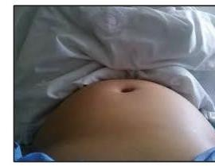
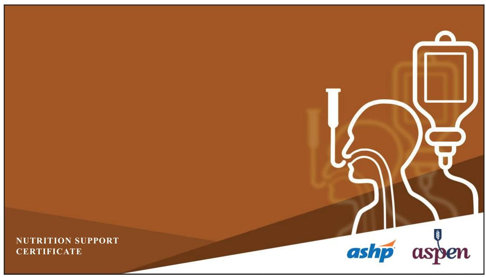

# NUTRITION SUPPORT CERTIFICATE 

## Enteral Feeding

Planned by the American Society of Health-System Pharmacists (ASHP) in collaboration with the American Society for Parenteral and Enteral Nutrition (ASPEN).
(c)2022 American Society of Health-System Pharmacists, Inc. All rights reserved.

No part of this publication may be reproduced or transmitted in any form or by any means, electronic or mechanical, including photocopying, microfilming, and recording, or by any information storage and retrieval system, without written permission from the American Society of Health-System Pharmacists.

--- page 1 ---

# NUTRITION SUPPORT COMPLICATIONS: ENTERAL FEEDING 

Ainsley Malone, M.S., R.D., L.D., CNSC, FASPEN ASPEN
Mt. Carmel Grove City Hospital

NUTRITION SUPPORT CERTIFICATE

## RELEVANT FINANCIAL RELATIONSHIP DISCLOSURE

The following persons in control of this activity's content have relevant financial relationships:

- Jay Mirtallo: Fresenius Kabi, consultant

All other persons in control of content do not have any relevant financial relationships with an ineligible company.

As defined by the Standards of Integrity and Independence definition of ineligible company. All relevant financial relationships have been mitigated prior to the CPE activity.

--- page 2 ---

# LEARNING OBJECTIVES 

- Identify gastrointestinal complications in patients receiving enteral nutrition.
- Recommend strategies for managing gastrointestinal complications in enterally fed patients.
- Assess risk of pulmonary aspiration in patients receiving enteral nutrition.

## ABBREVIATIONS

- EN:
- GI:
- GE:
- GERD:
- GCS:
- GRV:
- FODMAP's:
- HOB:
- ICU:
- MCT:
- RCT:
enteral nutrition
gastrointestinal
gastric emptying
gastroesophageal reflux disease
Glascow coma scale
gastric residual volume
Fermentable, oligo-, di-, monosaccharides and polyols
head of bed
intensive care unit
medium chain triglycerides
randomized controlled trial

--- page 3 ---

# SELF-ASSESSMENT \#1 

Interventions to manage gastroparesis in patients receiving enteral feedings include:
A. Change to a high fiber, high fat enteral formula
B. Decrease feeding volume
C. Change from a continuous feeding to a bolus feeding
D. Increase sedative agent

## SELF-ASSESSMENT \#2

Diarrhea can be defined as:
A. 2 loose stools/day
B. 100 mL liquid stool/day
C. $>500 \mathrm{~mL}$ liquid stool/day
D. $300 \mathrm{~mL} /$ liquid stool/day

--- page 4 ---

# ENTERAL NUTRITION COMPLICATIONS 

- Complications of enteral nutrition related to multiple variables
- Disease or illness
- Treatment side effects
- Types include GI, pulmonary and metabolic
- GI complications
- Nausea, vomiting
- Abdominal distention
- Diarrhea
- Constipation
- Pulmonary: Aspiration

Malone A et al. ASPEN nutrition support core curriculum, 3rd ed. 2017: 265-84.

## ENTERAL NUTRITION AND COMPLICATIONS

- EN tolerance and complications are often used interchangeably
- EN tolerance definitions vary considerably
- Defined by Wang et al. as two or more GI symptoms
- $32 \%$ experienced intolerance
- Blaser et al. defined as "a complex assessment of GI symptoms" vs "a single measurement"

--- page 5 ---

# GASTROINTESTINAL COMPLICATIONS 

Nausea and vomiting:

- Occurrence ranges from 7\%- 26\% of critically ill patients
- Delayed GE most common cause
- Gastroparesis etiologies
- Connective tissue disorders, autoimmune disorders, prior gastric surgery, ischemia, and medications
- Diabetes: Demonstrated 47\% delayed GE in Type I diabetes
- Medications: Narcotics, tricyclic antidepressants, anticholinergics, octreotide, etc.

Malone A et al. ASPEN nutrition support core curriculum. 3rd ed. 2017: 265-84.
Wang K et al. JPEN J Parent Enteral Nutr. 2016; 41:959-67.
Blaser AR et al. Clin Nutr. 2015; 34:956-61.

## DELAYED GASTRIC EMPTYING IN THE ICU

- Hyperglycemia
- Medications (opiates, catecholamines)
- Increased intracranial pressure
- Electrolyte abnormalities
- Ischemia, hypoxia
- Sepsis
- Burns, trauma, surgery
- High fat enteral formulas
- Physiology
- Nguyen et al.
- Demonstrated abnormal proximal and distal gastric motility
- Lower frequency of fundic waves
- Gastric emptying is downregulated earlier in critical illness
- Altered migrating motor complex

--- page 6 ---

# INTERVENTIONS FOR GASTROPARESIS 

- Modification of narcotic medications
- Change enteral formula to a low fiber formula without excessive fat content
- Reduce feeding volume
- Changing feeding administration
- Consider a prokinetic agent

Malone A et al. ASPEN nutrition support core curriculum. 3rd ed. 2017:265-84.

## ABDOMINAL DISTENTION

- Common reason for EN interruption
- May be associated with bloating and cramping
- Etiologies
- Ileus
- Obstruction
- Obstipation
- Diarrhea
- Visual inspection and palpation important for assessment
- Screen GI abnormality with abdominal film
- May require more definitive radiology

--- page 7 ---

# DIARRHEA 

- Most common GI side effect with EN (2\% - 68\% prevalence)
- Standard definition is important
- Normal stool water: $250-500 \mathrm{~mL}$
- $>500 \mathrm{~mL}$ stool/day
- > 3 liquid stools/day
- Often underappreciated
- Disrupts rehabilitation
- Increases risk of skin breakdown
- Increases fluid and electrolyte losses

Brito-Ashurst I et al. JPEN J Parenter Enteral Nutr. 2016; 40:913-23.
Ferrie S et al. Aust Crit Care. 2007; 20:7-13.

## ETIOLOGY OF DIARRHEA

| Osmotic | Secretory |
| :--: | :--: |
| - Undigested nutrients result in a hyperosmolar load   - Watery stool is rapidly evacuated   - Bloating, gas and distention   - Lactose intolerance well known example   - Osmotic gap > 100 mOsm   - Responds well to fasting | - Watery stools without gas, bloating   - Most frequent cause is bacterial invasion of gut   - Does not respond to fasting   - Stool osmotic gap: 50 - 100 mOsm   - Treatment focused on underlying disease process |

--- page 8 ---

# DIARRHEA - TREATMENT STRATEGIES 

- Discontinue offensive medications or diluents
- Hyperosmolar
- Sorbitol - 10-20 grams can lead to GI effects
- Identify source of maldigestion and/or malabsorption and treat accordingly
- Short bowel syndrome, pancreatic exocrine dysfunction, vagotomy
- Alter nutrient form
- Chemically defined nutrients
- Pancreatic enzymes if applicable
- Consider antidiarrheal agent
- Discontinue EN if unable to resolve

Malone A et al. ASPEN nutrition support core curriculum, 3rd ed. 2017:265-84.

## PEPTIDE VS INTACT NUTRIENT FORMULA

- Pilot trial in ICU patients ( $n=49$ )
- RCT comparing peptide (fish oil and MCT) vs standard enteral formula
- Tolerance and EN volume baseline measurements collected and up to 21 days of feeding.
- Results
- Significantly fewer days with adverse events
- Significantly fewer days with undesired GI events
- Significantly fewer days with distention post baseline

--- page 9 ---

# PEPTIDE VS INTACT NUTRIENT FORMULA 

- Pilot trial in ICU patients ( $n=49$ )
- RCT d
"A specialized peptide-based formula containing fish
formula
- Tolerance a feeding.
"A specialized peptide-based formula containing fish oil and MCT in
- Results
enterally fed critically ill patients may predispose to better
- Signifi
gastrointestinal tolerance"
- Significantly fewer days with distention post baseline

Seres DS et al. Clin Nutr. 2017; 36:706-09.

## DIARRHEA AND MALABSORPTION

- Does diarrhea equate to malabsorption?
- Wierdsma et al. Crit Care 2011 (pilot study)
- Validate the diagnostic accuracy of fecal weight as a biomarker for fecal loss
- Assess fecal macronutrient contents
- Stool from 48 patients analyzed
- 10 with $>350$ grams/day; 38 with $<350$ grams/day
- More than 350 grams/day feces was statistically significantly associated with an energy-absorption coefficient of less than $85 \%$

--- page 10 ---

# FIBER AND DIARRHEA 

- Multiple small studies have demonstrated improvement in diarrhea
- Meta-analysis of aggregated data (over 400 subjects) in 17 studies
- No difference in diarrhea in ICU patients receiving dietary fiber
- Reduced diarrhea in non-ICU patients receiving dietary fiber
- Short chain fructo-oligo saccharides may contribute to diarrhea (FODMAP's)
- Especially in those receiving antibiotics impacting intestinal microbiota
- Highly osmotic

McClave SA et al. JPEN J Parenter Enteral Nutr. 2016; 40:159-211.

## ANTI-DIARRHEAL AGENTS

- Once Clostridum difficile ruled out
- Loperamide
- Directly acts on the circular and longitudinal muscles of the intestinal wall to slow motility
- Inhibits fluid and electrolyte secretion and/or increase water absorption
- $2-4 \mathrm{mg}$ for each loose stool (or four times daily)
- Max of $16 \mathrm{mg} /$ day
- Greater effectiveness with scheduled doses
- Clinical improvement within 48 hours

--- page 11 ---

# ANTI-DIARRHEAL AGENTS 

- Diphenoxylate
- Acts locally and centrally on the smooth muscle cells of the GI tract to inhibit GI motility and slow excess GI propulsion
- $2.5-5 \mathrm{mg}$ four times daily
- Maximum of $20 \mathrm{mg} /$ day
- Discontinue with clinical improvement
- Tincture of Opium
- Inhibits peristalsis through opioid receptor stimulation in the GI tract
- $3-6 \mathrm{mg}$ one to four times/day
- Maximum of $24 \mathrm{mg} /$ day

Btaiche I et al. Nutr Clin Pract. 2010; 25:32-49.

## CONSTIPATION

- Difficult to define
- Normal defecation patterns vary
- Dependent on residue and absorption of enteral formula
- Clinical definition
- Accumulation of excess waste in the colon, often up to the transverse colon or even the cecum
- Causes
- Dehydration
- Inadequate or excessive dietary fiber
- Stool softener or cleansing enema maybe considered

--- page 12 ---

# CONSTIPATION 

- Addition of fiber to enteral regimen
- Insoluble module or mixed fiber enteral formula
- May need additional fluid to facilitate regular stool output
- Minimum of 1 mL fluid per enteral calorie intake
- Incidence in critically ill patients
- Observational study in 106 ICU patients ( $>3$ days admission)
- Lack of bowel movement for 3 consecutive days
- 70\% experienced constipation
- Early enteral feedings reduced risk of constipation by $16 \%$ ( $p<0.01$ )

Seres DS et al. Clin Nutr. 2017; 36:706-09.
Nassar AP et al. J Crit Care. 2009; 24(4):630-e9.

## ASPIRATION AND ENTERAL FEEDINGS

- Aspiration is the inhalation of material into the airway
- Assumption that pneumonia can develop from aspiration of enteral feeding
- Relationship between enteral feedings and aspiration is associative
- Progression from aspiration to pneumonia depends on the quantity and the acidity of the formula
- Aspiration pneumonia may account for 5\% to 15\% of pneumonia in hospitalized patients
- Incidence of gastric contents in tracheal secretions: $22 \%$ to $31 \%$

--- page 13 ---

# ASPIRATION RISK FACTORS 

- Low HOB elevation
- Gastric feedings
- Low GCS
- Gastro-esophageal reflux disease
- Use of paralytic agents
- High sedation levels
- Feeding tube malposition
- Transportation within the hospital
- Inadequate nursing staff

McClave SA et al. JPEN J Parenter Enteral Nutr. 2016; 40:159-211.

## GASTRIC RESIDUAL VOLUME ASPIRATION RISK MARKER?

- Historical use of measuring gastric volume during feeding
- Highly subjective
- Not physiologically sound
- Often leads to underfeeding
- Accuracy influenced by many factors
- Tube diameter
- Location of the tube's openings
- Patient positioning
- Skill of the clinician

--- page 14 ---

# GRV COMPARISON WITH ABDOMINAL EXAM \& RADIOLOGY 

Physical Exam

Medominal Radiograph

- Physical exam findings correlate to radiographic findings ( $p=0.016$ )
- GRV failed to correlate with physical exam or radiology findings

McClave SA et al. JPEN J Parenter Enteral Nutr. 1992; 16:99-105.

## GASTRIC RESIDUAL VOLUMES

- Suggest that GRVs not be used as part of routine care to monitor ICU patients receiving EN (L)
- Those ICUs where GRVs are still utilized, holding EN for GRVs $<500 \mathrm{~mL}$ in the absence of other signs of intolerance should be avoided (L)-ASPEN/SCCM 2016 Critical Care Nutrition Guidelines

--- page 15 ---

# PRACTICE ALERT 

- Maintain HOB 30'- 45 unless contraindicated
- Use sedatives sparingly
- Assess feeding tube placement every 4 hours
- Observe for change in external tube
- Assess GI tolerance every 4 hours
- Assess GRV's and abdominal status
- Avoid bolus feedings for those at high aspiration risk

Metheny, NA. Critical Care Nurse. 2016; 36(1):e20-e24.

## ASPIRATION PREVENTION

## ASPEN/SCCM Critical Care Nutrition Guidelines:

- Mechanical ventilation
- Continuous infusion of sedatives
- Paralytic agents and inotropes
- High nasogastric output
- Gastric resection or altered gastric anatomy
- Severe gastroparesis or gastro esophageal reflux
- Supine position
- Neurological deficits or impaired level of consciousness
- Advanced age

McClave SA et al. JPEN J Parenter Enteral Nutr. 1992; 16:99-105.
"Recommend that the level of infusion be diverted lower in the GI tract in those critically ill patients at high risk for aspiration $(\mathrm{M} / \mathrm{H})$."

--- page 16 ---

# ASPIRATION PREVENTION 

- Monitor patients at least every 4 hours for positioning
- Minimize use of sedatives
- Monitor patient status for tolerance
- Abdominal distention or firmness
- High GRV's
- Bloating or nausea
- Monitor tube position at least every 4 hours
- Metheny, 2006 - 201 ICU patients
- 25 patients with malpositioned tubes after 3 days
- Significantly higher incidence of pneumonia

Metheny NA et al. Crit Care Med. 2006; 34:1007-15.

## MONITORING AND REASSESSMENT OF ENTERAL NUTRITION

- Monitoring schedules should be based on clinical status
- EN intolerance in ICU likely to occur 1-3 days following initiation
- Nutrition risk assessment will likely dictate monitoring schedule

Reasons for Intolerance in Blaser Study ( $n=576$ ):

- Abdominal distention ( $n=96$ )
- Subjective discomfort ( $n=46$ )
- Vomiting/emesis or diarrhea ( $n=211$ )
- High gastric residual volume ( $n=355$ )

Symptoms in Gungabissoon Study ( $n=1,712$ ):

- Vomiting ( $n=432$ )
- Absent bowel sounds ( $n=370$ )
- GRV> $500 \mathrm{~mL} / 24$ hours ( $n=176$ )
- Bowel distention ( $n=67$ )
- Diarrhea ( $n=56$ )

--- page 17 ---

# MONITORING AND REASSESSMENT OF ENTERAL NUTRITION 

- Monitoring schedules should be based on clinical status
- EN into
- Nutritio "Patients should be monitored daily for tolerance of EN
Reasons (determined by physical exam, passage of flatus or stool,
Study (n radiologic evaluations and absence of patient complaints
Study (n such as pain or abdominal distention)." ASPEN/SCCM 2016
- Abdom Critical Care Nutrition Guidelines
- Subjed
- Vomiting/emesis or diarrhea ( $n=211$ )
- GRV> 500mL / 24 hours ( $n=176$ )
- High gastric residual volume ( $n=355$ )
- Bowel distention ( $n=67$ )
- Diarrhea ( $n=56$ )

Blaser AR et al. Clin Nutr 2015;34:956-961.
Gungabissoon U et al. JPEN J Parenter Enteral Nutr. 2015; 39:441-48.

## SELF-ASSESSMENT \#1

Interventions to manage gastroparesis in patients receiving enteral feedings include:
A. Change to a high fiber, high fat enteral formula
B. Decrease feeding volume
C. Change from a continuous feeding to a bolus feeding
D. Increase sedative agent

--- page 18 ---

# SELF-ASSESSMENT \#1 

Interventions to manage gastroparesis in patients receiving enteral feedings include:
A. Change to a high fiber, high fat enteral formula
B. Decrease feeding volume
C. Change from a continuous feeding to a bolus feeding
D. Increase sedative agent

## SELF-ASSESSMENT \#2

Diarrhea can be defined as:
A. 2 loose stools/day
B. 100 mL liquid stool/day
C. $>500 \mathrm{~mL}$ liquid stool/day
D. $300 \mathrm{~mL} /$ liquid stool/day

--- page 19 ---

# SELF-ASSESSMENT \#2 

Diarrhea can be defined as:
A. 2 loose stools/day
B. 100 mL liquid stool/day
C. $>500 \mathrm{~mL}$ liquid stool/day
D. $300 \mathrm{~mL} /$ liquid stool/day

## REFERENCES

- Bharucha A, Batey-Schaefer B, Cleary PA et al. Delayed gastric emptying is associated with early and long-term hyperglycemia in type 1 mellitus. Gastroenterology. 2015; 149:330-39.
- Blaser AR, Starkopf L, Deane AM et al. Comparison of different definitions of feeding intolerance: A retrospective observational study. Clin Nutr. 2015; 34:956-61.
- Btaiche I, Neander-Chan L, Pleva M, Kraft MD. Critical illness, gastrointestinal complications, and medication therapy during enteral feeding in critically ill adult patients. Nutr Clin Pract. 2010; 25:32-49.
- Brito-Ashurst I, Presier JC. Diarrhea in critically ill patients. JPEN J Parenter Enteral Nutr. 2016; 40:913.
- DiBardino DM, Wunderink RG. Aspiration pneumonia: a review of modern trends. J Crit Care. 2015; 30:40-8.
- Ferrie S, East V. Managing diarrhea in intensive care. Aust Crit Care. 2007; 20:7-13.
- Gungabissoon U, Mphil KH, Bains C et al. prevalence, risk factors, clinical consequences, and treatment of enteral feed intolerance during critical illness. JPEN J Parenter Enteral Nutr. 2015; 39:441-48.
- Malone A. Seres D, Lord L. Enteral nutrition complications. In: Mueller C, ed. Maryland: ASPEN nutrition support core curriculum. 3rd ed. 2017: 265-84.

--- page 20 ---

# REFERENCES, CONT. 

- McClave SA, Snider HL, Lowen CC et al. Use of residual volume as a marker for enteral feeding intolerance: prospective blinded comparison with physical examination and radiographic findings. JPEN J Parenter Enteral Nutr.1992; 16:99-105.
- McClave SA, Taylor BE, Martindale RG et al. Guidelines for the provision and assessment of nutrition support therapy in the adult critically ill patient. JPEN J Parenter Enteral Nutr. 2016; 40:159-211.
- Metheny, NA. Prevention of Aspiration in Adults. Critical Care Nurse. 2016; 36(1):e20-e24.
- Metheny NA, Clouse RE, Yie-Hwa C et al. Tracheobronchial aspiration of gastric contents in critically ill tube-fed patients: Frequency, outcomes, and risk factors. Crit Care Med. 2006; 34:1007-15.
- Nassar AP, Queiroz de Silva FM, Cleva RD. Constipation in intensive care unit: incidence and risk factors. J Crit Care. 2009; 24(4):630-e9.
- Nguyen, NQ, Fraser, RJ, Bryant, LK et al. Diminished functional association between proximal and distal gastric motility in critically ill patients. Intensive Care Med. 2008; 34:1246-55.
- Poulard F, Dimet J, Martin-Lefevre L et al. Impact of not measuring residual gastric volume in mechanically ventilated patients receiving early enteral feeding. JPEN J Parenter Enteral Nutr. 2010; 34:125-30.

## REFERENCES, CONT.

- Seres DS, Ippolito PR. Pilot study evaluating the efficacy, tolerance and safety of a peptide-based enteral formula versus a high protein enteral formula in multiple ICU settings (medical, surgical, cardiothoracic). Clin Nutr. 2017; 36:706-09.
- Stein B, Everhart KK, Lacy BE. Gasgtroparesis. J Clin Gastroenterol. 2015; 49:550-58.

Bharucha A, Batey-Schaefer B, Cleary PA et al. Delayed gastric emptying is associated with early and long-term hyperglycemia in type 1 diabetes mellitus. Gastroenterology. 2015; 149:330-39.

- Wang K. Mcllroy K, Plank L et al. Prevalence, outcomes, and management of enteral tube feeding intolerance: a retrospective cohort study in a tertiary center. JPEN J Parent Enteral Nutr. 2016; 41:959-67.
- Wierdsma NJ, Peters JH, Weijs PJ et al. Malabsorption and nutritional balance in the ICU: fecal weight as a biomarker: a prospective observational pilot study. Crit Care. 2011; 15:264

--- page 21 ---

NUTRITION SUPPORT CERTIFICATE

--- page 22 ---

# Ainsley Malone, M.S., RDN, L.D., CNSC, FAND, FASPEN 

Clinical Practice Specialist
The American Society for Parenteral and Enteral Nutrition (ASPEN) Nutrition Support Dietitian
Mount Carmel Grove City
Columbus, Ohio
Ainsley Malone is a Dietitian member of the Nutrition Support Team at Mount Carmel Grove City in Columbus, Ohio, where she is involved in managing nutrition care in patients who require enteral and parenteral nutrition. In addition, Ms. Malone serves as a
Clinical Practice Specialist for the American Society for Parenteral and Enteral Nutrition (ASPEN) where she works to guide clinical practice activities for the organization.

Ms. Malone is a certified nutrition support clinician and has given international, national and local presentations on many aspects of nutrition support practice. In addition to her clinical practice activities, Ms. Malone has authored multiple nutrition support related peer reviewed articles and book chapters. Ms. Malone is a fellow of both the Academy of Nutrition and Dietetics and ASPEN and has served in many nutrition leadership capacities including President of ASPEN, and Chairs of the Academy Positions and Evidence Based Practice Committees.

--- page 23 ---

# Relevant Financial Relationship Disclosure

In accordance with our accreditor’s Standards of Integrity and Independence in Accredited Continuing Education, ASHP requires that all individuals in control of content disclose all financial relationships with ineligible companies. An individual has a relevant financial relationship if they have had a financial relationship with ineligible company in any dollar amount in the past 24 months and the educational content that the individual controls is related to the business lines or products of the ineligible company.

An ineligible company is any entity producing, marketing, re-selling, or distributing health care goods or services consumed by, or used on, patients. The presence or absence of relevant financial relationships will be disclosed to the activity audience.

The following persons in control of this activity’s content have relevant financial relationships:

- Phil Ayers: Fresenius Kabi, consultant and speaker
- David Evans: Fresenius Kabi, consultant and speaker; Abbott Laboratories, consultant and speaker; CVS/OptionCare, consultant; Alcresta, consultant and speaker
- Andrew Mays: Fresenius Kabi, speaker
- Jay Mirtallo: Fresenius Kabi, consultant
- Kris Mogensen: Baxter, speaker; ThriveRx, advisory board; Pfizer, advisory board

All other persons in control of content do not have any relevant financial relationships with an ineligible company.

As required by the Standards of Integrity and Independence in Accredited Continuing Education definition of ineligible company, all relevant financial relationships have been mitigated prior to the CPE activity.

# Methods and CE Requirements

This online activity consists of a combined total of 12 learning modules. Pharmacists and physicians are eligible to receive a total of 20 hours of continuing education credit by completing all 12 modules within this certificate.

Participants must participate in the entire activity, complete the evaluation and all required components to claim continuing pharmacy education credit online at ASHP Learning Center http://elearning.ashp.org. Follow the prompts to claim credit and view your statement of credit within 60 days after completing the activity.

# Important Note – ACPE 60 Day Deadline:

Per ACPE requirements, CPE credit must be claimed within 60 days of being earned. To verify that you have completed the required steps and to ensure your credits have been reported to CPE Monitor, check your NABP eProfile account to validate that your credits were transferred successfully before the ACPE 60-day deadline. After the 60 day deadline, ASHP will no longer be able to award credit for this activity.

# System Technical Requirements

Courses and learning activities are delivered via your Web browser and Acrobat PDF. Users should have a basic comfort level using a computer and navigating websites.

View Frequently Asked Questions for more information.