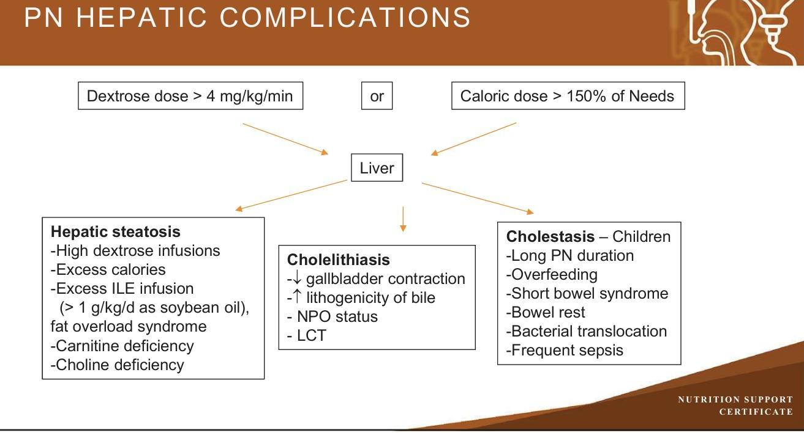
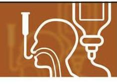
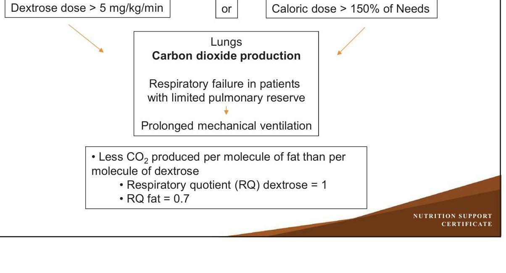
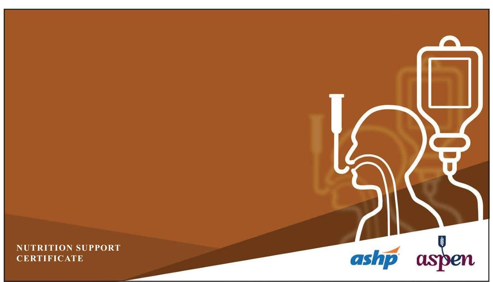

# NUTRITION SUPPORT CERTIFICATE 

## Organ Function Complications of Nutrition Support

Planned by the American Society of Health-System Pharmacists (ASHP) in collaboration with the American Society for Parenteral and Enteral Nutrition (ASPEN).
(c)2022 American Society of Health-System Pharmacists, Inc. All rights reserved.

No part of this publication may be reproduced or transmitted in any form or by any means, electronic or mechanical, including photocopying, microfilming, and recording, or by any information storage and retrieval system, without written permission from the American Society of Health-System Pharmacists.

--- page 1 ---

# ORGAN FUNCTION COMPLICATIONS OF NUTRITION SUPPORT 

Jay M Mirtallo, M.S., R.Ph., BCNSP,FASHP, FASPEN
The Ohio State University College of Pharmacy ASPEN

NUTRITION SUPPORT CERTIFICATE

## RELEVANT FINANCIAL RELATIONSHIP DISCLOSURE

The following persons in control of this activity's content have relevant financial relationships:

- Jay Mirtallo: Fresenius Kabi, consultant

All other persons in control of content do not have any relevant financial relationships with an ineligible company.

As defined by the Standards of Integrity and Independence definition of ineligible company. All relevant financial relationships have been mitigated prior to the CPE activity.

--- page 2 ---

# LEARNING OBJECTIVE 

- Discuss the impact of nutrition support on hepatic, renal and pulmonary function.

## KEY ABBREVIATIONS

- ARF:
- CHO:
- CKD:
- $\mathrm{CO}_{2}$ :
- ILE:
- LCT:
- NPO:
- PN:
- PUFA:
acute renal failure
carbohydrate
chronic kidney disease
carbon dioxide
intravenous lipid emulsion
long chain triglyceride
nothing by mouth
parenteral nutrition
polyunsaturated fatty acids

--- page 3 ---

# KEY ABBREVIATIONS, CONT. 

- QOL:
- RQ:
- T. Bili:
quality of life
respiratory quotient
total bilirubin

## INTRODUCTION

- Nutrition support influences various organ systems and may exacerbate the severity of underlying disease or cause complications if not monitored
- This presentation will discuss the impact nutrition has on hepatic, renal and pulmonary function

--- page 4 ---

# SELF-ASSESSMENT \#1 

JL is a 51 yo male with a gastrointestinal fistula who has been receiving PN at home for 7 weeks and has liver enzyme values measured as follows: ALT 120, AST 205, Alkaline Phosphatase 286, T. Bili 2.3. He is 65 kg and has been receiving a mixed fuel system providing 2600 calories per day, dextrose dose of $5.6 \mathrm{~g} / \mathrm{kg}$ ( 3.9 $\mathrm{mg} / \mathrm{kg} / \mathrm{min}$ ), protein of $1.5 \mathrm{~g} / \mathrm{kg} /$ day and lipids of $1.5 \mathrm{~g} / \mathrm{kg} /$ day. What PN component dose is the most likely contributor to his abnormal liver enzymes?
A. Dextrose
B. Lipids
C. Protein
D. Total Calories

## PN HEPATIC COMPLICATIONS

--- page 5 ---

# PN HEPATIC COMPLICATIONS PREVENTION AND MANAGEMENT 

## - Steatosis

- Avoid overfeeding CHO and calories (Use mixed fuel system including dextrose, amino acids and fat)
- Limit ILE infusions to $<2.5 \mathrm{~g} / \mathrm{kg} / \mathrm{d}$
- Cholelithiasis
- Early oral or enteral nutrition to stimulate gallbladder contraction
- Reduce the load of PUFA and other Long chain fatty acids in PN
- Cholestasis
- Avoid long term PN if possible
- Early initiation of enteral nutrition to stimulate gallbladder contraction and reduce microbial overgrowth and/or translocation
- Limit phytosterol infusions from ILE

## MONITORING HEPATIC FUNCTION

- Mild to moderate elevations in liver enzymes are commonly seen within 2 weeks of the start of PN and subside when it is discontinued
- Liver function should be monitored at baseline and weekly for short term PN and monthly for long term PN (> 1 month duration)
- Enzymes to monitor include
- ALT, AST
- Alkaline Phosphatase
- Bilirubin
- Conjugated $>2 \mathrm{mg} / \mathrm{dl}$ associated with biliary tract damage

--- page 6 ---

# SELF-ASSESSMENT \#2 

A patient with chronic kidney disease receiving hemodialysis is receiving a protein dose in his PN of $0.6 \mathrm{~g} / \mathrm{kg} / \mathrm{d}$. What potential problem/complication is likely to develop in this patient?
A. Elevated BUN and BUN:Cr ratio
B. Uremia
C. Hyperosmolarity
D. Protein malnutrition

## RENAL FUNCTION

- Individuals with compromised renal function present a challenge to the delivery of safe/effective nutrition support due to the diminished regulatory function of the organ affecting
- Fluid and electrolytes (Includes Osmolality)
- Acid base
- Vitamins
- Protein
- In general, renal failure patients have diet restricted in fluid, sodium, potassium, phosphorus
- Protein may or may not be restricted depending on whether the patient is receiving dialysis

--- page 7 ---

# RENAL FUNCTION: MONITORING NS 

- Fluid status:
- Daily weight, intake and outputs
- Electrolytes:
- Especially sodium, potassium and phosphorus
- Phosphorus may need to be provided in a reduced dose in anabolic patients to avoid hypophosphatemia
- ILE is a source of phosphorus and may contribute to hyperphosphatemia
- Acid-base
- Metabolic acidosis is common
- Be sure to include serum $\mathrm{CO}_{2}$ along with serum chemistries

## RENAL FUNCTION: MONITORING NS

Protein

- Protein restriction is only indicated for CKD not receiving dialysis
- Protein losses occur with dialysis increasing requirements to
- Stable patients: 1-1.2 g/kg/d
- Critically ill or ARF: 1.6-2 g/kg/d
- Monitor for complications
- BUN, CR, renal function, BUN/Cr ratio
- Monitor for nutritional efficacy
- Functional status, QOL, response to other medical treatments

--- page 8 ---

# SELF-ASSESSMENT \#3 

A patient with pulmonary dysfunction including carbon dioxide retention is receiving a dextrose based PN formula providing a dextrose infusion rate of $5 \mathrm{mg} / \mathrm{kg} / \mathrm{min}$. Lipids are provided on Monday and Friday in a dose sufficient to prevent essential fatty acid deficiency. He develops hypercapnia and requires intubation. Which of the following PN components is most likely contributing to this condition?
A. Lipid infusions blocking alveoli
B. Excessive calories
C. Excessive dextrose infusion rate
D. Infusion of amino acids (Protein source)

## PULMONARY FUNCTION

- The provision of energy increases oxygen consumption and carbon dioxide production
- In patients with impaired pulmonary function, this could lead to hypercapnea

--- page 9 ---

# PN PULMONARY COMPLICATIONS: HYPERCAPNEA 

## SELF-ASSESSMENT \#1

JL is a 51 yo male with a gastrointestinal fistula who has been receiving PN at home for 7 weeks and has liver enzyme values measured as follows: ALT 120, AST 205, Alkaline Phosphatase 286, T. Bili 2.3. He is 65 kg and has been receiving a mixed fuel system providing 2600 calories per day, dextrose dose of $5.6 \mathrm{~g} / \mathrm{kg}$ (3.9 $\mathrm{mg} / \mathrm{kg} / \mathrm{min}$ ), protein of $1.5 \mathrm{~g} / \mathrm{kg} /$ day and lipids of $1.5 \mathrm{~g} / \mathrm{kg} /$ day. What PN component dose is the most likely contributor to his abnormal liver enzymes?
A. Dextrose
B. Lipids
C. Protein
D. Total Calories

--- page 10 ---

# SELF-ASSESSMENT \#1 

JL is a 51 yo male with a gastrointestinal fistula who has been receiving PN at home for 7 weeks and has liver enzyme values measured as follows: ALT 120, AST 205, Alkaline Phosphatase 286, T. Bili 2.3. He is 65 kg and has been receiving a mixed fuel system providing 2600 calories per day, dextrose dose of $5.6 \mathrm{~g} / \mathrm{kg}$ (3.9 $\mathrm{mg} / \mathrm{kg} / \mathrm{min}$ ), protein of $1.5 \mathrm{~g} / \mathrm{kg} /$ day and lipids of $1.5 \mathrm{~g} / \mathrm{kg} /$ day. What PN component dose is the most likely contributor to his abnormal liver enzymes?
A. Dextrose
B. Lipids
C. Protein
D. Total Calories

## SELF-ASSESSMENT \#2

A patient with chronic kidney disease receiving hemodialysis is receiving a protein dose in his PN of $0.6 \mathrm{~g} / \mathrm{kg} / \mathrm{d}$. What potential problem/complication is likely to develop in this patient?
A. Elevated BUN and BUN:Cr ratio
B. Uremia
C. Hyperosmolarity
D. Protein malnutrition

--- page 11 ---

# SELF-ASSESSMENT \#2 

A patient with chronic kidney disease receiving hemodialysis is receiving a protein dose in his PN of $0.6 \mathrm{~g} / \mathrm{kg} / \mathrm{d}$. What potential problem/complication is likely to develop in this patient?
A. Elevated BUN and BUN:Cr ratio
B. Uremia
C. Hyperosmolarity
D. Protein malnutrition

## SELF-ASSESSMENT \#3

A patient with pulmonary dysfunction including carbon dioxide retention is receiving a dextrose based PN formula providing a dextrose infusion rate $>5 \mathrm{mg} / \mathrm{kg} / \mathrm{min}$. Lipids are provided on Monday and Friday in a dose sufficient to prevent essential fatty acid deficiency. He develops hypercapnia and requires intubation. Which of the following PN components is most likely contributing to this condition?
A. Lipid infusions blocking alveoli
B. Excessive calories
C. Excessive dextrose infusion rate
D. Infusion of amino acids (Protein source)

--- page 12 ---

# SELF-ASSESSMENT \#3 

A patient with pulmonary dysfunction including carbon dioxide retention is receiving a dextrose based PN formula providing a dextrose infusion rate $>5 \mathrm{mg} / \mathrm{kg} / \mathrm{min}$. Lipids are provided on Monday and Friday in a dose sufficient to prevent essential fatty acid deficiency. He develops hypercapnia and requires intubation. Which of the following PN components is most likely contributing to this condition?
A. Lipid infusions blocking alveoli
B. Excessive calories
C. Excessive dextrose infusion rate
D. Infusion of amino acids (Protein source)

## CONCLUSIONS

- The presence of organ dysfunction pose unique issues to the clinician managing nutrition support
- Its important to understand the proper dose of macronutrients and calories in order to minimized physiologic effects on liver, renal and pulmonary function as well as to establish a proper monitoring plan designed to minimize nutrition support complications on the underlying disease process

--- page 13 ---

# REFERENCES 

- Btaiche IF, Khalidi N. Metabolic complications of PN in adults. Part 1. Am J HealthSyst Pharm. 2004; 61:1945.
- Btaiche IF, Khalidi N. Metabolic complications of PN in adults. Part 2. Am J HealthSyst Pharm. 2004; 61:2050-53.
- Kumpf VJ, Gervasio J. Complications of parenteral nutrition. In: Mueller CM, ed. The ASPEN adult core curriculum. 3rd ed. Maryland: ASPEN; 2017:352-55.

--- page 14 ---

Jay M. Mirtallo, M.S., R.Ph, BCNSP, FASHP, FASPEN
The Professor Emeritus
The Ohio State University, College of Pharmacy
Clinical Practice Specialist
American Society for Parenteral and Enteral Nutrition
Delaware, Ohio
As one of the pharmacy specialist pioneers, Professor Mirtallo was instrumental in leading cost-effective practices in parenteral nutrition and advancing the role of the pharmacist on nutrition support services.

Professor Mirtallo has been very active in professional societies and is Past President of the American Society for Parenteral and Enteral Nutrition (ASPEN). He also spent many years on the ASPEN Public Policy Committee, where he advocated for reimbursement of enteral and parenteral nutrition in the hospital and home, dealt with drug shortage issues and worked to improve the safety and efficacy of parenteral nutrition.

As a representative to the Joint Commission, he served on the task force that created the Nutrition Care Standards. Mr. Mirtallo has been actively involved with nutrition support guidelines. Recently, he coauthored an etiology-based definition of malnutrition which is the basis for an inter-professional malnutrition strategy. He chaired a parenteral nutrition safety summit in the fall of 2011 which led to the development of the safety consensus recommendations released by ASPEN and the American Society for Health System Pharmacists. Currently Professor Mirtallo is Professor Emeritus at The Ohio State University, College of Pharmacy, Division of Pharmacy Practice and Administration. He is also a Clinical Practice Specialist with ASPEN.

--- page 15 ---

# Relevant Financial Relationship Disclosure

In accordance with our accreditor’s Standards of Integrity and Independence in Accredited Continuing Education, ASHP requires that all individuals in control of content disclose all financial relationships with ineligible companies. An individual has a relevant financial relationship if they have had a financial relationship with ineligible company in any dollar amount in the past 24 months and the educational content that the individual controls is related to the business lines or products of the ineligible company.

An ineligible company is any entity producing, marketing, re-selling, or distributing health care goods or services consumed by, or used on, patients. The presence or absence of relevant financial relationships will be disclosed to the activity audience.

The following persons in control of this activity’s content have relevant financial relationships:

- Phil Ayers: Fresenius Kabi, consultant and speaker
- David Evans: Fresenius Kabi, consultant and speaker; Abbott Laboratories, consultant and speaker; CVS/OptionCare, consultant; Alcresta, consultant and speaker
- Andrew Mays: Fresenius Kabi, speaker
- Jay Mirtallo: Fresenius Kabi, consultant
- Kris Mogensen: Baxter, speaker; ThriveRx, advisory board; Pfizer, advisory board

All other persons in control of content do not have any relevant financial relationships with an ineligible company.

As required by the Standards of Integrity and Independence in Accredited Continuing Education definition of ineligible company, all relevant financial relationships have been mitigated prior to the CPE activity.

# Methods and CE Requirements

This online activity consists of a combined total of 12 learning modules. Pharmacists and physicians are eligible to receive a total of 20 hours of continuing education credit by completing all 12 modules within this certificate.

Participants must participate in the entire activity, complete the evaluation and all required components to claim continuing pharmacy education credit online at ASHP Learning Center http://elearning.ashp.org. Follow the prompts to claim credit and view your statement of credit within 60 days after completing the activity.

# Important Note – ACPE 60 Day Deadline:

Per ACPE requirements, CPE credit must be claimed within 60 days of being earned. To verify that you have completed the required steps and to ensure your credits have been reported to CPE Monitor, check your NABP eProfile account to validate that your credits were transferred successfully before the ACPE 60-day deadline. After the 60 day deadline, ASHP will no longer be able to award credit for this activity.

# System Technical Requirements

Courses and learning activities are delivered via your Web browser and Acrobat PDF. Users should have a basic comfort level using a computer and navigating websites.

View Frequently Asked Questions for more information.