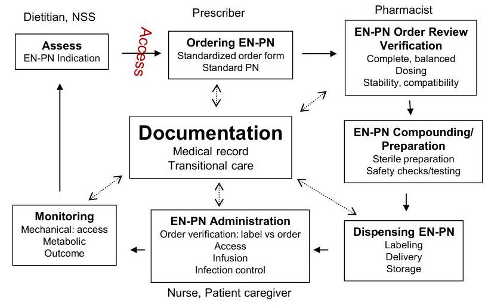

# NUTRITION SUPPORT CERTIFICATE 

## Error Reporting System

Planned by the American Society of Health-System Pharmacists (ASHP) in collaboration with the American Society for Parenteral and Enteral Nutrition (ASPEN).
(c)2022 American Society of Health-System Pharmacists, Inc. All rights reserved.

No part of this publication may be reproduced or transmitted in any form or by any means, electronic or mechanical, including photocopying, microfilming, and recording, or by any information storage and retrieval system, without written permission from the American Society of Health-System Pharmacists.

--- page 1 ---

# ERROR REPORTING SYSTEM 

Jay M. Mirtallo, B.S.Pharm., M.S., BCNSP, FASHP, FASPEN
The Ohio State University, ASPEN

Phil Ayers, Pharm.D., BCNSP, FASHP
Baptist Medical Center, University of Mississippi

NUTRITION SUPPORT CERTIFICATE

## RELEVANT FINANCIAL RELATIONSHIP DISCLOSURE

The following persons in control of this activity's content have relevant financial relationships:

- Phil Ayers: Fersenius Kabi, consultant and speaker
- Jay Mirtallo: Fresenius Kabi: consultant

All other persons in control of content do not have any relevant financial relationships with an ineligible company.

As defined by the Standards of Integrity and Independence definition of ineligible company. All relevant financial relationships have been mitigated prior to the CPE activity.

--- page 2 ---

# LEARNING OBJECTIVES 

- Describe errors and potential errors that may occur with parenteral and enteral nutrition.
- Examine error reporting methods to evaluate error trends that may occur with parenteral and enteral nutrition.
- Explain the importance of reporting errors associated with nutrition support.
- Select appropriate systems and processes for potential safety improvements.

## KEY ABBREVIATIONS

- EN: enteral nutrition
- KCl : potassium chloride
- PN: parenteral nutrition
- ISMP: Institute for Safe Medication Practices
- MERP: Medication Error Reporting Program of ISMP

--- page 3 ---

# DEFINITION 

- MED-MARX ${ }^{\circledR}$ : Subscription-based medication error reporting program.

## SELF-ASSESSMENT \#1

A patient became hyperglycemic when the insulin prescribed in his PN was inadvertently omitted during its preparation. In which step in the parenteral use process did this error occur?
A. Prescribing and order review
B. Verify/review the PN order
C. Administration
D. Compounding and dispensing

--- page 4 ---

# SELF-ASSESSMENT \#2 

The approach to PN ordering in your organization is different between the critical care patients and the patients in the general medical/surgery patient care areas. What approach could be used to reduce the possibility of errors in prescribing and order review for your entire organization?
A. Do nothing, the clinicians are used to the system and there have been no reported errors or patient events
B. Develop an interdisciplinary task force consisting of clinicians from both areas to review the prescribing methods and recommend adoption of 1 method of PN ordering
C. Adopt a standardized approach to reporting and classifying PN-associated errors and near misses to assist in improving your PN system
D. Adopt the ordering method used in the critical care area to the entire organization

## NUTRITION SUPPORT

- Nutrition support is a complicated medical therapy that includes a nutrition care plan, modification of diet based on disease condition, use of dietary supplements and if needed, enteral and parenteral nutrition
- EN and PN are complex treatments
- Involving multiple dosage of nutrients
- Affecting multiple biological processes
- Risk extends beyond their side effects or complications
- Errors in the system

--- page 5 ---

# NUTRITION CARE PROCESS: A SYSTEM OF CARE 

Interdisciplinary care

## HEALTH SYSTEM SAFETY: ERROR REPORTING

- Errors in the system result from:
- Systems issues
- Performance
- Knowledge
- Factors involved with EN/PN errors:
- Nutrition education in health professionals is inconsistent
- EN/PN processes once developed are seldom revised and updated
- Error reporting systems are infrequently present to investigate opportunities for system improvement, modernizing therapy and improving clinician competence in prescribing and managing nutrition therapy

--- page 6 ---

# ERRORS WITH EN SYSTEM 

## - Access

- Misplacement
- Dislodgement
- Administration
- Infuse intravenously or intrathecally
- Medication precipitation within the feeding tube causing a clog
- Loss of enteral access
- Error - interruption in therapy with less than 100\% of ordered dose administered

Boullata JI et al. J Parenter Enter Nutr. 2017; 41(1):15-103.

## EVENTS RELATED TO COMPLEX PARENTERAL NUTRITION SYSTEM

| Event | Age | Outcome | Contributing factors |
| :--: | :--: | :--: | :--: |
| Zinc overdose | Neonate | Death | - Performance deficit:   training not completed   - Compounder safeguards   not used   - Dose assessed for   appropriateness |
| Calcium/Phosphorous   precipitate | Adult | Death,   respiratory   distress | - Improper compounding   sequence |
| Glucose overdose | Pediatric | Death | - Misinterpretation of product   label and order |
| Glucose underdose | Infant | Death | - Final concentration 1.75\%   rather than 17.5\% |

--- page 7 ---

# EVENTS RELATED TO COMPLEX PARENTERAL NUTRITION SYSTEM 

| Event | Age | Outcome | Contributing factors |
| :--: | :--: | :--: | :--: |
| No dextrose in PN | Neonate | Permanent brain damage | Compounding error |
| Iron overload | Pediatric | Liver toxicity | Misinterpretation of label, 50 fold error |
| Hyperkalemia | Child | Death | Manual preparation of PN |
| Hypermagnesemia | Neonate | Toxicity | Compounder malfunction |

Mirtallo JM et al. J Parenter Enter Nutr. 2004; 28(6):S39-S70

## ERRORS WITH PN SYSTEMS: EVIDENCE

- Institute for Safe Medication Practices
- www.ismp.org
- Devoted entirely to medication error prevention and safe medication use
- Medication Error Reporting Program (ISMP-MERP)
- National Database
- PN not considered a medication limits number of reports

--- page 8 ---

# PARENTERAL NUTRITION ERRORS 

- Typical errors (severe-harm)
- Wrong dextrose concentration
- Confusion of 5\% dextrose with concentrated KCl
- Catheter misconnections
- Infusion via epidural catheter
- Insulin/heparin additives - units and dosage designations
- Reported to national database (ISMP-MERP)

Cohen MR. JPEN. 2012; 36:14S-19S

## PARENTERAL NUTRITION ERRORS

- Institute for Safe Medication Practices, MED-MARX ${ }^{\circledR}$ Database
- National, anonymous subscription-based medication error reporting system
- Errors are described and assigned a severity by the individual completing the report

--- page 9 ---

# MED-MARX® DATABASE SEVERITY SCALE

|  Severity | Description  |
| --- | --- |
|  A | Circumstances or events that have the capacity to cause error  |
|   | An Error occurred:  |
|  B | Did not reach the patient  |
|  C | Reached the patient but no resulted in no harm  |
|  D | Required monitoring to confirm that it resulted in no harm and/or required intervention to prevent harm  |
|  E | May have contributed to or resulted in temporary harm or required intervention  |
|  F | Contributed to or resulted in temporary harm and required initial or prolonged hospitalization  |
|  G | Contributed to or resulted in permanent harm  |
|  H | Intervention required to sustain life  |
|  I | Resulted in patient death  |

National Coordinating Council for Medication Error Reporting and Prevention (accessed 2019 Feb 1).

# PN ERRORS REPORTED TO MED-MARX® BY NODE AND INGREDIENT

|  Node | Severity, N A-D | Severity, N E-I | Type  |
| --- | --- | --- | --- |
|  Ordering | 472 | 8 | Improper dose, omission of dose  |
|  Transcribing | 360 | 3 | Omission of dose, prepared incorrectly  |
|  Compounding | 90 | 1 | Deteriorated product, omission  |
|  Administration | 487 | 10 | Expired drug, deteriorated product, omission  |
|  Ingredient |  |  |   |
|  Dextrose | 21 | 3 |   |
|  Fat Emulsion | 254 | 3 |   |
|  Electrolyte | 92 | 2 |   |
|  Other | 74 | 5* | *Preparation, administration, ordering and administration  |

*Insulin was the most frequent in the 'Other' category related to more harmful events.

Storey MA et al. Nutr Clin Pract. 2016; 31(2):211-17.

--- page 10 ---

# KEY ELEMENTS OF MEDICATION USE 

- Patient information
- Drug information
- Adequate communication
- Drug packaging, labeling, and nomenclature
- Medication storage, stock, standardization, and distribution
- Drug device acquisition, use, and monitoring
- Environmental factors
- Staff education and competency
- Patient education
- Quality processes and risk management

Institute for Safe Medication Practices. Key elements of medication use. https://www.ismp.org/ten-key-elements (accessed 2019 Jan 12).

## PN AND ERROR REPORTING

- National Survey revealed 44\% of organizations do not track or are unaware of medication errors related to PN
- $23 \%$ do not have a pharmacist dedicated to review PN orders
- In a gap analysis, estimated frequency of PN-related medication errors was 0-10 errors per month by $52.6 \%$ of respondents completing survey

--- page 11 ---

# COMMON PN ERRORS 

- Improper dose/quantity
- Omission
- Wrong patient
- Wrong time
- Wrong drug
- Preparation

Storey MA et al. Nutr Clin Pract. 2016; 31(2):211-17.

## REPORTING OF PN ERRORS

- Promote safe use of PN
- Error reporting can be used as a mechanism to identify opportunities for improvement in the medication management process
- Provides insight and assist in optimizing improved care in the medication use process

--- page 12 ---

# SELF-ASSESSMENT \#1 

A patient became hyperglycemic when the insulin prescribed in his PN was inadvertently omitted during its preparation. In which step in the parenteral use process did this error occur?
A. Prescribing and order review
B. Verify/review the PN order
C. Administration
D. Compounding and dispensing

## SELF-ASSESSMENT \#1

A patient became hyperglycemic when the insulin prescribed in his PN was inadvertently omitted during its preparation. In which step in the parenteral use process did this error occur?
A. Prescribing and order review
B. Verify/review the PN order
C. Administration
D. Compounding and dispensing

--- page 13 ---

# SELF-ASSESSMENT \#2 

The approach to PN ordering in your organization is different between the critical care patients and the patients in the general medical/surgery patient care areas. What approach could be used to reduce the possibility of errors in prescribing and order review for your entire organization?
A. Do nothing, the clinicians are used to the system and there have been no reported errors or patient events
B. Develop an interdisciplinary task force consisting of clinicians from both areas to review the prescribing methods and recommend adoption of 1 method of PN ordering
C. Adopt a standardized approach to reporting and classifying PN-associated errors and near misses to assist in improving your PN system
D. Adopt the ordering method used in the critical care area to the entire organization

## SELF-ASSESSMENT \#2

The approach to PN ordering in your organization is different between the critical care patients and the patients in the general medical/surgery patient care areas. What approach could be used to reduce the possibility of errors in prescribing and order review for your entire organization?
A. Do nothing, the clinicians are used to the system and there have been no reported errors or patient events
B. Develop an interdisciplinary task force consisting of clinicians from both areas to review the prescribing methods and recommend adoption of 1 method of PN ordering
C. Adopt a standardized approach to reporting and classifying PN-associated errors and near misses to assist in improving your PN system
D. Adopt the ordering method used in the critical care area to the entire organization

--- page 14 ---

# CONCLUSIONS 

- Nutrition is a complex medical process involving multiple disciplines that creates a risk to patients when prescribed
- Using principles of error reporting systems will help organizations to minimize risk of nutrition support while optimizing system performance

## REFERENCES

- Ayers P, Adams S, Boullata JI et al. ASPEN parenteral nutrition safety consensus recommendations. JPEN J Parenter Enter Nutr. 2014; 38(3):296-333.
- Boullata JI, Carrera AL, Harvey L et al. ASPEN safe practices for enteral nutrition. J Parenter Enter Nutr. 2017; 41(1):15-103.
- Boullata JI, Guenter P, Mirtallo JM. A parenteral nutrition use survey with gap analysis. JPEN J Parenter Nutr. 2013; 37(2):212-22.
- Cohen MR, Safe practices for compounding of parenteral nutrition. JPEN J Parenter Enter Nutr. 2012; 36(S2):14S-19S.
- Guenter P, Ayers P, Boullata JI et al. Parenteral nutrition errors and potential errors reported over the past 10 years. Nutr Clin Pract. 2017; 32(6):826-30.

--- page 15 ---

# REFERENCES, CONT. 

- Institute for Safe Medication Practices. Key elements of medication use. https://www.ismp.org/ten-key-elements (accessed 2019 Jan 12).
- Mirtallo JM, Canada T, Johnson D et al. Safe practices for parenteral nutrition. JPEN J Parenter Enter Nutr. 2004; 28(6):S39-S70.
- Story MA, Weber RJ, Besco K et al. An Evaluation of parenteral nutrition errors in an era of drug shortages. Nutr Clin Pract. 2016; 31(2):211-17.
- National Coordinating Council for Medication Error Reporting and Prevention (NCC-MERP). NCC MERP Index for Categorizing Medication Errors. https://www.nccmerp.org/sites/default/files/indexBW2001-06-12.pdf (accessed 2019 Feb 1).

--- page 16 ---

Phil Ayers, Pharm.D., BSNCP, FASHP
Chief, Clinical Pharmacy Services
Mississippi Baptist Medical Center
Clinical Associate Professor, Pharmacy Practice
University of Mississippi
Jackson, Mississippi
Phil Ayers received his Bachelor of Science degree in pharmacy and Doctor of Pharmacy Degree from the University of Mississippi. Dr. Ayers is currently employed by Baptist Medical Center in Jackson, MS. He is a clinical specialist in nutrition support and serves the Department of Pharmacy as Chief of Clinical Pharmacy Services. Dr. Ayers is a Clinical Associate Professor with the School of Pharmacy, University of Mississippi.

Dr. Ayers is currently serving the American Society for Parenteral and Enteral Nutrition (ASPEN) on the Board of Directors as Secretary-Treasurer and Chair of the Parenteral Nutrition Safety Committee. Dr. Ayers is a member of the USP Healthcare, Quality and Safety Council of Experts and current Chair of the USP PN Safety Expert Panel.

Dr. Ayers was awarded the Excellence in Nutrition Support Education Award by ASPEN in 2011 and the Stanley Serlick Award for parenteral nutrition safety in 2016. Phil was named a Fellow by the American Society of Health-System Pharmacists (ASHP) in 2012. He is a Past President of the Mississippi Pharmacist Association, Mississippi Society for Parenteral and Enteral Nutrition and the Mississippi Society of Health-System Pharmacists.

--- page 17 ---

Jay M. Mirtallo, M.S., R.Ph, BCNSP, FASHP, FASPEN
The Professor Emeritus
The Ohio State University, College of Pharmacy
Clinical Practice Specialist
American Society for Parenteral and Enteral Nutrition
Delaware, Ohio
As one of the pharmacy specialist pioneers, Professor Mirtallo was instrumental in leading cost-effective practices in parenteral nutrition and advancing the role of the pharmacist on nutrition support services.

Professor Mirtallo has been very active in professional societies and is Past President of the American Society for Parenteral and Enteral Nutrition (ASPEN). He also spent many years on the ASPEN Public Policy Committee, where he advocated for reimbursement of enteral and parenteral nutrition in the hospital and home, dealt with drug shortage issues and worked to improve the safety and efficacy of parenteral nutrition.

As a representative to the Joint Commission, he served on the task force that created the Nutrition Care Standards. Mr. Mirtallo has been actively involved with nutrition support guidelines. Recently, he coauthored an etiology-based definition of malnutrition which is the basis for an inter-professional malnutrition strategy. He chaired a parenteral nutrition safety summit in the fall of 2011 which led to the development of the safety consensus recommendations released by ASPEN and the American Society for Health System Pharmacists. Currently Professor Mirtallo is Professor Emeritus at The Ohio State University, College of Pharmacy, Division of Pharmacy Practice and Administration. He is also a Clinical Practice Specialist with ASPEN.

--- page 18 ---

# Relevant Financial Relationship Disclosure

In accordance with our accreditor’s Standards of Integrity and Independence in Accredited Continuing Education, ASHP requires that all individuals in control of content disclose all financial relationships with ineligible companies. An individual has a relevant financial relationship if they have had a financial relationship with ineligible company in any dollar amount in the past 24 months and the educational content that the individual controls is related to the business lines or products of the ineligible company.

An ineligible company is any entity producing, marketing, re-selling, or distributing health care goods or services consumed by, or used on, patients. The presence or absence of relevant financial relationships will be disclosed to the activity audience.

The following persons in control of this activity’s content have relevant financial relationships:

- Phil Ayers: Fresenius Kabi, consultant and speaker
- David Evans: Fresenius Kabi, consultant and speaker; Abbott Laboratories, consultant and speaker; CVS/OptionCare, consultant; Alcresta, consultant and speaker
- Andrew Mays: Fresenius Kabi, speaker
- Jay Mirtallo: Fresenius Kabi, consultant
- Kris Mogensen: Baxter, speaker; ThriveRx, advisory board; Pfizer, advisory board

All other persons in control of content do not have any relevant financial relationships with an ineligible company.

As required by the Standards of Integrity and Independence in Accredited Continuing Education definition of ineligible company, all relevant financial relationships have been mitigated prior to the CPE activity.

# Methods and CE Requirements

This online activity consists of a combined total of 12 learning modules. Pharmacists and physicians are eligible to receive a total of 20 hours of continuing education credit by completing all 12 modules within this certificate.

Participants must participate in the entire activity, complete the evaluation and all required components to claim continuing pharmacy education credit online at ASHP Learning Center http://elearning.ashp.org. Follow the prompts to claim credit and view your statement of credit within 60 days after completing the activity.

# Important Note – ACPE 60 Day Deadline:

Per ACPE requirements, CPE credit must be claimed within 60 days of being earned. To verify that you have completed the required steps and to ensure your credits have been reported to CPE Monitor, check your NABP eProfile account to validate that your credits were transferred successfully before the ACPE 60-day deadline. After the 60 day deadline, ASHP will no longer be able to award credit for this activity.

# System Technical Requirements

Courses and learning activities are delivered via your Web browser and Acrobat PDF. Users should have a basic comfort level using a computer and navigating websites.

View Frequently Asked Questions for more information.