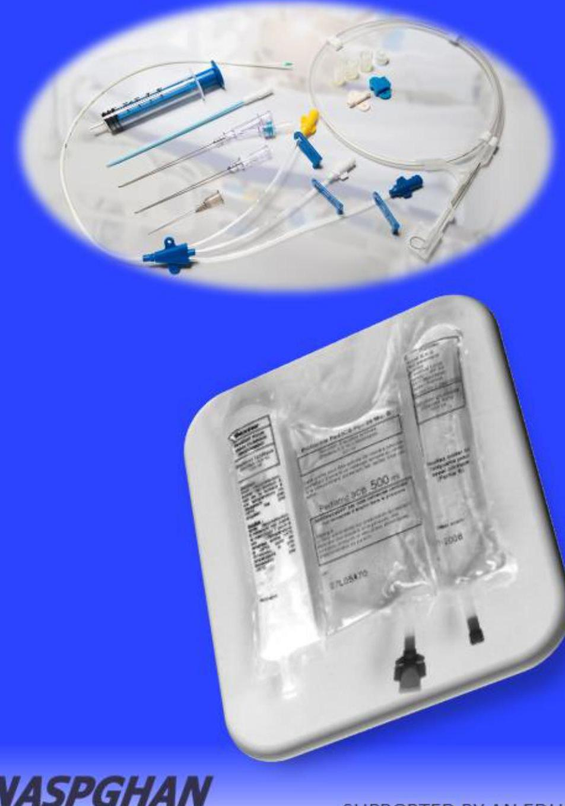

# **Overview of Parenteral Nutrition for the Pediatric Patient**

--- page 1 ---

## COURSE DIRECTOR

Debora Duro, MD, MS
Salah Foundation Children Hospital at
Broward Health, Fort Lauderdale, Florida
NOVA Southeastern University and
Florida International University

## CO-CHAIR

Kathleen Gura, PharmD, BCNSP
Boston Children's Hospital
Harvard Medical School

--- page 2 ---

# FACULTY 

Atu Agawu, MD
Children's Hospital Los Angeles
University of Southern California
Bridget Kiernan, MD
NYU Hassenfeld Children's Hospital
New York University Langone Health
Valerie Marchand, MD
Ste-Justine University Hospital Center
University of Montreal
Danielle Wendel, MD
Seattle Children's Hospital
University of Washington
Justine Turner, MBBS, FRACP, PhD
University of Alberta

Alvin Chan, MD, MPH
Mattel Children's Hospital
University of California
Joanne Lai, MD
Icahn School of Medicine
Mount Sinai Hospital, New York
Nikhil Pai, MD
Children's Hospital of Philadelphia
University of Pennsylvania
Timothy Sentongo, MD
Comer Children's Hospital
University of Chicago
Rebecca Pipkorn, RD, CD, CNSC
Children's Wisconsin

--- page 3 ---

# Faculty Disclosure

|  Atu Agawu | None  |
| --- | --- |
|  Alvin Chan | None  |
|  Debora Duro | Speaker's Bureau: Alcresta, Kate Farms, Abbott Nutrition, Fresenius Kabi  |
|  Kathleen Gura | Advisory Board: NorthSea Therapeutics, B Braun, Baxter  |
|   | Consultant: Fresenius Kabi, NorthSea Therapeutics, Alcresta, Lexicomp ${ }^{\circledR}$, Takeda, Mead Johnson/Reckitt, Otsuko Pharmaceuticals  |
|   | Patents/Royalties: for use of Omegaven ${ }^{\circledR}$  |
|   | Royalties: UpToDate ${ }^{\circledR}$, Lexicomp ${ }^{\circledR}$  |

--- page 4 ---

# Faculty Disclosure - Cont'd

|  Bridget Kiernan | None  |
| --- | --- |
|  Joanne Lai | None  |
|  Valerie Marchand | Speaker's Bureau: Nestlé, Modilac ${ }^{\circledR}$, Abbott  |
|  Nikhil Pai | Speaker's Bureau: Takeda, Abbott  |
|  Rebecca Pipkorn | None  |
|  Timothy Sentongo | None  |
|  Justine Turner | Research Funding: Baxter Healthcare  |
|  Danielle Wendel | None  |

--- page 5 ---

# Abbreviations

|  AKI: acute kidney injury
ALA: $\alpha$-linolenic acid
ARA: arachidonic acid | BMI: body mass index
BCAA: branch chain amino acid | CIF: chronic intestinal failure
CLD: chronic liver disease
CRRT: continuous RRT
CLABSI: central line associated bloodstream infection
CVC: central line catheter  |
| --- | --- | --- |
|  DHA: docosahexaenoic acid
DRI: dietary reference intake | EAR: estimated average requirement
EFA: essential fatty acids
EFAD: essential fatty acid deficiency
EPA: eicosapentaenoic acid
ESRD: end-stage renal | FO-ILE: fish oil-based ILE (Omegaven ${ }^{\circledR}$ )  |
|  GIR: glucose infusion rate
GH: growth hormone | HD: hemodialysis
HTG: hypertriglyceridemia | IFALD: intestinal Failure associated liver disease
IGF: insulin-like growth factor
ILE: intravenous lipid emulsion
I/Os: ins and outs
INR: international normalized ratio  |

--- page 6 ---

# Abbreviations - Cont'd

|  LA: linoleic acid
LCT: long-chain triglycerides
LFT: liver function test | MBD: metabolic bone disease
MCT: medium-chain triglycerides
MET: metabolic equivalents
MMA: methylmalonic acidemia
MSUD: maple syrup urine disease
MVI: multivitamin | Oo: olive oil-based ILE
OO, SO-ILE: olive soy, oil-based ILE (Clinolipid*)  |
| --- | --- | --- |
|  PD: peritoneal dialysis
PICC: peripherally inserted central catheter
PIVKA-II: protein induced in vit. K absence
PIRRT: prolonged intermittent RRT
PN: parenteral nutrition
PT: prothrombin time | RDA: recommended daily allowance
RDR: retinal dose response
RRT: renal replacement therapy | SUN: serum urea nitrogen
SMOF: SO, MCT, OO, FO-ILE
SO-ILE: soy oil-based ILE  |
|  T:T: triene:tetraene ratio | UCD: urea cycle disorders |   |

--- page 7 ---

# Overview 

- History of pediatric parenteral nutrition (PN)
- Clinical indications for PN in the pediatric patient
- Administration routes for PN
- Components of pediatric PN
- Macronutrients
- Micronutrients
- Trace elements

--- page 8 ---

# Case 

- Jerry is a previously healthy 13-year-old male. He was transferred from an outside hospital after undergoing exploratory laparotomy for a complicated perforated appendicitis. Due to extensive lysis of adhesions and inflamed bowel, the decision was made to create an ileostomy 100 cm distal to the ligament of Treitz.
- Since surgery he has been having 75 - $100 \mathrm{~mL} / \mathrm{kg}$ of ostomy output daily. He will be NPO for at least 1 week while receiving IV antibiotics for his intra-abdominal infection secondary to intestinal perforation.

Question: What is the most appropriate way to provide adequate hydration and nutrition to GE?