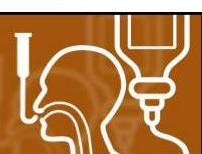
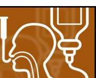
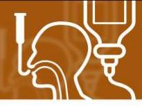

# NUTRITION SUPPORT CERTIFICATE 

## Incorporating Nutrition Into the Therapeutic Plan of Care

## LEA

PLANNED by the American Society of Health-System Pharmacists (ASHP) in collaboration with the American Society for Parenteral and Enteral Nutrition (ASPEN).

[^0]
[^0]:    ©2022 American Society of Health-System Pharmacists, Inc. All rights reserved.
    No part of this publication may be reproduced or transmitted in any form or by any means, electronic or mechanical, including photocopying, microfilming, and recording, or by any information storage and retrieval system, without written permission from the American Society of Health-System Pharmacists.

--- page 1 ---

# INCORPORATING NUTRITION INTO THE THERAPEUTIC PLAN OF CARE 

Pat Worthington, M.S.N., R.N., CNSC

NUTRITION SUPPORT CERTIFICATE

## RELEVANT FINANCIAL RELATIONSHIP DISCLOSURE

The following persons in control of this activity's content have relevant financial relationships:

- Jay Mirtallo: Fresenius Kabi, consultant

All other persons in control of content do not have any relevant financial relationships with an ineligible company.

As defined by the Standards of Integrity and Independence definition of ineligible company. All relevant financial relationships have been mitigated prior to the CPE activity.

--- page 2 ---

# LEARNING OBJECTIVES 

- Review strategies for communicating and documenting nutritional care in the electronic health record.
- Describe ways to address a patient's nutritional needs in response to changes in clinical status across the healthcare continuum.

## KEY ABBREVIATIONS / DEFINITIONS

- CPOE:
- EHR:
- GI
- IPOC:
- OTC:
- PICC
- PN:
computerized provider order entry
electronic health record
gastrointestinal
interdisciplinary plan of care
over the counter
peripherally inserted central catheter
parenteral nutrition

--- page 3 ---

# SELF-ASSESSMENT \#1 

BG is admitted to an acute care facility for management of a small bowel obstruction. The pharmacist notices that his BMI is low and looks to the results of nutrition screening to learn more information about the patient's nutritional status. Which of the following best describes nutrition screening?
A. A tool for determining degree of malnutrition
B. A template for documenting progress toward nutrition goals
C. A means for detecting food intolerance
D. A process for identifying patients at nutritional risk

## SELF-ASSESSMENT \#2

PH is admitted to an acute care facility from a long-term acute care facility. She has a PICC line in place. The medical resident learns that the patient received PN at the previous facility but does not have a copy of the PN prescription. Which of the following describes the best course of action?
A. Send an electronic request for more information to the transferring facility
B. Resume PN with a 1 liter formula to evaluate the patient's response
C. Telephone the transferring facility to clarify the details concerning the patient's PN formula and any issues related to the therapy
D. Delay PN administration for 24-48 hours to assess the patient's metabolic stability

--- page 4 ---

# THE GROUND WORK 

System-based strategies that promote the role of nutrition care:

- Establish organization policies and procedures that address nutritional concerns
- Maintain compliance with accreditation, regulatory, and safety guidelines
- Track quality metrics that focus on nutritional outcomes
- Develop interdisciplinary committees and task forces to address and communicate nutritional issues
- Identify motivated stakeholders as champions across departmental lines

Tappenden KA et al. J Acad Nutr Diet. 2013; 113:1219-37.

## THE GROUND WORK

Foster an organizational culture that recognizes the role of nutrition care:

- Conduct interdisciplinary education and competency assessment
- Implement technological aids to capture documentation of malnutrition and improve communication (CPOE, EHR, secure email and text messaging)
- Provide tools to facilitate documentation of nutrition issues in all team huddles, formal rounds and meetings, such as checklists and note templates with nutrition prompts
- Establish interdisciplinary processes for selecting enteral and parenteral nutrition products

--- page 5 ---

# COMMUNICATING AND DOCUMENTING NUTRITION CARE 

## A THREAD WOVEN THROUGHOUT THE HEALTH RECORD

- No single section of the record is dedicated to nutrition
- The nutrition plan developed serves as the foundation
- Each discipline has specific responsibilities for providing, documenting, and communicating nutrition care
- Awareness of all nutrition elements in the record provides a comprehensive view of the nutrition care plan
- Thorough documentation by each discipline fosters effective nutrition care across the continuum of care

--- page 6 ---

# TRACING THE NUTRITION THREAD THROUGH THE HEALTH RECORD 

Key Elements

- Nutrition Screening
- Nutrition assessment
- History and physical
- Problem list
- Interdisciplinary plan of care
- Data
- Medication profile
- Clinical progress notes
- Discharge/transition summary

## CASE STUDY \#1

- A 42 year old man, with a history of Crohn's disease, was recently discharged from the hospital on post-op day 5 following a small bowel resection
- Prior to surgery the patient reports poor nutritional intake due to nausea, vomiting, and abdominal pain
- At home he experiences abdominal pain and increasing difficulty tolerating his oral diet
- On post-op day 10, he develops drainage from his midline incision
- He is readmitted; work up reveals an enteric fistula

--- page 7 ---

# CASE STUDY \#1: NUTRITION SCREENING 

- The admitting RN records the following information:
- Height: 175 cm
- Weight: 59.5 kg
- Usual weight: 66 kg
- Weight loss represents an $8.4 \%$ decline over 3 weeks
- Patient reports poor intake pre-operatively; has consumed less than $75 \%$ of meals since surgery
- Action: Consult nutrition clinician for full nutritional assessment; reassess every 34 days

## NUTRITION SCREENING

Don't lose the tree for the forest...

- Effective screening depends on recognition of the link between nutrition and poor clinical outcomes: Education is essential
- Typically located within the Nursing Admission History, which also includes screening for MRSA, pain, as well as risk for falls, pressure injury, and suicide
- (EHR placement of information could be institution specific)
- Opportunity for nurses to initiate interdisciplinary collaboration - available to all

--- page 8 ---

# NUTRITION ASSESSMENT 

- Cornerstone of the nutrition care process:
- Performed by nutrition clinician
- Documents the nutritional diagnosis, including severity of malnutrition
- Establishes a plan for nutrition care
- Specifies appropriate nutritional interventions, as indicated
- Highlights priorities for primary healthcare provider
- Outlines monitoring parameters and evaluation criteria
- Informs all aspects of the overall therapeutic plan by identifying need for additional interdisciplinary collaboration, e. g., pharmacy, speech therapy, physical therapy, etc.

White JV et al. JPEN J Parenter Enteral Nutr. 2012; 36:275-83.

## CASE STUDY \#1: HISTORY \& PHYSICAL

- Provides relevant medical information with implications for nutrition status
- History of Crohn's Disease: Inflammatory illness with nutritional implications
- Alterations in nutrient requirements: Impact of inflammation, needs for wound healing
- Location of previous small intestine resections
- Location of current fistula, volume and nature of output
- Results of laboratory tests
- Plan: Keep NPO; provide nutrition support

--- page 9 ---

# PROBLEM LIST 

- Includes results of consults: medical specialties, nutrition, social work, therapists...
- Provides a current, prioritized summary of patient problems and significant health factors. If present, malnutrition should be listed
- Available to all clinicians
- Must be continually updated; editing privileges vary
- Promotes comprehensive care and continuity
- Patient and caregiver input enhances value

## PROBLEM LIST, CONT.

| Status | Problem | Comments | Onset (Date) | Resolved (Date) |
| :-- | :--: | :--: | :--: | :--: |
| Active | Malnutrition | Severe | $3 / 15 / 2019$ |  |
| Active | Crohn's   disease | Controlled with   medication | 2015 |  |
| Inactive | Seasonal   rhinitis | Fall "hayfever" | 2001 |  |
| Resolved | Pressure   injury | Grade 2; left hip | $12 / 2018$ | $3 / 2019$ |

--- page 10 ---

# INTERDISCIPLINARY PLAN OF CARE 

- IPOC: Road map for comprehensive, collaborative care. Opportunity to incorporate nutritional issues or concerns into overall plan of care
- An individualized written plan based on data gathered during assessment
- Builds on problem list; adds goals and specific interventions
- A dynamic document, available for use by all health professionals
- Ongoing updates and revision
- Use to support, not to replace, interpersonal communication

## CASE STUDY \#1: MEDICATION REVIEW

- Patient reports taking anti-inflammatory drugs and biologic agents in past
- Takes ibuprofen for pain, a multivitamin supplement, an herbal supplement, and monthly B12 injections-date of last dose?
- Identifies drug-related issues with potential to impact nutrition status
- Gastrointestinal side effects
- Drug-nutrient interactions
- Alterations in drug or nutrient absorption or activity
- Based on location of fistula, may need to adjust the medication regimen
- Recognizes educational needs

--- page 11 ---

# DATA AND CLINICAL NOTES 

## - Data

- Vital signs
- Results of laboratory tests
- Weight graphs
- Intake and output measurements-fluid balance
- Intake recorded from pump totals vs rate ordered
- Enlist family and patient assistance
- Clinical notes: narrative summaries
- Changes in clinical status
- Appetite changes, meal consumption, nutrition support tolerance
- Progress toward discharge or transitions of care

## COMMUNICATION STRATEGIES FOR EFFECTIVE NUTRITION CARE

- Incorporate elements of the nutrition care plan into the IPOC
- Remain vigilant in monitoring patient progress or changes in clinical status
- Document changes in weight, appetite, missed meals, percent of meal consumed, tolerance of nutrition support interventions
- Maintain accurate intake and output records with oral, enteral, and parenteral nutrition documented separately from intravenous fluid and medications
- Highlight clinical events such as procedures, diagnostic tests, or therapy that interfere with adequate nutritional intake
- Expect input from all disciplines in patient care meetings
- Address nutrition in all rounds, team conferences, and patient care huddles

--- page 12 ---

# DAILY FLOW SHEET CHARTING 

| Review of Systems | $3 / 15 / 19$ |
| :-- | :-- |
| Gastrointestinal System |  |
| No GI conditions identified |  |
| Painful swallowing | $\checkmark$ |
| Abdominal exam: Bowel sounds   present | $\checkmark$ |
| Nausea |  |
| Vomiting |  |
| Diarrhea | $\checkmark$ |
| Constipation |  |
| Date of last bowel movement | $3 / 15$ |
| Incontinence |  |
| Poor appetite | $\checkmark$ |
| GI diversion; fistula |  |
| Acid reflux; heartburn | $\checkmark$ |

- Effective screening involves more than simply checking the box
- Flow sheet charting provides a day-today record of clinical issues
- Re-assess for changes in status throughout hospital stay
- Use clinical judgment to prevent "falling through the cracks"
- Additional pertinent flow sheets

## SEEING THE RED FLAGS

- Weight loss
- Missed or uneaten meals
- Gl symptoms
- Inconsistent tube feeding intake
- "Tube feeding at goal"
- Altered mental status
- Delirium, confusion
- Poor oral hygiene
- Need for assisted feeding

--- page 13 ---

# TYING IT ALL TOGETHER 

- Work as a team to limit fasting periods
- Communicate meal consumption or tolerance of nutrition support interventions
- Refer concerns to RD promptly
- Identify those who need assistance with feeding
- Initiate oral nutrition supplements early; check acceptance, tolerance
- Identify nutrition champions across departmental lines

Jeffries D et al. J. J Clin Nurs. 2011; 20(3-4):317-30.

## PATIENT AND CAREGIVER INVOLVEMENT: BENEFITS

- Provides insight into ethnic, cultural, and spiritual views regarding the relationship between nutrition and illness
- Completes history of dietary intake and eating patterns
- Offers an opportunity to support patient satisfaction with nutrition care
- Establishes realistic goals for nutrition intervention - weight targets, stamina
- Identifies learning needs
- Facilitates discharge planning

--- page 14 ---

# PATIENT AND CAREGIVER INVOLVEMENT: STRATEGIES 

- Incorporate nutritional updates in patient-centered strategies
- Bedside/walking rounds with technology support as needed
- Plan of care rounds (static) with report to patient and family
- Family meetings
- Electronic patient portals

## TRANSITIONS AND HAND-OFFS

- Typical hospitalizations involve numerous transfers: ED $\rightarrow$ ICU $\rightarrow$ stepdown $\rightarrow$ general medical-surgical unit $\rightarrow$ long term acute care $\rightarrow$ rehab $\rightarrow$ home
- Also includes numerous sign-outs, shift reports, etc.
- Potential for ineffective communication and disruption of continuity of care
- Recognized has a high-risk, error-prone occurrence
- Poor preparation and follow up with TF and PN can lead to complications
- Declining nutrition status has been identified as contributing to readmissions

--- page 15 ---

# CASE STUDY \#1, CONT. 

- Oral and enteral nutrition lead to increased fistula output
- A PICC line is placed and patient is started on PN with relatively low dextrose for initial formulation
- At rounds team announces that discharge to home on PN is planned for the next day
- Case manager faxes a copy of the current PN prescription to the home infusion company

## CASE STUDY \#1:   TRANSITIONS AND HANDOFFS

- Identify and address barriers to safe discharge
- PN not yet at goal
- Patient has required supplemental potassium and phosphate since PN started
- Clinician responsible for writing PN orders and reviewing laboratory tests not yet identified
- Patient is also receiving IV antibiotics and pain medication
- Patient and caregiver are surprised to learn of plan for home PN
- Insurance authorization pending

--- page 16 ---

# CASE STUDY \#1, CONT. 

After 8 weeks on PN at home, the patient is readmitted for fistula closure:

- PN Readmission Assessment
- Current PN formula-Verify with home infusion provider
- Weight trends: Appropriateness of macronutrient content
- Laboratory tests: Need to adjust electrolyte content
- Glycemic control
- Hydration status: Appropriateness of current fluid intake
- Medication reconciliation and review
- Patient interview: perceptions of care, adherence to plan

## SOURCES OF ERROR IN TRANSITIONS AND HANDOFFS

- Communication breakdowns
- Failure to send complete documentation
- Inadequate follow-up for missing information
- Accountability breakdowns
- Organizational expectations
- Recognize professional responsibilities
- Teamwork
- Patient education breakdowns
- Time, environment, methods

--- page 17 ---

# FOUNDATIONS FOR EFFECTIVE \& SAFE CARE TRANSITIONS 

- Set expectations for multidisciplinary collaboration in transition care
- Establish working relationships with case managers
- Identify those at risk (medically frail, complex care needs, high-tech care)
- Develop a comprehensive discharge nutrition care plan
- Use standardized processes for communication; do not rely solely on electronic or written reports
- Include medication management
- Use return demonstration, "teach back" methodology in education plan

Joint Commission. https://www.jointcommission.org/hot_topic_toc/ (accessed 2019 Feb 6).

## FOUNDATIONS FOR EFFECTIVE \& SAFE CARE TRANSITIONS, CONT.

- Involve patient and family
- Provide detailed written discharge summary including contact information for all disciplines
- Follow up with discipline-specific oral reports to receiving unit or agency
- PN as a high alert medication requires detailed transition follow-through
- Reinforce the importance of nutrition care and follow-up post-discharge to patient and caregiver

--- page 18 ---

# SELF-ASSESSMENT \#1 

BG is admitted to an acute care facility for management of a small bowel obstruction. The pharmacist notices that his BMI is low and looks to the results of nutrition screening to learn more information about the patient's nutritional status. Which of the following best describes nutrition screening?
A. A tool for determining degree of malnutrition
B. A template for documenting progress toward nutrition goals
C. A means for detecting food intolerance
D. A process for identifying patients at nutritional risk

## SELF-ASSESSMENT \#1

BG is admitted to an acute care facility for management of a small bowel obstruction. The pharmacist notices that his BMI is low and looks to the results of nutrition screening to learn more information about the patient's nutritional status. Which of the following best describes nutrition screening?
A. A tool for determining degree of malnutrition
B. A template for documenting progress toward nutrition goals
C. A means for detecting food intolerance
D. A process for identifying patients at nutritional risk

--- page 19 ---

# SELF-ASSESSMENT \#2 

PH is admitted to an acute care facility from a long-term acute care facility. She has a PICC line in place. The medical resident learns that the patient received PN at the previous facility but does not have a copy of the PN prescription. Which of the following describes the best course of action?
A. Send and electronic request for more information to the transferring facility
B. Resume PN with a 1 liter formula to evaluate the patient's response
C. Telephone the transferring facility to clarify the details concerning the patient's PN formula and any issues related to the therapy
D. Delay PN administration for 24-48 hours to assess the patient's metabolic stability

## SELF-ASSESSMENT \#2

PH is admitted to an acute care facility from a long-term acute care facility. She has a PICC line in place. The medical resident learns that the patient received PN at the previous facility but does not have a copy of the PN prescription. Which of the following describes the best course of action?
A. Send and electronic request for more information to the transferring facility
B. Resume PN with a 1 liter formula to evaluate the patient's response
C. Telephone the transferring facility to clarify the details concerning the patient's PN formula and any issues related to the therapy
D. Delay PN administration for 24-48 hours to assess the patient's metabolic stability

--- page 20 ---

# CONCLUSIONS 

- Nutrition: An intersection between medicine, dietetics, nursing, pharmacy and other disciplines
- Promote awareness within the organization of current guidelines and recommendations
- Define each clinician's role to include nutritional responsibilities
- Set expectations regarding comprehensive documentation

Tappenden KA et al. J Acad Nutr Diet. 2013; 113:1219-37

## REFERENCES

- Agency for Healthcare Research and Quality. Engaging Patients and Families in Their Health Care. Rockville, MD: Agency for Healthcare Research and Quality; 2018 Apr. http://www.ahrq.gov/professionals/quality-patient-safety/patient-familyengagement/index.html (accessed 2019 Feb 6).
- Agency for Healthcare Research and Quality. Patient Safety and Quality: An Evidence-Based Handbook for Nurses. Rockville, MD: Agency for Healthcare Research and Quality; 2008 Apr. AHRQ Publication No. 08-0043.
- Downes JM, O'Neal KS, Miller MJ et al. Identifying opportunities to improve medication management in transitions of care. Am J Health Syst Pharm. 2015; 72(17):S58-69.

--- page 21 ---

# REFERENCES, CONT. 

- Jeffries D, Johnson, ML, Ravens J. Nurturing and nourishing: the nurses' role in nutritional care. J Clin Nurs. 2011; 20(3-4):317-30.
- Labson, M. Innovative and successful approaches to improving care transitions from hospital to home. Home Healthcare Now. 33(2):88.
- Mogensen KM, Horkan CM, Purtle SW et al. Malnutrition, Critical Illness Survivors, and Postdischarge Outcomes: a Cohort Study. JPEN J Parenter Enteral Nutr. 2018; 42(3):557-65.
- Tappenden KA, Quatrara B, Parkhurst ML et al. The critical role of nutrition in improving quality of care: An interdisciplinary call to action to address adult hospital malnutrition. J Acad Nutr Diet. 2013; 113:1219-37.

## REFERENCES, CONT.

- The Joint Commission. Transitions of Care: The need for collaboration across entire care continuum (2013). https://www.jointcommission.org/hot_topic_toc/ (accessed 2019 Feb 6).
- The Joint Commission Center for Transforming Healthcare. Improving transitions of care: Hand-off communications. Oakbrook Terrace, IL: The Joint Commission; 2014.
- Ukleja A, Freeman KL, Gilbert K et al. Standards for Nutrition Support: Adult Hospitalized Patients. Nutr Clin Pract. 2018; 33(6):906-20.
- White JV et al. Consensus Statement: Academy of Nutrition and Dietetics and American Society for Parenteral and Enteral Nutrition: Characteristics Recommended for the Identification and Documentation of Adult Malnutrition (Undernutrition). JPEN J Parenter Enteral Nutr. 2012; 36:275-83.

--- page 22 ---

NUTRITION SUPPORT CERTIFICATE

--- page 23 ---

Patricia Worthington, R.N., M.S.N., CNSC
Retired
Previously: Nutrition Support Clinical Nurse Specialist
Thomas Jefferson University Hospital
Philadelphia, Pennsylvania

Patricia Worthington recently retired from her position as Nutrition Support Clinical Nurse Specialist on a multidisciplinary nutrition support service at Thomas Jefferson University Hospital in Philadelphia, PA, where in addition to her clinical work, she participated in multidisciplinary quality and safety committees related to Nutrition Support, management of intravenous devices and enteral access devices.

Throughout her career Ms. Worthington has had extensive involvement with the Nutrition Support organizations. For a number of years, she served on the National Board for Nutrition Support Certification, working to ensure the exam remained current and clinically relevant to the practice of Nutrition Support Nursing. In addition, she has held a variety of roles within the American Society for Parenteral and Enteral Nutrition (ASPEN). These roles include Chair of the Nursing Practice Section and member of numerous committees and task forces such as the Nursing Standards Committee, Professional Practice Committee, the editorial board for Nutrition in Clinical Practice, and section editor of the 2nd edition of the ASPEN Nutrition Support Core Curriculum, associate editor of the ASPEN Clinical Guidelines Editorial Board, and member of the Parenteral Nutrition Safety Task Force, and an author of the ASPEN Parenteral Nutrition Safety Consensus Recommendations.

Ms. Worthington has published numerous book chapters and papers in peer-reviewed journals and is author of the nursing text entitled, Practical Aspects of Nutrition Support: An Advanced Practice Guide. She served as chair for the multidisciplinary ASPEN Parenteral Nutrition Appropriateness Task Force, and is lead author of the ASPEN consensus recommendations When is PN Appropriate?, published in JPEN in March 2017. Most recently, she was appointed to the ASPEN Board of Directors in July 2018.

--- page 24 ---

# Relevant Financial Relationship Disclosure

In accordance with our accreditor’s Standards of Integrity and Independence in Accredited Continuing Education, ASHP requires that all individuals in control of content disclose all financial relationships with ineligible companies. An individual has a relevant financial relationship if they have had a financial relationship with ineligible company in any dollar amount in the past 24 months and the educational content that the individual controls is related to the business lines or products of the ineligible company.

An ineligible company is any entity producing, marketing, re-selling, or distributing health care goods or services consumed by, or used on, patients. The presence or absence of relevant financial relationships will be disclosed to the activity audience.

The following persons in control of this activity’s content have relevant financial relationships:

- Phil Ayers: Fresenius Kabi, consultant and speaker
- David Evans: Fresenius Kabi, consultant and speaker; Abbott Laboratories, consultant and speaker; CVS/OptionCare, consultant; Alcresta, consultant and speaker
- Andrew Mays: Fresenius Kabi, speaker
- Jay Mirtallo: Fresenius Kabi, consultant
- Kris Mogensen: Baxter, speaker; ThriveRx, advisory board; Pfizer, advisory board

All other persons in control of content do not have any relevant financial relationships with an ineligible company.

As required by the Standards of Integrity and Independence in Accredited Continuing Education definition of ineligible company, all relevant financial relationships have been mitigated prior to the CPE activity.

# Methods and CE Requirements

This online activity consists of a combined total of 12 learning modules. Pharmacists and physicians are eligible to receive a total of 20 hours of continuing education credit by completing all 12 modules within this certificate.

Participants must participate in the entire activity, complete the evaluation and all required components to claim continuing pharmacy education credit online at ASHP Learning Center http://elearning.ashp.org. Follow the prompts to claim credit and view your statement of credit within 60 days after completing the activity.

# Important Note – ACPE 60 Day Deadline:

Per ACPE requirements, CPE credit must be claimed within 60 days of being earned. To verify that you have completed the required steps and to ensure your credits have been reported to CPE Monitor, check your NABP eProfile account to validate that your credits were transferred successfully before the ACPE 60-day deadline. After the 60 day deadline, ASHP will no longer be able to award credit for this activity.

# System Technical Requirements

Courses and learning activities are delivered via your Web browser and Acrobat PDF. Users should have a basic comfort level using a computer and navigating websites.

View Frequently Asked Questions for more information.