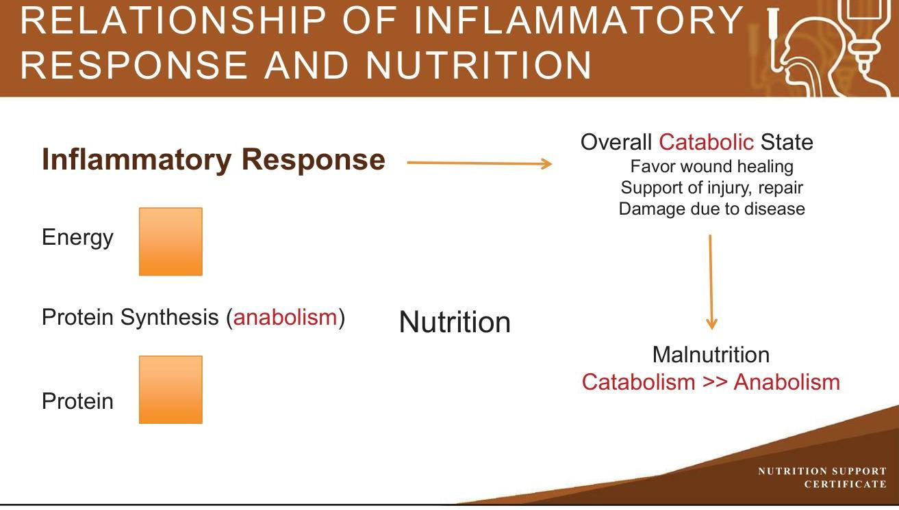

# NUTRITION SUPPORT CERTIFICATE 

## Interrelations Between Disease and Nutrition

LEADING THE SCIENCE AND PRACTICE OF CLINICAL NUTRITION

## Planned by the American Society of Health-System Pharmacists (ASHP) in collaboration with the American Society for Parenteral and Enteral Nutrition (ASPEN).

©2022 American Society of Health-System Pharmacists, Inc. All rights reserved.
No part of this publication may be reproduced or transmitted in any form or by any means, electronic or mechanical, including photocopying, microfilming, and recording, or by any information storage and retrieval system, without written permission from the American Society of Health-System Pharmacists.

--- page 1 ---

# INTERRELATIONS BETWEEN DISEASE AND NUTRITION 

Jay M Mirtallo, M.S., R.Ph., BCNSP, FASHP, FASPEN
The Ohio State University College of Pharmacy ASPEN

NUTRITION SUPPORT CERTIFICATE

## RELEVANT FINANCIAL RELATIONSHIP DISCLOSURE

The following persons in control of this activity's content have relevant financial relationships:

- Jay M. Mirtallo: Fresenius Kabi, consultant

All other persons in control of content do not have any relevant financial relationships with an ineligible company.

As defined by the Standards of Integrity and Independence definition of ineligible company. All relevant financial relationships have been mitigated prior to the CPE activity.

--- page 2 ---

# LEARNING OBJECTIVES 

- Differentiate between disease and nutritional issues in specific disease states.
- Select appropriate nutrition interventions to mitigate disease specific consequences on clinical outcomes.

## KEY ABBREVIATIONS

- Ca:
- EN:
- GUT or GI:
- LBM:
- Mg :
- NPO:
- PN:
- SBS:
- SAP:
- SIRS:
- Zn : calcium
enteral nutrition
gastrointestinal tract
lean body mass
magnesium
nil per os, nothing by mouth
parenteral nutrition
short bowel syndrome
severe acute pancreatitis
systemic inflammatory response syndrome
zinc

--- page 3 ---

# DEFINITIONS 

- Short Bowel Syndrome: Inadequate absorptive capacity for sustenance with normal diet
- Intestinal Failure: Inadequate absorptive capacity for sustenance

## SELF-ASSESSMENT \#1

SG is admitted to the intensive care unit with a severe intra-abdominal infection following an intestinal resection for Crohn's disease. He is hemodynamically unstable and requires mechanical ventilation due to poor oxygenation of vital organs and tissues. What would be the best approach to nutrition support in this condition?
A. Initiate enteral feeding as soon as possible
B. Initiate parenteral nutrition until enteral feeding access can be obtained
C. Nutrition is not an issue in this patient
D. Withhold nutrition support until the patient stabilizes (within 24-48 hours)

--- page 4 ---

# SELF-ASSESSMENT \#2 

SM is admitted to the intensive care unit with severe acute pancreatitis. What nutrition approach could potentially attenuate the systemic inflammatory response thereby reducing the risk of complications and mortality?
A. Initiate enteral feeding as soon as possible
B. Initiate parenteral nutrition until enteral feeding access can be obtained
C. Nutrition is not an issue in this patient
D. Withhold nutrition support until the patient stabilizes (within 24-48 hours)

## INFLAMMATION

- Inflammation is common to diseases requiring nutrition support and predispose to malnutrition via:
- Anorexia, altered intake
- Increased nutrient losses - gastrointestinal disorders
- Nausea, vomiting
- Fistulas - abnormal communication with two or more organs
- Gastroduodenal - stomach to duodenum
- Nutrient intake may be adequate but poor utilization due to:
- Hyper- or altered metabolism

--- page 5 ---

# METABOLIC RESPONSE TO INJURY 

| Physiologic Function | Response | Nutritional consequence |
| :--: | :--: | :--: |
| Energy expenditure | $\uparrow \uparrow \uparrow$ | Expenditure in excess of energy intake creating Energy deficit |
| Catabolism - protein breakdown | $\uparrow \uparrow \uparrow$ | Breakdown in excess of intake or synthesis creating $\downarrow$ in LBM |
| Protein synthesis | No Change or $\uparrow$ | Change out of proportion with catabolism |

## METABOLIC RESPONSE TO INJURY

| Physiologic Function | Response | Nutritional consequence |
| :--: | :--: | :--: |
| Ureagenesis (protein waste) | $\uparrow \uparrow$ | Limited tolerance to protein doses required to offset protein catabolism |
| Gluconeogenesis | $\uparrow \uparrow \uparrow$ | Glucose difficult to control, creates worse outcomes from illness |
| Response to feeding | $\downarrow \downarrow$ | Nutritional response dictated by injury response - use nutrients as fuel and healing injury rather than sustaining LBM |

--- page 6 ---

# RELATIONSHIP OF INFLAMMATORY RESPONSE AND NUTRITION 

## CRITICAL CARE AND SURGERY

- Marked elevation of energy expenditure, protein catabolism and mobilization of fat for use as an energy source
- Predisposition to hyperglycemia, hypertriglyceridemia and azotemia
- Poor tolerance to nutrition support
- Metabolic support - provide enough substrate to prevent nutrient deficiency or protein/calorie malnutrition until the patient stabilizes and may better utilize infused nutrients
- Accentuated loss of LBM and shortened time to develop malnutrition

--- page 7 ---

# CRITICAL CARE 

- Severe sepsis - shock
- Dysautoregulation or aberrant metabolism where infusion of nutrients may be harmful
- Clinical application: withhold or withdraw nutrition support
- Unstable ICU patient unable to maintain blood pressure or tissue oxygenation
- Hold nutrition support (EN, PN) during major operative procedures
- Acute emergency requiring resuscitation (code)
- Discontinue EN/PN until condition stabilizes

Martindale RG et al. The ASPEN adult nutrition support core
NUTRITION SUPPORT
curriculum. 3rd ed. 2017:458-59.

## CRITICAL CARE

- Important to recognize transition of care responsibilities when patient moves to or from critical care
- Assume there is a change in the requirement for calories and protein as well as the proportion of calories from carbohydrate, lipid and protein
- Likely increased when transfer to and decreased when discharged from critical care

--- page 8 ---

# CANCER CACHEXIA (PROGRESSIVE INVOLUNTARY WEIGHT LOSS) 

- Metabolic abnormalities
- Carbohydrate
- Protein
- Fat
- Clinical Features
- Tissue wasting
- Anorexia
- Skeletal muscle atrophy
- Anergy
- Fatigue
- Anemia
- Hypoalbuminemia

## CANCER CACHEXIA, CONT.

- Causes
- Anorexia
- Mechanical factors affecting the GI tract from tumors
- Side effects of surgery, chemotherapy, radiation therapy
- Alterations in intermediary and energy metabolism
- Changes in host cytokine and hormonal milieu
- Lean Body Mass = Survival

--- page 9 ---

# CANCER: PREVALENCE OF MALNUTRITION 

- $50 \%$ of patients with cancer present with weight loss at diagnosis
- Unintentional weight loss depletes the LBM
- Weight loss correlates with decreased performance status and survival following chemotherapy

| Characteristic | \% Wt Loss | Type of Cancer |
| :--: | :--: | :--: |
| Lowest | $31-40$ | Sarcoma, breast, hematologic |
| Intermediate | $54-64$ | Colon, prostate, lung |
| Highest | $>80$ | Pancreas, gastric |

Dewys WD et al. Am J Med. 1980; 69(9):491-97.

## MALNUTRITION IN CANCER

- Affected by:
- Tumor type, location, grade and stage
- Anticancer treatment
- Patient characteristics
- Age, gender
- Comorbidities: diabetes, intestinal disorders
- Associated with longer hospital stay, $\uparrow$ cost and $\uparrow$ morbidity/mortality

--- page 10 ---

# NUTRITION SUPPORT IN CANCER: ETHICAL CONSIDERATIONS 

- Due to metabolic abnormalities present in cancer patients, the use of nutrition support in those who no longer respond to cancer treatment usually becomes an ethical issue concerning withholding or withdrawing therapy
- Benefits versus Risk
- Patient - family considerations
- Social situation versus medical benefit
- Informed consent

Schwartz DB et al. The ASPEN adult nutrition support core curriculum. 3rd ed. 2017:785-804.

## ACUTE PANCREATITIS

- Disease progression and phases
- Inflammatory process initiated by intra-acinar activation of proteolytic enzymes causing auto digestion of the pancreatic gland.
- Local or systemic presence of disease relevant to prognosis
- An acute inflammatory reaction involving cytokines
- Initial phase is local and presents as abdominal pain
- Systemic phase induced by the inflammatory response develops over 13 days
- Severity of this phase (SIRS) influences the outcome of acute pancreatitis

--- page 11 ---

# OVERVIEW OF NUTRITION IN PANCREATITIS 

- Severe Acute Pancreatitis usually requires nutrition support
- Disease manifestations complicate the delivery, utilization and beneficial effects of nutrients
- Barriers to implementing best practices for nutrition in pancreatitis
- 'GUT' rest
- Recommendations for specific enteral tube placement
- Metabolic complications of nutrition therapy
- Therapeutic Objectives
- Attenuate Inflammatory response
- Prevent or treat malnutrition

## NUTRITION MANAGEMENT IN SAP

- Metabolic disturbances are common in pancreatitis
- Hyperglycemia - 40-90\%
- Hypertriglyceridemia - 12-15\%
- Hypocalcemia - present due to reduced parathyroid function, increased calcitonin levels, reduced magnesium and possibly saponification with unabsorbed free fatty acids in the GI

--- page 12 ---

# NUTRITION SUPPORT IN SEVERE ACUTE PANCREATITIS 

- 'GUT' rest and NPO is no longer considered the primary treatment.
- PN should be avoided and only used if EN is not feasible
- Persistent gastric ileus or small bowel obstruction and enteral access not possible
- Exacerbation of pancreatic symptoms despite nasojejunal delivery and use of elemental formula
- Gastrointestinal intolerance - abdominal pain, ascites, elevated pancreatic fistula output

## SHORT BOWEL SYNDROME

Surgical Resection

- SB length
- 100-120 cm without a colon
- 50 cm with colon
- Etiology
- Crohn's
- Volvulus
- Trauma
- Malignancy
- Radiation enteritis

--- page 13 ---

# CLINICAL CONSEQUENCES OF SBS 

- Jejunal resection of 50-60\% well tolerated
- $>30 \%$ ileal resection poorly tolerated
- Severe malabsorption with residual bowel $<60 \mathrm{~cm}$
- Deficiencies fluid and electrolytes
- Severe fluid and electrolyte loss with end jejunostomy
- $\mathrm{Mg}, \mathrm{Ca}, \mathrm{Zn}$ deficiencies are common

## NUTRITIONAL ISSUES

- Need for long-term and often life-time nutrition support with parenteral nutrition or combined oral/parenteral nutrition
- Nutrition assessment must be comprehensive with an awareness of increased probability of nutritional deficiencies
- Transitions of care are important when patient moves between healthcare settings (hospital - home, extended care facility, or ICU - general ward, home or extended care facility to hospital or ICU)
- For home parenteral nutrition patients with central venous catheter infections and prolonged periods of no nutrition due to loss of venous access, electrolyte, acid-base and/or micronutrient deficiencies are likely

--- page 14 ---

# SELF-ASSESSMENT \#1 

SG is admitted to the intensive care unit with a severe intra-abdominal infection following an intestinal resection for Crohn's disease. He is hemodynamically unstable and requires mechanical ventilation due to poor oxygenation of vital organs and tissues. What would be the best approach to nutrition support in this condition?
A. Initiate enteral feeding as soon as possible
B. Initiate parenteral nutrition until enteral feeding access can be obtained
C. Nutrition is not an issue in this patient
D. Withhold nutrition support until the patient stabilizes (within 24-48 hours)

## SELF-ASSESSMENT \#1

SG is admitted to the intensive care unit with a severe intra-abdominal infection following an intestinal resection for Crohn's disease. He is hemodynamically unstable and requires mechanical ventilation due to poor oxygenation of vital organs and tissues. What would be the best approach to nutrition support in this condition?
A. Initiate enteral feeding as soon as possible
B. Initiate parenteral nutrition until enteral feeding access can be obtained
C. Nutrition is not an issue in this patient
D. Withhold nutrition support until the patient stabilizes (within 24-48 hours)

--- page 15 ---

# SELF-ASSESSMENT \#2 

SM is admitted to the intensive care unit with severe acute pancreatitis. What nutrition approach could potentially attenuate the systemic inflammatory response thereby reducing the risk of complications and mortality?
A. Initiate enteral feeding as soon as possible
B. Initiate parenteral nutrition until enteral feeding access can be obtained
C. Nutrition is not an issue in this patient
D. Withhold nutrition support until the patient stabilizes (within 24-48 hours)

## SELF-ASSESSMENT \#2

SM is admitted to the intensive care unit with severe acute pancreatitis. What nutrition approach could potentially attenuate the systemic inflammatory response thereby reducing the risk of complications and mortality?
A. Initiate enteral feeding as soon as possible
B. Initiate parenteral nutrition until enteral feeding access can be obtained
C. Nutrition is not an issue in this patient
D. Withhold nutrition support until the patient stabilizes (within 24-48 hours)

--- page 16 ---

# CONCLUSIONS 

- Inflammation is common to all disease states which predisposes to malnutrition and impedes the response to nutrient administration
- Individual diseases may elicit unique contributions to the development of malnutrition that require recognition and adjustments to the nutrition care plan
- Certain conditions where nutrition may not be as beneficial and risk is high may warrant either withholding or withdrawing nutrition support

## REFERENCES

- Dewys WD, Begg C, Lavin PT et al. Prognostic effect of weight loss prior to chemotherapy in cancer patients. Am J Med. 1980; 69(9):491-97.
- Evans DC, Collier BR. Trauma, surgery and burns. In: Mueller C, ed. The ASPEN adult nutrition support core curriculum. 3rd ed. Maryland: The American Society for Parenteral and Enteral Nutrition; 2017:474-76.
- Martindale RG, Patel JJ, Herron TJ, Codner PA. Sepsis and critical illness. In: Mueller C, ed. The ASPEN adult nutrition support core curriculum. 3rd ed. Maryland: The American Society for Parenteral and Enteral Nutrition; 2017:45859.

--- page 17 ---

# REFERENCES, CONT. 

- Schwartz DB, Barrocas A. Ethics and law. In: Mueller C, ed. The ASPEN adult nutrition support core curriculum. 3rd ed. Maryland: The American Society for Parenteral and Enteral Nutrition; 2017:785-804.

--- page 18 ---

Jay M. Mirtallo, M.S., R.Ph, BCNSP, FASHP, FASPEN
The Professor Emeritus
The Ohio State University, College of Pharmacy
Clinical Practice Specialist
American Society for Parenteral and Enteral Nutrition
Delaware, Ohio
As one of the pharmacy specialist pioneers, Professor Mirtallo was instrumental in leading cost-effective practices in parenteral nutrition and advancing the role of the pharmacist on nutrition support services.

Professor Mirtallo has been very active in professional societies and is Past President of the American Society for Parenteral and Enteral Nutrition (ASPEN). He also spent many years on the ASPEN Public Policy Committee, where he advocated for reimbursement of enteral and parenteral nutrition in the hospital and home, dealt with drug shortage issues and worked to improve the safety and efficacy of parenteral nutrition.

As a representative to the Joint Commission, he served on the task force that created the Nutrition Care Standards. Mr. Mirtallo has been actively involved with nutrition support guidelines. Recently, he coauthored an etiology-based definition of malnutrition which is the basis for an inter-professional malnutrition strategy. He chaired a parenteral nutrition safety summit in the fall of 2011 which led to the development of the safety consensus recommendations released by ASPEN and the American Society for Health System Pharmacists. Currently Professor Mirtallo is Professor Emeritus at The Ohio State University, College of Pharmacy, Division of Pharmacy Practice and Administration. He is also a Clinical Practice Specialist with ASPEN.

--- page 19 ---

# Relevant Financial Relationship Disclosure

In accordance with our accreditor’s Standards of Integrity and Independence in Accredited Continuing Education, ASHP requires that all individuals in control of content disclose all financial relationships with ineligible companies. An individual has a relevant financial relationship if they have had a financial relationship with ineligible company in any dollar amount in the past 24 months and the educational content that the individual controls is related to the business lines or products of the ineligible company.

An ineligible company is any entity producing, marketing, re-selling, or distributing health care goods or services consumed by, or used on, patients. The presence or absence of relevant financial relationships will be disclosed to the activity audience.

The following persons in control of this activity’s content have relevant financial relationships:

- Phil Ayers: Fresenius Kabi, consultant and speaker
- David Evans: Fresenius Kabi, consultant and speaker; Abbott Laboratories, consultant and speaker; CVS/OptionCare, consultant; Alcresta, consultant and speaker
- Andrew Mays: Fresenius Kabi, speaker
- Jay Mirtallo: Fresenius Kabi, consultant
- Kris Mogensen: Baxter, speaker; ThriveRx, advisory board; Pfizer, advisory board

All other persons in control of content do not have any relevant financial relationships with an ineligible company.

As required by the Standards of Integrity and Independence in Accredited Continuing Education definition of ineligible company, all relevant financial relationships have been mitigated prior to the CPE activity.

# Methods and CE Requirements

This online activity consists of a combined total of 12 learning modules. Pharmacists and physicians are eligible to receive a total of 20 hours of continuing education credit by completing all 12 modules within this certificate.

Participants must participate in the entire activity, complete the evaluation and all required components to claim continuing pharmacy education credit online at ASHP Learning Center http://elearning.ashp.org. Follow the prompts to claim credit and view your statement of credit within 60 days after completing the activity.

# Important Note – ACPE 60 Day Deadline:

Per ACPE requirements, CPE credit must be claimed within 60 days of being earned. To verify that you have completed the required steps and to ensure your credits have been reported to CPE Monitor, check your NABP eProfile account to validate that your credits were transferred successfully before the ACPE 60-day deadline. After the 60 day deadline, ASHP will no longer be able to award credit for this activity.

# System Technical Requirements

Courses and learning activities are delivered via your Web browser and Acrobat PDF. Users should have a basic comfort level using a computer and navigating websites.

View Frequently Asked Questions for more information.