# NUTRITION SUPPORT CERTIFICATE 

## Prevention, Assessment and Treatment of Malnutrition

Planned by the American Society of Health-System Pharmacists (ASHP) in collaboration with the American Society for Parenteral and Enteral Nutrition (ASPEN).
(C)2022 American Society of Health-System Pharmacists, Inc. All rights reserved.

No part of this publication may be reproduced or transmitted in any form or by any means, electronic or mechanical, including photocopying, microfilming, and recording, or by any information storage and retrieval system, without written permission from the American Society of Health-System Pharmacists.

--- page 1 ---

# PREVENTION, ASSESSMENT AND TREATMENT OF MALNUTRITION 

Ainsley Malone, M.S., R.D., L.D., CNSC, FASPEN ASPEN
Mt. Carmel Grove City Hospital

NUTRITION SUPPORT CERTIFICATE

## RELEVANT FINANCIAL RELATIONSHIP DISCLOSURE

The following persons in control of this activity's content have relevant financial relationships:

- Jay Mirtallo: Fresenius Kabi, consultant

All other persons in control of content do not have any relevant financial relationships with an ineligible company.

As defined by the Standards of Integrity and Independence definition of ineligible company. All relevant financial relationships have been mitigated prior to the CPE activity.

--- page 2 ---

# LEARNING OBJECTIVES 

- Describe an etiology-based approach to diagnosing malnutrition.
- Identify patients at risk for malnutrition.
- Employ an appropriate referral process to nutritional specialists.
- Recognize clinical outcomes that are affected negatively by malnutrition.
- Formulate a step-wise nutrition assessment process for patients with nutritional problems.
- Use appropriate criteria to diagnose the presence of malnutrition.

## KEY ABBREVIATIONS

- CABG:
- COPD:
- CHF:
- Ht:
- IV:
- MST:
- NGT:
- NPO:
coronary artery bypass graft
chronic obstructive pulmonary disease
congestive heart failure
height
intravenous
malnutrition screening tool
nasogastric tube
nil per os (nothing by mouth)

--- page 3 ---

# KEY ABBREVIATION, CONT. 

- RD:
- SBO:
- UTI:
- Wt:
- WBC:
registered dietitian
small bowel obstruction
urinary tract infection
weight
white blood count

## SELF-ASSESSMENT \#1

The relationship between a nutritional factor and a negative clinical outcome was first identified in the 1930's.
A. True
B. False

--- page 4 ---

# SELF-ASSESSMENT \#2 

SJ has been admitted for complaints of 2 week history of nausea/vomiting. A positive nutrition screen led to a consult to the dietitian. Which of the following characteristics will the dietitian use to diagnose malnutrition in SJ:
A. Weight loss
B. Albumin level
C. Inadequate energy intake
D. A and C

## MALNUTRITION: NOT A NEW ISSUE

Example:

- 1936 Publication "Percentage of Weight Loss: Basic Indicator of Surgical Risk in Patients with Chronic Peptic Ulcer".

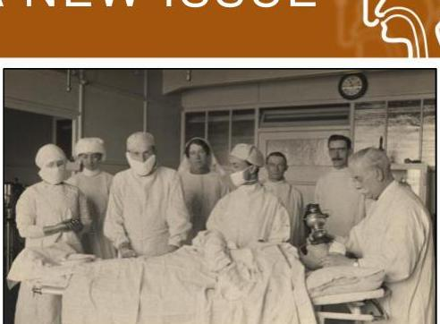

Image labeled for reuse; retrieved via Google Images

--- page 5 ---

# FLORENCE NIGHTINGALE 

"There may be four different causes, any of which will provide the same result, the patient slowly starving to death for want of nutrition:"

- defect in cooking
- defect in choice of diet
- defect in choice of hours for taking diet
- defect in appetite of patient

Fee E et al. Am J Public Health. 2010;100:1591.

Image labeled for reuse; retrieved via Google Images

## LANDMARK PUBLICATION

1974 Publication "The Skeleton in the Hospital Closet"
"I suspect, as a matter of fact, that one of the largest pockets of unrecognized malnutrition in America exists not in rural slums or urban ghettos, but in the private rooms and wards of big city hospitals."

--- page 6 ---

# MALNUTRITION RECOGNITION 

"Underfeeding is a debt that must eventually be repaid, and like all debts it is made worse when it is compounded."

- Richard D. Griffiths M.D.

Weinsier, RL et al. Am J Clin Nutr. 1979;32:418-426.

## MALNUTRITION DEFINITION

"An acute, subacute or chronic state of nutrition, in which a combination of varying degrees of overnutrition or undernutrition with or without inflammatory activity have led to a change in body composition and diminished function."

--- page 7 ---

# MALNUTRITION RECOGNITION 

## Personal

- Age
- Apathy/Depression
- Disease
- Inability to buy/prepare food
- Inability to chew/swallow
- Limited mobility
- Sensory loss
- Medications
- Therapies: ventilators/drains/NPO

Kubrak C et al. Int J Nurs Stud. 2007; 44(6):1036-54.

## Organizational

- Lack of recognition
- Lack of screening/assessment
- Lack of nutrition education
- Confusion re: responsibility
- Ht / Wt not measured/recorded
- Failure to food intake
- Inadequate nutrients provided
- Lack of feeding assistance staff
- Nutrition status low priority

## MALNUTRITION PREVALENCE

| Population | Patients (n) | Malnourished Patients (n\%) |
| :-- | :-- | :-- |
| Acute Care $^{1}$ | 251 | $44 \%$ |
| Acute Care $^{2}$ | 2448 | $39 \%$ |
| ICU $^{3}$ | 129 | $43 \%$ |
| Acute Care $^{4}$ | 404 | $54 \%$ |
| ICU $^{5}$ | 57 | $50 \%$ |
| Acute Care and ICU $^{6}$ | 274 | $32-44 \%$ |
| Acute Care $^{7}$ | 404 | $48 \%$ |
| Pancreatic Surgery $^{8}$ | 43 | $56 \%$ |
| Acute Care $^{9}$ | 3759 | $68 \%$ |
| Critically III $^{10}$ | 327 | $30 \%$ |

--- page 8 ---

# MALNUTRITION PREVALENCE, CONT. 

- Bistrian BR et al. JAMA. 1974; 230(6):858-60.
- Veterans Affairs Study Group, N Engl J Med. 1991; 325(8):525.
- Giner M et al. Nutrition. 1996; 12(1):23-29.
- Braunschweig C et al. J Am Diet Assoc. 2000; 100(11):1316-22.
- Sheean PM et al. Clin Nutr. 2013; 32(5):752-57.
- Nicolo M et al. JPEN J Parenter Enteral Nutr. 2014; 38(8):954-49.
- Hiller LD et al. JPEN J Parenter Enteral Nutr. 2018; 41:1316-24.
- Berry A et al. Abstract \#2392918. ASPEN Clinical Nutrition Week 2016.
- Hudson L et al. JPEN J Parenter Enteral Nutr. 2018; 42(5):892-97.
- Ceniccola GD et al. J Crit Care. 2018; 44:398-403.

MALNUTRITION IMPACTS OUTCOME
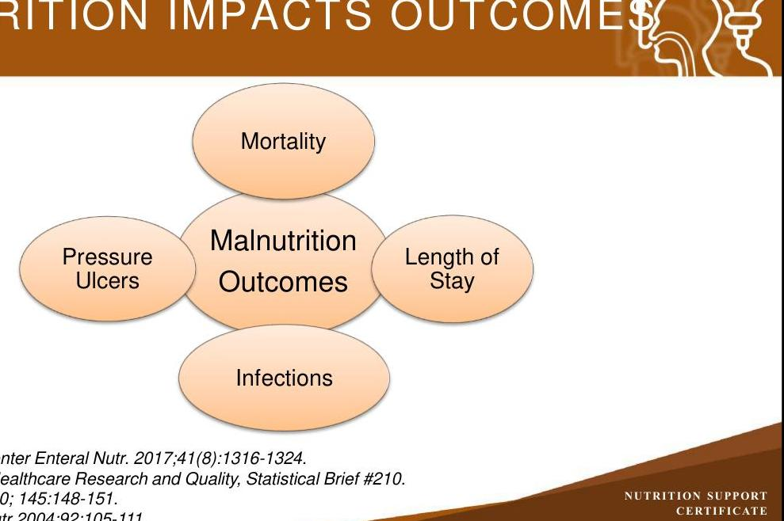

--- page 9 ---

# HOSPITAL ACQUIRED EVENTS WITH PRE-EXISTING MALNUTRITION 

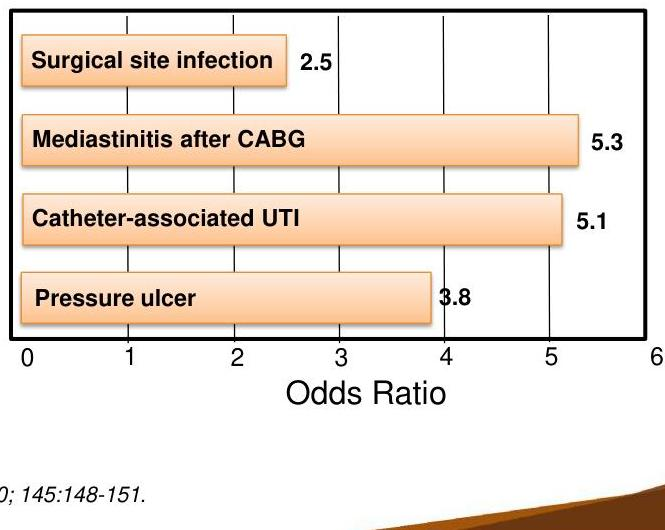

Fry DE et al. Arch Surg. 2010; 145:148-151.

## MALNUTRITION AND OUTCOMES

- 2016 Statistical Brief by Agency for Healthcare Research and Quality:
- $7.1 \%$ of all discharges included a malnutrition diagnosis
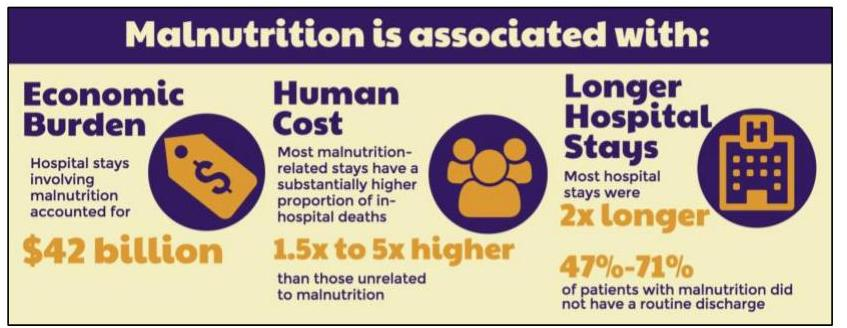

Agency of Healthcare Research and Quality. Statistical Brief \#210.
Image adapted from AHRQ, Baxter, and ASPEN infographic; labeled for reuse

--- page 10 ---

# MALNUTRITION AND READMISSIONS

|   | With Malnutrition | Without Malnutrition  |
| --- | --- | --- |
|  30 Day Readmission | 23% | 14.9%  |
|  Cost of Readmission | $16,200 | $13,400  |

- Compared readmissions in patients with malnutrition in their "index" admission vs those without malnutrition

*Agency of Healthcare Research and Quality. Statistical Brief #218.*

# NUTRITIONDAY®

- nutritionDay® - a one-day cross-sectional audit with outcome evaluation
- **Goals:**
- To improve knowledge and awareness of malnutrition in health care institutions
- Enhance the quality of nutritional care
- All hospitals worldwide can participate
- Provides data reports for benchmarking
- Comparative with other country facilities and worldwide
- Processes of own facility year to year

nutritionDay® worldwide. nutritionday.org (accessed 2019 Feb 10).

--- page 11 ---

# NUTRITIONDAY® US RESULTS

Food Intake on nutritionDay®

|  |   |
| --- | --- |
|  All | 36.5%  |
|  Half | 25.8%  |
|  Quarter | 18.1%  |
|  Nothing | 7.1%  |
|  Not allowed | 6.9%  |
|  Missing | 5.6%  |

Risk of Mortality Based on Food Intake

|  |   |
| --- | --- |
|  Amount eaten | Hazard Ratio (95% CI)  |
|  All | Referent  |
|  Half | 1.27 (0.62; 2.59)  |
|  Quarter | 3.14 (7.73; 6.07)  |
|  Nothing | 5.99 (3.03; 11.84)  |
|  Not allowed | 4.38 (2.00; 9.58)  |
|  Missing | 3.56 (1.20; 10.58)  |

NUTRITION SAFERIY CERTIFICATE

Sauer AC et al. JPEN J Parenter Enteral Nutr. 2018, epub.

NUTRITION SAFERIY CERTIFICATE

NUTRITION SAFERIY

NUTRITION SAFERIY

NUTRITION SAFERIY

NUTRITION SAFERIY

NUTRITION SAFERIY

NUTRITION SAFERIY

NUTRITION SAFERIY

NUTRITION SAFERIY

NUTRITION SAFERIY

NUTRITION SAFERIY

NUTRITION SAFERIY

NUTRITION SAFERIY

NUTRITION SAFERIY

NUTRITION SAFERIY

NUTRITION SAFERIY

NUTRITION SAFERIY

NUTRITION SAFERIY

NUTRITION SAFERIY

NUTRITION SAFERIY

NUTRITION SAFERIY

NUTRITION SAFERIY

NUTRITION SAFERIY

NUTRITION SAFERIY

NUTRITION SAFERIY

NUTRITION SAFERIY

NUTRITION SAFERIY

NUTRITION SAFERIY

NUTRITION SAFERIY

NUTRITION SAFERIY

NUTRITION SAFERIY

NUTRITION SAFERIY

--- page 12 ---

# NUTRITION SCREENING TOOLS 

- Should be simple and easy to use
- Should be a sensitive, specific, and reliable tool
- Should have broad applicability
- Common valid nutrition screening tools:
- Malnutrition screening tool (MST)
- Nutrition Risk Score 2002 - NRS 2002
- Malnutrition Universal Screening Tool (MUST)
- Mini-Nutrition Assessment Short Form (MNA-SF)

Skipper A et al. JPEN J Parenter Enteral Nutr. 2011;36:292-298.

## NUTRITION SCREENING TOOLS

- MST
- Weight loss, appetite
- NRS 2002
- Weight loss, body mass index, disease severity, age
- MUST
- Weight loss, BMI, food intake, disease severity
- MNA-SF
- Weight loss, food intake, appetite, disease severity, depression

--- page 13 ---

# MALNUTRITION SCREENING TOOL 

- Have you recently lost weight without trying?
- No (0) / Unsure (2)
- If Yes, how much weight have you lost?
- 2-13lbs (1) / 14-23lbs (2) / 24-33lbs (3) / 34lbs (3) / Unsure (2)
- Have you been eating poorly because of decreased appetite?
- No (0) / Yes (1)
- Add response to find MST score
- MST $=0$ or $1 \rightarrow$ not at risk
- MST $=2$ or more $\rightarrow$ at risk

Malnutrition screening tool (MST) adapted from Abbott Nutrition Form.

## NUTRITION SCREENING DURING HOSPITALIZATION

- Hospitalized patients often don't eat well
- Audit of mealtimes in European hospital 2016
- Approximately 40\% of patients ate half or less of their meal
- nutritionDay ${ }^{\circledR}$ confirms similar findings
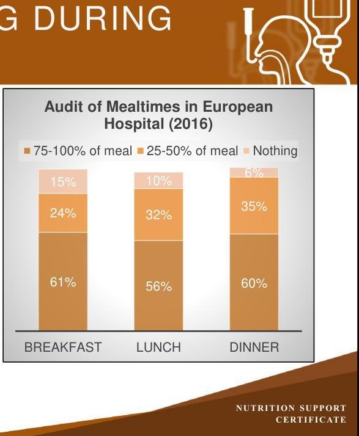

--- page 14 ---

# NUTRITION SCREENING DURING HOSPITALIZATION 

- Hospitalized patients often don't eat well
- Audit of
hospita
- Approx or less
- nutritionDay ${ }^{\circledR}$ confirms similar findings

Audit of Mealtimes in European Hospital (2016)
$\pm 75-100 \%$ of meal $\pm 25-50 \%$ of meal $\pm$ Nothing
All clinicians can identify those patients not eating well and refer them to the nutrition clinician for additional assessment and follow-up
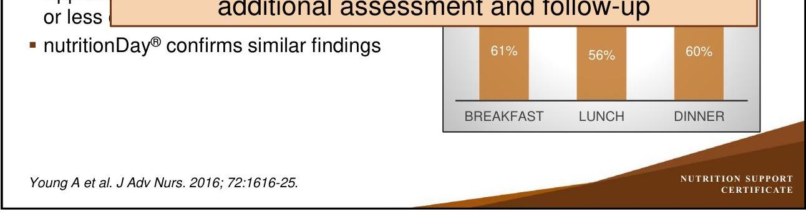

Young A et al. J Adv Nurs. 2016; 72:1616-25.

## NUTRITION ASSESSMENT

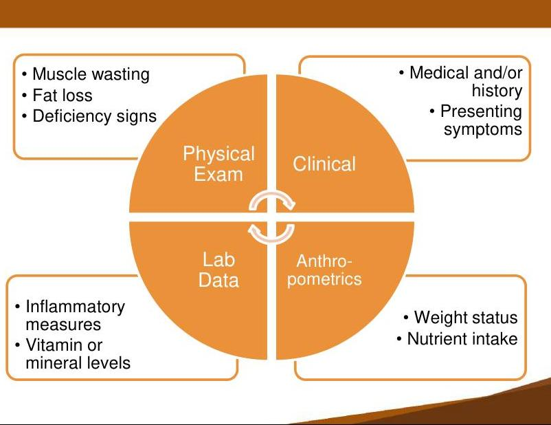

--- page 15 ---

# A NEW APPROACH TO DEFINING MALNUTRITION

**Consensus Statement**

**Consensus Statement: Academy of Nutrition and Dietetics and American Society for Parenteral and Enteral Nutrition: Characteristics Recommended for the Identification and Documentation of Adult Malnutrition (Undernutrition)**

Jane V. White, PhD, RD, FADA¹; Peggi Guenter, PhD, RN¹;
Gordon Jensen, MD, PhD, FASPEN²; Ainsley Malone, MS, RD, CNSC³;
Marsha Schofield, MS, RD⁴; the Academy Malnutrition Work Group;
the A.S.P.E.N. Malnutrition Task Force; and the A.S.P.E.N. Board of Directors

*White JV et al. JPEN J Parent Ent Nutr. 2012; 36:275-283.*

**NUTRITION SUPPORT CONFERENCE**

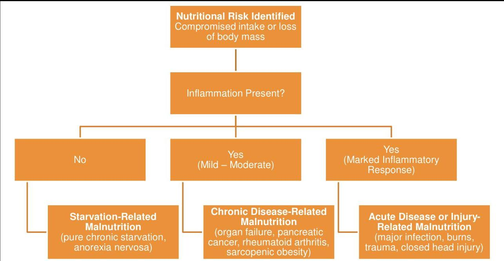

**Nutritional Risk Identified**
Compromised intake or loss
of body mass

Inflammation Present?

No

Yes
(Mild – Moderate)

Yes
(Marked Inflammatory
Response)

**Starvation-Related
Malnutrition**
(pure chronic starvation,
anorexia nervosa)

**Chronic Disease-Related
Malnutrition**
(organ failure, pancreatic
cancer, rheumatoid arthritis,
sarcopenic obesity)

**Acute Disease or Injury-
Related Malnutrition**
(major infection, burns,
trauma, closed head injury)

*Jensen GL et al. JPEN J Parenter Enteral Nutr. 2009; 33:710-16.*

--- page 16 ---

# ASSESSING FOR INFLAMMATION 

| Disease State |  |
| :--: | :--: |
| Degree | Diagnosis |
| Intense | Critical illness, sepsis, acute respiratory distress syndrome, severe burns, major abdominal surgery, severe acute pancreatitis |
| Mild to moderate | CHF, COPD, rheumatoid arthritis, Crohn's disease, solid tumors |
| None | Starvation, dementia, anorexia nervosa |

| Clinical Signs |  |
| :--: | :--: |
| Parameter Type | Parameter |
| Biochemical | Depleted visceral proteins, elevated c-reactive protein, hyperglycemia, high or low WBC |
| Microbiological | Positive urine culture, blood culture, fecal culture and other bodily fluid cultures |
| Clinical | Fever, chills, tachycardia, low blood pressure, productive cough, skin redness and swelling |

Jevenn A et al. ASPEN Adult Nutrition Support Core Curriculum, Mueller CM. 3rd Ed. 2017: 186-212.

## MALNUTRITION CHARACTERISTICS

The Academy of Nutrition and Dietetics/ASPEN Consensus Characteristics:

- Unintentional weight loss
- Evidence of inadequate intake
- Loss of muscle mass
- Loss of subcutaneous fat
- Fluid accumulation
- Reduced hand grip strength
*The presence of two or more characteristics is necessary for the diagnosis of malnutrition

--- page 17 ---

# SEVERE MALNUTRITION CRITERIA 

| Characteristic | Acute Illness/Injury | Chronic Illness | Social/   Environmental |
| :--: | :--: | :--: | :--: |
| Weight Loss | $>2 \% / 1$ week   $>5 \% / 1$ month   $>7.5 \% / 3$ months | $5 \% / 1$ month   $>7.5 \% / 3$ months   $>10 \% / 6$ months   $>20 \% / 1$ year | $>5 \% / 1$ month   $>7.5 \% / 3$ months   $>10 \% / 6$ months   $>20 \% / 1$ year |
| Energy Intake | $</=50 \%$ for $>/=5$ days | $</=75 \%$ for $>/=1$ month | $</=50 \%$ for $>/=1$ month |
| Body Fat | Moderate depletion | Severe depletion | Severe depletion |
| Muscle Mass | Moderate depletion | Severe depletion | Severe depletion |
| Fluid Accumulation | Moderate $\rightarrow$ Severe | Severe | Severe |
| Grip Strength | Not recommended in the ICU | Reduced for age/gender | Reduced for age/gender |

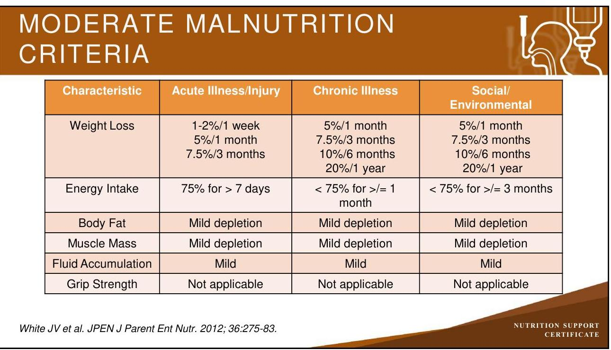

--- page 18 ---

# PHYSICAL ASSESSMENT 

- Fat loss
- Orbital
- Triceps
- Mid-axillary
- Muscle wasting
- Temporal
- Scapular and clavicular
- Interosseous areas of hand
- Quadriceps and deltoid areas
- Calf muscle
- Biceps

Image labeled for reuse: Google Images
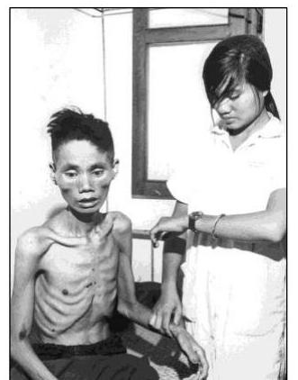

## WHY NOT SERUM ALBUMIN OR VISCERAL PROTEINS?

- Body down-regulates albumin synthesis so that needed proteins for immune, clotting, and wound healing functions can be made
- Positive - antibodies, complement, C-reactive protein, and fibrinogen
- Negative - albumin, transferrin, prealbumin, retinol binding protein
- Malnourished individuals (pure semi-starvation) likely will exhibit normal visceral proteins (anorexia nervosa)
- Any degree of inflammation will down-regulate visceral protein synthesis
- Infection, obesity, surgical stress, chronic inflammatory disease, malignancy, etc

--- page 19 ---

# MALNUTRITION ASSESSMENT PROCESS 

- Perform nutrition screen
- If positive screen, refer to nutrition clinician
- Assess for the presence of inflammation
- Determine etiology of potential malnutrition
- Assess for presence of two malnutrition characteristics
- Is the patient malnourished?
- If yes, determine severity via thresholds of specific characteristics

Jevenn A, Galand M, Hipskind P, Bury C. Malnutrition screening and assessment. In: The ASPEN Adult Nutrition Support Core Curriculum, Mueller CM, ed, 3e, 2017, p 186-212.

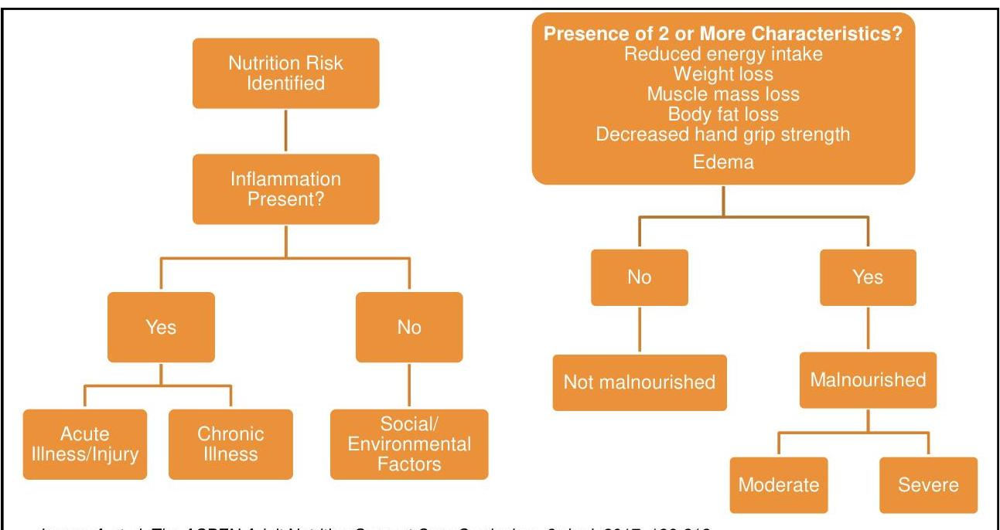

Jevenn A et al. The ASPEN Adult Nutrition Support Core Curriculum. 3rd ed. 2017; 186-212.

--- page 20 ---

# MALNUTRITION RESOURCES 

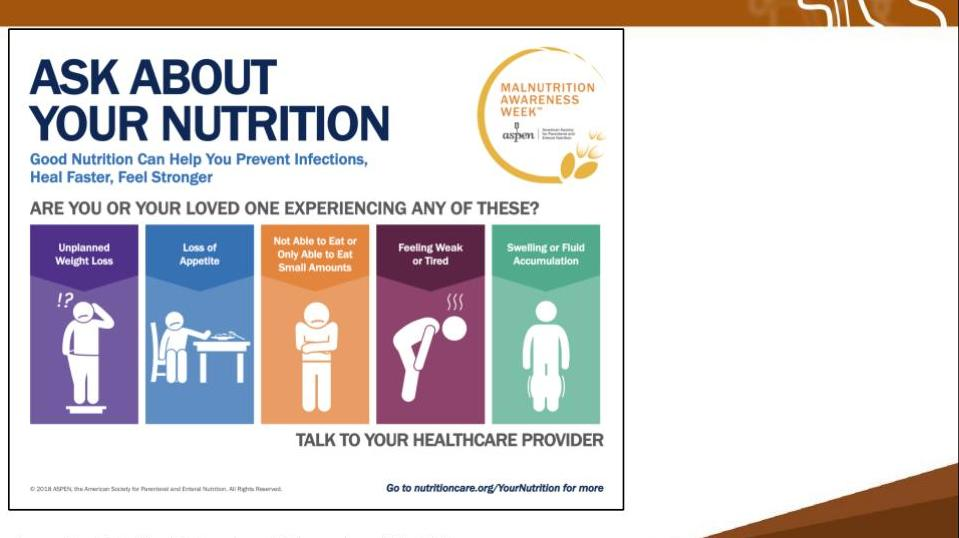

CC Image courtesy of the American Society for Enteral and Parenteral Nutrition.
http://blog.nutritioncare.org/ask-about-your-nutrition/ (accessed 2019 Feb 1).

## PATIENT CASE STUDY

- LC, a 70 year old female, was admitted with likely SBO
- Transferred from a critical access hospital (1 week admission)
- LC reports a 2 week history of worsening abdominal pain with nausea and occasional vomiting on admission to the critical access hospital; 3 week history of anorexia and poor eating
- Previous hospital course included NGT placement, IV and NPO status
- NGT removal and diet advancement unsuccessful; patient transferred to regional center
- Admission Ht: 5' 4"
- Admission Wt: 123 lbs, Usual Wt (4 weeks ago): 130lbs

--- page 21 ---

# LC HOSPITAL COURSE 

The admitting nurse performs a nutrition screen using the MST

- What is the MST score for LC?
- Should LC be referred to the RD for a nutrition assessment?

## MALNUTRITION SCREENING TOOL

- Have you recently lost weight without trying?
- No (0) / Unsure (2) / Yes (see below)
- If yes, how much weight have you lost?
- 2-13lbs (1) / 14-23lbs (2) / 24-33lbs (3) / 34lbs (3) / Unsure (2)
- Have you been eating poorly because of decreased appetite?
- No (0) / Yes (1)
- Add response to find MST score
- MST $=0$ or $1 \rightarrow$ not at risk
- MST $=2$ or more $\rightarrow$ at risk

Malnutrition screening tool (MST) adapted from Abbott Nutrition Form.

--- page 22 ---

# LC HOSPITAL COURSE 

The admitting nurse performs a nutrition screen using the MST

- What is the MST score for LC?
- Her score is 2
- Yes to weight loss of 7 lbs $=1$
- Poorly eating $=1$
- Should LC be referred to the dietitian for a nutrition assessment?
- Yes, a score of 2 or higher = automatic referral to a dietitian

## LC NUTRITION ASSESSMENT

| Anthropometric   Data | Intake | Physical Assessment   and Lab Data |
| :--: | :--: | :--: |
| - Weight loss of 7 lbs over   four weeks   - Equates to to   approximately $5 \%$ weight   loss in one month   - Hand grip strength   markedly reduced | - Poor appetite $X$ four   weeks   - Eating about half to $75 \%$   of normal meals over past   month | - No evidence of fat loss   - No evidence of muscle   loss   - No edema present   - Albumin $-2.9 \mathrm{~g} / \mathrm{L}$   - Prealbumin $-11.2 \mathrm{mg} / \mathrm{dL}$ |

--- page 23 ---

# WHAT IS LC'S NUTRITION STATUS? 

- Is LC malnourished?
- What criteria in LC's nutrition assessment is important in diagnosing malnutrition?
- What is the etiology of LC's malnutrition?

## WHAT IS LC'S NUTRITION STATUS?

- Is LC malnourished?
- Yes
- What criteria in LC's nutrition assessment is important in diagnosing malnutrition?
- Weight loss, inadequate energy intake and reduced hand grip strength are the criteria that meet LC's malnutrition diagnosis
- LC is assessed to have severe malnutrition based upon the thresholds for weight loss, inadequate intake and reduced hand grip strength
- What is the etiology of LC's malnutrition?
- Chronic disease related to her mild/moderate inflammation (reflected by low albumin/prealbumin levels)

--- page 24 ---

# SEVERE MALNUTRITION CRITERIA 

| Characteristic | Acute Illness/Injury | Chronic Illness | Social/   Environmental |
| :--: | :--: | :--: | :--: |
| Weight Loss | $>2 \% / 1$ week $>5 \% / 1$ month $>7.5 \% / 3$ months | $\begin{gathered} 5 \% / 1 \text { month } \\ >7.5 \% / 3 \text { months } \\ >10 \% / 6 \text { months } \\ >20 \% / 1 \text { year } \end{gathered}$ | $>5 \% / 1$ month $>7.5 \% / 3$ months $>10 \% / 6$ months $>20 \% / 1$ year |
| Energy Intake | $</=50 \%$ for $>/=5$ days | $</=75 \%$ for $>/=1$ month | $</=50 \%$ for $>/=1$ month |
| Body Fat | Moderate depletion | Severe depletion | Severe depletion |
| Muscle Mass | Moderate depletion | Severe depletion | Severe depletion |
| Fluid Accumulation | Moderate $\rightarrow$ Severe | Severe | Severe |
| Grip Strength | Not recommended in the ICU | Reduced for age/gender | Reduced for age/gender |

## SELF-ASSESSMENT \#1

The relationship between a nutritional factor and a negative clinical outcome was first identified in the 1930's.
A. True
B. False

--- page 25 ---

# SELF-ASSESSMENT \#1 

The relationship between a nutritional factor and a negative clinical outcome was first identified in the 1930's.
A. True
B. False

## SELF-ASSESSMENT \#2

SJ has been admitted for complaints of 2 week history of nausea/vomiting. A positive nutrition screen led to a consult to the Dietitian. Which of the following characteristics will the dietitian use to diagnose malnutrition in SJ:
A. Weight loss
B. Albumin level
C. Inadequate energy intake
D. A and C

--- page 26 ---

# SELF-ASSESSMENT \#2 

SJ has been admitted for complaints of 2 week history of nausea/vomiting. A positive nutrition screen led to a consult to the Dietitian. Which of the following characteristics will the dietitian use to diagnose malnutrition in SJ:
A. Weight loss
B. Albumin level
C. Inadequate energy intake
D. A and C

## REFERENCES

- Agency of Healthcare Research and Quality. Characteristics of hospital stays involving malnutrition 2013. Bethesda: MD: Agency of Healthcare Research and Quality; 2016 Sep. Statistical Brief \#210.
- ASPEN. Definition of Terms, Style, and Conventions Used in ASPEN Board of DirectorsApproved Documents. Silver Spring, MD: ASPEN; 2018 May.
- Blackburn GA, Bistrian BR, Maini BS et al. Nutritional and metabolic assessment of the hospitalized patient. JPEN J Parent Ent Nutr. 1977; 1(1):11-21.
- Braunschweig C, Gomez S, Sheean PM. Impact of declines in nutritional status on outcomes in adult patients hospitalized for more than 7 days. J Am Diet Assoc. 2000; 100(11):131622.
- Butterworth C. The skeleton in the hospital closet. Nutr Today. 1974; 9(2):4-8.
- Ceniccola GD, Holanda TP, Pequeno RSF et al. Relevance of AND-ASPEN criteria of malnutrition to predict hospital mortality in critically ill patients:
A prospective study. J Crit Care. 2018; 44:398-403.

--- page 27 ---

# REFERENCES, CONT. 

- Fee E, Garofalo ME. Florence Nightingale and the Crimean War. Am J Public Health. 2010; 100(9):1591.
- Fry DE, Pine M, Jones BL et al. Patient characteristics and the occurrence of never events. Arch Surg. 2010; 145(2):148-151.
- Giner M, Laviano A, Meguid MM et al. In 1995 a correlation between malnutrition and poor outcome in critically ill patients still exists. Nutrition. 1996; 12(1): 23-29.
- Hiller LD, Shaw RF, Fabri PJ. Difference in composite end point of readmission and death between malnourished and nonmalnourished veterans assessed using Academy of Nutrition and Dietetics/American Society for Parenteral and Enteral Nutrition clinical characteristics. JPEN J Parenter Enteral Nutr. 2018; 41(8):1316-24.

## REFERENCES, CONT.

- Hudson L, Griffith C, Chittams J, Compher C. Malnutrition identified by Academy of Nutrition and Dietetics/American Society for Parenteral and Enteral Nutrition is associated with more 30-day readmissions, greater hospital mortality, and longer hospital stays: a retrospective analysis of nutrition assessment data in a major medical center. JPEN J Parenter Enteral Nutr. 2018; 42(5):892-97.
- Jensen GL, Bistrian B, Roubenoff R, Heimburger D. Malnutrition syndromes: A conundrum vs continuum. JPEN J Parenter Enteral Nutr. 2009; 33(6):710-16.
- Jevenn A, Galand M, Hipskind P, Bury C. Malnutrition screening and assessment. In: The ASPEN Adult Nutrition Support Core Curriculum, Mueller CM. 3rd ed. Maryland: ASPEN; 2017:186-212.
- Kubrak C, Jensen L. Malnutrition in acute care patients: a narrative review. Int J Nurs Stud. 2007; 44(6):1036-54.

--- page 28 ---

# REFERENCES, CONT. 

- Mogensen KM, Bouma S, Haney A et al. Hospital nutrition assessment practice survey. Nutr Clin Pract. 2018; 33(5):711-17.
- Nicolo M, Compher CW, Still C. Feasibility of accessing data in hospitalized patients to support diagnosis of malnutrition by the Academy-A.S.P.E.N. malnutrition consensus recommended clinical characteristics. JPEN J Parenter Enter Nutr. 2014; 38(8):954-49.
- nutritionDay ${ }^{\circledR}$ worldwide. https://www.nutritionday.org (accessed 2019 Feb 10).
- Sauer A.C, Goates S, Malone A et al. Prevalence of malnutrition risk and the impact of nutrition risk on hospital outcomes: results from nutritionday in the U.S. JPEN J Parenter Enteral Nutr. 2018; epub.
- Schneider SM, Veyres P, Pivot X et al. Malnutrition is an independent factor associated with nosocomial infections. Br J Nutr. 2004; 92(1):105-11.

## REFERENCES, CONT.

- Sheean PM, Peterson SJ, Chen Y et al. Utilizing multiple methods to classify malnutrition among elderly patients admitted to the medical and surgical intensive care units (ICU). Clin Nutr. 2013; 32(5):752-57.
- Skipper A, Ferguson M, Thompson K et al. Nutrition screening tools: An analysis of the evidence. JPEN J Parenter Enteral Nutr. 2011; 36(3):292-98.
- Soeters P, Schols A. Advances in understanding and assessing malnutrition. Curr Opin Clin Nutr Metab Care. 2009; 12(5):487-94.
- Studley HO. Percentage of weight loss basic indicator of surgical risk in patients with chronic peptic ulcer. J Am Med Assoc. 1936; 106(6):458-60.
- Veterans Affairs Total Parenteral Nutrition Cooperative Study Group. Perioperative total parenteral nutrition in surgical patients. N Engl J Med. 1991; 325(8): 525-32.

--- page 29 ---

# REFERENCES, CONT. 

- Weinsier RL, Hunker EM, Krumdieck CL, Butterworth CE. Hospital malnutrition A prospective evaluation of general medical patients during the course of hospitalization. Am J Clin Nutr. 1979; 32(2):418-26.
- White JV, Guenter P, Jensen GL et al. Consensus statement: academy of nutrition and dietetics and american society for parenteral and enteral nutrition: characteristics recommended for the identification and documentation of adult malnutrition (under-nutrition). JPEN J Parent Ent Nutr. 2012; 36(3):275-83.
- Young A, Allia A, Jolliffe L, et al. Assisted or Protected Mealtimes? Exploring the impact of hospital mealtime practices on meal intake. J Adv Nurs. 2016; 72(7):1616-25.

--- page 30 ---

# Ainsley Malone, M.S., RDN, L.D., CNSC, FAND, FASPEN 

Clinical Practice Specialist
The American Society for Parenteral and Enteral Nutrition (ASPEN)
Nutrition Support Dietitian
Mount Carmel Grove City
Columbus, Ohio
Ainsley Malone is a Dietitian member of the Nutrition Support Team at Mount Carmel Grove City in Columbus, Ohio, where she is involved in managing nutrition care in patients who require enteral and parenteral nutrition. In addition, Ms. Malone serves as a
Clinical Practice Specialist for the American Society for Parenteral and Enteral Nutrition (ASPEN) where she works to guide clinical practice activities for the organization.

Ms. Malone is a certified nutrition support clinician and has given international, national and local presentations on many aspects of nutrition support practice. In addition to her clinical practice activities, Ms. Malone has authored multiple nutrition support related peer reviewed articles and book chapters. Ms. Malone is a fellow of both the Academy of Nutrition and Dietetics and ASPEN and has served in many nutrition leadership capacities including President of ASPEN, and Chairs of the Academy Positions and Evidence Based Practice Committees.

--- page 31 ---

# Relevant Financial Relationship Disclosure

In accordance with our accreditor’s Standards of Integrity and Independence in Accredited Continuing Education, ASHP requires that all individuals in control of content disclose all financial relationships with ineligible companies. An individual has a relevant financial relationship if they have had a financial relationship with ineligible company in any dollar amount in the past 24 months and the educational content that the individual controls is related to the business lines or products of the ineligible company.

An ineligible company is any entity producing, marketing, re-selling, or distributing health care goods or services consumed by, or used on, patients. The presence or absence of relevant financial relationships will be disclosed to the activity audience.

The following persons in control of this activity’s content have relevant financial relationships:

- Phil Ayers: Fresenius Kabi, consultant and speaker
- David Evans: Fresenius Kabi, consultant and speaker; Abbott Laboratories, consultant and speaker; CVS/OptionCare, consultant; Alcresta, consultant and speaker
- Andrew Mays: Fresenius Kabi, speaker
- Jay Mirtallo: Fresenius Kabi, consultant
- Kris Mogensen: Baxter, speaker; ThriveRx, advisory board; Pfizer, advisory board

All other persons in control of content do not have any relevant financial relationships with an ineligible company.

As required by the Standards of Integrity and Independence in Accredited Continuing Education definition of ineligible company, all relevant financial relationships have been mitigated prior to the CPE activity.

# Methods and CE Requirements

This online activity consists of a combined total of 12 learning modules. Pharmacists and physicians are eligible to receive a total of 20 hours of continuing education credit by completing all 12 modules within this certificate.

Participants must participate in the entire activity, complete the evaluation and all required components to claim continuing pharmacy education credit online at ASHP Learning Center http://elearning.ashp.org. Follow the prompts to claim credit and view your statement of credit within 60 days after completing the activity.

# Important Note – ACPE 60 Day Deadline:

Per ACPE requirements, CPE credit must be claimed within 60 days of being earned. To verify that you have completed the required steps and to ensure your credits have been reported to CPE Monitor, check your NABP eProfile account to validate that your credits were transferred successfully before the ACPE 60-day deadline. After the 60 day deadline, ASHP will no longer be able to award credit for this activity.

# System Technical Requirements

Courses and learning activities are delivered via your Web browser and Acrobat PDF. Users should have a basic comfort level using a computer and navigating websites.

View Frequently Asked Questions for more information.