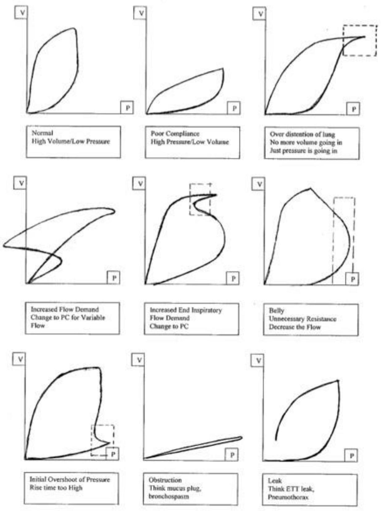

# Nursery Guide 2018 

Editors: Alexis Davis, M.D., Ashley Forester, N.N.P., Bailey White
Photos by: Erin Lubin

--- page 1 ---

.

--- page 2 ---

Copyright © Board of Trustees of the Leland Stanford Junior University 2017. This document is intended for use by staff of Stanford Hospitals and Clinics and/or Lucile Packard Children's Hospital. No representations or warranties are made for outside use. Not for outside reproduction or publication without permission.

The NICU Guide is intended to provide general guidelines for care that are representative of the usual practices in the Packard Nurseries. These recommendations are not prescriptive, and it remains the responsibility of the individual caretaker to apply, adopt, or modify these regimens in accordance with each clinical situation.

--- page 3 ---

.

--- page 4 ---

# Table of Contents 

Part I: Administrative
A. Developmental \& Family-centered Care
Developmental Care in the NICU ..... 2
Melissa Scala, M.D.
Family Involvement ..... 6
William Rhine, M.D.
Developmental-Behavioral Pediatric Programs ..... 9
Anne DeBattista, R.N., M.S., C-P.N.P., C-P.M.H.S.
B. Delivery and Admission
Prenatal Counseling ..... 15
Christine Johnson, M.D.
The Delivery Room ..... 21
Kristine Boyle, N.N.P.-B.C. and Arun Gupta, M.D.
Respiratory Management of the Preterm Infant ..... 28
Christine Johnson, M.D., Katherine McCallie, M.D., and Ronald S. Cohen, M.D.
The NEST: Guidelines for the Care of Micropreemies ..... 35
Melissa Scala, M.D., Katie Hunt, N.N.P., Jessica Matei, B.S.N., R.N.C.-N.I.C.
Toward Optimally Timed Cord Clamping ..... 40
Brittany Weldon, M.D.
Non-Immune Fetal Hydrops ..... 44
Anna-Kaisa Niemi, M.D., Ph.D. and Janene Fuerch, M.D.
Complex Coordinated Deliveries ..... 50
Beth Fluharty, N.N.P., Valerie Chock, M.D., M.S. Epi, Alexis Davis, M.D., M.S. Epi, Susan Hintz, M.D.,
M.S. Epi
When to Notify an Attending in the NICU ..... 54
Alexis Davis, M.D., M.S. Epi
C. Discharging \& Transferring Patients
Packard Nursery Transfer Guidelines ..... 58
Arun Gupta, M.D., and Ronald S. Cohen, M.D.
Process for Basic and Complex Discharges ..... 59
Audrey Moore, N.N.P-B.C.
Comfort Care in the NICU ..... 66
Diana Kobayashi, N.N.P.
Part II: Clinical Management
A. Fluids and Nutrition
Management of IV Fluids and TPN ..... 77
Kari McCallie, M.D., Olivia Mayer, R.D. CSP, I.B.C.L.C, Alexis Davis, M.D., M.S. Epi, and Ronald S.
Cohen, M.D.
Enteral Feeding ..... 93
Kari McCallie, M.D., Olivia Mayer, R.D. CSP, I.B.C.L.C, and Ronald S. Cohen, M.D.
Vitamin and Mineral Requirements for Enterally Fed Neonates ..... 105
Olivia Mayer, R.D., CSP, I.B.C.L.C.
Formula Selection, Description, and Indications ..... 110
Olivia Mayer, R.D., CSP, I.B.C.L.C.

--- page 5 ---

Hyperkalemia ..... 115
Arlene Sheehan, RN, N.N.P., MS-B.C.
Hypokalemia ..... 119
Arlene Sheehan, RN, N.N.P., MS-B.C.
Hyponatremia ..... 121
Arlene Sheehan, RN, N.N.P., MS-B.C. and Matthew Wallenstein, M.D.
B. Respiratory
Mechanical Ventilation ..... 126
Ronald S. Cohen, M.D., and William Benitz, M.D.
High Frequency Ventilation ..... 136
Ronald S. Cohen, M.D.
Nasal Cannula Oxygen Delivery - High Flow and Low Flow ..... 142
Arlene Sheehan, N.N.P-B.C.
Hypoxic Respiratory Failure, Persistent Pulmonary Hypertension of the Newborn, Inhaled Nitric Oxide. ..... 145
Sonia Bonifacio, M.D., and Krisa Van Meurs, M.D.
Management of Congenital Diaphragmatic Hernia ..... 152
Krisa Van Meurs, M.D., and Sonia Bonifacio, M.D.
Extracorporeal Membrane Oxygenation (ECMO) ..... 159
Krisa Van Meurs, M.D.
Apnea ..... 162
Ronald S. Cohen, M.D.
Oxygen Saturation Guidelines ..... 167
Ronald S. Cohen, M.D., and Diana Kobayashi, N.N.P.-B.C.
Bronchopulmonary Dysplasia ..... 171
Ronald S. Cohen, M.D., and Richard Bland, M.D.
Cystic Fibrosis ..... 179
Carol Conrad, M.D., and Bill Callas, R.R.T.
Aerosolized Medications ..... 186
Carol Contrad, M.D., and Bill Callas, R.R.T.
C. Cardiac
Diagnostic Evaluation of Suspected Congenital Heart Disease - CHD ..... 192
Gail Wright, M.D., Megan Tracey, N.N.P., and Shazia Bhombal, M.D.
Cardiac Resuscitation and Initial Management of CHD ..... 197
Shazia Bhombal, M.D., and Kathleen Ryan, M.D.
Cardiovascular Pharamcologic Agents ..... 204
Shabnam Gaskar, Pharm. D
Arythmia in the Neonate. ..... 211
Shazia Bhombal, M.D., and Kathleen Ryan, M.D.
Patent Ductus Arteriosus Management ..... 216
Valerie Chock, M.D., M.S. Epi
Evaluation and Management of Pulmonary Hypertension in BPD Patients ..... 220
Christine Johnson, M.D., Shazia Bhombal, M.D., Michelle Ogawa, C.P.N.P., and Jeffrey Feinstein, M.D.
D. Hematology
Blood Product Ordering and Transfusion Practices ..... 226
Jennifer Andrews, M.D., M.Sc
Clinical Approach to Unconjugated Hyperbilirubinemia ..... 231
Vinod K. Bhutani, M.D., and Ronald J. Wong
Neonatal Thrombosis Work-up ..... 241
Clara Lo, M.D., Bertil Glader, M.D., and Susan Hintz, M.D., M.S. Epi

--- page 6 ---

Thrombocytopenia ..... 245
Janene Fuerch, M.D.
E. Infection
NICU Infection/Hand Hygeine Policy ..... 249
Kari McCallie, M.D., and Amy Valencia, C.H.S.P., C.I.C.
Suspected Sepsis in Newborn Infants ..... 253
William Benitz, M.D., and Arun Gupta, M.D.
Immunizations ..... 266
Sruti Nadimpalli, M.D., M.P.H.
RSV Prophylaxis ..... 273
Hayden Schwenk, M.D., M.P.H.
Suspected HSV Infection ..... 276
Hayden Schwenk, M.D., M.P.H.
F. Gastrointestinal
Gastroesophageal Reflux Disease ..... 283
William Berquist, M.D., and Carol K. Conrad, M.D.
Necrotizing Entercolitis ..... 289
Susan Hintz, M.D., M.S. Epi
Abdominal Wall Defects ..... 294
Claire Abrajano, P.N.P., and Matias Bruzoni, M.D., F.A.C.S.
Clinical Approach to Conjugated Hyperbilirubinemia (Neonatal Cholestasis) ..... 301
Vinod K. Bhutani, M.D., and Ronald J. Wong
G. Renal and Genitourinary
Management of Hypertension ..... 308
Abanti Chaudhuri, M.D.
Neonatal Acute Kidney Injury (AKI) ..... 314
Scott Sutherland, M.D.
H. Endocrine
Hyperglycemia ..... 321
Tandy Aye, M.D.
Hypoglycemia ..... 324
Tandy Aye, M.D.
Management of Hypotension with Suspected Adrenal Insufficiency ..... 329
Susan Hintz, M.D., M.S. Epi
Thyroid Function in VLBW Infants ..... 335
Susan Hintz, M.D., M.S. Epi, and Laura K. Bachrach, M.D.
Disorders of Sexual Differentiation ..... 339
Caroline Buckway, M.D.
I. Neurology
Neonatal Seizures ..... 345
Courtney Wustoff, M.D.
Intraventricular and Periventricular Hemorrhage ..... 353
Alexis Davis, M.D., M.S. Epi, and Valerie Chock
Retinopathy of Prematurity ..... 356
Lisa Charo Bain, M.D., and Rachael Small, N.N.P.
Hydrocephalus and External Ventricular Drains ..... 361
Mary Casazza, C.P.N.P.-A.C.

--- page 7 ---

Hypothermia Therapy for Hypoxic Ischemic Encephalopathy in Term and Near Term Neonates ..... 367
Krisa Van Meurs, M.D., and Celia Glennon, N.N.P.
Pain Assessment and Management In Neonates ..... 373
Julie Good, M.D.
Brain Monitoring Using aEEG and NIRS ..... 382
Alexis Davis, M.D., M.S. Epi, and Valerie Chock, M.D., M.S. Epi
The LPCH Neuro NICU ..... 390
Krisa Van Meurs, M.D., and Celia Glennon, N.N.P.-B.C.
Moderate Sedation - Physician and Nurse Practitioner Responsibilities ..... 394
Arlene Sheehan, N.N.P.-B.C.
Guidelines for Asymptomatic Subgaleal Hemorrhage ..... 399
Adam Frymoyer, M.D., Ronald Cohen, M.D., and Arun Gupta, M.D.
Approach to Neonatal Hypotonia ..... 402
Anna-Kaisa Niemi, M.D., Ph.D., and Caroline Tesi-Rocha. M.D.
Neonatal Abstinence Syndrome Due to In-utero Opiod Exposure ..... 408
Krista Birnie, M.D., Sarah Dubner, M.D., and Adam Frymoyer, M.D.
J. Genetics
Management of Hyperammonemia and Urea Cycle Defects. ..... 416
Greg Enns, M.D.
Genetic Testing in the NICU ..... 420
Melanie Manning, M.D., and Athena Cherry, Ph.D.
22q11 Deletion Syndrome ..... 424
Susan Hintz, M.D., M.S. Epi, Jon Bernstein, M.D., David Lewis, M.D., and Inger Olson, M.D.
Trisomy 21 - Down Syndrome ..... 429
Melanie Manning, M.D., and Gary Dahl, M.D.
Newborn Screening ..... 432
Joan Luthra, R.N., Joann Matouk, R.N., and Marianne Varley, R.N.
Pierre Robin Syndrome/Sequence ..... 436
Elena Hopkins, R.N., M.S., P.N.P.
Part III: Research
Neonatal/Perinatal Clinical Research ..... 440
Bethany Ball, B.S., C.C.R.C.
Informed Consent for Clinical Research ..... 447
Bethany Ball, B.S., C.C.R.C

--- page 8 ---

# Part I: Administrative 

## Section A: Developmental \& Family-centered Care

--- page 9 ---

# Developmental Care in the NICU 

Melissa Scala, M.D.

## I. Definition and Background for Developmental Care

Individualized family-centered developmental care is a framework for providing care that enhances the neurodevelopment of the infant through interventions that support both the infant and family unit. This approach impacts care starting with prenatal counseling, continuing through the NICU stay and into to postdischarge follow up care and requires the collaboration of multiple health care providers and families. It extends far beyond the care provided by the developmental care team, although the team may offer important guidance to parents and staff regarding best care practices. Important factors of developmental care include the physical environment of the NICU, light and sound levels, handling and positioning, care patterns, interactions with healthcare workers and, most importantly, family interactions. Understanding the principles of developmental care can guide NICU design, interactions between caregivers and infants, and teaching and discussions with families.

The NICU is a much different environment from the womb, which is a warm and dark place free from high pitched sound and painful stimuli. Preterm infants are at a particularly vulnerable period of brain development when overproduction and apoptosis of neurons and pruning synapses craft the more permanent tracts in the brain for future function. Environmental influences, multiple painful procedures and stress may have short and long term impacts on their developing brains. Good developmental care aims to minimize the trauma imposed by the stress, pain and discomfort associated with NICU care and to create a healing environment in which normal infant brain development and normal family interactions are fostered.

This is an evolving field and much remains to be learned regarding best evidence based practice. Many evidence supported interventions face barriers to implementation and other, standard practices are still not well tested by research or lack basis in current evidence.

## II. The Physical Environment

## A. NICU Design

The physical design of the NICU is an important part of developmental care as it affects levels and type of sound exposure and rates of parent visitation and involvement. Improved outcomes have been seen in single patient rooms (SPR). These include lower stress and better weight gain and are mediated by improved developmental support and maternal involvement. However, some parents have reported higher degrees of stress and depression in SPR. Research is ongoing regarding best room design to support infants and families, but current evidence supports the important overall goals of improving family-infant interaction in a calm environment and the provision of developmental care as described below.
B. Light

Recommended light levels in the NICU are 10-600 lux but in most NICUs, levels are much higher and in the range of 400-1000 lux. Concern exists that constant light impedes development of circadian rhythms which will alter sleep-wake patterns, increase stress and create abnormal cortisol patterns. Reduced light stabilizes HR, RR, BP and motor activity and improves growth. Cycled light improves feeding, better weight gain, stabilizes RR and enhances motor coordination vs continuous light or near darkness. Practically, we cover incubators in the NICU to reduce light and noise.

--- page 10 ---

C. Sound

Most sound exposure in the NICU comes from alarms, background staff conversation and other noise such as closing garbage cans or ringing phones. The sound environment of the NICU differs significantly from that of the womb and is a source of stress for the preterm infant. Recommended decibel levels for the NICU are hourly means of less than 55 dB and 1 second exposure of 70 dB . Unfortunately, most NICUs exceed these recommendations. Effects of excessive noise exposure include cardiorespiratory instability, hearing loss, sleep disruption and impact long term neurodevelopmental outcomes. Efforts should be made to reduce background noise exposure by keeping voices low and limiting unnecessary conversations around infants. To the extent possible, reduction of noise exposure from alarms and other environmental noise is preferred. On the other hand, low volume voice exposure directed at the infant, particularly from parents, should be offered routinely as language exposure is a normative womb experience and necessary for preterm brain development. (see III.B Voice Exposure)

# III. Therapeutic Interventions 

These therapies may be provided by health care workers but are preferably delivered by trained parents, as interventions may improve parent-infant bonding and lower parental stress and depression. Not all interventions are appropriate for all infants. Careful attention should be paid to infant gestational age, clinical condition and degree of neurologic maturity in order to individualize infant developmental care plans. Developmental team members, in collaboration with the healthcare team and families, can guide appropriate care.
A. Touch

Most infants, even the most ill, can and should be cared for using positive touch. Use of "hand-hugs" or gentle containment where hands are placed stably on the infant 's head and abdomen, mimic womb conditions and can calm preterm infants. As infants mature and stabilize more intense touch can be offered. Positive touch can begin as gentle stroking and progress up through massage and may improve weight gain and improve physiologic stability.
B. Voice Exposure

Preterm infants are at increased risk for cognitive and language difficulties. Development of language processing centers and pathways begin in utero and infants as young as 25 weeks can perceive and respond to sounds. The altered sound exposure that preterm infants receive can impact brain development and future neuro-developmental outcomes. Studies looking at infant exposure of maternal noise (i.e. recorded parental voice with or without heartbeat) have shown improved cardiorespiratory stability, increased weight gain and increased feed tolerance. Exposure to maternal voice improves cardiorespiratory stability and language development. Caregivers should talk softly to infants during exams and care times and parents should be encouraged to regularly expose their infants to voice via talking, reading or singing at safe decibel levels.
C. Music Therapy

Decibel appropriate, soothing music played for preterm infants increases O2 saturations, stabilizes HR, increases time sleeping in infants, calms agitated infants, reduces length of stay, and improves sucking/feeding ability. Devices are available in the unit to play quiet lullabies.
D. Kangaroo Care or Skin to Skin Care

Holding an infant against a parent's bare chest can have both short and long term positive impacts on
This document is intended for use by staff of Stanford Hospitals and Clinics and/or Lucile Packard Children's Hospital. No representations or warranties are made for outside use. Not for outside reproduction or publication without permission.

--- page 11 ---

infants and parents. Effects include lower mortality, lower risk of sepsis, increased breast feeding, improvement in thermoregulation, weight gain and oxygenation. Kangaroo care improves mother-infant interaction and maternal confidence and reduces worry and depression. Parents should be encouraged to hold their infants daily for a minimum of 1 hour but may continue for longer periods if infant condition and temperature are stable.
E. Infant Massage

Preterm infants receiving moderate pressure massage gain weight faster and have shorter lengths of stay. Similar results are seen with trained parent vs medical provider delivery. Infant massage improves mother- infant interaction, decreases depression and increases mother's sense of competence. Very preterm infants may not tolerate this degree of stimulation but older preterm and stable term infants show significant benefits.
F. Therapeutic Positioning

Infants should be evaluated with each care interaction for age-appropriate postural alignment which includes at minimum: mid-line orientation, gentle flexion, and containment of the extremities.
Therapeutic positioning facilitates infant comfort, physiologic stability, and optimal neuromotor and neurosensory development. It also has the potential to prevent postural and anatomic deformities, such as torticollis and plagiocephaly. In order to meet positioning goals, the NICU utilizes a variety of support devices (e.g. blanket rolls, gel pillows, etc) to provide comfort and containment of extremities in a gently flexed position; similiar to the fetus' in-utero position.

# IV. Managing Pain and Stress in the Newborn 

A. Stress

Signs of infant stress are subtle and are often misinterpreted as normal behavior. Stress signals can include splayed fingers, startling, hiccups, gagging, vocalizations, sucking, hands to face, and to lesser extent facial grimacing. The more ill an infant, the less able he or she is to display stress or pain cues. Reduction of stress can be accomplished via careful attention to infant environment, slow-controlled handling during cares and procedures, and appropriate delivery of previously noted developmental care interventions. Careful positioning of infants while sleeping and during painful procedures may reduce signs of infant stress and improve neurodevelopmental outcomes.
B. Pain

See Pain Assessment and Management in Neonates -
V. Developmental care overlaps with and is central to family centered care. Developmental care programs involving parents in the NICU have proven to improve mother-infant interactions after discharge. See family centered care section.

## References

1. Developmental Care of Newborns and Infants, A guide for health professionals. 2nd edition. Kenner C and McGrath J editors, The National Association of Neonatal Nurses, 2010.
2. Symington AJ, Pinelli J. Developmental care for promoting development and preventing morbidity in preterm infants. Cochrane Reviews. 19 April 2006.

--- page 12 ---

3. Lester BM, Hawes K, Abar B, Sullivan M, Miller R, Bigsby R, Laptook A, Salisbury A, Taub M, Lagasse L, and Padbury JF. Single-family room care and neurobehavioral and medical outcomes in preterm infants. Pediatrics 2014; 134 (October): 754-760.
4. Pineda RG, Stransky KE, Rogers C, Duncan MH, Smith GC, Neil J, Inder T. The single-patient room in the NICU: maternal and family effects. J Perinatol, 2012, 32; 545-551.
5. Morag I, Ohisson A. Cycled light in the intensive care unit for preterm and low birth weight infants. Cochrane Database of systemic reviews 2014. Issue 8. CD006982.
6. Graven SN. Sound and the developing infant in the NICU: Conclusions and recommendations for care. J Perinatol 2000; 20:588-593.
7. Brown G, NICU noise and the preterm infant. Neonatal Network, 2009 3: 165-173.
8. Standley J. Music therapy research in the NICU: an updated meta-analysis. Neonatal Network 2012. 5: 311316 .
9. Boundy EO, Dastjerdi R, Spiegelman D, Fawzi WW, Missmer SA, Lieberman E, Kajeepeta S, Wall S, Chan SJ. Kangaroo Mother Care and neonatal outcomes: a meta-analysis. Pediatrics 2016. 137: 1-16.
10. Preterm Infant Massage Therapy Research: A Review, Field T, Diego M, Hernandez-Reif M, Infant Behav Dev 2010 April: 33 (2): 115-124.
11. Coughlin, M (2014). Age-Appropriate Activities of Daily Living. In Transformative Nursing in the NICU: Trauma-Informed Age-Appropriate Care (pp 93-102). New York: Springer Publishing.
12. White RD. Recommended standard for newborn ICU design, eight edition. J Perinatol 2013; 33:52-16.

--- page 13 ---

William Rhine, M.D.

# I. Philosophy 

We recognize that parents and families are often in a state of emotional crisis when their newborn is hospitalized and they are separated from their child. We believe that parents and families, in collaboration with the Neonatology Team, other specialists, and hospital personnel, are key in facilitating wholesome and expeditious care. Following a Family Centered Care approach and recognizing our present space limitations, we have developed the following guidelines for parents, families, and their guests when in the Intensive Care Nurseries.

## II. Family Involvement Guidelines

A. Parents are encouraged to be at their baby's bedside however long and whenever best suits their emotional and physical needs. Such time together may facilitate bonding, parental preparedness, as well as increase maternal milk supply. Skin-to-skin contact ("kangaroo care") has been shown to be associated with improvement in neurodevelopmental outcomes and thus should be promoted accordingly. There are a few special considerations when parents visit:

1. When there is a procedure or emergency in the room happening to another patient, medical personnel may elect to restrict access to the room. For some minor procedures, (e.g. lumbar puncture, line placement, circumcisions) parents may choose to stay, and may do so with the understanding and agreement by the person doing the procedure. It may be appropriate and even preferable to allow parents to be present during resuscitative efforts on their child.
2. During nurses' changes of shift (from 7-7:30 am and 7-7:30 p.m., and 11-11:30 pm), parents may be asked to leave the NICU rooms in order to allow for critical hand-offs between, and care by, the bedside nurses.
3. During doctors' rounds, parents are allowed to remain at their baby's bedside and should be included in the discussions regarding their baby. Parents should be informed of this option upon admission of their baby to the NICU. If parents have excessive questions or unusual informational needs, arrangements should be made to meet with them after rounds.
B. Parents are given a plastic wrist ID band from the NICU front desk. They may be asked to show photo identification. The parent's wristband received at labor and delivery must match that of the baby. All family members and visitors receive a "visitor badge" sticker at the desk opposite the main entrance on the first floor of LPCH.
C. Parents may bring one guest at a time into the Nursery during visiting hours ( 8 am to 9 pm ). This is to permit medical professionals necessary access to the bedside at all times, control noise levels, and maintain a healthy environment for the babies.
4. There is a limit of 2 persons at the bedside. Parents may list up to 4 individuals who may visit when they cannot be there.
5. No visitors, except immediate family members, may be admitted into the NICU after 9 pm for safety reasons.
6. Siblings of any age can visit in the NICU, ICN, and the Maternity floors during visiting hours. Nonsibling children must be 16 yrs of age or older to visit.
This document is intended for use by staff of Stanford Hospitals and Clinics and/or Lucile Packard Children's Hospital. No representations or warranties are made for outside use. Not for outside reproduction or publication without permission.

--- page 14 ---

4. Visitors under the age 18 may not remain in the hospital after 9 pm unless they are the parents; this includes infant siblings of the patient who are still breastfeeding.
D. Sleeping arrangements can be made with the social worker. Fire codes prohibit sleeping in alcoves, corridors or open public areas.
E. Parents, siblings, and guests must not have been exposed to chicken pox or measles, have had a cold in the last week, or a fever within the last 24 hrs . Hand washing is required prior to touching the baby. For convenience, sinks are located at the entrance of the nurseries.
F. Additional restrictions may be necessary during Influenza and RSV season.
G. Medical information will only be given out to the parents. The parents may, if they choose to, select who will be with them when this medical information is provided. The medical staff prefers not to make exceptions to this guideline; however, consideration will be given in special situations.

# III. Special Circumstances 

A. Adoption: We respect the biological mother's wishes at all times and encourage her presence. The adoptive family's presence is encouraged as authorized by the birth mother.
B. Surrogacy: All parties involved are welcome to enter the NICU. Please consult with the Social Worker to address the specific needs of the family.

## IV. General Information

A. Hand washing is vigorously enforced, as it is as very important and successful in controlling the spread of infection. Parents are allowed to remind medical and hospital staff of the need for proper hand hygiene. If a person (parent or staff member) is ill with a contagious disease, they may not enter the Nursery. For specific isolation policies, please contact Infection Control. [Also see NICU Guide Section II.E. "Hand Hygeine Policy".]
B. There are 2 Parent Rooms and 2 sleep sofas in the Family Lounge where parents can stay overnight. These can be reserved through the Social Worker or Resource Nurse. The rooms may be used exclusively by the assigned family from 8:30 pm to 8:30 am. Priority is given based on acuity of baby's illness, a family's distance from the hospital, discharge education requirements, and other parental needs. The Social Worker and Housing Office can facilitate alternative lodging such as the Ronald McDonald House, guest home or nearby hotel (at a reduced or complimentary rate).
C. Parent Rooms are open for general use on a rotating basis between 8:30 am and 8:30 pm. These rooms are for pumping, brief resting/relaxing, and case conferences.
D. Parents are encouraged to bring family pictures to place at the bedside of their babies. Stuffed animals are welcome; they must be small and limited in number.
E. We request that families and guests in the nursery patient rooms stay at their baby's bedside in order to respect the privacy of other families.
F. Flowers, plants, balloons, and electrical appliances are not allowed on the unit. No food or drinks are allowed in patient care areas, specifically around any baby's bedside. Families are encouraged to take advantage of the Parent Lounge for this purpose. A microwave, refrigerator, and sink are available.

--- page 15 ---

G. Medical procedures often require that babies are quiet, relaxed, and rested. For this reason, families are asked to consult with the Bedside Nurse upon arrival to obtain information on their child's status and readiness for handling.
H. Parents are asked not to bring clothes in for the baby until the infant's condition is stable.
I. Cultural rituals and spiritual or religious ceremonies will be accommodated to the extent that this is possible. Contact the Social Worker, Resource Nurse or Nursing Management to make arrangements.
J. Before moving a patient within the NICU, or before transferring a patient to another unit within LPCH (including the ICN), to the Operating Room, or to another hospital, there should be timely notification of the parents. Leaving a message on a phone number provided by the parents to relay this information (limiting clinical data and Protected Health Information) is not a violation of HIPAA (per LPCH/Stanford Risk Management).

--- page 16 ---

# Developmental-Pediatric Programs

## Anne De Battista, PhD, CPNP, CPMHS

### Introduction

Developmental and Behavioral Pediatrics at Stanford Children's Health offers clinical services for infants and children at risk for and with developmental or behavioral difficulties. Our inter-professional team assists families in nurturing their children's development, building strengths, and addressing the child and/or family's needs.

### I. Team Values

#### A. Family-centered practice
Elicit family concerns, engage families in decision-making.

#### B. Active interdisciplinary teaming
Efficient sharing of information.

#### C. Flexible role definitions
Willingness to assure comprehensive examination by stretching beyond conventional disciplinary boundaries.

#### D. Cultural humility
Willingness to adapt recommendations depending on family culture and willingness to ask families about cultural and personal preferences.

#### E. Community inclusion
Promoting the engagement of all children and families in their communities, regardless of abilities or needs.

### II. Programs

#### A. Inpatient Johnson Center Developmental Program

1. The Developmental Care Team is comprised of infant development specialists including an educator, a psychologist, nurse practitioners, and physical and occupational therapists. The team's purpose is to encourage relationship-based individualized developmental care to support the developing nervous system of high-risk infants, make developmental recommendations for transition to home, and to promote access to community early intervention resources.

2. Each baby referred for Developmental Care Team services will have a primary team member working with the family and the baby. The "primary" takes responsibility for documentation of the Developmental Assessment that will be noted in the Ancillary Notes Section of the Electronic Medical Record. These Developmental Assessment findings and recommendations should be included in the Medical Discharge Summary to facilitate access to early intervention services and consistency in care.

3. Criteria for Referral to the Developmental Care Team:
   - a. Birth weight <1500 gm
   - b. Prolonged hospital course
   - c. Suspected CNS abnormalities
   - d. Syndromes associated with developmental compromise

This document is intended for use by staff of Stanford Hospitals and Clinics and/or Lucile Packard Children's Hospital. No representations or warranties are made for outside use. Not for outside reproduction or publication without permission.

--- page 17 ---

e. Maternal drug use
f. Sensory impairment
g. Congenital anomalies
h. S/P ECMO/PPHN
i. Any baby meeting criteria for Neuro NICU
j. Any baby or family who needs extra support with developmental information/reading cues

# B. Outpatient High Risk Infant Follow-up (HRIF) Program 

1. As a tertiary center, Packard Children's Hospital is required by California Children Services (CCS) to offer follow-up for all eligible infants for a period of up to 3 yrs of age. HRIF Clinic sites are located in Palo Alto, Sunnyvale and Capitola. Some infants may be seen in clinic regardless of CCS eligibility. See below for eligibility and process of referrals.

## 2. Purpose of HRIF Evaluations

a. Follow-up of children with risk factors for developmental compromise
b. Early identification of developmental delays and disorders
c. Referral to appropriate community-based services
d. Referral for appropriate medical interventions
e. Counseling families on appropriate child rearing and management strategies
f. Reassurance, when appropriate
g. Reduced likelihood of vulnerable child syndrome
3. California Children Services (CCS) High-Risk Infant Follow-up (HRIF) Program Eligibility
a. Infant has met CCS medical eligibility criteria for NICU care in a CCS-approved NICU or PICU (regardless of length of stay)

OR
b. Infant had a CCS eligible medical condition in a CCS-approved NICU (regardless of length of stay, even if they were never CCS clients during their stay),
i. The birth weight was less than or equal to 1500 grams, or the gestational age at birth was less than 32 weeks

OR
ii. The birth weight was more than 1500 grams and the gestational age at birth was 32 weeks or more and one of the following criteria was met during the NICU stay:
a) pH less than 7.0 on an umbilical cord blood sample or a blood gas obtained within one hour This document is intended for use by staff of Stanford Hospitals and Clinics and/or Lucile Packard Children's Hospital. No representations or warranties are made for outside use. Not for outside reproduction or publication without permission.

--- page 18 ---

of life or an APGAR score of less than or equal to three at five minutes or an APGAR score of less than five at ten minutes
b) An unstable infant manifested by hypoxia, acidemia, hypoglycemia and/or hypotension requiring pressor support
c) Persistent apnea which required caffeine or other stimulant medication for the treatment of apnea at discharge
d) Required oxygen for more than 28 days of hospital stay and had radiographic findings consistent with chronic lung disease
e) Infants placed on extracorporeal membrane oxygenation (ECMO)
f) Infants who received inhaled nitric oxide greater than four hours, and/or treatment during hospitalization with sildenafil or other pulmonary vasodilatory medications for pulmonary hypertension
g) History of observed clinical or electroencephalographic (EEG) seizure activity or receiving antiepileptic medication(s) at the time of discharge
h) Evidence of intracranial pathology, including but not limited to, intracranial hemorrhage (grade II or worse), periventricular leukomalacia (PVL), cerebral thrombosis, cerebral infarction, developmental central nervous system (CNS) abnormality or other CNS problems associated with adverse neurologic outcome.
i) Other documented problems that could result in a neurologic abnormality, such as:

1) history of CNS infection
2) documented sepsis (e.g. positive blood culture)
3) bilirubin levels that are concerning for brain injury, as determined by NICU medical staff
j) history of cardiovascular instability as determined by NICU medical staff due to: sepsis, congenital heart disease, patent ductus arteriosus (PDA), necrotizing enterocolitis, and other documented conditions.
k) Clinical history and/or physical exam findings consistent with neonatal encephalopathy.

# 4. Non-CCS LPCH HRIF Eligibility 

a. Intrauterine drug exposure
b. CCS HRIF risk factors admitted to intensive care after first 28 days of life.
c. At the discretion of the physician, any concerning medical condition (i.e. abnormal neurological findings)
5. Questions about eligibility may be directed to any of the following personnel:
a. HRIF Coordinator

--- page 19 ---

12 Part I-A: Administrative
b. HRIF Manager
c. HRIF Medical Director

CCS supports 3 visits up to age 3 years and scheduled for 4-8 months, 12-16 months, and 18-36 months (adjusted or chronological age). Additional visits before age 3 years for children as needed. At LPCH written information on the follow-up program is generally provided to the parents while the infant is hospitalized. If a child is discharged prior to obtaining information about the follow-up program, information will be mailed to the family. Children with ongoing unmet needs are able to access the Preemie Graduate Services program after age 3 yrs (see section II.B.9).
6. Written information on the follow-up program is generally provided to the parents while the infant is hospitalized. If an infant/child is discharged prior to obtaining information about the follow-up program, information will be mailed to the family
7. HRIF visit schedule:
a. 1st visit between 4-8 months corrected age
b. 2nd visit between 12-16 months corrected age
c. 3rd visit between 18-36 months corrected age
8. Enrollment Process in High Risk Infant Follow-Up
a. It is the responsibility of the discharging NICU to register the baby with CCS CPQCC for High Risk Infant Follow-up and obtain an appointment. An appointment can be obtained by securely emailing or faxing a completed HRIF Intake form and a copy of the history and physical to: dbpoffice@stanfodchildrens.org or fax 650-724-6500.
i. Babies discharged from the LPCH intensive care nurseries will be registered by the CCS HRIF Coordinator. Appointments will be made prior to discharge (as long as primary care provider is listed in the EMR). A program brochure and letter about the appointment are provided to the family by either the Developmental Specialist or the Social Worker working with the family.
ii. Appointment dates and times can also be viewed in electronic medical record.
b. When a baby is transported back to a CCS approved Community NICU and discharged to home, the discharging NICU is responsible for referring for HRIF. After the baby is discharged to home, a copy of the NICU DC Summary needs to be securely emailed to the LPCH HRIF program at dbpoffice@stanfordchildrens.org. The discharging NICU must register the infant in the CCS CPQCC database and electronically transfer the file to LPCH HRIF.
c. The discharging NICU/Hospital must submit a SAR (Service Authorization Request) to the local CCS Office for HRIF services to be obtained through LPCH.
d. Non-CCS referrals (see II.B. 4 above) are sent by secure email or fax to the Developmental and Behavioral Pediatrics' Office at: dbpoffice@stanfordchildrens.org or fax 650-724-6500.

# 9. Outpatient Preemie Graduate Services 

This document is intended for use by staff of Stanford Hospitals and Clinics and/or Lucile Packard Children's Hospital. No representations or warranties are made for outside use. Not for outside reproduction or publication without permission.

--- page 20 ---

Our specialized services for children who had birth-related complications, such as prematurity, extend through age 18 years. The Preemie Graduate Services (PGS) Program strives to address any behavioral, developmental, or educational concerns at the earliest sign of difficulty.

# 10. Outpatient Developmental Behavioral Pediatric Programs 

Referrals are accepted through the LPCH Referral Center for the Young Child Program (under age 7 years), Middle Child Program (over 7 years) and PGS services. These programs provide diagnostic evaluations and treatment guidance. As part of the evaluation, families are asked to complete a developmental questionnaire which can be found on the Stanford Children's Health website. We may also follow-up to assist in monitoring the child's progress.

--- page 21 ---

# Part I-B: Delivery and Admission

--- page 22 ---

# Prenatal Counseling 

## Christine Johnson, MD

These are general guidelines for inpatient prenatal consults at LPCH. Each consult will need to be tailored to the circumstances of the mother and fetus, as well as proximity to the time of delivery.

## I. Who Needs Prenatal Counseling?

A. Anyone whose infant is likely to need specialized newborn care.
B. Mothers who are delivering or are at high risk of delivering prematurely need an inpatient prenatal consult.
C. Mothers who are carrying fetuses with known surgical or other high risk conditions will likely have had an outpatient prenatal consult through the Fetal and Pregnancy Health Program (letter located in mother's chart), but may want additional counseling when they arrive for delivery.
D. Consults may be requested by the Maternal-Fetal Medicine physicians or obstetricians. Requests for inpatient consults should come directly from the OB service to the neonatology fellow, not via the bedside OB RN, OB charge RN, NICU team leader, or NICU charge RN.

## II. Who Does Prenatal Counseling?

A. Fellow: Most in-patient prenatal consults are done by the Neonatalogy Fellow. It is best to do these consults during the day so that the mother meets the fellow who is on service. Urgent consults do arise and may need to be done on nights and weekends. In the case of complex consults (e.g., extreme prematurity <25 wks EGA, severe genetic anomalies) an effort should be made to discuss the consult with the NICU attending before speaking to the parents. When consults involve discussions regarding the limits of viability ( $220 / 7$ to $256 / 7$ weeks EGA), the MFM team should also be included before the consult is done.
B. Hospitalist: For infants who are being delivered at $>33$ wks EGA and are likely to go the ICN instead of the NICU, the hospitalist may be asked to do the consult.
C. Housestaff: Although housestaff do not do consults, they may accompany the fellow or hospitalist to learn about this aspect of neonatology.
D. Attending: Outpatient prenatal consults are done through the Fetal and Pregnancy Health Program. A copy of the outpatient consult letter will be in the mother's medical record and a hard copy may also be found at the charge nurse's desk.

## III. What Do I Need to Know Before the Consult?

A. The most important thing to know before doing a prenatal consult is whether a consult has already been done! It confuses parents and sends a message of disorganization if parents are approached multiple times.
B. Check the chart: There should be a note in the mother's chart in EPIC, under the "Consults" tab, if a consult was done.
C. Ask the patient: Check with the patient to determine if they have spoken with a neonatologist, neonatology fellow, or hospitalist. There are circumstances in which a second consult is requested and

--- page 23 ---

should be done (e.g., a consult was done at 24 wks EGA, but the patient is now about to deliver at 32 wks EGA). If parents request additional information, have new questions, or would like a new family member to be updated, a second consult can be performed provided there are no other consults that take precedence.
D. Once you have determined that a consult is needed, collect information about the patient's pregnancy:

1. Gender, dates, estimated fetal weight and steroids: For premature deliveries, the most important information includes how certain the dates are, whether steroids have been given, and whether the steroid course is complete. This information can then be used to assess risk of death and disability based on the current division consensus guidelines.
2. Patient knowledge: It is useful to find out what the mother has been told and what her reaction has been, although you'll ask her directly as you start the consult. It is helpful to know if a patient has other children or any prior experience with the NICU.
3. Language: If the mother is not a native English speaker, remember to request a translator and not to use a family member.

# IV. How Should I Start the Conversation? 

A. Everyone has their own style, but there are a few useful initial questions to ask.

1. Who would the mother like included in the conversation? Is their partner available? If time allows, it is better to speak with both parents together so that they hear the same message.
2. What have the parents already been told and what is their understanding of the situation?
3. Ask the parents if they have named the baby. This may help personalize what is otherwise a difficult conversation.
4. Encourage them to ask questions. Reassurance that we understand that they are stressed and may not remember what is said helps many parents to feel comfortable asking questions during the consult and again when the infant is in the NICU.

## V. What are the Major Issues to Discuss?

A. Team structure: We work as a team in both the DR and the NICU, and explaining this can help to avoid confusion and conflicts later. The workings of a teaching hospital can be quite confusing to parents. Start by explaining who will be at the delivery (physician or NNP, RN, and possibly RT). Also explain the structure in the NICU (attending, resident, NNP, hospitalist, RN, RT). Encourage them to ask team members in the NICU who they are and what their role is if they lose track. Many parents are also nervous about the "teaching" aspects of care. This is a good time to reassure them that we always provide supervision and will not place their child in an unsafe situation. You can also emphasize the benefits of a teaching hospital in terms of expertise and availability of specialists.
B. Respiratory support: Briefly describe the possible types of respiratory support that we provide, from blow-by oxygen to intubation, both in the DR and in the NICU. Discuss surfactant, if appropriate.
C. Cardiac support: Discuss the interventions that may be necessary in the DR or NICU, such as medications, IV fluids, and, if appropriate, chest compressions. This is a good time to describe umbilical

--- page 24 ---

lines since many of our patients will need them. It is also a good time to mention the potential use of blood products (a Gann Act still needs to be done at NICU admission).
D. Metabolic support: Almost every mother asks how her infant will be fed. If the mother plans to provide breast milk, assure her that we provide many types of support for lactation, encourage her to begin pumping as soon as she is able after delivery, and that this is a major contribution she can make to her infant's care. It is important to mention the use of donor milk until her supply is adequate. NG tubes and TPN should be mentioned. The rationale behind slow advancement of feeds and the risk for NEC should also be mentioned.
E. Infection: Many babies admitted to the NICU will undergo a septic work up, which will include immediate administration of antibiotics, but may also include an LP, depending on gestational age and circumstances surrounding birth. Explaining the necessity of checking for infection and the risks of untreated or partially treated infections may avoid issues regarding the LP later.
F. Neurologic support: It is important to reassure parents that we treat pain and agitation in newborns with medication or developmentally appropriate methods (e.g., swaddling, Sweet-Ease). It is also important to mention that a screening HUS will be performed, if appropriate, to evaluate for IVH.
G. Other common concerns: Parents find the idea of separation from their infant very stressful. Explain that the mother's partner can come to the NICU with the newborn after delivery. Assure them that we will encourage contact as soon as possible, and that even if for medical reasons they cannot initially hold the infant, they will be able to touch and speak to the newborn. Parents also ask how long the infant will be in the hospital. Give a reasonable estimate (around the due date for premature infants, often many weeks for surgical issues), but note the unpredictability for any individual newborn.
H. Reassure mom: Most importantly, please remember to let the mother know that what is happening is not her fault! Many mothers feel very guilty about premature delivery or genetic anomalies. Families may blame a mother for pregnancy complications-having a physician state very early and clearly that the mother is not to blame can help both the mother and family.

# VI. Specific Circumstances for Discussion 

A. Premature birth: Most inpatient consults will be requested for impending premature delivery. Each conversation will need to be tailored for the specific gestational age, but the basic short and long term complications of prematurity should be discussed: RDS and CLD; systemic infection; NEC; PDA; IVH and PVL; ROP; and finally, the long term risks for developmental delay, cerebral palsy, blindness, and deafness. It is important for the parent to have at least heard a mention of potential complications from the outset, although you should obviously change the tenor of your conversation depending on the gestational age of the fetus.
B. Decisions regarding viability and resuscitation: This is likely to be the most difficult part of any consult, but it needs to be discussed for both extremely premature infants and for infants with documented lethal anomalies (e.g., Trisomy 13 or 18). It is important to let parents know that resuscitation at delivery is not a "point of no return". The DR is not necessarily the best place to make the decision regarding comfort care measures. DR resuscitation can provide time in the NICU for determining a more accurate prognosis and allowing for joint physician and parental decisions. It is impossible to predict what may happen when the infant is delivered, but having a basic plan that has been developed and discussed with the parents, in terms of the level of resuscitation, is crucial. The prenatal consult is the time to lay the groundwork with the parents for creating a plan. Remember to discuss the plan with the attending and communicate it to other members of the team.
C. Extreme prematurity: The American Academy of Pediatrics and the American College of Obstetricians

--- page 25 ---

and Gynecologists stress adequate counseling regarding outcomes as a critical aspect of peri-viable obstetrical management, which is now defined as $220 / 7$ to $256 / 7$ wk EGA. At LPCH, there is no absolute policy regarding resuscitation of infants delivered at the limits of viability; however, division consensus guidelines have been created to help standardize information given to our families, so please refer to them. The AAP routinely recommends resuscitation at 25 weeks, while the practice at LPCH has typically been not to initiate resuscitation at $<23 \mathrm{wks}$. There is an on-going dialogue between the attendings in both Neonatology and Maternal-Fetal Medicine regarding available data and the optimal approach. Each case is handled individually and should be discussed with the attending prior to counseling, particularly if the gestational age of the fetus is $<25 \mathrm{wks}$. Counseling of parents of peri-viable infants may require several discussions, if time allows. It should be explained that when an infant is extremely premature, there is no initial way of knowing whether this infant is likely to be one of those who survives and, if he/she does, whether he/she will have long-term disabilities, although the risk is certainly higher with earlier gestations. What constitutes such "extreme prematurity" that non-intervention is an acceptable option is a grey zone. Between 23-25 wks EGA, comfort care only is a reasonable choice, but the plan must be discussed with the OB and Neonatology attendings. More commonly, parents request aggressive resuscitation for extremely premature infants. You will need to emphasize the likelihood that the infant may not survive despite aggressive interventions and the serious challenges that lie ahead for this infant and their family if the infant does survive, including the possibility of neurological impairment (see statistics below). While these statistics can be used for counseling, it is important to remind parents that their child is an individual; what matters for their family is what happens to that individual. It is important to discuss that some families choose comfort care and some choose aggressive resuscitation; reassure them that they will be supported no matter what decision they make.
D. Multiples: Most parents of multiples have had counseling from their OB regarding the risks of twin or higher order pregnancies. Discuss that separate teams will care for each infant in the DR, but will place both infants on the same team in the NICU. Specific issues may need to be discussed, such as the increased risks to the recipient twin in cases of twin-twin transfusion or to the smaller infant if there is a significant weight discrepancy.
E. Hydrops: This condition requires special counseling of parents because of the increased possibility that the DR resuscitation will require additional procedures, such as thoracentesis and/or paracentesis.

# VII. What Else Do Parents Need to Know? 

Every consult should also discuss the following:
A. Research: LPCH is a university hospital and a member of the NICHD Research Network and Pediatrics Trials Network. Parents may be approached about several research studies during the course of their stay. It is helpful to emphasize the importance of the studies, but also to reassure the parents that we will take excellent and unbiased care of their infant whether or not they participate in research.
B. LPCH has several nurseries: Let parents know that their infant may start off in the NICU, but when ready may be transferred to another unit (e.g., ICN 1 or 2, CVICU, Sequoia, other Central Coast nurseries). Transfers occur for a variety of reasons such as the need for a lower level of care, cardiac surgery management, or moving the infant closer to home, and always include discussion with the parents.

## VIII. What Resources Can We Offer to Parents Beyond the Consult?

There are many resources that parents will learn about, but a few are worth mentioning prior to delivery:
A. Tour of the NICU: The mother may not to be able to see the NICU, but her partner can be shown the

This document is intended for use by staff of Stanford Hospitals and Clinics and/or Lucile Packard Children's Hospital. No representations or warranties are made for outside use. Not for outside reproduction or publication without permission.

--- page 26 ---

NICU by the NICU charge RN. That way they know where the unit is located, what an incubator looks like, and possibly how big their infant might be. If a parent is interested, tell the NICU charge RN when you return to the unit and she can arrange to bring the parent over at an appropriate time.
B. Lactation services: LPCH has a dedicated team of doctors and nurses who will help the mother produce breast milk and learn to breastfeed. It is helpful to point out this is an important contribution that a mother can make, that there are many people to help her, and the importance of breast milk for infants.
C. Religious Services/Social Work Services/Parent Support Groups: There are many people to help the family and parents should know that they can request support at any time from these groups.

# IX. What Needs to Be Done After the Consult? 

## Please remember to:

A. Document the consult: Place a note in the mother's EPIC chart, letting both the OB and the NICU team know that a consult was done.

1. Create a consult note, then type "prenatal consult note IP" into the SmartText box. This will generate a template with the mother's data already auto-populated into the appropriate fields. There will be blanks for filling in the EGA and EFW of the fetus.
2. Type in the dot phrase appropriate for the EGA of the fetus to generate the details of your discussion with the mother:
a. .prenatal24wk
b. .prenatal26wk
c. .prenatal28wk
d. .prenatal30wk
e. .prenatal32wk
B. Tell the Antepartum or L\&D Nurse: This may help prevent redundant consult requests.
C. Inform the NICU team: Let the admitting NICU attending know about the consult. In the case of extreme prematurity or unusual circumstance, decisions about delivery room resuscitation must be discussed with the attending, both before and after the consult. If a specific plan is in place, the NICU team leader and the on-call fellow must also be informed.
D. Speak with the OB team: Particularly in the case of extreme prematurity (i.e., <25 wks EGA), a particular plan has likely been made about resuscitation and the OB needs to know, since they may adjust their management (e.g. tocolysis, steroids, fetal monitoring, cesarean delivery) if full resuscitation will be attempted.

--- page 27 ---

References:

1. Carlo WA, McDonald SA, Fanaroff AA, Vohr BR, Stoll BJ, Ehrenkranz RA, Andrews WW, Wallace D, Das A, Bell EF, Walsh MC, Laptook AR, Shankaran S, Poindexter BB, Hale EC, Newman NS, Davis AS, Schibler K, Kennedy KA, Sánchez PJ, Van Meurs KP, Goldberg RN, Watterberg KL, Faix RG, Frantz ID 3rd, Higgins RD; Eunice Kennedy Shriver National Institute of Child Health and Human Development Neonatal Research Network. Association of antenatal corticosteroids with mortality and neurodevelopmental outcomes among infants born at 22 to 25 weeks' gestation. JAMA. 2011 Dec 7;306(21):2348-58. doi: 10.1001/jama.2011.1752.
2. Stoll BJ, Hansen NI, Bell EF, Shankaran S, Laptook AR, Walsh MC, Hale EC, Newman NS, Schibler K, Carlo WA, Kennedy KA, Poindexter BB, Finer NN, Ehrenkranz RA, Duara S, Sánchez PJ, O'Shea TM, Goldberg RN, Van Meurs KP, Faix RG, Phelps DL, Frantz ID 3rd, Watterberg KL, Saha S, Das A, Higgins RD; Eunice Kennedy Shriver National Institute of Child Health and Human Development Neonatal Research Network. Neonatal outcomes of extremely preterm infants from the NICHD Neonatal Research Network. Pediatrics. 2010 Sep;126(3):443-56. doi: 10.1542/peds.2009-2959. Epub 2010 Aug 23.
3. Patel RM, Kandefer S, Walsh MC, Bell EF, Carlo WA, Laptook AR, Sánchez PJ, Shankaran S, Van Meurs KP, Ball MB, Hale EC, Newman NS, Das A, Higgins RD, Stoll BJ; Eunice Kennedy Shriver National Institute of Child Health and Human Development Neonatal Research Network. Causes and Timing of Death in Extremely Premature Infants from 2000 through 2011. N Engl J Med. 2015 Jan 22;372(4):331-40. doi: $10.1056 /$ NEJMoa1403489.
4. Hintz SR, Kendrick DE, Wilson-Costello DE, Das A, Bell EF, Vohr BR, Higgins RD; NICHD Neonatal Research Network. Early-childhood neurodevelopmental outcomes are not improving for infants born at <25 weeks' gestational age. Pediatrics. 2011 Jan;127(1):62-70. doi: 10.1542/peds.2010-1150. Epub 2010 Dec 27.
5. Halamek LP. The advantages of prenatal consultation by a neonatologist. J Perinatol. 2001 Mar;21(2):116-20.
6. Halamek LP. Prenatal consultation at the limits of viability. NeoReviews. 2003;4:e153-e156.
7. Tyson JE, Parikh NA, Langer J, Green C, Higgins RD; National Institute of Child Health and Human Development Neonatal Research Network. Intensive care for extreme prematuritymoving beyond gestational age. N Engl J Med. 2008 Apr 17;358(16):1672-81. doi: 10.1056/NEJMoa073059.
8. Doyle LW, Roberts G, Anderson PJ; Victorian Infant Collaborative Study Group. Outcomes at age 2 years of infants < 28 weeks' gestational age born in Victoria in 2005. J Pediatr. 2010 Jan;156(1):49-53.e1. doi: 10.1016/j.jpeds.2009.07.013. Epub.
9. Moore T, Hennessy EM, Myles J, Johnson SJ, Draper ES, Costeloe KL, Marlow N. Neurological and developmental outcome in extremely preterm children born in England in 1995 and 2006: the EPICure studies. BMJ. 2012 Dec 4;345: e7961. doi: 10.1136/bmj. e7961.
10. Horbar JD, Carpenter JH, Badger GJ, Kenny MJ, Soll RF, Morrow KA, Buzas JS. Mortality and neonatal morbidity among infants 501 to 1500 grams from 2000 to 2009. Pediatrics. 2012 Jun;129(6):1019-26. doi: 10.1542/peds.2011-3028. Epub 2012 May 21.
11. Rysavy MA, LiL, Bell EF et al. Between-Hospital Variation in Treatment and Outcomes in Extremely Preterm Infant. New Engl J Med. 2015; 372: 1801-11

--- page 28 ---

Kristine Boyle, N.N.P.-B.C. and Arun Gupta, M.D.

# I. Which Deliveries Do We Attend? 

A. All high-risk pregnancies (e.g., preterm deliveries, meconium-stained amniotic fluid, or cesarean sections).
B. Instrumented deliveries (e.g., forceps, vacuum).
C. Abnormal presentations (e.g., breech).
D. Polyhydramnios or oligohydramnios.
E. Multiple gestation.
F. Suspected maternal infections (e.g., chorioamnionitis).
G. Prenatal diagnosis of congenital anomalies (e.g., cardiac, gastrointestinal).
H. Mothers receiving sedatives or other types of medication (e.g., anti-epileptics, heroin, methadone, cocaine, amphetamines, magnesium).
I. Fetal distress (e.g., meconium, decelerations, abnormal non-stress test, tachycardia, Category 2 or Category 3 fetal strips).
J. Postmaturity ( $>42$ wks).
K. Intrauterine growth restriction (IUGR).
L. Maternal bleeding (e.g., placenta previa, abruption).

## II. Delivery Room Preparation and Resuscitation

## A. Delivery Room Team:

Our "Standard" Delivery Room team is comprised of at least one MD/NNP and at least one RN. Our "Standard" Delivery Room team will attend most of the "high-risk" deliveries (as noted above) for which a Pediatric team is called. However, there may be certain situations where a "Complex" Delivery Room team will be called instead. This includes preterm infants <32 weeks, infants with complex congenital anomalies, situations where there is a Category 3 fetal heart tracing, or for deliveries where extensive resuscitation may be required, including STAT calls to the delivery room. Our "Complex" Delivery Room team is comprised of at least two MD/NNPs, at least two RNs and a Respiratory Therapist, as needed.

If, at any time, you are in the Delivery Room and realize that more support is needed, make sure to relay that request to the NICU and ask for a full "Complex" or backup Delivery Room team to be mobilized, and/or specify who else (e.g. Fellow, Attending Neonatologist) or what else (e.g. Tackle Box, Neo Code Cart, or other NICU supplies) is needed.

--- page 29 ---

# B. Introduction into the Delivery Room: 

When entering the Delivery Room, always make sure to introduce yourself. When going to a delivery in the labor rooms, a cover gown can prevent unnecessary soilage. For entry to the C-section suites, one is required to wear scrubs, a hat and mask. Once you have introduced yourself, inquire about the gestational age of the infant (term or preterm), the number of infants being delivered, the presence of meconium, and any other pertinent information. In the surgical suites used for C-sections, you will find a sterile gown, gloves, and blanket waiting on a table next to the radiant warmer. If you will be "catching" the infant, these need to be donned in a timely manner. Attending deliveries in the labor rooms and surgical suites requires knowledge of the location of the resuscitation tray. It is usually on the silver table next to the radiant warmer in the surgical suites or in the bottom drawer underneath the infant resuscitation bed in the labor rooms.

## C. Preparing your equipment

1. Make sure the radiant warmer is on, the heat is turned up to maximum, and warm blankets are available.
2. Check the suction set-up.
3. Check the oxygen source and make sure there is adequate flow to the anesthesia bag or T-piece (8$10 \mathrm{lpm})$.
4. To prepare the T-piece, adjust the gas supply to desired flow rate between 8-10 lpm. Check maximum pressure by occluding the PEEP cap and turning PIP control fully clockwise (the maximum pressure should be 30 cm H 2 O ). Set the PIP by occluding the PEEP cap and simultaneously turning the PIP control knob counter-clockwise until the desired PIP is set (start at 20 cm H2O). Set the PEEP by adjusting the knob on the PEEP cap to the desired PEEP level (start at 5 cm H 2 O ).
5. Check to ensure you have the proper size mask. Check the laryngoscope light and ascertain that proper size blades (\#0 for term infants and \#0 or \#00 for preemies) are available. If other size blades (\#1) are desired, these can be found in the Neo Code Cart.
6. Set out the correct size endotracheal tube (i.e., 3.5 for term or weight $>2 \mathrm{~kg}, 3.0$ for preemies $>1 \mathrm{~kg}, 2.5$ for preemies $<1 \mathrm{~kg}, 2.0$ for preemies $<500 \mathrm{gm}$ ) and an end-tidal CO2 detector (pedicap) if available.
7. If you anticipate that the infant will need resuscitation, PPV, or oxygen supplementation, set out the pulse oximetry probe. Check to ensure you have the proper size probe.
8. If attending the delivery of an infant $<35$ weeks or IUGR, take a warming mattress with you. If you are attending the delivery of an infant <32 weeks, take a NeoWrap and thermal cap with you. Prior to the delivery, prepare the warming mattress and place it on the radiant warmer. Next, lay a blanket out on top of the warming mattress and then the NeoWrap flat on top of that.
9. If you anticipate that the infant will be admitted to the NICU, check to see if a battery pack is present on the bottom of the radiant warmer and is charged. If one is not present, ask the L\&D nurse/tech to see if there is time to bring a radiant warmer with a battery pack to the room.
10. For potential codes, set up an umbilical vein catheter, flush solution, epinephrine, and have the Neonatal Resuscitation Cart readily accessible. There should be Neonatal Resuscitation Carts available in the main L\&D hallway as well as in the C-section suite area. Try to familiarize yourself with

--- page 30 ---

the contents and location of the Neonatal Resuscitation Carts prior to the delivery. If code meds are indicated, consider calling Pharmacy for assistance.
11. At the time of delivery, look for nuchal cord, amount of maternal bleeding, degree of placental transfusion, and meconium. Note type of delivery (e.g., NSVD, vacuum-assist, forceps, C-section).

# D. Once the infant is born 

1. Start the Apgar timer.
2. Follow Delayed Cord Clamping Procedure (see Nursery Guide Section on Delayed Cord Clamping).
3. Place the infant on the radiant warmer with the head towards the end of the bed. If the infant is $<32$ weeks, immediately place directly in the center of the NeoWrap. Fold the NeoWrap over the infant, covering the entire body except for the infant's head. It is not necessary to dry the infant prior to using the NeoWrap.
4. It is not necessary to suction all infants, only those who demonstrate respiratory distress or if there is evidence of obstruction.
5. If the infant has meconium prior to or at delivery, see section V. A on "Meconium Staining".
6. Dry the infant (unless NeoWrap used), especially the head and face, which represent $20 \%$ of body surface area. Remove wet blankets as able. Cover the head with a warm cap. (Use the special thermal cap if infant $<32$ weeks.)
7. If resuscitation is anticipated, PPV is required, supplemental oxygen is administered, or persistent cyanosis is present, place the pulse oximetry probe on the infant as soon as possible. The probe should be attached to the infant before connecting the probe to the monitor. Make sure to place the probe on the right hand or wrist in order to obtain a pre-ductal O2 saturation level. When placing the probe, make sure to line up the emitter and detector so that they are directly opposite each other.
8. If the infant has a heart rate $\leq 100$ and/or has little or no respiratory effort after warming, drying, and stimulation, initiate positive pressure ventilation (PPV). In most cases, proper PPV via mask and Tpiece/bag is just as effective as being intubated and will allow you time to stabilize the infant before intubating.
9. The T-piece can be used to give blow-by oxygen, CPAP, and mask or endotracheal tube ventilation. An anesthesia bag can be used if necessary. All delivery room beds will be set up with the T-piece.
10. For infants born at term, you may use supplemental oxygen (start at $21 \%$, the concentration can be adjusted between room air and $100 \%$ with the oxygen blender) if the infant is cyanotic or when positivepressure ventilation is required.
11. For preterm infants <35 weeks, use an oxygen blender and pulse oximeter during resuscitation. If positive-pressure ventilation is required, you may begin with oxygen concentration at $21 \%$ and then adjust the oxygen concentration (between room air and 100\%) as needed to achieve the desired clinical response. If the infant's heart rate does not respond by increasing rapidly to $>100$, you may increase the oxygen concentration as necessary up to $100 \%$. For preterm infants $<32$ weeks, consider CPAP as the preferred method to provide respiratory support unless otherwise indicated.
12. If endotracheal (ET) intubation is required for resuscitation (except in the case of suctioning meconium), use an end-tidal CO2 detector to confirm ET tube placement, if available.

--- page 31 ---

13. Chest compressions are indicated when the heart rate remains $<60$ beats/min after at least 30 seconds of effective ventilation. In most cases, a properly inserted ET tube may be required (prior to initiating chest compressions) in order to achieve effective ventilation.
14. If epinephrine is required during the resuscitation, use recommended dosing and concentration for the route available.
a. IV: 0.1 to $0.3 \mathrm{~mL} / \mathrm{kg}$ of the 1 mg in 10 mL concentration (previously labeled as 1:10,000 solution) drawn up in 1 mL syringe
b. ET: 0.5 to $1 \mathrm{~mL} / \mathrm{kg}$ of the 1 mg in 10 mL concentration (previously labeled as 1:10,000 solution) drawn up in 3 or 6 mL syringe
c. Consider ET route ONLY while IV access is being obtained
15. Determine the Apgar scores as outlined in Section III.D below, "APGAR Scoring System". Check the heart rate by auscultation or by palpating the umbilical stump. Continue to check the Apgar scores every 5 min until the score is 7 or greater. Relay this information to the OB RN so that APGAR scores can be entered into the EMR.
16. If you arrive at the delivery room after the infant is greater than 1 min of age, the OB team is responsible for assigning the 1 min Apgar score.

# III. Other Resuscitation Information 

A. Review your Neonatal Resuscitation Program (NRP) booklet, and attend a Center for Advanced Pediatric and Perinatal Education (CAPE) simulation-based NRP class.

## B. Clinical judgment:

1. When assessing the newborn, do not let the Apgar score dictate disposition or appropriate resuscitative management.
2. If you have doubt about a baby's stability, consider admitting the baby to the NICU or the ICN for further observation and management.
C. Always explain to the parents what you are doing and allow them to see their baby as soon as possible. Sometimes it is helpful to have the father or significant other accompany you back to the unit.

--- page 32 ---

D. APGAR Scoring System: Provides a standard for describing the condition of infants at birth. Five objective signs are evaluated and each given a score of 0,1 , or 2 . The sum of the 5 scores is the Apgar score. Apgar scores are assigned at 1 and 5 minutes and then every 5 minutes until it is $\geq 7$.

| Sign | 0 | 1 | 2 |
| :--: | :--: | :--: | :--: |
| Color   (Appearance) | Blue or pale | Pink body, blue extremities | All pink |
| Heart rate   (Pulse) | Absent | $<100$ bpm | $>100$ bpm |
| Reflex irritability   (Grimace) | No response | Grimace | Cough or sneeze |
| Muscle tone   (Activity) | Limp | Some flexion of extremities | Active movements |
| Respiration | Absent | Slow, irregular | Good, crying |

# IV. Admission from the Delivery Room 

A. Admissions to the NICU or Packard Intermediate Care Nursery include but are not limited to:

1. Premature infants born at $<35$ wks gestation.
2. Term infants with respiratory distress not responsive to delivery room interventions.
3. Term infants with hemodynamic instability.
4. Infants with significant congenital anomalies.
5. All infants with known congenital heart disease.
B. For all infants admitted to the NICU from the Delivery Room, conduct a post-delivery debriefing with the other team members in attendance and make sure to have one of the team members complete and fill out a Delivery Room Checklist. Checklists (blank and completed) are kept at the NICU Front Desk in the Team Leader file box.

## V. Special Delivery Room Circumstances

## A. Meconium Staining

1. It is no longer necessary for the OB team to suction the mouth and nares at delivery.
2. If the infant is vigorous and the heart rate is $>100$, warm, dry, and stimulate the infant and proceed with routine resuscitation.
3. If the infant is not vigorous at delivery, follow the steps listed in Section II.D for routine resuscitation as non-vigorous newborns with meconium-stained fluid no longer require routine intubation and tracheal suctioning.
4. If you have any doubts about the baby's status, admit to the NICU or ICN for observation.

--- page 33 ---

26 Part I-B: Delivery and Admission
B. Congenital diaphragmatic hernia

1. Intubate infant as soon as possible after delivery to avoid excessive air entry into GI tract, unless the defect is known to be small and lung volumes close to normal.
2. Place orogastric tube to aid in gastric decompression.
C. Spinal Cord Defects (Myelomeningocele)
3. Keep infant in side-lying or prone position if possible during resuscitation (to keep patient off defect).
4. Place warm saline-soaked gauze/Telfa ${ }^{\text {TM }}$ directly over the defect and then cover with a sterile drape, which should also be moistened with warm saline.

# D. Abdominal Wall Defects (Gastroschisis/omphalocele) 

1. Open "turkey bag" in sterile fashion and place on radiant warmer.
2. Upon delivery, place infant in "turkey bag" and cinch bag under infant's armpits.
3. Resuscitate per NRP protocol. May need to consider intravenous or intraosseous line as route for medication/fluid administration if needed (umbilical cord will be inaccessible).

## References:

1. Textbook of Neonatal Resuscitation, 7th Edition. The American Academy of Pediatrics and the American Heart Association. May 2016.
2. Summary AAP/AHA: 2015 Guidelines for Cardiopulmonary Resuscitation and Emergency Cardiovascular Care of the Neonate, October 2015

--- page 34 ---

# DELIVERY ROOM GUIDELINES 

## All Deliveries:

Pre-Delivery
Briefing Warmer
on, heat $100 \%$
$\mathrm{FiO}_{2} 21 \% \bullet$ T-piece $20 / 5 \bullet$
Flow 8-10 Suction 80 mm Hg

| GA < 32 Weeks |  |  | MRSORA Algorithm |  |
| :--: | :--: | :--: | :--: | :--: |
|  | Set up intubation and pulse oximetry Plastic wrap Thermal mattress Thermal hat |  | Corrective Steps | Actions |
|  |  | M | Mask adjustment | Reapply mask. Consider 2-hand technique |
|  |  | R | Reposition airway | Place head neutral or slightly extended |
|  | GA 32-35 Weeks |  |  |  |
|  | Set up intubation and pulse ox, if indicated Thermal mattress Normal Hat |  | Try PPV and reassess chest movement |  |
|  |  |  | S | Suction mouth/nose |
|  |  | 0 | Open mouth | Open mouth and lift jaw forward |
|  | GA $>35$ Weeks |  |  | Try PPV and reassess chest movement |
|  | Set up intubation and pulse ox, if indicated Normal hat |  | P | Pressure increase |
|  |  |  |  | 5 to 10 cm increments (max $40 \mathrm{~cm} \mathrm{H}_{2} \mathrm{O}$ ) |
|  |  | ETT Size Recommendations |  |  |
|  |  | Weight | Gest Age | ETT |
|  |  | $<1000 \mathrm{~g}$ | $<28$ wks | 2.5 |
|  |  | $1000-2000 \mathrm{~g}$ | 28-34 wks | 3.0 |
|  |  | $>2000 \mathrm{~g}$ | $>34$ wks | 3.5 |

| Normal SpO2 saturations |  |
| :--: | :--: |
| 1 min | 60-65\% |
| 2 min | 65-70\% |
| 3 min | 70-75\% |
| 4 min | 75-80\% |
| 5 min | 80-85\% |
| 10 min | 85-95\% |

--- page 35 ---

# Respiratory Management of the Preterm Infant 

## Christine Johnson M.D., Katherine McCallie M.D., and Ronald Cohen M.D.

The arrival of an extremely preterm infant is a high-intensity event which, to be handled successfully, requires the coordination of multiple disciplines. Management in the first hour of a premature infant's life may have lifelong implications. We have borrowed the phrase, "the golden hour" from emergency/trauma medicine and use it in reference to the first hour of an infant's life. This term was changed to "the platinum hour" in 2015 given changes to the "golden hour" and a new era of respiratory management for the premature infant.

## I. The Platinum Hour

A. SUPPORT Trial: This RCT comparing intubation to CPAP in the DR for babies 24-27 weeks found:

1. Required intubation or postnatal corticosteroids for BPD less frequently.
2. Required fewer days of mechanical ventilation.
3. More likely to be alive and free from need for mechanical ventilation by day 7 .
B. COIN Trial: This RCT also compared CPAP to intubation in DR for babies 25-28 weeks gestation found the following.
4. A trend towards lower BPD rates with the use of early NCPAP (by 5 minutes of life) that was not statistically significant.
5. Subgroup analysis (Germany) with follow up pulmonary function testing at 2 months of age found:
a. Fewer days of mechanical ventilation.
b. Fewer total respiratory support days.
c. Better PFTs: lower RR, lower minute ventilation, better compliance, improved work of breathing.
C. AAP Policy Statement on "Respiratory Support in Preterm Infants at Birth" from the Committee of Fetus and Newborn:
6. The recommendation was: "Using CPAP immediately after birth with subsequent selective surfactant administration may be considered as an alternative to routine intubation with prophylactic or early surfactant administration in preterm infants (Level of Evidence: 1, Strong Recommendation). If it is likely that respiratory support with a ventilator will be needed, early administration of surfactant followed by rapid extubation is preferable to prolonged ventilation (Level of Evidence: 1, Strong Recommendation)."
D. Platinum Hour Delivery room management of Preterm infants $\leq 28$ weeks.
7. Team composition: The "Complex" DR team should be called for infants <28 weeks estimated gestational age and should consist of:
a. Neonatal fellow
b. NNP and/or NICU hospitalist

--- page 36 ---

c. NICU nursing team leader
d. Repiratory therapist

A pre-delivery briefing (with assignment of roles) should occur prior to delivery when possible. For infants $\underline{28}$ 0/7 to 29 6/7 weeks GA, a "Standard" delivery team will be called, but the Platinum Hour Algorithm should still be followed.
2. Temperature regulation: Careful attention should be paid to temperature management (pre-warmed, incubator, drying, changing towels, hat, warming mattress, and plastic wrap). Admission temperature has been shown to be inversely related to mortality in ELBW infants ( $28 \%$ increase in mortality for every $1^{\circ} \mathrm{C}$ below $37^{\circ} \mathrm{C}$ ).

# 3. Respiratory care: 

a. ALL infants $\leq 29$ 6/7 weeks GA should receive continuous mask CPAP in the delivery room using the Tpiece resuscitator within 5 minutes of delivery.
b. Intubation should be reserved only for standard NRP indications (e.g. failure to respond to PPV with continuing cyanosis or bradycardia, or need for chest compressions or intratracheal medications). Delivery room intubation may also be performed for repetitive or persistent apnea requiring bag-mask ventilation or clinical shock.
c. The oxygen saturation probe should be placed on the infant's right upper extremity (pre-ductal) immediately after birth, with target values of $90-95 \%$ after the first 5 minutes of life.
d. The infant should be transported to the NICU immediately following stabilization.

--- page 37 ---

# Platinum Hour: Delivery Room \& Initial NICU Respiratory Management 

This document is intended for use by staff of Stanford Hospitals and Clinics and/or Lucile Packard Children's Hospital. No representations or warranties are made for outside use. Not for outside reproduction or publication without permission.

--- page 38 ---

# II. NICU Management 

A. Bedside RN weighs infant and places the monitor leads.
B. RT places the infant on CPAP via nasal prongs or mechanical ventilation if intubated. Care should be taken to keep CPAP in place at all times to avoid the development of atelectasis.

## C. Intubation criteria for CPAP infants:

1. FiO2 $>40 \%$ required to maintain $\mathrm{SpO} 2 \geq 90 \%$ for 1 hour
2. $\mathrm{PaCO} 2>60 \mathrm{~mm} \mathrm{Hg}$
3. Repetitive apnea requiring bag-mask ventilation
4. Hemodynamic instability (low blood pressure and/or poor perfusion requiring volume or pressors for $>4$ hours)
5. Clinical shock
D. Initial ventilator settings:

PEEP $=4$ to 5
PIP limit $=25$
I-time $=0.35$ seconds
rate $=40$
volume guarantee, assist control mode $=4-5$
$\mathrm{ml} / \mathrm{kg}$
FiO2 to maintain SpO2 90-95\%
E. Endotracheal tube position is confirmed clinically using:

1. Measured depth of 6 cm + infant's weight in kilograms
2. Auscultation of equal breath sounds by two care providers.
3. Consider use of Sonarmed Airwave device to monitor ETT depth

## F. Indications for surfactant administration:

1. Treatment of surfactant deficiency associated with Respiratory Distress Syndrome (RDS) in the premature infant. Studies indicate that surfactant administration is most efficacious when used in infants $\leq 30$ weeks' gestation or with birth weight $<1250 \mathrm{~g}$. It reduces the incidence of pneumothorax, PIE andthe combined outcome of death or BPD.
2. Treatment of surfactant inactivation associated with severe respiratory failure (Meconium aspiration syndrome or pneumonia) in the term or near-term infant.
G. Surfactant dosing of Curosurf ${ }^{\circledR}$ (Poractant Alfa). Porcine derived preparations are associated with decreased mortality and need for subsequent dosing when compared to bovine products.
3. Initial dose: $2.5 \mathrm{ml} / \mathrm{kg}(200 \mathrm{mg} / \mathrm{kg} /$ dose $)$ using birth weight

--- page 39 ---

32 Part I-B: Delivery and Admission
2. Subsequent (up to 2): $1.25 \mathrm{ml} / \mathrm{kg}$ every 12 hours
3. In the unstable infant, a test dose of $1 \mathrm{ml} / \mathrm{kg}$ may be given to check for tolerance. If tolerated, give $1.5 \mathrm{ml} / \mathrm{kg}$ to complete the Curosurf ${ }^{\circledR}$ dose
4. Maximum dosing: $5 \mathrm{ml} / \mathrm{kg}$
H. Surfactant therapy is most effective when given within the first 30-60 minutes of life and results in lower incidence of air leak and chronic lung disease compared to administration 2 or more hours after birth4. Surfactant administration should then be performed using the InSurE (Intubation-Surfactant-Extubation) method6:

1. Intubate
2. Instill Curosurf® $2.5 \mathrm{ml} / \mathrm{kg}$ with 5 Fr catheter through suction port of endotracheal tube adaptor
3. Give 3 manual breaths with PIP 20 and PEEP 5
4. Extubate and place on CPAP with PEEP of 5-7
5. If the InSurE method is not used, surfactant can be administered using the traditional method:
a. Intubate patient and stabilize on SIMV with volume guarantee of $4.5-5 \mathrm{ml} / \mathrm{kg}$
b. Position patient supine with neutral head position
c. Administer Curosurf® $2.5 \mathrm{ml} / \mathrm{kg}$ with 5 Fr catheter through suction port of endotracheal tube adaptor
d. Avoid suctioning for 1 hour post administration
I. When considering surfactant therapy, remember:
6. Pulmonary hemorrhage is not a contraindication to surfactant administration. On the contrary, surfactant may be deactivated by blood, so treatment with surfactant may be beneficial.
7. Infants treated with surfactant may have rapid changes in pulmonary mechanics, specifically, dramatic improvements in compliance. It is important to monitor oxygen saturation, ETCO2, tidal volumes, and blood gases closely in the period following administration to avoid excessive tidal volumes, hyperinflation, hypocarbia, hyperoxia or air leak.
J. UAC/UVC placement is performed.
K. Chest radiograph and blood gas performed
L. Consider HFOV when:
8. Unable to ventilate at a rate of 40 and tidal volume of $6 \mathrm{ml} / \mathrm{kg}$
9. Mean airway pressure exceeds 9.5
10. Evidence of PIE

--- page 40 ---

M. Change Agent of Respiratory Care Bundle - CLD reduction. Standardization of non-invasive ventilator management by using nasal IMV, CPAP, high flow nasal cannula and/or low flow nasal cannula to reduce ventilator days and subsequent CLD.

1. Respiratory Care Preemie Extubation Algorithm- Recommended Guidelines.

# Post- Extubation Respiratory Support Guidelines 

infants $<32^{0 / 7}$ weeks EGA

## $<1000$ grams

--- page 41 ---

# References: 

1. SUPPORT Study Group of the Eunice Kennedy Shriver NICHD Neonatal Research Network, Finer NN, Carlo WA, Walsh MC, Rich W, Gantz MG, Laptook AR, Yoder BA, Faix RG, Das A, Poole WK, Donovan EF, Newman NS, Ambalavanan N, Frantz ID 3rd, Buchter S, Sánchez PJ, Kennedy KA, Laroia N, Poindexter BB, Cotten CM, Van Meurs KP, Duara S, Narendran V, Sood BG, O'Shea TM, Bell EF, Bhandari V, Watterberg KL, Higgins RD. Early CPAP versus surfactant in extremely preterm infants. NEJM 2010; 362:1970-9.
2. Marley CJ, Davis PG, Doyle LW, at al, Nasal CPAP or intubation at birth for very preterm infants. NEJM 2008; 358:700-8
3. Laptook AR, Salhab W, Bhaskar B., Neonatal Research Network. Admission temperature of low birth weight infants: predictors and associated morbidities. Pediatrics 2007;119: e643-9.
4. Singh N, Hawley KL, Viswanathan K. Efficacy of porcine versus bovine surfactants for preterm newborns with repiratory distress syndrome: systematic review and meta-analysis. Pediatrics 2011;128: e1588.
5. Ramanathan R, Bhatia JJ, Sekar K, Ernst FR. Mortality in preterm infants with respiratory distress syndrome treate with poractant alfa, calfactant or beractant: a retrospective study. J Perinatol 2013; 33:119.
6. Yost CC, Soll RF. Early versus delayed selective surfactant treatment for neonatal respiratory distress syndrome. Cochrane Database Syst Rev 2000.
7. Pandit PB, Dunn MS, Calucci EA, Surfactant therapy in neonates with respiratory deterioration due to pulmonary hemorrhage. Pediatrics 1995;95(1):32-6.
8. Amizuka T, et al. Surfactant therapy in neonates with respiratory failure due to haemorrhagic pulmonary oedema. Eur J Ped 2003;162:695-702.
9. Kanmaz HG, Erdeve O, Canpolat FE, Mutlu B, Dilmen U. Surfactant administration via thin catheter during spontaneous breathing: randomized controlled trial. Pediatrics 2013;131(2): e502-9.
10. SUPPORT Study Group of the Eunice Kennedy Shriver NICHD Neonatal Research Network, Carlo WA, Finer NN, Walsh MC, Rich W, Gantz MG, Laptook AR, Yoder BA, Faix RG, Das A, Poole WK, Schibler K, Newman NS, Ambalavanan N, Frantz ID 3rd, Piazza AJ, Sánchez PJ, Morris BH, Laroia N, Phelps DL, Poindexter BB, Cotten CM, Van Meurs KP, Duara S, Narendran V, Sood BG, O'Shea TM, Bell EF, Ehrenkranz RA, Watterberg KL, Higgins RD. Target ranges of oxygen saturation in extremely preterm infants. NEJM 2010; 362:1959-69.
11. Roehr CC, Proquitte H, Hammer H, Wauer RR, Morley CJ, Schmalisch G. Positive effects of early continuous positive airway pressure on pulmonary function in extremely premature infants: results of a subgroup analysis of the COIN trial. Archives of disease in childhood. Fetal and neonatal edition. 2011;96(5): F371-373.

--- page 42 ---

# The NEST: Guidelines for the Care of Micropreemies 

Melissa Scala, M.D., Katie Hunt, N.N.P., and Jessica Matei, B.S.N., R.N.C.-N.I.C.

## I. Rationale for the NEST

Survival of infants at the extreme of prematurity has increased over the last few decades but significant rates of morbidity persist. These infants require detail oriented specialized care to obtain best outcomes. Multiple centers have created specialized care guidelines for these infants with improvements in survival and morbidity rates including chronic lung disease, intraventricular hemorrhage, growth failure and infection rates. For many units the specialized care included creation of specific care teams of physicians and nurses caring for the smallest babies as well as cohorting them physically within the NICU. The developmental care environment of extremely preterm infants maximizes sleep and carefully delivers appropriate levels of parent interaction including touch, sound and skin to skin care.

## II. Patient Considerations

A. Gestational Age: Infants less than 29 weeks postmenstrual age should be admitted to the NEST and remain there until 32 weeks postmenstrual age. When there are space constraints, inborn or transferred babies with the lowest postmenstrual age should take priority over older infants, who will be moved out. Exceptions to this rule are possible due to considerations for clinical stability and family impact. Please discuss with the attending on service if exceptions will be made.
B. Location: Prior to the NICU expansion, room 4 (beds A-D, I) will be used for the NEST. Bed "C" should be occupied last to allow room for Kangaroo Care (KC). When appropriate, the NEST may overflow into the ECMO room. Tentatively, the NEST will move to the "pod" in PCU260 when the NICU expands across the $2^{\text {nd }}$ floor.
C. Environment: Ambient noise levels should be 45-50 decbles with transient noise not to exceed 65 decibles. The volume of bedside alarms should be reduced to the minimum safety level. If conversation is required while in the NEST, a soft voice (library voice) should be used and every effort should be made to not talk over incubators. All rounds should be conducted outside room 4.
D. Family centered care: Families should be included in all care activities and provided opportunities to participate in and deliver developmental care with each visit. Kangaroo Care (KC) should be encouraged as soon and as often as possible. Consult Holding Guideline for KC readiness (See Appendix A NICU Holding Algorithm for reference). Infants may be held by parents as an exception to touch times. The goal is for holding to occur for at least one session of 60 minutes daily to allow infant to benefit from deeper sleep during KC.

## III. Medical Management

## A. Delivery and Initial Stabilization

1. Prior to delivery
a. Pre-delivery briefing to discuss roles during resuscitation
b. Order vanilla/starter TPN
c. Set up lines
2. In the delivery room
a. Ensure optimal thermoregulation
i. Operating room temperature is set to 74 degrees

--- page 43 ---

ii. Ensure radiant warmer is set to servo-control 37 C
iii. Activate chemical warmer and place inside plastic bag
iv. Place infant in polyethylene bag (turkey bag) directly, minimal drying
v. Place temperature probe onto infant's chest
vi. Obtain temperature prior to leaving delivery room
b. Respiratory support
i. Minimum respiratory support for ALL infants is CPAP $5 \mathrm{cmH2O}$
ii. If intubation is indicated, recommend minimum 2.5ETT for infants > 24 0/7 weeks
3. Upon return to NICU
a. Admit baby to the Nest (PCU 270 room 4 OR PCU 260 pod)
b. Obtain temperature upon arrival to the NICU
c. Have developmental supplies ready at the bedside to assist with positioning
d. Update parents within 1 hour
e. Encourage hand expression of breastmilk within 1 hour of delivery
f. Obtain and document assent for use of donor breastmilk
B. Early medical management considerations for extremely preterm infants

1. Monitoring
a. Daily weights using bed scale. While weighing, infant is inside of snggle up, and then the weight of the snuggle up is subtracted
b. 2 person approach whenever possible to provide containment; provide supportive positioning
c. Q6 hour touch times: coordinate assessments with RN and RT. Refer to laminated clock at bedside.
d. Standard lab draw times are 0600 and 1800. Limit draws to these times unless emergent.
e. UAC blood draws: withdraw and return blood slowly over 30 seconds
2. Nutrition
a. Initiate feeding pathway on DOL0 using expressed MBM or DBM
b. Abdominal girth on admission and per patient condition
c. No routine residual checks, done per patient condition
d. Begin TPN on DOL0
3. Fluid management/Cardiovascular
a. Avoid multiple fluid boluses; low threshold for vasoactive support

--- page 44 ---

b. BP measured every 3-6 hours, or in the stable patient, every 12; immediately remove cuff
c. Eligible infants should have hydrocortisone ordered per PREMILOC protocol
4. Respiratory
a. Non-invasive support
i. CPAP 5-6cmH20
ii. Do not escalate to NIPPV mode
iii. Consider intubation if FiO2>40\%, significant respiratory distress, PaCO2 >60, repetitive apnea requiring bag-mask ventilation
b. Invasive respiratory support
i. Initial conventional ventilator settings
a) Assist control, volume guarantee: $4-5 \mathrm{ml} / \mathrm{kg}$, max PIP 25
b) PEEP 5 cm H2O
c) It 0.35 sec , no slope
d) Rate 40 (do not wean)
e) FiO2 to maintain SpO2 90-95\%
ii. Escalate to HFOV if:
a) Peak inspiratory pressures $>20$ on VTs $5 \mathrm{ml} / \mathrm{kg}$
b) $\mathrm{pCO} 2>60$
c) FiO2 $>30 \%$ on PEEP $\leq 6$
c. Other considerations
i. Oral and endotracheal suctioning as needed, not scheduled
ii. Review histograms daily with goal $80 \%$ of saturations within SpO2 target 90-95\%
iii. Consider extubation when:
a) FiO2 $<40 \%$
b) Conventional ventilator settings: PIPs $\leq 16$ on VT 4-5ml/kg, PEEP $\leq 6$
5. Neurologic
a. Neuroprotective measures
i. Midline head positioning for the first 72 h after birth. Use of log roll when turning infant.
ii. Head of bed elevated 30 degrees
iii. Placement of NIRS monitor for first 7 days.
iv. Placement of aEEG if intraventricular hemorrhage grade 3 or 4 diagnosed

--- page 45 ---

v. Incubator cover in place
vi. Utilize developmental positioning devices
b. Pain considerations
i. Use NPASS scoring system to assess infant's pain
ii. Non-pharmacologic methods should be employed first to calm an infant, such as developmentally-appropriate positioning, positive touch, containment, holding
iii. When non-pharmacologic measures have been exhausted, morphine should be the first choice. Use of benzodiazepines is discouraged.
6. Skin considerations
a. Humidity
i. For infants <26 weeks' gestation, start humidity at $80 \%$. This may be increased per provider order.
ii. For infants 26-28 weeks' gestation, start humidity at $75 \%$.
iii. On day 7 , wean humidity to $50 \%$.
iv. On day 14, discontinue humidification.
b. Change pulse ox probe site every 6 hours
c. NO chlorhexidine on infants <28 weeks, <1000 grams, and <1 week of age
i. Use betadine for procedures (alcohol is acceptable for heelsticks)
ii. Remove betadine with sterile water and dry with sterile gauze before breaking the skin barrier
d. Aquaphor to diaper area, not routinely used elsewhere when infants are in humiditiy
e. Use sterile water to remove adhesives

--- page 46 ---

# Appendix A 

This document is intended for use by staff of Stanford Hospitals and Clinics and/or Lucile Packard Children's Hospital. No representations or warranties are made for outside use. Not for outside reproduction or publication without permission.

--- page 47 ---

# Toward Optimally Timed Cord Clamping 

Brittany Weldon, M.D.

## I. Background

For many years, the standard of care for most deliveries has involved immediate clamping and cutting of the umbilical cord after delivery of the baby's body. This is part of the active management of labor, a series of actions that have been demonstrated to decrease the risk of severe maternal postpartum hemorrhage. Prior to the development of antenatal steroids and surfactant for the prevention and treatment of RDS in premature infants, there was interest in the effect of delaying cord clamping for possible respiratory benefits to the premature infant. Recently, there has been renewed interest and research in delayed cord clamping in both premature and full term newborns for other benefits

At the time of birth, approximately $50 \%$ of the total feto-placental blood volume is contained within the placenta. With the umbilical vessels intact, a complete circuit is made from the placenta, through the umbilical vein, to the baby, through the umbilical arteries and back to the placenta. With the first breath, the baby's pulmonary vasculature begins to dilate and that increased vascular bed coupled with uterine contractions directs additional blood volume from the placenta and into the newborn. A study in which term babies were delivered directly onto a scale demonstrated the transfusion occurring over time if the cord is left un-clamped. This supported similar data from earlier studies measuring the amount of blood in the baby and left in the placenta following various durations of delay in cord clamping. A separate study in preterm infants showed that those who underwent delayed cord clamping had higher overall blood volumes than those in whom immediate cord clamping had been performed. Several studies have estimated that the transfusion volume is approximately $20-30 \mathrm{~mL} / \mathrm{kg}$, and the vast majority of that transfusion occurs in the first 60 seconds.

## II. Mechanism

The benefits conferred on both preterm and full term infants likely stems from the increased red blood cell volume following placento-fetal transfusion, as well as improved hemodynamic stability during the initial - and most substantial - moments of transition. When a baby is first born, the pulmonary vasculature is contracted with minimal blood flow. Placental blood is preferentially shunted through the patent foramen ovale into the left atrium of the heart and serves as the primary source of preload. Also, with the placenta attached, the total systemic blood pressure is lower, putting less pressure on the myocardium. If the umbilical cord is clamped prior to the establishment of sustained respiratory effort, the low-pressure placental system is removed from the newborn's circulation. There is an immediate spike in systemic blood pressure, or cardiac afterload, while, at the same time, the left atrium's primary source of preload is removed. There is less blood to fill the ventricles and the blood that is there likely has a lower oxygen concentration. The strongest effect of this is felt by the myocardium, which received its blood flow during diastole, and transient hypoxemia of the myocardium can result. The effect of this is clearly more severe in a fragile preterm infant. However, if the cord is left intact while respiration is established, the low-pressure placental system is replaced by a newly-dilated low-pressure pulmonary system, and the lungs become the primary source of blood to the left atrium. Then, when the umbilical cord is clamped and cut, the effect on the infant's hemodynamics is substantially lessened.

## III. Preterm Infants

Multiple prospective trials and reviews have concluded that delaying the clamping and cutting of the umbilical cord in vigorous premature babies results in a transfusion of fetal blood from the placenta to the baby. This extra blood provides improved hemodynamic stability in the initial transitioning period. However, in these fragile newborns, the benefits last a lot longer. They include:
A. Decreased risk of IVH

This document is intended for use by staff of Stanford Hospitals and Clinics and/or Lucile Packard Children's Hospital. No representations or warranties are made for outside use. Not for outside reproduction or publication without permission.

--- page 48 ---

B. Decreased need for transfusions for either anemia or hypotension
C. Improved hematocrit in the first hours of life
D. Possibly improved blood pressure stabilization

Of course, no intervention is without risks, and placental transfusion to the newborn through delayed cord clamping has been associated with:
A. Increased peak bilirubin concentrations
B. Possibly an increased risk of requiring phototherapy
C. Possibly an increased risk of polycythemia, though premature infants have more of a tendency toward anemia.

However, given the substantial benefits and the ease with which we can, and already do, monitor for jaundice, many national and international organizations recommend delaying cord clamping in vigorous preterm infants, including: AAP, WHO, ACOG, ILCOR, NRP, RCOG, NICE, and others. Since we cannot yet perform resuscitative measures other than warming/drying/stimulation and bulb suctioning in a baby still attached by the umbilical cord, immediate cord clamping is still recommended in non-vigorous babies of any gestation that do not rapidly respond to basic measures. Preliminary studies are investigating the feasibility of performing more advanced resuscitation prior to umbilical cord clamping.

# IV. Term Babies 

Given their fortitude and improved reserves, the benefits of waiting for placento-fetal transfusion in term babies are more subtle, though the affected group is much larger. In areas of the world with high rates of anemia, the benefits have been known for a long time to outweigh the risks, but the benefits were less clear in babies born in resource-rich countries. Animal studies have long shown that iron deficiency with or without anemia can have long-term permanent neurologic implications in developing pups, and this has been corroborated by evidence in children. The additional PRBC transfusion received by babies when cord clamping is delayed provides up to an additional 2 months of iron stores for use when neurologic development needs it most. Recent studies have shown a decreased risk of iron deficiency with and without anemia following 3 minutes of delayed cord clamping for breast milk fed babies in a resource-rich country at 4-6 months of age. The same researchers followed the children out to four years of age and showed improved neurologic outcomes, especially fine motor skills in all babies and cognitive/behavioral outcomes in boys, in the delayed cord clamping group. Given the improvements in hemodynamic stability after birth and the long term benefits demonstrated even in a relatively small cohort, delaying umbilical cord clamping is now recommended in all vigorous babies by ILCOR, NRP, NICE, RCOG, WHO and ACOG.

There is still concern for an increased risk of hyperbilirubinemia requiring phototherapy in babies following delayed cord clamping, and possibly polycythemia, especially in those already at increased risk. At LPCH, the incidence of polycythemia by heel stick (hemo-concentrated) in high risk infants was 6/353 well babies screened. Four of these were borderline, so they were not repeated with venous sampling, and none were symptomatic or required admission to the NICU. In contrast, 8 babies in the same group were anemic on heel stick despite being at risk for polycythemia. Vigilance for hyperbilirubinemia is a must, and routine testing of all babies by heel stick at 24 hours of life has been routine at LPCH for years.

Importantly, studies of delayed cord clamping in term babies have shown no increased risk to the mother. For other endpoints - pH, APGAR scores, admission temperatures, PDA, and respiratory distress - there was no significant difference between the two interventions.
This document is intended for use by staff of Stanford Hospitals and Clinics and/or Lucile Packard Children's Hospital. No representations or warranties are made for outside use. Not for outside reproduction or publication without permission.

--- page 49 ---

# V. Toward Optimally Timed Cord Clamping 

It is likely that the optimal moment to clamp and cut the umbilical cord is not a specific time from birth, though that is certainly the easiest to measure and implement. The optimal moment likely has more to do with the physiologic state of the newborn infant in question. Ideally, we would be able to support the transition of all babies with the cord attached, and measure the stability of their blood volume and their ongoing reliance on placental support. We are not yet in a position to do either, and our protocol will likely evolve as more evidence and technology becomes available.

## VI. Our Practice Protocol

The standard of care at LPCH is to wait until about 1 minute following birth in vigorous infants of all gestational ages to clamp and cut the umbilical cord with the following exceptions:
A. Babies born apneic and not responding to stimulation
B. Major congenital anomalies
C. Congenital heart block
D. Hydrops
E. Abruption
F. Placenta acreta
G. Hemorrhage
H. Any problem that concerns the pediatrician or obstetrician to the point that they feel delaying clamping and cutting the cord will put either the mother or the baby at risk
I. Parental request, including for umbilical cord blood banking

## VII. PROCEDURE FOR OPTIMALLY TIMED CORD CLAMPING

## A. Vaginal Deliveries

1. Delivered by OB
2. Baby may be placed on the abdomen for care by the pediatrician or RN, or may be held by the OB at the obstetrician's preference.
3. Pitocin is administered with delivery of the baby, per obstetrician's discretion.
4. Caregiver will stimulate the baby to induce crying, causing expansion of the pulmonary vascular bed and facilitating the placento-fetal transfusion.
5. Pediatric team to announce when 60 seconds has passed, the cord is clamped and cut, and care proceeds per NRP and Skin to Skin guidelines.

--- page 50 ---

1. Delivered by OB and placed in a convenient location as the umbilical cord and surgical field will allow.
2. Pitocin is administered with delivery of the baby, per obstetrician's discretion.
3. Stimulation to be provided by the OB or the pediatrician at the table to induce crying, causing expansion of the pulmonary vascular bed and facilitating the placento-fetal transfusion.
4. Pediatric team to announce when 60 seconds has passed, the cord is clamped and cut, and the baby taken to the warmer for further care. Care proceeds per NRP and Skin to Skin guidelines.

# References 

1. Andersson O, et al. "Effect of Delayed Cord Clamping on Neurodevelopment at 4 Years of Age: A Randomized Clinical Trial," JAMA Pediatr. 2015;169(7):631-638
2. Farrar D, et al. "Measuring placental transfusion for term births: weighing babies with cord intact," BJOG 2010;118:70-75
3. Yao A, Moinian M, Lind J; "Distribution of Blood Between Infant and Placenta After Birth," Lancet. 1969; pp 871-873
4. Ultee CA, van der Deure J, Swart J, Lasham C, van Baar AL. Delayed cord clamping in preterm infants delivered at 34-36 weeks' gestation: a randomised controlled trial. Arch Dis Child Fetal Neonatal Ed. 2008;93: F20-F23
5. Oh W, Fanaroff AA, Carlo WA, Donovan EF, McDonald SA, Poole WK. Effects of delayed cord clamping in very-low-birth-weight infants. Perinatol. 2011;31: S68-S71
6. Baenzinger O, Stolkin F, Keel M, von Siebenthal K, Fauchere JC, Kundu SD, Dietz V, Bucher HU, Wolf M. The influence of the timing of cord clamping on postnatal cerebral oxygenation in preterm neonates: a randomized, controlled trial. Pediatrics. 2007; 119:455-459
7. Aladangady N, et al. Infants' Blood Volume in a Controlled Trial of Placental Transfusion at Preterm Delivery. Pediatrics. 2006; 117:93-98
8. Rabe H, et al. Early versus delayed umbilical cord clamping in preterm infants (Review). The Cochrane Collaboration. 2004; 1-31
9. Rabe H, et al. A Systematic Review and Meta-Analysis of a Brief Delay in Clamping the Umbilical Cord of Preterm Infants. Neonatology. 2008; 93:138-144
10. Kugelman A, Borenstein-Levin L, Riskin A, Chistyakov I, Ohel G, Gonen R, and Bader D. Immediate versus Delayed Umbilical Cord Clamping in Premature Neonates Born <35 weeks: A Prospective, Randomized, Controlled Study. Am J Perinatol. 2007; 24:307-315

--- page 51 ---

# Non-Immune Fetal Hydrops 

Anna-Kaisa Niemi M.D., Ph.D., Janene Fuerch M.D.

## I. Introduction

Fetal hydrops (hydrops fetalis) is defined as abnormal fluid accumulation in at least two different fetal compartments detected by ultrasound (US). These compartments include skin (subcutaneous edema) and serous body cavities (pleural effusion, pericardial effusion, ascites). Polyhydramnios and placental thickening are often present. Fetal hydrops can be divided into immune and non-immune. Given early diagnosis and treatment of rhesus (Rh) isoimmunization, non-immune fetal hydrops (NIFH) now accounts for majority (80-90\%) of fetal hydrops. 1-7

The incidence of fetal hydrops is $\sim 3$ in 10,000 live births but overall incidence is much higher given high fetal death rates. 3 Fetal hydrops must be urgently evaluated by a maternal-fetal medicine (MFM) specialist given its high mortality ( $50 \%$ ), possibility of fetal therapy in some cases, and to identify the cause. This information will help in planning the delivery, post-natal management and future pregnancies (inherited causes carry a risk of recurrence). 17

Factors that have been reported to be associated with high mortality include younger gestational age at the time of diagnosis of fetal hydrops or at the time birth, low Apgar score at 5 minutes, the presence of two or more serous cavity effusions, need for high levels of support (e.g. HFOV), and congenital anomalies.3, 6-7

Because pleural and pericardial effusions impair breathing and cardiac function, and because delivery of an infant with fetal hydrops is often premature, extensive resuscitation is often required in the delivery room. Therefore, it is important to be prepared for such delivery. Also, while subspecialty consultations are crucial in the evaluation of the etiology of fetal hydrops, a newborn may not survive beyond delivery room. Therefore, there may be limited time for diagnostic workup and subspecialty consultation, raising the importance of the awareness of the causes of fetal hydrops and related diagnostic tests.

## II. Etiology of non-immune fetal hydrops (NIFH):

A. The etiology of NIFH is multifactorial. There is variation in the frequency of etiologies on depending on whether fetal deaths or only live births were included. Additionally, one diagnosis may be assigned to different etiological groups. For example, Turner syndrome may have been assigned to chromosomal disorders, syndromes, lymphatic (cystic hygroma) or cardiac etiologies.
B. Overall frequencies of etiology from recent and/or large reports/reviews 1-7 are as follows:

1. Cardiovascular (10-20\%)
a. Structural cardiac anomalies
b. Cardiac arrhythmia (fetal SVT, fetal bradyarrhythmia)
2. Chromosomal/syndromic (15-70\%)
a. Turner, trisomies, chromosomal deletions/duplications
3. Idiopathic ( $17 \%$ )
4. Hematological $(7-10 \%)$

--- page 52 ---

a. Thalassemias (parental testing by OB), other hemoglobinopathies
b. G6PD deficiency or other red blood cell disorders
5. Infectious (4-15\%)

Often associated with findings on US such as intracranial calcifications, hepatomegaly, splenomegaly, ascites.
a. Parvovirus B19 most frequent (fetal anemia)
b. Other: toxoplasmosis, CMV, varicella, syphilis, rubella
6. Thoracic malformations and other structural fetal anomalies (6\%)
a. Congenital pulmonary airway malformation (CPAM)
b. Congenital chylothorax
7. Placental disorders (5\%)
a. Twin-to-twin transfusion
b. Placental hemangioma/anomalies
8. Inborn errors of metabolism (1-2\%)
a. Gaucher disease, mucopolysaccharidosis type VII, infantile galactosialidosis, some glycogen storage diseases
9. Gastrointestinal (1\%)
a. CDH
b. Gastrointestinal obstruction
c. Meconium peritonitis
10. Urinary structural anomalies (rare)
a. Ruptured bladder
b. Congenital nephrotic syndrome
11. Fetal tumors (rare)
12. Skeletal dysplasias (rare)

# III. Diagnostic evaluation 

A. Diagnosing or ruling out a genetic cause for NIFH is important because there is a risk of recurrence in future pregnancies ( $25 \%$ if autosomal recessive inheritance). While subspecialty consultations (i.e. genetics, cardiology, infectious disease) and recommended tests can be done in a step-wise manner in NICU, also listed are the diagnostic tests to be ordered the infant does not survive beyond delivery room

--- page 53 ---

(or dies shortly thereafter), giving minimal time for obtaining consultations.
B. Before delivery the obstetrician may have done detailed anatomy including US, fetal ECHO, Doppler US (peak middle cerebral artery flow to evaluate for fetal anemia), maternal blood type \& antibody screen infectious disease workup on mother (e.g. parvo, CMV), hemoglobin electrophoresis \& G6PD testing (if fetal anemia), and amniocentesis for karyotype/CGH/infectious disease workup.
C. The following examinations are recommended should the infant die soon after birth:

# 1. Echocardiogram 

## 2. Chest XR

## 3. Abdominal US

## 4. Head US

5. CGH to Stanford Cytogenetics: 1-3ml of blood in a green-topped sodium heparinized tube. If the infant survives, the diagnostic genetic testing is to be guided by the Medical Genetics team. For example, the Medical Genetics service may recommend first a karyotype, CGH or a gene panel for specific conditions depending on the findings. But, should the infant pass away in delivery room, or soon thereafter, CGH is usually the test to be ordered.

## 6. Placental pathology (OB)

## 7. Autopsy

a. Skeletal survey (can be done at autopsy)
b. Photos (can be done at autopsy)
8. Skin biopsy for fibroblast culture ( $\sim 3 \times 3 \mathrm{~mm}$ piece / punch biopsy, send in normal saline to Stanford Cytogenetics)

## 9. Consider:

a. Aspiration of pleural fluid for cytology, protein, albumin
b. CBC, transaminases, liver function tests, CK
c. Hemoglobin electrophoresis (for thalassemias if fetal anemia, depending on ethnicity)
10. Family history especially with regards to: ethnic background, consanguinity, fetal loss, death in infancy, congenital malformations, developmental delay/regression, cardiomyopathies, maternal lupus (if fetal bradycardia), maternal blood type, hemoglobinopathies
D. If infant survives the following are recommended:

1. Above imaging tests on all infants with fetal hydrops
2. Other tests depending on initial physical/imaging/laboratory findings.
3. Medical Genetics consultation: recommended in all cases of fetal hydrops, unless cause known and

--- page 54 ---

non- genetic, to help in ordering the most appropriate genetic testing (karyotype, CGH, gene panel, whole exome sequencing, skin biopsy for enzyme studies, etc.).
4. Other consultations: as needed depending on physical exam and imaging findings.

# IV. Initial management of a newborn with fetal hydrops in the delivery room 

A. Each infant with hydrops will require different procedures and the following list must be altered based upon each specific case. Speak with the MFMs prior to the delivery and review the ultrasounds to determine the exact location of fluid that may require drainage. Nearly all of the supplies listed below can be found in the Neonatal Code Cart. Those that are in other locations are specified below.

## B. Potential Procedures:

1. Intubation: Establishment of ventilation is a priority and prompt intubation is often necessary. The airway is often edematous and friable, therefore, your most skilled person should attempt intubation immediately. ${ }^{\text {I }}$ Prepare an endotracheal tube (ETT) one size smaller than expected due to airway edema.
a. 4 uncuffed ETTs ( 2 - for expected gestational age; 2 - one size smaller)
b. Other standard intubation supplies
c. Optional: stylet for ETT
d. Anesthesia bag
2. Thoracentesis / Paracentesis: Discuss sequence of planned fluid removal prior to delivery (i.e. thoracentesis vs. paracentesis; right vs. left).
a. 16 or 18 gauge angiocaths (6) - [NICU supply room or anesthesia cart]
b. Stopcocks (4) - [NICU supply room]
c. Tubing (connect stopcocks \& syringes) - [NICU supply room]
d. 20 mL syringes (multiple)
e. Argyle chest tubes (2)
f. Scalpel \& Kelly clamp - [NICU supply room]
3. Pericardiocentesis: Alert Cardiology to the need for a stat ECHO for cardiac function and evaluation of a pericardial effusion.
4. Umbilical venous catheter (UVC) emergency line placement for code medication administration
a. Umbilical Line Kit
b. 5 Fr single lumen catheter
c. 3.5 Fr single lumen catheter
d. O neg pRBCs $\rightarrow$ Draw up 3-4, 20mL syringes from blood bank or dry pack in CVICU/NICU

This document is intended for use by staff of Stanford Hospitals and Clinics and/or Lucile Packard Children's Hospital. No representations or warranties are made for outside use. Not for outside reproduction or publication without permission.

--- page 55 ---

e. Sterile NS syringes (multiple) - flush line and bolus as needed for volume
f. Sterile gown and gloves for provider

# C. Additional Supplies: 

## 1. Monitoring:

a. SpO2 probe
b. EKG leads and portable CR monitor
i. Alcohol swabs to clean skin prior to attaching EKG leads
2. Medications: Consider calling pharmacy to be present in the DR.
a. 1 mg in 10 mL Epinephrine (formerly labeled 1:10,000 solution) - Multiple ETT and IV doses
b. Calcium chloride
c. Sterile NS syringes
d. Preorder UVC/UAC fluids, dopamine - Prepare on pumps in NICU
D. Personnel/Roles: Assign roles prior to delivery and perform a pre-briefing in the delivery room.

1. Leader (Neonatology Fellow or Attending)
2. Intubation
3. Bag mask ventilation (RT)
4. Chest compressions (2)
5. UVC placementThoracentesis (1-2)
6. Paracentesis (1-2)
7. Nurses $\times 2$
a. Attach monitors
b. Prepare suction
c. Prepare medication / packed red blood cells (pRBCs)
d. Recorder

## E. Special Considerations:

1. Perform prenatal consult - Discuss potential procedures \& morbidity/mortality

--- page 56 ---

2. Alert on call Neonatology attending for impending delivery.
3. Estimate true weight to be LESS than hydropic weight. (e.g. -2.5 kg EFW - use 2 kg as actual weight, depending on degree of hydrops)
4. Increased pressures may be required to ensure appropriate ventilation. Use anesthesia bag in delivery room to assess lung compliance.
5. Once intubated if there is a large pleural effusion and fluid removal is sluggish, consider using a scalpel and Kelly clamp to create a larger access to the pleural space. Fluid should be displaced by positive pressure ventilation.

# References: 

1. Bellini C, Hennekam RC, Bonioli E. A diagnostic flow chart for non-immune hydrops fetalis. Am J Med Genet A. 2009 May;149A(5):852-3
2. Bellini C, Hennekam RC, Fulcheri E, et al. Etiology of nonimmune hydrops fetalis: a systematic review. Am J Med Genet A. 2009 May;149A(5):844-51.
3. Désilets V, Audibert F; Society of Obstetrician and Gynaecologists of Canada. Investigation and management of non-immune fetal hydrops. J Obstet Gynaecol Can. 2013 Oct;35(10):923-38.
4. Fukushima K, Morokuma S, Fujita Y, et al. Short-term and long-term outcomes of 214 cases of nonimmune hydrops fetalis. Early Hum Dev. 2011 Aug;87(8):571-5.
5. Society for Maternal-Fetal Medicine (SMFM), Norton ME, Chauhan SP, Dashe JS. Society for MaternalFetal Medicine (SMFM) Clinical Guideline \#7: nonimmune hydrops fetalis. Am J Obstet Gynecol. 2015 Feb;212(2):127-39.
6. Takci S, Gharibzadeh M, Yurdakok M, et al. Etiology and outcome of hydrops fetalis: report of 62 cases. Pediatr Neonatol. 2014 Apr;55(2):108-13
7. Watanabe N, Hosono T, Chiba Y et al. Outcomes of infants with nonimmune hydrops fetalis born after 22 weeks' gestation - our experience between 1982 and 2000. J Med Ultrasound 2002;10:80-85.
8. Murphy JH. Nonimmune Hydrops Fetalis. NeoReviews. 2004 Jan;5(1):e5-14.

--- page 57 ---

# Complex Coordinated Deliveries 

Beth Fluharty, N.N.P., Valerie Chock, MD., M.S. Epi, Alexis Davis, M.D., M.S. Epi, Susan Hintz, M.D., M.S. Epi

## I. What are Complex Deliveries?

The Fetal and Pregnancy Health Program is a multidisciplinary program for the management of complex fetal patients. After serial imaging and extensive discussions among the relevant specialists, some cases will require a highly-coordinated delivery of the fetus with careful direction of resources and personnel. Examples of cases requiring complex, coordinated deliveries include but are not limited to: severe airway or lung anomalies with anticipation of difficult ventilation after delivery, or cardiac diagnoses requiring urgent intervention, such as congenital heart block or HLHS with restrictive atrial septum. Ideally, deliveries are coordinated to permit a scheduled cesarean section and simultaneous arrangements in the OR or cath lab to accommodate the newborn infant's needs. These events necessitate the availability and coordination of an obstetric OR team to care for the mother, a NICU delivery team to provide initial stabilization and vascular access, and the specialty team (surgical or interventional cath) to address the needs of the baby.

The Fetal and Pregnancy Health team drafts a full case description and delivery checklist specific to the fetal patient, which are available $\sim 2$ weeks prior to the scheduled complex delivery. Note that for highly complex cases requiring multiple teams (i.e., EXIT procedures), daily sub-specialty call lists are also generally distributed for 1-2 weeks prior to scheduled delivery. In the case of an unexpected earlier delivery, use the checklist below for roles/supplies needed.

## II. Types of Complex Deliveries

1. EXIT procedure (Ex-Utero Intrapartum Treatment) is delivery and management of the fetus while still on placental support. This involves a cesarean section with the mother under deep anesthesia in the main operating room. It is set up when there is a high enough concern that the airway will be obstructed upon delivery, and the infants remains on placental support until an airway can be secured.

## 1. Basic Steps

a. Mother is placed under general anesthesia.
b. MFM performs a hysterotomy with careful control of bleeding.
c. Pediatric Surgery and MFM teams deliver head and shoulders.
d. Pediatric Anesthesiology places a pulse oximeter on fetus and administers sedation (e.g., IM fentanyl and pavulon)
e. In most cases, ENT or Pediatric Anesthesia will perform direct laryngoscopy and attempt intubation.
f. If breath sounds are auscultated and intubation is considered successful, the umbilical cord will be clamped and the infant handed to Neonatology.
g. If unsuccessful, intubation with rigid bronchoscopy will be performed. If intubation cannot be achieved with this step, tracheostomy and/or neck mass resection will be performed with the fetus on placental support. Neonatology must be prepared to assist with resuscitation during the procedure if complications arise.

--- page 58 ---

h. In fetal cases with classic features of severe Congenital High Airway Obstruction (CHAOS), intubation may not be attempted; rather, tracheostomy will be rapidly undertaken.
i. In some clinical scenarios, such as cystic hygroma, cannulation for ECMO may be performed if tracheostomy or neck mass resection cannot be performed. If the infant decompensates; ECMO may not be considered appropriate.
2. Indication: Severe congenital airway anomalies including cystic hygroma, laryngeal/tracheal atresia, severe microretrognathia, cervical teratoma or other cervical or pharyngeal masses. Some large bronchopulmonary malformations may also be candidates for EXIT to allow for immediate airway stabilization during a potentially difficult resuscitation.
2. Side-by-Side OR is when a delivery is planned in the main LPCH OR with a separate OR on standby for the baby with a full surgical team prepared for emergent surgery.

1. Indication: Large bronchopulmonary malformations, which may impede the ability to adequately ventilate the infant post-delivery, and congenital heart block requiring urgent pacemaker placement after delivery.
2. OR to Cath lab is when the cath lab is on hold at the time of the scheduled delivery. Cardiology is involved in the delivery to be on standby for an immediate echo and a decision for urgent intervention in the cath lab is made.
3. Indication: Severe Cardiac deliveries including HLHS with intact or restrictive atrial septum

# III. Teams Involved in Complex Deliveries: 

1. Always involved
2. Maternal-Fetal Medicine (MFM)
3. OB Anesthesiology
4. Neonatology
5. Pediatric anesthesiology
6. Depending on the fetal diagnosis:
7. Pediatric Surgery
8. Pediatric Otolaryngology
9. Pediatric Cardiology:
a. Echocardiogram specialist
b. Electrophysiology specialist
c. Interventional cath specialist

This document is intended for use by staff of Stanford Hospitals and Clinics and/or Lucile Packard Children's Hospital. No representations or warranties are made for outside use. Not for outside reproduction or publication without permission.

--- page 59 ---

d. Pediatric Cardiovascular Surgery

# IV. Neonatology Personnel and Responsibilities 

NOTE: The on-service Fellow should notify the following team members in advance so that appropriate staffing can be arranged. A pre-delivery huddle should be initiated and coordinated by the neonatology fellow to more precisely refine roles and responsibilities of all providers present at the delivery.

1. Attending: present and ready to direct and assist resuscitation efforts.
2. Fellow: scrubbed for infant hand-off and assistance with resuscitation.
3. Nurse Practitioner (1-2): assists with resuscitation and possible line placement.
4. NICU RN: 2 RNs to assist with resuscitation, administer meds, and complete documentation.
5. Respiratory Therapist: assists with ventilation.
6. Pharmacist: assists with medication needs (may be immediately outside OR)

## V. Equipment Checklist

## A. For use in L\&D DR:

1. Transport hot bed with full oxygen tanks
2. Intubation box/Neonatal Code Cart on standby
3. Umbilical lines, set up and flushed with saline
4. NS boluses (drawn up) - Six 30 ml syringes
5. O2 sat monitors $\times 2$ (pre- and post-ductal) in DR and for transport
6. End-tidal CO2 detector
7. Transport CR monitor
8. Appropriate RT equipment for hand ventilation and/or appropriate ventilator
9. Chemical warmers (for transport)
10. Syringes, tubing, IV supplies, O2 sat probes, etc.
11. A crystalloid-primed ECMO circuit with appropriate cannulae may be set up outside the DR in certain circumstances

## B. For use in OR/CVICU/NICU/Cath lab:

1. Additional umbilical lines, line tray, flush for UAC, UVC placement

--- page 60 ---

2. I-stat machine and cassettes
3. Glucose scan equipment
4. Newborn screen card $\times 2$ (one at admit, another at 24 hours)

# C. MEDICATIONS/DRIPS 

1. D10 W in bag (to correct hypoglycemia)
2. Dopamine drip in syringe
3. Epinephrine drip in syringe
4. PGE drip in syringe (if ductal-dependent lesion prenatally diagnosed, e.g. HLHS)
5. D10 W $+1 / 2$ unit/ml heparin for UVC in syringe with syringe pump
6. $1 / 2 \mathrm{NS}+1 / 2$ unit $/ \mathrm{ml}$ heparin for UAC in a syringe with syringe pump
7. Pharmacy to prepare:
a. Code meds $\times 3$ rounds, calcium chloride
b. Morphine and/or Fentanyl, vecuronium $\times 3$ doses

## D. BLOOD PRODUCTS

Notify transfusion service prior to Delivery (preferably 1 day lead time)

1. Order 1 unit fresh PRBCs ( $<7$ days old) to be on hand in the OR during the procedure plus one-half $(1 / 2)$ unit FFP requested to be on call to the OR. These will be uncrossmatched units.
2. Notify Transfusion Service that an O-negative/uncrossed matched ECMO set-up may be emergently requested.

## REFERENCES:

1. Liechty KW. Ex-utero intrapartum therapy. Semin Fetal Neonatal Med. 2010; 15(1): 34-9.
2. Olutoye. Exit procedure for fetal neck masses. Curr Opin Pediatr 2012; 24: 386-93.
3. Donofrio MT et al. Specialized delivery room planning for fetuses with critical congenital heart disease. Am J Cardiol 2013; 111: 737-47.

--- page 61 ---

# When to Notify an Attending in the NICU 

## Alexis Davis, M.D., M.S.Epi

## I. Conditions Requiring Notification of Attending

A. All new critically ill infants: CPAP, vent, pressors, suspected seizures, or neonatal encephalopathy
B. All admits <34 weeks' gestational age
C. Whenever census $>35$ (or short on RNs) - all admits
D. If census $<35$, if $>2$ admits
E. Prior to engaging a new consulting service
F. Significant change in patient status including, but not limited to:

1. Considering starting iNO; Change to HFOV
2. Pneumothorax requiring possible intervention (or s/p intervention, if done emergently)
3. Initiation of new vasoactive medication (e.g., dopamine, PGE)
4. Any neonatal code
5. New onset seizures
6. NEC work up that includes KUB
7. Possible need for exchange transfusion
8. Patient expiration
G. Any time such notification is requested by the Charge Nurse, ANM or Nurse Manager

## II. Conditions Requiring the Presence of the Attending Neonatologist

A. New patients $\leq 28$ weeks' gestational age
B. New patients with complex congenital heart disease and requiring:

1. ventilation
2. pressors (except prenatal diagnosis requiring PGE)
3. intervention anticipated within 24 hours OR
4. prenatally-diagnosed CHD where clinical presentation different than expected
C. Any infant being considered for hypothermia

--- page 62 ---

D. Congenital diaphragmatic hernia
E. New patients with congenital anomalies that are likely to require immediate surgical intervention
F. Any patients with anomalies or injuries so severe that there will be new consideration of limiting support (i.e., initiation of "DNR" status)
G. Hyperammonemia or severe metabolic disease
H. Any time such presence is requested by any of the inpatient team or nursing staff

# III. Medical and Hospital Chains of Command 

A. Clinical management concerns

1. In-house NNPs and physicians
2. Attending Neonatologist
3. Medical Director, Dr. Alexis Davis; when Dr. Davis is out of town or unavailable, at least one other senior divisional faculty member will be on-call and available:
i. Dr. Bill Rhine
ii. Dr. Bill Benitz
iii. Dr. David Stevenson
4. LPCH Vice President of Medical Affairs (Dr. Christy Sandborg)
B. NICU Staffing Concerns (DIVERT protocol)
5. On call neonatologist should review ability to transfer infants to ICN, PICU, Sequoia, and other LPCH acute care units
6. Resource nurse should notify the nurse manager and/or nursing supervisor on call to review:
i. Staffing assignments
ii. Options to call in additional staff on short notice
iii. Option to obtain staff from float pool
iv. Other available nursing leadership to include in staffing count
7. If these options have been exhausted, the Director of the Johnson Center (Sheryl Goldstein), the Associate Chief Nursing Officer (Margaret Herman) or their designee should be notified
8. Once all alternatives have been exhausted, the attending neonatologist should notify the senior physician on duty (Packard MCP) through the Transfer Center. This will be either Dr. Christy Sandborg, Dr. Denny Lund or Dr. Joe Kim.

--- page 63 ---

56 Part I-B: Delivery and Admission
Reference:
LPCH Policy: "Perinatal/Neonatal Line of Authority" approved February 2015

--- page 64 ---

# Part I-C: Discharging and Transferring Patients

--- page 65 ---

# Packard Nursery Transfer Guidelines 

Arun Gupta, M.D., and Ronald S. Cohen, M.D.

| ICN-Red Team Preference (Neonatology) | Consideration | ICN-Blue Team Preference (Hospitalist) |
| :--: | :--: | :--: |
| $>2$ weeks | Projected LOS | $<2$ weeks |
| Complex | On-going w/u | Straight-forward |
| $\leq 4$ Consultants | Consulting services | $<2$ consultants |
| Any | Gestational age | $>32$ wk |
| Moderate | Apnea/brady/desat | Mild |
| If long stay/complex | Initially from ICN Blue Team | Preferred |
| Preferred | Initially from other hospital | OK if short stay |
| OK | G-Tube/stoma/trach | Avoid |
| Progressing on pathway | Birth Wt <1000 gm | No |
| Tolerating initial enteral intake | Birth Wt 1000-1500 gm | Avoid |
| Preferred | ROP follow-up | Avoid |
| OK | Neonatal abstinence syndrome | OK |
| Long-course [PICC per NICU] | TPN/PPN | Short-course |
| Multiple/complex | Anomalies | Minor |
| $>24-\mathrm{hr} ; \mathrm{ncO} \leq 0.5 \mathrm{Lpm}$ | Extubation/off CPAP/HFNC | $>24-\mathrm{hr} ; \mathrm{ncO}_{2}$ okay $\leq 0.5 \mathrm{Lpm}$ |

These are guidelines, meant to help place patients where care can be optimized. Clinical judgment should be used to help guide patient placement. Refer to LPCH Policy "Level II Nurseries: Admit, Transfer, and Discharge" for greater detail. The NICU Team must complete transfer Summary, Transfer Orders, and Order Reconciliation. Verbal sign-out to the ICN Team is required whenever possible.

--- page 66 ---

# Process for Basic and Complex Discharges 

## Audrey Moore, NP

## I. Discharge Checklist

Designed for those patient that will be hospitalized for $>2$ weeks. Open a new note and choose "Progress Note" for type but do not insert any smart text. Use the dot phrase. DCCHECKLIST. To save it click "share". The note will sit in the "Incomplete" section of the notes and anyone can add to it. Begin to complete the tasks 1-2 weeks prior to DC. Use it as a tool to communicate to your colleagues what has been done. Do not ever "sign" the note; only "share" it. Prior to discharge the note must be deleted.

## II. Health Care Maintenance

When writing the first progress note on a patient, include the. HCM dot phrase at the bottom of the Health Care Maintenance box. This will insert information regarding HUS, MRI, and a chart for discharge follow up appointments.

As you consult services please make a note of them there and as the baby gets closer to discharge it can be used to track when they need to be seen as outpatient. This will eventually become a permanent part of the note.

## III. Identification of the patient's PCP (at minimum 7 days before the target discharge date)

A. When your patient's status changes from level 3 (critical care) to level 2 (intensive care), the Case Manager will approach families about identifying a Primary Care Physician (PCP).
B. Once the PCP is identified, that information can be input into EPIC under "treatment team"
C. The patient's parents should make the PCP appointment for 1-2 days post discharge, and let the team know the day and time of the appointment.
D. For the Gardner Clinic: Use the following link to identify Gardner Health Centers in Santa Clara and San Mateo counties. https://gardnerfamilyhealth.org/health-centers/find-a-health-center/.

## IV. The Complex Primary Care Clinic (CPCC)

Consideration for the CPCC should be discussed in rounds and, if possible, during multidisciplinary meetings held every Tuesday in the NICU conference room. If the patient is a candidate for the CPCC the Case Manager will confirm patient acceptance into the clinic, and if approved, the provider requests an appointment in EPIC. Patients must fit the criteria below.
A. Followed by $\geq .3$ pediatric or surgical specialists
B. Children who are technology dependent
C. Have frequent or prolonged hospitalization

## V. Consultant follow up appointments at LPCH

A. Identify and order outpatient follow up appointments in EPIC 1- 2 weeks prior to discharge. For all outpatient referrals order under "Discharge Follow-up Appointment/Referral Request" with the exception of Complex Care in which case you go to the "Med/Order Rec" section of the ADT navigator then enter "Ambulatory referral to Complex Care" under "Prescription/Outpatient Order".
This document is intended for use by staff of Stanford Hospitals and Clinics and/or Lucile Packard Children's Hospital. No representations or warranties are made for outside use. Not for outside reproduction or publication without permission.

--- page 67 ---

# B. Audiology and Hearing Screening 

1. All patients born at LPCH must have a hearing screen prior to discharge.
2. Patients admitted from home or transferred from another hospital do not need a hearing screen if they passed an ALGO at an outside hospital. The discharge summary should state that the test is not medically indicated.
3. Patients born at LPCH and readmitted need a repeat ALGO if they have hyperbilirubinemia, received potentially ototoxic medications or are admitted to NICU for $>5$ days.
4. Failed ALGO: may be repeated once. If patient refers on second ALGO a referral is made to audiology.
5. Newborns designated as being at increased risk of hearing loss will be identified at multidisciplinary rounds and referred for inpatient audiologic evaluation performed by an audiologist.
6. For more information on hearing screening please refer to LPCH policies: Newborn Hearing Screening Program and Hearing Assessment for Infants at Increased Risk, available on the intranet.

## C. Babies going home on NG or GT Feeds

1. All patients going home from the NICU/ICN with GT, JT, NGT or NJT should be referred to the GI Clinic and should be seen within 2 weeks following discharge.
2. Place referral via EPIC, mark "Urgent" and indicate "pt has feeding tube, needs GI visit by wk of_". (This will alert the PASC Appointment team to contact Peds GI NPs if there is a scheduling problem).
3. If it is known that there are no available appointments within specific time frame, please contact the Peds GI Fellow or Peds GI NP @ 650-723-5070 for an appointment in Urgent Clinic.
4. Assess family's comfort with ability to replace dislodged NG and/or GTs. If parents are not comfortable, consider Skilled Nursing visits to provide further education/support at a local level (Consult with Case Manager on your team).
5. Once patient is seen by the Peds GI Service (either inpt or outpt), family can come to Peds GI clinic or call office to get help with tube care as needed. The Peds GI NP/RNs \& providers will NOT be able to assist patient if they are not an established Peds GI patient. In this case, families would either see their primary subspecialty team (ie. Surgery, if tube was placed by this service), Primary Care or local Urgent Care Clinic.
6. The Case Managers will indicate in EPIC under "Snapshot" in the field Patient Care Coordination Note the name(s) of Home Health Nursing Agency and/or DME company providing services including contact numbers. (Will also be noted in the Case Manager's notes).
7. If there is a family struggling with decision over whether to go home with an NG tube vs GT placement, the Peds GI NPs will to come talk with families about the care of these tubes following transition to home. Please consult the Case Manager on your team who can interface with the Peds GI NP team.
D. If PT/OT follow up is needed, the PT/OT will provide a paper order to be signed by the attending neonatologist, and the PT/OT will arrange outpatient follow-up.
E. If a patient meets criteria, order high risk infant follow up on EPIC if not yet scheduled. ("Discharge Follow-up Appointment/Referral Request" for Developmental-Behavioral Pediatrics).

This document is intended for use by staff of Stanford Hospitals and Clinics and/or Lucile Packard Children's Hospital. No representations or warranties are made for outside use. Not for outside reproduction or publication without permission.

--- page 68 ---

# VI. Consultant follow up appointments at outside facilities/practices 

A. The LPCH consultant should provide a referral to an appropriate outside consultant if follow up will not occur at LPCH.
B. The LPCH consultant should provide sign out to the follow up consultant.
C. The Case Manager will schedule follow up appointments with all outside consultants.
D. Records should be sent in a separate packet for the consultant (i.e. copies of the echocardiogram, LPCH consult notes, discharge summary).

## VII. ROP Follow up

A. Drs. Gaynon, Moshfeghi, and Koo are the LPCH retinal specialists and must approve discharge for any patient with ROP.
B. ROP discharge follow up appointments must be made prior to discharge as this can be a high risk medicolegal situation for LPCH and the ROP specialists. Place referral via Epic.
C. The USA will call the ophthalmologist's office and either schedule an appointment for the patient or confirm that an appointment has already been scheduled.

## VIII. Discharge supplies and home health follow up needs

A. Notify the Case Manager of needed supplies (i.e. home oxygen, enteral feeding supplies, ostomy supplies, special formula). This must be done a minimum of 7 days prior to the target discharge date.
B. Notify the Case Manager of nursing care needs.
C. The Case Manager will make Agency referrals.

## IX. Car Seat Testing

## A. Indications for Car Seat testing

Infants <37 wks gestation at birth OR who meet 1 of the following criteria:

1. Weight at discharge less than 5 lbs ( 2.27 kg )
2. With lung disease requiring supplemental oxygen at the time of discharge
3. With reflux requiring medication or thickened feedings
4. Any infant sent home on an apnea monitor
5. Infants with known physical or developmental limitations who are not able to tolerate sitting positionsthis may include infants with decreased tone, airway malformations or other congenital disorders

Some infants are unable to tolerate a sitting position because of physical or developmental limitations and must be placed in an alternative restraint device. Placing an infant in a car bed will not guarantee that these conditions will not occur while traveling. Use of a standard car seat if possible is preferred. Refer to: Alternative Restraint Devices in Appendix B and Special Needs Appendix D of the LPCH Child Passenger Safety and Car

This document is intended for use by staff of Stanford Hospitals and Clinics and/or Lucile Packard Children's Hospital. No representations or warranties are made for outside use. Not for outside reproduction or publication without permission.

--- page 69 ---

Seats Policy
https://intranet.lpch.org/formsPoliciesReferences/procedures/hospitalWide/patientCare/childPassengerSafety Carseat.html\#AppendixA.

# B. Equipment 

1. Pulse Oximeter
2. Cardiorespiratory monitor
3. Car seat that will be used to transport the infant home

## C. Process

1. Upon identification of an infant requiring monitoring, arrangements should be made for the parents to bring in the car seat that will be used to transport the infant home. This should occur several days prior to discharge; for babies in the WBN, the day before discharge.
2. Testing should be done immediately after or between feedings.
3. Place infant on cardio-respiratory and O 2 saturation monitors. If infant is going home on a monitor, hook the baby up to the home monitor. Obtain baseline measurements for 10 minutes before placing infant in car seat.
4. The infant must maintain parameters set on the home monitor to be considered safe
5. May utilize baseline measurements if monitors already in place.
6. Place infant in car seat. Bolster with blankets to keep baby in optimal position while maintaining manufacturer's and AAP recommendations.

There should not be anything between the baby and the car seat that did not originally come with the car seat. The angle of the seat should be in accordance with the manufacturers' instructions (usually 45 " for newborns) and allow the infant's torso and head to rest back preventing chin to chest position. Additional head padding and strap covers included with the seat often need to be removed for proper harness fit on tiny babies and to prevent the head from slumping forward.

--- page 70 ---

7. Monitor infant for 90 to 120 min or the duration of travel, whichever is longer.
8. Assess for apnea, bradycardia, or oxygen desaturation episodes during car seat observation.
9. Child must pass the challenge in the Car Restraint (CR) they will be discharged in, even if it means testing in a car bed after failing in a standard infant CR.

# D. Criteria to determine Pass/Fail: 

Test is abnormal and considered a fail if any of the following occurs

1. $\mathrm{HR}<80 \mathrm{bpm}$ for $>4 \mathrm{sec}$ with oxygen desaturation $<88 \%$
2. $\mathrm{HR}<80 \mathrm{bpm}$ for 10 seconds without oxygen desaturation
3. Apnea $>20 \mathrm{sec}$
4. Steady decline in oxygen saturation to $<88 \%$ without spontaneous recovery. NOTE: the O2 saturation criteria may be different for infants with congenital heart disease.
5. Persistent labored respiratory effort despite repositioning.
6. If infant exhibits significant event, reposition or stimulate, document intervention and terminate the test.
7. If the infant fails the initial test, one can be repeated. It is usually best to wait 24 hours.

## E. During re-test:

1. Closely check monitor connections
2. Check infant's position and harness to ensure proper fit and position
3. Check angle of CR is at manufacturer's recommended $45^{\circ}$

## F. Two failed tests will require further evaluation

1. An extended stay may be required to further monitor/treat apnea, desaturations, bradycardia
2. A new car restraint system may be required. A repeat test in the car bed or alternative restraint must be passed prior to discharge.
a. A different standard infant car seat may be utilized. Infant only car seats with smaller weight limits (4- 22 lbs ) provide the best fit.
b. A car bed can be obtained from Distribution Supply but should only be used when upright position is medically or surgically unsafe (minimum weight 5 lbs ). Advise the parent to use car bed until infant passes re-test and discuss with the infant's pediatrician when to re-test car seat monitoring (usually in 4 weeks).
G. Results are documented in the electronic record by the RN.
H. Communicate any abnormal testing and needed follow up to the infant's pediatrician at time of discharge.

--- page 71 ---

# X. Discharge teaching 

A. Notify the RN to initiate more assertive discharge teaching when patient is within 7 days of discharge by placing an MD/NNP to RN order read as "initiate discharge teaching; patient within 7 days of discharge". Teaching should begin at the time of admission.
B. The Case Manager will coordinate family teaching for home health/durable medical equipment.

## XI. Things to do 48-72 hours prior to discharge

A. Contact your patient's PCP to provide a detailed sign out and discuss timing of follow up. Document in EPIC under ADT navigator that the PCP has been contacted.
B. Reconcile the medications and place order to outpatient pharmacy as needed.
C. Complete the health care maintenance checklist.
D. Complete the remaining relevant items on the "Discharge Checklist"
E. Update problem list on EPIC.
F. Fill out the Brief Hospital section in the ADT Navigator
G. Fill out the discharge Instructions in the ADT Navigator.

1. Click on "Using Additional DC Instructions Only" at the top of the screen. Scroll to the bottom to find "Additional Discharge Instructions" and click NICU/PICU. Fill in Diet, Activity etc
2. Use the. ADT dot phrases for the follow up appointments (. ADTneuro for example).
3. The dot phrases contain info for all of the clinics and should be used for all scheduled/ordered outpatient follow-ups. Each smart phrase has the ${ }^{* * *}$ hard stops so please fill in/delete accordingly.
4. Do not use the "Follow Up Appointment" section because of the word limit.

## XII. Things to do the day of discharge

A. Discharge exam
B. Complete the Discharge Summary on EPIC and forward it to the PCP using the routing tab on EPIC. Ensure that a weight and head circumference have been on the day documented of discharge.
C. Use the ADT navigator to place the discharge order.

## XIII. Tips and Tricks

A. To access the smart phrases, click on the Epic tab-->Tools-->Smart Phrase Manager-->type in "Audrey Moore" as the user and click go-->click on the smart phrase you want to take (use the Control button to choose more than one) --->click "share"--> your name should self-populate--> click "accept"
B. If discharge is to CRC or George Mark, along with the Health Care Maintenance chart, please use the. ADT dot phrases in the discharge summary so the referring institutions know when and where the patient has follow up.

--- page 72 ---

C. Order outpatient follow up as soon as it is finalized by the consulting team.
D. If a patient had PDA on last ECHO they should follow up with cardiology $\sim 1$ month after discharge.
E. If a patient has a G-tube, they will need follow up with Surgery 3 months after discharge
F. Non-English speaking families: after placing the discharge order, ask the USA to request to have the after visit summary (AVS) translated.

--- page 73 ---

# Comfort Care in the NICU 

Diana Kobayashi, N.N.P.-B.C.

## I. General

In our culture, the death of an infant is a rare event. Most parents have limited experience with death and even less experience with the death of an infant. This is their worst nightmare. Parents often feel anger, fear, sadness, and helplessness. Your presence and demeanor will be crucial to their ability to handle and interpret the experience. Compassion, empathy and respect, both toward the family and their infant, are essential. Patience, gentleness, and awareness of cultural and religious diversity are also essential. Give clear, concise, and accurate information without euphemisms. Repeat the information as often as the family needs. Allow families to be involved in the decisions being made about their infant's care.

Two thirds of all infant deaths occur during the neonatal period. The most preterm and the smallest infants represent a large proportion of these deaths. Congenital malformations also contribute significantly. Therefore, there is validity to feeling that the NICU experiences a lot of deaths.

## II. Communication

Good communication with families is essential. Families want to be included in the decision making about their infant. Families want to understand their infant's condition. For this to occur, we need to ask parents what they know about their infant's condition, so that we can then clarify missing or poorly understood issues. When explaining or clarifying the infant's condition we need to use concrete words. Using euphemisms often results in giving parents false information or hopes. Words like stable, good, or better can convey more hope than warranted and should be avoided. We must be clear about which information we are confident with and about which information we are less confident. For example, with a heart defect we are confident in our ability to describe the defect the infant has. Conversely, with some brain abnormalities, it may be difficult to predict the precise outcome for the individual child and describing a range of outcomes is appropriate.

When parents are experiencing emotional distress, often we want to say something to reduce or remove the pain. We do not have the ability to reduce their pain and unfortunately, people often say unhelpful things. Many comments (i.e. you are young, you can have more children; at least you have other children) are unhelpful and devalue the life of this individual child. Being silent can be very powerful. Fortunately, research shows that even when we misspeak, if our actions and words convey empathy, compassion, and respect, parents are able to overlook our poorly formed words and remember we cared about their infant.

Ideally decisions regarding transitioning to comfort care occur over a series of conversations. Essential to these conversations is the development and the nurturing of trust and respect. Families do not make decisions based on ethics. Frequently a key factor in their decision-making is if they perceive that we care about their infant and if they trust us. If these two components are lost, it becomes challenging to reach the goal of providing care that is in the best interest of their infant.

The series of conversations should include what is clearly known about their infant; what tests, imaging, labs, etc will provide further information. Also included should be a range of expected outcomes. The concepts of intensive care versus comfort care ideally are discussed prior to a decision. At this point it is important to clearly state that a decision is not being requested. This is a time of sharing information with the parents and family about different goals of care and how these goals relate to their infant. Subsequent conversations include how this family wishes to transition to comfort care and which components of care provide comfort or suffering.

Sometimes the infant's condition does not give us as much time as we wish for these conversations to occur. This document is intended for use by staff of Stanford Hospitals and Clinics and/or Lucile Packard Children's Hospital. No representations or warranties are made for outside use. Not for outside reproduction or publication without permission.

--- page 74 ---

Our goal is to provide the same information, but in a tighter timeframe. Whenever possible and appropriate we should acknowledge that the decisions are being made in response to the infant's condition. Death is not a decision the parents or medical team make, it's the result of the infant's condition. Parents should not be made to feel that they are responsible for their infant's death.

Lastly, we must include in our discussions what death looks like. Many families have limited experience with death. We should prepare them for what they may see, such as gasping, changes in color, being cold, and that these may be cyclical. An infant may appear blue, then pink up and later blue again. Explaining to parents how death may look prior to transitioning to comfort care hopefully will make the experience less frightening.

# III. Intensive Care vs. Comfort Care 

The goals of intensive care and comfort care are very different. These goals need to be clarified for parents. The goal of intensive care is to support the individual through a disease process so that the individual gets well or has a meaningful life at the end of the treatment. The goal of comfort care is to continue only interventions that provide comfort; interventions that provide more pain or distress than comfort are discontinued. Either mode of care (intensive or comfort) provides care to the infant. Parents greatly fear that their infant won't be cared for. The emphasis remains on caring for the infant, only the goal changes. Since the word withdrawing connotes removing something and not replacing it with something else, "withdrawing" should be avoided. Care is not withdrawn; the goal of care is changed. The ventilators is not withdrawn, but is removed so the suffering from the ventilator is gone.

When the parents and medical team decide to pursue comfort care, the comfort care order set, "Neonatal Comfort Care Supplemental Orders," is initiated in Epic. The attending physician should enter an order to clarify the goals of care, such as a Do Not Resuscitate or other order to clarify which interventions are aligned with the family's wishes. All other orders that do not provide comfort to the infant are discontinued.

## IV. Palliative Care vs. End-of-Life Care

Unfortunately, many parents and health care providers assume that palliative care and end-of-life/hospice care are the same thing. Palliative care focuses on the infant, parents, and family. Initially palliative care may include cure-oriented and disease modifying care with additional emphasis on relief of suffering which includes physical, psychological, social, emotional, and spiritual suffering. As the life-threatening condition progresses, cure- oriented, disease modifying care is replaced with greater emphasis on relief of pain and suffering. End-oflife care is the care delivered when it is expected that death is almost certain and will occur shortly. Therefore end-of-life care is a part of, palliative care, but not synonymous with, palliative care.

## V. When Will the Infant Die?

No one can ever predict the length of time until death. Even in the seemingly "easy case" one should refrain from predicting the timing of death. If the infant survives longer than expected, parents often question whether the wrong decision was made. When the infant survives longer than expected, the parents have more time to spend with their infant. It is easier for parents to understand this if the uncertainty of the timing of death is discussed in conversations prior to the infant living longer than expected. Depending on the circumstances, if the infant survives longer than 24 hours it can be important to meet again with the family to discuss the goals of care. The parents often need to hear that the reasons the parents and medical team made the decision to transition to comfort care are still valid. During this meeting, there should be discussion about whether the parents would prefer the infant to be discharged to home or remain in the hospital.

## VI. Religious and Cultural Issues

It is important to ask parents if they have any religious or cultural practices we can facilitate. Some parents will

--- page 75 ---

ask for a special blessing, anointment, or prayer. If the parents have a religious person they wish to contact, arrangements are made for the person to attend to the family and infant. LPCH has chaplains available to assist families (pager 2PRAY). The majority of the time religious and cultural issues can be accommodated. Efforts must be made to make these accommodations. The only time accommodations are not made is if the infant's condition does not allow or the accommodation would be dangerous in the hospital environment (e.g. lighting candles).

# VII. Pain Management 

Comfort measures often include swaddling and being held by family members or staff, when the parents wish to take a break. Narcotics and benzodiazepines may be needed to control pain. The sublingual route eliminates the need for IV access and is the preferred route for pain control if the infant does not already have an indwelling catheter. The fear of hastening death by providing narcotics to control pain is NOT an acceptable reason for withholding appropriate pain medications. If an infant has been receiving a paralytic, it is reversed or the medical team needs to assure that it is no longer effective prior to removing the ventilator.

Prior to transitioning to comfort care, a plan for pain control should be made. There are several considerations to be explored when developing this plan. The infant's diagnosis and physiology are a guide. Remembering that no one can predict when death will occur, plans for pain control should include the simultaneous possibility that death may occur quickly or that death may occur over a longer time than anticipated.

There are several routes that can be used for pain control. Each route has advantages and disadvantages to be considered. The oral/enteral route requires the ability of the infant to suck and swallow or the presence of a feeding tube. Feeding tubes may not be ideal for the infant or family, who may wish to see the infant's face without any medical devices (some parents have never seen their infant this way). Conversely repeatedly placing a feeding tube may not be comfortable for the infant. There are concerns that the oral/enteral route may not be as effective as other routes due to first-pass metabolism in the liver and decreased perfusion to the GI tract as death becomes closer. Some infants have central lines in place. These lines can be saline locked so the infant and parents are unencumbered with tubing and pumps. Unfortunately, many of our lines require lines and pumps to maintain patency. Discussion with the parents should include the acceptability of lines and pumps or if another method should be chosen. PIVs are generally avoided due to the unpredictability of the patency of an individual PIV and the difficulty of replacement especially as perfusion decreases. Intramuscular and rectal routes are not recommended due to inability to titrate and variability of absorption of these routes. The sublingual route accesses the capillaries under the tongue with high permeability, resulting in fast absorption and high bioavailability, especially for lipophilic medications. Fentanyl is a lipophilic drug and therefore has better absorption sublingually than morphine. The ready availability of this route and the absorption of fentanyl are the reasons that sublingual fentanyl is generally our first choice for pain management for the NICU infants.

To determine the appropriate dosing, the first issue to consider is whether the infant is opiate naïve or not. Generally standard doses can be initially used for the opiate naïve infant. For the non-opiate naïve infant higher starting doses are required. In infants who are receiving continuous infusions prior to transitioning to comfort care, the amount the infant receives in 24 hours is the infant's baseline. Further doses may need to be increased from this starting point.

The fear of hastening death is NOT a reason to deny escalating narcotic dosing to treat pain and/or dyspnea. The principle of "double-effect" states that a harmful effect of a treatment, even death, is permissible if that effect is not intended and is a side effect of a beneficial action, like treating pain. In fact, several studies indicate that there is no relationship between duration of survival and administration of opiates and that possibly good pain control increases survival. In the NICU, various medications are titrated to effect and in some cases, end up with higher doses than we use for the majority of infants. For example, we titrate Dopamine to treat hypotension, or titrate Morphine and Versed in order to improve oxygenation and ventilation in a mechanically ventilated infant. Titrating opioids and sedatives to manage a dying infant's pain and/or
This document is intended for use by staff of Stanford Hospitals and Clinics and/or Lucile Packard Children's Hospital. No representations or warranties are made for outside use. Not for outside reproduction or publication without permission.

--- page 76 ---

dyspnea is an equivalent process.
In Palliative Care, the standard of care for escalation of dosing is by a percentage increase. In general, a percentage increase of less than $25 \%$ above baseline is ineffective. For mild to moderate pain dosing should be increased by $25-50 \%$ and for moderate to severe pain dosing should be increased by $50-100 \%$. If the infant is in a pain/dyspnea crisis then escalation of opioids should occur every 10 to 15 minutes. Note that an infant with rapidly increasing needs can deplete the narcotics in the unit. If this is likely to occur or is occurring, the pharmacy should be notified in order to expedite timely administration of medications. It may be beneficial for the pharmacist to come to the bedside to facilitate timely administration to control the infant's pain/dyspnea. It may be helpful to think of this situation as an end-of-life emergency and just like a resuscitation that requires close teamwork with the NICU and pharmacy teams.

# VIII. Nutrition 

Not providing nutrition is an emotional topic that may need to be discussed with the parents depending on the infant's condition and the family's wishes. Feeding an infant represents nurturing. Not providing nutrition may feel like not caring for the infant. Some infants have no functional GI tract and therefore enteral nutrition is not possible. Some infants are not neurologically intact and cannot actively take nutrition. A plan should be developed that allows the parents to be comfortable with the physical and social aspects of nutrition. Options include tube feedings, allowing nippling as the infant desires, or no feedings.

## IX. Siblings and Grandparents

Siblings and grandparents are an important part of the family, however their needs and grief are often forgotten. Sometimes parents will ask for assistance in how to communicate with siblings or grandparents. Other times a parent's grief may prevent them from considering the grief of siblings. Siblings have reported that they have received less attention for their grief than have parents. The NICU has social workers, child life specialists, and the Pediatric Palliative Care Program that can assist parents with concerns regarding siblings and grandparents. Stanford Children's also has Bereavement Services that families can access after discharge or death of their infant (650-497-8175).

## X. Location of Death

Some parents would prefer the infant to die in the hospital and others that the infant die at home. Assuming the infant's condition allows for the family to reach home, either option is appropriate. Other families expect the infant to quickly die in the hospital, but when the infant survives longer, they wish to take the infant home. The case manager should be notified as soon as it becomes apparent that the family may wish to take the infant home. It can take some time to identify the services that are available in the infant's community. By notifying the case manager as soon as possible it helps prevent delays in discharging the infant home. A follow-up physician of record needs to be identified and the infant's condition, parental wishes, and plan of care discussed with the identified physician. The attending physician signs the Physician Orders for Life-Sustaining Treatment (POLST). The family is informed that this form prevents EMS from initiating life-sustaining measures and must be with the infant at all times. Many times, when the infant's death is imminent, families become frightened. This is when they should call their hospice provider, not 911, unless they want life-sustaining measures. A prescription for pain medication needs to be completed. Many of the medications given sublingually are actually IV formulations. Arrangements with inpatient pharmacy may need to be made to provide IV formulation to an outpatient pharmacy.

## XI. Comfort Care of the Infant on The Postpartum Unit

Some families have decided on comfort care prior to birth. Other families make this decision while the mother remains hospitalized. Comfort care will be provided in the postpartum unit if this is the parents' wish. The

--- page 77 ---

NICU medical and nursing teams will care for the infant receiving comfort care in the postpartum unit. If the infant does not die prior to the mother's discharge, the parents, along with the medical team, will decide if the infant will remain hospitalized or if arrangements will be made for discharge home with the parents.

# XII. Pediatric Palliative Care Program 

For the majority of NICU infants who die, the NICU multidisciplinary team is able to skillfully assist these infants and their families. For infants who are discharged to home or to George Mark or another institution with a plan for palliative care, a consultation with the Pediatric Palliative Care Program should be initiated.

The goal of the Pediatric Palliative Care Program is to plan and provide comprehensive care for children living with a debilitating chronic or life-threatening condition, optimizing their quality of life as well as that of their families. The focus is on physical, psychological, social, and spiritual care throughout the illness trajectory, and in bereavement as appropriate. Palliative Care consultations are optimally initiated shortly after diagnosis and well in advance of the child's end-of-life. Usually it is appropriate to make a referral to the Pediatric Palliative Care Program when an infant will be discharged home with a life-threatening condition. While primary care professionals or family members may request a consultation, the attending physician is always informed prior to any involvement on the part of the Palliative Care Team. The multidisciplinary team includes professionals from medicine (critical care, pain management/symptom control), nursing, psychology/psychiatry, social work, chaplaincy, child life, education and rehabilitation.

## A. Pediatric Palliative Care Team (24/7 availability)

1. Phone (voicemail): 497-8963, Pager: \#19474
2. Nancy Contro, MSW (Bereavement and Family Guidance Director) 497-8304, pager \#18628

## XIII. Social Work

When the death of an infant is anticipated, notify the social worker assigned to the infant. If a death occurs after hours, the on-call social worker can be paged. The Social Worker is a strong support system for the family and is an important link between the medical team and the family. They are able to help the family obtain the information they need and assist with bereavement and funeral arrangements.

## XIV. Nursing

The Bedside Nurse is an integral part of support for the family and should be included in family conferences whenever possible. It is essential that the plan of care the Medical Team develops with the parents be communicated to the nursing staff caring for the infant. The nurse can make mementos for the parents, which may include pictures of the infant, family members, handprints, footprints, memory boxes, and baptismal gowns.

## XV. Family Room

The NICU has a room available where the family can spend private, quiet time with their infant. They are allowed to stay for as long as needed.

## XVI. Chaplain

A chaplain is available 24 hours a day for support, comfort, baptisms, and blessings. They are available by calling 497-8538 or paging \#2PRAY (27729) during the daytime hours and \#1LOVE (15683) after 5 pm and on weekends.
This document is intended for use by staff of Stanford Hospitals and Clinics and/or Lucile Packard Children's Hospital. No representations or warranties are made for outside use. Not for outside reproduction or publication without permission.

--- page 78 ---

# XVII. Pronouncing Death 

A physician or nurse practitioner with a California license is called to pronounce the time of death. When no heart rate or respiratory effort is present, the time of death is pronounced. A death note should be written in the medical record stating the time of death and any other pertinent information, such as if the parents were notified or present and if an autopsy will be performed.

## XVIII. Paperwork

A. Death paperwork is completed using the ADT navigator and selecting "Discharge as deceased." The death certificate worksheet will be completed electronically and routed to the HIM office.
B. The MD is responsible for the following:

1. Calling the Coroner, if it is a coroner's case (review the checklist on the back of the Death Certificate Worksheet), immediately after death. The Santa Clara County Coroner's number is 408-793-1900. Record the reference number and complete the disclosure form if the Coroner is contacted.
2. Calling the California Transplant Donor Network (CTDN) at 800-553-6667 to inform of all deaths of live- borns with an APGAR $>0$. Ideally, the first call is made to CTDN when discussions about transition of care are initiated. At minimum, a phone call must be placed within 1 hour of death. Remember to obtain the release number and complete the disclosure form if the CTDN is contacted. If a patient is being transitioned to comfort care and/or is expected to expire, call CTDN at earliest possible time, even prior to death, so that plans can be made should the patient be a potential donor.
3. If autopsy is to be performed, complete the "Consent for Autopsy" form, signed by the next of kin, and witnessed. Hospital policy requires that we request permission for autopsy, but the decision is up to the parents. It is best to complete this process in person, as telephone consents are complex.
4. Complete the "Death Certificate Worksheet". All questions should be answered with no blanks left. The Nursing Supervisor can be contacted to help at x78430/pager\# 18672. The legal Death Certificate is prepared from the worksheet and MUST BE SIGNED within 15 hours of death. If the death occurs overnight and the Fellow who is post-call has left for the day, the Attending may sign the certificate. If available when filling out the paperwork, use the name that will appear on the infant's birth certificate so that both birth and death certificate names match. If not available, use the NICU name, medical record number, and date of birth.
5. Once completed, the front desk will submit all of the paperwork to the Nursing Supervisor, who will take the information to HIMS and/or Autopsy Department if one was requested.
6. The MD should prepare a Death Summary in Epic called "IP Discharge Summary" (Death Note). All problems should be reviewed and updated prior to generating the note.

## XIX. Helpful Hints in Determining the Cause of Death

A. The immediate cause of death is the disease, abnormality or injury that led directly to the death. In many instances, the immediate cause of death is also the underlying cause of death. The underlying cause of death must have an etiologic or pathologic relationship to the cause of death. It can also be an antecedent condition that prepared the way for the subsequent cause. It must have initiated the lethal chain of events no matter how long the time interval. The time intervals between causes must be listed in chronological

This document is intended for use by staff of Stanford Hospitals and Clinics and/or Lucile Packard Children's Hospital. No representations or warranties are made for outside use. Not for outside reproduction or publication without permission.

--- page 79 ---

order and must be supported by etiological sequence. [e.g., unacceptable would be: cardiac arrest, septic shock, virus; acceptable would be: anoxia, cerebral encephalopathy, chicken pox). The cause of death cannot be "death itself" as suggested by phrases such as "cardiac arrest," "respiratory arrest," "brain death,".
B. The underlying causes must have a plausible causal relationship to the next-higher item on the list of causes (for example, prematurity wouldn't generally be considered a cause of leukemia).
C. The initial condition that starts the sequence on the form must be specific so that it does not leave any doubt as to why it developed (e.g., sepsis is not considered specific because a number of conditions may have resulted in sepsis).
D. If prematurity is specified as a cause, the Medical Examiner may request clarity as to whether or not it was due to trauma (e.g., "prematurity, not traumatic").

# XX. Stillbirth vs. Baby Born Alive 

A. Stillborn Infants

1. Stillborn infants are infants who are born with no signs of life. For stillborn infants born after 20 weeks' gestation the obstetrical staff completes the Certificate of Stillbirth, notification of the Santa Clara County coroner, and documentation of the stillbirth in the maternal chart. No birth certificate is generated.
2. If documentation by the peds team on delivery room activities related to a stillborn infant (fetal demise) is required, an event note should be documented in the maternal chart.
B. Infants born alive
3. Any baby who is born with signs of life (a heart rate or any spontaneous breathing movement, including breathing effort) is a "baby born alive." The obstetric team will call the NICU team if there is a question of the fetus being born alive. If there are no signs of life, then the delivery is considered stillborn and the obstetric team handles the paperwork as described above. If the infant shows any signs of life, the documentation includes the following:
a. Completion of the Birth Certificate by the Birth Recorder
b. Creation of a medical record by Admitting
c. Entering of admission orders. Use the order set called Neonatal Comfort Care Supplemental Orders.
The infant is admitted to the NICU, even if the infant does not physically move to the NICU.
d. Documentation of a medical evaluation in an Admission Note (see template below)
e. Completion of initial nursing assessment by RN
4. Extremely premature infants (<24 weeks estimated gestational age) - management may consist of:
a. Attempted resuscitation and/or stabilization for initiation of intensive care, if requested by the parents
i. Resuscitation and stabilization of infants < 23 weeks' gestation or < 500 grams will generally be reserved for very unusual circumstances; it is essential for parents to be aware that such efforts are rarely successful.
This document is intended for use by staff of Stanford Hospitals and Clinics and/or Lucile Packard Children's Hospital. No representations or warranties are made for outside use. Not for outside reproduction or publication without permission.

--- page 80 ---

b. Evaluation to confirm that the infant is extremely premature and therefore unlikely to benefit from medical interventions, followed by provision of comfort care measures.
c. Documentation includes:
i. An admission evaluation, confirming the estimated gestational age (see template below)
ii. A written medical assessment that intensive care measures will not be beneficial and are not indicated (see template below)
iii. Neonatal Comfort Care Supplemental Orders.
3. If there has been an antepartum decision not to initiate intensive care, based on the estimated gestational age or prenatal diagnosis of congenital anomaly or disease, made after discussion with the parents, management may consist of:
a. Evaluation to confirm the findings that form the basis for the decision to limit interventions, followed by the provision of comfort measures
b. Attendance of the birth by a minimal pediatric team and respect for the parents' wishes for privacy and for time alone with their infant.
c. Documentation includes:
i. An admission note confirming the findings that provided the basis for the decision not to intervene with intensive care measures and the medical assessment that intensive care measures will not be beneficial and are not indicated.
ii. Neonatal Comfort Care Supplementation Orders.
4. If an infant is born alive and expires in the delivery room, the pediatric team completes the following:
a. A Draft Death Certificate and subsequently a Death Certificate. If "extreme prematurity" is listed as the cause of death, be sure to specify whether this was the result of trauma (i.e., use "extreme prematurity, not traumatic")
b. Notify the Santa Clara County Coroner of the infant's demise. (Expect the coroner's investigator to ask if the cause of death was trauma or drug or alcohol abuse)
c. Notify the California Transport Donor Network of the infant's demise.
d. Complete a discharge summary. See template below for extremely immature infants (<24 weeks gestation)
5. If an infant who is expected to expire in the delivery room remains alive.
a. The infant can be taken to the mother's room on Maternity or to the NICU for ongoing comfort care per parental wishes.
b. The infant remains the responsibility of the NICU medical and nursing teams.
c. Documentation should be completed as described in Section XIX.B.3. If the infant survives through

--- page 81 ---

74 Part I-C: Delivery and Admission
a following day, the fellow should perform an assessment and complete a progress note.

# XXI. Templates 

These templates can be used for documenting in Epic by cutting and pasting. These are formatted for the circumstance of extreme prematurity but may be modified for use in other circumstances.
A. Admission Note

I was called by Dr.
$\qquad$ to
$\qquad$ attend the birth of
$\qquad$ evaluate following the birth of
this infant who was born at an estimated gestational age of $\qquad$ weeks.

The infant demonstrated the following signs of life:
cry $\qquad$ respiratory effort $\qquad$ heart rate by auscultation/palpation
$\qquad$ spontaneous movement

My examination confirms the gestational age estimate. Because of his/her extreme immaturity, intensive care measures will be neither effective nor beneficial. We will provide comfort care as necessary.

The parents, $\qquad$ and $\qquad$ , have been informed of these findings and recommendations for care. They have given their assent to noninitiation of intensive care measures, including cardiopulmonary resuscitation.
B. Expiration/Discharge Note

This infant expired from extreme prematurity resulting in $\qquad$ respiratory and/or $\qquad$ circulatory insufficiency at
$\qquad$ hours and was pronounced dead by $\qquad$ me, Dr. $\qquad$ , MD/NP.

The following parties have been notified of the infant's expiration:
$\qquad$ Parents
$\qquad$ Coroner
$\qquad$ CTDN
$\qquad$ Nursing Supervisor

--- page 82 ---

1. Catlin, A, Carter, B. Creation of a Neonatal End-of-Life Palliative Care Protocol. J Perinatol. 2002; 22: 184195.
2. Engelder, S, Zeillinger, T. A Model Program for Perinatal Palliative Services. Adv Neonatal Care. 2012; 12: 28-36.
3. Gale, G, Brooks, A. Implementing a Palliative Care Program in a Newborn Intensive Care Unit. Adv Neonatal Care. 2006; 6: 37-53.
4. Kobler, K, Limbo, R. Making a Case: Creating a Perinatal Palliative Care Service Using a Perinatal Bereavement Program Model. J. Perinat Neonat Nurs. 2011; 25: 32-41.
5. Workman, E. Guiding Parents Through the Death of Their Infant. JOGNN. 2001; 30: 569-573.
6. Born-Alive Infants Protection Act of 2002, HR 2175.
http://www.gpo.gov/fdsys/pkg/BILLS- 107hr2175enr/pdf/BILLS-107hr2175enr.pdf
7. Benitz, W E. A Paradigm for Making Difficult Choices in the Intensive Care Nursery. Cambridge Quarterly of Healthcare Ethics. 1993; 2: 281-294.
8. Wolfe, J, Hinds, P. S, Sourkes, B. M. Textbook of Interdisciplinary Pediatric Palliative Care. Elsevier Saunders; 2011.
9. Ferrell, B. R, Coyle, N. Oxford Textbook of Palliative Care Nursing. 3rd Edition. Oxford University Press; 2010.
10. Weissman, D. E. Fast Facts and Concepts \#20 Opioid Dose Escalation. Palliative Care Network of Wisconsin. www.mypcnow.org/blank-itokw
11. HPNA Position Statement: The Ethics of Opioid Use at End of Life. Hospice \& Palliative Nurses Association. October 2013.

--- page 83 ---

# Part II: Clinical Management 

## Section A: Fluids and Nutrition

--- page 84 ---

# Management of IV Fluids and TPN 

## I. Introduction

Newborn infants typically lose up to $10 \%$ of their body weight over the first 7-14 days of life. Premature babies have higher total body water content and an excess of extracellular water resulting in more weight loss than term infants. While a healthy term infant should demonstrate a real gain (not just edema) over birth weight by 2 weeks of age, many premature infants will still be below birth weight at that time.

At birth, neonates are fluid overloaded and need to diurese and lose weight. Though they don't need water initially, they need some fluid as a vehicle to provide the rest of their maintenance requirements (e.g., glucose, amino acids, calcium). Too much fluid and sodium initially delays diuresis, resulting in increased residual lung fluid, worse lung disease, and a greater risk of persistent ductal patency.

Extra-uterine growth restriction is an ongoing issue in the NICU. Neonates, particularly premature ones, whose nutritional needs are not met for a significant length of time, rapidly fall off their optimal growth curve. Even a short period without appropriate nutrition can result in protein, calcium, or phosphorus deficiencies that can be difficult to correct.

## II. Rationale for Fluid Management

A. Very Low Birth Weight (VLBW) Infants (<1500 gm): Infants have increased fluid needs due to a variety of factors:

1. Immature skin integrity results in increased transcutaneous water losses.
2. Kidneys have decreased ability to concentrate urine.
3. Capillaries are more prone to leak fluid, resulting in extravascular edema.
4. Both skin integrity and renal concentrating ability improve significantly over the first week of life.
B. Micro-preemies ( $<28$ weeks or 1000 gm ): These infants may need $200 \mathrm{~mL} / \mathrm{kg} /$ day or more of IVF in first week because of increased transdermal losses or very immature renal function.
5. Indications for increasing fluids include weight loss $>15 \%$ of birth weight, urine output $>6 \mathrm{~mL} / \mathrm{kg} / \mathrm{hr}$, serum sodium $>150 \mathrm{mg} / \mathrm{dL}$, and BUN $>40$.
6. Babies $<28$ weeks should be in a humidified isolette after initial stabilization. Humidity is routinely started at $75 \%$ for infants $<28$ weeks and $80 \%$ for infants $<26$ weeks. Humidity may be increased to $85 \%$ to maintain thermal stability or as needed to manage fluid and electrolyte imbalances.
7. Electrolytes, calcium, and hematocrit should be checked every 12 hours if the patient demonstrates instability. Urine output must be followed; $>5 \mathrm{~mL} / \mathrm{kg} / \mathrm{hr}$ is a clue that the patient has unstable kidney function. At least twice a day, the micro-preemie's total fluid rate needs to be assessed against laboratory data, weight changes, and total urine output. If the total fluid rate is less than the urine output, this is a problem, especially if supported by weight drop and increasing sodium values. Micropreemies can lose $25-100 \mathrm{~mL} / \mathrm{kg} /$ day just through the skin!
C. Both term and pre-term infants with capillary leak problems (e.g., associated with asphyxia, septic This document is intended for use by staff of Stanford Hospitals and Clinics and/or Lucile Packard Children's Hospital. No representations or warranties are made for outside use. Not for outside reproduction or publication without permission.

--- page 85 ---

shock, etc) are best managed by providing a relatively restricted baseline crystalloid infusion and supplementing with "bolus" infusions of crystalloid or colloid.
D. The goal of IV fluid therapy during the first few days of life is to:

1. Prevent excessive weight loss and dehydration, which can result in hypotension, cell damage, hyperkalemia, and IVH.
2. Allow the premature infant to lose 1-2\% body weight per day, not to exceed a total of $15 \%$ over the first 7 - 10 days of life.
3. Provide adequate glucose and amino acid delivery.
4. Meet electrolyte needs.
5. Keep indwelling catheters patent.
6. Avoid fluid overload, which can lead to pulmonary edema, PDA, and an increased incidence of Chronic Lung Disease.
E. Typical fluid volume ( $\mathrm{mL} / \mathrm{kg} /$ day): This will vary with the gestational age and diagnosis of the infant. Some guidelines are as follows:
7. $>1500 \mathrm{gm}: 60-80 \mathrm{~mL} / \mathrm{kg} /$ day
8. $1000-1500 \mathrm{gm}: 80 \mathrm{~mL} / \mathrm{kg} /$ day
9. $<1000 \mathrm{gm}: 80-100 \mathrm{~mL} / \mathrm{kg} /$ day
10. Advance over next 5 days depending upon labs, weights, and urine output, generally by $10-20 \mathrm{~mL} / \mathrm{kg} / \mathrm{d}$ to reach $150-160 \mathrm{~mL} / \mathrm{kg} /$ day.
F. Adjustments in maintenance fluids are needed as follows:
11. Increase maintenance fluids for:
12. Excessive weight loss
13. Gastroschisis/omphalocele
14. Immature, sticky, translucent skin
15. Polyuria, hypernatremia, hyperkalemia
16. Decrease maintenance fluids for:
17. Asphyxia/cerebral edema
18. Generalized body edema
19. Oliguria (e.g., renal failure, SIADH, indomethacin)
20. Heart failure or PDA

This document is intended for use by staff of Stanford Hospitals and Clinics and/or Lucile Packard Children's Hospital. No representations or warranties are made for outside use. Not for outside reproduction or publication without permission.

--- page 86 ---

5. Pulmonary edema
6. Excessive weight gain
7. Hyponatremia

# III. Electrolyte Requirements 

A. Hemodynamically stable term infants usually need no sodium or potassium during the first day of life. Total serum calcium levels are usually low due to hypoalbuminemia and rise with improved nutrition. Ionized calcium values (reported with ABGs) are more accurate, although alkalosis and heparin can result in falsely low measurements.
B. Patients with hypotension or cardiac disease, requiring blood product transfusion (calcium is bound by anticoagulants used by the blood bank), or with documented hypocalcemia (ionized calcium values <1.0) need to have IV calcium supplied. Central infusion is preferred since calcium burns can result in permanent scarring.

1. Calcium maintenance requirements are provided by calcium gluconate, $200-400 \mathrm{mg} / \mathrm{kg} /$ day, when calcium is needed. [See section IX below "Basic Calculations" for calculating calcium in maintenance fluids.]
2. When boluses are required for severe hypocalcemia (ionized levels $<0.8$ ) and poor cardiac function, calcium chloride (via a central line only) or calcium gluconate may be given.
3. Calcium is incompatible with many medications, especially bicarbonate; don't add calcium to any line unless you are sure it is compatible. Adding extra calcium to Parenteral Nutrition (PN) solutions (after pharmacy already prepared it) is dangerous and precipitation may occur based on the phosphorus concentration.
C. When the patient demonstrates a need for sodium, either by falling sodium levels or to support tissue growth, add sodium chloride $2-3 \mathrm{mEq} / \mathrm{kg} /$ day. When treating hyponatremia, it is important to remember volume expanders like FFP and 5\% albumin contain nearly the same amount of sodium as normal saline and may contain as much as $175-180 \mathrm{mEq} /$ liter. It seldom is necessary to give hypertonic IV boluses of sodium in the NICU. Hyponatremia during early life can be an indication of volume overload, and reduction in fluid delivery is the treatment of choice.
D. Potassium requirement is usually $2 \mathrm{mEq} / \mathrm{kg} /$ day initially, and is added when the patient demonstrates a need and normal renal function. We do not give boluses of potassium for mild hypokalemia ( $\mathrm{K}+$ level 2.93.5) unless patient is on digoxin. Adding more potassium chloride to the maintenance infusion should take care of the problem. If $\mathrm{K}+$ level is $<3$, use the "IV Potassium Replacement" order set available in Epic.

## IV. Glucose Requirements

A. Newborn infants have a basal requirement of about $4-6 \mathrm{mg} / \mathrm{kg} / \mathrm{min}$ of glucose.
B. Healthy term infants can meet this need through glycolysis and gluconeogenesis and do not necessarily need IV infusions.
C. Pre-term infants and IUGR term infants have decreased supply of substrate and decreased ability to utilize their stores.

--- page 87 ---

D. Infants of Diabetic Mothers (IDMs) are exposed to higher than normal glucose levels in utero that result in pancreatic islet-cell hyperplasia. Therefore, they may be relatively hyperinsulinemic at birth, resulting in higher than normal glucose requirements and hypoglycemia.
E. Typical IV infusion is dextrose $10 \%$ in water (D10W) which contains 10 gm of dextrose monohydrate, the equivalent of 9.1 gm of glucose, per 100 mL . The $60 \mathrm{~mL} / \mathrm{kg} /$ day minimum rate was chosen since this provides about $3.8 \mathrm{mg} / \mathrm{kg} / \mathrm{min}$ of glucose, roughly the minimum glucose requirement. ELBW infants less than 1000 gm at birth may have impaired glucose tolerance leading to hyperglycemia, so are generally started on an IV solution containing D5W rather than D10W. We may infuse concentrations between D3W and D12.5W through a peripheral IV. Higher concentrations require central access.

# F. Hypoglycemia 

1. Initial levels are checked by a glucometer. Levels $<40$ need to be verified by a serum glucose determination (sent to lab). Glucose concentration in whole blood (glucometer) is approximately 10$15 \%$ lower than in serum (lab).
2. Blood for glucose levels needs to be checked via heel-stick, venipuncture or drawn through an indwelling catheter that is NOT being used to infuse glucose (it's impossible to "clear" a line infusing glucose).
3. IV dextrose concentration and delivery rate should be adjusted to keep the glucose level $>40$ and $<150$.
4. After an intervention for hypoglycemia repeat glucose determinations should be done every 30 min until stable levels are confirmed.
5. IV dextrose is the appropriate therapy for levels $<25 \mathrm{mg} / \mathrm{dL}$ regardless of gestational age or symptoms.
6. Know the glucose delivery being supplied to any patient. For example, a patient on D12.5W at 80 $\mathrm{mL} / \mathrm{kg} /$ day receives $6.3 \mathrm{mg} / \mathrm{kg} / \mathrm{min}$ of glucose. (See Section IX below "Basic Calculations").
7. Hypoglycemia is treated with IV pushes of dextrose ( $2 \mathrm{~mL} / \mathrm{kg}$ of D10W). All IV boluses must be accompanied by increases in the maintenance glucose delivery rate and a glucose level should be rechecked within 30 min following an intervention.
8. For persistent hypoglycemia, please see Section II:H. 2 "Hypoglycemia".

## V. Parenteral Nutrition (PN)

## A. Goals

The goals of PN are to meet the patient's fluid, calorie, fat, protein, electrolyte, vitamin, and trace element maintenance needs, initially to prevent deficits, then to advance to levels needed for appropriate growth and development.

## B. Calories

Most of the calories to support growth, generally around $60 \%$, should come from dextrose monohydrate ( $3.4 \mathrm{kcal} / \mathrm{gm}$ ), with the remainder from lipids. Protein will hopefully be incorporated in new tissue and not be burned as energy.

--- page 88 ---

1. Maintenance: $60-80 \mathrm{kcal} / \mathrm{kg} /$ day
2. Growth: $70-100 \mathrm{kcal} / \mathrm{kg} /$ day
3. Pulmonary/heart disease: $100-120 \mathrm{kcal} / \mathrm{kg} /$ day

# C. Protein 

Babies need protein initially to prevent tissue break-down (catabolism), and then for new tissue growth. TrophAmine ${ }^{\circledR}$ is the preferred Amino Acid (AA) solution in the LPCH NICU secondary to improved nitrogen retention, plasma amino acid patterns comparable to breast fed infants, and decreased cholestasis compared to standard amino acid solutions. Special situations (e.g., renal failure, metabolic disease) may require a different solution.

## 1. Initial

The neonate loses about 1.2 gm of protein $/ \mathrm{kg} /$ day if not supplemented. All infants should be started on at least 3 gm of protein $/ \mathrm{kg} /$ day (or maximum achievable per fluid restriction) in the form of amino acids beginning as soon as possible after birth even if adequate calorie intake is not able to be infused. In VLBW infants, early initiation of amino acids leads to decreased catabolism, positive nitrogen balance, better glucose tolerance via increased insulin levels, and improved growth. See next Section VIII. "Ordering Parenteral Nutrition" for how to order initial, "starter" or "Vanilla" TPN containing appropriate amino acids for VLBW infants.

## 2. Growth

Amino acids can gradually be increased until $3.5 \mathrm{gm} / \mathrm{kg} /$ day is reached for term infants and increased to $4 \mathrm{gm} / \mathrm{kg} /$ day for pre-term infants, or as indicated. Serum albumin levels should be followed to confirm adequate protein levels. BUN levels are not very helpful in assessing protein status in the first few days of life due to changes in renal function and fluid status. Once these are stable, elevations in BUN may indicate a need to decrease amino acids.

## D. Lipid

Fats are needed to meet essential fatty acid requirements ( $\sim 0.5 \mathrm{gm} / \mathrm{kg} /$ day of intravenous fat) for cell membrane, myelination, skin formation, and hormone production. Additional lipids are supplied to achieve overall caloric delivery necessary for growth. Rapid infusion of lipids may induce increased pulmonary vascular resistance, so this is infused over 24 hrs , and the advance may be slowed in babies with severe respiratory failure. Additionally, free fatty acids can interfere with bilirubin-albumin binding. As long as the fatty acid/albumin ratio is low, this is not a problem. Thus, triglyceride (TG) levels must be monitored while on IV lipids, particularly in jaundiced babies.

## 1. Initial

Most neonates will tolerate 1.2 gm of protein $/ \mathrm{kg} /$ day if not supplemented. All infants should be started on at least 3 gm of protein $/ \mathrm{kg} /$ day (or maximum achievable per fluid restriction) in the form of amino acids beginning as soon as possible after birth even if adequate calorie intake is not able to be infused. In VLBW infants, early initiation of amino acids leads to decreased catabolism, positive nitrogen balance, better glucose tolerance via increased insulin levels, and improved growth. See next Section VIII. "Ordering Parenteral Nutrition" for how to order initial, "starter" or "vanilla" TPN containing appropriate amino acids for VLBW infants.

--- page 89 ---

# 2. Growth 

Lipids can be advanced by $0.5-1 \mathrm{gm} / \mathrm{kg}$ daily up to a maximum of $3 \mathrm{gm} / \mathrm{kg} /$ day. For ELBW infants, lipids are usually held at $1-1.5 \mathrm{gm} / \mathrm{kg} /$ day for the first week until greater metabolic stability and after the peak of hyperbilirubinemia. TG levels are monitored daily while advancing the dose, then 1-2 times per week once on full lipids. The lipid infusion rate should be cut in half for levels $>250 \mathrm{mg} / \mathrm{dL}$, and lipid infusion should be stopped until normalization of TG level if TG $>400 \mathrm{mg} / \mathrm{dL}$. Patients with persistent TG levels $>250 \mathrm{mg} / \mathrm{dL}$ may receive $0.5-1 \mathrm{gm} / \mathrm{kg}$ of lipids 2 times per week to prevent essential fatty acid deficiency. L-Carnitine ( $5 \mathrm{mg} / \mathrm{kg} /$ day) added to PN may enhance fat clearance in patients with persistently high TG levels. Lipids may also need to be restricted to $1 \mathrm{gm} / \mathrm{kg} /$ day for elevated direct bilirubin levels.

## VI. Ordering Parenteral Nutrition

A. PN must be ordered daily and custom-formulated for each patient. The custom program is accessible via the "Web Resources" tab in Epic via the "Infusion Studio Link". You will have to specify all of the details described below. This program allows you to see the previous day's order, which you can modify and update. For patients tolerating stable maintenance parenteral nutrition, you can review the previous order and re-order it without change if appropriate. The paragraphs below are also summarized succinctly in Table 1 at the end of this chapter.
B. Neonatal vs. Premie Day1 Protocol. Premie Day1 Protocol is used to write the initial, "starter" or "Vanilla" ("plain vanilla" with only dextrose and amino acids) PN for VLBW ( $<1500$ grams at birth) infants. This protocol alerts the Pharmacy that this bag of PN should be made and sent to the NICU immediately rather than batching the order. During off hours between 6 pm and 8 am , the Pharmacy should also be called to alert them to a Vanilla TPN order. For the next and all future bags of PN, the protocol should be changed back to Neonatal. Please see Appendix 1 below for detailed instructions on ordering Vanilla TPN.
C. Central vs. Peripheral. Catheters ending in a large vessel (inferior/superior vena cava or aorta) are considered central regardless of type (Broviac, Cook, UAC, UVC, mini silastic "PICC" line). Please check catheter placement and verify with your attending that the line can be considered "central". The differentiation is important, since the concentrations of various key elements of parenteral nutrition (e.g., dextrose, calcium) that can be infused safely are greater in central vs. peripheral vessels. By indicating the catheter site, the Pharmacy can help assure that safe concentration limits are NOT exceeded.
D. Fluid Volume. By indicating what other IV fluids are running, the Pharmacy can adjust the Parenteral Nutrition accordingly to avoid fluid overload. List all other drips (e.g., fentanyl, dopamine, midazolam) as well as other fluid infusions used to keep lines open (e.g. peripheral arterial line, CVP line). Sodium chloride (i.e., $1 / 2$ NS or NS) should be listed, especially with small preemies, as the NaCl delivery from a peripheral arterial line can be significant: $1 / 2 \mathrm{NS} @ 1 \mathrm{~mL} / \mathrm{hr}$ in a 500 gram baby gives $3.7 \mathrm{mEq} / \mathrm{kg} /$ day NaCl .
E. Enteral Feeds. If the infant on PN is feeding and the feeding volume is included in the total fluid intake, the Pharmacy subtracts the feeding volume, then prepares the PN, concentrating additives into the reduced PN volume. If the feeding volume is NOT included on the PN order, PN will be created assuming patient is NPO. You must be careful to watch and wean electrolytes when feeds are included in total fluids. The sodium and potassium supplements in the PN may impact the serum values once the baby comes off PN (i.e. he/she may become hyponatremic or hypokalemic) since the PN is corrected only for the volume, not the content, of the feedings. Thus, for patients whose feedings are changing or at high risk for feeding intolerance, it may be better not to include the feeds in the daily PN order.
F. Dextrose. The goal is to provide about $60 \%$ of total calories as carbohydrate, which provides $3.4 \mathrm{kcal} / \mathrm{g}$ of dextrose monohydrate. Initial dextrose concentration is usually D10; this provides about $3.8 \mathrm{mg} / \mathrm{kg} / \mathrm{min}$ of

--- page 90 ---

glucose at $60 \mathrm{~mL} / \mathrm{kg} /$ day, and $5.1 \mathrm{mg} / \mathrm{kg} / \mathrm{min}$ at $80 \mathrm{~mL} / \mathrm{kg} /$ day. Dextrose concentration is increased 10-20\% a day (e.g. from D10 to D11 or D12) to keep serum glucose levels 50-150 until the carbohydrate goal of $70 \%$ of total calories is met. Typical maximum concentration via central line is D20. Although most patients will not need this high a concentration, those with fluid restriction or high caloric needs may need more (up to D30). Maximum dextrose concentration through a peripheral IV is D12.5, which is adequate for the vast majority of our patients. Keep in mind that too much dextrose is a bad thing - it leads to increased $\mathrm{CO}_{2}$ production, may worsen respiratory acidosis, and contributes to fatty liver. Most texts recommend a target dextrose delivery of $9-12.5 \mathrm{mg} / \mathrm{kg} / \mathrm{min}$, or $13-18 \mathrm{~g} / \mathrm{kg} /$ day. We recommend not exceeding a total of $\sim 12.5$ $\mathrm{mg} / \mathrm{kg} / \mathrm{min}$, or $\sim 18 \mathrm{~g} / \mathrm{kg} /$ day of parenteral carbohydrate intake because of these concerns.
G. Lipids. IntraLipid® 20\% (IL-20) is used in the LPCH NICU. It is ordered in $\mathrm{g} / \mathrm{kg}$ daily. IL-20 provides 0.2 $\mathrm{g} / \mathrm{mL}$ of lipid, and $2 \mathrm{kcal} / \mathrm{mL}$ ( $9 \mathrm{kcal} / \mathrm{g}$ of lipid, and an additional $0.2 \mathrm{kcal} / \mathrm{mL}$ from glycerol). Thus, 0.1 $\mathrm{mL} / \mathrm{kg} / \mathrm{hr}$ delivers about $0.5 \mathrm{~g} / \mathrm{kg} /$ day; $15 \mathrm{~mL} / \mathrm{kg} /$ day delivers $3 \mathrm{~g} / \mathrm{kg} /$ day, and $30 \mathrm{kcal} / \mathrm{kg} /$ day. Remember to wean the IL-20 as feedings advance, since fats make up most of the caloric content of milk. Once feedings of $\geq 80 \mathrm{~mL} / \mathrm{kg} / \mathrm{d}$ are achieved, the IL-20 rate should be restricted to $1 \mathrm{~g} / \mathrm{kg} /$ day, and IL-20 may be stopped when feedings are $\geq 100-120 \mathrm{~mL} / \mathrm{kg} / \mathrm{d}$.
H. Protein. Patients should be started on TrophAmine ${ }^{\circledR}$ of $2-3 \mathrm{~g} / \mathrm{kg} /$ day (or maximum achievable in VLBW infants), with increases of $0.5-1 \mathrm{~g} / \mathrm{kg} /$ day to a goal of $3-4 \mathrm{~g} / \mathrm{kg} /$ day. Adjustments may need to be made for liver or renal dysfunction.
I. Trace elements. $0.2 \mathrm{~mL} / \mathrm{kg}$ of Pediatric Trace Element Solution (PTES) is the usual dose. For patients with a direct bilirubin greater than $2 \mathrm{mg} / \mathrm{dL}$, we discontinue this additive because of impaired hepatic excretion. (See section V. W. below "PN Cholestasis.")
J. Zinc. Preemies need $400 \mathrm{mcg} / \mathrm{kg} /$ day of Zinc in PN. Term infants need a total of $250 \mathrm{mcg} / \mathrm{kg} /$ day. (see section IV. W. below "PN Cholestasis")
K. Vitamins. For our preemie population (weight $<2.5 \mathrm{~kg}$ ) $2 \mathrm{~mL} / \mathrm{kg} /$ day of Pediatric MVI is given to supply vitamins (e.g., A, E, D, K) plus folate. Larger infants receive $5 \mathrm{~mL} /$ day.
L. Sodium. Usual maintenance is $3 \mathrm{mEq} / \mathrm{kg} /$ day. VLBW infants do not usually need this during the first few days of life as their total body sodium (and water) levels are usually high, and they need to diurese. Growing preemies commonly require more. Patients on diuretics will have lower sodium values. Do not push to have "normal" Na levels in patients on diuretics (that is how diuretics work). A serum sodium value in the low 130s is probably optimal for a patient on diuretics.
M. Potassium. Usual maintenance is $2 \mathrm{mEq} / \mathrm{kg} /$ day. Potassium is difficult to measure in patients without central lines. Heel-stick $\mathrm{K}+$ values may be falsely elevated. Reported $\mathrm{K}+$ values $>7$ always need to be rechecked, and values $>6$ need to be rechecked in patients receiving IV KCl or with renal impairment. We will preferentially increase KCl infusions in hypochloremic patients as it is better tolerated than increased NaCl or arginine chloride infusions. Since K and Cl are intracellular ions, hypochloremia usually reflects intracellular and total body K depletion. Increased amounts of potassium are required in patients receiving diuretics, especially if evidence of metabolic alkalosis is present
N. Acetate/chloride. Cations ( $\mathrm{Na}, \mathrm{K}$ ) are balanced with either acetate or chloride anions. Acetate is a good source of base for infants with low serum bicarbonate, as we cannot give bicarbonate in PN (it would precipitate out with calcium). Most of the time we include relatively balanced acetate/chloride numbers. For example, a patient receiving 4 mEq of Na and 4 mEq of K will need about 8 mEq of anion. With the PN computer program, one must write in the amount of acetate desired and the remainder is calculated as chloride. In patients with hypochloremic metabolic alkalosis from chronic diuretic use, we must put "minimum" acetate in the PN. The computer program will prompt you as to what the minimum for that patient is. Keep in mind that hypochloremia usually indicates a potassium deficit, so in addition to

--- page 91 ---

minimizing acetate, increasing the potassium in the PN will also help. In patients with chronic metabolic acidosis (i.e., renal tubular acidosis of prematurity) and low serum bicarbonate values ( $<17$ ), we may give "maximum" acetate. Be careful not to let the serum bicarbonate values get too high ( $>30$ ) as alkalotic patients may not respond to hypercapnia well and may be difficult to extubate. In a patient with normal serum bicarbonate (19-24), an initial acetate dose of $3 \mathrm{mEq} / \mathrm{kg} /$ day is typical. Also, remember that almost 1 mEq of acetate is provided by each gram of TrophAmine.
O. Magnesium. Maintenance magnesium $(\mathrm{Mg})$ of $0.2-0.3 \mathrm{mEq} / \mathrm{kg} /$ day is usually ordered unless a patient has an abnormal level. Neonates that are initially hypermagnesemic secondary to maternal magnesium administration usually need no magnesium until serum levels normalize.
P. Calcium/Phosphorus. Both elements are vital to bone deposition. The body will compensate for hypocalcemia by reabsorbing newly deposited bone, so it is important to give sufficient calcium and phosphorus in the correct ratio ( $1.3-1.7 \mathrm{mg} \mathrm{Ca}$ to 1 mg P ) to have net bone production. We aim to provide calcium gluconate of about $400 \mathrm{mg} / \mathrm{kg} /$ day and phosphorus of $1 \mathrm{mMol} / \mathrm{kg} /$ day. VLBW infants may need 500 $\mathrm{mg} / \mathrm{kg} /$ day of calcium gluconate. Growing preemies will rarely be hypophosphatemic or hypocalcemic even while developing osteopenia, since bone serves as a great reservoir.
Q. Heparin. Total heparin delivery should not exceed 5 units $/ \mathrm{kg} / \mathrm{hr}$.

1. PIV (peripheral IV): no heparin.
2. Arterial Lines (i.e., UAC, PAL): 1 unit heparin $/ \mathrm{mL}$
3. Central Venous Lines (i.e., UVC, PICC, Hickman/Broviac): 0.5 unit heparin/mL. Make sure to add TKO fluids with heparin ( 0.5 units $/ \mathrm{mL}$ ) to second lumen to prevent clotting if not able to TPN infuse through second lumen.
R. Ranitidine. Ranitidine should NOT be ordered routinely for stress ulcer prophylaxis for patients on PN, as the premature stomach is a poor acid producer. Ranitidine use has been associated with NEC, and acidification of feeds has been suggested as a means of preventing NEC. Ranitidine use should be reserved for patients with coagulopathy, gastritis, documented GE reflux, and those on steroids. Ranitidine can be added to PN at a dose of $2 \mathrm{mg} / \mathrm{kg} /$ day.
S. Selenium. After an infant has been on PN for 1 month, selenium should be added to the daily PN solution in the amount of 2 micrograms $/ \mathrm{kg} /$ day and a baseline selenium level should be checked. Levels should be checked monthly while on selenium.
T. Copper. The dose is $20 \mathrm{mcg} / \mathrm{kg} /$ day. If direct bilirubin levels are $>2$, then decrease dose to $10 \mathrm{mcg} / \mathrm{kg} /$ day. Check levels every month.
U. PN Labs. Order the "Clinical Pathway for TPN" in Epic. After 1 month of PN, zinc, copper, and selenium levels should be followed.
V. Carnitine. Should be added in cases of very high serum triglyceride levels, as it helps process lipids as a transport mechanism inside cells. The dose is $3-5 \mathrm{mg} / \mathrm{kg} /$ day.
W. PN Cholestasis. In patients with PN cholestasis (conjugated bilirubin $\geq 2$ ), if the Pediatric Trace Element Solution is included in the PN, remove it because copper and manganese are excreted through the bile and will build up in tissue, especially the liver, causing hepatic toxicity. Infants with PN cholestasis who are on enteral feedings are generally started on Ursodiol ( $10 \mathrm{mg} / \mathrm{kg}$ q8hr) if direct bilirubin levels are $>2$. Also see Section II:F.4. "Neonatal Cholestasis" for more detail.

--- page 92 ---

# VII. Important Notes Regarding PN 

A. Initiation of PN is recommended immediately on admission of VLBW infants unless significant fluid shifts or metabolic derangements are present.
B. PN rate should never be increased to make-up additional fluid requirements unless PN has specifically been written for this purpose.
C. Central PN should never be run in a peripheral line (even if calcium and dextrose concentration look okay) unless specifically cleared by pharmacy, due to possible osmolality differences.
D. The UAC catheter is used as a non-contaminated site for lab sampling. Standard solution is $1 / 2$ NS with 1 unit heparin $/ \mathrm{mL}$ at $0.5-1 \mathrm{~mL} / \mathrm{hr}$. If no other central access is available, PN or other IVFs may be run through the UAC.

## VIII. Peripheral vs. Central Line Concentration Limits

There are both solubility and osmolality limits to what can be placed in parenteral solutions. The "TPN" program will alert you if you go over these. Sometimes you may be paged by the PN Pharmacy if there are problems.

## A. Amino Acids

1. Peripheral IV: $2 \%$ of PN volume
2. Central IV: $3 \%$ of PN volume
B. Dextrose
3. Peripheral IV: $12.5 \%$
4. Central IV: $30 \%$
C. Potassium
5. Peripheral IV: $60 \mathrm{mEq} / \mathrm{L}$
6. Central IV: $120 \mathrm{mEq} / \mathrm{L}$
D. Calcium Gluconate
7. Peripheral IV: maximum $3 \mathrm{~g} / \mathrm{L}$ in PN , consider lower concentration in PN if serum calcium levels normal, otherwise no calcium in peripheral line due to severity of calcium infiltrate burns
8. Central IV: $8 \mathrm{~g} / \mathrm{L}$ or as per calcium/phosphate solubility curves

## IX. Basic Calculations

A. Glucose Delivery: Calculating glucose delivery or Glucose Infusion Rate (GIR) requires converting grams of dextrose monohydrate to the equivalent in anhydrous glucose with the correction factor (180/198, reduced to 10/11), based upon their molecular weights.

1. GIR mg/kg/min = (D\%)(10/11)(\# mL/kg/day)(1/144). Example -

This document is intended for use by staff of Stanford Hospitals and Clinics and/or Lucile Packard Children's Hospital. No representations or warranties are made for outside use. Not for outside reproduction or publication without permission.

--- page 93 ---

D12.5\% @ $80 \mathrm{~mL} / \mathrm{kg} /$ day $=(12.5)(10 / 11)(80)(1 / 144)=6.3 \mathrm{mg} / \mathrm{kg} / \mathrm{min}$
i. Most neonates require $4-8 \mathrm{mg} / \mathrm{kg} / \mathrm{min}$ initially.
ii. Advance by $1-2.5 \mathrm{mg} / \mathrm{kg} / \mathrm{min}$ daily as tolerated
iii. Target is $10-12 \mathrm{mg} / \mathrm{kg} / \mathrm{min}$.
2. GIR g/kg/day = (D\%)(10/11)(\# mL/kg/day)(1/100). Example --

D12.5\% @ $120 \mathrm{~mL} / \mathrm{kg} /$ day $=(12.5)(10 / 11)(120)(1 / 100)=13.6 \mathrm{~g} / \mathrm{kg} /$ day
i. Most neonates need $13-18 \mathrm{~g} / \mathrm{kg} /$ day; avoid $>18 \mathrm{~g} / \mathrm{kg} /$ day.
3. To convert $\mathrm{mg} / \mathrm{kg} / \mathrm{min}$ to $\mathrm{g} / \mathrm{kg} /$ day, multiply by 1.44 . To convert $\mathrm{g} / \mathrm{kg} /$ day to $\mathrm{mg} / \mathrm{kg} / \mathrm{min}$, multiply by 0.694 .
B. Calories Provided: Calories from PN can be calculated from the amounts of fats and carbohydrates given. (NOTE: Patients should not be using supplied protein for caloric needs unless malnourished. Protein contains roughly $16 \%$ nitrogen by weight).

1. Carbohydrate - calculate either from dextrose monohydrate concentration ( $3.4 \mathrm{kcal} / \mathrm{g}$ ), or from GIR $(3.8 \mathrm{kcal} / \mathrm{g})$ : Dextrose: $(\mathrm{D} \%)(\# \mathrm{~mL} / \mathrm{kg} / \mathrm{day})(3.4 \mathrm{kcal} / \mathrm{g})(1 / 100)=\mathrm{kcal} / \mathrm{kg} / \mathrm{day}$, or,
i. GIR: (Glucose gm/kg/day)(3.8 kcal/gm) = kcal/kg/day, or,
ii. GIR: (Glucose mg/kg/min)(1.44)(3.8 kcal/g) = kcal/kg/day.
2. Lipids - calculate either from:
i. $\mathrm{g} / \mathrm{kg} /$ day: $(\mathrm{g} / \mathrm{kg} /$ day $)(10 \mathrm{kcal} / \mathrm{gm})$, e.g., $3 \mathrm{~g} / \mathrm{kg} /$ day $=(3)(10)=30 \mathrm{kcal} / \mathrm{kg} /$ day, or
ii. $\mathrm{mL} / \mathrm{kg} /$ day: $(\mathrm{mL} / \mathrm{kg} /$ day $)(2 \mathrm{kcal} / \mathrm{mL})$, e.g., $15 \mathrm{~mL} / \mathrm{kg} /$ day $=(15)(2)=30 \mathrm{kcal} / \mathrm{kg} /$ day.
3. Protein $-\mathrm{Kcal} / \mathrm{kg}=(\mathrm{g}$ amino acid $/ \mathrm{kg} /$ day $)(4 \mathrm{kcal} / \mathrm{g})$, e.g., $3 \mathrm{~g} / \mathrm{kg} /$ day, thus $(3)(4)=12 \mathrm{kcal} / \mathrm{kg} /$ day.

# C. Calcium Calculations: 

Calcium gluconate mg per 250 mL bag $=(\mathrm{mg}$ calcium $/ \mathrm{kg} /$ day $) /(\mathrm{mL} / \mathrm{kg} /$ day total fluids $) \times 250$

1. Remember maximum safe concentrations -- calcium IV infiltrates can cause severe injury resulting in skin grafts, even tendon damage.
i. Central: $8 \mathrm{~g} / \mathrm{L}=800 \mathrm{mg} / 100 \mathrm{~mL}$
ii. Peripheral: $3 \mathrm{~g} / \mathrm{L}=300 \mathrm{mg} / 100 \mathrm{~mL}$

## References:

1. American Academy of Pediatrics Committee on Nutrition (2009). Parenteral Nutrition. In R.E. Kleinman, Pediatric Nutrition Handbook (6th ed., pp. 519-540). Elk Grove Village, IL: American Academy of Pediatrics.
2. te Braake FW, van den Akker CH, Riedijk MA, van Goudoever JB. Parenteral amino acid and energy

This document is intended for use by staff of Stanford Hospitals and Clinics and/or Lucile Packard Children's Hospital. No representations or warranties are made for outside use. Not for outside reproduction or publication without permission.

--- page 94 ---

3. Ehrenkranz RA. Early nutritional support and outcomes in ELBW infants. Early Hum Dev. 2010 July; 86(1)suppl: 21-25.
4. Ehrenkranz RA, Dusick AM, Vohr BR, Wright LL, Wrage LA, Poole WK et al. Growth in the neonatal intensive care unit influences neurodevelopmental and growth outcomes of extremely low birth weight infants. Pediatrics. 2006; 117: 1253-1261.
5. Stephens BE et al. First-week protein and energy intakes are associated with 18-month developmental outcomes in extremely low birth weight infants. Pediatrics. 2009; 123: 1337-1343.
6. Uthaya S, Modi N. Practical preterm parenteral nutrition: Systematic literature review and recommendations for practice. Early Hum Dev. 2014 Nov 26; 90(11): 747-53.
7. Vlaardingerbroek H, van Goudoever J. Intravenous Lipids in Preterm Infants: Impact on Laboratory and Clinical Outcomes and Long-Term Consequences. Calder PC, Waitzberg DL, Koletzko B (eds): Intravenous Lipid Emulsions. World Rev Nutr Diet. Basel, Karger, 2015;112: 71-80.

--- page 95 ---

| Nutrient | Initial | Advance | Comments |
| :--: | :--: | :--: | :--: |
| Dextrose | $<1500 \mathrm{gm}: 4-6$   $\mathrm{mg} / \mathrm{kg} / \mathrm{min}$   All others: 6-8   $\mathrm{mg} / \mathrm{kg} / \mathrm{min}$ | $<1500 \mathrm{gm}: 1-2$   $\mathrm{mg} / \mathrm{kg} / \mathrm{min} /$ day   All others: $2.5 \%$   daily | Min GIR $=4 \mathrm{mg} / \mathrm{kg} / \mathrm{min}$   Max $=20 \%$ dextrose   due to high osmolarity   Goal GIR: 10-12   $\mathrm{mg} / \mathrm{kg} / \mathrm{min}$, or 14-17   $\mathrm{g} / \mathrm{kg} / \mathrm{d}$ |
| Fat/ IL 20\% | $<1500 \mathrm{gm}: 0.5$   $\mathrm{g} / \mathrm{kg} /$ day   All others, minimal   lung disease: 1-2   $\mathrm{g} / \mathrm{kg} /$ day | $<1500 \mathrm{gm}: 0.5$   $\mathrm{g} / \mathrm{kg} /$ day   All others, minimal   lung disease:   $1 \mathrm{gm} / \mathrm{kg} /$ day,   $3 \mathrm{gm} / \mathrm{kg} /$ day   maximum | Reduce lipid rate if TG   $>250$, stop lipid infusion   if TG >400   $0.5 \mathrm{~g} / \mathrm{kg} /$ day min to   prevent essential fatty   acid deficiency |
| Protein/AA   (TrophAmine) | $<1500 \mathrm{gm}$ : max   allowed, up to 3   $\mathrm{gm} / \mathrm{kg} /$ day   All others: 2-3   $\mathrm{gm} / \mathrm{kg} /$ day | $0.5-1 \mathrm{gm} / \mathrm{kg} /$ day, up   to max $4 \mathrm{gm} / \mathrm{kg} /$ day | Advance daily unless   true renal disease or   severe azotemia (BUN   $>60$ ) exists |
| Trace   elements | $\underline{Z n}$ :   Pre-term infant:   $400 \mathrm{mcg} / \mathrm{kg} / \mathrm{d}$   Term infant: 250   $\mathrm{mcg} / \mathrm{kg} / \mathrm{d}$   $\mathrm{Cu}:$   $20 \mathrm{mcg} / \mathrm{kg} /$ day |  | Add $2 \mathrm{mcg} / \mathrm{kg} /$ day   Selenium after $\mathrm{PN} \geq 1$   month   If D Bili $\geq 2$, use Cu: 10   $\mathrm{mcg} / \mathrm{kg} /$ day   If severe renal disease,   hold trace elements and   Se |

--- page 96 ---

| Nutrient | Initial | Advance | Comments |
| :--: | :--: | :--: | :--: |
| $\mathrm{Ca} /$ Phos | Calcium gluconate: up to 300 $\mathrm{mg} / \mathrm{kg} /$ day   Phosphorus: $0.5 \mathrm{mM} / \mathrm{kg} /$ day | Calcium: increase by max allowed up to goal   Phosphorus: increase per ratio and labs, to at least $1 \mathrm{mM} / \mathrm{kg} /$ day | Calcium gluconate goals:   $<1500 \mathrm{gm}: 400-600$   $\mathrm{mg} / \mathrm{kg} / \mathrm{d}$   All others: $300-400 \mathrm{mg} / \mathrm{kg} / \mathrm{d}$   Optimal Ca:Phos ratio is 1.3-1.7:1 by weight (displayed in "TPN Link") |
| Na | 1st DOL: no additional needed (i.e., min allowed) DOL 2-3: 0-2 mEq/kg/day Older: maintenance per labs | $0-2 \mathrm{mEq} / \mathrm{kg} /$ day per labs | Watch labs closely   Maintenance: 3-5 mEq/kg/d |
| $\mathrm{K+}$ | 1st DOL: no additional needed (i.e., min allowed) DOL 2-3: 0-2 mEq/kg/day Older: Maintenance per labs | $0-1 \mathrm{mEq} / \mathrm{kg} /$ day per labs | Watch labs closely   Maintenance: 2-4 mEq/kg/d |
| Acetate | 0-1 mEq/kg/day | As needed per labs (<1500 gm may need max allowed) | Watch labs closely |
| Mg | Do not give if elevated Mg Otherwise: 0.2-0.3 mEq/kg/d | Usual dose: 0.3 mEq/kg/d, once Mg level returns to normal | Watch labs closely |

--- page 97 ---

# Appendix 1: Ordering Vanilla TPN via PremieDay1 Protocol in TPN Link Software 

This document is intended for use by staff of Stanford Hospitals and Clinics and/or Lucile Packard Children's Hospital. No representations or warranties are made for outside use. Not for outside reproduction or publication without permission.

--- page 98 ---

1. Enter weight
2. Enter IV access type.
3. Total Fluid Intake defaults to 80 $\mathrm{mL} / \mathrm{kg}$. You may enter a range of $80 \mathrm{100} \mathrm{~mL} / \mathrm{kg}$.
4. Amino Acids defaults to $3 \mathrm{~g} / \mathrm{kg} / \mathrm{d}$.
5. Dextrose defaults to $10 \%$. You may enter a range of $5-10 \%$.

--- page 99 ---

This document is intended for use by staff of Stanford Hospitals and Clinics and/or Lucile Packard Children's Hospital. No representations or warranties are made for outside use. Not for outside reproduction or publication without permission.

--- page 100 ---

# Enteral Feeding 

Kari McCallie, M.D., Olivia Mayer, R.D., CSP, I.B.C.L.C., Alexis Davis, M.D. and Ronald S. Cohen, M.D.

## I. Introduction

A. Goals for the premature infant

1. Simulate intrauterine growth
a. Weight gain: $1-2 \%$ of body weight/day
b. OFC increase by $0.5-1.0 \mathrm{~cm} / \mathrm{wk}$
c. Length increase by $1-1.5 \mathrm{~cm} / \mathrm{wk}$
2. Stimulate fetal intestinal function: The fetal gut absorbs 500 mL of amniotic fluid/day near term which has a direct trophic effect on its development and integrity.

## 3. Avoid complications of TPN

## B. When to start enteral feeding?

As soon as there are no contraindications, such as:

## 1. Hemodynamic instability

a. Need for volume resuscitation
b. Dopamine $>5 \mathrm{mcg} / \mathrm{kg} / \mathrm{min}$
c. Initiation of hydrocortisone (can feed if stable on maintenance or weaning doses)
d. Significant PDA or $\leq 48$ hrs after closure with indomethacin

## 2. Abnormal abdomen

a. Abdominal distention, discoloration, "surgical" abdomen
b. Suspected GI anomaly
c. Large volume or bloody gastric residual.
d. After GI Surgery - per discussion with Surgical Team.
3. Perinatal depression (e.g., low Apgars, metabolic acidosis, hypoxic-ischemic encephalopathy, Therapeutic Hypothermia) requires individualized clinical evaluation

## 4. Respiratory instability

a. Impending ECMO

This document is intended for use by staff of Stanford Hospitals and Clinics and/or Lucile Packard Children's Hospital. No representations or warranties are made for outside use. Not for outside reproduction or publication without permission.

--- page 101 ---

b. Prolonged episodes of hypoxemia/desaturation.
c. Mechanical ventilation and/or UAC are not in and of themselves contraindications to enteral feeding.

# II. What to Feed 

A. Maternal milk (MM): Every effort should be made before and after delivery to encourage maternal pumping (unless there is a documented medical contraindication).

1. The volume of expressed milk at 2 wks post-partum is usually predictive of successful lactation; this should be $\geq 500 \mathrm{~mL} /$ day.
2. Lactation Services are available to consult and assist our mothers. Early intervention is best.
3. It is not necessary however to delay enteral nutrition until maternal milk supply is available.

## B. Donor milk (DM)

1. For VLBW infants at risk for NEC, Human Donor Milk (DM) from the Milk Bank is available to supplement the maternal supply. Bigger, older babies might be suitable candidates, but should be discussed with the nutritionist. Milk donors are screened like blood donors, but additionally may not smoke nor be on medications. DM is also Holder Pasteurized, which destroys bacteria and known viruses, such as CMV and HIV.
2. Pasteurization does kill the white cells in DM, and thus, it is not as good as fresh MM. However, many bioactive properties remain. Both sources of human milk are superior to formula in preventing NEC and nosocomial infections, and in enhancing immunity.
3. DM is available in small-volume containers for use in trophic feeds in even the smallest infants, so concern for DM wastage should not delay the start of enteral feedings.

## C. Advantages of human milk

1. Presence of numerous hormones and growth factors, including epidermal growth factor; as well as bioactive properties including Human Milk Oligosaccharides, Lactoferrin, Immunoglobulins, and Lysozyme.

## D. Limitations of human milk

1. Additional protein, sodium, Vitamin D, calcium, and phosphorus may be necessary to meet premature infants' needs.
2. Human milk has a range of caloric content and it is occasionally inadequate to support adequate weight gain by itself. Of note, DM from the Milk Bank is pooled so that the caloric content is fairly constant, and no recipient is at risk of getting low-calorie milk from an "outlier" donor
3. Maternal milk can be a source of bacterial infection if not collected carefully. MM may transmit viruses such as CMV even after freezing. Currently, the most common cause of CMV infection in the NICU is maternal milk.

## E. "Fortifying" human milk

This document is intended for use by staff of Stanford Hospitals and Clinics and/or Lucile Packard Children's Hospital. No representations or warranties are made for outside use. Not for outside reproduction or publication without permission.

--- page 102 ---

Human Milk Fortifiers (HMF) or formula can be added to breast milk to increase caloric density, protein, and electrolyte content. Due to concerns regarding sterility, powdered fortifiers and powdered formulas are only used when a reasonable liquid alternative is not available.

1. Human-Milk Based Human Milk Fortifier (H2MF) from Prolacta is used for infants less than 1250 grams at birth until they are 34 weeks PMA. H2MF is automatically added into the enteral feeding pathways (see Tables 1-3 below) for infants $\leq 1250$ grams at birth at $60 \mathrm{~mL} / \mathrm{kg} /$ day of enteral volume.
a. Prolact+4 ( 10 mL fortifier added to 40 mL human milk ) adds $4 \mathrm{kcal} / \mathrm{oz}$ to human milk $\approx 24 \mathrm{kcal} / \mathrm{oz}$
b. Prolact+6 ( 30 mL fortifier added to 70 mL human milk$) \approx 26 \mathrm{kcal} / \mathrm{oz}$
c. Prolact+8 ( 40 mL fortifier added to 60 mL human milk$) \approx 28 \mathrm{kcal} / \mathrm{oz}$
d. Prolact+10 ( 50 mL fortifier added to 50 mL human milk$) \approx 30 \mathrm{kcal} / \mathrm{oz}$
e. See Figure 1 for guidelines for transitioning off of Prolacta products at $\sim 34$ weeks PMA
2. Similac® Human Milk Fortifier Hydrolyzed Protein Concentrated Liquid (Liquid HMF) is a cow's milk based product for premature and low-birth-weight infants to add to breastmilk. The hydrolyzed protein in this product is similar to that in Alimentum ${ }^{\circledR}$. It can be used for infants $\geq 1251$ grams at birth to add to human milk when volume of feeds is $60 \mathrm{~mL} / \mathrm{kg} /$ day, or it can be used when it is time for a baby to transition off of Prolacta.
a. 1 packet added to 50 mL of Human Milk $\approx 22 \mathrm{kcal} / \mathrm{oz}$
b. 1 packet added to 25 mL of Human Milk $\approx 24 \mathrm{kcal} / \mathrm{oz}$
3. Liquid Protein Fortifier- Abbott Liquid Protein Fortifier ${ }^{\circledR}$ (ALPF) is an extensively hydrolyzed protein liquid that can be added to MM/DM. The protein in ALPF is similar to that in Alimentum ${ }^{\circledR}$ and thus should be less allergenic. The concentration is 1 g per 6 mL , thus adding 1 mL to 25 mL of feeds would give an additional $1 \mathrm{~g} / \mathrm{kg}$ daily of protein to an infant taking $150 \mathrm{~mL} / \mathrm{kg}$ daily. It does not add any vitamins or minerals.
4. Liquid Formula- There are concerns about sterility with powdered formulas, so liquid concentrates are used to fortify human milk if needed. Liquid formulas may also be easier for mixing (i.e. they do not clump like powders). Mixing human milk with liquid formula decreases the amount of human milk consumed, and can be used to extend supplies if maternal production is limited. Similac Special Care $30^{\circledR}$ (SSC30) is designed for premature infants for this purpose. This provides additional calcium and phosphorus, as well as protein and calories. Term formula concentrates are also available for concentrating human milk.
a. Similac Special Care $30^{\circledR}$ (SSC30)
i. Human Milk: SSC30 mixed 2:1 $\approx 23 \mathrm{kcal} / \mathrm{oz}$
ii. Human Milk: SSC30 mixed 1:1 $\approx 25 \mathrm{kcal} / \mathrm{oz}$
iii. Human Milk: SSC30 mixed 1:2 $\approx 27 \mathrm{kcal} / \mathrm{oz}$
b. Term Formula Concentrate (typically $40 \mathrm{cal} / \mathrm{oz}$ )

This document is intended for use by staff of Stanford Hospitals and Clinics and/or Lucile Packard Children's Hospital. No representations or warranties are made for outside use. Not for outside reproduction or publication without permission.

--- page 103 ---

i. Human Milk: Term Formula Concentrate mixed 9:1 22 kcal/oz
ii. Human Milk: Term Formula Concentrate mixed 4:1 24 kcal/oz
iii. Human Milk: Term Formula Concentrate mixed 2.3:1 26 kcal/oz
iv. Human Milk: Term Formula Concentrate mixed 1.5:1 28 kcal/oz
v. Human Milk: Term Formula Concentrate mixed 1:1 30 kcal/oz
5. Fat - very concentrated caloric source, though not optimum nutrition and large doses can cause loose stools.
a. MCT oil (medium-chain triglycerides) - $7.6 \mathrm{kcal} / \mathrm{mL}$ readily absorbed; useful in steatorrhea.
b. MicroLipid $-4.5 \mathrm{kcal} / \mathrm{mL}$ includes essential long-chain fatty acids
6. Formula Powder, e.g., NeoSure®, Enfamil®, EnfaCare®, Similac®, Pregestimil®, Nutramigen®, Alimentum®: These are generally used as a home regimen and only in the last few days before discharge. Note that the calcium in powders may not be very bioavailable. Liquid concentrate is preferable, but is not available for every formula or from stores for home use, so if an infant needs fortified human milk feedings at home, powdered formulas may need to be used.

# F. Formula feedings 

On (hopefully) rare occasions, mothers may not provide their own milk and refuse donor milk. In this situation, premature infants should be started on a $20 \mathrm{kcal} / \mathrm{oz}$ premature formula (e.g., Premature Enfamil® or PE®; Similac Special Care® or SSC®). There is no need to dilute these formulas. Once full-feeds are tolerated, these can be advanced to the $24 \mathrm{kcal} / \mathrm{oz}$ version. For infants with increased protein needs or low serum albumin, there are "High Protein" formulations of both SSC and PE 24 cal/oz, which provide 10-12\% more protein at the same osmolality and caloric density. (See "Formula - Description and Selection").

## G. Osmolality Guidelines

1. AAP suggests that formulas for normal infants not exceed $400 \mathrm{mOsm} / \mathrm{L}(450 \mathrm{mOsm} / \mathrm{kg})$; guidelines do not exist for premature infant formulas.
a. Osmolality of most feeds, including formula are $<370 \mathrm{mOsm} / \mathrm{kg}$, except for when Similac Liquid HMF is added to human milk
b. Human Milk +Similac Hydrolyzed Protein Liquid HMF (24 cal/oz) $=450 \mathrm{mOsm} / \mathrm{kg}$
c. Do NOT fortify MM/DM with the LHMF beyond $24 \mathrm{cal} / \mathrm{oz}$
d. IF you think the patient needs more kcals, STOP the HMF and fortify MM with Similac Special Care 30 in a 1:1 ratio for $\sim 25 \mathrm{kcal} / \mathrm{oz}$, and advance if tolerated to 1:2 ratio, for $\sim 27 \mathrm{cal} / \mathrm{oz}$

## III. Fluid Volume

A. Our main goals for enteral feeds are to provide calories for growth and to meet all the other nutritional needs of the patients.

This document is intended for use by staff of Stanford Hospitals and Clinics and/or Lucile Packard Children's Hospital. No representations or warranties are made for outside use. Not for outside reproduction or publication without permission.

--- page 104 ---

1. If your goal calories are $100-120 \mathrm{kcal} / \mathrm{kg} /$ day. This will require $150 \mathrm{~mL} / \mathrm{kg} /$ day of 24 -calorie/oz formula/fortified human milk as the feeding target for most premature infants, although many without heart or lung problems will tolerate $175-180 \mathrm{~mL} / \mathrm{kg} /$ day or more.
2. Premature infants with chronic lung disease or heart disease may require $120-150 \mathrm{kcal} / \mathrm{kg} /$ day with decreased tolerance for fluid, dictating $>24$-calorie/oz feedings and/or additional nutrient supplements.

# IV. Feeding Guidelines for Preterm Infants 

## A. Route

1. Asymptomatic infants who can suck/swallow (usually $\geq 33$ wks EGA) may attempt nipple feeds.
2. Most premature infants <34 EGA weeks are fed via gavage tube, either nasogastric (NG) or orogastric (OG).
3. Premature infants who don't tolerate gastric feeding due to poor gastric emptying or small preemies <1 kg who require nasal CPAP can be managed with transpyloric nasojejunal (NJ) feeding. With small infants on CPAP, swallowed air can collect in the stomach leading to distention and feeding intolerance. By feeding transpylorically and using a standard orogastric (OG) tube left open to air for venting, gastric distention is minimized and feeding can be accomplished safely.
a. NJ tubes require an x-ray to verify placement.
b. Transpyloric feeds must be by "continuous drip" using a pump.
c. Enteral medications should be checked to verify that they can be given via transpyloric route.
d. Note that any form of drip feeding will result in loss of calories due from nutrients sticking to the tubing, and thus should be avoided unless necessary.

## B. Trophic feeds

Early enteral nutrition has been demonstrated to have a beneficial effect on maturation of the intestinal tract of the VLBW infant, improved feeding tolerance, decrease TPN days, improve growth, and improve bone mineralization. The prolonged withholding of enteral feeds delays the capability of the intestines to adapt to the extra-uterine environment and may actually enhance the potential of pathogenic organisms to translocate across the intestine causing generalized infection. Small volume trophic feeds can be given with a UAC in place.

## C. Colostrum

Colostrum, the initial milk produced in the first several days of lactation, has very important immunologic and trophic effects. Even if the volume is small, it provides great benefit to premature infants, and every effort should be made to collect and utilize it.

1. If the infant is ready to begin feeds, colostrum should be used according to the appropriate feeding pathway described below.
2. If feeds are still contraindicated, colostrum should be delivered to the buccal pouch (i.e. inside the cheek) in small volumes ( $\leq 1 \mathrm{~mL}$ each side) via syringe or cotton swab until the patient is ready to This document is intended for use by staff of Stanford Hospitals and Clinics and/or Lucile Packard Children's Hospital. No representations or warranties are made for outside use. Not for outside reproduction or publication without permission.

--- page 105 ---

# D. Feeding pathways 

1. See the pathways below for details of feeding babies with birth weights $\leq 1000 \mathrm{~g}, 1001-1250 \mathrm{~g}$, or $1251-1500 \mathrm{~g}$ (Table 1, 2, \& 3).
2. Feedings should be rounded to nearest mL (i.e., 2 mL not 2.2 mL ).
3. The goal is to initiate feedings on the first day of life, using donor milk until maternal milk is available if necessary, for VLBW infants.
4. For infants $\leq 14$ days old, use birth weight until the baby regains above this. Thereafter, you may need to individualize for small weight changes at the pathway advances.

## E. Monitoring

Tolerance to feeds must be monitored continuously. Infants should be clinically evaluated/examined and a decision made whether to continue, reduce or hold feedings, for the following:

1. Abdominal distention, visible loops or abdominal discoloration
2. Worsening clinical status, e.g.:
a. Hemodynamic/respiratory instability
b. Hypo- or hyperglycemia
3. Bloody stools NOT related to anal fissure
4. Bloody gastric residual or emesis

## F. Constipation

Premature infants may go more than 24 hrs without a stool, but constipation may result in feeding intolerance. An order for occasional glycerin suppository may help stimulate stooling if none has occurred in 24-48 hours.

## G. Vitamins, Iron, and Minerals

See Vitamin and Mineral Chapter

## H. Nutrition laboratory studies

We check labs periodically on "feeding and growing" premature infants for signs of vitamin/mineral, iron, and protein deficiency, depending upon their clinical situation.

1. Hematocrit q week; if low ( $<30 \%$ ) and decreasing, then add reticulocyte count.
2. For patients on chronic diuretics:
a. Renal Function Panel x 1-2/wk to follow electrolytes, Ca, \& P.

This document is intended for use by staff of Stanford Hospitals and Clinics and/or Lucile Packard Children's Hospital. No representations or warranties are made for outside use. Not for outside reproduction or publication without permission.

--- page 106 ---

b. Watch for hypochloremia, an indication of intracellular K-depletion; correct with KCl .
c. Consider Alkaline Phosphatase q 1-2 wks to watch for metabolic bone disease.
3. Once off of PN, TPN labs can be discontinued if they have been benign. Labs that may need to be followed if there are any concerns include:
a. BUN: assesses protein utilization and renal function. A high BUN in the presence of normal renal function implies protein overload. Conversely, one can "push" protein intake as long as the BUN stays low (i.e., $\leq 20$ ).
b. Ca/Phos: assesses dietary intake \& Ca:P ratio. Severe rickets can develop in the presence of a normal serum Ca , as Ca is mobilized from bone to preserve this. Inadequate P intake, reflected by a serum $P \leq 4$, is more commonly seen. High serum $P$ is common with Prolact fortifier ( $18 \%$ of time) and is usually benign unless serum $P>$ serum $C a$.
c. Alkaline phosphatase (AlkP): normally increased with bone formation in premature infants, but if significantly elevated ( $>800 \mathrm{IU}$ ) it may be due to sub-optimal calcium/phosphorous or vitamin D intake. AlkP can also be elevated in patients with hepatocellular damage and/or cholestasis, and it may be difficult to ascertain which factor is causing the elevation. Furthermore, AlkP increases during bone healing with resolving nutritional rickets. Radiograph of the bones may be helpful. Densitometry is not recommended.
d. Albumin: assesses protein intake/anabolism. Usually a low ALB and low BUN indicates inadequate Protein intake. Rarely, a low ALB indicates markedly decreased liver synthetic function.

# I. Growth monitoring 

1. Weight is measured daily, unless it is unsafe
a. Goal Weight Gain
2. Re-gain Birthweight by Day of Life 14
3. Premature Goals: $18 \mathrm{~g} / \mathrm{kg} /$ day for optimal neurodevelopmental outcomes
4. Term Goals: $25+\mathrm{g} /$ day
5. Length and Head Circumference are measured weekly
a. Length Growth Goals $>0.9 \mathrm{~cm} /$ week
b. Head Circumference Goals: $>0.9 \mathrm{~cm} /$ week

## V. Post-discharge diet

Though many NICU Grads will grow well and meet their nutritional needs on unfortified maternal milk, some will need ongoing nutritional support. Many of the formulas and fortifiers used in the NICU are not readily available for home use, so we use "post-discharge formulas" (PDF) for this purpose. Since having mom pump, freeze, defrost, and then measure and add powders to her milk is not as conducive to prolonged breast feeding, we prefer to have the mom breast feed and supplement with occasional bottles of PDF. Furthermore, this method is better nutritionally (see Figure 2).
This document is intended for use by staff of Stanford Hospitals and Clinics and/or Lucile Packard Children's Hospital. No representations or warranties are made for outside use. Not for outside reproduction or publication without permission.

--- page 107 ---

# VI. Pediatric Surgery Feeding Algorithm for NICU Patients 

A. Post op: Assess when to initiate enteral feeding based on surgical repair
B. Criteria for starting pathway:

1. Adjusted gestational age/PMA $\geq 34+0 / 7$ weeks
2. Hemodynamically stable
3. Evidence of return of bowel function as documented by stool and/or clearing of color or decrease in OGT output
4. No evidence of GI obstruction (no abdominal distension, emesis)
5. NICU and Surgery agree on starting pathway and any deviation is discussed during rounds
C. Guidelines for which pathway to start based on surgical repair (ultimate decision is at the discretion of Surgical and NICU teams):
6. Pathway A - Slow: aspiration on barium swallow, documented aspiration pneumonia, ENT issue, duodenal/jejunal/ileal atresia repair, high stoma
7. Pathway B - Medium: CDH, omphalocele/gastroschisis, volvulus
8. Pathway C - Fast: no vocal cord issues, low risk repair (LADD's procedure, pyloric stenosis after 4 hours), esophageal atresia after normal barium swallow, Hirschprung's, anorectal malformation repair, colostomy, s/p stoma takedown
9. For G-tube placement: Wait 24 hours, then start half of previously tolerated gastric feeding regimen and advance to goal over 24 hours. If never fed previously, then start Pathway C.

| Pathway A - Slow | Pathway B - Medium | Pathway C - Fast |
| :--: | :--: | :--: |
| Slow Continuous via NG or NJ tube | Continuous via NG tube | Bolus PO |
| $\square$ Start continuous at $1 \mathrm{~mL} / \mathrm{hr}$   $\square$ Advance 1 mL q 12 hr   $\square$ Once goal is met convert to bolus feeding q 2 hr   $\square$ Once q 2 hr bolus feeding is tolerated for 48 hours convert to q 3 hr bolus feeding or ad lib | $\square$ Start continuous at 2 $\mathrm{mL} / \mathrm{hr}$   $\square$ Advance 2 mL q 8 hr   $\square$ Convert to q 3 hr bolus feeding once half goal is met | $\square$ Start 5 mL q 3 hr   $\square$ Advance 5 mL q 6 hr (every other feed)   $\square$ Convert to ad lib once half goal is met |

D. Criteria to advance feedings:

1. No emesis (more than a few mL of spit-up)
2. Abdominal girth stable

This document is intended for use by staff of Stanford Hospitals and Clinics and/or Lucile Packard Children's Hospital. No representations or warranties are made for outside use. Not for outside reproduction or publication without permission.

--- page 108 ---

3. Normal bowel function

# E. If unable to advance 

## feedings

1. Return to previous rate and attempt again
2. Move to next slower pathway after failing to advance 3 times
3. Consider adding pro-motility agent. Consider adding anti-reflux medication (if emesis thought to be due to reflux).
4. If unable to advance on slowest pathway, may need more extensive work up (x-rays, contrast study, pH probe, etc.)

## References:

1. Cohen RS, McCallie KR. Feeding Premature Infants: Why, When, and What to Add to Human Milk. JPEN 2012; 36(Suppl 1):S20-4.
2. Fogleman AD, Cohen RS, Sakamoto P, Allen JC. Effect of added calcium, phosphorus, and infant formula on calcium and phosphorus dialyzability in preterm donor human milk. J Pediatr Gastroenterol Nutr. 2012 Oct; 55(4):390-7.
3. McCallie KR, Lee HC, Mayer O, Cohen RS, Hintz SR, Rhine WD. Improved outcomes with a standardized feeding protocol for very low birth weight infants. J Perinatol. 2011 Apr; 31(Suppl 1):S61-7.
4. Morton J, Hall JY, Wong RJ, Thairu L, Benitz WE, Rhine WD. Combining hand techniques with electric pumping increases milk production in mothers of preterm infants. J Perinatol. 2009 Nov; 29(11):757-64. Epub 2009 Jul 2.
5. Quigley MA, Henderson G, Anthony MY, McGuire W. Formula milk versus donor breast milk for feeding preterm or low birth weight infants. Cochrane Database Syst Rev. 2007 Oct 17; (4):CD002971.
6. Cohen RS, Mayer O, Fogleman AD. Managing the Human-Milk-Fed, Preterm, VLBW Infant at NICU DischargeA Simpler Algorithm? ICAN 2015; 7:177-9. DOI: 10.1177/1941406415590684.

--- page 109 ---

Figure 1: Guidelines for transitioning off Prolacta products at 34 weeks PMA

A: Maternal Milk Supply Adequate

| Low risk VLBW | Medium risk VLBW | High risk VLBW |
| :--: | :--: | :--: |
| Routine feeders \& growers; Wt gain adequate; Labs WNL | SGA;   Wt gain inadequate;   Labs mildly ABNL | Fluid restricted; EUGR ( $\mathrm{Wt}<10^{\text {th }} \%$ ); Wt gain poor; Labs very ABNL |
| Unfortified MBM up to $180-200+\mathrm{mL} / \mathrm{kg} / \mathrm{d}$ | MBM + Liquid HMF 1 pack/ 25 mL ( $\sim 24 \mathrm{kcal} / \mathrm{oz}$ ) up to $180-200 \mathrm{~mL} / \mathrm{kg} / \mathrm{d}$ | MBM + Liquid HMF $\sim 24 \mathrm{kcal} / \mathrm{oz}$; or MBM:SSC ${ }^{30}$   $2: 1 \sim 23 \mathrm{kcal} / \mathrm{oz}$   $1: 1 \sim 25 \mathrm{kcal} / \mathrm{oz}$   $1: 2 \sim 27 \mathrm{kcal} / \mathrm{oz}$ |

B: Maternal Milk Supply Inadequate

| Low risk VLBW | Medium risk VLBW | High risk VLBW |
| :--: | :--: | :--: |
| Routine feeders \& growers; Wt gain adequate; Labs WNL | SGA;   Wt gain inadequate;   Labs mildly ABNL | Fluid restricted; EUGR ( $\mathrm{Wt}<10^{\text {th }} \%$ ); Wt gain poor; Labs very ABNL |
| MBM:SSC ${ }^{30}$ 2:1 or PDF $22 \mathrm{kcal} / \mathrm{oz}$ up to $180-200+\mathrm{mL} / \mathrm{kg} / \mathrm{d}$ | MBM:SSC ${ }^{30}$ 1:1 or PDF $24 \mathrm{kcal} / \mathrm{oz}$ up to $180-200 \mathrm{~mL} / \mathrm{kg} / \mathrm{d}$ | Premie $24 \mathrm{kcal} / \mathrm{oz}$ or MBM:SSC ${ }^{30}$   $2: 1 \sim 23 \mathrm{kcal} / \mathrm{oz}$   $1: 1 \sim 25 \mathrm{kcal} / \mathrm{oz}$   $1: 2 \sim 27 \mathrm{kcal} / \mathrm{oz}$ |

Abbreviations: SGA = small for gestational age, EUGR = extra-uterine growth restriction, MBM = maternal breast milk, Liquid HMF = Similac® Human Milk Fortifier Hydrolyzed Protein Concentrated Liquid, PDF = post-discharge formula, SSC30 = Similac Special Care $30 \mathrm{kcal} / \mathrm{oz}$

--- page 110 ---

Table 1: Enteral Feeding Pathway: Birth Weight $\leq 1000 \mathrm{~g}$

| Day | Total Feed $\mathrm{mL} / \mathrm{kg} / \mathrm{d}$ | Frequency | Comments |
| :--: | :--: | :--: | :--: |
| Day 1 | 10 | q 6 h | Use DM if MM unavailable |
| Day 2 | 10 | q 6 h |  |
| Day 3 | 10 | q 6 h |  |
| Day 4 | 20 | q 3 h |  |
| Day 5 | 20 | q 3 h |  |
| Day 6 | 20 | q 3 h |  |
| Day 7 | 40 | q 3 h |  |
| Day 8 | 60 | q 3 h | add Prolact +6 |
| Day 9 | 80 | q 3 h | Run IL $1 \mathrm{~g} / \mathrm{kg}$ max |
| Day 10 | 100 | q 3 h | Discontinue central line |
| Day 11 | 120 | q 3 h | Increase to Prolact +8 |
| Day 12 | 140 | q 3 h |  |
| Day 13 | 160 | q 3 h |  |

Table 2: Enteral Feeding Pathway: Birth Weight 1001-1250 g

| Day | Total Feed $\mathrm{mL} / \mathrm{kg} / \mathrm{d}$ | Frequency | Comments |
| :--: | :--: | :--: | :--: |
| Day 1 | 20 | q 3 h | Use DM if MM unavailable |
| Day 2 | 20 | q 3 h |  |
| Day 3 | 20 | q 3 h |  |
| Day 4 | 20 | q 3 h |  |
| Day 5 | 40 | q 3 h |  |
| Day 6 | 60 | q 3 h | add Prolact +6 |
| Day 7 | 80 | q 3 h | Run IL at $1 \mathrm{~g} / \mathrm{kg}$ max |
| Day 8 | 100 | q 3 h | Discontinue central line |
| Day 9 | 120 | q 3 h | Increase to Prolact +8 |
| Day 10 | 140 | q 3 h |  |
| Day 11 | 160 | q 3 h |  |

Table 3: Enteral Feeding Pathway: Birth Weight 1251-1500 g

| Day | Total Feed $\mathrm{mL} / \mathrm{kg} / \mathrm{d}$ | Frequency | Comments |
| :--: | :--: | :--: | :--: |
| Day 1 | 20 | q 3 h | Use DM if MM unavailable |
| Day 2 | 20 | q 3 h |  |
| Day 3 | 40 | q 3 h |  |
| Day 4 | 40 | q 3 h |  |
| Day 5 | 60 | q 3 h | add 1 packet Liquid HMF to   25 mL |
| Day 6 | 80 | q 3 h | Run IL at $1 \mathrm{~g} / \mathrm{kg}$ max |
| Day 7 | 100 | q 3 h | Discontinue central line |
| Day 8 | 120 | q 3 h |  |
| Day 9 | 140 | q 3 h |  |
| Day 10 | 160 | q 3 h |  |

$\mathrm{DM}=$ donor milk; MM = maternal milk; IL = Intralipid; Liquid HMF = Similac ${ }^{\circledR}$ Human Milk Fortifier Hydrolyzed Protein Concentrated Liquid

Figure 2: Post-discharge diet regimens
This document is intended for use by staff of Stanford Hospitals and Clinics and/or Lucile Packard Children's Hospital. No representations or warranties are made for outside use. Not for outside reproduction or publication without permission.

--- page 111 ---

# Post-Discharge Feeding Regimens 

| Adequate Maternal Milk Supply |  |  |
| :--: | :--: | :--: |
| Appropriate Growth \& Benign Labs | Slow Growth \& Benign Labs | Slow Growth \&/or Abnormal Bone Labs |
| Maternal Milk ad lib   PO Vitamin \& Iron Drops | Maternal Milk ad lib \&   PDF-22 x 2 feedings/day   PO Vitamin \& Iron Drops | Maternal Milk ad lib \&   PDF-22 or PDF-24 x 2 feedings/day   PO Vitamin \& Iron Drops   PO Calcium Supplement |
| Inadequate Maternal Milk Supply |  |  |
| Adequate Growth \& Benign Labs | Slow Growth \& Benign Labs | Slow Growth \&/or Abnormal Bone Labs |
| Maternal Milk ad lib \&   PDF-22 as needed   PO Vitamin \& Iron Drops | Maternal Milk ad lib \&   PDF-22 or PDF-24 as needed   PO Vitamin \& Iron Drops | Maternal Milk ad lib \&   PDF-24 as needed   PO Vitamin \& Iron Drops   PO Calcium Supplement |

From: Cohen RS, Mayer O, Fogleman AD. Managing the Human-Milk-Fed, Preterm, VLBW Infant at NICU Discharge: A Simpler Algorithm? ICAN 2015; 7:177-9. (DOI: 10.1177/1941406415590684.)

--- page 112 ---

# Vitamin and Mineral Requirements for Enterally Fed Newborns 

Olivia Mayer RD, CSP, IBCLC

## I. Vitamin Requirements

A. Vitamin $A$

As of 2/26/2015, the LPCH pharmacy does not routinely carry Vitamin A due to limited availability and cost
B. Vitamin E

5-25 IU/kg/d. Minimum needs are met by fortified human milk or preterm formula; Poly-vi-sol® ( $1 \mathrm{~mL} / \mathrm{d}$ ) will supply another 5 IU. Additional supplementation is not required, unless there is evidence of deficiency.

## C. Vitamin D

1. $400-600 \mathrm{IU} / \mathrm{kg} / \mathrm{d}$; met by pre-term formula or fortified human milk in combination with Poly-vi-sol® ( $1 \mathrm{~mL} / \mathrm{d}$ ) or D-vi-sol® ( $1 \mathrm{~mL} /$ day).
a. Not always met by full formula feeds, as Vitamin D content varies widely between formulations
2. If found to be Vitamin D deficient, need at least 1000 IU Vitamin D/day.

## D. Other Vitamins

Fortified human milk or pre-term formula, in combination with multivitamins, is an important dietary adjunct for very low birth weight infants. Once the infant is on full enteral feeds, a multivitamin preparation such as PolyVi-Sol® should be started. For infants weighing $<1500 \mathrm{gm}$, the dose is $0.5 \mathrm{~mL} \mathrm{PO} / \mathrm{NG}$, every 12 hours. For infants $>1500 \mathrm{gm}$, the dose is $1 \mathrm{~mL} \mathrm{PO} / \mathrm{NG}$ daily. Although the formulas for preterm infants contain supplemental vitamins as do the human milk fortifiers, the premature infant may benefit from additional supplementation using multivitamin preparations. If, however, the infant's serum phosphorus level is found to be increasing ( $>8 \mathrm{mg} / \mathrm{dL}$ ) the vitamins may need to be decreased or discontinued. One should first be sure that the elevation is not due to a low $\mathrm{Ca}: \mathrm{PO} 4$ ratio in the diet or renal abnormalities. AquADEKs ${ }^{\text {TM }}$ is used instead of Poly-Vi-Sol® for infants with renal or liver abnormalities.

--- page 113 ---

106 Part II-A: Fluids and Nutrition
E. Vitamin Requirements for Pre-Term Infants Receiving Enteral Nutrition

| Vitamin and   unit of measure | Human milk content   (unit/100 kcal) | Suggested target   intakes for pre-term   infants (unit/kg/day) |
| :--: | :--: | :--: |
| Vitamin A, IU | 465 | $1,300-3,663$ |
| Vitamin E, IU | 0.48 | $2.2-11$ |
| Vitamin D, IU | 3.2 | $400-1000$ |
| Vitamin C, mg | 5.6 | $20-55$ |
| Folate, mcg | 6.9 | $35-100$ |
| Thiamine (B1), mcg | 29 | $140-300$ |
| Riboflavin (B2), mcg | 49 | $200-400$ |
| Pyridoxine (B6), mcg | 28 | $50-300$ |
| Niacin (B3), mg | 0.21 | $1-5.5$ |
| Cobalamin (B12), mcg | 0.07 | $0.1-0.8$ |
| Biotin, mcg | 0.56 | $1.7-16.5$ |
| Pantothenate, mg | 0.25 | $0.5-2.1$ |
| Choline, mg | $115-225$ (mcmol) | $8-55$ |
| Vitamin K, mcg | 0.29 | $4.4-28$ |

Fortified human milk and most formulas in combination with Poly-Vi-Sol® (or other pediatric multivitamin) will help ensure each baby meets recommended intake.
*Human milk content varies widely, these values are estimated based

--- page 114 ---

# F. Multivitamin Supplement 

1. Typical dose recommended: 1 mL daily for those babies $>1.5 \mathrm{~kg}$; and 0.5 mL given in divided doses every 12 hours if $<1.5 \mathrm{~kg}$
2. For LPCH Pharmacy Product Information: http://online.lexi.com/lco/action/doc/retrieve/docid/chistn f/67894
3. For most current formulation of Poly-Vi-Sol®, manufacturer site:
https://www.meadjohnson.com/pediatric/us-
en/productinformation/products/vitamins/enfamil-poly-vi-sol-drops\#nutrients
G. AquADEKs ${ }^{\text {TM }}$ Pediatric Drops: recommended for babies on enteral feeds with chronic cholestasis and/or decreased fat absorption, providing fat-soluble vitamins in a water-soluble form.

For most current formulation, see LPCH House Staff Manual:
http://online.lexi.com/lco/action/doc/retrieve/docid/chistn f/67894

## II. Mineral Requirements

## A. Iron

## 1. Term infants

a. Breast-fed: no supplemental iron until 4-6 months of life
b. Formula-fed: use iron fortified formula per AAP Guidelines

## 2. Preterm Infants

Begin after the infant has been advanced to full feeds. Ferrous sulfate oral drops (elemental Fe 15 $\mathrm{mg} / \mathrm{mL}$ ) can be started.
a. If on breast milk:
i. For $<1500 \mathrm{~g}$ birthweight: $2-4 \mathrm{mg}$ elemental $\mathrm{Fe} / \mathrm{kg} /$
ii. For $>1500 \mathrm{gm}$ birthweight: $0-2 \mathrm{mg}$ elemental $\mathrm{Fe} / \mathrm{kg} / \mathrm{d}$
b. If on iron-fortified formula: $1-2 \mathrm{mg}$ elemental $\mathrm{Fe} / \mathrm{kg} / \mathrm{d}$
c. For those treated with recombinant erythropoietin: $4-6 \mathrm{mg}$ elemental $\mathrm{Fe} / \mathrm{kg} / \mathrm{d}$

Order Ferrous sulfate oral drops ( $15 \mathrm{mg} / \mathrm{mL}$ ) so that the dose given is an increment of 0.1 mL as in the chart below:

$$
\begin{aligned}
1.5 \mathrm{mg} & =0.1 \mathrm{~mL} \\
3 \mathrm{mg} & =0.2 \mathrm{~mL} \\
4.5 \mathrm{mg} & =0.3 \mathrm{~mL} \\
6 \mathrm{ml} & =0.4 \mathrm{~mL} \\
7.5 \mathrm{ml} & =0.5 \mathrm{~mL} \\
9 \mathrm{mg} & =0.6 \mathrm{~mL} \\
10.5 \mathrm{mg} & =0.7 \mathrm{~mL}
\end{aligned}
$$

This document is intended for use by staff of Stanford Hospitals and Clinics and/or Lucile Packard Children's Hospital. No representations or warranties are made for outside use. Not for outside reproduction or publication without permission.

--- page 115 ---

108 Part II-A: Fluids and Nutrition

$$
\begin{aligned}
& 12 \mathrm{mg}=0.8 \mathrm{~mL} \\
& 13.5 \mathrm{mg}=0.9 \mathrm{~mL} \\
& 15 \mathrm{mg}=1 \mathrm{~mL}
\end{aligned}
$$

# B. Calcium 

## 1. Term infants

a. AAP Guidelines: $0-6$ months $=210 \mathrm{mg} /$ day. Met by breast milk or formula

## 2. Preterm infants

a. Maintenance: $120-220 \mathrm{mg} / \mathrm{kg} /$ day
b. Therapeutic: in setting of Alk Phos $>500$ when on full feeds and MVI for at least 1 week, start supplementation:
i. Supplementation should be $\approx 220-250 \mathrm{mg} / \mathrm{kg} /$ day
ii. Calcium Glubionate (NeoCalGlucon) $\approx 23 \mathrm{mg}$ elemental calcium/mL or Calcium Carbonate (Tums) $\approx 100 \mathrm{mg}$ elemental calcium $/ \mathrm{mL}$
iii. Ca: Phos ratio=1.8-2:1 for optimal bone mineralization (using mg:mg)

## C. Phosphorus

1. Term Infants $100 \mathrm{mg} /$ day. Met by breast milk or formula.

## 2. Preterm Infants

a. Maintenance $60-140 \mathrm{mg} / \mathrm{kg} /$ day
b. Therapeutic; in setting of Alk Phos $>500$ when on full feeds and MVI for at least 1 wk , start supplementation.
i. Request a Nutrition Consult for recommendations and assistance in determining appropriate dose.
ii. Supplementation should be about $120-150 \mathrm{mg} / \mathrm{kg} /$ day, use $\mathrm{Na} / \mathrm{K}$ Phosphate (Neutra-Phos) $\approx 0.32 \mathrm{mM}$ or 10 mg elemental Phosphorus/mL
iii. Ca:Phos ratio=1.8-2:1 for optimal bone mineralization (using mg:mg)

## D. Carnitine

1. Estimated need of $2.9 \mathrm{mg} / \mathrm{kg} / \mathrm{d}$ is typically met by breast milk or formula.
2. If deficient, supplemental carnitine oral dose is $100 \mathrm{mg} / \mathrm{kg} / \mathrm{d}$ given in 2-3 divided doses.

## E. Sodium

1. Term Infants: $120 \mathrm{mg} /$ day. Met by breast milk or formula.
2. Preterm Infants: $3-5 \mathrm{mEq} / \mathrm{kg} /$ day. May need oral supplement of sodium chloride. Start oral This document is intended for use by staff of Stanford Hospitals and Clinics and/or Lucile Packard Children's Hospital. No representations or warranties are made for outside use. Not for outside reproduction or publication without permission.

--- page 116 ---

# F. Potassium 

1. Term Infants: $400 \mathrm{mg} /$ day. Met by breast milk or formula.
2. Preterm Infants: 2-3 mEq/kg. May need oral supplement of potassium chloride. Start oral KCl 2 $\mathrm{mEq} / \mathrm{kg} /$ day given in divided doses every 12 hours.

## G. Chloride

1. Term Infants $180 \mathrm{mg} /$ day. Met by breast milk or formula.
2. Preterm Infants: 3-7 mEq/kg. Can be supplemented orally as NaCl or KCl .

## References:

1. Koletzko B, Poindexter B, Uauy R (eds): Nutritional Care of Preterm Infants: Scientific Basis and Practical Guidelines. World Rev Nutr Diet. Basel, Switzerland: Karger, 2014. vol 110, pp I-XII
2. Sjöström et al. Intakes of Micronutrients Are Associated With Early Growth in Extremely Preterm Infants JPGN 2016;62: 885-892)
3. Bhatia J, et. al. Selected Macro/Micronutrient Needs of the Routine Preterm Infant . J Pediatr 2013;162:S48- 55
4. Steven A. Abrams and the COMMITTEE ON NUTRITION. Calcium and Vitamin D Requirements of Enterally Fed Preterm Infants; Pediatrics 2013;131;e1676; originally published online April 29, 2013
5. M. Hermoso et al. Nutritional requirements of infants. Maternal and Child Nutrition (2010), 6 (Suppl. 2), pp.55-83
6. Tyson JE et al. Vitamin A supplementation for extremely low birth weight infants. N Engl J Med 1999; 340: 1962-8.
7. Tolia VN et al. The effect of the national shortage of vitamin A on the death or chronic lung disease in extremely low birth weight infants. JAMA Pediatr 2014; 168: 1039-44.
8. Bhatia J, Griffin I, Anderson D, Kler N, Domellof M. Selected Macro/Micronutrient needs of the routine preterm infant. J Pediar 2013; 162:S48-55.
9. Policy on Use of Flouride. American Academy of Pediatric Dentistry. Revised 2012. http://www.aapd.org/media/Policies Guidelines/P FluorideUse.pdf
10. Groh-Wargo, S; Thompson M, Cox J (eds.) ADA pocket guide to neonatal nutrition. 2009, pg 78.
11. Tudehope, et al. Nutritional needs of the micropreterm infant. (Table II). J Peds 2013; 162:S72-80.
12. Abrams, et, al. Micronutrient Requirements of High-Risk Infants. Clin Perinatol 41 (2014) 347-361.

--- page 117 ---

# Formula Selection, Description, and Indications 

Olivia Mayer, RD, CSP, IBCLC

## I. Milk Types

A. Mother's milk

1. Nutrients are readily absorbed.
2. Anti-infective factors present.
3. Nutrient composition is unique.
4. With the addition of human milk fortifier, can meet growth needs of pre-term infants.
B. Banked Donor Milk (DM)
5. For use with high-risk VLBW infants when mom is unable or unwilling to provide sufficient breast milk.
6. Must obtain parental/guardian assent, document in progress note
7. Slight nutrient degradation due to the pasteurization and freezing process.
8. Maintains immune-enhancing properties unable to be duplicated in formula

## II. Formula Types

The AAP recommends all infants who are not breast-fed be given iron-fortified formula.
The CDC and FDA recommend that powdered infant formulas not be used in neonatal intensive care settings or in babies less than 2 months old, unless there is no alternative available, due to risk for Cronobacter infections.

## A. Cow's Milk Based

1. Term: (e.g., Enfamil Premium® Newborn (birth-3 mo.), Enfamil Premium® Infant (3mo.-12mo.), Similac Advance®, Gerber Good Start® Gentle) for infants with birthweight $>2 \mathrm{~kg}$ and gestational age $>36$ weeks.
2. Pre-term: (e.g., Premature Enfamil®, Similac Special Care®) for infants with birth weight $<2 \mathrm{~kg}$ and gestational age $<34$ wks—higher in calcium, phosphorus, and protein.
a. All available in a $24 \mathrm{cal} / \mathrm{oz}$, High Protein formulation, and a $30 \mathrm{cal} / \mathrm{oz}$ formulation
b. $30 \mathrm{cal} / \mathrm{oz}$ Preterm formulas can be mixed with MBM
3. Transitional/Post-Discharge: (e.g., Similac Neosure®, Enfamil Enfacare®) for pre-terms once they are at least $>1.8 \mathrm{~kg}$ AND adjusted age is $\geq 36$ wks AND Alk Phos (alkaline phosphatase) is $\leq 700$. Could use in babies with birthweight of $>2 \mathrm{~kg}$ and gestational age of $34-35$ wks.
B. Soy Protein Based: (e.g., Enfamil Prosobee®, Similac Soy Isomil®)
4. Do NOT use in pre-term infants, as it results in poor bone mineralization.
5. Not always appropriate when infant shows an allergy to milk products, as they may also be allergic to soy.
6. Only medically indicated in infants diagnosed with Galactosemia.

--- page 118 ---

C. Partially Hydrolyzed Proteins (e.g., Similac Alimentum®, Enfamil Nutramigen®, Enfamil Pregestimil®)

1. In a setting of compromised Gl tract, possible cow's milk protein allergy, or malabsorption.
2. Similac Alimentum ${ }^{\circledR}-33 \%$ of fat is MCT
3. Enfamil Pregestimil® - 55\% of fat from MCT; typically used in babies with fat malabsorption, liver dysfunction, and Cystic Fibrosis
D. Free Amino Acid (e.g., Neocate®, Elecare®, Alfamino® Infant)
4. Used if an infant does not tolerate partially hydrolyzed protein formula, and/or shows multiple protein sensitivities/intolerance.
5. $33 \%$ of fat from MCT, except for Alfamino® Infant, which has $43 \%$ of fat from MCT
E. Low-Fat Formulas (e.g., Monogen®, Enfaport ${ }^{\text {TM }}$ )
6. For Chylothorax, LCHAD Deficiency, or in some cases of severe liver failure
7. Enfaport ${ }^{\text {TM }}$ is designed to meet the nutritional needs of infants, contains Enfamil® proprietary blend of DHA/ARA; however, is associated with the development of gastric lactobezoars in former pre-term infants.
8. Monogen® recommended for children $>1$ year of age by the manufacturer
III. Additives

# A. Human Milk Fortifier (HMF) 

1. ONLY added to human breast milk for premature infants.
2. Prolacta Bioscience Products - Human milk based fortifiers; used in infants $<1.25 \mathrm{~kg}$ BW
a. Prolacta Fortifiers available as $+4,+6,+8,+10$, when added to MBM/BBM, the assumed final concentrations are $24 \mathrm{cal} / \mathrm{oz}, 26 \mathrm{cal} / \mathrm{oz}, 28 \mathrm{cal} / \mathrm{oz}$, and $30 \mathrm{cal} / \mathrm{oz}$ - respectively
b. Start with Prolacta+6® added breastmilk, for an assumed final concentration of $\sim 26 \mathrm{cal} / \mathrm{oz}$.
c. Prolact CR, Prolacta "Cream" - contains $2.5 \mathrm{kcal} / \mathrm{mL}$, and is added to human milk feeds if higher calories are needed, and protein needs are being met with the current feeding of human milk + a Prolacta HMF
d. Transition off of Prolacta products when infant reaches 34 weeks PMA, though use may be extended if the infant has a hx of NEC or other Gl anomaly
3. Similac® Liquid HMF
a. Hydrolyzed Protein, Concentrated Liquid - same protein as found in Alimentum® formula, and higher protein content
b. 1 packet per 25 mL of MBM will make $24 \mathrm{cal} / \mathrm{oz}$ feeding; no iron added
c. Do not use to concentrate MBM $>24 \mathrm{cal} / \mathrm{oz}$, as the osmolality will then be above AAP guideline of

This document is intended for use by staff of Stanford Hospitals and Clinics and/or Lucile Packard Children's Hospital. No representations or warranties are made for outside use. Not for outside reproduction or publication without permission.

--- page 119 ---

# B. Carbohydrate 

1. Sol Carb: glucose polymers (powder $=3.8 \mathrm{kcal} / \mathrm{gm}$ ).

## C. Protein

1. Abbott Liquid Protein Fortifier; same casein hydrolysate protein as found in Similac Expert Care® Alimentum®; ( $6 \mathrm{~mL}=1$ gram of Protein)
2. BeneProtein®: 100\% hydrolyzed whey ( $3.4 \mathrm{kcal} / \mathrm{gm}$ ), only available as a powder.

## D. Fat

1. Microlipid: safflower oil $(4.5 \mathrm{kcal} / \mathrm{mL})$.
2. MCT oil: fractionated coconut oil $(7.7 \mathrm{kcal} / \mathrm{mL}$

## IV. Basic Infant Feeding Algorithm: (See next page)

--- page 120 ---

This document is intended for use by staff of Stanford Hospitals and Clinics and/or Lucile Packard Children's Hospital. No representations or warranties are made for outside use. Not for outside reproduction or publication without permission.

--- page 121 ---

114 Part II-A: Fluids and Nutrition

**References:**

1. http://www.prolacta.com/human-milk-fortifier/
2. http://abbottnutrition.com/brands/similac
3. http://www.min.com/app/iwp/hcp2/content2.do?dm=mj&id=/HCP_Home2/ProductInformation/hcpProducts&iw
pst=HCP&ls=0&csred=1&r=3546121656
4. http://medical.gerber.com/products/formulas/good-start-gentle#NutritionProfile
5. Lapillonne et al. Nutritional Recommendations for the Late-Preterm Infant and the Preterm Infant after Hospital
Discharge. J Pediatr 2013;162:S90-100
6. Tudehope D. Human Milk and the Nutritional Needs of Preterm Infants. J Pediatr 2013;162:S17-25
7. Vandenplas Y, et. al. Practical algorithms for managing common gastrointestinal symptoms in infants. Nutrition 29
(2013) 184–194
8. http://www.fda.gov/Food/RecallsOutbreaksEmergencies/SafetyAlertsAdvisories/ucm111299.htm (Accessed
5/20/2013)
9. Jason J. Prevention of invasive cronobacter infections in young infants fed powdered infant formulas. Pediatrics
2012;130;e1076; DOI: 10.1542/peds.2011-3855
10. M Prahl et al. Lactobezoar formation in two premature infants receiving medium-chain triglyceride formula.Journal
of Perinatology (2014) 34, 634–635; doi:10.1038/jp.2014.78

This document is intended for use by staff of Stanford Hospitals and Clinics and/or Lucile Packard Children's Hospital. No
representations or warranties are made for outside use. Not for outside reproduction or publication without permission.

--- page 122 ---

# Hyperkalemia 

## Arlene Sheehan, N.N.P.-B.C

## I. Definition

A. Central K+ $>6.5 \mathrm{mEq} / \mathrm{L}$
B. Serum $\mathrm{K}+>7 \mathrm{mEq} / \mathrm{L}$, or hyperkalemia with EKG changes should be considered an emergency.

## II. Considerations

A. About $98 \%$ of total body potassium is intracellular, mostly in skeletal muscle.
B. About $90 \%$ of potassium excretion from the body occurs in the urine, with approximately $10 \%$ in stool.

1. Hyperkalemia usually occurs when renal excretion is impaired
2. Premature infants have impaired renal excretion of potassium.
C. Potassium shifts readily between the intracellular and extracellular spaces. Movement of potassium is affected by changes in pH , hormones (aldosterone) and some medications.
3. Medications that can increase serum K: digitalis, indomethacin, spironolactone, heparin, beta blockers
4. Medications that can decrease serum K: loop diuretics (Lasix ${ }^{\circledR}$ ), insulin, caffeine, theophylline, thiazide diuretics mineralocorticoids, beta adrenergics

## III. Etiology

A. Laboratory error or hemolyzed specimen caused by phlebotomy (most common).
B. Impaired renal excretion

1. Acute renal failure
2. Low GFR in the VLBW infant
C. Acidosis (metabolic or respiratory) causing potassium shift from intracellular to extracellular space.
D. Tissue death with release of intracellular potassium.
E. Exchange transfusion with old banked blood or massive transfusion.
F. Excessive administration of $\mathrm{K}+$
G. Pathologic hemolysis of red blood cells
3. Intraventricular hemorrhage.
4. Use of hypotonic glucose solution (i.e., $<3 \%$ Dextrose).

--- page 123 ---

116 Part II-A: Fluids and Nutrition
3. Pseudomonas sepsis.
4. Rh incompatibility.
H. Decreased activity of the renin-angiotensin-aldosterone system

1. Congenital Adrenal Hyperplasia (patients also present with ambiguous genitalia (females), hyponatremia and acidosis).
2. Adrenal hemorrhage.
3. Adrenal insufficiency.
I. Pseudohypoaldosteronism type I (PHA-1) caused by renal resistance to aldosterone - patients present with severe dehydration caused by renal salt wasting, hyponatremia, hyperkalemis, acidosis and sometimes failure to thrive. Suspect in patients who do not respond to mineralocorticoid or glucocorticoid treatment.
J. Digoxin therapy.
K. Severe leukocytosis or thrombocytosis

(Table from Liu, Lin, Sung and Lin, Pediatric Nephrology, Jan. 2017.)

--- page 124 ---

A. Repeat STAT measurement by central route. Avoid drawing blood proximal to an intravenous site that contains potassium.
B. Stop administration of potassium in intravenous fluids and any medications containing potassium.
C. EKG: Do a Lead II strip to check for peaked (tall or tented) T-waves, wide flat P waves, widening QRS complex, S-T depression, and/or prolonged PR interval. May see bradycardic arrhythmias, or cardiac arrest.

1. If EKG changes are present give calcium chloride $20 \mathrm{mg} / \mathrm{kg}$ IV to decrease myocardial excitability. May repeat in 10 minutes if necessary.
D. Stop all (gentamicin, vancomycin, etc.) renally toxic meds
E. Determine whether cause is impaired elimination or excess administration: calculate the Fractional Excretion of Potassium (FEK).
2. Link: http://www.scymed.com/en/smnxps/pshfb358.htm
3. Excess administration- FEK high
4. Impaired elimination- FEK low
F. Correct hypovolemia- normal saline bolus to increase renal perfusion and potassium excretion (if no renal failure).
G. Furosemide (Lasix®) $1 \mathrm{mg} / \mathrm{kg} /$ dose- if renal function is adequate to promote renal excretion of potassium
H. Correct respiratory acidosis with adequate ventilation
I. Correct metabolic acidosis with bicarbonate $1 \mathrm{mEq} / \mathrm{kg}$ over 30 min (moves potassium into the cell).
5. Avoid bicarbonate in the VLBW infant.
6. Correct respiratory acidosis first before giving bicarbonate.
J. Glucose and insulin may be given to drive potassium intracellularly.
7. If infant is normoglycemic give bolus of insulin and glucose together: 0.05 units $/ \mathrm{kg}$ of regular insulin with $2 \mathrm{ml} / \mathrm{kg}$ of D10W.
8. Start continuous infusions of dextrose and insulin
a. Start dextrose infusion first using D10 at a rate of $5-10 \mathrm{~mL} / \mathrm{kg} / \mathrm{hr}$
b. Once serum glucose is $>150 \mathrm{mg} / \mathrm{dl}$ start insulin by continuous infusion at 0.1 units $/ \mathrm{kg}$ per hour.
c. Check serum glucose levels q 30 minutes until stable in the $100-200 \mathrm{mg} / \mathrm{dl}$ range, then hourly.
d. Stop insulin infusion if serum glucose $<100 \mathrm{mg} / \mathrm{dl}$.
K. Nebulized albuterol moves potassium into cells.

This document is intended for use by staff of Stanford Hospitals and Clinics and/or Lucile Packard Children's Hospital. No representations or warranties are made for outside use. Not for outside reproduction or publication without permission.

--- page 125 ---

L. Kayexalate ${ }^{\circledR}$ (sodium polystyrene sulfonate resin) orally or by retention enema. Calculate dose on basis of desired potassium exchange. $1 \mathrm{gm} / \mathrm{kg}$ of Kayexalate ${ }^{\circledR}$ will lower $\mathrm{K}+$ by 1 mEq . Usual dose is $1 \mathrm{gm} / \mathrm{kg} /$ dose orally every 6 hrs or rectally every 2-6 hrs. Use with caution in premature infant, as they are associated with intestinal perforation and NEC.
M. If potassium does not correct or if the infant is anuric consider other measures such as exchange transfusion with washed red blood cells, hemofiltration or renal dialysis

# V. Differential Diagnosis 

A. Laboratory Studies: (monitor every 4-6 hrs.)

1. Electrolyte panel to detect other abnormalities such as metabolic acidosis.
2. CK to detect muscle injury, lactate to assess tissue death
3. BUN, creatinine and urinalysis to evaluate kidney function
4. CBC to evaluate for hemolysis
5. If endocrine etiology is suspected consult Endocrine service and send serum aldosterone and plasma renin

## References

1. Somers MJ. Causes, diagnosis, and evaluation of hyperkalemia in children. Up to Date. 2013. -http://www.uptodate.com/contents/causes-diagnosis-and-evaluation-of-hyperkalemia-in-children
2. Profit J. Fluid and Electrolyte Therapy in Newborns. Up to Date. 2013. http://www.uptodate.com/contents/fluid-and-electrolyte-therapy-in-newborns
3. Gomela TL. Neonatology. Management, Procedures, On-Call Problems, Diseases, and Drugs. McGraw-Hill 2009. P 304-307
4. Sopfe J, Simmons, JH. Failure to thrive, hyponatremia, and hyperkalemia in a neonate. Pediatric Annals 2013; 42(5): 74-9.
5. Bockenhauer D, Zieg J. Electrolyte Disorders. Clinics in Perinatology, 2014; 41: (3): 575-590
6. Cohen, R.S. Management of Hyperkalemia. In Neonatology, Clinical Practice and Procedures. Editors, Stevenson, D.K., Cohen, R.S, and Sunshine, P. McGraw Hill,New York. 2015, pp 1027-1029
7. Liu, C-C, Lin, S-H, Lung, C-C, Lin, C-M. A neonate with poor weight gain and hyperkalemia: Answers. Pediatr Nephrol 2017; 32 (1): 73-75.
8. Bonilla-Félix, M. Potassium regulation in the neonate, Pediatr Nephrol Epub 2017 Apr 04: 1-13

--- page 126 ---

# Hypokalemia 

Arlene M Sheehan, R.N., M.S., N.N.P.-B.C.

## I. Definition

A. Normal neonatal serum potassium: 4-6.5 mEq/L
B. Mild hypokalemia: $3.5-3.9 \mathrm{mEq} / \mathrm{L}$
C. Moderate hypokalemia: $2.5-3.5 \mathrm{mEq} / \mathrm{L}$
D. Severe hypokalemia: $<2.5 \mathrm{mEq} / \mathrm{L}$

## II. Principles

A. Serum K value obtained by heel-stick may be spuriously higher due to hemolysis associated with heel-stick samples
B. Infants rarely manifest symptoms until hypokalemia is severe (unless on digoxin)
C. Symptoms: EKG changes include flattened T waves, prolonged QT interval, appearance of $U$ waves. Severe hypokalemia can result in lethargy, constipation, ileus, and arrhythmias.

## III. Etiology

A. Inadequate intake: normal maintenance is $1-2 \mathrm{mEq} / \mathrm{kg} /$ day
B. Losses associated with medication administration: lasix ${ }^{\circledR}$, aldactazide ${ }^{\circledR}$, xanthines, amphotericin, aminoglycosides, corticosteroids, epinephrine, bronchodilators.
C. Losses associated with GI dysfunction: diarrhea, NG drainage, vomiting (pyloric stenosis)
D. Renal loss: polyuria, RTA.
E. Hyperaldosteronism
F. Bartter Syndrome: renal salt wasting with hypokalemia and metabolic alkalosis
G. Metabolic or respiratory alkalosis (potassium moves into cells)
H. Insulin or albuterol administration (potassium moves into cells)

## IV. Diagnosis

A. Repeat STAT serum K level by central draw
B. Renal function panel to assess renal status
C. Calculate Fractional Excretion of Potassium (FEK). An FEK > 15\% suggests renal losses.

1. Link: http://www.scymed.com/en/smnxps/pshfb358.htm

--- page 127 ---

120 Part II-A: Fluids and Nutrition
D. Urine electrolytes if renal loss is suspected
E. Blood gas to assess acid/base status
F. EKG if infant unstable
G. Determine how much potassium the infant is receiving
H. Is the infant receiving medications that waste potassium or drive potassium into the cells?
I. Is the infant on digitalis? Hypokalemia in patients on digoxin can cause arrhythmia
J. Is the infant experiencing high potassium loss from GI tract or kidneys?

# V. Treatment 

A. Treat the cause: decrease diuretic dose, stop other meds that may be causing potassium shift, correct alkalosis, treat vomiting and diarrhea.
B. Avoid rapid replacement. Goal is to replete potassium stores over a 24 -hour period. Rapid administration of IV potassium may cause arrhythmias or cardiac arrest.
C. Mild hypokalemia can be corrected by adding or increasing maintenance potassium in the IV infusion by 1-2 mEq/kg/day OR by starting PO potassium chloride 1-2 mEq/kg/day in 2-4 divided doses given with feeds.
D. Moderate hypokalemia. Replete with slow infusion of IV potassium $0.5 \mathrm{mEq} / \mathrm{kg}$ given over 1-2 hrs OR if infant is taking PO feedings start oral supplement of $2 \mathrm{mEq} / \mathrm{kg} /$ day in 2-4 divided doses. Infant must be on cardiorespiratory monitor for IV replacement. Serum potassium level should be monitored closely.
E. Severe hypokalemia. Replete with slow infusion of IV potassium $1 \mathrm{mEq} / \mathrm{kg}$ given over 2 hrs . Infant must be on cardiorespiratory monitor for IV replacement. Serum potassium level should be monitored closely.
F. If infant has severe GI losses consider starting replacement fluids of $1 / 2$ normal saline with 20 mEq $\mathrm{KCL} / \mathrm{L}$. Replace $0.5-1 \mathrm{~mL}$ per ml of losses. Monitor serum potassium level closely.

## References

1. Bockenhauer, D, Zieg, J. Electrolyte Disorders. Clinics in Perinatology.2014; 41(3): 575-590.
2. Gomella, LT. Neonatology. Management, Procedures, On-Call Problems, Diseases and Drugs. 6th Edition. McGraw Hill Medical 2009

--- page 128 ---

# Hyponatremia 

## Arlene M Sheehan NNP and Matthew Wallenstein MD

## I. Definition

Serum sodium $<135 \mathrm{mEq} / \mathrm{L}$

## II. Signs and Symptoms

Usually asymptomatic but may include irritability, lethargy, apnea, tremors, poor weight gain. Seizures can occur with severe hyponatremia ( $<120 \mathrm{mEq} / \mathrm{L}$ )

## III. Considerations

A. Newborn kidney has low GFR and poor concentrating abilities
B. Premature infants have immature skin with high transepidermal water losses
C. Normal serum sodium in the VLBW infant can range from 125-150.
D. Maintenance sodium requirements $=2-4 \mathrm{mEq} / \mathrm{kg} /$ day. Higher in preterm after first week of life (3-5 $\mathrm{mEq} / \mathrm{kg} /$ day)
E. Normal newborn urine output $=1-4 \mathrm{~mL} / \mathrm{kg} / \mathrm{hr}$
F. Normal newborn specific gravity $=1.005$ to 1.012
G. Normal newborn serum osmolality $=280-300 \mathrm{mOsm} / \mathrm{L}$
H. Normal newborn urine osmolality $=100-400 \mathrm{mOsm} / \mathrm{L}$

## IV. Common Causes of Hyponatremia

A. Volume overload (usually presents with weight gain)

1. Excessive free water administration
2. Indomethacin - reduces free water clearance
3. Sepsis with decreasing cardiac output
4. Renal failure
5. Congestive heart failure
6. Paralytic ileus
B. Sodium deficit (usually presents with weight loss)
7. Prematurity with high renal Na losses
8. Inadequate Na intake

This document is intended for use by staff of Stanford Hospitals and Clinics and/or Lucile Packard Children's Hospital. No representations or warranties are made for outside use. Not for outside reproduction or publication without permission.

--- page 129 ---

122 Part II-A: Fluids and Nutrition
3. Diuretic therapy (especially Lasix)
4. Renal failure with excess tubular Na excretion
5. Na loss from diarrhea, gastric losses, ascites, pleural fluid
6. Mineralocorticoid deficiency
C. SIADH (weight usually unchanged)

1. Central nervous system disorders (IVH, hydrocephalus, asphyxia, meningitis)
2. Pulmonary disorders (pneumothorax)

# V. Diagnosis 

Determine whether low sodium is due to sodium deficit, volume overload or SIADH

Increasing sodium administration in newborns with water excess may correct the hyponatremia but may result in volume overload which can cause issues with PDA or lead to BPD
A. For isolated low Na value- send repeat stat sample to rule out lab error.
B. Calculate intake and output to determine is renal compromise/fluid overload is contributing to low sodium
C. Check weight trend. Hyponatremia with weight loss suggests sodium depletion. Hyponatremia with weight gain suggests water excess.
D. Evaluate renal function- send serum BUN/Creatinine
E. Consider sending urine sodium and osmolality and serum osmolality to evaluate for SIADH and renal sodium losses

--- page 130 ---

# VI. Treatment of Sodium Depletion 

A. Sodium Deficit: treat with sodium administration

1. Mild hyponatremia ( $\mathrm{Na} 126-135$ ): correct over $24-48$ hrs by increasing sodium administration either orally or parenterally. Infants on diuretic therapy often have mild hyponatremia which does not need to be corrected if it is $>130 \mathrm{mEq} / \mathrm{L}$.
2. Moderate hyponatremia ( $\mathrm{Na} 120-125$ ): calculate the sodium deficit using the following equation and give only half the amount over 12-24 hrs. Check serum sodium q 4 hrs stat to avoid too rapid correction.
$\mathrm{Na}+$ deficit $(\mathrm{mEq} / \mathrm{L})=[\text { normal } \mathrm{Na}+(\mathrm{mEq} / \mathrm{L})-\text { actual } \mathrm{Na}+(\mathrm{mEq} / \mathrm{L})] \times \mathrm{wgt}(\mathrm{kg}) \times 0.6$
Give half replacement over 12-24 hrs.
For replacement fluids use Normal Saline or 3\% NaCL
Try to avoid 3\% NaCl for moderate or asymptomatic hyponatremia.
$\mathrm{NS}=154 \mathrm{mEq} / \mathrm{L}(0.154 \mathrm{mEq} / \mathrm{ml})$
$3 \% \mathrm{NaCl}=513 \mathrm{mEq} / \mathrm{L}(0.5 \mathrm{mEq} / \mathrm{ml})$

This document is intended for use by staff of Stanford Hospitals and Clinics and/or Lucile Packard Children's Hospital. No representations or warranties are made for outside use. Not for outside reproduction or publication without permission.

--- page 131 ---

124 Part II-A: Fluids and Nutrition
EXAMPLE: 1 kg preterm infant with serum sodium of 120 and evidence of sodium deficit.
$\mathrm{Na}+$ deficit $=(135-120)(1)(0.6)=9 \mathrm{mEq} / \mathrm{L}$
Using NS: $9 / 0.154=58 \mathrm{ml}$
Give 29 ml of NS over 12-24 hrs. Check serum sodium q 4 hrs stat during replacement.
3. Severe symptomatic hyponatremia ( $\mathrm{Na}<120 \mathrm{mEq} / \mathrm{L}$ and infant is seizing) - Use above formula calculate the amount of sodium needed to raise the serum Na to $125 \mathrm{mEq} / \mathrm{L}$. Use $3 \%$ normal saline given over period of 4 hours. Rate of correction should be $<0.5 \mathrm{mEq} / \mathrm{kg} / \mathrm{hr}$. Check serum sodium STAT hourly during treatment to avoid too rapid correction. Rapid correction of hyponatremia in VLBW infants has been associated with higher incidence of CP, sensorineural hearing loss and behavioral problems.
B. Volume overload: Hyponatremia with weight gain suggests water excess - treat with fluid restriction
C. SIADH: Hyponatremia with no edema, decreased urine output, increased urine sodium excretion, high specific gravity and urine osmolality >serum osmolality suggests SIADH-treat with fluid restriction. If serum sodium is less than 120, give lasix and sodium correction with 3\% normal saline.

# References 

1. Marcialis MA, Dessi A, Pintus MC, Irmesi R, Fanos V. Neonatal hyponatremia: differential diagnosis and treatment. Journal of Maternal - Fetal \& Neonatal Medicine [1476-7058] ;2011 vol:24 Suppl 1 pg:75 -79
2. Moritz ML, Ayus JC. Hyponatremia in preterm neonates: not a benign condition. Pediatrics. 2009 Nov;124(5): e1014-6.
3. Bhatty SB, Tsirka A, Quinn PB, LaGamma EF, DeCristoforo JD. Rapid correction of hyponatremia in extremely low birth weight (ELBW) premature neonates is associated with long term developmental delay. Pediatric Research 1997; 41:140A
4. Detlef Bockenhauer MD, PhD and Jakub Zieg MD, PhD. Electrolyte Disorders. Clinics in Perinatology, 2014(3): $575-590$.

--- page 132 ---

# Part II-B: Respiratory

--- page 133 ---

# Mechanical Ventilation 

Ron Cohen, M.D. and William Benitz, M.D.
Background: Caring for a mechanically ventilated neonate continues to unnecessarily strike fear in the heart of many. This fear is only amplified by the fact that we nursery folk speak a language all our own, rich with 3- and 4-letter acronyms. By reviewing the physiology, and understanding the ventilator manipulations available, the task becomes much less intimidating, even manageable. After reading this chapter, we hope you will find yourself more comfortable managing ventilated babies and talking the talk; and should a child not play by the rules, as preemies have been known to do, give your fellow a call. They will be happy to give you a hand.

## I. Indications for Mechanical Ventilation

One, or a combination, of these may result in the need for mechanical ventilation:
A. Apnea
B. Hypoxemia
C. Hypercapnea or Hypoventilation

## II. Types of Mechanical Ventilators

Simplistically, there are 3 types:
A. Volume Ventilators. These create breaths by inflating the lung with a prescribed tidal volume.
B. Pressure Control (PC). These create breaths by inflating the lung with a prescribed amount of pressure.
C. High Frequency Venilators. These will be covered in Chapter II.B, High Frequency Ventilation.

## III. Definitions of Mechanical Breaths

In order to understand ventilators, we need to discuss how mechanical breaths are described and controlled (see Figure 1). There are basically four parameters needed to be specified:
A. Time Paramaters

1. Rate, or frequency: the number of breaths per unit time.
2. Cycle time: this is the inverse of rate, or the unit of time for each breathing cycle, and is the sum of inspiratory time (Ti) + expiratory time (Te).
3. Inspiratory Time (Ti): the time spent during lung inflation.
4. Expiratory Time (Te): the time during which the ventilator is not trying to inflate the lung and expiration is allowed.
5. I:E Ratio: the ratio of Ti to Te .
6. When ordering mechanical breaths, only 2 parameters must be specified, since by simple math, setting any 2 determines the others. For example, on our standard ventilator, we set a rate and a Ti. If you have a

--- page 134 ---

rate of $30 / \mathrm{min}$ and a Ti of 0.3 sec , then by definition the cycle time is 2 sec , the Te is 1.7 sec , and the I:E Ratio is $0.3 / 1.7$ or .176 .

Figure 1: Pressure \& Time Parameters of Mechanical Breath

B. Pressure. Since a mechanical breath is divided into 2 parts, inspiration and expiration, the ventilator pressure generated during these must be specified:

1. Peak Inspiratory Pressure (PIP): The peak pressure reached during inspiration. PIP is used to expand the lung during Ti with pressure ventilators, but is just a measurement or alarm when using volume ventilation.
2. Positive End-Expiratory Pressure (PEEP): The minimal pressure allowed by the ventilator during expiration. PEEP is used to prevent atelectasis and maintain "functional residual capacity (FRC)". This has important implications for lung function that we will discuss further (see Figure 2).

Figure 2: Compliance

C. Volume. When using a pressure ventilator, the volume of gas delivered is measured; with volume ventilation, the desired volume of the breath is set on the ventilator and the amount of pressure (PIP) needed to deliver the breath is measured.
D. Flow. With current ventilators, flow is determined automatically by the machine but can be displayed on the monitors.

# IV. Non-invasive Ventilatory Support 

A. Continuous Positive Airway Pressure (CPAP). This is the least invasive type of ventilatory support except for nasal cannula. There is only 1 number to order - the amount of pressure in the circuit transmitted to the patient's nares. CPAP is applied throughout the respiratory cycle. CPAP is of benefit to children who have

--- page 135 ---

lungs prone to collapse, such as babies with stiff lungs due to RDS or pneumonia. By keeping the lung inflated, CPAP helps the lung to function in a happier part of the compliance curve. Using the analogy of the lung as a balloon, the hardest part of inflating it is overcoming the initial opening pressure (the first blow on the balloon), we usually start with a CPAP of 4-6 cm H2O. Once it's open, lung distension requires less pressure. CPAP provides the opening pressure in a lung prone to collapse, decreasing the work of breathing for the infant and increasing functional residual capacity, improving both oxygenation and ventilation.
B. Non-invasive Positive Pressure Ventilation (NIPPV). Sometimes referred to as CPAP with a rate, this mode adds machine breaths (PIP) to CPAP, but is delivered via a nasal cannula just like nasal CPAP. Thus, a rate, PIP, PEEP, and Ti are ordered whenever NIPPV is used.

# V. Modes on Endotracheal Tube Mechanical Ventilation 

This is where is gets tricky, as there are several different modes of mechanical ventilation that can be used. The basics described above apply, but each delivers breaths in significantly different ways that have specific clinical implications.
A. Synchronized Intermittent Mandatory Ventilation (SIMV) . See Figure 3. This is the simplest of the modes currently employed. In SIMV, the ventilator attempts to synchronize mechanical breaths with patient breaths, but the "intermittent mandatory" means that in an apneic or anesthetized patient, the ventilator will deliver the number of breaths/min set by you. If the patient breaths faster than the set rate, the ventilator will not give more breaths, but the patient will be able to draw breaths from the circuit. Orders for SIMV therefore require:

1. Rate
2. Ti
3. PIP
4. PEEP

Figure 3: SIMV

B. Assist/Control (AC). See Figure 4. This mode is similar to SIMV in that there is a set minimum number of breaths that the ventilator will deliver. Breaths will be synchronized with patient efforts if there are any. However, unlike SIMV, if the patient breaths at a higher rate than the minimum "control" rate, the ventilator will deliver an assist breath at the same PIP, PEEP, and Ti that is ordered. Thus, in A/C, the rate is a minimum rate; with SIMV it is both the minimum and maximum ventilator rate. Thus, like SIMV, orders for A/C require:

1. Rate (is the minimum)

This document is intended for use by staff of Stanford Hospitals and Clinics and/or Lucile Packard Children's Hospital. No representations or warranties are made for outside use. Not for outside reproduction or publication without permission.

--- page 136 ---

2. Ti
3. PIP
4. PEEP

Figure 4: Assist Control

C. Volume Guarantee (VG). See Figure 5. This is a method of adding a safety limit to PC ventilation and can be used in conjunction with SIMV or A/C. Once SIMV or A/C is ordered, a VG volume, in $\mathrm{mL} / \mathrm{kg}$, can be ordered. Computers in the ventilator will assess the previous several breaths, and try to determine the minimal PIP needed to achieve the desired target tidal volume. If the set PIP is too low, the ventilator will alarm. However, if it is possible to achieve the volume target at a lower PIP, the ventilator will, in essence, "auto-wean" the PIP. For example, if you set a PIP maximum of 20 and the baby only requires a PIP of 12 to achieve your desired volumes, it only delivers a PIP of 12 .

1. This is a nice mode to use initially with a sick baby requiring high PIP, since it allows the weaning to begin as the patient's compliance improves without having to wait to see either hypocarbia or hyperexpansion on CXR.
2. Because the ventilator uses data from the last breath to set the pressure for the next one, which cannot "guarantee" delivery of the desired volume, this mode might be more accurately described as "volume targeted" ventilation.
3. This mode may produce ventilator behaviors that appear anomalous to the uninitiated. The ventilator will shorten the inspiratory time if the desired volume has already been delivered and it may reduce the inspiratory pressure to equal the end expiratory pressure as the baby's lung function and respiratory effort improve. The latter will result in placement of the infant on CPAP via the endotracheal tube, which is usually not desirable

Figure 5: Volume Guarantee

This document is intended for use by staff of Stanford Hospitals and Clinics and/or Lucile Packard Children's Hospital. No representations or warranties are made for outside use. Not for outside reproduction or publication without permission.

--- page 137 ---

A. Pressure Support (PS). See Figure 6. This mode is a variant of A/C that almost always is used in conjunction with SIMV. The name is surprisingly logical; the ventilator provides pressure to support any patient breath detected. What differentiates PS from A/C is:

1. The duration of the pressure support (the PS Ti if you will) is determined by patient effort. The breath is initiated and terminated by the patient.
2. The pressure ordered for PS is actually the pressure added to the PEEP. Thus, if you order a PS of 6 and a PEEP of 6 , the maximum inspiratory pressure achieved during a PS breath will be $6+6=12$.
3. Since PS allows the patient to determine rate and Ti , this is a very comfortable mode for the patient.
4. Conversely, for very sick patients, PS may not provide adequate support.
5. Note, too, that when used in conjunction with SIMV, the patient may experience 2 very different kinds of breaths; the SIMV breath can have a longer fixed Ti and a higher PIP than the PS breaths. For example, an infant might be supported with SIMV at a rate of 15 and PIP of 20 along with pressure support of 8 for all other spontaneous breaths. In this mode, the baby contributes to ventilator breaths and sets the rate.
6. Thus, PS is usually reserved for more stable chronic patients in conjunction with SIMV delivering full tidal volumes at a rate substantially lower than the baby's spontaneous rate.

Figure 6: SIMV with Pressure Support

# VI. Adjusting the Ventilator 

A. PEEP. As discussed above, PEEP determines FRC, and has a major impact on compliance and oxygenation. Determining the optimum PEEP to keep the patient's lungs in the "sweet spot" of the compliance curve (Figure 2) is a bit of an art.

1. Starting PEEP is usually in the $4-6 \mathrm{cmH} 2 \mathrm{O}$ range.
2. A sicker, less compliant lung will need more PEEP to keep open.
3. As lung function improves, PEEP will need to be lowered to avoid "gas trapping" and hyperinflation.
4. Increasing PEEP recruits more lung surface area for gas exchange, and is a common first maneuver to improve oxygenation.
B. PIP. This is the major determinant of tidal volume in PC mode. Initially, PIP is adjusted based upon chest

This document is intended for use by staff of Stanford Hospitals and Clinics and/or Lucile Packard Children's Hospital. No representations or warranties are made for outside use. Not for outside reproduction or publication without permission.

--- page 138 ---

movement and listening for gas exchange.

1. Starting PIP is usually in the $15-20 \mathrm{cmH2O}$ range.
2. Sicker, less compliant lungs will need more PIP to create an adequate tidal volume.
3. As lung function improves, PIP will need to be lowered to avoid over-distention, volutrauma, and potentially air-leaks (e.g., pneumothorax, interstitial emphysema).
4. Increasing PIP generally increases tidal volume, and is a common first maneuver to improve ventilation.
C. Tidal Volume. If using VG, target tidal volumes need to be set.
5. VLBW infants: $4-5 \mathrm{~mL} / \mathrm{kg}$ initially.
6. Larger Premies infants: $5-6 \mathrm{~mL} / \mathrm{kg}$.
7. Sick Term infants: $6-8 \mathrm{~mL} / \mathrm{kg}$.
8. Note that over time the necessary setting for VLBW infants will increase slowly; by 3 -4 weeks of age, $5-6 \mathrm{~mL} / \mathrm{kg}$ may be needed.
D. Rate. Using AC allows patients to set their own rate. Neonates with RDS tend to be tachypneic, and may breathe at $60-80$ breaths/min. This is fine as long as the Ti is short enough to prevent an inverse I:E ratio (See Ti below).
9. Starting rate are usually around 40 with either AC or SIMV.
10. With SIMV, increasing the rate is a good way to increase minute ventilation and thus improve ventilation.
11. Once patients start improving, the rate can be lowered.
12. In SIMV, a low level of PS allows patients to breath between PC breaths with less work of breathing, and improves ventilation.
E. Ti. At LPCH, we usually start with a Ti of 0.35 seconds. This is long enough to provide a short inspiratory pause, useful for recruiting areas of micro-atelectasis.
13. Longer Ti's have been associated with an increased incidence of air-leaks.
14. Spontaneous breaths, such as PS, will commonly use even shorter Ti's, frequently in the 0.20 sec range; this is acceptable for this mode, especially with adequate PEEP and PC breaths to prevent atelectasis.
15. With severe acute lung disease, or chronic lung disease complicated by increased airway resistance, longer Ti's may be needed.
16. Increasing Ti thus is another method for improving oxygenation, but is reserved for these special situations. If increasing Ti , it is imperative that you pay close attention to the I:E ratio!
F. Oxygenation. Maneuvers to increase PaO 2 or SpO 2 include:
17. Increase FiO2.
18. Increase PEEP.

This document is intended for use by staff of Stanford Hospitals and Clinics and/or Lucile Packard Children's Hospital. No representations or warranties are made for outside use. Not for outside reproduction or publication without permission.

--- page 139 ---

3. Increase PIP.
4. Increase Rate
5. Increase Ti.
G. Ventilation. Maneuvers to lower PaCO2 include:
6. Increase rate.
7. Increase PIP or VG.
8. Decrease PEEP (thus increasing the difference between PIP and PEEP).
9. Increase Ti (this may increase tidal volume, but can also cause air trapping

# VII. How to Handle a Bad Blood gas (a systematic approach): 

A. So, you've got a lousy blood gas:

1. Figure out what's going on (oxygenation, ventilation or acid-base problem)
2. Evaluate the baby
3. Call for help if confused or unsure
4. Make an intervention if necessary
B. As far as what's going on...
5. Is there acidosis, and if so is it metabolic or respiratory?
6. Look at the baby. Comfortable? Upset? Agitation is common in babies whose ventilation is sub-optimal.
C. If you have a metabolic acidosis (i.e., base deficit with normal PaCO2)
7. Is baby dry? If so, consider a bolus.
8. Does baby need base? Some little babies may, as their kidneys aren't very good at retaining base consider acetate or sodium bicarbonate.
9. Could baby be septic?
10. You can make a ventilator change as respiratory compensation is faster than metabolic compensation, but you have to address the underlying metabolic acidosis.
D. If you're dealing with a respiratory problem, troubleshoot first.
11. Tube's out
12. Tube's too low

--- page 140 ---

3. Tube's occluded or needs suctioning
4. Recent vent change-if you make a vent change and get a bad gas, undo that change!
5. Atelectasis
6. Pneumothorax - these kids will be sick:
a. Listen for decreased breath sounds
b. Consider transillumination
7. Pulmonary intestinal emphysema (PIE)

--- page 141 ---

Appendix:
Troubleshooting some common waveform interpretation

This document is intended for use by staff of Stanford Hospitals and Clinics and/or Lucile Packard Children's Hospital. No representations or warranties are made for outside use. Not for outside reproduction or publication without permission.

--- page 142 ---

This document is intended for use by staff of Stanford Hospitals and Clinics and/or Lucile Packard Children's Hospital. No representations or warranties are made for outside use. Not for outside reproduction or publication without permission.

--- page 143 ---

# High Frequency Ventilation 

Ron Cohen, M.D.

## I. Background

A. Definition: High Frequency Ventilation [HFV] is defined by:

1. Ventilator rates generally greater than 120 breaths per minute [bpm], or 2 breaths per second $[\mathrm{Hz}]$;
2. Tidal volumes [VT] less than dead space.
B. The use of such small tidal volumes generally requires maintaining higher mean airway pressures [Paw] to avoid atelectasis.
C. For conventional ventilation:

Minute Ventilation $\mu(\mathrm{VT}) \times($ Rate $)$
D. However, HFV minute ventilation is more dependent upon rate:

Minute Ventilation $\mu(\mathrm{VT}) \times($ Rate $)^{2}$
E. Types of HFV

1. High Frequency Jet Ventilation [HFJV]: This is a type of HFV that is characterized by the injection of highvelocity gas boluses into the airway over a very short inspiratory time followed by passive expiration. Most common example in US NICU is the Bunnell Jet. The jet is not used in the LPCH NICU.
2. High Frequency Oscillatory Ventilation [HFOV]: This type of HFV operates using oscillatory movements of a piston in-line with the respiratory gas flow, resulting in active movement of air both during inspiration and during the expiratory. The most common example in US NICUs is the Sensormedics 3100A.
a. Rigid ventilator circuit is needed to avoid volume loss due to tubing expansion between the baby and the HFOV.
b. The active expiratory phase allows HFOV to run at somewhat higher frequencies than HFJV, but makes either gas trapping or atelectasis a concern.

## II. Indications

A. HFV was originally developed as a "rescue" treatment for pulmonary air leak situations.
B. Subsequent studies indicated it could be useful for "rescue" of severe pulmonary hypertension and pre- ECMO patients.
C. Recent trials have demonstrated efficacy for treatment of RDS.
D. Studies have shown that iNO may be more effective when used in conjunction with HFV.
E. Improvements in conventional ventilators and their management have tended to obscure the difference between HFV and conventional ventilation. Nevertheless, many centers still resort to HFV when patients either:

1. Have persistent hypoventilation despite increased pressures

This document is intended for use by staff of Stanford Hospitals and Clinics and/or Lucile Packard Children's Hospital. No representations or warranties are made for outside use. Not for outside reproduction or publication without permission.

--- page 144 ---

2. Have pulmonary interstitial emphysema or pneumothoraces while requiring mechanical ventilation at high pressures
3. Have persistent hypoxemia on high FiO2 despite high Paw
4. Are approaching criteria for iNO or ECMO.

# III. Transition to HFV [See Table] 

A. Baseline preparations

1. Chest $x$-Rays $[C x R]$
a. Determine expansion
b. Check for interstitial emphysema or pneumothorax
2. Blood gases $[\mathrm{ABG}]$
3. Final conventional settings
4. Nurse, Respiratory Care Practitioner[s], MD/NNP all prepared and present as rapid adjustments may be needed.
B. Make sure HFOV is calibrated and ready to take over respiratory support before discontinuing conventional ventilation. Assure patient positioned appropriately for rigid circuit.
C. Starting settings when converting to HFV
5. PEEP or Paw
a. The tiny VT used for HFV makes atelectasis a risk
b. PEEP or Paw is increased 1-2 cmH 20 above conventional
c. Too low a PEEP or Paw increases risk of hyperventilation
d. The exception is when treating "air leak"; in this situation, the PEEP or Paw is generally NOT increased since "degassing" the lung and allowing some atelectasis may be the desired result.
6. PIP or Amplitude [DP]:
a. Usually start about the same as conventional
b. Adjust by watching abdominal "jiggle".
7. Rate or Frequency $[f]$
a. Oscillator runs in the $8-12 \mathrm{~Hz}$ range
8. Second determinant of rate or $f$ is patient size:
a. Size is a major contributor to time constant

--- page 145 ---

b. Smaller patients = shorter time constant
c. Start smaller patients at higher end of range
5. Third determinant of rate or $f$ is disease state:
a. Diseases with low compliance [e.g., RDS] have shorter time constant and thus use rate or $f$ at the higher end of range
b. Airways diseases [e.g., MAS, PIE] have longer time constants and thus are best at the lower end of the rate or $f$ range
c. As RDS improves and compliance increases, you may need to decrease the rate to avoid "gas trapping"
6. The risk of too high a rate or $f$ is "gas trapping" - when in doubt and there is CO 2 retention, consider slowing rate or $f$; The Oscillator has a fixed I:E Ratio $=1: 3$, thus decreased $f$ :
a. Increases Ti resulting in a larger VT
b. Increases Te allowing better exhalation
7. In general, changing rate or $f$ significantly means moving by 1 Hz or by 60 bpm ; smaller changes are usually not significant clinically.

# IV. Adjusting HFV in Clinical Use [See Figures 1 - 4] 

A. Oxygenation: As with any ventilator, the major determinants of Oxygenation are FiO2 and Paw. As with all ventilators, Paw is a product of PIP, PEEP, and I:E ratio.

1. Paw is set directly with HFOV and can adjusted in increments of 0.5 cmH 2 O
2. Remember that increasing Paw results in an increased PIP but also an increase in PEEP
3. Thus, after several increases in Paw, consider increasing amplitude to avoid having a Paw that is too high.
4. Similarly, after several decreases in Paw, consider decreasing amplitude to avoid having a Paw that is too low.
5. After significant Paw changes, follow-up CxR is needed to monitor for hyperexpansion or atelectasis.
B. Ventilation: As with any ventilator, the major determinant of PaCO 2 is minute ventilation [see equation, section I.D.], which is more sensitive to changes in VT than rate or $f$ with HFV. Adjust DP up or down to increase or decrease VT:
6. Increasing DP at a set Paw results in increased PIP but also decreased PEEP
7. Thus, after several increases in DP, consider increasing Paw to avoid having a PEEP that is too low.
8. Conversely, several decreases in permit weaning of Paw to avoid over inflation.
9. The worst way to ventilate is to compensate for too little PEEP [atelectasis] by using too much PIP [volutrauma]. Thus, when having trouble ventilating with HFV:

--- page 146 ---

a. Consider above points \& make sure PEEP not too low
b. Frequent CxR are needed to assess lung volumes. If hyperexpanded, considered decreasing the rate or $f$.
5. Remember that prolonged hyperventilation with any mode of ventilation increases the risk of cerebrovascular constriction, decreased brain blood flow, and neurologic injury.

# V. Transitioning off HFV to Conventional Ventilation. 

A. Some NICUs will extubate directly from HFV.
B. If transition to conventional ventilation is desired, most NICU have criteria for HFV settings prior to transition:

1. FiO2 generally $\sim 40 \%$
2. Paw generally $\sim 12 \mathrm{cmH} 2 \mathrm{O}$.
3. Conventional setting can be chosen by reversing the process for choosing initial HFV settings:
a. Same PIP or DP \& adjust per chest excursion
b. Paw about the same as HFV if oxygenating well
c. Rate about 40 bpm
d. Check ABG \& CxR shortly after transition [15-30 min

TABLE: Transition to HFV from conventional ventilator

| Setting | HFOV | HFJV |
| :--: | :--: | :--: |
| Rate | $8-12 \mathrm{~Hz}[540-720 / \mathrm{min}]$ | $300-480 / \mathrm{min}[5-7 \mathrm{~Hz}]$ |
| PEEP | ---- | Increase by $\sim 2 \#$ |
| Paw | Increase by $\sim 2 \#$ | ---- |
| PIP | ---- | Same* |
| DP | Same* |  |

VI. Laws of High Frequency Ventilation
A. Frequency Based on Machine and Weight:

1. Range determined by device
2. Within the device range, $f$ determined by size
a. Mice breathe faster than elephants
3. Changing $f$ has little effect on ventilation
a. Think $T_{1}$
b. $\mathrm{V}_{\text {min }}=\left(f_{1} \times(\mathrm{Vt})^{2}\right.$
4. When in doubt, SLOW DOWN

--- page 147 ---

140 Part II-B: Respiratory
a. Think $\mathrm{K}_{\mathrm{t}}$
b. Slow down when $\mathrm{C}_{\mathrm{L}}$ improves
c. Slow down when $R_{\text {aw }}$ increased (e.g., MAS, BPD, PIE)
B. Ventilation Controlled with $\Delta P$ or PIP:

1. Set initial PIP or $\Delta P$ by observing jiggle
a. Usual start at setting close to conventional
2. Increase to lower $\mathrm{pCO}_{2}$
a. HFOV $-\uparrow \Delta \mathrm{P}$ causes $\downarrow$ PEEP and $\uparrow$ PIP
3. Decrease to avoid hyperventilation
a. HFJV $-\uparrow$ PEEP causes $\downarrow \Delta P$ and $\uparrow P_{\text {aw }}$

# C. Oxygenation Controlled with PEEP or PAW 

1. Start $\sim 2$ higher than conventional
a. Need to prevent atelectasis
b. Exception in cases of air-leak
2. Increase to improve oxygenation
a. HFOV $-\uparrow P_{\text {aw }}$ causes $\uparrow$ PEEP and $\uparrow$ PIP
b. HFJV $-\uparrow$ PEEP causes $\uparrow P_{\text {aw, }}$ but $\downarrow \Delta P$
3. Gas trapping risk especially at higher $f$

## D. FRC Monitored with Chest X-Rays

1. Need to get frequent Chest X-Rays!
a. Watch for Atelectasis
b. Watch for Hyper-expansion
2. Used to adjust PEEP or $P_{\text {aw }}$

## References:

1. Keszler M, Modanlou HD, Brudno DS, et al. Multicenter controlled clinical trial of high-frequency jet ventilation in preterm infants with uncomplicated respiratory distress syndrome. Pediatrics 1997; 100:593-9.
2. Courtney SE, Durand DJ, Asselin JM, et al. High-frequency oscillatory ventilation versus conventional mechanical ventilation for very-low-birth-weight infants. N Engl J Med 2002; 347:643-52.

--- page 148 ---

3. Baumgart S, Hirschl RB, Butler SZ, et al. Diagnosis-related criteria in the consideration of extracorporeal membrane oxygenation in neonates previously treated with high-frequency jet ventilation. Pediatrics 1992; 89:491-4.
4. Clark RH, Yoder BA, Sell MS. Prospective, randomized comparison of high-frequency oscillation and conventional ventilation in candidates for extracorporeal membrane oxygenation. J Pediatr 1994; 124:447-54.
5. Kinsella JP, Truog WE, Walsh WF, et al. Randomized, multicenter trial of inhaled nitric oxide and high- frequency oscillatory ventilation in severe, persistent pulmonary hypertension of the newborn. J Pediatr 1997; 131:55-62.
6. Coates EW, Klinepeter ME, O'Shea TM. Neonatal pulmonary hypertension treated with inhaled nitric oxide and high-frequency ventilation. J Perinatol 2008; 28:675-9.
7. Froese AB, Kinsella JP. High-frequency oscillatory ventilation: Lessons from the neonatal/pediatric experience. Crit Care Med 2005; 33(Suppl):S115-21.
8. Dani C, Bertini G, Pezzati M, et al. Effects of pressure support ventilation plus volume guarantee vs high- frequency oscillatory ventilation on lung inflammation in preterm infants. Pediatr Pulmonol 2006; 41:242-9.
9. Plavka R, Dokoupilova M, Pazderova L, et al. High-frequency jet ventilation improves gas exchange in extremely immature infants with evolving chronic lung disease. Am J Perinatol 2006; 28:467-72.
10. Henderson-Smart DJ, De Paoli AG, Clark RH, Bhuta T. High frequency oscillatory ventilation versus conventional ventilation for infants with severe pulmonary dysfunction born at or near term. Cochrane Database Syst Rev. 2009 Jul 8; (3):CD002974. doi: 10.1002/14651858.CD002974.pub2.
11. Zivanovic S, Peacock J, Alcazar-Paris M, et al. Late outcomes of a randomized trial of high-frequency oscillation in Neonates. NEJM 2014; 370:1121-30.

--- page 149 ---

# Nasal Cannula Oxygen Delivery - High Flow and Low Flow 

## Arlene Sheehan, N.N.P-B.C

## I. NICU Definitions

A. High Flow Nasal Cannula (HFNC): $\geq 2$ LPM (max 8 LPM) delivered with high flow nasal prongs using a system that can deliver heated, humidified gas.
B. Low Flow Nasal Cannula (LFNC): 0.1-1 LPM delivered via a humidifcation system using standard nasal prongs.

## II. Considerations

A. High flow nasal cannula MUST BE non-occlusive (defined as $\mathbf{5 0 - 8 0 \%}$ of nares diameter). The principal mechanism by which HFNC supports respiratory effort appears to be by flushing the nasopharyngeal 'dead space', increasing alveolar ventilation and reducing CO 2 retention. "Prong leak" is crucial to proper function of the cannula Occlusive prongs may cause trauma or high intrapulmonary pressure. Greater prong leak may increase flushing of gas and management of hypercapnia.
B. Pressure generated by HFNC differs from CPAP because it is not set or measured. Evidence shows that esophageal pressure generated by HFNC is similar to or less than pressure set by CPAP. Pressure generation varies between patients with varying leak at the mouth and nose. HFNC generates higher pressures in smaller infants. ${ }^{2}$
C. LFNC delivery systems are not heated and humidified and should be limited to gas flow ranges of 0.1 to1.0 LPM.
D. HFNC used only in NICU. Wean to standard nasal cannula flow of $\leq 0.5$ LPM to go to ICN 1 or 2.

## III. Indications

A. As initial support mode for the term infant with respiratory distress.

1. Should not be used as a initial support mode for the preterm infant with RDS. A multi-center trial showed HFNC resulted in greater treatment failure in this population than CPAP.
B. Post extubation for term or near term infants (see Respiratory Care Bundle for extubation guidelines of preterm infants)
C. Weaning from CPAP

## IV. Initiation

A. HFNC: flow 3-8 LPM

| Patient size | INITIAL FLOW | MAX FLOW |
| :--: | :--: | :--: |
| $<2 \mathrm{~kg}$ | 3 LPM | 6 LPM |
| $2-3 \mathrm{~kg}$ | 4 LPM | 7 LPM |
| $>3 \mathrm{~kg}$ | 5 LPM | 8 LPM |

1. FiO2 delivery range is $21-40 \%$. If patient is requiring more than $40 \%$ FiO2, consider CPAP or intubation
2. FiO2 delivery range is $21-40 \%$. If patient is requiring more than $40 \%$, consider CPAP or intubation
B. LFNC: flow 0.1 to 0.5 LPM

This document is intended for use by staff of Stanford Hospitals and Clinics and/or Lucile Packard Children's Hospital. No representations or warranties are made for outside use. Not for outside reproduction or publication without permission.

--- page 150 ---

1. Start at 100\$ FiO2. Actual oxygen delivery to the infant with vary depending on flow and mixing with inspired room air. For example, the infant receiving 0.1 LPM at $100 \%$ is likely receiving oxygen delivery in the $25-30 \%$ range. As flow increases, delivery of oxygen increases.

# 3. Weaning of Nasal Cannula 

A. HFNC

1. Wean FiO2 first. When FiO2 < 30\%, wean flow
2. Wean by 1-2 LPM increments when FiO2 < 30\%, SpO2 > 90\%, pC02 in recommended range and no significant respiratory distress
3. Wean from HFNC to LFNC at flows of 2-3 LPM (there is no evidence that flows <4 LPM are efficacious).
B. LFNC
4. Wean flow as tolerated per oximetry parameters and clinical work of breathing.
5. Wean flow first before weaning FiO2 to avoid confusion.
6. Decrease flow from 0.5 to 0.1 LPM
7. If an infant needs more than 0.5 LPM with $100 \% \mathrm{FiO} 2$, consider HFNC or CPAP
8. When infants are discharged on LFNC, flow can be set at 0.1-0.25 LPM, 100\% FiO2
C. Weaning example: Infant on HFNC, 3 LPM, 25\% FiO2.
9. Infant on HFNC, 3 LPM, 25\% FiO2.
10. Wean to LFNC, $100 \% \mathrm{FiO} 2$ and adjust flow from $0.1-0.5 \mathrm{LPM}$ to meet saturation goals
11. At flow 0.1 LPM, wean FiO2 to meet sat goals.
12. Wean to room air

## V. Patient Care Considerations

A. When starting HFNC feed with OG tube
B. Patient can nipple feed when flow is $<3$ LPM and respiratory status is stable
C. Do not need a second OG tube for pop-off as HFNC prongs are non-occlusive
D. Once infant is stable for $24-48 \mathrm{hrs}$ and flow is $\leq 3$ may change to 5 Fr NG tube

--- page 151 ---

144 Part II-B: Respiratory

# References 

1. Manley, B.J. and Owen, L.S.. High-flow nasal cannula: mechanisms, evidence and recommendations. Seminars in fetal and neonatal medicine 2016;21 (3):139-14
2. Robert CT, Owen LS, Manley BJ, Froisland DH, Donath MA, Dlaziel K, Pritchard MA, Cartwright DW, Collins CL, Malhotra A, Davis PG, Nasal High-Flow Therapy for Primary Respiratory Support in Preterm Infants. N Engl J Med 2016;375:1142-51.
3. Yoder BA, Manley B, Collins C, Ives K, Kugelman, A, Lavizzari A and McQueen M. Consensus approach to nasal high-flow therapy in neonates. Journal of Perinatology 2017; 37(7): 809-813

--- page 152 ---

# Hypoxic Respiratory Failure, Persistent Pulmonary Hypertension of the Newborn, Inhaled Nitric Oxide 145 Hypoxic Respiratory Failure, Persistent Pulmonary Hypertension of the Newborn and Inhaled Nitric Oxide 

Sonia Lomeli Bonifacio, M.D. and Krisa Van Meurs, M.D.

## I. Definitions

Hypoxemic respiratory failure (HRF) frequently occurs in association with persistent pulmonary hypertension of the newborn (PPHN). Elevated pulmonary vascular resistance and pulmonary arterial pressure in conjunction with pulmonary vasoreactivity characterize PPHN. This produces right-to-left shunting at the PDA and PFO. It results in hypoxemia from extra-pulmonary shunting which can be poorly responsive to medical management. PPHN is felt to represent failure of the pulmonary circulation to adapt to post-natal conditions and as such is sometimes called "persistent fetal circulation". The pulmonary vascular bed is abnormal with extension of the medial smooth muscle layer into the smaller and more peripheral intraacinar vessels.

## II. PPHN Occurs in Several Settings

A. Idiopathic: Idiopathic PPHN occurs when there is abnormally constricted pulmonary vasculature without parenchymal lung disease. Clinical presentation is hypoxemia that is out of proportion to the degree of parenchymal lung disease. It has been called "black-lung" PPHN, due to the lack of pulmonary vascular markings on chest radiograph.
B. Parenchymal lung disease: PPHN frequently accompanies meconium aspiration syndrome, respiratory distress syndrome, sepsis and/or pneumonia. In these settings, evidence of PPHN is seen in addition to intrapulmonary shunting from parenchymal lung disease.
C. Lung hypoplasia: Lung hypoplasia can be seen with congenital diaphragmatic hernia and in infants with premature prolonged rupture of the membranes and longstanding oligohydramnios. In these conditions, lung growth and development are affected and there is a variable degree of lung hypoplasia. This results in a decrease in the cross-sectional area of the pulmonary vascular bed, with subsequent pulmonary hypertension and pulmonary vasoconstriction.
D. Rare, fatal conditions: Respiratory failure and PPHN can be the presenting features in Surfactant Protein B (SPB) deficiency, alveolar capillary dysplasia (ACD), and lymphangiectasia.

## III. Treatment

A. Identify infants at risk for PPHN: Infants with meconium in the amniotic fluid should be monitored with pulse oximetry following birth. Infants at risk for PPHN should be monitored for signs of respiratory distress and desaturation. UAC placement should be considered in infants at risk of PPHN who have respiratory distress. Differential pre/post-ductal saturations reflect shunting at the ductal level. Hypoxemia in PPHN is typically labile and not fixed as it is in cyanotic congenital heart disease. ECHO is the best method to evaluate for PPHN and rule-out congenital heart disease.
B. Promptly treat hypoxemia and acidosis: Hypoxemia and acidosis increase pulmonary vascular resistance and should be promptly addressed.
C. Assure adequate cardiac output by maintaining a mean arterial pressure $>45$ in a term or near-term infant. This may be achieved with a combination of either volume boluses or pressors. Dopamine is the first line drug. ECHO can evaluate right and left heart function and guide management of blood pressure. Central arterial and venous pressure monitoring is desirable to guide therapy.
D. Maintain adequate oxygen carrying capacity by keeping the hematocrit between 40 and 50. Hematocrits in

This document is intended for use by staff of Stanford Hospitals and Clinics and/or Lucile Packard Children's Hospital. No representations or warranties are made for outside use. Not for outside reproduction or publication without permission.

--- page 153 ---

146 Part II-B: Respiratory
excess of 50 may result in increased pulmonary vascular resistance.
E. Intubation and mechanical ventilation for infants with continued instability of oxygenation: Both hypo and hyperinflation may increase PVR. Gentle ventilation strategies should be used to minimize iatrogenic lung injury. Goal lung expansion is 8-9 ribs.
F. If there is evidence of pulmonary hypertension clinically or on ECHO, the suggested target ABGs are: pH 7.357.45, PaCO2 35-50 and PaO2 60-80. PaCO2 values under 35 will decrease cerebral blood flow and increase the risk for brain injury. Hyperventilation and alkalinization may negatively impact cerebral perfusion and increase the risk of sensorineural hearing loss. Avoid using 100\% oxygen, goal preductal saturation is > 92 $95 \%$. In certain patients such as those with CDH, post-ductal saturations in the 70s - 80s may be tolerated if serum lactate is $<3$ and there is adequate urine output. Consider use of NIRS in this patient population to monitor for cerebral vasoconstriction. High frequency oscillatory ventilation (HFOV) may be considered to achieve the above blood gas targets.
G. Minimize stress by reducing unnecessary handling and noise.
H. Assure appropriate sedation and analgesia. The drugs of choice are morphine and versed given as continuous infusions. Neuromuscular blockade should be considered if oxygenation remains problematic after other therapeutic approaches have been used.
I. Calculate the oxygenation index (OI) for all infants with oxygen requirement $\geq 60 \%$ :

$$
\mathrm{OI}=\frac{\mathrm{MAP} \times 100 \times \mathrm{FiO} 2}{\mathrm{~PaO} 2}
$$

# IV. Maximal Medical Therapy Alternatives 

A. High frequency oscillatory ventilation (HFOV): HFOV should be considered when PIP is $>25-28$ or tidal volume of more than $6 \mathrm{ml} / \mathrm{kg}$ is needed to maintain $\mathrm{CO} 2<60$ or if $\mathrm{OI}>10$.
B. Surfactant therapy: Surfactant should be considered in patients with parenchymal lung disease and when OI $\geq 15$. Infants with lung injury and respiratory failure may have a secondary surfactant deficiency. A masked randomized trial reported a significant reduction in the need for ECMO with surfactant therapy. Subgroup analysis showed the greatest benefit in the group with OI 15-22. Consider using a test dose in unstable infants.
C. Inhaled nitric oxide therapy (iNO): See section V
D. ECMO: See NICU Guide Section II:B
E. Milrinone: Milrinone increases cardiac output and lowers systemic vascular resistance as well as pulmonary vascular resistance. It can be used in PPHN when blood pressure is normal and there is good cardiac function. In neonates with low blood pressure and poor cardiac function milrinone can be used in conjunction with other vasoactive agents.

## V. Inhaled Nitric Oxide

## A. Background

1. Nitric oxide is a regulator of vascular tone, endogenously produced by the vascular endothelium. Inhaled nitric oxide (iNO) therapy causes selective pulmonary vasodilation in animal models and humans. Multicenter randomized controlled trials have demonstrated that iNO significantly improves oxygenation and reduces the need for extracorporeal membrane oxygenation (ECMO) in term and near-term infants with hypoxic respiratory failure and persistent pulmonary hypertension of the newborn (PPHN). iNO is FDA

--- page 154 ---

Hypoxic Respiratory Failure, Persistent Pulmonary Hypertension of the Newborn, Inhaled Nitric Oxide 147 approved for term and near-term infants with hypoxic respiratory failure and persistent pulmonary hypertension of the newborn.

# B. Indications 

1. Gestational age $\geq 34$ wks.
2. Mechanical ventilation with an $\mathrm{OI} \geq 25$ on 2 ABGs at least 15 min apart. Use of iNO with $\mathrm{OI} \geq 25$ has been shown to decrease ECMO/death.
3. There is some recent literature suggesting that iNO initiation with an $\mathrm{OI} \geq 15-25$ results in decreased progression to $\mathrm{OI}>30$ ( $\mathrm{P}=0.002$ ) and a $41 \%$ reduction in the rate of ECMO or death. The effect on ECMO/death was not statistically significant, but may be clinically important.
4. Attending physician approval.

## C. Administration, Dosing, and Weaning Strategies for iNO in the Term Infant

1. Nitric Oxide Dosing Strategy - Refer to algorithm (see figure).
2. Acute Deterioration During Initial Dosing - If the patient experiences a significant deterioration during initial dosing requiring a change in vent settings or performance of a procedure (e.g., chest tube placement), iNO use should be discontinued and initial dosing repeated once the patient has stabilized.
3. Exit Criteria
a. NO2 levels $>5 \mathrm{ppm}$.
b. Methemoglobin levels $>10 \%$.
c. Deterioration in patient's condition felt to be related to iNO therapy.
4. Toxicity - Toxicity related to nitrogen dioxide (NO2) formation and methemoglobinemia (metHb) is rare but important side effects of iNO use. NO2 formation occurs when NO and oxygen are combined in the ventilator circuit. NO2 is measured by the iNOvent continuously. Methemoglobinemia occurs when there is a deficiency or relative deficiency of the enzyme methemoglobin reductase or if high doses of iNO are administered.
a. If NO2 $\geq 3 \mathrm{ppm}$, wean by $50 \%$ (if $\leq 5 \mathrm{ppm}$ iNO then decrease by 1 ppm ) every 15 min until NO2 $<3$ ppm.
b. If NO2 levels $>5 \mathrm{ppm}$, discontinue iNO therapy. If metHb $\geq 5 \%$, wean by $50 \%$ (if $\leq 5 \mathrm{ppm}$ iNO decrease by 1 ppm ) every 15 min until MetHb $<5 \%$.
c. If metHb levels $>10 \%$, discontinue iNO therapy.

## D. Weaning

1. Baseline refers to pre-wean ABG drawn $<15 \mathrm{~min}$ before change.
2. First wean performed $6 \pm 2$ hrs following initiation.
3. Subsequent weans every $4 \pm 2$ hrs if $\mathrm{OI} \leq 10$ or every $6 \pm 2$ hrs if $\mathrm{OI}>10$.

--- page 155 ---

4. Nitric oxide is weaned as follows: $20 \rightarrow 10 \rightarrow 5 \rightarrow 4 \rightarrow 3 \rightarrow 2 \rightarrow 1 \rightarrow 0 \mathrm{ppm}$
5. ABG timing: baseline before wean, then 30 min after. No vent/FiO2 changes during wean attempt.
6. If pre-wean $\mathrm{PaO} 2 \geq 100$, wean successful if PaO 2 falls by $\leq 35 \%$ and $\mathrm{PaO} 2>60$.
7. If pre-wean $\mathrm{PaO} 2<100$, wean successful if PaO 2 falls by $\leq 20 \%$ and $\mathrm{PaO} 2>60$.
8. If pre-wean $\mathrm{PaO} 2<60$, wean successful if decrease in $\mathrm{PaO} 2 \leq 10 \%$ from baseline.

# E. Escalation 

1. Recommended maximum iNO dose is 20 ppm .
2. Deterioration in oxygenation is defined as $\mathrm{PaO} 2<50$ and/or decrease in $\mathrm{PaO} 2>10 \%$ from last successful post-wean ABG. iNO dose should be doubled and ABG obtained in 30 min (if $<5 \mathrm{ppm}$, increase to 5 ppm ).
3. Escalation continues until a full response ( $>20$ Torr) is achieved.
4. If only a partial response (10-20 Torr), then return to the lowest iNO dose that resulted in a partial response.
5. If less than a partial response is achieved, then return to pre-escalation iNO dose.

## F. Re-Initiation

1. Recommended cumulative iNO administration is 336 hrs (14 days).
2. Reinitiation is possible if patient meets original eligibility requirements again, after a successful wean off.
3. iNO is restarted at 1 ppm (ABG after 30 min ) looking for a full response.
4. If there is not a full response, then return to the iNO initiation flow algorithm using the pre-initiation ABG as baseline ABG.

## G. Methemoglobin Levels

1. Within 3 hrs after starting iNO.
2. Every 24 hrs if dose $>5 \mathrm{ppm}$.
3. Every 48 hrs if dose $\leq 5 \mathrm{ppm}$

--- page 156 ---

Hypoxic Respiratory Failure, Persistent Pulmonary Hypertension of the Newborn, Inhaled Nitric Oxide 149
Recommended Initiation Algorithm for Inhaled Nitric Oxide Therapy in Term and Near-term Neonatal Respiratory Failure

This document is intended for use by staff of Stanford Hospitals and Clinics and/or Lucile Packard Children's Hospital. No
representations or warranties are made for outside use. Not for outside reproduction or publication without permission.

--- page 157 ---

1. Congenital Diaphragmatic Hernia (CDH): Prospective randomized controlled trials of iNO for CDH have failed to show reduced need for ECMO or reduced mortality. iNO is, nonetheless, used in CDH patients with refractory hypoxemia prior to ECMO as a rescue therapy. It has been shown to be helpful in the CDH patients post-repair. In addition, some CDH patients have prolonged pulmonary hypertension despite improvements in respiratory support requirements. These patients may benefit from long-term, low-dose nitric oxide, which may even be delivered by nasal cannula if mechanical ventilation is no longer required. Serial echocardiograms, assessing changes in pulmonary hypertension, should be used to assist in the management of these complex patients.
2. Cardiac indications: iNO has been used for pulmonary hypertension related to cardiac anomalies, particularly in the post-operative phase. Few published data exist regarding outcome, although iNO has been reported to reduce pulmonary artery pressure and possibly reduce the need for ECMO.
3. iNO for preterm infants: Trials in premature infants have been categorized as follows: Early rescue (use in critically ill premature infant unresponsive to surfactant), early prophylactic use (routine use in intubated premature infants), and later use for BPD prevention (use in infants remaining intubated after a week of life).
a. Early Rescue use: There were several trials in critically ill infants after birth and the Cochrane metaanalysis showed no benefit on BPD or death. 5 The NICHD Preemie iNO trial6 was the largest in this category and results are as follows:
i. No benefit to survival or in reduction of rate of physiologic BPD in infants with severe RDS.
ii. Subgroup analysis suggested that infants $>1000 \mathrm{gm}$ may benefit in terms of the outcome of death or BPD however infants $\leq 1000 \mathrm{~g}$ had higher mortality and increased rates of severe IVH.
iii. However, neurodevelopment follow-up from this trial showed no benefit from iNO exposure on death, neurodevelopmental impairment or neurodevelopmental outcomes in early childhood among the severely ill premature infants in this trial. An increased risk of death or moderate-sever cerebral palsy (CP) moderate-severe CP was seen among survivors given iNO.
b. Early prophylactic use: Three large trials were completed in this subgroup. A single center study by Schreiber showed a significant reduction in BPD and death; however, this was not reproduced in two subsequent large trials.
c. Later use for BPD prevention: One large RCT enrolled newborns between 7 and 21 days of life if they remained intubated or on CPAP and treated them for a minimum of 24 days with iNO. Results found improved survival without BPD. An industry sponsored study was performed to confirm these results and no benefit was seen. This study has not yet been published, but the results were presented at Hot Topics in 2013. Of interest, sub-group analysis found evidence of benefit in black population which has biologic plausibility due to differences in bioavailability of NO in persons who self-identify as black.
d. An individual patient data meta-analysis, NIH Consensus Conference statement and AAP Committee on Fetus and Newborn do NOT recommend iNO for routine use in premature infants. iNO has not been consistently shown to be effective in reducing rates of BPD or death.
e. Of note, the NIH Consensus Conference statement recognized that there are specific clinical situations, and subgroup and post-hoc study findings that point to a potential iNO benefit among preterm infants. One such group is premature infants with PPROM, oligohydramnios, pulmonary hypoplasia and likely pulmonary hypertension. Several case studies have suggested benefit and a sub-group analysis from the NICHD Preemie iNO trial showed positive effects on oxygenation, BPD

--- page 158 ---

Hypoxic Respiratory Failure, Persistent Pulmonary Hypertension of the Newborn, Inhaled Nitric Oxide 151 and death although the differences were not statistically significant due to small sample size. iNO plays an important role in the management of this specific patient population and is the vasodilator of choice to treat preterm infants with severe hypoxemia that is due to PPHN physiology due to pulmonary hypoplasia

# References 

1. Konduri GG and Kim UO. Advances in the diagnosis and management of persistent pulmonary hypertension of the newborn. Pediatr Clin North Am 2009;56:579
2. Lakshminrusimha S and Keszler M. Persistent Pulmonary Hypertension of the Newborn. Neoreviews 2015; (12):e680-e692
3. Lotze A, Mitchell BR, Bulas DI, Zola EM, Shalwitz RA, Funkel JH. Multicenter study of surfactant (beractant) use in the treatment of term infants with severe respiratory failure. Survanta in Term Infants Study Group. J Pediatr 1998;132:40-47.
4. Neonatal Inhaled Nitric Oxide Study Group, Inhaled Nitric Oxide in full-term infants and nearly full-term infants with hypoxic respiratory failure. N Engl J Med 1997 Aug 7;337(6);434.
5. Clark RH, Kueser TJ, Walker MW, Southgate WM, Huckaby JL, Perez JA, Roy BJ, Keszler M, Kinsella JP. Lowdose nitric oxide therapy for persistent pulmonary hypertension of the newborn. Clinical Inhaled Nitric Oxide Research Group. N Engl J Med. 2000 Feb 17;342(7):469-74.
6. Kinsella J, Parker TA, Ivy DD, Abman SH. Noninvasive delivery of inhaled nitric oxide therapy for late pulmonary hypertension in newborn infants with congenital diaphragmatic hernia. J Pediatrics 2003 Apr;142(4):397-401.
7. The Neonatal Inhaled Nitric Oxide Study Group (NINOS). Inhaled nitric oxide and hypoxic respiratory failure in infants with congenital diaphragmatic hernia. Pediatrics (1997) 99:838-845.
8. Barrington K, Finer N. Inhaled nitric oxide for respiratory failure in preterm infants. Cochrane Database Syst Rev. 2010 Dec 8;(12):CD000509.
9. Askie LM, Ballard RA, Cutler GR, Dani C, Elbourne D, Field D, Hascoet JM, Hibbs AM, Kinsella JP, Mercier JC, Rich W, Schreiber MD, Wongsirideg PS, Subhedar NV, Van Merus KP, Voysey M, Barrington K, Ehrenkranz RA, Finer NN, Meta-analysis of Preterm Patients on Inhaled Nitric Oxide Collaboration. Inhaled nitric oxide in preterm infants: an individual-patient data meta-analysis of randomized trials. Pediatrics. 2011 Oct;128(4):729.39.
10. Cole FS, Alleyne C, Barks JD, Boyle RJ, Carroll JL, Dokken D, Edwards WH, Georgieff M, Gregory K, Johnston MV, Kramer M, Mitchell C, Neu J, Pursely DM, Robinson WM, Rowitch DH. NIH Consensus Development Conference statement: inhaled nitric-oxide therapy for premature infants. Pediatrics. 2011 Feb;127(2):363.9.
11. Kumar P, Committee on Fetus and Newborn. Use of inhaled nitric oxide in preterm infants. Pediatrics (2014) $133: 164-70$.
12. Chock VY, Van Meurs KP, Hintz SR, Ehrenkranz RA, Lemons JA, Kendrick D, Stevenson DK, for the Preemie Inhaled Nitric Oxide Study. Inhaled nitric oxide for preterm premature rupture of membranes, oligohydramnios, and suspected pulmonary hypoplasia. Am J Perinatol (2009) 26:317-22.
13. Kinsella JP, Steinhorn RH, Krishnan US, Feinstein JA, Adatia I, Austin ED, Rosenzweig EB, Everett AD, Fineman JR, Hanna BD, Hopper RK,Humpl T, Ivy DD, Keller RL, Mullen MP, Raj JU, Wessel DL, Abman SH.Recommendations for the Use of Inhaled Nitric Oxide Therapy in Premature Newborns with Severe Pulmonary Hypertension. .J Pediatr. 2016 Mar;170:312-4. doi: 10.1016/j.jpeds.2015.11.050. Epub 2015 Dec 15.

--- page 159 ---

# Management of Congenital Diaphragmatic Hernia 

Krisa Van Meurs, M.D. and Sonia Lomeli Bonifacio, M.D.

## I. Background

A. Infants with Congenital Diaphragmatic Hernia (CDH) who have respiratory distress from birth often have significant mortality despite aggressive medical intervention.
B. The past approach to the patient with CDH utilized hyperventilation, alkalinization, and high mean airway pressures to treat the pulmonary hypoplasia and Persistent Pulmonary Hypertension of the Newborn (PPHN) associated with CDH. These therapies can result in barotrauma and air leak, and may cause iatrogenic lung injury resulting in a higher need for ECMO and lower survival.
C. Severity of CDH can be estimated using antenatal US and MRI. Lung-to-Head Ratio (LHR) and Observed- toExpected (O/E) LHR are strong predictors of outcome. LHR is determined by the area of the contralateral lung at the level of the four-chamber view of the heart compared to head circumference. LHR is influenced by

Gestational age (GA) and is most predictive at 24-34 weeks. An LHR < 1 carries a poor prognosis and cases can be referred for fetal intervention, an LHR of 1-1.4 carries a high risk of ECMO, and an LHR >1.4 carries the best prognosis. Calculation of the O/E LHR incorporates the expected lung volume for GA and thus can be helpful in prognosis regardless of GA at the time of measurement. O/E LHR < 25\% is associated with survival rate of $<25 \%$, an O/E LHR of $26-45 \%$ is considered moderate risk with survival between $30-60 \%$ dependent on liver position, and an O/E LHR > 45\% is considered mild. Liver position is an important predictor of outcome with herniation 'up' into the thorax correlating with worse prognosis

## II. Current Management of Congenital Diaphragmatic Hernia

Since first suggested by Wung, et al, many centers have used "gentle" ventilation strategies with permissive hypercapnia for critically ill CDH infants. This group reported on the use of this approach in 120 infants with severe CDH; the overall survival was $75.8 \%$, with ECMO needed in only $13.3 \%$. The goal is to avoid lung injury, maintain pre-ductal oxygen saturation $>85 \%$, and tolerate moderate hypercapnia as long as the pH is $>7.20$. Protocolized care for CDH has been shown to improve both morbidity and mortality, as was demonstrated in a publication on a standardized management guideline for CDH by a group of European investigators. The following guidelines have been developed from our own practices and outcomes over the last 25 years as well as from a review of the literature.

## III. Delivery Room Management

A. Intubate immediately. Initiate resuscitation with FiO2 of $50 \%$; ventilate with a PIP 20-24, PEEP 3-5, Rate 40-80; may require a rate as high as 100 , especially if chest wall excursion is poor. Goal pre-ductal saturations during resuscitation: $80-95 \%$ but may tolerate $>70 \%$ for 1 hour post-birth to avoid using high pressures.
B. Avoid bag mask ventilation to minimize air entry and dilation of intra-thoracic bowel.
C. Place OG/replogle tube.
D. Transfer to NICU once stablilized in the DR.

## IV. Initial NICU Management

A. Place pre-ductal saturation monitor.

1. Respiratory management is to be guided by the pre-ductal saturations.

--- page 160 ---

2. Goal pre-ductal saturation is $>70 \%$ in first hour of life and $>85-95 \%$ thereafter.
B. Place UAC or right radial arterial line and UVC or double lumen PICC.
C. Place Replogle tube to suction.
D. Obtain CXR to help guide respiratory management.
E. Respiratory Management
3. Conventional Ventilation (PC/SIMV) should be used before HFOV. Initial management with conventional ventilation may reduce ventilation days and need for ECMO, although has not been shown to impact mortality and/or BPD.
4. Blood Gas Goals: $\mathrm{pH}>7.20$, PaCO2 50-70, PaO2 $>30$; Lactic acid $<3$.
5. Ventilate with lowest PIP (usually $20-24 \mathrm{mmHg}$ ) to provide adequate BS, PEEP of $3-5 \mathrm{mmHg}$, with rate 40 80 and FiO 2 starting at $50 \%$. Titrate FiO 2 using pre-ductal saturation monitor.
6. Surfactant should not be routinely used in term or preterm neonates with CDH. In preterm neonates, there was a trend towards increased mortality in those treated with surfactant.
F. High frequency oscillatory ventilation should be considered in infants who fail conventional ventilation.
7. Failure of conventional ventilation = inability to control CO2 with a max PIP of 25 and rate of 60 or inability to maintain oxygenation with PIP of 25 and PEEP of 5 .
8. Initial Paw should be 2 above that on conventional ventilation but not $>15$; Amplitude may be $2 x$ Paw or greater in order to achieve adequate wiggle; Frequency $8-10 \mathrm{~Hz}$; Goal expansion of non-hypoplastic lung of 8-9 ribs.
G. Blood Pressure Management

Goal is to maintain the arterial blood pressure at normal level for gestational age and appropriate end organ perfusion.

1. NS bolus of $10-20 \mathrm{ml} / \mathrm{kg}$ for hypotension or poor perfusion. May be repeated $x 1$ prior to starting inotropic agent. Do not administer more than $40 \mathrm{ml} / \mathrm{kg}$ of crystalloid.
2. Initiate Dopamine at $3 \mathrm{mcg} / \mathrm{kg} / \mathrm{min}$ following crystalloid boluses. Titrate Dopamine to keep MAP at or above gestational age in weeks.
3. Consider Hydrocortisone if blood pressure does not improve with appropriate doses of Dopamine.
H. Sedatives or analgesics should be initiated either in DR (during a prolonged resuscitation) or upon arrival to NICU.
4. Provide pain relief with Morphine $0.05-0.1 \mathrm{mg} / \mathrm{kg}$ q 6 hrs and lightly sedate with continuous drip of Midazolam (start at lowest dose).
I. Place NIRS monitor (cerebral and renal)
J. Obtain ECHO within 24 hours after birth. ECHO will evaluate for cardiac anomalies (present in about $25 \%$ of CDH patients), heart function, and severity of pulmonary hypertension.

This document is intended for use by staff of Stanford Hospitals and Clinics and/or Lucile Packard Children's Hospital. No representations or warranties are made for outside use. Not for outside reproduction or publication without permission.

--- page 161 ---

# K. Obtain HUS 

L. Consult the following services: Pediatric Surgery, Cardiology and Genetics (additional congenital anomalies are present in 10-40\% of CDH patients)

## V. Management of the Critically-III CDH Infant

A. The focus is to tolerate marginal pulmonary gas exchange and maintain adequate cerebral oxygen delivery. Goal cerebral NIRS $>60 \%$.

1. Post-ductal saturations as low as $60 \%$ are acceptable as long as pre-ductal saturations remain $\geq 85 \%$ and perfusion is satisfactory. Post-ductal PaO2 values as low as 30 mmHg are common and do not represent a need to escalate therapy. PaCO2 values in the mid-60s are tolerated if the patient is otherwise stable. NaHCO3 can be given to keep $\mathrm{pH}>7.2$ even in the presence of hypercarbia. A 1:2 I: E ratio is used if the IMV rate is $>30$ with a inspiratory time of 0.6 sec for rates $<30$. An IMV rate of 100 is not uncommon. PIP is kept $\leq 25$ or Paw $\leq 15$ except for rare increases to 28 and 17, respectively, for decreased chest movement/lung expansion or to bridge to ECMO.
B. Use of inhaled Nitric Oxide (iNO) and ECMO
2. Consider iNO in patients who cannot maintain pre-ductal saturations $>85 \%$ or post-ductal PaO2 $>30$, have a pre/post-ductal saturation differential $>10 \%$, or who show evidence of inadequate oxygen delivery based on rising lactate levels. iNO is initiated at a dose of 20 ppm . Obtain ECHO before initiating iNO if possible. iNO is most helpful in the setting of elevated PVR with right to left shunting at the ductal and atrial level and preductal desaturation. In the setting of left to right shunting at the atrial level and poor LV function, pulmonary vasodilation may worsen left atrial and pulmonary venous hypertension and increase the risk of pulmonary hemorrhage. An RCT did not demonstrate a reduced need for ECMO or death, however iNO use remains common in this patient population and may be used as a bridge to ECMO. Monitor for response to treatment. If there is no response after 1 hour of treatment, iNO may be discontinued. Response to iNO is defined as: a decrease of 10-20\% in the pre/post-ductal saturation differential, or an increase of 10-20\% in PaO2, or an improvement in hemodynamic parameters ( $10 \%$ increase in blood pressure, or a decrease in lactate levels). If there is no improvement in oxygenation despite maximal ventilator support and iNO then proceed to ECMO.
3. Small studies and meta-analyses have concluded that ECMO use improves survival in this patient population. Often the usual OI criteria are modified due to the desire to limit barotrauma and pre-ductal saturations are used in conjunction with other clinical data.

The following are indications for ECMO:
a. Inability to maintain pre-ductal saturations despite initiation of HFOV and iNO
b. PIP $>24$ or Paw $>15 \mathrm{~cm} \mathrm{H} 2 \mathrm{O}$ to achieve pre-ductal saturation $>85 \%$
c. $\mathrm{OI} \geq 40$ for at least 3 hours
d. Inadequate oxygen delivery with resultant metabolic acidosis: lactate $\geq 5 \mathrm{mmol} / \mathrm{L}$ and $\mathrm{pH}<7.15$
e. $\mathrm{pCO} 2>70$ resulting in a respiratory acidosis with $\mathrm{pH}<7.15$, despite optimization of ventilator management
f. Hypotension resistant to fluid resuscitation and adequate inotropic support resulting in a urine output of $<0.5 \mathrm{ml} / \mathrm{kg} / \mathrm{hr}$ for 12-24 hours

--- page 162 ---

g. Either VV or VA ECMO can be used and there is no evidence of superiority for one modality over the other. ECMO runs in CDH patients are often long. Pulmonary outcomes can still be excellent and arbitrary limitation of ECMO duration to $<4$ weeks should be avoided.
3. Second ECMO runs have been used in this patient population with success rates varying from $36 \%$ to $44 \%$. This survival compares favorably with the overall ECMO survival of $51 \%$ reported in the International ELSO Registry.
C. Pulmonary Hypertension Management and Use of Other Vasoactive Medications

Pulmonary hypertension in CDH is related to a decreased cross-sectional area of the pulmonary vascular bed with pulmonary hypoplasia and adventitial and medial wall thickening due to increased smooth muscle cells in pulmonary arteries. Increased pulmonary vascular resistance (PVR) can lead to right to left shunting with hypoxemia and pre/post-ductal saturation differential. Shunting may also occur at the level of the foramen ovale, in which case there may not be a significant pre/post-ductal saturation differential. An ECHO should be performed in the first 24 hours after birth to assess for the degree of pulmonary hypertension as well as to evaluate both right and left heart function. If pre-ductal saturations are $<85 \%$, despite changes to ventilator parameters, and there are signs of poor organ perfusion, pulmonary hypertension should be treated. Initial steps include optimizing intravascular volume, transfusion to maintain Hct $>40 \%$, and use of inotropes to maintain blood pressure at normal levels for the gestational age. Following these measures, iNO should be initiated at 20 ppm .

When there is abnormal left ventricular function and signs of RV dependent systemic circulation demonstrated by ECHO, both Milrinone and PGE can be used.

1. Milrinone, a Phosphodiesterase-3 inhibitor, has been used in CDH associated with elevated PVR and RV dependent systemic circulation due to abnormal LV function. The rationale for its use is three-fold: direct pulmonary vasodilation, improved systolic function; and as a lusitropic agent it improves diastolic function. It has been shown to improve RV systolic and diastolic function by ECHO and improve oxygenation. Doses used range from $0.50-0.75 \mathrm{mcg} / \mathrm{kg} / \mathrm{min} .(0.025-0.75 \mathrm{mg} / \mathrm{kg} / \mathrm{min})$.
2. Prostaglandin E1: PGE, has been used in several small studies to maintain ductal patency and stabilize LV and RV function. When there is systemic to supra-systemic pulmonary pressures, the RV becomes overloaded and enlarged. Enlargement of the RV with bowing of the intraventricular septum can impair LV filling and result in poor systemic perfusion. Severe LV dysfunction leads to dependence on the RV for systemic perfusion and thus there may be benefit from strategies to main ductal patency. Doses used are generally $5-10 \mathrm{ng} / \mathrm{kg} / \mathrm{min}(0.005-0.01 \mathrm{mcg} / \mathrm{kg} / \mathrm{min})$.
3. Sildenafil: Sildenafil, a phosphodiesterase-5 inhibitor, has primarily been used in the management of chronic pulmonary hypertension in the post-operative period in neonates with CDH. Intravenous sildenafil is available but not FDA approved. There are limited data on efficacy of IV sildenafil for treatment in the acute phase, but in small retrospective cohort studies, sildenafil was associated with ECHO evidence of reduced PVR.

# VI. Timing of Surgical Repair 

Timing of CDH repair has varied over the last 3 decades. Initially patients were operated on soon after birth, but in the 1990s there was a change in practice to delay repair until physiologic stability was achieved. The definition of 'physiologic stability and delayed repair' is center dependent and timing of repair ranges from days to weeks. There is no evidence that delayed repair results in improved survival. New evidence suggests that timing of repair should be dependent on the severity of the defect and degree of lung hypoplasia. Severity can be defined by multiple factors such as side of defect (right vs. left), size of defect, degree of abdominal content herniation, liver- up vs. liver-down, defect size as determined at the time of repair, and prenatal measurements of lung size or volume

--- page 163 ---

# 156 Part II-B: Respiratory 

(LHR, O/E LHR, Lung volume as measured by MRI). Physiologic parameters after birth may also predict survival and need for ECMO. The relationship between timing of surgical repair and survival appears to vary by severity of the defect and degree of lung hypoplasia. Those with left liver-down CDH have been shown to benefit from a delay in surgical repair of $>48$ hours after birth. Repair prior to 48 hours resulted in an increased need for ECMO without improvement in survival. For those with liver-up CDH, a significant delay in repair may result in increased mortality. A recent study found that neonates with left liver-up CDH had reduced mortality if they were repaired prior to going on ECMO. In a cohort of 87 ECMO eligible left liver-up patients, 60 required ECMO (69\%). 20 of 21 (95\%) repaired in the first 60 hours after birth and before ECMO survived; whereas only 13 of $20(65 \%)$ who had repair delayed and arrived to ECMO unrepaired survived ( $p=0.02$ ). Timing of repair should be discussed on a daily basis with the Pediatric Surgeons.

## VII. Guidelines for Weaning Respiratory Support

A. FiO2 Weaning

1. Goal is to maintain a pre-ductal saturation $85-95 \%$ or PaO2 60-90 mmHg. Start weaning when pre-ductal saturations have stabilized. Wean for pre-ductal saturations $>95 \%$. Goal is to wean to FiO2 $<45 \%$.
B. Conventional Ventilator
2. Wean PIP/PC before rate depending on tidal volume to keep goal PaCO2 as described above.
3. Adjust FiO2 as needed to maintain pre-ductal SaO2 as described above.
C. High Frequency Ventilation
4. Wean FiO2 to achieve goal pre-ductal saturations.
5. Wean Paw only if the infant is on less than $60 \%$ oxygen and lung expansion is greater than 8 ribs.
6. Adjust amplitude or frequency to maintain target PaCO 2 . Increase frequency before amplitude if frequency is $<10$.
D. Weaning Inhaled Nitric Oxide
7. iNO should be weaned only after the infant is stable on $<60 \%$ oxygen and is on reasonable Paw if on HFOV or PIP if on SIMV. Discuss the timing of surgery before weaning pulmonary vasodilators because of a possible increase in pulmonary vascular resistance after surgery.
8. iNO should be weaned slowly over 24 hours.

## VIII. Considerations Prior to Discharge

A. Brain MRI should be obtained prior to discharge in any patient with a severe neonatal course (prolonged mechanical ventilation or ECMO). MRI findings of delayed maturation, white matter injury (PVL) and white matter volume loss have been reported in this population. Evidence of brain injury on MRI may facilitate obtaining interventional therapies at an earlier age after discharge.
B. Due to the risk of neurocognitive delay, all patients should be referred for follow-up in the High-Risk Infant Follow-Up clinic.
C. Late-onset hearing loss occurs in up to $30 \%$ of CDH patients. Newborn hearing screen results are not predictive of which patient will develop sensorineural hearing loss. Predictors include prolonged mechanical ventilation, ECMO, large defect size, and duration of treatment with loop diuretics and exposure to aminoglycosides. All patients should be referred for outpatient audiology exams at the time of discharge with

This document is intended for use by staff of Stanford Hospitals and Clinics and/or Lucile Packard Children's Hospital. No representations or warranties are made for outside use. Not for outside reproduction or publication without permission.

--- page 164 ---

D. OT follow-up after discharge is important, as many neonates with CDH will develop feeding difficulties and oral aversion.
E. RSV prophylaxis should be given to all patients with CDH prior to discharge during the RSV season.

# IX. LPCH CDH Survival Results 

We have submitted data to the CDH Study Group since 1995. The most recent report includes babies born after January 1, 2007 and compares survival by defect type. Type $A$ is most mild and type $D$ is complete agenesis of the diaphragm. Overall LPCH survival is $78 \%$ compared to mean international survival of $71 \%$, isolated CDH survival at LPCH is $86 \%$ compared to international survival of $75 \%$. Most notable is our success with most severe group D where we have survival $73 \%$ compared to international survival of $58 \%$. Similarly, our CDH ECMO survival is $67 \%$ compared with international results $52 \%$

## References

1. Akinkuotu AC, Cruz SM, Abbas PI, Lee TC, Welty SE, Olutoye OO, et al. Risk-stratification of severity for infants with CDH: Prenatal versus postnatal predictors of outcome. J Pediatr Surg. 2016;51(1):44-8.
2. Knox E, Lissauer D, Khan K, Kilby M. Prenatal detection of pulmonary hypoplasia in fetuses with congenital diaphragmatic hernia: a systematic review and meta-analysis of diagnostic studies. J Matern Fetal Neonatal Med. 2010;23(7):579-88.
3. Deprest J, De Coppi P. Antenatal management of isolated congenital diaphragmatic hernia today and tomorrow: ongoing collaborative research and development. Journal of Pediatric Surgery Lecture. J Pediatr Surg. 2012;47(2):282-90.
4. Kays DW, Langham MR, Ledbetter DJ, Talbert JL. Detrimental effects of standard medical therapy in congenital diaphragmatic hernia. Ann Surg. 1999;230(3):340-8.
5. Langham MR, Kays DW, Beierle EA, Chen MK, Mullet TC, Rieger K, et al. Twenty years of progress in congenital diaphragmatic hernia at the University of Florida. Am Surgeon. 2003;69(1):45-52.
6. Bagolan P, Casaccia G, Crescenzi F, Nahom A, Trucchi A, Giorlandino C. Impact of a current treatment protocol on outcome of high-risk congenital diaphragmatic hernia. J Pediatr Surg. 2004;39(3):313-8; discussion -8.
7. Logan JW, Rice HE, Goldberg RN, Cotten CM. Congenital diaphragmatic hernia: a systematic review and summary of best-evidence practice strategies. J Perinatol. 2007;27(9):535-49.
8. Snoek KG, Reiss IK, Greenough A, Capolupo I, Urlesberger B, Wessel L, et al. Standardized Postnatal Management of Infants with Congenital Diaphragmatic Hernia in Europe: The CDH EURO Consortium Consensus 2015 Update. Neonatology. 2016;110(1):66-74.
9. Tracy ET, Mears SE, Smith PB, Danko ME, Diesen DL, Fisher KA, et al. Protocolized approach to the management of congenital diaphragmatic hernia: benefits of reducing variability in care. J Pediatr Surg. 2010;45(6):1343-8.
10. Puligandla PS, Grabowski J, Austin M, Hedrick H, Renaud E, Arnold M, et al. Management of congenital diaphragmatic hernia: A systematic review from the APSA outcomes and evidence based practice committee. J Pediatr Surg. 2015;50(11):1958-70.
11. Snoek KG, Capolupo I, van Rosmalen J, Hout Lde J, Vijfhuize S, Greenough A, et al. Conventional Mechanical Ventilation Versus High-frequency Oscillatory Ventilation for Congenital Diaphragmatic Hernia: A Randomized This document is intended for use by staff of Stanford Hospitals and Clinics and/or Lucile Packard Children's Hospital. No representations or warranties are made for outside use. Not for outside reproduction or publication without permission.

--- page 165 ---

158 Part II-B: Respiratory
Clinical Trial (The VICI-trial). Ann Surg. 2016;263(5):867-74.
12. Gien J, Kinsella JP. Management of pulmonary hypertension in infants with congenital diaphragmatic hernia. J Perinatol. 2016;36 Suppl 2:S28-31.
13. Morini F, Goldman A, Pierro A. Extracorporeal membrane oxygenation in infants with congenital diaphragmatic hernia: a systematic review of the evidence. Eur J Pediatr Surg. 2006;16(6):385-91.
14. Kays DW, Islam S, Richards DS, Larson SD, Perkins JM, Talbert JL. Extracorporeal life support in patients with congenital diaphragmatic hernia: how long should we treat? J Am Coll Surg. 2014;218(4):808-17.
15. Meehan JJ, Haney BM, Snyder CL, Sharp RJ, Acosta JM, Holcomb GW, 3rd. Outcome after recannulation and a second course of extracorporeal membrane oxygenation. J Pediatr Surg. 2002;37(6):845-50.
16. Patel N. Use of milrinone to treat cardiac dysfunction in infants with pulmonary hypertension secondary to congenital diaphragmatic hernia: a review of six patients. Neonatology. 2012;102(2):130-6.
17. Inamura N, Kubota A, Nakajima T, Kayatani F, Okuyama H, Oue T, et al. A proposal of new therapeutic strategy for antenatally diagnosed congenital diaphragmatic hernia. J Pediatr Surg. 2005;40(8):1315-9.
18. Kays DW, Islam S, Larson SD, Perkins J, Talbert JL. Long-term maturation of congenital diaphragmatic hernia treatment results: toward development of a severity-specific treatment algorithm. Ann Surg. 2013;258(4):638-44; discussion 44-5.
19. Kays DW, Talbert JL, Islam S, Larson SD, Taylor JA, Perkins J. Improved Survival in Left Liver-Up Congenital Diaphragmatic Hernia by Early Repair Before Extracorporeal Membrane Oxygenation: Optimization of Patient Selection by Multivariate Risk Modeling. J Am Coll Surg. 2016;222(4):459-70.
20. American Academy of Pediatrics Section on S, American Academy of Pediatrics Committee on F, Newborn, Lally KP, Engle W. Postdischarge follow-up of infants with congenital diaphragmatic hernia. Pediatrics. 2008;121(3):62732.
21. Chandrasekharan PK, Rawat M, Madappa R, Rothstein DH, Lakshminrusimha S. Matern Health Neonatol Perinatol. 2017 Mar 11;3:6. Congenital Diaphragmatic hernia - a review.

--- page 166 ---

# Extracoporeal Membrane Oxygenation (ECMO) 

## Sonia Lomeli Bonifacio, M.D., and Krisa Van Meurs, M.D.

## I. General

A. ECMO is the use of prolonged extracorporeal circulation and gas exchange via a modified heart-lung machine to provide temporary life support in patients with cardiac and/or respiratory failure who are refractory to maximum ventilatory and medical management. 1 ECMO patients are cared for by a separate service staffed by Drs. Krisa Van Meurs, Bill Rhine, Lou Halamek, Sonia Bonifacio, Valerie Chock, Alexis Davis, Jon Palma, Nicole Yamada, and Shazia Bhombal. You will need to know how to identify potential ECMO candidates, how to ready your patient for ECMO, and how to care for the infant following ECMO.

## II. ECMO Criteria

1. The neonatal ECMO criteria at LPCH are the following:
2. Gestational age $\geq 34$ wks and weight $\geq 2.0 \mathrm{~kg}$.
3. No intracranial hemorrhage $>$ grade II.
4. No lethal congenital anomalies.
5. Infant has not required mechanical ventilation for a prolonged period of time.
6. Cardiac or respiratory failure despite maximal medical therapy with a mortality estimated to be approximately $80 \%$. The most commonly used quantitative measurement is an Oxygenation Index (OI) $>40$ on 2 ABGs 30 min apart or $\mathrm{OI}>20$ for 24 hours without improvement despite prolonged maximal medical therapy or persistent episodes of decompensation.

$$
\mathrm{OI}=(\text { Mean Airway Pressure) }(\mathrm{FiO} 2)(100) / \mathrm{PaO} 2
$$

## III. Pre-ECMO Procedures

Infants who are being considered for ECMO should receive:
A. Echocardiogram: The echocardiogram is to exclude congenital heart disease, look for pulmonary hypertension, and also to check the fractional shortening, which will help decide whether the infant will receive venovenous (VV) or venoarterial (VA) ECMO. VA ECMO provides complete cardio-respiratory support via 2 catheters in the internal jugular vein and carotid artery, while VV ECMO provides respiratory support alone via a single dual lumen catheter in the internal jugular vein. 2
B. Head Ultrasound: This is done to check for significant intracranial hemorrhage, which could extend with the systemic heparinization. Intracranial hemorrhage is one of the risks associated with ECMO and occurs in 5$10 \%$ of ECMO patients. 3 It occurs at higher rates in those of lower gestational age and with other risk factors such as asphyxia, acidosis, and coagulation abnormalities. If there is a Grade I or II bleed, ECMO is still feasible, however the ECMO doctors may choose to use less heparin and an antifibrinolytic agent, Amicar®. 4
C. Coagulation Studies: A PT, PTT, fibrinogen, and platelet count should be sent on patients being considered for ECMO. Any coagulation abnormalities should be corrected prior to ECMO cannulation
D. ECMO Consent: The ECMO attending and NICU fellow will take obtain the consent and notify the ECMO team, which includes the Perfusionist, OR Charge Nurse, and Pediatric Surgeon.

## E. Blood Product Ordering:

This document is intended for use by staff of Stanford Hospitals and Clinics and/or Lucile Packard Children's Hospital. No representations or warranties are made for outside use. Not for outside reproduction or publication without permission.

--- page 167 ---

1. For emergency ECMO when there is no $\mathrm{ABO} / \mathrm{Rh}$ type, use order set in EPIC "ECMO Emergency Priming - with Uncrossmatched Blood Products" which includes: 2 units of type O, Rh negative packed RBCs and 50 ml FFP type $A B$ to be used for circuit priming.
2. For non-emergency ECMO 2 units dry packed RBCs and 50 ml FFP for priming are ordered. This order is part of the ECMO (NICU) order set in EPIC.
3. Give $10 \mathrm{~mL} / \mathrm{kg}$ unpacked platelets ASAP once on bypass.
4. Whenever ECMO is being performed in the NICU, an emergency RBC unit will be kept in the NICU.

# F. ECMO Orders: 

1. There are specific order sets which should be completed for any patient to be placed on ECMO, these are completed by the neonatal fellow or ECMO attending.

## IV. Post-ECMO Procedures

After the patient is decannulated, you will again assume responsibility for their care. You will receive a signout from the ECMO doctors. In general, some of the post-ECMO concerns will be:
A. Respiratory: In general, patients weaned off ECMO no longer have PPHN physiology. The respiratory care goals will be normal gases with $\mathrm{pH} 7.35-7.45, \mathrm{PaCO} 2$ 40-50, and PaO2 60-80. After the infant has awakened from the vecuronium and fentanyl given for the decannulation procedure, the ventilator can be weaned. Most ECMO patients are extubated within 48-72 hrs after ECMO with the exception of infants with CDH, who may still have PPHN, require longer periods of ventilation post-ECMO, and require more gradual weaning of mechanical ventilation.
B. Fluids, Electrolytes, and Nutrition: The fluid and electrolyte requirements on ECMO are different and generally patients require more $\mathrm{KCl}(4 \mathrm{mEq} / \mathrm{kg})$ and less $\mathrm{NaCl}(2 \mathrm{mEq} / \mathrm{kg})$. Patients are generally fluid restricted on ECMO and develop some edema while on bypass. The TPN on ECMO has a high dextrose concentration and the patient receives limited lipids. The post-ECMO TPN orders will need to be changed. The total IV fluid rate will depend on the fluid status, but the NaCl should be increased to $3 \mathrm{mEq} / \mathrm{kg}$ and the KCL decreased to $2 \mathrm{mEq} / \mathrm{kg}$. Electrolytes will need to be checked 2 times daily for 48 hrs . The total glucose given ( $\mathrm{mg} / \mathrm{kg} / \mathrm{min}$ ) may be kept the same, but the dextrose concentration will decrease as several drips will be discontinued (heparin drip, sedation, and possibly Amicar®). The intralipids can also be advanced once off ECMO.
C. Hematologic: ECMO patients receive frequent platelet transfusions while on ECMO to keep their platelet count $>80-100 \mathrm{~K}$ and decrease the risk of bleeding complications. The platelet count and hematocrit should be checked twice daily for 48 hrs . Post ECMO patients should receive a platelet transfusion for platelet count $<75,000$ in the first $24-48$ hours following decannulation
D. Neurologic: ECMO patients receive a daily HUS during the first week on bypass; less frequent exams may be done thereafter depending on the individual patient, and are monitored with NIRS and aEEG. No further HUS will be needed after ECMO, but an MRI is ordered when the infant is extubated or prior to return transport. This is done to check for intracranial hemorrhage, cerebral infarct or extra-axial fluid collections.
E. Follow-up: ECMO patients are seen in the Developmental and Behavioral Clinic at 4 mos, 12 mos, and 2 yrs to assess neurodevelopmental outcome, respiratory outcomes, and hearing. All infants placed on ECMO should be referred for outpatient audiology evaluation. As a group, ECMO survivors are at increased risk of behavioral and school difficulties, although mean IQ is within the normal range. The rate of major disabilityand mental retardation is comparable to other high-risk populations. 5 Please have an appointment scheduled prior

This document is intended for use by staff of Stanford Hospitals and Clinics and/or Lucile Packard Children's Hospital. No representations or warranties are made for outside use. Not for outside reproduction or publication without permission.

--- page 168 ---

# References: 

1. Bahrami KR, Van Meurs KP. ECMO for neonatal respiratory failure. Sem Perinatol. 2005;29:15-23.
2. Knight GR, Dudell GG, Evans ML, Grimm PS. A comparison of venovenous and venoarterial extracorporeal membrane oxygenation in the treatment of neonatal respiratory failure. Crit Care Med. 1996;24:1678-83.
3. Dimmit RA, Moss RL, Rhine WD, Benitz WE, Henry MC, Van Meurs KP. Venoarterial versus venovenous extracorporeal membrane oxygenation in congenital diaphragmatic hernia: the Extracorporeal Life Support Organization Registry, 1990-1999. J Pediatr Surg 2001;36:1199-204.
4. Bulas D, Glass P. Neonatal ECMO: neuroimaging and neurodevelopmental outcome. Sem Perinatol 2005;29:5865 .
5. Downard CD, Betit P, Chang RW, Garza JJ, Arnold JH, Wilson JM. Impact of AMICAR on hemorrhagic complications of ECMO: a ten-year review. J Pediatr Surg 2003;38:1212-6.
6. Glass P, Wagner AE, Papero PH, Rajasingham SR, Civitello LA, Kjaer MS, Coffman CE, Getson PR, Short BL. Neurodevelopmental status at five years of neonates treated with extracorporeal membrane oxygenation. $J$ Pediatr 1995;127:447-57.

--- page 169 ---

# Apnea 

## Ronald S. Cohen, M.D.

## I. Clinical Assessment of Apnea or Cardio-Respiratory Insufficiency

A. Mild: duration of apnea $<20 \mathrm{sec}$, heart rate (HR) 80-100, oxygen saturation (sat) $85-95 \%$, requires no or gentle stimulation.
B. Moderate: duration of apnea $>20 \mathrm{sec}, \mathrm{HR} 60-80$, sat $75-85 \%$, requires vigorous stimulation.
C. Severe: duration of apnea $>20 \mathrm{sec}, \mathrm{HR}<60$, sat $<75 \%$, requires oxygen and positive pressure ventilation.
D. Periodic breathing: Recurrent respiratory pauses of 5 to 10 sec , followed by 10 to 15 sec of rapid respiration or by normal respiration. This pattern is common in preterm infants, maybe due to instability of respiratory control center. This is a typical breathing pattern in full-term and pre-term infants during active (rapid eye movement, REM) sleep.

## E. Apnea types:

1. Central: breathing pause without respiratory effort.
2. Obstructive: e.g., respiratory effort without effective ventilation and airflow; may be associated with mechanical/anatomic abnormality or failure to maintain upper airway muscle tone during inspiration.
3. Mixed: Usually a central respiratory pause preceded or followed by airway obstruction.

## II. Differential Diagnosis of Apnea

A. Infection: especially with history of prolonged rupture of membranes, maternal fever, central lines, RSV in the older infant.
B. Impaired oxygenation: pallor, shock, L-to-R shunt through PDA, anemia, pulmonary edema, and heart failure.
C. Metabolic disorders: hypoglycemia, electrolyte imbalance, lactic acidosis.
D. Drugs: maternal opiates, anti-convulsants, prostaglandin, magnesium.
E. Neurologic: seizures, asphyxia, intracranial hemorrhage, brain malformation, increased intracranial pressure due to hydrocephalus.
F. Feeding-related: Association with gastroesophageal reflux "GER" in the full-term infant and pre-term infant is tenuous and should not be assumed without good supporting evidence such as a pH Probe Study. (See NICU Guide Section II.F."Gastroesophageal Reflux Disease".) Dysphagia and aspiration can also cause apnea, particularly in patients with a history of tracheo-esophageal fistula, laryngomalacia, or neurologic dysfunction
G. Thermal instability: Both hyper- and hypothermia can cause apnea.
H. Idiopathic: apnea of prematurity, respiratory drive instability.
I. Pulmonary disease: decreased lung compliance (e.g., RDS, pneumonia), increased work-of-breathing.
J. Airway obstruction: anatomic, malposition of trachea associated with neck flexion, excessive oral secretions.

--- page 170 ---

# III. Pathogenesis 

A. Chemoreceptor function: Preterm infants have a biphasic response to hypoxemia, with a transient increase in ventilation followed by a sustained depression of ventilation. Carbon dioxide responsiveness is a predominantly central chemoreceptor activity and is less well-developed the more immature the infant. Hypoxemia and hyperoxia also make the preterm infant less responsive to carbon dioxide.
B. Respiratory center depression: The frequency of apnea decreases as the brainstem function improves with increasing post-menstrual age (PMA). Respiratory center activity may be impaired by general CNS depressants and changes in ambient temperature.
C. Sleep state: Apnea occurs predominantly during active (REM) sleep and indeterminate (transitional) sleep in both preterm and term infants. This may be due to paradoxical chest wall movements (vagal inhibition of intercostal muscles) and decreased FRC during active sleep.
D. Obstruction: Airway obstruction may occur spontaneously with infant-initiated neck flexion or passively (e.g., inappropriately placed face mask).
E. Reflexes: Active reflexes caused by stimulation of the posterior pharynx (with a suction catheter) of the eyes (e.g. during bag mask ventilation area oculovagal reflex) can incite apnea.
F. Pulmonary insufficiency of prematurity: when pulmonary function is insufficient for metabolic needs of the infant.

## IV. Incidence of Apnea of Prematurity

A. Incidence is inversely related to PMA.
B. Generally begins at 1-2 days of age but can start any time during the hospitalization.
C. Persists for variable length of time. Usually decreases by 37 wks PMA;

1. May last longer for infants $<28$ wks gestation at birth.
2. May persist beyond 40 wks PMA, either as mild events during sleep, or with feeds.
D. Abnormal for term or near-term infants, look for identifiable cause.
E. No relationship between apnea of prematurity and later SIDS.

## V. Evaluation of the Apneic Infant

A. Complete history and physical examination: assess frequency, duration, and temporal association of apneic events.
B. Respiratory evaluation:

1. ABG (look for hypoxia, acidosis, hypercarbia)
2. CXR (look for pulmonary problem e.g., atelectasis, pulmonary edema or infiltrates)
C. Infectious disease:
3. CBC with manual differential.

This document is intended for use by staff of Stanford Hospitals and Clinics and/or Lucile Packard Children's Hospital. No representations or warranties are made for outside use. Not for outside reproduction or publication without permission.

--- page 171 ---

2. CRP (C-reactive protein).
3. NP swab for viral pathogens if indicated by symptoms.
4. If sepsis is suspected, obtain appropriate cultures (blood, urine, CSF) and begin empiric antibiotics.

# D. Metabolic: 

1. Electrolytes, calcium, magnesium, glucose.
2. Drug levels (if on methylxanthine or CNS depressant).
3. Consider inborn error of metabolism.

## E. Neurologic:

1. Head ultrasound (if intracranial hemorrhage or post-hemmorhagic hydocephalus suspected).
2. MRI (if brain abnormality suspected).
3. If seizures suspected, obtain an aEEG; consider anticonvulsants, request neurology consult.
4. Sleep/apnea study (to clarify type of apnea, frequency, duration, and associated events).
F. Cardiac: Consider PDA in preterms.
G. Gastrointestinal: Gastroesophageal Reflux (GER) on a pH probe study is found commonly and may be physiologic in preterm and term infants, but it is usually not the cause for apnea in the preterm infant. An apnea pH study may be helpful to clarify this issue but again this association rarely is found to be the cause for apnea in the preterm infant. The use of histamine blockers does not stop GER, and does have associated risk (e.g., NEC). A Modified Barium Swallow can diagnose dysphagia and aspiration from above. The OT staff will usually assess the patient clinically first, and will participate in the Modified Barium Swallow if deemed indicated. Since both are common in premature infants, and may resolve with maturation, work-up for either GERD or swallow dysfunction should be delayed until the patient is close to maturity (> 37 wk PMA) unless there is a strong indication (e.g., tracheo-esophageal fistula).
H. Hematologic: The association between anemia and apnea is weak and our ability to predict which patient's symptoms will respond to transfusion is poor. Avoid transfusion unless there are other symptoms suggestive of anemia (e.g., tachycardia, poor weight gain).

## VI. Treatment

## A. Treat any underlying causes, if identified.

1. Treat hypoxemia/hypercarbia with supplemental oxygen to keep pO2 60-80; avoid reflexes that may trigger apnea; consider drug therapy.
2. Nasal Cannula O2, or CPAP may help if obstructive process or pulmonary insufficiency of prematurity is cause.
3. Consider blood transfusion depending on level of anemia and hypoxemia.
4. Mechanical ventilation, if above interventions fail.

This document is intended for use by staff of Stanford Hospitals and Clinics and/or Lucile Packard Children's Hospital. No representations or warranties are made for outside use. Not for outside reproduction or publication without permission.

--- page 172 ---

B. Caffeine citrate: Methylxanthines act mainly on brainstem respiratory neurons, producing a central stimulatory effect, but may also improve diaphragmatic contractility (non-specific inhibitors of adenosine receptors). Caffeine is preferred over theophylline because it has a longer half-life and allows more stable blood levels, and its broader therapeutic range allowing us to forego monitoring blood levels. At LPCH, caffeine is ordered as caffeine citrate.

1. Loading dose: $20 \mathrm{mg} / \mathrm{kg}$ IV or PO.
2. Maintenance: $5 \mathrm{mg} / \mathrm{kg}$ daily IV or PO.
3. Caffeine for prophylaxis of apnea of prematurity may be effective for ELBW infants.
4. Caffeine has been associated with a decreased incidence of both BPD and Cerebral Palsy in infants with a birth weight $<1250 \mathrm{~g}$.
5. Caffeine has been used to prevent post-operative apnea/brady/desats in growing preterm infants.
6. Caffeine should be stopped at 34-35 wks PMA or 5-days without significant apnea, whichever comes first:
a. Monitor for $\geq 5$ days off caffeine while serum levels drop below therapeutic.
b. Apnea beyond 38 wks PMA suggests an etiology other than prematurity.
c. Recent literature suggests that longer treatment with Caffeine might be helpful for preterm infants with persistent Apnea without any other pathogenesis.
7. Insignificant events, not requiring intervention, home monitoring, resumption of caffeine, or delay of discharge include (in appropriate babies):
a. Isolated bradycardia with pulse $>60$ and no desaturation, that resolve in 20 sec .
b. Self-limited desaturation not below SpO2 of $80 \%$

# VII. Home Apnea Monitoring 

## A. Indications:

1. Infants with symptomatic apnea, without a treatable cause or with inadequate response to therapy.
2. VLBW infant with clinically significant apnea within 5 days of discharge, usually at more than 43 wks PMA.
3. Potential airway obstruction (e.g., tracheostomy).
4. Acute life-threatening event requiring CPR or vigorous stimulation.
5. Infants with continuous NG feedings per GI recommendations.
B. Alarm settings: HR >200 or $<80$, apnea $>20 \mathrm{sec}$; memory monitor indicated to assess apnea events and to determine probable real events vs. artifact.

## C. Discontinuation of monitor:

1. No significant apnea (i.e., "real" apnea requiring stimulation or intervention) for 2 months based on

This document is intended for use by staff of Stanford Hospitals and Clinics and/or Lucile Packard Children's Hospital. No representations or warranties are made for outside use. Not for outside reproduction or publication without permission.

--- page 173 ---

166 Part II-B: Respiratory
memory monitor record and history.
2. Off-drug therapy for one month.
3. Parents refusing to use the monitor.

# References: 

1. Fairchild K, Mohr M, Paget-Brown A, et al. Clinical associations of immature breathing in preterm infants: part 1central apnea. Pediatr Res 2016; 80:21-7.
2. Patel M, Mohr M, Lake D, et al. Clinical associations with immature breathing in preterm infants: part 2— periodic breathing. Pediatr Res 2016; 80:28-34.
3. Doyle J, Davidson D, Katz S, et al. Apnea of prematurity and caffeine pharmacokinetics: potential impact on hospital discharge. J Perinatol 2016; 36:141-4.
4. Di Fiore JM, Poets CF, Gauda E, et al. Cardiorespiratory events in preterm infants: interventions and consequences. J Perinatol 2016; 36:251-8.
5. Hoppenbrouwers T, Hodgman JE, Ramanathan A, Dorey F. Extreme and conventional cardiorespiratory events and epidemiologic risk factors for SIDS. J Pediatr 2008; 152:636-41.
6. Zupancic JAF, Richardson DK, O'Brien BJ, et al. Cost-effectiveness analysis of predischarge monitoring for Apnea of Prematurity. Pediatrics 2003; 111:146-52.
7. Poets CF, Brockmann PE. Myth: Gastroesophageal reflux is a pathologic entity in the preterm infant. Semin Fetal Neonatal Med 2011; 16:259-63.
8. Dobson NR, Rhein LM, Darnall RA, Corwin MJ, Heeren TC, Eichenwald E, et al. Caffeine decreases intermittent hypoxia in preterm infants nearing term-equivalent age. J Perinatol. 2017 Jul 27. doi:10.1038/jp. 2017.82

--- page 174 ---

# Oxygen Saturation Guidelines 

Ron Cohen, M.D. and Diana Kobayashi, N.N.P.-B.C.

## I. Background

A. Oxygen is a drug; it is probably the most widely used drug in the intensive care setting. Although oxygen can be life-saving, it can also be toxic.

1. Use of $100 \%$ oxygen in incubators during the 1940s and 1950s was linked to a very high incidence of retinopathy of prematurity (ROP) - as the oxygen concentration was decreased over the 1950's and 1960's, the ROP rate dropped.
2. Evidence shows that reactive oxygen species, like superoxide, in combination with other factors, can lead to inflammation and damage of tissues and organs including the lung. This may play an important role in the development of chronic lung disease.
3. Antioxidant defense systems are likely to be decreased and impaired in premature infants, so our patients are at even higher risk for damage due to oxygen toxicity.
4. A number of studies led to the recognition that an optimal range for oxygen saturation and PaO 2 had not been elucidated fully for preterm infants receiving supplemental oxygen. Subsequently, several recent randomized controlled trials have investigated oxygen saturation targets within the AAP recommended ranges.
a. Several trials from 1950s to 1970s compared unrestricted oxygen supplementation (FiO2>50\%) for 27 weeks with more "restricted" oxygen supplementation to $\leq 50 \%$ inspired oxygen concentration regardless of the condition of the preterm infants.
i. The practice of "restricted" oxygen was NOT associated with an increase in mortality.
ii. A meta-analysis of 5 trials showed that oxygen restriction decreased the incidence and severity of retinopathy without an effect on mortality.
b. A retrospective study reviewing different oxygenation policies in England for infants born less than 28 weeks suggested that keeping target oxygen saturations in the range $70-90 \%$ was associated with a lower rate of threshold ROP and shorter duration of time on oxygen and on the ventilator compared with a higher target range. No improvement in survival or rate of cerebral palsy was seen in the higher saturation group.
c. Another retrospective study of 7 United States NICUs reported that in infants 500-1000 g, a policy of accepting lower O2 saturations was associated with LOWER rates of CLD, severe ROP, and ROP requiring surgery. There was no difference in survival rates between groups.
d. A study comparing resuscitation at birth with room air vs. $100 \%$ oxygen in term infants followed markers for oxidant stress and antioxidant enzymes at birth, 72 hrs after birth, and 28 days after birth. The infants resuscitated with room air had increased markers for oxidant stress and antioxidant enzymes compared to non-asphyxiated infants at 72 hrs of age. The infants resuscitated with 100\% oxygen had significantly higher levels than infants resuscitated with room air. At 28 days of life the markers for the infant resuscitated with room air were the same as for the non-asphyxiated infants, but the infants resuscitated with $100 \%$ oxygen still had significantly higher markers for oxidant stress and antioxidant enzymes at 28 days of life.
e. The AAP and ACOG Guidelines for Perinatal Care is the official publication that sets standards of perinatal care in the US. The Guidelines for Perinatal Care 6th Edition (2007) 2 stated that "The This document is intended for use by staff of Stanford Hospitals and Clinics and/or Lucile Packard Children's Hospital. No representations or warranties are made for outside use. Not for outside reproduction or publication without permission.

--- page 175 ---

168 Part II-B: Respiratory
optimal range for oxygen saturation and PaO 2 that balances tissue metabolism, growth and development, and toxicity has not been elucidated for preterm infants..." A "pragmatic guideline" was provided to clinicians to target $85-95 \% \mathrm{SpO} 2$ for preterm infants. Therefore, randomized controlled trails were undertaken to attempt to determine the best target range within the recommended guidelines for extremely preterm infants.

# 5. Recent Randomized Controlled Trials 

a. The SUPPORT trial of the NICHD Neonatal Research Network was a $2 \times 2$ factorial, multi-center study designed to compare 2 approaches to early respiratory management (Finer N, NEJM 2010) and 2 ranges of oxygen saturation ( $85-89 \%$ vs. $91-95 \%$ ) among infants born at 24 to <28 weeks of gestation. The lower oxygenation arm did not significantly decrease the composite outcome of severe ROP or death, but did result in an increase in mortality and a substantial decrease in severe ROP among survivors.
b. The BOOST II trial (UK, Australia, New Zealand) also compared the same 2 oxygen saturation ranges ( $85-89 \%$ vs. $91-95 \%$ ) among <28 week EGA infants. The lower oxygenation arm was associated with a significantly increased risk for death, and a significantly decreased risk for ROP.
c. The COT trial (Canada, US, Argentina, Finland, Germany, Israel) showed differing results. In extremely preterm infants, targeting oxygen saturations of $85 \%$ to $89 \%$ compared with $91 \%$ to $95 \%$ had no significant effect on the rate of death or disability at 18 months.
d. A recent meta-analysis of these major international studies6 reported "no significant differences in death or disability at 24 months, bronchopulmonary dysplasia, retinopathy of prematurity, neurodevelopmental outcomes, or hearing loss at 24 months."
e. However, one recent paper did seem to show a decrease in severe ROP \& laser treatment with increased O 2 saturations at $\mathrm{PMA} \geq 36 \mathrm{wk}$.

## II. Oxygen Therapy for Pre-threshold ROP

A. The STOP-ROP study investigated the possibility that supplemental oxygen might reduce the progression of prethreshold ROP to threshold ROP. The findings indicated that use of supplemental oxygen did not cause any further progression, but also didn't reduce the need for eye surgery in most patients. One subgroup of patients, those without plus disease treated with supplemental oxygen, had a lower rate of progression to threshold.
B. There is ongoing debate about the best way to treat prethreshold ROP, but supplemental oxygen may be beneficial in a particular subgroup of patients. At Stanford, we currently use supplemental oxygen for some patients with prethreshold disease

## III. Guidelines for Oxygen Saturations and Alarm Limits

## A. Infants <35 weeks PMA

## 1. In oxygen

a. Target oxygen saturations: $90-95 \%$
b. Pulse oximeter alarm limits: $88 \%$ and $95 \%$

--- page 176 ---

2. In room air
a. Target oxygen saturations: $90-95 \%$
b. Pulse oximeter alarm limits: $88 \%$ and $100 \%$
B. Infants $\geq 35$ weeks PMA
3. In oxygen
a. Target oxygen saturations: $92-97 \%$
b. Pulse oximeter alarm limits: $88 \%$ and $97 \%$
4. In room air
a. Target oxygen saturations: $92-97 \%$
b. Pulse oximeter alarm limits: $88 \%$ and $100 \%$
C. Pre-Threshold ROP (when diagnosed by Ophthalmology). At the time of detection of prethreshold ROP, the retinal specialist will consult with the Neonatologist on service regarding the findings, and supplemental oxygen MAY be ordered by the Neonatologist to maintain pulse oximetry saturations $\mathrm{SpO} 2 \geq 97 \%$.

# 1. In oxygen 

a. Target oxygen saturations: $97-99 \%$
b. Pulse oximeter alarm limits: $95 \%$ and $99 \%$
2. In room air
a. Target oxygen saturations: $97-100 \%$
b. Pulse oximeter alarm limits: $95 \%$ and $100 \%$

## D. Congenital Heart Disease

Discuss each individual case with our Pediatric Cardiology colleagues. Targets will be determined based on the individual patient's physiology. For cyanotic heart disease, target SpO 2 is generally $75-85 \%$, with alarms limits set at $70 \%$ and $90 \%$. The Medical Team may change the target oxygen saturations and the alarm limits to reflect individual infant's physiology. The order for the bedside nurses must include both the target oxygen saturations and the alarm limits.

## References:

1. Askie LM, Henderson-Smart DJ, Ko H. Restricted versus liberal oxygen exposure for preventing morbidity and mortality in preterm or low birth weight infants. Cochrane Database Syst Rev. 2009 Jan 21;(1):CD001077.
2. The Guidelines for Perinatal Care 6th Edition (2007). Most recent version ( $8^{\text {th }}$ edition) published 2017.
3. SUPPORT Study Group of the Eunice Kennedy Shriver NICHD Neonatal Research Network, Carlo WA, Finer NN, Walsh MC, Rich W, Gantz MG, Laptook AR, Yoder BA, Faix RG, Das A, Poole WK, Schibler K, Newman NS, Ambalavanan N, Frantz ID 3rd, Piazza AJ, Sánchez PJ, Morris BH, Laroia N, Phelps DL, Poindexter BB, Cotten

This document is intended for use by staff of Stanford Hospitals and Clinics and/or Lucile Packard Children's Hospital. No representations or warranties are made for outside use. Not for outside reproduction or publication without permission.

--- page 177 ---

170 Part II-B: Respiratory
CM, Van Meurs KP, Duara S, Narendran V, Sood BG, O'Shea TM, Bell EF, Ehrenkranz RA, Watterberg KL, Higgins RD. Target ranges of oxygen saturation in extremely preterm infants. N Engl J Med. 2010 May 27;362(21):1959-69.
4. BOOST II United Kingdom Collaborative Group; BOOST II Australia Collaborative Group; BOOST II New Zealand Collaborative Group, Stenson BJ, Tarnow-Mordi WO, Darlow BA, Simes J, Juszczak E, Askie L, Battin M, Bowler U, Broadbent R, Cairns P, Davis PG, Deshpande S, Donoghoe M, Doyle L, Fleck BW, Ghadge A, Hague W, Halliday HL, Hewson M, King A, Kirby A, Marlow N, Meyer M, Morley C, Simmer K, Tin W, Wardle SP, Brocklehurst P. Oxygen saturation and outcomes in preterm infants. NEJM, May 2013;368(22):2094-104.
5. Schmidt B, Whyte RK, Asztalos EV, Moddemann D, Poets C, Rabi Y, Solimano A, Roberts RS; Canadian Oxygen Trial (COT) Group. Effects of targeting higher vs lower arterial oxygen saturations on death or disability in extremely preterm infants: a randomized clinical trial. JAMA. 2013 May 22;309(20):2111-20. doi: 10.1001/jama.2013.5555.
6. Manja V, Lakshminrusimha S, Cook DJ. Oxygen saturation target range for extremely premature infants: A systematic review and meta-analysis. JAMA Pediatr 2015; 169:332-40.
7. Cayabyab R, Arora V, Wertheimer F, Durand M, Ramanathan R. Graded oxygen saturation targets and retinopathy of prematurity in extremely preterm infants. Pediatr Res 2016; 80:40

--- page 178 ---

# Broncopulmonary Dysplasia 

Ronald S. Cohen, M.D.

## I. Definition

A. Bronchopulmonary Dysplasia (BPD) is the most common chronic lung disease (CLD) of early infancy. It occurs mainly in infants who are born very prematurely and who require prolonged assisted ventilation to treat acute respiratory distress syndrome (hyaline membrane disease), sustained or recurrent apnea or respiratory failure from sepsis or pneumonia. The condition also develops in some mature infants who are treated with long-term mechanical ventilation for respiratory failure from meconium aspiration, bacterial or viral pneumonia, lung hypoplasia or cardiopulmonary malformations.
B. In 1989, the Bureau of Maternal and Child Health and Resources Development proposed the following diagnostic criteria for BPD:

1. Requirement for positive pressure ventilation during the first 2 weeks of life. Minimum requirement of ventilation for 3 days.
2. Clinical signs of respiratory compromise persisting beyond 28 days of age.
3. Requirement for supplemental oxygen beyond 28 days of age in order to maintain a PaO2 of greater than 50 Torr.
4. Chest radiographs showing characteristic lung abnormalities (diffuse bilateral densities, often associated with areas of hyperinflation).
C. The definition has been modified to specify a need for supplemental oxygen for greater than 28 days, or extending beyond 36 weeks post-menstrual age [PMA], accompanied by characteristic radiographic abnormalities.
D. An NIH-sponsored workshop on BPD reached a consensus to refer to this disease as BPD instead of CLD to distinguish it from chronic lung diseases seen in later life. A more extensive definition was proposed which uses oxygen dependency at 36 PMA (failure to maintain normal oxygen saturation when breathing room air), and defines mild, moderate, and severe disease. A recent report supported the validity of the more refined definitions of BPD severity according to need for supplemental oxygen and/or positive-pressure breathing at 36 wks PMA. This "physiologic" definition of BPD is preferred at LPCH.
E. Most recently, it has been reported that surviving very low gestational age infants may be at risk of impaired lung function in childhood even if they pass the proposed physiologic testing.

## II. Incidence

A. The incidence of BPD is variable between newborn care centers, reflecting not only differences in patient population and infant management practices, but also the different criteria used to define BPD.
B. Recent reports indicate that the incidence of BPD varies from 15-50\% in infants whose birth weight is 1500 gm or less and who require assisted ventilation for initial respiratory distress, with most reports showing about a 20-25\% incidence of BPD among infants with a birth weight between 500-1500 gm who have received mechanical ventilation.
C. The incidence of BPD is inversely related to gestational age, varying from $80 \%$ or more among the most immature infants (less than 24 weeks gestation) to under $5 \%$ among infants beyond 32 weeks gestation.

--- page 179 ---

A. The initiating event in BPD is considered to be inflammation of the incompletely developed newborn lung. The condition may be associated with chorioamnionitis before birth, systemic infection after birth, or pulmonary accumulation of activated neutrophils, which has been described in hyaline membrane disease, aspiration syndromes, pneumonia, and prolonged application of positive-pressure mechanical ventilation.
B. Deficiency of anti-oxidant enzymes and inhibitors of proteolytic enzymes renders the very immature infant's lungs especially vulnerable to the effects of toxic oxygen metabolites and proteases that are released during inflammation by activated neutrophils and macrophages.

# C. Conditions that are associated with BPD: 

1. Prematurity (especially extreme lung immaturity).
2. Repetitive stretch and overinflation of the lungs ("volutrauma") associated with prolonged mechanical ventilation using large tidal volumes and high inflation pressures.
3. Oxygen toxicity (related to the magnitude and duration of exposure to supplemental oxygen, and owing to the relative deficiency of antioxidant enzymes in the immature lung).
4. Development of pulmonary air leaks, notably interstitial emphysema, and pneumothoraces.
5. Lung edema: excessive fluid and salt intake, persistence of a patent ductus arteriosus, myocardial dysfunction.
6. Infection and associated inflammation, sometimes with chorioamnionitis before birth, sepsis or pneumonia after birth or acquisition of nosocomial infections.
7. Conditions that may contribute to acute lung injury and non-uniform lung expansion: aspiration of gastric contents, incorrect placement of the endotracheal tube, improper delivery of surfactant, airway obstruction from mucous plugs.
8. Other factors: poor nutritional support, genetic predisposition to reactive airways disease, vitamin A deficiency, insufficient adrenal and thyroid hormone release in the very premature infant, gastroesophageal reflux, and associated aspiration pneumonitis.

## D. Pulmonary Dysfunction in BPD:

1. Increased lung vascular resistance, typically associated with impaired responsiveness to inhaled nitric oxide and other vasodilators, sometimes progressing to right heart failure which, in turn, may impair lung lymphatic drainage.
2. Increased respiratory tract resistance and hyper-reactive airways leading to episodic bronchoconstriction and cyanosis.
3. Impaired respiratory gas exchange (hypoxemia with need for supplemental oxygen, alveolar hypoventilation with resultant hypercapnia), mismatch of ventilation and perfusion.
4. Diminished lung compliance, tachypnea, and increased minute ventilation and work of breathing.
5. Increased lung microvascular filtration pressure that leads to interstitial pulmonary edema.

--- page 180 ---

# E. Structural and molecular abnormalities of the lung in BPD: 

1. Increased smooth muscle in small pulmonary arteries and airways.
2. Decreased numbers of terminal respiratory units (alveoli and secondary crests); increased alveolar size.
3. Decreased numbers of microvessels, with reduced pulmonary expression of vascular endothelial growth factor (VEGF) and VEGF receptors.
4. Increased abundance and abnormal distribution of elastin in the lung parenchyma and circulation with increased pulmonary expression of tropoelastin mRNA.
5. Interstitial pulmonary edema.
6. Diminished endothelial nitric oxide synthase (eNOS) and soluble guanylate cyclase (sGC) in lung blood vessels and airways.
7. Increased numbers of neutrophils early in course with increased numbers of macrophages later in the course.

## IV. Treatment

A. The best approach for preventing or reducing the severity of BPD is to adopt strategies that minimize risk of lung injury and avoid conditions that likely contribute to lung injury.

1. Antenatal glucocorticoids and postnatal surfactant replacement may not prevent BPD, but they are likely to prevent or reduce the severity of acute lung disease after premature birth and thereby lessen the likelihood of severe chronic lung injury.
2. Early application of Nasal Continuous Positive Airway Pressure (NCPAP) may help to maintain stability of the immature lung and reduce oxygen requirements, thereby lessening the need for mechanical ventilation and supplemental oxygen.
3. Treatment with a respiratory stimulant, specifically caffeine, reduces the risk of apnea, and has been shown to reduce the incidence of BPD.
4. Restricting fluid and salt intake in the first week, so that the infant does not exceed fluid and salt losses (actually allowing for diuresis and a progressive loss of $\sim 15 \%$ body weight) has been shown to reduce the risk of BPD.
5. Assisted ventilation: "Permissive hypercapnia," with use of low peak-inflation pressures (PIP), relatively short inspiratory times, and modest positive end-expiratory pressures (PEEP), allowing PaCO2 to be as high as 55 or 60 cm H 2 O as long as the pH is 7.25 or greater, appears to be a reasonable approach for managing mechanical ventilation of the premature infant with respiratory failure. As the lungs
becomemore compliant, weaning from mechanical ventilation should focus on reducing PIP and tidal volume first to avoid lung over distention, waiting until the PIP is $<20 \mathrm{~cm} \mathrm{H2O}$ and the tidal volume is 4$6 \mathrm{~mL} / \mathrm{kg}$ before reducing respirator rate. Proper heating and humidification of the inspired gas and caution with endotracheal tube suctioning are important considerations for preventing airway injury. It is noteworthy that despite good rationale for application of "permissive hypercapnia" to reduce lung injury in preterm infants (keeping PaCO2 55-65 mmHg during mechanical ventilation in the first wk of life), a randomized trial showed no apparent benefit of this approach for infants between 23-28 wks gestation. Nevertheless, it is still an accepted though debated treatment.

--- page 181 ---

6. Early closure of the ductus arteriosus, either by pharmacologic intervention or surgical ligation, was believed to reduce the risk of pulmonary edema and of severe BPD; recent literature has questioned this.
7. Careful and frequent evaluations to detect early signs of infection, meticulous monitoring of aseptic technique in infant handling and in the management of ventilator circuits and airway care, and early initiation of appropriate antimicrobial treatment for infection are critical issues in helping to reduce the incidence and severity of BPD.
8. Although it is important to reduce the inspired oxygen concentration quickly if the oxygen saturation is $>96 \%$ or PaO 2 is $>80 \mathrm{~mm} \mathrm{Hg}$, it is also important to avoid hypoxemia (O2 saturation $<80 \%$ or PaO 2 $<50 \mathrm{~mm} \mathrm{Hg}$ ), which increases pulmonary vascular resistance, fluid filtration lung edema, and airways resistance. Recent studies indicate that either severe hypoxia or severe prolonged hyperoxia may inhibit lung epithelial Na transport and thereby contribute to pulmonary edema. The goal should be to keep the O 2 saturation between $90-96 \%$ and PaO 2 between $50-80 \mathrm{~mm} \mathrm{Hg}$. Recent studies have indicated an increased mortality in very low birth weight babies when O 2 saturation maintained at < $90 \%$, but a meta- analysis has questioned this. (See NICU Guide Section II.B.11. "Oxygen Saturation Guidelines").
9. Other studies have shown that Dopamine, when delivered intravenously at low doses to support systemic blood pressure, can enhance lung epithelial Na transport and thereby facilitate clearance of liquid from the airspaces and resolution of pulmonary edema.
B. Careful attention to fluid and salt balance is important to help reduce the risk of pulmonary edema.
10. Fluid and heat losses in the very immature infant ( $<26$ wks gestation) during the first few days after birth can be minimized by keeping the infant in a warm, humidified chamber beneath a radiant warmer.
11. Fluid balance can be monitored effectively by keeping the infant on a bed scale and measuring body weight at frequent intervals, and by keeping accurate records of fluid intake and urine output.
12. Frequent measurements of serum electrolytes (every 6 hrs for the very immature infant, every 12 hrs for the infant $>26$ wks gestation) are important in helping to guide fluid therapy. Sodium is withheld from IV fluids for at least the first 24 hrs and is not added until there is an appropriate diuresis ( $>2 \mathrm{~mL} / \mathrm{kg} / \mathrm{h}$ ) and the weight is at least $5 \%$ below birthweight.
13. In a suitably humidified environment, appropriate initial rates of IV fluid intake for the premature infant are:
$>28$ wks gestation: $60-80 \mathrm{~mL} / \mathrm{kg}$
$26-28$ wks gestation: $80-100 \mathrm{~mL} / \mathrm{kg}$
$<26$ wks gestation: $100-120 \mathrm{~mL} / \mathrm{kg}$
14. These guidelines assume close monitoring of body weight, intake/output measurements, and serum sodium as noted above.
15. After the brisk diuresis that usually occurs during the first 3-7 days, urine output generally decreases to about $2-4 \mathrm{~mL} / \mathrm{kg} / \mathrm{h}$, and fluid intake can be adjusted to about $120-150 \mathrm{~mL} / \mathrm{kg} / \mathrm{d}$.
16. Once on full enteral nutrition, infants without evidence of CHF or renal dysfunction can almost always tolerated greater intake volumes, e.g., $160-180 \mathrm{~mL} / \mathrm{kg} / \mathrm{d}$.

--- page 182 ---

C. Nutritional needs of the infant with BPD depend on environmental conditions (goal should be a neutral thermal environment), work of breathing, and general metabolism, which may be slightly greater than for infants without BPD.

1. Early delivery of parenteral nutrition, including protein and lipid, through a peripherally placed central venous line is helpful in establishing early positive nitrogen balance and facilitating growth and lung repair.
2. Caloric, protein, and mineral needs usually can be met with fortification of mother's breast milk or with premature infant formula with a caloric density of $24-30 \mathrm{kcal} / \mathrm{oz}$.
3. Premature infants with BPD require nutritional supplements of calcium and phosphorus, in addition to adequate vitamins, and if they are receiving diuretics they also may require additional potassium and chloride.
D. Diuretics: Diuretics must be used with caution because of their potential complications, which include electrolyte deficiencies (notably of sodium, potassium, and chloride), bone demineralization from urinary calcium loss, nephrocalcinosis, and hearing impairment.
4. Furosemide is a potent diuretic that reduces pulmonary blood flow and lung vascular filtration pressure and thereby decreases interstitial pulmonary edema. The usual dose is $1-2 \mathrm{mg} / \mathrm{kg}$ q12h, although every other day treatment also has been shown to improve BPD, perhaps with less likelihood of the aforementioned complications.
5. Hydrochlorothiazide ( $1 \mathrm{mg} / \mathrm{kg} /$ dose q12h) and spironolactone ( $1-2 \mathrm{mg} / \mathrm{kg} /$ dose q12h) also may be useful, without adverse effects on urinary calcium or hearing loss. The combination (Aldactazide) has to be compounded by the pharmacy, and thus may not be available after discharge for patients who do not live near a Level III/IV NICU. These babies may need to be changed to PO Chlorothiazide 10 $\mathrm{mg} / \mathrm{kg} /$ dose q12h, likely with PO Potassium Chloride supplements.
6. Prolonged use of diuretics can cause contraction alkalosis with associated potassium and chloride depletion, usually heralded by a rising serum bicarbonate concentration and a low serum chloride concentration (sometimes in the presence of a low urine pH ). Supplemental $\mathrm{KCl}(2-5 \mathrm{mEq} / \mathrm{kg} / \mathrm{d}$ divided) or arginine HCl (if serum potassium is high) usually corrects this problem.
E. Retinol (Vitamin A): Vitamin A has been found to decrease the incidence and severity of BPD in extremely premature infants that are deficient in vitamin A. For tiny infants on ventilator support, retinol is given intramuscularly at a dose of 5000 IU 3 times/wk for a total of 12 injections, which is the regimen that was used in a multicenter, double-blind, randomized control/treatment study. Vit A was unavailable due to manufacturing issues between 2010-2014, and the incidence of BPD did not increase, questioning the significance of this treatment, probably due to the marked decrease in Vitamin A deficiency.

# F. Glucocorticoids: 

1. Because immature infants often have very low plasma cortisol levels and do not always respond appropriately to corticotropin (ACTH), there is some evidence they may benefit from a short course (1014 days) of hydrocortisone.
2. Dexamethasone (Decadron) is not recommended because of its serious side effects: an increased incidence of cerebral palsy and poor neurologic outcome, perhaps related to the discovery of impaired brain growth and periventricular leukomalacia in infants who have received such therapy over a period of several days to weeks.
3. Inhaled steroids have not been shown to be beneficial in reducing the incidence or severity of BPD.

--- page 183 ---

176 Part II-B: Respiratory
G. Bronchodilators: because infants with BPD have increased respiratory tract resistance and airway hyperreactivity, there is good rationale for the use of bronchodilators, either by inhalation ( $\beta 2$-adrenergic agonists) or by IV/oral (methylxanthine) delivery.

1. $\beta 2$-adrenergic agonists may be beneficial in BPD by relaxing smooth muscle constriction and also by inducing $\mathrm{Na}, \mathrm{K}$-ATPase activity in the lung epithelium, which may improve pulmonary edema.
2. In unusual circumstances, aerosolized bronchodilators, such as albuterol or atrovent, may induce hypoxemia resulting from vasodilation and mismatching of ventilation/perfusion. This may occur if the underlying problem is not bronchoconstriction but rather atelectasis or mucous plugging; hence, close observation of the response to the bronchodilator treatment is very important to determine its effectiveness.
3. Methylxanthines, while helpful in relieving bronchospasm in selected infants with BPD, have significant side effects, including tachycardia, seizures, and gastro-esophageal reflux, which may aggravate BPD. If these drugs are used, plasma levels must be monitored to help establish therapeutic efficacy and prevent toxicity. (See NICU Guide Section II.C.6. "Continuous Infusion Drips Caclucation and Starting Dose").

# H. Ventilation: 

1. Over the first few weeks of life, the tidal volume of ventilated neonates increases from $4-5 \mathrm{~mL} / \mathrm{kg}$ initially to $6-7 \mathrm{~mL} / \mathrm{kg}$.
2. With the development of BPD, there can be an increase in both airways resistance and compliance resulting in "multi-compartment lung" pathophysiology.
3. To manage this in intubated babies with BPD, we usually recommend a strategy involving higher tidal volumes ( $>6 \mathrm{~mL} / \mathrm{kg}$ ), longer inspiratory times ( $0.6-0.8 \mathrm{sec}$ ), and slower rates (necessary to avoid "inverse" I:E Ratios).
4. This strategy must be individualized, and should be discussed with the Attending on rounds to guide the transition to, and details of, this ventilator management.
I. Inhaled Nitric Oxide (iNO): There is considerable experimental evidence that iNO can improve respiratory gas exchange, reduce lung inflammation, improve alveolarization, and reverse pulmonary hypertension and bronchoconstriction in newborn animals with acute and chronic lung injury.
5. Recent studies of iNO treatment in animal models of BPD have indicated that this treatment strategy may enhance alveolar development and improve lung function in both premature lambs and baboons with evolving BPD. However, clinical studies do not support the routine use of iNO in premature infants.
6. Selection of appropriate candidates for iNO treatment, as well as timing and dosing of treatment regimens designed to prevent or reduce the severity of BPD, remain important issues for further research.
7. Potential toxicities of iNO therapy include oxidant lung injury and loss of surfactant function from the production of peroxynitrite, interference with normal platelet function that could affect the incidence of intracranial or pulmonary hemorrhage, and long-term neurodevelopmental disability. Until more reliable information is available on efficacy and toxicity of iNO for premature infants with evolving BPD, this treatment is experimental and should not be undertaken outside of clinical trials.

--- page 184 ---

1. If suspected, an esophageal pH study should be done to test for the presence of reflux and possible apnea in order to establish the severity and frequency of the problem. Whether reflux causes BPD, or is exacerbated by it, is still under investigation.
2. If significant reflux is documented, drugs that might contribute to the problem should be discontinued and anti-reflux medications should be considered.

# K. Assessment for vocal cord injury: 

1. Stridor or persistent respiratory distress may be a sign of vocal cord injury, which sometimes occurs during cardiovascular surgery, including PDA ligation.
2. This condition can contribute to respiratory symptoms associated with BPD and also prolong weaning from assisted ventilation; thus, vocal cord paralysis should be considered in such situations.

## References:

1. Northway WH Jr, Rosan RC, Porter DY: Pulmonary disease following respiratory therapy of hyaline membrane disease: bronchopulmonary dysplasia. N Engl J Med 1967; 276: 357-368.
2. Ehrenkranz RA, Walsh, MC, Vohr BR, et al. Validation of the National Institutes of Health consensus definition of bronchopulmonary dysplasia. Pediatrics 2005 Dec; 116:1353-60..
3. SUPPORT Study Group of the Eunice Kennedy Shriver NICHD National Research Network. Early CPAP versus surfactant in extremely preterm infants. N Engl J Med 2010 May 27; 362:1970-9.
4. Miller JD, Carlo WA. Safety and effectiveness of permissive hypercapnia in the preterm infant. Curr Opin Pediatr 2007; 19: 142-4.
5. Manja V, Lakshminrusimha S, Cook DJ. Oxygen Saturation Target Range for Extremely Preterm Infants A Systematic Review and Meta-analysis. JAMA Pediatr 2015; 169:332-40.
6. Stewart A, Brion LP, Ambrosio-Perez I. Diuretics acting on the distal renal tubule for preterm infants with (or developing) chronic lung disease. Cochrane Database of Systematic Reviews 2011, Issue 9. Art. No.: CD001817. DOI: 10.1002/14651858.CD001817.pub2.
7. Tolia VN, Murthy K, McKinley PS, et al. The Effect of the National Shortage of Vitamin A on Death or Chronic Lung Disease in Extremely Low-Birth-Weight Infants. JAMA Pediatr 2014; 168:1039-44.
8. Baud O, Maury L, Lebail F, et al. Effect of early low- dose hydrocortisone on survival without bronchopulmonary dysplasia in extremely preterm infants (PREMILOC): a double-blind, placebo- controlled, multicentre, randomised trial. Lancet 2016; 387:1827-36 DOI: 10.1016/S0140-6736(16)00202-6
9. Onland W, Offringa M, van Kaam A. Late ( $\geq 7$ days) inhalation corticosteroids to reduce bronchopulmonary dysplasia in preterm infants. Cochrane Database of Systematic Reviews 2012, Issue 4. Art. No.: CD002311. DOI: 10.1002/14651858.CD002311.pub3.
10. Finer NN, Evans N. Inhaled nitric oxide for the preterm infant: Evidence versus practice. Pediatrics 2015; 135:7546. DOI: 10.1542/peds.2015-0144.
11. Cole FS, Alleyne C, Barks JD, Boyle RJ, Carroll JL, Dokken D, Edwards WH, Georgieff M, Gregory K, Johnston

This document is intended for use by staff of Stanford Hospitals and Clinics and/or Lucile Packard Children's Hospital. No representations or warranties are made for outside use. Not for outside reproduction or publication without permission.

--- page 185 ---

178 Part II-B: Respiratory
MV, Kramer M, Mitchell C, Neu J, Pursley DM, Robinson W, Rowitch DH. NIH Consens State Sci Statements 2010 Oct 29; 27(5):1-34
12. Nobile S, Noviello C, Cobellis G, Carnielli VP. Are Infants with Bronchopulmonary Dysplasia Prone to Gastroesophageal Reflux? A Prospective Observational Study with Esophageal pH-Impedance Monitoring. J Pediatr 2015; 167:279-85.e1. DOI: 10.1016/j.jpeds.2015.05.005

--- page 186 ---

# Cystic Fibrosis 

Carol Conrad, M.D. and Bill Callas, R.R.T.

## I. Definition

A. Cystic fibrosis (CF) is a chronic, multisystem, lethal recessive disorder that results from defective epithelial chloride transport with major manifestations in the respiratory, gastrointestinal, and reproductive systems.
B. The primary morbidity in CF is from progression of obstructive lung disease. A very large percentage of patients with CF have pancreatic insufficiency, which manifests as malabsorption, and insulin deficiency. Male infertility results from congenital bilateral absence of the vas deferens or eventual obstruction and scarring of the vas deferens. Other less common problems encountered include cirrhosis of the liver, cholelithiasis, recurrent pancreatitis, gastroesophageal reflux, and gastrointestinal hypomotility.
C. The prognosis used to be quite grave and most infants and children did not survive past the age of 5 yrs. Due to the advent of supplemental enzymes to aid in food digestion and absorption, refined methods of chest physiotherapy, and antibiotics, the median survival age for individuals with CF in the U.S. is approximately 36 yrs. There is a wide variability in the severity of symptoms and the rate of decline in pulmonary function. Many patients now are living into their 40s and 50s. It is difficult to predict the life expectancy of a child born in 2017 because of the time delay of the impact of changes in therapy on life expectancy.

## II. Incidence

A. CF is inherited in an autosomal recessive pattern, and both parents are usually asymptomatic carriers of the abnormal mutation. It is the most common lethal genetic disease affecting Caucasians, with an incidence of approximately 1 in 2,700 live births with a corresponding carrier frequency of 1 in 32 . In the Mexican-American population, the incidence is approximately 1 in 4,500 live births. CF occurs in people of African descent, with the incidence in African-Americans at approximately 1 in 17,000 live births. The disease is extremely rare in persons of native African and of Asian descent.
B. The gene that encodes for the chloride channel affected in CF is located on chromosome 7. Over 2,000 mutations have been identified to date. The gene encodes a protein of 1,480 amino acids called the Cystic Fibrosis Transmembrane Conductance Regulator (CFTR). The most common mutation found in persons of Anglo-Saxon descent is the $\Delta \mathrm{F} 508$ mutation, and is found in approximately $75 \%$ of patients with CF. The $\Delta$ F508 mutation is a 3 base pair deletion that results in deletion of a phenylalanine at position 508 of the protein sequence. There is a correlation between genotype and pancreatic status, but there is no correlation of specific mutations with pulmonary phenotype. Some of the CFTR mutations are associated with more severe disease expression than others, and $\Delta \mathrm{F} 508$ is one of the mutations most commonly associated with the "severe" phenotype. Conversely, patients with mutations correlated with normal pancreatic function tend to have a "milder" CF phenotype.

## III. Pathophysiology

A. CF involves several organ systems, including the lungs, pancreas, intestines, hepatobiliary tract, genitourinary tract, and sweat duct. The common physiologic feature of these organs is CFTR-mediated ion transport. The exact pathophysiologic mechanism where altered ion and water transport across the epithelia of these organs is not fully described and our understanding of how CFTR dysfunction leads to organ dysfunction is a matter of much debate, but certain theories persist.
B. The CF defect is characterized by a reduced ability of epithelial cells in the airways and pancreas to secrete chloride. CFTR also has a negative regulatory effect on the sodium absorption across the airway epithelium. Thus, enhanced absorption of sodium from the airway lumen and little chloride secretion into the airway leads to decreased fluid presence in the airway. This is thought to lead to relatively dehydrated respiratory (and

--- page 187 ---

180 Part II-B: Respiratory
intestinal) secretions, abnormal mucociliary clearance, and finally, the lung disease characteristic of CF.
C. The earliest evidence of airway obstruction occurs at the level of the bronchioles with mucus plugging and inflammation consistent with bronchiolitis. Mucus plugging and inflammation extend from the bronchioles and progressively affect the larger airways over time. The pathologic features of airway abnormalities in CF include inflammatory cell infiltration of the airways, goblet cell hyperplasia, and submucosal gland hypertrophy. The CF airway is also predisposed to bacterial colonization. Chronic infection and inflammation of the airways leads to bronchiectasis and peribronchial fibrosis.
D. Mucociliary clearance is also greatly impaired in patients with CF. This process is manifest in most patients within the first few days of birth. Lungs fill with mucus quickly. All infants need to receive chest physiotherapy and inhale medications regularly in order to maintain good pulmonary function and minimize the rate of pulmonary deterioration over the long-term.
E. As mentioned above, patients with CF eventually become colonized with certain types of bacteria, namely Staphylococcus aureus, Hemophilus influenzae, and Pseudomonas aeruginosa. Colonization with S. aureus and H . influenzae is common in infants and younger children. By the age of 10 , approximately $75 \%$ of children with CF are colonized by Pseudomonas.
F. Another classic pathologic feature of the CF airway is the infiltration of inflammatory cells into the airways, even in early lung disease and in patients who are not yet colonized by bacteria. Neutrophils obtained from the respiratory secretions of CF patients of all ages are deficient in glutathione (GSH). GSH is a peptide that plays a crucial role in maintaining a balance of cellular mechanisms that regulate the oxidative effects of the inflammatory response. Neutrophil elastase appears to be a major player in the pathogenesis of cystic and bronchiectatic changes by way of constant damage to the bronchiolar and bronchial mucosa and airway structural proteins.

# IV. Diagnosis 

## A. The "Sweat Test "

1. The gold-standard test to diagnose CF is the "sweat test" or the pilocarpine iontophoresis test. The sweat glands of CF patients are less able to reabsorb chloride from sweat than normal people are. This leads to a very high level of chloride in the sweat and a reliable method of diagnosis. Premature infants have not developed mature sweat glands, but usually by the time a term infant is 3 wks of age, the test will be successful.
a. The possibility of a false positive sweat test exists. The causes include: adrenal insufficiency, ectodermal dysplasia, nephrogenic diabetes insipidus, type I glycogen storage disease, anorexia nervosa, hypoparathyroidism, familial cholestatic syndromes, malnutrition and hypoalbuminemia, hypothyroidism, mucopolysaccharidoses, and fucosidosis.

## 2. Newborn Screening for Cystic Fibrosis

a. Screening for cystic fibrosis at the time of birth has led to early identification of CF with a resultant positive impact on the nutritional status of young children with CF.
b. Beginning in August 2007, the California legislature mandated the addition of testing for cystic fibrosis with measurement of serum immunoreactive trypsinogen (IRT) to the newborn screening panel.
i. 4-step screening algorithm:
a) Serum IRT measuring $\geq$ the upper $2.2 \%$ of IRT measured on that day in newborn infants.

--- page 188 ---

b) CF DNA mutation panel sent to detect 38 most common CF DNA gene mutations in CA.
c) If 1 mutation is positive, the baby is likely a carrier, but a more extensive CF DNA mutation panel will be sent to detect a 2nd mutation. The Pediatrician and parents will be notified of this result.
d) If 2 mutations are positive, the baby's pediatrician and parents will be notified of the result, referral to local CF center will be facilitated, and the CF center will coordinate sweat testing.
ii. By this algorithm and the cut-off for elevated IRT, it is calculated that of the 78 new CF cases expected to occur each year, based on population demographics, that 75 will be correctly identified, giving a $96 \%$ sensitivity to the screen.

# 3. Cystic Fibrosis Metabolic Syndrome 

a. CF metabolic syndrome (CRMS) is used in the United States to describe infants with elevated levels of immunoreactive trypsinogen, sweat chloride values less than $60 \mathrm{mmol} / \mathrm{L}$, and one to two CFTR mutations, at least one of which is not clearly categorized as CF causing. The degree of risk of developing CF among infants diagnosed with CRMS is unclear. Because of this risk, the CF Foundation recommends repeating a sweat test outside of the first 6 months of life and routine follow up in a specialized CF clinic for these infants but do not recommend interventions in the absence of symptoms suspicious for CF.

## B. Adjunctive Testing for Newborns

1. Serum for CF DNA - as stated above, in general, this is a less sensitive test than the sweat test in many populations, due to the fact that the panel of mutations that are routinely checked at the Stanford Clinical laboratory includes 24 of the most common mutations known for the Caucasian population and adds 5 more thought to be more common in the Hispanic population. This takes about 7 days to return.
2. Many more mutations exist - and it is not uncommon to receive a result that identifies only one CF mutation. This DOES NOT exclude CF from the differential. More extensive genetic analysis can be obtained from Ambry Genetics, a laboratory that sequences nearly the entire CF genome of samples. This may be requested as the initial DNA analysis for patients with different ethnic backgrounds than Northern European Caucasians. This takes about 14-21 days to return.
3. Stool elastase quantification - A small amount of stool may be obtained and sent for elastase quantification. The lower limit of normal that is selected to be the most sensitive and specific for true pancreatic exocrine insufficiency is $200 \mathrm{cg} / \mathrm{gm}$ stool.

This document is intended for use by staff of Stanford Hospitals and Clinics and/or Lucile Packard Children's Hospital. No representations or warranties are made for outside use. Not for outside reproduction or publication without permission.

--- page 189 ---

# V. Clinical Manifestations 

A. Intestinal obstruction is common in CF patients. Meconium ileus occurring in utero or immediately after birth is a presenting sign in $20 \%$ of infants with CF. This is a surgical emergency and may result in intestinal perforation. In the instance of intestinal perforation, an ileostomy and ileal resection are often necessary.
B. The most common clinical manifestation for infants with CF is respiratory. Infants frequently present with recurrent episodes of wheezing and respiratory distress (bronchiolitis) and pneumonia. Interestingly, the RUL is the most commonly affected lobe initially. Infants and children may also suffer from atelectasis or pneumothorax and respiratory failure can easily occur in infants with severe inflammation and infection.
C. The pathophysiology for most of the other organs affected in CF is similar to that of the lungs. Therefore, in most patients born with CF, the pancreas is severely affected. At the time of birth, the pancreatic ducts are obstructed with inspissated secretions. The ducts and acini are dilated and eventually form cystic changes. Fibrosis ensues as the organ slowly proceeds to autolyse over time. This results in decreased secretion of digestive enzymes into the intestine, and contributes to malabsorption and steatorrhea, classic signs of pancreatic dysfunction. At a critical point, the pancreas is sufficiently damaged such that the CF patient becomes deficient in insulin production and glucose intolerance and diabetes ensue.

## VI. Management

A. The management of CF can be very complicated due to multi-system involvement and a high frequency of complications. For these reasons, a comprehensive and intensive therapy program is essential. Outpatients are seen at intervals of 2-3 mos by a physician experienced in CF and its manifestations. The CF "Team" approach is most beneficial for the patients, and includes Nursing, Nutrition, Physical therapy, Respiratory Therapy, and Social work.
B. Pulmonary Treatment of CF begins early and occurs on a daily basis. While newborn infants with CF may appear asymptomatic from a respiratory standpoint, inflammatory processes are initiated immediately upon delivery. The primary goal is to focus on clearance of excess mucus from the tracheobronchial tree. Initial treatment should include inhalation of a $\beta 2$-agonist followed by manual percussion and postural drainage. Infants born with meconium ileus are known to develop more severe obstruction earlier in life than CF patients who do not have meconium ileus at birth. Thus, these infants with a more "severe" presentation would benefit from a more aggressive pulmonary toilet regimen to include the use of anti-inflammatory treatment, though there is no strict protocol for treatment. Patients and families should be educated on the importance of daily assisted mucus clearance.

## C. Antibiotics

1. Treatment is generally reserved for acute exacerbations. When possible, antibiotic therapy is guided by the patient's most recent sputum or throat culture. Long- term data obtained from throat cultures of younger children demonstrate that most tend to be colonized with Staphylococcus aureus and/or Hemophilus influenza. As children become older, Pseudomonas aeruginosa throat colonization becomes more prominent, and growth of S. aureus and H. influenza tend to resolve by the teen yrs.
2. If a patient requires hospitalization for CF pneumonia, when treating a gram-negative, lactose nonfermenting bacillus such as Pseudomonas aeruginosa, double antibiotic therapy is utilized in order to achieve a synergistic bactericidal effect. The most common antibiotic regimens utilize an aminoglycoside such as tobramycin combined with a third-generation semisynthetic penicillin or a cephalosporin that has adequate anti-pseudomonal activity (ceftazidime or cefepime).
3. CF patients require very high doses of most medications to achieve therapeutic serum levels. Aminoglycosides bind covalently to the DNA that is abundant in the CF airway, and the volume of distribution of the drug is increased. In particular, in the absence of renal dysfunction, aminoglycoside

--- page 190 ---

dosing in an infant with CF is commonly $5 \mathrm{mg} / \mathrm{kg} /$ dose given every 8 hrs . Pre-dose serum levels must be assessed to assure the least toxicity to the patient, but post-dose levels are generally sought to be at least 9 $\mathrm{mg} / \mathrm{dL}$ but not more than $13 \mathrm{mg} / \mathrm{mL}$.

# D. Corticosteroid Therapy 

Additions to the CF pharmaceutical regime intended to diminish the chronic inflammation of the airways include corticosteroid therapy and non-steroidal anti-inflammatory medication.

## E. Recombinant Human DNase (rhDNase)

The sputum in CF is more abundant and has increased viscosity because of increased glycoprotein sulfation and DNA released from dead neutrophils present in high concentration in the airways. Newborn infants may experience episodes of mucus plugging and/or atelectasis, particularly those who are sedated and mechanically intubated. The dose is one vial per nebulization; it comes in a concentration of $2.5 \mathrm{mg} / 2.5 \mathrm{~mL}$. The usual frequency of use is once a day, though for patients with atelectasis, twice a day.

## F. Hypertonic Saline nebulization (7\% solution)

This treatment is a relatively recent addition to the potential regimen for CF patients to maintain airways clearance. In randomized, placebo-controlled trials, it has been demonstrated that subjects had fewer episodes of pulmonary exacerbation requiring IV antibiotic use and fewer hospitalizations. In infants, however, this advantage was not proved, nor was there any benefit seen in maintenance of lung function compared to placebo. It is becoming standard of care in most CF regimens for children 5 years and older.

## G. Gastrointestinal

1. GI symptoms are typical for patients with CF, but treatment with oral pancreatic enzyme replacement therapy is often all that is needed to improve and maintain adequate nutritional status and minimize malabsorption, steatorrhea, constipation, and diarrhea.
2. Pancreatic enzymes are obtained primarily from porcine pancreas and available in powder or capsule form. The amount of enzyme dosage per capsule varies. The dose of enzyme given is based on the patient's weight, and most patients are maintained on doses of 500-5000 lipase units/kg/meal. The capsules contain small microencapsulated enzymes, which are protected from acid digestion in the stomach, and are most active in the duodenum and ileum, where the pH is alkaline. Since the patients who require enzyme replacement therapy are, by definition, pancreatic insufficient, they may require concomitant doses of antacid to maximize the activity of the pancreatic enzyme in the small intestine.
3. For infants, the capsule is opened, and the tiny beads are either poured directly into the infants mouth, or the beads or placed in the tip of a nipple and "dissolved" in a tiny bit of formula. Enzymes are administered orally immediately before each meal. The infant first takes this, then is given the bottle of formula or breastfed. Sometimes, the powdered form is added to the formula, but this leads to immediate curdling of the formula and seems to make the formula taste bad. Many infants reject this.

## H. CFTR Protein Correctors and Potentiators

1. Several classes of dysfunction related to CFTR gene mutations have been described.

Class I - Defective protein production. This defect is usually caused by nonsense, frameshift, or splice-site mutations and leads to absence of protein production.

--- page 191 ---

Class II - Defective protein processing. This causes abnormal post-translational processing of the CFTR protein trafficking to the correct cellular location. Delta F508 mutation is the most representative of this class, as it is degraded in the Golgi complex.
Class III - Defective regulation. These lead to diminished channel activity in response to ATP. The G551D mutation is the most common mutation that causes this type of dysfunction.

Class IV - Defective conduction - the protein is correctly localized to the apical surface of the cell, but the channel opening and conductance of chloride through the channel is decreased and not easily activated.

Class V - Reduced amounts of functional CFTR protein.
Class VI - Altered stability of the mature CFTR protein in the cell membrane.
2. While there is no drug developed yet that targets the most common mutations, there has been development of an oral pharmaceutical (Ivacaftor) that is able to correct the function of CFTR protein that has the G551D mutation, and leads to normal CFTR protein function as evidenced by normalization of the sweat chloride conductance in the chloride iontophoresis test, as well as marked improvement and normalization of lung function abnormalities. The drug treatment accounts for $4 \%$ of the total CF population. Other gene mutations for which ivacaftor (KALYDECO®) has been approved as of March 18, 2015 for use in children ages 2 and older with cystic fibrosis (CF) who have one of 10 mutations in the cystic fibrosis transmembrane conductance regulator (CFTR) gene (G551D, G1244E, G1349D, G178R, G551S, S1251N, S1255P, S549N, S549R and R117H).
3. Orkambi is another product approved for use in CF patients who are homozygous for the F508del mutation, which comprises approximately $50 \%$ of the CF population. The F508del mutation interferes with CFTR protein folding and channel gating activity. Lumacaftor (VX-809) partially corrects the CFTR misfolding while ivacaftor improves the gating abnormality. Unfortunately, neither drug is effective when used alone for F508del homozygotes. Combination therapy with lumacaftor-ivacaftor decreased sweat chloride concentration in a phase 2 trial, and was then evaluated in two similarly designed clinical trials (TRAFFIC and TRANSPORT trials), reported in a combined analysis. Dosing is as follows:
a. Patients six years and older - Two tablets (each containing lumacaftor 200 mg -ivacaftor 125 mg ) taken orally every 12 hours. Lumacaftor-ivacaftor should be taken with fat-containing foods.
b. It has not yet been approved for younger children with CF. Safety and efficacy trials are ongoing.
4. Intensive research is being conducted for other compounds that can affect CFTR function and clinical trials are currently under way.

# VII. Complications 

A. In the newborn, the most frequent and serious complication is that of meconium ileus with intestinal perforation.
B. Older children and adults can suffer other types of complications that are a result of the scarring and fibrosis that occurs in the lungs, liver, and pancreas.

1. Hemoptysis: Patients often experience blood streaking of their sputum. This is probably due to rupture of surface capillaries secondary to vigorous coughing. A larger danger exists if bleeding occurs due to erosion of bronchial arteries into a bronchus. This most often occurs in association with a pulmonary exacerbation. It occurs in $<10 \%$ of adults and rarely in children and it is estimated that $1 \%$ of all patients die from massive hemoptysis.
2. Pneumothorax occurs in $8-23 \%$ of older CF patients but can occur in children with severe disease. The mortality rate is about $4 \%$ if pneumothorax occurs and the median survival after pneumothorax occurs is

--- page 192 ---

unknown. It occurs rarely in CF infants.
2. Cirrhosis of the liver, portal hypertension, splenomegaly, and hypersplenism.
3. Recurrent pancreatitis: Interestingly, this occurs more commonly in the small subset of CF patients who are pancreatic sufficient. The reasons for this are not yet understood.
4. Intussusception: There is an increased incidence of intussusception in children with CF. It is thought that he bulky, inspissated intestinal contents typical of CF patients acts as the "lead point" for the intussusception.

--- page 193 ---

# Aerosolized Medications 

Bill Callas, R.R.T. and Carol Conrad, M.D.

## I. Table of Respiratory Care Medications

| Medication | Description |
| :--: | :--: |
| Acetylcysteine (Mucomyst®) | Mucolytic |
| Albuterol (Proventil®/Ventolin®) | Sympathomimetic |
| Albuterol/ipratropium combined (Duoneb®) | Sympathomimetic and anti-cholinergic combination in haler or nebulized solution |
| Beclovent® (Beclomethasone) | Corticosteroid |
| Budesonide (Pulmicort®) | Corticosteroid |
| Fluticasone (Flovent®) | Corticosteroid |
| Ipratropium Bromide (Atrovent®) | Anticholinergic bronchodilator |
| Levalbuterol (Xopenex®) | $\beta$-2 Specific, L-isomer only |
| Racemic epinephrine (Vaponefrin®) | $\alpha / \beta$ Stimulation bronchodilator vasoconstrictor |
| Recombinant Human DNase (Pulmozyme®) | Mucolytic (purulent secretions) |

## II. Methods of Delivering Aerosolized Medications to Neonates

## A. Hand-held Nebulizer (HHN):

1. Use: Medications are diluted with normal saline to a volume of $2-3 \mathrm{ml}$ and administered to the neonate blow-by, using mask CPAP, with manual ventilation or in-line with the ventilator. One of the disadvantages is that that amount of medication delivered to the patient is estimated to be 10\%. Particle size may vary depending on the type of nebulizer used. Treatment time can last up to 20 min . Patients on mechanical ventilation may require adjustments in their ventilator settings during the treatment.
2. Ordering: by milligram or strength of solution (e.g., Albuterol 2.5 mg every 4 hrs ).
B. Metered Dose Inhalers (MDI):
3. Use: MDIs are given to neonates using mask and spacer or in-line for ventilated patients. The advantages are portability, efficient drug delivery, and short preparation time. For ventilated patients, ventilator settings do not have to be altered during treatment delivery. The disadvantages are fixed drug concentrations, limited choice of drugs, possible reaction to the propellants, and oropharyngeal deposition.
4. Ordering: These medications are ordered by the "puff." For ventilated patients the dose should be increased, as medication impacts on the endotracheal tube (ETT).

--- page 194 ---

# C. Continuous Aerosolized Medications: 

1. Use: Patients requiring aerosolized medication every 2 hrs or more frequently may benefit from continuous aerosolized medication.
2. Ordering: these medications are usually ordered milligram per hr (e.g., Albuterol $5 \mathrm{mg} / \mathrm{hr}$ )
D. Medications via ETTs:

Deposition of aerosolized medications may be reduced due to resistance of the ETT. Intubated patients may require higher than usual doses to achieve therapeutic effect.

## III. Respiratory Care Medications Administered by Inhalation

## A. Anticholinergics (parasympatholytic) Bronchodilators

The potential for bronchodilation by parasympatholytic agents is based on the premise that the parasympathetic branch of the autonomic nervous system maintains a basal tone in bronchial smooth muscle and possibly exerts an abnormally active role in hyper-reactive airway diseases such as asthma. To the extent that the parasympathetic branch causes airway constriction in disease, agents that block parasympathetic receptors will prevent bronchoconstriction.

## 1. Ipratropium Bromide (Atrovent®):

a. Use: Ipratropium bromide is an anticholinergic agent that has a local, site-specific effect, not a systemic one. It is indicated for the treatment of the bronchospastic symptoms. It is often used in conjunction with other bronchodilators, especially beta adrenergics, and prevents bronchoconstriction. Ipratropium bromide has been demonstrated to exert its effects primarily on the more central airways. It may be useful for decreasing secretion in the central airways.

## i. How supplied:

a) Ipratropium MDI: CFC free $17 \mathrm{mcg} / \mathrm{inh}$

Dose: The pediatric ( $<12$ yrs old) dose is 2 puffs given every 4-6 hrs, the total 24-hr dose should not exceed 12 puffs or 0.24 mg . Insufficient clinical data exist with respect to dosage for patients $<12$ yrs old.
b) Ipratropium bromide $0.02 \%$ solution: 500 mcg in 2.5 ml normal saline unit dose

Dose: The adult dose is 500 mcg ( 1 unit dose vial) administered 3-4 times per day by oral nebulization, with doses 6-8 hrs apart. Safety, efficacy, and dose in children $<12$ yrs has not been established. Various dosages have been described in the literature.

## B. Alpha and Beta Adrenergic stimulation

## 1. Racemic epinephrine (Vaponefrin®, Micronefrin):

i. Use: In contrast to other sympathomimetics, racemic epinephrine is administered for its effect on the adrenergic alpha receptors, which cause vasoconstriction and decongestion in the nose and upper airway, reducing some airway edema. Racemic epinephrine is used to increase the caliber of an edematous airway, specifically for croup, and post-extubation stridor. Regular use is not recommended.

--- page 195 ---

i. How supplied: Racemic epinephrine $2.25 \%: 22.5 \mathrm{mg} / \mathrm{mL}$.

Dose: Weight $<10 \mathrm{~kg}$ : 2 mL of 1:8 dilution nebulized every 1-4 hrs.

# C. Sympathomimetic Bronchodilators 

1. Use: Sympathomimetic bronchodilators act by stimulating the beta-2 receptors of the sympathetic nervous system to increase the concentration of cyclic AMP, causing bronchial smooth muscle relaxation. These agents are indicated for patients with lung disease who have a reversible airway obstruction. Since these agents can also increase both cardiac contraction and rate, the patient's HR must be monitored before, during, and after these agents are given. Children who do not have heart disease may be treated with bronchodilators at HR up to 200 bpm . In children with heart disease or HR bpm >200 bpm, use with caution. All orders must include pulse range restrictions. Generally, doses should be adjusted to patient response, and administered when patient is symptomatic. Albuterol does not prevent bronchospasm; it reverses it. An alternative is to use levalbuterol, which is the L-isomer of albuterol.

## a. Albuterol (Proventil®, Ventolin®)

Albuterol has very little beta-1 adrenergic effect and can be utilized in relatively large doses at frequent intervals.

## i. How supplied:

a) Albuterol solution $0.5 \%: 5 \mathrm{mg} / \mathrm{ml}$ (average treatment-2.5 mg every 4 hrs ).

Dilute: $0.1-0.5 \mathrm{ml}$ every $4-6 \mathrm{hrs}$ prn in 2 ml dilution.
b) Pre-mixed ( $0.083 \%$ ): $0.5-1$ unit dose neb every $4-6 \mathrm{hrs}$ prn
c) Albuterol MDI: CFC free $90 \mathrm{mcg} / \mathrm{inh}$

Dose: 1-2 inhalations 4 times/day.

## b. Levalbuterol (Xopenex®)

Little to no beta-1 adrenergic effect.
i. How supplied: $(0.31 \mathrm{mg} / 3 \mathrm{ml}),(0.63 / 3 \mathrm{ml})$ and $(1.25 \mathrm{mg} / 3 \mathrm{ml})$.

Dose: Give 1 unit dose no more than every 6 hrs. Generally, every 8 hrs is sufficient for stable patients.

## D. Corticosteroids

The primary purposes of inhaled corticosteroids are to treat asthma through the anti-inflammatory effect and to reduce tracheal inflammation. Inhaled corticosteroids have greater effect topically and less effect systemically. Controlled clinical studies have shown that orally inhaled and intranasal corticosteroids may cause a reduction in growth velocity in pediatric patients. In studies of orally-inhaled corticosteroids, the mean reduction in growth velocity was approximately $1 \mathrm{~cm} / \mathrm{yr}$ (range $0.3-1.8 \mathrm{~cm} / \mathrm{yr}$ ) and appears to be related to dose and duration of exposure. To minimize the systemic effects of orally inhaled and intranasal corticosteroids, each patient should be titrated to the lowest effective dose.

--- page 196 ---

1. Fluticasone (Flovent®):
a. Use: Reduces inflammation and airway hyperreactivity, good topical effect, may reduce need for bronchodilator therapy.
i. How supplied: Available as MDI 3 strengths: $44 \mathrm{mcg} /$ puff, $110 \mathrm{mcg} /$ puff, and $220 \mathrm{mcg} /$ puff. Also DPI (dry powder inhaler) 3 strengths: $50 \mathrm{mcg}, 100 \mathrm{mcg}$, and 250 mcg .

Dose: Refer to package for complete dosing guidelines.

# 2 Beclomethasone (QVAR®): 

a. Use: QVAR® has anti-inflammatory effects and can help control severe asthma or upper airway edema. May be systemically absorbed in high doses.
i. How supplied: Beclomethasone MDI, $80 \mathrm{mcg} / \mathrm{inh}$

Dose: Children (6-12) 1-2 inhalations 3-4/day. The maximum dose should not exceed 10 inhalations, 400 mcg , in 24 hrs.

## 3. Budesonide (Pulmicort®):

a. Use: Has anti-inflammatory effects, reduces airway edema, hyperreactivity, and may reduce need for bronchodilator.
i. How supplied: Available as nebulized solution ( $0.25 \mathrm{mg} / 2 \mathrm{ml}$ and $0.5 \mathrm{mg} / 2 \mathrm{ml}$ ) or DPI ( 90 $\mathrm{mcg} / \mathrm{inh}, 180 \mathrm{mcg} / \mathrm{inh})$.

Dose: Neb 0.5-1 unit dose neb daily or Q12hrs, and DPI is 1-2 puffs daily or Q12hrs.

## E. Mucolytics

## 1. Acetylcysteine (Mucomyst®, Mucosil®)

a. Use: Acetylcysteine contains a free sulfhydryl group that breaks down the disulfide bonds of mucoid sputum. Acetylcysteine may be helpful in lung diseases characterized by viscid mucus retention. Since acetylcysteine can provoke severe bronchospasm, we recommend a bronchodilator be administered concurrently.

## i. How supplied:

a) Acetylcysteine $10 \%: 100 \mathrm{mg} / \mathrm{mL}$.
b) Acetylcysteine $20 \%: 200 \mathrm{mg} / \mathrm{mL}$.

Dose: Infants - 2 ml of $5 \%$ solution 2-4/day.

## 2. Dornase Alpha, rhDNase (Pulmozyme®)

a. Use: Pulmozyme® hydrolyzes the DNA in sputum of cystic fibrosis patients and reduces sputum viscoelasticity. This is useful in patients who have infectious pulmonary processes to liberate purulent secretions. DNase greatly reduces the viscosity of purulent cystic fibrosis sputum, decreases the adhesiveness of cystic fibrosis sputum, and augments mucociliary clearance.

--- page 197 ---

i. How supplied: unit dose of Pulmozyme® containing rhDNase 2.5 mg .

Dose: 2.5 mg may be nebulized.
Contraindications: Patients with known hypersensitivity to this drug.
Adverse reactions: voice alteration, pharyngitis, laryngitis, rash, chest pain, and conjunctivitis.

# F. Inhaled Antibiotics 

## 1. Tobramycin (TOBI)

a. Use: Tobramycin is an aminoglycoside that inhibits cell wall synthesis of gram-negative organisms. It is used primarily for patients with cystic fibrosis, but can be used effectively and with a minimum of systemic absorption to avoid renal toxicity for patients with tracheostomies who have symptoms of tracheitis or bronchitis due to Pseudomonas aeruginosa or other gram-negative species sensitive to tobramycin.
i. How supplied: $300 \mathrm{mg} / 5 \mathrm{~mL}$, preservative-free.

Dose: one vial nebulized Q12.

## 2. Aztreonam (Cayston)

a. Use: aztreonam is a synthetic monocyclic b-lactam that inhibits cell wall synthesis of gram-negative organisms. It is used primarily for patients with cystic fibrosis, but can be used effectively and with a minimum of systemic absorption to avoid renal toxicity for patients with tracheostomies who have symptoms of tracheitis or bronchitis due to Pseudomonas aeruginosa or other gram-negative species sensitive to tobramycin.
i. How supplied: $75 \mathrm{mg} / 2 \mathrm{~mL}$, preservative free

Dose: one vial nebulized TID for 28-day cycles, given every other month

## 3. Colistimethate (Colistin)

a. Use: colistimethate is a polycationic and has both hydrophilic and lipophilic moieties. These polycationic regions interact with the bacterial outer membrane, by displacing bacterial counter ions in the lipopolysaccharide. Hydrophobic/hydrophillic regions interact with the cytoplasmic membrane just like a detergent, solubilizing the membrane in an aqueous environment. This effect is bactericidal even in an isosmolaric environment. It is used primarily for patients with cystic fibrosis, but can be used effectively and with a minimum of systemic absorption to avoid renal toxicity for patients with tracheostomies who have symptoms of tracheitis or bronchitis due to Pseudomonas aeruginosa or generally other other gram-negative species resistant to tobramycin and other antibiotics.
i. How supplied: $150 \mathrm{mg} / 2 \mathrm{~mL}$, preservative free

Dose: one vial nebulized BID for 28-day cycles, given every other month

--- page 198 ---

# Part II-C: Cardiac

--- page 199 ---

# Diagnostic Evaluation of Suspected CHD 

## Gail Wright, M.D. and Megan Tracey, P.N.P., and Shazia Bhombal, M.D.

## I. Physical Examination

A. Color: cyanotic vs. acyanotic
B. Activity: lethargic vs. active
C. Perfusion: poor capillary refill time and/or difference between upper/lower extremities:

1. Patients with low cardiac output or congestive heart failure may have peripheral vasoconstriction caused by increased circulating catecholamines.
2. Neonates with left heart obstructive lesions become symtomatic when the PDA begins to close. Once this occurs, there is decreased systemic perfusion that leads to the development of metabolic acidosis, which further compromises cardiac function.
3. Infants with low cardiac output usually have weak pulses; however, those with systemic artery-topulmonary artery connections may have bounding pulses despite decreased systemic blood flow. Those infants with weak pulses or absent pulses in the lower extremities may have an interrupted aortic arch or coarctation.

## D. Liver:

Usually found at 1-2 fingers width below the right costal margin. If lower than that, one must consider congestive heart failure.

## E. Respiratory Pattern:

Infants with CHD may present with signs of respiratory distress, especially in cases of pulmonary overcirculation or with defects leading to metabolic acidosis.

## F. Dysmorphic Features:

1. Unusual features possibly related to a genetic syndrome should prompt a Genetics consult and chromosome analysis. See Appendix A: Genetic Testing Algorithm for Complex CHD Patients.
2. If the heart lesion is a conotruncal heart malformation (e.g., truncus arteriosus, Tetralogy of Fallot, interrupted aortic arch type B, conoventricular septal defects), a microdeletion of chromosome 22, otherwise known as DiGeorge syndrome or velocardiofacial syndrome (VCF), may be present. FISH for 22q11 deletion should be ordered as part of the chromosomal work up. If 22q11 deletion is diagnosed, further endocrine/immunologic work-up is indicated (See NICU Guide Section II.J. "22q11 Deletion Syndrome").
3. Chromosomal anomalies causing both cardiac and non-cardiac defects also include Trisomy 13, Trisomy 18, Trisomy 21, and Monosomy X (Turner syndrome). Cardiac defects are also seen with VACTERL and CHARGE.

## G. Heart Auscultation:

1. Soft systolic murmurs heard at the right lower sternal border are often tricuspid regurgitation that may be consistent with transient neonatal myocardial ischemia (possibly related to a history of a difficult delivery). This document is intended for use by staff of Stanford Hospitals and Clinics and/or Lucile Packard Children's Hospital. No representations or warranties are made for outside use. Not for outside reproduction or publication without permission.

--- page 200 ---

2. Systolic ejection murmurs present in the delivery room are usually pathologic and may be related to pulmonary or aortic stenosis. These are best heard at the second left or right intercostal spaces.
3. Systolic regurgitant murmurs begin with S1, with no interval between S1 and the beginning of the murmur. These murmurs generally continue throughout systole (pansystolic or holosystolic), and are caused by flow of blood from a chamber at a higher pressure to one at a lower pressure. These are associated with VSD, mitral regurgitation, and tricuspid regurgitation.
4. Diastolic murmurs are classified by the timing of the murmur:
a. Early diastolic murmurs occur right after S2 and are related to incompetence of the aortic or pulmonary valve. Aortic murmurs are high- pitched and best heard at the third left intercostal space. They occur with bicuspid aortic valve and subaortic infundibular VSD. Pulmonary regurgitation murmurs are heard best at the second left intercostal space and occur with postoperative TOF, pulmonary hypertension, postoperative pulmonary valvotomy or deformity of the pulmonary valve.
b. Mid-diastolic murmurs result from abnormal ventricular filling. These are low pitched and may be associated with mitral stenosis or large left-to-right shunt lesions such as a VSD or PDA.
c. Late diastolic murmurs result from flow through AV valves during ventricular diastole and are low frequency murmurs.
5. Murmurs due to left-to-right shunt lesions may not be heard until the 2nd to 4th week of life, when the pulmonary vascular resistance decreases and flow into the lungs increases.
6. Ejection clicks can be normal in the first 24 hrs of life, but after that are considered pathologic. May be associated with dilation of a great artery, malformation of a semilunar valve (aortic or pulmonary) or truncal valve in truncus arteriosus.

# H. Blood Pressure: 

Four extremity blood pressures may be helpful in identifying an aortic arch lesion. A systolic pressure more than 10 mmHg higher in the upper body as compared to the lower body should raise concern for a coarctation of the aorta, aortic arch hypoplasia or interrupted aortic arch.

## I. Pulse ox screen:

Utilized to detect critical CHD that requires intervention in the first year of life. Up to 25-30\% of CHD diagnosed in the first month of life may be critical. Critical CHD may be prostaglandin dependent for pulmonary blood flow (e.g. Tetralogy of Fallot or pulmonary atresia/intact ventricular septum) or for systemic blood flow (e.g. hypoplastic left heart syndrome). Critical CHD also includes mixing lesions that may lead to damage to the pulmonary vascular bed and congestive heart failure in the first year of life (e.g. truncus arteriosus, total anomalous pulmonary venous return). The State of California mandates pulse ox screening for all neonates prior to discharge from the WBN or intensive care nursery (NICU or ICN) if an echocardiogram has not been performed.

1. There are 7 primary targets of pulse ox screening: hypoplastic left heart syndrome, pulmonary atresia with intact septum, tetralogy of fallot, total anomalous pulmonary venous return, transposition of the great arteries, tricuspid atresia, and truncus arteriosus. Five secondary targets include: coarctation of the aorta, double outlet right ventricle, Ebstein's anomaly, interrupted aortic arch and single ventricle.
2. Screening recommended between $24-48$ hours
a. Right hand (pre-ductal) and one foot (post-ductal)

--- page 201 ---

b. Pass screen if O 2 sat $>/=95 \%$ in both probes AND there is $</=3 \%$ difference between the two probe readings
c. LPCH Policy on failed screen:
i. Critically failed screen if $<90 \%$ in either probe, notify MD immediately
ii. Failed screen if $90-94 \%$ on both extremities OR $>3 \%$ difference between both extremities repeat screen in 4 hours and if still fail, notify MD immediately
d. The timing of pulse ox screening in ill infants is not well established.
3. Physical exam important - pulse ox not perfect, particularly in left sided lesions such as coarctation and interrupted aortic arch - make sure to feel for pulses!

# II. Diagnostic Studies 

## A. Chest x-ray (frontal and lateral views):

Evaluate the heart size and shape, location of the aortic arch (right vs. left), and cardiac situs. Also view the lungs to evaluate if lungs are dark (poorly perfused) or opaque (increased pulmonary blood flow). Examples of "textbook" cardiac silhouettes include "boot shaped" heart (TOF) and a heart that looks like an "egg on a string" (d-transposition of the great arteries).

## B. Electrocardiogram (ECG):

1. Because it reflects the hemodynamic relationships that existed in utero, a normal newborn ECG is notable for right ventricular predominance. However, the ECG may be normal for age despite structural pathology.
2. Evaluation should include duration of the $P$ wave, QRS complex, QT interval (corrected for rate), calculation of the PR, RP, ST segments, and evaluation of the T-wave morphology.

## C. Echocardiology:

An echocardiogram should be obtained if there is a concern for CHD. This will be a 2-dimensional study supplemented with color Doppler.

## D. Cardiac Catheterization:

May be utilized for anatomic definition if not demonstrated adequately by echocardiography. Indications for cardiac catheterization include:

1. Therapeutic: balloon atrial septostomy, balloon pulmonary valvuloplasty, balloon aortic valvuloplasty.
2. Diagnostic: to provide further anatomic definition (e.g., coronary artery anatomy in pulmonary atresia or DTGA, aortopulmonary collateral anatomy in TOF with pulmonary atresia)

## E. CT Angiography

May be utilized for diagnostic purposes to provide further anatomic delineation, e.g. aortopulmonary collateral anatomy in TOF with pulmonary atresia, coronaries

--- page 202 ---

# References: 

1. Spitzer, A.R. Medical Management of the neonate with congenital heart disease. In: Intensive Care of the Fetus and Neonate. 2nd ed. St Louis MO: Mosby; 2005.
2. Park, MK. The Pediatric Cardiology Handbook. 5th Edition. Philadelphia: Mosby Elsevier; 2014
3. Cassidy, Steven C, Hugh D. Allen, John R. Phillips . Diagnostic and Therapeutic Methods. In : Moss \& Adams Heart Disease in Infants, Children and Adolescents. 8th ed. ED. Hugh D. Allen MD, David J. Driscoll MD , Robert E. Shaddy. 2 vol. Philadelphia: Lippincott Williams \& Wilkins, 2012. Print
4. de-Wahl Granelli A, Wennergren M, Sandberg K, Mellander M, Bejlum C, Inganäs L et al. Impact of pulse oximetry screening on the detection of duct dependent congenital heart disease: a Swedish prospective screening study in 39821 newborns BMJ 2009; 338 :a3037
5. CCS Guidelines for Critical Congenital Heart Disease Screening Services, March 11, 2014.
(http://www.dhcs.ca.gov/services/ccs/Documents/ccsnl040314.pdf)

--- page 203 ---

This document is intended for use by staff of Stanford Hospitals and Clinics and/or Lucile Packard Children's Hospital. No representations or warranties are made for outside use. Not for outside reproduction or publication without permission.

--- page 204 ---

# Cardiac Resuscitation and Initial Management of CHD 

Shazia Bhombal, M.D. and Kathleen Ryan, M.D.

## I. Resuscitation

## A. Initial Stabilization

Delivery room resuscitation and/or stabilization is the same for all neonates presenting with cyanosis and distress. Neonates with congenital heart disease should be resuscitated with $21 \%$ FiO2 as with normal newborn patients requiring resuscitation. Infant with severe cyanosis in a mixing lesion and an oxygen saturation of less than $70 \%$ should be provided a $5 \%$ increase in the amount of oxygen every one minute until Sa02 rises to $>75 \%$ and monitored closely to ensure that the Sa02 remains in the range of 75-85\%. Once the oxygen saturation is $\geq 75 \%$, oxygen should be discontinued. A STAT echocardiogram should be ordered to confirm the prenatal diagnosis. The cardiology service should be immediately notified upon NICU admission. At birth, the PVR generally is higher and takes time to decrease, thus patients with propensity for increased ratio of pulmonary blood flow: systemic blood flow (Qp: Qs), such as patients with hypoplastic left heart syndrome, atrioventricular canal defects and truncus arteriosus, are not likely to have increased Qp early on.

## B. ER and NICU Admissions

Infants admitted from the ER in shock need immediate correction of metabolic acidosis with volume expanders first, and possibly bicarbonate. Correction of acidosis is necessary to improve cardiac output and tissue/organ perfusion. Vascular access including an arterial line (UAC or peripheral/femoral) and central venous access (PICC, UVC or CVL) is essential. Inotropic support may be required to improve ventricular function, mean arterial pressure, Qp:Qs, and urine output. Infants may also require tracheal intubation and mechanical ventilation to manage their CHF, and decrease work of breathing and metabolic demand.

## II. Pre-op Management

Once the initial resuscitation is completed, there are several key points to keep in mind:

## A. Cardiovascular Management

Consult Cardiology (CV3 team - pager\# 2HART) for all infants with CHD and notify them of any changes in status.

## 1. Management

a. PGE1 administration should begin immediately following delivery if there is suspicion of ductaldependent CHD. Once an echocardiogram is completed and cardiac structure is confirmed normal, or the cardiac lesion confirmed to be not ductal-dependent, then the PGE1 can be discontinued per Cardiology's recommendation.
i. Ductal-dependent pulmonary flow lesions include: severe Tetralogy of Fallot, (blue "Tet", TET/PA), Ebstein's anomaly, critical pulmonic stenosis, tricuspid valve atresia, and pulmonic valve atresia with intact ventricular septum.
ii. Ductal-dependent systemic flow lesions include: hypoplastic left heart syndrome, mitral atresia, coarctation, and interrupted aortic arch.
b. Consider SVR manipulation by using vasoactive support such as milrinone to decrease afterload in order to balance Qp:Qs.

--- page 205 ---

c. Correction of significant metabolic acidosis with either volume expanders or bicarbonate. May need adjustments in SVR as discussed above if metabolic acidosis is due to unbalanced Qp:Qs.
d. Palliative, staged or complete surgical repair depending on the lesion.

# 2. Monitoring 

a. Continuous evaluation of blood pressure. Normal mean arterial BP is approximately equivalent to the infant's gestational age. If an infant becomes hypotensive, use of inotropes or volume expansion should be carefully evaluated taking into consideration the specific cardiac lesion and clinical condition.
b. Continuous monitoring of heart rate is necessary to identify any dysrhythmias. Tachycardic infants should be closely evaluated for fluid status, fever, and other potentially contributing factors. If heart block or other dysrhythmias occur, a 12-lead EKG should be obtained attempting to capture the dysrhythmia. Telemetry is available and should be reviewed regularly. Confirmation of central line placement and evaluation of serum electrolytes should be considered. Cardiology should be notified of any dysrhythmia.

## B. Respiratory Management

Infants with cardiac defects that place them at risk for increased pulmonary blood flow require close monitoring of systemic and pulmonary circulations. The intrauterine circulation is characterized by increased pulmonary vascular resistance (PVR). As PVR decreases over the 1st wk of life, the PDA shunts left-toright. This creates the potential for excessive blood flow to the lungs relative to the systemic circulation (increased Qp:Qs) leading to pulmonary edema. Pulmonary overcirculation occurs when Qp:Qs is sufficiently unbalanced such that systemic end organ perfusion is compromise,d leading to development of metabolic acidosis and decreased urine output. This can be seen not only in ductal dependent lesions but in large, VSDs, AV canals, truncus arteriosus and other lesions with potential for increased Qp:Qs.

## 1. Management Options:

a. If a patient with single ventricle physiology decompensates and requires intubation, this is likely an indication for urgent surgical palliation. The ability to manipulate to PVR through mechanical ventilation is less effective than manipulating SVR to affect Qp:Qs in patients with cardiac defects. Discuss with the CV3 team and CV surgeon.
b. Decrease respiratory drive with sedation in infants who are intubated. Paralysis may be used in conjunction with sedation in order to achieve this effect.

## 2. Monitoring:

Infants with mixing lesions have an oxygen saturation goal of $75-85 \%$ and/or a PaO2 in the high 30's to mid 40's. It is important to look at both measures when making management decisions. When pulmonary vascular resistance begins to decrease, there may be an initial increase in SaO2 and PaO2. However, as increased pulmonary flow develops, the oxygen saturation and PaO2 may decrease secondary to pulmonary fluid overload and the infant may develop signs of low systemic perfusion (decreased urine output, prolonged capillary refill, and radiographic evidence of pulmonary edema). These clinical symptoms need to be corrected quickly using the previously described measures, before metabolic acidosis complicates the infant's condition. Serial lactate levels are useful in detecting decreased systemic oxygen delivery.

--- page 206 ---

# C. Hematologic Management 

1. Transfuse to maintain hematocrit $\geq 40 \%$. In patients with single ventricle physiology, a hematocrit $\geq 40-$ $45 \%$ is usually preferred. For initial transfusion, $10 \mathrm{ml} / \mathrm{kg}$ of PRBC's is given. If the patient is severely anemic, an additional $5-10 \mathrm{ml} / \mathrm{kg}$ of PRBC's may be necessary to achieve the goal hematocrit. Fluid status should be carefully evaluated prior to and following transfusion.
2. If the coagulation panel is abnormal, correction is usually indicated. Coagulopathies must be corrected if there is clinical evidence of bleeding or if the infant is going to the OR or cath lab.

## D. Infectious Disease Management

1. CBC and CRP/procalcitonin as clinically indicated if infection is suspected.
2. Antibiotics prior to surgery are not routinely indicated in infants with cardiac anomalies. However, the infant may require antibiotics independent of cardiac disease based on the clinical scenario and laboratory findings. PGE1 may cause intermittent hyperthermia and thereby increase the suspicion of infection.

## E. Fluids, Electrolytes, and Nutrition Management

1. Pre-operative fluids are usually maintained at $60-80 \mathrm{ml} / \mathrm{kg} /$ day. Volume expanders may be given for hemodynamic resuscitation.
2. Monitoring of electrolytes is important to prevent dysrhythmias and maintain optimal cardiac function. It is particularly important to keep the ionized calcium level normal (>1.2). Maintenance calcium should be added to the IV fluid. CaCl infusion ( $10-20 \mathrm{mg} / \mathrm{kg} /$ dose) should be used to correct the ionized calcium as indicated)
3. In general, electrolytes, ABGs, and lactate levels are monitored every 6-12 hrs for the first 48 hrs . Once stable, discuss the frequency with the Cardiology team.
4. Start on TPN as soon as stable, advancing AA, IL, and dextrose to optimize caloric intake.
5. Furosemide or other diuretics may be indicated, particularly in lesions with left to right shunting leading to increased pulmonary blood flow (Qp). Any change in diuretic therapy should be discussed with Cardiology.
6. Consider starting feeds if surgery is not imminent and the infant is stable.
7. Avoid upper extremity PICC lines in patients on the single ventricle pathway. The SVC will be utilized as part of the single ventricle palliative repair and placement of a line in the SVC runs the risk of clot formation. If line access is needed and unable to obtain umbilical lines please discuss with CV3 team.

## F. Renal Management

1. Renal ultrasound is done pre-operatively to evaluate the kidneys as part of a genetic/dysmorphology work-up in all infants with cardiac anomalies.
2. Urine output should be closely monitored to evaluate the need for fluid and/or evaluation of systemic perfusion. If the creatinine is elevated and there is concern for renal failure related to a hypoxic ischemic insult to the kidneys, Nephrology should be consulted.

--- page 207 ---

# G. Neurological Management 

1. A head ultrasound should be done prior to surgery to evaluate for anomalies of the brain and to determine if cardiopulmonary bypass (CPB) can be performed with an acceptable risk of intracranial bleeding. Infants with significant intracranial hemorrhage or recent cerebral infarct may not be candidates for CPB.
2. NIRS monitoring is performed in all pre-op patients with cyanotic CHD. aEEG is used for patients who have suspected seizure activity.

## H. Genetic Management

1. Infants with CHD should be considered for genetic testing. Please see Genetics section for details of which type of study to order.

## I. Transfer for Surgery

1. A transfer summary must accompany the patient to the OR/CVICU.
2. Verbal sign out should be coordinated with the CV3 and CVICU teams.

## II. Post-op Management

For the initial post-operative period, all post-surgical cardiac infants are managed in the CVICU. Once the infant is deemed stable by the CVICU and CV3 Team, the infant may transfer back to the NICU or the 3rd floor for care prior to discharge.

## A. Cardiovascular Management [should be done under guidance of Cardiology]

1. Interventions for slow heart rate
a. Isuprel (rarely used): Dose: $0.05-0.5 \mathrm{mcg} / \mathrm{kg} / \mathrm{min}$ IV
b. Atropine: Dose: $0.01-0.03 \mathrm{mg} / \mathrm{kg} /$ dose with minimum dose of 0.1 mg IV
c. Epinephrine: Dose: $0.01-0.03 \mathrm{mg} / \mathrm{kg} /$ dose IV. If infant needs an IV drip, then run dose between $0.01-1$ $\mathrm{mcg} / \mathrm{kg} / \mathrm{min}$ IV.
d. Internal pacing (pacer wires are usually left in for extended period after surgery).
2. Preload
a. Volume expanders should be readily available. Infants are at risk for minimal preload/afterload reserve.
b. Volume should be given in small increments and blood pressure should be monitored closely.
3. Afterload Reducing Agents (decrease SVR and PVR)
a. Nipride: Dose: $0.5-2 \mathrm{mcg} / \mathrm{kg} / \mathrm{min}$ IV
b. Nitroglycerin: Starting dose usually $0.25-0.5 \mathrm{mcg} / \mathrm{kg} / \mathrm{min}$ IV. May titrate to $1-5 \mathrm{mcg} / \mathrm{kg} / \mathrm{min}$ IV.
c. Captopril: Dose: Premature neonates receive $0.01 \mathrm{mg} / \mathrm{kg} /$ dose po/ng every $8-12$ hrs. Infants $<2$ mos of age: $0.05-0.1 \mathrm{mg} / \mathrm{kg} /$ dose po/ng and titrate to $0.5 \mathrm{mg} / \mathrm{kg} /$ dose every 8 hrs.

--- page 208 ---

d. Milrinone: Dose: $0.25-1 \mathrm{mcg} / \mathrm{kg} / \mathrm{min}$ IV mixed in NS or D5W, may consider load with $50 \mathrm{mcg} / \mathrm{kg}$ IV over 20-30 min.

# 4. Rhythm-Changing Drugs 

a. Adenosine: For SVT. Dose: $100 \mathrm{mcg} / \mathrm{kg}$ IV push increasing at 2-min intervals to maximum of 350 $\mathrm{mcg} / \mathrm{kg}$ IV. Rapid administration required, run rhythm strip while administering dose to assess change in HR. For this reason, access through an upper extremity is preferred. If no change in rhythm, likely metabolized prior to reaching patient.
b. Amiodarone: For SVT, VT, atrial flutter, and JET. Loading dose is $5-10 \mathrm{mg} / \mathrm{kg}$ IV over 20 min then maintenance infusion of $5-10 \mathrm{mg} / \mathrm{kg} /$ day.
c. Digoxin: For CHF and some tachyarrhythmias, as well as standard of care of post-op single ventricle patients. Maintenance is $8 \mathrm{mcg} / \mathrm{kg} /$ day IV and $10 \mathrm{mcg} / \mathrm{kg} /$ day PO. Discuss with Cardiology if need for digitalization. All Digoxin orders need 2 signature.
d. Propranolol: dysrhythmias and hypertension: Dose: Oral: $0.5-1 \mathrm{mg} / \mathrm{kg} /$ day po/ng divided every 6-8 hrs and titrate dose every 3-7 days up to $2-4 \mathrm{mg} / \mathrm{kg} /$ day. IV dose: $0.01-0.02 \mathrm{mg} / \mathrm{kg}$ IV over 10 min ; may repeat every 5 min up to a cumulative dose of $0.1 \mathrm{mg} / \mathrm{kg}$.

## 5. Pacer Wires

a. Pacer wires may remain in post-op until just prior to discharge. Discuss with CV Surgery plan for removal.

Page CVICU APP to to remove wires once indicated. A cardiac ECHO post-removal is not needed. Monitor for clinical signs of tamponade.
b. Infants who experience a change in perfusion and blood pressure should be checked for dysrhythmias. If dysrhythmias are diagnosed and pacing is initiated, make sure the monitor is on "pacer mode." Check the pulse and auscultate the heart rate to ensure adequate capture.
c. JET and atrial tachycardia can be a problem secondary to poor AV conduction. With JET, look for cannon waves noted in the waveform of the atrial line. JET is more common post-operatively after repair of some VSDs and Tetralogy of Fallot. If temporary pacer wires are still present, obtain an atrial EKG to assess $P$ waves.

## 6. Intravascular Line Management

a. IJ line - can be discontinued if not needed. APP or MD can de-line.
b. Intracardial lines (RA, LA) - can be discontinued (by CV Surgery Fellow) if not needed. Need recent platelet count and coags prior to line being pulled (platelet $>80 \mathrm{~K}$, minimal coags). Need unit of PRBCs at bedside in cooler when line pulled.
c. Intracardiac Broviac - removal by CT surgery.

## B. Respiratory Management

1. Chest tubes - can be discontinued when output is $<2-3 \mathrm{ml} / \mathrm{kg} /$ day. Discontinued by Cardiac APP. Follow-up CXR 1 hr . after removal.

--- page 209 ---

# C. Fluids, Electrolytes, and Nutrition Management 

1. When starting feedings post-operatively, feedings may be advanced per usual practice in most cardiac patients. The CVICU have a feeding pathways, simple and complex, for infants $>2.5 \mathrm{~kg}$ and these should be referenced when starting feeds in that population.

Some infants who have cardiac lesions in which blood flow to the bowel may have been compromised preoperatively are at risk for necrotizing enterocolitis. These lesions include the following: interrupted aortic arch repair, coarctation repair, aortic stenosis repair, and HLHS. In these infants, feeds should be advanced slowly and with caution.
2. Other fluids should be managed similarly to the pre-op fluids mentioned above. It is important to maximize calories either in the TPN or by increasing calories and/or volume of feedings. If the infant experiences poor weight gain, and the clinical condition tolerates, fluids can be advanced to $150-160 \mathrm{ml} / \mathrm{kg} /$ day and caloric density of feeds increased to $27-30 \mathrm{cal} / \mathrm{oz}$. Advance $2-4 \mathrm{cal} / \mathrm{oz}$ per day as tolerated to achieve adequate weight gain.
3. Electrolytes should be monitored daily until stable, then weekly or twice a week if on diuretics. Maintain ionized calcium between 1.3-1.4 during the first 3-4 days; once stable 1.1-1.2 is adequate. Do not infuse calcium drips through lines with TPN or calcium through a PIV!
4. Diuretics may need to be adjusted or changed as dictated by clinical findings such as pulmonary edema or intravascular depletion with Cardiology consultation.

## D. Hematology Management

1. Check hematocrit at least weekly. May need to check daily if infant is unstable and/or bleeding. Use previously described transfusion parameters if infant is unstable, otherwise may allow infant to fall into more physiologic parameters. Start vitamins and iron once infant is stable on full feeds.
2. Some infants with shunts or a patch will be on aspirin. The usual dose is $5 \mathrm{mg} / \mathrm{kg} /$ day $\mathrm{PO} / \mathrm{NG}$ and should be continued at discharge.

## E. Infectious Disease Management

1. Immunizations should not be administered for at least 6 weeks post-operatively.

## F. Neurologic Management

1. If infant has an abnormal neurologic exam, was on ECMO or CPB or previous imaging was abnormal, then a cranial MRI may be indicated prior to discharge. MRI can be done with clips and sternal wires without time constraint. Pacer wires must be removed prior to MRI.
2. All infants with CHD that require surgery will be followed by LPCH Infant Development Clinic and/or Early Start. The infant's local Infant Development Clinic may choose to not follow these infants.

## G. Genetic Management

1. If chromosomes are pending or normal, and Genetics is concerned that the infant may have a syndrome, then a follow-up exam with Genetics in 3-6 months may be requested.
2. If infant is diagnosed with a 22q11 microdeletion, Endocrine and Immunology must be consulted, and follow-up with the Genetics and Developmental Clinics are necessary.

--- page 210 ---

1. Plan ahead as much as possible. Appointments and pharmacy prescriptions should be set up at least 2 days prior to discharge.
2. For discharge teaching, go to "Micromedex" in the computer and click on the section "Caring for Baby/Child after Heart Surgery."
3. Parent teaching should be started early for these complex patients.
4. Appointments with the PCP and Cardiologist should be scheduled prior to discharge. Please send a packet of information to each that includes the admission H\&P, Discharge Summary, and the Operative Note. Additionally, a copy of the last ECHO on disk should be included in the Cardiologist's packet. Follow up will not be in LPCH system.
5. Post-Op TOF/PA/MAPCAs
a. Need lung perfusion scan prior to discharge. (Place Nuclear Med Order and call 650-723-6855 to schedule)
b. Need discharge ECHO.
c. If future CV surgery required, discuss with CV3 team, the potential need to have outpatient cardiac catheterization, and possibly surgery date scheduled prior to discharge

# Resources: 

1. Park, MK. The Pediatric Cardiology Handbook. 4th Edition. Philadelphia: Mosby Elsevier; 2010

--- page 211 ---

# Cardiovascular Pharmacologic Agents 

## Shabnam Gaskari, Pharm.D.

## I. Catecholamines

Endogenous catecholamines include dopamine, epinephrine, and norepinephrine. Synthetic catecholamines include dobutamine and isoproterenol. Catecholamines exert their end-organ effects by stimulating adrenergic receptors.

The various receptor types, their cardiovascular actions, and catecholamine affinity are shown in Table I and Table II.

Table I. Cardiovascular actions, Location, and signal transduction pathways initiated by adrenergic receptor activation.

| Receptor Type | Location | Signal Pathway | Cardiovascular Actions |
| :--: | :--: | :--: | :--: |
| Alpha 1 | Peripheral vasculature | activation of phospholipase C | vasoconstriction |
| Beta 1 | Cardiac myocyte | activation of adenyl cyclase | increased heart rate,   contractility, and   conduction   velocity |
| Beta 2 | Peripheral vasculature | activation of adenyl cyclase | vasodilation |
| Dopamine | Peripheral vasculature | activation of adenyl cyclase | Renal vasodilation |

--- page 212 ---

Table II. Ability of commonly used sympathomimetic agents to stimulate adrenergic receptors.

| Agent | Receptor Type |  |  |  | Comments |
| :--: | :--: | :--: | :--: | :--: | :--: |
|  | Alpha 1 | Beta 1 | Beta 2 | Dopamine |  |
| Dopamine | 0 at low dose infusions   +++ at high dose infusions ^ | $+++$ | $+$ | +++ | Dose dependent effect on CVS   *Low-dose ( $1-5 \mathrm{mcg} / \mathrm{kg} /$ minute) increases renal blood flow and urine output Intermediate-dose ( $5-15 \mathrm{mcg} / \mathrm{kg} /$ minute) increases renal blood flow, heart rate, cardiac contractility, cardiac output and blood pressure   ^High-dose ( $>15 \mathrm{mcg} / \mathrm{kg} /$ minute) alphaadrenergic effects begin to predominate, renal vasoconstriction, increases blood pressure   Metabolized peripherally, excreted renally Risk/Complications Tissue burn Avoid simultaneous infusion with Sodium Bicarbonate (alkaline solution inactivates) |
| Dobutamine | $+$ | +++ | $+$ | 0 | Dobutamine is less effective compared to dopamine in raising systematic arterial pressure   Doses of $2-8 \mathrm{mcg} / \mathrm{kg} /$ minute cause increased cardiac output with minimal effect on heart rate   Metabolized by liver and excreted by bile and |
| Epinephrine | +++ | +++ | +++ | 0 | $0.01-0.1 \mathrm{mcg} / \mathrm{kg} /$ minute increases HR and systolic BP and decreases diastolic BP $>0.1 \mathrm{mcg} / \mathrm{kg} /$ minute) increases systolic and diastolic BP from vasoconstriction Risk/complications   Can cause hyperglycemia and leukocytosis |
| Norepinephrine | +++ | +++ | $+$ | 0 | Similar to epinephrine in its beta 1 and alpha 1 effect but lacks the beta 2 vasodilation |
| Isoproterenol | 0 | +++ | +++ | 0 | Can cause hypotension, nausea, and flushing |
| Phenylephrine | +++ | 0 to + | 0 to + | 0 | Pure vasoconstrictor Can cause extravasation |
| 0 = No effect, +: low effect, ++: Medium effect, +++: high effect |  |  |  |  |  |

--- page 213 ---

Phosphodiesterase (PDE) is the enzyme responsible for the breakdown of cAMP and cGMP. These inhibitors decrease cAMP and cGMP breakdown and thus affect intracellular calcium concentration resulting in an inotropic effect on the heart and vasodilation in vascular smooth muscle.

# A. Milrinone (PGE5 inhibitor) 

1. Prevents breakdown of cyclic AMP.
2. Increases cardiac output without increasing myocardial oxygen demand and lowers systemic vascular resistance.
3. Not metabolized, excreted by the kidney.

## B. Sildenafil (PGE3 inhibitor)

1. Prevents breakdown of cyclic GMP.
2. Leads to vascular smooth muscle relaxation and research has demonstrated improvement in neonates with pulmonary hypertension. See Evaluation and Management of Pulmonary Hypertension in the BPD patient for further info.
3. Metabolized in the liver.

## III. Vasodilators

## A. Nitroglycerin

1. A potent venous vasodilator and a less potent systemic and pulmonary artery dilator.
2. Metabolized by rapid hepatic and vascular conversion and excreted by the kidneys. Adverse reactions include hypotension with reflex tachycardia.

## B. Sodium Nitroprusside

1. Cause smooth muscle relaxation with no direct cardiac effect.
2. Causes a greater reduction in preload and afterload than nitroglycerin.
3. Converted to cyanide in red blood cell. Cyanide is converted to thiocyanate in liver and is excreted in the urine with a half life of 4-7 days. Therefore either liver or renal dysfunction can increase levels of toxic metabolites. The magnification of significant toxicity can occur with
a. Metabolic acidosis
b. Increased mixed venous O2 saturation
c. Decreased A-V O2 difference
d. Decreased O2 transport (Cyanmethemoglobin)
4. Adverse reactions include cyanide and thiocyanate toxicity, hypotension, and tachycardia.

--- page 214 ---

1. Affects the precapillary arterioles causing vasodilation mostly in renal, coronary, cerebral, and splanchnic beds.
2. Use most frequently for hypertension.
3. Metabolized in the liver.

# IV. Calcium Antagonists 

Reduce inward calcium flux to vascular smooth muscle to act as a vasodilator and a negative inotropic agent.

## A. Nifedipine

1. Causes a decrease in systemic and pulmonary arterial blood pressure. Metabolized by the liver and excreted by the kidneys.
2. Primarily used to lower pulmonary vascular resistance and increase pulmonary blood flow in children with pulmonary hypertension.

## V. Angiotensin Converting Enzyme (ACE) Inhibitors

Afterload reducing agents. Inhibit conversion of angiotensin I to angiotensin II in the liver. The effects of angiotensin II include vasoconstriction, augmentation of the sympathetic output, and inhibition of bradykinin, which is a vascular smooth muscle relaxant. Sodium retention is increased by activating the aldosterone system.

## A. Captopril

1. Lowers systemic vascular resistance and systemic blood pressure without an increase in heart rate.
2. Metabolized in the liver and excreted in bile and by the kidneys.
3. Hypotension is the most common side effect. Neutropenia and a persistent cough can also occur.
4. Hyperkalemia can occur with concomitant use of spironolactone
5. Enteral dosing only: Give at least 1 hour before meals or 2 hours after meals

## B. Enalapril

1. Has longer elimination half-life compared to captopril, so it can be dosed daily or two times daily.
2. An IV formulation of enalapril is available.
3. Hyperkalemia can occur with concomitant use of spironolactone

--- page 215 ---

# VI. Diuretics 

| Agent | Type | Duration of Action | Mechanism of Action | Clinical Uses | Effects on Potassium | Effects on Body pH | Toxicities |
| :--: | :--: | :--: | :--: | :--: | :--: | :--: | :--: |
| Acetazolamide | Carboni c anhydra se inhibitor | Days | Blocks carbonic anhydrase, prevents the resorption of bicarbonate in the proximal tubule | Metabolic alkalosis Diuretic | Wasting | Acidosis | Renal stone formation   Hypokalemia Increased ammoniaresorption |
| Furosemide | Loop diuretic | Within 4 hours | Block resorption of $\mathrm{Na}+/ \mathrm{K}+/ \mathrm{Cl}-$ in the ascending limb of Henle | Edema Hypertension Hypercalcemia | Wasting | Alkalosis | Ototoxicity   Hypokalemia   Hypovolemia |
| Hydrochlorothiazide | Thiazide diuretic | 6-12   hours | Inhibits sodium chloride transport in the distal convoluted tubule | Hypertension Edema | Wasting | Alkalosis | Hyponatremia Hypokalemia Increased serum uric acid and lipid levels |
| Spironolactone | Potassi um sparing diuretic | $24-72$   hours | Inhibits aldosterone action resulting in sodium loss and potassium retention | Treatment of potassium wasting Diuretic | Sparing | Acidosis | Hyperkalemia |
| Aldactazide | Combin ation diuretic |  | See hydrochlorothiazide and spironolactone MOA | Edema Hypertension | Sparing |  | See individualized toxicities |

## VII. Beta Blockers

## A. Esmolol

1. Short-acting beta-1 antagonist. Used to treat systemic hypertension after coarctation of the aorta repair, to reduce dynamic right- or left-sided outflow tract obstruction (e.g., Tetralogy of Fallot or hypertrophic cardiomyopathy), and tachyarrhythmias (supraventricular tachycardias).
2. Adverse effects include bradycardia, hypotension, and bronchospasm.
3. This drug should be used with caution in patients with decreased ventricular function, when calcium channel blockers are being used, and avoided in bradycardia or atrioventricular (AV) block.

## B. Labetalol

1. Alpha and beta blocker that is used in treatment of systemic hypertension. Adverse effects are the same as for esmolol.

--- page 216 ---

# C. Propranolol 

1. Used to treat arrhythmias (atrial flutter and fibrillation, A-V node re-entrant tachycardias), hypertension, Tetralogy "spells" (hypercyanotic episodes), and hypertrophic subaortic stenosis.
2. Adverse effects include hypotension, impaired myocardial contractility, congestive heart failure, bradycardia, worsening of AV conduction disturbances, hypoglycemia (especially in young patients), agranulocytosis, and bronchospasm.
3. Drug interactions include phenobarbital, rifampin, cimetidine, aluminum-containing antacids and phenothiazines.

## VIII. Agents that Affect the Ductus Arteriosus

## A. Prostaglandin E1 (PGE1)

1. PGE1 use in certain lesions can lead to deterioration. These include obstructive Total Anomalous Pulmonary Venous Return (blood flow can be shunted away from the lungs via the PDA causing worse cyanosis) and Tetralogy of Fallot with pulmonary atresia and collaterals (maintaining a PDA plus the collaterals can cause over-circulation to the lungs), though may have some role in the initial acute management.
2. Adverse effects include apnea (dose-related), hyperthermia, cutaneous flushing, hypotension and seizures. Prolonged use (greater than 2 wks) has been associated with antral hypertrophy and gastric outlet obstruction. Less common side effects are cortical hyperostosis and soft tissue swelling

## B. Indomethacin

1. Inhibits cyclo-oxygenase, which is a key enzyme in prostaglandin synthesis, thus helping to close the PDA in patients with a persistent PDA that does not close spontaneously.
2. Contraindications include an elevated BUN and creatinine, and thrombocytopenia.
3. Adverse effects include reduced renal function and urine output, decreased platelet production and decreased cerebral blood flow.

## IX. Anticoagulants

## A. Heparin

1. A glycosaminoglycuran that accelerates the process in which factors $X, I X, X I$, and $X I I I$ as well as thrombin associate with antithrombin III and are metabolized in the reticuloendothelial system.
2. Indications include prophylaxis against thrombosis (e.g., systemic-pulmonary artery shunts) and treatment of deep vein thrombosis or femoral artery thrombosis.
3. Treatment goal typically is to maintain the partial thromboplastin time (PTT) 1.5-2.5 times normal and Heparin activity level between 0.3-0.7.
4. Bleeding due to excessive heparin effect can be reversed by protamine sulfate ( $1 \mathrm{mg} / 100$ units of heparin).

--- page 217 ---

210 Part II-C: Cardiac
B. Aspirin

1. Inhibits the enzyme cyclo-oxygenase by acetylation leading to inhibition of thromboxane A2 (a platelet aggregator).
2. Indications include clot prophylaxis for systemic-pulmonary shunts or cavopulmonary anastomosis and coronary artery aneurysm or thrombosis.
3. Adverse effects include gastritis, gastric ulcer and gastrointestinal bleeding.

# X. Thrombolytic Agents 

## A. Tissue-Type Plasminogen Activator (TPA)

1. Activates plasminogen to plasmin in the presence of fibrin. It is different from urokinase and streptokinase as it does not have much effect on fibrinogen and has less systemic effects. Mostly used in treatment of adult myocardial infarction patients. Also used in treatment for coronary arterial thrombosis in Kawasaki disease, Blalock-Taussing shunts, femoral arterial occlusion after cardiac catheterization, right atrial thrombus associated with central venous catheters, and vena caval thrombosis.

## XI. Digoxin

A. Increases the availability of intracellular calcium for myocardial contraction. Used for myocardial dysfunction as well as an antiarrhythmic agent. Contraindicated in hypertrophic cardiomyopathy.
B. Toxicity:

1. Digoxin toxicity can occur at serum level $>2 \mathrm{ng} / \mathrm{ml}$.
2. Increased incidence of toxic effects with hypokalemia and following calcium bolus dose.
3. Decrease dosing with simultaneous use of quinidine, verapamil, or amiodarone.
C. Side effects: bradycardia, atrioventricular block, ventricular arrhythmias and tachycardia.

## XII. Resuscitation Meds

A. Epinephrine $1 \mathrm{mg} / 10 \mathrm{~mL}: 0.1-0.3 \mathrm{ml} / \mathrm{kg}$ IV or $0.01-0.03 \mathrm{mg} / \mathrm{kg}$ Give rapid push.

Repeat every 3-5 min.
B. Sodium Bicarbonate $0.5 \mathrm{mEq} / \mathrm{ml}: 1-2 \mathrm{mEq} / \mathrm{kg}$ IV

Give slowly over at least 2 min .
C. Narcan $1 \mathrm{mg} / \mathrm{ml}: 0.1 \mathrm{mg} / \mathrm{kg}$ IV, ETT, SQ or IM
D. Calcium Chloride 10\%: 10-20 mg/kg IV

Incompatible with sodium bicarbonate. Must be infused through a central line.
E. Dextrose $10 \%: 2-4 \mathrm{ml} / \mathrm{kg}$ IV

Atropine ( $0.1 \mathrm{mg} / \mathrm{ml}): 0.01-0.03 \mathrm{mg} / \mathrm{kg} /$ dose with minimum dose 0.1 mg
This document is intended for use by staff of Stanford Hospitals and Clinics and/or Lucile Packard Children's Hospital. No representations or warranties are made for outside use. Not for outside reproduction or publication without permission.

--- page 218 ---

# Arrhythmia in the Neonate 

Shazia Bhombal, M.D. and Kathleen Ryan, M.D.

## I. Normal Conduction

A. Made up of 5 pathways

1. Sino-atrial (SA) node pacemaker, depolarizes right and left atria by continuous spread (Pwave)
2. Atrio-ventricular (AV) node once the impulse reaches the AV node, it slows considerably (decremental pathway) (PQ interval)
3. Bundle of His - once signal reaches bundle of His, it speeds up through the right and left bundle branches to the purkinje fibers to rapidly depolarize the ventricles (Narrow QRS)

4. Left and right bundle branches
5. Purkinje fibers

## B. EKG Intervals

1. PR Interval - time required for atrial depolarization (Pwave) + slow conduction through AV node
2. QT Interval - time required for ventricular depolarization (QRS) + silent period after ventricular depolarization (ST segment) + ventricular repolarization (Twave)

## II. Arrhythmia

Overall fairly uncommon in the neonatal population other than sinus arrhythmia, isolated premature atrial contractions (PACs) and isolated premature ventricular contractions (PVCs). The normal pacemaker of the heart is the sinus node, with the AV node and the ventricle as two other potential pacemaker sites. These pacemaker sites have lower rates than the sinus node, however they will take over if the sinus node slows or fails. Complexes generated from the ventricle usually will be wider than those from the atria since the cells initially depolarize cell to cell rather than fully through the His-purkinje system.

--- page 219 ---

# A. Normal Rhythms originating in sinus node 

1. Sinus arrhythmia

Normal vagal response and varies with respiration (faster with inspiration and slowing during exhalation)

2. Sinus tachycardia

Gradual increase in HR may indicate sinus tachycardia - check telemetry. Regular normal sinus Pwaves. Etiologies may include fever, dehydration, pain.
3. Sinus bradycardia
4. Sinus pause

Pause in rhythm without an escape beat, usually related to increased vagal tone or hypoxia. Sometimes seen in preterm neonates and improvement over time. Sinus arrest describes an event of longer duration with an escape beat of ventricular origin

## B. Normal Rhythms originating in atrium

1. Premature atrial contraction (PAC) - focus from non-SA node in atrium with a morphology different from the sinus Pwave. Atrial bigeminy is the nomenclature if every other beat is a PAC.

a. Blocked PAC - Nonconducted PAC, no intervention needed, if frequent PACs, may check electrolytes and line placement

--- page 220 ---

# C. Tachycardias originating in the atrium 

1. Atrial tachycardia

Tachycardia that originates in the atria. Reentrant tachycardias are more commonly found in neonates than automatic tachycardias. Atrial tachycardias are often narrow complex as the impulse depolarizes utilizing the His-purkinje system. If part of the His-Purkinje System is refractory when the signal arrives, the tachycardia may be wide complex (aberrancy)
a. Reentrant supraventricular tachycardia - most commonly caused by an accessory pathway, e.g. Wolff Parkinson White. Regular rate, break the circuit with vagal maneuvers, adenosine or DC cardioversion. If atrial wires are in place, can overdrive atrial pace to break the circuit. Medications for control include propranolol and digoxin (though digoxin avoided in patients with WPW)

b. Ectopic atrial tachycardia - Automatic focus within the atria. Irregular, does not usually break with adenosine or DC cardioversion as there is no circuit to interrupt. Consider administering sedation to decrease catecholamines during initial management. Medical management includes amiodarone, propranolol and digoxin. Multifocal atrial tachycardia has multiple automatic foci with different pwave morphologies.

c. AV nodal reentrant tachycardia (AVNRT) - less commonly found in neonates, reentrant tachycardia within the AV node. Pwaves not usually seen.
d. Atrial flutter - Reentrant tachycardia around the tricuspid valve, depending on how often the signal travels through the AV node and down the His-Purkinje System will have variable conduction (2:1, $3: 1,4: 1$, etc). Using adenosine will block the AV node and demonstrate more clearly the underlying atrial flutter. Can utilize DC cardioversion or overdrive pacing to break the circuit.

e. Atrial fibrillation - Mostly due to small circuits in left atrium around pulmonary veins. Irregularly irregular, very rare in neonates. Cardioversion often needed. Medications may be utilized for rate control

## D. Normal rhythm originating in the ventricle

1. Premature ventricular contraction (PVC) - focus from ventricle, tends to be wider complex. Possible that PAC is wide if aberrancy (part of the His-purkinje is in refractory period initially). To differentiate PVC from This document is intended for use by staff of Stanford Hospitals and Clinics and/or Lucile Packard Children's Hospital. No representations or warranties are made for outside use. Not for outside reproduction or publication without permission.

--- page 221 ---

PAC look for a compensatory pause. The RR interval between the PVC and the next beat will be 2 RR intervals as the sinus node does not reset.

2. Idioventricular rhythm - Benign ventricular rhythm when ventricular pacemaker is slightly faster than sinus node. Usually resolves spontaneously.

# E. Tachycardias originating in the ventricle 

1. Ventricular tachycardia/Ventricular fibrillation - tachycardia that originates from myocytes or purkinje cells below the bifurcation of the bundle of his. Can degenerate into ventricular fibrillation. Monomorphic VT has uniform QRS complexes while polymorphic VT has varying QRS complexes. If patient unconscious or unstable, utilize cardioversion ( $0.5-1 \mathrm{~J} / \mathrm{kg}$ ) synchronized (if organized and sufficient amplitude) or unsynchronized (if VF or rapid polymorphic VT). If stable, may consider IV lidocaine. Medication control includes propranolol.

Monomorphic VT
2. Torsades de pointes - specific pattern of positive and negative oscillation around an isoelectric point. an degenerate into ventricular fibrillation. Utilize magnesium.

## F. Abnormalities of AV conduction

Problem in conduction of signal from atria to ventricles. Varies in severity and need for intervention. P waves march out throughout the strip.

1. First degree AV block - Occurs due to disease within AV node leading to more slowing than normal and a longer PR interval. No intervention needed (unless caused by digoxin toxicity).

--- page 222 ---

2. Second degree AV block - Mobitz type I (Wenckebach) is a process within the AV node with progressive lengthening of PR interval until a ventricular beat is dropped. Mobitz type II is caused by disease in the His bundle that can result in intermittent nonconduction. May progress to third degree AV block and warrant pacemaker placement.

Mobitz type I
3. Third degree AV block - regular $P$ waves and regular QRS complex beat independently with no communication. Most often associated in neonates of mother with lupus. Patients with slower rates in utero with hydrops may have profound cardiac dysfunction as well as AV block. Pacemaker is indicated if HR <55bpm in a normal structured heart or $<70 \mathrm{bpm}$ in hearts with anomalies.

# G. Long QT Syndrome 

Congenital disorder or can be acquired due to medications, electrolyte abnormalities or toxins. Congenital QT prolongation of the QT interval can lead to ventricular arrhythmias and death. Treatment includes beta blockers and implantable cardioverter defibrillator (ICD).

## References:

1. Park MK and Guntheroth WG. How to Read Pediatric ECGs. 4th ed. Mosby. 2006:
2. Lifeinthefastlane.com - image library

--- page 223 ---

# Patent Ductus Arteriosus Management 

Valerie Chock, M.D.

## I. General

A. The ductus is usually functionally closed within 12 hrs of life. Anatomic closure normally occurs within 10 days. In the premature infant, closure often will not occur until term.
B. Left-to-right shunting through the ductus may contribute to increasing pulmonary edema, persistent need for ventilator support, and the development of BPD. Decreased systemic perfusion to end organs like brain, kidney, and intestines may also occur. These potential complications have traditionally been the motivation to achieve ductal closure.
C. It remains unclear if treatment of a PDA results in improved long-term outcomes. Recent analyses have shown that treatment of a PDA does NOT reduce the common complications of prematurity including death, BPD, IVH, or NEC1. Risks of medical or surgical closure also exist. Therefore, determination of the hemodynamic significance of the PDA in a particular patient is essential in decision making until further evidence from clinical studies can be acquired to guide optimal treatment.

## II. Diagnosis

## A. Clinical Signs and Symptoms

Suspect a hemodynamically significant PDA in premature infants when there is:

1. A systolic or continuous "grating" murmur heard in the LUSB.
2. Bounding pulses (often palmar pulses are palpated).
3. Wide pulse pressure ( $>20 \mathrm{mmHg}$ ) with low diastolic pressure.
4. Difficulty weaning from the ventilator (above what is expected for typical RDS picture). Increased PaCO2 may be the only finding.
5. CHF, cardiomegaly, and pulmonary edema visible on CXR.
6. Metabolic acidosis.
7. Feeding intolerance
8. Oliguria, rising creatinine levels

NOTE: Sometimes a PDA is asymptomatic

## B. Echocardiographic Findings

Confirmation of clinical suspicion is by echocardiogram:

1. ECHO characteristics to consider include size of the duct, direction of blood flow (left-to-right, bidirectional), and other indicators of hemodynamic significance such as elevated left atrial to aortic root regurgitation.
2. The ECHO will only capture a moment in time. As the PDA is dynamic, multiple ECHO studies may be necessary for clinical correlation.

This document is intended for use by staff of Stanford Hospitals and Clinics and/or Lucile Packard Children's Hospital. No representations or warranties are made for outside use. Not for outside reproduction or publication without permission.

--- page 224 ---

3. If PDA treatment is being considered it is important to rule out a ductal dependent lesion.

# C. Near-Infrared Spectroscopy (NIRS) Findings 

NIRS monitoring may provide further evidence for a hemodynamically significant PDA.

1. Renal saturation levels tend to be significantly lower with greater variability in the patient with a significant PDA. Rsat $<66 \%$ identifies a significant PDA with a sensitivity of $81 \%$ and specificity of $77 \% .2$
2. Cerebral saturation levels also may be lower in the presence of a significant PDA, although autoregulatory mechanisms may preserve cerebral saturation levels to some degree). 2

Figure 1: Before treatment of a preterm infant with a significant PDA, renal saturation levels are significantly depressed at baseline with extreme variability. Figure 1B: After treatment with indomethacin, renal saturation levels are higher with less variability

## III. Treatment

A. Conservative Management: Consider awaiting spontaneous closure with conservative management.

1. Limit the fluid volume to the essential amount necessary to meet estimated needs, but still maintain adequate growth (typically $120-150 \mathrm{ml} / \mathrm{kg} / \mathrm{d}$ ).
2. Diuretic therapy may be necessary to minimize pulmonary edema.
3. Treat hypotension with pressors.
4. Maintain higher positive airway distending pressures.
5. Consider blood transfusions to maintain adequate systemic oxygenation.
6. Feedings may need to be limited or discontinued if significant ductal steal present.

## B. Medical Management:

1. Indomethacin $(0.2 \mathrm{mg} / \mathrm{kg} /$ dose $)$ every 12 hrs for 3 doses. May repeat course if labs and renal function stable and per Attending preference.
2. Pre-indocin labs: creatinine, platelets. Indocin may impair renal perfusion and decrease platelet function. Labs should be checked prior to each dose.
3. Doses contraindicated if platelets $<100 \mathrm{~K}, \mathrm{Cr}>1.5$, urine output $<0.5 \mathrm{~mL} / \mathrm{kg} / \mathrm{hr}$, NEC, hemorrhage or if

--- page 225 ---

218 Part II-C: Cardiac
patient is on hydrocortisone (due to risk of spontaneous intestinal perforation). Not contraindicated in IVH.
4. Closure rate is $65-75 \%$. Some will re-open especially with increased intravenous fluid volume. Indocin is less effective after the first 2 weeks of life.
5. Other centers may use ibuprofen instead of indomethacin for PDA closure due to a similar efficacy rate, but improved perfusion to kidneys, brain, and intestines.

# C. Surgical Management: 

1. For those with failed medical management or with contraindications to indomethacin, surgical ligation at the bedside by the CV Surgery team may be indicated.
2. It is recommended that surgical ligation be delayed until the infant is at least 30 days of age. The decision for surgical ligation should be made after Cardiology consultation. Catheter-based closure may be an option for older infants.
3. Consider need for stress-dose hydrocortisone prior to surgery. Infants are at risk for impaired cerebral autoregulation in the 6 hours following ligation. ${ }^{3}$
4. Complications of surgical ligation include risks of anesthesia, vocal cord paralysis, pneumothorax, myocardial dysfunction, infection, and bleeding. Long-term complications may include an increased risk of BPD and neurodevelopmental impairment.

## D. Prophylactic Management for PDA:

Some centers use Indomethacin for preterm infants in the first 24 hours of life at $0.1 \mathrm{mg} / \mathrm{kg} /$ dose every $24^{\circ} \times 6$ doses. This approach has been shown to reduce the risk of severe IVH and development of PDA, but does not improve neurodevelopmental outcomes.

--- page 226 ---

E. Current Recommended Approach to the PDA at LPCH

References:

1. Benitz, WE. Treatment of persistent patent ductus arteriosus in preterm infants: time to accept the null hypothesis? J. Perinatol. 2010;30(4)241-52.
2. Chock VY, Rose LA, Mante J, Punn R. Near Infrared Spectroscopy and Detection of a Hemodynamically Significant Patent Ductus Arteriosus. Pediatr Res 2016; 80(5)675-80.
3. Chock VY, Ramamoorthy C, Van Meurs KP. Cerebral autoregulation in neonates with a hemodynamically significant patent ductus arteriosus. J Pediatr. 2012 Jun;160(6):936-42.

--- page 227 ---

# Evaluation and Management of Pulmonary Hypertension in BPD Patients 

Christine Johnson, M.D., Shazia Bhombal, M.D., Michelle Ogawa, C.P.N.P., and Jeffrey A. Feinstein, M.D.

## I. Background

Despite changes in the nature and epidemiology of bronchopulmonary dysplasia (BPD), patients with BPD are more likely to develop pulmonary hypertension (PH) than those without, and the morbidity and mortality associated with PH in this population remains high. Even in the "post-surfactant era," in severe cases of late PH mortality rates near $70 \%$ are reported. PH also contributes to the cardiopulmonary abnormalities seen in BPD patients, including decreased right ventricular (RV) function, reduced cardiac output, limited oxygen delivery, and increased pulmonary edema. Moreover, PH affects the development of the lung circulation in BPD patients, leading to persistent abnormal lung growth via a reduction in number (impaired angiogenesis) and an altered pattern of distribution of small pulmonary arteries within the lung interstitium. The arterial tree has increased vascular tone and has undergone hypertensive remodeling. In this population, reduced alveolarization along with the simplification of the distal lung airspaces results in a decreased overall alveolar-capillary surface area. PH has a significant effect on the clinical course of BPD due to these effects on lung development. Patients develop elevated pulmonary vascular resistance and abnormal vasoreactivity, as demonstrated by their marked vasoconstrictor response to acute hypoxia, which persists late into the course of the disease. They also often have a prolonged need for oxygen and ventilator therapy. During respiratory infections or exercise, they can have profound hypoxemia; likewise, relatively minor amounts of right to left shunting can lead to significant hemodynamic compromise.

## II. Evaluation and Diagnosis

A. Diagnosis of PH can be difficult in BPD patients given the subtle symptoms and the overlap with signs consistent with primary respiratory abnormalities. Early detection, though, may provide important prognostic information as well as allow for early aggressive therapy to improve late outcomes. Unfortunately, little data exists regarding the incidence and natural history of PH in BPD patients and PH in the setting of BPD is illdefined. Echocardiography remains the best non-invasive screening tool for PH , but in the absence of tricuspid regurgitation, is not a reliable estimate of pulmonary artery pressure. In such cases, severity of PH may be estimated using qualitative findings, such as flattening of the interventricular septum, presence of shunts, evidence of pulmonary venous obstruction, and LV and RV size and function.

## B. Recommendations at this time for PH screening are:

1. Early screening echocardiograms can be performed as early as $7-10$ days of age in premature infants with:
a. Severe respiratory distress syndrome (RDS)
b. High levels of ventilator support and oxygen need
c. Oligohydramnios
d. Intrauterine growth restriction (IUGR)
e. Slow rate of clinical improvement (ie, persistent or progressively increased need for respiratory support)
2. Screening echocardiogram at 36 weeks postmenstrual age (PMA) if:

--- page 228 ---

a. On positive pressure ventilation
b. Not consistently weaning from supplemental oxygen
c. Oxygen needs disproportionate to level of lung disease
d. Recurrent cyanotic episodes
3. Other indications that warrant a screening echocardiogram:
a. Feeding dysfunction
b. Poor growth
c. Recurrent hospitalizations
d. Elevated PaCO2
e. Persistent pulmonary edema requiring frequent use of diuretics
C. If the patient is clinically stable and the echocardiogram is normal or shows subtle signs of mild PH, serial echocardiograms are recommended every 1-2 months while hospitalized and on oxygen therapy (if outpatient, can be obtained every 2-4 months) and again within 2 months of being weaned off oxygen.
D. For patients whose echocardiograms show signs of PH, the Pulmonary Hypertension team should be consulted and may initially recommend serial echocardiograms every 1-2 weeks. Cardiac catheterization and/or high resolution chest CT may be appropriate if patients:

1. Have persistent signs of cardiopulmonary disease or clinical deterioration not related to airway disease.
2. Are suspected of having significant PH despite optimal management of lung disease and associated complications.
3. Are a candidate for prolonged PH drug therapy
4. Have unexplained and recurrent pulmonary edema

# E. Goals of advanced imaging: 

1. Exclude or document the severity of associated anatomic cardiac lesions, including the presence of intracardiac shunts or pulmonary artery stenosis
2. Define the presence of systemic-pulmonary collateral vessels (including their size), pulmonary venous obstruction (e.g. pulmonary vein stenosis), or left heart dysfunction. Left ventricular diastolic dysfunction can lead to recurrent pulmonary edema and poor response to inhaled nitric oxide (iNO) therapy.
3. Obtain a structural assessment of the pulmonary arterial and venous circulations by angiography
4. Assess the severity of PH
5. Assess pulmonary vascular reactivity in patients who fail to respond to oxygen therapy alone. Acute vasoreactivity testing should be performed to determine the patient's response to vasodilating agents (iNO 20-40 ppm while on 100\% FiO2 oxygen), possibly establishing targeted therapy for the patient and

--- page 229 ---

# III. Management and Treatment 

## A. Address Underlying Lung Disease:

1. Sleep studies, flexible bronchoscopy, upper gastrointestinal series, pH probe/impedance studies, and/or swallow studies may be indicated to evaluate for chronic reflux, aspiration, structural airway abnormalities, bronchoreactivity, and lung edema.
2. Oxygen saturations should be in the target range of $92-95 \%$.

## B. Inhaled Nitric Oxide (iNO)

1. Causes selective pulmonary vasodilation
2. Acute improvement in pulmonary hemodynamics has been demonstrated during cardiac catheterization. Long term, low-dose therapy has not been fully studied, but early work has shown that doses as low as 2 ppm can normalize pulmonary pressures more effectively than calcium channel blockers. Lower doses (210 ppm ) may further enhance ventilation-perfusion mismatch, allowing for improved oxygenation at lower FiO2.
3. Starting dose: $10-20 \mathrm{ppm}$

## C. Sildenafil

1. Highly selective phosphodiesterase type 5 inhibitor, leading to increased cyclic GMP contents in vascular smooth muscle
2. Data in children are limited, but includes studies showing improvement of persistent pulmonary hypertension of the newborn (PPHN) and of older children undergoing long-term therapy. However, studies in non-BPD pediatric populations have shown highly variable absorption and efficacy. It may be helpful in augmenting the effect of iNO and/or facilitating the weaning off iNO.
3. Starting dose: $0.5 \mathrm{mg} / \mathrm{kg} /$ dose q 8 h . If no systemic hypotension develops, dose can be increased to a maximum of $1 \mathrm{mg} / \mathrm{kg} /$ dose q 8 h .

## D. Endothelin-Receptor Antagonists (Bosentan)

1. Endothelin-1 (ET-1) is a potent vasoconstrictor and smooth muscle mitogen that has been linked to the pathogenesis of PH in term infants with PPHN and CDH, as well as premature infants with RDS.
2. Bosentan acts as an antagonist to the receptor of ET-1, thereby inhibiting vasoconstriction. It has been shown to be safe and effective in children as young as 9 months, but its use in BPD is limited to case studies.
3. Starting dose: $1 \mathrm{mg} / \mathrm{kg} /$ dose BID. Increase to $2 \mathrm{mg} / \mathrm{kg} /$ dose BID after 2-4 weeks if no changes in liver function tests. Monitor liver function tests monthly.

## E. Prostacyclin Therapy

1. Epoprostenol (Flolan)

--- page 230 ---

a. An intravenous $\mathrm{PGI}_{2}$ with a short half-life ( $\sim 6$ minutes) that must be given via continuous infusion
b. Has been shown to be effective in older populations, but has the potential to worsen ventilationperfusion (V-Q) mismatch in the BPD patient, leading to worsening gas exchange
c. Starting dose: Consult Pulmonary Hypertension team
2. Treprostinil (Remodulin)
a. A $\mathrm{PGI}_{2}$ with a half-life of $\sim 4$ hours. It can be delivered as a continuous intravenous or subcutaneous (subQ) infusion. For subcutaneous delivery, a catheter is inserted in the subQ tissue with the infusion administered via a dedicated infusion (CADD MS-3) pump. It can be nebulized with a manufacturerspecific delivery system and, more recently, is available in an oral formulation for adult patients.
b. Has been shown to be effective in older pediatric patient populations, but like epoprostenol, can potentially worsen V-Q mismatch in the BPD population.
c. Has been shown to be as effective as epoprostenol over 5 years (in a non-BPD population). BPD data are unavailable.
d. Starting dose and delivery system: Consult Pulmonary Hypertension team

# F. Monitoring while on vasodilator therapy 

1. Serial echocardiograms every 4 weeks during acute initiation of therapy; sooner if signs/symptoms of clinical worsening
2. Echocardiograms every 6 months with stable disease
3. Brain natriuretic peptide levels (BNP) may be a helpful biomarker to follow during long-term therapy
4. If sudden clinical deterioration, worsening of PH by echocardiogram, or when echocardiography is inadequate, cardiac catheterization may need to be repeated to evaluate for development of pulmonary vein stenosis or veno-occlusive disease, if noncompliance has been ruled out.
G. Medications should be weaned with normal or near-normal echocardiogram findings.
IV. Research in the NICU
A. RAiN (Remodulin as Add-on Therapy to iNO) Trial - Christine Johnson, M.D.:
5. "Intravenous Remodulin (Treprostinil) as Add-on Therapy for the Treatment of Persistent Pulmonary Hypertension of the Newborn: A Randomized, Placebo-Controlled, Safety and Efficacy Study"
6. An actively enrolling clinical trial studying the use of Remodulin (IV treprostinil) in infants born at $>34$ weeks gestational age with documented pulmonary hypertension refractory to inhaled nitric oxide
7. The goal of this study is to determine whether Remodulin can be safely and effectively used in conjunction with inhaled nitric oxide in the newborn population

## References:

1. Krishnan U, Feinstein JA, Adatia I, Austin ED, Mullen MP, Hopper RK, Hanna B, Romer L, Keller RL, Fineman J, Steinhorn R, Kinsella JP, Ivy DD, Rosenzweig EB, Raj U, Humpl T, Abman SH: Pediatric Pulmonary

--- page 231 ---

224 Part II-C: Cardiac
Hypertension Network (PPHNet). Evaluation and Management of Pulmonary Hypertension in Children with Bronchopulmonary Dysplasia. J Pediatr. 2017 Jun 20. pii: S0022-3476(17)30650-9. doi: 10.1016/j.jpeds.2017.05.029.
2. Mourani PM, Abman SH. Pulmonary vascular disease in bronchopulmonary dysplasia: pulmonary hypertension and beyond. Curr Opin Pediatr. 2013 Jun;25(3):329-37. doi: 10.1097/MOP.0b013e328360a3f6.
3. Abman SH, Kinsella JP, Rosenzweig EB, Krishnan U, Kulik T, Mullen M, Wessel DL, Steinhorn R, Adatia I, Hanna B, Feinstein J, Fineman J, Raj U, Humpl T; Pediatric Pulmonary Hypertension Network (PPHNet). Implications of the U.S. Food and Drug Administration warning against the use of sildenafil for the treatment of pediatric pulmonary hypertension. Am J Respir Crit Care Med. 2013 Mar 15;187(6):572-5. doi: 10.1164/rccm.201210-1928PP. Epub 2012 Dec 6.
4. Brown AT, Gillespie JV, Miquel-Verges F, Holmes K, Ravekes W, Spevak P, Brady K, Easley RB, Golden WC, McNamara L, Veltri MA, Lehmann CU, McMillan KN, Schwartz JM, Romer LH. Inhaled epoprostenol therapy for pulmonary hypertension: Improves oxygenation index more consistently in neonates than in older children. Pulm Circ. 2012 Jan-Mar;2(1):61-6. doi: 10.4103/2045-8932.94835.
5. Porta NF, Steinhorn RH. Pulmonary vasodilator therapy in the NICU: inhaled nitric oxide, sildenafil, and other pulmonary vasodilating agents. Clin Perinatol. 2012 Mar;39(1):149-64. doi: 10.1016/j.clp.2011.12.006. Review.
6. Hoeper MM, Andreas S, Bastian A, Claussen M, Ghofrani HA, Gorenflo M, Grohé C, Günther A, Halank M, Hammerl P, Held M, Krüger S, Lange TJ, Reichenberger F, Sablotzki A, Staehler G, Stark W, Wirtz H, Witt C, Behr J. Pulmonary hypertension due to chronic lung disease: updated Recommendations of the Cologne Consensus Conference 2011. Int J Cardiol. 2011 Dec;154 Suppl 1: S45-53. doi: 10.1016/S0167-5273(11)70492-2.

--- page 232 ---

# Part II-D: Hematology

--- page 233 ---

# Blood Product Ordering and Transfusion Practices 

Jennifer Andrews, MD, MSc

## I. The Gann Act and Informed Consent

## A. What is the Gann Act?

1. The Paul Gann Blood Safety Act (Health and Safety Code Section 1645) requires that physicians or nurse practitioners provide patients with a state-produced handout, "A Patient's Guide to Blood Transfusions," whenever there is the possibility that a blood transfusion will be necessary. This handout describes the risks and benefits of autologous, designated (also known as directed), and non-designated allogeneic blood donations. This brochure should be given in addition to having the parent or guardian sign informed consent.

## B. Who should be notified?

1. Parents whose children are in the NICU receive a general information packet upon admission from either the bedside nurse or the unit clerk. Within this packet is a letter explaining the possible need for blood product transfusion, the types of transfusion, as well as options for directed donation.
2. The Gann Act should be discussed with parents of infants with a reasonable likelihood of requiring a transfusion. If an infant has a low likelihood for needing blood products (e.g., rule-out sepsis patients), the Gann Act does not need to be discussed.
3. In the case of an emergency transfusion, the Gann Act does not apply, but if further transfusions are anticipated, the above procedure should be followed

## C. Documentation of the Gann Act and Informed Consent

1. The Physician, Nurse Practitioner or Transport Specialist who makes first contact with the parents/guardian should inform them about the possibility of transfusion and provide them with the written information about blood product transfusion.
2. This may not be possible in the case of infants transported in from outside hospitals with an outside transport team. The physician or nurse practitioner should then provide parents with the written information when they arrive in our NICU.
3. The provider must document in EPIC ("Order Transfusion Consent \& Gann Act") the date they obtained consent for blood transfusion and that the Gann Act was provided and discussed with the patient/parent/guardian. If not already done, the consent order and Gann Act order will be displayed at the time of the first blood product order and mandatory for the provider to complete. The consent order and Gann Act order are required once per admission for all patients. Except for emergencies, written consent must also be obtained from a parent prior to transfusion and this paper consent should be placed in the infant's chart

## II. Blood Product Information

## A. General information

1. Blood products must be ordered via EPIC, most commonly in the General Blood Administration Order set.
2. The patient's $A B O / R h$ type and antibody screen are required prior to receiving cross-matched blood products. $\mathrm{ABO} / \mathrm{Rh}$ typing must be performed on two separate blood draws on two separate occasions in

--- page 234 ---

order to confirm the ABO type to prevent ABO incompatible transfusion from misidentification errors. All infants admitted to the NICU should have an initial $\mathrm{ABO} / \mathrm{Rh}$ sent with the first blood draw performed for other clinical indications (note: if labs are not indicated, there is no need to send an $\mathrm{ABO} / \mathrm{Rh}$ ). For patients who may need blood product components, $\mathrm{ABO} / \mathrm{Rh}$ type must be verified by a second sample drawn at a separate time. Historical typing performed at LPCH will meet the requirement for 1 of the $2 \mathrm{ABO} / \mathrm{Rh}$ types (though this is an unlikely circumstance for the majority of NICU admissions).
3. All cellular blood products (red blood cells and platelets) for newborn $<4$ months are irradiated and leukoreduced. Additionally, premature infants <35 weeks gestation receive CMV negative products. The attributes of the blood products are automatically chosen based on patient diagnosis (see below).
4. The patient's diagnosis should be indicated in the order. The required "Comorbidity" entry is typically a newborn $<4$ months, but additional comorbidities may be present, depending on the individual clinical situation (e.g., ECMO $<4$ months). The provider must chose multiple co-morbidities if applicable. The volume of blood product component must be entered separately in both the nursing "order to transfuse" and blood product order.
5. When blood products are needed within one hour of the order, place the order STAT.
6. In case of an extreme emergency, providers should order uncrossmatched blood via the Emergency Release Blood Product order set in EPIC and a phone call notifying the Transfusion Service Charge Tech (723-6445) should be made. A runner must be sent to the Transfusion Service with the correct patient label to pick up the emergency blood products.
7. For blood ordering practices for ECMO, see NICU Guide Section II.B. 6 "ECMO".

# B. Packed red blood cells (PRBCs) 

1. Patients typically receive $10-15 \mathrm{~mL} / \mathrm{kg}$ PBRCs depending on the starting and target hematocrits. Patients usually receive type-specific blood, and always ABO compatible even in the case of uncrossmatched emergencies. The blood may be infused over 1-4 hrs as determined by the hemodynamic status of the patient. PRBCs expire 4 hours after they are issued from the Transfuion Service. Consider administration of a diuretic following transfusion in fluid-sensitive patients.
2. Potassium leaks from PRBCs during storage, especially after irradiation. The amount of free potassium in a small aliquot ( $10-15 \mathrm{~mL} / \mathrm{kg}$ ) PRBC transfusion is not clinically significant. In the case of massive transfusion or in patients with reduced ability to handle potassium (e.g., renal failure, acidosis), transient hyperkalemia may occur and washing of cells is appropriate if fresh RBC units less than 10 days old are not available. Please call the Transfusion Service or page the Transfusion Service physician at 12027 to assist with ordering of washed PRBCs if indicated.
3. The hematocrit of PRBC transfusions is approximately $55-60 \%$. Occasionally, "dry" PRBCs are indicated to limit the volume of incompatible plasma infused. These "dry packed units" have a hematocrit of approximately $85 \%$ and require dilution with normal saline prior to use. Instructions for dilution are sent attached to the "dry packed" PRBCs from the Transfusion Service.
4. Indications for PRBC transfusion are patient-specific. In general, the need for transfusion increases with respiratory or cardiac instability. Please discuss transfusion indications with the Attending.

## C. Fresh frozen plasma (FFP) and plasma frozen within 24 hrs (FP24)

1. Fresh frozen plasma (FFP) is plasma frozen within 6-8 hrs of collection. It contains all coagulant factors as well as albumin and immunoglobulins. Plasma frozen within 24 hrs (FP24) is approved by the FDA and AABB and can be used interchangeably with FFP. In North America, FP24 has largely replaced FFP.

--- page 235 ---

2. FFP and FP24 are free of leukocytes, RBCs, and platelets. ABO-compatible plasma must be used. Remember, AB plasma (not O ) is the universally compatible plasma product.
3. The usual dose of FFP or F24 is $10-15 \mathrm{~mL} / \mathrm{kg}$ over 30 min , though longer infusion times are permissible.
4. The indications for FFP include DIC, liver disease and therapeutic plasma exchange.

# D. Platelets 

1. Platelets are available in "apheresis" units only at Stanford. Each apheresis unit is equivalent to 6 random donor pooled platelets (which are not available at Stanford). A whole apheresis unit is approximately 250 mL . Platelets are ordered by volume, not units, in the neonatal population ( $10-15 \mathrm{~mL} / \mathrm{kg}$ ). For a volume less than 90 ml , a syringe aliquot ( $10-90 \mathrm{ml}$ ) will be prepared in the transfusion service. Platelets expire 4 hours after issue and are infused over 30-60 minutes.
2. In some cases, only ABO-incompatible platelets will be available. If more than 15 mL of platelets are ordered, they will be "packed" by the Transfusion Service to reduce the amount of ABO-incompatible plasma given to the patient. Transfusion Service will place a sticker on the bag indicating that the volume of platelets transfused should not exceed $5 \mathrm{~mL} / \mathrm{kg}$. It is an acceptable clinical decision, however, to transfuse more than $5 \mathrm{~mL} / \mathrm{kg}$ of ABO -incompatible platelets in a patient who needs more platelets.
3. The threshold for platelet transfusion varies according to the patient's clinical situation. Examples of appropriate indications include any infant with active bleeding, a premature infant at risk for intracranial hemorrhage or any infant at risk for post-operative bleeding. Please discuss patient-specific transfusion indications with the Attending.

## E. Cryoprecipitate AHF (Cryo)

1. Cryoprecipitate AHF (anti-hemophilic factor) contains fibrinogen, factor VIII (8), von Willebrand's factor, factor XIII (13), and fibronectin. The primary clinical indication for transfusion with cryo is hypofibrinogenemia (fibrinogen <150).
2. Cryo is supplied in units of $10-15 \mathrm{~mL}$. Neonates receive 1 unit per 10 kg of body weight never to exceed 10 units (the adult dose), infused over 30 minutes. Most neonates only require 1 unit. Transfusion Services will provide ABO-compatible cryo if possible, though it is not required to be ABO-compatible.

## III. Types of donated blood

## A. Autologous donation

Autologous donation occurs in the setting of anticipated transfusion, where an adult donates in advance of a planned surgical procedure. This circumstance is not applicable to the NICU setting.

## B. Community donation

Blood products (all blood types and components) are donated by volunteers who are not paid. All donors are screened with a questionnaire and the blood is tested for the following: ABO/Rh type, CMV, antibody to Hepatitis C, Hepatitis B surface antigen, antibody to Hepatitis B core protein, antibody to HIV, antibody to HTLV-I/II, and antibody to Trypanosoma cruzi, the parasite that causes Chagas Disease. Pooled donor specimens are also tested for Hepatitis C, HIV, and West Nile Virus RNA and Hepatitis B DNA (nucleic acid testing or NAT).

--- page 236 ---

# C. Directed donation 

1. Directed donation comes from a qualified donor who is a parent or other person chosen by the family. Studies indicate that directed donors have similar or higher rates of infectious disease markers compared to volunteer donors. Therefore, directed blood is NOT safer than volunteer blood. A possible reason for this discrepancy is that directed donors may feel under pressure to donate and may not admit to risk factors. For this reason, parents should not be pressured to provide directed donors on behalf of their child. There may also be circumstances where directed blood is not appropriate due to HLA-sensitization issues (e.g., anticipated organ transplant from a family member).
2. Directed donations require a written order from a physician or nurse practitioner. A physician/NNP may place an order by faxing a written order to the Special Donations Department at the Stanford Blood Center (fax 650-723-8155). The intended donor must contact Special Donations (phone 650-723-6667) to make an appointment to donate. Please see the website bloodcenter.stanford.edu to obtain the order form and for more information.
3. Order "CMV negative" (i.e., CMV antibody negative) blood for the following infants: <35 weeks gestation, infants with suspected severe immunodeficiency (e.g. DiGeorge, SCID), infants born to mothers with HIV infection and infants with complex congenital heart disease.

NOTE: Only about 50\% of donors will be CMV antibody negative. If "CMV negative" is required for an infant receiving a directed donation, and the donor is found to be CMV antibody positive, the unit will NOT be used for the infant.

Normal full-term infants do not require CMV antibody negative blood components. All directed donations will be leukoreduced, which reduces the risk of CMV transmission.

## 4. Considerations

a. The shelf life of directed units may be shorter than units from community donors because all directed units are irradiated. The shelf life is limited to 28 days or less if the directed units need to be manipulated because of plasma incompatibility.
b. A mother may be permitted to donate red blood cells on behalf of her child if her hemoglobin is high enough and her obstetrician provides written authorization.
c. All directed donors including the mother must be screened carefully with questions about risk factors as well as blood testing for infectious diseases. About $15 \%$ of individuals presenting to donate do not meet donor eligibility criteria.
d. Individuals with a history of pregnancy or transfusion are not permitted to donate plasma products (FFP, FP24 and platelets). This includes mothers of newborn infants. This policy was put in place by the FDA to reduce the incidence of Transfusion Related Acute Lung Injury (TRALI), now the most common cause of transfusion-related fatality. TRALI is often associated with donor antibodies to WBC antigens (HLA and granulocyte antigens); these antibodies are most commonly induced by pregnancy.

## IV. Transfusion Reactions

A. Transfusion reactions are extremely rare in newborns. Symptoms of a transfusion reaction may include fever, respiratory distress, hypotension, and acidosis.
B. In the event of any clinical problems during a blood transfusion, discontinue the transfusion, fill out a "Possible Transfusion Reaction Report," and return the unit to the Transfusion Service.

--- page 237 ---

C. The On-call Physician for the Blood Center and Transfusion Service can be reached at pager 12027 at any time.
D. For other questions please contact:

Jennifer Andrews, MD, MSc
Clinical Assistant Professor of Pathology (Transfusion Medicine) and Pediatrics (Hematology/Oncology)
Stanford Hospital \& Clinics and Lucile Packard Children's Hospital
300 Pasteur Drive, H1401E
Stanford, CA 94305
Phone: 650-736-0788
Email: jenandre@stanford.edu

# References: 

1. Andrews J, Davis A, Fontaine M. Neonatal Anemia. In: Stevenson DL, Cohen RS, Sunshine P. Neonatology: Clinical Practice and Procedures. McGraw Hill Professional, May 2015.
2. Roseff SD (Ed). Pediatric Transfusion: A Physician's Handbook. AABB, 2009

--- page 238 ---

# Clinical Approach to Unconjugated Hyperbilirubinemia 

## Vinod K. Bhutani and Ronald J. Wong

## I. Background \& Definitions

Preterm and sick infants are at an increased risk for developing hyperbilirubinemia and long-term neurologic sequelae. Factors that place these infants at risk include: disordered bilirubin-albumin binding, starvation, and/or decreased enteral intake leading to decreased gastrointestinal (GI) activity resulting in increased enterohepatic circulation of bilirubin. Contributing physiologic conditions include: a damaged blood-brain barrier, asphyxia, acidosis, and hypoalbuminemia. Thus, bilirubin-induced neurologic dysfunction or BIND may occur at lower total serum/plasma bilirubin (TB) levels than those for term and healthy infants. DO NOT SUBTRACT THE DIRECT BILIRUBIN VALUE FROM THE TB LEVEL TO CALCULATE THE INDIRECT BILIRUBIN VALUE FOR CLINICAL DECISIONS UNLESS DIRECT BILIRUBIN IS $>50 \%$ OF TB.

## A. Clinical

1. Dependent Upon Age
a. Newborns $\geq 35$ wks gestational age (GA)
i. Significant hyperbilirubinemia: TB > 95th percentile on the Bhutani nomogram
ii. Severe hyperbilirubinemia: TB at level where phototherapy is recommended in the 2004 American Academy of Pediatrics (AAP) Practice Guideline
iii. Extreme hyperbilirubinemia: TB $>25 \mathrm{mg} / \mathrm{dL}$
b. Newborns < 35 weeks GA
i. Significant hyperbilirubinemia: TB $>5 \mathrm{mg} / \mathrm{dL}$
ii. Severe hyperbilirubinemia: TB at level where phototherapy is recommended in the 2004 AAP Practice Guideline
iii. Extreme hyperbilirubinemia: TB $>20 \mathrm{mg} / \mathrm{dL}$ (or at level; where exchange transfusion is recommended in the 2004 AAP Practice Guideline
2. Clinical Risk Factors
a. TB > 75th percentile ( $\geq 35$ wks GA) on the Bhutani nomogram
b. Neonatal hemolysis (intravascular or extravascular)
c. Male
d. Asian race
e. Prematurity (increases with each early week preterm)
f. Glucose-6-phosphate dehydrogenase (G6PD) deficiency (common in African-Americans, East Asians, Middle-Eastern, and Mediterranean
g. Sub-optimal breast milk intake or excessive weight loss ( $>6 \%$ of BW)

This document is intended for use by staff of Stanford Hospitals and Clinics and/or Lucile Packard Children's Hospital. No representations or warranties are made for outside use. Not for outside reproduction or publication without permission.

--- page 239 ---

232 Part II-D: Hematology
h. Early discharge (before age 72 hrs)
i. Family history of jaundice

# 3. Clinical Manifestations 

Jaundice can be detected by using digital pressure to blanch the skin at the forehead, sternum, iliac crest, patella, or malleolus to reveal the underlying skin and subcutaneous tissue color. Jaundice should be assessed whenever the infant's vital signs are being measured, but no less than every 8 to 12 hrs . The assessment of visible jaundice must be done in a well-lit room or, preferably, in daylight with ambient sunlight. The degree of jaundice can vary in color from lemon yellow to bright orange and sienna. Accuracy of assessment may be limited by an infant's skin pigmentation, plethora, and previous exposure to sun or phototherapy as well as decreased ambient light during assessment. It must be remembered that the absence of jaundice is not an indication of the absence of hyperbilirubinemia. In addition, estimating the degree of hyperbilirubinemia can lead to errors. The absence or severity of jaundice is not predictive of subsequent severe hyperbilirubinemia
a. Onset of jaundice in first 24 hrs of life should be considered a sign of an excessive rate of rise of TB and an indication for STAT TB level and further evaluation.
b. Jaundice is usually observed first in the face and then caudally in the trunk and extremities. It can sometimes appear and fade similar to a tan.

## B. Testing

TB is measured in the serum or plasma. In term and late preterm infants, the TB level can be plotted on the Bhutani nomogram to identify the infant's percentile risk zone in combination with assessment of clinical risk factors. The Bhutani nomogram provides a more appropriate understanding of the magnitude of the hyperbilirubinemia and a projected TB ROR as a function of postnatal age (in hrs) as defined for healthy infants. A transcutaneous bilirubin (TcB) measurement is a noninvasive alternative to a TB measurement. TcB devices are useful screening tools and provide a valid estimate of TB levels (up to $12.5 \mathrm{mg} / \mathrm{dL}$ ), although data are limited

--- page 240 ---

# C. Table I: Differential Diagnosis of Unconjugated Hyperbilirubinemia 

| Biological Basis | Clinical Conditions |
| :--: | :--: |
| $\uparrow$ Bilirubin Production | Isoimmunization - Rh, ABO, and minor group incompatibilities   Red blood cell (RBC) enzyme defects - G6PD deficiency, pyruvate kinase deficiency, hexokinase deficiency, congenital erythropoietic porphyria, etc.   RBC structural defects - hereditary spherocytosis (autosomal dominant; especially if 1 parent has splenomegaly or had a splenectomy), hereditary elliptocytosis, infantile pyknocytosis   Sepsis - bacterial, viral (e.g., CMV), protozoal infestations   Extravasated blood - bruising, cephalohematoma, subgaleal bleed, subdural hematoma, hemangioma   Polycythemia |
| $\uparrow$ Enterohepatic Circulation | Prematurity Starvation   Decreased Gl activity   Delayed bacterial colonization of the gut   Pyloric stenosis, Gl immotility or obstruction |
| $\downarrow$ Bilirubin Elimination | Crigler-Najjar Syndrome Type 1: 2 - autosomal recessive mutation leading to an absent expression of the uridine diphosphoglucuronosyltransferase (UGT1A1) gene and diagnosed by liver biopsy   Gilbert Syndrome (UGT polymorphisms) - neonatal variant often confused with "breast milk jaundice" sometimes co-inherited with G6PD deficiency   Transient familial neonatal hyperbilirubinemia (Lucey-Driscoll Syndrome) - rare, caused by inhibitor of UGT1A1 from mother   Drugs - e.g., novobiocin, excessive sedation/paralysis |

--- page 241 ---

Table 2: Clinical Evaluation of the Jaundiced Infant $\geq 35$ Wks' GA

| Indication | Laboratory Assessment /Use of Clinical Toolkits |
| :--: | :--: |
| Jaundice at age $<24$ hrs | Measure TB and/or TcB   Assess for neonatal hemolysis |
| Jaundice excessive for infant's age | Measure TB and/or TcB |
| TB $>40$ th percentile for age (18-60 hrs) | Measure TB for $\mathrm{TcB}>12 \mathrm{mg} / \mathrm{dL}$   Review maternal, birthing and neonatal history for risk factors Assess GA and risk related for GA <39 wks   Assess for neonatal hemolysis (lab tests or end-tidal breath carbon monoxide (CO), corrected for ambient CO (ETCOc) measurement, if available)   Consider glucose-6-phosphate dehydrogenase (G6PD) quantitative screen Assess phototherapy need (such as BiliTool.org) |
| Infant receiving phototherapy TB rising rapidly (such as crossing percentiles)   - Unexplained by history and physical examination | Review results for:   Blood type and Coombs' test, if not obtained with cord blood Complete blood count (CBC) and peripheral blood smear   Measure direct or conjugated bilirubin   Consider reticulocyte count, G6PD, carboxyhemoglobin (COHbc) or ETCOc, (if available)   Repeat TB in 4-24 hrs depending on infant's GA and TB level |
| TB approaching exchange levels Failure of response to phototherapy | Reticulocyte count, G6PD, albumin, ETCOc (if available) Blood type and cross-match for possible exchange transfusion Preparation and consent for possible exchange transfusion   Double check that maximal irradiance is being delivered by blue light phototherapy (check irradiance, exposed body surface area of infant 80\%) may add BiliBlanket |
| Elevated direct bilirubin levels | Urinalysis and urine culture   Evaluate for sepsis indicated by history and physical examination Review State newborn screen results |
| Jaundice at age $>2$ wks or, a sick infant with jaundice | Total and direct (or conjugated) bilirubin levels, G6PD (quantitative assay)   If direct bilirubin is elevated, evaluate for causes of cholestasis Check results for newborn thyroid and galactosemia screenReview family history for Gilbert Syndrome and confirm results from State newborn screening |

This document is intended for use by staff of Stanford Hospitals and Clinics and/or Lucile Packard Children's Hospital. No representations or warranties are made for outside use. Not for outside reproduction or publication without permission.

--- page 242 ---

Strategies to rapidly reduce the bilirubin load are described in the 2004 AAP Practice Guideline, a recent Technical Report, and an Expert Commentary. Be alert to non-specific signs of acute bilirubin encephalopathy (ABE), especially in preterm infants. Severely jaundiced and symptomatic infants should be admitted directly to the NICU.

# A. Interventions for TB Reduction 

Interventions for TB Reduction
Enteral Feeds
Effective phototherapy
Exchange transfusion
Chemoprevention

Choice of Approach
Primary preventative strategy is to promote breastfeeding
Requires hospitalization
Assess individualized risk-benefit ratio; indicated for any clinical signs of ABE

Use of Intravenous Immunoglobulin (IVIG) for Rh disease and certain ABO incompatibilities

## B. Effective Phototherapy

## 1. Background Information

## THIS MODE OF TREATMENT DOES NOT EMIT UV LIGHT

The optimal light source is blue light within a narrow range wavelength ( $460-490 \mathrm{~nm}$; such as that provided by blue light-emitting diodes [LEDs]) that is distributed evenly to one plane of the body (and can be increased to both ventral and dorsal planes or even, circumferential) at an irradiance of $>30$ to $<35$ $\mu \mathrm{W} / \mathrm{cm}^{2} / \mathrm{nm}$ in infants $>28$ wks GA. Photodegradation of bilirubin by blue light exposure is almost immediate and may not reflect measured TB levels. Multiple light sources are available to cover a wider surface area with a uniform footprint of irradiance. Avoid shadows with multiple lights and other interferences for optimal light exposure. Avoid exposure to UV lights (such as fluorescent tubes).

--- page 243 ---

2. Table 3: Practice Considerations for Optimal Administration of Phototherapy

| Parameters | Specific Interventions | Assessment |
| :-- | :-- | :-- |
| Light source (nm) | Blue light (460 $\pm 10 \mathrm{~nm}$ ) | Use narrow wavelength spectral range   blue LED light |
| Light irradiance (dose) | Optimal irradiance: such as $>30$   $\mu \mathrm{W} / \mathrm{cm} 2 / \mathrm{nm}$ by one or more light   source | Uniformity over the light footprint   (5-point test: both shoulders \& knees and   umbilicus) |
| Body surface area   (BSA, cm2) | Close to the skin surface: one   surface (about 40\% of BSA) or   increased to maximally exposed   BSA (about 80\%) | Expose entire body surface (use eye   patches and exclude diaper area) |
| Response | Assure efficacy of intervention | Degree of TB decline (1-2 mg/dL over 3 to 4   hrs) |
| Interruption of therapy | May use intermittent   phototherapy (to allow breast   feeds) | After confirmation of adequate response |
| Duration | Discontinue at desired TB   threshold | Serial TB measurements defined by rate of   decline |

Figure 1. Guidelines for Intensive Phototherapy in Infants $>35$ wks GA

a. Use TB. Do not subtract direct reacting or conjugated bilirubin.
b. Neurotoxicity risk factors = isoimmune hemolytic disease, G6PD deficiency, asphyxia, significant lethargy, temperature instability, sepsis, acidosis or albumin $<3.0 \mathrm{~g} / \mathrm{dL}$ (if measured).

This document is intended for use by staff of Stanford Hospitals and Clinics and/or Lucile Packard Children's Hospital. No representations or warranties are made for outside use. Not for outside reproduction or publication without permission.

--- page 244 ---

c. For well infants 35 to $37^{6 / 7}$ wks, can adjust TB levels for intervention around the medium risk line. It is an option to intervene at lower TB levels for infants closer to 35 wks and at higher TB levels for those closer to $37^{6 / 7}$ wks.
d. It is an option to provide conventional phototherapy in hospital or at home at TB levels 2 to $3 \mathrm{mg} / \mathrm{dL}$ below those shown, but home phototherapy should not be used in any infant with risk factors.

# C. "Crash-Cart" Approach for an Infant Readmitted for Severe Hyperbilirubinemia 

1. Assess for ABE (neurologic signs) regardless of the TB level
2. Check TB/TcB and send labs (STAT)
3. Conduct procedures while infant is under phototherapy
4. Prepare for an exchange transfusion (look for line placement sites)
5. Evaluate for concurrent dehydration (such as hypernatremia): IV infusions will not lower TB levels
6. Continue enteral feeds to decrease enterohepatic circulation of bilirubin. Breastfeeding can be done with infant (and mother) under phototherapy. Because the baby will be unwrapped to maximize skin exposure to light, heat lamps may be needed to maintain temperature.

Table 4: Considerations for a "Crash-Cart" Approach

| Options | Identify the most effective means to minimize brain damage |
| :--: | :-- |
| Risk | Weigh against the potential risk of ABE versus exchange transfusion |
| Pre-treatment | Start total body phototherapy (while procedures are being done)   Consider IVIG for isoimmunization   Consider albumin infusion $(1 \mathrm{~g} / \mathrm{kg})$ for hypoalbuminemia $(<3.4 \mathrm{~g} / \mathrm{dL})$ |
| Procedure | Isovolume double volume exchange ( $170 \mathrm{~mL} / \mathrm{kg}$ in term, $190 \mathrm{~mL} / \mathrm{kg}$ in preterm infants) |
| Duration | May be accomplished within 3 to 4 hrs (consent, labs, lines, and procedures) |
| Technical   problems | A single volume exchange transfusion may be adequate until technical problems are   resolved. |

## D. Management of Hyperbilirubinemia in Sick and Preterm Infants

The primary strategy for clinical management of sick and preterm infants is prevention. Jaundice should be monitored along with other vital signs. TB measurements should be done every 8 to 12 hrs; can be decreased to every 12 to 24 hrs if infant is under phototherapy, when TB levels are decreasing, or when the infant is beyond 1 wk of age. Sick and preterm infants may be at increased risk during an acute rise of bilirubin with concurrent infection or illness, when NPO, or as a result of a transfusion or acute hemolysis

--- page 245 ---

238 Part II-D: Hematology
Table 5. Operational Thresholds to Manage Hyperbilirubinemia in Preterm Infants (<35 wks GA) for the First Week and Maybe Adjusted to Post-Menstural Age During Week 2

| Stratification by GA | Operational TB Levels to Initiate   Phototherapy | Double Blood Volume Exchange   Transfusion (190 mL/kg) |
| :--: | :--: | :--: |
| $<28$ wks | 5 to $6 \mathrm{mg} / \mathrm{dL}$ | 11 to $14 \mathrm{mg} / \mathrm{dL}$ |
| 28 to 29 wks | 6 to $8 \mathrm{mg} / \mathrm{dL}$ | 12 to $14 \mathrm{mg} / \mathrm{dL}$ |
| 30 to 31 wks | 8 to $10 \mathrm{mg} / \mathrm{dL}$ | 13 to $16 \mathrm{mg} / \mathrm{dL}$ |
| 32 to 33 wks | 10 to $12 \mathrm{mg} / \mathrm{dL}$ | 15 to $18 \mathrm{mg} / \mathrm{dL}$ |
| $\geq 34$ wks | 12 to $14 \mathrm{mg} / \mathrm{dL}$ | 17 to $19 \mathrm{mg} / \mathrm{dL}$ |

E. Use the lower range of the listed TB levels for infants at greater risk for bilirubin toxicity, e.g.: (1) lower GA; (2) serum albumin levels $<2.5 \mathrm{~g} / \mathrm{dL}$; (3) rapidly rising TB levels, suggesting hemolytic disease; and (4) those who are clinically unstable. When a decision is being made about the initiation of phototherapy or exchange transfusion, infants are considered to be clinically unstable if they have one or more of the following conditions: (1) blood $\mathrm{pH}<7.15$; (2) blood culture positive sepsis in the prior 24 hrs ; (3) apnea and bradycardia requiring cardiorespiratory resuscitation (bagging and or intubation) during the previous 24 hrs ; (4) hypotension requiring pressor treatment during the previous 24 hrs ; and (5) mechanical ventilation at the time of blood sampling.
F. Recommendations for exchange transfusion apply to infants who are receiving intensive phototherapy to the maximal BSA, but whose TB levels continue to increase to the levels listed.

# IV. Table 6: Clinical Signs of Acute Bilirubinemia Encephalopathy 

| Severity of Clinical Signs | Mild | Moderate | Severe |
| :--: | :--: | :--: | :--: |
| Mental Status | Sleepy   Poor feeding | Lethargic   Irritable | Stupor Seizures   Coma |
| Muscle Tone | Neck stiffness   Mild hyper- or hypo-tonia | Arching neck Retrocolis   Arching trunk | Bowing of trunk   Opisthotonus |
| Cry Pattern | High pitched | Shrill | Inconsolable |

--- page 246 ---

# V. Figure 2: Rescue intervention: Exchange Transfusion 

Link: Exchange Transfusion
VI. Post-Discharge Follow-Up is individualized to assess for rebound hyperbilirubinemia and prolonged unconjugated hyperbilirubinemia ( $\mathrm{TB}>14 \mathrm{mg} / \mathrm{dL}$ ). Follow-up is based on postnatal age, GA, presence of hemolysis, and etiology of hyperbilirubinemia.

Developmental Follow-Up: Infants with TB $>25 \mathrm{mg} / \mathrm{dL}$ and those who receive an exchange transfusion, should be followed through infancy until school age for awkwardness, gait abnormality, failure of fine stereognosis, gaze abnormalities, poor coordination, and exaggerated extrapyramidal reflexes. They could be at subtle risk of posticteric sequelae during infancy and childhood. Follow-up should include:
A. Neurologic and neurodevelopmental evaluation: at discharge and within 3 mos
B. Neuroimaging with MRI at discharge.
C. Auditory-evoked brainstem responses (ABR): at discharge and within 3 mos

## References:

1. Kramer LI. Advancement of dermal icterus in the jaundiced newborn. Am J Dis Child. 1969; 118:454-8.
2. Bhutani VK, Johnson L, Sivieri EM. Predictive ability of a predischarge hour-specific serum bilirubin for subsequent significant hyperbilirubinemia in healthy-term and near-term newborns. Pediatrics 1999; 103:6-14.

--- page 247 ---

240 Part II-D: Hematology
3. Dennery PA, Seidman DS, Stevenson DK. Neonatal hyperbilirubinemia. N Engl J Med 2001; 334:581-90.
4. American Academy of Pediatrics, Subcommittee on Hyperbilirubinemia. Clinical practice guideline: Management of hyperbilirubinemia in the newborn infant 35 or more weeks of gestation. Pediatrics 2004; 114:297-316.
5. Bhutani VK, Committee on Fetus and Newborn. Technical Report: phototherapy to prevent severe neonatal hyperbilirubinemia in the newborn infant 35 or more weeks of gestation. Pediatrics 2011; 128: e1046-e1052.
6. Maisels MJ, Watchko JF, Bhutani VK, Stevenson DK. An approach to the management of hyperbilirubinemia in the preterm infant < 35 weeks of gestation. J Perinatol 2012; 32:660-4.

--- page 248 ---

# Neonatal Thrombosis Work-up 

Clara Lo, M.D., Bertil Glader, M.D., and Susan Hintz, M.D., M.S. Epi

## I. Background

A. Infants are overall at lower risk for thrombosis than adults. However, severely ill neonates may be at higher risk for thromboembolic events due to a number of predisposing conditions:

1. Indwelling central catheters and associated vascular damage
2. Activation of coagulation in sepsis
3. "Low flow" scenarios (e.g., shock, low cardiac output)
4. Surgery/trauma
5. Maternal diabetes mellitus
6. Congenital heart disease
7. Renal or hepatic function abnormalities
B. Neonatal thrombosis is usually associated with line placements or attempts (umbilical, femoral/cardiac catheterization), but may also be seen in unusual sites or high-flow vessels.
8. IVC, femoral veins, SVC
9. CNS sinuses
10. Aorta, femoral arteries, renal arteries
11. Middle cerebral artery
C. Thrombosis may be multifactorial; however, a genetic/inherited thrombophilic condition may be present that predisposes the infant to thrombosis in the setting of specific medical conditions. Unfortunately, it is not usually possible from the clinical presentation alone to ascertain which patient with a thrombus has an inherited condition. It may be important to identify patients with thrombophilias for long-term management, and for family counseling.

## II. Purpose of Suggested Guidelines for Work-up

To develop a strategy whereby meaningful diagnostic studies are consistently performed in infants with documented thrombotic phenomenon so that thrombophilias may be identified early, and proper treatment and counseling can take place

## III. Suggested Guidelines

## A. Patient identification

1. Thrombi are most often identified in the neonatal period by an ultrasound obtained after clinical suspicion of thrombus (e.g., extremity swelling). Occasionally, a thrombus may be detected as an incidental finding.
2. There are no clear guidelines of the size, type or site of thrombus that should absolutely lead to a complete

This document is intended for use by staff of Stanford Hospitals and Clinics and/or Lucile Packard Children's Hospital. No representations or warranties are made for outside use. Not for outside reproduction or publication without permission.

--- page 249 ---

neonatal thrombophilia work-up. However, suggested scenarios that might prompt work-up include:
a. Unprovoked thromboemboli (i.e., no catheter or line attempts near the thrombus site) or is in any "unusual" site.
b. Recurrent thromboemboli
c. A strong family history of thromboemboli (i.e., myocardial infarction or cerebrovascular accidents in family members < 50 years, deep vein thrombi, pulmonary embolism, recurrent miscarriages).
3. Recent literature indicates that a thrombophilia work-up is not indicated as part of the evaluation for a perinatal stroke.

# B. Approach 

1. Obtain a thorough family clotting/ischemia history.
2. Recommended "special" tests for a thrombophilia work-up include:
a. Factor V Leiden: 1 ml blood/purple-top tube
b. Prothrombin mutation analysis: 1 ml blood/purple-top tube
c. Serum homocysteine concentration. If abnormal follow with MTHFR gene mutation analysis
3. Consider a work-up on the mother:
a. Lupus anticoagulant 3 ml blood/blue-top tube
b. Antiphospholipid Ab 4 ml blood/red-top tube
4. Protein C, Protein S, and Antithrombin III (AT III) levels in the neonate should usually be delayed 3-6 mos since normal physiologic levels of these proteins are decreased in neonates, and may overlap abnormal values. In addition, these factors are consumed during active thrombosis, decreasing levels further. Parental testing may be considered before that time.
a. Homozygous Protein C and S deficiencies are clinically severe, usually presenting with purpura fulminans. If this diagnosis is considered likely, testing in the neonate, as well as the parents, should be performed.
b. Homozygous AT III deficiency is exceedingly rare since it is usually embryonic lethal.

## C. Therapeutic Options

1. A Pediatric Hematology consult is strongly recommended when anticoagulation or thrombolytic therapy is being contemplated.
2. Low molecular weight heparin (LMWH) has been used increasingly as the treatment of choice for antithrombotic therapy. Potential advantages over heparin therapy include more predictable pharmacokinetics (usually resulting in a decreased need for invasive monitoring), subcutaneous administration, and probably reduced risks with longer-term therapy. Note that decreased levels of AT III (as can be seen in ill neonates, or infants with inherited or acquired AT III deficiencies) can impair the anticoagulant properties of heparin. If LMWH (enoxaparin) is indicated, the following are published guidelines for dosing and therapeutic monitoring.

--- page 250 ---

a. Initial treatment dose:
i. $<2$ mos: $1.5 \mathrm{mg} / \mathrm{kg} /$ dose $S Q$ every 12 hrs
ii. $>2$ mos: $1 \mathrm{mg} / \mathrm{kg} /$ dose $S Q$ every 12 hrs
b. Obtain first Anti-factor Xa level 4 hrs after third dose.

| Anti-factor Xa   level | Dose Change | Repeat Anti-factor XA |
| :--: | :--: | :--: |
| $<0.35$ | Increase by $25 \%$ | 4 hrs after next dose |
| $0.35-0.50$ | Increase by $10 \%$ | 4 hrs after next dose |
| $0.50-1.00$ | No change | Next day, then weekly |
| $1.00-1.50$ | Decrease by   $20 \%$ | Before next dose |
| $1.50-2.00$ | Decrease by   $30 \%$ | DELAY next dose by 3 hrs; repeat level before next dose,   then 4 hrs after next dose |
| $>2.00$ | HOLD next dose, then repeat every 12 hrs until level $<0.50$; restart at $40 \%$   lower dose |  |

c. Length of enoxaparin therapy: Length of therapy should be tailored based on observation of clot resolution, but is also tempered by the underlying condition. A recent prospective analysis of newborns and infants suggested that length of therapy ranges from 2-6 wks. Consult pediatric hematology! Therapy may be extended if follow-up ultrasound shows persistent thrombus.
d. Local and systemic treatment with tissue plasminogen activator (tPA) has been reported in children, but no systematic studies in neonates have been undertaken. This therapy should be considered with EXTREME caution, and with the advice and consultation of Pediatric Hematology and Interventional Radiology.
e. The Hospital for Sick Children in Toronto has a helpful "hemostasis hotline" for diagnostic and treatment questions: The phone number is 1-800-NO-CLOTS.

# References: 

1. Yang, JY, Chan AK. Neonatal systemic venous thrombosis. Thromb Res. 2010 Dec;126(6)471-6.
2. Yang JY, Chan AK, Callen DJ, Paes BA. Neonatal cerebral sinovenous thrombosis: sifting the evidence for a diagnostic plan and treatment strategy. Pediatrics. 2010 Sep;126(3):e693-700.
3. Nowak-Göttl U, Janssen V, Manner D, Kenet G. Venous thromboembolism in neonates and children-update 2013. Thromb Res. 2013 Jan;131 Suppl 1:S39-41.

--- page 251 ---

244 Part II-D: Hematology
4. Bhat R, Monagle P. The preterm infant with thrombosis. Arch Dis Child Fetal Neonatal Ed. 2012 Nov;97(6):F423-8.
5. Haley K. Neonatal Venous Thromboembolism. Frontiers in Pediatrics. 2017 June; 5(136): 1-6.
6. Curtis C, Mineyko A, Massicotte P, Leaker M, Jian X, Floer A, and Kirston A. Thrombophilia risk is not increased in children after perinatal stroke. Blood. 2017 May; 129(20): 2793-2800

--- page 252 ---

# Thrombocytopenia 

Janene H. Fuerch M.D.
I. Definition: Thrombocytopenia is defined as a platelet count under 150,000/ $\mu$ l. It is classified as mild (100-150 X 109/L), moderate (50-99 X109/L), and severe (<50X 109/L).

## II. Etiology:

A. If the infant is sick, preterm or has medical complications consider:

1. Sepsis (bacterial, viral)
2. Necrotizing Enterocolitis
3. Disseminated Intravascular Coagulation (DIC)
4. TORCH infections
5. Birth asphyxia
6. Inborn error of metabolism (e.g. propionic academia and methyl-malonic academia)
B. If the infant is well appearing and has no congenital anomalies or dysmorphic features consider:
7. Maternal pre-eclampsia: Evidence suggests thrombocytopenia is due to disruption of hematopoietic progenitor cell commitment to megakaryocytopoiesis.
8. Maternal autoimmune thrombocytopenia: The diagnosis should be considered in any infant with thrombocytopenia with a maternal history of either ITP or an autoimmune disease with or without thrombocytopenia. Infants should get a screening platelet count after birth. If the platelet count is normal no further evaluation is necessary. If there is mild-moderate thrombocytopenia then it should be repeated in 2 to 3 days, as the platelet nadir may not be achieved until 6 days after birth. If the platelet count is less than $50 \times 10^{9} / \mathrm{L}$ despite a platelet transfusion, then administer IVIG ( $1 \mathrm{~g} / \mathrm{kg} \times 2$ days). In cases of active bleeding random donor platelets should be given.
9. Neonatal alloimmune thrombocytopenia (NAIT): Early-onset (<72 hours) marked thrombocytopenia in a well appearing neonate is suggestive of immune thrombocytopenia caused by antiplatelet antibodies from the mother to the fetus. It occurs when fetal platelets contain an antigen inherited from the father that the mother lacks. There are sixteen Human Platelet Antigens (HPAs), but only three cause 95\% of the NAIT cases (HPA-1a, HPA-5b, and HPA-15b). Infants can have mucocutaneous bleeding. 10\% develop intracranial hemorrhage. Unlike Rh disease, NAIT develops in the first pregnancy and likewise future pregnancies can also be affected.

## C. If the neonate has physical abnormalities or dymorphic features consider:

1. Kasabach-Merritt syndrome: Platelets are sequestered in a vascular malformation (hemangiomas), leading to thrombocytopenia.
2. Trisomies (3, 18, 21, or Turner syndrome).
3. Fanconi anemia: Form of aplastic anemia associated with a variety of congenital anomalies, such as abnormalities of hand (hypoplastic or absent thumbs) and the genitourinary system.

--- page 253 ---

4. TAR (thrombocytopenia absent radius) syndrome: An autosomal recessive disorder characterized by thrombocytopenia and skeletal abnormalities of the radius. Bilateral agenesis of radii is the most common. Congenital heart disease particularly ASD and TOF may be seen.

# III. Approach 

A. Confirm the platelet count with a repeat sample from a peripheral vein and also careful review of the peripheral smear.
B. Review maternal history for PIH, pre-eclampsia, HELLP syndrome, IUGR, ITP, SLE, maternal medication or a previous sibling with thrombocytopenia.
C. Is the neonate term, preterm or IUGR?
D. Is the neonate well appearing or sick? Thrombocytopenia can be the first presenting sign of a serious infection. Sepsis has to be ruled out in both preterm and term neonates with moderate to severe thrombocytopenia who are ill/well appearing.
E. Congenital anomalies or dysmorphic features?
F. Bruising, mucosal bleeding or petechiae?
G. If NAIT is suspected then blood should be collected from father and mother for confirmatory testing. Antigen screening should include HPA 1, 3, and 5. If this is negative then HPA 9 and 15 (HPA 4 for Asian descent) should be obtained. Imaging of the brain (US or CT or MRI) is mandatory for NAIT. Random donor platelet transfusions are first line of therapy. If patient is stable transfuse for platelet count $<30 \times 10^{9} / \mathrm{L}$. If there is evidence of intracranial hemorrhage maintain the platelet count $>100 \times 10^{9} / \mathrm{L}$. Once NAIT is confirmed or suspected, intravenous immune globulin (IVIG) $1 \mathrm{~g} / \mathrm{kg}$ for up to 2 consecutive days is recommended. If this does not increase the platelet count then matched platelets should be transfused. The condition resolves in about 2 weeks.

## IV. Platelet transfusion guidelines

A. Transfuse platelets to preterm neonates ( $<33$ weeks) and to clinically unstable term infants during first postnatal week for platelet counts below $50 \times 10^{9} / \mathrm{L}$.
B. After the first postnatal week, the threshold can be lowered to $30 \times 10^{9} / \mathrm{L}$ in clinically stable infants. Neonates should receive $10-15 \mathrm{ml} / \mathrm{kg}$ of platelets

--- page 254 ---

# References: 

1. Van Der Lugt NM, van Kampen A, Walther FJ, Brand A, Lopriore E. Outcome and management in neonatal thrombocytopenia due to maternal idiopathic thrombocytopenic purpura. Vox sanguinis 2013;105(3):236-243.
2. Kiefel V, Bassler D, Kroll H, Paes B, Giers G, Ditomasso J, et al. Antigen-positive platelet transfusion in neonatal alloimmune thrombocytopenia (NAIT). Blood. 2006; 107:3761-3.
3. Mueller-Eckhardt C, Kiefel V, Grubert A. High-dose IgG treatment for neonatal alloimmune thrombocytopenia. Blut. 1989; 59:145-6.
4. Kamphuis MM, Paridaans NP, Porcelijn L, Lopriore E, Oepkes D. Incidence and consequences of neonatal alloimmune thrombocytopenia: a systematic review. Pediatrics 2014;133(4):715-721.
5. Peterson JA, McFarland JG, Curtis BR, Aster RH. Neonatal alloimmune thrombocytopenia: pathogenesis, diagnosis and management. British journal of haematology 2013;161(1):3-14.

--- page 255 ---

# Part II-E: Infection

--- page 256 ---

# NICU Infection/Hand Hygiene Policy 

## Kari McCallie, M.D. and Amy Valencia, C.H.S.P, C.I.C.

## I. Purpose

The Johnson Center nurseries follow sound infection control policies as described in the Infection Prevention and Control (IPC) Manual to ensure a clean environment and prevent the transmission of nosocomial infections to patients and personnel.

## II. Personnel Practices

## A. Healthy Workforce

1. All personnel shall be free of respiratory, gastrointestinal, skin or other infections. If an employee reports to work with an obvious infection (e.g., rash/lesion, conjunctivitis, URI, diarrheal disease), s/he must be referred to Occupational Health (650-723-5922). For more information, see "Work Restrictions for Suspected or Confirmed Contagious Infections or Conditions" policy in the IPC Manual.

## B. Personnel must observe strict hand washing/cleansing

1. Wash hands with soap and water for at least 15 seconds
a. When hands are visibly dirty or contaminated
b. After contact with patients on Contact Plus isolation (infected with Clostridium difficile, Norovirus, Astrovirus or Sapovirus; alcohol-based hand rub is not effective against C.difficile spores
c. Before and after eating
d. After using the restroom
e. Procedure:
i. Wet hands -- avoid using hot water, as repeated exposure to hot water may increase the risk of dermatitis
ii. Apply soap to hands
iii. Rub hands together vigorously for at least 15 seconds, covering all surfaces of fingers and hands. See the 7 steps of handwashing (section II.B.3).
iv. Rinse with water
v. Dry thoroughly with a disposable towel
vi. Use disposable towel to turn off the faucet (if not an automatic or foot-controlled faucet)
vii. It is recommended to apply hospital-approved hand lotion to lower the risk of dermatitis.
2. Clean hands with alcohol-based hand rub for routine decontamination of hands that are not visibly soiled.

## a. Procedure:

This document is intended for use by staff of Stanford Hospitals and Clinics and/or Lucile Packard Children's Hospital. No representations or warranties are made for outside use. Not for outside reproduction or publication without permission.

--- page 257 ---

i. Apply the product to palm of one hand and rub hands palm to palm
ii. Rub all surfaces of hands, fingers, and wrists for at least 15 seconds. See the 7 steps of handwashing.
3. 7 Steps of Handwashing

4. If hands are not visibly dirty, use an alcohol-based hand rub or soap and water in the following five clinical situations:
a. Before direct contact with patients and entering the patient room or patient zone- even if you do not plan to touch the patient.
b. Before a clean/aseptic/sterile procedure
c. After contact with bodily fluids or excretions, mucous membranes, non-intact skin, and wound dressings
d. After touching a patient
e. After contact with inanimate objects (including medical equipment and counters) in the patient surroundings (patient zone) -- even if you did not touch the patient
C. Personnel must wear gloves when contact could occur with blood or other potentially infectious materials, mucous membranes, or non-intact skin

1. Hand hygiene should be performed before donning gloves
2. Remove and discard gloves after caring for a patient, then immediately perform hand hygiene
3. Do not wear the same pair of gloves for the care of more than one patient, and do not wash gloves between uses with different patients
4. Change gloves during patient care if moving from a contaminated body site to a clean body site

--- page 258 ---

# D. Jewelry and Clothing Policy 

1. No artificial nails or nail enhancements including acrylics, gels, overlays, tips, nail wraps, and/or any type of nail accessory
2. No chipped nail polish
3. Long sleeves must rolled up to the elbow when performing hand hygiene and when in a patient room or patient zone
a. Even if you are not going to touch a patient, if you are entering a patient care room in an ICU setting, there could be an emergency situation at any time and you may be asked to assist or hand something to someone
b. No sweatshirts, fleeces, long-sleeve hoodies, white coats, etc. in patient care areas
i. Any long sleeves over a scrub/short-sleeve top should be taken off
ii. Any long sleeves under a scrub/short-sleeve top, or any street clothes, should be rolled up to the elbows
iii. If you run cold, vests are recommended, or ask the unit clerk to call to have the ambient temperature turned up
4. Any neck ties should be tucked into the shirt
5. Hand, wrist, or arm jewelry and watches are not allowed during contact with patients, except one plain band ring
a. If a ring is worn, the skin beneath the ring and the ring itself must be disinfected as part of the hand hygiene procedure
b. Safety pins are available in all patient care areas to secure rings to clothing
6. Hair that is longer than chin length must be pulled back

## III. Environmental Cleanliness

## A. Daily Shift Cleaning

1. Upon start of shift and if soiled, areas in the patient room or patient zone must be disinfected using the hospital approved disinfectant. These areas include but are not limited to the following high frequency touch points: Computer on Wheels counter, keyboard/mouse, supply cart surfaces and drawer handles, bed or crib rails, isolette latch and entry holes, and the front of Alaris pumps.
2. Disinfect counters and shared island counter surfaces prior to medication preparation or other clean processes.

## References

1. Guidelines on Hand Hygiene in Health Care; World Health Organization (WHO); 2009. http://whqlibdoc.who.int/publications/2009/9789241597906 eng.pdf

--- page 259 ---

252 Part II-E: Infection
2. Guideline for Hand Hygiene in Health-Care Settings Recommendations of the Healthcare Infection Control Practices Advisory Committee and the HICPAC/SHEA/APIC/IDSA Hand Hygiene Task Force; Centers for Disease Control and Prevention (CDC); 2002. http://www.cdc.gov/mmwr/PDF/rr/rr5116.pdf
3. LPCH Hand Hygiene Policy (IPC Manual)
4. LPCH Work Restrictions for Suspected or Confirmed Contagious Infections or Conditions Policy (IPC Manual)
5. LPCH Isolation- Transmission Based Precautions and Standard Precautions Policy (IPC Manual)
6. LPCH Cleaning of Patient Equipment (Non-Critical Items) Policy (IPC Manual)

--- page 260 ---

# Suspected Sepsis in Newborn Infants 

William Benitz, M.D. and Arun Gupta, M.D.

Suspected sepsis may be the most common working diagnosis in neonatal medicine. Bacterial infection is confirmed by positive blood cultures in only about 1 in 1000 newborn infants, but this strict criterion probably underestimates the true burden of disease. Signs of neonatal bacterial infection are nonspecific and sometimes subtle. Delays in antibiotic therapy may permit progression to respiratory failure, septic shock or meningitis. These concerns have prompted an aggressive approach to identifying, evaluating, and treating infants at risk.

## I. Management Principles

Our approach to management of infants is based on three core principles:
A. Prevent infection whenever possible
B. Identify and treat bacterial infection early and consistently
C. Focus or stop antibiotic therapy as soon as possible

Strategies for pursuit of these goals are outlined below.

## II. Classification of Neonatal Sepsis

A. Early-Onset Sepsis

Early-onset sepsis is defined as invasive bacterial infection occurring in the first 3 days after birth. Early-onset sepsis is strongly associated with perinatal risk factors (Table 1) and almost always results in clinical signs of illness within the first 24 hours after birth. The bacteriology of early-onset sepsis is summarized in Figure 1.

Figure 1. Bacteriology of early-onset neonatal sepsis. A. Culture-proven cases < 72 hrs of age. B. Relationship to birth weight. Data from Stoll, Pediatrics, 2011.

--- page 261 ---

254 Part II-E: Infection
B. Hospital Acquired Late-Onset Sepsis
a. Hospital acquired infection (HAI), including late-onset sepsis, is defined as invasive bacterial infection occurring on or after day 4 after birth through discharge from the hospital. HAI are associated with indwelling vascular catheters, prolonged parenteral nutrition, postnatal steroid exposure (including hydrocortisone), suppression of gastric acid secretion ( $\mathrm{H}_{2}$ blockers and PPIs), prematurity, prolonged antibiotic use, and surgical conditions. The risk of HAI can be mitigated by adoption of the CLABSI prevention "bundle", minimizing exposure to antibiotics, steroids, and antacid medications, and facilitating the transition from parenteral to enteric nutrition. The bacteriology of hospital acquired lateonset sepsis is summarized in Figure 2.

Figure 2. The bacteriology of hospital acquired late-onset sepsis. Data from Perlman, 2007.

C. Community Acquired Late-Onset Sepsis

Community acquired late-onset sepsis is defined as invasive bacterial infection occurring on days 4 through 28 after birth in previously well infants after discharge from the hospital. Community acquired sepsis is not strongly associated with perinatal risk factors. Late-onset GBS sepsis is associated with prematurity, lack of maternal opsonizing antibodies, and maternal GBS colonization, but late-onset GBS sepsis is not prevented by intrapartum or perinatal prophylaxis. The bacteriology of community acquired late-onset sepsis is summarized in Figure 3.

Figure 3. The bacteriology of community acquired late-onset sepsis. A. Culture-proven cases 3-28 days of age. B. Relationship to postnatal age. Data from Greenhow, 2012.

--- page 262 ---

# III. Prevention of Neonatal Infections 

## A. Early Onset Sepsis

The landscape for Early Onset Sepsis has changed, and what was once a frequent occurrence now has an incidence of about 0.3-1.0 per 1000 live births. This is likely due to the impact of intrapartum antibiotic prophylaxis which has been very successful in prevention of early-onset GBS sepsis (Figure 4).

Figure 4. Impact of intrapartum prophylaxis on early-onset group B streptococcal sepsis.

## B. Hospital Acquired Late Onset Sepsis

Adoption of the CLABSI prevention "bundle" and assiduous attention to minimizing antibiotic days in our nurseries have substantially reduced the number of hospital-acquired infections in our inpatient population, with reduced rates of coagulase-negative Staphylococcus bacteremia and Candida fungemia, in particular.

## C. Community Acquired Late Onset Sepsis

No strategies are known to be effective for prevention of community acquired late-onset neonatal infections.

## IV. Diagnosis of Neonatal Sepsis

A. Sepsis should be suspected in babies with the risk indicators or clinical findings listed in Table 1. Essentially any sign of illness in a newborn infant may be an indication of bacterial infection.
B. Treatment for suspected sepsis has traditionally been based on risk factors (such as those listed in Table 1). However, for asymptomatic term infants with perinatal risk factors (including but not limited to chorioamnionitis), the risk of early onset sepsis is low. Thus, it is no longer necessary to automatically treat well-appearing latepreterm ( $>34$ weeks) or term infants based on risk factors alone. Clinical signs of illness have been found to be more useful in the diagnosis of early onset sepsis as most neonates with early onset sepsis will become ill within 6-12 hours of birth.

1. Some risk factors, such as chorioamnionitis, may warrant the need for closer monitoring after birth (which can be accomplished via frequent serial exams or continuous cardiorespiratory monitoring) in order to determine if there are any clinical signs of illness in the infant.
2. Although some risk factors may be associated with increased risk for early-onset sepsis, none have sufficient sensitivity to allow reliance on them for either negative or positive predictive value. Universal monitoring of all newborn infants for at least 24 hours after birth with frequent focused examinations is a much more reliable strategy for identifying infants who may be infected.

--- page 263 ---

256 Part II-E: Infection
Table 1. Risk Factors and Clinical Signs of Neonatal Sepsis

| Risk Factors | Clinical Signs |  |  |
| :-- | :-- | :-- | :-- |
| Early-Onset Sepsis | Behavioral | Thermoregulatory | Cutaneous |
| PPROM | Lethargy | Fever | Jaundice |
| Preterm labor | Irritability | Hypothermia | Petechiae |
| Chorioamnionitis | Poor feeding |  | Purpura |
| Prior infant with GBS |  | Gastrointestinal | Pustules |
| Maternal GBS bacteruria | Respiratory | Vomiting (bilious!) | Cellulitis |
| Maternal GBS colonization | Apnea | Feeding intolerance | Exfoliation |
| PROM > 18 hours | Grunting, flaring | Distended abdomen |  |
| Intrapartum fever $>38^{\circ} \mathrm{C}$ | Tachypnea | Diarrhea | Metabolic |
| Lack of GBS-specific Ab | Retractions | Hematochezia | Hypoglycemia |
|  | Cyanosis | Hepatomegaly | Hyperglycemia |
| Hospital Acquired Sepsis |  | Splenomegaly | Hyperlipidemia |
| Extreme prematurity | Circulatory |  | Hyponatremia |
| Prolonged antibiotic use | Poor perfusion | Neurologic | Acidosis |
| Prolonged TPN | Congestive failure | Jitteriness |  |
| Indwelling catheters | Shock | Seizures |  |
| Postnatal steroid exposure |  |  |  |
| Gastric anti-secretory drugs |  |  |  |
| Surgical conditions |  |  |  |
| Community Acquired Sepsis |  |  |  |
| Prematurity |  |  |  |
| Maternal GBS colonization |  |  |  |
| Lack of GBS-specific Ab |  |  |  |

C. The diagnostic evaluation of infants with suspected sepsis includes both indirect and definitive indicators of infection. The former consist of measurements of the inflammatory response, such as blood counts and measurement of serum acute phase reactant levels (e.g. CRP, procalcitonin, IL-6). These tests are notoriously unreliable for early diagnosis of sepsis. The performance of standard hematological measurements (note low sensitivity and PPV) is shown in Table 2. Acute phase reactants, such as C-reactive protein (CRP) are similarly insensitive early in an infection, as shown in Table 9 (see below).

Table 2: Performance of Individual Hematologic Tests for Early-Onset Sepsis

| Test | Sensitivity | Specificity | PPV | NPV |
| :-- | :-- | :-- | :-- | :-- |
| I:T $>0.15^{*}$ | $96 \%$ | $71 \%$ | $25 \%$ | $99 \%$ |
| $\uparrow$ or $\downarrow$ PMNs* | $96 \%$ | $61 \%$ | $20 \%$ | $99 \%$ |
| I:M $\geq 0.3$ | $93 \%$ | $81 \%$ | $32 \%$ | $99 \%$ |
| Bands $>1500^{*}$ | $63 \%$ | $69 \%$ | $17 \%$ | $95 \%$ |
| $\uparrow$ or $\downarrow$ WBC $\uparrow$ | $44 \%$ | $92 \%$ | $36 \%$ | $94 \%$ |
| WBC degenerative changes** | $33 \%$ | $95 \%$ | $39 \%$ | $93 \%$ |
| Platelets $\leq 150,000$ | $22 \%$ | $99 \%$ | $60 \%$ | $93 \%$ |
| * based on data of Manroe, J Pediatr, 1979, as shown in Figure 6 |  |  |  |  |
| $\uparrow$ WBC $\leq 5 \mathrm{~K}$ or $\geq 25 \mathrm{~K}, 30 \mathrm{~K}$, or 21 K at birth, 12-24h, or after 24 h , respectively |  |  |  |  |

[^0]
[^0]:    This document is intended for use by staff of Stanford Hospitals and Clinics and/or Lucile Packard Children's Hospital. No representations or warranties are made for outside use. Not for outside reproduction or publication without permission.

--- page 264 ---

Figure 5. Normal white blood cell counts for newborn infants. From Manroe, J Pediatr, 1979.

The performance of blood counts can be improved by combining observations into a hematological score, as shown in Table 3.

Table 3. Performance of Hematological Scoring System for Early-Onset Sepsis (Rodwell, J Pediatr, 1988)

| Score* | Sensitivity | Specificity | PPV | NPV |
| :-- | :-- | :-- | :-- | :-- |
| $\geq 1$ | $100 \%$ | $41 \%$ | $14 \%$ | $100 \%$ |
| $\geq 2$ | $100 \%$ | $63 \%$ | $21 \%$ | $100 \%$ |
| $\geq 3$ | $96 \%$ | $78 \%$ | $31 \%$ | $99 \%$ |
| $\geq 4$ | $89 \%$ | $89 \%$ | $45 \%$ | $99 \%$ |
| $\geq 5$ | $41 \%$ | $96 \%$ | $52 \%$ | $94 \%$ |
| $\geq 6$ | $22 \%$ | $100 \%$ | $86 \%$ | $93 \%$ |
| *1 point each for I:T $>0.15, \uparrow$ or $\downarrow$ neutrophils, I:M $\geq 0.3$, bands $>1500 / \mathrm{mm}^{3}, \uparrow$ or $\downarrow$ |  |  |  |  |
| WBC, degenerative WBC $\Delta$, or platelets $\leq 150,000 ; 2$ points for no circulating |  |  |  |  |
| neutrophils (see Table 2) |  |  |  |  |

If laboratory evaluation for early onset sepsis is warranted, delayed hematological testing at 12-24 hours of age (Table 4) has been shown to be more reliable.

Table 4. Performance of Delayed Blood Counts in Early-Onset Sepsis (Greenberg, Pediatr Infect Dis J, 1990)

|  | Sensitivity | Specificity | PPV | NPV |
| :-- | :-- | :-- | :-- | :-- |
| Initial: |  |  |  |  |
| Manroe | $68 \%$ | $45 \%$ | $43 \%$ | $70 \%$ |
| Rodwell | $63 \%$ | $55 \%$ | $46 \%$ | $71 \%$ |
| At 12-24 hours: |  |  |  |  |
| Manroe | $100 \%$ | $50 \%$ | $56 \%$ | $100 \%$ |
| Rodwell | $100 \%$ | $73 \%$ | $73 \%$ | $100 \%$ |

There is little evidence that screening tests add to serial examinations every 2 to 4 hours over the first 24 hours after birth. That approach (which should now be our practice at LPCH) is now an accepted alternative.

--- page 265 ---

D. Definitive diagnosis of neonatal sepsis requires cultures, which should be obtained from each of the following nonpermissive sites:

- blood, whenever antibiotics are initiated or changed to broaden antibacterial coverage
- endotracheal aspirates, from babies with respiratory distress and a pulmonary infiltrate who are newly (1-2 days) intubated
- urine, in neonates $>72$ hours of age
- cerebrospinal fluid, in neonates with clinical signs of illness or a positive blood culture

1. Blood Cultures - True-positive blood cultures are very likely to be positive after incubation for 36 hours (Figure 6A); those reported as positive after 48 hours of incubation are likely spurious, so 36 hours is sufficient for detection of $95 \%$ of true-positive results (Garcia-Prats, Pediatrics, 2000).

Figure 6. Utility of bacterial cultures in suspected neonatal sepsis. A. Time to detection of positive blood cultures (Garcia-Prats, Pediatrics, 2000). B. Utility of tracheal aspirate cultures (Sherman, Pediatrics, 1980). C. Yield of urine cultures by postnatal age (Visser, J Pediatr, 1979). D. Yield of blood cultures in culture-proven bacterial meningitis (Wiswell, Pediatrics, 1995).

2. Tracheal cultures - Cultures of tracheal aspirates are valuable adjuncts to blood cultures in infants with respiratory distress and pulmonary infiltrates (Sherman, Pediatrics, 1980). In 3 to 4\% of these patients, tracheal aspirates will yield the only bacteriological diagnosis (a positive tracheal culture with a negative blood culture; Figure 6B). Tracheal aspirate cultures therefore should be sent upon intubation of such infants, but intubation solely to obtain cultures is probably not justified. Tracheal aspirate cultures are not useful in infants who have been intubated for more than a day or two (even if the endotracheal tube has been just replaced), as those cultures reflect only bacterial colonization of the chronically instrumented airway. The one exception to this is that tracheal colonization with Candida is strongly associated with development of disseminated disease within the following week, and should be treated.

--- page 266 ---

3. Urine cultures - Urine cultures obtained in the first 72 hours after birth are unlikely to produce additional diagnostic information; fewer than $1 \%$ of infants evaluated will have an isolated positive urine culture (Visser, J Pediatr, 1979). Specimens obtained in older infants are likely to be informative, however, as urine will be the sole source of bacteria in about 5\% of them (Figure 6C). Collection technique for urine cultures is critical. Bacterial culture of "bag" specimens is useless in neonates; false-positive cultures are extremely frequent and they cannot be distinguished on the basis of low colony counts or isolation of a single bacterial strain (since heavy colonization with a single or strongly dominant strain is very common as infants acquire normal superficial microflora). Specimens obtained by urethral catheterization are better but are also often spuriously positive. Suprapubic aspiration (SPA) is the strongly preferred method for urine collection for culture in neonates; results of these cultures are rarely ambiguous, as the presence of any organisms is abnormal. SPA should be performed to complete a sepsis evaluation if urethral catheterization is unsuccessful or not feasible.
4. Cerebrospinal fluid - CSF should be obtained in any infant with clinical signs of illness or positive blood cultures. CSF culture provides the only bacteriological diagnosis in 15-50\% of infants with meningitis (Wiswell, Pedatrics, 1995) (Figure 6D), so the specimen should be obtained before or very soon after initiation of antibiotic treatment. It is unlikely that truly asymptomatic infants will have meningitis, so lumbar puncture can be deferred in well appearing infants undergoing evaluation unless there is a positive blood culture. If the CSF specimen is obtained after the initiation of antibiotic therapy, CSF cell counts and chemistries must be relied upon to diagnose meningitis and determine the required length of therapy (see below). Normal ranges for CSF findings in neonates are summarized in Table 5. Bacterial meningitis is characterized by elevated WBC counts (predominantly granulocytic), low glucose levels, and high protein levels.

Table 5. 95\% Confidence Intervals for Cerebrospinal Fluid Analyses in Neonates (Srinivasan, J Pediatr, 2012)

|  | Preterm Infants |  | Term Infants |  |
| :-- | :-- | :-- | :-- | :-- |
| Analyte | $\leq 7$ days old | $>7$ days old | $\leq 7$ days old | $>7$ days old |
| White blood cell count $(\mu \mathrm{L})$ | $\leq 18$ | $\leq 12$ | $\leq 23$ | $\leq 32$ |
| Glucose $(\mathrm{mg} / \mathrm{dL})$ | $\geq 33$ | $\geq 33$ | $\geq 35$ | $\geq 38$ |
| Protein $(\mathrm{mg} / \mathrm{dL})$ | $\leq 213$ | $\leq 203$ | $\leq 137$ | $\leq 158$ |

# V. Treatment of Neonatal Sepsis 

A. Empiric Initial Treatment

Initial antibiotic coverage should be based on the bacteriology of each category of neonatal sepsis as delineated above, in accordance with the recommendations provided in Table 6.

--- page 267 ---

260 Part II-E: Infection
Table 6. Empiric Initial Treatment for Suspected Neonatal Sepsis

| Patient Category | Initial Empiric Antibiotic Choice |
| :-- | :-- |
| Early-onset sepsis | Ampicillin and gentamicin |
| Hospital acquired late-onset sepsis | Nafcillin and gentamicin (see Appendix) |
| Community acquired late-onset sepsis | Ampicillin and gentamicin (consider cefotaxime in   place of gentamicin if meningitis is suspected) |

Use of cefotaxime rather than gentamicin for early-onset neonatal sepsis is associated with higher mortality rates (Figure 7), so gentamicin is the preferred agent (along with ampicillin). Currently, there is a manufacturing shortage of cefotaxime. If a third-generation cephalosporin is desired, ceftazidime should be ordered.

Figure 7. Empiric treatment with cefotaxime is associated with higher mortality rates in infants with suspected sepsis (Clark, Pediatrics, 2006) or meconium aspiration syndrome (Singh, J Perinatal, 2009).

Figure 8. Early-onset neonatal sepsis caused by ampicillin-resistant E. coli is more likely to occur in preterm infants (Hyde, Pediatrics, 2002) (A) exposed to numerous doses of ampicillin before birth (Terrone, Am J Obstet Gynecol, 1999) (B).

Cefotaxime should be considered (either instead of or in addition to gentamicin) in sick preterm infants whose mothers have received multiple antepartum antibiotic doses (because of the increased risk of resistance in E. coli isolates; Figure 8) and for infants with meningitis (because of superior penetration into the CNS and CSF).

Signs of skin or soft tissue infection, endocarditis, or osteomyelitis should raise concern for possible Staph. aureus infection and receive antibiotics tailored to treat this pathogen. For these instances of localized infection, vancomycin is the preferred initial drug until methicillin resistance is ruled out.

# B. Adjustment of Treatment 

If changes are made to antibiotic coverage because of an unsatisfactory response to empiric therapy, the new antibiotics should be chosen to ensure coverage of resistant Gram-negative enteric bacilli (consider meropenem, piperacillin/tazobactam, ceftazidime, cefipime, or aztreonam) and Staph. aureus (consider
This document is intended for use by staff of Stanford Hospitals and Clinics and/or Lucile Packard Children's Hospital. No representations or warranties are made for outside use. Not for outside reproduction or publication without permission.

--- page 268 ---

vancomycin). Remember that third-generation cephalosporins and carbapenems do not provide good coverage for Listeria or Enterococcus, and aztreonam does not cover Listeria, Streptococcus or Enterococcus.

Isolation of the causative organism from a nonpermissive site (see above) should prompt immediate narrowing of antibiotic coverage focused on the recovered bacterial isolate. Recommended responses to selected isolates are outlined in Table 7.

Table 7. Responses to Selected Positive Nonpermissive Culture Results

| Bacterial Isolate Reported | Response to Consider |
| :-- | :-- |
| Gram-negative bacilli | Stop ampicillin, nafcillin or vancomycin |
| Gram-positive bacilli | Stop gentamicin or cefotaxime |
| Gram-negative cocci in pairs |  |
| Gram-positive cocci in pairs or chains | Stop gentamicin or cefotaxime |
| Gram-positive cocci in clusters | Stop gentamicin or cefotaxime, add vancomycin if not   clinically improving on empiric naficillin |
| Group B streptococci | Gentamicin (x 3 d), penicillin or ampicillin course |
| Staph. aureus, methicillin-sensitive (MSSA) | Change to cefazolin or nafcillin |
| Staph. aureus, methicillin-resistant (MRSA) | Change or narrow coverage to vancomycin |
| Coagulase- negative Staph. | Change or narrow coverage to vancomycin according to   sensitivity testing |
| Enterococcus, pencillin-sensitive | Change to penicillin + gentamicin |
| Enterococcus, vancomycin-sensitive | Change to vancomycin |
| Enterococcus, vancomycin-resistant (VRE) | Change to linezolid (I.D. consult required) |
| Escherichia coli | Stop naficillin; use ampicillin+gentamicin |
| Escherichia coli, ampicillin-resistant | Change to meropenem or piperacillin/tazobactam |
| Klebsiella | Change to ceftazidime + gentamicin |
| Serratia, Pseudomonas, Proteus, Acinetobacter,   Citrobacter, Enterobacter | Change to Meropenem or Cefipime +   Amikacin/Tobramycin |

Coverage for anaerobic organisms is rarely necessary in neonates. Because newborn infants (preterm infants $<7-14$ days and term infants < 3-4 days of age) are rarely colonized with anaerobes, anaerobic infections are rare and appear to be well tolerated. Coverage for anaerobic organisms may be appropriate for older infants with bowel perforation and peritoneal soiling; clindamycin or metronidazole are appropriate agents.

When results of antimicrobial sensitivity become available, antibiotic coverage should be adjusted to use the most selective, least expensive, and (usually) oldest effective drug.

Certain isolates, including coagulase-negative Staph. (in the first few days after birth), diphtheroids, Corynebacterium, and Propionobacterium, are likely spurious and can be ignored.
C. Duration of Treatment

1. Treatment can be discontinued when:

- it has been determined that the infant was not infected, or
- an effective course of therapy has been completed

2. Exclusion of sepsis depends upon absence of ongoing clinical signs of sepsis, negative culture results, and reassuring ancillary laboratory test results. A framework for decision making is provided in Table 8.

--- page 269 ---

262 Part II-E: Infection
Table 8. Framework for Decision to Stop or Continue Antibiotic Treatment

| Infant Condition at   time of decision | Cultures | CRP | Management |
| :-- | :-- | :-- | :-- |
| Well appearing | Positive | Normal   Elevated | Complete treatment*   Complete treatment |
|  | Negative | Normal   Elevated | Stop treatment   Stop treatment |
| Clinical Illness | Positive | Normal   Elevated | Complete treatment*   Complete treatment |
|  | Negative | Normal   Elevated | Stop treatment   Use clinical judgement |
| * consider spuriously positive culture, stopping antibiotics |  |  |  |

Infants who are well appearing and have negative laboratory tests (including cultures) and those with positive cultures are the easy cases (no treatment or a full course of treatment, respectively). Well infants with negative culture results, in general, should also have antibiotic treatment stopped. Sick infants with negative cultures and normal CRP levels should have antibiotics discontinued, based on the excellent negative predictive value of serial normal serum CRP levels (obtained 8-24 hours after the initial evaluation and again 24 hours later); those results reduce the probability that the baby was infected by $85 \%$ or more (Table 9). Sick infants with negative cultures and elevated CRP levels represent the most difficult case; blood cultures may be negative in up to $40 \%$ of infants who are bacteremic, so negative cultures alone may not be reassuring. However, the positive predictive value of an elevated CRP is also low. Thus, these cases will require careful thought and clinical judgement.

Table 9. Diagnostic Utility of C-Reactive Protein Measurements

|  | Early-Onset Sepsis |  | Late-Onset Sepsis |  |
| :-- | :--: | :--: | :--: | :--: |
|  | CRP \#1* | CRP \#2+3* | CRP \#1* | CRP \#2+3* |
| Sensitivity | $35.0 \%$ | $88.9 \%$ | $61.5 \%$ | $96.4 \%$ |
| Specificity | $90.0 \%$ | $73.8 \%$ | $68.9 \%$ | $71.8 \%$ |
| Positive predictive value | $6.7 \%$ | $6.0 \%$ | $43.8 \%$ | $45.0 \%$ |
| Negative predictive value | $98.6 \%$ | $99.7 \%$ | $82.0 \%$ | $98.8 \%$ |
| Posterior:prior likelihood | 0.72 | 0.15 | 0.56 | 0.05 |
| ratio for normal results |  |  |  |  |
| Posterior:prior likelihood | 3.51 | 3.40 | 1.98 | 3.42 |
| ratio for abnormal results |  |  |  |  |

* CRP \#1 = CRP at initial evaluation, CRP \#2+3 = delayed CRP level 24 hours apart

--- page 270 ---

The data provided in Table 9 support the utility of CRP levels for retrospective exclusion of sepsis, they do not support use of CRP levels for screening early in the course of illness (note the low sensitivity of CRP \#1 for both early- and lateonset sepsis). Similarly, the positive predictive value for early-onset culture-proven sepsis of elevated CRP levels is modest (Figure 9). Elevated CRP levels therefore should not compel prolonged treatment of suspected early-onset sepsis; they merit more concern in late-onset cases (Figure 9B). An elevated CRP level with negative blood cultures, especially in an asymptomatic baby should prompt a search for nonbacterial causes of CRP elevation (Table 10)

Table 10. Some Nonbacterial Causes of CRP Elevation

| Chorioamnionitis (without fetal   infection) | Renal artery or vein thrombosis   Necrotizing enterocolitis | Severe viral infections (CMV,   enteroviruses) |
| :-- | :-- | :-- |
| Isoimmune hemolysis | Gastroschisis | Cephalohematoma |
| Myelodysplastic syndrome | Clavicular or humeral fracture | Subgaleal hematoma |
| Meconium aspiration | Epidermolysis bullosa | Cerebral infarction |
| Surgical procedures |  | Prostaglandin infusion |

Figure 9. Positive predictive values of CRP levels for early- (A) and late-onset (B) proven (open bars) or proven/suspected sepsis (solid bars).
A.

B.

Confirmed cases of serious bacterial infection require treatment of sufficient duration to ensure complete cure. There is very little empirical evidence to establish minimum durations of effective treatment, so we must rely upon prior experience with standard treatment intervals. These are summarized in Table 11.

Table 11. Traditional Treatment Intervals for Neonatal Infections

| Sepsis, pneumonia, cellulitis |
| :--: |
| Gram-positive: 10 days |
| Gram-negative: 14 days |
| Meningitis |
| Gram-positive: 14 days |
| Gram-negative: 21 days |
| Osteomyelitis or septic arthritis: 4-6 weeks |
| Endocarditis: 4-8 weeks |

Some publications have suggested treatment until CRP levels return to normal. This approach has not been adequately evaluated and should not be adopted.

--- page 271 ---

Appendix: LPCH NICU Late Onset Sepsis Algorithm

# References: 

1. Stoll BJ, Hansen NI, Sánchez PJ, Faix RG, Poindexter BB, Van Meurs KP, Bizzarro MJ, Goldberg RN, Frantz ID 3rd, Hale EC, Shankaran S, Kennedy K, Carlo WA, Watterberg KL, Bell EF, Walsh MC, Schibler K, Laptook AR< Shane AL, Schrag SJ, Das A, Higgins RD, Eunice Kennedy Shriver National Institute of Child Health and Human Development Neonatal Research Newwork. Early onset neonatal sepsis: the burden of group B Streptococcal and E. coli disease continues. Pediatrics. 2011;127(5):817-26.

--- page 272 ---

2. Greenhow RL, Hung YY, Herz AM. Changing epidemiology of bactermia in infants aged 1 week to 3 months. Pediatrics. 2012;129(3):e590-6.
3. Schrag SJ, Zywicki S, Farley MM, Reingold AL, Harrison LH, Lefkowitz LB, Hadler JL, Danila R, Cieslak PR, Schuchat A. Group B streptococcal disease in the era of intrapartum antibiotic prophylaxis. N Engl J Med. 2000;342 (1):15-20.
4. Verani JR, McGee L, Schrag SJ; Division of Bacterial Diseases, National Center for Immunization and Respiratory Diseases, Centers for Disease Control Prevention (CDC). Prevention of perinatal group B streptococcal disease-revised guidelines from CDC, 2010. MMWR Recomm Rep. 2010 Nov 19;59(RR-10):1- 36 .
5. Rodwell RL, Leslie AL, Tudehope DI. Early diagnosis of neonatal sepsis using a hematologic scoring system. J Pediatr. 1988;112(5):761-7.
6. Garcia-Prats JA, Cooper TR, Schneider VG, Stager CE, Hansen TN. Rapid dectection of microorganisms in blood cultures of newborn infants utilizing an automated blood culture system. Pediatrics. 2000;105(3 Pt 1):523-7.
7. Sherman MP, Goetzman BW, Ahlfors CE, Wennberg RP. Tracheal aspiration and its clinical correlates in the diagnosis of congenital pneumonia. Pediatrics. 1980;65(2):258-63.
8. Visser VE, Hall RT. Urine culture in the evaluation of suspected neonatal sepsis. J Pediatr. 1979;94(4):635-8.
9. Wiswell TE, Baumgart S, Gannon CM, Spitzer AR. No lumbar puncture in the evaluation for early neonatal sepsis: will meningitis be missed? Pediatrics. 1995;95(6):803-6.
10. Srinivasan L, Shah SS, Padula MA, Abbasi S, McGowan KL, Harris MC. Cerebrospinal fluid reference ranges in term and preterm infants in the neonatal intensive care unit. J Pediatr. 2012;161(4):729-34.
11. Clark RH, Bloom BT, Spitzer AR, Gerstmann DR. Empiric use of ampicillin and cefotaxime, compared with ampicillin and gentamicin, for neonates at risk for sepsis is associated with an increased risk of neonatal death. Pediatrics. 2006;117(1):67-74.
12. Terrone DA, Rinehart BK, Einstein MH, Britt LB, Martin JN Jr, Perry KG. Neonatal sepsis and death caused by resistant Escherichia coli: possible consequences of extended maternal ampicillin administration. Am J Obstet Gynecol. 1999;180(6 Pt 1):1345-8.
13. Berardi A, et al. Safety of physical examination alone for managing well-appearing neonates $\geq 35$ weeks' gestation at risk for early-onset sepsis. J Matern Fetal Neonatal Med, Early Online: 1-5.
14. Cantoni L, et al. Physical Examination Instead of Laboratory Tests for Most Infants Born to Mothers Colonized with Group B Streptococcus: Support for the Centers for Disease Control and Prevention's 2010 Recommendations. J Pediatr, 63 (2): 568-573.
15. Benitz WE, Wynn JL, Polin RA. Reappraisal of Guidelines for Management of Neonates with Suspected Early-Onset Sepsis. J Pediatr. 2015; 166(4): 1070-1074.

--- page 273 ---

# Immunizations 

Sruti Nadimpalli, M.D., M.P.H.

## I. Introduction

A. All preterm infants should receive full doses of recommended vaccinations according to their chronological, not adjusted, age. Birth weight and size are not factors in deciding whether to vaccinate a clinically stable preterm infant, except for hepatitis B vaccination. Parents should be given written information about each of the vaccines and should sign the vaccine order and "Benefits and Reactions" form before immunization is given. Document the vaccines given in the infant's medical record and in the Discharge Summary.

The current recommendations from the American Academy of Pediatrics and the CDC Advisory Committee on Immunization Practices (ACIP) can be accessed at:
http://aapredbook.aappublications.org/site/resources/izschedules.xhtml and at
http://www.cdc.gov/mmwr/preview/mmwrhtml/rr6002a1.htm.
B. Hepatitis B vaccine (Engerix B or Recombivax)

## 1. At birth

a. All newborns should receive monovalent Hepatitis B Vaccine soon after birth and before hospital discharge (for infants <2000g, see table 3.a.).
b. Infants born to Hepatitis B surface antigen (HBsAg)-positive mothers:
i. All infants: administer HepB vaccine and 0.5 mL of hepatitis B immune globulin (HBIG) within 12 hours of birth
ii. For preterm infants weighing $<2000 \mathrm{~g}$, the initial vaccine dose (birth dose) should not be counted as part of the vaccine series because of the potentially reduced immunogenicity of hepatitis B vaccine in these infants; 3 additional doses of vaccine (for a total of 4 doses) should be administered beginning when the infant reaches age 1 month.
iii. Continue vaccine series beginning at 1-2 mo of age according to recommended schedule for infants born to HBsAg-positive mothers (see Redbook schedule Table 3.21).
iv. Check anti-HBs and HBsAg 1-2 months after completion of vaccine series; typically around age 9-18 months. Use a testing method that allows determination of a protective concentration of anti- HBS ( $10 \mathrm{mlU} / \mathrm{mL}$ or greater). See Red Book for interpretation of test results.
c. Infants born to mothers whose HBsAg status is unknown:
i. Test mother for HBsAg IMMEDIATELY after admission to L\&D.
ii. All infants of mothers with unknown status: administer HepB vaccine within 12 hours of birth.
iii. Term infants $\geq 2000 \mathrm{~g}$ : if mother tests positive for HBsAg or if HBsAg status remains unknown, administer HBIG within 7 days.
iv. Infants $<2000 \mathrm{~g}$ if mother tests positive for HBsAg or if HBsAg status remains unknown, administer HBIG within 12 hours.
2. Continue vaccine series beginning at 1-2 mo of age according to recommended schedule based on mother's HBsAg result and birth weight (Red Book Table 3.21).
This document is intended for use by staff of Stanford Hospitals and Clinics and/or Lucile Packard Children's Hospital. No representations or warranties are made for outside use. Not for outside reproduction or publication without permission.

--- page 274 ---

# 3. Following the birth dose 

a. The Hepatitis B Vaccine series should be completed with either monovalent Hepatitis B or a combination vaccine containing Hepatitis B.
b. The second dose should be administered at age 1-2 mos. Monovalent HepB vaccine should be used for doses administered before age 6 weeks.
c. Although the standard hepatitis B vaccination schedule is 3 doses, administration of a total 4 doses of HepB vaccine is permissible when a combination vaccine containing HepB is administered after the birth dose.
d. The minimum interval between dose 1 and dose 2 is 4 weeks, and between dose 2 and 3 is 8 weeks.
e. The final (3rd or 4th) dose in the HepB vaccine series should not be administered before 24 weeks (164 days) of age and at least 16 weeks after the first dose.

--- page 275 ---

# 4. Infants weighing <2000 g (based on 2012 Red Book) 

a. Hepatitis B immunization management of infants weighing $<2000 \mathrm{gm}$, by maternal Hepatitis B surface antigen category:

| Maternal HBsAg status | Recommendation |
| :--: | :--: |
| Positive | HBIG + hepatitis B vaccine (within 12 hrs of birth)   Continue vaccine series beginning at age 1-2 mos according to recommended schedule for infants born to HBsAg-positive mothers (see Red Book Tables 3.20 and 3.21) |
|  | Do not count birth dose as part of the vaccine series, (i.e., 4 doses of hepatitis B vaccine should be administered)   Test for HBsAg and antibody to HBsAg after completion of the vaccine series at age 9-18 mos (i.e., next well-child visit after completion of primary series- see Red Book for interpretation and management following results) |
|  | Test mother for HBsAg immediately   HBIG and Hepatitis B vaccine ( $\leq 12$ hrs of birth) *   Continue vaccine series beginning at age 1-2 mos according to recommended schedule based on the mother's HBsAg result (see Red Book, Tables 3.20 and 3.21) |
| Unknown | Do not count birth dose as part of the vaccine series. Continue vaccine series beginning at 1-2 mo of age according to recommended schedule based on mother's HBsAg result (Red Book, Table 3.21) |
|  | *Redbook states that HBIG should be given if it is not possible for maternal result to be available within 12 hours or if maternal HBsAg positive |
| Negative | Delay first dose of hepatitis B vaccine until 1 mo of age or hospital discharge, whichever is first |
|  | Continue 3-dose vaccine series beginning at 2 mo of age. See Red Book, Table 3.21 |
|  | Follow-up anti-HBs and HBsAg testing not needed |

--- page 276 ---

# D. Rotavirus vaccine: 

This is an oral vaccine that consists of 5 live reassortant rotaviruses. The first dose is generally given between $6-12$ wks of age. Fecal shedding of virus occurs in approximately $8.9 \%$ of recipients after the first dose. Transmission of vaccine virus from healthy vaccinees to close contacts, especially immunocompromised contacts, has been reported, but the frequency of this event is not known. The safety and efficacy of rotavirus vaccine appears to be similar for pre-term and term infants, but data is limited. We do not currently administer Rotavirus vaccine in LPCH NICU.

1. If a recently immunized infant is hospitalized, standard precautions should be taken to prevent the spread of vaccine virus.

## E. Immunizations to be given at 2 months chronological age:

1. 0.5 ml IM Pentacel (DTaP + HIB + IPV)
2. 0.5 ml IM Engerix B (HepB)
3. 0.5 ml IM Pneumococcal conjugate vaccine (Prevnar® 13)
4. Meningococcal conjugate vaccines - Menveo (MenACWY or MCV4) or Menhibrix (Hib-MenCY)
a. For children with anatomic or functional asplenia (including sickle cell disease) or persistent complement component deficiency, administer an infant series of Hib-MenCY at 2, 4, 6, and 12 months (Menveo) or 2, 4, 6 and 12-15 months (Menhibrix).
b. If Hib-MenCY vaccine (Menhibrix) is chosen to be given to high-risk infants older than 2 months of age, Kinrix (DTaP, IPV) should be ordered instead of Pentacel (DTaP, HIB, IPV).
c. Infants traveling to endemic areas for meningococcus should receive Menveo rather than Menhibrix.
F. RSV Prophylaxis See NICU Guide Section II.E. 5 "RSV Prophylaxis".

--- page 277 ---

#### 270 Part II-E: Infection

**Figure 1. Recommended immunization schedule for persons aged 0 through 18 years – 2013.**

(FOR THOSE WHO FALL BEHIND OR START LATE, SEE THE CATCH-UP SCHEDULE [FIGURE 2]). These recommendations must be read with the footnotes that follow. For those who fall behind or start late, provide catch-up vaccination at the earliest opportunity as indicated by the green bars in Figure 1. To determine minimum intervals between doses, see the catch-up schedule (Figure 2). School entry and adolescent vaccine age groups are in bold.

|  Vaccine | Birth | 1 mo | 2 mos | 4 mos | 6 mos | 8 mos | 12 mos | 15 mos | 18 mos | 18–29 mos | 2–5 yrs | 6–8 yrs | 7–10 yrs | 11–13 yrs | 13–15 yrs | 16–18 yrs  |
| --- | --- | --- | --- | --- | --- | --- | --- | --- | --- | --- | --- | --- | --- | --- | --- | --- |
|  Hepatitis B (HepB) | ☑ (1 dose = 0) | ☑ (1 dose = 1) | ☑ (1 dose = 2) | ☑ (1 dose = 3) | ☑ (1 dose = 4) | ☑ (1 dose = 5) | ☑ (1 dose = 6) | ☑ (1 dose = 7) | ☑ (1 dose = 8) | ☑ (1 dose = 9) | ☑ (1 dose = 10) | ☑ (1 dose = 11) | ☑ (1 dose = 12) | ☑ (1 dose = 13) | ☑ (1 dose = 14) | ☑ (1 dose = 15)  |
|  Rotavirus (RV) | ☑ (1–2 dose series); RV-1 (3 dose series) | ☑ (1 dose = 2) | ☑ (1 dose = 3) | ☑ (1 dose = 4) | ☑ (1 dose = 5) | ☑ (1 dose = 6) | ☑ (1 dose = 7) | ☑ (1 dose = 8) | ☑ (1 dose = 9) | ☑ (1 dose = 10) | ☑ (1 dose = 11) | ☑ (1 dose = 12) | ☑ (1 dose = 13) | ☑ (1 dose = 14) | ☑ (1 dose = 15) | ☑ (1 dose = 16)  |
|  Diphtheria, tetanus, & avellular pertussis (DDoP +7 yrs) | ☑ (1 dose = 0) | ☑ (1 dose = 1) | ☑ (1 dose = 2) | ☑ (1 dose = 3) | ☑ (1 dose = 4) | ☑ (1 dose = 5) | ☑ (1 dose = 6) | ☑ (1 dose = 7) | ☑ (1 dose = 8) | ☑ (1 dose = 9) | ☑ (1 dose = 10) | ☑ (1 dose = 11) | ☑ (1 dose = 12) | ☑ (1 dose = 13) | ☑ (1 dose = 14) | ☑ (1 dose = 15)  |
|  Tetanus, diphtheria, & avellular pertussis (Tdiap +2 yrs) | ☑ (1 dose = 0) | ☑ (1 dose = 1) | ☑ (1 dose = 2) | ☑ (1 dose = 3) | ☑ (1 dose = 4) | ☑ (1 dose = 5) | ☑ (1 dose = 6) | ☑ (1 dose = 7) | ☑ (1 dose = 8) | ☑ (1 dose = 9) | ☑ (1 dose = 10) | ☑ (1 dose = 11) | ☑ (1 dose = 12) | ☑ (1 dose = 13) | ☑ (1 dose = 14) | ☑ (1 dose = 15)  |
|  Haemophilus influenzae type b (Hib) | ☑ (1 dose = 0) | ☑ (1 dose = 1) | ☑ (1 dose = 2) | ☑ (1 dose = 3) | ☑ (1 dose = 4) | ☑ (1 dose = 5) | ☑ (1 dose = 6) | ☑ (1 dose = 7) | ☑ (1 dose = 8) | ☑ (1 dose = 9) | ☑ (1 dose = 10) | ☑ (1 dose = 11) | ☑ (1 dose = 12) | ☑ (1 dose = 13) | ☑ (1 dose = 14) | ☑ (1 dose = 15)  |
|  Pneumococcal conjugate (PCV13) | ☑ (1 dose = 0) | ☑ (1 dose = 1) | ☑ (1 dose = 2) | ☑ (1 dose = 3) | ☑ (1 dose = 4) | ☑ (1 dose = 5) | ☑ (1 dose = 6) | ☑ (1 dose = 7) | ☑ (1 dose = 8) | ☑ (1 dose = 9) | ☑ (1 dose = 10) | ☑ (1 dose = 11) | ☑ (1 dose = 12) | ☑ (1 dose = 13) | ☑ (1 dose = 14) | ☑ (1 dose = 15)  |
|  Pneumococcal polyposis cheetah (PPSV20) | ☑ (1 dose = 0) | ☑ (1 dose = 1) | ☑ (1 dose = 2) | ☑ (1 dose = 3) | ☑ (1 dose = 4) | ☑ (1 dose = 5) | ☑ (1 dose = 6) | ☑ (1 dose = 7) | ☑ (1 dose = 8) | ☑ (1 dose = 9) | ☑ (1 dose = 10) | ☑ (1 dose = 11) | ☑ (1 dose = 12) | ☑ (1 dose = 13) | ☑ (1 dose = 14) | ☑ (1 dose = 15)  |
|  Inactivated Poliovirus (IPV) (HepB) | ☑ (1 dose = 0) | ☑ (1 dose = 1) | ☑ (1 dose = 2) | ☑ (1 dose = 3) | ☑ (1 dose = 4) | ☑ (1 dose = 5) | ☑ (1 dose = 6) | ☑ (1 dose = 7) | ☑ (1 dose = 8) | ☑ (1 dose = 9) | ☑ (1 dose = 10) | ☑ (1 dose = 11) | ☑ (1 dose = 12) | ☑ (1 dose = 13) | ☑ (1 dose = 14) | ☑ (1 dose = 15)  |
|  Influenza A (A1, A9) | ☑ (1 dose for some - see footnote 3) | ☑ (1 dose for some - see footnote 3) | ☑ (1 dose for some - see footnote 3) | ☑ (1 dose for some - see footnote 3) | ☑ (1 dose for some - see footnote 3) | ☑ (1 dose for some - see footnote 3) | ☑ (1 dose for some - see footnote 3) | ☑ (1 dose for some - see footnote 3) | ☑ (1 dose for some - see footnote 3) | ☑ (1 dose for some - see footnote 3) | ☑ (1 dose for some - see footnote 3) | ☑ (1 dose for some - see footnote 3) | ☑ (1 dose for some - see footnote 3) | ☑ (1 dose for some - see footnote 3) | ☑ (1 dose for some - see footnote 3) | ☑ (1 dose for some - see footnote 3) | ☑ (1 dose for some - see footnote 3)  |
|  Measles, mumps, rubella (MRR) | ☑ (1 dose = 0) | ☑ (1 dose = 1) | ☑ (1 dose = 2) | ☑ (1 dose = 3) | ☑ (1 dose = 4) | ☑ (1 dose = 5) | ☑ (1 dose = 6) | ☑ (1 dose = 7) | ☑ (1 dose = 8) | ☑ (1 dose = 9) | ☑ (1 dose = 10) | ☑ (1 dose = 11) | ☑ (1 dose = 12) | ☑ (1 dose = 13) | ☑ (1 dose = 14) | ☑ (1 dose = 15)  |
|  Varicella (VVPR) | ☑ (1 dose = 0) | ☑ (1 dose = 1) | ☑ (1 dose = 2) | ☑ (1 dose = 3) | ☑ (1 dose = 4) | ☑ (1 dose = 5) | ☑ (1 dose = 6) | ☑ (1 dose = 7) | ☑ (1 dose = 8) | ☑ (1 dose = 9) | ☑ (1 dose = 10) | ☑ (1 dose = 11) | ☑ (1 dose = 12) | ☑ (1 dose = 13) | ☑ (1 dose = 14) | ☑ (1 dose = 15)  |
|  Hepatitis B (HepB) | ☑ (1 dose = 0) | ☑ (1 dose = 1) | ☑ (1 dose = 2) | ☑ (1 dose = 3) | ☑ (1 dose = 4) | ☑ (1 dose = 5) | ☑ (1 dose = 6) | ☑ (1 dose = 7) | ☑ (1 dose = 8) | ☑ (1 dose = 9) | ☑ (1 dose = 10) | ☑ (1 dose = 11) | ☑ (1 dose = 12) | ☑ (1 dose = 13) | ☑ (1 dose = 14) | ☑ (1 dose = 15)  |
|  Influenza A (A1, A9) | ☑ (1 dose = 0) | ☑ (1 dose = 1) | ☑ (1 dose = 2) | ☑ (1 dose = 3) | ☑ (1 dose = 4) | ☑ (1 dose = 5) | ☑ (1 dose = 6) | ☑ (1 dose = 7) | ☑ (1 dose = 8) | ☑ (1 dose = 9) | ☑ (1 dose = 10) | ☑ (1 dose = 11) | ☑ (1 dose = 12) | ☑ (1 dose = 13) | ☑ (1 dose = 14) | ☑ (1 dose = 15)  |
|  Influenza B (A1, A9) | ☑ (1 dose = 0) | ☑ (1 dose = 1) | ☑ (1 dose = 2) | ☑ (1 dose = 3) | ☑ (1 dose = 4) | ☑ (1 dose = 5) | ☑ (1 dose = 6) | ☑ (1 dose = 7) | ☑ (1 dose = 8) | ☑ (1 dose = 9) | ☑ (1 dose = 10) | ☑ (1 dose = 11) | ☑ (1 dose = 12) | ☑ (1 dose = 13) | ☑ (1 dose = 14) | ☑ (1 dose = 15)  |
|  Measles, mumps, rubella (MRR) | ☑ (1 dose = 0) | ☑ (1 dose = 1) | ☑ (1 dose = 2) | ☑ (1 dose = 3) | ☑ (1 dose = 4) | ☑ (1 dose = 5) | ☑ (1 dose = 6) | ☑ (1 dose = 7) | ☑ (1 dose = 8) | ☑ (1 dose = 9) | ☑ (1 dose = 10) | ☑ (1 dose = 11) | ☑ (1 dose = 12) | ☑ (1 dose = 13) | ☑ (1 dose = 14) | ☑ (1 dose = 15)  |
|  Varicella (VVPR) | ☑ (1 dose = 0) | ☑ (1 dose = 1) | ☑ (1 dose = 2) | ☑ (1 dose = 3) | ☑ (1 dose = 4) | ☑ (1 dose = 5) | ☑ (1 dose = 6) | ☑ (1 dose = 7) | ☑ (1 dose = 8) | ☑ (1 dose = 9) | ☑ (1 dose = 10) | ☑ (1 dose = 11) | ☑ (1 dose = 12) | ☑ (1 dose = 13) | ☑ (1 dose = 14) | ☑ (1 dose = 15)  |
|  Hepatitis B (HepB) | ☑ (1 dose = 0) | ☑ (1 dose = 1) | ☑ (1 dose = 2) | ☑ (1 dose = 3) | ☑ (1 dose = 4) | ☑ (1 dose = 5) | ☑ (1 dose = 6) | ☑ (1 dose = 7) | ☑ (1 dose = 8) | ☑ (1 dose = 9) | ☑ (1 dose = 10) | ☑ (1 dose = 11) | ☑ (1 dose = 12) | ☑ (1 dose = 13) | ☑ (1 dose = 14) | ☑ (1 dose = 15)  |
|  Human papillomavirus (HPV2) (Ionides only; HPV4: males and females) | ☑ (1 dose = 0) | ☑ (1 dose = 1) | ☑ (1 dose = 2) | ☑ (1 dose = 3) | ☑ (1 dose = 4) | ☑ (1 dose = 5) | ☑ (1 dose = 6) | ☑ (1 dose = 7) | ☑ (1 dose = 8) | ☑ (1 dose = 9) | ☑ (1 dose = 10) | ☑ (1 dose = 11) | ☑ (1 dose = 12) | ☑ (1 dose = 13) | ☑ (1 dose = 14) | ☑ (1 dose = 15)  |
|  Meningococcal (HepBex) (1, 2 weeks; MCV4-D, 24 mo.; MCV4-DM, 21 yrs.) | ☑ (1 dose = 0) | ☑ (1 dose = 1) | ☑ (1 dose = 2) | ☑ (1 dose = 3) | ☑ (1 dose = 4) | ☑ (1 dose = 5) | ☑ (1 dose = 6) | ☑ (1 dose = 7) | ☑ (1 dose = 8) | ☑ (1 dose = 9) | ☑ (1 dose = 10) | ☑ (1 dose = 11) | ☑ (1 dose = 12) | ☑ (1 dose = 13) | ☑ (1 dose = 14) | ☑ (1 dose = 15)  |

This schedule includes recommendations in effect as of January 1, 2013. Any dose not administered at the recommended age should be administered at a subsequent visit, when indicated and feasible. The use of a combination vaccine generally is preferred over separate injections of its equivalent component vaccines. Vaccination providers should consult the relevant Advisory Committee on Immunization Practices (ACIP) statement for detailed recommendations, available online at http://www.cdc.gov/vaccines/pubs/acip-list.htm. Clinically significant adverse events that follow vaccination should be reported to the Vaccine Adverse Event Reporting System (VAERS) online (http://www.vaers.hhs.gov) or by telephone (800-822-7967). Suspected cases of vaccine-preventable diseases should be reported to the state or local health department. Additional information, including precautions and contraindications for vaccination, is available from CDC online (http://www.cdc.gov/vaccines) or by telephone (800-CDC-INFO [800-232-4636]).

This schedule is approved by the Advisory Committee on Immunization Practices (http://www.cdc.gov/vaccines/acip/index.html), the American Academy of Pediatrics (http://www.aap.org), the American Academy of Family Physicians (http://www.aafp.org), and the American College of Obstetricians and Gynaecologists (http://www.acog.org).

**NOTE:** The above recommendations must be read along with the footnotes of this schedule.

These recommendations must be read with the footnotes that follow. For those who fall behind or start late, provide catch-up vaccination at the earliest opportunity as indicated by the green bars in Figure 1. To determine minimum intervals between doses, see the catch-up schedule (Figure 2). School entry and adolescent vaccine age groups are in bold.

This schedule includes recommendations in effect as of January 1, 2013. Any dose not administered at the recommended age should be administered at a subsequent visit, when indicated and feasible. The use of a combination vaccine generally is preferred over separate injections of its equivalent component vaccines. Vaccination providers should consult the relevant Advisory Committee on Immunization Practices (ACIP) statement for detailed recommendations, available online at http://www.cdc.gov/vaccines/pubs/acip-list.htm. Clinically significant adverse events that follow vaccination should be reported to the Vaccine Adverse Event Reporting System (VAERS) online (http://www.vaers.hhs.gov) or by telephone (800-822-7967). Suspected cases of vaccine-preventable diseases should be reported to the state or local health department. Additional information, including precautions and contraindications for vaccination, is available from CDC online (http://www.cdc.gov/vaccines) or by telephone (800-CDC-INFO [800-232-4636]).

This schedule is approved by the Advisory Committee on Immunization Practices (http://www.cdc.gov/vaccines/acip/index.html), the American Academy of Pediatrics (http://www.aap.org), the American Academy of Family Physicians (http://www.aafp.org), and the American College of Obstetricians and Gynaecologists (http://www.acog.org).

This document is intended for use by staff of Stanford Hospitals and Clinics and/or Lucile Packard Children's Hospital. No representations or warranties are made for outside use. Not for outside reproduction or publication without permission.

--- page 278 ---

# Hep B Vaccination Algorithm 

## References:

1. AAP Red Book, 2012 Edition. A Comprehensive Immunization Strategy to Eliminate Transmission of Hepatitis B Virus Infection in the United States. MMWR 2005 / 54(RR16)1-32.
2. CDC. Recommendations of the Advisory Committee on Immunization Practices: revised recommendations for routine poliomyelitis vaccination. MMWR 2009 / 58(30);829-30.
3. CDC. Prevention of Rotavirus Gastroenteritis Among Infants and Children Recommendations of the Advisory Committee on Immunization Practices (ACIP). MMWR 2009 / 58(RR02);1-25.
4. CDC. Addition of Severe Combined Immunodeficiency as a Contraindication for Administration of Rotavirus Vaccine. MMWR 2010 / 59(22);687-88.
5. CDC. Addition of History of Intussusception as a Contraindication for Rotavirus Vaccination. MMWR 2011 / 60(41);1427-27.
6. CDC. Diphtheria, Tetanus, and Pertussis: Recommendations for Vaccine Use and Other Preventive Measures Recommendations of the Immunization Practices Advisory Committee (ACIP). MMWR 1991 / 40(RR10);1-28.
7. CDC. Prevention and Control of Haemophilus influenzae Type b Disease: Recommendations of the Advisory

This document is intended for use by staff of Stanford Hospitals and Clinics and/or Lucile Packard Children's Hospital. No representations or warranties are made for outside use. Not for outside reproduction or publication without permission.

--- page 279 ---

272 Part II-E: Infection
Committee on Immunization Practices (ACIP). MMWR 2014 / 63(RR01);1-14.
8. CDC. Prevention of Pneumococcal Disease Among Infants and Children --- Use of 13-Valent Pneumococcal Conjugate Vaccine and 23-Valent Pneumococcal Polysaccharide Vaccine: Recommendations of the Advisory Committee on Immunization Practices (ACIP). MMWR 2010 / 59(RR11);1-18.
9. CDC. Use of MenACWY-CRM Vaccine in Children Aged 2 Through 23 Months at Increased Risk for Meningococcal Disease: Recommendations of the Advisory Committee on Immunization Practices, 2013. MMWR 2014 / 63(24);527-30.

--- page 280 ---

# RSV Prophylaxis 

Hayden Schwenk, M.D., M.P.H.

## I. Introduction

Respiratory syncytial virus (RSV) infection is the leading cause of lower respiratory tract infection in infants and young children.
A. Risk Factors for Hospitalization

The risk for hospitalization due to RSV infection is greatest in the following patients:

1. Preterm infants born before 29 weeks gestation
2. Infants and young children with chronic lung disease (CLD)
3. Infants with hemodynamically significant congenital heart disease (CHD)
B. Strategies for Prevention of RSV Infection

Strategies to prevent RSV and other viral respiratory infections include offering breast milk feeds, immunizing household contacts with influenza vaccine, practicing hand and cough hygiene, avoidance of tobacco or other smoke exposure, and avoidance of large group child care during the first winter season.
C. Passive Immunoprophylaxis

Data from controlled clinical trials support the efficacy of monthly $15 \mathrm{mg} / \mathrm{kg}$ IM injections of the passive monoclonal antibody palivizumab (Synagis ${ }^{\circledR}$ ). Studies show reduced hospitalization due to lower respiratory tract illness in patient groups who are at greatest risk for RSV infections.

## II. Prophylaxis Recommendations

A. Who to Prophylax

1. Palivizumab prophylaxis is recommended for the following patient categories during the RSV season
a. Infants <12 months post-natal age AND born before 29 weeks, 0 days gestation.
b. Infants <12 months post-natal age AND born before 32 weeks, 0 days gestation WITH requirement for $>21 \%$ oxygen for at least the first 28 days after birth (CLD).
c. Infants <12 months post-natal age AND with acyanotic heart disease on medication to control congestive heart failure AND will require cardiac surgical procedures.
d. Infants <24 months post-natal age AND has a transplanted heart, is in need of cardiac transplantation, required ECMO during the current admission for cardiac disease, OR required cardiac bypass during the current hospital admission.
e. Infants <12 months post-natal age WITH moderate to severe pulmonary hypertension.
f. Infants 12-24 months post-natal age AND born before 32 weeks, 0 days gestation WITH requirement for $>21 \%$ oxygen for $\geq 28$ days after birth (CLD) AND on chronic systemic corticosteroid therapy, diuretic therapy, bronchodilator therapy or supplemental oxygen in the 6 month period before the start of the second RSV season.
This document is intended for use by staff of Stanford Hospitals and Clinics and/or Lucile Packard Children's Hospital. No representations or warranties are made for outside use. Not for outside reproduction or publication without permission.

--- page 281 ---

g. Infants $\leq 24$ months post-natal age AND listed for OR status post solid organ transplant.
2. The following groups of infants with CHD are NOT at increased risk from RSV and generally should NOT receive immunoprophylaxis:
a. Infants and children with hemodynamically insignificant heart disease (e.g., secundum atrial septal defect, small ventricular septal defect, pulmonic stenosis, uncomplicated aortic stenosis, mild coarctation of the aorta, and patent ductus arteriosus).
b. Infants with lesions adequately corrected by surgery, unless they continue to require medication for congestive heart failure.
c. Infants with mild cardiomyopathy who are not receiving medical therapy for the condition.
d. Children in the second year of life.
3. Palivizumab immunoprophylaxis MAY be considered in infants $<12$ months post-natal age with neuromuscular disease or a congenital anomaly that impairs the ability to clear secretions from the upper airway.
4. There are insufficient data to support the routine use of palivizumab in children with Down syndrome unless qualifying heart disease, CLD, airway clearance issues, or prematurity ( $<29$ weeks, 0 days gestation) is present.
5. Limited studies suggest that some patients with cystic fibrosis may be at increased risk of RSV infection; however, there are insufficient data to support the routine use of palivizumab in this patient population.
6. Palivizumab has not been evaluated in randomized trials in immunocompromised children. Although specific recommendations for immunocompromised patients cannot be made, prophylaxis MAY be considered for children younger than 24 months of age who are profoundly immunocompromised during the RSV season.
7. Palivizumab is not effective in the treatment of RSV disease and is NOT approved or recommended for this indication.
B. When to Prophylax

1. For qualifying patients, palivizumab administration should begin in November and continue for total of 5 monthly doses (i.e., November, December, January, February, March) to provide protection for the duration of the typical RSV season of November-April.
a. Local respiratory virus activity is monitored weekly by the Integrated Infectious Disease Program. Results in graphic form are published in the LPCH Medical Staff News during the respiratory virus season.
b. The Centers for Disease Control (CDC) also monitor outbreaks of respiratory viruses and publishes updates online at http://www.cdc.gov/surveillance/nrevss/rsv/natl-trend.html.
2. Once a child qualifies for initiation of prophylaxis at the start of the RSV season, administration should continue throughout the season. For infants born during the RSV season, fewer than 5 monthly doses will be needed (for example, a child born in December would receive their last dose in March). Children should not receive more than 5 doses.

--- page 282 ---

3. Patients who qualify for prophylaxis because of CLD, prematurity, or CHD may receive the first dose 48 hours prior to discharge to home or promptly after discharge.
4. Children remaining as inpatients (in any unit) should NOT receive palivizumab, even if they meet the above criteria.
C. Special Considerations
5. A postoperative dose of palivizumab ( $15 \mathrm{mg} / \mathrm{kg}$ ) should be considered after cardiopulmonary bypass or at the conclusion of extracorporeal membrane oxygenation for infants and children younger than 24 months.
6. If an infant or child who is receiving immunoprophylaxis experiences a breakthrough RSV hospitalization, prophylaxis should be DISCONTINUED because of the extremely low likelihood of a second RSV hospitalization in the same season ( $<0.5 \%$ ).
D. How to Order
7. Palivizumab administration on an outpatient basis should be coordinated by the patient's primary care provider. MediCal and many insurance companies, HMO, and IPA programs have approved Synagis ${ }^{\circledR}$ for high-risk patients, but individual approval for each patient is required. The patient's insurance will generally determine where and how the patient will receive the treatment. Parents can review education materials on the internet at http://www.rsvprotection.com.
8. Palivizumab is NOT indicated for inpatient use and providers will be required to select the appropriate indication for prophylaxis when ordering the drug. Clinicians considering prescribing doses for patients that do not meet the package insert, American Academy of Pediatrics (AAP), or institutional guidelines outlined above will be required to contact the Pediatric Infectious Disease Consult service for approval.

# References: 

1. American Academy of Pediatrics. Red Book: 2012 Report of the Committee on Infectious Diseases. Pickering LK, ed. 29th ed. Elk Grove Village, IL: American Academy of Pediatrics;2012.pages 609-618.
2. Goothius JR, Hoopes JM, Hemming VG. Prevention of serious respiratory syncytial virus-related illness. II: Immunoprophylaxis. Adv Ther. 2011 Feb;28(2):110-25.
3. Saadah LM, Chedid FD, Sohail MR, Nazzal YM, Al Kaabi MR, Rahamani AY. Palivizumab Prophylaxis during Nosocomial Outbreaks of Respiratory Syncytial Virus in a Neonatal Intensive Care Unit: Predicting Effectiveness with an Artificial Neural Network Model. Pharmacotherapy. 2013 Jul 29.
4. Feltes TF, et al. Cardiac Synagis Study Group. J Pediatrics 2003 143;532-40.
5. Committee on Infectious Diseases. Updated Guidance for Palivizumab Prophylaxis Among Infants and Young Children at Increased Risk of Hospitalization for Respiratory Syncytial Virus Infection. Pediatrics 2014;134:415420 .

--- page 283 ---

# Suspected HSV Infection 

Hayden Schwenk, M.D., M.P.H.

## I. Introduction

A. Herpes simplex virus (HSV) belongs to the same family as cytomegalovirus (CMV), Epstein-Barr virus (EBV), and varicella zoster virus (VZV). There are 2 types of HSV: HSV-1 is classically associated with oral lesions and HSV-2 with genital lesions. In recent years, an increasing number of cases of genital herpes have been caused by HSV-1. HSV-2 is the most common cause of herpes disease in neonates ( $75 \%$ of cases).
B. The incidence of neonatal HSV infection is estimated to be around 1:3,200 deliveries.
C. HSV is most commonly transmitted from mother to infant at the time of delivery. In some cases, babies are infected after birth when a parent or other individual with active oral or skin herpes kisses or holds the baby. Intrauterine infection is very rare.
D. The risk for HSV transmission to the neonate is greatest in mothers with a primary genital infection near the time of delivery. More than $75 \%$ of infants with HSV infection have been born to women with no history or clinical findings suggestive of genital HSV infection before or during pregnancy.
E. It is important to include neonatal HSV infection in the differential diagnosis of the ill neonate. Infection should be considered in neonates with fever, suspected sepsis, negative bacterial cultures, severe liver dysfunction, vesicular rash, seizure, and/or abnormal CSF findings.

## II. Clinical Presentation

A. Neonatal HSV infection can manifest as:

1. Disseminated disease involving multiple organs, most commonly liver and lungs
2. Localized central nervous system (CNS) disease, with or without skin findings
3. Localized skin, eye, and/or mouth (SEM) disease

--- page 284 ---

| Clinical   Characteristic | SEM Disease | CNS Disease | Disseminated Disease |
| :--: | :--: | :--: | :--: |
| Mode of acquisition | Peripartum/ postpartum | Peripartum/ postpartum | Peripartum/ postpartum |
| Frequency | $45 \%$ | $30 \%$ | $25 \%$ |
| Sites of involvement | Skin, eye, mucus membranes | CNS +/- skin involvement | CNS, liver, lung, adrenal, skin, eye, mucus membranes |
| Presentation | +/- Vesicular rash | Sz, lethargy, poor feeding, temp instability, +/- rash | Encephalitis, respiratory failure, hepatic failure, DIC, +/- rash |
| Rash | $>80 \%$ | $60-70 \%$ | $80 \%$ |
| Timing | 10-12 days of life | 16-19 days of life | 10-12 days of life |
| Mortality | -- | $4 \%$ | $29 \%$ |
| Normal development 1yr after treatment | $100 \%$ | $31 \%$ | $83 \%$ |

# III. Diagnosis 

A. It is ESSENTIAL to ensure the appropriate diagnostic tests are obtained PRIOR to beginning acyclovir. If you have any questions regarding these tests please call the Pediatric Infectious Disease Fellow on call.
B. The diagnostic evaluation for neonatal HSV includes ALL of the following

1. HSV PCR, blood
2. HSV PCR, CSF
3. HSV PCR, conjunctivae
4. HSV PCR, nasopharynx
5. HSV PCR, mouth
6. HSV PCR, rectum
7. HSV PCR, lesion (if any lesions/vesicles/pustules concerning for HSV are present)
8. CBC with differential
9. ALT
10. CSF protein, glucose, cell count, Gram stain, and culture
11. CXR (for infants with respiratory distress)
C. At LPCH, ALL HSV PCR's are orderable as "HSV DNA PCR Qual". Please select the specimen type and specimen source as appropriate.
D. Please do NOT send an HSV serology.
E. A flocked swab placed in viral transport media should be used for all surface site and lesion PCR's.
F. Please contact the Virology Lab (8-5575) with any questions related to specimen collection.
G. Differential diagnosis includes:
12. Enteroviral sepsis
13. Bacterial (e.g., Listeria, GBS, S. aureus, Gram negative) infection

This document is intended for use by staff of Stanford Hospitals and Clinics and/or Lucile Packard Children's Hospital. No representations or warranties are made for outside use. Not for outside reproduction or publication without permission.

--- page 285 ---

278 Part II-E: Infection
3. Varicella zoster virus infection
4. Symptomatic cytomegalovirus (CMV) infection
5. Noninfectious conditions
a. Erythema toxicum
b. Incontinentia pigmenti
c. Bednar's aphthae

# IV. Treatment 

A. Parenteral acyclovir is the treatment of choice for neonatal HSV infections.
B. The dose of acyclovir is $60 \mathrm{mg} / \mathrm{kg} /$ day given IV and divided every 8 hours, regardless of site of infection. This dose may need to be adjusted for infants in renal failure.
C. Duration

1. Skin, eye, and mouth disease: Minimum 14 days
2. Disseminated disease: Minimum 21 days
3. CNS disease: Minimum 21 days
a. Because the persistence of HSV DNA in the CSF is associated with poor outcome, some experts recommend that the lumbar puncture be repeated near the end of therapy to make sure that HSV DNA PCR is negative and that CSF parameters have returned to normal.
b. Some experts recommend continuing antiviral therapy and repeating CSF HSV DNA PCR testing weekly until the CSF HSV DNA PCR is negative.
D. Suppressive Therapy
4. Oral suppressive therapy with acyclovir has been shown to improve neurodevelopmental outcomes and reduce the number of skin recurrences in infants with a history of neonatal HSV.
5. ALL infants with a history of neonatal HSV should be placed on oral acyclovir suppression, $300 \mathrm{mg} / \mathrm{m} 2 /$ dose PO TID, immediately after completing the initial course of parenteral acyclovir.
6. The duration of suppressive therapy is 6 months.
7. At a minimum, it is recommended that an ANC is followed at 2 and 4 weeks after initiating therapy and monthly thereafter.
8. Prior to discharge, outpatient Pediatric Infectious Disease follow-up should be coordinated for all patients receiving oral suppressive therapy.

## V. Asymptomatic, HSV Exposed Infants

--- page 286 ---

A. Because the risk to infants exposed to HSV during delivery varies in different circumstances (from less than $2 \%$ for recurrent genital HSV to $25 \%-60 \%$ for first-episode genital HSV), management of the asymptomatic, exposed neonate is complex and Infectious Disease consultation is recommended.
B. In 2013 the AAP published a Clinical Report entitled "Guidance on Management of Asymptomatic Neonates Born to Women with Active Genital Herpes Lesions". In this report there is an algorithm for management of asymptomatic neonates born vaginally or by cesarean delivery to women with active genital HSV lesions.

FIGURE 2
Algorithm for the evaluation of asymptomatic neonates after vaginal or cesarean delivery to women with active genital herpes lesions. AT, alanine aminotransferase; D/C, dioxanthine.

This document is intended for use by staff of Stanford Hospitals and Clinics and/or Lucile Packard Children's Hospital. No representations or warranties are made for outside use. Not for outside reproduction or publication without permission.

--- page 287 ---

FIGURE 2
Algorithm for the treatment of asymptomatic neonates after vaginal or cesarean delivery to women with active genital herpes lecoco. ALI, alanine aminotransferase; G/C, dicentirius.

FIGURE 3
Algorithm for the treatment of asymptomatic neonates after vaginal or cesarean delivery to women with active genital herpes lecoco. ALI, alanine aminotransferase; G/C, dicentirius.

# VI. Isolation 

A. Neonates with SEM or disseminated HSV infection

1. Contact precautions until any and all lesions are dry and crusted
B. Neonates with isolated CNS HSV infection
2. Standard precautions
C. Neonates exposed to HSV during delivery
3. Contact precautions until infant HSV PCR's are negative
D. Neonates born to mother with history of HSV and no lesions at time of delivery

This document is intended for use by staff of Stanford Hospitals and Clinics and/or Lucile Packard Children's Hospital. No representations or warranties are made for outside use. Not for outside reproduction or publication without permission.

--- page 288 ---

1. No special precautions

# References: 

1. Kimberlin DW, Baley JD. Committee on Infectious Diseases and Committee on Fetus and Newborn. Guidance on Management of asymptomatic neonates born to women with active genital herpes lesions. Pediatrics 2013;(13):e635.
2. Pinninti SG, Kimberlin DW. Neonatal herpes simplex virus infections. Pediatr Clin N Am. 2013;(60):351.
3. Kimberlin DW, Whitley RJ, Wan W, et. al. National Institute of Allergy and Infectious Diseases Collaborative Antiviral Study Group Oral Acyclovir Suppression and Neurodevelopment after Neonatal Herpes. N Engl J Med 2011;(365):1284-1292.
4. American Academy of Pediatrics. Herpes simplex. In: Red Book: 2012 Report of the Committee on Infectious Diseases, 29th, Pickering LK. (Ed), American Academy of Pediatrics, Elk Grove Village, IL 2012.

--- page 289 ---

# Part II-F: Gastrointestinal

--- page 290 ---

# Gastroesophageal Reflux Disease 

William Berquist, M.D., and Carol K. Conrad, M.D.

## I. Definition of Gastroesophageal Reflux (GER)

A. The important mechanism in GER is the transient relaxation of the lower esophageal sphincter, which is often accompanied with poor coordination of esophageal motility and allows movement of the gastric content into the esophagus. It is usually unrelated to swallowing and may also be related to delayed gastric emptying in the immature infant.
B. GER is common and physiologic in infants during the first 6 months of life, occurs thirty or more times daily, usually last 3 minutes or less, occurs in the post prandial period, and causes few, if any, symptoms. It is much more common in preterm than term infants. The amount of reflux usually decreases over the first year of life with developmental maturation, upright posture and an increased intake of solid foods.
C. It is controversial when to consider GER pathologic, which is referred to as gastroesophageal reflux disease (GERD). However, there is consensus that it is pathologic when it leads to complications such as insufficient caloric intake and poor growth/failure to thrive (FTT), esophagitis (uncommon during infancy for the pre- term and full-term infant) and its sequelae (bleeding, anemia, stricture) or tracheal aspiration. GERD is present when the reflux of gastric contents causes troublesome symptoms and/or complications.
D. GERD may be associated with feeding problems, such as frequent emesis or nasal-oral regurgitation, feeding aversion, poor weight gain, posturing, grimacing, aspiration, and exacerbation of chronic lung disease.
E. In term infants, GERD may be associated with apnea and airway problems, such as hoarse cry and stridor, due to edema and inflammation caused by the gastric acidity of the reflux. Some infants may present with an "apparent life threatening event (ALTE)", due to the reflux. Clinical problems that have a greater incidence of GERD are infants following repair of tracheao-esophageal fistulae, gastroschisis, and congenital diaphragmatic herniae. Infants with Trisomy 21 also have an increased incidence of GERD.
F. Numerous carefully controlled studies have failed to demonstrate a temporal relationship or association of GER and apnea in preterm infants. Although both GER and apnea occur in the same infant, they tend to be separate events.

## II. Diagnosis of GERD

A. pH Probe/Apnea Study: Is the direct continuous measurement of intra-esophageal fluid reflux via impedance probe. The device measures all pH fluid movement at multiple levels. The device combines a single pH probing site that rests in the lower $1 / 3$ of the esophagus, and also detects the presence of that fluid at multiple levels along the longth of the esophagus, ideally over a 24 -hour period. The current computerized ambulatory system available for clinical bedside studies allows video monitoring along with apnea, bradycardia, oxygen saturation, and intra-esophageal pH and fluid movement collected by a digital recorder. The probe is placed through a nostril with the pH measuring port positioned into the distal 3rd of the esophagus (infant should be NPO 2 hours prior to placement), verified by CXR as needed. The infant can receive either bolus feeds or continuous feeds. The standard values for interpretation are based on acid reflux events, so it may be prudent to place a hold order for H 2 blockers or proton pump inhibitors (such as ranitidine and omeprazole) for 48 hours, or other medications, which can increase the gastric pH prior to the study. However, if that is medically contraindicated, then the study is still interpretable with the caveat that non-acid events cannot be interpreted with respect to standardized values. To arrange the study, contact the Pulmonary Laboratory. Since the device has several ports for detection of acid or nonacid fluids, Multi-level GER recording is available via the impedance monitor and may be helpful in
This document is intended for use by staff of Stanford Hospitals and Clinics and/or Lucile Packard Children's Hospital. No representations or warranties are made for outside use. Not for outside reproduction or publication without permission.

--- page 291 ---

detecting GER to the level of the proximal esophagus if reflux esophagitis or aspiration of refluxed contents is suspected. The routine for the NICU is the single level pH recording. Scoring of the recording is based on percentage of reflux time with $\mathrm{pH}<4$, and the frequency and duration of reflux episodes. Baseline data for full-term and pre-term infants are available on the report. The pH probe studies may underestimate the number of refluxes by as much as $30-40 \%$ as many episodes are non-acidic, though all events are captured and interpreted within the context of the patient and purpose for the study.
B. Barium Swallow: Demonstrates gross reflux, but is not as sensitive as pH probe in determining reflux activity over 18-24 hours. The UGI can be helpful in identifying anatomic abnormalities and screen for delayed gastric emptying associated with partial upper GI obstruction or gastroparesis.
C. Gastric Emptying Study (Nuclear Medicine): This is used to identify prolonged emptying time and may also detect aspiration of gastric content into the respiratory tree. Esophageal and gastric outlet anatomy are not well evaluated.
D. Esophageal Manometry: This is used to assess LES tone and function and is not generally available for clinical testing and cannot dynamically assess reflux activity over 18-24 hours.
E. GER Impedance: Can record reflux events at multiple levels and may accompany pH (as above). It is useful to detect all reflux events including non-acid reflux events and correlate them to symptoms. Impedence studies lack pediatric control data. There are no standards for this measurement, and it has not been determined if this measurement is more clinically helpful than pH measurement alone. This methodology is currently utilized at the LPCH Pulmonary Laboratory, but continues to be interpreted utilizing the acid reflux standards that have been documented historically. As normal values are collected and published, the weakly acid and non-acid reflux data will be taken into account. Complex studies will be co-interpreted with the GI service.

# III. Non-pharmacologic Treatment for GERD 

A. Antireflux positioning: Elevate head of bed $30^{\circ}$, position with left side down (this affects the position of the LES so that it is in a higher position). Prone position is also effective but is counter to the "back to sleep" recommendation known to reduce the risk for sudden infant death syndrome (SIDS).
B. Thickened feeds: There is scant evidence to support or refute efficacy of thickened feeds in infants with GER.

1. Thickeners may be used to increase the viscosity of formula, breast milk, or other thin fluids for patients with identified swallowing difficulties and risk of aspiration.
2. Thickeners will not be used to thicken foods or fluids unless a swallowing evaluation has been completed and recommendations have been made by the feeding therapist in conjunction with the patient's physician.
3. It is recommended that patients who will discharge to home on thickened feedings receive ongoing inpatient therapy and eventual outpatient therapy to provide ongoing assessment and treatment of a safe feeding plan.

--- page 292 ---

Rice Cereal

| Patient Age | Recommended Use |
| :-- | :-- |
| Premature infants (no h/o   NEC) | Limited, recreational feedings up to 10 mL BID, if cleared by primary   MD once baby is 44 weeks PMA or older |
| FT infants 0-4 months | Limited, recreational feedings up to 10 mL BID, if cleared by primary   MD |
| 4 months and older | Full thickened oral feeds, if deemed appropriate by feeding therapist   and primary MD |

* Rice cereal may not be used with breast milk.

# Thick-It 

| Patient Age | Recommended Use |
| :-- | :-- |
| Premature infants (no h/o   NEC) | May be used for full oral feeds, if deemed appropriate by feeding   therapist and primary MD once baby is 44 weeks |
| FT Infants 0 months | Full thickened oral feeds, if deemed appropriate by feeding therapist   and primary MD |

* Thick-It may not be used with breast milk.

## Simply Thick

| Patient Age | Recommended Use |
| :-- | :-- |
| Any infant 0-12 months | May not be used |
| 12 months \& older,   including premature   infants (no h/o NEC) | Full thickened oral feeds, if deemed appropriate by feeding therapist   and primary MD |
| Infant with h/o NEC | May be only used once child is greater than 12 years of age |

* Simply Thick may be used with breast milk.

## Gelmix

| Patient Age | Recommended Use |
| :-- | :-- |
| Premature infants   (no h/o NEC) | May be used for full oral feeds, once baby is 44 weeks PMA and 6   pounds |
| All other infants and   older children | May be used for full oral feeds, once baby is 44 weeks PMA and 6   pounds |

* Gelmix may be used with breast milk.

--- page 293 ---

# IV. Pharmacologic Treatment for GERD 

## A. Erythromycin ethylsuccinate as a prokinetic

1. Mechanism of action: may improve gastroduodenal contractility in FT and PT infant older than 33 wks GA via the action on the motilin receptors (immature in PT) but has no effect on esophageal motility or on the LES.
2. Dose: $10-20 \mathrm{mg} / \mathrm{kg} /$ day PO divided q 6-8 h. Recommend starting with $5 \mathrm{mg} / \mathrm{kg}$ TID po and make clinical observations which either support improvement in symptoms or consider discontinuing if clinical status worsens.
3. Side effects: Associated with higher incidence of acquired pyloric stenosis and prolonged QTc (see package insert for full list of common and serious reactions). Metabolized primarily in the liver (>90\%).

## B. Ranitidine (Zantac®)

1. Mechanism of action: H 2 blocker used to decrease gastric acidity.
2. Dose: $2 \mathrm{mg} / \mathrm{kg} /$ day twice daily PO and may increase to $2 \mathrm{mg} / \mathrm{kg} /$ dose every 8 hours. Max dose 6 $\mathrm{mg} / \mathrm{kg} / \mathrm{d}$.
3. Side effects: constipation, diarrhea, nausea, vomiting, and abdominal pain. It is important to check the gastric pH for effect ( $\mathrm{pH} 5-6$ ).

## C. Omeprazole (Prilosec®)

1. Mechanism of action: proton-pump inhibitor (PPI). Used for severe cases of GER in which an H2 blocker has not maintained a decrease in gastric acidity. This medication has gained acceptance in our NICU; however, pharmacokinetics and pharmacodynamic data are lacking.
2. Dose: Start at $0.7 \mathrm{mg} / \mathrm{kg}$ PO once every day, then may give a 2nd dose 12 hours later if necessary. Dose range $0.2-3.5 \mathrm{mg} / \mathrm{kg} / \mathrm{d}$. It is important to check the gastric pH for effect ( pH 5-6).
3. Side effects: Tachycardia, bradycardia, palpitations, headache, dizziness, insomnia, anxiety, rash, hypoglycemia, and diarrhea.

## D. Pantoprazole (Protonix®)

1. Mechanism of action: PPI used for severe cases of GER in which H2 blockers have not effectively decreased gastric acidity.
2. Dose: $1 \mathrm{mg} / \mathrm{kg}$ PO every 12-24 hrs. Even less is known about pharmacokinetics and pharmaco- dynamics. It is important to check the gastric pH for effect ( $\mathrm{pH} 5-6$ )
3. Side effects: same as omeprazole.

## V. Surgical Treatment

A. After failure of medical therapy with the following indications:

1. Failure to thrive

This document is intended for use by staff of Stanford Hospitals and Clinics and/or Lucile Packard Children's Hospital. No representations or warranties are made for outside use. Not for outside reproduction or publication without permission.

--- page 294 ---

2. Recurrent aspiration pneumonia
3. Persistent vomiting
4. Anemia caused by esophageal bleeding
5. Large hiatal hernia or para-esophageal hernia
6. Esophageal stricture or ulceration

# B. Surgical Techniques 

1. Nissen fundoplication This involves placing the esophagogastric junction within the abdomen and wrapping the fundus $360^{\circ}$ around the esophagus for a distance of $3-4 \mathrm{~cm}$. The fundus is sutured to itself and the underlying esophageal wall. This reliably relieves reflux in $85 \%$ of cases. LPCH Surgeons prefer not to do fundoplication in young infants since it seems to have poorer results in that age group.
2. Thal repair This also mobilizes the esophagogastric junction into the abdomen and closes the esophageal hiatus, but forms an anterior wrap of the fundus, encircling only $180^{\circ}$ of the esophagus.
3. Side effects of surgery Infant will have limited ability to "burp" to relieve gastric distension via the esophagus.

## VI. Summary

GER/GERD has become a common diagnosis/presumed mechanism for early and late apnea, bradycardia and apnea/bradycardia and oxygen desaturation in the pre-term infant. There is no evidence that this is a clinical phenomenon in preterm infants. Although it is hypothesized that this association should be present due to the recognized "recurrent laryngeal reflex" in immature infants, which can cause respiratory pause and apnea when irritant receptors in laryngeal and peri-laryngeal areas are stimulated, retrospective and prospective studies in preterm infants have not documented this relationship.

The most common intervention used in the NICU is an H2 blocker or PPI to decrease gastric acidity and increase gastric $\mathrm{pH}>4$. It is important to document that gastric pH is $>4$ after treatment to verify adequate intervention and to make a concerted effort to document that there is clinical improvement which may be associated with this intervention. If symptoms are due to regurgitation of gastric contents (acid or alkaline) changing gastric acidity may not lead to resolution of clinical symptoms (e.g., with chronic recurrent tracheal aspiration). Data on efficacy of prokinetics is lacking in pre-term infants. If this intervention is used, careful clinical monitoring is again essential. As with all "therapies" there is a risk: benefit ratio and good "intentions" do not ensure that a medical benefit will result for the infant. In general the diagnosis of GER/GERD as the cause of apnea, bradycardia, and oxygen desaturation is over-used in many NICUs and is not substantiated by the evidence.

## References:

1. Vandenplas Y, Rudolph CD, Di Lorenzo C, et al.: Pediatric gastroesophageal reflux, clinical practice guidelines: Joint recommendations of NASPGHAN and ESPGHAN. J Pediatr Gastroenterol Nutr. 2009, 49:498-547.
2. Corvaglia L, Spizzichino M, Aceti, A, et al.: A thickened formula does not reduce apneas related to gastroesophageal reflux in preterm infants. Neonatology, 2013, 103:98-102.
3. Aly H, Abdel-Hady H, Khashaba M, et al.: Erythromycin and feeding intolerance in premature infants: a This document is intended for use by staff of Stanford Hospitals and Clinics and/or Lucile Packard Children's Hospital. No representations or warranties are made for outside use. Not for outside reproduction or publication without permission.

--- page 295 ---

4. Omari TI.: Apnea-associated reduction in lower esophageal sphincter tone in premature infants. J Pediatr. 2009;154:374-8.
5. Di Fiore J, Arko M, Herynk B, et al.: Characterization of cardiorespiratory events following gastroesophageal reflux in preterm infants. J Perinatol. 2010; 30:683-7.
6. Golski CA, Rome ES, Martin RJ, et al.: Pediatric specialists' beliefs about gastroesophageal reflux disease in premature infants. Pediatrics. 2010; 125:96-104.
7. Cresi F, Locatell E, Marinaccio C, et al.: Prognostic values of multichannel intraluminal impedance and pH monitoring in newborns with symptoms of gastroesophageal reflux disease. J Pediatr. 2013;162:770-775.
8. Abu Jawdeh EG, Martin RJ.: Neonatal apnea and gastroesophageal reflux (GER): is there a problem? Early Hum Dev. 2013;89 Suppl. 1:514-6.
9. Orenstein SR, Infant GERD: Symptoms, reflux episodes \& reflux disease, acid \& non-acid refllux-Implications for treatment with PPIs. Curr Gastroenterol Rep. 2013;15:353-7
10. Corvaglia L, Spizzichino M, Aceti A, et al: A thickened formula does not reduce apneas related to gastroesophageal reflux in preterm infants. Neonatology. 2013;103:98-102.
11. Beal J, Silverman B, Bellant J, et al.: Late onset necrotizing enterocolitis in infants following use of a xanthan gum-containing thickening agent. J Pediatr. 2012;161:354-6.
12. Malcolm WF, Cotton CM.: Metoclopramide, H2 blockers, and proton pump inhibitors: pharmacotherapy for gastroesophageal reflux in neonates. Clin Perinatol. 2012;39:99-109.
13. Wheatley E, Kennedy KA, :Cross-over trial of treatment for bradycardia attributed to gastroesophageal reflux in preterm infants. J Pediatr. 2009;155:516-21.
14. Fonkalsrud EW, Bustorff-Silva J, Perez CA, et al: Antireflux surgery in children under 3 months of age. J Pediatr Surg. 1999;34:527-31.
15. Hassall E, :Outcomes of fundoplication: causes for concern, newer options. Arch Dis Child. 2005; 90:10471052.
16. Martin R, Hibbs AM.: Gastroesophageal reflux in premature infants. UpToDate.
http://www.uptodate.com/contents/gastroesophageal-reflux-in-premature-infants. 2015

--- page 296 ---

# Necrotizing Entercolitis 

Susan Hintz, M.D., M.S. Epi

## I. General

Necrotizing enterocolitis (NEC) is the most common acquired gastrointestinal emergency in the NICU. The estimated incidence of this disease ranges from 1-5\% of all NICU admissions; the majority of those affected (>90\%) are premature infants. The timing of onset of this disease varies, with "classic" NEC in preterm infants reported to occur after 8-10 days, with mean age of presentation among VLBW preterm infants reported to range from $\sim 10-25$ days with a peak at 32 weeks PMA. However, cases have been reported up to 3 months of age. The presentation of NEC can be insidious, heralded by slowly increasing feeding intolerance, or changes in stooling patterns. Conversely, infants with NEC may present with a sudden shock-like clinical picture and markedly distended and discolored abdomen. Infants may be affected with this illness whether or not they have begun to feed. Variations in numbers of cases over the years suggest "epidemics" can occur, but it is unknown through what mechanism.

## II. Signs and Symptoms

A. Clinical signs are variable, ranging from minor feeding intolerance and guaiac positive stools to profound intra-abdominal catastrophe with shock and sepsis.
B. The "Clinical Triad" of abdominal distention, gastrointestinal bleeding, and pneumatosis intestinalis (air in the bowel wall) is often used to diagnose "definite" NEC. However, NEC may present with abdominal distention and pneumotosis in the absence of gastrointestinal bleeding.
C. Early symptoms include gastric residuals, lethargy, increasing apnea and bradycardia, temperature instability, and poor perfusion (similar to sepsis).
D. Gastrointestinal symptoms range from mild distention, guarding, tenderness, abdominal discoloration, and the suggestion of an abdominal "mass" which may indicate perforation.
E. Radiographic evaluation may reveal distended loops of bowel with:

1. Pneumatosis intestinalis anywhere along the small or large bowel ("bubbly" appearance around the bowel wall or "railroad track")
2. Pneumoperitoneum which is indicative of intestinal perforation
3. Portal venous air which is considered to indicate a rapid progression.
F. Perforation is a surgical emergency, yet it can be difficult to assess free air on a KUB alone. Perforation has been reported to occur in $1 / 3$ of NEC cases. Also, pneumatosis intestinalis may not be captured clearly on one abdominal radiograph view, yet seen quite clearly on another. Therefore, it is very important to obtain a left lateral decubitus view of the abdomen.

--- page 297 ---

| Stage Classification | Systematic Signs | Intestinal   Signs | Radiographic   Signs |
| :--: | :--: | :--: | :--: |
| IA:   Suspected NEC | Temperature instability, apnea, bradycardia, lethargy | Increased residuals, mild abdominal distension, emesis, guaiac- positive stool | Normal or intestinal dilation, mild ileus |
| IB:   Suspected NEC | As above | Bright red blood from rectum | As above |
| IIA:   Proven NEC, mildly   ill | As above | As above, plus absent bowel sounds with or without abdominal tenderness | Intestinal dilation, ileus, pneumatosis intestinalis |
| IIB:   Proven NEC, moderately ill | As above, plus mild metabolic acidosis and mild thrombocytopenia | As above, plus definite abdominal tenderness, with or without abdominal cellulitis or right lower quadrant mass | As above, plus portal vein gas, with or without ascites |
| IIIA:   Advanced NEC, bowel intact | As above, plus hypotension, severe apnea, combined respiratory and metabolic acidosis, disseminated intravascular coagulation, and neutropenia. | As above, plus signs of generalized peritonitis, marked tenderness, and distention of abdomen | As above, plus definite ascites |
| IIIB:   Advanced NEC, bowel perforated | As above | As above | As above, plus free air |

# IV. Pathogenesis and Etiology 

A. Definite etiology or pathogenesis is unknown.
B. It has been suggested that 3 elements contribute, but may not all be required to be present for the onset of NEC:

This document is intended for use by staff of Stanford Hospitals and Clinics and/or Lucile Packard Children's Hospital. No representations or warranties are made for outside use. Not for outside reproduction or publication without permission.

--- page 298 ---

# 1. Intestinal injury (usually ischemic) 

2. Abnormal microbial colonization of the gut
3. Presence of substrate (feedings)
C. Since NEC can occur in the never-fed infant, and in previously healthy full-term infants without evidence of ischemic bowel insult, it is clear that multiple other factors and inhibitors may be present for the development of this disease.
D. Ischemia is considered to be a significant risk factor for NEC. Studies suggest that feeding leads to an enormous increase in intestinal oxygen consumption and that this increase is achieved primarily through a dramatic rise in oxygen extraction. Thus, in the presence of cardiovascular stress, the newborn intestine may be unable to achieve this increase.
E. Abnormal bacterial proliferation is considered a likely factor in the development of NEC, especially in light of the presence of epidemic forms of the disease.
F. Feeding, and its relationship to NEC, remain important areas of discussion. Since 90-95\% of all infants who develop NEC have been fed, feeding is thought to play a role in NEC. However, the great majority of premature infants who are fed do not develop NEC. The use of breast milk, and clear and consistent feeding algorithms are recommended as ways to reduce the incidence of NEC. Lactoferrin, a normal component of human colostrum and milk, can enhance host defense and may be effective in the prevention of sepsis and NEC in preterm neonates. Implementation of a standardized feeding protocol utilizing human breast milk has been shown to be associated with a reduction of NEC and other morbidities in several studies and from several NICUs, including LPCH. Since growth and development is of extreme importance in the premature infant, initiation of feedings with breast milk should be considered at the earliest period feasible. A 2014. Cochrane analysis also found that in preterm and low birth weight infants, feeding with formula compared with donor breast milk resulted in a higher rate of short-term growth but also a higher risk of developing necrotizing enterocolitis. Based on best available evidence, recommendations for preferential use of breast milk when possible have also been made by the American Pediatric Surgery Association.
G. Probiotics are of increasing interest and potential use in NEC prevention bundles as a way to proactively colonize the intestine of preterm infants. Mechanisms by which probiotics may protect high risk infants from developing NEC include an increased barrier to migration bacteria across the mucosa, competitive exclusion of potential pathogens, modification of host response to microbial products, augmentation of immunoglobulin A (IgA) mucosal responses, enhancement of enteral nutrition that inhibits the growth of pathogens, and up- regulation of immune responses. Meta analyses and systematic reviews have shown that enteral supplementation of probiotics significantly decreases severe NEC and all cause mortality in preterm infants. However, issues remain: the incremental improvement in NEC and mortality with probiotic treatment in a breast milk-fed and very low NEC rate population has been questioned; strain-specific effects and methodological heterogeneity suggest there are limitations to the meta-analyses, and not all products are necessarily efficacious; probiotics appear generally safe, but there are risks for contamination and potential severe adverse effects in the highest risk ELBW population, thus information regarding probiotic preparation and quality control may require further evaluation.

## V. Treatment

A. Medical: Early treatment and vigilant follow-up!

1. NPO with Replogle to low intermittent suction.
2. Comprehensive evaluation for sepsis including blood, urine, and CSF cultures, and CRPs.

This document is intended for use by staff of Stanford Hospitals and Clinics and/or Lucile Packard Children's Hospital. No representations or warranties are made for outside use. Not for outside reproduction or publication without permission.

--- page 299 ---

3. KUB and left lateral decubitus radiograph of the abdomen
4. Begin broad-spectrum intravenous antibiotics (usually ampicillin, gentamicin, and metronidazole).
5. Correct laboratory derangements such as thrombocytopenia, anemia, hyponatremia, and acidosis. Followup laboratory evaluation should be performed, and may be necessary on a frequent basis.
6. If the infant has significant respiratory distress and is not currently intubated, intubation is indicated. NCPAP/CPAP is not generally recommended in cases of NEC due to potential for additive bowel injury secondary to further intestinal distention.
7. Frequent clinical exams focusing on change in abdominal color, abdominal girth, tenderness.
8. Follow KUB and left lateral decubitus views. Frequency is dependent on level of concern, serial findings on exams, and other factors.
9. Consult Pediatric Surgery. Should serial abdominal films reveal perforation, emergency intervention will be required. Deteriorating clinical condition, including persistent or progressive acidosis, even without frank pneumoperitoneum, may still be an indication for surgical intervention. Close communication with Pediatric Surgery is critical.
10. Assuming no surgical intervention is needed, enteral feeding is usually held for 7-14 days, depending on severity of presentation, and improvement in serial clinical exams.

# B. Surgical: 

1. Indications for surgical interventions are not absolute, differ from center to center, and among surgical experts. Indications may include perforation, increasing metabolic acidosis, possibly portending massive abdominal necrosis or an abdominal mass.
2. The "best" surgical approach (drain placement or open laparotomy, or primary anastomosis vs. enterostomy) for premature infants is not known. Observational studies and prospective trials have shown differing results with respect to short-term outcomes; long-term neurodevelopmental outcomes are rarely reported. The American Pediatric Surgical Association acknowledged a lack of comparative evidence to assess "best" approach, particularly with regard to longer term and neurodevelopmental outcomes, and further study is needed.
3. The NEC Steps trial, was a randomized controlled trial of laparotomy vs. drain for initial treatment of NEC with perforation or intestinal perforation, and examined only in-hospital or short-term outcomes. This study found that the type of intervention did not influence survival or other major short-term outcomes. But results of observational studies suggest that the type of initial intervention may be associated with adverse 18-22 month neurodevelopmental outcomes.
4. It is not yet clear whether laparotomy or drain is the better approach to surgical NEC and isolated intestinal perforation with respect to later neurodevelopmental outcomes. A multicenter, prospective randomized clinical trial of initial surgical intervention for infants BW < 1000 grams and <8 weeks of age (NICHD Neonatal Research Network ("Necrotizing Enterocolitis Surgery Trial", or NEST) has recently completed enrollment (March 2017). The primary outcome for this trial is death or neurodevelopmental impairment at 18-22 months. Secondary outcomes include time to full feeds, length of hospital stay, growth parameters at 36 weeks PMA, and other surgical endpoints.

## C. Surgical interventions include:

1. Placement of peritoneal drain, usually performed at the bedside.

This document is intended for use by staff of Stanford Hospitals and Clinics and/or Lucile Packard Children's Hospital. No representations or warranties are made for outside use. Not for outside reproduction or publication without permission.

--- page 300 ---

2. Laparotomy with or without resection of grossly necrotic bowel in the OR.
3. Diversion enterostomy if resection is indicated.
4. "Second look" laparotomy if entire bowel appears necrotic at time of initial laparotomy.

# VI. Outcomes 

A. Mortality estimates for VLBW infants has been reported at $\sim 20-40 \%$, but may be higher in some patient groups based on severity of NEC, birth weight, and gestational age.
B. Surgery for NEC has been reported to be required in $25-60 \%$ of cases. Subsequent stricture formation is reported in $25-35 \%$ of cases.
C. Short-gut syndrome, feeding abnormalities, abscess formation, bowel obstruction, and cholestasis are all possible consequences of NEC and its treatment.
D. Multi-center, retrospective analyses of extremely low birth weight premature infant data suggest that higher risk of adverse neurodevelopmental outcome is associated with greater NEC severity and need for surgery

## References:

1. Neu J, Walker WA. Necrotizing enterocolitis. N Engl J Med. 2011;364(3):255-264
2. Pammi M, Abrams SA. Oral lactoferrin for the prevention of sepsis and NEC in preterm infants. Cochran Database Syst Rev. 2015; Feb20; CD007137
3. McCallie KR, Lee HC, Mayer O, Cohen RS, Hintz SR, Rhine WD. Improved outcomes with a standardized feeding protocol for very low birth weight infants. J Perinatol. 2011 Apr;31 Suppl:S61-7.
4. Quigley M, McGuire W. Formula versus donor breast milk for feeding preterm or low birth weight infants. Cochrane Database Syst Rev 2014; Apr 22: CD002971
5. Downard CD, et al for the 2012 APSA Outcomes Clinical Trials Committee. Treatment of necrotizing enterocolitis: An American Pediatric Surgical Association Outcomes Clinical Trials Committee systematic review. J Pediatr Surg 2012; 47: 2111-2122
6. AlFaleh K, Anabrees J. Probiotics for prevention of necrotizing enterocolitis in preterm infants. Cochrane Database Syst Rev. 2014 Apr 10;4:CD005496. doi: 10.1002/14651858.CD005496.pub4
7. Embleton ND, Zalewski S, Berrington JE. Probiotics for prevention of NEC and sepsis in preterm infants. Curr Opin Infect Dis 2016, 29:256-261.

--- page 301 ---

# Abdominal Wall Defects 

Claire Abrajano, P.N.P and Matias Bruzoni, M.D., F.A.C.S.

Gastroschisis and omphaloceles are frequently encountered congenital anomalies in pediatric surgery. The combined incidence of these anomalies is 1 in 2000 births. There is no geographic or racial predilection and the male to female ratio is 1.5:1. The combined survival rate is $>90 \%$ due to improved care of low birth weight and premature infants, including improved anesthetic management and surgical techniques.

## I. Embryology

A. In the trilaminar embryo, body folds (cephalic, caudal, lateral) fuse centrally, where amnion invests the yolk sac.
B. By week 6, rapid growth of midgut and herniation through umbilical ring occurs.
C. By week 10, abdominal cavity sufficiently enlarged to accommodate midgut.
D. As the intestine returns, rotation and fixation occur.
E. This process does not occur in babies with gastroschisis or omphalocele; hence, there is a risk of developing midgut volvulus.

## II. Gastroschisis

## A. Definition

1. Defect due to obstruction of the omphalomesenteric vessels during development.
2. Portion of abdominal wall fails to form (i.e., full-thickness defect), causing extrusion of intestines.
3. Defect usually arises to the right of umbilicus; generally small ( $<2 \mathrm{~cm}$ ) compared to volume of eviscerated bowel.
4. Umbilical cord is not involved, and parts of organs may be in the amniotic fluid, and not enclosed in a membranous sac.

## B. Comorbidities

1. Incidence of chromosomal anomalies $<5 \%$.
2. GERD or Hirschsprung disease.
3. Malabsorption or motility disorder.

## C. Considerations

1. Defect fairly uniform in size ( $3-5 \mathrm{~cm}$ vertical opening) and location (to the right of umbilicus).
2. If gastroschisis identified in prenatal period:
a. Serial sonography to assess intestinal integrity and detect signs of intestinal injury (e.g., decreased peristalsis, bowel distension)

--- page 302 ---

1. At delivery: Place infant into Vi-Drape® Abdominal Isolation Bag to contain bowel and promote moisture.
2. Pediatric Surgery Service notified.
3. Open abdominal wound with extruded intestine puts these patients at increased risk for hypothermia, dehydration, sepsis, and hypoglycemia. Appropriate medical and nursing care provided includes:
a. Parenteral nutrition
b. Antibiotic coverage
c. Warming bed
d. Vascular access
e. OG tube to LCS for abdominal decompression
f. Cardiopulmonary support
4. Feasibility of reduction and closure determined by:
a. Amount of inflammation, edema, and intestinal turgor
b. Size of abdominal cavity
5. Inflammation may distort bowel appearance; therefore, it is difficult to determine if atresia is present.
a. Delay correction of intestinal atresia until several weeks after initial repair.
6. Intestinal dysfunction may take at least 4-6 wks to normalize.
a. Monitor NG/OG tube output
b. Follow signs of bowel function.

# E. Primary Reduction with Sutureless Closure of Gastroschisis 

1. Bowel contents easily reduced after birth.
a. Surgeon will wrap the umbilical cord over opening, apply a pressure dressing (Tegaderm ${ }^{\text {TM }}$ ) at bedside or in the OR with sedation or anesthesia.
b. Tegaderm ${ }^{\text {TM }}$ may be removed after 7 days and wound left open to air, per surgical team.
c. Cord forms an eschar over the site as abdominal defect beneath contracts in and granulates.
i. Wait for eschar to spontaneously fall off.
ii. Wound care managed by Peds Surgery NP

--- page 303 ---

# F. Reduction of Gastroschisis with Silo and Sutureless Closure 

1. When intestines are inflamed a temporary silo is needed.
a. Bentec© silo 5 cm used and applied at bedside or in OR. Other available sizes, rarely used, are Bentec© silo 3,4 and 7 cm .
b. Reduction once bowel softer, more pliable:
i. At bedside, surgical team will reduce bowel in silo daily until bowel within abdominal caviy; usually takes about 1 week.
ii. Administration of sucrose and/or morphine or fentanyl to aid with pain relief, sedation as needed.
c. Once bowel completely reduced, silo removed at bedside by Pediatric Surgery NP/Surgeon.
i. Pre-medicate with morphine or fentanyl to aid with pain relief, sedation as needed.
ii. Wound care supplies available:
1) $3 \mathrm{M}^{\mathrm{TM}}$ No Sting Skin Barrier swabs
2) Mepitel ${ }^{\circledR}$ (non-adherent silicone barrier)
3) Mepilex ${ }^{\circledR} 4 \times 4$ (silicone foam)
4) Gauze $2 \times 2$ and $4 \times 4$
5) Tegaderm ${ }^{\text {TM }}$ (large) $\times 2$
2. Continue specific wound care regimen with supplies listed above to allow granulation and epithelialization.
a. Administer sucrose for dressing changes at the bedside.
b. First week after silo removed, dressing changes performed by Peds Surgery NP/Surgeon.
c. Bedside RN may continue to apply dressing changes as directed by Peds Surgery NP/Surgeon (refer to NICU Nursing Policy and Procedures on the LPCH Intranet).
3. The use of negative pressure wound therapy device (wound V.A.C. therapy) may be utilized at the discretion of the pediatric general surgery service.
a. Refer to LPCH Policy \& Procedure: Wound Care - Wound Vacuum Assisted Closure (V.A.C.) Device Management and take necessary precautions of the use of the wound VAC therapy on the neonatal patient.
i. Pre-fill the drainage canister with water to limit the drainage collection to about 50-100 ml or as directed by of the pediatric surgeon/NP.
ii. The suction pressure will be determined by the pediatric surgeon/NP. (Usually pressure of 50-75 mmHg .)

--- page 304 ---

1. Reducible umbilical hernia is common.
a. Will spontaneously close over time.
b. If by school-age, hernia still evident, then surgical repair is an option.
2. Follow-up with pediatric surgery in the outpatient setting.
3. Epithelialized skin over abdominal defect for complete closure.
4. When sutures applied, closure is off-center from natural umbilicus.
5. Patient tolerates oral intake, growing, and developing normally.
6. Long-term morbidity related to intestinal dysfunction and wound problems.
7. Prognosis depends on severity of associated problems (e.g. prematurity, intestinal atresia, short gut, and intestinal inflammatory dysfunction).

# III. Omphalocele 

## A. Definition

1. Abdominal wall defect in which intestines, liver, and occasionally other organs remain outside abdomen in a sac due to defect in development of abdominal wall musculature.
2. Sac protrudes in midline, through umbilicus, may be central, epigastric or hypogastric.
3. Contained in translucent sac composed of amnion, Wharton jelly, and peritoneum; usually occurs at base of umbilical cord with cord inserting at its apex.
4. Sac may be ruptured in 10-20\% of cases and surgical primary closure or placement of Bentec silo may be attempted or application of the negative pressure wound therapy device (or wound V.A.C. therapy).

## B. Categorized as:

1. Liver-containing (i.e., giant omphalocele, diameter of defect $>10 \mathrm{~cm}$ ).
a. Small, undeveloped abdominal and thoracic cavities.
b. May be associated with restrictive lung disease and pulmonary hypoplasia.
c. Usually more difficult operative closures.
2. Non-liver containing (i.e. containing only bowel, diameter of defect $4-10 \mathrm{~cm}$ ).

## C. Comorbidities

1. Babies with omphalocele have a $35-80 \%$ incidence of other clinical problems, such as congenital heart disease, cleft palate, and musculoskeletal and dental occlusion abnormalities.
2. Incidence of associated chromosomal abnormalities is $10-40 \%$

This document is intended for use by staff of Stanford Hospitals and Clinics and/or Lucile Packard Children's Hospital. No representations or warranties are made for outside use. Not for outside reproduction or publication without permission.

--- page 305 ---

a. Trisomies $12,13,15,18$, and 21 are seen
b. Chromosomal abnormality (e.g., Trisomy 18, 21, or 13) present in 40-60\% of fetuses with omphaloceles not containing liver.
3. Fetuses with liver-containing omphaloceles typically have normal karyotypes while smaller defects have greater risk of other anomalies, including:
a. Aneuploidy
b. Beckwith-Wiedemann syndrome
i. Omphalocele, macroglossia, visceromegaly, hypoglycemia (secondary to islet-cell hyperplasia).
ii. Large, rounded facial features.
iii. Genitourinary abnormalities
iv. Increased risk of Wilm's tumor, hepatoblastoma, adrenocortical neoplasms.
4. Pentalogy of Cantrell
a. Epigastric omphalocele associated with a cleft sternum and anterior diaphragmatic hernia (Morgagni).
b. Cardiac defects (e.g., ectopia cordis, VSD); absent pericardium.
c. Amniotic band syndrome; schisis association.
d. OEIS syndrome (omphalocele, extrophy of the bladder, imperforate anus, spinal defects).

# D. Daily Nursing Considerations 

1. At delivery: wrap defect with gauze/kerlix® moistened with normal saline and Saran ${ }^{\text {TM }}$ Wrap.
2. Notify Pediatric Surgery Service
3. Open abdominal wound: extruded intestine puts these patients at increased risk for hypothermia, dehydration, sepsis, and hypoglycemia. Appropriate medical and nursing care provided includes:
a. Parenteral nutrition for patients with GI dysfunction
b. Antibiotic coverage
c. Vascular access
d. OG/NG tube to LCS placed for abdominal decompression
e. Cardiopulmonary support as needed
f. Assessment for associated anomalies and appropriate consults

## E. Giant Omphalocele: Current Management

1. In the past, giant omphaloceles required multiple surgeries resulting in significant medical morbidities. This document is intended for use by staff of Stanford Hospitals and Clinics and/or Lucile Packard Children's Hospital. No representations or warranties are made for outside use. Not for outside reproduction or publication without permission.

--- page 306 ---

Giant omphalocele is associated with small, bell-shaped thoracic cavities and pulmonary hypoplasia. Initial attempts at surgical reduction and repair resulted in increased risk for infection, respiratory failure, prolonged ventilator support and tracheostomy, GI dysfunction requiring prolonged parenteral nutrition causing hepatomegaly and TPN cholestasis. Knowing that pulmonary growth and development continue well into childhood, the current practice is to provide initially, non-operative management to induce epithelialization followed by possible delayed repair, with use of the following:
a. Silvadene ${ }^{\circledR}$ (silver sulfadiazine) - accepted use with no complications
b. Compression with ACE® wrap
c. Custom-made foam silo
2. Criteria include the following:
a. Meets definition for giant omphalocele
b. Cardiopulmonary status is stable
c. Any signs and symptoms of infection being treated
3. Plan for therapy
a. Consult occupational therapy (OT).
b. Pediatric Surgery NP, bedside RN and OT will work with the families to teach them how to apply the abdominal dressing for daily changes.
c. Supplies:
i. Silvadene ${ }^{\circledR}$ cream
ii. $4 \times 4$ gauze
iii. Kerlix ${ }^{\circledR}$ gauze
iv. ACE® wrap (2" or 3")
v. Foam (blue \& brown) to form silo/splint, Velcro® straps
vi. Tape and Scissors
vii. Skin barrier (if needed)

1) Hydrocolloid (Duoderm® or Comfeel®)
2) $3 \mathrm{M}^{\mathrm{TM}}$ No-Sting Skin Barrier Spray
viii. Suspension (if needed), refer to OT \& Peds Surgery NP
4. Goals of therapy
a. Prevent infection.

--- page 307 ---

300 Part II-F: Gastrointestinal
b. Aid with epithelialization over the sac.
c. Protect visceral organs.
i. Liver is in epigastrium, prevent trauma.
d. Support the abdominal lesion vertically (i.e., chimney) to allow gravity to aid with spontaneous reduction over time of bowel content and organs and prevent mechanical obstruction of GI tract.
e. Decrease length of stay, initiate feeding, decrease complications and mortality.
f. Complete reduction with umbilical hernia to allow spontaneous closure over time.
g. By school-age, umbilical hernia may be surgically repaired.
h. Discharge considerations: infants discharged with giant omphaloceles may require a special car seat adapted to accommodate the defect. Consult the surgical NP for information.

--- page 308 ---

# Clinical Approach to Conjugated Hyperbilirubinemia (Neonatal Cholestasis) 

Vinod K. Bhutani, M.D. and Ronald J. Wong

## I. Indication

Jaundice observed in a neonate that persists or recurs during the second week of life requires evaluation. Frequently, such jaundice is due to elevation of the unconjugated or indirect bilirubin, and is often benign and the result of a natural process. More concerning is jaundice due to an elevation of the conjugated bilirubin fraction. Neonatal cholestasis is due to an impairment in canalicular bile flow and results in an accumulation of biliary substances, such as bilirubin and bile acids. Manifestations of conjugated hyperbilirubinemia must be differentiated from those due to unconjugated hyperbilirubinemia, as it is more often associated with a specific disease process. The medical management of cholestasis is largely supportive because the underlying disease is often untreatable. As such, treatment strategies mainly address complications of chronic cholestasis rather than the underlying cause(s). These complications include malabsorption, nutritional deficiencies, and pruritus.

## A DIRECT BILIRUBIN LEVEL $>1 \mathrm{mg} / \mathrm{dL}$ SHOULD PROMPT FURTHER EVALUATION AND MANAGEMENT

## A. Clinical

1. Laboratory Levels
a. Direct bilirubin $>10 \%$ of total bilirubin ( $\mathrm{TB}<5 \mathrm{mg} / \mathrm{dL}$ )
b. Conjugated bilirubin $>1 \mathrm{mg} / \mathrm{dL}(\mathrm{TB}<5 \mathrm{mg} / \mathrm{dL})$
c. Direct bilirubin $>20 \%$ of TB ( $\mathrm{TB}>5 \mathrm{mg} / \mathrm{dL}$ )
d. Conjugated bilirubin $>2 \mathrm{mg} / \mathrm{dL}(\mathrm{TB}>5 \mathrm{mg} / \mathrm{dL})$
2. Clinical Risk Factors for Direct Hyperbilirubinemia
a. An infant noted to be jaundiced at 2 wks of age should be evaluated for cholestasis with measurement of TB and direct bilirubin.
3. Clinical Manifestations
a. Onset of jaundice after the first week of age should be considered abnormal
b. Persistence of jaundice after 2 wks of age should be considered abnormal
c. Association of pale stools and/or dark urine should be an alert for cholestasis
B. Testing. The most commonly-used laboratory determination (the diazo or van den Bergh method) does not specifically measure conjugated bilirubin, but reports only direct bilirubin. For methodological reasons, the higher the TB (even if it is all unconjugated), the higher the reported direct bilirubin. Measurements of direct bilirubin may vary significantly both within and between laboratories.

--- page 309 ---

| CONDITION | DISORDERS |
| :--: | :--: |
| Idiopathic | Neonatal hepatitis |
| Viral Infections | Cytomegalovirus   Rubella Reovirus3   Adenovirus   Coxsackie virus   Human herpes virus 6   Varicella zoster Herpes   simplex Parvovirus   Hepatitis B and C   Human immunodeficiency virus |
| Bacterial Infections | Sepsis   Urinary tract infection   Syphilis   Listeriosis   Tuberculosis |
| Parasitic Infections | Toxoplasmosis   Malaria |
| Bile Duct Anomalies | Biliary atresia   Choledochal cyst Alagille   syndrome   Non-syndromic bile duct paucity Inspissated bile   syndrome   Caroli syndrome   Choledocholithiasis   Neonatal sclerosing cholangitis Spontaneous   common bile duct perforation |
| Metabolic Disorders | a1-antitrypsin deficiency   Galactosemia   Glycogen storage disorder type IV   Cystic fibrosis Hemochromatosis   Tyrosinemia Arginase   deficiency Zellweger's   syndrome   Dubin-Johnson syndrome   Rotor syndrome Hereditary   fructosemia   Niemann-Pick disease type C Gaucher's   disease   Bile acid synthetic disorders   Progressive familial intrahepatic cholestasis North   American Indian familial cholestasis Aagenaes   syndrome   X-linked adrenoleukodystrophy |

This document is intended for use by staff of Stanford Hospitals and Clinics and/or Lucile Packard Children's Hospital. No representations or warranties are made for outside use. Not for outside reproduction or publication without permission.

--- page 310 ---

| Endocrine-Related Disorders | Hypothyroidism   Hypopituitarism (Septo-optic dysplasia) |
| :-- | :-- |
| Chromosomal Disorders | Turner's syndrome   Trisomy 18   Trisomy 21   Trisomy 13   Cat-eye syndrome   Donahue's syndrome   (Leprechauns) |
| Toxic | Parenteral nutrition   Fetal alcohol syndrome   Drugs |
| Vascular | Budd-Chiari syndrome   Neonatal asphyxia   Congestive heart failure |
| Neoplasm | Neonatal leukemia   Histiocytosis X   Neuroblastoma   Hepatoblastoma   Erythrophagocytic lymphohistiocytosis |
| Miscellaneous | Neonatal lupus erythematosus   'Le foie vide' (infantile hepatic non-regenerative disorder) |

# III. Immediate Action 

If total parenteral nutrition (TPN) is being prescribed, either wean or discontinue IV lipid infusion, especially in preterm infants, until a nutrition plan is developed and individualized.

## IV. Evaluation

| STEPS | PROCESS |
| :--: | :--: |
| Initial Investigations   Establish cholestasis and determine severity of the liver disease | $\square$ Detailed history and physical examination (include family and pre- and post-natal history, stool color)   $\square$ Fractionated TB levels   $\square$ Tests of liver injury (AST, ALT, Alk Phos, GGT)   $\square$ Liver function tests (serum albumin, prothrombin time, serum ammonia, blood glucose) |
| Detect Conditions that require immediate treatment | $\square$ Complete blood count (CBC), bacterial cultures (blood and urine) to rule out sepsis   $\square$ Serum T4 and TSH to rule-out hypothyroidism   $\square$ To detect metabolic conditions: (urinalysis, urine-reducing substance, urine organic acids, urine and serum amino acids, urine succinylacetone, galactose-1-phosphate uridyltransferase, serum lactate, and serum iron and ferritin levels)   $\square$ VDRL and viral serologies and cultures |

--- page 311 ---

| Differentiate   extrahepatic disorders from   intrahepatic causes of   cholestasis | $\square$ Ultrasonography   Hepatobiliary scintigraphy   $\square$ Percutaneous liver biopsy (histology, electron   microscopy, immunohistochemistry)   $\square$ Exploratory laparotomy with intraoperative cholangiogram |
| :--: | :--: |
| Establish   other specific diagnoses | $\square$ Serum a1-antitrypsin levels and phenotype   $\square$ Sweat chloride for cystic fibrosis   $\square$ Urine and serum for bile acids and precursors, genetic testing for   Alagille syndrome and PFIC syndromes.   $\square \quad X$-rays of skull and long bones to look for congenital infection, chest $X$ -   ray for heart disease, eye exam for posterior embryotoxon or   choreoretinitis   $\square$ Bone marrow examination and skin fibroblast culture for storage   disorders |

PFIC: progressive familial intrahepatic cholestasis

# V. Bilirubin Follow-Up 

A. Serial TB/direct bilirubin for progression of hyperbilirubinemia until levels decline

1. Newborns $\geq 35$ wks gestational age (GA)
a. For onset of Jaundice: check immediately
b. Persistence: check every 1 to 2 days until levels plateau or decline
c. Aggressively investigate for etiology
2. Newborns < 35 wks GA
a. All infants: check levels every day initially
b. Serial follow-up until TB decline: 1 to 2 times/week based on rate of rise or decline of TB.
c. After significant decline: may track clinical resolution of jaundice

## VI. Management

## A. Nutritional Goal

The goal is to discontinue parenteral feeds and transition to full enteral feeds. In infants that are not tolerating full enteral feeds, management includes initiating trophic enteral feeds, changing TPN substrates (e.g., limiting glucose intake to $15 \mathrm{gm} / \mathrm{kg} / \mathrm{d}$, supplementation with taurine and glutamine, limiting intake of lipid emulsions, cycling of the TPN to 12 hrs/day), and removing trace elements (such as copper and manganese), which will build up in the liver and cause toxicity.

## B. Medications.

Pharmacologic management includes ursodeoxycholic acid to increase bile acid excretion. Cholecystokininoctapetide and the cholecystokinin analogue, ceruletide, may prevent cholelithiasis or liver disease in patients receiving TPN by stimulating gallbladder contraction.

--- page 312 ---

Table: Formulary for Neonatal and Infant Cholestasis

| Medication | Dose | Side Effects |
| :-- | :-- | :-- |
| Ursodeoxycholic acid | 10 to $30 \mathrm{mg} / \mathrm{kg} /$ day | Diarrhea, hepatotoxicity |
| Rifampin | $10 \mathrm{mg} / \mathrm{kg} /$ day | Hepatotoxicity, drug interactions |
| Phenobarbital | 3 to $10 \mathrm{mg} / \mathrm{kg} /$ day | Sedative effects, behavioral changes |
| Cholestyramine | 0.25 to 0.50   $\mathrm{gm} / \mathrm{kg} /$ day | Constipation, steatorrhea, hyperchloremic   metabolic acidosis |

# C. Growth Parameters and Nutrition Assessment 

Height- and weight-for-age and weigh- for-height, should be closely followed by tracking growth velocity, percentile track and signs of malabsorption of fats.

## D. Nutrient Choices

Long chain fatty acids are not well absorbed and this leads to malnutrition and fat-soluble vitamin deficiency. Medium-chain triglycerides (MCT) are more readily absorbed and are a better source of fat calories. These infants should be started on a formula containing MCT, such as Pregestimil or Alimentum ${ }^{\circledR}$. If oral intake is not sufficient, patients may be started on continuous nasogastric (NG) feeds. Due to steatorrhea and increased energy expenditure, the caloric intake goal should be $125 \%$ of recommended dietary allowance based on ideal body weight.

## E. Vitamins

The intestinal absorption of fat-soluble vitamins (A, D, E, and K) requires the presence of bile acids. Doses of at least 2 to 4 times the recommended daily allowance are given. Vitamin supplementation should continue for 3 months after resolution of jaundice.

Table: Vitamin Supplement for Neonatal and Infant Cholestasis

| Vitamins | Dose | Side-effects |
| :-- | :-- | :-- |
| Vitamin A (Aquasol A®) | 5000 to $25,000 \mathrm{IU} /$ day | Hepatotoxicity, hypercalcemia |
| Vitamin D: cholecalciferol   25-OH cholecalciferol | 2500 to $5000 \mathrm{IU} /$ day   3 to $5 \mathrm{mcg} / \mathrm{kg} /$ day | Hypercalcemia, nephrocalcinosis |
| Vitamin K (Phytonadione) | 2.5 to 5.0 mg every other day | None |
| Vitamin E (Aquasol E®) | 50 to $400 \mathrm{IU} /$ day | Potentiation of coagulopathy |
| TPGS (d-alpha tocopheryl   polyethylene glycol-succinate) | 15 to $25 \mathrm{IU} / \mathrm{kg} /$ day | Hyperosmolality |
| Water-Soluble Vitamins | Twice the recommended daily allowance |  |

## F. Phototherapy Use for Neonates with Cholestasis

The bronze infant syndrome is the dark, grayish-brown discoloration of skin as a complication of phototherapy and may be due to accumulation of porphyrins and other metabolites. This is generally benign and if there is an urgent need for phototherapy for excessive unconjugated bilirubinemia, direct hyperbilirubinemia should not be an absolute contraindication. However, the products of phototherapy are excreted in bile and cholestasis can reduce the effectiveness of phototherapy or may impair bilirubin-albumin binding. Furthermore, the potential neurotoxicity of the isomers attributed to conjugated bilirubin and the "bronze pigment" or porphyrins has not been excluded. Importantly, the direct serum bilirubin should not be subtracted from the TB concentration when making decisions about exchange transfusions.

--- page 313 ---

# References 

1. Best C, Glenn GR, BhutaniVK. Neonatal Cholestasis-conjugated Hyperbilirubinema. Textbook of Neonatology. G. Buonocore et al. (eds.), Neonatology. A Practical Approach to Neonatal Diseases. 650-8. © Springer-Verlag Italia 2011. 65-8
2. Walker WA, KR, et al, Pediatric Gastrointestinal Disease: Pathophysiology, Diagnosis, Management. 3rd ed. 2004, Hamilton, Ontario, Canada: B.C. Decker Inc.
3. Moyer V, et al., Guideline for the evaluation of cholestatic jaundice in infants: recommendations of the North American Society for Pediatric Gastroenterology, Hepatology and Nutrition. J Pediatr Gastroenterol Nutr, 2004; 39(2): p. 115-28.
4. Venigalla S, Gourley GR, Neonatal cholestasis. Semin Perinatol, 2004; 28(5): p. 348-55.
5. Frederick Suchy RS, Liver Disease in Children. 3rd ed. 2007, New York: Cambridge Unviversity Press. pp1030.
6. Coakley RJ, et al., Alpha1-antitrypsin deficiency: Biological answers to clinical questions. Am J Med Sci, 2001; 321(1): p. 33-41.
7. Lomas DA, et al., The mechanism of Z alpha 1-antitrypsin accumulation in the liver. Nature, 1992; 357(6379): p. 605-7.
8. Suchy FJ, Neonatal cholestasis. Pediatr Rev, 2004; 25(11): p. 388-96.

--- page 314 ---

# Part II-G: Renal and Genitourinary

--- page 315 ---

# Management of Hypertension 

## Abanti Chaudhuri, M.D.

## I. Definition:

A. Blood pressure (BP) elevated above the upper $95 \%$ confidence interval for neonates/infants of similar gestational age, post-menstrual age or size.
B. Incidence $0.2-3 \%$ (NICUs tend to be on the higher end of the range).

## II. Normative blood pressure data:

A. One challenge when diagnosing hypertension in neonates is the fact that the normative BP range is dynamic and changes based upon gestational age, postnatal or post-menstrual age, birth weight, and size for gestational age. Obtaining accurate blood pressure in a neonate is also extremely difficult.
B. The following two figures and one table are three sources of normative data:

Figure 1. Linear regression of mean systolic and diastolic blood pressures by postconceptual age (weeks) with $\mathbf{9 5 \%}$ confidence limits (upper and lower dashed lines). Zubrow AB, Hulman S, Kushner H, Falkner B. Determinants of blood pressure in infants admitted to neonatal intensive care units: a prospective multicenter study. Philadelphia Neonatal Blood Pressure Study Group. J Perinatol (1995); $15: 470$.

--- page 316 ---

Figure 2. Age-specific blood pressure percentiles for boys (a) and girls (b) during the 1st 12 mos of life. From Second Task Force on Blood Pressure Control in Children Pediatrics (1987) 79:1-25

Table 1: Estimated values for blood pressures after two weeks of age in infants from 26 to 44 weeks post conceptual age. SBP: systolic blood pressure, DBP: diastolic blood pressure, MAP: mean arterial pressure. From: Dionne JM, Abitbol CL, Flynn JT. Hypertension in infancy: diagnosis, management, and outcome. Pediatr Nephrol 2011

| Postconceptual age |  | 50th percentile | 95th percentile | 99th percentile |
| :--: | :--: | :--: | :--: | :--: |
| 44 Weeks | SBP | 88 | 105 | 110 |
|  | DBP | 50 | 68 | 73 |
|  | MAP | 63 | 80 | 85 |
| 42 Weeks | SBP | 85 | 98 | 102 |
|  | DBP | 50 | 65 | 70 |
|  | MAP | 62 | 76 | 81 |
| 40 Weeks | SBP | 80 | 95 | 100 |
|  | DBP | 50 | 65 | 70 |
|  | MAP | 60 | 75 | 80 |
| 38 Weeks | SBP | 77 | 92 | 97 |
|  | DBP | 50 | 65 | 70 |
|  | MAP | 59 | 74 | 79 |

This document is intended for use by staff of Stanford Hospitals and Clinics and/or Lucile Packard Children's Hospital. No representations or warranties are made for outside use. Not for outside reproduction or publication without permission.

--- page 317 ---

| 36 Weeks | SBP | 72 | 87 | 92 |
| :--: | :--: | :--: | :--: | :--: |
|  | DBP | 50 | 65 | 70 |
|  | MAP | 57 | 72 | 71 |
| 34 Weeks | SBP | 70 | 85 | 90 |
|  | DBP | 40 | 55 | 60 |
|  | MAP | 50 | 65 | 70 |
| 32 Weeks | SBP | 68 | 83 | 88 |
|  | DBP | 40 | 55 | 60 |
|  | MAP | 48 | 62 | 69 |
| 30 Weeks | SBP | 65 | 80 | 85 |
|  | DBP | 40 | 55 | 60 |
|  | MAP | 48 | 65 | 68 |
| 28 Weeks | SBP | 60 | 75 | 80 |
|  | DBP | 38 | 50 | 54 |
|  | MAP | 45 | 58 | 63 |
| 26 Weeks | SBP | 55 | 72 | 77 |
|  | DBP | 30 | 50 | 56 |
|  | MAP | 38 | 57 | 63 |

# III. Diagnosis of hypertension 

A. Appropriate BP monitoring can be obtained using the following methods:

1. Manual oscillometry
B. Most normative BP data has been collected using measurements obtained in the right arm.
C. BPs should be obtained/recorded while asleep, as increased activity, including oral feeding, can increase BP significantly.
D. If oscillometry is used:
2. Measurements should be obtained in upper extremity, as measurements in the lower extremities are usually higher than the upper extremities.
3. BPs should be obtained in the same extremity for subsequent measurements.
4. The cuff bladder should be $2 / 3$ the length of the arm and 0.44 to 0.55 of the arm circumference.
5. If choosing between a cuff that is too large and too small, use the cuff that is too large.
6. Consider checking BP 10-15 min after BP cuff has been applied.
E. If hypertension is suspected, the measurement should be repeated several times.
F. Diagnosis of hypertension requires 2-3 appropriately measured blood pressures greater than the 95th percentile based on age and weight.
G. Once diagnosis is made, the Pediatric Nephrology Service should be consulted.

--- page 318 ---

| Etiologic Categories of Neonatal Hypertension |  |
| :-- | :-- |
| Renovascular | Medications/Drugs |
| Thromboembolism (especially with umbilical artery | Maternal cocaine exposure |
| catheterization) | Maternal heroin exposure |
| Renal artery stenosis | Corticosteroids |
| Renal artery compression | Theophylline |
| Renal vein thrombosis | Caffeine |
| Coarctation of the aorta | Pancuronium |
| Idiopathic arterial calcification | Phenylephrine |
| Abdominal aortic aneurysm | Vitamin D intoxication |
|  | Adrenergic agents |
| Renal parenchymal disease | Pulmonary |
| Polycystic kidney disease (ARPKD/ADPKD) | Bronchopulmonary dysplasia |
| Renal dysplasia/hypoplasia | Pneumothorax |
| Multicystic kidney disease | Neurologic |
| Obstructive uropathy | Pain |
| Acute tubular necrosis/Cortical necrosis | Seizures |
| Resolving acute kidney injury | Inadequate sedation |
| Pyelonephritis | Intracranial hypertension |
| Nephrocalcinosis | Intraventricular or intracranial hemorrhage |
| Tuberous sclerosis | Subdural hematoma |
| Hemolytic uremic syndrome | Familial dysautonomia |
| Interstitial nephritis | Miscellaneous |
| Endocrine | Monogenic hypertension |
| Congenital adrenal hyperplasia | Hypercalcemia |
| Hyperaldosteronism | Fluid overload |
| Hyperthyroidism | Adrenal hemorrhage |
|  | Prolonged total parental nutrition administration |
| Neoplasia | Closure of an abdominal wall defect |
| Wilms tumor | ECMO |
| Neuroblastoma | Birth asphyxia |
| Mesoblastic nephroma |  |
| Pheochromocytoma |  |

# V. Neonatal hypertension preliminary diagnostic evaluation 

A. Review of potential iatrogenic causes (medications, volume overload, pain, sedation)
B. Review of UAC history (UAC placed yes/no, date placed, date removed)
C. Increased frequency of BP monitoring (Q2-4 hrs)
D. 4 extremity BPs
E. Chem 10 Panel, urinalysis, renin, aldosterone, CBC
F. Renal ultrasound with Doppler evaluation

## VI. Treatment of neonatal hypertension

A. Treatment is patient-specific.
B. Drug therapy should be considered when the neonate's BP is consistently at the 99th percentile or greater.

--- page 319 ---

312 Part II-G: Renal Genitourinary
Treatment should be started earlier if systemic symptoms exist or there is evidence of end organ damage.
C. Prior to initiating therapy, all iatrogenic causes should be assessed and eliminated.
D. Laboratory evaluation should be performed prior to initiating therapy.
E. As soon as you begin treating an infant for hypertension, begin thinking about obtaining insurance authorization for an outpatient blood pressure monitoring device. The following blood pressure monitors with infant cuffs are recommended: http://www.medicaltestsupply.com/Pediatric Blood Pressure Monitor p/cms-08aped.htm; https://www.amazon.com/Professional-Pressure-Trending-Software-
Pediatric/dp/B009FOHPFU/ref=sr 11 a it?ie=UTF8\&qid=1499973993\&sr=8-
1\&keywords=cms+08a+blood+pressure+pediatric
F. Antihypertensive agents

| ANTIHYPERTENSIVE THERAPUTIC AGENTS |  |  |  |
| :--: | :--: | :--: | :--: |
| Oral/Topical Antihypertensive Agents |  |  |  |
| Agent | Class | Dose | Comments |
| Isradipine | Ca++ channel blocker | - 0.05-0.15mg/kg/dose May be given up to QID | Onset 30 min   Peak 60-90 min |
| Amlodipine | Ca++ channel blocker | - 0.05-0.3mg/kg/dose   - MAX $0.6 \mathrm{mg} / \mathrm{kg} /$ day   May be given QD or BID | Onset 60 minutes   Peak 6-12 hours |
| Clonidine patch | Central $\alpha 2$ agonist | - 1/8-1/4 patch to begin   Patch changed Q7days | Patch may need to be changed more frequently |
| Propranolol | $\beta$ blocker | - $0.5-1 \mathrm{mg} / \mathrm{kg} /$ dose   - MAX $8-10 \mathrm{mg} / \mathrm{kg} /$ day   May be given up to TID | Can titrate based on heart rate Avoid with BPD, CLD, CHD, poor cardiac function |
| Labetalol | $\alpha$ and $\beta$ blocker | - $0.5-1 \mathrm{mg} / \mathrm{kg} /$ dose   - MAX $10 \mathrm{mg} / \mathrm{kg} /$ day   May be given BID/TID | Can titrate based on heart rate Avoid with BPD, CLD, CHD, poor cardiac function |
| Hydrochlorothiazide | Thiazide diuretic | - 1-1.5mg/kg/dose Daily to BID | Monitor electrolytes |
| Chlorothiazide | Thiazide diuretic | - 5-15mg/kg/dose Up to BID | Monitor electrolytes |
| Spironolactone | Aldosterone antagonist | - 0.5-1.5mg/kg/dose Up to BID | Monitor electrolytes |
| Captopril | ACE Inhibitor | - (<3mo) 0.01$0.5 \mathrm{mg} / \mathrm{kg} /$ dose   - MAX $2 \mathrm{mg} / \mathrm{kg} /$ day   - (>3 mo) $0.15-2 \mathrm{mg} / \mathrm{kg} /$ dose   - MAX $6 \mathrm{mg} / \mathrm{kg} /$ day   Up to TID | $1^{\text {st }}$ dose may drop BP precipitously Monitor K+ and renal function closely. ARF risk in preterm infants IV formulation NOT recommended |
| Enalapril | ACE Inhibitor | - 0.05-0.1mg/kg/dose Daily to BID |  |
| Intravenous Antihypertensive Agents |  |  |  |
| Agent | Class | Dose | Comments |
| Hydralazine | Vasodilator | - 0.1-0.2mg/kg/dose Up to Q4 hrs | Can cause fluid retention If used long term, should be given with a diuretic |
| Labetalol | $\alpha$ and $\beta$ blocker | - 0.2-1mg/kg/dose Q4-6 hours | May cause reflex tachycardia Avoid with BPD, CLD, CHD, poor cardiac function |

# Continuous Infusion Antihypertensive Agents 

This document is intended for use by staff of Stanford Hospitals and Clinics and/or Lucile Packard Children's Hospital. No representations or warranties are made for outside use. Not for outside reproduction or publication without permission.

--- page 320 ---

| Agent | Class | Dose | Comments |
| :--: | :--: | :--: | :--: |
| Esmolol | $\beta$ blocker | - 100-500 $\mu \mathrm{g} / \mathrm{kg} / \mathrm{min}$ | Extremely short acting   Avoid with BPD, CLD, CHD, poor cardiac function |
| Labetalol | $\alpha$ and $\beta$ Blocker | - $0.25-3 \mathrm{mg} / \mathrm{kg} / \mathrm{hr}$ | Avoid with BPD, CLD, CHD, poor cardiac function |
| Nitroprusside | Vasodilator | - $0.5-10 \mu \mathrm{~g} / \mathrm{kg} / \mathrm{min}$ | Thiocyanate Toxicity if used $>72$ hrs or if ARF is present |
| Nicardipine | Ca++ channel blocker | - $0.5-4 \mu \mathrm{~g} / \mathrm{kg} / \mathrm{min}$ | Can cause reflex tachycardia |

# References: 

1. Dionne JM, Abitbol CL, Flynn JT. Hypertension in infancy: diagnosis, management and outcome. Pediatr Nephrol 2012; 27:17.
2. Flynn JT. Neonatal hypertension: diagnosis and management. Pediatr Nephrol 2000; 14:332.
3. Zubrow AB, Hulman S, Kushner H, Falkner B. Determinants of blood pressure in infants admitted to neonatal intensive care units: a prospective multicenter study. Philadelphia Neonatal Blood Pressure Study Group. J Perinatol 1995; 15:470.
4. National High Blood Pressure Education Program Working Group on High Blood Pressure in Children and Adolescents. The fourth report on the diagnosis, evaluation, and treatment of high blood pressure in children and adolescents. Pediatrics 2004; 114:555.
5. National High Blood Pressure Education Program Working Group on Hypertension Control in Children and Adolescents. Update on the 1987 Task Force Report on High Blood Pressure in Children and Adolescents. Pediatrics. 1996 Oct;98(4 Pt 1):649-58.

--- page 321 ---

# Neonatal Acute Kidney Injury (AKI) 

## Scott Sutherland, M.D.

## I. Definition

A. Acute Kidney Injury (AKI) has replaced the term "Acute Renal Failure" and is defined as an abrupt decline in renal function.
B. Historically, AKI has been defined as "an elevated serum creatinine" or the onset of oliguria. However, a more academic approach to the diagnosis of AKI has been proposed (Table 1).
C. Formal application of the below definition may not always be appropriate in the clinical setting. However, the use of such a standard definition has demonstrated that even mild episodes of AKI (creatinine increase $\geq 0.3 \mathrm{mg} / \mathrm{dL}$ ) are associated with poorer outcomes and the fact that outcomes are worse with increasing AKI severity.
D. Unlike adult onset AKI, neonatal AKI is often non-oliguric and urine output is an insensitive marker of renal injury.

| AKI   Stage | Creatinine Criteria for AKI Staging | Urine Output Criteria for AKI Staging |
| :--: | :--: | :--: |
| 0 | No change in serum creatinine $\underline{\text { OR }}$ absolute change $<0.3 \mathrm{mg} / \mathrm{dL}$ | $\geq 0.5 \mathrm{~mL} / \mathrm{kg} / \mathrm{hr}$ |
| 1 | Increase in serum creatinine of $\geq 1.5-1.9 \times$ baseline (previous trough) within 7 days OR absolute increase of $\geq 0.3 \mathrm{mg} / \mathrm{dL}$ within 48 hours | $<0.5 \mathrm{~mL} / \mathrm{kg} / \mathrm{hr}$ for 6-12 hours |
| 2 | Increase in serum creatinine $\geq 2.0-2.9 \times$ baseline (previous trough) within 7 days | $<0.5 \mathrm{~mL} / \mathrm{kg} / \mathrm{hr}$ for $\geq 12$ hours |
| 3 | Increase in serum creatinine $\geq 3.0 \times$ baseline (previous trough) within 7 days OR serum creatinine value $\geq 2.5 \mathrm{mg} / \mathrm{dL}$ OR receipt of dialysis | $<0.3 \mathrm{~mL} / \mathrm{kg} / \mathrm{hr}$ for $\geq 24$ hours or anuria for $\geq 12$ hours |

## II. Determining renal function and normative GFR Data

A. Currently, the creatinine clearance or glomerular filtration rate (GFR) is best estimated using the Schwartz equation:

## (k) * (height/length in centimeters)   Serum creatinine

In this equation, " $k$ " represents a constant that is multiplied by the patient's height in cm and divided by the serum creatinine ( $\mathrm{mg} / \mathrm{dL}$ ). The original Schwartz equation used $\mathrm{k}=0.33$ for preterm infants and $\mathrm{k}=0.45$ for term infants. However, this equation was based upon an older creatinine determination method that is no longer used (Jaffe). A newer Schwartz was developed using the current creatinine methodology (enzymatic), however, this equation was developed in children with CKD aged 1-17 years. Thus, it has NOT been validated in neonates and it is valid only for the eGFR range of $15-75 \mathrm{~mL} / \mathrm{min} / 1.73 \mathrm{~m} 2$. The constant " $k$ " for this equation is 0.41 for all patients regardless of age.

The current recommendation is to calculate the estimated GFR by both methods and report those two values as a range

--- page 322 ---

B. GFR doesn't reach normal adult values ( $120 \mathrm{~mL} / \mathrm{min} / 1.73 \mathrm{~m} 2)$ until 1-2 years of age. Normal GFR values are:

1. Term neonate at birth:
$25-30 \mathrm{~mL} / \mathrm{min} / 1.73 \mathrm{~m} 2$
2. Term neonate at 1-2 weeks of age: $40-55 \mathrm{~mL} / \mathrm{min} / 1.73 \mathrm{~m} 2$
3. 2-6 month old infant:
$60-80 \mathrm{~mL} / \mathrm{min} / 1.73 \mathrm{~m} 2$
4. Normal GFR values for preterm neonates at $7,14,21$, and 28 days of life.

| Gestatonal Age | Post-natal Age | GFR |
| :--: | :--: | :--: |
| 27 weeks | 7 days   14 days   21 days   28 days | $\begin{aligned} & 13.4(7.9-18.9) \\ & 16.2(10.7-21.7) \\ & 18.0(12.5-23.5) \\ & 21.0(15.5-26.5) \end{aligned}$ |
| 28 weeks | 7 days   14 days   21 days   28 days | $\begin{aligned} & 16.2(10.7-21.7) \\ & 19.1(13.5-24.6) \\ & 20.8(15.3-26.3) \\ & 23.9(18.3-29.4) \end{aligned}$ |
| 29 weeks | 7 days   14 days   21 days   28 days | $\begin{aligned} & 19.1(13.6-24.6) \\ & 21.9(16.4-27.4) \\ & 23.7(18.2-29.2) \\ & 26.7(21.2-32.2) \end{aligned}$ |
| 30 weeks | 7 days   14 days   21 days   28 days | $\begin{aligned} & 21.9(16.4-27.4) \\ & 24.8(19.3-30.3) \\ & 26.5(21.0-32.0) \\ & 29.6(24.0-35.0) \end{aligned}$ |
| 31 weeks | 7 days   14 days   21 days   28 days | $\begin{aligned} & 24.8(19.3-30.3) \\ & 27.6(22.1-33.1) \\ & 29.4(23.9-34.9) \\ & 32.4 \quad(26.9-37.9) \end{aligned}$ |

# III. Incidence of AKI 

A. The incidence of AKI in newborns ranges from $0.4-3.5 \%$. The incidence in the NICU, however, may be as high as $8 \%$.
B. Incidence may be higher in at risk groups:

1. $18 \%$ in very low birthweight (VLBW) infants between $500-1500 \mathrm{~g}$.
2. $52 \%$ in infants with congenital heart disease (CHD).
3. $56 \%$ in neonates experiencing severe HIE.
4. $4-70 \%$ in neonates receiving ECMO.

## IV. Renal physiologic concepts relevant to neonatal AKI

A. Renal embryogenesis/glomerulogenesis is complete by 35 weeks gestation. Injuries prior to this point may reduce nephron mass.
B. The perinatal period sees a transition towards increased renal blood flow. Renal blood flow is 2-4\% of

This document is intended for use by staff of Stanford Hospitals and Clinics and/or Lucile Packard Children's Hospital. No representations or warranties are made for outside use. Not for outside reproduction or publication without permission.

--- page 323 ---

cardiac output in the fetus, but increases to $10 \%$ in the first post-natal week.
C. Autoregulation of renal blood flow in neonates is less robust than in adults. Neonates are less capable of responding to significant hemodynamic changes.
D. Neonates have a reduced capacity to concentrate the urine and are at greater AKI risk in the setting of reduced intravascular volume.
E. Neonates have increased insensible water loss through the skin. Thus, they may be predisposed to prerenal azotemia.

# V. Etiology/Causes of Neonatal AKI 

Common causes are starred.

| Etiologic Categories of Neonatal AKI |  |
| :--: | :--: |
| Prerenal/Inadequate Renal Perfusion | Post-Renal/Obstruction |
| Dehydration/Hypovolemia* | Posterior urethral valves |
| Hypotension/Shock* | Obstructive uropathy (ureterocele, UVJ or UPJ |
| Hemorrhage | obstruction) |
| Sepsis* | Neurogenic bladder |
| Cardiac failure or congenital heart disease associated with reduced cardiac output* |  |
| Cardiac Surgery (post-operative)* | Medications/Drugs |
| Hypoalbuminemia/3rd spacing of fluid | Indomethacin* |
| Perinatal asphyxia* | Ibuprofen |
|  | Angiotensin Converting Enzyme (ACE) Inhibitors* |
| Intrinsic Renal or Parenchymal Disease | Aminoglycosides* |
| Acute tubular necrosis (ATN)* | Amphotericin |
| Corticomedullary necrosis | Vancomycin |
| Renal vein thrombosis |  |
| Renal artery thrombosis | Other |
| Pyelonephritis* | Hypoxemia |
| Congenital anomalies* | Polycythemia |
| Cystic dysplasia | Hemoglobinuria (hemolytic anemia) |
| Vesicoureteral reflux Resolved | Myoglobinuria (rhabdomyolysis) |
| in-utero obstruction | Syphilis |
| Polycystic kidney disease (ARPKD) | Toxoplasmosis |
| Diffuse mesangial sclerosis | Candidiasis |
|  | Hyperuricemia |

## VI. Dianostic Evaluation of AKI

A. Evaluate systemic and renal perfusion

1. Tachycardia, hypotension, central venous pressure (CVP)
2. Poor capillary/central refill, edema
3. Urine output trend
B. Identify potential nephrotoxins
C. Renal ultrasound

This document is intended for use by staff of Stanford Hospitals and Clinics and/or Lucile Packard Children's Hospital. No representations or warranties are made for outside use. Not for outside reproduction or publication without permission.

--- page 324 ---

D. Urinalysis
E. Fractional excretion of sodium (FENa)

$$
\text { FENa, percent }=\frac{\text { UNa } \times \text { PCr }}{\text { PNa } \times \text { UCr }} \quad \times \quad 100
$$

1. The FENa is ONLY valid in OLIGURIC patients
2. $\mathrm{FENa}<2 \%$ is usually consistent with pre-renal injury
3. FENa $>3 \%$ is usually consistent with intrinsic disease (unless receiving diuretics)
4. FENa is harder to interpret in neonates since they have a reduced ability to conserve Na , especially in preterm neonates
F. Fractional excretion of urea (FEBUN)

$$
\text { FEBUN, percent }=\frac{\text { UBUN } \times \text { PCr }}{\text { PBUN } \times \text { UCr }} \quad \times \quad 100
$$

1. The FEBUN is ONLY valid in OLIGURIC patients.
2. FEBUN $<35 \%$ is usually consistent with pre-renal injury.
3. FEBUN results may be unreliable in the neonates, especially pre-term infants.
G. CBC
H. Electrolytes and serial creatinine determination
I. Echocardiography if heart failure is suspected

# VII. Treatment/Management of AKI 

A. Treatment, in most cases, is determined by etiology of renal failure. Patients with AKI should undergo nephrologic consultation.
B. Fluid challenge can be considered in patients thought to be pre-renal as determined by tachycardia hypotension, weight loss, exam, or appropriate renal indices (BUN or FENa).
C. Placement of a Foley catheter should be considered to assist with more precise assessement of urine output.
D. Hyperkalemia. For patients with an elevated serum potassium level, steps should be taken to lower the serum level:

1. Eliminate sources of potassium (feeds, IV fluids, TPN)
2. Correction of acidosis, if present (unless concomitant hypocalcemia is present)
3. Furosemide

--- page 325 ---

318 Part II-G: Renal Genitourinary
4. Calcium gluconate/chloride infusion to stabilize cardiac membrane potential
5. Albuterol
6. Kayexalate
7. Insulin/glucose infusion
E. Furosemide can be used to convert oliguric to non-oliguric renal failure. There is no data to suggest that furosemide improves outcomes in patients with AKI, however, many practitioners find non-oliguric AKI easier to manage than oliguric AKI.
F. Fluid restriction. If fluid administration and diuretics fail to improve urine output in an oliguric AKI patient, it is important to restrict fluids to prevent fluid overload.

1. The most accurate way to assess fluid balance is daily or twice daily weights.
2. When fluid restricting, it is best to administer estimated insensible water needs AND any urine output. Urine output can be determined and replacement adjusted every four hours. Up-To-Date suggests the following estimated insensibles for neonates (Patients on radiant warmers may have greater insensible water losses):
a. $>2500 \mathrm{~g}-15$ to $25 \mathrm{~mL} / \mathrm{kg}$
b. 1500 to $2500 \mathrm{~g}-15$ to $35 \mathrm{~mL} / \mathrm{kg}$
c. $<1500 \mathrm{~g}-30$ to $60 \mathrm{~mL} / \mathrm{kg}$
G. Augmentation of hemodynamics/blood pressure. For patients who are septic or have either distributive or cardiogenic shock, augmentation of blood pressure with vasoactive agents may improve renal perfusion and reverse AKI. It is important to note that when renal injury is present, hemodynamic autoregulation of the neonatal kidney is further impaired. The relationship between mean arterial pressure (MAP) and GFR may be markedly altered such that GFR may remain inadequate despite a MAP that is normal for a healthy neonate of the same gestation. A MAP in the upper range of normal may be required to provide adequate renal perfusion.
H. Aminophylline can often increase urine output in patients with AKI. It can be administered intermittently ( $5 \mathrm{mg} / \mathrm{kg}$ as a one time load followed by $1.8 \mathrm{mg} / \mathrm{kg}$ Q6 hours) or as a continuous infusion ( $0.3 \mathrm{mg} / \mathrm{kg} / \mathrm{hr}$ ). In either case, the target trough level is 5-10.
I. Renal replacement therapy. If AKI is progressive, neonates may require renal replacement therapy. This can be delivered in various forms (peritoneal dialysis, hemodialysis, or continuous renal replacement therapy), depending on the situation.

# References: 

1. Selewski DT, Charlton JR, Jetton JG, et al.. Neonatal Acute Kidney Injury. Pediatrics. 2015 Aug; 136(2):e463- 73.
2. Jetton JG, Askenazi DJ. Update on acute kidney injury in the neonate. Curr Opin Pediatr. 2012 Apr;24(2):191-6
3. Vieux R, Hascoet JM, Merdariu D, et al. Glomerular filtration rate reference values in very preterm infants. Pediatrics 2010; 125:e1186.
4. Askenazi DJ, Koralkar R, Hundley HE, Montesanti A, Patil N, Ambalavanan N. Fluid overload and mortality are

This document is intended for use by staff of Stanford Hospitals and Clinics and/or Lucile Packard Children's Hospital. No representations or warranties are made for outside use. Not for outside reproduction or publication without permission.

--- page 326 ---

5. Goldstein SL. Overview of pediatric renal replacement therapy in acute kidney injury. Semin Dial. 2009 Mar-Apr;22(2):180-4.
6. Agras PI, Tarcan A, Baskin E, Cengiz N, Gürakan B, Saatci U. Acute renal failure in the neonatal period. Ren Fail. 2004 May;26(3):305-9

--- page 327 ---

# Part II-H: Endocrine

--- page 328 ---

# hyperglycemia 

Tandy Aye, M.D.

## I. Definition

Plasma glucose level $150 \mathrm{mg} / \mathrm{dl}>2$ hrs after the last feed.

## II. Etiology

A. Excessive glucose administration (e.g., IVF).
B. Medications: steroids, caffeine, phenytoin, diazoxide, epinephrine.
C. Very low birth weight infants ( $<1000 \mathrm{gm}$ ).
D. Sepsis.
E. Stress.
F. Hypoxia.
G. Surgical Procedures:

1. From secretion of epinephrine, glucocorticoids, and glucagon.
2. Excessive administration of IVF with glucose.
H. Transient neonatal diabetes mellitus (DM): presents before 15 days of age. Infants are usually SGA.
I. Congenital neonatal diabetes mellitus: presents shortly after birth. Infants may be SGA or AGA.
J. Diabetes due to pancreatic lesion, pancreatic agenesis, Schwachman's syndrome, autoimmune diabetes, mitochrondrial disorders.
K. Transient, associated with ingestion of hyperosmolar formula.
L. False positive, due to drawing glucose specimen out of a central line that is infusing glucose.

## III. Diagnosis

A. Check serum glucose level.
B. Send urine sample to lab to check for glucose and ketones.
C. Complete blood cell count with differential to screen for sepsis. Send blood and urine cultures if infection is suspected.
D. Serum electrolytes check for dehydration with osmotic diuresis.
E. Serum insulin level if concern for transient neonatal DM.
F. Tests of pancreatic exocrine function (stool fat).
G. Genetic studies if congenital diabetes suspected.

This document is intended for use by staff of Stanford Hospitals and Clinics and/or Lucile Packard Children's Hospital. No representations or warranties are made for outside use. Not for outside reproduction or publication without permission.

--- page 329 ---

Note: The VLBW infant often has blood glucoses $145-180 \mathrm{mg} / \mathrm{dL}$ due to immaturity. If concerned about an osmotic diuresis, urine glucose can be checked. If no glucose is in the urine, no treatment is needed.
A. Acute onset of hyperglycemia with level $>250 \mathrm{mg} / \mathrm{dl}$

1. Consider increasing IVF to $1.5-2$ times the current IVF rate to keep infants well-hydrated during osmotic diuresis (start with 1-1.5 times the rate of IVF if the infant is small and/or very sick, then if not improved increase to 2 times the rate).
2. This fluid should be 0.45 NS and not contain glucose.
3. Follow glucose every 30 min . to 1 hr and adjust IVF solution when glucose returns to normal range. Watch for rebound hypoglycemia.
B. Excess glucose administration via IVF/TPN (level 145-250 mg/dl)
4. Positive urinary glucose level:
a. Decrease the concentration of dextrose in IVF/TPN. If unable to provide adequate calories/weight gain, maintain IV dextrose and initiate insulin.
b. Ensure that amino acids are also being infused: the fetal pancreas releases insulin in response to $A A$, not glucose.
c. Decrease the infusion rate.
d. Monitor glucose levels until stable in the normal range.
5. Negative urinary glucose level:
a. If increasing glucose to increase caloric intake, a higher serum glucose level is acceptable as long as glucose is not being spilled in the urine.
C. Inability to metabolize glucose
6. Decrease the glucose delivery ( $\mathrm{mg} / \mathrm{kg} / \mathrm{min}$ ) by decreasing concentration of glucose in IVF or the infusion rate.
7. Insulin
a. Insulin infusion ( $0.01-0.05$ units $/ \mathrm{kg} / \mathrm{hr}$ ):
i. Drip calculation:
$10 \times$ weight $(\mathrm{kg})=$ units $/ 100 \mathrm{ml} \mathrm{NS}=1 \mathrm{~mL} / \mathrm{hr}=0.1$ units $/ \mathrm{mL} / \mathrm{hr}$
ii. Start at 0.01 units $/ \mathrm{kg} / \mathrm{hr}$ and titrate as needed to keep blood sugar 100-200.
iii. Check glucose level every 60 min until stable, then every 2-4 hrs.
iv. Recheck 1 hr after any change in rate.

--- page 330 ---

v. Watch for trends up or down in glucose-do not wait for hypoglycemia to occur to adjust insulin.
b. Lispro (Humalog®) or Aspart (Novolog®) insulin SQ (0.05-0.2 units/kg every 6 hrs):
i. Check glucose level before each feed.
ii. Consider glargine insulin (given once every 24 hrs ).
iii. Consider use of continuous glucose meter.

# V. Medications 

A. Steroids (Decadron and Hydrocortisone)

1. Discontinue or decrease dose of steroid.
2. Decrease glucose delivery or give insulin.
B. Diazoxide
3. Decrease dose or discontinue diazoxide. Consult Endocrinology.
C. Caffeine
4. Discontinue or decrease dose of caffeine.
D. Epinephrine
5. Decrease as tolerated clinically.

## VI. Transient Neonatal Diabetes Mellitus

A. IVF administration (increase depending on degree of osmotic diuresis).
B. Insulin (as described above).
C. Repeat serum insulin values (only if infant is NOT on insulin).

## VII. Consultation

Endocrine consultation is recommended for persistent hyperglycemia or for cases difficult to diagnose or manage

--- page 331 ---

# Hypoglycemia 

Tandy Aye, M.D.

## I. Definition

A serum glucose level $<40 \mathrm{mg} / \mathrm{dL}$ in the first 48 hours of life or $<55 \mathrm{mg} / \mathrm{dL}$ after 48 hours of life

## II. Etiology

A. Transient hypoglycemia

1. Hyperinsulinism
a. Infant of a mother with gestational diabetes or diabetes mellitus (IDM) are usually LGA infants ( $>4$ kg or $>90 \%$ ), but can be SGA if maternal DM is poorly controlled
b. Congenital hyperinsulinism (focal or diffuse beta cell hypertrophy)
c. SGA
d. latrogenic (from excess insulin administration)
2. Perinatal stress
3. Sepsis (especially Gram Negative bacteremia)
4. Hypoxic-ischemic encephalopathy (HIE)
5. Hypothermia
6. Polycythemia
7. Insufficient delivery of glucose
8. Maternal drugs (e.g., terbutaline, ritodrine or chlorpropamide)
9. Erythroblastosis fetalis
10. Exchange transfusion
11. Umbilical artery line placement near pancreas
B. Decreased glycogen stores
12. IUGR or SGA
13. Premature or post mature infants ( $<37$ wks or $>41$ wks)
C. Persistent hypoglycemia
14. Hormone excess hyperinsulinism
a. Beckwith-Wiedemann syndrome

--- page 332 ---

b. Diffuse or focal beta cell hyperplasia
c. SGA
d. Stress-related hyperinsulinism
2. Hormone deficiencies
a. Growth hormone deficiency
b. Adrenal insufficiency:
i. ACTH deficiency
ii. ACTH non-responsiveness
iii. Congenital Adrenal Hyperplasia
iv. Adrenal Hypoplasia
v. Bilateral adrenal hemorrhage (rare)
c. Epinephrine deficiency (rare)
d. Glucagon deficiency (rare)
3. Hereditary defects in carbohydrate metabolism
4. Hereditary defects in amino acid metabolism
5. Hereditary defects in fatty acid metabolism

# III. Diagnosis 

A. Laboratory studies

1. Routine labs
a. Check serum glucose level to confirm if $<55 \mathrm{mg} / \mathrm{dl}$ on heel stick. Sample must be run STAT.
b. CBC with diff to screen for sepsis.
2. Persistent hypoglycemia
a. Critical sample includes the following:
i. Insulin*
ii. Cortisol*
iii. Growth hormone
iv. Glucose to lab*

--- page 333 ---

# 326 Part II-H: Endocrine 

v. Urine ketones*
vi. Lactic acid
vii. Ammonia
viii. Beta hydroxybutyrate*

* Test must be performed while hypoglycemic. Others can be done at other times. If serum sample is not sufficient to run all tests, order of priority is glucose, insulin, cortisol, lactate, growth hormone, beta hydroxybutyrate. See Table 1.
b. Free fatty acids
c. Thyroid tests (T4 and TSH)
d. Glucagon stimulation test
e. Metabolic:
i. Lactic acid
ii. Ammonia
iii. Plasma amino acids
iv. Urine organic acids
v. Uric acid
f. Consider continuous glucose monitoring
g. Consider MRI and ophthalmology consult if septo-optic dysplasia or other midline abnormality is suspected

## IV. Treatment

A. For infants $\geq 35$ wks gestation with hypoglycemia

1. Feed infant within $30-60 \mathrm{~min}$ if no respiratory distress.
2. Check glucose $30-60 \mathrm{~min}$ after feeding. Target for glucose should be $>60 \mathrm{mg} / \mathrm{dl}$.
a. If glucose $>60 \mathrm{mg} / \mathrm{dl}$, repeat glucose 2-4 hrs after feeding. Continue feeds every 2-3 hrs.
b. If glucose $<55 \mathrm{mg} / \mathrm{dl}$, send STAT serum glucose to lab and attempt another feed.
c. If glucsose $<55 \mathrm{mg} / \mathrm{dl}$ after second feed, start IV treatment as described below
B. For infants $<35$ wks gestation
3. Start IV treatment as below
4. Determine further treatment based on clinical findings

--- page 334 ---

1. Give $2 \mathrm{ml} / \mathrm{kg}$ of D10W slow push.
2. Start IVF with $6-8 \mathrm{mg} / \mathrm{kg} / \mathrm{min}$ dextrose (highest glucose in a peripheral IV is $12.5 \%$ ).
3. Follow-up glucose 15 min following bolus to document resolution of hypoglycemia or need for further intervention.
4. Persistent hypoglycemia
a. Increase dextrose delivery in IV incrementally.
b. Send lab work:
i. Metabolic.
ii. Critical sample.
iii. Complete hypopituitarism work-up (e.g. free T4, cortisol post Cortrosyn, IGFBP-3, sodium)
c. Medications to consider:
i. Diazoxide ( $7-15 \mathrm{mg} / \mathrm{kg} /$ day divided every 8 hrs , orally). Consider obtaining an echocardiogram before starting diazoxide
d. Octreotide.
e. Human growth hormone (if GH deficient).
f. Hydrocortisone (if cortisol deficient).
g. Glucagon.
D. Consider continuous glucose monitoring.

# V. Consultation 

Endocrine consultation is recommended for persistent hypoglycemia and those cases with unclear etiology

--- page 335 ---

# Neonatal Hypoglycemia Critical Sample Obtain At Time Of Hypoglycemia 

| Container | Tests included |
| :--: | :--: |
| 4 mint gel microtainers | Complete sample |
| 3 mint gel microtainers | All priority critical tests |
| 1-2 mint gel microtainers | Glucose/beta-hydroxybuterate/ammonia/lactate $+1-3$ additional tests |
| Bagged urine sample 5 mL | Urine organic acids |
|  | Test included |
| Priority Critical Tests (MUST be done at time of hypoglycemia) (lactate/ammonia need to be transported on ice, spin within 20 min ) | Glucose, insulin level, beta-hydroxybuterate, lactate, ammonia, plasma acylcarnitine profile, plasma total and free carnitine |
| Complete critical sample | Priority critical sample PLUS serum cortisol, growth hormone, serum free fatty acids, plasma amino acids |

## References:

1. Thornton PS et al. Recommendations from the Pediatric Endocrine Society for Evaluation and Mgmt of Persistent Hypoglycemia in Neonates, Infants, and Children. J Pediatr 2015; 167(2): 238-45
2. Adamkin DH and Committee on Fetus and Newborn. Clinical report - Postnatal glucose homeostasis in LatePreterm and Term Infants. Pediatrics 2011; 127: 275-9

--- page 336 ---

# Management of Hypotension and Suspected Adrenal Insufficiency 

Susan Hintz, M.D., M.S. Epi.

## I. Fluid Resuscitation in The Treatment Of Neonatal Hypotension

A. Background

The treatment of severe hypotension in the pre-term infant can be challenging. Fluid resuscitation and pressors are usually the first-line treatments. Concerns in administering volume and colloids, however, include that it may not be effective, repeated administration may result in pulmonary edema and anasarca, and rapid fluid shifts in the setting of impaired cerebral autoregulation may be associated with increased risk for intracerebral hemorrhage. There is also evidence that albumin administration not only results in no improvement in outcome, but may be associated with increased mortality in certain patient populations. Finally, low cortisol concentrations in critically ill preterm infants have been associated with several markers of illness, including vasopressor-resistant hypotension, suggesting that one etiology may be relative adrenal insufficiency.
B. Guidelines for preterm hypotensive infants.

1. There is significant debate about the "definition" of hypotension in extremely preterm infants and antihypotensive treatment1. Normal BP is often defined as diastolic BP $>18-20 \mathrm{~mm} \mathrm{Hg}$ and mean arterial pressure $\geq$ gestational age. However, it is important to recognize that a "safe" or "appropriate" blood pressure has not been defined, particularly with respect to the effect of short-term or long- term blood pressure instability on later outcomes. Nevertheless, in extremely preterm infants (23-25 weeks EGA), low blood pressure - regardless of treatment - has been associated with worse neurodevelopmental outcomes2. A German Neonatal Network study of VLBW infants showed that hypotension in the first 24 hours was associated with higher rates of death, IVH, and BPD. 3 But there is also substantial variation in the approach to hypotension treatment; clear efficacy of antihypotensive therapy has not been demonstrated, with increasing blood pressure noted among untreated infants as well as those who received antihypotensive agents4-6. A recent NRN analysis showed that those who received antihypotensive treatment, regardless of response, were more likely to die, to have motor dysfunction, or to have developmental delay than untreated infants4 but this was retrospective analysis, not in the context of a randomized controlled trial of treatment regimens.
2. Cognizant of the limitations above, the following therapeutic approach to UNEXPLAINED severe hypotension should be considered:
NOTE: the resuscitation of patients with ongoing fluid or blood losses such as effusions and bleeding diathesis should be appropriate to those patient findings.
a. Initial volume bolus $(10 \mathrm{ml} / \mathrm{kg})$ with isotonic saline if the patient is suspected to be hypovolemic.
b. Consider dopamine infusion if patient is considered normovolemic with continued hypotension.
c. Consider repeat volume $10 \mathrm{ml} / \mathrm{kg}$ for up to 3 total boluses if the patient is considered to be hypovolemic.
d. Blood product support.
i. PRBC or platelet infusions may be required based on clinical presentation and/or laboratory studies.
ii. FFP infusion may be considered based on clinical presentation, laboratory studies and/ or response to isotonic saline and inotropic support in the setting of perceived hypovolemia. This document is intended for use by staff of Stanford Hospitals and Clinics and/or Lucile Packard Children's Hospital. No representations or warranties are made for outside use. Not for outside reproduction or publication without permission.

--- page 337 ---

# However, FFP infusion as a volume expander is discouraged for routine use. 

iii. Albumin is not recommended for the routine resuscitation of hypotensive neonates.
3. Monitoring and evaluation
a. A central line should be in place for the ill neonate requiring volume boluses and inotropic support and CVP should be transduced to guide management.
b. Consider an echocardiogram to evaluate cardiac anatomy and function for infants suspected of having congenital heart disease, or for infants requiring multiple volume boluses with escalating inotropic support.
4. Hypotension in the following patient categories may demand different diagnostic/therapeutic approaches!
a. Suspicion of congenital heart disease (e.g., presence of heart murmur, large cardiac silhouette on CXR) - consultation with Cardiology should be undertaken.
b. Suspicion of coagulopathy or DIC - Check PT, PTT, fibrinogen, and d-dimer. Appropriate blood products should be administered without delay.
c. Suspicion of sepsis - cultures should be drawn and empiric antibiotics begun while simultaneously addressing cardiovascular instability.

## II. Corticosteroid Replacement for Suspected Adrenal Insufficiency in the Preterm Infant

## A. Background

1. An intact hypothalamic-pituitary-adrenal (HPA) axis is crucial for the body to deal with physiologic stressors. Cortisol, which is secreted by the adrenal cortex, is a critical modulator of inflammation, and is required for the body to repair damage. It has been suggested that premature newborns may have a period of hypo-responsiveness of the HPA axis to stress or "relative adrenal insufficiency."1, 2 There have also been reports demonstrating early adrenal insufficiency by ACTH stimulation testing in premature infants who later develop BPD. Adrenal insufficiency has been reported in the setting of septic shock.
2. Early studies suggested that extremely low birth weight infants treated prophylactically with hydrocortisone may be at lower risk for BPD. A prospective, multicenter study of prophylactic hydrocortisone to prevent BPD was stopped early due to increased non-NEC intestinal perforation among the treated infants; this complication was likely due to an interaction between hydrocortisone and Indomethacin8. Analysis from that study and others showed that the half-life of hydrocortisone is longer in the term and pre-term infant than had previously been assumed. A Cochrane systematic review to evaluate the effectiveness and safety of corticosteroids used either as primary treatment for hypotension or for refractory hypotension in preterm infants found that "hydrocortisone may be as effective as dopamine when used as a primary treatment for hypotension ${ }^{9}$.... Steroids are effective in treatment of refractory hypotension in preterm infants without an increase in short term adverse consequences. However, long term safety or benefit data is lacking."
3. Since that time, the PREMILOC randomized controlled trial of routine low dose hydrocortisone initiated by 24 hours for extremely preterm infants has been completed and published, which enrolled 523 infants ( 256 assigned to hydrocortisone) ${ }^{10}$. The primary outcome was survival without BPD, but this trial has provided substantial additional information which has informed initial management decisions for this high-risk group and may change the landscape of observed hypotension in our nurseries (see below).

--- page 338 ---

4. Which patients are likely at highest risk for adrenal insufficiency?
a. Extremely low birth weight, extremely premature infants; however, premature infants of more advanced gestational age may also demonstrate signs consistent with adrenal insufficiency, particularly in period of substantial stress.
b. Infants with clinical signs of adrenal insufficiency such as substantial BP instability requiring dopamine $>10 \mathrm{mcg} / \mathrm{kg} / \mathrm{min}$ or epinephrine at any dose AND volume boluses $>20 \mathrm{ml} / \mathrm{kg}$ in 2 hrs or $>30$ $\mathrm{ml} / \mathrm{kg}$ over 6 hrs . The patient should also have exhibited other signs of severe illness including requirement for intubation and mechanical ventilation with need for increased $\mathrm{FIO}_{2}$, and poor perfusion and urine output.
B. PREMILOC routine hydrocortisone for $<28$ week EGA infants: How does hydrocortisone for hypotension with suspected adrenal insufficiency fit in?
5. The PREMILOC trial (Baud O, et al, 2016) was a double-blind, RCT done at 21 French tertiary-care NICUs that randomized infants $24+0 / 7$ week $-27+6 / 7$ weeks EGA to receive either intravenous low-dose hydrocortisone or placebo during the first 10 postnatal days. The primary outcome, survival without BPD, was significantly improved in the treatment group (OR 1.48, 95\%CI 1.02-2.16) with NNT =12. Complications and short term morbidities for the group overall were not significantly different, although subgroup analysis demonstrated higher rates of late sepsis in the 24-25 week GA group. Follow up at 2 years ( $80 \% \mathrm{FU}$ ) revealed no differences in neurodevelopmental outcomes or respiratory outcomes by treatment group (Baud O, et al, 2017).
6. The Stanford Neonatology Division has determined that the risk/benefit warrants routine initiation of the PREMILOC treatment protocol for infants in our care born at $<28$ weeks GA. The criteria and treatment protocol are as follows (see also NEST chapter of this edition of the NICU Guide for further details):
a. Inclusion criteria:

Infants < 28 weeks in the first week of life should receive:
$0.5 \mathrm{mg} / \mathrm{kg}$ q12 $\times 7$ days
$0.5 \mathrm{mg} / \mathrm{kg}$ q24 $\times 3$ days
b. Exclusion criteria:

SGA (<3\%ile weight for GA)
NSAID initiated within the first 24 hours
3. Given that low dose hydrocortisone will be routinely administered to extremely preterm infants with PREMILOC protocol, it is anticipated that early, severe refractory hypotension due to adrenal insufficiency be reduced substantially in this group. However, initiation or adjustment of hydrocortisone for hypotension due to suspected adrenal insufficiency may be considered by the attending neonatologist in settings including but not limited to the following:
a. If the infant is $\geq 28+0 / 7$ weeks, and therefore not on the PREMILOC protocol.
b. If the infant is already on PREMILOC hydrocortisone dosing but has hypotension unresponsive to inotropic support and appropriate volume expansion (if hypovolemic), the attending neonatologist may consider adjusting the dosing/weaning schedule, or in rare case, increasing the dose of hydrocortisone after first considering a $1 \mathrm{mg} / \mathrm{kg}$ test dose.
c. If the infant is outside the postnatal period of PREMILOC protocol (i.e., transferred in later, or after the 10-day treatment period, etc.) but has severe refractory hypotension suspected to be associated with adrenal insufficiency.

--- page 339 ---

332 Part II-H: Endocrine
C. Suggested guidelines for hydrocortisone initiation for hypotension in setting of suspected adrenal hypotension for non-PREMILOC Indiciation:

1. Once the care team has determined that hydrocortisone therapy for hypotension is clinically indicated, a decision regarding dose and weaning will be required. Unfortunately, the "appropriate" or "best" dosing and weaning schedule to address hypotension for suspected adrenal insufficiency is not known. The broad goal is to provide the lowest dose of hydrocortisone required, and wean off the hydrocortisone as quickly as appropriate to avoid suppression of the HPA axis.

Because the "appropriate" or "adequate" adrenal response to cosyntropin or to stress in the newborn is not definitively known, cosyntropin stimulation testing is NOT routinely recommended prior to initiation of hydrocortisone in this setting.

With these points in mind, and with the concept that little data exist from which to develop treatment algorithms, several guidelines for dosing and weaning have been suggested, including a recently published algorithm by Watterberg7. The following is a guideline for preterm infants <34 weeks EGA, based on best available experience and evidence, with a schedule tailored to attempt to balance goals of therapy with safety and quality considerations.
a. Consider a "test dose": Depending on the severity of the initial presentation, the care team may choose to start with a single, higher "test dose" of hydrocortisone of $1 \mathrm{mg} / \mathrm{kg}$. If no response in cardiovascular stability is noted subsequent to this dose, the care team may consider that further dosing is not indicated. If response is noted, subsequent dosing as below is suggested.
b. A 5-day weaning course, beginning with $0.5 \mathrm{mg} / \mathrm{kg} /$ dose.
i. Hydrocortisone, $0.5 \mathrm{mg} / \mathrm{kg}$ IV every 12 hrs $\times 48$ hours ( 4 doses), then:
ii. Hydrocortisone, $0.3 \mathrm{mg} / \mathrm{kg}$ IV every 12 hrs $\times 48$ hours ( 4 doses), then:
iii. Hydrocortisone, $0.2 \mathrm{mg} / \mathrm{kg}$ IV every 12 hrs $\times 24$ hours ( 2 doses).
** The care team may implement a more aggressive hydrocortisone wean or discontinue the drug altogether if side effects occur, or if signs of severe adrenal insufficiency have substantially improved. As noted above, in the setting of refractory hypotension during the PREMILOC protocol treatment period the attending neonatologist also may consider adjusting dosing/weaning schedule.
**NOTE: Due to gestational age-based differences in hydrocortisone half life suggested by available evidence, dosing interval should be q 6-8 hours for infants $>$ or $=34$ weeks, with number of doses at each step revised to maintain period on dose. HOWEVER, data regarding half life are not robust, and dosing interval may need to be individualized, guided by cardiovascular response.
** For infants who become ill during a hydrocortisone wean or require surgery, consider increasing transiently to a higher dose (more closely approximate stress dosing). The care team may also consider involving Pediatric Endocrinology for consultation at this point.
2. Monitor for possible side effects:
a. Check dextrose stick every 8 hrs.
b. Check blood pressure every hour or continuously if arterial access (recommended).
c. Hydrocortisone dosing may need to be adjusted if hypertension or hyperglycemia is present

--- page 340 ---

3. A Pediatric Endocrinology consultation should be strongly considered if the patient fails to successfully wean from hydrocortisone, and/or if the patient requires hydrocortisone re-initiation.
4. If the patient fails to successfully wean from hydrocortisone and/or requires re-initiation of hydrocortisone, adrenal function assessment (cosyntropin stimulation test) should be considered in coordination with Pediatric Endocrinology consultation. This generally and optimally would occur 2-3 wks after completion of a hydrocortisone course, but a different schedule may be recommended tests by Pediatric Endocrinology, along with other tests.
5. The neonatal cosyntropin test is conducted as follows:
a. Draw baseline cortisol level. Label this as "baseline."
b. Perform cosyntropin stimulation test:
i. Give cosyntropin $3.5 \mathrm{mcg} / \mathrm{kg}$ by rapid IV infusion.
ii. Draw another cortisol level 30 min after cosyntropin infusion. Label this as "peak."
D. Are there firm definitions of "adrenal insufficiency"?

1. "Adrenal insufficiency" was defined in previous literature as a peak post-stimulation cortisol level of $<15$ $\mathrm{mcg} / \mathrm{dl}$ or change in cortisol level of $<9 \mathrm{mcg} / \mathrm{dl}$. However, it is important to note that this definition pertains only to the values associated with greater risk for developing BPD. It is NOT KNOWN what adrenal response is "sufficient" for an extremely low birth weight infant under substantial physiologic stress.
2. Blood pressure has been suggested to be in "normal" range if the diastolic $B P \geq 20$ and MAP > gestational age, but this is must be considered in light of the accompanying clinical signs. A mean arterial pressure of less than gestational age may be considered adequate if perfusion, urine output, and other indicators are appropriate.

# References: 

1. Barrington KJ, Janaillac M. Treating hypotension in extremely preterm infants. The pressure is mounting. Arch Dis Child Fetal Neonatal Ed 2016;101:F188-9.
2. Fernandez EF, Watterberg KL. Relative adrenal insufficiency in the preterm and term infant. J Perinatol. 2009 May;29 Suppl 2:S44-9
3. Faust K, Hartel C, Preuss M, et al. Short-term outcome of very-low-birthweight infants with arterial hypotension in the first 24 h of life. Arch Dis Child Fetal Neonatal Ed 2015;100:F388-9
4. Batton B, Lei Li, Nancy S, Newman, et al. Early blood pressure, antihypotensive therapy and outcomes at 18-22 months' corrected age in extremely preterm infants. Arch Dis Child Fetal Neonatal Ed 2016;101: F201-6.
5. Batton B, Li L, Newman NS, et al. Use of antihypotensive therapies in extremely preterm infants. Pediatrics 2013;131:e1865-73.
6. Batton B, Li L, Newman NS, et al. Evolving blood pressure dynamics for extremely preterm infants. J Perinatol 2014;34:301-
7. Watterberg KL. Hydrocortisone dosing for hypotension in newborn infants: Less is more. J Pediatr. 2016 Jul;174:23-26

--- page 341 ---

8. Watterberg KL, Gerdes JS, Cole CH, Aucott SW, Thilo EH, Mammel MC, Couser RJ, Garland JS, Rozycki HJ, Leach CL, Backstrom C, Shaffer ML. Prophylaxis of early adrenal insufficiency to prevent bronchopulmonary dysplasia: a multicenter trial. Pediatrics 2004 114(6);1649-57.
9. Ibrahim H, Sinha IP, Subhedar NV. Corticosteroids for treating hypotension in preterm infants. Cochrane Database Review. 2011 Dec 7;(12): CD003662.
10. Baud O, Maury L, Lebail F, Ramful D, El Moussawi F, Nicaise C, Zupan-Simunek V, Coursol A, Beuchée A, Bolot P, Andrini P, Mohamed D, Alberti C; PREMILOC trial study group. Effect of early low-dose hydrocortisone on survival without bronchopulmonary dysplasia in extremely preterm infants (PREMILOC): a double-blind, placebocontrolled, multicentre, randomised trial. Lancet. 2016 Apr 30;387(10030):1827-36.
11. Baud O, Trousson C, Biran V, Leroy E, Mohamed D, Alberti C; PREMILOC Trial Group. Association Between Early Low-Dose Hydrocortisone Therapy in Extremely Preterm Neonates and Neurodevelopmental Outcomes at 2 Years of Age. JAMA. 2017 Apr 4;317(13):1329-1337.

--- page 342 ---

# Thyroid Function in VLBW Infants 

Susan Hintz, M.D., M.S. Epi., Ronald S. Cohen, M.D., Laura K. Bachrach, M.D.

## I. Background

A. Appropriate thyroid function is essential for proper fetal and neonatal growth and development. Congenital thyroid hormone deficiency results in intellectual impairment, but if treated early, cognitive development can be normal. Pre- and post-natal maturation of the brain and correct functioning of peripheral nerves are thyroid hormone dependent. Metabolism, glucose absorption, and skeletal maturation are all affected by thyroid function.
B. In the term infant at birth, serum TSH level rises rapidly, then falls in the first 24 hrs . T4 and FT4 demonstrate a "follow-on" increase, gradually falling over 4 wks. Although early studies 1 suggested that a similar, but attenuated pattern occurs in pre-term infants, data from extremely premature infants revealed no substantive rise in TSH and an absence of "follow-on" FT4 or FT3 increase. 2 This suggests that VLBW and very pre-term infants may be quite different from term infants with respect to their thyroid function.

## II. "Atypical Hypothyroidism" in VLBW and III Neonates

A. Several studies have reported "atypical hypothyroidism," which can be seen in VLBW and extremely ill term infants. Atypical hypothyroidism is described as an initial low T4 level, then a delayed TSH decline with a persistently low T4. These analyses are generally retrospective in nature (using newborn screening databases) or small prospective studies. Most of these studies suggest that the rate of hypothyroidism, particularly atypical hypothyroidism, is substantially increased among VLBW infants. Other neonatal patient groups, such as those with congenital cardiac anomalies, may also be at increased risk for atypical hypothyroidism.
B. The importance of these findings is that early newborn screening alone may not detect potentially significant thyroid function impairment. Only later thyroid function testing will allow for diagnosis of atypical hypothyroidism.

## III. Neurodevelopmental Outcome and Low T4

A. The most important potential consequence of impaired thyroid function is later neurodevelopmental delay. Two frequently cited studies suggest that low T4 alone may be independently associated with poor cognitive and neuromotor outcomes in early and later childhood among preterm, low birth weight infants.
B. Den Ouden, et al. 3 found that, as expected, lower T4 levels at birth tracked closely with lower gestational age. In multivariate analyses (adjusted for multiple perinatal and neonatal factors), a lower thyroxine level was an independent risk factor for any handicap or neurologic dysfunction at 5 yrs of age, and for school failure at 9 yrs. Reuss and colleagues 4 found that, after adjusting for multiple confounding variables, severe hypothyroxinemia ( $>2$ SD below the mean) significantly increased the odds for disabling cerebral palsy at 2 yrs of age, and reduced Bayley MDI scores by approximately 6.8 points. In a cohort study of $\sim 440$ infants < 34 weeks EGA with serial T4 levels at birth, 7, 14, and 28 days in Scotland, hypothyroxinemia was associated with lower McCarthy Scales scores at $51 / 2$ years5.
C. Nevertheless, a systematic review of randomized controlled trials from the Cochrane Collaborative originally published in 2007 and updated in 20096 found no evidence that routine, prophylactic thyroid hormone therapy initiated early in the hospital course for preterm VLBW infants decreased morbidities or improved neurodevelopmental outcomes. The authors concluded that a well-designed, adequately powered trial would be required to further examine the question of early, prophylactic thyroid hormone therapy for preterm infants. Similarly, a systematic review of postnatal thyroid hormone treatment for preterm infants with transient hypothyroxinemia concluded insufficient evidence to determine whether
This document is intended for use by staff of Stanford Hospitals and Clinics and/or Lucile Packard Children's Hospital. No representations or warranties are made for outside use. Not for outside reproduction or publication without permission.

--- page 343 ---

336 Part II-H: Endocrine
use of thyroid hormones for treatment of preterm infants with transient hypothroxinemia result in changes in neonatal morbidity and mortality, or reductions in neurodevelopmental impairments
D. A phase I trial of different dosing regimens has been completed. 8 Neurodevelopmental follow up of the infants was not preplanned, but was organized after the trial was completed. No differences in Bayley III scores were found between groups, but only $66 \%(89 / 134)$ of the infants were followed to 36 months, and power was insufficient to detect any but the largest differences in outcomes. 9 A 2012 review again calls for a randomized trial of thyroid hormone supplementation to determine whether a clinically important reduction in risk of developmental impairments in extremely low birth weight infants is associated with supplementation. 10
E. Although available studies attempted to adjust for multiple clinical factors, it is possible that low T4 may simply be a marker for severity of illness. Similarly, an increasing TSH may be a sign of "recovering" thyroid function, rather than atypical hypothyroidism.
F. Recent consensus guidelines and systematic reviews have underscored that repetitive re-screening should be strongly considered in VLBW infants ${ }^{11,12}$. Early diagnosis and treatment of congenital hypothyroidism is associated with the best possibility for outcome, and it has been recommended to begin treatment within 4 weeks in cases of definitive diagnosis. Since preterm infants may not have stable thyroid profile in the first days, it has been proposed that it would be unwise to delay a first rescreening to beyond 4 weeks. However, studies of "atypical" hypothyroidism also demonstrate that a later appearance of hypothyroidism (beyond 4 weeks) can occur, thus an early rescreen only would not assure capture of all aptients.

# IV. Routine Later Thyroid Function Testing for VLBW Infants 

The following protocol has been instituted at LPCH nurseries:
A. Routine thyroid function testing

1. It seems likely from reports in the literature that a phenomenon of "delayed hypothyroidism" can occur in certain patient groups, including very low birth weight (VLBW) infants and infants with congenital cardiac defects. Although the clinical consequences of such hypothyroidism are not certain, it is clear that newborn screening only would not detect this delayed thyroid function impairment.
2. Therefore, all VLBW infants (birth weight $<1500 \mathrm{gm}$ ) disease should undergo the following testing:
a. At 2 weeks of age, free T4 and TSH levels should be obtained.
b. At 6 weeks of age, free T4 and TSH levels should be obtained.
3. All patients with complex congenital heart should undergo the following testing:
a. At 6 weeks of age, free T4 and TSH levels should be obtained.
4. If a VLBW infant or patient with complex congenital heart disease is to be discharged or transferred to another hospital PRIOR to 6 weeks: Free T4 and TSH levels should be obtained prior to discharge or transfer, regardless of the age of the patient.
5. A Pediatric Endocrinology consult should be considered in any case of abnormal thyroid function tests. A high or borderline high TSH in the setting of a low or borderline low T4 should be an absolute trigger for Pediatric Endocrinology consultation. Pediatric Endocrinology recommendations for both the 2-week and 6-week check are:

--- page 344 ---

a. If TSH is $>8$-regardless of the free T4 level—call for immediate consult.
b. If the TSH is 6-8 and Free T4 is $<0.9 \mathrm{ng} / \mathrm{dL}$, consult Endocrinology.
c. If TSH is 6-8 and Free T4 is $>0.9$, repeat TSH and Free T4 in 1 wk .
B. Normal thyroid study ranges for age

1. Please note that the literature reports thyroid study ranges in VARYING units! Be careful when comparing the literature to our lab values!
2. TSH surge at birth lasts 3-5 days. However, there is a $90 \%$ probability of congenital hypothyroidism if TSH $>50 \mu \mathrm{U} / \mathrm{L}$.

# References: 

1. Fisher DA, Klein AH. Thyroid development and disorders of thyroid function in the newborn. N Engl J Med. 1981 Mar 19;304(12):702-12.
2. Biswas S, Buffery J, Enoch H, Bland JM, Walters D, Markiewicz M. A longitudinal assessment of thyroid hormone concentrations in preterm infants younger than 30 weeks' gestation during the first 2 weeks of life and their relationship to outcome. Pedaitrics. 2002 Feb;109(2):222-7.
3. Den Ouden AL, Kok JH, Verkerk PH, Brand R, Verloove-Vanhorick SP. The relation between neonatal thyroxine levels and neurodevelopmental outcome at age 5 and 9 yeasr in a national cohort of very preterm and/or very low birth weight infants. Pediatr Res. 1996;39:142-5.
4. Reuss ML, Paneth N, Pinto-Martin JA, Lorenz JM, Susser M. The relation of transient hypothyroxinemia in preterm infants to neurologic development at two years of age. N Engl J Med. 1996;334:821-7.
5. Delahunty C, Falconer S, Hume R, Jackson L, Midley P, Mirfield M, Ogston S, Perra O, Simpson J, Watson J, Willatts P, Williams F, Scottish Preterm Thryoid Group. Levels of neonatal thyroid hormone in preterm infants and neurodevelopmental outcome at $51 / 2$ years: millennium cohort study. J Clin Endocrinol Metab. 2010 Nov;95(11):4898-908.
6. Osborn D, Hunt R. Prophylactic postnatal thyroid hormones for prevention of morbidity and mortality in preterm infants. Cochrane Database Syst Rev. 2007 Jan 24;(1):CD005948.
7. Osborn D, Hunt R. Postnatal thyroid hormones for preterm infants with transient hypothyroxinaemia. Cochrane Database Syst Rev. 2007 Jan 24;(1):CD005945.
8. La Gamma EF, van Wassenaer AG, Ares S, Golombek SG, Kok JH, Quero J, Hong T, Rahbar MH, de Escobar GM, Fisher DA, Paneth N. Phase 1 trial of 4 thryoid hormone regimens for transient hypothyroxinemia in neonates of <28 weeks' gestation. Pediatrics. 2009 Aug;124(2):2258-68.
9. van Wassenaer-Leemhuis Aleid, Ares Susana, Golombek Sergio, Kok Joke, Paneth Nigel, Kase Jordan, and LaGamma Edmund F. Thyroid hormone supplementation in preterm infants born before 28 weeks gestational age and neurodevelopmental outcome at age 36 months. Thyroid. July 2014, 24(7): 1162-1169
10. La Gamma EF, Paneth N. Clinical importance of hypothroxinemia in the preterm infant and a discussion of treatment concerns. Curr Opin Pediatr. 2012 Apt;24(2):172.80.
11. Léger J ${ }^{1}$, Olivieri A, Donaldson M, Torresani T, Krude H, van Vliet G, Polak M, Butler G; ESPE-PES-SLEP-JSPE-APEG-APPES-ISPAE; Congenital Hypothyroidism Consensus Conference Group. European Society for

--- page 345 ---

338 Part II-H: Endocrine
Paediatric Endocrinology consensus guidelines on screening, diagnosis, and management of congenital hypothyroidism. Horm Res Paediatr 2014;81:80-103
12. Hashemipour M, Hovsepian S, Ansari A, Keikha M, Khalighinejad P, Niknam N. Screening of congenital hypothyroidism in preterm, low birth weight and very low birth weight neonates: A systematic review Pediatr Neonatol. 2017 Jul 22. [Epub ahead of print]

--- page 346 ---

# Disorders of Sexual Differentiation 

## Caroline Buckway M.D.

## I. Key Concepts

A. Genital formation occurs within the first 12 weeks of fetal life. Therefore, ambiguity implies sex steroid abnormalities in the 1st trimester.
B. Testes must be fully functional to develop external male structures and remove internal female structures. Testosterone is locally converted to dihydrotestosterone (DHT) to complete development of the penis and scrotum. Testes must produce Mullerian-inhibiting substance/anti-Mullerian hormone (MIS/AMH) for involution of internal female structures.
C. During the initial evaluation, assume agreement between gender karyotype and gonads. Palpable testes suggest a male baby. However, never assume that non-palpable gonads means absence of testes.
D. Ambiguous genitalia should be addressed as a medical emergency. Appropriate initial steps include consultation with experts in the field and an evaluation focused on identifying causes of ambiguous genitalia that are associated with glucocorticoid (cortisol) deficiency and salt-losing crisis (occurs in the first 4-15 days of life).

## II. Main Categories

A. 46 XX DSD: Virilization of 46 XX female infant

1. Etiology
a. Congenital Adrenal Hyperplasia
i. 21-hydroxylase deficiency ( $\mathrm{Na}+$ wasting, most common etiology).
ii. 11b-hydroxylase deficiency (possible $\mathrm{Na}+$ wasting; may have hypertension).
iii. 3b-hydroxysteroid dehydrogenase deficiency.
b. Adrenal virilizing tumor (fetus or mother)
c. Gestational hyperandrogenism
iv. Placental-fetal aromatase deficiency.
v. Maternal exposure synthetic androgens.
2. Physical exam
a. Posterior labial fusion
i. Most sensitive sign of virilization in the first trimester.
ii. Anogenital ratio - distance between the anus and posterior fourchette divided by the distance between the anus and the base of the clitoris (normal ratio $<0.5$ ).
b. Clitoromegaly - indicates virilization at any time during pregnancy.

--- page 347 ---

i. Normal clitoral length $<6 \mathrm{~mm}$ in term female infant.
c. Rugation and pigmentation of the labia majora.
B. 46 XY DSD: Undervirilization of 46 XY male infant

1. Etiology
a. Complete or partial androgen insensitivity
b. 5-alpha-reductase deficiency
c. Testosterone biosynthetic defects
i. 3b-hydroxysteroid dehydrogenase deficiency
ii. 17b-hydroxysteroid dehydrogenase deficiency
iii. 17a hydroxylase/17, 20-lyase deficiency
iv. StAR (Steroidogenic Acute Regulatory) protein deficiency (*21-hydroxylase and 11bhydroxylase deficiency cause overvirilization, and therefore do not lead to ambiguous genitalia in a male infant)
d. Smith-Lemli-Opitz Syndrome
e. Leydig cell hypoplasia or agenesis due to LH receptor resistance
f. Testicular Regression Syndrome or congenital anorchia
g. Non-hormonal isolated structural defects (e.g., more common with IVF pregnancy)
2. Physical exam
a. Microphallus
i. Normal penile length $>2.5 \mathrm{~cm}$ in term infant.
ii. Indicates insufficient testosterone production at anytime during pregnancy. For example, gonadotropin deficiency in the 2nd or 3rd trimester can lead to isolated microphallus. Isolated microphallus is not ambiguous if it is a normally formed penile structure without hypospadias and with palpable testes
iii. In cases with microphallus, consider panhypopituitarism. Growth hormone is synergistic with testosterone during the last trimester to increase phallus length, so a deficiency can cause a microphallus and even hypoglycemia.
b. Bifid scrotum or penoscrotal transposition
c. Hypospadias
i. Isolated first or second-degree hypospadias is not ambiguous if there is a normally formed penis with palpable testes

--- page 348 ---

d. Cryptorchidism (isolated hypospadias and cryptorchidism may occur independent of virilization defects). If bilateral, then severely virilized female with CAH should be considered.
C. Sex Chromosome DSD /Mixed sex chromosome patterns:

1. Etiology and physical exam findings
a. Sex Chromosome DSD
i. Turner Syndrome (45 XO, normal external genitalia)
ii. Klinefelter Syndrome (47 XXY, normal external genitalia)
iii. Mixed gonadal dysgenesis
a) 16 XY or $45 \mathrm{XO} / 46 \mathrm{XY}$ mosaic (asymmetric external genitalia with spectrum of internal structures from male, to mix, to female)
iv. "True hermaphroditism"
a) Ovarian and testicular tissue must be present - diagnosed on gonadal biopsy
b) Generally, 46 XX karyotype
b. 46 XX Male
i. Sex reversal syndrome
ii. SRY can be present or absent
iii. Internal and external male structures
c. 46 XY female
i. Heterogeneous entity
ii. Duplication of DAX-1 or WNT-4 gene results in sex reversal
iii. Mutation in SRY, SOX9, SF-1, WT-1 may result in complete sex reversal or spectrum of ambiguity with partial dysgenesis

# III. Evaluation of Genital Ambiguity (see figure 1) 

A. Critical diagnostic labs in first 24 hrs of life

1. STAT Karyotype + FISH for SRY
2. Testosterone
3. Pelvic ultrasound (value dependent on skill of technician, MRI of pelvis may yield better results)
B. Determine if gonads are palpable
4. If no gonads are palpated, follow algorithm for virilized female

--- page 349 ---

a. Critical labs after 24 hours of life:
i. STAT 17-OH Progesterone, newborn screen
ii. Renin level
b. Electrolytes qD (salt loss is a late phenomenon)
c. Save 3 ml red top tube
2. If gonads are palpated, follow algorithm for undervirilized male
a. Critical labs in first 24 hours of life:
i. DHT, LH, FSH
b. Critical labs after 24 hours of life:
i. Inhibin B and MIS to evaluate for testicular function
ii. Adrenal metabolites (CAH Panel 6: includes progesterone, 17-OH pregnenolone, 17-OHprogesterone (17-OHP), androstenedione, DHEA (dehydroepiandrosterone), 11-desoxycortisol, deoxycorticosterone, cortisol.
iii. Save 3 mL red top tube
iv. Evaluation of pituitary function if appropriate based on exam (stimulated cortisol, IGFBP-3, free T4)
c. MRI of pelvis
d. Consider genetic test for androgen insensitivity and 5-alpha reductase deficiency (if testosterone level normal or high).
e. If suspicious for gonadal dysgenesis 2nd surge of gonadotropin-dependent testosterone at 2-8 wks of life. Can repeat studies if needed.

--- page 350 ---

Figure: Preliminary diagnostic algorithm. *Adrenal steroid metabolites [progesterone, 17-OH pregnenolone, 17-OHprogesterone (17-OHP), androstenedione, DHEA (dehydroepiandrosterone), 11-desoxycortisol, deoxycorticosterone]. DHT, dihydrotestosterone; LH, luteinizing hormone; FSH, follicle-stimulating hormone; FISH, fluorescence in situ hybridization; MIS/AMH, Müllerian-inhibiting substance/anti-Müllerian hormone; NBS, newborn screening.

# References: 

1. Ahmed SF, Achermann JC, Arlt W. et al. UK Guidance on the Initial Evaluation of an Infant or an Adolescent with a Suspected Disorder of Sex Development. Clinical Endocrinology. 2011 75:12-26
2. Lee PA, Houk CP, Ahmed SF, Hughes IA. International Consensus Conference on Intersex. Consensus Statement on Management of Intersex Disorders. Pediatrics. 2006;118(2):e488-e500
3. Murphy C, Allen L, Jamieson MA. Ambiguous Genitalia in the Newborn: An Overview and Teaching Tool. J Pediatr Adolesc Gynecol. 2011;24:236-250
4. Shah, S and Shah, AC. Ambiguous genitalia in the neonate and infant. Practical Pediatric and Adolescent Gynecology. Wiley-Blackwell, 2013

--- page 351 ---

# Part II-I: Neurology

--- page 352 ---

# Neonatal Seizures 

## Courtney Wusthoff, M.D.

## I. Diagnosing Neonatal Seizures

A. Neonates are at high risk for seizure in a number of clinical scenarios:

1. HIE ( $40-60 \%$ have seizures)
2. ECMO ( $10-20 \%$ have seizures)
3. S/P certain cardiac surgeries ( $5-20 \%$ )
4. Stroke/hemorrhage/SVT ( $\sim 80 \%$ of neonatal stroke presents as seizure)
5. CNS Infections
6. Genetic/metabolic conditions
B. All neonates with clinically suspected seizures should receive immediate aEEG and urgent Video EEG (vEEG) monitoring for confirmation of diagnosis and ongoing management. Separate aEEG should be discontinued when VEEG is initiated-- aEEG trends can be displayed at bedside using most of the VEEG machines, and technical problems arise if both sets of electrodes are used simultaneously.
7. $80-90 \%$ of neonatal seizures are subclinical, with no outward signs, and can only be diagnosed by vEEG/aEEG.
8. Up to $50 \%$ of abnormal movements suspected to be seizures in NICU babies are not seizures on EEG, but rather are seizure mimics.
9. aEEG is initiated by the NICU team.
a. aEEG is interpreted at the bedside on an ongoing basis by NICU staff
b. When interpreted by experienced users, aEEG identifies about $2 / 3$ of patients with seizures, but is less accurate for identifying (quantifying) individual seizures.
c. aEEG is a great option for immediate monitoring to see if a baby is having any seizures, until the EEG tech arrives to start vEEG for precise diagnosis.
10. To request video EEG monitoring (including urgent vEEG at night and on weekends if available), the NICU fellow/attending should page the neurology resident on call. Ordering VEEG in Epic will not initiate vEEG without this conversation.
a. If clinically suspected seizure occurs while on video EEG, press the event button to mark the event on the EEG file, and write a description on the bedside log.
b. If seizures are suspected based on aEEG changes, enter in comment at bedside (if aEEG machine), or push event button to mark area of concern (if vEEG machine)
c. The neurology team should be contacted to review events as needed to confirm whether or not they are seizures. Otherwise, vEEG is reviewed at least twice daily by the EEG attending, and daily reports are posted in EPIC.

--- page 353 ---

346 Part II-I: Neurology
C. A number of sudden, stereotyped clinical events raise suspicion for seizures:

1. Autonomic changes
a. Unexplained apnea in a term baby is a seizure until proven otherwise.
b. Isolated heart rate or blood pressure changes are rarely seizures.
2. Focal clonic, tonic movements
a. More likely seizure if they are high amplitude, regular frequency, and cannot be suppressed
b. Less likely seizure if elicited by positioning/movement, involve all extremities, and can be stopped with restraint or passive flexion
c. Benign sleep myoclonus can last for several minutes and be a close seizure mimic; it is distinguished from seizures by only occurring in sleep in an otherwise healthy baby
3. Forced eye/gaze deviation
4. Tonic stiffening

# II. Seizure Types 

A. Subclinical \& Subtle: most common type in newborns. Occur in both term and premature infants. Clinical manifestations may be absent entirely, or if present include:

1. Ocular movements: conjugate horizontal deviation, repetitive blinking or fluttering of eyelids, sustained eye opening with ocular fixation
2. Oral-buccal-lingual movements: chewing, drooling, sucking, tongue thrusting
3. Bicycling/pedaling/swimming movements of extremities
4. Apnea
5. Autonomic changes: combination of blood pressure changes, tachycardia, in combination with apnea/respiratory changes.

## B. Multifocal/focal clonic

1. Most common overt clinical seizure type in newborns
2. Clinical manifestations include rhythmic jerking of one or more body parts
3. Not the same as "generalized tonic-clonic", which describes convulsive seizures in children/adults

## C. Tonic

1. Clinical manifestations include tonic extension of all limbs, resembling decerebrate posturing, occasionally accompanied by subtle signs (e.g. apnea, eye changes)
2. Can be focal or generalized

--- page 354 ---

# D. Myoclonic 

1. Rare seizure type, occurs primarily in catastrophic epilepsy
2. Almost always seen in conjunction with very abnormal EEG and exam

## III. Etiologies of Neonatal Seizures

A. Acute Symptomatic- About $80 \%$ of neonatal seizures are acute symptomatic seizures, meaning they reflect acute brain injury/disturbance. Identifying the underlying cause is key.

1. Hypoxic-ischemic injury: HIE is the most common cause of seizures in first few days or life (50\%)
2. Stroke- $2^{\text {nd }}$ most common cause
a. Arterial Ischemic
b. Intracranial hemorrhage:
i. Subarachnoid: usually otherwise asymptomatic ("well baby with seziures")
ii. Intraventricular: associated with prematurity
iii. Subdural: associated with traumatic delivery
c. Sinovenous thrombosis - may be evident from Doppler flow on HUS or MRV
3. Hypoglycemia: occurs in association with SGA, IDM, and/or asphyxia.
4. Hypocalcemia: occurs in association with prematurity, IDM, asphyxia, hypoparathyroidism, DiGeorge/VCF syndrome (22q11.2 deletion), cardiac anomalies.
5. Other electrolyte abnormalities: hypomagnesemia, hypo/hypernatremia.
6. CNS infection: meningitis, encephalitis, brain abscess, congenital TORCH, Zika
7. Developmental defects: cortical dysgenesis
B. Neonatal Onset Epilepsy- 20\% of neonatal seizures are due to underlying chronic/congenital conditions that are likely to result in ongoing epilepsy. When MRI is normal and no cause of acute symptomatic seizures is found, $>50 \%$ of babies will have a confirmed genetic diagnosis if testing is performed.
8. Genetic \& Metabolic syndromes: includes benign familial neonatal seizures due to KCNQ2 or other mutations, inborn errors of metabolism, pyridoxine-dependent seizures, DEND (developmental delay, epilepsy, and neonatal diabetes).

## 2. Brain malformation syndromes

## IV. Evaluation

A. Acute diagnostic tests: check STAT electrolytes, Ca, glucose, Mg:

## B. Electrolytes

--- page 355 ---

348 Part II-I: Neurology

1. If hypoglycemic ( $<40 \mathrm{mg} / \mathrm{dl}$ ), give $2-3 \mathrm{ml} / \mathrm{kg}$ D10W IVP then start or increase IV glucose infusion to give at least $7-8 \mathrm{mg} / \mathrm{kg} / \mathrm{min}$.
2. If hypocalcemic, give $10-20 \mathrm{mg} / \mathrm{kg}$ Calcium chloride IV push.
3. If hypomagnesemic give $25-50 \mathrm{mg} / \mathrm{kg}$ Magnesium sulfate IV.
C. First line diagnostic tests include:
4. CBC
5. Urine Toxic Screen
6. Complete Metabolic Panel
7. Lactate
8. Blood culture
9. Head ultrasound- Head Ultrasound is useful for excluding hemorrhage and for initial images while awaiting MRI, and for serial imaging. EEG electrodes are not a contraindication to HUS- it can be performed by moving one electrode, and does not require discontinuing VEEG.
D. Head imaging - Indicated as soon as possible (when baby stable and MRI available) for neonates with seizures. It will provide a diagnosis in $\sim 90 \%$ of cases of neonatal seizures. MRI is preferred for resolution and multidimensional imaging and possibility of MRA and MRV. Head CT should be used very rarely, when immediate imaging is needed and neither HUS nor MRI is possible.
E. Revisit family history after parents have checked with family; often new information comes out after a baby has seizures.
F. Additional tests to consider (depending on clinical situation)
10. Lumbar puncture - to rule out infection (bacterial \& viral studies), hemorrhage. Send glucose with a paired serum glucose sample. If possible, consider sending additional CSF test (below) from LP, or saving CSF for additional studies
11. TORCH titers \& Zika
12. $A B G$
13. Ammonia, lactate with paired pyruvate
14. Serum amino acids, urine organic acids, acylcarnitine profile, free/total carnitine.
G. Testing for Genetic/Metabolic causes Genetic testing identifies the cause of neonatal seizures in $>50 \%$ of neonates at LPCH who have seizures but normal MRI, and may influence treatment choice. Discuss with neurology to select those tests relevant to the individual patient.
15. Serum biotinidase, uric acid, acylcarnitine panel, carnitine (free and total), very long chain fatty acids, pipecolic acid. alpha-AASA, guanidinoacetate/creatine
16. Urine - sulfocysteine, alpha-AASA, guanidinoacetate/creatine, pyr/pur panel

--- page 356 ---

3. CSF - lactate, amino acids, neurotransmitters, alpha-AASA (Amino adipic semialdehyde), glucose, 5MTHFR
4. Genetics - CGH, infantile epilepsy panel. Stat panel turn-around is $\sim 2$ weeks. Standard turn- around is $\sim 3$ months. A positive result may guide treatment choice.

| Test Type | Test Specifics |
| :--: | :--: |
| Blood Tests | Glucose, electrolytes, calcium, magnesium, LFTs, ammonia, lactate, CBC, blood cx, metabolic panel, arterial blood gases. Additional metabolic screening as above. |
| Cerebrospinal fluid | Cell count, protein, bacterial culture   Glucose with paired serum glucose (for GLUT1 deficiency) HSV PCR and culture if HSV encephalitis is suspected   Lactate   CSF Neurotransmitters (for PDE or Folinic acid-resp sz), amino acids, 5MTHFR, a-AASA, if metabolic disease suspected. |
| Neuroimaging | Head ultrasound for screening evaluation   MRI for HIE, stroke, and cerebral dysgenesis   Magnetic Resonance Angiography and Venography if suspicion for stroke or venous thrombosis   MRS if there is suspicion for metabolic disorder, and in HIE |
| Electroencephalogram | Continuous video EEG almost always warranted; routine EEG rarely sufficient   aEEG until vEEG is started |
| Genetic testing | Epilepsy specific panels and/or CGH or specific genetic tests (discuss with neurology). Panels are send-out tests. |
| Toxicology Screen | Blood and urine |
| Congenital infection screening | Serum titers in mother and child Urine for CMV   Zika titers most useful in first 48 hrs if risk |
| Family history | Careful family history of neonatal or infantile seizures; ask parents to check within their families |

--- page 357 ---

Conjunctiva, skin, oropharynx Culture for HSV if HSV encephalitis is suspected

# V. Acute Treatment 

Neonatal seizures should be treated urgently, with escalation of therapy until seizures resolve on EEG. Status epilepticus is much more likely to be refractory if treatment is delayed.
A. For any clinical seizure in a patient not yet on aEEG/EEG, place aEEG and call neurology to request video EEG monitoring. If repetitive clinical events convincing for seizures and without patient on aEEG/EEG proceed with Phenobarbital load and place aEEG. Call neurology to request video EEG monitoring.
B. For aEEG/EEG seizures with or without clinical correlate

1. Phenobarbital $20 \mathrm{mg} / \mathrm{kg}$ IV load
a. Goal of starting infusion within 10 minutes of seizure identification
b. Order STAT, available to be pulled from OMNICELL (PYXIS) in unit
c. Phenobarbital infusion rate is $1 \mathrm{mg} / \mathrm{kg} / \mathrm{min}$ - infusion should be complete in 20 mins
d. NICU MD/NP to notify Neurology as soon as load is complete.
e. Neuro to recheck EEG. At same time, NICU to order up additional $10 \mathrm{mg} / \mathrm{kg}$ phenobarbital STAT.
f. Goal of EEG feedback within 15 minutes of notified infusion complete
g. If still seizing, give additional $10 \mathrm{mg} / \mathrm{kg}$ phenobarbital, and order up drug \#2 STAT at the same time.
h. NICU to notify Neurology as soon as load is complete. Neuro to recheck EEG.
i. If still with seizures, move to Fosphenytoin.
ii. If no longer seizing, check Phenobarbital level and start $5 \mathrm{mg} / \mathrm{kg} /$ day maintenance.
2. Fosphenytoin $15 \mathrm{mg} / \mathrm{kg}$ IV load
a. To be started within 10 minutes of EEG feedback that seizures are ongoing
b. Fosphenytoin infusion rate is $3 \mathrm{mg} / \mathrm{kg} / \mathrm{min}$ - infusion should be complete in 5 mins
c. NICU MD/NP to notify Neuro as soon as load is complete.
d. Neuro to recheck EEG. At same time, NICU to order up drug \#3 STAT.
e. Goal of giving EEG feedback within 15 minutes of notified infusion complete
i. If still seizing, go to Levetiracetam as next drug
ii. If no longer seizing, check PB and PHT levels and start PB $5 \mathrm{mg} / \mathrm{kg} /$ day maintenance $+/-$ PHT maintenance

--- page 358 ---

3. Levetiracetam $40 \mathrm{mg} / \mathrm{kg}$ IV load
a. To be started within 10 minutes of EEG feedback that seizures are ongoing
b. Levetiracetam loading dose is given over 15 minutes
c. NICU MD/NP to notify neuro as soon as load complete.
d. Neuro to recheck EEG. At same time, order next drug STAT.
e. Goal of giving EEG feedback within 15 minutes of notified infusion complete
i. If still seizing, go to midazolam infusion
ii. If no longer seizing, check PB and PHT level and start PB $5 \mathrm{mg} / \mathrm{kg} /$ day maintenance, +/- PHT and/or LVT maintenance
4. Midazolam bolus and then infusion- dosing guideline per neurology

# VI. Refractory Seizures 

A. If the seizures continue, and no clear etiology has yet been found, consider empiric trials for vitaminresponsive epilepsies. These are best given sequentially and AFTER CSF has been collected to test for metabolic disease.
B. Pyridoxine challenge: give pyridoxine 100 mg IV bolus. Mayepeat x1 if no response. CAUTION: Pyridoxine may cause apnea and respiratory depression - keep on monitor while giving bolus.
C. If no response, continue $B 630 \mathrm{mg} / \mathrm{kg} /$ day div TID, plus PLP (below) until diagnostic work up is complete.
D. Folinic Acid: (not folate) $-3-5 \mathrm{mg} / \mathrm{kg} /$ day PO for at least 5 days.
E. Pyridoxal-5-phosphate: (different than pyridoxine) can be challenging to obtain. Pharmacy may require several days to procure. $30 \mathrm{mg} / \mathrm{kg} /$ day div TID.
F. Biotin: $5-10 \mathrm{mg}$ twice daily.

## VII. Maintenance Therapy

A. Start maintenance anti-epileptic drug dosing after acute seizures are controlled. If multiple boluses have been given, follow drug levels and begin maintenance when levels begin to fall (this may take several days).

1. Phenobarbital: Maintenance dose $4-5 \mathrm{mg} / \mathrm{kg} /$ day given QD or BID.
2. Fosphenytoin: Maintenance dose $5 \mathrm{mg} / \mathrm{kg} /$ day divided TID. (Therapeutic levels are extremely difficult to maintain with PO dosing—rarely continued beyond a few days.)
3. Levetiracetam: Maintenance dose $40-80 \mathrm{mg} / \mathrm{kg} /$ day divided TID. Levels are not usually measured.
B. Duration of maintenance therapy will depend on individual circumstances. In general, children with acute symptomatic seizures (e.g. in perinatal arterial stroke) are often able to stop seizure medicines prior to NICU discharge, while those with genetic or metabolic conditions may require lifelong treatment.
C. All patients discharged on anti-seizure medicines should have a follow-up visit with a pediatric neurologist 4-6

--- page 359 ---

352 Part II-I: Neurology
weeks after discharge to reassess response to medication. This can be with a neurologist who has seen the child in the NICU, or Dr. Wusthoff. Please place the referral in Epic prior to hospital discharge.

# References: 

1. Cross JH. Differential diagnosis of epileptic seizures in infancy including the neonatal period. Sem Fetal \& Neonatal Med 2013. 18:192-5.
2. Shellhaas RA, Chang T, Tsuchida T et al. The American Clinical Neurophysiology Society's Guideline on Continuous EEG Monitoring in Neonates. J Clin Neurophys 2011. 28:611-617.
3. Slaughter LA, Patel AD, Slaughter JL. Pharmacological treatment of neonatal seizures: a systematic review. J Child Neurol 2013, 28:351-364.

--- page 360 ---

# Intraventricular and Periventricular Hemorrhage 

Alexis Davis, M.D., M.S. Epi and Valerie Chock, M.D., M.S. Epi

## I. Definition

Together, intraventricular hemorrhage (IVH) and periventricular lesions are the most common types of neonatal intracranial pathology and are associated primarily with prematurity. The incidence of IVH in premature infants has declined in the past 20 yrs from $40 \%$ of all premature births to around $25 \%$, in part due to antenatal steroid administration. The incidence increases with decreasing gestational age. IVH becomes much more common at <28 wks gestation and is rare after 34 wks gestation. If an IVH is to occur, the early stages are detected in $90 \%$ of infants before 4 days of age and $99 \%$ by 10 days of age. Extension of IVH occurs typically by 2-4 wks of age.

## II. Etiology

IVH in the premature infant arises from the germinal matrix (GM). This is a periventricular structure located between the caudate nucleus and the thalamus. It contains a fine vascular network devoid of supportive stroma. The GM undergoes a progressive decrease in size as gestational age increases, with nearly complete involution by approximately 36 wks . As preterm infants are at high risk for impaired cerebrovascular autoregulation, a host of factors (e.g., anemia, volume resuscitation, pneumothorax, CPR, hypercarbia, and acidosis), whose common endpoint is abnormally increased cerebral blood flow, leads to rupture of the delicate blood vessels of the GM. Also implicated as potential etiologies are infection/inflammation that can affect vessel fragility, changes in cerebral blood flow (CBF) that may occur with PDA, and a decrease in CBF that may be associated with hyperventilation and hypocarbia.

## III. Classification of IVH

A. The Papile ultrasound grading system has historically been used (somewhat imperfectly) to predict long-term neurologic outcome, risk for hydrocephalus, and survival.

1. Grade I: Bleeding limited to the subependymal or germinal matrix layer and the choroid plexus.
2. Grade II: Bleeding extending into the ventricles that may fill the ventricle but not cause dilation.
3. Grade III: Bleeding into the ventricles that directly causes dilatation of the ventricles but no extension into brain parenchyma. This should be distinguished from Grade II with subsequent post-hemorrhagic hydrocephalus.
4. Grade IV: Bleeding that extends into the brain parenchyma.
B. More recently at LPCH, radiologists have chosen to describe the constellation of findings seen on cranial ultrasound including location and size of any bleeding, dilatation (or narrowing) of ventricles, and any evidence of edema or any structural abnormalities that are appreciated. Intraparenchymal echodensity may also be used to describe a periventricular hemorrhagic infarction (PVHI), which rather than a traditional Grade IV extension of bleeding into the parenchyma, instead reflects obstruction of venous flow and venous infarction. It is important to review findings with a radiologist to distinguish these differences for better prognostication. In addition, there may be documentation of the resistive index (RI) of the middle cerebral artery:

$$
\mathrm{RI}=(\text { Peak systolic velocity }- \text { End diastolic velocity }) /(\text { Peak systolic velocity })
$$

RI of less than 0.5-0.6 in the neonatal period is associated with adverse neurological outcomes at 1-2 yrs of age. High RI may indicate increased intracranial pressure. RI may also be affected by the presence of a PDA or other cardiac anomalies.

--- page 361 ---

The onset of IVH has no characteristic clinical findings. It may present asymptomatically or with severe neurologic signs such as lethargy or seizures. It may be reflected by a drop in hematocrit, hypotension or by metabolic acidosis. Some longer-term effects include:
A. Post hemorrhagic hydrocephalus (PHH) occurs in up to 1/3-1/2 of patients with grade III or IV IVH, but occurs rarely in less severe IVH. The hallmarks are progressive ventricular dilatation and abnormal increase in OFC. Treatment can include close monitoring, serial LPs, ventriculostomy, and mechanical shunting depending upon response to non-surgical management and/or the presence of signs and symptoms of increased intracranial pressure. Signs of increased ICP in the neonate include: OFC increase $>1-1.5 \mathrm{~cm} / \mathrm{wk}$, tense anterior fontanelle, cranial suture separation or neurologic signs such as decreased alertness, apnea, seizures or sun-setting (downward gaze of eyes). aEEG monitoring may demonstrate increased discontinuity and loss of sleep-wake cycling with progressive hydrocephalus.
B. Periventricular leukomalacia (PVL) is a generally symmetric, non-hemorrhagic, and ischemic white matter injury of the premature brain. As premature infants have relatively pressure-passive blood-brain barrier integrity, changes in systemic BP may be more likely to lead to changes in CBF with resultant PVL. It leads to necrosis in the periventricular white matter and secondary enlargement of the lateral ventricles. This disorder is often associated with IVH and with factors that predispose to IVH. Cytokine-mediated inflammation may also play a distinct role in the development of PVL. PVL is commonly associated with neurologic handicap (primarily the spastic diplegia form of cerebral palsy). It can be diagnosed most reliably by MRI but can also be detected in most cases by ultrasound as periventricular echodensities or cystic lesions.
C. Neuromotor sequelae: Major IVH is associated strongly with neuromotor handicaps ranging from minor to severe. Definite neurologic sequelae are seen in $25-50 \%$ of cases with severe grade III \& IV, but in only 5- 15\% of grade I to II hemorrhage (which is about the same rate as preterm infants without identified IVH). However, recent literature suggests that even grade I to II IVH may lead to increased risks for neurodevelopmental impairment. Infants with bilateral IVH or those who require a shunt are at significantly higher risk for neurologic sequelae.

# V. Diagnosis of IVH 

A. Cranial ultrasound:

1. A screening head ultrasound is indicated for infants with a birth weight $<1500$ grams and/or gestational age $<32$ weeks at 7-10 days of age. Earlier scanning may be indicated by clinical suspicion and/or when withdrawal of intensive care support is being considered. A screening head ultrasound may also be indicated for infants of higher birth weight or gestational age, depending on the clinical scenario (e.g. twintwin transfusion, need for CPR, or significant clinical instability).
2. No follow-up is recommended for minimally abnormal head ultrasound (Grade I or II) after 1 week of age.
3. Patients with a significant bleeding into the ventricle (i.e., grade II or III) may need at least 1 subsequent cranial ultrasound to evaluate for post-hemorrhagic ventricular dilatation that may evolve into posthemorrhagic hydrocephalus.
4. Follow-up may be indicated for critically ill patients or ELBW ( $<750 \mathrm{gm}$ ) at the discretion of the attending.
5. Weekly measures of OFC should be performed on all patients, with more frequent measurements on those patients with severe IVH.
6. Infants with severe IVH (grade III or IV) are at higher risk for clinical or subclinical seizures, and aEEG monitoring for minimum of 24 h should be performed to screen for epileptic activity. Any concern on the

This document is intended for use by staff of Stanford Hospitals and Clinics and/or Lucile Packard Children's Hospital. No representations or warranties are made for outside use. Not for outside reproduction or publication without permission.

--- page 362 ---

B. Serial ultrasounds have been recommended for all patients in the past with IVH; however, serial ultrasounds (every 5-10 days) should be reserved for those infants with the following risk factors:

1. Clinical signs of increased ICP.
2. Severe IVH on initial scan.
3. Patient receiving ongoing interventions (e.g., medication, LP) to assess efficacy of therapy.

# VI. "Premature" MRI Protocol 

A. Recent developments in MR imaging (e.g., diffusion-weighted imaging and diffusion-tensor imaging (DTI and DWI)) allow for better quantification of brain size and myelinization. MRI is likely the most sensitive and accurate modality for imaging PVL. We try to obtain DTI/DWI in all premature infants once they are $>35-36$ wks corrected gestational age. This is usually best done when they are stable in an open crib and requiring no more than supplemental oxygen for respiratory support. Besides premature infants (BW $<1500 \mathrm{gm}$ or GA $<32$ weeks), other babies at high risk for CNS injury (e.g. infants with hypoxic ischemic encephalopathy, metabolic disorder, or post-ECMO support) may also be candidates for an MRI study.
B. Infants needing an MRI usually are done as a "feed and bundle" (feed the infant just prior to and swaddle them during the scan). If this is unsuccessful, then the infant must be rescheduled. With second attempt, infant should be made NPO and sedation given. This must be done per the moderate sedation protocol. The infant must never be given sedation without being NPO for an MRI. The Pediatric Anesthesia Service may be consulted for those patients needing sedation.

## References:

1. Papile LA et al. Incidence and evolution of subependymal and intraventricular hemorrhage: a study of infants with birth weights less than 1,500 gm. J Pediatr 1978; 92 (4): 529-534
2. Ment LR et al. Practice parameter: neuroimaging of the neonate: Report of the Quality Standards Subcommittee of the American Academy of Neurology and the Practice Committee of the Child Neurology Society. Neurology 2002; 58: 1726-1738
3. El-Dib M, Massaro AN, Bulas D, Aly H. Neuroimaging and neurodevelopmental outcome of premature infants. Am J Perinatol. 2010 Nov;27(10):803-18.
4. van Wezel-Meijler G, Steggerda SJ, Leijser LM. Cranial ultrasonography in neonates: role and limitations. Semin Perinatol. 2010 Feb;34(1):28-38
5. Bassan H. Intracranial hemorrhage in the preterm infant: understanding it, preventing it. Clin Perinatol. 2009 Dec;36(4):737-62, v. doi: 10.1016/j.clp.2009.07.014.
6. Adams-Chapman I, Hansen NI, Stoll BJ, et al. Neurodevelopmental outcome of extremely low birth weight infants with posthemorrhagic hydrocephalus requiring shunt insertion. Pediatrics 2008;121(5):e1167-e77.
7. Mukerji A, Shah V, Shah PS. Periventricular/Intraventricular hemorrhage and neurodevelopmental outcomes: a meta-analysis. Pediatrics 2015; 136(6): 1132-43.

--- page 363 ---

# Retinopathy of Prematurity 

Lisa Charo Bain, M.D. and Rachael Small N.N.P.

## I. Definition

Retinopathy of prematurity (ROP) refers to the abnormal growth of blood vessels in the retina of premature infants. The incidence of ROP increases with decreasing gestational age and lower birth weight. In its most severe state, ROP leads to scarring and retinal detachment, and subsequently visual impairment and blindness.

## II. Etiology

ROP is a multifactorial disease. The most important risk factor for developing ROP is prematurity. Several other risk factors have been identified, such as: low birth weight; oxygen use; assisted ventilation for over one week; severity of illness; high blood transfusion volume; and hyperglycemia. 1-5 Elevated arterial oxygen tension with paO2 > 80 mm Hg is thought to contribute to development of ROP, but the SUPPORT trial demonstrated increased risk of mortality in infants exposed to lower O2 saturation goals in attempts to reduce ROP.

## III. Classification of ROP

Classification of ROP is based on staging of the disease (stage 1-5), location of involvement of the retina (Zone III), extent of retinal involvement (1-12 clock hours), and presence or absence of plus disease.

## A. Stage

1. Stage 1: Flat white line demarcating the vascular and avascular retina
2. Stage 2: Formation of a ridge of fibrous tissue between the vascular and avascular retina
3. Stage 3: Growth of new blood vessels and fibrous tissue along the ridge and into the vitreous
4. Stage 4: Partial retinal detachment
5. Stage 5: Total retinal detachment
B. Zones

--- page 364 ---

# C. Extent 

Described by dividing the retinal surface into 30 degree sectors, like hours of a clock

## D. Plus Disease

Defined as dilated and tortuous blood vessels in the posterior pole of the eye and indicates severe ROP. Can occur at any stage.

## IV. Eligibility

All infants born at a weight of $<1500 \mathrm{gm}$ or gestational age of 30 weeks of less should be screened. Infants 15002000 g or a GA of more than 30 weeks with an unstable clinical course as defined by the attending neonatologist should also be screened.

## V. Timing

Infants should be screened at 4-8 weeks after birth, depending on GA at birth. Those born at 22-27 weeks should be screened at 30 weeks' PMA, and those 27 weeks at birth should be screened at 4 weeks' chronologic age.

## VI. Follow-up

A. Within one week

1. Immature vascularization in zone I, without ROP
2. Immature retina that extends into posterior zone II, near the boundary of zone I
3. Stage 1 or 2 ROP in zone I
4. Stage 3 ROP in zone II
5. Suspected aggressive posterior ROP
B. Within 1-2 weeks
6. Immature vascularization in posterior zone II
7. Stage 2 ROP in zone II
8. Regressing ROP in zone I
C. Within 2 weeks
9. Stage 1 ROP in zone II
10. Immature vascularization in zone II, without ROP
11. Regressing ROP in zone II
D. Within 2-3 weeks
12. Stage 1 or 2 ROP in zone III

--- page 365 ---

358 Part II-I: Neurology
2. Regressing ROP in zone III
E. Follow-up exams after discharge should be scheduled per recommendation of the Ophthalmologist.

# VII. Prevention 

Interventions to prevent ROP have been largely unsuccessful or associated with other adverse outcomes. Prompt detection and treatment is the best way to preserve vision.
A. PaO2 $\geq 80 \mathrm{~mm} \mathrm{Hg}$ in the first 2 wks of life has been shown to increase the risk of development of severe ROP, however decreased target oxygenation saturation has been associated with increased mortality.
B. In the STOP-ROP trial infants were maintained with O2 sats either 89-94\% (conventional) or 96-99\% (supplemental). Although there was a trend towards a decrease in conversion from prethreshold to threshold ROP in the supplemental group, the results were not statistically significant. However, in the group with no Plus disease, there was a statistically significant benefit in infants in the supplemental group ( $46 \%$ vs $32 \%$ ). However, supplemental oxygen increased the risk of adverse pulmonary events.
C. In the SUPPORT and BOOST II trials infants were maintained with O2 sats 85-89\% (low sat arm) or 91-95\% (high sat arm). ROP was reduced in the low sat arm ( $85-89 \%$ ) however, the risk of death was higher. The BOOST II trial also found a higher rate of NEC in the low sat arm.
D. In the LPCH NICU, infants who reach prethreshold stage 2 or 3 ROP are managed with a combination of increased oxygen saturation levels ( $97-100 \%$ ), correction of anemia ( $\mathrm{Hct} \geq 40 \%$ ) and exposure to room light (i.e. removing the cover on the isolette to reduce rod photoreceptor oxygen consumption). These interventions aim to down-regulate pathologically elevated levels of VEGF.

## VIII. LPCH NICU Guidelines for O2 saturation targets and alarm limits

(See NICU Guide Section II.B. 2 "Oxygen Saturation Guidelines)
A. For infants without ROP see Oxygen Saturation Guidelines chapter.
B. Pre-Threshold ROP (when diagnosed by Ophthalmology). At the time of detection of prethreshold ROP, the retinal specialist will consult with the Neonatologist on service regarding the findings, and supplemental oxygen MAY be ordered by the Neonatologist to maintain pulse oximetry saturations SpO2 $\geq 97 \%$

1. In oxygen
a. Target oxygen saturations: $97-99 \%$
b. Pulse oximeter alarm limits: $95 \%$ and $99 \%$
2. In room air
a. Target oxygen saturations: $97-100 \%$
b. Pulse oximeter alarm limites: $95 \%$ and $100 \%$

--- page 366 ---

Retinal ablative therapy is indicated for eyes with threshold ROP and eyes with high-risk pre-threshold ROP
A. Threshold ROP: five contiguous clock hours or eight total clock hours of stage 3 and plus disease in zone I or II

# B. High-risk pre-threshold ROP: 

Zone I: any stage ROP with plus disease
Zone I: stage 3 ROP without plus disease
Zone II: stage 2 or 3 ROP with plus disease

## X. Avastin (Bevacizumab)

Intravitereal injections of anti-vascular endothelial growth factor therapy such as Avastin have become a new treatment modality for ROP10 as it is a shorter procedure with need for only topical anesthesia versus intubation and sedation needed for laser therapy. A multicenter randomized controlled trial BEAT-ROP11 also demonstrated a reduced recurrence of ROP at 54 weeks when compared to laser treatment for zone I ROP and decreased rates of severe high myopia at 2.5 years. Laser therapy may still be required if patients do not respond to the injection, or if ROP worsens after the injection.

Recently, concerns have been raised about systemic absorption of Avastin and potential harmful effects on developing tissues, specifically the brain. A recent study by the Canadian Neonatal Network12 showed that premature infants treated with Avastin had higher odds of severe neurodevelopmental disabilities at 18 months, and a statistically significantly lower Bayley motor composite score. Caution should be used when deciding between treatment with Avastin versus laser therapy.

## XI. Ophthalmology Consultants

A. Dr. Moshfeghi (dariusm@stanford.edu, pager \#13974, cell 664-5561, Clinic 723-6995)
B. Dr. Gaynon (opmed@earthlink.net, pager \#10782)
C. Dr. Euna Koo (eunakoo@stanford.edu, pager \#23111)

## XII. ROP exam tracking

Rachael Small NNP, identifies patients weekly who meet eligibility for an ROP screen and assigns the infant to Dr. Moshfeghi, Dr. Gaynon, or Dr. Koo. A chart with eligible patients indicating the date of the first eye exam and the consulting ophthalmologist is posted in the NNP office in the NICU, the front desk of ICN 1, and in a binder at the front desk of the NICU. This list is also available as a shared system list in EPIC under ROP Exam. Rachael Small, NNP (Cell: 913-683-4223) is available if you need immediate assistance with questions regarding ROP follow-up.

## References:

1. Seiberth V, Linderkamp O. Risk factors in retinopathy of prematurity. A multivariate statistical analysis. Opthalmologica. 2000; 214:131-135.
2. Hagadorn JI, Richardson DK, Schmid CH, Cole CH. Cumulative illness severity and progression from moderate to severe retinopathy of prematurity. J Perinatol. 2007; 27:502-509.

--- page 367 ---

360 Part II-I: Neurology
3. Lad EM, Hernandez-Boussard R, Morton JM, Moshfeghi DM. Incidence of retinopathy or prematurity in the United States: 1997 through 2005. Am J Ophthamol. 2009; 148:451-458.
4. Chavez-Valdez R, McGowan J, Cannon E. Lehmann CU. Contribution of early glycemic status in the development of severe retinopathy of prematurity in a cohort of ELBW infants. J Perinatal. 2011; 31:749-756.
5. Kaempf JW, Kaempf AJ, Wu Y, Stawarz M, Neimeyer J, Grunkemeier G. Hyperglycemia, insulin and slower growth velocity may increase the risk of retinopathy of prematurity. J Perinatol. 2011; 31:251-257.
6. Flynn JT, Bancalari E, Snyder ES, Goldberg RN, Feuer W, Cassady J, et al. A cohort study of transcutaneous oxygen tension and the incidence and severity of retinopathy of prematurity. N Engl J Med. 1992; 326:1050- 1054.
7. Carlo WA, Finer NN, Walsh MC, Rich W, Gantz MG, Laptook AR, et al. Target ranges of oxygen saturation in extremely preterm infants. N Engl J Med. 2010; 362:1959-1969.
8. Patz A. The new international classification of retinopathy of premarturirty. Arch Ophthamlmol. 1984; 102:1129.
9. Stenson BJ, Tarnow-Mordi WO, Darlow BA, Simes J, Juszczak E, Aski L, et al. Oxygen saturation and outcomes in preterm infatns. N Engl J Med. 2013; 368:2094-2104.
10. Martinez-Castellanos MA, Schwartz S, Hernandez-Rojas ML, Kon-Jara VA, Garcia-Aguirre G, Guerrero- Naranjo JL, et al. Long-term effect of antiangiogenic therapy for retinopathy of prematurity up to 5 years of follow-up. Retina. 2013; 33:329-338.
11. Mintz-Hittner HA, Kennedy KA, Chuang AZ. Efficacy of intravitreal bevacizumab for stage 3+ retinopathy of prematurity. N Engl J Med. 2011; 364:603-615.
12. Morin J, Luu TM, Superstein R, et al. Neurodevelopmental Outcomes Following Bevacizumab Injections for Retinopathy of Prematurity. Pediatrics. 2016;137(4): e20153218.
13. Policy Statement: Screening examination of premature infants for retinopathy of prematurity. Pediatrics 2013; 131(1): 189-195. Reaffirmed Feb. 2016

--- page 368 ---

# Hydrocephalus and External Ventricular Drains 

## May Casazza, CPNP-AC

## I. Hydrocephalus

A. CSF pathway:

1. CSF is produced in the choroid plexus and cerebral tissue.
a. Normal rate of CSF production is about $18 \mathrm{~mL} /$ hour.
2. CSF circulates through the ventricular system into the subarachnoid space.

Lateral ventricles $\rightarrow$ foramen of Monro midline $\rightarrow 3$ rd ventricle $\rightarrow$ aqueduct of Sylvius $\rightarrow 4$ th ventricle $\rightarrow$ to subarachnoid spaces via paired lateral foramina of Luschka and midline foramen of Magendie.
3. There are large areas within the subarachnoid space called cisterns where CSF collects.
a. Basal cisterns connect the intracranial and spinal subarachnoid spaces.

B. Hydrocephalus is an abnormal accumulation of cerebrospinal fluid (CSF) within the ventricles of the brain or subarachnoid spaces. It can be congenital (about 1 out of 1000 live births). Common causes of congenital hydrocephalus include aqueductal stenosis, spina bifida, arachnoid cysts, Dandy-Walker syndrome and Chiari malformation. Common causes of acquired hydrocephalus include intraventricular hemorrhage, brain tumors, infection or head trauma.

1. Non-communicating hydrocephalus or obstructive hydrocephalus: blockage within the CSF pathway or within the subarachnoid spaces.
a. Most common is aqueductal stenosis. The aqueduct of Sylvius is the narrow pathway between the 3rd and 4th ventricle. A child may be born with abnormally narrowed aqueduct or aqeductal webbing. It can also be blocked from infection, hemorrhage or from a tumor. This results in enlargement of the lateral and 3rd ventricles.
2. Communicating hydrocephalus: impaired reabsorption of CSF within the arachnoid villi, basal cisterns, and subarachnoid spaces. A rare cause of CSF overproduction can occur with choroid plexus papilloma.

--- page 369 ---

# II. Diagnosing Hydrocephalus 

A. Clinical signs include:

1. Rapidly increasing head circumference in a child with patent cranial sutures
2. Full, bulging fontanel that can be soft or tense. It does not fluctuate with position or when the child is calm.
3. Disconjugate gaze or sunsetting sign of the eyes (upgaze paresis).
4. Increase sleepiness, difficult to arouse, lethargic
5. Nausea/vomiting with no other associated illness or causes.
6. Failure to thrive
7. Slow development
B. Diagnostic Studies
8. Head ultrasound
9. Brain MRI
a. Full brain MRI without contrast often for initial study
b. Full brain MRI with and without contrast if a mass is noted
c. Head CT often for acute symptoms or patients with adjustable valve
10. Follow up study: Fast brain MRI without contrast (limited sequences that can be done within minutes, no sedation needed). Does not require patient to be NPO.

## III. Management of Hydrocephalus in the Neonate

A. Ventricular reservoir is a ventricular access device (VAD) used as a bridge to VP shunt in neonates who are too small for VP shunt or have other medical issues that need to be addressed.

1. A VAD can be used for serial therapeutic taps for management of hydrocephalus
a. Intraventricular hemorrhage: while waiting for the CSF to clear from the hemorrhage, remove elevated protein and debris.
b. Use as temporary management of symptoms while continuing to evaluate need for VP shunt.
B. Endoscopic Third Ventriculostomy (ETV) and Choroid Plexus Cauterizaton (CPC)
2. Alternative to CSF shunting in infants with hydrocephalus
3. ETV: use of endoscopy to create an internal pathway for CSF diversion through the floor of the third ventricle. This procedure allows the ventricular CSF to bypass anatomic obstructions and directly enter, and be absorbed through, the subarachnoid space via the hole created in the floor of the third ventricle.

--- page 370 ---

a. About $30 \%$ of children do not respond well to the procedure and subsequently require a shunt.

Success rate is higher in children older than 1 year of age.
b. Deficient CSF resorption is thought to attribute to low ETV success rate in young infants.
3. CPC: endoscopic cauterization of the choroid plexus at time of ETV can augment the deficient CSF resorption
C. Ventriculoperitoneal shunt (VP shunt):

1. Components of shunt:
a. Proximal catheter is radiopaque and placed in one of the lateral ventricles.
b. The valve allows for unidirectional CSF flow and contains a reservoir that allows evaluation of ICP and sampling of CSF.
c. Distal catheter end is primarily placed into the peritoneum or, if clinically indicated, in other absorptive cavities such as the atrium or pleural space.
i. Ventriculoperitoneal shunt
ii. Ventriculopleural shunt
iii. Ventriculo atrial shunt

# IV. Shunt Valve Types 

A. Fixed-pressure (nonprogrammable) valve regulates the flow of CSF based on a pre-determined pressure setting.

1. Necessitates shunt revision when the patient's pressure/flow requirement changes
B. Adjustable pressure (programmable) valve regulates the flow of CSF based on a pressure setting that can be adjusted with a powerful external magnetic device. An MRI scan can change the setting of a programmable shunt and requires Neurosurgery Service to check the setting of valve after the MRI scan is completed. There are now adjustable valves that are compatible with MRI up to 3.0 Tesla.

## V. Complications

A. Shunt Failure - obstruction along any portion of the shunt system. Insufficient or over drainage with current valve.
B. Disconnection - usually neck area, often in cervical junction with longstanding shunts, should be able to palpate area of disconnection and fluid along the shunt tract. Shunt series plain film x-ray can help evaluate for disconnections.
C. Migration - catheter migrates out of ventricle or out of peritoneal space (inguinal hernia).
D. Infection - may require externalization of the shunt to a drain until infection is treated.

1. Meningitis - literature indicates two-thirds of cases caused by S. epidermidis and S. aureus

--- page 371 ---

364 Part II-I: Neurology
2. Peritonitis - may cause meningitis
3. On rare occasion, infection can occur from a ruptured appendix or ruptured abdominal viscera
E. Underdrainage or Overdrainage - Both can result in similar symptoms.

1. Overdrainage - When too much CSF is drained compared with the amount of CSF being produced, the cortical mantle can collapse causing subdural fluid collections. Subdural fluid can cause acute hematoma and cause a life-threatening situation, especially in the infant with small blood volumes and large heads. For older children who can describe their headaches, headaches are worse with upright position and better flat.
2. Underdrainage - can cause recurrent hydrocephalus. Headaches are worse when flat and better upright.
3. Loculations - usually caused by infection or ventriculitis, causing catheter occlusion, and will result in increased ICP.

# VI. Management of an Infected Shunt in the Neonate 

A. Obtain CSF culture (aerobic/anaerobic) and gram stain, serial blood cultures, urine culture, CBC with differential, CRP CP ESR.
B. Initiate broad spectrum antibiotics.
C. Once organism is isolated and antibiotic sensitivities are available, adjust antibiotics as indicated.
D. Externalize shunt or remove shunt completely, monitoring head circumference and signs of increased ICP.

## VII. Tapping a Ventricular Reservoir

A. Performed only by Neurosurgery Team
B. Equipment: 25-gauge butterfly needles, syringe, sterile gloves, betadine prep, gauze and mask.
C. For patients requiring interval tapping: obtain surveillance head ultrasound every Monday and Thursday, to monitor ventricle size AND weekly full CSF panel.

## VIII. Daily Nursing Considerations/Management

A. Daily head circumference measurement.
B. Assess fontanels routinely in an upright position and when infant is not irritable.
C. Routine vital signs, including temperature.
D. Monitor for signs and symptoms of increased ICP: nausea, vomiting, lethargy, irritability, disconjugate gaze, any change in mental status, and depressed respiratory status.
E. Assess entire shunt tract for fluid collection, erythema, and tenderness.
F. Rotate head every 2-3 hours and avoid direct pressure to VP shunt to prevent skin breakdown.
G. Typically a fast brain MRI without contrast is done after a VP shunt placement for baseline ventricle size.

--- page 372 ---

The fast MRI is only a few minutes long and can be done without sedation.

# IX. General Follow-up Management 

A. Consult with Neurosurgery Team prior to discharging patient.
B. Family should have instructions on signs and symptoms to look for.
C. Follow-up is often 2 weeks after hospital discharge for ETV/CPC or complicated patients and 3-4 weeks for other patients. Patients may need a head ultrasound or fast MRI prior to clinic appointment.
D. VP shunt patients who live far away should be discharged with a copy of most recent neuroimaging scan in case of an emergency. Order a CD with the images through radiology film library.

For any questions, during the day, please page the Neurosurgery resident on service/Fellow/or Attending physician. Inpatient NS nurse practitioner is available M-F, pager 18182. For after hours, please call the page operator and ask for the Neurosurgery resident on call.

--- page 373 ---

366 Part II-I: Neurology

# References: 

1. Hatlen, T.J., Shurtleff, D.B., Loeser, J.D., Ojemann, J.G., Avellino, A.M \& Ellenbogen RG. (2012) Nonprogrammable and programmable cerebrospinal fluid shunt valves: a 5-year study. Journal of Neurosurgery: Pediatrics, 9(5), 462-467.
2. Jian, L., Hang-song, S., Zheng-lang, L., Li-sheng, Y., Heng, W., \& Nu, Z. (2012). Implantation of Ommaya Reservoir in extremely low weight premature infants with posthemorrhagic hydrocephalus: a cautious option. Child's Nervous System, 28(10) 1687-91.
3. Kahn, F, Shamim, M.S., Rehman, A. \& Bari, M.E. (2013). Analysis of factors affecting ventriculoperitoneal shunt survival in pediatric patients. Child's Nervous System, 29(5)791-802.
4. Kormanik, K. Praca, J., Garton, H.J.L., Sarkar, S. (2010). Repeated tapping of ventricular reservoir in preterm infants with post-hemorrhagic ventricular dilatation does not increase the risk of reservoir infection. Journal of Perinatology, 30, 218-221.
5. Kulkarni, A., Drake, J., Mallucci, C., Sgouros, S., Roth, J. \& Constantini, S. (2009) Endoscopic Third Ventriculostomy in the Treatment of Childhood Hydrocephalus. Journal of Pediatrics, 155(2), 254-259
6. Kulkarni, A., Riva-Cambrin, J., Browd, S., Drake, J., Holubkov, R., Kestle, J., Limbrick, D., Rozzelle, C., Simon, T., Tamber, M., Wellons III, J. \& Whitehead, W. (2014). Endoscopic third ventriculostomy and choroid plexus cauterization in infants with hydrocephalus: a retrospective Hydrocephalus Clinical Research Network study. Journal of Neurosurgery: Pediatrics, 14(3), 224-229
7. Lavinio, A., Harding, S, Van Der Boogaard, F., Czosnyka, M., Smielewski, P., Richards, H.K., Pickard, J.D., \& Czosnyka, Z.H.. (2008). Magnetic field interactions in adjustable hydrocephalus shunts Laboratory investigation. Journal of Neurosurgery: Pediatrics, 2(3) 222-228.
8. Robinson, S. (2012). Neonatal posthemorrhagic hydrocephalus from prematurity: pathophysiology and current treatment concepts. Journal of Neurosurgery: Pediatrics, 9, 242-258.
9. Shankaran, S. (2000). Complications of Neonatal Intracranial Hemorrhage. Neo Reviews, 1, e44 DOI: 10.1542/neo.1-3-e44.
10. Sivaganesan. (2012) Neuroimaging of ventriculoperitoneal shunt complications in children. Pediatric Radiology 42(9);1029-1046. DOI 10.1007/s00247-012-2410-6.
11. Stone, J, Walker, C, Jacobson, M., Philips, V, \& Silberstein, H. (2013). Revision rate of pediatric ventriculoperitoneal shunts after 15 years. Journal of Neurosurgery, 11(1), 15-19.
12. Tian, A., Hintz, S, Cohen, R. S., Edwards, M.S.B. (2012). Ventricular access devices are safe and effective in the treatment of posthemorrhagic ventricular dilatation prior to shunt placement. Pediatric Neurosurgery 48, 13-20.
13. Warf, B. (2007). Endoscopic Third Ventriculostomy and Choroid Plexus Cauterization for Pediatric Hydrocephalus. Clinical Neurosurgery, 54
14. Whitelaw, A. \& Aquilina, K. (2012). Management of posthaemorrhagic ventriuclar dilatation. Archives of Disease in Childhood: Fetal Neonatal Ed 97, F229-F233.

--- page 374 ---

# Hypothermia Therapy for Hypoxic-Ischemic Encephalopathy in Term and Near-Term Infants 

## Celia Shepherd Glennon, NNP-BC, Sonia Bonifacio, MD, Krisa Van Meurs, MD

## I. OVERVIEW

Therapeutic hypothermia is now the standard of care for newborns with moderate to severe HIE identified at less than 6 hours of age. A meta-analysis of 1214 infants enrolled in 7 trials concluded that reduction in body temperature to $33-34^{\circ} \mathrm{C}$ in infants $\geq 36$ weeks gestation with moderate to severe HIE results in significant reductions in the risk of death or major neurodevelopmental disability at 18 months of age (RR $0.7695 \%$ CI 0.69 0.84 ) and an increase in the rate of survival with normal neurologic function. 1 The number need to treat (NNT) is 7. The reduction in death or major neurodevelopmental disability was greatest in those with moderate HIE (RR $0.6795 \%$ CI $0.56-0.81$ ) when compared with those with severe HIE (RR $0.8395 \%$ CI $0.74-0.92$ ). The reduction in adverse outcomes was very similar for total body hypothermia and selective head cooling. Side effects of cooling are limited to bradycardia and thrombocytopenia, however neither is clinically significant. There is a higher rate of PPHN in cooled infants however the difference is not statistically significant but may be clinically important.2,3

At LPCH more than $75 \%$ of our neonates who undergo therapeutic hypothermia are transported to our NICU from referring hospitals. During transport to LPCH, a portable cooling device (Tecotherm Neo) is utilized to initiate active cooling prior to admission to LPCH. Most patients reach target temperature prior to arriving at LPCH.

The Late Hypothermia trial enrolled newborns with moderate to severe encephalopathy who had cooling initiated at 6-24 hours of age. Infants were randomized to cooling for 96 hours to a temperature of $33-34^{\circ} \mathrm{C}$ or to control. Bayesian analysis indicates that there is benefit; however, this benefit was less than that if treated by 6 hours after birth. Late Hypothermia provides a $76 \%$ chance of a lower rate of death or disability, but the extent of the benefit is uncertain. Given there are no other treatments available and the risks associated with this therapy are minimal, we recommend performing therapeutic hypothermia on qualifying infants.
II. ACTIVE TRIALS FOR NEWBORNS WITH HIE AT LPCH. Please page research @15340 as soon as a potential HIE study patient is identified (i.e. at the time transport is accepted). For study-specific enrollment criteria, please consult the reminder cards distributed by research or the NICU attending office bulletin board.
A. A Randomized Trial of Targeted Temperature Management with Whole Body Hypothermia for Moderate and Severe Neonatal Encephalopathy in Premature Infants 33-25 Weeks Gestational Age-A Baysian Study (Preemie Cooling)

Preemie Cooling will determine if whole body cooling will improve survival and reduce disability in babies with HIE born at $33^{5 / 7}$ to $35^{6 / 7}$ weeks, presenting within 6 hours of birth. Patients will be randomized to an intervention arm with a temperature of $33.5^{\circ} \mathrm{C}$ for 72 hours or to a control arm with temperatures $36.5^{\circ}-37.3^{\circ} \mathrm{C}$ with active intervention for temperatures $>37.3^{\circ} \mathrm{C}$.
B. High Dose Erythropoietin for Asphyxia and Encephalopathy (HEAL)

HEAL is a trial of high-dose erythropoietin vs. placebo in term babies with HIE who are being cooled clinically ( 33.5 C for 72 h ) to determine if the rates of death or moderate/severe motor or cognitive deficits can be reduced.

--- page 375 ---

The specific entry criteria are:
A. Gestational age $\geq 36$ weeks and chronologic age $<6$ hours (with the exception of Late Hypothermia)
B. Clinical/biochemical data (must meet 1 or 2 below):

1. Cord gas or postnatal gas $\leq 1 \mathrm{~h}$ with $\mathrm{pH} \leq 7.0$ or base deficit $\geq 16$
2. If no cord or postnatal gas within 1 hour OR if cord/postnatal gas within 1 h of birth with ph $7.01-7.15$ OR if cord or postnatal gas within 1 h with base deficit $10-15.9$ must have BOTH:
a. History of acute perinatal event AND
b. Apgar $\leq 5$ at 10 minutes OR need for assisted ventilation at birth and continued for 10 minutes
C. Infants meeting the following criteria are excluded:
3. Gases at $\leq 1 \mathrm{~h}$ with $\mathrm{pH}>7.15$ and base deficit $<10$
4. Major congenital or chromosomal anomalies
5. Severe IUGR ( $\leq 1800 \mathrm{~g}$ )
D. Moderate or severe encephalopathy, based on a neurologic exam performed prior to cooling, or the presence of seizures. Eligible infants have seizures or modified Sarnat score at $>1$ hour of age with abnormalities in at least 3 of 6 categories.
***A tutorial video of Neurologic Exam of Neonates with Suspected Encephalopathy by Dr. Courtney Wusthoff can be cut and pasted into your browser: https://people.stanford.edu/wusthoff/neurologic-exam-neonates-suspected-encephalopathy-0

THE MODIFIED SARNAT EXAM: (Smart Phrase. SARNAT in EPIC)

| CATEGORY | NORMAL | Mild HIE   (Stage 1) | Moderate HIE   (Stage 2) | Severe HIE   (Stage 3) | Exam 85   $>$ 1hr old   Age/ Time | Exam 82   Age/Time | Exam 83   Age/Time | Exam 84   Age/Time | Exam 85   Age/Time | Exam 86   Age/Time |
| :--: | :--: | :--: | :--: | :--: | :--: | :--: | :--: | :--: | :--: | :--: |
| 1. Level of Consciousness | In Alert, responsive to external stimuli | 1= Hyperalert, apparent awareness, responds to minimal stimuli | 2= Lethargic | 3= Stupor/coma |  |  |  |  |  |  |
| 2. Spontaneous Activity | In Changes position when quiet | 1= Normal or decreased | 2= Decreased activity | 3= No activity |  |  |  |  |  |  |
| 3. Posture | In Predominantly flexed when quiet | 1=Mild flexion of distal joints (fingers, wrist usually) | 2= Distal flexion, complete extension | 3= Decerebrate |  |  |  |  |  |  |
| 4. Tone | In Strong flexor tone in all extremities | 1= Normal or slightly increased | 2a= Hypotonia (focal or general) 2b=Hypestonia | 2a= Flaccid 2b= Rigid |  |  |  |  |  |  |
| 5. Primitive Reflexes:   a. Suck   b. Moro | In Suck strong, easily elicited   3= Moro Complete | 1= Suck weak or incomplete   1= Moro Intact, low threshold to elicit | 2= Suck weak, incomplete or biting 2=Moro incomplete | 2= Suck absent   3= Moro absent | (Highest score) | (Highest score) | (Highest score) | (Highest score) | (Highest score) | (Highest score) |
| 6. Autonomic System:   a. Pupils   b. Heart Rate   c. Respirations | In Normal, reactive pupils   In Normal Heart Rate   In Regular   respirations | 1= Pupils dilated   1= Tachycardia   1= Hyperventilation | 2= Pupils Constricted 2= Bradycardia 2= Periodic breathing | 3= Pupils deviated/dilated or non-reactive to light 3= Heart rate variable 3= On ventilator | (Highest score) | (Highest score) | (Highest score) | (Highest score) | (Highest score) | (Highest score) |
| Summary of Encephalopathy Findings | \# of Categories w/ Highest Score Normal: | \# of Categories w/ Highest Score Mild: | \# of Categories w/ Highest Score Moderate: | \# of Categories w/ Highest Score Severe: |  |  |  |  |  |  |

This document is intended for use by staff of Stanford Hospitals and Clinics and/or Lucile Packard Children's Hospital. No representations or warranties are made for outside use. Not for outside reproduction or publication without permission.

--- page 376 ---

# V. PROCEDURES PRIOR TO THERAPY 

A. Parental consent. We are developing 2 consent forms: one for those $<6$ hours age \& one for infants 6-24 hours age.
B. Attending approval.
C. Review LPCH reference materials. The following documents are located in the binders in the side pocket of the Blanketrol III devices in the NICU: Complete Cooling Document for Referring Hospitals, Hypothermia Algorithm, Blanketrol III Quickstart Guide, Blanketrol III Troubleshooting Tips, and RN to RN Handoff.

## VI. THERAPEUTIC HYPOTHERMIA

A. After placement of the esophageal probe the infant is placed on the cooling blanket. Radiographic confirmation of the correct position of the esophageal probe (lower $1 / 3$ of esophagus) must be obtained. See Hypothermia Algorithm and Quickstart Guide located in Blanketrol binder for therapeutic hypothermia induction and maintenance phases of cooling.
B. Core body temperature is continuously monitored and servo-regulated using the esophageal temperature probe.
C. During induction of cooling the entire baby's body (including the head) is placed directly on the cooling mattress until the target temperature $\left(33-34^{\circ} \mathrm{C}\right.$ or $\left.31.5-32.5^{\circ} \mathrm{C}\right)$ is reached.

--- page 377 ---

370 Part II-I: Neurology
D. After the infant reaches target temperature the head should rest on a covered gel pillow and does not come in direct contact with the cooling blanket. Instead the cooling blanket remains in direct contact with the rest of the infant's body, beginning at the shoulders.
E. Core body temperature maintained for 72 hours for clinical hypothermia. If the infant's core temperature drifts out of range $\left(<33^{\circ} \mathrm{C}\right.$ or $\left.>34^{\circ} \mathrm{C}\right)$ refer to Troubleshooting Sheet in Blanketrol binder.
F. At the conclusion of the cooling period, the patient is rewarmed slowly at a rate of $0.5^{\circ} \mathrm{C}$ per hour. See Quickstart Guide in Blanketrol Binder for rewarming and post- treatment care.

# VII. PATIENT CARE DURING COOLING 

A. The infant bed is used for monitoring skin temp only. Expect skin temp to be 1-2" cooler than esophageal temperature.
B. Infant is cared for in the supine position and log-rolled side to side during treatment.
C. All blood gases are run on a special I-stat, which is calibrated to the core body temperature of $33-34^{\circ} \mathrm{C}$. The usual I-stat instrument is calibrated to normal body temperature so it cannot be used. The blood gases during cooling are NOT yet available in EPIC.
D. Ventilator gases are warmed normally.
E. Expect lower heart rates. Monitor patient for skin alteration.
F. Refer to the NICU Hypothermia Order Set in EPIC and the LPCH Intranet "Nursing Policy and Procedures" for the details of patient management.
G. Order continuous video EEG and request a Neurology consult. NICU medical provider must page the on call Neurology resident to request vEEG and to confirm timing of vEEG placement.

## VIII. STANDARDIZING WORKFLOW

A. Utilize Hypothermia Order Set in EPIC

1. STAT head ultrasound with resistive indices on admission prior to vEEG placement
2. Pre and post ductal saturations monitoring during the first 24 hours of admission
3. vEEG
4. Neurology consult
B. Contact Neurology upon arrival of patient. Confirm start time for vEEG. If vEEG cannot be placed within 2 hours of admission NICU fellow to initiate aEEG monitoring via placing needle electrodes. All babies admitted for cooling should be on either aEEG or vEEG within 2 hours of admission to the LPCH NICU.
C. Page Research Coordinator ASAP if eligible for study (i.e. Preemie Cooling, HEAL)
D. Implement Seizure Management Protocol (on intranet) as clinically indicated.
E. Include qualifying information for cooling in H\&P. For all outborn infants utilize Transport HIE Worksheet to capture pertinent clinical findings/data related to cooling eligibility or ineligibility (clinical history, biochemical markers, encephalopathy exam).

This document is intended for use by staff of Stanford Hospitals and Clinics and/or Lucile Packard Children's Hospital. No representations or warranties are made for outside use. Not for outside reproduction or publication without permission.

--- page 378 ---

F. Utilize Smart phrases where appropriate. ". Sarnat" in H\&P and in event notes for serial exams. ". aEEG" in daily progress notes.
G. Complete MD/NNP aEEG Review and Interpretation Log at minimum q 3 hours during vEEG monitoring.
H. Document outpatient Neurology follow up plans in Problem List or Discharge Summary.

# IX. PATIENT CARE DURING AND AFTER REWARMING 

A. Utilize Holding Algorithm to determine if infant is eligible for holding during maintenance phase of cooling.
B. After 72 hours of cooling is complete, infant should be gradually rewarmed over at least 7 hours. Avoid temperatures $>37.0^{\circ} \mathrm{C}$.
C. Continuous vEEG should occur during induction phase, maintenance phase, and throughout rewarming phase. Ideally, vEEG should continue until 24 hours after rewarmed; however, once the patient has been rewarmed vEEG may be discontinued at the discretion of Neurology. Consider asking EEG tech to leave Cerebral and Parietal electrodes in place when removing vEEG in order to continue neuromonitoring via aEEG on OBM/Moberg/BRM equipment.
D. All patients undergoing therapeutic hypothermia need to have a brain MRI. Include "therapeutic hypothermia protocol" and/or "HEAL Protocol" when entering MRI order in EPIC. Optimal timing of MRI depends on goals of MRI. If one is seeking the highest sensitivity for timing of injury (i.e. whether it was perinatal), early scanning at 24-96 hours makes sense. Later scanning at 7-21 days allows for the highest sensitivity for extent of injury (i.e. for prognosis); yet the later the scan the worse the sensitivity is for ascertaining timing of injury. Current practice at LPCH is to perform a single scan at day of life 5 to 7 . An MRI at this time gives the best trade off between sensitivity for timing of injury and sensitivity for determining extent of injury for prognosis. 6

## X. OUTPATIENT FOLLOW UP

A. All infants who are cooled should be referred to High Risk Infant Follow (HRIF) Clinic at 4 months age.
B. All infant who are cooled (with and without seizures) should be offered outpatient Neurology follow up. Those with seizures should have follow up 6 weeks after hospital discharge and those without seizures 4-6 months post hospital discharge. Families may choose to decline but it should be offered and documented in the discharge summary.

--- page 379 ---

# REFERENCES 

1. Jacobs SE, Berg M, Hung R, Tarnow-Mordi WO, Inder TE, Davis PG. Cooling for newborns with HIE (review), The Cochrane Database of Systematic Reviews (2013) I: CD003311.
2. Tagin MA, Woolcott CG, Vincer MJ, Whyte RK, Stinson DA. Arch Pediatr Adolesc Med (2012) 166:558-66.
3. Shah PS. Hypothermia: a systematic review and meta-analysis of clinical trials. Seminars in Fetal and Neonatal Medicine (2010) 15:238-46.
4. Akula VP, Joe P, Thusu K, et al. A randomized clinical trial of therapeutic hypothermia mode during transport for neonatal encephalopathy. J Pediatrics (2015) 166:856-61.
5. Shankaran S, et al. Effect of depth and duration of cooling on death in the NICU among neonates with HIE: A randomized clinical trial. JAMA (2014) 312:2629-39.
6. ACOG/AAP Executive Summary: Neonatal encephalopathy and neurologic outcome, second edition. Report of the American College of Obstetricians and Gynecologists' Task Force on Neonatal Encephalopathy Obstet Gynecol. 2014 Apr;123(4):896-901. doi: 10.1097/01.AOG.0000445580. 65983.d2.

--- page 380 ---

# Pain Assessment and Mangement in Neonates 

## Julie Good, M.D.

## I. Introduction

The goals of this chapter are: 1) to help you prevent, recognize and distinguish pain from other distressing symptoms; 2) to describe how pain is measured; and 3) to offer options for care that can improve your patient's comfort while in the NICU.

## II. Background

A. As recently as the late 1970s, it was commonplace to perform surgery on neonates without benefit of anesthesia or analgesia. Although this might sound surprising, there was little known at the time about the pain experiences of neonates, infants, and other non-verbal children. Clinicians thought non-verbal children were incapable of feeling pain, and that they were not able to remember it. Concerns were also frequently raised about the possible adverse effects of pain medications, since they had not yet been evaluated in this population.
B. We now have good evidence for the presence of a predictable stress response to painful interventions in neonates, and can offer treatments to prevent and mitigate this with better knowledge for their potential risks and benefits. The work of Anand et al. (1985) was instrumental in demonstrating that neonates mount a stress response to surgery consisting of detrimental hormonal, metabolic, and cardiovascular effects, leading to increased morbidity and mortality. Further studies have shown that this stress response can be reduced by administration of analgesics.
C. In the developing nervous system, nociceptive pathways are present by $24-26 \mathrm{wks}$, but inhibitory pathways do not develop until the 3rd trimester. Therefore, it is possible that preemie infants feel MORE pain for a given stimulus than older infants, children, and adults. We are now also aware that infants exposed to painful stimuli exhibit exaggerated pain responses to future painful stimuli, making our attention to pain management in the NICU even more important.

## III. Assessment of Pain

A. Pain is defined as an unpleasant sensory and emotional experience, associated with actual or potential tissue damage or defined in terms of such damage.
B. Pain is a subjective phenomenon. It is REAL regardless of whether tissue damage can be identified or not.
C. Most importantly for infants, the inability to communicate verbally does not negate the possibility than an individual is experiencing pain and is in need of appropriate pain-relieving treatment.

## IV. Distinguishing Pain From Common Causes of Distress

A. Common causes of non-painful distress are hunger, feeling too cold or hot, needing a diaper changed, being over stimulated by lights and/or sounds, or wanting to be held/wrapped/rocked.
B. Behavior alone is an unreliable predictor of the cause of pain or distress. For example, a baby may be still and outwardly calm, but with tachycardia and limited movement of one lower extremity as the only signs of pain from a broken leg. On the other hand, some neonates scream, arch, and grimace just to let us know their diaper is wet! When assessing a distressed infant consider if pain or other causes of distress could be occurring, and use this to guide your history-taking, physical exam, and studies you obtain.

--- page 381 ---

# V. Measurement of the Pain 

Across LPCH, pain is documented and communicated using standardized, validated pain measurement tools.
A. Schedule for assessments: with every vital sign, 30 min after a pain management intervention (nonpharmacologic or pharmacologic), and other times pain is suspected to be likely to occur (such as during procedures known to be painful or if the patient is fussy.)
B. There are many tools available to systematically characterize the physiologic changes and/or behavioral markers found to be present for infants. In the LPCH NICU/ICN we use the N-PASS (Neonatal Pain, Agitation \& Sedation Scale) because of its ease of use, and because validation and reliability data are available.
C. N-PASS scores are located in the chart under IView Critical Care Detailed, so that you can have access to this information when rounding and planning care for a baby.

1. The N-PASS pain is scored 0 (no pain) up to 10 (severe/highest pain). Note: negative points are assigned when an infant is being sedated.
2. Nurses will record pain regularly as described in A above, but if you want to score a baby yourself, here's how: Find the value corresponding to the box in each row that best describes a baby's current state, and add the total of all the rows.
3. Detailed information about the N-PASS tool can be found at http://www.ilemsc.org/PainMgt/NPASS.pdf.
D. Remember that the pain score is only one element of pain assessment. It is just as important to rule out other causes of distress; characterize the timing, frequency, duration, location, provocative/palliative factors, and effect of any prior interventions on the pain. This information directs further evaluation and treatment.

## VI. Pain Management

Management options for pain include prevention as well as treatment of the underlying process causing the pain and distress. When it is not possible to immediately cure or prevent an underlying cause of pain, or when we must have an infant undergo a diagnostic or therapeutic intervention that we know will be painful, we utilize multimodal pain therapy as a strategy to prevent or limit the pain experienced. There is evidence that measurable improvements in pain management occur after implementation of practice guidelines directed at improving pain in NICU populations.

## VII. General Guidelines

Multimodal therapy means using more than one strategy to prevent, treat, or manage pain. Using multiple nonpharmacologic and pharmacologic methods together improve analgesia over a single intervention alone, and may help to limit unwanted side effects by reducing the total dose needed of an individual medication. This is effective whether the pain is mild, moderate or severe.
A. Non-pharmacologic pain management interventions are helpful alone, in conjunction with each other, and when used with medications. Although the effects of these measures are sometimes minimized by health care practitioners who are not at the bedside, dramatic improvements in infant distress are possible from implementing them. Consider the following:

1. Prevention (do you REALLY need the information you will obtain from a particular test, or might there be a less painful/invasive way to discover that information or answer your clinical question? Can labs be batched, and obtained by indwelling line or venipuncture rather than multiple heel sticks, which are more painful?)

--- page 382 ---

2. Encouraging parental physical contact/touch
3. Providing adequate support for staff RNs so that baby has access to calm caregivers at bedside
4. Decreasing bright lights and loud sounds
5. Avoiding tactile over-stimulation, or cluster interventions to allow recovery and rest between them
6. Choosing non-invasive monitoring over invasive monitoring techniques if possible
7. Allow resting/sleeping periods for baby to establish and maintain circadian rhythm appropriate for age
8. Limiting pain from tape removal by avoiding placement on hair, and remove gently with moistening/adhesive remover
9. Lubricating NG/OG and urinary catheters before insertion
10. Controling thermal stress by providing for comfortable stable ambient temperature
11. Using skilled/trained personnel to obtain blood and place IV lines
12. Use mechanical rather than manual lancets for heel sticks
13. Comfort measures including: swaddling, containment, facilitated tucking, positioning, nesting, rocking, kangaroo care (skin-to-skin), non-nutritive sucking, breastfeeding, massage, music therapy, and ageappropriate special mattresses are very helpful
14. Consulting pain service to provide acupuncture/acupressure and massage
B. Pharmacologic interventions for pain management include opiates, non-opiate analgesics (acetaminophen, less likely NSAIDS, sucrose), local anesthetics, and systemic anesthetics with analgesic properties. Nonanalgesic adjuvants (anxiolytics and sedatives) are often combined with analgesics and non-pharmacologic strategies to lessen stress and improve a patient's overall experience with a painful event. It is important to realize that no ideal pain medication exists that is universally beneficial and without side effects. Therefore, what follows are general suggestions about when to use them, contraindications to use, side effects to watch for, and guidelines for how to choose a dose. See the Housestaff Manual, or other drug resources for additional information. Seek help from others especially if you are unsure.
15. Opiate medications are very effective for treatment and prevention of moderate to severe pain.
a. They exhibit no ceiling analgesic effect, so may be increased as tolerance develops, to continue to provide analgesia.
b. Opiates may be administered by single dose or drip depending on length of time analgesia is needed. Consider 1 or 2 single doses (or more) for a procedure, drips or around-the-clock dosing for at least 48 hrs for post-operative pain and for expected, regular and frequent painful interventions such as those that accompany intubation (e.g., need to reposition, suctioning).
c. The best routes to use in NICU population include PO, NG/OG, and IV. SC and rectal are not as useful due to variable absorption, transdermal patch doses are too strong for this age group except in specific circumstances (when significant opiate tolerance +/- chronic pain are present), and the intramuscular route is never recommended given that this route is painful and absorption is erratic.
d. Opiate side effects most important to consider in the NICU include decreased GI motility (may manifest

--- page 383 ---

as vomiting or constipation), urinary retention, somnolence (is it the opiate? look for pinpoint pupils, which will accompany this), respiratory depression, hypotension, bradycardia, and convulsions. Side effects often depend on rate of administration, total dose, other meds causing CNS depression, and patient factors such as prematurity or underlying instability of CV or CNS due to concurrent illnesses.
e. Prolonged use leads to physical dependence (similar to that occurring with prolonged steroid use), so, to prevent withdrawal, you must always taper the drug slowly (no more than 10-20\% per day) when a patient has regularly used an opiate for 5-7 days or longer.
f. Morphine and fentanyl have been the most used and studied in the NICU population. Therefore, reserve use of hydromorphone, methadone or other opiates, for which pharmacodynamic and safety data are limited, to experienced practitioners such as intensivists, anesthesiologist, or following consultation with the pain team.

# i. Morphine 

a) Morphine is a potent analgesic. Chest wall rigidity is less of a risk, and less tolerance develops than with fentanyl. However, morphine is more sedating than fentanyl and recent multi-center trials reveal 2 reasons to use fentanyl over morphine in 23-26 weekers who are already unstable from a CV standpoint: Morphine may worsen hypotension in this group, and morphine's analgesic efficacy, even with good blood levels, may be questionable.
b) Dosing guidelines to initiate therapy in opiate naive patients (usually safest to start low and go up): $0.025-0.1 \mathrm{mg} / \mathrm{kg}$ IV bolus, or orally at 3 times the dose $(0.075-0.3 \mathrm{mg} / \mathrm{kg})$ every 6 hrs for infants under 3 mos post delivery, q 4 or more often in infants greater than 3 mos post delivery regardless of gestational age. Titrate to effect but watch for side effects. Drips can begin at $0.01-0.03 \mathrm{mg} / \mathrm{kg} / \mathrm{h}$ depending on level of respiratory depression and sedation (side effects of the drug) you are also intending to achieve with it. Use with extreme caution in patients with renal failure, as sedating and anti-analagesic metabolites may have slow clearance.
c) Future effects, a common parental and staff concern: Former preterm infants who had received morphine in NICU for pain management and were reevaluated at 8-9 years old showed improved executive functioning, and no adverse effects on somatosensory perception, pain thresholds, incidence of chronic pain or neurological functioning relative to infants that received placebo (de Graaf et al., 2013). For an up to date review of the issues see also Anand KJ 2016
ii. Fentanyl
a) Fentanyl is a potent analgesic, that has quicker onset (1-2 min), is shorter acting (1-2 hrs), and has less GI slowing, less hemodynamic instability and less urinary retention than morphine. However, there is a greater risk of chest wall rigidity, especially with rapid infusion (give bolus doses slowly!), and much more frequent acute tolerance to the drug than Morphine.
b) It is lipophilic, so it distributes widely and quickly into fatty tissue and extravascular fluid. This can lead to reduced efficacy with single doses, and it can be difficult to clear the drug from extravascular fluid if given by prolonged infusions.

--- page 384 ---

2. Non-opiate Analgesics are helpful for mild to moderate pain, alone or together with opiate medication.
a. Acetaminophen

Acetaminophen has a mild to moderate analgesic effect by multiple central mechanisms (serotonin descending inhibition and opioidergic, eicosanoid, nitrous oxide, endo-cannabinoid systems), and is usually well tolerated when used within dosing guidelines. No tolerance to the drug develops and there is an added analgesic effect when used with opiates.
i. Analgesic ceiling: Doses beyond those recommended lead to more side effects but not better analgesia, concern for irreversible liver failure with overdose, no anti-inflammatory effect.
ii. Dose: Pharmacokinetics not established in preemies <28 wks. Usual dose modified in 2011 by recommendation of FDA over hepatotoxicity concerns in adults, now limit dose to $10-15 \mathrm{mg} / \mathrm{kg}$ PO/IV, or $20-30 \mathrm{mg} / \mathrm{kg}$ PR every 6 hrs . Maximum daily cumulative doses PO/IV of $40 \mathrm{mg} / \mathrm{kg} / \mathrm{d}$ for $28-32 \mathrm{wks}$, and $60 \mathrm{mg} / \mathrm{kg} / \mathrm{d}$ for infants $32-36 \mathrm{wks}$ GA and FT infants $<10$ days are suggested although risk/benefit for long term use in neonates has not been established. Consider limiting use if patient has sepsis, dehydration or liver dysfunction.
iii. A systematic review of the literature (Ohlsson \& Shaw, Cochrane 2015) supports efficacy in managing postoperative pain and lowering total opioid requirement, but not for heel lance or, ROP exams.
b. NSAIDS (e.g. ibuprofen, ketorolac)
i. NSAIDS are good mild/moderate analgesics especially in preventing inflammatory pain.

Unfortunately, few studies have assessed risks/benefits in infants less than 6 mos of age, thus there is limited utility of this class of medications for analgesia, although multiple trials have described efficacy for PDA closure.
ii. Risks include displacement of bilirubin, renal toxicity and/or alteration of clearance of other drugs through kidneys, gastritis/GI bleeding, platelet dysfunction, premature closure of duct if infant has duct dependent cardiac anatomy. Suggest use only on limited basis as directed by experienced practitioners assessing risks and benefits of use for a particular NICU patient.
c. Sucrose

Sucrose is an effective short acting (2-3 minute) analgesic for procedural pain. Thought to act by a combination of endogenous opiate and non-opiate mechanisms.
i. Doses of $24 \%$ solution found in multiple studies to decrease cry duration, lower heart rate variability, decrease facial expressions indicative of pain, and decrease pain scores in infants less than 6 mos of age.
ii. Use along with non-nutritive sucking (i.e., pacifier) $\pm$ other analgesics for heel stick, venipuncture, art stick, immunization, circumcision, lumbar puncture, eye exam, dressing change, bladder catheterization, pleural tap/chest tube placement.
iii. No known side effects, but postulated could cause hyperglycemia or necrotizing enterocolitis. One study suggested that repeated frequent dosing may have contributed to poor neurobehavioral outcomes later in life in <31 week infants. Do not give to infants <27 wks, $<1,000 \mathrm{gm}, \mathrm{CV}$ instability on pressor support, PPHN, chemically paralyzed patients, or with poor with peripheral perfusion. Consider risk of administering by this route (transmucosal) to infants who are NPO or

--- page 385 ---

intubated (only by MD or NNP order).
iv. Dose: Tootsweet® brand is $24 \%$ solution, single dose based on weight: 2 drops ( 0.08 ml ) in $<1,000 \mathrm{gm} ; 5$ drops $(0.2 \mathrm{ml})$ for $1,000-2,500 \mathrm{gm}, 10$ drops $(0.4 \mathrm{ml})$ if $>2,500 \mathrm{gm}$. MAX 3 doses per painful procedure; 4 procedures/24 hours (therefore do not exceed 12 doses/24 hrs). Administer by dipping pacifier or by syringe into anterior portion of mouth for buccal absorption.
d. Local Anesthetics

Local anesthetics such as lidocaine and bupivacaine/levo-bupivacaine provide local or regional anesthesia by preventing nerve transmission.
i. Used in our NICU in various forms: topically in cream (LMX-4), for subcutaneous injection or into peripheral nerve locations, via epidural route, IV, IO, or via ETT. Topical may be used for circumcision, venipuncture, arterial puncture, lumbar puncture, PICC line placement, but not effective for heel lance. Injectable form is helpful for diagnostic and surgical procedures including chest tube insertion (local or intercostal block), suturing, circumcision (DPNB or ring block), and IV catheter placement. Do not use the form that contains epinephrine on areas with end vascular supply such as digits, penis or pinnae as resulting vasoconstriction could lead to necrosis. Use of local anesthetics delivered via regional block or infusion (e.g. via epidural) is limited to experienced practitioners including Anesthesia, Pain Service, Surgery, and intensivists with knowledge of risks/side effects. In capable hands these are usually well tolerated and very effective in reducing localized pain and thus may dramatically reduce requirements for systemic opiate.
ii. Dose: LMX-41/4 inch thick to local area intact skin only, SQ/IM lidocaine injection varies, suggested maximum dose in Housestaff Manual $4.5 \mathrm{mg} / \mathrm{kg} / 2 \mathrm{hrs}$, epidural bupivacaine/levobupivacaine infusion of $0.1 \%$ not to exceed $3 \mathrm{ml} / \mathrm{kg} / \mathrm{h}$.
e. Ketamine

Ketamine is a dissociative anesthetic, with sedative, analgesic, and amnestic properties.
i. Risk of deep sedation/anesthesia, hypoxemia, laryngospasm or apnea. Use at Packard is limited to Anesthesiologists and Intensivists and others under approved sedation protocols only. Studies have shown ketamine to be effective for bronchoscopy in infants; however, it has not been demonstrated to be effective for endotracheal suctioning.
f. Alpha-2 Agonist therapy

Clonidine and Dexmedetomidine are central alpha-2 agonist with analgesic properties.
i. Limited data exist regarding pharmacokinetics, safety, and efficacy in infants. This currently limits more widespread use. Both drugs carry risk for hypotension, and must be titrated and weaned. Used primarily as 1) adjuvant during opioid and benzodiazepine weaning for refractory withdrawal, 2) adjuvant to sedate patients with agitation on mechanical ventilation who are refractory to standard management.
3. Non-analgesic adjuvants

Sedatives and anxiolytic medications are often prescribed to induce sleep for diagnostic procedures, calm irritable infants, or along with analgesics to manage pain related agitation. They are also helpful to relieve agitation during mechanical ventilation, and can suppress patients' central respiratory drive in order to achieve synchrony with the ventilator.

--- page 386 ---

a. Remember, sedation is a continuum from mild sedation/anxiolysis, through moderate and deep sedation to anesthesia. One must be prepared to support a patient's airway, respiratory and cardiovascular systems any time these drugs are used. Be especially cautious when you use $>1$ medication that can cause sedation-the effect is likely to be more profound than predicted. The effect is often synergic, not simply additive!
b. Benzodiazepines

Midazolam is the benzodiazepine most studied in the NICU population.
i. Risks include sedation (usually desired), respiratory depression, and hypotension. Short-term neurological complications with prolonged infusions have been reported, and concerns have been raised about relationship to frequency of IVH and PVL in ventilated pre-term neonates. Yet, longer acting benzodiazepines such as lorazepam and diazepam have been little studied and have limiting pharmacologic properties that prolong clearance.
ii. Tolerance (needing a higher dose to achieve same effect over time) and dependency (withdrawal syndrome if abruptly stopped after 5-7 days regular use) are factors that must be taken into account in selecting dose and eventual weaning schedule.
iii. Dose: $0.05-0.15 \mathrm{mg} / \mathrm{kg}$ IV, infusions $0.01-0.06 \mathrm{mg} / \mathrm{kg} / \mathrm{h}$ not uncommon. Oral dose for short radiologic procedures: $0.25 \mathrm{mg} / \mathrm{kg}$ PO.
c. Chloral hydrate

Chloral hydrate is a non-analgesic hypnotic primarily used for radiologic procedures. Although clinically effective, it is important to realize that it is metabolized into 2 toxic metabolites with half-lives $>72$ hrs: trichloroethanol competes for glucoronidation and can worsen hyperbilirubinemia; trichloroacetic acid has been shown to be carcinogenic in mice. Because of these concerns, repeated or regular dosing over long periods of time is not recommended.
i. Dose: $25-50 \mathrm{mg} / \mathrm{kg}$ PO/PR.

# VIII.Preventing Pain: What to do for Invasive Procedures 

Few realize that painful procedures occur with great regularity in the NICU. In one study, critically ill preterm neonates were found to experience 700 painful procedures by the time of discharge, and as many as 7-17painful procedures in a day! Peak exposure occurs during the first few days of admission, and in those receiving respiratory support. Below you will find recommendations and ideas for various procedures.
A. Consider sucrose and non-nutritive sucking, swaddling, containment, facilitated tucking plus:

1. Heel lance: venipuncture instead, skin to skin, mechanical lancet
2. Venipuncture: LMX-4 to site
3. Arterial puncture: LMX-4 to site, SubQ lidocaine locally
4. Injections: choose IV over IM whenever possible
5. Umbilical catheter: avoid sutures or hemostat clamps on the skin around the umbilicus
6. Central line: LMX-4 to the site, SubQ lidocaine, opioid analgesic

--- page 387 ---

380 Part II-I: Neurology
7. Endotracheal suctioning: consider opioid analgesic
8. Nasogastric tube placement: gentle technique, lubrication to tube
9. For the following procedures, consider sucrose and pacifier with addition of options below:
a. Lumbar puncture: LMX-4 at site, subQ lidocaine
b. Chest tube: subQ lidocaine, opioid analgesic, or short acting anesthetic
c. Circumcision: LMX-4 locally, dorsal penile nerve block or ring block with lidocaine, Mogen over Gomco, acetaminophen post-procedure
d. Eye examination: local anesthetic eye drops
e. Post-operative pain: do not use sucrose. At least 48 hrs of around-the-clock analgesic such as opiate $\pm$ acetaminophen depending on bowel function/NPO status. Non-pharmacologic strategies as appropriate.

# IX. For Further Information 

A. Packard Pediatric Pain and Symptom Management Service Elliot Krane, M.D., Director

Julie Good, M.D., Director, Inpatient Pain Management Brenda Golianu, M.D.
Genevieve D'Souza, M.D. Meredith Brooks, M.D., M.P.H
Srinivas Naidu, M.D.
Rita Agrawal, M.D.
Chris Almgren, R.N., P.N.P.
In-patient office phone/VOALTE phone: 724-6000
Out-patient clinic phone: 724-5338
B. "Curbside" or formal consult: We are happy to help! Here's how to reach us:

M-F, 7 am-5 pm: pager\# 18779 first. This is the advanced practice pager, held by our NP. We do not have residents covering our service during the day. In the unlikely case of no response, call operator for attending.

Nights after 5 pm and weekends: call the page operator and ask for the pediatric pain management resident (acute post-operative issues, epidural trouble shooting) and/or the pain attending (all medical consults, backup to resident/NP for acute post-operative pain issues).

Text paging is fine too, but be sure the person you are calling is on (our schedule is available via smartpage or through the page operator).

Non-urgent, non-clinical questions: e-mail me at julieg@stanford.edu.

--- page 388 ---

# References: 

1. Anand KJ, Brown MJ, Causon RC, Christofides ND, Bloom SR, Aynsley-Green A. Can the human neonate mount an endocrine and metabolic response to surgery? J Pediatr Surg. 1985 Feb;20(1):41-8.
2. Anand KJ. Revisiting a dilemma: repetitive pain vs opioid expostures? Acta Pediatr 2016 Jul; 105(7):736-7.
3. Watterberg KL et al. Prevention and management of procedural pain in the neonate: An update. Pediatrics. 2016 Feb;137 (2), art. no. e20154271
4. De Graaf et al. Does neonatal morphine use affect neuropsychological outcomes at 8 to 9 years of age? Pain 2013; Feb;154(3): 449-458.
5. Victoria NC, Murphy AZ. The long-term impact of early life pain on adult responses to anxiety and stress: Historical perspectives and empirical evidence. Experimental Neurology 2016 275, pp. 261-273.
6. Cruz MD et al. Epidemiology of painful procedures performed in neonates: A systematic review of observational studies. Eur J Pain. 2016 Apr;20(4):489-98.

--- page 389 ---

# Brain Monitoring Using aEEG and NIRS 

## Alexis S. Davis, MD, MS Epi and Valerie Y. Chock, MD, MS Epi

## I. Amplitude Integrated EEG (aEEG)

## A. What is aEEG?

aEEG is a simplified, bedside EEG device used to continuously monitor brain function. Brain wave activity is recorded from scalp electrodes and the raw EEG data is processed using a filter to attenuate frequencies $<2 \mathrm{~Hz}$ and $>15 \mathrm{~Hz}$, amplitudes are transformed into a rectified and time-compressed signal and displayed on a semilogarithmic scale in microVolts ( $\mu \mathrm{V}$ ). Interpretation of the aEEG recording includes assessment of the minimum amplitude, maximum amplitude, bandwidth, and the presence of sleep-wake cycles (SWC). This results in patterns that are easily recognizable without formal training in EEG analysis.

## B. Indications for aEEG monitoring

1. Confirmation of suspected clinical seizures, especially when formal continuous EEG is not available
2. Assessment for subclinical seizures in high risk infants (e.g. preterm with severe IVH)
3. Continuous monitoring of therapeutic effects of anti-epileptic medication
4. Prediction of outcomes in hypoxic-ischemic encephalopathy (HIE)
5. Other potential, but not well-studied, uses for aEEG include: metabolic encephalopathy, patients on ECMO, assessment of neuromaturation in preterm infants, assessment of post-hemorrhagic hydrocephalus, surgical anesthesia and post-operative recovery

## C. Placement of aEEG

1. Types of electrodes
a. Hydrogel: most commercial aEEG devices utilize these disposable electrodes which are similar to regular EKG electrodes
b. Cup-disk or spider: reusable; requires EEG conductive paste (Ten20 paste)
c. Needle: minimal skin preparation required and achieves low impedances; invasive, with theoretical risk for infection
2. Recording montages: Location of electrodes based on the 10-20 international classification system modified for neonates (Figure 1)
a. Single channel: traditionally, electrodes are positioned at P3 and P4, which is the area overlying the cortical watershed zone in infants with HIE.
b. Three channel: electrodes positioned at C3, P3, C4, P4 create two bi-parietal channels (C3-P3, C4-P4) and a cross-cerebral channel (P3-P4). This is most commonly used at LPCH.
c. All devices require an additional ground electrode, usually placed on the upper back (preferred) or forehead. Some devices may additionally require a reference electrode on the scalp (typically Cz )
d. Other EEG recording systems may utilize additional channels

This document is intended for use by staff of Stanford Hospitals and Clinics and/or Lucile Packard Children's Hospital. No representations or warranties are made for outside use. Not for outside reproduction or publication without permission.

--- page 390 ---

Figure 1: One-channel aEEG typically utilizes the P3-P4 channel. Three channel aEEG utilizes electrodes at C3, C4, P3, and P4 to create a right-sided channel (C4-P4), a left-sided channel (C3-P3) and a cross-cerebral channel (P3-P4).

3. Skin preparation: when cup-disk or hydrogel electrodes are used, skin should be cleaned and exfoliated prior to application. NuPrep is an exfoliant designed to gently abrade the scalp for aEEG electrode application.
4. Data quality: Impedance is continuously measured during the aEEG recording. Impedances greater than $10 \mathrm{k} \Omega$ indicate poor electrode contact, insufficient skin preparation, or electrical interference, and the electrodes should be checked. Ideally, impedances are below $5 \mathrm{k} \Omega$ prior to starting the recording
5. Available aEEG equipment:
a. BrainZ BRM3 monitor: 3-channel recording ability
b. Moberg CNS monitor: can interface with the NIRS machine and Blanketrol; can expand beyond 3 aEEG/EEG channels up to full montage
c. Natus OBM monitor: 3-channel recording ability, has seizure detection and background classification software

# D. Interpretation of aEEG recordings 

1. Background pattern interpretation
a. Continuous: minimum amplitude greater than $5 \mu \mathrm{~V}$ and maximum amplitude greater than 10 to $25 \mu \mathrm{~V}$
b. Discontinuous: minimum amplitude less than $5 \mu \mathrm{~V}$ but demonstrating variability, maximum amplitude greater than $10 \mu \mathrm{~V}$
c. Burst Suppression: minimum amplitude less than 3-5 $\mu \mathrm{V}$ with minimal variability, bursts greater than $25 \mu \mathrm{~V}$ of variable density

--- page 391 ---

d. Low Voltage: continuous background with both minimum and maximum amplitudes less than $10 \mu \mathrm{~V}$
e. Isoelectric/flat: primarily isoelectric tracing with amplitudes less than $5 \mu \mathrm{~V}$
f. Recovery of a normal background pattern (either continuous or discontinuous) within 36-48 hours has been associated with a good outcome in term HIE.
g. Recovery of background pattern and SWCs may be delayed for infants treated with hypothermia.
h. Preterm infants: In healthy preterm infants, the aEEG matures from a discontinuous pattern to a continuous pattern with advancing gestational and postmenstrual age. In other words, the minimum amplitude increases, the bandwidth and maximum amplitude decrease, and there is interval development of mature sleep-wake cycles. Isoelectric and low voltage patterns have been associated with the development of intraventricular hemorrhage.
2. Seizures
a. On the compressed aEEG tracing an isolated seizure is reflected by an increase in the minimum amplitude; repetitive seizures appear as a "saw tooth" pattern (see Figure 2)
b. It is important to confirm seizure activity on the raw EEG tracing (see Limitations)

--- page 392 ---

Figure 3: Examples of seizure activity on compressed aEEG and raw EEG.

# 3. Sleep-Wake Cycling 

a. Immature SWCs may begin to appear as early as 25 to 27 weeks' gestational age as evidenced by sinusoidal fluctuations in the minimum amplitude.
b. More mature SWCs in healthy infants appear between 30 and 34 weeks' gestational age but are often shorter in duration compared to mature SWCs, which emerge at 36-37 weeks' gestational age
c. In healthy preterm infants, SWCs may appear at earlier postmenstrual ages than would be expected of

--- page 393 ---

d. Shorter time to recovery of SWCs is associated with improved outcome in term HIE, while lack of SWC recovery predicts poor outcome.
E. Limitations of aEEG monitoring

1. Due to nature of the time-compressed recording, brief seizures (<30 seconds) may be missed
2. As only one to three channels are recorded, seizures or abnormal background activity in the frontal or occipital regions will not be detected
3. Artifacts
a. Mimics of seizures include any repetitive movement such as burping, patting, swinging
b. High frequency ventilation, external electrical interference, EKG, and muscle movement can falsely elevate amplitudes
c. Contact between electrodes (either by physical contact or by a bridge created by paste/moisture) can result in falsely low amplitudes
d. Sedative medications may depress the background pattern and/or suppress SWCs

# II. Near-Infrared Spectroscopy (NIRS) 

## A. What is NIRS?

NIRS is a non-invasive technique to continuously monitor regional tissue oxygenation. It has most commonly been used for cerebral oximetry, although monitoring of renal and mesenteric oxygenation are other potential applications. A skin sensor transmits near-infrared light, which penetrates underlying tissues to a depth of 2.5 to 3 cm . Light is differentially absorbed by oxyhemoglobin and deoxyhemoglobin from the tissue vasculature, and remaining light is then detected by the sensor. A regional tissue oxygen saturation (rSO2) is then calculated based on a weighted average of $20 \%$ arterial blood, $75 \%$ venous blood, and $5 \%$ capillary blood in the underlying tissue. The rSO2 value reflects a regional balance between tissue oxygen supply and demand.
B. Indications for 2-site NIRS monitoring (and admission to NeuroNICU)

1. Conditions with altered hemodynamic states causing cerebral hypoxemia
a. Hypoxic ischemic encephalopathy
b. Congenital heart disease- especially with decreased systemic outflow for peri-operative monitoring
c. Prematurity with altered cerebral autoregulation. All preterm infants <29 weeks gestation undergo NIRS monitoring for the first week of life.
d. Hypoxic respiratory failure or pre-ECMO
2. Conditions with altered hemodynamics affecting mesenteric or renal oxygenation
a. Shock- Drop in somatic oxygenation may be an early potential indicator of low cardiac output before other indicators like blood pressure, acidosis, and decreased urine output

--- page 394 ---

b. Congenital heart disease
c. Renal dysfunction
d. Necrotizing enterocolitis
e. Extracorporeal membrane oxygenation (ECMO)- to evaluate interventions while on ECMO or to assist with successful weaning
3. Other potential applications for NIRS include: assessment of IVH, intra-operative management, and with conditions such as anemia, hypoglycemia, seizures, PDA management, or metabolic disorders.
C. Placement of NIRS

Figure 2: Placement of NIRS sensors (cerebral and somatic- renal and/or mesenteric)

Cerebral

# Mesenteric Sensor Application 

placement of the hydrocolloid adhesive-backed NIRS sensor directly onto a pitel (MoInlycke) or other translucent skin dressing. Place the sensor with skin to the central forehead of the infant to assess cerebral oxygen saturation levels. and NIRS sensor with skin dressing on the infant's left-lower abdominal monitoring of mesenteric saturation levels. A central intra-umbilical location table for sensor placement. The sensors should be plugged into the correct portsifier box (port 1 for cerebral monitoring) and port 2 for mesenteric saturation. Check to make sure that signal strength bars are drawn. If in study mode, the or will not display numeric values.

--- page 395 ---

388 Part II-I: Neurology

1. Locations
a. Cerebral sensor on lateral forehead
b. Renal sensor on flank (below costal margin and above iliac crest)
c. Mesenteric (splanchnic) sensor on abdomen, typically inferior to umbilicus in lower left quadrant.
2. Skin barrier (Mepitel) recommended under sensors for preterm infants
3. Duration- Change sensors every 4 days. Avoid direct, prolonged pressure over sensors. Evaluate for skin erythema around sensors at least every 24 hours.
4. Data quality
a. Excessive light may interfere with signal detection.
b. Adhesion of sensor may interfere with signal detection. Consider use of light CPAP hat to secure cerebral sensor.
D. Interpretation of NIRS data - rSO2 (\%). Normal values are controversial due to variability between patients
5. Cerebral oxygenation
a. Term infants: $60-80 \%$, or approximately $30 \%$ less than arterial saturation
b. Preterm infants: Range is typically $60-85 \%$, but values decrease over the first 1-2 weeks of life
6. Somatic oxygenation
a. Term infants: Typically, 5-15\% above cerebral saturations
b. Preterm infants: Renal rSO2 range typically $80 \pm 10 \%$ in first week of life, but decreases after the first 1-2 weeks and may be significantly lower with an open ductus. Mesenteric (abdominal) saturation values show significant variability and increase with gestational age, ranging from 32-66\% in preterm population
7. Abnormal values and associations with outcomes
a. Cerebral oxygenation
i. Congenital heart disease: Values $<35-40 \%$ for $>10$ minutes associated with neuronal injury after surgery and $>20 \%$ decrease in rSO2 associated with seizures, hemiparesis, and adverse neurodevelopmental outcome at 18 months of age
ii. Hypoxic Ischemic Encephalopathy: Values $>85-90 \%$ after 24 hours of life in infants cooled for HIE are associated with death, MRI abnormalities, and adverse neurodevelopmental outcomes
b. Somatic oxygenation
i. Splanchnic (abdominal) saturations are lower in infants with feeding intolerance
ii. Renal saturations $<66 \%$ are associated with a hemodynamically significant PDA

--- page 396 ---

iii. Renal saturations $<50 \%$ for $>2 \mathrm{~h}$ associated with higher incidence of acute kidney injury after cardiac surgery
E. Interventions to improve rSO2

1. Improve blood pressure
2. Avoid hypocarbia or hypercarbia
3. Correct anemia with a red blood cell transfusion
4. Increase FiO2
5. Minimize metabolic demand (i.e. temperature regulation, sedation)
F. Limitations of NIRS monitoring
6. Depth of signal penetration limits measurement of deeper tissue structures: for cerebral monitoring, regional oxygenation of cortex and not deeper brain structures is measured.
7. Better to trend rSO2 values over time or with interventions in an individual patient rather than compare absolute values of rSO2 between patients due to potential for significant variability between patients
8. Risk of skin sensitivity due to sensor adhesive
9. Interpretation must be made in the context of all factors that influence oxygen extraction and delivery, such as anemia, hypotension, hypocarbia, and metabolic rate.

# References: 

1. Hellström-Westas L, Rosén I, de Vries LS, et al. Amplitude-integrated EEG classification and interpretation in preterm and term infants. NeoReviews. 2006;7(2):e76-e86.
2. Thoresen $M$ et al. Effect of hypothermia on amplitude-integrated electroencephalogram in infants with asphyxia. Pediatrics 2010; 126(1): e131-9.
3. Wolfberg AJ and du Plessis AJ. Near-infrared spectroscopy in the fetus and neonate. Clin Perinatol. 2006;33(3):707.
4. Chock VY, Rose LA, Mante J, Punn R. Near Infrared Spectroscopy and Detection of a Hemodynamically Significant Patent Ductus Arteriosus. Pediatr Res 2016; 80(5)675-80.
5. Lemmers P, et al. Cerebral oxygenation and brain activity after perinatal asphyxia: does hypothermia change their prognostic value? Pediatr Res 2013; 74(2): 180-5.
6. NIRS Educational Module and aEEG Pattern Review available on Stanford Neonatology Division website under NeuroNICU Education Materials: http://neonatology.stanford.edu/resources/Neuro-NICU-EducationalMaterials.html

--- page 397 ---

# The LPCH Neuro NICU 

## Celia Shepherd Glennon, N.N.P.-B.C. and Krisa Van Meurs, M.D.

I. Over the last several decades, survival rates have improved across many diagnostic groups admitted to the NICU, however the rates of neurologic and neurodevelopmental impairment are increasing with life-long effects on survivors and their families. The Neuro NICU was developed to improve the care of newborns with brain injury or at risk for brain injury. Another stimulus was the expertise developed over the last decade at LPCH in the areas of therapeutic hypothermia, aEEG, NIRS, neuroradiology, prenatal diagnosis, and high-risk infant follow-up.
A. The Johnson Center and LPCH generously provided funding for the development of a virtual unit within the NICU focused on improving the care for this patient population. After a year of planning, program development, and staff training, the Neuro NICU opened in April 2013.

## 1. Nursing Staffing:

a. We are currently staffed with over 90 Neuro NICU trained RNs, and our goal is to ultimately train all NICU nurses to care for infants undergoing non-invasive brain monitoring.
b. Currently we can provide care for at least 2 Neuro NICU patients per shift. This number will increase as more nursing staff successfully complete required Neuro NICU training and skills labs.
2. Neurodiagnostic equipment available in the LPCH NICU includes:

| Amplitude-integrated EEG (aEEG) | 6 Natus BRM3   1 OBM |
| :--: | :--: |
| Near-Infrared Spectroscopy (NIRS) | 11 INVOS 5100 C Cerebral/Somatic oximeters |
| Cerebral auto-regulation trending | 2 Covidien Vital Sync - Paired with NIRS |
| Conventional video EEG (vEEG) | 2 Nihon Kohden EEG-1200 A |
| Therapeutic Hypothermia (Cooling) | 4 CSZ Blanketrol II and III |
| Multi-modal (Neuro+Physio) Monitors   - integration of EEG, aEEG, NIRS, HR/BP/Sats/Resp   Rate, and patient temperatures on single display | 3 Moberg CNS-200   1 Moberg CNS-100 |

a. The Neuro NICU (Staff, Office, Equipment, Supplies):
i. A Neuro NICU staff member (Celia Glennon, Laura Popovich, Rachael Small or Shannon Tinkler) is regularly onsite Monday thru Friday for consultation, to assist and troubleshoot clinical issues, and to facilitate rounding with Neurology and NICU teams. Staff can be reached directly on Voalte phones or via unit secretary.
ii. Our office is located near the main entrance of the NICU across from NICU room 1. A monthly calendar is posted on the office door indicating which staff member is onsite on any day.
iii. Equipment includes NIRS, Moberg, OBM, BRM and Vital Sync machines which are kept in the locked room across from the staff women's staff restroom. NIRS/aEEG supplies and Blanketrol III machines are in the closet next to the NNP office. Needle electrodes for aEEG placement \& hypothermia blankets are stored in the supply closet across from NICU room 3.

--- page 398 ---

All Neuro NICU devices should remain in the NICU at all times. They should not travel off unit and are not to be loaned to other units (i.e. CVICU)

# b. Reference Binders: 

i. Each Neuro NICU device has a reference binder containing information about the device and its use.
ii. Each binder contains a log where the name and MR number of each patient using the device is recorded.
3. Neuro NICU eligible patients: The following table indicates Neuro NICU admission priority as well as eligible diagnoses, the usual length of stay, indicated monitoring device(s), and if a Neurology consult is required. Patients with other problems can also be admitted to the Neuro NICU. For example, a patient who presents with a Brief Resolved Unexplained Event (BRUE) or T bili $>95^{\text {th }} \%$ ile should have aEEG monitoring to screen for seizures.

|  | Diagnosis | Expected LOS | Monitoring | Neuro Consult |
| :--: | :--: | :--: | :--: | :--: |
| 1. | HIE/Cooling | 10 | aEEG/cEEG \& NIRS | Yes |
| 2. | Seizures | 7 | aEEG/cEEG | Yes |
| 3. | ECMO/pre-ECMO | 7 | NIRS \& aEEG | PRN |
| 4. | Grade III/IV or hydrocephalus | 10 | aEEG/cEEG | Yes |
| 5. | Critical/unstable | 7 | NIRS/aEEG | PRN |
| 6. | Premie $</=29$ weeks | 7 | NIRS | PRN |
| 7. | CNS anomalies | 7 | aEEG/cEEG | Yes |
| 8. | Metabolic disease | 7 | aEEG/cEEG | PRN |
| 9. | Cyanotic CHD | 7 | NIRS | PRN |
| 10. | CNS infection | 7 | aEEG/cEEG | Yes |
| 11. | Symptomatic PDA | 7 | NIRS | PRN |
| 12. | ALTE/BRUE | 3 | aEEG | PRN |
| 13. | Hyperbilirubinemia $>20$ or hemolytic process | 3 | aEEG; NIRS if exchange tx | PRN |

a. Neuro NICU patients are identified on the patient magnet board (above the NICU printer/scanner behind the USA desk) by a solid purple circle.
b. Neuro NICU patients are designated by the Neonatal fellow on midnight rounds so the resource RNs can make the appropriate assignments for the day shift. This designation is reviewed by the neonatologists, NICU fellow, and the resource nurse during board rounds at 8:45 am.
c. Neuro NICU patients are cared for by residents/hospitalists/NNP's on both the Blue and Red teams.
4. Joint Neurology-Neonatology Neuro NICU rounds: Rounds will occur weekdays at specified times with the Red and Blue NICU teams and will be coordinated by Neuro NICU staff member.
5. EPIC Modifications for the Neuro NICU
a. Neuro NICU Tab: This tab includes data relevant for the Neuro NICU patient. The visible fields include:
i. the neurologic exam documented by the RN

--- page 399 ---

392 Part II-I: Neurology
ii. NIRS cerebral and renal/splanchnic saturations
iii. aEEG impedance, margins, SWC, artifacts \& suspicious Sz
iv. temperatures for cooling patients
v. sedative/analgesic and anticonvulsant medications
vi. developmentally supportive cares, holding, positioning and related interventions
b. Other pertinent neurologic information will be accessible in EPIC via the Comprehensive Flowsheet.
c. Order Sets available for Neuro NICU patients:
i. Neuro NICU admission orders
ii. Seizure order set (refer to "Seizure Management Protocol" on intranet)
iii. Sedation/analgesia order set
iv. Hypothermia order set

# d. Progress Notes: 

i. All Neuro NICU patients should have a "Problem" identified in the note which specifically addresses neurologic vulnerability (i.e. Seizures related to Stroke).
ii. Neuromonitoring trends pre-populate into the progress note, including cerebral and somatic saturations as well as aEEG upper and lower margins, etc. The daily progress note should include an interpretation of NIRS/aEEG. For example, a 2 day old 24 week with grade IV IVH might have "low cerebral saturations related to severe IVH."
e. Smart Phrases in EPIC should be utilized to standardize documentation of infants in the daily progress note
i. aEEG Interpretation: ". aEEG" is a template for documenting Background Pattern, Symmetry, Sleep Wake Cycling, Artifacts, and Seizures. This Smart Phrase should be used in daily progress notes while patient is on aEEG.
ii. Neonatal Encephalopathy: ". SARNAT" is a template for documenting degree of encephalopathy for any infant who is being considered for therapeutic hypothermia. Smart Phrase should be used in H\&P and PRN in daily progress notes as exam changes over time.
6. Outpatient Neurology Follow Up: All Neuro NICU patients who receive a formal Neurology consultation should be referred for outpatient Neurology follow up. If the Neurology team is not actively following the patient a time of hospital discharge please contact Neurology regarding timing of outpatient follow up. If they do not wish to follow any of these patients then initiate an outpatient referral to our Neonatal Neurologist, Dr. Courtney Wusthoff.

Neuro NICU Database: With the goal of further improving care for this vulnerable population, we are keeping a database of infants admitted to the Neuro NICU and those who have received neuro- monitoring. Since April 2013 we have collected data on over 1400 infants. We anticipate this database will be both a clinical and research resource in the years to come. If you are interested in assisting with a research project or have suggestions please contact us.

--- page 400 ---

# 7. Education and Training 

a. 5 Minute Friday - A collaborative and informal neuro-focused presentation is provided every Friday at 10:50AM outside of Room 4. All NICU staff are encouraged to attend.

## b. Online Training

i. NIRS - Online Review and Quiz: https://goo.gl/forms/g5UY1LOB6ITXHbfB2
ii. aEEG Interpretation Webinar by Kathi Randall; https://www.anymeeting.com/892-131-257/EF54D788824E
iii. aEEG Interpretation with Pre-Test/Post-Test: https://nursekathi.wufoo.com/forms/aeeg-interpretation-lpch-pretest-final/
iv. 2017 aEEG Quiz: https://nursekathi.wufoo.com/forms/mgplhgo0qe5a5g/
v. aEEG Sensor Application: http://www.aeegapplication.com
c. Annual Didactic Training - Annually there is a two-day training course on NeuroNICU care. This course is available to all NICU nurses and faculty.
d. RN Skills Drills- Mandatory annual attendance for all Neuro NICU nurses. These "hands on" classes include setting up for therapeutic hypothermia, aEEG, and NIRS, as well as troubleshooting the Blanketrol III, and developmental care instructions.

## 8. The Neuro NICU Multidisciplinary Team:

Krisa Van Meurs, MD, Neuro NICU Medical Director
Alexis Davis, MD, NICU Medical Director
Courtney Wusthoff, MD, Neurology Director Neuro NICU
Valerie Chock, MD MS Epi, Associate Medical Director Neuro NICU
Sonia Bonifacio, MD, Associate Medical Director Neuro NICU
Celia Shepherd Glennon, NNP, Lead Nurse Practitioner Neuro NICU
Rachel Small, NNP, Nurse Practitioner Neuro NICU
Laura Popovich, NNP, Nurse Practitioner Neuro NICU
Shannon Tinkler, RN, BSN, RNC-NICU, Nurse Educator Neuro NICU
Kathi Randall, RN, CNS, NNP, Consultant Neuro NICU
Keithra Ortiz, Unit Secretary

--- page 401 ---

# Moderate Sedation-Physician and Nurse Practitioner Responsibilities 

Arlene Sheehan, N.N.P.-B.C.

All neonatal patients who receive procedural sedation should be monitored by a provider who has LPCH 'moderate' sedation privileges. Refer to LPCH Sedation Policy:
https://intranet.lpch.org/pdf/formsPoliciesReferences/policies/hospitalWide/patientCare/sedationPolicy.pdf

## I. Definition of Moderate Sedation:

A drug induced depression of consciousness during which patients respond purposefully to verbal commands, either alone or accompanied by light tactile stimulation. No interventions are required to maintain a patent airway, and spontaneous ventilation is adequate. Gag reflex and other protective airway reflexes are maintained. Cardiovascular function is usually maintained. Reflex withdrawal from a painful stimulus is not considered a purposeful response.

## II. MD/AHP Credentialing and Competency Requirements

A. Completion of a sedation teaching module. The sedation module must be completed every 4 years.
B. Successful completion of a written examination to test the knowledge of medications being given, and principles of physiologic monitoring including the interpretation of the ECG and arrhythmia recognition.
C. Must have PALS, ACLS, NRP or equivalent certification requiring training in airway management skills and cardiopulmonary resuscitation.
D. Maintenance of privileges for moderate sedation will require a minimum volume of cases per medical staff office credentialing guidelines

## III. Procedure/Process

## A. Neonatal Intensive Care Units:

1. Any procedure which requires neuromuscular blockade or breath-holding will require the procedure to be done by the Anesthesia Team. NICU/ICN providers may not provide this level of sedation and should contact anesthesia for consultation
2. It is nearly impossible to delineate between 'minimal' and 'moderate' sedation in a neonate, so ANY SEDATION or ANXIOLYSIS (i.e. more than 'feed and bundle') for an off-unit procedure will be considered MODERATE SEDATION for NICU/ICN patients, and therefore:
a. Must be provided by an MD or NNP who can intubate independently
b. Must be provided by an MD or NNP who has LPCH privileges for Moderate Sedation
i. Exception: if an MD or NNP has not performed enough sedations to grant privileges, they should still apply for Moderate Sedation privileges and may be proctored (e.g. by the NICU attending) until they reach the required number of sedations
ii. The proctor does not need to accompany the MD or NNP providing sedation but should be available for consultation
3. Order sets for minimal or moderate sedation may be used (type in "Sedation, Procedural")

This document is intended for use by staff of Stanford Hospitals and Clinics and/or Lucile Packard Children's Hospital. No representations or warranties are made for outside use. Not for outside reproduction or publication without permission.

--- page 402 ---

a. Be aware, however, that the medications in these order sets (chloral hydrate, pentobarbital, midazolam, fentanyl) may not be the medications that most NICU/ICN providers are familiar with.
b. The MD or NNP should use the medication(s) that he/she is most familiar with as a provider of sedation
4. For an intubated NICU patient:
a. Sedation that is considered part of on-going critical care does not require separate sedation consent or documentation.
b. If a deeper level of sedation is desired for a procedure, documentation must be completed according to the sedation policy. For cases requiring breathholding, anesthesia must be consulted. unless the procedure is such that the infant will require deep sedation or breathholding, in which case anesthesia should be consulted.
i. Separate consent for sedation is required
ii. Documentation: A pre-procedure sedation assessment note and a sedation procedure note should be completed. These can be found in Epic by creating a Progress Note and searching "sedation" in the SmartText box.
iii. NPO period is highly encouraged and will be ordered at the discretion of the primary team
c. Off-unit procedures for intubated patients require the continuous presence of a NICU provider.
d. Sedation may be initiated prior to leaving the NICU - this is the start of the procedure
e. Extra doses of sedation may be brought to the procedure
f. No more than 3 total doses of each sedation medication to be given during procedure - if this is not enough to properly sedate the patient, then the procedure should be rescheduled with the Anesthesia Team.
5. For a non-intubated NICU/ICN patient:
a. Informed consent is required
b. Documentation for Moderate Sedation is required.
c. NPO period in accordance with Moderate Sedation Policy is required
d. No more than 3 total doses of each sedation medication to be given during procedure - if this is not enough to properly sedate the patient, then the procedure should be rescheduled with the Anesthesia Team
IV. Pre-Procedure Physician, Physician's Assistant, Nurse Practitioner responsibility (both ICU and out-of- ICU procedures)
A. Ensure there is a complete H \& P exam documented as specified by hospital bylaws. Complete within 48 hours of planned sedation.
B. Establish and document a plan for sedation including level of sedation, NPO status, medications to be used,

--- page 403 ---

396 Part II-I: Neurology
and reason for sedation. Enter orders in the Electronic Health Record for NPO status, sedative medications, and intravenous access if required.
C. Complete an examination of patient's airway and document this examination before sedation can be administered.
D. Assignment and documentation of the American Society of Anesthesiologists Physical Status Score (known as the ASA or PS Score). Note that a consult with the Department of Anesthesia is required for all ASA scores of 4 or 5 prior to administering sedation, and all patients with congenital or acquired airway anomalies unless in the NICU.
E. For a patient with unstable or poorly controlled systemic disease or organ dysfunction, obtain a consultation with a member of 1 of the following departments or divisions as appropriate to the child's underlying disease (Anesthesia, Critical Care, Cardiology or Neonatology).
F. Obtain informed consent for the sedation.
G. Immediately prior to administration of sedation, review the pre-sedation assessment and sedation plans, then document this review in the EMR (complete the "Pre-Sedation Assessment" progress note template).

# V. American Society of Anesthesiologists Physical Status (PS) Classifications 

A. PS-1: A healthy patient without illness or disease
B. PS-2: A patient with localized disease or a systemic disease in good control (e.g., VSD without CHF, asymptomatic reactive airway disease, localized or systemic infection under treatment
C. PS-3: A patient with systemic disease that is not controlled (e.g., VSD with CHF, cystic fibrosis, cyanotic congenital heart disease, uncontrolled hypertension, infection with fever or sepsis)
D. PS-4: A patient with a localized or systemic disease that represents an immediate threat to life; a patient who is not expected to survive without the planned procedure (e.g., acute or end-stage organ failure, hypotension or shock, DKA, coma of any cause)
E. PS-5: A moribund patient who is not expected to survive with or without the planned procedure
F. E: Added to above classifications to designate an unplanned emergency procedure (i.e., PS-2E)

## VI. NPO Policy

A. All patients should be NPO prior to moderate sedation.
B. Infants $>3 \mathbf{k g}$ minimum NPO requirements:

1. $>6$ hrs for milk, formula, barium, contrast, etc.
2. $>4$ hrs for breastmilk.
3. $>2$ hrs for clear liquids.
C. Infants $<3 \mathrm{~kg}$ in weight minimum NPO requirements:
4. >than the usual duration between feedings for formula, breast milk, or barium contrast.

--- page 404 ---

D. Example: A former premature infant weighing 2 kg is fed formula or breastmilk every 3 hrs , then NPO must be $>3$ hours

1. $>3$ hrs for infants on continuous gastric or jejunal feed.
2. $>2$ hrs for clear liquids.
E. NPO here indicates nothing by mouth, nasogastric tube or gastrostomy tube. Please note that the above instructions are meant to guide the practitioner. Many patients have special needs and these must be considered in regard to preparing them for anesthesia and/or sedation. The Anesthesia Nurse Practitioner or the Anesthesia Resident (after 5 pm ) should be consulted for questions related to NPO instructions.

# VII. Intra-procedure Monitoring Requirements: 

A. Continuous observation and monitoring of ECG and Oximetry.
B. Airway patency and respiratory rate, including $\mathrm{ETCO}_{2}$ for moderate and deep sedation.
C. Blood pressure every 15 min except for the following patients, for whom blood pressure will be recorded every 5 minutes:

1. Patients with a history of hypertension, whether treated or not at the time of the procedure
2. Patients who have had a renal transplant
3. Patients with acquired or congenital heart disease
4. Patients with a history of cardiac arrhythmias
5. Patients who have or are at risk for dehydration.
6. Patients with a history of severe sleep apnea
7. Deep sedation (e.g. ECMO cannulation)

## VIII. Post Procedure Monitoring

A. Practitioner credentialed in sedation must remain immediately available throughout the recovery period.

## IX. Documentation

A. Procedure sedation note in clinical documents completed by the sedation trained provider. In EPIC, create a new note, type "Procedures" then search for "Procedure Sedation Note" in the smart text field

--- page 405 ---

## Process for Moderate Sedation in NICU patients

Providers must have moderate sedation privileges

### Location of procedure/sedation

- **NICU-based sedation**
- Patient intubated?
- **No**
- **Requires neuromuscular blockade or significantly deeper level of sedation?**
- **No**
- **Follow process for moderate sedation**
- **No**
- **Follow process for moderate sedation**
- **Continuum of critical care, no need to follow process for moderate sedation**

### *Process for moderate sedation includes:

1. H&P or Progress note entered within the last 48h
2. Make NPO per policy ***
3. Consent family for sedation + procedure
4. Pre-sedation assessment note completed prior to procedure
5. Procedure sedation note completed after procedure

### Sedation/procedure outside NICU

- **Requires neuromuscular blockade or breath-holding?**
- **Consult anesthesia for procedural sedation**
- **The appropriate provider for procedural sedation for PS 4 and 5 patients outside the NICU should be discussed with the NICU attending**
- **PS-4: localized or systemic disease that presents an immediate threat to life**
- **PS-5: moribund patient not expected to survive with/without the planned procedure**
- **Follow process for moderate sedation*
- **Sedation may not be initiated until patient arrives at destination**

### *** NPO policy:

- **Infant >3kg: >2h for clears, >3h for MBM, >6h for formula**
- **Infant <3kg: > the usual time between feeds of any type**

This document is intended for use by staff of Stanford Hospitals and Clinics and/or Lucile Packard Children's Hospital. No representations or warranties are made for outside use. Not for outside reproduction or publication without permission.

--- page 406 ---

# Guidelines for Asymptomatic Subgaleal Hemorrhage 

Adam Frymoyer, M.D., Ronald S Cohen, M.D., and Arun Gupta, M.D.

## I. Background

A. Subgaleal hemorrhage ( SGH ) is caused by rupture of veins that run between the scalp aponeurosis and periosteum. Blood accumulates in the large potential space between the periosteum of the skull and the aponeurosis. This potential space may hold as much as 260 ml of blood and extends from the orbital ridges anteriorly to the nape of the neck posteriorly to the level of the ears laterally. The most common risk factor is a difficult vacuum or forceps extraction. SGH is a rare ( $\sim 1$ per 2,000 births) but potentially lethal condition. Early recognition, careful monitoring, and prompt treatment is crucial.

## II. Suggested Guidelines

## Well-Baby Nursery

A. Close monitoring and evaluation in the well-baby nursery may be suitable for an asymptomatic newborn with a small or suspected SGH (i.e. unclear if caput, swelling, cephalohematoma, general bruising) and a low level of clinical concern with low perceived risk.
B. A high index of suspicion and low threshold for admission to a higher level of care is warranted given the often insidious onset of clinical symptoms.

1. Signs and symptoms may be present at birth or may not become clinically apparent until several hours following delivery.
C. Considerations for Investigations / Monitoring of Asymptomatic Newborns in WBN
2. Inform the on-call Level II ICN Hospitalist about the newborn. This will allow for ICN team to be 'on alert' and expedite any transfer.
3. Vitals Signs - Measure vital signs every $30 \mathrm{~min} \times 2$ hrs then every 4 hrs for at least 24 hrs.
a. Frequency of further vitals signs can be adjusted based on clinical concern.
b. Even mild tachycardia or tachypnea can be early sign of shock and should be reason for transfer to higher level of care.
4. Check hematocrit and platelets on admit and then every $6-12 \mathrm{hrs} \times 24 \mathrm{hrs}$.
a. Frequency of further monitoring of hematocrit can be adjusted based on clinical and laboratory picture
b. Consider monitoring hematocrit for at least 48 hrs after birth based on clinical concern.
5. Measure occipitofrontal circumference (OFC) on admit and then every $4-8$ hrs for at least 24 hrs.
a. Frequency of further OFC measurements can be adjusted based on clinical concern.
6. If scalp appearance concerning, hematocrit dropping, or an increase in the OFC
a. Reevaluate and adjust the level and frequency of investigations and monitoring as appropriate.
b. Consider transfer to a higher level of care.

--- page 407 ---

6. Tailor monitoring and evaluation according to clinical concern and perceived risk as determined by the treating physician.

# Level II (ICN) or Level III Nursery (NICU) 

A. Asymptomatic newborns with a SGH may be monitored and evaluated in the Level II NICU (i.e. ICN).
B. Clinically symptomatic newborns, newborns with a rapidly evolving hemorrhage, or any other newborn with a high level of clinical concern should be managed in the Level III nursery.

1. Signs and symptoms may be present at birth or may not become clinically apparent until several hours following delivery.
C. Investigations / Monitoring for Asymptomatic Newborns in Level II/III
2. Inform Level III NICU team that newborn was admitted to level II nursery. This will allow the Level III nursery to be 'on alert' and expedite any transfer.
3. Place IV access.
4. Check hematocrit and platelets on admit and then every $4-6 \mathrm{hrs} \times 24 \mathrm{hrs}$.
a. Frequency of further monitoring of hematocrit and platelets can be adjusted based on clinical and laboratory picture
b. Hematocrit should be monitored for at least 48 hrs after birth.
5. Screening coagulation studies on admit should include fibrinogen (and platelets as defined above).
a. Further coagulation studies (i.e. INR, PTT, PTT) and timing should be based on clinical and laboratory picture.
6. Vital Signs
a. Measure vital signs every $30 \mathrm{~min} \times 2$ hrs then every 2 hrs $\times 4$ hrs then every 4 hrs until 48 hrs after birth.
b. BP should be monitored at least every 4-6 hrs $\times 24$ hrs then every 8 hrs until 48 hrs after birth.
7. Assess appearance of scalp along with infant's color and perfusion with vital signs.
8. Monitor heart rate and respiratory rate continuously via cardio/respiratory monitor.
a. Even mild tachycardia or tachypnea can be early sign of shock and should be reason for transfer to NICU.
9. Measure occipitofrontal circumference (OFC) on admit and then every 4 hrs $\times 24$ hrs followed by every 8 hrs until 48 hrs after birth.
a. The OFC increases about 1 cm with each 40 ml of blood deposited in the subaponeurotic space.
10. If scalp appearance concerning, hematocrit dropping, or an increase in the OFC:

--- page 408 ---

a. Reevaluate and adjust the level and frequency of investigations and monitoring as appropriate.
b. Consider transfer to a higher level of care (if infant is in the ICN).
10. Additional monitoring, laboratories, and treatments should be performed as determined by the treating physician.
D. Any clinical signs and symptoms consistent with subgaleal hemorrhage require transfer to a higher level of care.

1. Concerning increase in size / progressive subgaleal hemorrhage noted on exam
2. Poor feeding
3. Pallor/poor perfusion
4. Tachycardia
5. Tachypnea
6. Metabolic acidosis
7. Hypotension
8. Any bleeding, oozing, epistaxis, etc.
9. Lethargy/hypotonia
10. Seizures
11. Irritable cry
12. Any other clinical concern

# References 

1. Plauché WC. Subgaleal hematoma. A complication of instrumental delivery. JAMA 1980; 244:1597.
2. Rosenberg AA. Traumatic Birth Injury. Neoreviews 2003;4(10): e270-e276.

--- page 409 ---

# Approach to Neonatal Hypotonia 

Anna-Kaisa Niemi, M.D., Ph.D., Caroline Tesi-Rocha, M.D.

## Introduction

Neonatal hypotonia is a relatively common yet often transient finding, especially in preterm infants exposed to in the presence of maternal magnesium therapy prior to delivery. Neonatal hypotonia that is more than expected for gestational age and/or persists, even if mild, requires further attention.

Identification of the cause of hypotonia allows planning of supportive therapies (e.g. tracheostomy, gastrostomy tube) or potential redirection of care. Identification of etiology also helps in genetic counseling and planning of future pregnancies (inherited causes carry a risk of recurrence). Moreover, some gene therapy and other research interventions are emerging, giving the possibility to many patients, if diagnosed early, to participate in promising clinical trials (e.g. SMA).

## I. Etiology of neonatal hypotonia:

Neonatal hypotonia can be classified several ways based on the etiology. The differential diagnosis of neonatal hypotonia is broad, hypoxic ischemic encephalopathy (HIE) and chromosomal disorders are reported as the most common causes $(2,3,6)$. Classical division is into central (brain insult, hypoxic ischemic encephalopathy, intracranial hemorrhage, metabolic encephalopathy etc.) and peripheral (anterior horn cell disease such as SMA, diseases affecting neuromuscular junction, congenital myopathies, etc.) hypotonia. In central hypotonia there are often brisk reflexes, seizures and presence of antigravity movements. In peripheral hypotonia reflexes are typically decreased or absent and there is often a lack of antigravity movements. (1-6) Central hypotonia is more common than peripheral hypotonia $(3,5)$.

The differential diagnosis of neonatal hypotonia includes following:
A. Prematurity (may be normal for gestational age or related to maternal magnesium therapy)
B. Acute perinatal event
C. Hypoxic ischemic encephalopathy (HIE)
D. Intracranial hemorrhage (ICH)
E. Maternal medications (e.g. magnesium, benzodiazepines)
F. Maternal conditions (physiological effect or inherited) Myasthenia gravis, myotonic dystrophy
G. Prenatal infection: TORCH infections (suspect if hepatomegaly, thrombocytopenia, intracranial calcifications)
H. Chromosomal disorders including (diagnosis often evident on physical examination): Trisomy 21 (hypotonia very typical), Trisomy 13, Trisomy 18, other chromosomal deletion/duplication disorders
I. Other genetic syndromes including: Prader-Willi syndrome, RASopathies (e.g. Noonan, Costello)
J. Structural CNS malformations
K. Anterior horn cell diseases: Spinal muscular atrophy (SMA)
L. Congenital muscular dystrophies (very high CK typical): Walker-Warburg, Muscle-Eye-Brain Disease, Fukuyama

This document is intended for use by staff of Stanford Hospitals and Clinics and/or Lucile Packard Children's Hospital. No representations or warranties are made for outside use. Not for outside reproduction or publication without permission.

--- page 410 ---

M. Congenital myotonic dystrophy
N. Disorders of neuromuscular junction: Congenital myasthenia (fluctuating symptoms), transient neonatal myasthenia
O. Congenital Myopathies
P. Metabolic disorders (aka biochemical genetic disorders) including: Mitochondrial disorders, peroxisomal disorders, primary carnitine deficiency (rare cause), Pompe disease (especially if hypertrophic cardiomyopathy)
Q. Connective tissue disorders including: (e.g. Cutis laxa syndromes, neonatal Marfan, Ehlers-Danlos)
R. Endocrinological disorders: Hypothyroidism
S. Infantile botulism (Affects neuromuscular junction)
T. Peripheral neuropathies (Congenital hypomyelination)

# II. Evaluation of neonatal hypotonia 

Thoughtful and thorough evaluation of a neonate with hypotonia is essential given the availability of treatment within some conditions (e.g. Pompe disease, congenital myasthenic syndromes). Clues to diagnosis can be found in family history, prenatal history, maternal medications, birth history, physical examination (often the most important for establishing diagnosis) and initial laboratory tests. Diagnostic studies are guided by careful history and examination and may include laboratory tests (e.g. CK, biochemical testing, CGH, sequencing of one or more genes), brain MRI, EEG, EMG, nerve conduction studies, muscle biopsy, ophthalmological evaluation, other subspecialty consultations. (1-6)

## A. History - Clues to diagnosis

The following information may help in distinguishing if the cause of neonatal hypotonia was present prenatally and whether it may be familial/inherited and give clues to diagnosis.

1. Family history of neuromuscular disorder
a. Parental consanguinity: e.g. are parents from same small town in a remote area?
2. Polyhydramnios (decreased fetal swallowing)
3. Decreased fetal movements
4. Fetal ultrasound results
5. Malpresentation (often breech)
6. Acute perinatal event? Condition of infant at the time of delivery? Fetal tracings and movements before delivery?
7. Difficult delivery/extraction of infant? e.g. cervical spinal injury
8. Maternal medications (magnesium, benzodiazepines)
9. Maternal handshake: if difficulty relaxing from handshake consider myotonic dystrophy

--- page 411 ---

10. Fluctuating symptoms? Think of congenital myasthenias (rare cause but fluctuation typical)
11. Infant discharged and readmitted with acute hypotonia?
a. Botulism? Ingestion of honey? Living in areas of construction/ground work?
b. Toxic ingestion? Non-accidental trauma?

# B. Physical examination - clues to diagnosis 

1. General appearance
a. Alertness? In peripheral hypotonias infant typically alert and responds to surroundings.
b. Typical position of a hypotonic infant: frog-leg position with hips abducted
2. Measurements (weight, length, OFC - microcephaly? Macrocephaly?)
3. Dysmorphic? Syndromic? Many syndromes evident in examination.
4. Bruising, petechiae, evidence of trauma?
5. Reflexes
a. Brisk: central cause
b. Decreased/absent: peripheral cause (neuropathy, myopathy)
6. Antigravity movements? Often present in central hypotonias, absent in peripheral causes.
7. Suck and cry? Strong or weak?
8. Respiratory rate/pattern, diaphragmatic movement, paradoxical breathing?
9. Apneas? Can happen in central causes as well as congenital myasthenias
10. Ptosis? If present, consider myasthenias, congenital myopathies, congenital muscular dystrophies, DM1
11. Tongue fasciculations? Present in anterior horn diseases (SMA) and other SMA-like syndromes.
12. High arched palate?
13. Joint laxity? May point to connective tissue disorders
14. Joint contractures? Think of arthrogryposes, congenital Marfan syndrome?
15. Hip dislocation
16. Abnormal eye findings (e.g. optic nerve hypoplasia, retinal abnormalities, coloboma, cataracts)

--- page 412 ---

1. Electrolytes:
a. Hypermagnesemia? Hypokalemia? Anion gap?
2. Glucose:
a. IEM, Endocrine etiology.
3. Transaminases (AST, ALT):
a. Liver involvement? May also be elevated in congenital muscular dystrophies and metabolic encephalomyopathies.
4. CK:
a. 2,000-10,000 or higher consider congenital muscular dystrophies
b. Several hundred soon after birth may be related to birth process: repeat in a few days
c. NOTE: Normal CK does NOT rule out muscular cause for hypotonia.
5. TSH, FT4
6. Ammonia:
a. Especially if mental status changes, lethargy, emesis (concerning particularly when above 100)
7. Lactate:
a. If suspicion for mitochondrial disorders, glycogen storage disorders organic acidemias.
8. Biochemical genetic screening labs
a. Plasma amino acids, urine organic acids, plasma acylcarnitine profile, plasma total and free carnitine
b. Rarely diagnostic in peripheral hypotonia. More diagnostic if other systemic symptoms (seizures, lactic acidosis, metabolic acidosis)
9. Comparative genomic hybridization (CGH):
a. If suspicion for chromosomal deletion syndrome for example in an infant with multiple anomalies and/or dysmorphic features.
10. Karyotype:
a. If suspicion of trisomies $(13,18,21)$
11. Genetic testing for Prader-Willi syndrome:
a. Hypotonic infant with feeding difficulties but often without respiratory distress
12. Gene panels (sometimes)

--- page 413 ---

a. Based on suspected etiology (e.g. congental myopathies, congenial myasthenias, congenital muscular dystrophies). Order together with consultants.

# IMAGING and other diagnostic procedures 

13. Chest x-ray:
a. Lung volumes, cardiomegaly?
14. Echocardiogram:
a. Cardiomyopathy? Hypertrophic - think of Pompe disease (treatment available).
15. Abdominal ultrasound:
a. Hepatomegaly? Splenomegaly?
16. Head US
17. Brain MRI +/- MRS (latter to look for lactate peaks when suspecting mitochondrial disease)
18. EEG
19. EMG/NCS- Repetitive stimulation if NMJ defect suspected.
20. Muscle biopsy: if suspicion of myopathies
21. Nerve biopsy: If suspected neuropathy
22. Placental pathology

## III. Consultants and ancillary services

A. Expertise to aid in diagnostic evaluation/work-up: Diagnostic evaluation is often coordinated with Child Neurology and Medical Genetics.

1. Neurology (almost always)
2. Medical Genetics (almost always)
3. Ophthalmology (if suspecting specific syndromes, or if etiology has remained unclear)
B. Expertise for management/care:
4. Neurology (almost always)
5. Biochemical Genetics (for metabolic disorders)
6. Pediatric General Surgery (e.g. gastrostomy)
7. Pulmonology (e.g. tracheostomy, long-term non-invasive ventilation)
8. Cardiology (if cardiomyopathy or other cardiac involvement)

This document is intended for use by staff of Stanford Hospitals and Clinics and/or Lucile Packard Children's Hospital. No representations or warranties are made for outside use. Not for outside reproduction or publication without permission.

--- page 414 ---

6. Palliative care
7. Physical therapy
8. Occupational therapy
9. Social worker
10. Genetic counselor/Medical Genetics team if genetic tests are ordered

# References: 

1. Ahmed MI, Iqbal M, Hussain N. A structured approach to the assessment of a floppy neonate. J Pediatr Neurosci. 2016 Jan-Mar;11(1):2-6.
2. Birdi K, Prasad AN, Prasad C, Chodirker B, Chudley AE. The floppy infant: retrospective analysis of clinical experience (1990-2000) in a tertiary care facility. J Child Neurol. 2005 Oct;20(10):803
3. Laugel V, Cossée M, Matis J, et al. Diagnostic approach to neonatal hypotonia: retrospective study on 144 neonates. Eur J Pediatr. 2008 May;167(5):517-23.
4. Leyenaar J, Camfield P, Camfield C. A schematic approach to hypotonia in infancy. Paediatr Child Health. 2005 Sep;10(7):397-400.
5. Paro-Panjan D, Neubauer D. Congenital hypotonia: is there an algorithm? J Child Neurol. 2004 Jun;19(6):43942 .
6. Peredo DE, Hannibal MC. The floppy infant: evaluation of hypotonia. Pediatr Rev. 2009 Sep;30(9): e66-76.

--- page 415 ---

# Neonatal Abstinence Syndrome Due to In-Utero Opioid Exposure 

Krista Birnie, M.D., Sarah Dubner, M.D., and Adam Frymoyer, M.D.

Although Neonatal Abstinence Syndrome (NAS) can refer to neonatal drug withdrawal from other substances, for the purposes of this document, NAS refers to a withdrawal syndrome that occurs in newborns following in-utero opioid exposure. For guidance and considerations in newborns with in utero exposure to other substances please see the AAP Clinical Report on neonatal drug withdrawal.

## I. Definition

A. A clinical diagnosis resulting from the abrupt discontinuation of prolonged fetal exposure to opioids
B. A multisystem disorder, including disturbances of the central and autonomic nervous systems and gastrointestinal tract

## II. Etiology

A. Secondary to chronic maternal use of opiates
B. Occurs in all communities and all ethnicities
C. Methadone exposure

1. Synthetic mu-opioid receptor agonist is a standard of care opioid addiction treatment for pregnant women to decrease illicit drug use and improve fetal outcomes
2. Buprenorphine is alternative to methadone treatment with comparable efficacy in pregnant and opioidaddicted mothers
D. Abuse of prescription pain medications
E. Psychotropic medications to treat depression and anxiety
3. Intrauterine exposure to SSRIs, SNRIs, TCAs, and benzodiazepines has been associated with neonatal symptoms, though this is different from NAS due to opioid exposure.

## III. Pathophysiology

A. Exact mechanism unknown, however a lack of opioids after chronic exposure causes an increased production of norepinephrine which is responsible for most of the signs of NAS
B. Opiate drugs have low molecular weight, are water soluble, and lipophilic; therefore, they easily cross from the placenta to the fetus
C. The combination of methadone with heroin or cocaine increases the permeability of methadone
D. Prolonged drug half-life in the fetus
E. The locus coeruleus of the pons is the most important part of the brain related to opioid withdrawal
F. Incidence and severity of withdrawal is less extensive in preterm neonates, proposed theories for this phenomenon include:

--- page 416 ---

1. CNS immaturity: fewer dendritic connections exist, which is key to the action of the opiates
2. Immature livers: metabolites from maternal meds remain in body longer so effectively premature infants have a slower wean once born (vs. term infants with more mature liver/enzyme production)
3. Exposure to lower doses for shorter time periods is possible (i.e. pregnant mothers in methadone clinics often require increasing doses throughout pregnancy)
4. Decreased placental transfer rate of drug metabolites in premature infants

# IV. Clinical Presentation 

A. Symptoms of NAS following in-utero opioid exposure may vary depending on the type of substance used, the last time it was used, and whether the baby is full-term or premature.
B. Timing

1. Symptoms of withdrawal may begin as early as 24 to 48 hours after birth, or as late as 5 to 10 days.

TABLE 1 Onset, Duration, and Frequency of NAS Caused by Various Substances

| Drug | Onset, h | Frequency, \% | Duration, d |
| :-- | :--: | :--: | :--: |
| Opioids |  |  |  |
| Heroin | $24-48$ | $40-80^{27}$ | $8-10$ |
| Methadone | $48-72$ | $13-94^{37}$ | Up to 30 or more |
| Buprenorphine | $36-60$ | $22-67^{46,48}$ | Up to 28 or more |
| Prescription opioid medications | $36-72$ | $5-20^{56,60}$ | $10-30$ |
| Nonopioids |  |  |  |
| SSRIs | $24-48$ | $20-30^{64}$ | $2-6$ |
| TCAs | $24-48$ | $20-50^{64}$ | $2-6$ |
| Methamphetamines | 24 | $2-49^{101}$ | $7-10$ |
| Inhalants | $24-48$ | $48^{70}$ | $2-7$ |

Reference: Kocherlakota P. Neonatal abstinence syndrome. Pediatrics 2014;134: e547-61

--- page 417 ---

410 Part II-I: Neurology
C. Most common symptoms of NAS following in-utero opioid exposure are shown in Table 3.

1. Each baby may experience symptoms differently

TABLE 3 Clinical Features of the Neonatal Narcotic Abstinence Syndrome

| Neurologic Excitability | Gastrointestinal Dysfunction |
| :-- | :-- |
| Tremors | Poor feeding |
| Irritability | Uncoordinated and constant sucking |
| Increased wakefulness | Vomiting |
| High-pitched crying | Diarrhea |
| Increased muscle tone | Dehydration |
| Hyperactive deep tendon reflexes | Poor wt gain |
| Exaggerated Moro reflex | Autonomic signs |
| Seizures | Increased sweating |
| Frequent yawning and sneezing | Nasal stuffiness |
|  | Fever |
|  | Mottling |
|  | Temperature instability |

Reference: Hudak ML, et al. Neonatal drug withdrawal. Pediatrics. 2012;129(2):e540-560
D. Risk factors associated with increased risk of NAS

1. Definite: term, AGA, polydrug abuse, combination with benzodiazepines, mu-opioid receptor (OPRM1 118 AA) positive, Catechol-O-methyltransferase (COMT 158 AA) positive
2. Probable: male gender, methadone, smoking, combination with SSRIs

# V. Treatment Considerations for Newborns with In-utero Opioid Exposure 

A. Patient Population: Newborns born at $>=35$ weeks at risk for neonatal abstinence syndrome admitted to newborn nursery, ICN, or NICU.

1. Infants may initially be admitted to newborn nursery unless prior Fetal Center consult noting otherwise, need for increased monitoring, or other complicating factors. A discussion with the newborn nursery admitting doctor is appropriate.
B. Laboratory testing: Obtain urine drug screen and meconium drug screen if not done previously. Review maternal drug screens, if available.
C. Optimize non-pharmacological measures at all times (e.g. to prevent or minimize onset of symptoms, not just when symptoms are apparent):

1. Room-in with mother. Prioritize these mother and infant dyads to single rooms, if possible.
2. Minimal environmental stimulation: Low noise, low lights, swaddling, prefer to keep in low activity rooms to minimize stimulation.
3. Holding by parents, as much as possible. If parents unavailable, use the help of volunteer cuddlers and swings.

--- page 418 ---

4. Encourage prolonged skin to skin for optimizing neuro-behavioral aspects of the newborn
5. Pacifier use to soothe the baby if mother ok with pacifier.
6. Breastfeed ad lib frequently if no contraindications for breastfeeding.
a. Mothers who received methadone maintenance during pregnancy and in a stable program should be encouraged to breastfeed postpartum, unless there is another contraindication, such as use of illicit drugs, HIV positive, or other concerns.
D. NAS withdrawal scoring using the Modified Finnegan tool (see appendix A):
7. Timing of Scoring:
a. All scoring should be performed half to one hour after a feed.
b. First score should occur within 2 to 4 hours after birth/admit to provide baseline
c. Continue scoring every 3-4 hrs
i. If all scores $<8$ for 24 hrs , may decrease frequency of scoring to every 8 hrs .
ii. Duration of scoring will depend on specific in-utero exposure $->$ see 'Duration of Scoring and Observation' below.
iii. If very low index of suspicion/concern for NAS, can start scoring at every 8 h in newborn nursery
iv. If score $\geq 8$, then increase frequency of scoring to every $3-4$ hrs
v. Note - newborn nursery cannot monitor more frequently than every 4 hrs .
8. If two scores are $\geq 8$ within a 24 -hour period then the nurse is to inform the MD/NNP.
a. Ensure all non-pharmacological measures have been optimized.

# E. Duration of Scoring and Observation: 

1. Consider half-life of in-utero exposure
a. If shorter-half life (heroin, most prescription opioids), consider 48-72 hrs of observation
b. If longer-half life (methadone), consider monitoring for up to 5 days
c. Earlier discharge may be appropriate if NAS scores stable, home situation stable, social worker assessment complete, and reliable follow-up plan established.
2. If pharmacologic management (i.e. morphine) started in newborn
a. Observe 48 hours off of morphine with NAS scores $<8$, prior to discharge home

## F. Medical Management:

1. Patients receiving medication to treat NAS will be cared for either in the ICN or NICU.

--- page 419 ---

412 Part II-I: Neurology
2. Medical management of NAS with morphine should be reserved for infants with NAS due to opioids, not for those with symptoms from intrauterine exposure to non-opioid substances (e.g. SSRIs).
3. Ensure all non-pharmacological measures have been optimized before starting pharmacologic management.

Opioid Pharmacologic Management Guidelines for NAS

| Initiate | $\square$ Consecutive NAS scores $\geq 8$ three times or $\geq 12$ two times   $\square$ Starting morphine dose $=0.05 \mathrm{mg} / \mathrm{kg}$ PO q3 hra |
| :--: | :--: |
| Escalate | Increase dose by $0.03 \mathrm{mg} / \mathrm{kg}$ every 3 hours until NAS score $\leq 8 \mathrm{~b}$, to a maximum dose of $0.2 \mathrm{mg} / \mathrm{kg} /$ dosec |
| Stabilize | $\square$ Stabilization dose $=$ dose which results in stable NAS scores of $<8$ in preceding 24 hrs   $\square$ Maintain stabilization dose for 48 hrs |
| Wean | $\square$ Start initial wean after 48 hrs on stabilization dose   $\square$ Wean dose daily by $10 \%$ of stabilization dosed if NAS scores $<8$ over the prior 12-24 hours   $\square$ Discontinue morphine once dose is $<0.02 \mathrm{mg} / \mathrm{kg}$ |
| Backslide / Rescue Dose | $\square$ If single NAS score $>12$, give a higher "rescue dose" of morphine (i.e current dose plus $0.01-0.02 \mathrm{mg} / \mathrm{kg}$ ) in place of the currently scheduled dose   $\square$ If two consecutive NAS scores $>8$, consider giving a higher "rescue dose" of morphine (i.e current dose plus $0.01-0.02 \mathrm{mg} / \mathrm{kg}$ ) in place of the currently scheduled dose   $\square$ If infant needs several "rescue doses", back-up the scheduled dosing in stepwise fashion until scores $<8$ |
| Discharge | $\square 48$ hours off morphine with scores $<8$ |

a. Consult pharmacy if IV dosing needed.
b. b If the dose needs to be escalated more than two times in a row, consider waiting and using the average score over the next 6-12 hours before increasing again as an increased effect may occur on the same dose as morphine levels increase toward steady-state.
c. Some patients may require a higher dose than $0.2 \mathrm{mg} / \mathrm{kg} /$ dose (this dose is not an absolute maximum). If patient requires greater the $0.2 \mathrm{mg} / \mathrm{kg} /$ dose morphine to control symptoms, consult pharmacy and/or NICU regarding further escalation, adjunct medication (i.e. clonidine), or need for higher level of care.

# d. Example wean from stabilization dose: 

Infant weighing 3.2 kg has been on a dose of $0.32 \mathrm{mg}(0.1 \mathrm{mg} / \mathrm{kg} /$ dose $)$ po q 3 hr with NAS scores $<8$ for 48 hours. Dose is decreased by $10 \%$ of stabilization dose ( $0.01 \mathrm{mg} / \mathrm{kg} /$ dose) every 24 hrs .

Day 1: 0.29 mg q3hr $(0.09 \mathrm{mg} / \mathrm{kg})$
Day 2: 0.26 mg q3hr $(0.08 \mathrm{mg} / \mathrm{kg})$

--- page 420 ---

Day 3: 0.22 mg q3hr $(0.07 \mathrm{mg} / \mathrm{kg})$
Day 4: 0.19 mg q3hr $(0.06 \mathrm{mg} / \mathrm{kg})$
Day 5: 0.16 mg q3hr $(0.05 \mathrm{mg} / \mathrm{kg})$
Day 6: 0.13 mg q3hr $(0.04 \mathrm{mg} / \mathrm{kg})$
Day 7: 0.1 mg q3hr $(0.03 \mathrm{mg} / \mathrm{kg})$
Day 8: 0.06 mg q3hr $(0.02 \mathrm{mg} / \mathrm{kg}) \times 24 \mathrm{hr}$ and then stop
Day 9 and Day 10: Monitor in hospital for 48 hrs off morphine prior to discharge

Appendix A. Modified Finnegan Scoring System

--- page 421 ---

414 Part II-I: Neurology

# References: 

1. Doberczak TM, Kandall SR, Wilets I. Neonatal opiate abstinence syndrome in term and preterm infants. J Pediatr. 1991;118:933-7.
2. Dysart K, Hsieh H, Kaltenbach K, Greenspan JS. Sequela of preterm versus term infants born to mothers on a methadone maintenance program: differential course of neonatal abstinence syndrome. J Perinat Med. 2007;35(4):344-346.
3. Finnegan LP, Connaughton JF Jr., Kron RE, Emich JP. Neonatal abstinence syndrome: assessment and management. Addict Dis. 1975;2:141-58.
4. Jones HE, Fielder A. Neonatal abstinence syndrome: historical perspective, current focus, future direction. Prev. Med. 2015;80: 12-17.
5. Hall ES, Wexelblatt SL, Crowley M, et al. A multicenter cohort study of treatment and hospital outcomes in neonatal abstinence syndrome. Pediatrics. 2014;134:e527-34.
6. Hall ES, Wexelblatt SL, Crowley M, et al. Implementation of a Neonatal Abstinence Syndrome Weaning Protocol: A Multicenter Cohort Study. Pediatrics. 2015;136:e803-10.
7. Holmes, A, Whalen B. Improved family-centered care at lower cost: Rooming-in to treat neonatal abstinence syndrome. [Powerpoint slides]. APA Newborn SIG at PAS. May 2, 2016. Retrieved from: www.academicpeds.org.
8. Hudak ML, Tan RC, COMMITTEE ON DRUGS, COMMITTEE ON FETUS AND NEWBORN, American Academy of Pediatrics. Neonatal drug withdrawal. Pediatrics. 2012;129(2):e540-560
9. Jansson, Lauren M, et al. ABM Clinical Protocol \#21: Guidelines for Breastfeeding and the Drug-Dependent Woman. Breastfeeding Medicine. 2009;4(4):225-228.
10. Kocherlakota P. Neonatal abstinence syndrome. Pediatrics 2014;134:e547-61.
11. Siu A, Robinson CA. Neonatal Abstinence Syndrome: Essentials for the Practitioner. J Pediatr Pharmacol Ther. 2014;19(3):147-155.
12. "Neonatal Abstinence Syndrome". Stanford Children's Health website. Available:
http://www.stanfordchildrens.org/en/topic/default?id=neonatal-abstinence-syndrome-90-P02387.

--- page 422 ---

# Part II-J: Genetics

--- page 423 ---

# Management of Hyperammonemia and Urea Cycle Defects 

Greg Enns, M.D.

## I. Clinical presentation

Presentation of neonatal hyperammonemia due to urea cycle defects is stereotypical. In general, infants are fullterm with normal prenatal histories and appear well for the first 24 hrs . At 24-72 hrs, or occasionally days later, the infant presents with lethargy, often requiring stimulation for feeds. Other symptoms include vomiting, grunting, hyperventilation, and hypothermia. Routine labs indicate respiratory alkalosis. The diagnosis is often missed or delayed if an ammonia level is not checked.

## II. Etiologies

There are numerous disorders that can cause neonatal hyperammonemia.
A. Urea cycle defects:

1. Argininosuccinic acid lyase deficiency
2. Argininosuccinic acid synthetase deficiency
3. Carbamyl phosphate synthase deficiency
4. N-Acetylglutamate synthase deficiency
5. Ornithine transcarbamylase deficiency
6. Arginase deficiency (rarely - usually associated with later onset disease)
B. Organic acidurias:
7. 3-hydroxy-3methylglutaryl-CoA lyase deficiency
8. Isovaleric acidemia
9. 3-Ketothiolase deficiency
10. Methylmalonic acidemia
11. Multiple acyl-CoA dehydrogenase deficiency
12. Propionic acidemia
C. Fatty acid oxidation defects:
13. Carnitine uptake defect
14. Carnitine palmitoyltransferase 1 deficiency
15. Carnitine acylcarnitine translocase deficiecy
16. Long-chain acyl-CoA dehydrogenase deficiency

This document is intended for use by staff of Stanford Hospitals and Clinics and/or Lucile Packard Children's Hospital. No representations or warranties are made for outside use. Not for outside reproduction or publication without permission.

--- page 424 ---

5. Long-chain 3-hydroxyacyl-CoA dehydrogenase deficiency
6. Very-long-chain acyl-CoA dehydrogenase deficiency
D. Amino acid defects:
7. Hyperornithinemia-hyperammonemia-homocitrullinuria (HHH) syndrome
8. Lysinuric protein intolerance
E. Disorders of Energy Metabolism:
9. Pyruvate carboxylase deficiency
10. Mitochondrial disorders

# III. Diagnostic Studies 

A. Blood: send a STAT ammonia level and glucoscan every 2 hrs. Check a CMP, Mg, phos, d bili, serum amino acids (quantitative), carnitine levels (total, free, and esterified), acylcarnitine profile, and lactate levels.
B. Urine: send a routine urinalysis, urine for organic acids, urine for amino acids (quantitative), and urine orotic acid (quantitative).
C. CBC with manual differential and blood cultures.

## IV. Procedures and Consultations

A. Place a urinary catheter.
B. Correct anemia, hypovolemia, and acidosis.
C. Intubate with a target PCO2 of 35-40.
D. Optimize glucose infusion: maintaining blood glucose $150-250 \mathrm{mg} / \mathrm{dL}$, advancing glucose infusion to target 120 $\mathrm{kcal} / \mathrm{kg} /$ day as soon as possible. This will help prevent catabolism and thereby aid in controlling hyperammonemia. An insulin drip may be required to achieve this goal.
E. Consult Genetics, Nephrology, Surgery (if Nephrology and Neonatology have decided on dialysis), and Nutrition. After a diagnosis is established then Gastroenterology should be contacted as urea cycle enzymes are located in hepatocytes, and liver transplantation offers a chance at a metabolic cure.

## V. Medications for Acute Neonatal Management of Suspected Urea Cycle Defects

A. Use "Metabolic Admit < 20 kg " order set in EPIC. Do not begin this treatment until discussed with Genetics.
B. Sodium benzoate and sodium phenylacetate

1. Loading dose: $250 \mathrm{mg} / \mathrm{kg}$ of each component in $25 \mathrm{ml} / \mathrm{kg}$ D10W over 90 min via central access.
2. Continuous infusion: $250 \mathrm{mg} / \mathrm{kg}$ of each compound in $25 \mathrm{ml} / \mathrm{kg}$ D10W given over 24 hrs.
C. Arginine $\mathrm{HCl} 10 \%$

--- page 425 ---

418 Part II-J: Genetics

1. Loading dose: $6 \mathrm{ml} / \mathrm{kg}(0.6 \mathrm{~g} / \mathrm{kg} /$ dose $)$ in D10W over 90 min via central line.
2. Continuous infusion: $6 \mathrm{ml} / \mathrm{kg} / \mathrm{d}(0.6 \mathrm{~g} / \mathrm{kg} /$ day $)$ by continuous infusion over 24 hrs .
D. Carnitine: $50 \mathrm{mg} / \mathrm{kg} /$ dose IV every 6 hrs .
E. Labs
3. ABG and ammonia level at completion of loading dose
4. RFP, Mg panel 2 hrs after completion of loading dose and every 12-24 hrs while on therapy.

# VI. Medications for Carbamyl Phosphate Synthase or Ornithine Transcarbamylase deficiencies 

A. Acute management

1. Sodium benzoate and sodium phenylacetate
a. Loading dose: $250 \mathrm{mg} / \mathrm{kg}$ of each component over 90 min via central access.
b. Continuous infusion: $250 \mathrm{mg} / \mathrm{kg}$ of each compound in $25 \mathrm{ml} / \mathrm{kg}$ D10W given over 24 hrs .
2. Arginine $\mathrm{HCl} 10 \%$
a. Loading dose: $2 \mathrm{ml} / \mathrm{kg}(0.2 \mathrm{~g} / \mathrm{kg} /$ dose $)$ in D10W over 90 min .
b. Continuous infusion: $2 \mathrm{ml} / \mathrm{kg} / \mathrm{d}(0.2 \mathrm{~g} / \mathrm{kg} /$ day $)$ by continuous infusion over 24 hrs .
B. Non-acute management
3. Sodium phenylbutyrate: $450-600 \mathrm{mg} / \mathrm{kg} / \mathrm{d}$ in divided doses $4-6$ times a day.
4. Citrulline: $170 \mathrm{mg} / \mathrm{kg} / \mathrm{d}$ in divided doses given every 6 hrs .

## VII. Medications for Argininosuccinic Acid Synthetase Deficiency

A. Acute management

1. Sodium benzoate and sodium phenylacetate
a. Loading dose: $250 \mathrm{mg} / \mathrm{kg}$ of each component over 90 min via central access.
b. Continuous infusion: $250 \mathrm{mg} / \mathrm{kg}$ of each compound in $25 \mathrm{ml} / \mathrm{kg}$ D10W given over 24 hrs .
2. Arginine $\mathrm{HCl} 10 \%$
a. Loading dose: $6 \mathrm{ml} / \mathrm{kg}(0.6 \mathrm{~g} / \mathrm{kg} /$ dose $)$ in D10W over 90 min .
b. Continuous infusion: $6 \mathrm{ml} / \mathrm{kg} / \mathrm{d}(0.6 \mathrm{~g} / \mathrm{kg} /$ day $)$ by continuous infusion over 24 hrs .
B. Non-Acute Management
3. Sodium phenylbutyrate: $450-600 \mathrm{mg} / \mathrm{kg} / \mathrm{d}$ in divided doses $4-6$ times a day.

--- page 426 ---

2. Arginine: $400-700 \mathrm{mg} / \mathrm{kg} / \mathrm{d}$ in divided doses every 6 hrs .

# VIII. Medication for Argininosuccinate Lyase Deficiency 

A. Acute management

1. Arginine $\mathrm{HCl} 10 \%$
a. Loading dose: $6 \mathrm{ml} / \mathrm{kg}(0.6 \mathrm{~g} / \mathrm{kg} /$ dose $)$ in D10W over 90 min .
b. Continuous infusion: $6 \mathrm{ml} / \mathrm{kg} / \mathrm{d}(0.6 \mathrm{~g} / \mathrm{kg} /$ day $)$ by continuous infusion over 24 hrs .
B. Non-Acute Management
2. Arginine: $400-700 \mathrm{mg} / \mathrm{kg} / \mathrm{d}$ in divided doses every 6 hrs .

## IX. Nutrition

A. Start on TPN as soon as stable. Goal is to provide at least $100-120 \mathrm{kcal} / \mathrm{kg} / \mathrm{d}$. Start intralipids at $2 \mathrm{~g} / \mathrm{kg} / \mathrm{d}$ immediately after admission to prevent catabolism, advancing IL as tolerated (Discuss the addition of intralipids with Genetics before starting if there is a concern about a possible fatty acid oxidation disorder). Discuss with Genetics and Nutrition before starting and/or advancing TPN, especially when beginning amino acids. It is always preferable to use enteral nutrition as soon as possible (e.g. via a nasogastric tube), with the same target caloric goal of $100-120 \mathrm{kcal} / \mathrm{kg} / \mathrm{d}$.
B. After discussion with Genetics, introduce a low amount protein (e.g. 0.5 to $1.0 \mathrm{~g} / \mathrm{kg} /$ day) within 12 to 24 hrs to help prevent catabolism after child has been stabilized.

C. Monitor plasma amino acids at least $2 x / w k$ and ammonia levels every day until stable.

--- page 427 ---

# Genetic Testing in the NICU 

Melanie Manning, M.D. and Athena Cherry, Ph.D.

## I. Introduction

Chromosome abnormalities account for a significant portion of genetic disease and are important causes of congenital malformations and reproductive wastage. Cytogenetic disorders are found in nearly $1 \%$ of live births; thus, performing a karyotype on a newborn with multiple congenital anomalies can provide valuable information with respect to management and prognosis.

## II. Indications for Chromosome Analysis

A. Chromosome analysis is indicated as a diagnostic procedure in a number of different general clinical situations such as:

1. Problems with early growth and development including FTT, developmental delay, dysmorphic facies, multiple malformations/congenital anomalies, ambiguous genitalia, cognitive disability and short stature
2. Stillbirth and neonatal death
3. Fertility problems
4. Family history (known or suspected chromosome abnormality in $1^{\circ}$ relative)
5. Neoplasia
6. Advanced maternal age
B. For infants in the NICU, consider ordering a chromosome analysis if $\geq 2$ of the following features are demonstrated:
7. Abnormal growth parameters
8. At least 1 major malformation
9. $\geq 2$ minor anomalies

## III. Determining the Appropriate Cytogenetic Test

A. Blood, routine: In most instances, a routine karyotype on peripheral whole blood is the appropriate test to be ordered. A routine analysis will provide chromosomal resolution up to the 550 band level. At this resolution, even subtle chromosomal abnormalities can be detected. This is the test to be ordered if no previous cytogenetic testing (e.g., prenatal diagnosis) has been performed, ambiguous genitalia is identified or a trisomy (e.g., Trisomy 13, 18, 21) is suspected. When ordering on EPIC, the code is "cytogenetic study, blood genetic diagnosis." Please add an appropriate ICD-10 code to the chromosome order sheet which is printed from the EPIC ordering page for billing/payment purposes. On the chromosome order sheet check "C G Blood"
B. FISH: Fluorescence in-situ hybridization (FISH) studies are relatively new cytogenetic tests that are important adjuncts to routine chromosome analyses. The DNA probes utilized are specific for individual chromosomes and chromosomal regions. Thus, they are useful in identifying submicroscopic deletions characteristic of a number of genetic syndromes. FISH studies will typically be ordered in conjunction with routine chromosome analysis.

This document is intended for use by staff of Stanford Hospitals and Clinics and/or Lucile Packard Children's Hospital. No representations or warranties are made for outside use. Not for outside reproduction or publication without permission.

--- page 428 ---

1. 22q11.2 Deletion Syndrome: Velocardiofacial syndrome(VCF)/DiGeorge Syndrome(DGS). In the newborn period, consider this condition in infants presenting with hypocalcemia (with or without seizures), palatal abnormalities, and characteristic cardiac lesions. The latter include:
a. Tetralogy of Fallot (22\%)
b. Interrupted aortic arch (IAA - 15\%)
c. VSD (13\%)
d. Truncus arteriosus (7\%)
e. Vascular ring (5\%)
f. ASD (3\%)
g. Aortic arch anomaly (3\%)
h. VSD; ASD (4\%)
i. Other (4\%). Includes hypoplastic L heart, pulmonary valve stenosis, double-outlet right ventricle (DORV), interrupted aortic arch (IAA), bicuspid aortic valve, heterotaxy/A-V canal/IAA, transposition of great arteries, and tricuspid atresia.

VCF and DGS are 2 names for the same region on the chromosome that is deleted and identified by FISH analysis. Historically, DGS described a group of patients with cardiac defects, immune dysfunction, and endocrine abnormalities (e.g., hypocalcemia, seizures). Sphrintzen described another group with heart defects, characteristic facies (elongated with a tubular nose), and longish fingers. VCF later described the palatal abnormalities, heart defects, and the facial features. When FISH came along, they all showed the same 22q11.2 deletion! The presentation can be extremely variable, from the most severely affected newborns with all findings to an older child with just hypernasal speech. Order chromosomes and FISH for 22q deletion (code "Cytogenetics/ FISH" in EPIC and "CGF/ VCF" on chromosome order sheet).
2. Prader-Willi syndrome (PWS) is a multisystem disorder with mental retardation that can be difficult to detect in the newborn period. This diagnosis is, however, suggested in infants with a prenatal history of decreased movement, abnormal fetal positioning necessitating C-section, neonatal central hypotonia, decreased or absent reflexes, poor suck, lack of waking to feed, and hypogonadism evidenced as genital hypoplasia. Neuromuscular studies will be normal. This syndrome results most commonly from a deletion on chromosome 15q. Uniparental disomy and imprinting center defects are other mechanisms. Neonatally, these babies will be very floppy and poor feeders. Males will typically have cryptorchidism. When ordering, the code is "CGF PWS on chromosome ordering sheet." NOTE: If SNRPN expression analysis is desired, be aware that ordering is through the Molecular Pathology Laboratory. Specimen requirements will be different.
3. Williams syndrome (WMS) is due to a microdeletion of 7q11.23. It can be difficult to diagnose in the neonatal period unless a characteristic cardiac lesion is present. Supravalvar aortic stenosis and peripheral pulmonic stenosis are the 2 most common defects. Hypercalcemia can also be detected early. When ordering, the code is "CGF WMS" on chromosome ordering sheet.
C. CGH: Comparative genomic hybridization is the latest test available for evaluation of a possible chromosome abnormality. It provides the most detailed examination of the genome by assessing copy number changes in a patient's sample when compared to a control sample. The latest high density, whole-genome arrays have resolutions between 3 and 35 kb . This test would be appropriate to order if there have been normal results on

--- page 429 ---

422 Part II-J: Genetics
prior cytogenetic testing (e.g. amniocentesis, routine chromosomes at $<550$ band level) and a subtle chromosome abnormality is suspected. When ordering, the code is "CGH GEN" on chromosome ordering sheet.

While CGH is a very effective tool for detecting submicroscopic chromosomal changes, there are limitations. CGH is not performed on a STAT basis and should not be ordered as such. Because abnormal results are often not straightforward with respect to interpretation, it is suggested that the test be ordered in conjunction with a Medical Genetics consultation.

Any questions regarding CGH should be directed to Dr. Athena Cherry (Cytogenetics Laboratory Director) at 725-6396, Dr. Melanie Manning (Assistant Cytogenetics Laboratory Director) at 725-6396 (or 723-6858) or Dana Bangs (Cytogenetics Laboratory Supervisor) at 725-7476.
D. If CGH is normal and/or a specific single gene disorder is not recognized, the next step to consider in the diagnostic algorithm may be whole exome sequencing (WES). WES is a diagnostic test with high sensitivity and specificity, which identifies changes in an individual's DNA that are causative of or related to their medical or developmental concerns. In contrast to current sequencing tests that analyze one gene or small groups of related genes, WES analyzes exons, or coding regions, of thousands of genes simultaneously.

A positive result from WES would likely enhance medical decision-making, impact the treatment care plan and result in significant clinical impact. If mutations are identified, targeted medical care may be recommended and other costly tests may be avoided. Additionally, many of the mutations identified by WES can have associated medical issues, which may alter long term care.

In addition to identifying genetic changes associated with a patient's features, WES may also identify mutations in genes associated with medical conditions that have medical significance for the patient or other family members. Some genetic changes, or variants, identified through WES may be of unclear clinical significance and difficult to interpret. For this reason, parental samples are typically requested to assist in interpretation of variants of unclear significance.

While WES is a very effective tool for detecting single gene changes, there are limitations. WES is not performed on a STAT basis and should not be ordered as such. Because a complex consenting process is necessary and abnormal results are often not straightforward with respect to interpretation, it is suggested that this test be considered only in conjunction with a Medical Genetics consultation.

The family will be contacted about the WES results, and an appointment will be offered to discuss the findings in detail.

# IV. Specimen Requirements 

A. Routine specimens

Specimens for routine chromosome analysis, FISH analysis, and CGH should be collected in the following manner:

1. Draw a minimum of 2 ml whole blood with routine venipuncture precautions.
2. Place in green top, sodium heparin tube.
3. Keep at room temperature.
4. Transport sample, along with completed cytogenetic test requisition (ordering sheet) and EPIC order, to the Cytogenetics Laboratory.

--- page 430 ---

5. All chromosome orders need an ICD-10 code on the Cytogenetics Laboratory requisition form

NOTE: As most neonatal transfusions use PRBCs and not whole blood, obtaining a blood sample for cytogenetic analysis after a transfusion is acceptable and will not compromise the test outcome.
B. STAT specimens

1. STAT chromosome analysis is typically reserved for samples critical to urgent patient management decisions (e.g., initiation of support measures for chromosome abnormalities not compatible with life). STAT analysis is not performed on CGH.
2. Inform the Cytogenetics Laboratory director or supervisor when STAT status is requested.
3. Questions regarding ordering of appropriate tests or sample requirements may always be directed to the Cytogenetics Laboratory Director/Supervisor at 725-6396 or the Medical Genetics Resident on-call.

# References: 

1. Manning MA, Hudgins L. 2010. Array-based technology and recommendations for utilization in medical genetics practice for detection of chromosomal abnormalities. Genet Med 12:742-745

--- page 431 ---

# 22q11 Deletion Syndrome 

Susan Hintz, M.D., M.S. Epi, Jon Bernstein, M.D., David Lewis, M.D., and Inger Olson, M.D.

## I. Introduction

A. "Named" syndromes associated with 22q11 deletion include:

1. Velocardiofacial syndrome (VCFS)
2. DiGeorge Syndrome (DGS)
3. Shprintzen Syndrome
4. Conotruncal Anomaly Face Syndrome (CAFS).
B. More appropriate and general term 22q11 Deletion Syndrome should be used to encompass the broad clinical spectrum of this entity.
C. Estimated prevalence is 1 in 4000-6000; the true frequency is unknown.
D. The deletion can be inherited, but is more likely to be a new deletion ( $\sim 90 \%$ of cases).
E. Among patients in the NICU, 22q11 deletion syndrome is most often recognized due to the presence of cardiac anomalies.

## II. Clinical Features

A. A wide range of clinical findings accompany 22 q 11 deletion syndrome; $>150$ features have been reported in association with this syndrome.
B. Variability in clinical presentation is marked:

1. "Typical facial features"
a. Long narrow face, almond shaped eyes, small mouth, "bulbous" nose, "simple" ear.
b. These features may not be obvious in the neonatal period.
2. Congenital heart disease (prevalence $\sim 70-80 \%$ of patients presenting in infancy with 22q11 deletion)
a. TOF ( 15-20\% reported to have deletion), IAA ( $\sim 50-70 \%$ reported to have deletion), truncus arteriosus (25-35\% reported to have deletion), pulmonary atresia, transposition of the great vessels, VSD. Simple isolated ASD or PDA not associated.
b. Conotruncal defects are most common, but virtually any congenital heart defect has been reported in association with 22 q 11 deletion syndrome.
3. Immune abnormalities $(70-80 \%)$
a. T-cell lymphopenia, usually mild to moderate, $<1 \%$ with a severe combined immunodeficiency picture of virtually no T cells.
b. Humoral immune defect consisting of hypogammaglobulinemia without B-cell lymphopenia-this is rare

This document is intended for use by staff of Stanford Hospitals and Clinics and/or Lucile Packard Children's Hospital. No representations or warranties are made for outside use. Not for outside reproduction or publication without permission.

--- page 432 ---

in neonatal period.
c. Recurrent sinopulmonary infections - usually after 6 months of age.
d. Opportunistic infections, rare, usually only seen in those unusual cases of severe T-cell lymphopenia.
e. Higher risk for autoimmune disease (ITP, rheumatoid arthritis) in later life.
4. Endocrine problems
a. Hypocalcemia (50-70\%) due to hypoparathyroidism.
b. Short stature (10-40\%) - in some cases associated with GH deficiency.
c. Higher risk for hypothyroidism.
5. Renal anomalies (35-40\%) including single kidney, cortical cysts, dysplastic kidneys.
6. Pharyngeal/laryngeal/airway findings ( 70\%).
a. Velopharyngeal incompetence is common - may contribute to significant feeding problems, speech problems, and to frequent otitis media.
b. Cleft palate in $\sim 5-8 \%$.
7. Neurologic/brain structural anomalies.
a. Cerebellar hypoplasia/dysgenesis, periventricular cysts.
8. Vertebral anomalies
9. Feeding problems (30\%)
10. Speech and language problems (40-90\%).
11. Neurodevelopmental/learning difficulties/psychiatric disorders.
a. Cognitive disabilities in 40-50\%.
b. Schizophrenia and bipolar disorder.

# III. Diagnosis 

A medical genetics consultation is indicated in cases in which 22q11 deletion has been diagnosed.
A. Diagnosis is made through FISH (fluorescent in-situ hybridization) or array CGH, per genetics recommendations. See algorithm for genetic testing in congenital heart disease to direct first steps in evaluation in the NICU.

1. The diagnosis may also be made prenatally by FISH or CGH (i.e., amniocentesis, CVS).
2. Note that cffDNA non-invasive prenatal testing (NIPT) "expanded panels" for microdeletions that include 22q11 are NOT diagnostic tests, and test characteristics of these expanded panels are not known. Therefore, "low risk" or "high risk" NIPT expanded panel results should NOT be considered diagnostic, and

--- page 433 ---

diagnostic evaluation should be undertaken in the newborn if clinically indicated.
3. TUPLE1 probe for 22q11.2 region; ARSA probe for 22q13 region.

If probes are "seen", the test is "negative" for genotypic evidence of the syndrome; however, it has been estimated that $\sim 15 \%$ of individuals with clinical features consistent with 22q11 deletion syndrome do not have deletions in the critical region.
4. Some other genetic causes have been identified, including deletions of 10p13-14 and deletions of 4p.

# IV. Recommendations 

A. Complete basic evaluation for anomalies associated with 22q11 deletion syndrome.

1. Thorough physical exam
a. Chest radiograph-evaluate for vertebral anomalies.
2. Echocardiography.
3. Renal ultrasound.
a. Referral to pediatric nephrology and/or pediatric urology for consultation is indicated depending on findings
4. Neuroimaging
a. Cranial US in the immediate neonatal period
B. Genetic - Consult with the medical genetics team IF the diagnosis of 22q11 deletion is made. Medical genetics team will also evaluate history and findings of parents and determine need for other relative evaluations. Their recommendations may include:
5. Neonatal Period:
a. Rarely, additional genetic testing if recommended per genetics consultation (i.e., constellation of clinical findings suggestive of other diagnosis).
b. Genetics may recommend investigation of parental 22q11 status, and siblings if a parent is affected
6. Beyond Neonatal Period:
a. Follow-up with Genetics in 4 mos.
C. Cardiac
7. Care/surgery and follow-up with cardiology as dictated by specific condition.
D. Immunologic - Consult with the immunology team IF the diagnosis of 22q11 deletion is made. Their recommendations generally include:
8. Neonatal Period/at diagnosis:
a. CBC and differential

This document is intended for use by staff of Stanford Hospitals and Clinics and/or Lucile Packard Children's Hospital. No representations or warranties are made for outside use. Not for outside reproduction or publication without permission.

--- page 434 ---

b. "T and B cell subsets" by flow cytometry (includes CD3, CD4, CD8, B cells marker, and a NK cell marker, all of which are useful).
c. Lymphocyte function (proliferation to mitogens).
d. $\lg G, \lg M$, and $\lg A$ levels
e. Use only CMV negative, irradiated blood products.
2. Beyond Neonatal Period:
a. Follow-up with Immunology is generally recommended at 3 mos, and q 3-6 mos until at least 2 yrs.
b. Routine follow-up with a pediatrician informed of the need for vigilance with respect to increased risk for infection, increased risk for autoimmune disease.
c. No live vaccines until approved by Immunology.
E. Endocrine

1. Neonatal Period:
a. Closely monitor iCa++ and phosphorus levels

Random checks of intact PTH are NOT useful. (Only useful if iCa++ is low (<1.0).
b. Newborn Screen.
c. Follow-up TSH and FT4 at 4-6 weeks or prior to discharge.
2. Beyond Neonatal Period:
a. Follow-up with endocrinology if recommended.
b. Routine care with pediatrician aware of potential endocrine and growth impairment issues.
F. Feeding

1. Neonatal Period:
a. Occupational therapy consultation at initiation of oral feeds.
b. If feeding or airway difficulties present during initial hospitalization, obtain Pediatric ENT consultation.
2. Beyond Neonatal Period:
a. Outpatient follow-up with OT and ENT as needed
G. Neurodevelopment and behavior
3. Neonatal Period:
a. Developmental Team consultation and assessment.

--- page 435 ---

b. Parent education.
2. Beyond Neonatal Period:

Follow-up in multidisciplinary neurodevelopmental clinic (OT, PT, speech and language, neuromotor and behavioral specialists) at 4 mos and q 4-8 mos. Special attention to speech and language assessments, motor development (hypotonia, balance and coordination difficulties), cognitive evaluations.
a. Routine care with a pediatrician aware of need for vigilance through young adulthood with respect

to psychiatric and behavioral disorders (anxiety, ADHD, depression, obsessions, schizophrenia), and cognitive disabilities

Need for specialties by age. Figure 2 from Habel A, et al. Eur J Pediatr 2014; 173: page 759

# References 

1. Habel A, et al. Towards a safety net for management of 22q11.2 deletion syndrome: guideline for our times. Eur J Pediatr 2014; 173:757-765
2. Gene Reviews: https://www.ncbi.nlm.nih.gov/books/NBK1523/
3. National Organization of Rare Diseases: https://rarediseases.org/rare-diseases/chromosome-22q11-2-deletionsyndrome/

--- page 436 ---

# Trisomy 21 - Down Syndrome 

## Melanie Manning, M.D. and Gary Dahl, M.D.

The proper management and health supervision of children with trisomy 21 or Down Syndrome (DS) is critical to ensuring the best possible outcomes for these special patients. Furthermore, families will be empowered by receiving anticipatory support and guidance, understanding the special issues that may affect their children, and recognizing the resources available. This section introduces the Center for DS at LPCH, describes major health maintenance guidelines for children with DS, and discusses Transient Myeloproliferative Disorder (TMD) and an ongoing study to follow children with DS.

## I. General Health Supervision for Infants with DS

The following recommendations are in keeping with the AAP and National DS Congress health supervision guidelines for patients with DS. All babies with or suspected of having DS should have the following evaluations after birth:
A. Routine blood karyotype. May be ordered STAT. Prenatal diagnosis by non-invasive prenatal testing (NIPT) should be confirmed by karyotype. If the patient's mother has had diagnostic prenatal testing (amniocentesis or CVS) that identified trisomy 21, no need to repeat. No need to order high resolution karytoype!
B. CBC with differential
C. Echocardiogram
D. Hearing screen (Routine, prior to discharge.)
E. Newborn screen (Will detect congenital hypothyroidism).
F. Monitor for intestinal obstruction
G. Genetics consult (This will assure the patient is scheduled in the Down Syndrome Clinic for their 1st developmental assessment.)

* Any questions regarding these recommendations may be directed to Melanie Manning, MD or the Medical Genetics Resident on-call.

## II. Center for DS:

The Center for DS is a multi-disciplinary clinic devoted to the evaluation and care of children with DS. LPCH is one of the few children's hospitals in the nation to offer these much needed services to children. The mission of the Center for DS is to help each child with DS reach his or her full potential and function as independently as possible in all aspects of school and family life. The clinic is directed by Dr. Melanie Manning, Clinical Associate Professor of Pediatrics and Pathology in the Divisions of Medical Genetics and Cytogenetics at LPCH. She has over 10 years' experience in the care and evaluation of children with disabilities. She has particular interest and expertise in children and adults with chromosome abnormalities.
A. Patient care

The Clinic is staffed by a dedicated team of specialists that includes: clinical geneticists, genetic counselors, nutritionists, as well as speech language, physical, and occupational therapists. Social workers are available as needed. The team is focused on the prevention and early detection of the medical and developmental issues associated with DS. The clinic staff will work with each child's primary care physician to provide the coordination necessary for the many services needed by these children, educate parents so that they can

--- page 437 ---

become strong advocates for their children, and assist them to locate resources in their community.
B. Each patient will receive the following services:

1. Comprehensive medical and genetics evaluation
2. Speech and Language pathology consultation
3. Physical therapy consultation
4. Occupational therapy consultation
5. Nutrition consultation
6. Referrals as required to other sub-specialists and ancillary services
7. Regular and/or continuing follow-up care (to be assessed and coordinated with primary care physicians and families based on individual needs)
C. Referral information

For neonatal inpatients with DS or suspected DS, an inpatient consultation is strongly recommended. An appointment in the Center for Down Syndrome should occur after discharge at $\sim 4$ months of age.

To make an outpatient referral, call the Medical Genetics office for referral instructions at 723-6858. Additional questions may be directed to the clinic coordinator.
D. Clinic Hours and Location

Clinics are held 2 Friday afternoons per month from 1-5:00 pm at the Mary L. Johnson Pediatric Ambulatory Care Center.

# III. Transient Myeloproliferative Disorder (TMD) and DS 

A. Background: TMD is an uncontrolled proliferation of myeloblasts occurring only in infants with DS. The majority of infants present from birth to 2-3 wks of life with elevated WBCs and blasts on a CBC with differential, very rarely with anemia or thrombocytopenia.
B. The incidence of TMD in DS has been estimated at $10 \%$, based on a single small prospective observational study. Most cases of TMD are asymptomatic and detected with surveillance CBC with differential, with spontaneous resolution by 3 mos of age. Twenty percent of cases progress to life-threatening organomegaly, hepatic fibrosis, liver failure or cardiopulmonary disease (due to blast infiltration). Thirty percent of all cases develop acute megakaryoblastic leukemia (AMKL) between the ages of 1 and 4. Development of AMKL has no relationship to the severity of presentation of TMD.
C. If TMD is diagnosed in a DS neonate, these infants are monitored inpatient with CBC with differential, and may be discharged once the total WBC and blasts consistently decline. A Pediatric Oncology attending follows the patient as a consulting service. Treatment of TMD is considered if evidence of cardiopulmonary compromise or liver failure occurs or if blast count exceeds 100,000. Treatment is low dose cytarabine given subcutaneously every 7 days.
D. All TMD patients, regardless of severity, are routinely followed in Pediatric Oncology Clinic monthly for 1 yr, then every 3 mos until 4 yrs old.

--- page 438 ---

# References: 

1. Bull MJ, Committee on Genetics. Health supervision for children with Down syndrome. Pediatrics. 2011; 128:393406 .

--- page 439 ---

# Newborn Screening 

Janet Stolowitz, R.N., Parnaz Abidi, R.N.

State regulations require newborn screening via blood testing for phenylketonuria, galactosemia, primary congenital hypothyroidism, metabolic disorders, congenital adrenal hyperplasia, hemoglobinopathies, biotinidase deficiency, cystic fibrosis and severe combined immunodeficiency. Questions should be addressed to Janet Stolowitz, RN at (650) 7248120 .

## I. Timing of Specimen Collection

A. Regulations require testing prior to transfusion, on the 4th day of life, or as close to discharge as possible for infants discharged prior to 6 days. This specimen collection shall occur after 12 hours but no later than 96 hours of age prior to discharge or transfer of the newborn unless the newborn's condition is life-threatening and the collection cannot be done safely.
B. In healthy term infants, testing should not be done prior to 12 hrs of age. The optimal age for testing is 24-48 hrs of life.
C. In infants who receive a red blood cell transfusion prior to 12 hrs of life, a newborn screen (NBS) should be done prior to transfusion and then repeated no sooner than 24 hours after transfusion. The pre-transfusion specimen will provide valid results for hemoglobin pattern and galactosemia. If a newborn screen was not collected prior to transfusion, recall Hb pattern testing, done via DNA testing of the baby's white blood cells, can be done. It is optional but highly recommended. This testing is arranged through the NBS program. The medical and nursing staff should be aware of the signs and symptoms of galactosemia as a red blood cell transfusion prior to NBS collection invalidates the screen for galactosemia.
D. If the baby was started on ECMO or received a complete exchange transfusion prior to 12 hrs of life, you must wait 48 hrs post-RBC transfusion before collecting the 2nd NBS.
E. If the baby receives an RBC transfusion after 12 hrs of life, the NBS collected prior to RBC transfusion is adequate.
F. If born at LPCH and NBS is pending or completed, do not resend NBS.

1. Pending specimens can be identified by opening the patient's file in EPIC and clicking on the "Results Review" tab, and then clicking on the "chemistry section of lab results" tab in that window. If there is a newborn screen pending, it will be listed on the date it was sent.
G. A newborn screen does not need to be done on infants who meet the following criteria:
2. Admitted to LPCH at more than 48 hours of age and previously discharged home. Check with EPIC to make sure NBS has been done.
3. Newborn screen performed elsewhere (documented by a copy of NBS specimen submission form or results, by checking with NBS Area Service Center at (650) 724-8120, or by parent report if infant has been previously discharged from another hospital).
4. The admitting MD/NNP must select the MD to RN Communication on EPIC admission labs that instruct the nurse that a NBS does not need to be done.
H. Newborn screens should be sent for any unscreened infant who is to be sent to the OR, Cath Lab or transferred out of the NICU.

--- page 440 ---

I. If a NBS was not obtained prior to an RBC transfusion the following testing should be performed:

1. Hemoglobin pattern testing (DNA testing of the baby's white blood cells) is available through NBS. This can be done at any time and is free of charge. You can contact Joann Matouk, RN, Joan Luthra, RN or Marianne Varley, RN, to arrange for testing.
2. Galactosemia: the galactosemia results are invalid if the baby received a RBC transfusion prior (See Section IV) NBS collection. We recommend that the staff be aware of the signs and symptoms of galactosemia. If galactosemia is suspected, a metabolic specialist should be contacted immediately to arrange for evaluation and testing. In this situation, Newborn Screening does not recommend repeat NBS testing for 3 months post-RBC transfusion. Otherwise repeat NBS testing is recommended 3 months post RBC transfusion.
J. If prior specimens have been resulted as "inadequate for testing", a repeat specimen must be sent. Do not send more specimens in response to a report that indicates that "no interpretation is possible due to transfusion"; a new specimen will produce the same result. If there was a specimen obtained on that baby before transfusion, the results for hemoglobinopathy and galactosemia screening are valid, and no additional testing is indicated.

# II. Results Notification 

A. For babies in the NICU, nursery staff will be notified of recall results by telephone.
B. Recall result letters are sent to the physician of record; the doctor whose name is written in on the NBS form.
C. Copies of the recall result letters are also sent to the Clinical Laboratory.
D. Families are to be notified of the results by the NICU physician or their Primary Health Care provider.
E. The primary Physician, Resident or Nurse Practitioner can call for results if not entered into the computer at (650) 724-8120 and must state that the infant is still hospitalized in the NICU. All requests for newborn screening need to have a Lookup Request form filled out and faxed; the Newborn Screening Office will fax the result right away, or, more often, will call to confirm by phone.

## III. Transfusion

A. Blood transfusion with red blood cells, whole blood, and packed red blood cells, including procedures such as intrauterine transfusions, exchange transfusions and ECMO, will invalidate newborn screening for hemoglobinopathies and galactosemia; therefore, you must check "YES" transfusion on the Newborn Screening form and write the date and time of transfusion.
B. Transfusions with plasma, albumin or platelets will not invalidate newborn screening for hemoglobinopathies and galactosemia and you should check "NO" transfusion on the Newborn Screening form. Do not write in date of platelet, FFP or albumin transfusion. If there are any markings other than "NO," it will confuse the State system and assumed that the baby received an RBC transfusion.
C. Please see section I.I above for details about repeating the NBS if a PRBC transfusion given.

## IV. Galactosemia

A. Galactosemia should be suspected when signs and symptoms such as sepsis (often E. coli), vomiting, lethargy, failure to thrive, non-specific neurologic symptoms, jaundice, hepatomegaly or hepatic dysfunction, milk intolerance or absent red reflex are present.

--- page 441 ---

434 Part II-J: Genetics
B. First check a urine specimen for reducing substances (Clinitest®), and, if positive, excluding glucose with a glucose oxidase test (Labstix ${ }^{\circledR}$ ), then check urine for galactose. False positives can be caused by vitamin C and medications such as tetracycline, chloromycetin, and streptomycin. If the infant is receiving lactose feedings, the blood may be analyzed for quantitative transferase to see if it is consistent with the heterozygous carrier state. These tests are available from the Biochemistry Lab at Children's Hospital of Los Angeles at 323-$669-2271$.
C. Galactosemia can also be ruled out by carrier testing of the parents. This is available from ARUP Labs in Salt Lake City, Utah. Contact the Newborn Screening Program to arrange for testing at 724-8120.

# V. Hemoglobinopathy 

Hemoglobinopathy can be ruled out by carrier testing of the parents. This is available from the Hemoglobinopathy Lab at Children's Hospital Oakland. Contact the Newborn Screening Program to arrange for testing at 724-8120.

## VI. Thyroid

If results for thyroid screening come back with an increased TSH level, the recommendations are to obtain free T4 and TSH level on venous blood and consult Endocrinology. Results must be sent back to NBS.

## VII. SCID

A. Specimen is tested for T-cell receptor excision circles (TRECs) in DNA extracted from dried blood spots using PCR. Initial results are deemed positive, incomplete or negative.
B. An incomplete result must be followed up with a repeat NBS. If the repeat NBS is also incomplete it will be considered positive and must be followed up with the testing listed below.
C. A positive test followed up with confirmatory testing of CBC differential and lymphocyte subset analysis by flow cytometry performed on a whole blood specimen. The testing done through Quest labs and is interpreted by Jennifer Puck, MD, Department of Immunology at UCSF. A nurse coordinator from the Newborn Screening Program will advise as to the appropriate testing to be done and will fax appropriate paperwork regarding testing.

## VIII. Tandem Mass Spectrometry (MS/MS) for inborn errors of metabolism

The NBS Nurse Coordinator will advise a NICU clinician of the abnormal results. Abnormal MS/MS results require an immediate referral to LPCH Medical Genetics. The NBS Nurse Coordinator will make the referral and then medical genetics will contact the NICU to advise of confirmatory labs to be done through Quest Diagnostics.

## IX. Cystic Fibrosis

The NBS nurse coordinator will advise the clinician in the NICU of abnormal CF results and then make an immediate referral to LPCH CF center.

## X. Biotinidase Deficiency

Based on the Newborn Screen biotinidase level, either a repeat NBS will be requested or an immediate referral to LPCH Medical Genetics will be made. The NBS Nurse Coordinator will advise which process is required when the positive result is called to the NICU Clinician.

--- page 442 ---

A repeat NBS will be requested on PKU positives. If the phenylalanine level and phenylalanine/tyrosine ratio are significantly elevated, LPCH Medical Genetics will be contacted to determine if any other testing should be done

--- page 443 ---

# Pierre Robin Syndrome/Sequence 

Elena Hopkins, R.N., M.S., P.N.P.

## I. Pierre Robin Syndrome/Sequence

A. Findings, Causes, Incidence and Risk factors

1. Pierre Robin Sequence [PRS] is a condition present at birth, which involves the triad of micrognathia, glossoptosis, and cleft palate [CP].
2. Incidence ranging from 1 in 8,500 to 1 in 14,000 live births.
3. The exact cause of Pierre Robin sequence is unknown and may be isolated or a part of a genetic syndrome.
4. The lower jaw develops slowly before birth, but speeds up during the first year of life.
5. PRS puts infant at risk for repeated ear infections, choking episodes, aspiration and hypoxia related to airway obstruction.
B. Most common associated genetic causes
6. Stickler syndrome: (hereditary progressive arthro-ophthalmopathy). A group of genetic disorders affecting connective tissue, specifically collagen. Stickler syndrome is a subtype of collagenopathy, types II and XI. Stickler syndrome is characterized by distinctive facial abnormalities, ocular problems, hearing loss, and joint problems.
7. Velocardiofacial syndrome: The features of this syndrome vary widely, even among members of the same family, and affect many parts of the body. Characteristic associated defects include congenital heart disease, defects in the palate related to neuromuscular problems with closure (velo-pharyngeal insufficiency), learning disabilities, mild differences in facial features, and recurrent infections.
8. Fetal alcohol syndrome: A pattern of mental and physical defects that can develop in a fetus in association with high levels of alcohol consumption during pregnancy.
9. Treacher Collins syndrome. An autosomal dominant congenital disorder characterized by craniofacial deformities. Treacher Collins syndrome is found in about 1 in 50,000 births. The typical physical features include downward slanting eyes, micrognathia, conductive hearing loss, underdeveloped zygoma, drooping part of the lateral lower eyelids, and malformed or absent ears.

## C. Clinical management

1. Infants with this condition should NOT be put on their back. The goal is to prevent the tongue from falling back into the airway. PRS is one of the named exceptions to the recommended supine position in the "Back to Sleep" campaign. Best position is elevated prone or side lying.
2. Feeding must be done very carefully to avoid choking and aspiration. Many of these patients need a nasogastric tube and consistent involvement of a feeding specialist.
3. Infant must remain on a cardiorespiratory monitor and oxygen saturation monitor until defined stable.

--- page 444 ---

# II. Pierre Robin Sequence LPCH Management Protocol 

## A. Stable airway

1. Secure airway in prone or lateral position.
2. Consult Plastic Surgery, ENT, Pulmonary, Genetics and GI.
3. SLP/Feeding evaluation. Begin gavage/oral feeds as deemed safe with continued oral stimulation with pacifier.
4. Monitor for hypoxemia.
a. If no hypoxemia and cleared by Pulm, ENT and Plastics, consider discharge to home with specific recommendations regarding positioning and feeding.
b. If hypoxemia present, will need to discharge home with supplemental oxygen and an oxygen saturation monitor once stable on feeds. Follow up with pulmonary and Craniofacial team, as outpatient in 1 week.

## B. Unstable airway

1. Secure airway in prone or lateral position.
a. Nasopharyngeal airway, or
b. Intubation
2. Consult Plastic Surgery, ENT, Pulmonary, Genetics and GI.
3. Glottic obstruction.
a. If yes, then care conference with possible Neuro consult with MRI of brain and Genetics consult before any surgical procedure (trach).
b. If no, then discuss with team, per attached algorithm.
4. SLP/Feeding evaluation once stable from a respiratory standpoint. Begin gavage/oral feeds as deemed safe and GI consult for input regarding reflux meds.

## References

1. Robert J. Shprintzen, (1992) The Implications of the Diagnosis of Robin Sequence. The Cleft Palate- Craniofacial Journal 1992; 29 (3): 205-209.
2. Kelly N. Evans, MD, Kathleen C. Sie, MD, Richard A. Hopper, MD, MS, Robin P. Glass, MS, OTR, IBCLC, Anne V. Hing, MD, Michael L. Cunningham, MD, PhD, [2011]. Robin Sequence: From Diagnosis to Development of an effective management Plan. Pediatrics 2011; 127 (5): 936 -948

--- page 445 ---

This document is intended for use by staff of Stanford Hospitals and Clinics and/or Lucile Packard Children's Hospital. No representations or warranties are made for outside use. Not for outside reproduction or publication without permission.

--- page 446 ---

# Part III: Research

--- page 447 ---

# Neonatal/Perinatal Clinical Research 

## Bethany Ball, BSc, CCRC

Two major sources of clinical research activity and funding in the Division of Neonatal and Developmental Medicine at Stanford University are the National Institute of Child Health and Human Development Cooperative Multi-center Network of Neonatal Intensive Care Units (NICHD Neonatal Research Network [NRN]) and Spectrum-Child Health. We have recently become participants in the Pediatric Trials Network.

## I. National Institute of Child Health and Human Development Cooperative Multi-center Network of Neonatal Intensive Care Units

Modern neonatal medicine is a rapidly developing, highly technical environment in which principles of management and innovative methodologies change rapidly, before rigorously controlled studies of their safety and efficacy can be conducted. In 1982, the National Institute of Child Health and Human Development (NICHD) reviewed the need for better studies of the management of infants in Neonatal Intensive Care Units (NICUs) and recommended that cooperative, multi-institutional medical studies be conducted. A cooperative multi-center network of NICUs was established in 1986, thus providing a large population in which questions could be answered more rapidly using common protocols than by individual centers acting alone. In 1991, the original mission was expanded to include observational studies designed to assess the consequences of disease, procedures, and therapeutic interventions, as well as to generate hypotheses concerning future treatment strategies, and follow-up studies designed to elucidate unique physiologic, developmental, and social risks of its study populations. Activities in the past include protocols investigating:

- The efficacy of one exogenous surfactant versus another in the treatment of respiratory distress syndrome (RDS)
- Antenatal use of phenobarbital in the prevention of intraventricular hemorrhage
- Steroids for bronchopulmonary dysplasia
- Prediction of jaundice in term infants
- Accuracy of the revised Ballard exam in the assessment of gestational age
- Vitamin A in the prevention of chronic lung disease
- Indomethacin prophylaxis for IVH among pre-term infants
- Whole body cooling for infants with hypoxic-ischemic encephalopathy
- Neurodevelopmental outcomes of extremely low birth weight infants exposed to aggressive versus conservative phototherapy
- Efficacy of inhaled nitric oxide in the treatment of term infants and pre-term infants with hypoxic respiratory failure
- Target ranges of oxygen saturation in extremely preterm infants
- Early CPAP versus surfactant in extremely preterm infants

The NICHD network grant has been competitively renewed four times and currently consists of 15 university centers and a data center. Dr. Krisa Van Meurs is the principal investigator, Dr. Valerie Chock is the alternate principal investigator, and Dr. Susan Hintz is the follow-up principal investigator the NICHD NRN and for the

This document is intended for use by staff of Stanford Hospitals and Clinics and/or Lucile Packard Children's Hospital. No representations or warranties are made for outside use. Not for outside reproduction or publication without permission.

--- page 448 ---

Question regarding the NRN should be directed to: Bethany Ball at 723-5363, 725-8342 or pager #15340.

## II. Spectrum and Spectrum Child Health

Stanford University is the recipient of a Clinical Translational Science Award (CTSA) grant, a source of major research funding provided by NIH's National Center for Advancing Translational Sciences (NCATS). As one of 60 members of the CTSA consortium, Spectrum pursues a multidisciplinary approach to promote clinical and translational research at Stanford and in the community. Center goals are to effectively convert basic discoveries into practical methods that will improve human health, and to prepare the next generation of research leaders to ensure that the translation of discoveries into benefits in human health continues into the future. Spectrum supports researchers undertaking clinical trials, including administrative assistance, bio-nutrition services, biostatistics, guidance in trial design, clinical informatics, a core pediatric laboratory, nursing services, advice regarding institutional and governmental regulatory processes, and new resources for human genetics, tissue microarray histology and immune monitoring. Specific support for pediatric investigators is available through Spectrum Child Health. Services, including formal infrastructure, clinical research personnel, mentoring, and funding are available to all Stanford faculty and trainees participating in clinical and translational research in children. Dr. David Stevenson is a Program Co-Director and Dr. Krisa Van Meurs is on the Executive Committee for Spectrum Child Health. For questions, please call the Spectrum Administrative Director and Leader, Mary Chen at 736-9783. Additional information about specific programs for Spectrum Child Health can be found at http://spectrumchildhealth.stanford.edu/.

## III. Pediatric Trials Network (PTN)

Sponsored by the Eunice Kennedy Shriver National Institute of Child Health and Human Development (NICHD), the Pediatric Trials Network (PTN) is an alliance of clinical research sites located around the United States that are cooperating in the design and conduct of pediatric clinical trials to improve health care for the youngest patients. Children are not simply "little adults" who respond to drugs according to scale. Rather, developing organs and changes in metabolism throughout infancy and childhood affect how drugs are processed by immature or maturing bodies. Thus, special care must be taken in tailoring the use of medicines in this unique and vulnerable population. Unfortunately, only a small percentage of drugs and devices approved by the Food and Drug Administration are actually labeled for pediatric use. Pediatricians, consequently, are often forced to prescribe medical therapies "off-label," or according to their best guess based on adult studies.

To fill this troubling information gap, the PTN is studying the formulation, dosing, efficacy, and safety of drugs, as well as the development of medical devices, used in pediatric patients. In keeping with the goals of the Best Pharmaceuticals for Children Act, data collected from PTN trials will help regulators to revise drug labels for safer and more effective use in infants and children.

## IV. Other Funding

In addition to the major funding provided by the NICHD and the CTSA, research may be funded by industry or other sources such as the March of Dimes and the American Heart Association.

## V. Neonatal Research Protocols

### Survey of Morbidity and Mortality Among High Risk Pre-term Infants

Krisa Van Meurs, MD and Valerie Chock, MD, MS Epi

The purpose of the Generic Data Base (GDB) is to create a registry of baseline and outcome characteristics for high-risk pre-term infants (gestational ages ≥22 to <29 weeks or birth weight 401-1,000 g or enrolled in a NRN trial) based on data collected uniformly in neonatal intensive care units at institutions participating in the NRN. These

--- page 449 ---

data, although not representative of a regional sample, do represent a number of major academic tertiary care centers, exemplifying the neonatal morbidity problems of the present day. The GDB offers a unique tool with which to conduct observational studies designed to assess the consequences of disease, procedures, and therapeutic interventions, as well as to generate hypotheses concerning future treatment strategies and specialized follow-up studies designed to elucidate unique physiologic, developmental, and social risks of the study population. Beginning in September 2017 a secondary study of intrapartum stillbirth will be included in the GDB and continue for 5 years. This will permit a comprehensive comparison of NRN extremely preterm birth outcomes around the world and provide baseline data for intrapartum stillbirths to inform future clinical trials of perinatal interventions for extremely preterm infants. (NICHD)

# Follow-up of High Risk Infants 

Susan Hintz, MD, MS Epi and Krisa Van Meurs, MD

This study is a follow-up evaluation of all infants born before 27 weeks of gestation who are part of the GDB or who are enrolled in a NRN trial with a follow-up component. Linking information from the GDB to a follow-up assessment at 18 months provides a unique opportunity to address health policy debates as well as evaluate the impact of care practices. At 18-22 months corrected age, based on best obstetric estimate, participating infants undergo an evaluation that includes demographic and medical history, physical and neurological examination, Bayley Scales of Infant Development III (neurodevelopmental and behavioral assessment), and CBCL (Child Behavior Checklist). This study is conducted in the Mary L. Johnson Developmental and Behavioral Pediatrics Program. (NICHD)

## A Randomized Trial of Targeted Temperature Management with Whole Body Hypothermia for Moderate and Severe Neonatal Encephalopathy in Premature Infants 33-35 Weeks Gestational Age-A Bayesian Study

Sonia Bonifacio, MD, Krisa Van Meurs, MD, Susan Hintz, MD, MS Epi and Valerie Chock, MD, M. Epi

The primary hypothesis of this trial is that the risk of death or moderate to severe disability at 18-22 months will be decreased in infants $330 / 7-356 / 7$ weeks postmenstrual age and $\geq 1500$ grams birth weight with moderate or severe neonatal encephalopathy at $<6$ hours of age who undergo targeted temperature management with whole body hypothermia to $33.5^{\circ} \mathrm{C}$ (esophageal temperature) for 72 hours compared to those with core temperature targeted at $37.0^{\circ} \mathrm{C}$ (controls). (NICHD)

## A Randomized Controlled Trial of the Effect of Hydrocortisone on Survival without Bronchopulmonary Dysplasia and on Neurodevelopmental Outcomes at 18-22 Months of Age in Intubated Infants <30 Weeks Gestational Age

Krisa Van Meurs, MD and Valerie Chock, MD, MS Epi

Bronchopulmonary dysplasia (BPD) continues to be a leading morbidity of the extremely preterm infant. Dexamethasone has been used in the past to facilitate weaning infants off of ventilators and decrease the incidence of BPD. However, due to adverse effects on neurodevelopmental outcomes, the use of dexamethasone has decreased. One cohort study suggests that hydrocortisone also facilitates weaning off ventilators. Hydrocortisone has not been associated with adverse neurodevelopmental outcomes in either cohort studies or randomized controlled trials to date. A recent meta-analysis of postnatal corticosteroid therapy started after the first week of life suggests that, "late therapy may reduce neonatal mortality without significantly increasing the risk of adverse longterm neurodevelopmental outcomes." This study will determine whether, compared to placebo, a 10 day course of hydrocortisone given to infants born before 30 weeks of gestation who remain on ventilators at 14-28 days postnatal age will significantly improve their rate of survival without moderate or severe BPD and will be associated with improvement in survival without moderate or severe neurodevelopmental impairment at 18-22 months corrected age. (NICHD)

--- page 450 ---

Krisa Van Meurs, MD and Valerie Chock, MD, MS EPI

The research is a pilot trial to determine if milrinone infusion in neonates ≥36 weeks at birth with CDH will lead to an increase in PaO2 with a corresponding decrease in OI either by itself or in conjunction with other pulmonary vasodilators such as iNO. As secondary objectives, the study will determine if milrinone improves oxygenation at 48 and 72 hours post-infusion, reduces right ventricular pressures on echocardiogram, and alters the risk of systemic hypotension, arrhythmias, intracranial hemorrhage, need for ECMO, and chronic lung disease. Screening for this study is expected to open in early 2018. (NICHD)

# Darbepoetin Trial to Improve Red Cell Mass and Neuroprotection in Preterm Infants

Krisa Van Meurs, MD and Valerie Chock, MD, MS Epi

This is a randomized, double-blind, controlled trial of darbepoetin alpha to test the hypothesis that preterm infants administered weekly darbepoetin, starting within 36 hours of birth and continuing to 35 weeks gestational age, will have improved neurocognitive outcomes at 22-26 months, compared to placebo. Screening for this study is expected to open in early 2018. (NICHD)

# High Dose Erythropoietin for Asphyxia and Encephalopathy (HEAL)

Krisa Van Meurs, MD and Sonia Bonifacio, MD

The study is a Phase III randomized, double-blind, placebo-controlled, multicenter trial of erythropoietin given to cooled infants with moderate/severe HIE. Primary outcome is death or neurodevelopmental impairment at 22-26 months (efficacy). Safety and the reduction of biomarkers of neonatal brain injury will also be assessed. (NINDS)

# Pharmacology of Aminophylline for Acute Kidney Injury in Neonates (PAANS)

Adam Frymoyer, MD; Krisa Van Meurs, MD; Paul Grimm, MD; Scott Sutherland, MD

This study will examine the medication aminophylline as a treatment approach for acute kidney injury (AKI) in neonates by understanding its pharmacokinetics (PK) and pharmacodynamics (PD).

# Listening to Mom in the NICU: Neural, Clinical and Language Outcomes

Katherine Travis, PhD

Children born preterm are at-risk for developmental language delays. Language problems in preterm children are thought to be related to neurobiological factors, including injuries to white matter structures of the brain and environmental factors, including decreased exposure to maternal speech in the hospital nursery. To help minimize these problems, the present research aims to demonstrate that a language intervention, which involves playing recordings of a mother's voice to the infant while s/he is in the hospital nursery, will be effective for promoting healthy brain and language development in preterm babies. (NICHD)

# Congenital Diaphragmatic Hernia Registry

Krisa Van Meurs, MD

The purpose of this study is to provide a registry of baseline and outcome characteristics of infants with congenital diaphragmatic hernia (CDH). (Spectrum-Child Health)

This document is intended for use by staff of Stanford Hospitals and Clinics and/or Lucile Packard Children's Hospital. No representations or warranties are made for outside use. Not for outside reproduction or publication without permission.

--- page 451 ---

444 Part III: Research

# NIRS Preemie Study 

Valerie Chock, MD, MS Epi

The goal of this study is to use near-infrared spectroscopy (NIRS) in preterm infants (<1250 g birth weight) to measure cerebral oxygenation and autoregulation non-invasively in the first 96 hours of life. These NIRS measures will then be correlated with mortality and significant CNS morbidities including intraventricular hemorrhage and white matter injury as determined by cranial ultrasound and MRI. NIRS monitoring has the potential for identifying preterm infants at highest risk for death or neurologic injury.

## Bilirubin binding capacity

Vinod K. Bhutani, MD, David Stevenson, MD and Angelo Lamola, PhD

BBC defines the dynamic relationship between an infant's level of unbound or "free" bilirubin and his/her ability to "tolerate" increasing bilirubin loads. BBC is not synonymous with albumin levels because albumin binding of bilirubin is confounded by a variety of molecular, biologic, and metabolic factors. We have finalized a novel modification of a previously developed hematofluorometric method to directly assay BBC in whole blood from preterm and term neonates. Our data suggests that individualized BBC assays would provide a robust approach to gauge risk of bilirubin neurotoxicity compared with total bilirubin and gestational age to guide individualized thresholds for intervention. (Aviv)

## Intermittent Phototherapy: A Safer Method to Treat Extremely Low Birth Weight Infants?

David Stevenson, MD, Vinod Bhutani, MD, Ronald Cohen, MD

Phototherapy with uninterrupted exposure to bright lights is used in treatment for almost all extremely low birth weight infants to lower their serum bilirubin. However, this treatment may cause serious phototoxicity in these immature babies. We will determine whether intermittent ("cycled") phototherapy administered for as little as 15 min or 30 min per hour prevents phototoxicity while effective lowering their total bilirubin level and preventing bilirubin neurotoxicity.

## Glucose-6-phosphate dehydrogenase (G6PD) Point-of-care testing

Vinod K. Bhutani, MD, Bertil Glader, MD and David Stevenson, MD

The traditional paradigm for newborn screening is through analysis of dried blood spots, which are sent to a central laboratory for processing with a few days turnaround. Point-of-care screening could provide benefits but as of yet there is not a single point-of-care newborn screening technology available for biochemical screening. We are developing a point-of-care platform using a miniature version of digital microfluidic technology for the immediate detection and diagnosis of neonatal hyperbilirubinemia with measurements for total serum bilirubin, G6PD, albumin, carboxyhemoglobin, and bilirubin binding capacity. (NIH)

## Neuro-humoral Biomakers for Kangaroo Mother Care (KMC)

Vinod K. Bhutani, MD and Susan Crowe, MD

The process of skin-to-skin holding of the infant by the mother immediately after birth triggers a lowering of the in utero sedative neurosteroids which function to dampen fetal consciousness. We propose that altered neurologic development in preterm and small for gestational age infants is related to an incomplete or failed transition of consciousness after birth, resulting in disturbances of self-regulation of breathing, maintenance of body temperature, breast feeding behavior, maternal recognition, and ultimately in abnormal neurologic development. (Gates Foundation)

--- page 452 ---

# Point-of Care Testing for Maternal-neonatal Rh status 

Vinod K. Bhutani, MD

Usually blood groups are determined by obtaining a blood sample, testing in an immunohematology laboratory and communication of the results to those caring for the patient. The Eldon card system provides immediate point-ofcare determination of Rh blood group which could be applicable not only in hospital but also in community settings and homes. This uses a single drop of capillary blood, an Eldon card and produces a result in two minutes. A study of Eldon card blood group determination of women in the antenatal clinics and postpartum will be undertaken comparing the results of the Eldon card to the "gold standard" of a blood test in an immunohematology laboratory. (Packard Foundation)

## Neurodevelopmental Effects of Donor Human Milk vs. Preterm Formula in ELBW Infants: The MILK trial

Krisa Van Meurs, MD, Valerie Chock, MD, MS Epi, and Susan Hintz, MD, MS Epi

This is a randomized trial designed to test the hypothesis that among ELBW infants who receive no or minimal maternal milk, those fed donor human milk will have better neurodevelopmental outcomes at 22-26 months than those fed formula, as tested by the Bayley Scales of Infant Development III. Common neonatal morbidities will also be compared. (NICHD)

## Remodulin as an Adjunct to Nitric Oxide in PPHN (RAiN)

Christine Johnson, MD and Jeffrey Feinstein, MD

The study will explore the safety and treatment effect of IV Remodulin (treprostinil) as add-on therapy in neonates with PPHN, compared to placebo. This is a randomized, double-blind, placebo-controlled, multi-center, comparative study that will enroll neonates in the intensive care unit with two consecutive OIs of 15 or greater, separated by at least 30 minutes, after having received iNO for at least 3 hours. Efficacy will be assessed by a composite endpoint of clinical worsening through Day 14 as defined by one of the following:

Death

- Initiation of ECMO per institutional policies

Need for additional treatment (initiation of an additional targeted pulmonary vasodilator therapy [e.g., phosphodiesterase-5 inhibitor [PDE-5i], endothelin receptor antagonist [ERA], prostanoid, L-citrulline]. (United Therapeutics Corp.)

## Non-Contact Vital Sign Monitor for the NICU

Henry C. Lee, MD, MS Epi

Conventional vital sign monitors use mechanical or adhesive sensors that physically contact the infant patient's skin. They are prone to false alarms caused by infant patient movement and sensor dislodgment. The purpose of the study is to support the further product development of a non-invasive, non-contact, camera system to reliably monitor the heart rate, temperature and breathing of high-risk infant patients in NICU environments. Infant patients will continue to be monitored using the standard of care equipment. Data from the study will not inform patient care. (NIH)

## Rainbow Acoustic Monitoring (RAM) Clinical Engineering Data Collection

David Drover, MD, Felice Su, MD, Adam Frymoyer, MD, Marianne Chen, MD, Brendan Carvalho, MBBCh, Pedro Tanaka, MD

--- page 453 ---

The purpose of this study is to collect high resolution RAM in neonates for the purpose of algorithm development and to build a database of representative respiratory signal profiles for patients in this population. (Masimo)

# Optimizing safety of mother and neonate in a mixed methods learning laboratory 

Louis P. Halamek, MD, Henry C. Lee, MD, et al

As the next phase of this ongoing study to develop the delivery room of the future, subjects will be asked to 1) determine their ergonomic comfort zone regarding the height at which resuscitation equipment and supplies should be stored and 2) identify the optimal placement of medical devices (ventilators, IV pumps, displays, etc.) used during resuscitation in a prototype of a fetal-neonatal transition suite. Participation in part 1 will require approximately 10 minutes, in part 2 approximately 30 minutes. (AHRQ)

## Improvements in Neonatal Intubation Safety and Efficacy

Louis P. Halamek, MD, Paula McWilliam, EdD, MSN, Nicole Yamada, MD, Janene H. Fuerch, MD

We will be assessing the fidelity of various neonatal patient simulators in terms of intubation. Subjects will use a laryngoscope that is instrumented with sensors that measure force and torque 7000 times per second. Participation will require approximately 10 minutes. (CAPE)

--- page 454 ---

# Informed Consent for Clinical Research 

Bethany Ball, B.S., C.C.R.C.

Informed consent is an essential element in the research process. Following is information regarding consenting families who are not present in the NICU and usage of the Short Form Consent Process for families who do not speak English, circumstances that are often considerations when conducting clinical research in neonatology.

## I. Telephone Consent

Participation in a research study is not an emergency, thus the usual method of obtaining consent for clinical care does not apply.

If a child's parents are unable to be present to participate in the informed consent process for a research study, telephone consent may be obtained using the following procedure:

- Fax or email the informed consent and HIPAA authorization documents to the parents
- Call the parents and explain the study (neonatologist, fellow or knowledgeable member of the research team)
- Parents sign the consent and HIPAA documents (if they want child to participate)
- Parents send signed consent and HIPAA authorization back (fax or scan and email)
- Parents bring original documents to LPCH

If the child is being transported to LPCH, the transport team can be asked to provide the consent and HIPAA documents to the family for review and signature. Alternatively, the consent and HIPAA authorization can be faxed to the unit where the child is and the transport team can be asked to bring the signed documents back. Whichever method is used, the neonatologist, fellow or research team member should conduct the full informed consent process with the family over the telephone.

## II. Foreign Language Consent

In general, the informed consent and HIPAA authorization documents should be available in the preferred language of the child's parents. In practice that may not be possible, in which case the Short Form Consent Process is used.
A. Short Form Consent - The short form is a generic document describing clinical research and containing the Experimental Subject's Bill of Rights. The short form does not contain study-specific information. It is the responsibility of the person obtaining consent to assure that the parents are fully informed about the nature of the research. The IRB website contains templates of Stanford's short form in several of the languages commonly spoken in our population.
http://humansubjects.stanford.edu/new/resources/consent/short form consent process.html

--- page 455 ---

448 Part III: Research
An example of a Stanford short form in Spanish is included at the end of this section.

# 1. Signature Requirements 

If the parents agree to allow the child to participate in the study, the following signatures are required:
a. Short Form (in appropriate language) must be signed and dated by:
i. Parent(s) or legally authorized representative
ii. Witness

b. Summary Form (English consent) must be signed and dated by:
i. Person obtaining consent
ii. Witness

## B. HIPAA Authorization

None. When using the Short Form Consent Process, the HIPAA authorization, either as a separate document or one embedded in the English consent form, should NOT be signed.

## III. Interpreters and Witnesses-Who are they and what do they do?

An interpreter and a witness, both of whom speak the parents' language and English fluently, will be needed for the short form consent process.

--- page 456 ---

# A. Who can be the interpreter? 

1. Hospital interpreter (preferred)
2. Family member of the child can act as an interpreter but only if the parents have specifically declined the use of a hospital interpreter
3. Member of study staff (can also function as Person Obtaining Consent)

## B. Who can be the witness?

1. A person who attests to the oral presentation and who is conversant in both English and the parents' language
2. May be the interpreter (including the hospital interpreter), another family member, or other person conversant in both English and the parents' language
3. When the Person Obtaining Consent is assisted by an interpreter, the translator/interpreter may act as the witness

Important:

1. A member of study staff acting as interpreter and Person Obtaining Consent cannot also be the witness
2. Before beginning the consent process, confirm that the interpreter will also act as a witness. If not, an additional person will be needed to function as the witness.

From: Stanford University Human Research Protection Program Policy Manual
Se le invita a participar en un estudio de investigación. El título del estudio es: (Protocol Title):
<enter Protocol Title>

Antes de aceptar, el investigador debe informarle sobre (i) los objetivos, procedimientos y duración de la investigación, (ii) cualquier procedimiento que sea experimental, (iii) cualquier riesgo, molestia y beneficio que pueda esperarse en esta investigación, (iv) cualquier procedimiento o tratamiento alternativo que pudiera ser beneficioso, y (v) la forma cómo se mantendrá la confidencialidad.

Si es el caso, el investigador también debe informarle sobre (i) cualquier compensación o tratamiento médico en caso de sufrir alguna lesión, (ii) la posibilidad de riesgos imprevistos, (iii) circunstancias en las que el investigador puede suspender su participación, (iv) cualquier costo adicional para usted, (v) qué ocurre si decide dejar de participar, (vi) cuándo se le informará sobre algún hallazgo que pueda afectar su voluntad de participar, y (vii) el número de personas que van a participar en el estudio.

Si usted acepta participar, debe recibir una copia firmada de este documento y un resumen escrito de la investigación.

Si tiene alguna pregunta, inquietud o queja sobre este estudio de investigación, sus procedimientos, riesgos y beneficios o vías alternas de tratamiento debe comunicarse con:

Director del protocolo, (Protocol Director): <PD name>
Usted puede comunicarse ahora o más tarde al: (contact phone number) <phone number>
Si no está satisfecho/a con la manera en la que el estudio se realiza o si tiene alguna inquietud, queja o pregunta sobre sus derechos como sujeto de investigación, puede comunicarse con el Institutional Review Board (Junta de This document is intended for use by staff of Stanford Hospitals and Clinics and/or Lucile Packard Children's Hospital. No representations or warranties are made for outside use. Not for outside reproduction or publication without permission.

--- page 457 ---

revisión institucional, IRB) para hablar con alguna persona informada que no está relacionada con el equipo de investigación y que pueda proporcionarle información. Llame al () 723-5244 o al número gratuito 1-866-680-2906 o escriba a Stanford IRB, Stanford University, MC 5579, Palo Alto, CA 94304. Además, por favor llame al IRB de Stanford al delete as needed: (650 723-5244 [medical] / (650) 723-2480 [nonmedical] o al número gratuito 1-866-$680-2906$ si quiere hablar con alguna persona que no esté relacionada con el equipo de investigación o si no puede comunicarse con el equipo de investigación.

Su participación en esta investigación es voluntaria y no sufrirá ninguna penalidad ni perderá beneficios si se niega a participar o decide suspender su participación.

Si firma este documento, quiere decir que se le ha explicado verbalmente el estudio de investigación, incluyendo la información anterior, y que acepta participar voluntariamente

| Firma del participante | Fecha |
| :-- | :-- |
| Signature of Participant | Date |

| Firma del testigo (por ejemplo, | Fecha |
| :-- | :-- |
| miembro del equipo, inérprete, | Date |
| familiar, etc.) |  |
| Signature of Witness (e.g. staff, |  |
| translator, family member or other |  |
| person who speaks both English |  |
| and the participant's language) |  |

Medical Research: Experimental Subject's Bill of Rights on next page is to be given to participant

--- page 458 ---

# Experimental Subject's Bill of Rights 

## DERECHOS DE TODA PERSONA SUJETA A EXPERIMENTOS MEDICOS

Toda persona a quien se le pida participar en un experimento medico tiene los siguientes derechos:

1) A ser informada del proposito del experimento medico.
2) A ser informada de en que consistira el experimento y de si alguno de los procedimientos, drogas o aparatos a emplear es distinto de los que serian usados en la practica normal.
3) A ser informada de la frecuencia y/o riesgos de importancia, efectos secundarios o malestares a que se vera sometida.
4) A ser informada de si puede esperar algun beneficio por participar en el experimento medico y si es asi, cuales serian.
5) A ser informada de que otras alternativas tiene y de si serian mejores o peores que participar en el experimento medico.
6) A que se la permita hacer cualquier pregunta relacionada con el experimento, ya sea antes o despues de acceder a participar en el experimento, o durante el transcurso de este.
7) A ser informada de que tratamientos medicos existen en el caso de que alguna complicacion surgiera.
8) A rehusar totalmente a participar en el experimento medico antes o durante el desarrollo de este. Esta decision no afectara el derecho de la persona a recibir el tratamiento que recibiria si no participara en el experimento medico.
9) A recibir una copia del documento de consentimiento fechada y firmada.
10) A no ser presionada de ninguna forma respecto a la decision de participar o no en el experimento medico.