# Neonatal Parenteral Nutriti

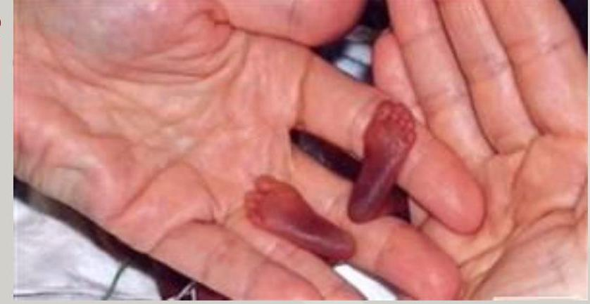

Christine Boulos, PharmD, BCPS
*NICU Clinical Specialist Pharmacist*

Elizabeth Stanway-Mayers, RD, MS, CSP, CNSC
*NICU Clinical Dietician*

--- page 1 ---

# Learning Objectives 

- Briefly discuss parenteral nutrition goals
- Review the current parenteral nutrition (PN) ordering process at Lucile Packard Children's Hospital at Stanford
- Review differences between Premie Day 1 TPN and Neonatal TPN Protocol

--- page 2 ---

# Nutrition Goals

- Minimize extra-uterine growth restriction
- Prevent excessive weight loss (up to 10% within first 7-14 days is normal)
- Optimize fluid, calories, and micronutrients to prevent deficits with ultimate goal of advancing for growth and proper development

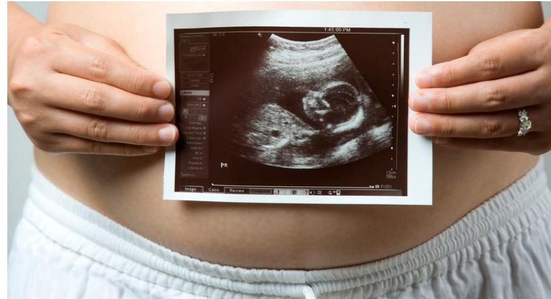

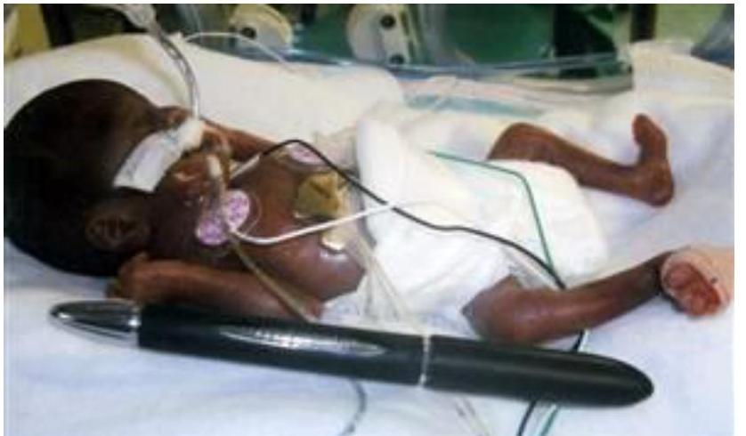

--- page 3 ---

# PN Calorie Goals

|  Maintenance | Growth  |
| --- | --- |
|  60-80 kcal/kg/day | 70-100 kcal/kg/day  |

**Term:** 80-100

**Preterm:** 90-100

**Pulmonary/heart disease:** 100-120

--- page 4 ---

# Macronutrients

|  Macronutrient | Calories (kcal/gm) | Maximum  |
| --- | --- | --- |
|  Lipid | $\sim 10(2 \mathrm{kcal} / \mathrm{ml})$ | IL, SMOF  |
|   |  | Omegaven  |
|  Protein | 4 | $4 \mathrm{~g} / \mathrm{kg} / \mathrm{d}$  |
|  Dextrose | 3.4 | GIR $<14 \mathrm{mg} / \mathrm{kg} / \mathrm{min}$ (usual); up to $18 \mathrm{mg} / \mathrm{kg} / \mathrm{min}$  |

Key Abbreviations: Intralipid (IL), Smoflipid (SMOF), glucose infusion rate (GIR)

--- page 5 ---

# Lipids

- Not to exceed 50-60\% total calories (exception ketogenic/metabolic)
- Decrease once advancing on feeds
- Caution with other lipid-containing meds (clevidipine, propofol)
- Monitoring: TG $\leq 250-400$, triene:tetraene ratio if risk of EFAD

|   | Intralipid (20\%) | Smoflipid (20\%) | Omegaven (10\%)  |
| --- | --- | --- | --- |
|  Oil source | Soybean oil | Soybean oil, medium-chain
triglycerides (MCTs), olive oil, fish oil | Fish oil  |
|  Lipid
composition | Omega-6 | Omega-3
Omega-6 | Omega-3  |
|  Initial dose | $0.5-1 \mathrm{~g} / \mathrm{kg} / \mathrm{d}$ | $0.5-1 \mathrm{~g} / \mathrm{kg} / \mathrm{d}$ | $1 \mathrm{~g} / \mathrm{kg} / \mathrm{d}$  |
|  Advance by | $0.5-1 \mathrm{~g} / \mathrm{kg} / \mathrm{d}$ | $0.5-1 \mathrm{~g} / \mathrm{kg} / \mathrm{d}$ | $0.5 \mathrm{~g} / \mathrm{kg} / \mathrm{d}$  |
|  Minimum dose
to prevent EFAD | $0.5 \mathrm{~g} / \mathrm{kg} / \mathrm{d}$
$1 \mathrm{~g} / \mathrm{kg} / \mathrm{d}$ (extremely preterm) | $1.5 \mathrm{~g} / \mathrm{kg} / \mathrm{d}$
$2.5 \mathrm{~g} / \mathrm{kg} / \mathrm{d}$ (extremely preterm) | $1 \mathrm{~g} / \mathrm{kg} / \mathrm{d}$  |
|  Use Restriction | No | Yes (if no lipid shortages) | Yes  |

--- page 6 ---

# Restricted Lipid Emulsions 

## SMOFlipid

- Only FDA-approved for use in adults, but has been studied in neonates for PN-associated cholestasis (PNAC)
$>$ LPCH restrictions:
- Neonate with birthweight $<1 \mathrm{~kg}$
- Anticipated PN use $>21$ days and intestinal failure, elevated LFTs, elevated direct bilirubin $>2$
- GI consult or Nutrition Support Team (NST) consult

## Omegaven

- Studies show faster resolution of PNAC with Omegaven when compared to Intralipid
$>$ LPCH restrictions: GI consult or NST consult required prior to initiation

--- page 7 ---

# Amino Acids and Acetate 

- Trophamine is the amino acid formulation used for our neonates
- More comparable to amino acid patterns of breastfed infants
- Associated with decreased cholestasis
- May initiate at $3 \mathrm{~g} / \mathrm{kg} /$ day or max
- Caution in patients with renal disease, severe azotemia, and inborn errors of metabolism
- Trophamine $1 \mathrm{gm} / \mathrm{kg}$ provides acetate $1 \mathrm{mEq} / \mathrm{kg}$
- Minimum acetate (mEq/kg) = amino acid dose (gm/kg)

--- page 8 ---

# Glucose Infusion Rate (GIR)

- Newborns require minimum GIR of ~4-6 mg/kg/min
- Healthy term infants may not need IV dextrose to meet glucose requirements
- Most patients can be initiated on D10W if IV dextrose is needed
- Extremely low birthweight (ELBW) patients may have impaired glucose tolerance → may consider initiating D5W
- Sudden drops in GIR → hypoglycemia risk (watch when weaning)

|  Risk Factors for Hypoglycemia |  |  |  |   |
| --- | --- | --- | --- | --- |
|  Decreased substrate | Hyperinsulinemia | Endocrine conditions | High glucose utilization | Congenital  |
|  IUGR, prolonged fasting, prematurity | Diabetic mother, abrupt cessation of IV glucose* | Adrenal insufficiency, hypothyroidism | Cold stress, sepsis, increased work of breathing | CHD, CNS abnormalities, polycythemia  |

--- page 9 ---

# Calculating GIR 

$$
\operatorname{GIR}(m g / k g / \min )=\frac{\% \text { Dextrose } * \text { rate of infusion }(m L / h r) \cdot \frac{10}{\text { Weight }(k g) * 6} * \frac{11}{11}
$$

Alternatively:
GIR= (\% dextrose) x (total fluids (mL/kg/day)) x (1/144) x (10/11)
*Note: "10/11" correction factor converts dextrose monohydrate to equivalent anhydrous glucose (LPCH NICU-specific)

## Practice time!

- D12\% @ $11 \mathrm{ml} / \mathrm{hr}$ (3.2 kg patient)
- D10\% @ $120 \mathrm{~mL} / \mathrm{kg} /$ day

--- page 10 ---

# Pop Quiz!

What is the GIR of a 3.2 kg patient running D10W @ 11 ml/hr?

- A. 4.8 mg/kg/min
- B. 5.2 mg/kg/min
- C. 5.7 mg/kg/min
- D. 6.1 mg/kg/min

--- page 11 ---

# Patient Case

Ex-25w0d, birthweight 0.87 kg, RDS, PDA

**How would you start Day1 TPN?**

--- page 12 ---

# Patient Case 

## Ex-25w0d, birthweight 0.87 kg , RDS, PDA

## NUTRITION ASSESSMENT:

- Re-gain BW by DOL\#14, then Goal Wt Gain: $+20 \mathrm{gm} / \mathrm{kg} /$ day

## Nutrition Goals

Fluid Goals: $150-180 \mathrm{ml} / \mathrm{kg} / \mathrm{d}$ or per NNP/MD
Kcal/kg/day
TPN Pre-term: 90-100
TPN \& Enteral Pre-term: 110-120
Enteral Pre-term: 130+
Prot gm/kg/day 3.5-4
Fat gm/kg/day 2.5-3
CHO mg/kg/min <12
Ca:Phos Ratio (mg:mg) 1.3-1.7:1

## Refer to the RD note for nutritional goals and recommendations

NUTRITION DIAGNOSIS: Increased nutrient requirements related to prematurity as evidenced by elevated calorie, protein, and vitamin/mineral requirements to mimic intrauterine growth.

## RECOMMENDATIONS/INTERVENTIONS/MONITORING:

As able:

1. Advance AA @ $3.5 \mathrm{gm} / \mathrm{kg} /$ day or max

- pending tolerance, advance by $0.5 \mathrm{gm} / \mathrm{kg} /$ day $Q$ day as tolerated to goal of $4 \mathrm{gm} / \mathrm{kg} /$ day

2. Advance SMOF lipid to $2 \mathrm{gm} / \mathrm{kg} /$ day and advance by $0.5-1 \mathrm{gm} / \mathrm{kg} /$ day $Q$ day as tolerated to goal of $3 \mathrm{gm} / \mathrm{kg} /$ day
3. Pending glucose clearance, increase Dextrose by $1-2 \mathrm{mg} \mathrm{CHO} / \mathrm{kg} / \mathrm{min} \mathrm{Q}$ day as tolerated to goal of $11 \mathrm{mg} \mathrm{CHO} / \mathrm{kg} / \mathrm{min}$
4. Calcium Goal: $500 \mathrm{mg} / \mathrm{kg} /$ day
5. Phos Goal: $1 \mathrm{mM} / \mathrm{kg} /$ day
6. Trophic feeds using MBM (or BBM if no MBM available) @ 2 mL Q 3 hrs ( $18 \mathrm{~mL} / \mathrm{kg} / \mathrm{d}$ ) per pathway - as able and safe

--- page 13 ---

# Patient Case: Day 1 TPN

## Ex-25w0d, birthweight 0.87 kg, RDS, PDA

|  Parenteral nutrition therapy day # 1 |   |
| --- | --- |
|  Dosing weight: 0.87 kgs. Total Fluid Intake: 100 mls/kg/day |   |
|  Patient to receive 71 mls/24 hrs @ 2.9 ml/hr |   |
|  Fat infused separately: 4.4 mls @ 0.2 ml/hr for 24 hrs |   |
|  Administer PN via CENTRAL LINE ONLY |   |
|  Fat Emulsion (SMDFlipid 20\%): 1 gm/kg/day |   |
|  Amino Acid (TrophAmine 10\%): 3 gm/kg/day |   |
|  PN Dextrose 12\% provides 9.75 gm/kg/day |   |
|  ADDITIVES Per [ Units ] Per Day |   |
|  Zinc | $400 \mathrm{mcg} / \mathrm{kg}$  |
|  Pedi MVI | $2 \mathrm{ml} / \mathrm{kg}$  |
|  Sodium | $2.1 \mathrm{mEq} / \mathrm{kg}$  |
|  Calcium Gluconate | $400 \mathrm{mg} / \mathrm{kg}$  |
|  Phosphate | $0.4 \mathrm{mM} / \mathrm{kg}$  |
|  Acetate | $2.8 \mathrm{mEq} / \mathrm{kg}$  |
|  Chloride | $1.2 \mathrm{mEq} / \mathrm{kg}$  |
|  Heparin | $0.5 \mathrm{units} / \mathrm{ml}$  |
|  Copper | $20 \mathrm{mcg} / \mathrm{kg}$  |
|  Selenium | $3 \mathrm{mcg} / \mathrm{kg}$  |
|  PN Osmolarity: 976 mOsm/Liter |   |
|  PN including Fat Emulsion provides 55.1 Kcal/kg |   |
|  Fat | $18.1 \%$  |
|  Protein | $21.8 \%$  |
|  Carbohydrate: | $60.1 \%$  |
|  Non-protein Calories - GM Nitrogen Ratio (PN): 93:1 |   |
|  Non-Nutritional Lines and Drugs contribute: |   |
|  1.06 mEq/kg Sodium, 1.06 mEq/kg Chloride, and $13.79 \mathrm{mls} / \mathrm{kg}$ water |   |
|  1-UAC- 1/2 NS | $0.5 \mathrm{ml}$  |
|  Glucose Infusion Rate (PN): 6.16 mg/kg/min |   |
|  Calcium:Phosphate Ratio (PN) 2.98:1 (mg:mg) |   |
|  Chloride:Acetate Ratio (PN) 0.43:1 |   |
|  Heparin infusion rate: 1.69 Units/kg/hr |   |
|  Max Potassium infusion rate: $0 \mathrm{mEq} / \mathrm{kg} / \mathrm{hr}$ or $0 \mathrm{mEq} / \mathrm{hr}$ |   |
|  Fat infusion rate, all sources: $0.04 \mathrm{gm} / \mathrm{kg} / \mathrm{hr}$ or $0.04 \mathrm{gm} / \mathrm{hr}$ |   |

Lucile Packard Children's Hospital Stanford

--- page 14 ---

# Acetate and Chloride 

- Chloride dose is calculated from the dose of acetate in Infusion Studio (i.e. there is not an option to enter to chloride)
- In stable patients with no metabolic derangements, consider a acetate:chloride ratio 1:1 (50\% acetate)
- Titrated to maintain acid/base balance
- For patients with low chloride (often secondary to diuretics), chloride may be maximized in the TPN by minimizing acetate
- Consider increasing K as tolerated based on serum levels to provide more chloride

--- page 15 ---

# Trace Elements 

- Zinc and copper initially added for all patients
- Copper dose reduction considered for d. bili $>2$
- Check copper, zinc, and selenium levels after 1 month of PN
- Addition of selenium to neonatal PN:
- Preterm neonates (GA <37 weeks) at initiation
- Dose: $3 \mathrm{mcg} / \mathrm{kg} /$ day
- Low selenium levels
- Dose: $2 \mathrm{mcg} / \mathrm{kg} /$ day or per RD recommendation

--- page 16 ---

# Trace Elements

- Trace element labs can be affected by inflammatory states
- Levels may be altered if checked during active infection or inflammation

|  Trace
Element | Lab value effect
with elevated CRP  |
| --- | --- |
|  Copper | ↑  |
|  Zinc | ↓  |
|  Selenium | ↓  |

--- page 17 ---

# Electrolytes 

- Sodium:
- Minimize in $1^{\text {st }}$ DOL
- Maintenance: 2-5 mEq/kg/d
- Potassium:
- None in $1^{\text {st }}$ DOL
- Maintenance: 2-4 mEq/kg/d
- Magnesium:
- Did Mom receive Mg??

--- page 18 ---

# Electrolytes

- Sodium or potassium are needed for additional acetate, chloride, or phosphate

|  Electrolyte | Salt Form  |
| --- | --- |
|  Sodium | Chloride, acetate, phosphate  |
|  Potassium | Chloride, acetate, phosphate  |
|  Chloride | Sodium, potassium  |
|  Acetate | Sodium, potassium  |
|  Calcium | Gluconate*, chloride  |
|  Phosphorus | Sodium, potassium  |
|  Magnesium | Sulfate*, chloride  |

--- page 19 ---

# Calcium:Phosphorus Ratio

- Optimal ratio: 1.3-1.7 (mg Ca):1 (mg Phos)
- Maintain calcium and phosphorus homeostasis
- Prevent bone demineralization and promote net bone production
- Peripheral PN: Calcium limited to 0-200 mg/kg/day (vesicant)

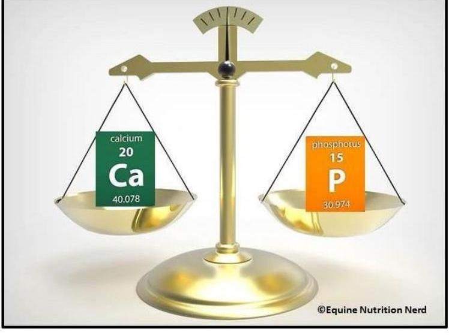

--- page 20 ---

# Other Additives 

- IV multivitamin
$\diamond$ Current drug shortage:
- Neonates up to 30 days old (or PMA <44wk) $\rightarrow$ daily MVI
- All other patients $\rightarrow$ MVI only Mon-Wed, add thiamine Thursday
- Heparin
- Peripheral line: No heparin needed
- Central line: Add 0.5 units heparin/mL
- Cysteine
$\diamond$ LPCH Restriction: Neonates with prolonged/expected prolonged TPN use for $>2$ weeks AND birth weight $<1.5 \mathrm{~kg}$
- Levocarnitine
- Famotidine
- Others may be available, please contact Pharmacy if unsure!

--- page 21 ---

# Patient Case: Day 3 TPN

## Ex-25w0d, birthweight 0.87 kg, RDS, PDA

- **Parenteral nutrition therapy day # 3**
- **Dosing weight:** 0.87 kgs
- **Total Fluid Intake:** 170 mls/kg/day
- **Patient to receive 103 mls/24 hrs @ 4.3 ml/hr**
- **Fat infused separately:** 8.7 mls @ 0.4 ml/hr for 24 hrs
- **Administer PN via CENTRAL LINE ONLY**
- **Fat Emulsion (SMOFlipid 20%): 2 gm/kg/day**
- **Amino Acid (TrophAmine 10%): 3.5 gm/kg/day**
- **PN Dextrose 7.5% provides 8.9 gm/kg/day**

### ADDITIVES

|  **Part** | **Percentage**  |
| --- | --- |
|  Zinc | 400 mg/kg  |
|  Pedi MVI | 2 ml/kg  |
|  Sodium | 4 mEq/kg  |
|  Potassium | 0.5 mEq/kg  |
|  Calcium Gluconate | 400 mg/kg  |
|  Phosphate | 0.6 mEq/kg  |
|  Acetate | 6.4 mEq/kg  |
|  Chloride | 0.1 mEq/kg  |
|  Heparin | 0.5 units/ml  |
|  Copper | 20 mg/kg  |
|  Selenium | 3 mcg/kg  |
|  PN Osmolarity: 672 mOsm/Liter |   |
|  PN including Fat Emulsion provides 64.2 Kcal/kg |   |
|  **Fat** | **20 Kcal/kg**  |
|  **Protein** | **14 Kcal/kg**  |
|  **Carbohydrate** | **30.2 Kcal/kg**  |
|  **Non-protein Calories** | **0.93:1**  |
|  **Non-Nutritional Lines and Drugs contribute:** |   |
|  3.19 mEq/kg Sodium, 3.19 mEq/kg of Acetate, and 41.38 mEq/kg water |   |
|  1-1/2 Ma Acetate | 1.5 ml per hr  |
|  **Glucose Infusion Rate (PN):** 5.62 mg/kg/min |   |
|  **Calcium:Phosphate Ratio (PN) 1.98:1 (mg:mg)** |   |
|  **Chloride:Acetate Ratio (PN) 0.02:1** |   |
|  **Heparin infusion rate:** 2.47 Units/kg/hr |   |
|  **Max Potassium infusion rate:** 0.02 mEq/kg/hr or 0.02 mEq/hr |   |
|  **Fat infusion rate, all sources:** 0.08 gm/kg/hr or 0.07 gm/hr |   |

### GENERAL CHEMISTRY

|  **Part** | **Percentage**  |
| --- | --- |
|  Sodium, Ser/Plas | 150  |
|  Potassium, Ser/Plas | 3.7  |
|  Chloride, Ser/Plas | 117  |
|  CO2, Ser/Plas | 21  |
|  Urea Nitrogen, Ser/Plas | 29  |
|  Creatinine, Ser/Plas | 0.99  |
|  eGFR | N/A  |
|  eGFR African American | See comment  |
|  Glucose, Ser/Plas | 172  |
|  Anion Gap | 12  |
|  Calcium, Ser/Plas | 8.2  |
|  Phosphorus, Ser/Plas | 4.2  |
|  Bilirubin, Total | 3.5  |
|  Bilirubin, Direct |   |
|  AST (SGOT), Ser/Plas |   |
|  ALT (SGPT), Ser/Plas |   |
|  Alk P TASE, Total |   |
|  Albumin, Ser/Plas | 2.6  |
|  Protein, Total |   |
|  Globulin |   |
|  Magnesium, Ser/Plas | 4.2  |
|  Gamma-Glutamyl Trans |   |
|  Triglyceride, Ser/Plas | 90  |
|  Free T4 |   |
|  TSH |   |
|  **GLUCOSE BY METER** |   |
|  Glucose by Meter | 199  |

Labs (Day 2-3 TPN) UOP ~5 mL/kg/day

### SURVEYS

|  **Part** | **Percentage**  |
| --- | --- |
|  **GENERAL CHEMISTRY** |   |
|  **Gastroenterology** |   |
|  Sodium, Ser/Plas | 150  |
|  Potassium, Ser/Plas | 3.7  |
|  Chloride, Ser/Plas | 117  |
|  CO2, Ser/Plas | 21  |
|  Urea Nitrogen, Ser/Plas | 29  |
|  Creatinine, Ser/Plas | 0.99  |
|  eGFR | N/A  |
|  eGFR African American | See comment  |
|  Glucose, Ser/Plas | 172  |
|  Anion Gap | 12  |
|  Calcium, Ser/Plas | 8.2  |
|  Phosphorus, Ser/Plas | 4.2  |
|  Bilirubin, Total | 3.5  |
|  Bilirubin, Direct |   |
|  AST (SGOT), Ser/Plas |   |
|  ALT (SGPT), Ser/Plas |   |
|  Alk P TASE, Total |   |
|  Albumin, Ser/Plas | 2.6  |
|  Protein, Total |   |
|  Globulin |   |
|  Magnesium, Ser/Plas | 4.2  |
|  Gamma-Glutamyl Trans |   |
|  Triglyceride, Ser/Plas | 90  |
|  Free T4 |   |
|  TSH |   |
|  **GLUCOSE BY METER** |   |
|  Glucose by Meter | 199  |

Lacile Packard Children's Hospital Stanford

--- page 22 ---

# Patient Case: Day 1-5 Growth

Ex-25w0d, birthweight 0.87 kg, RDS, PDA

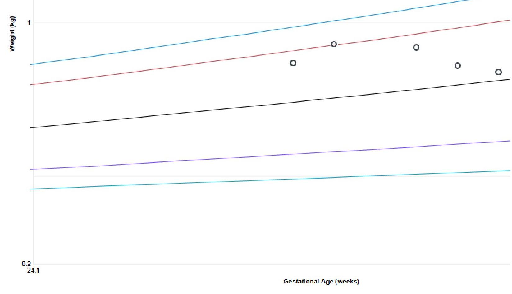

--- page 23 ---

# CPQCC Toolkit

## California Perinatal Quality Care Collaborative

Total Parenteral Nutrition for VLBW Infants

|  Nutrient | Initiate | Advance | Goal | Other Info  |
| --- | --- | --- | --- | --- |
|  Amino Acids | $3 \mathrm{~g} / \mathrm{kg} /$ day (or maximum allowed if volume restricted) | $0.5-1 \mathrm{~g} / \mathrm{kg} /$ day (dependent on volume and renal function) | $4 \mathrm{~g} / \mathrm{kg} /$ day |   |
|  Fat | $0.5-2 \mathrm{~g} / \mathrm{kg} /$ day | $0.5-1 \mathrm{~g} / \mathrm{kg} /$ day (depending on volume and tolerance) | $3 \mathrm{~g} / \mathrm{kg} /$ day | Dose may need to be restricted if PNAC develops  |
|  Carbohydrate | $4-6 \mathrm{mg} \mathrm{CHO} / \mathrm{kg} / \mathrm{min}$ | $1-2 \mathrm{mg} \mathrm{CHO} / \mathrm{kg} / \mathrm{min}$ | $<12 \mathrm{mg} \mathrm{CHO} / \mathrm{kg} / \mathrm{min}$ |   |
|  Pediatric IV Multivitamin | $2 \mathrm{~mL} / \mathrm{kg} /$ day (Goal) |  |  |   |
|  Sodium | $0-1 \mathrm{mEq} / \mathrm{kg} /$ day | $0-1 \mathrm{mEq} / \mathrm{kg} /$ day | $2-4 \mathrm{mEq} / \mathrm{kg} /$ day | May need more, adjust dose per labs  |
|  Potassium | $0-0.5 \mathrm{mEq} / \mathrm{kg} /$ day | $0-1 \mathrm{mEq} / \mathrm{kg} /$ day | $2-4 \mathrm{mEq} / \mathrm{kg} /$ day | May need more, adjust dose per labs  |
|  Calcium | Up to $400 \mathrm{mg} / \mathrm{kg} /$ day | $50-200 \mathrm{mg} / \mathrm{kg} /$ day | $400-600 \mathrm{mg} / \mathrm{kg} /$ day | Ideal Ca:Phos ratio $=1.3-$ 1.7 mg Ca: 1 mg Phos  |
|  Phosphorous | Up to $0.5 \mathrm{mM} / \mathrm{kg} /$ day | $0.5-1 \mathrm{mM} / \mathrm{kg} /$ day | $1-2 \mathrm{mM} / \mathrm{kg} /$ day |   |
|  Magnesium | $0-0.2 \mathrm{mEq} / \mathrm{kg} /$ day* |  | $0.2-0.3 \mathrm{mEq} / \mathrm{kg} /$ day | *do NOT give if you know mom received Mg prior to delivery  |

--- page 24 ---

# Enteral + Parenteral Nutrition 

- PN is necessary while advancing enteral nutrition in order to:
- Prevent growth failure
- Prevent excessive weight loss/dehydration
- Provide adequate glucose and protein delivery
- Prevent hypocalcemia

Adjust parenteral nutrition appropriately as feeds increase or decrease to ensure adequate nutrition for our babies!

--- page 25 ---

# Patient Case: PN + EN

Ex-25w0d, birthweight 0.87 kg, RDS, PDA

## NUTRITION HISTORY:

- TPN started 8/12
- 8/21-22 enteral feeds reduced ~40 mL/kg while receiving indomethacin

|  Parameter | Value  |
| --- | --- |
|  Parenteral nutrition therapy day # | 9  |
|  Dosing weight: 0.87 kgs. Total Fluid Intake: 150 mls/kg/day |   |
|  Patient to receive 43 mls/24 hrs @ 1.8 ml/hr |   |
|  Administer PN via CENTRAL LINE ONLY |   |
|  Fat Emulsion: 0 gm/kg/day |   |
|  Amino Acid (TrophAmine 10%): 1.8 gm/kg/day |   |
|  PN Dextrose 16% provides 7.82 gm/kg/day |   |
|  ADDITIVES Per [ Units ] Per Day |   |
|  Zinc | 400 mcg/kg  |
|  Pedi MVI | 2 ml/kg  |
|  Sodium | 3 mEq/kg  |
|  Potassium | 0.5 mEq/kg  |
|  Calcium Gluconate | 350 mg/kg  |
|  Phosphate | 0.7 mM/kg  |
|  Acetate | 3 mEq/kg  |
|  Chloride | 0.9 mEq/kg  |
|  Heparin | 0.5 units/ml  |
|  Copper | 20 mcg/kg  |
|  Selenium | 3 mcg/kg  |
|  PN Osmolarity: 1303 mOsm/Liter |   |
|  PN provides 33.8 Kcal/kg |   |
|  Fat | 0.5 Kcal/kg  |
|  Protein | 21.3 %  |
|  Carbohydrate | 78.7 %  |
|  Non-protein Calories |   |
|  GM Nitrogen Ratio (PN): 95:1 |   |
|  Enteral feeding: 11 ml @ 3 hrs of Full strength Breast Milk/MBM |   |
|  (0.68 cal/ml) provides 67.4 Kcal/kg and 101.1 ml/kg |   |
|  Total Kcals (all sources): 101.2 Kcal/kg |   |
|  Glucose Infusion Rate (PN): 4.94 mg/kg/min |   |
|  Calcium:Phosphate Ratio (PN) 1.49:1 (mg/mg) |   |
|  Chloride:Acetate Ratio (PN) 0.3:1 |   |
|  Heparin infusion rate: 1.02 Units/kg/hr |   |
|  Max Potassium infusion rate: 0.02 mEq/kg/hr or 0.02 mEq/hr |   |

--- page 26 ---

# Patient Case: PN + EN

Ex-25w0d, birthweight 0.87 kg, RDS, PDA

## NUTRITION HISTORY:

- TPN started 8/12
- 8/21-22 enteral feeds reduced ~40 mL/kg while receiving indomethacin

|  Parameter | Value  |
| --- | --- |
|  Parenteral nutrition therapy day # | 9  |
|  Dosing weight: 0.87 kgs. | Total Fluid Intake: 150 mls/kg/day  |
|  Patient to receive 43 mls/24 hrs @ 1.8 ml/hr |   |
|  Administer PN via CENTRAL LINE ONLY |   |
|  Fat Emulsion: 0 gm/kg/day |   |
|  Amino Acid (TrophAmine 10%): 1.8 gm/kg/day |   |
|  PN Dextrose 16% provides 7.82 gm/kg/day |   |
|  ADDITIVES Per [ Units ] Per Day |   |
|  Zinc | 400 mcg/kg  |
|  Pedi MVI | 2 ml/kg  |
|  Sodium | 3 mEq/kg  |
|  Potassium | 0.5 mEq/kg  |
|  Calcium Gluconate | 350 mg/kg  |
|  Phosphate | 0.7 mM/kg  |
|  Acetate | 3 mEq/kg  |
|  Chloride | 0.9 mEq/kg  |
|  Heparin | 0.5 units/ml  |
|  Copper | 20 mcg/kg  |
|  Selenium | 3 mcg/kg  |
|  PN Osmolarity: 1303 mOsm/Liter |   |
|  PN provides 33.8 Kcal/kg |   |
|  Fat | 0.5 Kcal/kg  |
|  Protein | 21.3 %  |
|  Carbohydrate | 78.7 %  |
|  Non-protein Calories |   |
|  GM Nitrogen Ratio (PN): 95:1 |   |
|  Enteral feeding: 11 ml Q 3 hrs of Full strength Breast Milk/MBM |   |
|  (0.68 cal/ml) provides 67.4 Kcal/kg and 101.1 ml/kg |   |
|  Total Kcals (all sources): 101.2 Kcal/kg |   |
|  Glucose Infusion Rate (PN): 4.94 mg/kg/min |   |
|  Calcium:Phosphate Ratio (PN) 1.49:1 (mg:mg) |   |
|  Chloride:Acetate Ratio (PN) 0.3:1 |   |
|  Heparin infusion rate: 1.02 Units/kg/hr |   |
|  Max Potassium infusion rate: 0.02 mEq/kg/hr or 0.02 mEq/hr |   |

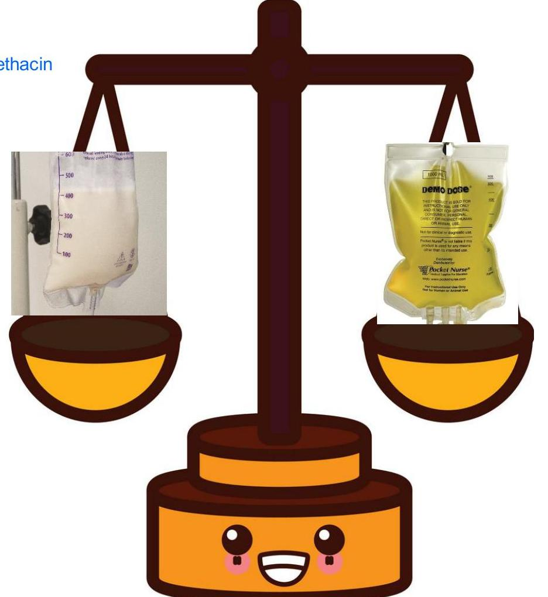

--- page 27 ---

# Patient Case: Day 9 to 10 TPN

Ex-25w0d, birthweight 0.87 kg, RDS, PDA

|  Parenteral nutrition therapy day # |  |   |
| --- | --- | --- |
|  Dosing weight: 0.87 kgs. Total Fluid Intake: 150 mls/kg/day |  |   |
|  Patient to receive 43 mls/24 hrs @ 1.8 ml/hr |  |   |
|  Administer PN via CENTRAL LINE ONLY |  |   |
|  Fat Emulsion: 0 gm/kg/day |  |   |
|  Amino Acid (TrophAmine 10%): 1.8 gm/kg/day |  |   |
|  PN Dextrose 16% provides 7.82 gm/kg/day |  |   |
|  ADDITIVES Per [ Units ] Per Day |  |   |
|  Zinc | 400 mcg/kg |   |
|  Pedi MVI | 2 ml/kg |   |
|  Sodium | 3 mEq/kg |   |
|  Potassium | 0.5 mEq/kg |   |
|  Calcium Gluconate | 350 mg/kg |   |
|  Phosphate | 0.7 mM/kg |   |
|  Acetate | 3 mEq/kg |   |
|  Chloride | 0.9 mEq/kg |   |
|  Heparin | 0.5 units/ml |   |
|  Copper | 20 mcg/kg |   |
|  Selenium | 3 mcg/kg |   |
|  PN Osmolarity: 1303 mOsm/Liter |  |   |
|  PN provides 33.8 Kcal/kg |  |   |
|  Fat | 0.5 | 0 Kcal/kg  |
|  Protein | 21.3 % | 7.2 Kcal/kg  |
|  Carbohydrate | 78.7 % | 26.6 Kcal/kg  |
|  Non-protein Calories - GM Nitrogen Ratio (PN): 95:1 |  |   |
|  Enteral feeding: 11 ml Q 3 hrs of Full strength Breast Milk/MBM (0.68 cal/ml) provides 67.4 Kcal/kg and 101.1 ml/kg |  |   |
|  Total Kcals (all sources): 101.2 Kcal/kg |  |   |
|  Glucose Infusion Rate (PN): 4.94 mg/kg/min |  |   |
|  Calcium:Phosphate Ratio (PN) 1.49:1 (mg:mg) |  |   |
|  Chloride:Acetate Ratio (PN) 0.3:1 |  |   |
|  Heparin infusion rate: 1.02 Units/kg/hr |  |   |
|  Max Potassium infusion rate: 0.02 mEq/kg/hr or 0.02 mEq/hr |  |   |

|  Parenteral nutrition therapy day # |  |   |
| --- | --- | --- |
|  Dosing weight: 0.87 kgs. Total Fluid Intake: 150 mls/kg/day |  |   |
|  Patient to receive 99 mls/24 hrs @ 4.1 ml/hr |  |   |
|  Administer PN via CENTRAL LINE ONLY |  |   |
|  Fat Emulsion: 0 gm/kg/day |  |   |
|  Amino Acid (TrophAmine 10%): 1.8 gm/kg/day |  |   |
|  PN Dextrose 7% provides 7.93 gm/kg/day |  |   |
|  ADDITIVES Per [ Units ] Per Day |  |   |
|  Zinc | 400 mcg/kg |   |
|  Pedi MVI | 2 ml/kg |   |
|  Sodium | 3 mEq/kg |   |
|  Potassium | 0.5 mEq/kg |   |
|  Calcium Gluconate | 350 mg/kg |   |
|  Phosphate | 0.7 mM/kg |   |
|  Acetate | 3 mEq/kg |   |
|  Chloride | 0.9 mEq/kg |   |
|  Heparin | 0.5 units/ml |   |
|  Copper | 20 mcg/kg |   |
|  Selenium | 3 mcg/kg |   |
|  PN Osmolarity: 567 mOsm/Liter |  |   |
|  PN provides 34.1 Kcal/kg |  |   |
|  Fat | 0.5 | 0 Kcal/kg  |
|  Protein | 21.1 % | 7.2 Kcal/kg  |
|  Carbohydrate | 78.9 % | 26.9 Kcal/kg  |
|  Non-protein Calories - GM Nitrogen Ratio (PN): 97:1 |  |   |
|  Enteral feeding: 4 ml Q 3 hrs of Full strength Breast Milk/MBM (0.68 cal/ml) provides 24.5 Kcal/kg and 36.8 ml/kg |  |   |
|  Total Kcals (all sources): 58.7 Kcal/kg |  |   |
|  Glucose Infusion Rate (PN): 5.01 mg/kg/min |  |   |
|  Calcium:Phosphate Ratio (PN) 1.49:1 (mg:mg) |  |   |
|  Chloride:Acetate Ratio (PN) 0.3:1 |  |   |
|  Heparin infusion rate: 2.36 Units/kg/hr |  |   |
|  Max Potassium infusion rate: 0.02 mEq/kg/hr or 0.02 mEq/hr |  |   |

Lucile Packard Children's Hospital Stanford

--- page 28 ---

# Patient Case: Day 10 to 11 TPN

## Ex-25w0d, birthweight 0.87 kg, RDS, PDA

Parenteral nutrition therapy day # 10 Dosing weight: 0.87 kgs . Total Fluid Intake: $150 \mathrm{mls} / \mathrm{kg} /$ day Patient to receive $99 \mathrm{mls} / 24 \mathrm{hrs}$ @ $4.1 \mathrm{ml} / \mathrm{hr}$ Administer PN via CENTRAL LINE ONLY Fat Emulsion: $0 \mathrm{gm} / \mathrm{kg} /$ day Amino Acid (TrophAmine 10\%): $1.8 \mathrm{gm} / \mathrm{kg} /$ day PN Dextrose $7 \%$ provides $7.93 \mathrm{gm} / \mathrm{kg} /$ day ADDITIVES Per [ Units ] Per Day Zinc $400 \mathrm{mcg} / \mathrm{kg}$ Pedi MVI $2 \mathrm{ml} / \mathrm{kg}$ Sodium $3 \mathrm{mEq} / \mathrm{kg}$ Potassium $0.5 \mathrm{mEq} / \mathrm{kg}$ Calcium Gluconate $350 \mathrm{mg} / \mathrm{kg}$ Phosphate $0.7 \mathrm{mM} / \mathrm{kg}$ Acetate $3 \mathrm{mEq} / \mathrm{kg}$ Chloride $0.9 \mathrm{mEq} / \mathrm{kg}$ Heparin $0.5 \mathrm{units} / \mathrm{ml}$ Copper $20 \mathrm{mcg} / \mathrm{kg}$ Selenium $3 \mathrm{mcg} / \mathrm{kg}$ PN Osmolarity: 567 mOsm/Liter PN provides $34.1 \mathrm{Kcal} / \mathrm{kg}$ Fat $0 \quad 0 \quad 0 \quad 0 \mathrm{Kcal} / \mathrm{kg}$ Protein : $21.1 \quad 7.2 \mathrm{Kcal} / \mathrm{kg}$ Carbohydrate: $78.9 \quad 26.9 \mathrm{Kcal} / \mathrm{kg}$ Non-protein Calories - GM Nitrogen Ratio (PN): 97:1 Enteral feeding: $4 \mathrm{ml} \mathrm{Q} 3 \mathrm{hrs}$ of Full strength Breast Milk/MBM ( $0.68 \mathrm{cal} / \mathrm{ml}$ ) provides $24.5 \mathrm{Kcal} / \mathrm{kg}$ and $36.8 \mathrm{ml} / \mathrm{kg}$ Total Kcals (all sources): $58.7 \mathrm{Kcal} / \mathrm{kg}$ Glucose Infusion Rate (PN): $5.01 \mathrm{mg} / \mathrm{kg} / \mathrm{min}$ Calcium:Phosphate Ratio (PN) $1.49: 1(\mathrm{mg}: \mathrm{mg})$ Chloride:Acetate Ratio (PN) 0.3:1 Heparin infusion rate: $2.36 \mathrm{Units} / \mathrm{kg} / \mathrm{hr}$ Max Potassium infusion rate: $0.02 \mathrm{mEq} / \mathrm{kg} / \mathrm{hr}$ or $0.02 \mathrm{mEq} / \mathrm{hr}$

Parenteral nutrition therapy day # 11 Dosing weight: 0.87 kgs . Total Fluid Intake: $150 \mathrm{mls} / \mathrm{kg} /$ day Patient to receive $99 \mathrm{mls} / 24 \mathrm{hrs}$ @ $4.1 \mathrm{ml} / \mathrm{hr}$ Administer PN via CENTRAL LINE ONLY Fat Emulsion: $0 \mathrm{gm} / \mathrm{kg} /$ day Amino Acid (TrophAmine 10\%): $1.8 \mathrm{gm} / \mathrm{kg} /$ day PN Dextrose $7 \%$ provides $7.93 \mathrm{gm} / \mathrm{kg} /$ day ADDITIVES Per [ Units ] Per Day Zinc $400 \mathrm{mcg} / \mathrm{kg}$ Pedi MVI $2 \mathrm{ml} / \mathrm{kg}$ Sodium $3 \mathrm{mEq} / \mathrm{kg}$ Potassium $0.3 \mathrm{mEq} / \mathrm{kg}$ Calcium Gluconate $350 \mathrm{mg} / \mathrm{kg}$ Phosphate $0.7 \mathrm{mM} / \mathrm{kg}$ Acetate $3 \mathrm{mEq} / \mathrm{kg}$ Chloride $0.7 \mathrm{mEq} / \mathrm{kg}$ Heparin $0.5 \mathrm{units} / \mathrm{ml}$ Copper $20 \mathrm{mcg} / \mathrm{kg}$ Selenium $3 \mathrm{mcg} / \mathrm{kg}$ PN Osmolarity: 563 mOsm/Liter PN provides $34.1 \mathrm{Kcal} / \mathrm{kg}$ Fat $0 \quad 0 \quad 0 \quad 0 \mathrm{Kcal} / \mathrm{kg}$ Protein : $21.1 \quad 7.2 \mathrm{Kcal} / \mathrm{kg}$ Carbohydrate: $78.9 \quad 26.9 \mathrm{Kcal} / \mathrm{kg}$ Non-protein Calories - GM Nitrogen Ratio (PN): 97:1 Enteral feeding: $4 \mathrm{ml} \mathrm{Q} 3 \mathrm{hrs}$ of Full strength Breast Milk/MBM ( $0.68 \mathrm{cal} / \mathrm{ml}$ ) provides $24.5 \mathrm{Kcal} / \mathrm{kg}$ and $36.8 \mathrm{ml} / \mathrm{kg}$ Total Kcals (all sources): $58.7 \mathrm{Kcal} / \mathrm{kg}$ Glucose Infusion Rate (PN): $5.01 \mathrm{mg} / \mathrm{kg} / \mathrm{min}$ Calcium:Phosphate Ratio (PN) $1.49: 1(\mathrm{mg}: \mathrm{mg})$ Chloride:Acetate Ratio (PN) 0.23:1 Heparin infusion rate: $2.36 \mathrm{Units} / \mathrm{kg} / \mathrm{hr}$ Max Potassium infusion rate: $0.01 \mathrm{mEq} / \mathrm{kg} / \mathrm{hr}$ or $0.01 \mathrm{mEq} / \mathrm{hr}$

--- page 29 ---

# Patient Case: Day 1-12 Growth

Ex-25w0d, birthweight 0.87 kg, RDS, PDA

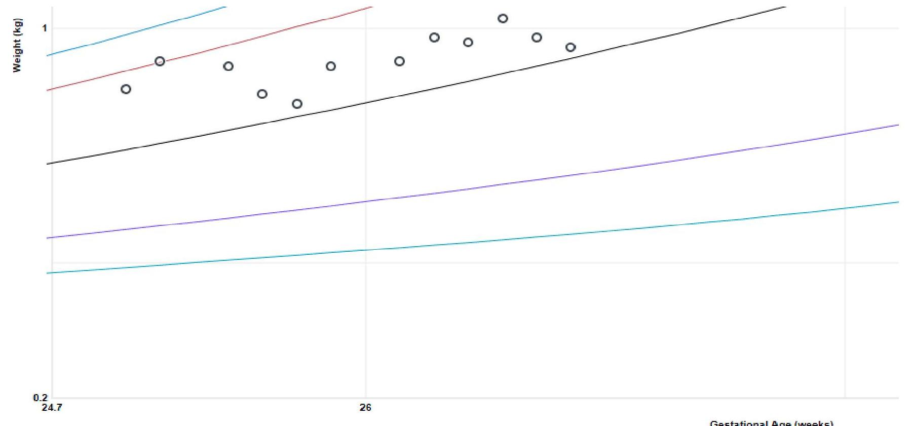

Lucile Packard
Children's Hospital
Stanford

--- page 30 ---

# Labs

- TPN Monitoring orderset may be used to order the lab schedule for patients initiated on TPN
  - Daily labs for the first 5 days, then default to Mon/Thurs
  - Always evaluate if more or less labs are necessary for patients
- When patients are off PN, make sure to evaluate ordered labs and discontinue if unnecessary

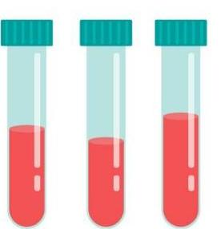

--- page 31 ---

# Line Access and Administration

## Common issues:

- Volume of chaser fluids limiting nutrition $\rightarrow$ consider splitter TPN
- TPN or NICU pharmacist must be notified of splitter TPNs
- Compatibility
- Different limitations for peripheral vs. central

|   | Peripheral Max | Central Max  |
| --- | --- | --- |
|  Dextrose | $12.5 \%$ | $30 \%$  |
|  Potassium | $40 \mathrm{mEq} / \mathrm{L}$ or
$60 \mathrm{mEq} / \mathrm{L}$ (NICU) | $120 \mathrm{mEq} / \mathrm{L}$  |
|  Calcium | $3 \mathrm{~g} / \mathrm{L}$ | $8 \mathrm{~g} / \mathrm{L}$  |
|  Phosphorous | Per Ca/Phos solubility |   |
|  Osmolarity | $950 \mathrm{mOsm} / \mathrm{L}$ | -  |

--- page 32 ---

# PN Process

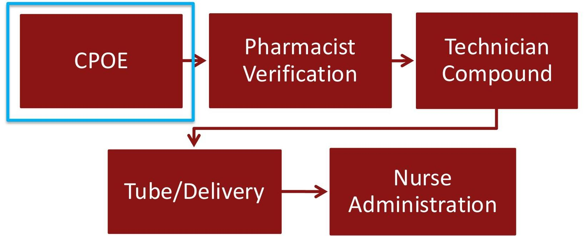

- **CPOE**: Pharmacist Verification
- **CPOE**: Technician Compound
- **Tube/Delivery**: Tube/Delivery
- **Nurse Administration**: Nurse Administration

--- page 33 ---

# PN Process

Orders entered by **2:00 PM**

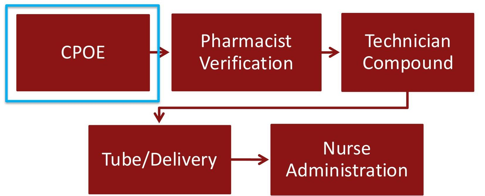

- **CPOE**: Pharmacist Verification
- **CPOE**: Technician Compound
- **Tube/Delivery**: Nurse Administration

--- page 34 ---

# PN Process

## Web Resources

- Bedside Monitor
- Cardiac Cath Images
- Clinical Pathways
- Echocardiology PACS
- Infusion Studio

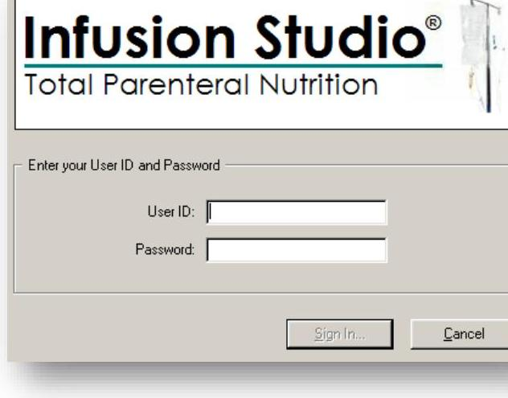

--- page 35 ---

# Step 1: Find Patient

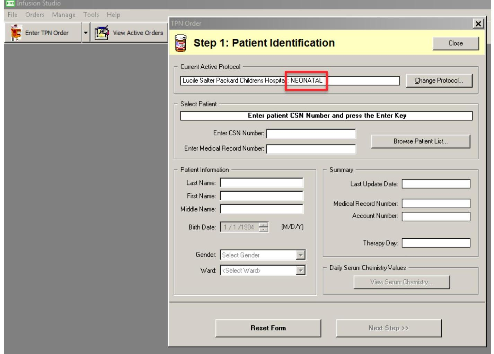

--- page 36 ---

# Step 2: Fluids and Macros

## Step 2: Route of Administration / Fluid Management / Macronutrients

**Order Date:** 7/14/2021

**Provider:** [ ] Select Providers

**Date Due:** 7/14/2021

**Weight (kg)**

**Next Bag #:** 1

**PN Access Method:** - [ ] PERIPHERAL or - [ ] CENTRAL TPN LINE

**Total Fluid Intake:** [ ] mls/kg

**Overall Volume:** 40 mls

**Infuse over:** 24 hours

**FAT EMULSION:** [ ] Intralipid 20%

[ ] gm/kg, to run over: 24 hours

**IF fluid volumes from NON-NUTRITIONAL LINES are to be INCLUDED in TOTAL FLUID INTAKE, complete the following:**

|  **Additive** | **Additive**  |
| --- | --- |
|  [ ] | [ ]  |
|  **Additive** | **Additive**  |
|  [ ] | [ ]  |
|  **Additive** | **Additive**  |
|  [ ] | [ ]  |

**IF fluid volumes from ENTERAL FEEDS are to be INCLUDED in TOTAL FLUID INTAKE, complete the following:**

- [ ] Enteral Feeding
- [ ] Feeding volume of [ ] mls every [ ] hours of [ ] [ ] [ ] [ ] [ ] [ ] [ ] [ ] [ ] [ ] [ ] [ ] [ ] [ ] [ ] [ ] [ ] [ ] [ ] [ ] [ ] [ ] [ ] [ ] [ ] [ ] [ ] [ ] [ ] [ ] [ ] [ ] [ ] [ ] [ ] [ ] [ ] [ ] [ ] [ ] [ ] [ ] [ ] [ ] [ ] [ ] [ ] [ ] [ ] [ ] [ ] [ ] [ ] [ ] [ ] [ ] [ ] [ ] [ ] [ ] [ ] [ ] [ ] [ ] [ ] [ ] [ ] [ ] [ ] [ ] [ ] [ ] [ ] [ ] [ ] [ ] [ ] [ ] [ ] [ ] [ ] [ ] [ ] [ ] [ ] [ ] [ ] [ ] [ ] [ ] [ ] [ ] [ ] [ ] [ ] [ ] [ ] [ ] [ ] [ ]

--- page 37 ---

# Non-Nutritional Lines and Feeds

## Step 2: Route of Administration / Fluid Management / Macronutrients

**Order Date:** 7/14/2021

**Provider:** <Select Provider>

**Date Due:** 7/14/2021

**Weight (kg):** 3.75

**Next Bag #:** 1

**PN Access Method:** - **PERIPHERAL** or - **CENTRAL TPN LINE**

**Total Fluid Intake:** 100 mls/kg

**Overall Volume:** 124 mls

**Infuse over:** 24 hours

**FAT EMULSION:** Intralipid 20% ☑ 1 gm/kg, to run over: 24 hours 10 Kcal/kg, 5 mls/kg and 18.8 mls/day

**IF fluid volumes from NON-NUTRITIONAL LINES are to be INCLUDED in TOTAL FLUID INTAKE, complete the following:**

|  **Additive** | **%NaCl** | **%NaAct** | **%Dex (ml/hr)** | **Additive** | **Additive**  |
| --- | --- | --- | --- | --- | --- |
|  UAC | 0.45 |  | 1.5 |  |   |
|  Additive |  |  |  | Additive |   |
|  |   |   |   |   |   |
|  Additive |  |  |  | Additive |   |
|  |   |   |   |   |   |

**Non-nutritional lines provide:** 0.74 mEq/kg of Sodium, 0 mEq/kg of Acetate, 0.74 mEq/kg of Chloride, and 9.6 mls/kg of fluid

**IF fluid volumes from ENTERAL FEEDS are to be INCLUDED in TOTAL FLUID INTAKE, complete the following:**

- Enteral Feeding: Feeding volume of 1 mls every 1 hour of > 1 strength
- Breast Milk/MBM: > 1
- Parenteral Nutrition: 51 Kcal/kg

**Fat:** 19.6 % 1 gm/kg

**Protein:** 23.5 % 3 gm/kg

**Carbohydrate:** 56.9 % 8.5 gm/kg

**Non-Protein Kcal / gm Nitrogen:** 84:1

**DEXTROSE:** 10 % provides 29 Kcal/kg and 5.4 mg/kg/min glucose (rec range: [6 - 14] mg/kg/min)

**Osm: Amino Acids, Dextrose:** 811.9 mOsm/L

**<< Previous Step**

**View Recommendations and Guidelines**

**View Serum Chemistry**

**Next Step >>**

Lucile Packard Children's Hospital Stanford

Stanford MEDICINE

--- page 38 ---

# Step 3: Micronutrients and

## Additive Vitamins / Other Additives

### Hover over "Additive Entry Box" to see protocol guidelines

### Hover over "Electrolyte Name" and "Electrolytes" to see appropriate serum lab values if they are available

|  Vitamin and Minerals: Order per guidelines | Adjusted Dose Limits  |
| --- | --- |
|  ZINC | 250 mcg/kg  |
|  Pedi MVI | 5 ml  |

|  Liver Function Tests | Renal Function Tests  |
| --- | --- |
|  Electrolytes: Order as weight based dose from all sources | SODIUM  |
|   | mEq/kg  |
|  POTASSIUM | mEq/kg  |
|  CALCIUM GLUCONATE | mg/kg  |
|  PHOSPHATE | mM/kg  |
|  ACETATE | mEq/kg  |
|  MAGNESIUM | mEq/kg  |

|  Supplemented Additives: Order only as needed unless default value present | Dose Limits  |
| --- | --- |
|  HEPARIN | 0 units/ml  |
|  Vitamin K (additional) | mg  |
|  COPPER | 20 mcg/kg  |
|  SELENIUM | mcg/kg  |
|  CARNITINE | mg/kg  |
|  L-CYSTEINE | mg/gm AA  |
|  FAMOTIDINE | mg/kg  |
|  EPOETIN | units/kg  |

|  Other Additive | Dose | Rec Dose | Add | Frequency  |
| --- | --- | --- | --- | --- |
|  |   |   |   |   |
|  |   |   |   |   |
|  |   |   |   |   |
|  |   |   |   |   |
|  |   |   |   |   |
|  |   |   |   |   |
|  |   |   |   |   |
|  |   |   |   |   |
|  |   |   |   |   |
|  |   |   |   |   |
|  |   |   |   |   |
|  |   |   |   |   |
|  |   |   |   |   |
|  |   |   |   |   |
|  |   |   |   |   |
|  |   |   |   |   |
|  |   |   |   |   |
|  |   |   |   |   |
|  |   |   |   |   |
|  |   |   |   |   |
|  |   |   |   |   |
|  |   |   |   |   |
|  |   |   |   |   |
|  |   |   |   |   |
|  |   |   |   |   |
|  |   |   |   |   |
|  |   |   |   |   |
|  |   |   |   |   |
|  |   |   |   |   |
|  |   |   |   |   |
|  |   |   |   |   |

--- page 39 ---

# Step 4: Submit... but Wait!

## Step 4: Formulation Results

### Part 1: Verify Order

- Check Ca - PO4 PPT Curves
- Enter Number of Days of Compounding: 1
- Preview Labels
- View Fat Emulsion Label
- View Content Label
- View Mixing Instructions
- View Summary Label
- Redo Current Order
- Cancel Current Order

### Part 2: Submit Order

- Submit for Pharmacy Review

### Part 3: Enter New Order

- Enter Next Order

## TrophAmine 3.0% D20

This PN contains TrophAmine at a final concentration of 3.5% and 10% Dextrose. Magnesium concentration: 1.2 (mEq/L)

This PN's plotted point represents:
- Phosphate concentration of 5.9 (mMol/l)
- Calcium Gluconate concentration of 4.7 (gm/L)

### TrophAmine 3% & Dextrose 20%

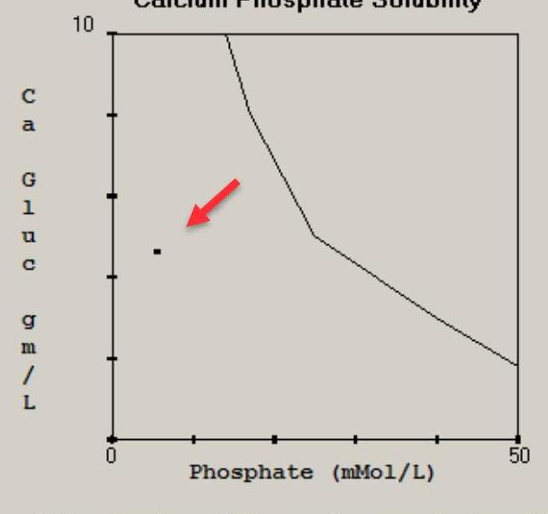

Calcium-phosphate solubility curves for parenteral nutrient solutions containing amino acids 3% and 20% dextrose

--- page 40 ---

# Solubility

## Step 4: Formulation Results

- **Part 1: Verify Order**
- Check Ca - PO4 PPT Curves
- Enter Number of Days of Compounding: 1
- Preview Labels
- View Fat Emulsion Label
- View Content Label
- View Mixing Instructions
- View Summary Label
- Redo Current Order
- Cancel Current Order

- **Part 2: Submit Order**
- Submit for Pharmacy Review

- **Part 3: Enter New Order**
- Enter Next Order

## Close

- Check the curve closest to your final concentration AA and % dextrose!

## TrophAmine 3.0 & D20

This PN contains TrophAmine at a final concentration of 3.5 % and 10 % Dextrose. Magnesium concentration: 1.2 (mEq/L)

This PN's plotted point represents:
- Phosphate concentration of 5.9 (mMol/l)
- Calcium Gluconate concentration of 4.7 (gm/L)

## TrophAmine 3% & Dextrose 20%

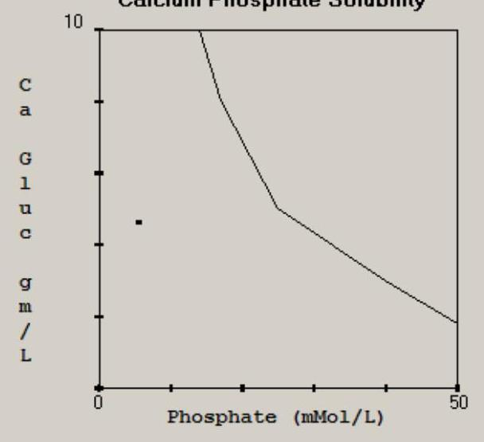

Calcium phosphate solubility curves for parenteral nutrient solutions containing amino acids 3% and 20% dextrose

--- page 41 ---

# Solubility

## Step 4: Formulation Results

- **Part 1: Verify Order**
- Check Ca - PO4 PPT Curves
- Enter Number of Days of Compounding: 1
- Preview Labels
- View Fat Emulsion Label
- View Content Label
- View Mixing Instructions
- View Summary Label
- Redo Current Order
- Cancel Current Order
- **Part 2: Submit Order**
- Submit for Pharmacy Review
- **Part 3: Enter New Order**
- Enter Next Order

## TrophAmine 3.0% D20

This PN contains TrophAmine at a final concentration of 3.5% and 10% Dextrose. Magnesium concentration: 1.2 (mEq/L)

This PN's plotted point represents:
- Phosphate concentration of 5.9 (mMol/l)
- Calcium Gluconate concentration of 4.7 (gm/L)

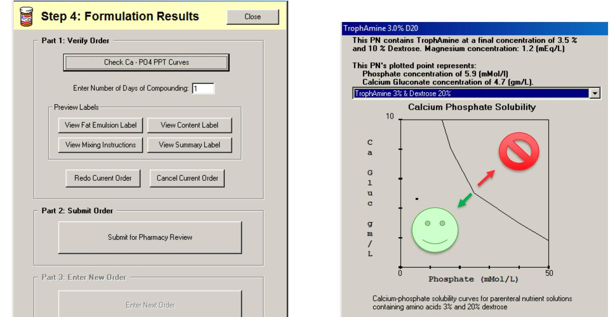

Calcium-phosphate solubility curves for parenteral nutrient solutions containing amino acids 3% and 20% dextrose

--- page 42 ---

# PN Process

## Infusion Studio

## Epic_Hyperspace

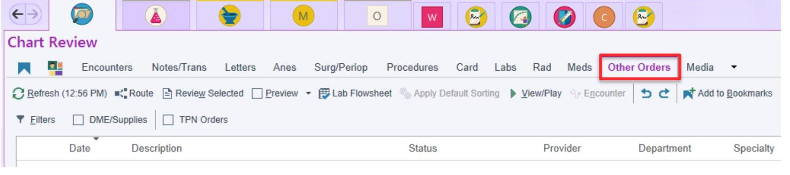

--- page 43 ---

# Premie Day 1 vs. Neonatal Bags

- CAPS premixed Neonatal TPN Starter Bag available
- Ordering criteria:
  - VLBW neonates (birth weight <1500 g) or GA <30 weeks
  - Born after 5pm or before 12pm (outside TPN pumping hours)

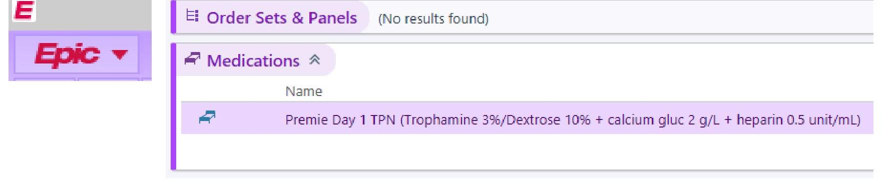

--- page 44 ---

# Ordering Premie Day 1

Premie Day 1 TPN (Trophamine 3%/Dextrose 10% + calcium gluc 2 g/L + heparin 0.5 unit/ml)

Reference 1. LPCH Housestaff Manual
Links:
Order Inst.: For NICU patients with birth weight <1500 g and admitted <24 hours only.
For other patients, order PN via Infusion Studio
Only available when patient-specific parenteral nutrition cannot be ordered (0000-1159 and 1700-
2359). For the hours of 1200-1659, order PN via Infusion Studio.

1 Birth weight less than Yes No - Pt is NOT eligible to receive starter TPN bag.
1500 g?

2 Admitted within last 24 Yes No - Pt is NOT eligible to receive starter TPN bag.
hours?

3 Dose: 1 mL/hr

Route: IV IV

Frequency: continuous ☐ continuous

For: 24 Hours Days

Starting: 7/14/2021 ☐ Today Tomorrow At: 1330 ☐ Show Additional Options ✓

Starting: Today 1330 Ending: Tomorrow 1329

Scheduled Times ✕

07/14/21 1330

Administer 24 Hours ☐

Over:

Admin. Inst.: ✓ HIGH ALERT MEDICATION PRECAUTION This is a STARTER TPN bag. RN to discontinue order when new TPN bag is hung.

Lucile Packard
Children's Hospital
Stanford

Stanford MEDICINE

--- page 45 ---

# Ordering Premie Day 1

Premie Day 1 TPN (Trophamine 3%/Dextrose 10% + calcium gluc 2 g/L + heparin 0.5 unit/ml)

Reference
Links:
Order Inst.: For NICU patients with birth weight <1500 g and admitted <24 hours only.
For other patients, order PN via Infusion Studio
Only available when patient-specific parenteral nutrition cannot be ordered (0000-1159 and 1700-
2359). For the hours of 1200-1659, order PN via Infusion Studio.

Birth weight less than
1500 g?
Yes No - Pt is NOT eligible to receive starter TPN bag.

Admitted within last 24
hours?
Yes No - Pt is NOT eligible to receive starter TPN bag.

Dose:
1 mL/hr
Route:
IV
P
IV
Frequency:
continuous
Continuous
For: 24 Hours Days
Starting: 7/14/2021 Today Tomorrow At: 1330
Starting: Today 1330 Ending: Tomorrow 1329
Scheduled Times
07/14/21 1330
Administer 24 Hours
Over:
Admin. Inst.: ✔ HIGH ALERT MEDICATION PRECAUTION This is a STARTER TPN bag. RN to discontinue order when new TPN bag is hung.

New TPN should always be ordered
through Infusion Studio during the
next TPN pumping hours

Show Additional Options

Lucile Packard
Children's Hospital
Stanford

Stanford MEDICINE

--- page 46 ---

# VLBW Neonates 

- Very low birth weight (VLBW) neonates (birth weight $<1500 \mathrm{~g}$ ) receiving only carbohydrates lose protein stores $\rightarrow$ catabolic state
- Require early and aggressive nutrition
- Parenteral nutrition should be initiated immediately after delivery once line access has been obtained

--- page 47 ---

# Early Amino Acids

- Early initiation of PN with high-dose AA:
  - Positive nitrogen balance
  - ↑ Growth and feeding
  - ↑ Glucose tolerance
  - ↓ Sepsis

Tang ZF et al. Chinese Journal of Pediatrics 2009;47(3):209-15.
Kotsopoulos K et al. J Perinatol. 2006;26(12):749-54.

--- page 48 ---

# Resources 

- NICU Guide PN Guidelines
- Dieticians:
- Olivia Mayer (Blue/Purple Team RD)
- Elizabeth Stanway-Mayers (Red Team RD)
- NICU Pharmacist: Christy Boulos
- TPN Rx: ext. 7-8779
- Useful if you want to expedite a bag, change a TPN order after it has been verified, request a splitter/override, or have questions on weekends/after hours

--- page 49 ---

# Questions?

--- page 50 ---

# References 

1) Omegaven [Prescribing Information] (Revised: 07/2018). Fresenius Kabi. https://www.accessdata.fda.gov/drugsatfda_docs/label/2018/0210589s000lbledt.pdf.
2) Fat Emulsion (Fish Oil Based). Lexi-Drugs. Lexicomp. Wolters Kluwer Health, Inc. Riverwoods, IL. Available at: http://online.lexi.com. Accessed August 7, 2018.
3) Fell, G. L., Nandivada, P., Gura, K. M., \& Puder, M. (2015). Intravenous Lipid Emulsions in Parenteral Nutrition-. Advances in Nutrition, 6(5), 600-610.
4) Yang, C. F. J., Lee, M., Valim, C., Hull, M. A., Zhou, J., Jones, B. A., ... \& Jaksic, T. (2009). Persistent alanine aminotransferase elevations in children with parenteral nutrition-associated liver disease. Journal of pediatric surgery,44(6), 1084-1088.
5) Puder, M., Valim, C., Meisel, J. A., Le, H. D., De Meijer, V. E., Robinson, E. M., ... \& Gura, K. M. (2009). Parenteral fish oil improves outcomes in patients with parenteral nutrition associated liver injury. Annals of surgery, 250(3), 395.
6) Diamond, I. R., Sterescu, A., Pencharz, P. B., Kim, J. H., \& Wales, P. W. (2009). Changing the paradigm: omegaven for the treatment of liver failure in pediatric short bowel syndrome. Journal of pediatric gastroenterology and nutrition, 48(2), 209-215.
7) Park, K. T., Nespor, C., \& Kerner Jr, J. (2011). The use of Omegaven in treating parenteral nutrition-associated liver disease. Journal of Perinatology, 31(S1), S57.
8) Premkumar, M. H., Carter, B. A., Hawthorne, K. M., King, K., \& Abrams, S. A. (2013). High rates of resolution of cholestasis in parenteral nutritionassociated liver disease with fish oil-based lipid emulsion monotherapy. The Journal of pediatrics,162(4), 793-798.
9) Nandivada, P., Chang, M. I., Potemkin, A. K., Carlson, S. J., Cowan, E., O'loughlin, A. A., ... \& Puder, M. (2015). The natural history of cirrhosis from parenteral nutrition-associated liver disease after resolution of cholestasis with parenteral fish oil therapy. Annals of surgery, 261(1), 172.
10) Intralipid ${ }^{\circledR} 20 \%$ [prescribing information] Baxter Healthcare Corporation. http://ecatalog.baxter.com/ecatalog/loadResource.blob? bid=20000307.
11) Smoflipid [prescribing information] Fresenius Kabi. https://www.accessdata.fda.gov/drugsatfda_docs/label/2016/207648lbl.pdf.
12) Appropriate Dosing for Parenteral Nutrition: ASPEN Recommendations. ASPEN. 2019. https://nutritotal.com.br/pro/wp-content/uploads/sites/3/2019/04/PN-DosingASPEN.pdf
13) Mesotten, Dieter, et al. "ESPGHAN/ESPEN/ESPR/CSPEN guidelines on pediatric parenteral nutrition: carbohydrates." Clinical Nutrition 37.6 (2018): 2337-2343.
14) Cober, M. Patrea. Strategies for Successful Parenteral Nutrition Order Writing. ASHP Midyear 2016. https://www.ashp.org/-/media/assets/pharmacy-practice/resource-centers/Clinical-Pharmacy-Resources/Nutrition-Support/2016-MCM/MCM16-335-Strategies-for-Successful-Parenteral-nutrition.ashx?la=en\&hash=2E203D2D4AB34E3A9831B780B0FD7285280E84BC

--- page 51 ---

# Appendix

**Stanford Children's Health**

**Lucile Packard Children's Hospital**

**Stanford**

--- page 52 ---

# ASPEN Recommendations

- Initiation and advancement of macronutrients

|  Infants ( $<1$ y) | Initiation |  | Advance By |  | Goals |   |
| --- | --- | --- | --- | --- | --- | --- |
|   | Preterm | Term | Preterm | Term | Preterm | Term  |
|  Protein (g/kg/d)* | $\begin{gathered} 1-3 \ (3-4 \text { max }) \end{gathered}$ | $2.5-3$ | - | - | $3-4$ | $2.5-3$  |
|  Dextrose (mg/kg/min) | $6-8$ | $6-8$ | $1-2$ | $1-2$ | $\begin{gathered} 10-14 \ \text { (max } \ 14-18) \end{gathered}$ | $\begin{gathered} 10-14 \ \text { (max } \ 14-18) \end{gathered}$  |
|  ILE (g/kg/d)** | $0.5-1$ | $0.5-1$ | $0.5-1$ | $0.5-1$ | $\begin{gathered} 3 \ \text { (max } 0.15 \ \mathrm{~g} / \mathrm{kg} / \mathrm{h}) \end{gathered}$ | $\begin{gathered} 2.5-3 \ \text { (max } 0.15 \ \mathrm{~g} / \mathrm{kg} / \mathrm{h}) \end{gathered}$  |
|  Children (1-10 y) |  |  |  |  |  |   |
|  Protein (g/kg/d) | $1.5-2.5$ |  | - |  | $1.5-2.5$ |   |
|  Dextrose (mg/kg/min) | $3-6$ |  | $1-2$ |  | $8-10$ |   |
|  ILE (g/kg/d)** | $1-2$ |  | $0.5-1$ |  | $2-2.5$ |   |
|  Adolescents |  |  |  |  |  |   |
|  Protein (g/kg/d) | $0.8-2$ |  | - |  | $0.8-2$ |   |
|  Dextrose (mg/kg/min) | $2.5-3$ |  | $1-2$ |  | $5-6$ |   |
|  ILE (g/kg/d)** | 1 |  | 1 |  | $1-2$ |   |

*Protein does not need to be titrated; protein needs are increased with critical illness.* * ILE dosing based on soybean oil-based emulsion. See manufacturer's product information for dosing of other ILE products. ILE= Lipid injectable emulsion

--- page 53 ---

# ASPEN Recommendations

- Electrolyte and minerals

|   | Preterm Neonates | Infants/Children | Adolescents \& Children
Greater than 50 kg  |
| --- | --- | --- | --- |
|  Sodium | $2-5 \mathrm{mEq} / \mathrm{kg}$ | $2-5 \mathrm{mEq} / \mathrm{kg}$ | $1-2 \mathrm{mEq} / \mathrm{kg}$  |
|  Potassium | $2-4 \mathrm{mEq} / \mathrm{kg}$ | $2-4 \mathrm{mEq} / \mathrm{kg}$ | $1-2 \mathrm{mEq} / \mathrm{kg}$  |
|  Calcium | $2-4 \mathrm{mEq} / \mathrm{kg}$ | $0.5-4 \mathrm{mEq} / \mathrm{kg}$ | $10-20 \mathrm{mEq}$  |
|  Phosphorus | $1-2 \mathrm{mmol} / \mathrm{kg}$ | $0.5-2 \mathrm{mmol} / \mathrm{kg}$ | $10-40 \mathrm{mmol}$  |
|  Magnesium | $0.3-0.5 \mathrm{mEq} / \mathrm{kg}$ | $0.3-0.5 \mathrm{mEq} / \mathrm{kg}$ | $10-30 \mathrm{mEq}$  |
|  Acetate | As needed to maintain acid base-balance |  |   |
|  Chloride | As needed to maintain acid base-balance |  |   |

*Use caution in prescribing calcium and phosphorus related to compatibility.

--- page 54 ---

# ASPEN Recommendations

- Trace elements

|  Trace Element | Preterm Neonates | Term Neonates 3-10 kg | Children 10-40 kg | Adolescents Greater than 40 kg  |
| --- | --- | --- | --- | --- |
|  Zinc | $400 \mathrm{mcg} / \mathrm{kg}$ | $250 \mathrm{mcg} / \mathrm{kg}$ | $50 \mathrm{mcg} / \mathrm{kg}$
(max 5000
$\mathrm{mcg} / \mathrm{d})$ | 2-5 mg  |
|  Copper | $20 \mathrm{mcg} / \mathrm{kg}$ | $20 \mathrm{mcg} / \mathrm{kg}$ | $20 \mathrm{mcg} / \mathrm{kg}$
(max 500
$\mathrm{mcg} / \mathrm{d})$ | 200-500 mcg  |
|  Manganese | $1 \mathrm{mcg} / \mathrm{kg}$ | $1 \mathrm{mcg} / \mathrm{kg}$ | $1 \mathrm{mcg} / \mathrm{kg}$
(max $55 \mathrm{mcg} / \mathrm{d})$ | 40-100 mcg  |
|  Chromium | $0.05-0.3 \mathrm{mcg} / \mathrm{kg}$ | $0.2 \mathrm{mcg} / \mathrm{kg}$ | $0.2 \mathrm{mcg} / \mathrm{kg}$
(max $5 \mathrm{mcg} / \mathrm{d})$ | 5-15 mcg  |
|  Selenium | $2 \mathrm{mcg} / \mathrm{kg}$ | $2 \mathrm{mcg} / \mathrm{kg}$ | $2 \mathrm{mcg} / \mathrm{kg}$
(max 100
$\mathrm{mcg} / \mathrm{d})$ | 40-60 mcg  |

*Note: These requirements are different than the multi-trace element products currently available in the US.

--- page 55 ---

# IVFE Comparison

Table 1. Comparison of 3 IV Fat Emulsions (IVFE)*

|   | IntraLipid | SMOFlipid | Omegaven  |
| --- | --- | --- | --- |
|   | Percent |  |   |
|  Soybean oil | 100 | 30 | 0  |
|  Medium chain triglyceride | 0 | 30 | 0  |
|  Olive oil | 0 | 25 | 0  |
|  Fish oil | 0 | 15 | 100  |
|  |   |   |   |
|   | Percent |  |   |
|  Linoleic acid (n-6) | 50 | 21.4 | 4.4  |
|  Alpha-linolenic acid (n-3) | 9 | 2.5 | 1.8  |
|  DHA (n-3) | 0 | 2 | 12.1  |
|  EPA (n-3) | 0 | 3 | 19.2  |
|  |   |   |   |
|   | $m g / L t$ |  |   |
|  Phytosterols | $348 \pm 33$ | 47.6 | 0  |
|  Alpha-tocopherol (Vitamin E) | 38 | 200 | $150-296$  |

DHA is docosahexaenoic acid and EPA is eicosapentaenoic acid. *Adapted from Anez-Bustillos et al. 2017¹ ${ }^{\dagger}$ Raman et al. $2017^{2}$

--- page 56 ---

# LPCH Parenteral Nutrition 

- Current AA concentration limitations via central line PN at LPCH:
- $<20 \mathrm{~kg}$ : AA $3.6 \%$
- 20-35 kg: AA $4.2 \%$
- $>35 \mathrm{~kg}$ : AA $5.2 \%$
- Origin of AA concentration limitations unclear

--- page 57 ---

# ASPEN 2014 Guidelines 

- Recommendations for 3-in-1 PN to optimize stability for up to 30 hours at room temperature:
- AA $\geq 4 \%$
- Dextrose $\geq 10 \%$
- Lipids $\geq 2 \%$
- Currently no guidance on the maximum allowable protein concentration

--- page 58 ---

# Concerns and Considerations 

- Macronutrient extremes (high or low) may compromise stability of the PN solution
- Higher viscosity of the admixture has unknown effect on the risk of line occlusions
- Institution-specific guidance on medication compatibility with parenteral nutrition may be affected by changes in allowable AA concentrations
- Impact on the non-protein calorie to nitrogen ratio (NPC:N)

--- page 59 ---

# Amino Acid Over-Provision 

- Possible complications of AA over-provision
- Metabolic acidosis
- Cationic L-amino acid metabolism that produces H+ ions (excess acids that base reserves cannot neutralize)
- Oxidation of sulfur-containing AA
- Azotemia:
- Proteins generate ammonia exceeding the urea cycle's capacity
- Higher rates of urea synthesis in critically-ill patients
- Renal blood flow/functional mass may have greater influence on plasma urea concentrations than rate of provision

--- page 60 ---

# Nitrogen Balance 

- Non-protein calorie to nitrogen ratio (NPC:N)
- Ideal NPC:N ratio ${ }^{7}$
- Stable patients $\rightarrow 150-250: 1$
- Critically-ill patients $\rightarrow$ Optimal ratio may be less (e.g. 100:1)
- Renal failure patients $\rightarrow$ Optimal ratio may be higher
- Monitoring: Elevated BUN cannot be explained by changes in renal function, medications, bleeding or dehydration
- Amino acid intake to avoid negative nitrogen balance
- ESPGHAN/ESPEN/ESPR 2018 Guidelines ${ }^{8}$
- Stable term infants: Minimum AA $1.5 \mathrm{~g} / \mathrm{kg} / \mathrm{d}$ (max: $3.0 \mathrm{~g} / \mathrm{kg} / \mathrm{d}$ )

--- page 61 ---

# Lipids and Hyperinsulinemia

- FFAs drive hepatic lipid synthesis and activate hepatic gluconeogenesis → hepatic glucose production

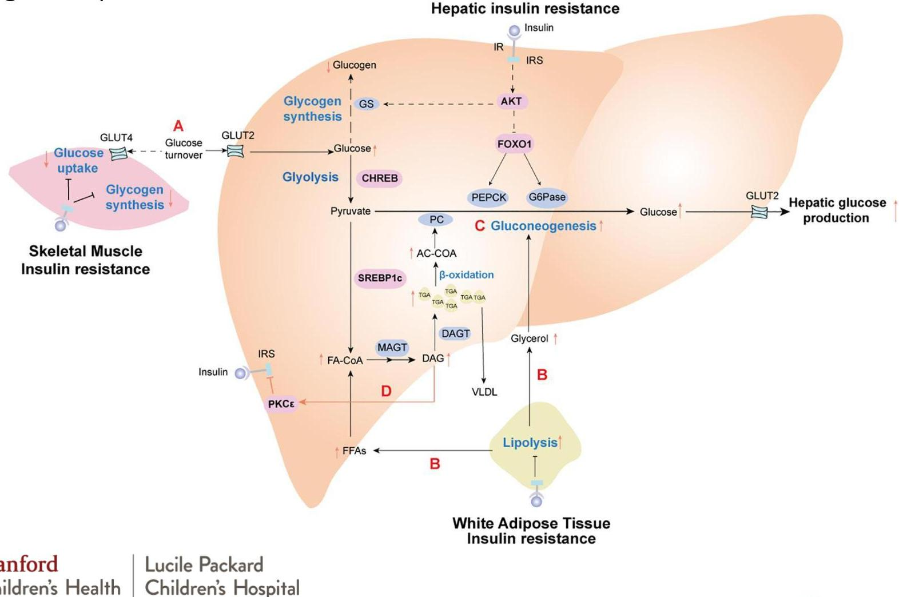

**Stanford Children's Health**

**Lucile Packard Children's Hospital**

**Stanford**

--- page 62 ---

# Fluid Volumes

|  Typical Fluids (mL/kg/day) |  |   |
| --- | --- | --- |
|  Weight | Initial Fluids | Fluid Advance  |
|  $>1500 \mathrm{gm}$ | $60-80$ | Over next 5 days if able (generally $10-20 \mathrm{~mL} / \mathrm{kg} /$ day to goal $150-160 \mathrm{~mL} / \mathrm{kg} /$ day)  |
|  $1000-1500 \mathrm{gm}$ | 80 |   |
|  $<1000 \mathrm{gm}$ | $80-100$ |   |

|  Adjustment Considerations |   |
| --- | --- |
|  Increased Fluids | Decreased Fluids  |
|  - Excessive weight loss
- Gastroschisis/ omphalocele
- Immature skin
- Polyuria, hypernatremia, hyperkalemia | - Asphyxia/ cerebral edema
- Generalized edema
- Oliguria (SIADH, renal failure)
- CHF or PDA  |

--- page 63 ---

# Total Body Water

- Measuring Total Body Water (TBW) is challenging
- Acute changes in weight indicate changes in TBW

|  Age | Percentage of TBW  |
| --- | --- |
|  Fetus | $90 \%$  |
|  Premature Infant | $80 \%$  |
|  Term Infant | $70-75 \%$  |
|  Young Children | $65-70 \%$  |
|  Adolescent Children | $60 \%$  |
|  Adults | $50-60 \%$  |

--- page 64 ---

# Electrolytes- Sodium (Na)

- Serum Osmolality- Water Homeostasis
- Osm (serum) = (2x serum Na) + (serum glucose / 18) + (BUN / 2.8)
- Regulated by urinary concentration and dilution (ADH) and thirst
- Normal sodium requirement: 2-5 mEq/kg/day

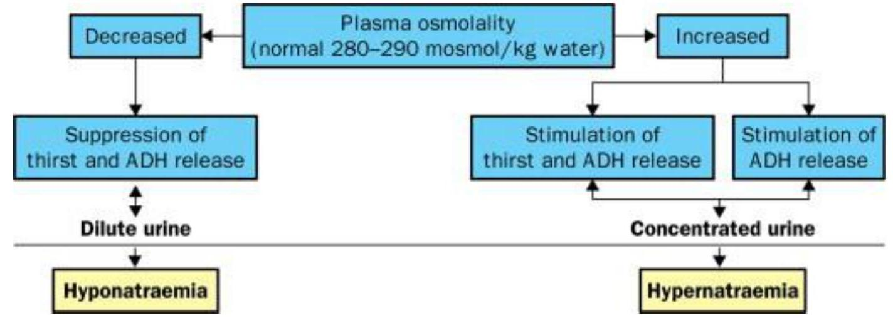

--- page 65 ---

# Hyponatremia

- Serum Na <120
- CNS Symptoms
- Lethargy
- Seizures
- Coma
- Death

Table 1. Classification of Hyponatremia ${ }^{2,8,30}$

|  Type | Characteristics | Common Causes  |
| --- | --- | --- |
|  Dilutional hyponatremia |  |   |
|  Hypervolemic | - Body water: increased
- Body sodium: increased
- Extracellular fluid: significantly increased
- Edema | - Congestive heart failure
- Cirrhosis
- Nephrotic syndrome
- Acute kidney insufficiency
- Chronic renal failure  |
|  Euvolemic | - Body water: increased
- Body sodium: not increased
- Extracellular fluid: increased
- No edema | - SIADH
- Glucocorticoid deficiency
- Thiazide diuretics
- Oral hypoglycemic drugs  |
|  Depletional hyponatremia |  |   |
|  Hypovolemic | - Body water: slightly decreased
- Body sodium: decreased
- Extracellular fluid: decreased
- No edema | - Diuretics
- Salt-wasting nephropathy Mineralocorticoid deficiency
- Diarrhea
- Vomiting
- Pancreatitis  |

SIADH = syndrome of inappropriate antidiuretic hormone

--- page 66 ---

# Hypochloremia 

- Diuretic use in our neonates often leads to low chloride levels (metabolic/contraction alkalosis)
- Persistently low chloride can contribute to poor growth
- Preferentially utilize KCl to help correct chloride rather than NaCl
- Additional Na when Na is normal may lead to Na and fluid retention
- Monitor K to ensure it is within normal range

--- page 67 ---

# Hypophosphatemia 

- IV phosphate is rarely given as a replacement (will often adjust electrolytes in TPN as much as possible)
- IV phosphate is given via sodium phosphate OR potassium phosphate
- Max rate of infusion: 0.06 mmol phosphate $/ \mathrm{kg} /$ hour

--- page 68 ---

# GI Losses and Electrolytes

## Replacement Fluids for Upper GI Losses

|   |  | mEq/L |  |  |   |
| --- | --- | --- | --- | --- | --- |
|  Body Fluid Type | Volume
(mL/day) | Na | Cl | K | $\mathrm{HCO}_{3}$  |
|  Saliva | $1000-1500$ | 10 | 10 | 26 | 0  |
|  Stomach/NG ( $\uparrow$ acid) | $1000-9000$ | 20 | 120 | 10 | 0  |
|  Stomach/NG ( $\downarrow$ acid) | $1000-2500$ | 80 | 90 | 15 | 0  |

## Replacement Fluids for Lower GI Losses

|   |  | mEq/L |  |  |   |
| --- | --- | --- | --- | --- | --- |
|  Body Fluid Type | Volume
(mL/day) | Na | Cl | K | $\mathrm{HCO}_{3}$  |
|  Duodenum | Variable | 140 | 80 | 5 | 0  |
|  Pancreas | Variable | 140 | 75 | 5 | 115  |
|  Bile | Variable | 145 | 100 | 5 | 35  |
|  Ileum | 3000 | 140 | 104 | 5 | 30  |
|  Colon | Variable | 60 | 40 | 30 | 0  |

--- page 69 ---

# Metabolic Complications of PN

- Hyperglycemia/hypoglycemia
- Parenteral nutrition associated liver disease (PNALD): hepatic steatosis, TPN-associated cholestasis
- Refeeding syndrome
- Electrolyte imbalances
- Metabolic bone deficiency (imbalanced ratio of calcium and phosphorous)

--- page 70 ---

# Medication Resources

|   | Resource | Alternative Resource  |
| --- | --- | --- |
|  LPCH-specific medication dosing and administration | Lexicomp LPCH Housestaff Manual (HSM) |   |
|  TPN compatibilities | Search "TPN" in Lexicomp $\rightarrow$ select "Parenteral Nutrition (PN) - formerly TPN" under LPCH HSM $\rightarrow$ scroll to compatibility chart | Trissel's Parenteral Compability via Micromedex or Lexicomp  |
|  Y-site compatibilities | Trissel's Parenteral Compability via Micromedex or Lexi-comp |   |
|  General dosing and information | Pediatric and Neonatal Lexi-Drugs | NeoFax (Micromedex)  |
|  Drug Policies | LPCH Intranet |   |
|  Medication questions | Pharmacists are available 24/7
- Search "Pharmacy" in Lexicomp $\rightarrow$ select "Pharmacy Department" for list of phone # for all RX areas | Emergencies: "LCPH Code Pharmacist" on voalte  |