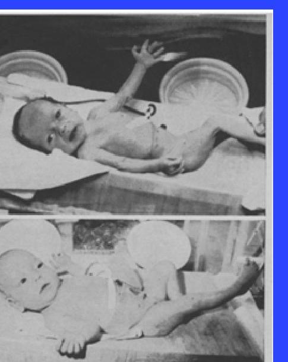

# A Brief History of PN

--- page 1 ---

# History of PN in North America

- **Requirements for PN**
  - Appropriate venous access
  - Appropriate intravenous nutrient solutions

- **1930's**
  - Protein hydrolysate solutions available (high immunogenicity)

- **1960's**
  - Safe intravenous fat emulsion preparation (Europe only)
  - Seldinger technique for central venous access
  - 1968: First clinical report of long-term PN support in beagle puppies
  - 1968: First case report of preterm infant maintained for 44 days on intravenous nutrition

--- page 2 ---

# History of PN in North America - Cont'd 

- 1970's
- Crystalline amino acid solutions available (decreased immunogenic reactions)
- 1980's
- Infant-specific crystalline amino acid solutions
- Alternative lipid emulsions developed in Europe
- American Medical Association Nutrition Advisory Group recommendations for intravenous vitamins

--- page 3 ---

# History of PN in North America - Cont'd 

- 2000's
- 2002 - USA Food and Drug Administration (FDA) pediatrics approval for Intralipid ${ }^{\circledR}$
- 2010's
- 2016 - Health Canada pediatric approval for SMOFLipid ${ }^{\circledR}$
- 2018 - FDA pediatric approval for Omegaven ${ }^{\circledR}$
- 2020's
- 2022 - FDA pediatric approval for SMOFLipid ${ }^{\circledR}$
- 2024 - FDA pediatric approval for CLINOLIPID ${ }^{\circledR}$