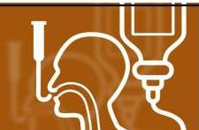

# NUTRITION SUPPORT CERTIFICATE 

## Nutritional

Requirements, Part 1

Planned by the American Society of Health-System Pharmacists (ASHP) in collaboration with the American Society for Parenteral and Enteral Nutrition (ASPEN).
©2022 American Society of Health-System Pharmacists, Inc. All rights reserved.
No part of this publication may be reproduced or transmitted in any form or by any means, electronic or mechanical, including photocopying, microfilming, and recording, or by any information storage and retrieval system, without written permission from the American Society of Health-System Pharmacists.

--- page 1 ---

# NUTRITIONAL REQUIREMENTS PART 1 

Todd W. Canada, Pharm.D., BCNSP, BCCCP, FASHP, FTSHP, FASPEN
University of Texas MD Anderson
Cancer Center

NUTRITION SUPPORT CERTIFICATE

## RELEVANT FINANCIAL RELATIONSHIP DISCLOSURE

No one in control of the content of this activity has a relevant financial relationship (RFR) with an ineligible company.

--- page 2 ---

# LEARNING OBJECTIVES 

- Evaluate parenteral nutrition orders for the appropriate content and use of macronutrients based on estimated requirements.
- Design a parenteral nutrition formulation that limits dextrose provision while balancing overall nutrient requirements.
- Compare minimum requirements of available lipid emulsion formulations to prevent essential fatty acid deficiency.
- Calculate a patient's estimated fluid requirements using the three most common methods.
- Evaluate the clinical need to modify fluid provision compared to calculated maintenance fluid requirements.

## KEY ABBREVIATIONS

- AA:
- AdjBW:
- ALA:
- CrCl :
- Dex:
- EFA:
- EFAD:
- EN:
- GI:
- IBW:
amino acids
adjusted body weight
alpha-linolenic acid
creatinine clearance
Dextrose
essential fatty acids
essential fatty acid deficiency
enteral nutrition
gastrointestinal
ideal body weight

--- page 3 ---

# KEY ABBREVIATIONS, CONT. 

- ILE: lipid injectable emulsion
- IV: intravenous
- LA: linoleic acid
- MCT: medium chain triglycerides
- NPO: nil per os (nothing by mouth)
- PN: parenteral nutrition
- CRRT: continuous renal replacement therapy
- TBW: total body water

## SELF-ASSESSMENT \#1

RC is a 52-year-old with rectal cancer admitted for exploratory laparotomy including abdominoperineal resection with end descending colostomy, now with postoperative ileus on hospital day 3 . He is an ill appearing male ( $60 \mathrm{~kg}, 5^{\prime} 9^{\prime \prime}$ ) with distended abdomen and his nasogastric tube is draining $1.4 \mathrm{~L} /$ day. Which of the following interventions would be MOST appropriate in this patient?
A. No intervention is needed
B. Begin enteral nutrition via his nasogastric tube
C. Add dextrose 5\% to his IV fluids
D. Begin parenteral nutrition

--- page 4 ---

# TIMELINE CONSIDERATIONS FOR PARENTERAL NUTRITION 

Delay until condition has improved

As soon as feasible

Within 3-5 days

After 7 days of inadequate oral intake or EN

- Severe metabolic or hemodynamic instability
- Baseline moderate or severe malnutrition when oral intake not feasible or sufficient
- Nutritionally-at-risk and unlikely to achieve nutrition goals by other routes
- Well nourished stable adult patients

--- page 5 ---

# PN THERAPY GOALS 

- Replenishment of malnourished state and protein stores (lean body mass)
- Normalization of clinical laboratory values
- Optimization of clinical outcomes
- Reduction in post-operative complications in the malnourished
- Reduction in morbidity
- Stabilization of weight or progress toward goal weight
- Improvement in quality of life

Worthington P et al. JPEN J Parenter Enteral Nutr. 2017; 41(3):324-77.

## SELF-ASSESSMENT \#1

RC is a 52-year-old with rectal cancer admitted for exploratory laparotomy including abdominoperineal resection with end descending colostomy, now with postoperative ileus on hospital day 3 . He is an ill appearing male ( $60 \mathrm{~kg}, 5^{\prime} 9^{\prime \prime}$ ) with distended abdomen and his nasogastric tube is draining $1.4 \mathrm{~L} /$ day. Which of the following interventions would be MOST appropriate in this patient?
A. No intervention is needed
B. Begin enteral nutrition via his nasogastric tube
C. Add dextrose 5\% to his IV fluids
D. Begin parenteral nutrition

--- page 6 ---

# SELF-ASSESSMENT \#1 

RC is a 52-year-old with rectal cancer admitted for exploratory laparotomy including abdominoperineal resection with end descending colostomy, now with postoperative ileus on hospital day 3 . He is an ill appearing male ( $60 \mathrm{~kg}, 5^{\prime} 9^{\prime \prime}$ ) with distended abdomen and his nasogastric tube is draining 1.4 L/day. Which of the following interventions would be MOST appropriate in this patient?
A. No intervention is needed
B. Begin enteral nutrition via his nasogastric tube
C. Add dextrose $5 \%$ to his IV fluids
D. Begin parenteral nutrition

## SELF-ASSESSMENT \#2

RC is a 52-year-old male with a postoperative ileus on hospital day 3 . His weight is 60 kg and he is 5'9". Which of the following dosing weights for fluid and nutrient calculations is MOST appropriate?
A. 60 kg
B. 63 kg
C. 66 kg
D. 71 kg

--- page 7 ---

# DETERMINING DOSING WEIGHT 

- Dosing weight shall be determined for each patient
- Determine an ideal body weight (IBW):
- Women IBW $=45.5 \mathrm{~kg}+(2.3 \mathrm{~kg} \times$ each inch over 60 inches $)$
- Men IBW $=50 \mathrm{~kg}+(2.3 \mathrm{~kg} \times$ each inch over 60 inches $)$
- Not applicable if under 60 inches
- Use actual body weight if below IBW
- Methods for adjusting body weight of obese patients have been suggested, but none have been clearly validated \& may lead to overfeeding
- IBW is preferred to adjusted body weight (AdjBW) in patients weighing more than $130 \%$ of their IBW:
$\operatorname{AdjBW}=I B W+[($ Actual Wt $(\mathrm{kg})-I B W) \times 0.25]$

SELF-ASSESSMENT \#2

RC is a 52-year-old male with a postoperative ileus on hospital day 3 . His weight is 60 kg and he is 5'9". Which of the following dosing weights for fluid and nutrient calculations is MOST appropriate?
A. 60 kg
B. 63 kg
C. 66 kg
D. 71 kg

--- page 8 ---

# SELF-ASSESSMENT \#2 

RC is a 52-year-old male with a postoperative ileus on hospital day 3 . His weight is 60 kg and he is 5'9". Which of the following dosing weights for fluid and nutrient calculations is MOST appropriate?
A. 60 kg
B. 63 kg
C. 66 kg
D. 71 kg

## SELF-ASSESSMENT \#3

RC is a 52-year-old male with a postoperative ileus on hospital day 3 . His weight is 60 kg and he is 5'9". His nasogastric tube is draining $1.4 \mathrm{~L} /$ day and he has normal renal function. Which of the following would be most appropriate for his nutrition goals currently?
A. Begin oral clear liquids with advancement to a regular diet
B. Provide enteral nutrition with a $1.2 \mathrm{kcal} / \mathrm{mL}$ formula via his nasogastric tube with a goal of $65 \mathrm{~mL} / \mathrm{hr}$
C. Add dextrose $10 \%$ to his IV fluids and increase rate to $125 \mathrm{~mL} / \mathrm{hr}$
D. Begin parenteral nutrition with dextrose $10 \%$, amino acids $4 \%$ ILE $2 \%$ at $100 \mathrm{~mL} / \mathrm{hr}$

--- page 9 ---

# RESTING ENERGY EXPENDITURE AND NITROGEN EXCRETION 

## COMMON PREDICTIVE EQUATIONS OF ENERGY REQUIREMENTS

- Harris Benedict - oldest for estimating basal energy expenditure (usually $\times 1.2$ )
- Women $=655+(9.6 \times$ Weight $(\mathrm{kg}))+(1.7 \times$ Height $(\mathrm{cm}))-(4.7 \times$ Age $(\mathrm{yr}))$
- Men $=66+(13.7 \times$ Weight $(\mathrm{kg}))+(5 \times$ Height $(\mathrm{cm}))-(6.8 \times$ Age $(\mathrm{yr}))$
- Mifflin-St Jeor - currently most recommended
- Women $=-161+(10 \times$ Weight $(\mathrm{kg}))+(6.25 \times$ Height $(\mathrm{cm}))-(5 \times$ Age $(\mathrm{yr}))$
- Men $=5+(10 \times$ Weight $(\mathrm{kg}))+(6.25 \times$ Height $(\mathrm{cm}))-(5 \times$ Age $(\mathrm{yr}))$
- Calories/Kilogram - easiest
- $20-30 \mathrm{kcal} / \mathrm{kg} /$ day
- Should be used as a starting point only and adjusted based on available data and clinical judgment

--- page 10 ---

# COMMON PREDICTIVE EQUATIONS OF ENERGY REQUIREMENTS 

- Harris Benedict - oldest for estimating basal energy expenditure (usually $\times 1.2$ )
- Men $=66+(13.7 \times$ Weight $(\mathrm{kg}))+(5 \times$ Height $(\mathrm{cm}))-(6.8 \times$ Age $(\mathrm{yr}))$
- $R C=1411 \mathrm{kcal} /$ day $\times 1.2=1693 \mathrm{kcal} /$ day
- Mifflin-St Jeor - currently most recommended
- Men $=5+(10 \times$ Weight $(\mathrm{kg}))+(6.25 \times$ Height $(\mathrm{cm}))-(5 \times$ Age $(\mathrm{yr}))$
- $R C=1440 \mathrm{kcal} /$ day
- Calories/Kilogram - easiest
- $20-30 \mathrm{kcal} / \mathrm{kg} /$ day $\times 60 \mathrm{~kg}=1200-1800 \mathrm{kcal} /$ day

Frankenfield D. The ASPEN adult nutrition supportcore curriculum. 3rd ed. 2017:27-40.

## MACRONUTRIENT REQUIREMENTS IN PARENTERAL NUTRITION

| Nutrient | Standard Intake |
| :--: | :--: |
| Protein (AA) | $0.8-2 \mathrm{~g} / \mathrm{kg}$ |
| Total Calories | $20-30 \mathrm{kcal} / \mathrm{kg}$ |
| Volume | $30-40 \mathrm{~mL} / \mathrm{kg}$ |
| Sodium | $1-2 \mathrm{mEq} / \mathrm{kg}$ |
| Potassium | $1-2 \mathrm{mEq} / \mathrm{kg}$ |
| Magnesium | $8-20 \mathrm{mEq}$ |
| Phosphate | $20-40 \mathrm{mmol}^{*}$ |
| Calcium | $10-15 \mathrm{mEq}^{*}$ |

--- page 11 ---

# DETERMINING PROTEIN NEEDS 

- Typical adult protein intakes are approximately 15-20\% of total calories
- Minimum: $0.8 \mathrm{~g} / \mathrm{kg} /$ day
- Stable: $0.8-1 \mathrm{~g} / \mathrm{kg} /$ day
- Critically ill: $1.2-2 \mathrm{~g} / \mathrm{kg} /$ day
- Obesity: $2-2.5 \mathrm{~g}$ IBW/kg/day
- Maximum: $2.5 \mathrm{~g} / \mathrm{kg} /$ day
- CRRT
- Protein in PN provided as crystalline amino acids
- 1 g of nitrogen $=6 \mathrm{~g}$ of protein (e.g., 15 g Nitrogen $=90 \mathrm{~g}$ Protein)
- Provides $4 \mathrm{kcal} / \mathrm{g}$

McClave SA et al. JPEN J Parent Enteral Nutr. 2016;40:159-211.

## DETERMINING PROTEIN NEEDS

- Catabolism
- Tissue loss; Negative nitrogen balance with $\uparrow$ nitrogen excretion
- Primarily from skeletal muscle
- Supplies amino acids for gluconeogenesis \& synthesis of acute phase proteins
- 1 g of Urinary Urea Nitrogen represents the loss of 30 g of lean tissue
- 24-hr Urinary Urea Nitrogen excretion
- 15 g equivalent to $\sim 0.5 \mathrm{~kg}$ lean body mass/day
- Post-surgery: 0.64 kg lean body mass lost/day
- NPO for 5 to 7 days $=2.5$ to 3.5 kg lean body mass loss

--- page 12 ---

# PROTEIN-SPARING EFFECT OF CALORIES 

## POSTOPERATIVE PROTEIN-

SPARING REGIMENS

--- page 13 ---

# CALORIE \& PROTEIN EFFECTS ON NITROGEN BALANCE 

EIwyn DHet al. Surg Clin North Am. 1981;61(3):545-6.

## PROTEIN LOSS AND ENERGY/NITROGEN RATIO

Critically ill require lower Energy/Nitrogen ratios compared to stable hospitalized patients

--- page 14 ---

# SELF-ASSESSMENT \#3 

RC is a 52-year-old male with a postoperative ileus on hospital day 3 . His weight is 60 kg and he is 5'9". His nasogastric tube is draining $1.4 \mathrm{~L} /$ day and he has normal renal function. Which of the following would be most appropriate for his nutrition goals currently?
A. Begin oral clear liquids with advancement to a regular diet
B. Provide enteral nutrition with a $1.2 \mathrm{kcal} / \mathrm{mL}$ formula via his nasogastric tube with a goal of $65 \mathrm{~mL} / \mathrm{hr}$
C. Add dextrose $10 \%$ to his IV fluids and increase rate to $125 \mathrm{~mL} / \mathrm{hr}$
D. Begin parenteral nutrition with dextrose $10 \%$, amino acids $4 \%$ ILE $2 \%$ at $100 \mathrm{~mL} / \mathrm{hr}$

## SELF-ASSESSMENT \#3

RC is a 52-year-old male with a postoperative ileus on hospital day 3 . His weight is 60 kg and he is 5'9". His nasogastric tube is draining $1.4 \mathrm{~L} /$ day and he has normal renal function. Which of the following would be most appropriate for his nutrition goals currently?
A. Begin oral clear liquids with advancement to a regular diet
B. Provide enteral nutrition with a $1.2 \mathrm{kcal} / \mathrm{mL}$ formula via his nasogastric tube with a goal of $65 \mathrm{~mL} / \mathrm{hr}$
C. Add dextrose $10 \%$ to his IV fluids and increase rate to $125 \mathrm{~mL} / \mathrm{hr}$
D. Begin parenteral nutrition with dextrose $10 \%$, amino acids $4 \%$ ILE $2 \%$ at $100 \mathrm{~mL} / \mathrm{hr}$

--- page 15 ---

# SELF-ASSESSMENT \#4 

RC is a 52-year-old male with a postoperative ileus on hospital day 3 . His weight is 60 kg and he is 5'9". His serum creatinine is $0.9 \mathrm{mg} / \mathrm{dL}$ with normal urine output. His surgeon writes for dextrose $5 \%$ in $0.45 \%$ sodium chloride at $125 \mathrm{~mL} / \mathrm{hr}$. What will the rate of dextrose in $\mathrm{mg} / \mathrm{kg} /$ minute be from these fluids?
A. 0.17
B. 1.74
C. 2.16
D. 3.12

## DETERMINING CARBOHYDRATE NEEDS

- Typical adult carbohydrate intake is approximately $50 \%$ of total calories
- Minimum: $50 \mathrm{~g} /$ day to avoid ketone production
- Carbohydrate in PN provided as dextrose (most common) or glycerol
- 1 g of dextrose monohydrate provides 3.4 kcal
- Hyperglycemia more common in hospitalized patients with $>4$ $\mathrm{mg} / \mathrm{kg} /$ minute of dextrose
- Approximately $2 \mathrm{~g} / \mathrm{kg} /$ day is considered protein-sparing
- D5W at $125 \mathrm{~mL} / \mathrm{hr}$ provides $150 \mathrm{~g} /$ day of dextrose
- Maximum: $7 \mathrm{~g} / \mathrm{kg} /$ day
- 1 g of glycerol provides 4.3 kcal

--- page 16 ---

# SELF-ASSESSMENT \#4 

RC is a 52-year-old male with a postoperative ileus on hospital day 3 . His weight is 60 kg and he is 5'9". His serum creatinine is $0.9 \mathrm{mg} / \mathrm{dL}$ with normal urine output. His surgeon writes for dextrose $5 \%$ in $0.45 \%$ sodium chloride at $125 \mathrm{~mL} / \mathrm{hr}$. What will the rate of dextrose in $\mathrm{mg} / \mathrm{kg} /$ minute be from these fluids?
A. 0.17
B. 1.74
C. 2.16
D. 3.12

## SELF-ASSESSMENT \#4

RC is a 52-year-old male with a postoperative ileus on hospital day 3 . His weight is 60 kg and he is 5'9". His serum creatinine is $0.9 \mathrm{mg} / \mathrm{dL}$ with normal urine output. His surgeon writes for dextrose $5 \%$ in $0.45 \%$ sodium chloride at $125 \mathrm{~mL} / \mathrm{hr}$. What will the rate of dextrose in $\mathrm{mg} / \mathrm{kg} /$ minute be from these fluids?
A. 0.17
B. 1.74
C. 2.16
D. 3.12

--- page 17 ---

# DETERMINING FAT (ILE) NEEDS 

- Typical adult fat intake is approximately 15-35\% of total calories
- With 100\% soybean oil ILE, intake of $\leq 1 \mathrm{~g} / \mathrm{kg} /$ day in critically ill patients is recommended and $0.8-1.2 \mathrm{~g} / \mathrm{kg} /$ day is typical for non-critically ill patients
- Essential fatty acids required: LA and ALA
- Minimum amounts of total calories:
- At least 1-4\% from LA

## AND

- $0.25-0.5 \%$ from ALA
- Minimum to prevent EFAD with PN - soybean oil contains 54\% LA \& 7\% ALA
- $100 \mathrm{~g} /$ week of $100 \%$ soybean oil as $20 \%$ oil-in-water ILE

Hise Met al. The ASPENadult nutrition support core curriculum. $3^{\text {rd }}$ ed. 2017:71-95.

## DETERMINING FAT (ILE) NEEDS

- Fat in PN provided traditionally as 100\% soybean oil
- 20\% oil-in-water ILE
- 1 g provides 10 kcal
- Fat provides $9 \mathrm{kcal} / \mathrm{g}$ plus energy from glycerin (for osmolarity)
- Alternative ILEs:
- 30\% soybean oil, 30\% MCT oil, 25\% olive oil, 15\% fish oil
- 80\% olive oil, 20\% soybean oil
- 20\% oil-in-water ILE
- 1 g provides 10 kcal
- Maximum of ILE: 60\% of total calories or $2.5 \mathrm{~g} / \mathrm{kg} /$ day

--- page 18 ---

# SELF-ASSESSMENT \#5 

RC is a 52-year-old male with a postoperative ileus on hospital day 3 . His weight is 60 kg and he is 5'9". His nasogastric tube is draining $1.4 \mathrm{~L} /$ day and less than 100 mL out of his end descending colostomy. His serum creatinine is $0.9 \mathrm{mg} / \mathrm{dL}$ with normal urine output. Which of the following fluid needs is MOST appropriate?
A. Dextrose 5\% at $60 \mathrm{~mL} / \mathrm{hr}$
B. Dextrose 5\% at $125 \mathrm{~mL} / \mathrm{hr}$
C. Dextrose in $0.45 \%$ sodium chloride at $60 \mathrm{~mL} / \mathrm{hr}$
D. Dextrose in $0.45 \%$ sodium chloride at $125 \mathrm{~mL} / \mathrm{hr}$

## ESTIMATING FLUID REQUIREMENTS

- Based on calorie intake - least favored in older adults
- $1 \mathrm{~mL} / \mathrm{kcal}$ required
- Based on Body Surface Area - 1500 mL/m2/day
- Age and weight based
- Most adults (18-55 yrs): $35 \mathrm{~mL} / \mathrm{kg} /$ day
- Older Adults (56-75 yrs): $30 \mathrm{~mL} / \mathrm{kg} /$ day
- Elderly (> 75 yrs): $25 \mathrm{~mL} / \mathrm{kg} /$ day
- Based on $\mathrm{mL} / \mathrm{kg}$ based on weight
- $>20 \mathrm{~kg}(<50 \mathrm{yrs}): 1500 \mathrm{~mL}+20 \mathrm{~mL} / \mathrm{kg}$ for each $\mathrm{kg}>20$
- $>20 \mathrm{~kg}(\geq 50 \mathrm{yrs}): 1500 \mathrm{~mL}+15 \mathrm{~mL} / \mathrm{kg}$ for each $\mathrm{kg}>20$

--- page 19 ---

# ESTIMATING FLUID REQUIREMENTS, CONT. 

- Based on calorie intake
- $1 \mathrm{~mL} / \mathrm{kcal}$ required $=25 \mathrm{kcal} / \mathrm{kg} \times 60 \mathrm{~kg}=1500 \mathrm{~mL} /$ day
- Based on Body Surface Area
- Dubois \& Dubois $=0.20247 \times$ height $(\mathrm{m})^{0.725} \times$ weight $(\mathrm{kg})^{0.425}$ $1500 \mathrm{~mL} / \mathrm{m}^{2} /$ day $=1.73 \mathrm{~m}^{2} \times 1500=2595 \mathrm{~mL} /$ day
- Age and weight based
- Most adults (18-55 yrs): $\quad 35 \mathrm{~mL} / \mathrm{kg} /$ day $\times 60 \mathrm{~kg}=2100 \mathrm{~mL} /$ day
- Based on $\mathrm{mL} / \mathrm{kg}$ based on weight
- $>20 \mathrm{~kg}(\geq 50 \mathrm{yrs}): 1500 \mathrm{~mL}+15 \mathrm{~mL} / \mathrm{kg}$ for each $\mathrm{kg}>20=2100 \mathrm{~mL} /$ day

## TOTAL BODY WATER

- \% TBW depends on weight, age, sex, and body fat \%
- Average adult male: $60 \%$
- Example: 60 kg male
- $\quad \mathrm{TBW}=60 \mathrm{~kg} \times 0.60=36 \mathrm{~L}$
- Average adult female: $50 \%$

|  | Extracellular   1/3 | Interstitial 3/4 |
| :--: | :--: | :--: |
| TBW (L) | Intracellular   2/3 |  |

Canada TW et al. ASPEN Adult Nutrition Support Core Curriculum 3rd ed. 2017:113-37.

--- page 20 ---

# IV FLUID COMPOSITION 

| Solution | Dextrose $(\mathrm{a} / \mathrm{L})$ | Sodium $(\mathrm{mEq} / \mathrm{L})^{*}$ | Chloride $(\mathrm{mEq} / \mathrm{L})^{*}$ | Tonicity | Free Water/L |
| :--: | :--: | :--: | :--: | :--: | :--: |
| $\mathrm{D}_{5} \mathrm{~W}$ | 50 | 0 | 0 | Hypotonic | 1000 mL |
| $0.225 \% \mathrm{NaCl}$ | 0 | 38.5 | 38.5 | Hypotonic | 750 mL |
| $0.45 \% \mathrm{NaCl}$ | 0 | 77 | 77 | Hypotonic | 500 mL |
| $0.9 \% \mathrm{NaCl}$ | 0 | 154 | 154 | Isotonic | 0 mL |
| Lactated Ringer's | 0 | 130 | 109 | Isotonic | 0 mL |

* $\mathrm{mEq}=$ mmol

TOTAL BODY WATER - D5W

- \% TBW depends on weight, age, sex, and body fat \%
- Average adult male: 60\%
- Example: 60 kg male

$$
-\mathrm{TBW}=60 \mathrm{~kg} \times 0.60=36 \mathrm{~L}
$$

--- page 21 ---

# TOTAL BODY WATER - 0.45\% NACL 

- \% TBW depends on weight, age, sex, and body fat \%
- Average adult male: $60 \%$
- Example: 60 kg male
- TBW $=60 \mathrm{~kg} \times 0.60=36 \mathrm{~L}$

|  |   |
| --- | --- |
|  TBW (L) - |   |
|  1 L 0.45\% NaCl $=$ |   |
|  0.5 L 0.9\% NaCl + |   |
|  0.5 L Water |   |

## GI FLUID CONTENT \& COMPOSITION

| Location | Volume   (L/day) | Sodium   $(\mathrm{mEq} / \mathrm{L})^{*}$ | Potassium   $(\mathrm{mEq} / \mathrm{L})^{*}$ | Chloride   $(\mathrm{mEq} / \mathrm{L})^{*}$ | Bicarbonate   $(\mathrm{mEq} / \mathrm{L})^{*}$ |
| :-- | :--: | :--: | :--: | :--: | :--: |
| Saliva | 1.5 | 10 | 26 | 10 | 30 |
| Stomach | 1.5 | 60 | 10 | 130 | 0 |
| Pancreas | Variable | 140 | 5 | 75 | 115 |
| Ileum | 3 | 140 | 5 | 104 | 30 |
| Colon | Variable | 60 | 30 | 40 | 0 |

* $\mathrm{mEq}=$ mmol

--- page 22 ---

# IV FLUID COMPOSITION 

| Solution | Dextrose $(\mathrm{a} / \mathrm{L})$ | Sodium $(\mathrm{mEq} / \mathrm{L})^{*}$ | Chloride $(\mathrm{mEq} / \mathrm{L})^{*}$ | Tonicity | Free Water/L |
| :--: | :--: | :--: | :--: | :--: | :--: |
| $\mathrm{D}_{5} \mathrm{~W}$ | 50 | 0 | 0 | Hypotonic | 1000 mL |
| $0.225 \% \mathrm{NaCl}$ | 0 | 38.5 | 38.5 | Hypotonic | 750 mL |
| $0.45 \% \mathrm{NaCl}$ | 0 | 77 | 77 | Hypotonic | 500 mL |
| $0.9 \% \mathrm{NaCl}$ | 0 | 154 | 154 | Isotonic | 0 mL |
| Lactated Ringer's | 0 | 130 | 109 | Isotonic | 0 mL |
|  | * $\mathrm{mEq}=$ mmol |  |  |  |  |
|  | Ideal replacement of nasogastric losses |  |  |  |  |

## DETERMINING FLUID NEEDS

- Daily volume estimation from one of 4 methods previously mentioned
- Typically between $25-50 \mathrm{~mL} / \mathrm{kg} /$ day $\times 60 \mathrm{~kg}=1500-3000 \mathrm{~mL} /$ day
- Dependent on fever, diarrhea, nasogastric \& ostomy losses, drains, fistulae, hyperglycemia, heart failure, other IV medications
- $\sim 500 \mathrm{~mL}$ from insensible skin losses
- $\sim 500 \mathrm{~mL}$ from respiration
- Normal daily fecal fluid loss $50-150 \mathrm{~mL}$ (assuming functional Gl tract)
- Vital signs
- Heart rate \& blood pressure
- Urine output \& renal function
- $0.5-2 \mathrm{~mL} / \mathrm{kg} / \mathrm{hr}$

--- page 23 ---

# SELF-ASSESSMENT \#5 

RC is a 52-year-old male with a postoperative ileus on hospital day 3 . His weight is 60 kg and he is 5'9". His nasogastric tube is draining 1.4 L/day and less than 100 mL out of his end descending colostomy. His serum creatinine is $0.9 \mathrm{mg} / \mathrm{dL}$ with normal urine output. Which of the following fluid needs is MOST appropriate?
A. Dextrose 5\% at $60 \mathrm{~mL} / \mathrm{hr}$
B. Dextrose 5\% at $125 \mathrm{~mL} / \mathrm{hr}$
C. Dextrose in $0.45 \%$ sodium chloride at $60 \mathrm{~mL} / \mathrm{hr}$
D. Dextrose in $0.45 \%$ sodium chloride at $125 \mathrm{~mL} / \mathrm{hr}$

## SELF-ASSESSMENT \#5

RC is a 52-year-old male with a postoperative ileus on hospital day 3 . His weight is 60 kg and he is 5'9". His nasogastric tube is draining 1.4 L/day and less than 100 mL out of his end descending colostomy. His serum creatinine is $0.9 \mathrm{mg} / \mathrm{dL}$ with normal urine output. Which of the following fluid needs is MOST appropriate?
A. Dextrose 5\% at $60 \mathrm{~mL} / \mathrm{hr}$
B. Dextrose 5\% at $125 \mathrm{~mL} / \mathrm{hr}$
C. Dextrose in $0.45 \%$ sodium chloride at $60 \mathrm{~mL} / \mathrm{hr}$
D. Dextrose in $0.45 \%$ sodium chloride at $125 \mathrm{~mL} / \mathrm{hr}$

--- page 24 ---

# CONCLUSIONS 

- Primary goal of nutrition support is to provide the required amounts of nitrogen (protein) and energy together with water, minerals, vitamins and trace elements
- Dependent on patient age, presence of malnutrition and underlying comorbidities
- Protein dosing is dependent upon nitrogen losses and physiologic status
- Providing adequate non-protein calories to have a protein-sparing effect
- Combinations of carbohydrate (e.g., dextrose) and fat (e.g., ILE) with protein are required for meeting energy requirements
- Fluid needs are dictated by maintenance requirements in addition to ongoing losses (e.g., diarrhea)

## REFERENCES

- A.S.P.E.N. Board of Directors. Guidelines for the use of parenteral and enteral nutrition in adult and pediatric patients. JPEN J Parenter Enteral Nutr. 2002; 26(1S):1SA-138SA.
- Calloway DH, Spector H. Nitrogen balance as related to caloric and protein intake in active young men. Am J Clin Nutr. 1954; 2(6):405-12.
- Canada TW, Lord LM. Fluids, electrolytes and acid-base disorders. In: Muller CM, ed. The ASPEN adult nutrition support core curriculum. 3rd ed. Maryland: American Society for Parenteral and Enteral Nutrition; 2017:113-137.
- Elwyn DH, Kinney JM, Askanazi J. Energy expenditure in surgical patients. Surg Clin North Am. 1981; 61(3):545-6.
- Frankenfield D. Energy. In: Muller CM, ed. The ASPEN adult nutrition support core curriculum. 3rd ed. Maryland: American Society for Parenteral and Enteral Nutrition; 2017:27-40.

--- page 25 ---

# REFERENCES, CONT. 

- Greenberg GR, Marliss EB, Anderson GH et al. Protein-sparing therapy in postoperative patients. Effects of added hypocaloric glucose or lipid. N Engl J Med. 1979; 294(26):1411-6.
- Hise M, Brown JC. Lipids. In: Muller CM, ed. The ASPEN adult nutrition support core curriculum. 3rd ed. Maryland: American Society for Parenteral and Enteral Nutrition; 2017:71-95.
- Kreymann G, DeLegge MH, Luft G et al. The ratio of energy expenditure to nitrogen loss in diverse patient groups - a systematic review. Clin Nutr. 2012; 31(2):168-75.
- Long CL, Schaffel N, Geiger JW et al. Metabolic response to injury and illness: estimation of energy and protein needs from indirect calorimetry and nitrogen balance. JPEN J Parenter Enteral Nutr. 1979; 3(6):452-6.

## REFERENCES, CONT.

- McClave SA, Taylor BE, Martindale RG et al. Guidelines for the provision and assessment of nutrition therapy in the adult critically ill patients: Society of Critical Care Medicine (SCCM) and American Society for Parenteral and Enteral Nutrition (ASPEN). JPEN J Parenter Enteral Nutr. 2016; 40:159-211.
- McGowen KC, Ling P. Carbohydrates. In: Muller CM, ed. The ASPEN adult nutrition support core curriculum. 3rd ed. Maryland: American Society for Parenteral and Enteral Nutrition; 2017:41-55.
- Mirtallo J, Canada T, Johnson D et al. Safe practices for parenteral nutrition. JPEN J Parenter Enteral Nutr. 2004; 28:S39-S70.
- Shizgal HM, Milne CA, Spanier AH. The effect of nitrogen-sparing, intravenously administered fluids on postoperative body composition. Surgery. 1979; 85(5):496-503.
- Worthington P, Balint J, Bechtold M et al. When is parenteral nutrition appropriate? JPEN J Parenter Enteral Nutr. 2017; 41(3):324-77.

--- page 26 ---

NUTRITION SUPPORT CERTIFICATE

--- page 27 ---

# Todd W. Canada, Pharm.D., BCNSP, BCCCP, FASHP, FTSHP, FASPEN 

Clinical Pharmacy Services Manager
Nutrition Support Team Coordinator
University of Texas MD Anderson Cancer Center
Houston, Texas
Todd W. Canada serves as a clinical pharmacy services manager and nutrition support team coordinator for the University of Texas MD Anderson Cancer Center in Houston, Texas. He received his B.S. in Pharmacy from the University of Oklahoma Health Sciences Center and his postbaccalaureate Pharm.D. from the University of Texas Health Science Center at San Antonio.

Dr. Canada completed a specialized residency in Critical Care / Nutrition Support at the University of Tennessee-Memphis and has been board certified in nutrition support since 1996 and critical care since 2016. Dr. Canada has previously served on the Board of Pharmaceutical Specialties - Nutrition Support Specialty Council and the American Society for Parenteral and Enteral Nutrition (ASPEN) Board of Directors. He was the recipient of the ASPEN Distinguished Nutrition Support Pharmacist Service Award in 2011 and Stanley Serlick Safety Award in 2017.

--- page 28 ---

# Relevant Financial Relationship Disclosure

In accordance with our accreditor’s Standards of Integrity and Independence in Accredited Continuing Education, ASHP requires that all individuals in control of content disclose all financial relationships with ineligible companies. An individual has a relevant financial relationship if they have had a financial relationship with ineligible company in any dollar amount in the past 24 months and the educational content that the individual controls is related to the business lines or products of the ineligible company.

An ineligible company is any entity producing, marketing, re-selling, or distributing health care goods or services consumed by, or used on, patients. The presence or absence of relevant financial relationships will be disclosed to the activity audience.

The following persons in control of this activity’s content have relevant financial relationships:

- Phil Ayers: Fresenius Kabi, consultant and speaker
- David Evans: Fresenius Kabi, consultant and speaker; Abbott Laboratories, consultant and speaker; CVS/OptionCare, consultant; Alcresta, consultant and speaker
- Andrew Mays: Fresenius Kabi, speaker
- Jay Mirtallo: Fresenius Kabi, consultant
- Kris Mogensen: Baxter, speaker; ThriveRx, advisory board; Pfizer, advisory board

All other persons in control of content do not have any relevant financial relationships with an ineligible company.

As required by the Standards of Integrity and Independence in Accredited Continuing Education definition of ineligible company, all relevant financial relationships have been mitigated prior to the CPE activity.

# Methods and CE Requirements

This online activity consists of a combined total of 12 learning modules. Pharmacists and physicians are eligible to receive a total of 20 hours of continuing education credit by completing all 12 modules within this certificate.

Participants must participate in the entire activity, complete the evaluation and all required components to claim continuing pharmacy education credit online at ASHP Learning Center http://elearning.ashp.org. Follow the prompts to claim credit and view your statement of credit within 60 days after completing the activity.

# Important Note – ACPE 60 Day Deadline:

Per ACPE requirements, CPE credit must be claimed within 60 days of being earned. To verify that you have completed the required steps and to ensure your credits have been reported to CPE Monitor, check your NABP eProfile account to validate that your credits were transferred successfully before the ACPE 60-day deadline. After the 60 day deadline, ASHP will no longer be able to award credit for this activity.

# System Technical Requirements

Courses and learning activities are delivered via your Web browser and Acrobat PDF. Users should have a basic comfort level using a computer and navigating websites.

View Frequently Asked Questions for more information.