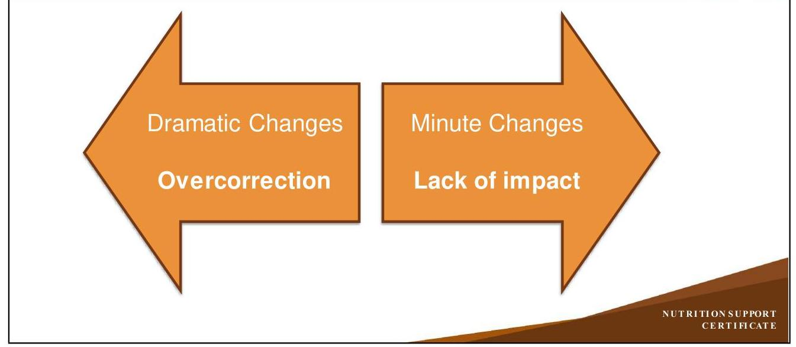
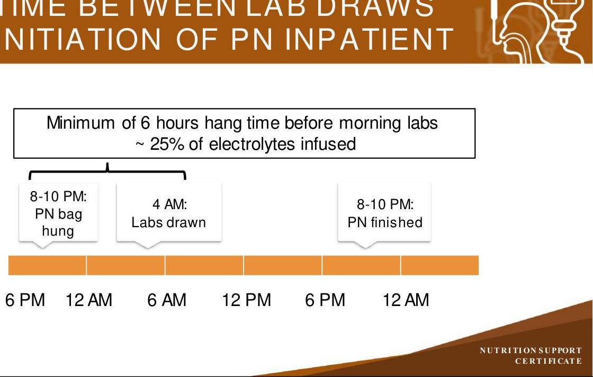
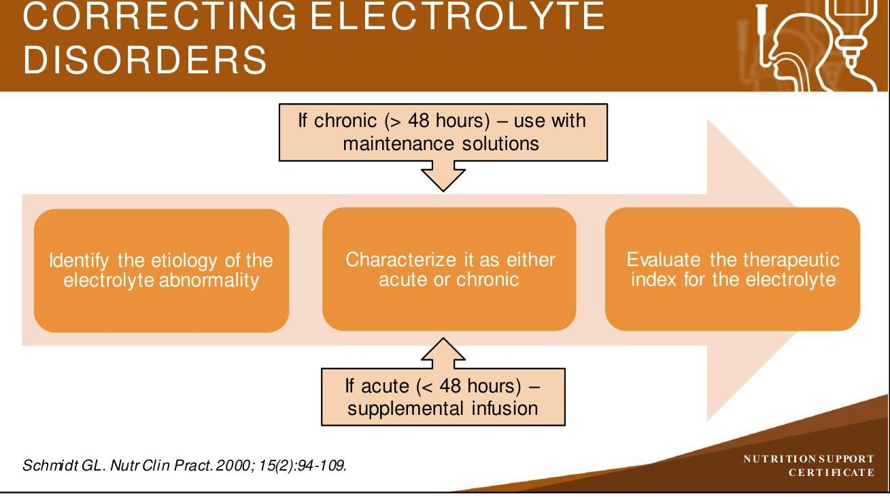
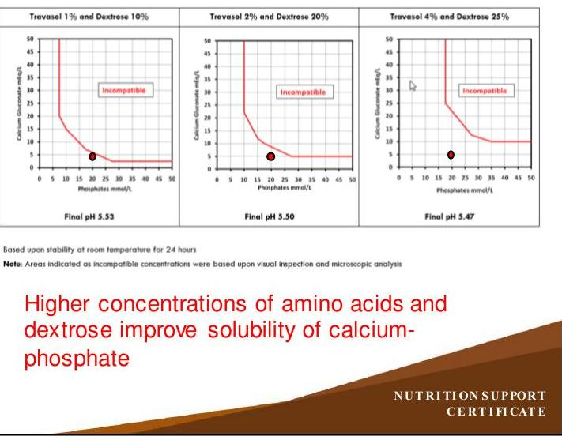

# NUTRITION SUPPORT CERTIFICATE 

## Nutritional

Requirements, Part 2

Planned by the American Society of Health-System Pharmacists (ASHP) in collaboration with the American Society for Parenteral and Enteral Nutrition (ASPEN).
©2022 American Society of Health-System Pharmacists, Inc. All rights reserved.
No part of this publication may be reproduced or transmitted in any form or by any means, electronic or mechanical, including photocopying, microfilming, and recording, or by any information storage and retrieval system, without written permission from the American Society of Health-System Pharmacists.

--- page 1 ---

# NUTRITIONAL REQUIREMENTS 

PART 2
Todd W. Canada, Pharm.D., BCNSP, BCCCP, FASHP, FTSHP, FASPEN
University of Texas MD Anderson
Cancer Center

NUTRITION SUPPORT CERTIFICATE

## RELEVANT FINANCIAL RELATIONSHIP DISCLOSURE

No one in control of the content of this activity has a relevant financial relationship (RFR) with an ineligible company.

As defined by the Standards of Integrity and Independence in Accredited Continuing Education definition of ineligible company. All relevant financial relationships have been mitigated prior to the CPEactivity.

--- page 2 ---

# LEARNING OBJECTIVES 

- Assess the electrolyte content of an initial parenteral nutrition formulation.
- Recommend appropriate electrolyte content adjustments in a parenteral nutrition order, based on a given patient scenario.
- Discuss the importance of providing the full dose of intravenous multivitamin daily in parenteral nutrition.
- Evaluate the trace element content of a parenteral nutrition formulation.
- Discuss the assessment timeline and potential consequences for continuing "empiric" additions or deletions of components to a parenteral nutrition formulation.

## KEY ABBREVIATIONS

- AA:
- ABW:
- ALA:
- CrCl :
- Dex:
- EFA:
- EFAD:
- EN:
- Gl:
- IBW:
amino acids
adjusted body weight
alpha-linolenic acid
creatinine clearance
Dextrose
essential fatty acids
essential fatty acid deficiency
enteral nutrition
gastrointestinal
ideal body weight

--- page 3 ---

# KEY ABBREVIATIONS, CONT. 

- ILE: lipid injectable emulsion
- IV: intravenous
- LA: linoleic acid
- MCT: medium chain triglycerides
- NPO: nil per os (nothing by mouth)
- PN: parenteral nutrition
- CRRT: continuous renal replacement therapy
- TBW: total body water

## SELF-ASSESSMENT \#1

RC is a malnourished 52-year-old male with a postoperative ileus on hospital day 3. His nasogastric tube is draining $1.4 \mathrm{~L} /$ day and less than 100 mL out of his end descending colostomy. His laboratory results include: sodium $140 \mathrm{mEq} / \mathrm{L}$, potassium $3.2 \mathrm{mEq} / \mathrm{L}$, chloride $99 \mathrm{mEq} / \mathrm{L}$, total $\mathrm{CO}_{2} 29 \mathrm{mEq} / \mathrm{L}$, BUN $24 \mathrm{mg} / \mathrm{dL}, \mathrm{SCr} 0.9 \mathrm{mg} / \mathrm{dL}$, magnesium $1.5 \mathrm{mg} / \mathrm{dL}$, phosphorus $2.1 \mathrm{mg} / \mathrm{dL}$, and ionized calcium $1.13 \mathrm{mmol} / \mathrm{L}$. Which of the following would most likely decrease with PN initiation?
A. Sodium, Phosphorus and Calcium
B. Sodium and Potassium only
C. Potassium and Magnesium only
D. Potassium, Phosphorus and Magnesium

--- page 4 ---

# PATIENT SPECIFIC ELECTROLYTE CONSIDERATIONS 

- Evaluate all measurable electrolytes
- Rarely is there only one electrolyte abnormality
- Evaluate patient's renal (blood urea nitrogen, serum creatinine) \& GI function
- What is their urine output?
- Normally $0.5-2 \mathrm{~mL} / \mathrm{kg} / \mathrm{hr}$
- What is their GI anatomy?
- Prior surgeries or medical history
- Evaluate medications for drug-nutrient interactions

Canada TW et al. ASPEN Adult Nutrition Support Core Curriculum. 3rd ed. 2017:113-37.

## ELECTROLYTE REPLACEMENT CONSIDERATIONS

- Most abnormal electrolytes need to be corrected over a chronic period
- 3 to 7 days in most patients to replace total body stores
- Substantial portions ( $>50 \%$ ) of the electrolyte may be lost in the urine
- Serum concentrations approximate renal threshold
- Infusion may exceed the renal reabsorption threshold of the electrolyte
- Most are approximately 90-99\% reabsorbed by kidney

--- page 5 ---

# CORRECTING ELECTROLYTE DISORDERS 

## LAG TIME BETWEEN LAB DRAWS AND INITIATION OF PN INPATIENT

--- page 6 ---

# CORRECTING ELECTROLYTE DISORDERS 

## DETERMINING ELECTROLYTE NEEDS

| Electrolyte | Standard Daily   Requirement | Factors Increasing   Daily Requirement | Salts Available | Therapeutic   Index |
| :--: | :--: | :--: | :--: | :--: |
| Sodium | $1-2 \mathrm{mEq} / \mathrm{kg}^{*}$ | Diarrhea, vomiting,   nasogastric or Gl   losses | $\mathrm{NaCl}$,   NaAcetate,   $\mathrm{NaPO}_{4}$ | Wide |
| Potassium | $1-2 \mathrm{mEq} / \mathrm{kg}^{*}$ | Diarrhea, vomiting,   nasogastric or Gl   losses, diuretics,   insulin, hydrocortisone,   refeeding syndrome | $\mathrm{KCl}, \mathrm{KAcetate}$,   $\mathrm{KPO}_{4}$ | Narrow |

* Multiple salts may be used to meet dosage

--- page 7 ---

# DETERMINING ELECTROLYTE NEEDS, CONT.

|  Electrolyte | Standard Daily
Requirement | Factors Increasing
Daily Requirement | Salts Available | Therapeutic
Index  |
| --- | --- | --- | --- | --- |
|  Chloride | As needed to
maintain acid-base
balance | Metabolic alkalosis,
vomiting or nasogastric
losses | NaCl, KCl,
Magnesium
chloride | Wide  |
|  Acetate* | As needed to
maintain acid-base
balance | Acute/Chronic kidney
disease, metabolic
acidosis, ileostomy,
diarrhea | NaAcetate,
KAcetate | Wide  |

- Liver function must be adequate to convert to bicarbonate

*Mirtallo J et al. JPEN J Parent Enteral Nutr. 2004; 28:S39-S70.*

# DETERMINING ELECTROLYTE NEEDS, CONT.

|  Electrolyte | Standard Daily
Requirement | Factors Increasing Daily
Requirement | Salts Available | Therapeutic
Index  |
| --- | --- | --- | --- | --- |
|  Calcium | $10-15 \mathrm{mEq}$ | Vitamin D deficiency,
acute pancreatitis,
parathyroidectomy | Calcium gluconate
preferred | Narrow  |
|  Magnesium | $8-20 \mathrm{mEq}$ | Diarrhea, ileostomy,
diuretics, diabetes
mellitus, alcoholism,
refractoryhypokalemia | Magnesium
sulfate,
Magnesium
chloride | Wide  |
|  Phosphate | $20-40 \mathrm{mmol}^{\star}$ | Insulin, dextrose
administration, alcoholics,
refeeding syndrome | $\mathrm{NaPO}_{4}, \mathrm{KPO}_{4}$ | Wide  |

- Multiple salts may be used to meet dosage

Mirtallo J et al. JPEN J Parent Enteral Nutr. 2004; 28:S39-S70.

--- page 8 ---

# DIFFERENCES IN EN VS PN PROVISION 

- What is the bioavailability of the specified route of administration?
- Oral, nasogastric tube, nasojejunostomy tube
- Dependent on rate of administration, tolerance
- May be $<70 \%$ with distention, ileus, diarrhea, vomiting, prior surgical resection(s) of small intestine or colon
- Absence of ileocecal valve results in increased colonic transit times
- Central or Peripheral IV
- 100\% bioavailable as bypassing Gl tract
- Is the rate of administration safe for electrolytes?
- Oral is always safer than IV administration
» If the Gl tract is functional

## SELF-ASSESSMENT \#1

RC is a malnourished 52-year-old male with a postoperative ileus on hospital day 3. His nasogastric tube is draining $1.4 \mathrm{~L} /$ day and less than 100 mL out of his end descending colostomy. His laboratory results include: sodium $140 \mathrm{mEq} / \mathrm{L}$, potassium $3.2 \mathrm{mEq} / \mathrm{L}$, chloride $99 \mathrm{mEq} / \mathrm{L}$, total $\mathrm{CO}_{2} 29 \mathrm{mEq} / \mathrm{L}$, BUN $24 \mathrm{mg} / \mathrm{dL}, \mathrm{SCr} 0.9 \mathrm{mg} / \mathrm{dL}$, magnesium $1.5 \mathrm{mg} / \mathrm{dL}$, phosphorus $2.1 \mathrm{mg} / \mathrm{dL}$, and ionized calcium $1.13 \mathrm{mmol} / \mathrm{L}$. Which of the following would most likely decrease with PN initiation?
A. Sodium, Phosphorus and Calcium
B. Sodium and Potassium only
C. Potassium and Magnesium only
D. Potassium, Phosphorus and Magnesium

--- page 9 ---

# SELF-ASSESSMENT \#1 

RC is a malnourished 52-year-old male with a postoperative ileus on hospital day 3. His nasogastric tube is draining 1.4 L/day and less than 100 mL out of his end descending colostomy. His laboratory results include: sodium $140 \mathrm{mEq} / \mathrm{L}$, potassium $3.2 \mathrm{mEq} / \mathrm{L}$, chloride $99 \mathrm{mEq} / \mathrm{L}$, total $\mathrm{CO}_{2} 29 \mathrm{mEq} / \mathrm{L}$, BUN $24 \mathrm{mg} / \mathrm{dL}, \mathrm{SCr} 0.9 \mathrm{mg} / \mathrm{dL}$, magnesium $1.5 \mathrm{mg} / \mathrm{dL}$, phosphorus $2.1 \mathrm{mg} / \mathrm{dL}$, and ionized calcium $1.13 \mathrm{mmol} / \mathrm{L}$. Which of the following would most likely decrease with PN initiation?
A. Sodium, Phosphorus and Calcium
B. Sodium and Potassium only
C. Potassium and Magnesium only
D. Potassium, Phosphorus and Magnesium

## VITAMIN REQUIREMENTS

- Multivitamins
- Adult MVI
- Daily requirement of 10 mL
- During shortages reserve supply for long-term PN patients
- Additional Thiamine 100 mg if no MVI supply
- Thiamine is required to convert dextrose for use in the Krebs Cycle
- In thiamine deficiency, dextrose leads to excessive production of lactate

Mundi MS et al. JPEN J Parenter Enteral Nutr. 2017; 41(4):535-49.

--- page 10 ---

# MICRONUTRIENTS (TRACE ELEMENTS) 

| Trace Element | Standard Daily   Requirement | Factors Affecting Daily   Requirement | Long-term Toxicity Risk   with Commercial Multi-   trace Element Products |
| :-- | :--: | :--: | :--: |
| Zinc | $2.5-5 \mathrm{mg}$ | Increased for diarrhea, Gl losses,   burns | No |
| Copper | $0.3-0.5 \mathrm{mg}$ | Increasedfor burns or CRRT,   Reduce in severe hepatic   dysfunction or cholestasis | Yes |
| Selenium | $60-100 \mathrm{mcg}$ | Increased for CRRT | No |
| Manganese | 55 mcg | Reduce in severe hepatic   dysfunction or cholestasis | Yes |
| Chromium | None | Common parenteral contaminant | Yes |

Mirtallo J et al. JPEN J ParentEnteral Nutr. 2004; 28:S39-S70.
Vanek VW et al. Nutr Clin Pract. 2015; 30(4):559-69.

## VITAMIN AND TRACE ELEMENTS LONG-TERM CONSIDERATIONS

- Multivitamin shortages create the greatest risk for long-term PN patients
- Minimum of 10 mL three times per week
- Use individual vitamins if available
- Thiamine, folic acid, cyanocobalamin
- Oral or enteral vitamin preparations
- Trace elements concerns with commercially available multi-component products
- Manganese toxicity with Parkinson's disease
- Copper deposition in liver with possible Wilson's disease
- If trace elements are removed for worsening hepatic disease
- Reassess after 4 weeks (Serum monitoring in select patients)

--- page 11 ---

# SELF-ASSESSMENT \#2 

RC is a malnourished 52-year-old male with a postoperative ileus on hospital day 3. His weight is 60 kg and he is 5'9". His nasogastric tube is draining $1.4 \mathrm{~L} /$ day and less than 100 mL out of his end descending colostomy. His laboratory results include: sodium $140 \mathrm{mEq} / \mathrm{L}$, potassium $3.2 \mathrm{mEq} / \mathrm{L}$, chloride $99 \mathrm{mEq} / \mathrm{L}$, total $\mathrm{CO}_{2} 29$ $\mathrm{mEq} / \mathrm{L}$, BUN $24 \mathrm{mg} / \mathrm{dL}, \mathrm{SCr} 0.9 \mathrm{mg} / \mathrm{dL}$, magnesium $1.8 \mathrm{mg} / \mathrm{dL}$, phosphorus 2.5 $\mathrm{mg} / \mathrm{dL}$, and ionized calcium $1.13 \mathrm{mmol} / \mathrm{L}$.

How would you determine his PN goal and initiation?

## HOW TO WRITE A PN ORDER

- Step 1 - What is your dosing weight? 60 kg
- Step 2 - How much protein is needed? $1.5 \mathrm{~g} / \mathrm{kg} /$ day
- Step 3 - How many calories are needed? $25 \mathrm{kcal} / \mathrm{kg} /$ day
- Step 4 - What is your volume limit? $2100 \mathrm{~mL} /$ day
- Step 5 - Is the patient malnourished or NPO > 7 days? Yes
- Step 6 - Any electrolyte disorders present? Yes
- Step 7 - Is renal function normal? Yes
- Step 8 - What electrolyte dosages are needed?
- Step 9 - What other items should be added?
- Step 10 - Can the current PN be administered peripherally or centrally?
- Step 11 - When should the PN be advanced to goal?

--- page 12 ---

# PN ORDER STEP 2 

- Step 2 - How much protein is needed?
- Daily protein requirement
- Minimum: $0.8 \mathrm{~g} / \mathrm{kg} /$ day
- Stable: $0.8-1 \mathrm{~g} / \mathrm{kg} /$ day
- Critically ill: $1.2-2 \mathrm{~g} / \mathrm{kg} /$ day
- Obesity: 2 - 2.5 g IBW/kg/day
- ( 1.5 g Protein $/ \mathrm{kg} /$ day (post-operative) $\times 60 \mathrm{~kg})=90 \mathrm{~g}$ Protein/day
- $(90 \mathrm{~g}$ Protein $\times 4 \mathrm{kcal} / \mathrm{g})=360 \mathrm{kcal} /$ day
- Stock Amino Acids $10 \%=10 \mathrm{~g} / 100 \mathrm{~mL}=100 \mathrm{~g} / 1000 \mathrm{~mL}$
- 90 g Protein $=900 \mathrm{~mL}$ Stock Amino Acids $10 \%$

## PN ORDER STEP 3

- Step 3 - How many calories are needed?
- Daily total caloric requirement
$-20-30 \mathrm{kcal} / \mathrm{kg} /$ day $\times 60 \mathrm{~kg}=1200-1800 \mathrm{kcal} /$ day
- $1500 \mathrm{kcal} /$ day is our selection
- ( 4 g Dextrose $/ \mathrm{kg} /$ day $\times 60 \mathrm{~kg})=240 \mathrm{~g}$ Dextrose/day
- $((240 \mathrm{~g}$ Dextrose/day $\div 60 \mathrm{~kg}) \times 1000 \mathrm{mg} / \mathrm{g}) \div 1440$ minutes/day $=$ $2.8 \mathrm{mg} / \mathrm{kg} /$ minute
- $(240 \mathrm{~g}$ Dextrose $\times 3.4 \mathrm{kcal} / \mathrm{g})=816 \mathrm{kcal} /$ day
- Stock Dextrose $70 \%=70 \mathrm{~g} / 100 \mathrm{~mL}=700 \mathrm{~g} / 1000 \mathrm{~mL}$
- 240 g Dextrose $=342 \mathrm{~mL}$ Stock Dextrose $70 \%$

--- page 13 ---

# PN ORDER STEP 3, CONT. 

- Step 3 - How many calories are needed?
- Daily total caloric requirement
- (1500 kcal/day (our selection) - 816 kcal Dextrose/day) $=684 \mathrm{kcal} /$ day
- (684 kcal/day - 360 kcal Protein/day) $=324 \mathrm{kcal} /$ day as ILE
- (324 kcal/day $\div 10 \mathrm{kcal} / \mathrm{g}(20 \% \mathrm{ILE}))=32 \mathrm{~g}$ ILE/day
- Stock 20\% ILE $=20 \mathrm{~g} / 100 \mathrm{~mL}$
- 32 g ILE/day $=160 \mathrm{~mL}$ Stock 20\% ILE
- 816 kcal Dextrose +360 kcal Protein +320 kcal ILE $=1496 \mathrm{kcal} /$ day
- $25 \mathrm{kcal} / \mathrm{kg} /$ day based upon dosing weight of 60 kg

## PN ORDER STEP 4

- Step 4 - What is your volume limit?
- Daily volume estimation
- Age and weight based

Most adults (18-55 yrs) ( $35 \mathrm{~mL} / \mathrm{kg} /$ day $\times 60 \mathrm{~kg})=2100 \mathrm{~mL} /$ day

- [2100 mL/day (our selection) - ( 900 mL Stock Amino Acids 10\% + 342 mL Stock Dextrose $70 \%+160 \mathrm{~mL}$ Stock $20 \%$ ILE) $=698 \mathrm{~mL} /$ day
- Therefore, add 698 mL of Sterile Water for Injection for a total volume of $2100 \mathrm{~mL} /$ day

| Final Amino Acid 4.3\% |
| :-- |
| Final Dextrose 11.4\% |
| Final ILE 1.5\% |

--- page 14 ---

# PN ORDER STEP 4, CONT. 

- Not stable as a 3-in-1, also known as a total nutrient admixture
- Ideally final amino acid $\geq 4 \%+$ dextrose $\geq 10 \%+$ ILE $\geq 2 \%$
- Change dose of ILE to 50 g to meet above recommendations ( $1676 \mathrm{kcal} /$ day $)$

| Final Amino Acid 4.3\% |
| :-- |
| Final Dextrose 11.4\% |
| Final ILE 2.4\% |

- May alternatively use PN formulation without sterile water for injection only adding amino acids, dextrose, ILE, electrolytes and micronutrients volume rather than meeting daily fluid requirements
- IV fluids may be infusing for other IV medications (e.g., patient controlled analgesia, antimicrobials) to meet fluid requirements

## PN ORDER STEP 5

- Step 5 - Is the patient malnourished or NPO $>7$ days?
- Yes
- Start with 2 g Dextrose $/ \mathrm{kg} /$ day to prevent refeeding and assess glucose tolerance
- 120 g Dextrose/day $=171 \mathrm{~mL}$ Stock Dextrose $70 \%$
- No
- Start with 3 g Dextrose/kg/day to assess glucose tolerance
- 180 g Dextrose/day $=257 \mathrm{~mL}$ Stock Dextrose $70 \%$
- Begin 1 g Protein/kg/day with either of the above
- (1 g Protein/kg/day (post-operative) $\times 60 \mathrm{~kg}$ ) $=60 \mathrm{~g}$ Protein/day

--- page 15 ---

# PN ORDER STEPS 6 \& 7 

- Day 1 Malnourished PN regimen
- PN Volume $=2100 \mathrm{~mL} /$ day
- 600 mL Stock Amino Acids 10\%
- 171 mL Stock Dextrose 70\%
- 1329 mL Sterile Water for Injection
- 240 kcal from Protein +407 kcal from Dextrose $=648 \mathrm{kcal} /$ day
- Step 6 - Any electrolyte disorders present?
- Yes
- Potassium $3.2 \mathrm{mEq} / \mathrm{L}$, Phosphorus $2.5 \mathrm{mg} / \mathrm{dL}$, Magnesium $1.8 \mathrm{mg} / \mathrm{dL}$
- Step 7 - Is renal function normal?
- Yes
- Serum creatinine $0.9 \mathrm{mg} / \mathrm{dL}$

Final Amino Acid 2.9\%
Final Dextrose 5.7\%
- Step 8 - What electrolyte dosages are needed?

- Sodium 1-2 mEq/kg $\times 60 \mathrm{~kg}=60-120 \mathrm{mEq} /$ day
- Select 120 mEq (wide therapeutic index)
- 57 mEq Sodium/L of current PN (2.1 L)
- Phosphate 20-40 mmol* (wide therapeutic index)
- Select $40 \mathrm{mmol} /$ day as Potassium Phosphate $=59 \mathrm{mEq}$ of Potassium/day
- Approximately 19 mmol Phosphate/L of current PN (2.1 L)
* Based on compatibility limits with calcium

--- page 16 ---

# PN ORDER STEP 8, CONT. 

- Step 8 - What electrolyte dosages are needed?
- Potassium 1-2 mEq/kg $\times 60 \mathrm{~kg}=60-120 \mathrm{mEq} /$ day (narrow therapeutic index)
- Select 90 mEq /day - potassium contribution from Potassium Phosphate
- Therefore, add 30 mEq Potassium Chloride/day for a total of 89 mEq
- 42 mEq Potassium/L of current PN (2.1 L)
- Magnesium 8-20 mEq
- Select 20 mEq/day (wide therapeutic index)

## PN ORDER STEP 8, CONT.

- Step 8 - What electrolyte dosages are needed? Calcium 10-15 mEq*
- Select 10 mEq of Calcium Gluconate
- Approximately 4.8 mEq Calcium/L of current PN (2.1 L)
- Check manufacturer information for compatibility
- Unable to add dose based upon graphs on next slide
* Based on compatibility limits with calcium

--- page 17 ---

# PN ORDER STEP 8, CONT. 

- Determine appropriate compatibility curve for the brand of amino acids

1. Final PN volume (L)
2. Final amino acid concentration (\%)
3. Final dextrose concentration (\%)
4. Final calcium gluconate concentration (mEq/L)
5. Final phosphate concentration (mmol/L)
6. Select the most appropriate curve (use most conservative estimate)

Higher concentrations of amino acids and dextrose improve solubility of calciumphosphate

## PN ORDER STEP 9

- Step 9 - What other items should be added?
- Multivitamins (consider adding additional thiamine)
- Trace Elements (zinc, copper, selenium, manganese)
- $\mathrm{H}_{2}$ antagonist (ranitidine, famotidine)
- Regular Human Insulin
- What is the baseline serum glucose?
- Should insulin be added initially?
- Only if serum glucoses dictate ( $>180 \mathrm{mg} / \mathrm{dL}$ )
- How much with 120 g Dextrose/day in current PN?
- 12 units Regular Insulin is 1 unit Insulin for every 10 g of Dextrose

--- page 18 ---

# PN ORDER STEP 10 

- Step 10 - Can the current PN be administered peripherally or centrally?
- Final Concentrations = Dextrose 5.7\%, Amino Acids 2.9\%

Dextrose $5.7 \% \times 50=$
285 mOsm/L
Amino Acids $2.9 \% \times 100=$
290 mOsm/L
Electrolytes (1 per mEq) $=$
229 mOsm/L
Total Osmolarity $=$
804 mOsm/L
(ILE contributes 15
mOsm/Lper 1\%
final concentration when added)

- Infusion Nurses Society
- Maximum osmolarity of 500 mOsm/L for peripheral IV
- Nutrition Support literature
- Maximum of $900 \mathrm{mOsm} / \mathrm{L}$ for peripheral PN
- Yes, it can be administered peripherally or centrally

Mirtallo J et al.JPEN J Parent Enteral Nutr. 2004; 28:S39-S70.

## PN ORDER STEP 11

- Step 11 - When should the PN be advanced to goal?
- When electrolytes are trending the right way or corrected
- Potassium, phosphorus, magnesium
- Sodium may be falsely low from hyperglycemia or hypertriglyceridemia
- When serum glucoses are consistently $<180 \mathrm{mg} / \mathrm{dL}$
- Generally within 72-96 hours
- Serum triglycerides are acceptable ( $<400 \mathrm{mg} / \mathrm{dL}$ )
- Separate ILE (based upon bag sizes - 100, 250, 500 mL )
- Total Nutrient Admixture (requires $\geq 2 \%$ final ILE for stability)

--- page 19 ---

# GENERAL GUIDELINES FOR PN INITIATION 

- Provide at least 1 g protein $/ \mathrm{kg} /$ day (based on dosing weight) for nitrogen losses regardless of renal or hepatic function
- Otherwise gluconeogenesis continues to catabolize muscle as an energy source
- Provide at least 2 g dextrose $/ \mathrm{kg} /$ day (based on dosing weight) for proteinsparing effect
- Evaluate for the addition of at least 1 unit of regular insulin for every 10 grams of dextrose if serum glucose greater than $180 \mathrm{mg} / \mathrm{dL}$
- More conservative insulin dosing may be needed in underweight patients

Doig GS et al. LancetRespir Med. 2015; 3(12):943-52.

## GENERAL GUIDELINES FOR PN INITIATION, CONT.

- If serum phosphorus $<2 \mathrm{mg} / \mathrm{dL}$
- Start with $480 \mathrm{kcal} /$ day for at least 2 days
- Then $960 \mathrm{kcal} /$ day for 1 day
- Then $1440 \mathrm{kcal} /$ day or $80 \%$ of energy goal (whichever is lower) for 1 day
- Then $100 \%$ of energy goal until serum electrolytes and glucoses are stabilized

--- page 20 ---

# GENERAL GUIDELINES FOR PN INITIATION, CONT. 

- For adult patients with normal renal function ( $\mathrm{CrCl}>50 \mathrm{~mL} / \mathrm{min}$ ), the following electrolyte dosages are initially recommended:
- Sodium $80 \mathrm{mEq} / \mathrm{L}$ based on fluid needs \& losses from tubes, drains, etc.
- Potassium $1 \mathrm{mEq} / \mathrm{kg}$ (based on dosing weight)
- Presence of metabolic acidosis or use of medications resulting in potassium retention will also affect serum potassium
- Magnesium $8-20 \mathrm{mEq}$
- Phosphate $20-40 \mathrm{mmol}$
- Assess need for calcium gluconate with above dosage of phosphate given compatibility limits of amino acid brand, final volume \& percentage

Mirtallo J et al.JPEN J ParentEnteral Nutr. 2004; 28:S39-S70.

## GENERAL GUIDELINES FOR PN INITIATION, CONT.

- For patients with normal renal function ( CrCl greater than $50 \mathrm{~mL} / \mathrm{min}$ ), the following electrolyte dosages are initially recommended for adults (Con't):
- Use of chloride-based salts (all commercially available amino acids solutions are acetate-based)
- Use acetate-based salts if metabolic acidosis present
- Anticipate effects of refeeding syndrome and drug-nutrient interactions based upon patient history and medication review
- Consider additional thiamine initially for severely malnourished
- Order daily basic metabolic panel, serum phosphorus, magnesium and total calcium for at least 2-3 days or until PN goal rate reached
- Consider ionized calcium if total calcium is $<7 \mathrm{mg} / \mathrm{dL}$

--- page 21 ---

# CONCLUSIONS 

- Primary goal of nutrition support is to provide the required amounts of nitrogen (protein) and energy together with water, minerals, vitamins and trace elements
- Electrolyte requirements are dependent on patient age, renal function, drugnutrient interactions and underlying comorbidities
- Oral or enteral route is preferred (if available) due to safety concerns compared to IV administration
- Multivitamins and trace elements (e.g., Zinc, Selenium, Copper) are necessary requirements in all adult PN formulations
- Reviewing PN orders for adequacy and efficacy are required daily
- Including the determination of osmolarity

## REFERENCES

- Boullata JI, Gilbert K, Sacks G et al. A.S.P.E.N. clinical guidelines: Parenteral nutrition ordering, order review, compounding, labeling, and dispensing. JPEN J Parent Enteral Nutr. 2014; 38(3):334-77.
- Canada TW, Lord LM. Chapter 7 Fluid, Electrolytes, and Acid-Base Disorders. In: Mueller CM, ed. The A.S.P.E.N. Adult Nutrition Support Core Curriculum. 3rd ed. Maryland: A.S.P.E.N.; 2017:113-37.
- Doig GS, Simpson F, Heighes PT et al. Restricted versus continued standard caloric intake during the management of refeeding syndrome in critically ill adults: a randomised, parallelgroup, multicentre, single-blind controlled trial. Lancet Respir Med. 2015; 3(12):943-52.
- Mirtallo J, Canada T, Johnson D et al. Safe practices for parenteral nutrition. JPEN J Parent Enteral Nutr. 2004; 28:S39-S70.

--- page 22 ---

# REFERENCES, CONT. 

- Mundi MS, Nystrom EM, Hurley DL et al. Management of parenteral nutrition in hospitalized adult patients. JPENJ Parenter Enteral Nutr. 2017; 41(4):535-49.
- Schmidt GL. Techniques and procedures: Guidelines for managing electrolytes in total parenteral nutrition solutions. Nutr Clin Pract. 2000; 15(2):94-109.
- Vanek VW, Borum P, Buchman A et al. A call to action to bring safer parenteral micronutrient products to the U.S. market. Nutr Clin Pract. 2015; 30(4):559-69.

--- page 23 ---

# Todd W. Canada, Pharm.D., BCNSP, BCCCP, FASHP, FTSHP, FASPEN 

Clinical Pharmacy Services Manager
Nutrition Support Team Coordinator
University of Texas MD Anderson Cancer Center
Houston, Texas
Todd W. Canada serves as a clinical pharmacy services manager and nutrition support team coordinator for the University of Texas MD Anderson Cancer Center in Houston, Texas. He received his B.S. in Pharmacy from the University of Oklahoma Health Sciences Center and his postbaccalaureate Pharm.D. from the University of Texas Health Science Center at San Antonio.

Dr. Canada completed a specialized residency in Critical Care / Nutrition Support at the University of Tennessee-Memphis and has been board certified in nutrition support since 1996 and critical care since 2016. Dr. Canada has previously served on the Board of Pharmaceutical Specialties - Nutrition Support Specialty Council and the American Society for Parenteral and Enteral Nutrition (ASPEN) Board of Directors. He was the recipient of the ASPEN Distinguished Nutrition Support Pharmacist Service Award in 2011 and Stanley Serlick Safety Award in 2017.

--- page 24 ---

# Relevant Financial Relationship Disclosure

In accordance with our accreditor’s Standards of Integrity and Independence in Accredited Continuing Education, ASHP requires that all individuals in control of content disclose all financial relationships with ineligible companies. An individual has a relevant financial relationship if they have had a financial relationship with ineligible company in any dollar amount in the past 24 months and the educational content that the individual controls is related to the business lines or products of the ineligible company.

An ineligible company is any entity producing, marketing, re-selling, or distributing health care goods or services consumed by, or used on, patients. The presence or absence of relevant financial relationships will be disclosed to the activity audience.

The following persons in control of this activity’s content have relevant financial relationships:

- Phil Ayers: Fresenius Kabi, consultant and speaker
- David Evans: Fresenius Kabi, consultant and speaker; Abbott Laboratories, consultant and speaker; CVS/OptionCare, consultant; Alcresta, consultant and speaker
- Andrew Mays: Fresenius Kabi, speaker
- Jay Mirtallo: Fresenius Kabi, consultant
- Kris Mogensen: Baxter, speaker; ThriveRx, advisory board; Pfizer, advisory board

All other persons in control of content do not have any relevant financial relationships with an ineligible company.

As required by the Standards of Integrity and Independence in Accredited Continuing Education definition of ineligible company, all relevant financial relationships have been mitigated prior to the CPE activity.

# Methods and CE Requirements

This online activity consists of a combined total of 12 learning modules. Pharmacists and physicians are eligible to receive a total of 20 hours of continuing education credit by completing all 12 modules within this certificate.

Participants must participate in the entire activity, complete the evaluation and all required components to claim continuing pharmacy education credit online at ASHP Learning Center http://elearning.ashp.org. Follow the prompts to claim credit and view your statement of credit within 60 days after completing the activity.

# Important Note – ACPE 60 Day Deadline:

Per ACPE requirements, CPE credit must be claimed within 60 days of being earned. To verify that you have completed the required steps and to ensure your credits have been reported to CPE Monitor, check your NABP eProfile account to validate that your credits were transferred successfully before the ACPE 60-day deadline. After the 60 day deadline, ASHP will no longer be able to award credit for this activity.

# System Technical Requirements

Courses and learning activities are delivered via your Web browser and Acrobat PDF. Users should have a basic comfort level using a computer and navigating websites.

View Frequently Asked Questions for more information.