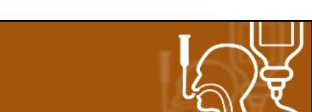
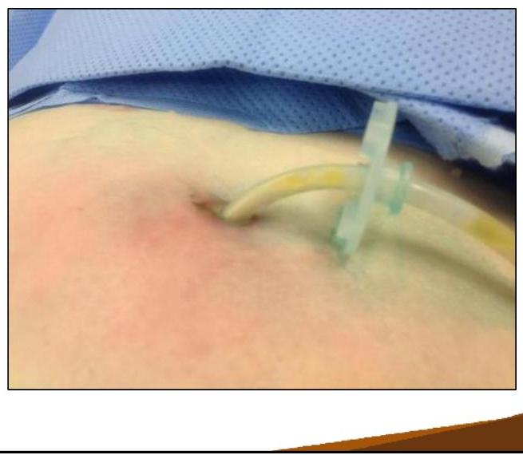
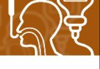
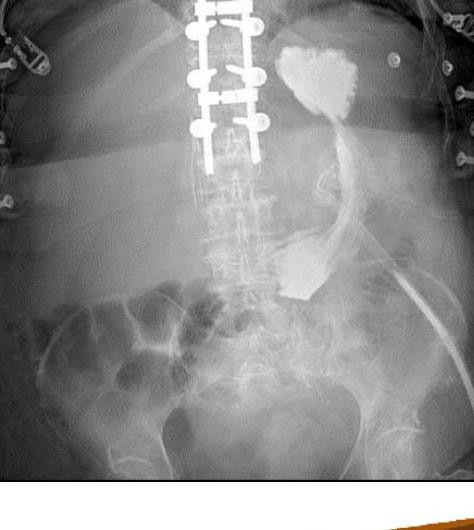
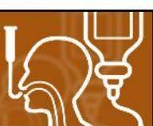

# NUTRITION SUPPORT CERTIFICATE 

## Enteral Access Complications

Planned by the American Society of Health-System Pharmacists (ASHP) in collaboration with the American Society for Parenteral and Enteral Nutrition (ASPEN).
(c)2022 American Society of Health-System Pharmacists, Inc. All rights reserved.

No part of this publication may be reproduced or transmitted in any form or by any means, electronic or mechanical, including photocopying, microfilming, and recording, or by any information storage and retrieval system, without written permission from the American Society of Health-System Pharmacists.

--- page 1 ---

# NUTRITION SUPPORT ACCESS 

## ENTERAL ACCESS COMPLICATIONS

David Evans, M.D.
The Ohio State University

NUTRITION SUPPORT CERTIFICATE

## RELEVANT FINANCIAL RELATIONSHIP DISCLOSURE

The following persons in control of this activity's content have relevant financial relationships:

- David Evans: Fresenius Kabi, consultant and speaker; Abbott Laboratories, consultant and speaker; CVS/OptionCare, consultant; Alcresta, consultant and speaker

All other persons in control of content do not have any relevant financial relationships with an ineligible company

As defined by the Standards of Integrity and Independence definition of ineligible company. All relevant financial relationships have been mitigated prior to the CPE activity.

--- page 2 ---

# LEARNING OBJECTIVE 

- Describe strategies for preventing potential complications of enteral access devices.

## KEY ABBREVIATIONS / DEFINITIONS

- CRBSI:
- EGD:
- G-tube:
- NG:
- OG:
- PEG:
- PN:
- VAP:
catheter-related bloodstream infections
esophagogastroduodenoscopy
gastrostomy tube
nasogastric
orogastric
percutaneous endoscopic gastrostomy
parenteral nutrition
ventilator-associated pneumonia

--- page 3 ---

# SELF-ASSESSMENT 

Your patient is a 53-year-old female who had a PEG placed after a recent stroke. She is tube-feed dependent. Which of the following is FALSE regarding maintaining a patent tube?
A. Frequent flushing of the feeding tube helps maintain patency
B. Coca-Cola ${ }^{\oplus}$ flushes are effective to resolve clogs
C. Crushed medications increase the risk of tube clogging
D. Tension on the feeding tube can result in tube dislodgement

## PEG / PEJ / G- / J-TUBES

- If dislodged $\rightarrow$ Call surgeon / surgical team promptly
- Major problems
- Tube clogging (diameter, content administered)
- Balloon rupture
- Dislodgement
- Bowel obstruction (J-tubes)
- Leakage around the tube (both externally and internally)
- Assessment of external bumper tension
- Avoid "compulsive" bumper tightening
- Risk of "buried bumper" syndrome

--- page 4 ---

# FEEDING TUBE MAINTENANCE 

- Flush tube at regular intervals and after each use to maintain patency (15-30 mL every 4 hours and after feeds / meds is common)
- Clogging or luminal obstruction
- The most common mechanical complication
- Often due to inadequate flushing
- If naso- or oroenteric tube involved:
- Try to unclog
- If unsuccessful or recurrent obstruction, replace the tube
- For surgical tubes:
- Try everything possible to unclog
- If unable to unclog, consult the physician(s) who placed the tube
- Tube replacement should prompt post-procedure position verification

## FEEDING TUBE MAINTENANCE

- Tube dressing
- No dressing is best
- Simple gauze is acceptable if leakage or bleeding
- External bumper $\rightarrow$ Ensure 0.5-0.75 cm clearance
- Avoid overzealous external bumper tightening!
- If tube is leaking
- Avoid "upsizing" the tube
- Provide adequate wound care
- Consider delayed gastric emptying / obstruction

--- page 5 ---

# FEEDING TUBE CLOGGING 

- Why do tubes clog?
- Thickened formula residue
- Medication particles
- Incompatible substances
- Inadequate flushing
- Prevention:
- Flush tube with water every 4 hours
- Flush with water before / after medications

Marcuard SP et al. JPEN J Parenter Enteral Nutr. 1989; 13(1):81.

## DE-CLOGGING

"Success Rating for De-Clogging" [Scale from 0 "worst" to 3 "best"]

1 and 4: Image and graphic courtesy S.A. McClave.
2: CC Image courtesy Pixabay. https://pixabay.com/service/terms/ (accessed 2019 Mar 9).
3: CC Image courtesy Rainer Zenz / Wikimedia Commons.
https://commons.wikimedia.org/wiki/User:Rainer_Zenz (accessed 2019 Mar 9).

--- page 6 ---

# ENFIT® CONNECTOR CLEANING

- New design requires attention to cleaning, care with medication preparation
- See "Nutrition Support Access: Enteral Overview" for More Info about ENFit®

*Image courtesy of Global Enteral Device Supplier Association (GEDSA). http://stayconnected.org (accessed 2019 Mar 9).*

--- page 7 ---

# OTHER COMPLICATIONS \& PREVENTIVE STRATEGIES 

- Delayed gastric emptying $\rightarrow$ Elevate HOB $30^{\circ}$ during and at least 1 hour after feeding; reduce feeds rate; metoclopramide...
- Nasopharyngeal breakdown / irritation $\rightarrow$ Use soft, small-bore tube; tape the tube properly to prevent undue pressure on nostril
- Can't miss this! [Medico-legal risk]
- Bridle device- umbilical tape passed around nasal septum- prevents dislodgement

## AN "OUNCE" OF PREVENTION

- Many strategies tried; few outcomes reported
- Attaching "decoy" devices to apron or abdominal binders
- Geriatric "activity aprons"
- Works very well for agitated patients

--- page 8 ---

# TUBES DON'T LAST FOREVER 

Image courtesy of Dr. Mike Cadogan

## BLEEDING

- Granulation or ulceration is often the cause
- Bleeding not due to skin changes needs a physician's evaluation
- Bleeding from the GI tract is less common

--- page 9 ---

# SKIN ULCERATION 

This bumper
was too tight

Image courtesy of S.A. McClave

## APPROPRIATE TENSION

This bumper is just loose enough

No gauze typically needed after first few days

--- page 10 ---

# PREVENTION AND TREATMENT OF SKIN ULCERATION 

Horizontal Hollister Clamp for J tube
"Vertical" Hollister Clamps also exist

## INFECTION

- Skin changes only- consider ET/ostomy RN evaluation
- Concerns for deeper infection- MD evaluation

--- page 11 ---

# CANDIDAL SKIN INFECTIONS 

- Often moist, in skin folds
- Can be seen around wounds, tube sites
- Typically treat with nystatin topical powder, sometimes oral fluconazole

LEAKAGE / ENLARGING HOLE

Image courtesy of S.A. McClave

--- page 12 ---

# LEAKAGE / ENLARGING HOLE 

- Consider Vertical Hollister Clamp to keep straight
- Avoid tension on the tube
- Pad tube with multiple layers of gauze to keep tension off (Patient of Laszlo Kiraly)

LEAKAGE / ENLARGING HOLE

- Feeding post-pyloric may be necessary
- Bad wounds may require tube relocation
- Consider skin protective barriers / dressing (ask an ostomy nurse)
- Evaluate meds for corrosive substances
- Treat with PPI (acid suppression)
- PN- worst-case scenario
- Answer is never to use a larger tube to "plug the hole"

--- page 13 ---

# BURIED BUMPER SYNDROME 

Heximer B. Nutr Clin Pract. 1997; 12(6):256.

NUTRITION SUPPORT CERTIFICATE

## SUSPECT BURIED BUMPER SYNDROME WHEN

- History of recent pulling / tugging / bumper at new cm mark
- Everything flushed in leaks out around the tube
- Can palpate internal bumper (disk) in thin person
- Significant Pain (often sudden onset)
- Cellulitis (usually with another symptom)
- N.B. Tube may continue to work until stomach heals

--- page 14 ---

# BURIED BUMPER SYNDROME 

## X-RAY CONFIRMATION OF PEG IN THE STOMACH

--- page 15 ---

# BURIED BUMPER SYNDROME

# BURIED BUMPER SYNDROME – TYPICAL CASE

This tube still flushed normally and the patient tolerated feeding

--- page 16 ---

# BURIED BUMPER SYNDROME EASY FIX 

Wire placed in old tube tract

New PEG placed

## ACUTE PEG DISPLACEMENT POSTPROCEDURE

White is oral contrast that was put in the PEG

Tube seems to work but...

--- page 17 ---

# ACUTE PEG DISPLACEMENT / EROSION 

Heximer B. Nutr Clin Pract. 1997; 12(6):256.

## HEMATOMA AFTER PEG

--- page 18 ---

# ERYTHEMA AND FOUL ODOR AT PEG SITE 

PEG at 6.5 cm

## ERYTHEMA AND FOUL ODOR AT PEG SITE

PEG at 6.5 cm

Transcolonic PEG

--- page 19 ---

# DISPLACED PEG (> 1 MONTH OLD) 

Necrotizing soft tissue infection

## NEW PEG PLACED, ABDOMINAL WALL DEBRIDED

--- page 20 ---

# X-RAY CONFIRMATION OF J-TUBE PLACEMENT 

SMALL BOWEL OBSTRUCTION OR ISCHEMIA

J-tube Insertion Site "fixes" bowel to abdominal wall, creates point around which bowel can kink/twist

CC Image courtesy of Encyclopedia Britannica / Wikimedia Commons. https://upload.wikimedia.org/wikipedia/commons /9/9c/EB1911_Intestinal_Obstruction_-_volvulus.jpg (accessed 2019 Mar 9).

--- page 21 ---

# J TUBE OBSTRUCTION / ISCHEMIA 

WHAT'S WRONG WITH THIS PEG REPLACEMENT?

--- page 22 ---

# A FOLEY IS NOT A PERMANENT REPLACEMENT! 

## A FOLEY IS NOT A PERMANENT REPLACEMENT!

--- page 23 ---

# NASOENTERIC ACCESS 

- Placement considerations:
- Difficulty during placement?
- STOP
- Re-assess
- Ask for assistance
- X-ray verification
- Awareness of complications:
- Dislodgement
- Epistaxis
- Sinusitis
- Nasal erosion / necrosis
- Perforation
- Aspiration
- Pain / discomfort
- Migration / displacement

--- page 24 ---

# TUBE PLACEMENT IN THE AIRWAY 

## AIRWAY PLACEMENT RISKS

- Aspiration
- Airway perforation leading to pneumothorax and bronchopleural fistula
- Pneumonia
- Coughing is the main warning sign of misplacement
- Auscultation of tube flushing in the stomach is insufficient
- X-ray confirmation is required before feeding

--- page 25 ---

# WHEN A NASOENTERIC TUBE REQUIRES REMOVAL 

- Persistent kinking of the tube
- Once kinked, tube significantly more likely to kink in the same location
- Tube kinking leads to either discomfort, obstruction, or both
- Injury would occur if tube left in place
- Nasal / facial tissue erosions $\rightarrow$ Immediately remove; Place PEG or surgical tube
- Sinusitis $\rightarrow$ Replace nasal tube with PEG or surgical tube
- Bleeding $\rightarrow$ Remove tube; Ensure coagulation status OK; Replace when bleeding resolved
- Significant discomfort (risk-benefit)

## NASOENTERIC PLACEMENT

Placement tips:

- Estimate the expected distance of tube insertion
- Based on how the "nose-to-ear-to-stomach" distance
- Assess the mental status, gag reflex, nostrils
- Is the patient cooperative?
- If rubber tube, place on ice for $5 \mathrm{~min} \rightarrow$ Tube stiffens making the insertion easier
- If plastic tube, place in warm water $\rightarrow$ Softens the tube, making it more flexible
- Use appropriate (water-based) lubricant, possibly analgesic spray

--- page 26 ---

# NASOENTERIC PLACEMENT, CONT. 

Placement tips:

- If possible, the patient is sitting in the "high Fowler's" position
- Head facing forward (chin-toward-chest, sipping water, etc)
- Advance the tube in downward and backward direction as the patient swallows
- Stop when the patient is breathing

## SELF-ASSESSMENT

Your patient is a 53-year-old female who had a PEG placed after a recent stroke. She is tube-feed dependent. Which of the following is FALSE regarding maintaining a patent tube?
A. Frequent flushing of the feeding tube helps maintain patency
B. Coca-Cola ${ }^{\oplus}$ flushes are effective to resolve clogs
C. Crushed medications increase the risk of tube clogging
D. Tension on the feeding tube can result in tube dislodgement

--- page 27 ---

# SELF-ASSESSMENT 

Your patient is a 53-year-old female who had a PEG placed after a recent stroke. She is tube-feed dependent. Which of the following is FALSE regarding maintaining a patent tube?
A. Frequent flushing of the feeding tube helps maintain patency
B. Coca-Cola ${ }^{\oplus}$ flushes are effective to resolve clogs
C. Crushed medications increase the risk of tube clogging
D. Tension on the feeding tube can result in tube dislodgement

## REFERENCES

- Heximer B. Pressure necrosis: implications and interventions for PEG tubes. Nutr Clin Pract. 1997; 12(6): 256.
- Prabhakaran S et al. Nasoenteric tube complications. Scand J Surg. 2012; 101(3):147-55.
- Marcuard SP, Stegall KL, Trogdon S. Clearing obstructed feeding tubes. JPEN J Parenter Enteral Nutr. 1989; 13(1):81.
- Jones C, Stawicki SP, Evans DC. Mechanical Complications of Nasoenteric Tubes. Diet and Nutrition in Critical Care. 2014:1-13.
- Enteral Feeding Connectors (ENFit ${ }^{\circledR}$ ). stayconnected.org/enteral-enfit/ (accessed 2019 Mar 7).

--- page 28 ---

NUTRITION SUPPORT CERTIFICATE

--- page 29 ---

David C. Evans, M.D., FACS
Trauma and Acute Care Surgeon
OhioHealth Trauma and Surgical Services
Columbus, Ohio

David C. Evans served as Director of Nutrition Support Services, Trauma Medical Director, and Associate Professor of Surgery at The Ohio State University Wexner Medical Center in Columbus, OH. He has a busy clinical practice focusing on trauma, emergency general surgery, endoscopy, and critical care.

His special interests include nutrition support in surgical and ICU patients and research in surgery and trauma care. He is an investigator in multiple clinical trials in critically ill patients focused in the areas of nutrition and infection and is author of over 90 peer-reviewed publications. Dr. Evans graduated from Medical School at Duke University, he completed training in Surgery and Surgical Critical Care at The Ohio State University and was a Nestle Fellow.

--- page 30 ---

# Relevant Financial Relationship Disclosure

In accordance with our accreditor’s Standards of Integrity and Independence in Accredited Continuing Education, ASHP requires that all individuals in control of content disclose all financial relationships with ineligible companies. An individual has a relevant financial relationship if they have had a financial relationship with ineligible company in any dollar amount in the past 24 months and the educational content that the individual controls is related to the business lines or products of the ineligible company.

An ineligible company is any entity producing, marketing, re-selling, or distributing health care goods or services consumed by, or used on, patients. The presence or absence of relevant financial relationships will be disclosed to the activity audience.

The following persons in control of this activity’s content have relevant financial relationships:

- Phil Ayers: Fresenius Kabi, consultant and speaker
- David Evans: Fresenius Kabi, consultant and speaker; Abbott Laboratories, consultant and speaker; CVS/OptionCare, consultant; Alcresta, consultant and speaker
- Andrew Mays: Fresenius Kabi, speaker
- Jay Mirtallo: Fresenius Kabi, consultant
- Kris Mogensen: Baxter, speaker; ThriveRx, advisory board; Pfizer, advisory board

All other persons in control of content do not have any relevant financial relationships with an ineligible company.

As required by the Standards of Integrity and Independence in Accredited Continuing Education definition of ineligible company, all relevant financial relationships have been mitigated prior to the CPE activity.

# Methods and CE Requirements

This online activity consists of a combined total of 12 learning modules. Pharmacists and physicians are eligible to receive a total of 20 hours of continuing education credit by completing all 12 modules within this certificate.

Participants must participate in the entire activity, complete the evaluation and all required components to claim continuing pharmacy education credit online at ASHP Learning Center http://elearning.ashp.org. Follow the prompts to claim credit and view your statement of credit within 60 days after completing the activity.

# Important Note – ACPE 60 Day Deadline:

Per ACPE requirements, CPE credit must be claimed within 60 days of being earned. To verify that you have completed the required steps and to ensure your credits have been reported to CPE Monitor, check your NABP eProfile account to validate that your credits were transferred successfully before the ACPE 60-day deadline. After the 60 day deadline, ASHP will no longer be able to award credit for this activity.

# System Technical Requirements

Courses and learning activities are delivered via your Web browser and Acrobat PDF. Users should have a basic comfort level using a computer and navigating websites.

View Frequently Asked Questions for more information.