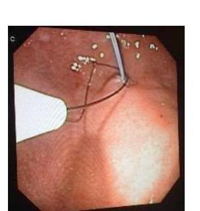
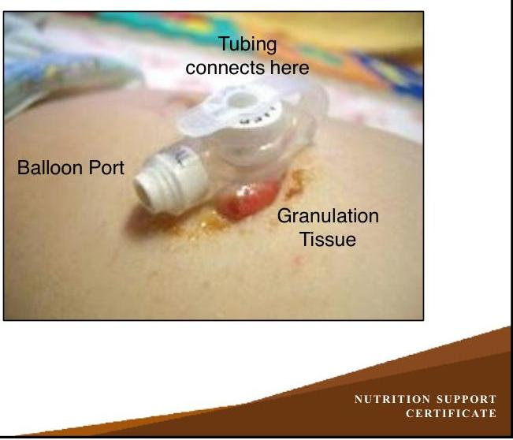
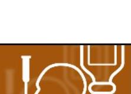

# NUTRITION SUPPORT CERTIFICATE 

## Enteral Overview

Planned by the American Society of Health-System Pharmacists (ASHP) in collaboration with the American Society for Parenteral and Enteral Nutrition (ASPEN).
(c)2022 American Society of Health-System Pharmacists, Inc. All rights reserved.

No part of this publication may be reproduced or transmitted in any form or by any means, electronic or mechanical, including photocopying, microfilming, and recording, or by any information storage and retrieval system, without written permission from the American Society of Health-System Pharmacists.

--- page 1 ---

# NUTRITION SUPPORT ACCESS: ENTERAL OVERVIEW 

David Evans, M.D.
The Ohio State University

NUTRITION SUPPORT CERTIFICATE

## RELEVANT FINANCIAL RELATIONSHIP DISCLOSURE

The following persons in control of this activity's content have relevant financial relationships:

- David Evans: Fresenius Kabi, consultant and speaker; Abbott Laboratories, consultant and speaker; CVS/OptionCare, consultant; Alcresta, consultant and speaker

All other persons in control of content do not have any relevant financial relationships with an ineligible company.

As defined by the Standards of Integrity and Independence definition of ineligible company. All relevant financial relationships have been mitigated prior to the CPE activity.

--- page 2 ---

# LEARNING OBJECTIVES 

- Identify factors that influence the selection of the appropriate enteral access device.
- Compare and contrast the access options available for enteral nutrition.

## KEY ABBREVIATIONS

- EGD:
- G-tube:
- NG:
- NPO:
- OG:
- PEG:
- PN:
- VAP:
esophagogastroduodenoscopy
gastrostomy tube
nasogastric
nil per os; nothing by mouth
orogastric
percutaneous endoscopic gastrostomy
parenteral nutrition
ventilator-associated pneumonia

--- page 3 ---

# SELF-ASSESSMENT 

SP is a 69-year-old man with a newly placed PEG tube after laryngeal cancer resection. The physician would like you to make recommendations for enteral nutrition management. Which recommendation would be MOST appropriate in this patient?
A. Placement of a nasojejunal feeding tube because of aspiration risk
B. Initiation of intermittent bolus feeding via the PEG tube
C. Conversion of the PEG to a G-J tube for continuous postpyloric feeding
D. Make patient NPO and start parenteral nutrition

## NASOENTERIC TUBES

CC Image courtesy of Cancer Research UK / Wikimedia Commons. http://www.cancerresearchuk.org/ (accessed 2019 Mar 9).

- NG tube
- Placed for decompression and/or feeding
- Size varies
- Typically larger, stiffer to permit suction
- OG tubes - trigger gag reflex
- Only used in intubated patients

--- page 4 ---

# NASOENTERIC TUBES 

- Postpyloric Tubes
- Nasojejunal tubes
- Nasoduodenal tubes
- Common names
- "Dobhoff"
- "Corpak"
- Typically refer to softer small bore tubes can be placed postpyloric
- Placed with blind, fluoroscopic, endoscopic, and magnetic / stereotactic techniques

Duodenum

Jejunum
CC Image courtesy of Olek Remesz / Wikimedia Commons. https://pl.wikipedia.org/wiki/ Wikipedysta:Orem (accessed 2019 Mar 9)

## NASOENTERIC TUBES

CC Image courtesy of Cancer Research UK / Wikimedia Commons. http://www.cancerresearchuk.org/ (accessed 2019 Mar 9).

- Typically used < 4 weeks
- Patient tolerance, comfort often limiting factor
- Prone to dislodgement

--- page 5 ---

# GASTROSTOMY (G-)TUBES 

CC Image courtesy of Cancer Research UK / Wikimedia Commons. http://www.cancerresearchuk.org/ (accessed 2019 Mar 9).

- Percutaneous Endoscopic Gastrostomy
- Requires EGD scope
- Typically indicated if use anticipated $>4$ weeks
- Open Stamm Gastrostomy
- Requires surgical incision
- Laparoscopic Gastrostomy
- Uncommon

PEG REQUIRES A TEAM

Anesthesiologist or Sedation Nurse

Endoscopist

Assistant at Abdominal Site

--- page 6 ---

# PEG PROCEDURE 

1. Angiocath with Needle Introduced into Stomach

2. Angiocath now ready to receive wire

3. Needle Removed from Angiocath

4. Wire placed through Angiocath

NUTRITION SUPPORT CERTIFICATE

## PEG PROCEDURE

Wire now goes through skin into the stomach

The wire Is "lassoed" with a snare placed through the scope

--- page 7 ---

# PEG PROCEDURE 

PEG tube is connected to the wire. The wire is pulled out through the abdominal wall with the PEG tube following it

External bumper is placed over the tube and slid down

External bumper is brought down to the skin while internal bumper abuts gastric wall

## SHOULD WE FEED PROXIMAL OR DISTAL WHAT IS THE OPTIMAL LOCATION?

- Gastric Feeding:
- Relatively easy
- Residuals may be monitored
- Aspiration risks are higher
- Can be done safely
- Jejunal Feeding:
- Shorter time to goal
- Increased nutrient delivery
- Decreased VAP rates
- Access can be difficult

--- page 8 ---

| Author | Journal Year | Study Population (N) | Outcome |
| :--: | :--: | :--: | :--: |
| Strong | JPEN 1992 | Gastric v Jejunal n=17 | No difference in aspiration |
| Montecalvo | CCM 1992 | Gastric v Jejunal | Jejunal: Goal faster   Decrease pneumonia |
| Kortbeek | J Trauma 1999 | Gastric v Jejunal n=80 | Jejunal: Goal faster |
| Kearns | CCM 2000 | Gastric v Jejunal n=44 | Jejunal: Goal faster   No change VAP |
| Heyland | CCM 2001 | Gastric v Jejunal n=33 | Gastric more aspiration |
| Montejo | CCM 2002 | MRPCT | Jejunal: decrease complications |
| Neumann | CCM 2002 | Prospective descriptive $\mathrm{n}=60$ | Gastric: goal faster,   No increase aspiration |
| Davies | CCM 2002 | PRCT $n=73$ | Jejunal better tolerance   Decrease need for PN |
| Meert | Chest 2004 | PRCT $n=74$   Pediatrics | Jejunal greater goal   No change in aspiration |
| Methany | CCM 2006 | Prospective descriptive $\mathrm{n}=360$ | Gastric increases aspiration   pneumonia |
| Hsu CW | CCM 2009 | PRCT N=120   Medical ICU | Nasoduodenal goals earlier, less   vomiting and less VAP |

# GASTRIC OR JEJUNAL FEEDS? 

- Gastric Feeding:
- Can bolus feed if G-tube (lower esophageal sphincter intact - NG stents sphincter open)
- Larger bore tubes usually accept crushed meds
- Jejunal Feeding:
- Continuous feeds are the standard
- Require home pump
- Smaller diameter, harder to replace tubes
- Minimize medication administration due to clogging, absorption, and pH
- NO CRUSHED MEDS

--- page 9 ---

# GASTRIC OR JEJUNAL?SELECTION FOR TEMPORARY FEEDING 

- Depends on institutional comfort / experience with placing postpyloric tubes
- Some consider postpyloric to be standard for most patients
- Give stronger consideration to postpyloric feeding in patients with:
- Known aspiration risk / history
- Altered mental status, altered swallowing
- Delayed gastric emptying / gastroparesis (known or suspected)
- Repeatedly elevated gastric residuals (if these are being checked)
- Acute pancreatitis
- Failed gastric feedings

## SELECTING PERCUTANEOUS ACCESS: PROS AND CONS

- Greatest advantages PEG and other percutaneous tubes:
- Avoid patient discomfort associated with naso- or oroenteral tubes
- May remain in place for extended periods
- Can be easily concealed, contributing to less patient stigma
- Facilitates intermittent use
- Greatest disadvantages of PEG and other percutaneous tubes:
- Complications may be severe
- Tube clogging is a major problem
- Leakage around the tube site
- Tube breakage, especially in areas of mechanical stress
- Tube may be hard to replace

--- page 10 ---

# GASTRIC OR JEJUNAL?SELECTION FOR DURABLE FEEDING 

- G-tubes are strongly preferred over J-tubes
- G-tubes are larger, easier to maintain, more durable, less prone to dislodgement. G-tube permits bolus feeding
- J-tube typically requires open surgery or much more complex / difficult endoscopic placement technique. Neither is usually done. Replacement usually requires fluoroscopic assistance. Tubes / tracts are not as durable
- J-tubes typically reserved for patients with:
- Failed gastric feeding
- Planned gastric surgery

CC Image courtesy of Cancer Research UK / Wikimedia Commons. http://www.cancerresearchuk.org/ (accessed 2019 Mar 9).

## GASTROJEJUNAL (GJ-TUBE)

"One-Piece G-J tube"

J-Through PEG Extension Set

--- page 11 ---

# CONFIRMING POST PYLORIC / SMALL BOWEL POSITION ON X-RAY 

This is ok too
Post-pyloric should cross spine once
Jejunal should cross spine twice
Contrast injected to further confirm position

NUTRITION SUPPORT
CERTIFICATE

## GASTROJEJUNAL TUBES (GJ-TUBE)

- Advantage:
- Provide access to both stomach and jejunum through one point
- Disadvantages:
- 2 small lumens- prone to clogging
- Jejunal limb can flip back into stomach (especially if short)
- Requires fluoro and/or endoscopy to replace

--- page 12 ---

# LOW-PROFILE DEVICES / BUTTONS 

- Low-Profile Tube
- Requires "sizing" because the distance from skin to stomach is not adjustable
- Sizes only available for children, thinner adults

TRADITIONAL (LEGACY) CONNECTORS

- "Toomey" large slip-tip connector
- Also accepts some "Christmas Tree" connectors

--- page 13 ---

# ENFIT® CONNECTORS

- New design standard to prevent catheter misconnections
- Enteral connectors are "keyed" so tube feeds cannot be injected anywhere except enteral tubes
- Implementation has primarily been delayed because of availability of devices
- Legally required now in California

*CC Image courtesy Global Enteral Device Supplier Association (GEDSA). http://stayconnected.org (accessed 2019 Mar 9).*

# ENFIT® TRANSITION CONNECTORS

- Most suppliers of administration sets have already converted to ENFit® and included a transition connector (Adapter)
- Transition Connectors will no longer be needed with ENFit® feeding tubes

*CC Image courtesy Global Enteral Device Supplier Association (GEDSA). http://stayconnected.org (accessed 2019 Mar 9).*

*SEPTEMBER 2019 CERTIFICATE*

--- page 14 ---

# ENFIT ${ }^{\circledR}$ SYRINGES 

- ENFit ${ }^{\circledR}$ requires syringes and other adapted products throughout the supply chain

CC Image courtesy Global Enteral Device Supplier Association (GEDSA). http://stayconnected.org (accessed 2019 Mar 9).

Narrow Channel Low Dose Tip ensures accurate doses at small volumes

## SELF-ASSESSMENT

SP is a 69-year-old man with a newly placed PEG tube after laryngeal cancer resection. The physician would like you to make recommendations for enteral nutrition management. Which recommendation would be MOST appropriate in this patient?
A. Placement of a nasojejunal feeding tube because of aspiration risk
B. Initiation of intermittent bolus feeding via the PEG tube
C. Conversion of the PEG to a G-J tube for continuous postpyloric feeding
D. Make patient NPO and start parenteral nutrition

--- page 15 ---

# SELF-ASSESSMENT 

SP is a 69-year-old man with a newly placed PEG tube after laryngeal cancer resection. The physician would like you to make recommendations for enteral nutrition management. Which recommendation would be MOST appropriate in this patient?
A. Placement of a nasojejunal feeding tube because of aspiration risk
B. Initiation of intermittent bolus feeding via the PEG tube
C. Conversion of the PEG to a G-J tube for continuous postpyloric feeding
D. Make patient NPO and start parenteral nutrition

## REFERENCES

- Bledsoe S, Oschman A, Hampson K et al. Transition to ENFit ${ }^{\circledR}$ enteral devices: Special challenges for pediatric institutions. Am J Health-System Pharm. 2016; 73(21):1781-1783.
- McClave SA, Taylor BE, Martindale RG et al. Guidelines for the Provision and Assessment of Nutrition Support Therapy in the Adult Critically III Patient: Society of Critical Care Medicine (SCCM) and American Society for Parenteral and Enteral Nutrition (A.S.P.E.N.). JPEN J Parenter Enteral Nutr. 2016; 40(2):159-211.

--- page 16 ---

NUTRITION SUPPORT CERTIFICATE

--- page 17 ---

David C. Evans, M.D., FACS
Trauma and Acute Care Surgeon
OhioHealth Trauma and Surgical Services
Columbus, Ohio

David C. Evans served as Director of Nutrition Support Services, Trauma Medical Director, and Associate Professor of Surgery at The Ohio State University Wexner Medical Center in Columbus, OH. He has a busy clinical practice focusing on trauma, emergency general surgery, endoscopy, and critical care.

His special interests include nutrition support in surgical and ICU patients and research in surgery and trauma care. He is an investigator in multiple clinical trials in critically ill patients focused in the areas of nutrition and infection and is author of over 90 peer-reviewed publications. Dr. Evans graduated from Medical School at Duke University, he completed training in Surgery and Surgical Critical Care at The Ohio State University and was a Nestle Fellow.

--- page 18 ---

# Relevant Financial Relationship Disclosure

In accordance with our accreditor’s Standards of Integrity and Independence in Accredited Continuing Education, ASHP requires that all individuals in control of content disclose all financial relationships with ineligible companies. An individual has a relevant financial relationship if they have had a financial relationship with ineligible company in any dollar amount in the past 24 months and the educational content that the individual controls is related to the business lines or products of the ineligible company.

An ineligible company is any entity producing, marketing, re-selling, or distributing health care goods or services consumed by, or used on, patients. The presence or absence of relevant financial relationships will be disclosed to the activity audience.

The following persons in control of this activity’s content have relevant financial relationships:

- Phil Ayers: Fresenius Kabi, consultant and speaker
- David Evans: Fresenius Kabi, consultant and speaker; Abbott Laboratories, consultant and speaker; CVS/OptionCare, consultant; Alcresta, consultant and speaker
- Andrew Mays: Fresenius Kabi, speaker
- Jay Mirtallo: Fresenius Kabi, consultant
- Kris Mogensen: Baxter, speaker; ThriveRx, advisory board; Pfizer, advisory board

All other persons in control of content do not have any relevant financial relationships with an ineligible company.

As required by the Standards of Integrity and Independence in Accredited Continuing Education definition of ineligible company, all relevant financial relationships have been mitigated prior to the CPE activity.

# Methods and CE Requirements

This online activity consists of a combined total of 12 learning modules. Pharmacists and physicians are eligible to receive a total of 20 hours of continuing education credit by completing all 12 modules within this certificate.

Participants must participate in the entire activity, complete the evaluation and all required components to claim continuing pharmacy education credit online at ASHP Learning Center http://elearning.ashp.org. Follow the prompts to claim credit and view your statement of credit within 60 days after completing the activity.

# Important Note – ACPE 60 Day Deadline:

Per ACPE requirements, CPE credit must be claimed within 60 days of being earned. To verify that you have completed the required steps and to ensure your credits have been reported to CPE Monitor, check your NABP eProfile account to validate that your credits were transferred successfully before the ACPE 60-day deadline. After the 60 day deadline, ASHP will no longer be able to award credit for this activity.

# System Technical Requirements

Courses and learning activities are delivered via your Web browser and Acrobat PDF. Users should have a basic comfort level using a computer and navigating websites.

View Frequently Asked Questions for more information.