# NUTRITION SUPPORT CERTIFICATE 

## Parenteral Access

Planned by the American Society of Health-System Pharmacists (ASHP) in collaboration with the American Society for Parenteral and Enteral Nutrition (ASPEN).
(c)2022 American Society of Health-System Pharmacists, Inc. All rights reserved.

No part of this publication may be reproduced or transmitted in any form or by any means, electronic or mechanical, including photocopying, microfilming, and recording, or by any information storage and retrieval system, without written permission from the American Society of Health-System Pharmacists.

--- page 1 ---

# NUTRITION SUPPORT ACCESS PARENTERAL ACCESS 

David Evans, M.D.
The Ohio State University

NUTRITION SUPPORT CERTIFICATE

## RELEVANT FINANCIAL RELATIONSHIP DISCLOSURE

The following persons in control of this activity's content have relevant financial relationships:

- David Evans: Fresenius Kabi, consultant and speaker; Abbott Laboratories, consultant and speaker; CVS/OptionCare, consultant; Alcresta, consultant and speaker

All other persons in control of content do not have any relevant financial relationships with an ineligible company.

As defined by the Standards of Integrity and Independence definition of ineligible company. All relevant financial relationships have been mitigated prior to the CPE activity.

--- page 2 ---

# LEARNING OBJECTIVES 

- Identify factors that influence the selection of an appropriate vascular access device for parenteral nutrition.
- Compare and contrast the vascular access options available for administering parenteral nutrition.
- Describe strategies for preventing potential complications of vascular access devices

## KEY ABBREVIATIONS

- CLABSI:
- CRBI:
- CVC:
- IV:
- PICC:
- PN:
- POD:
- SICU:
- SVC:
- VAP:
central line associated bloodstream infection
catheter related bloodstream infection
central venous catheter
intravenous
peripherally inserted central catheter
parenteral nutrition
post operative day
surgical intensive care unit
superior vena cava
ventilator-associated pneumonia

--- page 3 ---

# SELF-ASSESSMENT 

DE is a 6-year-old male who is PN dependent with a tunneled single lumen CVC. He has been readmitted with two prior bacteremias. Which of the following interventions is NOT demonstrated to reduce CRBI?
A. Chlorhexidine-impreganted sponge dressing
B. Increasing the frequency of IV lipid emulsion administration from 3 times weekly to to daily
C. Ethanol lock therapy
D. Isopropyl alcohol disinfecting caps

## PICC

Enter peripheral vein, terminate in SVC or right atrium
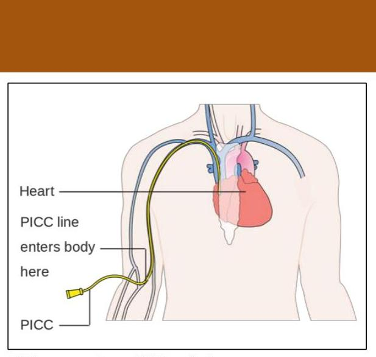

CC Image courtesy of Wikimedia Commons. https://commons.wikimedia.org/wiki/File:PICC_Line_Catheter.jpg (accessed 2019 Mar 9).

--- page 4 ---

# PICC 

## Advantages

- Easy Placement
- Readily Available
- Easy Removal
- Users:
- Typically selected for use $<3$ months

## Disadvantages

- Weekly dressing changes by nurse required
- Not appropriate in renal patients (damage veins for dialysis access)
- Durability limited

## TEMPORARY CVC

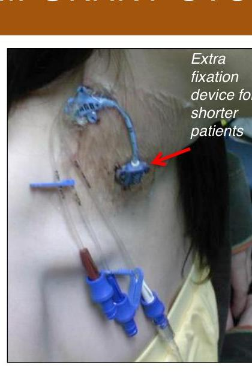
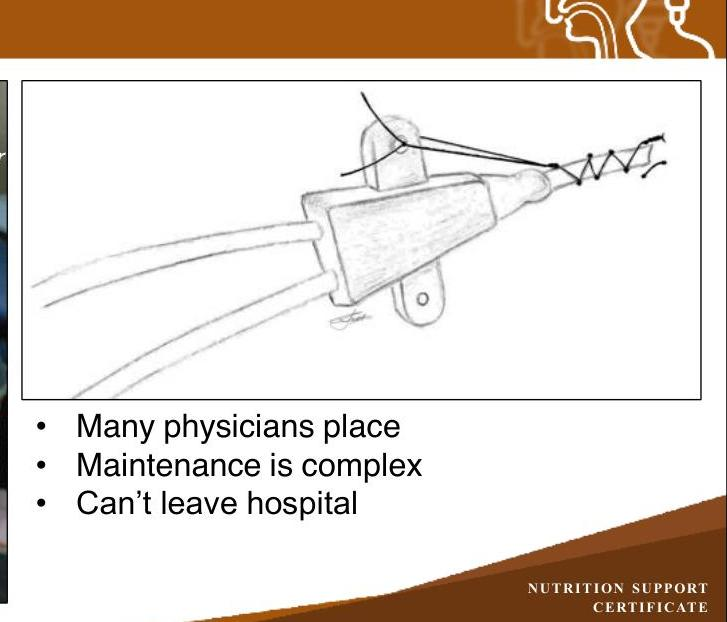

- Many physicians place
- Maintenance is complex
- Can't leave hospital

--- page 5 ---

# "PERMANENT" TUNNELED OR PORT 

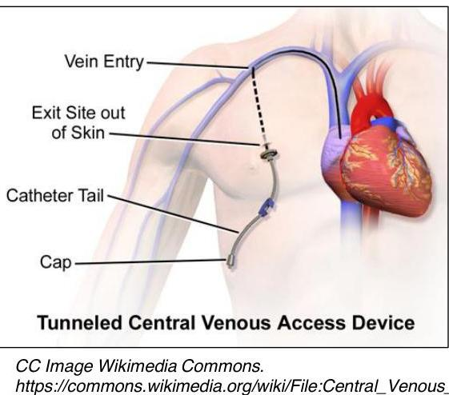

CC Image Wikimedia Commons.
https://commons.wikimedia.org/wiki/File:Central_Venous_Access_Device_(Tunneled).png (accessed 2019 Mar 9).

## TYPES OF TUNNELED LINES

- Historical / Brand Names you may hear
- Groshong, Hickman, Broviac, etc.
- Cuffed versus "cuffless"
- Materials vary - silicone preferred for ethanol locks but there is little evidence
- Power-injectable rated (for IV contrast injection—typically for CT scan)
- Antimicrobial materials (coating and/or impregnation)
- Chlorhexidine
- Silver sulfadiazine / Silver ion
- Rifampin-Minocycline
- 5-Fluorouracil
- Work with your local proceduralist (may be surgeon, vascular access procedure team, etc.) to ensure product selection meets your needs

--- page 6 ---

# SOURCES OF INTRAVASCULAR CATHETER INFECTION 

- Hematogenous: from distant sites
- Intraluminal: from tubes and hubs
- Extraluminal: from skin

## RISK FACTORS FOR PN-CRESI

- Subcutaneous infusion ports instead of tunneled catheters $(P=.001)$
- Multiple lumen catheters $(P=.001)$
- Increased frequency of lipid emulsion infusion $(P=.001)$
- Drawing blood from the CVC $(P<0.001)$
- Infusion of non-PN medications via the CVC $(P<.001)$
- Increased PN frequency $(P=.001)$ in children only, but not in adults.
- Take-home point: Minimize PN Line Access "Events"

--- page 7 ---

# SURVEY OF HOSPITAL PN PROGRAMS 

| Institutional Policy | $\%$ | Institutional Policy | $\%$ |
| :-- | :-- | :-- | :-- |
| Require a previously unused lumen/port   when initiating PN via a temporary CVC   (and guidewire exchange if needed) | 18 | Require blood cultures off the line (in the absence of other   evidence of infection) prior to restarting home PN | 12 |
| Stipulate a maximum age of CVC prior to   PN initiation | 17 | Change the PN line in patients with bacteremia even if the   PN line culture is not positive | 29 |
| Allow Y-site injections along with PN | 59 | With bacteremia, hold PN for some period of time, either   while awaiting negative repeat blood cultures, new line   placement, or clearance by an infectious disease specialist | 61 |
| Require blood cultures off the line (in the   absence of other evidence of infection)   prior to restarting home PN | 12 | Change the PN line in patients with fungemia even if the PN   line culture is not positive | 71 |
| Allow lab draws off of PN line | 65 |  |  |

## CVC SITE SELECTION

| Approach | Advantages | Disadvantages |
| :--: | :--: | :--: |
| Internal   Jugular | Control of bleeding   Pneumothorax uncommon   Lower infection rate (vs. femoral) | Carotid artery injury   Uncomfortable for patient   Maintenance of dressings   Tracheostomies   Internal jugular vein prone to collapse |
| Subclavian | Maintenance of dressings   More comfortable   Clearer landmarks   Subclavian vein less collapsible   Lowest infection rate | Risk of Pneumothorax   Should be avoided in Chronic Kidney   Disease / End Stage Renal Disease |
| Femoral | No interference with   cardiopulmonary resuscitation   No risk of Pneumothorax | Highest infection rate   Femoral artery injury   Deep Vein Thrombosis |

--- page 8 ---

# CVC SITE SELECTION COMPLICATIONS

|   | Internal
Jugular | Subclavian | Femoral  |
| --- | --- | --- | --- |
|  Pneumothorax (%) | <0.1 -0.2 | 1.5 - 3.1 | n/a  |
|  Hemothorax (%) | n/a | 0.4 – 0.6 | n/a  |
|  Infection (rate per 1000 catheter days) | 8.6 | 4 | 15.3  |
|  Thrombus (rate per 1000 catheter days) | 1.2 – 3 | 0 – 13 | 8 – 34  |
|  Arterial Puncture (%) | 3 | 0.5 | 6.25  |
|  Malposition | low | high | low  |

*Graham AS et al. N Engl J Med. 2007; 356(21):21.*

# ULTRASOUND TO IMPROVE SAFETY

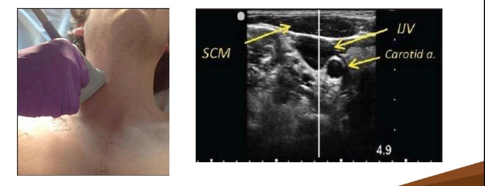

*Kent A et al. Ann Thorac Med. 2015; 10(1):44–9.*

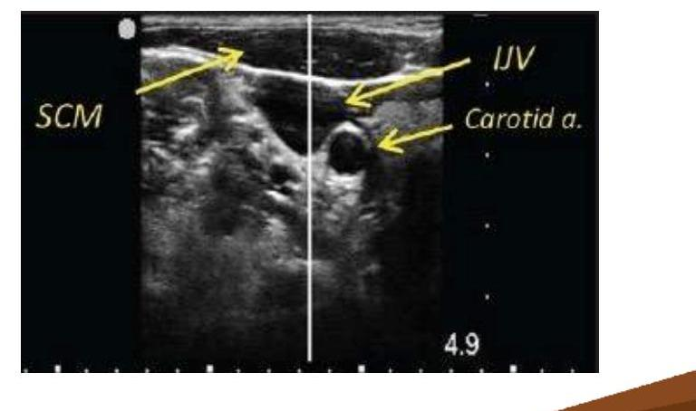

--- page 9 ---

# ETHANOL AND OTHER LOCKS

- Ethanol (most common / most studied)
- Antibiotics (usually vancomycin)
- Taurolidine-citrate
- Chelators
- Methylene Blue
- Saline
- Heparin (may reduce infection by reducing thrombosis)

# ETHANOL LOCK IMPROVES PN CVC OUTCOMES – RETROSPECTIVE STUDY

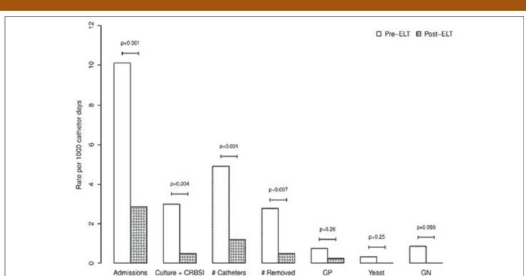

**Figure 2.** Rates per 1000 catheter days for all outcomes in the 15 tunneled catheter (TC) pre- and post-ethanol lock therapy (ELT) patients. CRBSI, catheter-related bloodstream infection; GN, gram negative; GP, gram positive.

*John BK et al. JPEN J Parenter Enteral Nutr. 2012; 36(5):603-10.*

--- page 10 ---

# ETHANOL LOCK - 2018 META-ANALYSIS 

CLABSI Significantly Reduced (RR 0.66, 95\% CI 0.51-0.86)

Side effects:

- Nausea (RR 1.54, 95\% CI 1.01-2.35)
- Dizziness (RR 4.21, 95\% CI 2.40-7.39)
- Facial blushing (RR 3.27, 95\% CI 2.05-5.22)
- Altered taste (RR 2.61, 95\% CI 1.93-3.54)

Zhang P et al. BMC Anesthesiology. 2018; 18(1):93.

## CASE STUDY

29 yo female with ischemic bowel due to midgut volvulus
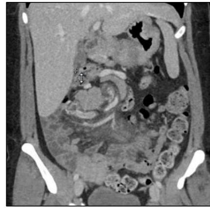
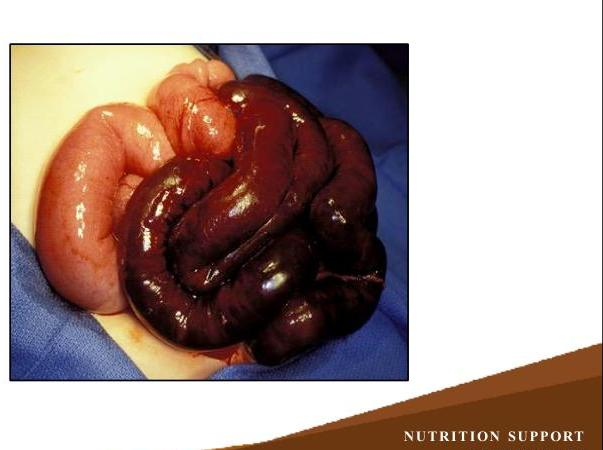

--- page 11 ---

# CASE STUDY - POD\#1, SICU 

- CVC in place
- Norepinephrine drip running
- 60 cm of small bowel with end jejunostomy
- Is the line safe to use?

## CASE STUDY - POD\#9, MED-SURG

- Preparing to go to a rehab facility on PN
- Access options at this juncture?

--- page 12 ---

# CASE STUDY - 2 MONTHS LATER 

- Wound is healed
- Electrolytes and fluid requirements stabilized
- Running PN 6 days / week, 12 hour cycle
- Living at home, thinking about going back to work
- What is the best line at this point?

CC Image courtesy Free Stock Photos.biz http://www.freestockphotos.biz/stockphoto/9052 (accessed 2019 Mar 9).

## CLABSI RATES BY TYPE OF LINE

CVC
2.7/1000 catheter-days

PICCs
2.1/1000 catheter-days

Tunneled CVCs
1.6/1000 catheter-days

Peripheral Venous Catheters
0.5/1000 catheter-days

Implantable Port
0.1/1000 catheter-days

--- page 13 ---

# HAND HYGIENE AND CLEAN PROCESSES MATTER 

- Education including:
- Hand hygiene
- Dressings of the insertion site; care of tubing and stopcocks
- Aseptic preparation of infusates

|  | Baseline | Intervention |
| :-- | :-- | :-- |
| CRBSI incidence density   (per 1000 CVC days) | 3.9 | 1.0 |
| Time to infection (Mean   $+/-$ SD) | $6.52+/-3.48$ | $9.3+/-6.63$ |

Zingg W et al. Crit Care Med. 2009; 37(7):2167

## SKIN PREPARATION IS KEY

- Pre-procedure Prep: sterile technique
- Chlorhexidine
- 30 second friction scrub with 60 second dry time for dry site
- 30 second friction scrub with 2 minute "soak" time for moist site
- Maximum Barrier Precautions
- Sterile Gloves
- Long-sleeved gowns
- Full field drape
- Masks/Caps for all participants \& observers

--- page 14 ---

# CHLORHEXIDINE-IMPREGNATED SPONGE 

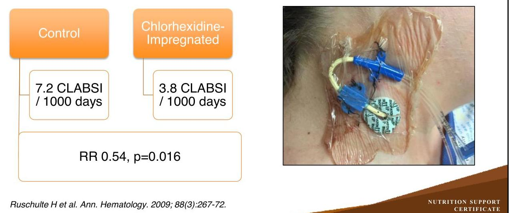

## 70\% ISOPROPYL ALCOHOL CAPS

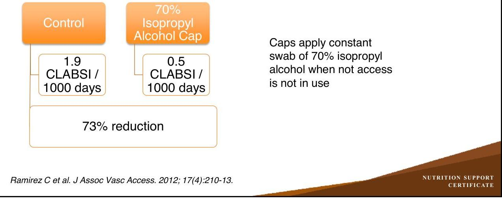

--- page 15 ---

# CATHETER-RELATED THROMBOSIS 

- Catheter-related central vein thrombosis is closely associated with catheter-related blood stream infection: RR 2.62

Timsit JF et al. Chest. 1998; 114(1):207-13.

## CRBSI "BUNDLE"

- Bundle of evidence-based actions designed to Improve a procedure or process
- Hand hygiene
- Maximum barrier precautions
- "time out" during insertion
- Chlorhexidine gluconate site disinfection
- Optimal catheter site (avoid femoral vein)
- Daily review of line necessity - remove when no longer medically indicated

--- page 16 ---

# GAME-CHANGING PAPER 

- Multi-center trial of bundle to reduce CLABSI
- Hand hygiene
- Maximal sterile barrier precautions
- Skin antisepsis with chlorhexidine
- Avoiding femoral access
- Remove CVC when possible

Pronovost P et al. New Engl J Med. 2006; 355(26):2725.

## CRBI RATES BEFORE \& AFTER BUNDLE

| Study Period | \# of ICUs | CRBI Rate (per 1000   CVC days) |
| :-- | :--: | :-- |
| Baseline | 55 | $2.7(0.6-4.8)$ |
| Implementation Period | 96 | $1.6(0-4.4)$ |
| After Implementation |  |  |
| $0-3$ months | 96 | $0(0-3.0)$ |
| $4-6$ months | 96 | $0(0-2.7)$ |
| $7-9$ months | 95 | $0(0-2.1)$ |
| $10-12$ months | 90 | $0(0-1.9)$ |
| $13-15$ months | 85 | $0(0-1.6)$ |
| $16-18$ months | 70 | $0(0-2.4)$ |

--- page 17 ---

# LINE CLOGGING / LUMEN THROMBOSIS

- Alteplase to treat line clogging

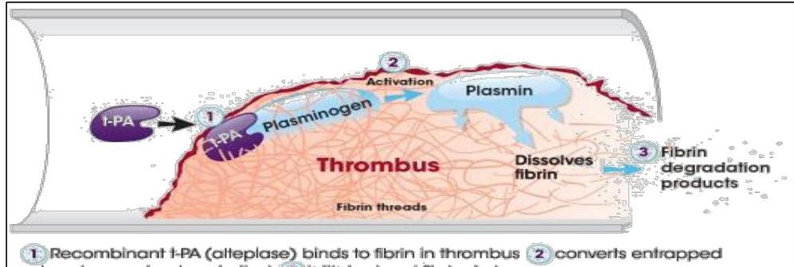

*CC Image courtesy of cathflo®. https://www.cathflo.com/catheter-management/mechanism-of-action.html (accessed 2019 Mar 19).*

# SAFE PRACTICES: TAKE HOMES

**Special Report:** "Safe Practices for Parenteral Nutrition" (JPEN)

- Precipitation reactions are a real concern—obstruction, infection, embolus
- Never remove a filter
- Do not add additional meds to PN
- Minimize Y-site infusions - confirm compatibility

*Mirtallo J et al. JPEN J Parenter Enteral Nutr. 2004; 28(6):S39-70.*

--- page 18 ---

# SELF-ASSESSMENT 

DE is a 6-year-old male who is PN dependent with a tunneled single lumen CVC. He has been readmitted with two prior bacteremias. Which of the following interventions is NOT demonstrated to reduce CRBI?
A. Chlorhexidine-impregnated sponge dressing
B. Increasing the frequency of IV lipid emulsion administration from 3 times weekly to to daily
C. Ethanol lock therapy
D. Isopropyl alcohol disinfecting caps

## SELF-ASSESSMENT

DE is a 6-year-old male who is PN dependent with a tunneled single lumen CVC. He has been readmitted with two prior bacteremias. Which of the following interventions is NOT demonstrated to reduce CRBI?
A. Chlorhexidine-impregnated sponge dressing
B. Increasing the frequency of IV lipid emulsion administration from 3 times weekly to to daily
C. Ethanol lock therapy
D. Isopropyl alcohol disinfecting caps

--- page 19 ---

# REFERENCES 

- Buchman AL, Opilla M, Kwasny M et al. Risk factors for the development of catheterrelated bloodstream infections in patients receiving home parenteral nutrition. JPEN J Parenter Enteral Nutr. 2014; 38(6):744-9.
- Graham AS, Ozment C, Tegtmeyer K, Lai S, Braner DA. Central venous catheterization. N Engl J Med. 2007; 356(21):21.
- John BK, Khan MA, Speerhas R, et al. Ethanol lock therapy in reducing catheter-related bloodstream infections in adult home parenteral nutrition patients: results of a retrospective study. JPEN J Parenter Enteral Nutr. 2012; 36(5):603-10.
- Kent A, Patil P, Davila V et al. Sonographic evaluation of intravascular volume status: Can internal jugular or femoral vein collapsibility be used in the absence of IVC visualization? Ann Thorac Med. 2015 ;10(1):44-9.
- Mermel LA. Prevention of intravascular catheter-related infections. Ann Intern Med. 2000; 132(5):391-402.

REFERENCES, CONT.

- Mirtallo J, Canada T, Johnson D et al. Safe practices for parenteral nutrition. JPEN J Parenter Enteral Nutr. 2004; 28(6):S39-70.
- Maki DG, Kluger DM, Crnich CJ. The risk of bloodstream infection in adults with different intravascular devices: a systematic review of 200 published prospective studies. Mayo Clin Proc. 2006; 81:1159.
- Pronovost P, Needham D, Berenholtz S, et al. An intervention to decrease catheterrelated bloodstream infections in the ICU. New Engl J Med. 2006; 355(26):2725.
- Ramirez C, Lee AM, Welch K. Central venous catheter protective connector caps reduce intraluminal catheter-related infection. J Assoc Vasc Access. 2012; 17(4): 21013.

--- page 20 ---

# REFERENCES, CONT. 

- Ruschulte H, Franke M, Gastmeier P, et al. Prevention of central venous catheter related infections with chlorhexidine gluconate impregnated wound dressings: a randomized controlled trial. Ann Hematology. 2009; 88(3):267-72.
- Timsit JF, Farkas JC, Boyer JM, et al. Central vein catheter-related thrombosis in intensive care patients: incidence, risks factors, and relationship with catheter-related sepsis. Chest. 1998;114(1):207-13.
- Zhang P, Lei JH, Su XJ, et al. Ethanol locks for the prevention of catheter-related bloodstream infection: a meta-analysis of randomized control trials. BMC Anesthesiology. 2018; 18(1):93.
- Zingg W, Imhof A, Maggiorini M, et al. Impact of a prevention strategy targeting hand hygiene and catheter care on the incidence of catheter-related bloodstream infections. Crit Care Med. 2009; 37(7):2167-73.

--- page 21 ---

David C. Evans, M.D., FACS
Trauma and Acute Care Surgeon
OhioHealth Trauma and Surgical Services
Columbus, Ohio

David C. Evans served as Director of Nutrition Support Services, Trauma Medical Director, and Associate Professor of Surgery at The Ohio State University Wexner Medical Center in Columbus, OH. He has a busy clinical practice focusing on trauma, emergency general surgery, endoscopy, and critical care.

His special interests include nutrition support in surgical and ICU patients and research in surgery and trauma care. He is an investigator in multiple clinical trials in critically ill patients focused in the areas of nutrition and infection and is author of over 90 peer-reviewed publications. Dr. Evans graduated from Medical School at Duke University, he completed training in Surgery and Surgical Critical Care at The Ohio State University and was a Nestle Fellow.

--- page 22 ---

# Relevant Financial Relationship Disclosure

In accordance with our accreditor’s Standards of Integrity and Independence in Accredited Continuing Education, ASHP requires that all individuals in control of content disclose all financial relationships with ineligible companies. An individual has a relevant financial relationship if they have had a financial relationship with ineligible company in any dollar amount in the past 24 months and the educational content that the individual controls is related to the business lines or products of the ineligible company.

An ineligible company is any entity producing, marketing, re-selling, or distributing health care goods or services consumed by, or used on, patients. The presence or absence of relevant financial relationships will be disclosed to the activity audience.

The following persons in control of this activity’s content have relevant financial relationships:

- Phil Ayers: Fresenius Kabi, consultant and speaker
- David Evans: Fresenius Kabi, consultant and speaker; Abbott Laboratories, consultant and speaker; CVS/OptionCare, consultant; Alcresta, consultant and speaker
- Andrew Mays: Fresenius Kabi, speaker
- Jay Mirtallo: Fresenius Kabi, consultant
- Kris Mogensen: Baxter, speaker; ThriveRx, advisory board; Pfizer, advisory board

All other persons in control of content do not have any relevant financial relationships with an ineligible company.

As required by the Standards of Integrity and Independence in Accredited Continuing Education definition of ineligible company, all relevant financial relationships have been mitigated prior to the CPE activity.

# Methods and CE Requirements

This online activity consists of a combined total of 12 learning modules. Pharmacists and physicians are eligible to receive a total of 20 hours of continuing education credit by completing all 12 modules within this certificate.

Participants must participate in the entire activity, complete the evaluation and all required components to claim continuing pharmacy education credit online at ASHP Learning Center http://elearning.ashp.org. Follow the prompts to claim credit and view your statement of credit within 60 days after completing the activity.

# Important Note – ACPE 60 Day Deadline:

Per ACPE requirements, CPE credit must be claimed within 60 days of being earned. To verify that you have completed the required steps and to ensure your credits have been reported to CPE Monitor, check your NABP eProfile account to validate that your credits were transferred successfully before the ACPE 60-day deadline. After the 60 day deadline, ASHP will no longer be able to award credit for this activity.

# System Technical Requirements

Courses and learning activities are delivered via your Web browser and Acrobat PDF. Users should have a basic comfort level using a computer and navigating websites.

View Frequently Asked Questions for more information.