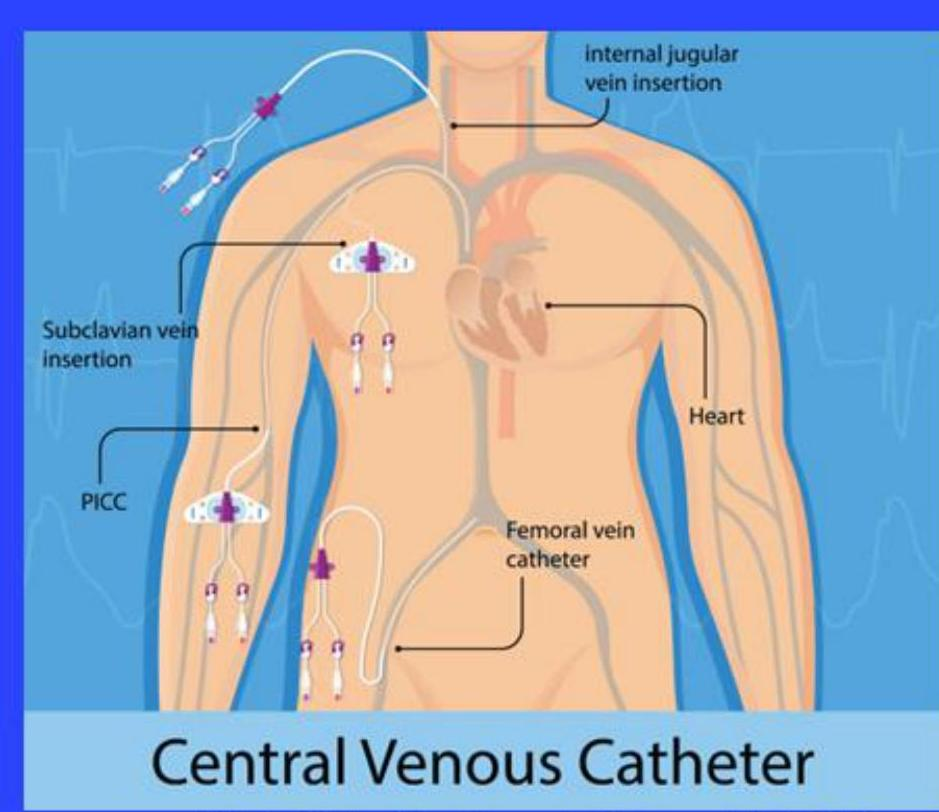
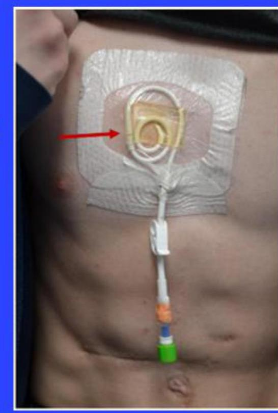
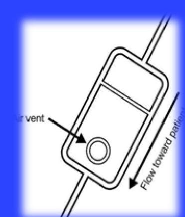
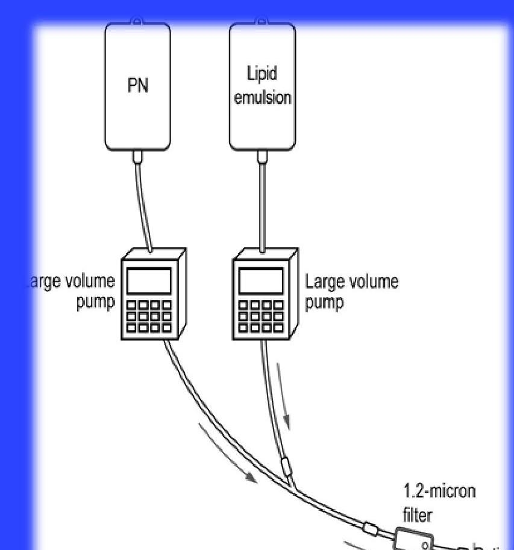

# **Administration of Pediatric PN**

--- page 1 ---

# Venous Access

## Central Access

- Tip is positioned in a central vein
  - Superior vena cava (SVC)
  - Inferior vena cava (IVC)
  - Right atrium (RA)
    - Risk of cardiac perforation/arrhythmia (particularly small neonates)

## Peripheral Access

- Tip is not positioned in the SVC, IVC, or RA

Vein Institute of New Jersey. Last Accessed: July, 2024

--- page 2 ---

# **Venous Access: Alternative Sites**

Scalp veins (neonates)

- Alternative site of venous access
- Often visible and easily accessible (lack of hair, thin skin)
- Not preferred for long-term access

--- page 3 ---

# Venous Access Considerations 

## Peripheral Access

- Used for $<2$ weeks
- Nutrient needs can be met by peripheral PN
- No fluid restriction
- Osmolality <900 mOsm/L
- Maximum 10 - 12.5\% dextrose

## Central Access

- Used for $>2$ weeks
- Nutrient needs cannot be met by peripheral PN
- Peripheral access limited
- Patient is fluid restricted
- Need for hypertonic solutions

--- page 4 ---

# **Venous Access Additional Considerations**

- The more lumens, the higher the chances of infection
- Impregnated, or locked catheters can be useful to prevent infection, thromboses
  - May contain antibiotics, antiseptics, antithrombolytics, antifibrinolytics
  - May cause allergic response, potentially higher rates of catheter breakage
- Line must be secured, and meticulous sterile technique used with access

Wendel. JPGN 2021

--- page 5 ---

# **Venous Access: Alternative Sites**

- Filters are placed between the PN solution and patient to remove hazardous particulate matter (e.g., pathogens)
- Traditionally two filter sizes available (0.22 microns + 1.2 microns)

