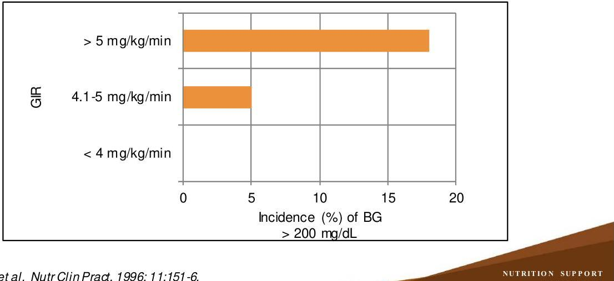

# NUTRITION SUPPORT CERTIFICATE 

## Parenteral Nutrition

## Products

Planned by the American Society of Health-System Pharmacists (ASHP) in collaboration with the American Society for Parenteral and Enteral Nutrition (ASPEN).
(c)2022 American Society of Health-System Pharmacists, Inc. All rights reserved.

No part of this publication may be reproduced or transmitted in any form or by any means, electronic or mechanical, including photocopying, microfilming, and recording, or by any information storage and retrieval system, without written permission from the American Society of Health-System Pharmacists.

--- page 1 ---

# ENTERAL AND PARENTERAL PRODUCTS: PARENTERAL NUTRITION 

Anne M. Tucker, Pharm.D., BCNSP
University of Texas MD Anderson Cancer Center

NUTRITION SUPPORT CERTIFICATE

## RELEVANT FINANCIAL RELATIONSHIP DISCLOSURE

The following persons in control of this activity's content have relevant financial relationships:

- Kris Mogensen: Baxter, speaker; ThriveRx, advisory board; Pfizer, advisory board

All other persons in control of content do not have any relevant financial relationships with an ineligible company.

As defined by the Standards of Integrity and Independence definition of ineligible company. All relevant financial relationships have been mitigated prior to the CPE activity.

--- page 2 ---

# LEARNING OBJECTIVES 

- Differentiate among available parenteral nutrition products.
- Compare advantages and disadvantages of standardized commercially-available parenteral nutrition products versus customized parenteral nutrition formulations.
- Select parenteral nutrition products based on relevant patient characteristics, availability, stability and compatibility.

## KEY ABBREVIATION

- ASHP:
- ASPEN:
- BG:
- BP:
- BPM:
- BUN:
- GIR:
- HR:
- ILE:
- MCB-PN:

American Society of Health-System Pharmacists
American Society for Parenteral and Enteral Nutrition
blood glucose
blood pressure
beats per minute
blood urea nitrogen
glucose infusion rate ( $\mathrm{mg} / \mathrm{kg} / \mathrm{min}$ )
heart rate
lipid injectable emulsion
multi-chamber bag parenteral nutrition

--- page 3 ---

# KEY ABBREVIATION, CONT. 

- MCT:
- MVI:
- MTE:
- NS:
- NPO:
- RR:
- RRT:
- SCAPN:
- SCCM:
- WNL:
medium-chain triglycerides
multivitamin
multiple trace element
normal saline
nothing by mouth
respiratory rate
renal replacement therapy
standardized commercially-available parenteral nutrition
Society of Critical Care Medicine
within normal limits

## CASE STUDY \#1

- TJ is a 53 year old patient who was admitted to the intensive care unit 3 days ago with septic shock and acute kidney injury. He has been NPO for 7 days and plan is to initiate parenteral nutrition
- Past medical history
- Hypertension
- Hypothyroidism
- Small bowel resection (2 weeks ago)

--- page 4 ---

# CASE STUDY \#1, CONT. 

- Vital signs:
- BP: 122/68 mmHg
- HR: 80 bpm
- RR: 16 breaths/min
- Temperature: $37.8^{\circ} \mathrm{C}$
- Medications:
- piperacillin-tazobactam 2.25 g IV every 6 hours
- levothyroxine 40 mcg IV daily
- thiamine 200 mg IV every 12 hours
- D5 $1 / 2$ NS at $100 \mathrm{~mL} / \mathrm{hr}$

CASE STUDY \#1, CONT.

Laboratory Values:

- Na: $139 \mathrm{mEq} / \mathrm{L}$
- $\mathrm{K}: 4.5 \mathrm{mEq} / \mathrm{L}$
- $\mathrm{Cl}: 112 \mathrm{mEq} / \mathrm{L}$
- $\mathrm{CO}_{2}: 17 \mathrm{mEq} / \mathrm{L}$
- BUN: $68 \mathrm{mg} / \mathrm{dL}$
- Cr: $2.4 \mathrm{mg} / \mathrm{dL}$
- Glucose: $130 \mathrm{mg} / \mathrm{dL}$
- Magnesium: $2.4 \mathrm{mg} / \mathrm{dL}$
- Phosphorus: $4.8 \mathrm{mg} / \mathrm{dL}$
- Liver function: WNL

--- page 5 ---

# SELF-ASSESSMENT \#1 

Which amino acid product would be the best choice for TJ?
A. FreAmine ${ }^{\circledR}$ III $10 \%$
B. Travasol ${ }^{\circledR} 10 \%$
C. Aminosyn ${ }^{\circledR}$ II $15 \%$
D. HepatAmine ${ }^{\circledR} 8 \%$

## SELF-ASSESSMENT \#2

- A parenteral nutrition consult is placed for a 65 year old male with colon cancer with small bowel obstruction. Weight is 75 kg and height 69 inches.
- Past medical history: hypertension, atrial fibrillation, heart failure, colon cancer
- Upon evaluating the appropriateness of a SCAPN product, which of the following patient characteristics is likely to make the use of such products problematic?
A. Colon cancer
B. Heart failure
C. Hypertension
D. Small bowel obstruction

--- page 6 ---

# PARENTERAL NUTRITION 

- Macronutrients
- Carbohydrates (dextrose)
- Protein (amino acids)
- Fat (lipid injectable emulsion)
- Micronutrients
- Electrolytes and minerals
- Vitamins
- Trace elements
- Additives
- Insulin (regular insulin)
- Histamine-2 receptor blockers
- Cysteine
- Sterile water for injection

CARBOHYDRATES - DEXTROSE

- Provides $3.4 \mathrm{kcal} / \mathrm{g}$ (when hydrolyzed)
- Stock solutions $2.5 \%$ to $70 \%$
- Greater than 10\% necessitates central venous access
- Safe dosing range: $2-7 \mathrm{~g} / \mathrm{kg} /$ day in adults
- Recommended GIR - Adults
- Non-critically ill: $3-5 \mathrm{mg} / \mathrm{kg} / \mathrm{min}$
- Critically ill, diabetes mellitus: $2-4 \mathrm{mg} / \mathrm{kg} / \mathrm{min}$

--- page 7 ---

# HYPERGLYCEMIA AND GIR 

Rosmarin DK et al. Nutr Clin Pract. 1996; 11:151-6.

## CARBOHYDRATES - GLYCERIN

- Provides $4.3 \mathrm{kcal} / \mathrm{g}$
- Sugar alcohol
- Alternative to dextrose
- Used in 1 SCAPN product

--- page 8 ---

# PROTEIN - AMINO ACIDS 

- Crystalline amino acid solutions (essential and non-essential amino acids)
- Provides $4 \mathrm{kcal} / \mathrm{g}$
- $16 \%$ nitrogen ( 1 g nitrogen $=6.25 \mathrm{~g}$ amino acids)
- Stock solutions $3.5 \%$ to $20 \%$
- Solutions are acetate-based
- Dosing range (adults): $0.8-2 \mathrm{mg} / \mathrm{kg}$ per day
- Dosing based
- Catabolic status
- Organ function
- Wounds
- Losses

ADULT AMINO ACID PRODUCTS

| Brand | Type | Concentration   $(\%)$ | Sodium   $(\mathrm{mEq} / \mathrm{L})$ | Chloride   $(\mathrm{mEq} / \mathrm{L})$ | Acetate   $(\mathrm{mEq} / \mathrm{L})$ | Phosphorus   $(\mathrm{mmol} / \mathrm{L})$ |
| :--: | :--: | :--: | :--: | :--: | :--: | :--: |
| Aminosyn ${ }^{\text {® }}$ II | Standard | 10 | 30 | - | 71.8 | 0 |
| Aminosyn ${ }^{\text {® }}$ II | Fluid restricted | 15 | 50 | 0 | 107.6 | 0 |
| Clinisol ${ }^{\text {® }}$ | Fluid restricted | 15 | 0 | 0 | 127 | 0 |
| FreAmine ${ }^{\text {® }}$ III | Standard | 10 | 10 | $<3$ | 89 | 10 |
| HepatAmine ${ }^{\text {® }}$ | Hepatic | 8 | 10 | $<3$ | 62 | 10 |
| Plenamine ${ }^{\text {® }}$ | Fluid restricted | 15 | 0 | 0 | 148 | 0 |
| Travasol ${ }^{\text {® }}$ | Standard | 10 | 0 | 40 | 88 | 0 |

--- page 9 ---

# FAT - LIPID INTRAVENOUS EMULSION (ILE) 

- Oil-in-water emulsion
- Provides $9 \mathrm{kcal} / \mathrm{g}$
- Supplement essential fatty acids
- Main product differences based on oil types
- Omega ( $\omega$ ) -6 and $\omega-3$ composition
- Recommended infusion time: 4 to 12 hours
- Maximum infusion rate $0.11 \mathrm{~g} / \mathrm{kg} / \mathrm{hr}$ (fat overload syndrome)
- Preservative free
- Infuse via di-2-ethylhexyl phthalate (DEHP) administration sets and tubing

Derenski K et al. Nutr Clin Pract. 2016; 31:578-95.

## ILE IN CRITICALLY ILL

- ASPEN-SCCM Critical Care Nutrition Support Guidelines 2016
- Withhold use of soybean based ILE during the first week following parenteral nutrition initiation
- Limit to at least $100 \mathrm{~g} /$ week of soybean oil ILEs if concern for essential fatty acid deficiency
- Soybean oil-based ILE were only available when guidelines published
- Consideration regarding use of mixed oil ILE products when become available in the United States

--- page 10 ---

# OIL TYPES IN ILE 

- Soybean oil
- Supplies essential fatty acids
- Fish oil
- Reduced inflammatory processes
- Source of DHA and EPA
- Medium-chain triglycerides (coconut oil)
- Rapid energy source
- Does not provide essential fatty acids
- Olive oil
- Reduced inflammatory effect
- Minimal essential fatty acids

## ILE COMPONENTS

- Source of essential fatty acids:
- Linoleic \& linolenic acid
- Adults: Provide at least 2\%-4\% of linoleic acid and $0.25 \%-0.5 \%$ of alinolenic acid of total daily calories
- Egg yolk phospholipid (emulsifier)
- Provides additional 15 mmol phosphate per Liter
- Sodium hydroxide
- Glycerin (tonicity)
- Vitamin K

--- page 11 ---

# SOYBEAN OIL ILE 

- Rich in omega-6 fatty acids
- Highest $\omega$-6: $\omega-3$ ratio
- Available concentrations: $20 \%(2 \mathrm{kcal} / \mathrm{mL})$ and $30 \%(3 \mathrm{kcal} / \mathrm{mL})$
- $10 \%$ concentration ( $1.1 \mathrm{kcal} / \mathrm{mL}$ ) found in certain medications
- Product size: $100 \mathrm{~mL}, 250 \mathrm{~mL}, 500 \mathrm{~mL}$
- Prevention of essential fatty acid deficiency
- Provide as 5\% of total weekly calories
- 100 g per week (e.g., $20 \% 250 \mathrm{~mL}$ dosed twice weekly)
- Higher amounts of phytosterols (PN-associated liver disease)

Derenski K et al. Nutr Clin Pract. 2016; 31:578-95.

## FOUR OIL MIXTURE ILE

SMOFlipid ${ }^{\circledR}$

- 30\% Soybean oil ( $\omega$-6) $+30 \%$ MCT $+25 \%$ Olive oil ( $\omega$-9) $+15 \%$ Fish oil ( $\omega$-3)
- Less $\omega$-6 fatty acids $\rightarrow$ less inflammation
- Contains alpha $(\alpha)$-tocopherol $\rightarrow$ antioxidant
- Less phytosterols
- Available concentration: $20 \%(2 \mathrm{kcal} / \mathrm{mL})$
- Product size: $100 \mathrm{~mL}, 250 \mathrm{~mL}, 500 \mathrm{~mL}$
- Improved outcomes in critically ill patients, surgical patients, and in PN associated liver disease.

--- page 12 ---

# FISH OIL ILE 

## Omegaven ${ }^{\circledR}$

- 100\% fish oil without plant source oils
- Rich in $\omega-3$ fatty acids $\rightarrow$ less inflammation
- Minimal phytosterol content
- Product availability: 5 g per 50 mL and 10 g per 100 mL
- FDA approved for providing calories and fatty acids for pediatric patients with PNassociated cholestasis (direct bilirubin $>2 \mathrm{mg} / \mathrm{dL}$ )
- Age-appropriate growth attainment and maintenance
- Improvement in liver function parameters and platelet count

Omegaven ${ }^{\circledR}$ product information (accessed 2019Jan 15).

## LIPID INJECTABLE PRODUCTS (ILE)

| Brand | Oil Type(s)   Percent   Makeup | Linoleic   $(\mathrm{g} / 100 \mathrm{~mL})$ | $\alpha$-linolenic   $(\mathrm{g} / 100 \mathrm{~mL})$ | $\omega-6: \omega-3$ ratio | Phytosterols   $(\mathrm{mg} / \mathrm{L})$ | $\alpha$ -   tocopherol   $(\mathrm{mg} / \mathrm{L})$ |
| :--: | :--: | :--: | :--: | :--: | :--: | :--: |
| Intralipid ${ }^{\circledR}$   Liposyn ${ }^{\circledR}$ III   Nutrilipid ${ }^{\circledR}$ | Soybean oil   $100 \%$ | 5 | 0.9 | 7:1 | $348 \pm 33$ | 38 |
| SMOFlipid ${ }^{\circledR}$ | Soybean oil 30\%   MCT oil 30\%   Olive oil 25\%   Fish oil 15\% | 2.85 | 0.275 | $2.5: 1$ | 47.6 | $163-225$ |
| Omegaven ${ }^{\circledR}$ | Fish oil 100\% | $0.1-0.7$ | $<0.2$ | $1: 8$ | 0 | $150-296$ |
| **SMOFlipid ${ }^{\circledR}$ and Omegaven ${ }^{\circledR}$ also contain EPA and DHA |  |  |  |  |  |  |

--- page 13 ---

# ILE CONTRAINDICATIONS 

## Pediatric Black Box Warning (soybean-containing ILE)

- "Deaths in preterm infants following administration of fat emulsion have been reported; autopsy findings included intravascular fat accumulation in the lungs. Premature infants, low birth weight infants, and small for gestational age infants clear intravenous fat emulsion poorly and have increased free fatty acid plasma levels following fat emulsion infusion. Strict adherence to proper infusion rates, dosing, and monitoring are necessary; infusion rate should be as slow as possible; strict monitoring of metabolic tolerance and elimination of infused fat from the circulation must occur."

Lexicomp Online (accessed 2019Jan 15).

## ILE CONTRAINDICATIONS, CONT.

Pediatric Black Box Warning (soybean-containing ILE)

- Do not exceed recommended doses
- Consider less than recommended doses in preterm or small for gestational age infants
- Caution use in jaundiced or premature infants
- SMOFlipid does not currently have pediatric indication

--- page 14 ---

# ILE CONTRAINDICATIONS, CONT. 

- Food or excipient allergies
- Intralipid ${ }^{\circledR}$, Liposyn ${ }^{\circledR}$, Nutrilipid ${ }^{\circledR}$ : Egg or soybean protein allergy
- SMOFlipid ${ }^{\circledR}$ : Fish, egg, soybean, or peanut protein allergy
- cross allergy reactions have been observed between soybean and peanut oil
- Omegaven ${ }^{\circledR}$ : Fish or egg protein allergy
- Severe hypertriglyceridemia (TG > $1000 \mathrm{mg} / \mathrm{dL}$ ) or severe disorders of lipid metabolism leading to hypertriglyceridemia
- Severe hemorrhagic disorders (Omegaven ${ }^{\circledR}$ only) - potential effect on platelet aggregation

PateI R. ASPEN Adult Nutriton Support Core Curriculum. 3rd ed. 2017: 297-320.

## ELECTROLYTES \& MINERALS

- Multiple electrolyte/mineral salts available
- Sodium (chloride, acetate, phosphate)
- Potassium (chloride, acetate, phosphate)
- Magnesium (sulfate*, chloride)
- Calcium (gluconate*, chloride)
* Preferred salts for PN

--- page 15 ---

# ELECTROLYTES \& MINERALS, CONT 

- Use the least number of electrolyte salts in PN to minimize
- Compounding error
- Compounding contamination
- Compounding time

Derenski K et al. Nutr Clin Pract. 2016; 31:578-95.
Patel R. ASPEN Adult Nutrition Support Core Curriculum. 3rd ed. 2017: 297-320.

## ADULT ELECTROLYTE REQUIREMENTS

| Electrolyte | Requirements |
| :-- | :-- |
| Sodium | $1-2 \mathrm{mEq} / \mathrm{kg} /$ day |
| Potassium* | $1-2 \mathrm{mEq} / \mathrm{kg} /$ day |
| Chloride | As needed to maintain acid-base balance |
| Acetate | As needed to maintain acid-base balance |
| Magnesium* | $8-20 \mathrm{mEq} /$ day |
| Phosphorus* | $20-40 \mathrm{mmol} /$ day |
| Calcium | $10-15 \mathrm{mEq} /$ day |

*Consider lower doses in renal insufficiency

--- page 16 ---

# SODIUM GLYCEROPHOSPHATE 

- Glycophos ${ }^{\circledR}$
- Temporary importation from Europe $(2013,2018)$
- Differences
- Organic phosphate (standard phosphates are inorganic)
- More calcium compatible
- Equivalent dosing (mmol)
- 1 mmol of phosphate $/ \mathrm{mL}$ (standard inorganic phosphates $3 \mathrm{mmol} / \mathrm{mL}$ )
- 2 mEq sodium $/ \mathrm{mL}$ ( 30 mmol dose $=60 \mathrm{mEq}$ sodium $)$
- Preservative-free (single dose vial)

Glycophos ${ }^{\circledR}$ injection product information (accessed 2019 Jan 15).

## VITAMINS

- Multiple vitamin IV products
- Contain fat and water soluble vitamins
- MVI-13: contains 150 mcg vitamin K
- MVI-12: requires vitamin K supplementation 1 mg daily or $5-10 \mathrm{mg}$ weekly
- Individual vitamin IV products - ascorbic acid, thiamine, pyridoxine, cyanocobalamin, folic acid, phytonadione, vitamin A
- Increased thiamine requirements (refeeding syndrome)
- 200-300 mg IV prior to starting nutrition support
- 100 mg IV daily for 5 to 7 days (can be added to PN formulation)

--- page 17 ---

| Vitamin | Adult MVI-12(10 mL) | Adult MVI-12(10 mL) |
| :--: | :--: | :--: |
| Vitamin A | 3300 international units | 3300 international units |
| Vitamin D | 200 international units | 200 international units |
| Vitamin E | 10 international units | 10 international units |
| Vitamin K | $150 \mathrm{mcg}^{*}$ | 0 mcg |
| Vitamin B1 (thiamine) | 6 mg | 6 mg |
| Vitamin B2 (riboflavin) | 3.6 mg | 3.6 mg |
| Vitamin B3 (niacin) | 40 mg | 40 mg |
| Vitamin B5   (pantothenic acid) | 15 mg | 15 mg |
| Vitamin B6 (pyridoxine) | 6 mg | 6 mg |
| Vitamin B7 (biotin) | 60 mcg | 60 mcg |
| Vitamin B12 | 5 mcg | 5 mcg |
| Vitamin C | 200 mg | 200 mg |
| Folic acid | 600 mcg | 600 mcg |

Derenski Ket al. Nutr Clin Pract. 2016;31:578-95.

# TRACE ELEMENTS 

- Multiple trace element IV products
- Individual trace element IV products
- Zinc, selenium, copper
- Iron (5 products) -iron dextran preferred for addition to non-ILE PN
- Manganese, molybdenum
- Excretion
- Biliary tract: copper, manganese
- Urine: zinc, selenium
- Stool: zinc, copper

--- page 18 ---

# ZINC 

- Standard dosing recommendation
- 3 to 5 mg daily
- Increased requirements
- Significant diarrhea (stool weight > $300 \mathrm{~g} /$ day): 12 mg daily

VanekVW, et al. Nutr Clin Pract. 2015;30(4):559-569.
Wolman SL et al. Gastrolenterology. 1979; 76:458-67.

## IMPORTED PRODUCT

## Addamel-N ${ }^{\circledR}$

- Multiple trace element product (2013-2015)
- Utilizes different trace element salts compared to US product
- Limited compatibility with TNA formulations
- Contains iron (risk for ILE destabilization)
- Addition to non-ILE PN formulations

--- page 19 ---

| Trace
Element | ASPEN
Recommendation | Tralement
(1mL dose) | Addamel N
(10 mL dose) |
| :--: | :--: | :--: | :--: |
| Zinc | $3-5 \mathrm{mg}$ | 3 mg | 6.5 mg |
| Copper | $0.3-0.5 \mathrm{mg}$ | 0.3 mg | 1.3 mg |
| Manganese | 55 mcg | 55 mcg | 270 mcg |
| Selenium | $60-100 \mathrm{mcg}$ | 60 mcg | 32 mcg |
| Chromium | $<1 \mathrm{mg}$ | 0 | 10 mcg |
| lodine | No recommendation | 0 | 0.13 mg |
| Fluorine | No recommendation | 0 | 0.95 mg |
| Molybdenum | No recommendation | 0 | 19 mcg |
| Iron | Monthly $25-50 \mathrm{mg}$ | 0 | 1.1 mg |

Vanek VW, et al. Nutr Clin Pract. 2015;30(4):559-569. Tralement® product information (accessed 2021 Aug 23). Addamel № product information (accessed 2019 Jan 15).

# PN PRODUCT SHORTAGES 

- FDA Drug Shortages Site
- ASHP Medication Shortages Site and Overview
- ASPEN Product Shortage Considerations
- Various ASPEN Clinical Practice Committee publications in Nutr Clin Pract
- Recommendations provided for amino acids, electrolytes/minerals, ILE, vitamins, trace elements, and cysteine

--- page 20 ---

# SCAPN 

- Manufactured compounded, sterile parenteral nutrition product
- Single chamber formulation
- MCB-PN formulations
- 2 and 3 chamber products available
- 2 chamber products available with or without standardized electrolytes and minerals
- Central and peripheral PN formulations
- Each chamber is divided by a seal and activated (opened) prior to infusion

## MCB-PN ACTIVATION

- Videos provided on recommended activation process per manufacturer websites
- In general
- Remove MCB-PN from protective bag
- Grab top 2 corners of bag
- Roll down from top to bottom until divider seals are broken and contents allowed to mix (seals must be broken open in entirety)
- Gently mix contents

--- page 21 ---

# 1-CHAMBER SCAPN PRODUCT 

- Procalamine ${ }^{\circledR}$ (3\% amino acid and 3\% glycerin injection with electrolytes)
- Can be given peripherally or centrally
- Contains a standardized amount of electrolytes (sodium $35 \mathrm{mEq} / \mathrm{L}$, potassium $24.5 \mathrm{mEq} / \mathrm{L}$, chloride $41 \mathrm{mEq} / \mathrm{L}$, acetate $47 \mathrm{mEq} / \mathrm{L}$, magnesium 5 $\mathrm{mEq} / \mathrm{L}$, phosphorus $3.5 \mathrm{mmol} / \mathrm{L}$, calcium $3 \mathrm{mEq} / \mathrm{L}$ )
- Supplied as 1000 mL bags
- Does not require refrigeration
- Found to have protein sparing effect
- ILE must be administered separately

Procalamine®productinformation (accessed 2019Jan 15).

## 2-CHAMBER SCAPN PRODUCTS

- Concentrated amino acids + concentrated dextrose
- Clinimix ${ }^{\circledR}$ (amino acids, dextrose)
- Multiple concentrations (\%amino acids/\%dextrose) - 1000 mL \& 2000 mL
- Peripheral and central administration: 2.75/5, 4.25/5
- Central venous administration: 2.75/10, 4.25/10, 4.25/25, 5/15, 5/20, 5/25
- Clinimix E® (amino acids with electrolytes, dextrose with calcium)
- Multiple concentrations (\%amino acids/\%dextrose) - 1000 mL \& 2000 mL
- Peripheral and central administration: 2.75/5, 4.25/5
- Central venous administration: 4.25/10, 4.25/20, 4.25/25, 5/15, 5/20, 5/25
- ILE is added after seal activation or administered as separate infusion

Clinimix ${ }^{\circledR}$ product information (accessed 2019Jan 15).
Clinimix $E^{\circledR}$ productinformation (accessed 2019Jan 15).

--- page 22 ---

# 3-CHAMBER SCAPN PRODUCTS 

- Concentrated amino acids with electrolytes + concentrated dextrose + ILE
- Electrolytes provided as sodium acetate, potassium chloride, sodium glycero-phosphate, magnesium sulfate, and calcium chloride
- ILE is soybean oil based
- Kabiven ${ }^{\circledR}$ (central parenteral nutrition)
- Macronutrient concentrations: $3.3 \%$ amino acids, $9.8 \%$ dextrose, $3.9 \%$ lipids
- Available volumes: $1026 \mathrm{~mL}, 1540 \mathrm{~mL}, 2053 \mathrm{~mL}, 2566 \mathrm{~mL}$
- Perikabiven ${ }^{\circledR}$ (peripheral or central parenteral nutrition)
- Macronutrient concentrations: $2.4 \%$ amino acids, $6.8 \%$ dextrose, $3.5 \%$ lipids
- Available volumes: $1440 \mathrm{~mL}, 1920 \mathrm{~mL}, 240 \mathrm{~mL}$

Kabiven® productinformation (accessed 2019 Jan 15).
Perikabiven® product information (accessed 2019 Jan 15).

## SCAPN / MCB-PN

## Advantages

- No refrigeration prior to activation
- Two year shelf life
- Reduced compounding time and cost
- Reduced errors
- Central and peripheral formulations
- Reduced infectious complications
- Helpful during shortages

Turpin RS et al. Appl Health Econ Health Policy. 2011; 9:281-92. Gervasio J. JPENJ Parent Enteral Nutr. 2012; 36:40S-41S.

## Disadvantages

- Limited product availability
- Different ordering and labeling
- Requires additives to make nutrient complete
- Increased risk of electrolyte abnormalities
- Higher volumes to meet needs
- Due to preset volumes, possible waste or use of multiple bags per day
- Educational initiatives

--- page 23 ---

# STANDARDIZED ELECTROLYTES VS RECOMMENDATIONS

|  Electrolyte | Cliniimix-E 5/15 | Kabiven | ASPEN Recommendations  |
| --- | --- | --- | --- |
|  Sodium | 35 mEq/L | 31 mEq/L | 1-2 mEq/kg/day  |
|  Potassium | 30 mEq/L | 23 mEq/L | 1-2 mEq/kg/day  |
|  Chloride | 39 mEq/L | 45 mEq/L | Adjust per acid-base status  |
|  Acetate | 80 mEq/L | 38 mEq/L | Adjust per acid-base status  |
|  Magnesium | 5 mEq/L | 7.8 mEq/L | 8-20 mEq/day  |
|  Phosphorus | 15 mmol/L | 9.7 mmol/L | 20-40 mEq/day  |
|  Calcium | 2.2 mEq/L | 3.8 mEq/L | 10-15 mEq/day  |

*Cliniimix E® product information (accessed 2019 Jan 15). Kabiven® product information (accessed 2019 Jan 15). Mirtallo J et al. JPEN J Parent Enteral Nutr. 2004; 28:S39-S70.*

# FIXED MACROAUTRIENT CONCENTRATIONS

|  Table 3. Comparative Outcomes in Patients Receiving Custom or Standardized Parenteral Nutrition (PN)^{a,b} | |
| --- | --- |
|  Outcome | |
|  ---------------------------- | |
|  Primary Outcome | |
|  Receiving 70% of estimated | |
|  caloric requirements | |
|  Secondary Outcomes | |
|  Receiving 90% of estimated | |
|  caloric requirements | |
|  Receiving 70% of estimated | |
|  protein requirements | |
|  Receiving 90% of estimated | |
|  protein requirements | |
|  Receiving 90% of estimated | |
|  protein requirements | |

*Blanchette L M et al. Am J Health-Syst Pharm. 2014; 71:114-21.*

--- page 24 ---

# FIXED ELECTROLYTE CONCENTRATIONS

Table 3. Comparative Outcomes in Patients Receiving Custom or Standardized Parenteral Nutrition (PN)a,b

|  Outcome | Custom
PN | Standardized
PN | p  |
| --- | --- | --- | --- |
|  Electrolyte abnormalities |  |  |   |
|  Hypernatremia | 5 (10) | 6 (11) | 1.00  |
|  Hyponatremia | 7 (14) | 21 (37) | 0.01  |
|  Hyperkalemia | 4 (8) | 5 (9) | 1.00  |
|  Hypokalemia | 7 (14) | 16 (28) | 0.10  |
|  Hyperphosphatemia | 12 (24) | 22 (39) | 0.15  |
|  Hypophosphatemia | 19 (39) | 13 (23) | 0.12  |
|  Hypermagnesemia | 1 (2) | 3 (5) | 0.66  |
|  Hypomagnesemia | 5 (10) | 13 (23) | 0.12  |

*Blanchette LMetal. AmJ Health-Syst Pharm 2014;71:114-21.*

# FIXED ELECTROLYTE CONCENTRATIONS

Table 3. Comparative Outcomes in Patients Receiving Custom or Standardized Parenteral Nutrition (PN)a,b

|  Outcome | Custom
PN | Standardized
PN | p  |
| --- | --- | --- | --- |
|  Electrolyte abnormalities |  |  |   |
|  Hypernatremia | 5 (10) | 6 (11) | 1.00  |
|  Hyponatremia | 7 (14) | 21 (37) | 0.01  |
|  Hyperkalemia | 4 (8) | 5 (9) | 1.00  |
|  Hypokalemia | 7 (14) | 16 (28) | 0.10  |
|  Hyperphosphatemia | 12 (24) | 22 (39) | 0.15  |
|  Hypophosphatemia | 19 (39) | 13 (23) | 0.12  |
|  Hypermagnesemia | 1 (2) | 3 (5) | 0.66  |
|  Hyponaginesemia | 5 (10) | 13 (23) | 0.12  |

*Blanchette LMetal. AmJ Health-Syst Pharm 2014;71:114-21.*

NUTRITION SUPPORT CERTIFICATE

--- page 25 ---

# CONSIDERATIONS FOR PRODUCT SELECTION 

- Co-morbid conditions
- Diabetes mellitus (limit dextrose/GIR, assess need for insulin)
- CKD (limit protein, potassium, magnesium, phosphorus unless RRT)
- High stool, ostomy or fistula outputs (increased acetate, potassium, magnesium, zinc)
- Hypertriglyceridemia (restrictions on ILE dosing)
- Refeeding syndrome (increased potassium, magnesium, phosphorus, thiamine; sodium restriction)
- Heart Failure (limit fluid, sodium)
- Syndrome of inappropriate antidiuresis (limit fluid, isotonic sodium)

## CONSIDERATIONS FOR PRODUCT SELECTION

- Organ function (protein provision, electrolytes/minerals dosing)
- Severity of illness (increased protein and energy needs)
- Hidden electrolytes (sodium and phosphorus in amino acid formulations)
- ILE formulations (oil composition)
- Products on formulary
- Customized PN or SCAPN
- Customized PN and SCAPN
- Parenteral access
- Product shortages

--- page 26 ---

# CASE STUDY \#1 

- TJ is a 53 year old patient who was admitted to the intensive care unit 3 days ago with septic shock and acute kidney injury. He has been NPO for 7 days and plan is to initiate parenteral nutrition
- Past medical history
- Hypertension
- Hypothyroidism
- Small bowel resection (2 weeks ago)

## CASE STUDY \#1, CONT.

- Vital signs:
- BP: $122 / 68 \mathrm{mmHg}$
- HR: 80 bpm
- RR: 16 breaths/min
- Temperature: $37.8^{\circ} \mathrm{C}$
- Medications:
- piperacillin-tazobactam 2.25 g IV every 6 hours
- levothyroxine 40 mcg IV daily
- thiamine 200 mg IV every 12 hours
- D5 $1 / 2$ NS at $100 \mathrm{~mL} / \mathrm{hr}$

--- page 27 ---

# CASE STUDY \#1, CONT. 

## Laboratory Values:

- Na: $139 \mathrm{mEq} / \mathrm{L}$
- K: $4.5 \mathrm{mEq} / \mathrm{L}$
- $\mathrm{Cl}: 112 \mathrm{mEq} / \mathrm{L}$
- $\mathrm{CO}_{2}: 17 \mathrm{mEq} / \mathrm{L}$
- BUN: $68 \mathrm{mg} / \mathrm{dL}$
- Cr: $2.4 \mathrm{mg} / \mathrm{dL}$
- Glucose: $130 \mathrm{mg} / \mathrm{dL}$
- Magnesium: $2.4 \mathrm{mg} / \mathrm{dL}$
- Phosphorus: $4.8 \mathrm{mg} / \mathrm{dL}$
- Liver function: WNL

## SELF-ASSESSMENT \#1

Which amino acid product would be the best choice for TJ?
A. FreAmine ${ }^{\circledR}$ III $10 \%$
B. Travasol ${ }^{\circledR} 10 \%$
C. Aminosyn ${ }^{\circledR}$ II $15 \%$
D. HepatAmine ${ }^{\circledR} 8 \%$

--- page 28 ---

# SELF-ASSESSMENT \#1 

Which amino acid product would be the best choice for TJ?
A. FreAmine ${ }^{\circledR}$ III $10 \%$
B. Travasol ${ }^{\circledR} 10 \%$
C. Aminosyn ${ }^{\circledR}$ II $15 \%$
D. HepatAmine ${ }^{\circledR} 8 \%$

## SELF-ASSESSMENT \#2

- A parenteral nutrition consult is placed for a 65 year old male with colon cancer with small bowel obstruction. Weight is 75 kg and height 69 inches.
- Past medical history: hypertension, atrial fibrillation, heart failure, colon cancer
- Upon evaluating the appropriateness of a SCAPN product, which of the following patient characteristics is likely to make the use of such products problematic?
A. Colon cancer
B. Heart failure
C. Hypertension
D. Small bowel obstruction

--- page 29 ---

# SELF-ASSESSMENT \#2 

- A parenteral nutrition consult is placed for a 65 year old male with colon cancer with small bowel obstruction. Weight is 75 kg and height 69 inches.
- Past medical history: hypertension, atrial fibrillation, heart failure, colon cancer
- Upon evaluating the appropriateness of a SCAPN product, which of the following patient characteristics is likely to make the use of such products problematic?
A. Colon cancer
B. Heart failure
C. Hypertension
D. Small bowel obstruction

## CONCLUSIONS

- Differences exist amongst available parenteral nutrition products within the same nutrient class
- Knowledge of these differences helps the practicing clinician choose medically appropriate products in order to provide safe and effective nutrition care
- ASPEN has published recommendations for use in handling parenteral nutrition product shortages
- SCAPN products provide an useful alternative to customized parenteral nutrition for select patient populations

--- page 30 ---

# REFERENCES 

- Addamel N injection (trace elements with selenium and iodine) [package insert]. Uppsala, Sweden: Fresenius Kabi US; revised 2018 May.
- Blanchette LM, Huiras P, Papadopoulous S. Standardized versus custom parenteral nutrition: impact on clinical and cost-related outcomes. Am J HealthSyst Pharm. 2014; 71:114-21.
- Clinimix® (amino acids, dextrose) [package insert]. Deerfield, IL: Baxter Healthcare Corporation; revised 2016 Sept.
- Clinimix E® (amino acids with electrolytes in dextrose with calcium) [package insert]. Deerfield, IL: Baxter Healthcare Corporation; revised 2016 Sept.
- Derenski K, Catlin J, Allen L. Parenteral nutrition basics for the clinician caring for the adult patient. Nutr Clin Pract. 2016; 31:578-95.

NUTRITION SUPPORT
CERTIFICATE

## REFERENCES, CONT.

- Edmunds CE, Brody RA, Parrott JS et al. The effects of different IV fat emulsions ion clinical outcomes in critically ill patients. Crit Care Med. 2014; 42:1168-77.
- Gervasio, J. Compounding vs standardized commercial parenteral nutrition product: pros and cons. JPEN J Parent Enteral Nutr. 2012; 36:40S-41S.
- Glycophos® injection (sodium glycolate) [package insert]. Uppsala, Sweden: Fresenius Kabi US; revised 2018 May.
- Kabiven® (Amino acids, electrolytes, dextrose, and lipid injectable emulsion) [package insert]. Uppsala, Sweden: Fresenius Kabi US; revised 2016 Oct.
- Manzanares W, Hardy G. Thiamine supplementation in the critically ill. Curr Opinion in Clin Nutr Metab Care. 2011; 14:610-17.

--- page 31 ---

# REFERENCES, CONT. 

- Manzanares W, Langlois PL, Dhaliwal R et al. Intravenous fish oil lipid emulsions in critically ill patients: an updated systematic review and meta-analysis. Crit Care. 2015; 19:167.
- McClave SA, Taylor BE, Martindale RG et al. Guidelines for the provision and assessment of nutrition therapy in the adult critically ill patients: Society of Critical Care Medicine (SCCM) and American Society for Parenteral and Enteral Nutrition (ASPEN). JPEN J Parent Enteral Nutr. 2016; 40:159-211.
- Mirtallo J, Canada T, Johnson D et al. Safe practices for parenteral nutrition. JPEN J Parent Enteral Nutr. 2004; 28:S39-S70.
- Omegaven ${ }^{\circledR}$ (fish oil injection, emulsion) [package insert]. Uppsala, Sweden: Fresenius Kabi US; revised 2018 Aug.

NUTRITION SUPPORT
CERTIFICATE

## REFERENCES, CONT.

- Patel R. Chapter 15 Parenteral Nutrition Formulations In:Mueller CM, ed. The ASPEN Adult Nutrition Support Core Curriculum; 3rd ed. Silver Spring, MD: A.S.P.E.N.; 2017:297-320.
- Perikabiven ${ }^{\circledR}$ (Amino acids, electrolytes, dextrose, and lipid injectable emulsion) [package insert]. Uppsala, Sweden: Fresenius Kabi US; revised 2016 Oct.
- Procalamine ${ }^{\circledR}$ (3\% amino acid and 3\% glycerin injection with electrolytes) [package insert]. Irvine, CA: B. Braun Medical, Inc; revised 2015 Apr.
- Rosmarin DK, Wardlaw GM, Mirtallo J. Hyperglycemia associated with high, continuous infusion rates of total parenteral nutrition. Nutr Clin Pract. 1996; 11:151-6.
- SMOFlipid ${ }^{\circledR}$ (lipid injectable emulsion) [package insert]. Uppsala, Sweden: Fresenius Kabi US; revised 2016 May.

--- page 32 ---

# REFERENCES, CONT. 

- Tralement ${ }^{\circledR}$ (trace elements injection 4) [package insert]. Shirley, NY: American Regent, Inc. July 2020.
- Turpin RS, Canada T, Liu RX, Mercaldi CJ, Pontes-Arruda A, Wishchmeyer P. Nutrition therapy cost analysis in the US: pre-mixed multi-chamber bag vs compounded parenteral nutrition. Appl Health Econ Health Policy. 2011; 9:281-92.
- Vanek VW, Borum P, Buchman A et al. A call to action to bring safer parenteral micronutrient products to the U.S. market. Nutr Clin Pract. 2015; 30:559-569.
- Wolman SL, Anderson GH, Marliss EB et al. Zinc in total parenteral nutrition: requirements and metabolic effects. Gastroenterology. 1979; 76:458-67.

--- page 33 ---

# Anne M. Tucker, Pharm.D., BCNSP 

Clinical pharmacy Specialist
University of Texas MD Anderson Cancer Center Houston, Texas

Anne M. Tucker is clinical pharmacy specialist at the MD Anderson Cancer Center, Houston, Texas. She received her BS in Chemistry from the University of Arkansas, Pharm.D. from the University of Arkansas for Medical Sciences (UAMS) where she also completed residency training. Dr. Tucker has over 20 years of experience in critical care and nutrition support practice and participates in didactic and experiential training of students and post-graduate trainees. Her areas of interest include fluid and electrolyte disorders, nutrition support in critically ill cancer patients, and the promotion of safe parenteral nutrition practices.

Dr. Tucker is currently the Chair of the American Society for Parenteral and Enteral Nutrition (ASPEN) Abstract Review Committee and President of the Texas Gulf Coast ASPEN Chapter. She is also a member and abstract reviewer for American Society of Health-System Pharmacists and Society of Critical Care Medicine. Past leadership includes Chair and member for the Board of Pharmacy Specialties Nutrition Support Specialty Council, Chair and Secretary of the ASPEN Pharmacy Practice Section, Chair of the ASPEN Self-Assessment Committee, Chair for the ASPEN Task Force for Revision of Nutrition Support Pharmacist Standards, and member of the ASPEN Parenteral Nutrition Safety Committee. She is a regular presenter at Clinical Nutrition Week and was most recently involved as an editor and author of the ASPEN Fluid, Electrolytes and Acid-Base Disorders Handbook.

--- page 34 ---

# Relevant Financial Relationship Disclosure

In accordance with our accreditor’s Standards of Integrity and Independence in Accredited Continuing Education, ASHP requires that all individuals in control of content disclose all financial relationships with ineligible companies. An individual has a relevant financial relationship if they have had a financial relationship with ineligible company in any dollar amount in the past 24 months and the educational content that the individual controls is related to the business lines or products of the ineligible company.

An ineligible company is any entity producing, marketing, re-selling, or distributing health care goods or services consumed by, or used on, patients. The presence or absence of relevant financial relationships will be disclosed to the activity audience.

The following persons in control of this activity’s content have relevant financial relationships:

- Phil Ayers: Fresenius Kabi, consultant and speaker
- David Evans: Fresenius Kabi, consultant and speaker; Abbott Laboratories, consultant and speaker; CVS/OptionCare, consultant; Alcresta, consultant and speaker
- Andrew Mays: Fresenius Kabi, speaker
- Jay Mirtallo: Fresenius Kabi, consultant
- Kris Mogensen: Baxter, speaker; ThriveRx, advisory board; Pfizer, advisory board

All other persons in control of content do not have any relevant financial relationships with an ineligible company.

As required by the Standards of Integrity and Independence in Accredited Continuing Education definition of ineligible company, all relevant financial relationships have been mitigated prior to the CPE activity.

# Methods and CE Requirements

This online activity consists of a combined total of 12 learning modules. Pharmacists and physicians are eligible to receive a total of 20 hours of continuing education credit by completing all 12 modules within this certificate.

Participants must participate in the entire activity, complete the evaluation and all required components to claim continuing pharmacy education credit online at ASHP Learning Center http://elearning.ashp.org. Follow the prompts to claim credit and view your statement of credit within 60 days after completing the activity.

# Important Note – ACPE 60 Day Deadline:

Per ACPE requirements, CPE credit must be claimed within 60 days of being earned. To verify that you have completed the required steps and to ensure your credits have been reported to CPE Monitor, check your NABP eProfile account to validate that your credits were transferred successfully before the ACPE 60-day deadline. After the 60 day deadline, ASHP will no longer be able to award credit for this activity.

# System Technical Requirements

Courses and learning activities are delivered via your Web browser and Acrobat PDF. Users should have a basic comfort level using a computer and navigating websites.

View Frequently Asked Questions for more information.