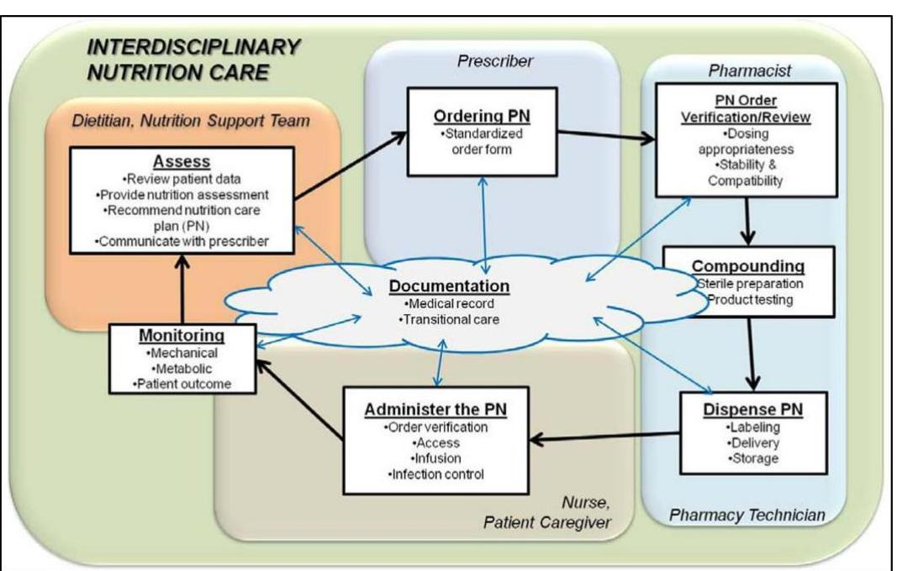
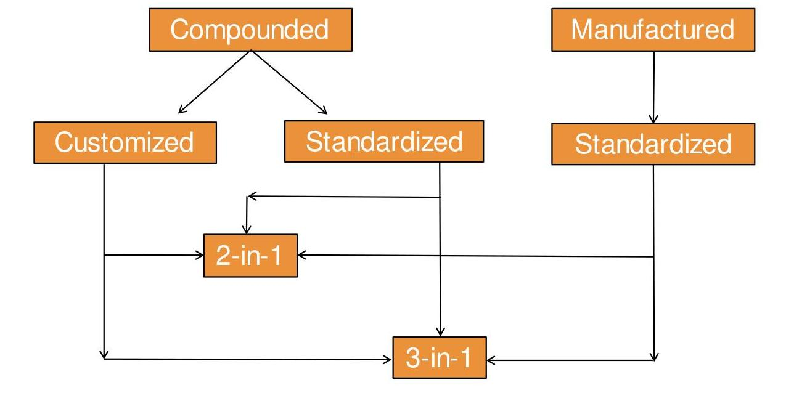
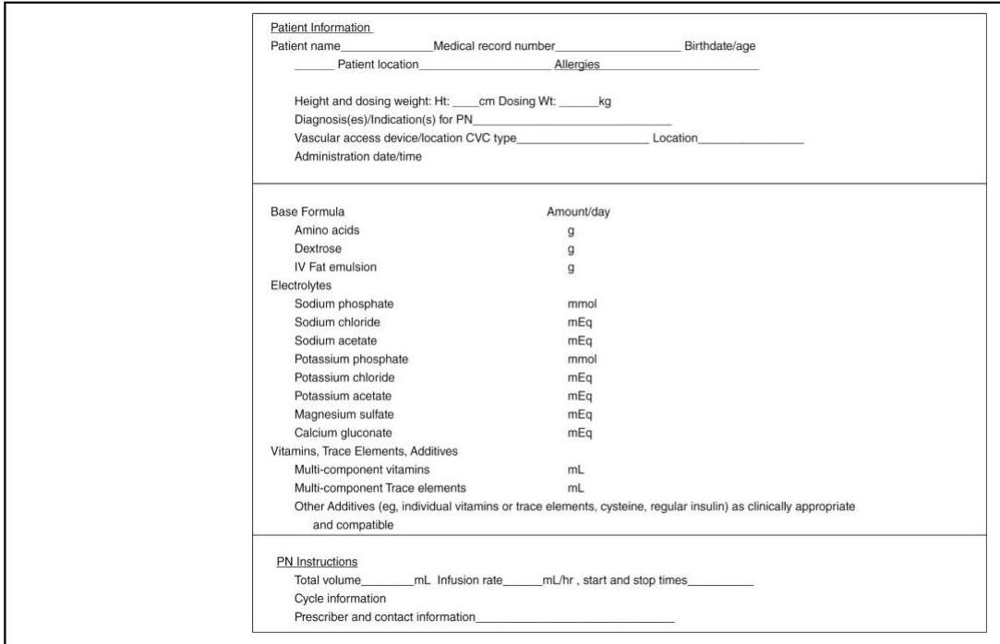
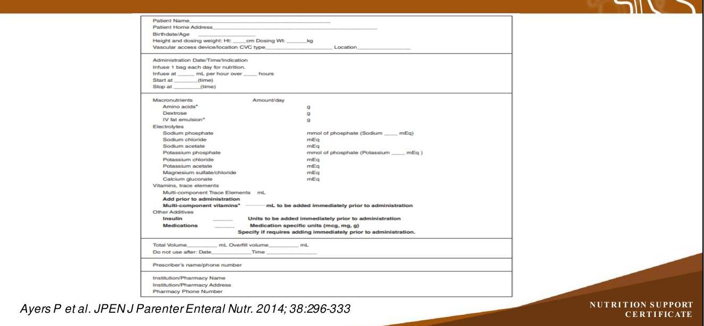
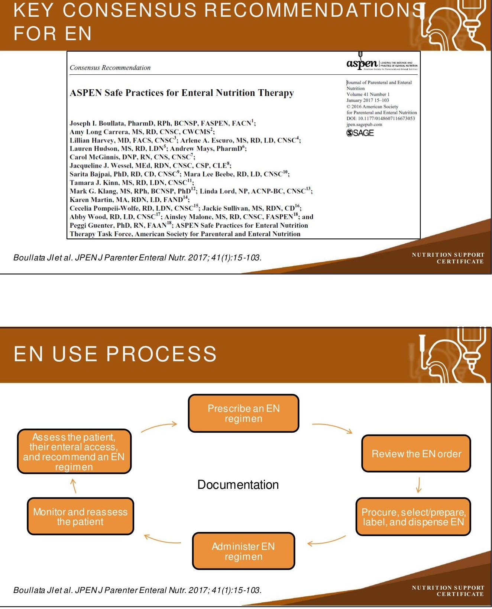
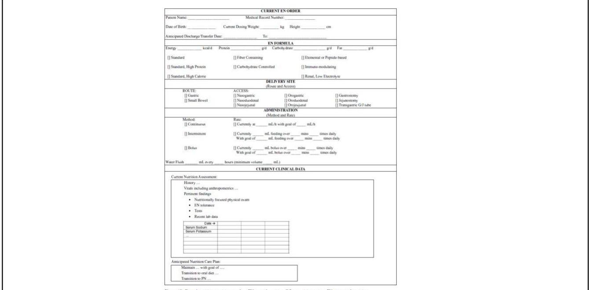

# NUTRITION SUPPORT CERTIFICATE 

## Nutrition Support Ordering

Planned by the American Society of Health-System Pharmacists (ASHP) in collaboration with the American Society for Parenteral and Enteral Nutrition (ASPEN).
(c)2022 American Society of Health-System Pharmacists, Inc. All rights reserved.

No part of this publication may be reproduced or transmitted in any form or by any means, electronic or mechanical, including photocopying, microfilming, and recording, or by any information storage and retrieval system, without written permission from the American Society of Health-System Pharmacists.

--- page 1 ---

# NUTRITION SUPPORT ORDER   ENTERAL AND PARENTERAL 

Phil Ayers, Pharm.D., BCNSP, FMSHP, FASHP
Baptist Medical Center, University of Mississippi Kris M. Mogensen, M.S., R.D.-A.P., L.D.N., CNSC
Brigham and Women's Hospital

NUTRITION SUPPORT CERTIFICATE

## RELEVANT FINANCIAL RELATIONSHIP DISCLOSURE

The following persons in control of this activity's content have relevant financial relationships:

- Phil Ayers: Fersenius Kabi, consultant and speaker
- Kris M. Mogensen: Baxter, speaker; ThriveRx, advisory board; Pfizer, advisory board

All other persons in control of content do not have any relevant financial relationships with an ineligible company.

As defined by the Standards of Integrity and Independence definition of ineligible company. All relevant financial relationships have been mitigated prior to the CPE activity.

--- page 2 ---

# LEARNING OBJECTIVES 

- Discuss the key elements and functionality of the electronic health record (EHR) for enteral and parenteral nutrition orders.
- Review the appropriate ordering process for multi-chamber parenteral nutrition products.
- Design a transition of care regimen for patients receiving enteral or parenteral nutrition.

## KEY ABBREVIATIONS

- BUN:
- EN:
- MCB-PN:
- PN:
- S/p:
- Tg:
- Yo:
blood, urea, nitrogen
enteral nutrition
multi-chamber bag - parenteral nutrition
parenteral nutrition
status post
Triglycerides
Year-Old

--- page 3 ---

# SELF-ASSESSMENT \#1 

TA is a 79 year-old man is 7 days s/p bowel resection for a colon mass. A nasogastric tube is in place with $>500 \mathrm{~mL}$ output per 12 hour shift. A KUB confirms post-op ileus. What laboratory parameter would not be required before starting PN.
A. Comprehensive metabolic panel
B. Phosphorus
C. Prealbumin
D. Magnesium

Image reproduced with permission from Boullata JL JPENJ Parenter Enteral Nutr. 2012; 36:10-13S.

--- page 4 ---

|  Clinical Recommendations | 0
aspen
CORRIS VN 408048 000
ASSOCIATE OF LABORAL NUTRITION
ASSOCIATE OF LABORAL NUTRITION
Journal of Parenteral and Enteral Nutrition
Volume 38 Number 3
March 2014 296-333
© 2013 American Society
for Parenteral and Enteral Nutrition
DOI: 10.1177/0148607113511992
gmx.sagepub.com
hosted at
online.sagepub.com
@SAGE  |
| --- | --- |
|  A.S.P.E.N. Parenteral Nutrition Safety Consensus Recommendations |   |
|  Phil Ayers, PharmD, BCNSP, FASHP¹; Stephen Adams, MS, RPh, BCNSP²; Joseph Boullata, PharmD, RPh, BCNSP³; Jane Gervasio, PharmD, BCNSP, FCCP⁴; Beverly Holcombe, PharmD, BCNSP, FASHP⁵; Michael D. Kraft, PharmD, BCNSP⁶; Neil Marshall, RN, BSN, CRNI, CNSC⁷; Antoinette Neal, RN, CRNI, CNSC, VA-BC⁸; Gordon Sacks, PharmD, BCNSP, FCCP⁹; David S. Seres, MD, ScM, PNS¹⁰; Patricia Worthington, MSN, RN, CNSC¹¹; and the American Society for Parenteral and Enteral Nutrition |   |

*Ayers P et al. JPEN J Parenter Enteral Nutr. 2014; 38(3):296-333.*

--- page 5 ---

# ISMP RECOMMENDATIONS IMPROVING PN SAFETY 

- Match prescribing and pharmacy templates
- Build, test, and heed automated warnings
- Heighten suspicions of errors
- Carry out effective redundancies
- Provide clear labeling
- Label should always match the PN order template in the PN order form/CPOE system and the ACD
- Educate and validate competency
- Eliminate transcription of PN orders

Institute for Medication Safety. ISMP. 2012; 17(13).

## SAFE PN PRESCRIBING KEY RECOMMENDATIONS

PN Orders:

- Full generic names (unless multiple products or indicates unique properties of the ingredient)
- Include related orders for labs, monitoring parameters
- Use only TJC-approved abbreviations, avoid ISMP error-prone abbreviations
- Avoid addition of non-nutrient medications when possible (if necessary, only when clear compatibility data exist)
- Develop protocols to allow modification of PN orders when incompatibilities exist
- Document in medical record, communicate with team
- Signed by prescriber

--- page 6 ---

# SAFE PN PRESCRIBING KEY RECOMMENDATIONS 

- Physical environment: USP <1066>
- Appropriate illumination in areas where prescribed, reviewed/verified, compounded, and administered
- Ergonomic design of workplace environment
- Establish medication safety zones
- Minimize interruptions
- Minimize noise

Ayers P et al. JPEN J Parenter Enteral Nutr. 2014; 38:296-333.

## SAFE PN PRESCRIBING KEY RECOMMENDATIONS

- PN Education should be provided to ALL disciplines/personnel involved in PN-use process
- Training should include didactic and experiential components
- Knowledge and skills of all individuals involved in PN-use process should be assessed
- Should be part of clinical training programs
- Materials and processes shall be developed and led by clinicians with expertise in the area of nutrition support, preferably from multiple disciplines

--- page 7 ---

Ayers P et al. JPEN J Parenter Enteral Nutr. 2014; 38:296-333.

# COMPOUNDED PN VS. MCB-PN 

## MCB-PN Considerations

- MCB-PN products identified for central vs. peripheral administration
- If entire MCB-PN bag not infused, need instructions to discard the remainder of bag
- MCB-PN listed amounts per liter or bag. Tools are needed to help prescriber identify amounts per day
- MCB-PN list as ions. Tools are needed to help prescribers

## PN Considerations

- Administration route/infusion via central or peripheral vein
- Volume and infusion rate
- PN ingredients ordered as amount per bag
- PN salts ordered as salts

--- page 8 ---

# COMPOUNDED PN VS. MCB-PN, CONT. 

## MCB-PN Considerations

- MCB-PN products ordered by brand name
- MCB-PN ordered vis concentrations (5\% amino acid-15\% dextrose). Tools are needed to calculate amounts per day based on volume
- Electrolyte dosing dependent on type of MCB-PN and volume infused.
- If entire MCB-PN bag not infused the entire dose ordered will not be administered

## PN Considerations

- Full generic names for each ingredient. Use brand names when multiple products exist/brand may assist in identifying product
- Dosing for each macronutrient
- Dosing for each electrolyte
- Dosing for each non-nutrient (e.g. insulin)

## ELEMENTS OF APPROPRIATE PN USE

- Identify clinical indications for PN, including manifestations of acute and chronic intestinal failure
- Recognize situations in which PN is not likely to be of benefit
- Initiate PN based on gastrointestinal function, nutrition status, and clinical status
- Select the vascular access device best suited to the therapy planned
- Implement measures to promote safety and reduce adverse outcomes

--- page 9 ---

# ELEMENTS OF APPROPRIATE PN USE, CONT. 

- Evaluate response to therapy
- Adjust the therapeutic plan based on ongoing monitoring
- Assess continued need for PN
- Transition promptly to oral or enteral nutrition as feasible
- Collaborate across disciplines and departmental boundaries

Worthington P et al. JPENJ Parenter Enteral Nutr. 2017; 41:324-77.

## CLINICAL CONDITIONS FOR CAUTIOUS INITIATION OF PN

| Conditions | Suggested Criteria |
| :--: | :--: |
| Hyperglycemia | Glucose $>180 \mathrm{mg} / \mathrm{dL}$ |
| Azotemia | BUN $>100 \mathrm{mg} / \mathrm{dL}$ |
| Hypertriglyceridemia | Serum Tg $>200 \mathrm{mg} / \mathrm{dL}$ |
| Hyponatremia | Serum $\mathrm{Na}<130 \mathrm{mEq} / \mathrm{L}$ |
| Hypernatremia | Serum $\mathrm{Na}>150 \mathrm{mEq} / \mathrm{L}$ |
| Hypokalemia | Serum $\mathrm{K}<3 \mathrm{mEq} / \mathrm{L}$ |
| Hypomagensemia | Serum $\mathrm{Mg}<1.3 \mathrm{mEq} / \mathrm{L}$ |
| Hypocalcemia | Ionized $\mathrm{Ca}<4.5 \mathrm{mg} / \mathrm{dL}$ |
| Hypophosphatemia | Serum phosphorus $<2 \mathrm{mg} / \mathrm{dL}$ |

--- page 10 ---

Table 13.2. Laboratory Monitoring During PN (Adult and Pediatric). ${ }^{1,10,17,19}$

| Parameter | Acute Care PN |  |  | Long-Term PN |  |  |  |
| :--: | :--: | :--: | :--: | :--: | :--: | :--: | :--: |
|  | Baseline | Days 1-7 | Ongoing, Stable | Initial,   Postdischarge | Weeks 1-4   (or Until Stable) | At 3 mo | Ongoing, Stable |
| Glucose, BUN, creatinine, electrolytes, calcium, magnesium, phosphorus | $\checkmark$ | Daily $=3$ or until stable | $1-2 \times / w k$ or as clinically indicated | $\checkmark$ | $\checkmark$ |  | Monthly |
| CBC with differential | $\checkmark$ | Daily $=3$ or until stable | $1-2 \times / w k$ | $\checkmark$ | $\checkmark$ |  | Monthly |
| Total bilirubin, direct bilirubin, AP, AST, ALT, | $\checkmark$ |  | Weekly | $\checkmark$ |  |  | Monthly |
| PTT, PT, INR | $\checkmark$ |  | Weekly |  |  |  | Monthly |
| Triglyceride level | $\checkmark$ | Pediatric: daily until stable then weekly | Weekly | $\checkmark$ |  |  | Monthly |
| Serum proteins (to monitor inflammation) | $\checkmark$ |  | Weekly | $\checkmark$ |  |  | Monthly |
| Iron indices |  |  | As clinically indicated |  |  | $\checkmark$ | Every 3-6 mo |
| Zinc, selenium, manganese, copper, chromium |  |  | As clinically indicated |  |  | $\checkmark$ | Every 3-6 mo |
| Vitamin A, 25-OH vitamin D, vitamin E |  |  | As clinically indicated |  |  | $\checkmark$ | Every 12 mo |
| Vitamin $B_{12}$ and folate |  |  | As clinically indicated |  |  | $\checkmark$ | Every 6-12 mo |
| TSH |  |  | As indicated |  |  |  | Every 12 mo |
| Carnitine |  |  | No guideline for adults |  |  | $\checkmark$ Pediatric patients | Every 3-12 mo |
| ALT, alanine aminotransferase; AP, alkaline phosphatase; AST, aspartate aminotransferase; BUN, blood urea nitrogen; CBC, complete blood count; INR, international normalized ratio; PN, parenteral nutrition; PT, prothrombin time; PTT, partial thromboplastin time; TSH, thyroid-stimulating hormone. |  |  |  |  |  |  |  |

Adapted from Worthington P et al. JPEN J Parenter Enteral Nutr. 2017; 41:324-77.

# CASE STUDY \#1 

- DA 67 yo white male, 62 kg , DX bowel dysmotility. Initiated PN in hospital 2/2/17
- For discharge on HPN 2/16 : Amino Acid/Dextrose E 5/15 at 42mL/hour
- PMH: AF, gout, BPH, Graves, Ogilvie's, post-op ileus, ischemic bowel, GI bleed
- PSH: Cholecystectomy, bilateral hip replacement, sigmoidectomy with ileal anastomosis, subtotal colectomy, thyroidectomy

--- page 11 ---

# CONCERNS 

- Does the patient qualify for HPN
- Lack of ILE provision
- Lack of multivitamins for injection
- Lack of trace elements
- Baseline Laboratory
- Home setting adequate for safe provision
- Patient/caregiver education

## HPN REIMBURSEMENT

- Calorie levels
- $20-35 \mathrm{kcal} / \mathrm{kg} /$ day
- Total kcal from current PN 714 kcal/day ( $12 \mathrm{kcal} / \mathrm{kg}$ )
- Protein
- $0.8-1.5 \mathrm{~g} / \mathrm{kg} /$ day
- Total protein from current PN $50 \mathrm{~g} /$ day $(0.8 \mathrm{~g} / \mathrm{kg})$

--- page 12 ---

# HOME PN TEMPLATE 

## INDICATIONS FOR HOME PN

- Intestinal failure or dysfunction
- Short bowel syndrome
- Malabsorptive disorders
- Chronic bowel obstruction
- Crohn's
- Radiation enteritis
- Intestinal and pancreatic fistulae
- Pancreatitis
- Severe life-threatening malnutrition

--- page 13 ---

# CONDITIONS WARRANTING CAUTION WHEN INITIATING PN AT HOME 

Medical condition

- Diabetes
- Heart failure
- Pulmonary disorder
- Severe malnutrition
- Hyperemesis gravidarum

## Electrolyte Disorder

- Hyponatremia
- Hypokalemia
- Hyperchloremic metabolic acidosis
- Hypophosphatemia
- Hypochloremic metabolic alkalosis

Muller CM, ed. The ASPEN adult nutrition support core curriculum. 3rd ed. 2017:565-86.

## COMMON INDICATIONS FOR HOME PN

- Short bowel syndrome
- Crohn's disease
- Intestinal motility disorders
- Chronic bowel obstruction due to benign adhesions or strictures
- Radiation enteritis
- Malabsorptive disorders
- Intestinal and pancreatic fistula
- Gastrointestinal malignancy
- Malignant bowel obstruction, carcinomatosis
- Complications of bariatric surgery
- Gastroschisis
- Long-segment Hirschsprung's disease

--- page 14 ---

Table 2. Medicare Criteria for HPN. ${ }^{7}$
A. Massive small bowel resection within 3 mo of initiating HPN
HPN therapy needed $>90 \mathrm{~d}$
$\leq 5 \mathrm{ft}(153 \mathrm{~cm})$ of small bowel distal to the ligament of Treitz
C. Bowel rest for at least 3 mo
HPN therapy needed $>90 \mathrm{~d}$,
Symptomatic pancreatitis with/without pseudocyst,
Severe exacerbation of regional enteritis, or
Proximal enterocutaneous fistula where distal enteral tube feeding is not possible
E. Malabsorption and malnutrition
HPN therapy needed $>90 \mathrm{~d}$
$10 \%$ weight loss over $\leq 3 \mathrm{mo}$
Serum albumin $\leq 3.4 \mathrm{~g} / \mathrm{dL}$
Severe fat malabsorption

- Standard 72-h fecal fat test
- Fecal fat exceeds $50 \%$ of oral/enteral intake on a diet of at least $50 \mathrm{~g} / \mathrm{d}$ of fat

B. Short bowel syndrome
HPN therapy needed $>90 \mathrm{~d}$,
Enteral intake of $2.5-3 \mathrm{~L}$,
Enteral losses exceed $50 \%$ of enteral intake, and
Urine output is $<1 \mathrm{~L}$ per 24 h .
D. Complete mechanical small bowel obstruction
HPN therapy needed $>90 \mathrm{~d}$
Inoperable
F. Severe motility disorder (of small intestine and/or stomach) and malnutrition
HPN therapy needed $>90 \mathrm{~d}$
$10 \%$ weight loss over $\leq 3 \mathrm{mo}$
Serum albumin $\leq 3.4 \mathrm{~g} / \mathrm{dL}$
Unresponsive to max doses of prokinetic medication (presence of daily nausea/vomiting)
Motility disorder demonstrated via

- Solid meal gastric emptying study or barium/radiopaque pellets that do not reach the right colon by 6 h
G/H: Above condition with malnutrition and failed enteral tube feeding trial
$10 \%$ weight loss within $3 \mathrm{mo}+$ serum albumin $\leq 3.4 \mathrm{~g} / \mathrm{dL}+$ failed tube feeding trial $+>90 \mathrm{~d}$ HPN +1 condition below:
- Moderate fat malabsorption (fecal fat $>25 \%$ of enteral intake on a diet of $50 \mathrm{~g} / \mathrm{d}$ of fat measured with a 72-h fecal fat test)
- Malabsorption as confirmed by Sudan stain or d-xylose stool test
- Gastroparesis as described in scenario F where isotope or pellets fail to reach the jejunum in $3-6 \mathrm{~h}$, manometric motility studies with results consistent with abnormal gastric emptying, unresponsive to prokinetic medication
- Small bowel dysmotility with gastric to right colon transit between 3 and 6 h , unresponsive to prokinetic medication
- Small bowel resection leaving $>5 \mathrm{ft}$ of small bowel beyond the ligament of Treitz
- Short bowel syndrome not as severe as scenario B
- Mild to moderate exacerbation of regional enteritis or enterocutaneous fistula
- Partial mechanical small bowel obstruction and surgery is not an option

HPN, bone parenteral nutrition.
Kirby D et al. Nutr Clin Pract. 2017;32:739-52.

# LABORATORY MONITORING FOR HOME PN PATIENT 

| Parameter | Baseline | Week   1,2,3 | Week 4 | Every 3 months prior to MD office visit |
| :--: | :--: | :--: | :--: | :--: |
| Glucose, BUN, CR, electrolytes, $\mathrm{Ca}, \mathrm{Mg}$, Phos. | $x$ | $x$ | $x$ | $x$ |
| CBC with diff. and reticulocyte count | $x$ | $x$ | $x$ | $x$ |
| Total and direct bilirubin, AST, ALT, LDH, Alk Phos, TG | $x$ |  | $x$ | $x$ |
| Serum proteins | $x$ |  | $x$ | $x$ |
| Vitamin B12, RBC folate, iron indices, trace elements, vitamin D 25-OH | $x$ |  | $x$ | $x$ |

--- page 15 ---

# TRACE ELEMENT DEFICIENCIES 

| Chromium | glucose intolerance, peripheral neuropathy |
| :--: | :--: |
| Copper | neutropenia, hypochromic anemia, parenthesis in extremities |
| Manganese | Congenital abnormalities in offspring, growth retardation, defects in lipid/CHO metabolism |
| Zinc | diarrhea, acrodermatitis, dementia, alopecia, alteration in taste and smell, impairedwound healing |
| Selenium | myopathy, cardiomyopathy |
| lodide | hypothyroid goiter, hypothyroidism |
| Molybdenum | tachycardia, altered mental status, visual changes, nausea, vomiting |

Muller CM, ed. The ASPEN adult nutrition support core curriculum. 3rd ed. 2017:565-86.

## HPN - FACILITATING DISCHARGE

- Obtain diagnostic testing and procedures, verify insurance
- Establish long-term vascular access
- Establish tolerated PN formula
- Assess patient
- Activities of daily living, caregiver, home setting, determine patient buy-in
- Begin patient education
- Identify outpatient management

--- page 16 ---

# HPN - HOME EVALUATION 

- Is home accessible to home health provider?
- Is environment clean with reliable utilities?
- Can patient move around home safely?
- Is the patient willing to learn operation of equipment?
- Is the caregiver willing to provide additional assistance?
- Is the patient and caregiver willing to learn problems and willing to contact appropriate services?
- Is laboratory monitoring available as needed to prevent complications?

## SELF ASSESSMENT \#2

A 68 year-old man is transferred from a long-term acute care hospital to the acute care ICU with worsening respiratory status. He required mechanical ventilation via his tracheostomy. He has required EN at the LTACH and the ICU team would like to resume EN. His nurse stated that she received report that the patient has been complaining of abdominal pain and nausea and that his PEG tube was pulled out a few more centimeters than previously noted on a prior admission. Your first recommendation to the team is:
A. Check a KUB to confirm tube placement before starting tube feeds
B. Order the formula he was receiving at the LTACH
C. Tell the team to order an aggressive bowel regimen
D. Hold EN and start PN until his abdominal pain is fully evaluated

--- page 17 ---

# KEY CONSENSUS RECOMMENDATIONS FOR EN 

--- page 18 ---

# CRITICAL COMPONENTS OF AN EN ORDER 

- Patient information
- Patient-specific information related to the order (e.g., dosing weight, allergies)
- EN formula name (ideally a generic name, if possible)
- Delivery site/route and enteral access device
- Administration method and rate
- How to initiate and advance EN

Boullata Jlet al. JPENJ Parenter Enteral Nutr. 2017; 41(1):15-103.

## SUPPLEMENTARY COMPONENTS OF AN EN ORDER

- Confirmation of the tube position
- Appropriate flushing of the enteral access device
- This may include amount to flush before and after medication administration
- Head of bed elevation
- Enteral access device care and assessment
- Monitoring parameters
- Laboratory monitoring, intake/output, weights, physical assessment, GI tolerance
- Macronutrient modular product orders

--- page 19 ---

# SUPPLEMENTARY ORDER FORM

## SUPPLEMENTARY ORDERS

### Auxiliary Orders:

- ☐ Assess gastric residual volume (GRV) every 6 hours or before each bolus/internist feeding
- If GRV > 500 mL hold feeding for 2 hours and recheck GRV. If GRV recheck < 500 mL, restart feeding
- ☐ May give appropriate medications via enteral feeding tube, follow each medication by at least 15 mL water flush before and after medication as volume allowed (do not mix medications together or with EN formula)
- ☐ Consult Nutrition Support Team or Nutrition Support Clinician

### Monitoring:

- ☐ Observe for signs of EN intolerance (include signs and symptoms of intolerance) every _______ hours
- ☐ Enteral feeding tube site care and assessment every _______ hours
- ☐ Obtain body weight every day, or every _______ days
- ☐ Strict fluid volume IncOurs
- ☐ Capillary blood glucose: per institutional protocol

### Laboratory Orders:

- ☐ Comprehensive Metabolic Panel every day or every _______ days
- ☐ Serum Magnesium every day or every _______ days
- ☐ Serum Phosphorus every day or every _______ days

**Figure 4.** Suggested enteral nutrition (EN) supplementary orders (specific content can be customized per institution).

*Boullata Jlet al. JPENJ Parenter Enteral Nutr. 2017; 41(1):15-103.*

*Boullata Jlet al. JPENJ Parenter Enteral Nutr. 2017; 41(1):15-103.*

*NUTRITION SUPPORT CERTIFICATE*

--- page 20 ---

# EN ORDERS 

- These templates can be used to build EN order sets into an EHR
- Carefully consider what would be a "hard stop"
- Critical components of the order
- Example: a provider enters an EN order, but does not specify the patient's enteral access device
- The EHR could be programmed to not allow the order to be signed until that part of the order set is complete

Boullata Jlet al. JPENJ Parenter Enteral Nutr. 2017; 41(1):15-103.

## CASE STUDY \#2

Mrs Jones is a 70 year-old female with COPD who was admitted to the ICU with pneumonia. She requires mechanical ventilation and has an orogastric tube in place for medications and nutrition.

- She is 5 feet ( 152.4 cm ) tall and weighs 48 kg (105.6 lbs)
- She needs $\sim 25 \mathrm{kcal} / \mathrm{kg}=1200 \mathrm{kcals}$
- She needs 1.5 g protein $/ \mathrm{kg}=72 \mathrm{~g}$ protein
- Her needs can be met with a standard, high nitrogen formula that has $1 \mathrm{kcal} / \mathrm{mL}$, 62.5 g protein/L, 130 g carbohydrate/L, 26 g fat/L and 840 mL water/L
- 1200 mL of formula will provide 1200 kcals, 75 g protein, 156 g carbohydrate, 31 g fat, and 1008 mL water

--- page 21 ---

# SUPPLEMENTARY ORDER FORM

## SUPPLEMENTARY ORDERS

### Auxiliary Orders:

- ☐ Assess gastric residual volume (GRV) every 6 hours or before each bolus/internist feeding
- If GRV > 500 mL hold feeding for 2 hours and recheck GRV. If GRV recheck < 500 mL, restart feeding
- ☐ May give appropriate medications via enteral feeding tube, follow each medication by at least 15 mL water flush before and after medication as volume allowed (do not mix medications together or with EN formula)
- ☐ Consult Nutrition Support Team or Nutrition Support Clinician

### Monitoring:

- ☐ Observe for signs of EN intolerance (include signs and symptoms of intolerance) every _______ hours
- ☐ Enteral feeding tube site care and assessment every _______ hours
- ☐ Obtain body weight: every day, or every _______ days
- ☐ Strict fluid volume IncOsm
- ☐ Capillary blood glucose: per institutional protocol

### Laboratory Orders:

- ☐ Comprehensive Metabolic Panel every day or every _______ days
- ☐ Serum Magnesium every day or every _______ days
- ☐ Serum Phosphorus every day or every _______ days

**Figure 4.** Suggested enteral nutrition (EN) supplementary orders (specific content can be customized per institution).

*Used with permission from: Boullata Jlet al. JPEN J Parenter Enteral Nutr. 2017; 41:15-103.*

*Used with permission from: Boullata Jlet al. JPEN J Parenter Enteral Nutr. 2017; 41:15-103.*

--- page 22 ---

If we use the template, the completed order for Mrs. Jones may look like this:

She is getting plenty of fluid from IV meds, so we will just plan flushes for tube patency.

*Boullata Jlet al. JPENJ Parenter Enteral Nutr. 2017; 41:15-103.*

|  INHIBITED ENTERAL NUTRITION ORDER |  |  |  |  |  |  |  |  |  |  |  |  |  |  |  |  |  |   |
| --- | --- | --- | --- | --- | --- | --- | --- | --- | --- | --- | --- | --- | --- | --- | --- | --- | --- | --- |
|  Patient Name: |  |  |  |  |  |  |  |  |  |  |  |  |  |  |  |  |  |   |
|  Room Number: |  |  |  |  |  |  |  |  |  |  |  |  |  |  |  |  |  |   |
|  000 |  |  |  |  |  |  |  |  |  |  |  |  |  |  |  |  |  |   |
|  Total Energy kcal/day |  |  |  |  |  |  |  |  |  |  |  |  |  |  |  |  |  |   |
|  1000 |  |  |  |  |  |  |  |  |  |  |  |  |  |  |  |  |  |   |
|  Total Carbohydrate g/day |  |  |  |  |  |  |  |  |  |  |  |  |  |  |  |  |  |   |
|  75 |  |  |  |  |  |  |  |  |  |  |  |  |  |  |  |  |  |   |
|  Total Fat g/day |  |  |  |  |  |  |  |  |  |  |  |  |  |  |  |  |  |   |
|  31 |  |  |  |  |  |  |  |  |  |  |  |  |  |  |  |  |  |   |
|  Total Fluid mL/day |  |  |  |  |  |  |  |  |  |  |  |  |  |  |  |  |  |   |
|  1000 |  |  |  |  |  |  |  |  |  |  |  |  |  |  |  |  |  |   |
|  ENTERAL NUTRITION FORMULA |  |  |  |  |  |  |  |  |  |  |  |  |  |  |  |  |  |   |
|  - Standard |  |  |  |  |  |  |  |  |  |  |  |  |  |  |  |  |  |   |
|  - Standard |  |  |  |  |  |  |  |  |  |  |  |  |  |  |  |  |  |   |
|  - Standard High protein |  |  |  |  |  |  |  |  |  |  |  |  |  |  |  |  |  |   |
|  - Standard High Calorie |  |  |  |  |  |  |  |  |  |  |  |  |  |  |  |  |  |   |
|  - Filter Containing |  |  |  |  |  |  |  |  |  |  |  |  |  |  |  |  |  |   |
|  DELIVERY SITE (BOUTE AND ACCESS) |  |  |  |  |  |  |  |  |  |  |  |  |  |  |  |  |  |   |
|  - Bounce |  |  |  |  |  |  |  |  |  |  |  |  |  |  |  |  |  |   |
|  - Grasses |  |  |  |  |  |  |  |  |  |  |  |  |  |  |  |  |  |   |
|  - Detergents |  |  |  |  |  |  |  |  |  |  |  |  |  |  |  |  |  |   |
|  - Steamed |  |  |  |  |  |  |  |  |  |  |  |  |  |  |  |  |  |   |
|  - Steamed |  |  |  |  |  |  |  |  |  |  |  |  |  |  |  |  |  |   |
|  - Steamed |  |  |  |  |  |  |  |  |  |  |  |  |  |  |  |  |  |   |
|  - Steamed |  |  |  |  |  |  |  |  |  |  |  |  |  |  |  |  |  |   |
|  - Steamed |  |  |  |  |  |  |  |  |  |  |  |  |  |  |  |  |  |   |
|  - Steamed |  |  |  |  |  |  |  |  |  |  |  |  |  |  |  |  |  |   |
|  - Steamed |  |  |  |  |  |  |  |  |  |  |  |  |  |  |  |  |  |   |
|  - Steamed |  |  |  |  |  |  |  |  |  |  |  |  |  |  |  |  |  |   |
|  - Steamed |  |  |  |  |  |  |  |  |  |  |  |  |  |  |  |  |  |   |
|  - Steamed |  |  |  |  |  |  |  |  |  |  |  |  |  |  |  |  |  |   |
|  - Steamed |  |  |  |  |  |  |  |  |  |  |  |  |  |  |  |  |  |   |
|  - Steamed |  |  |  |  |  |  |  |  |  |  |  |  |  |  |  |  |  |   |
|  - Steamed |  |  |  |  |  |  |  |  |  |  |  |  |  |  |  |  |  |   |
|  - Steamed |  |  |  |  |  |  |  |  |  |  |  |  |  |  |  |  |  |   |
|  - Steamed |  |  |  |  |  |  |  |  |  |  |  |  |  |  |  |  |  |   |
|  - Steamed |  |  |  |  |  |  |  |  |  |  |  |  |  |  |  |  |  |   |
|  - Steamed |  |  |  |  |  |  |  |  |  |  |  |  |  |  |  |  |  |   |
|  - Steamed |  |  |  |  |  |  |  |  |  |  |  |  |  |  |  |  |  |   |
|  - Steamed |  |  |  |  |  |  |  |  |  |  |  |  |  |  |  |  |  |   |
|  - Steamed |  |  |  |  |  |  |  |  |  |  |  |  |  |  |  |  |  |   |
|  - Steamed |  |  |  |  |  |  |  |  |  |  |  |  |  |  |  |  |  |   |
|  - Steamed |  |  |  |  |  |  |  |  |  |  |  |  |  |  |  |  |  |   |
|  - Steamed |  |  |  |  |  |  |  |  |  |  |  |  |  |  |  |  |  |   |
|  - Steamed |  |  |  |  |  |  |  |  |  |  |  |  |  |  |  |  |  |   |
|  - Steamed |  |  |  |  |  |  |  |  |  |  |  |  |  |  |  |  |  |   |
|  - Steamed |  |  |  |  |  |  |  |  |  |  |  |  |  |  |  |  |  |   |
|  - Steamed |  |  |  |  |  |  |  |  |  |  |  |  |  |  |  |  |  |   |
|  - Steamed |  |  |  |  |  |  |  |  |  |  |  |  |  |  |  |  |  |   |
|  - Steamed |  |  |  |  |  |  |  |  |  |  |  |  |  |  |  |  |  |   |
|  - Steamed |  |  |  |  |  |  |  |  |  |  |  |  |  |  |  |  |  |   |
|  - Steamed |  |  |  |  |  |  |  |  |  |  |  |  |  |  |  |  |  |   |

--- page 23 ---

# ORDER REVIEW 

- How often should you check to determine if the order is still correct and valid?
- Will depend on the institution and type of patient
- ICU may be daily to every other day
- Stable non-ICU, acute care patient may be every 2-7 days
- On transfer long-term acute care or a skilled nursing facility may be every 14 weeks, or depending on regulatory agency requirements

Boullata Jlet al. JPENJ Parenter Enteral Nutr. 2017;41:15-103

## WHAT MAY PROMPT AN ORDER CHANGE?

- A change in clinical status that may require a change in the type of formula
- Change in renal function
- Change in hydration status (need for more concentrated or dilute formula)
- A major change in weight prompting a recalculation of energy and protein requirements
- A change in the administration method:
- Continuous to cycled
- Continuous to bolus/intermittent
- Cycled or bolus back to continuous

--- page 24 ---

# MRS. JONES ORDER REVIEW 

Mrs. Jones has extubated, but was found to have dysphagia on her swallowing evaluation. A nasogastric tube was placed for tube feeding. She is making progress with physical therapy and hates being hooked up to the pump. Her capillary glucoses have all been $<110 \mathrm{mg} / \mathrm{dL}$ and she is not happy with the frequent glucose checks. She is still receiving the high protein formula at $50 \mathrm{~mL} / \mathrm{hr}$.

- Review the order: is it still appropriate? How will you decide?
- Has her clinical status changed?
- Are her energy and protein needs the same or does she need reassessment?
- Should the order be changed?

Boullata Jlet al. JPENJ Parenter Enteral Nutr. 2017; 41:15-103.

## MRS. JONES ORDER REVIEW

- Clinical status - changed?
- Yes! Extubated, ambulatory, working with PT!
- Energy and protein needs changed?
- Yes, she needs a little more calories now
- Steroids tapered down so can decrease protein
- Change the order?
- Yes!

--- page 25 ---

# MRS. JONES ORDER REVIEW 

- Needs:
- $30 \mathrm{kcal} / \mathrm{kg}=1440 \mathrm{kcals} ; 1.3 \mathrm{~g}$ protein $/ \mathrm{kg}=62 \mathrm{~g}$
- Since she hates the pump and is ambulatory, consider a bolus feeding schedule
- Change to a standard formula: 250 kcals, 10.5 g protein, 34 g carbohydrate, 8 g fat, and 199 mL water in one 237 mL carton
- If we do a bolus schedule, she would need 6 cartons/day:
- 2 cartons ( 474 mL ) three times/day $=1500 \mathrm{kcals}, 63 \mathrm{~g}$ protein, 204 g carbohydrate, 48 g fat, and 1194 mL water
- She needs an additional $\sim 300 \mathrm{~mL}$ to provide 1 mL of water $/ \mathrm{kcal}$ (RDA)

If we use the template, the revised order for Mrs. Jones may look like this:

| INHIBITENT ENTERAL NUTRITION ORDER |  |  |  |  |
| :--: | :--: | :--: | :--: | :--: |
| Patient Names: Jones, Sally | Medical Record Number: 123-40-6799 |  | Dosing Weight (kg): 48 |  |
| Room Number: 30927 |  |  | Date of Birth: 01/01/1949 |  |
| Total Energy kcal/day | Total Protein g/day | Total Carbohydrate g/day |  | Allergies: Home |
| 1500 | 63 | 204 |  | Total Fluid mL $/ \mathrm{kg}$ 1194 |
| ENTERAL NUTRITION FORMELLA |  |  |  |  |
| - Standard   Standard High protein   Standard High Calorie   - Fitter Consuming |  |  | Carbohydrate controlled   - Elemental include peptide-based   - Immune modulating   - Renal - low electrolytes |  |
| DELIVERY SITE (BOUTE AND ACCESS) |  |  |  |  |
| Room: | Access: |  |  |  |
| - Calorie | - Therapeutic | - Therapeutic |  | - Gastrostomy |
| - Small bowel | - Transgenital | - Oesophageal |  | - Gastrostomy   - Transgenital G3 tube |
|  | - Transpigment | - Oesipigment |  |  |
| ADMINISTRATION (Medical and Basic) |  |  |  |  |
| Medical: |  | Rate: |  |  |
| - Continuous |  | - Initial | $\mathrm{mL} / \mathrm{h}$ |  |
|  |  | - Advance by | mL/h every | 8 to goal of $\qquad$ mL/h |
| - Intermittent |  | - Initial | mL feeding over $\qquad$ min $\qquad$ times daily |  |
|  |  | - Advance by | mL each day to goal of $\qquad$ mL feeding |  |
|  |  | over $\qquad$ min $\qquad$ times daily |  |  |
| - Bolus |  | - Initial 237 | mL bolus over 30 min 3 | 3 times daily |
|  |  | - Advance by 237 | mL each day to goal of 474 | mL bolus |
|  |  | over 30 min 3 |  | times daily |
| OTHER |  |  |  |  |
| - Fresh feeding ratio with 100 |  | mL of water every 8 | hours (minimum of 30 mL per flush) |  |
| - Elevate band of fast 30-45 degrees |  |  |  |  |

Boullata Jlet al. JPEN J Parenter Enteral Nutr. 2017; 41:15-103.

--- page 26 ---

# DO THE SUPPLEMENTARY ORDERS NEED TO CHANGE?

- Consider:
  - Change in frequency of lab monitoring
  - Change in monitoring of clinical parameters
    - More frequent in ICU
    - Less frequent on floor or in a sub-acute setting

|  SUPPLEMENTARY ORDERS | |
| --- | --- |
|  **Auxiliary Orders:** | |
|  - Assess gastric residual volume (GRV) every 6 hours or before each bolus/intermittent feeding | |
|  If GRV > 500 mL hold feeding for 2 hours and recheck GRV. If GRV recheck < 500 mL, restart feeding | |
|  - May give appropriate medications via enteral feeding tube, follow each medication by at least 15 mL water flush before and after medication as volume allowed (do not mix medications together or with EN formula) | |
|  - Consult Nutrition Support Team or Nutrition Support Clinician | |
|  **Monitoring:** | |
|  - Observe for signs of EN intolerance (include signs and symptoms of intolerance) every 8 hours | |
|  - Enteral feeding tube site care and assessment every 8 hours | |
|  - Obtain body weight every day, or every days | |
|  - Strict fluid volume Ins/Outs | |
|  - Capillary blood glucose: per institutional protocol | |
|  **Laboratory Orders:** | |
|  - Comprehensive Metabolic Panel every day or every 3 days | |
|  - Serum Magnesium every day or every 3 days | |
|  - Serum Phosphorus every day or every 3 days | |

If she has been stable, can cut down monitoring

**Figure 4.** Suggested enteral nutrition (EN) supplementary orders (specific content can be customized per institution).

*Boullata Jlet al. JPEN J Parenter Enteral Nutr. 2017; 41:15-103. McMahon MM et al. JPEN J Parenter Enteral Nutr. 2013;37:23-36.*

--- page 27 ---

# TRANSITION OF CARE 

- Mrs. Jones continues to make progress, but because of her prolonged intubation, she has not regained her swallowing function. She is making progress with her speech therapy and the team would like to send her home on tube feeding through her NGT since they think she will be able to eat within the next few weeks.
- The care coordinating nurse reviews Mrs. Jones' insurance and she has Medicare as a primary insurance, and no secondary.

## HOME EN COVERAGE: MEDICARE

- Must be "permanent" = EN for $\geq 3$ months
- Involves non-function or disease of structures that permit food to reach the small bowel
- Presence of small bowel disease that impairs digestion/absorption of oral diet; oral diet modifications not appropriate and patient requires EN to provide specialized nutrients
- Specialty formula may be approved if patient has diabetes/hyperglycemia on a standard enteral formula, CKD/ESRD, documented malabsorption
- Must be receiving between 750-2000 kcals/day, otherwise document medical necessity if outside of that range

--- page 28 ---

# HOME TF NOT COVERED, NOW WHAT? 

- Referral to short term skilled nursing facility
- What information should be covered in the transition?
- Clinical data (height, weight, weight history)
- Current energy, protein, and fluid needs
- Current EN formula, route of administration, method of administration, goal volume or rate
- Water flushes
- Summary of current tolerance
- Ultimate goal (eg., long-term EN or transition back to oral diet)

Figure 12. Central nutrition transition template. EN, mental nutrition; GT, gastrojejunostomy; PN, parenteral nutrition

Boullata Jlet al. JPEN J Parenter Enteral Nutr. 2017; 41:15-103.

--- page 29 ---

# SELF-ASSESSMENT \#1 

TA is a 79 year-old man is 7 days s/p bowel resection for a colon mass. A nasogastric tube is in place with $>500 \mathrm{~mL}$ output per 12 hour shift. A KUB confirms post-op ileus. What laboratory parameter would not be required before starting PN.
A. Comprehensive metabolic panel
B. Phosphorus
C. Prealbumin
D. Magnesium

## SELF-ASSESSMENT\#1

TA is a 79 year-old man is 7 days s/p bowel resection for a colon mass. A nasogastric tube is in place with $>500 \mathrm{~mL}$ output per 12 hour shift. A KUB confirms post-op ileus. What laboratory parameter would not be required before starting PN.
A. Comprehensive metabolic panel
B. Phosphorus
C. Prealbumin
D. Magnesium

--- page 30 ---

# SELF ASSESSMENT \#2 

A 68 year-old male is transferred from a long-term acute care hospital to the acute care ICU with worsening respiratory status. He required mechanical ventilation via his tracheostomy. He has required EN at the LTACH and the ICU team would like to resume EN. His nurse stated that she received report that the patient has been complaining of abdominal pain and nausea and that his PEG tube was pulled out a few more centimeters than previously noted on a prior admission. Your first recommendation to the team is:
A. Check a KUB to confirm tube placement before starting tube feeds
B. Order the formula he was receiving at the LTACH
C. Tell the team to order an aggressive bowel regimen
D. Hold EN and start PN until his abdominal pain is fully evaluated

## SELF ASSESSMENT \#2

A 68 year-old male is transferred from a long-term acute care hospital to the acute care ICU with worsening respiratory status. He required mechanical ventilation via his tracheostomy. He has required EN at the LTACH and the ICU team would like to resume EN. His nurse stated that she received report that the patient has been complaining of abdominal pain and nausea and that his PEG tube was pulled out a few more centimeters than previously noted on a prior admission. Your first recommendation to the team is:
A. Check a KUB to confirm tube placement before starting tube feeds
B. Order the formula he was receiving at the LTACH
C. Tell the team to order an aggressive bowel regimen
D. Hold EN and start PN until his abdominal pain is fully evaluated

--- page 31 ---

# CONCLUSIONS 

- PN and EN should be ordered using a standardized process
- A system should be developed to assist in communicating the daily macro and micro nutrient provisions if utilizing multi-chamber parenteral nutrition bags
- Successful transitions of care involve communication to the next provider and well-defined orders and instructions

## REFERENCES

- Ayers P, Adams S, Boullata JI et al. A.S.P.E.N. parenteral nutrition safety consensus recommendations. JPEN J Parenter Enteral Nutr. 2014; 38(3):296-333.
- Bonnes SL, Salonem BR, Hurt RT et al. Parenteral and enteral nutrition-from hospital to home: Will it be covered? Nutr Clin Pract. 2017; 32(6):730-738.
- Boullata, JI. Overview of the parenteral nutrition use process. JPEN J Parenter Enteral Nutr. 2012; 36:10S-13S.
- Boullata JI, Carrera AL, Harvey L et al. ASPEN safe practices for enteral nutrition therapy. JPEN J Parenter Enteral Nutr. 2017; 41(1):15-103.
- Henderickson E, Corrigan M. Navigating reimbursement for home parenteral nutrition. Nutr Clin Pract. 2013; 28(5):566-571.

--- page 32 ---

# REFERENCES, CONT. 

- Institute for Medication Safety. Medication Safety Alert. Philadelphia: Institute for Medication Safety; 2012 Jun. ISMP vol. 17(13).
- Kirby DF, Corrigan ML, Hendrickson E et al. Overview of home parenteral nutrition: an update. Nutr Clin Pract. 2017; 32(6):739-752.
- Muller CM, ed. The ASPEN adult nutrition support core curriculum. 3rd ed. Maryland: 2017; 565-86.
- McMahon MM, Nystrom E, Braunschweig C et al. ASPEN clinical guidelines: nutrition support of adult patients with hyperglycemia. JPEN J Parenter Enteral Nutr. 2013; 37(1):23-36.
- Worthington P, Balint J, Bechtold M et al. When is parenteral nutrition appropriate? JPEN J Parenter Enteral Nutr. 2017;41(3):324-377.

--- page 33 ---

Phil Ayers, Pharm.D., BSNCP, FASHP
Chief, Clinical Pharmacy Services
Mississippi Baptist Medical Center
Clinical Associate Professor, Pharmacy Practice
University of Mississippi
Jackson, Mississippi
Phil Ayers received his Bachelor of Science degree in pharmacy and Doctor of Pharmacy Degree from the University of Mississippi. Dr. Ayers is currently employed by Baptist Medical Center in Jackson, MS. He is a clinical specialist in nutrition support and serves the Department of Pharmacy as Chief of Clinical Pharmacy Services. Dr. Ayers is a Clinical Associate Professor with the School of Pharmacy, University of Mississippi.

Dr. Ayers is currently serving the American Society for Parenteral and Enteral Nutrition (ASPEN) on the Board of Directors as Secretary-Treasurer and Chair of the Parenteral Nutrition Safety Committee. Dr. Ayers is a member of the USP Healthcare, Quality and Safety Council of Experts and current Chair of the USP PN Safety Expert Panel.

Dr. Ayers was awarded the Excellence in Nutrition Support Education Award by ASPEN in 2011 and the Stanley Serlick Award for parenteral nutrition safety in 2016. Phil was named a Fellow by the American Society of Health-System Pharmacists (ASHP) in 2012. He is a Past President of the Mississippi Pharmacist Association, Mississippi Society for Parenteral and Enteral Nutrition and the Mississippi Society of Health-System Pharmacists.

--- page 34 ---

# Kris M. Mogensen, M.S., R.D.-A.P., LDN, CNSC 

Team Leader Dietitian Specialist
Brigham and Women's Hospital
Boston, Massachusetts
Kris Mogensen is a Team Leader Dietitian Specialist in the Department of Nutrition at Brigham and Women's Hospital and an Instructor in Health Sciences (Nutrition) at Boston University College of Health and Rehabilitation Sciences: Sargent College.

She has a Bachelor of Science in Nutritional Sciences from Rutgers University, completed her dietetic internship at Massachusetts General Hospital, and a Master of Science in Human Nutrition from Framingham State University. She has been a registered dietitian for over 25 years, and has specialized in nutrition support for the majority of her career.

She has coauthored numerous research and review articles in professional journals, textbook chapters, and professional manuals. She lectures nationally and internationally on nutrition support and medical nutrition therapy. She is currently serving as Director on the Board of Directors for the American Society for Parenteral and Enteral Nutrition (ASPEN) and is past chair of ASPEN's Clinical Practice Committee and current chair of the Malnutrition Committee. Her research focuses on the impact of malnutrition on outcomes in critically ill patients.

--- page 35 ---

# Relevant Financial Relationship Disclosure

In accordance with our accreditor’s Standards of Integrity and Independence in Accredited Continuing Education, ASHP requires that all individuals in control of content disclose all financial relationships with ineligible companies. An individual has a relevant financial relationship if they have had a financial relationship with ineligible company in any dollar amount in the past 24 months and the educational content that the individual controls is related to the business lines or products of the ineligible company.

An ineligible company is any entity producing, marketing, re-selling, or distributing health care goods or services consumed by, or used on, patients. The presence or absence of relevant financial relationships will be disclosed to the activity audience.

The following persons in control of this activity’s content have relevant financial relationships:

- Phil Ayers: Fresenius Kabi, consultant and speaker
- David Evans: Fresenius Kabi, consultant and speaker; Abbott Laboratories, consultant and speaker; CVS/OptionCare, consultant; Alcresta, consultant and speaker
- Andrew Mays: Fresenius Kabi, speaker
- Jay Mirtallo: Fresenius Kabi, consultant
- Kris Mogensen: Baxter, speaker; ThriveRx, advisory board; Pfizer, advisory board

All other persons in control of content do not have any relevant financial relationships with an ineligible company.

As required by the Standards of Integrity and Independence in Accredited Continuing Education definition of ineligible company, all relevant financial relationships have been mitigated prior to the CPE activity.

# Methods and CE Requirements

This online activity consists of a combined total of 12 learning modules. Pharmacists and physicians are eligible to receive a total of 20 hours of continuing education credit by completing all 12 modules within this certificate.

Participants must participate in the entire activity, complete the evaluation and all required components to claim continuing pharmacy education credit online at ASHP Learning Center http://elearning.ashp.org. Follow the prompts to claim credit and view your statement of credit within 60 days after completing the activity.

# Important Note – ACPE 60 Day Deadline:

Per ACPE requirements, CPE credit must be claimed within 60 days of being earned. To verify that you have completed the required steps and to ensure your credits have been reported to CPE Monitor, check your NABP eProfile account to validate that your credits were transferred successfully before the ACPE 60-day deadline. After the 60 day deadline, ASHP will no longer be able to award credit for this activity.

# System Technical Requirements

Courses and learning activities are delivered via your Web browser and Acrobat PDF. Users should have a basic comfort level using a computer and navigating websites.

View Frequently Asked Questions for more information.