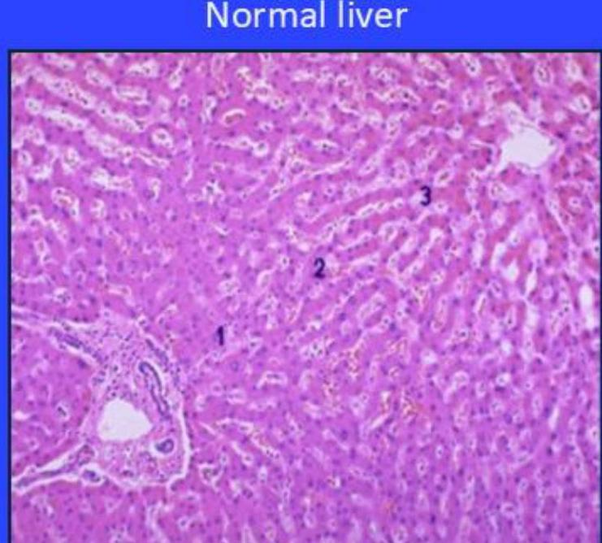
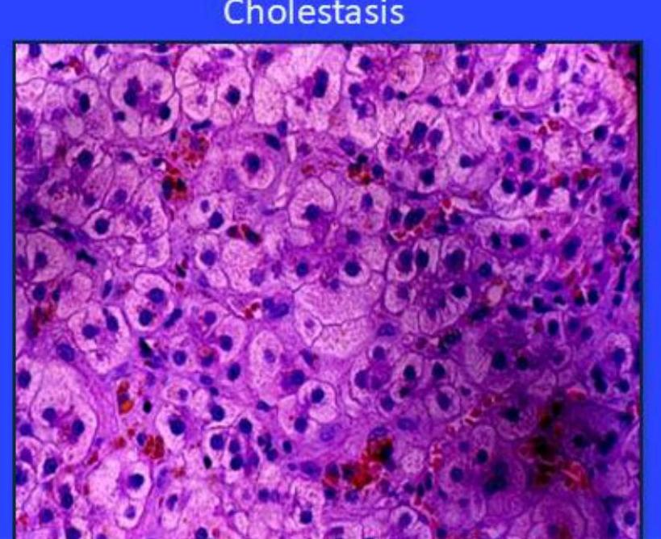

# Parenteral Nutrition (PN): Complications and Monitoring

--- page 1 ---

# Overview 

- Cases
- Complications
- Nutrition excess and deficiencies
- Refeeding syndrome
- Metabolic bone disease (MBD)
- Intestinal failure associated liver disease (IFALD)
- Renal disease
- Central venous access
- Central line complications
- Central line associated blood stream infections (CLABSIs)
- Cases: review

--- page 2 ---

# Introduction 

- PN can be life-saving but has several complications
- Metabolic
- Catheter-related
- Infectious
- Non-infectious
- Liver disease
- Progress has been made to ensure PN is safer and more effective
- Patients on PN require careful monitoring
- Growth and anthropometric measurements
- Laboratory
- The practitioner must be aware of the risks of PN and be able to monitor the patients adequately

--- page 3 ---

# Case \#1 

- A 2-year-old boy with short bowel syndrome ( 70 cm of jejunum anastomosed to the transverse colon) is on home PN and is extremely cholestatic with total bilirubin 50, direct bilirubin $27 \mathrm{mg} / \mathrm{dl}$
- Copper had been removed from his PN because of the cholestasis
- He presents with microcytic anemia (Hb $6.3 \mathrm{~g} / \mathrm{dL}$ ) requiring weekly transfusions. There is also mild leukopenia and thrombocytopenia
- Investigation
- Abdominal ultrasound with doppler: no portal hypertension
- Fecal occult blood negative
- Folate, vitamin B12, vitamin E: normal
- Bone marrow biopsy: changes compatible with myelodysplasia
- What would you do?

--- page 4 ---

# Case \#2 

- During a regular follow up, the parents of a 12-year-old patient on home PN mentions that she has had 3 episodes of fever in the past 2 weeks
- There are no other symptoms, fever resolves spontaneously within 1 hour and they elected not to seek medical care
- When questioned, they mention that the episodes of fever seem to occur shortly after they connect her PN. She is currently well with no fever
- What is your next step?

--- page 5 ---

# Case #3

- An 8-year-old M with short bowel syndrome on long term PN is tolerating only small amounts of elemental formula
- Patient is on PN with SMOFlipid ${ }^{\circledR}$ and multivitamins daily
- He receives $2 \mathrm{mEq} / \mathrm{kg}$ of calcium (rec: $0.5-4 \mathrm{mEq} / \mathrm{kg}$ ) in PN
- Laboratory testing yields the following results

|  - Vit A | $67 \mathrm{mcg} / \mathrm{dL}$ | $(26-49)$  |
| --- | --- | --- |
|  - Vit D | $18 \mathrm{ng} / \mathrm{dL}$ | $(30-100)$  |
|  - Vit E | $16 \mathrm{mg} / \mathrm{L}$ | $(4.6-14.8)$  |
|  - Calcium | $8.5 \mathrm{mg} / \mathrm{dL}$ | $(8.8-10.1)$  |
|  - Albumin | $2.5 \mathrm{~g} / \mathrm{dL}$ | $(3.8-5.4)$  |

- What adjustments do you make to his PN and supplements?

--- page 6 ---

# Metabolic Complications: Nutrient Excess/Deficiency 

- Caloric needs should be evaluated according to age-related requirements and adjusted to the patient's specific requirements
- Catch-up growth
- Conditions that may increase needs (surgery, chronic disease, burn, trauma etc.)
- Conditions with increased losses
- PN needs are generally 10-15\% lower than EN needs
- Overfeeding has been linked to PN associated liver disease
- Underfeeding leads to growth failure

--- page 7 ---

# Metabolic Complications: Nutrient Excess/Deficiency 

- Glucose
- Excess glucose may cause hyperglycemia, hyperosmolarity and osmotic diuresis
- Hypercarbia may also occur as well as increased risk of sepsis
- Inadequate glucose infusion ( $<2 \mathrm{mg} / \mathrm{kg} / \mathrm{min}$ ) may cause ketosis, since fat is mobilized for energy
- Lipids
- Excess lipids may cause hypertriglyceridemia and ketosis
- Inadequate lipid provision may lead to essential fatty acid deficiency
- Lipid infusion rate goal: $<0.15 \mathrm{~g} / \mathrm{kg} / \mathrm{hour}$

--- page 8 ---

# Metabolic Complications: Nutrient Excess/Deficiency

- Glucose infusion rate (GIR) is a measure of the rate in which a patient receives intravenous dextrose
- Calculating GIR
- Grams of carbohydrate $\times 1000 \div$ patient weight $(\mathrm{kg}) \div$ number of minutes PN infuses (example: 1440 minutes for 24 -hour infusion)

|  Age (Years) | Goal GIR (mg/kg/min)  |
| --- | --- |
|  Preterm Infant | $\sim 12$  |
|  Term Infant | $10-14$  |
|  Child (1-10 years) | $8-10$  |
|  Adolescent (> 10 years) | $5-6$  |

--- page 9 ---

# Metabolic Complications: Nutrient Excess/Deficiency 

- Electrolytes
- PN should not be used to correct metabolic disturbances
- Fluid output and intake should be monitored to avoid fluid overload and dehydration especially when patients have significant losses (emesis, diarrhea, burn)
- Urinary sodium should be monitored in patients with excessive losses since inadequate sodium intake affects growth
- Serum sodium should be between 135 and 145 mmol/L
- Urinary sodium should be $>30 \mathrm{mmol} / \mathrm{L}$

--- page 10 ---

# Metabolic Complications: Nutrient Excess/Deficiency 

- Trace elements
- Zinc often needs to be supplemented in patients with excessive GI losses
- Selenium deficiency may occur in patients on long-term PN
- Chromium is a contaminant and may accumulate affecting glucose metabolism
- Copper is excreted in bile and can accumulate in patients with cholestasis
- Parenteral manganese has high bioavailability and is cleared through the liver, increasing the risk for overload in patients with hepatic dysfunction. Manganese accumulation in the central nervous system may cause neurological problems

--- page 11 ---

# Metabolic Complications: Refeeding Syndrome 

- Severe shifts in fluids and electrolytes that may occur in malnourished patients receiving artificial feedings (either enterally or parenterally)
- Manifestations include
- Hypophosphoremia
- Hypomagnesemia
- Thiamine deficiency
- Cardiac arrythmia
- Hypokalemia
- Hyperglycemia
- Fluid overload leading to congestive heart failure and pulmonary edema
- Respiratory failure

--- page 12 ---

# Management of Refeeding Syndrome 

- Identification of patients at risk
- Low BMI
- Significant weight loss
- Little or no nutritional intake in the past 5-10 days
- Preexisting hypokalemia, hypophosphoremia and hypomagnesemia
- Monitor electrolytes several times a day after initiation of PN until stable
- Stabilize electrolytes before initiating PN
- Start with providing 50-75\% estimated energy needs or give current intake
- Increase calories by 10-20\% daily until goal reached
- Supplement thiamine
- Supplement phosphorus as needed

--- page 13 ---

# Metabolic Complications: Bone Disease 

- The term Metabolic Done Disease (MBD) includes several conditions including rickets, osteomalacia, osteoporosis
- Reduction of bone mineral density may be evident before clinical signs appear
- Diagnosis relies on dual-energy X-ray absorptiometry (DEXA)
- Multifactorial pathogenesis
- Malabsorption of Ca, Phos, Mg
- Decreased physical activity
- Vit D deficiency
- Toxicity of some PN components such as aluminum
- Underlying inflammatory condition

--- page 14 ---

# Metabolic Complications: Bone Disease 

- Risk higher in growth failure and longer PN duration
- Possibility of MBD remains significant even when enteral autonomy is achieved
- Monitoring
- Annual DEXA with adequate correction for anthropometric measures
- Careful evaluation of calcium balance and vitamin D
- Treatment
- Adequate Ca, Phos, Mg and vitamin D
- Weight bearing exercise
- Change medications (such as diuretics), if possible
- Referral to a bone specialist and consider use of bisphosphonates

--- page 15 ---

# Complications: IFALD 

- Intestinal failure associated liver disease (IFALD) is a well described complication of PN
- Risk factors
- Prolonged duration of PN
- Prematurity
- Short Bowel Syndrome
- Reduced enterohepatic circulation
- Use of soybean lipid emulsion, phytosterols
- Lack of enteral feedings
- Recurrent sepsis
- Bacterial overgrowth
- Overfeeding

--- page 16 ---

# **Complications: IFALD**

- Range of injury
  - Gallstones
  - Gallstones
  - Cholestasis
  - Steatosis
  - Cirrhosis and liver failure

--- page 17 ---

# Complications: IFALD Management 

- Cycling PN as soon as metabolic and fluid status allows
- Continuous infusion of dextrose can be associated with high levels of insulin which may contribute to hepatic steatosis
- Maximize enteral nutrition if tolerated
- Limit intravenous lipid emulsion (ILE) to $1 \mathrm{~g} / \mathrm{kg} /$ day for long-term PN if possible

--- page 18 ---

# Complications: IFALD Management - Cont'd 

- Limit soybean oil ILE and use alternate lipid solution
- Pure soybean-based lipid emulsions should be avoided in the presence of cholestasis
- The use of mixed lipid emulsions may be encouraged for patients on long term PN
- Fish-oil based lipids should be considered if other strategies fail
- Treat bacterial overgrowth
- Ursodeoxycholic acid may be considered in the presence of biochemical signs of cholestasis

--- page 19 ---

# Complications: Renal Disease 

- Renal disease in patients with SBS is multifactorial
- Chronic dehydration and electrolyte imbalances
- Recurrent sepsis
- Nephrocalcinosis
- Nephrotoxic effect of medications
- Management
- Avoidance of dehydration
- Regular renal ultrasound should be obtained
- Glomerular Filtration rate should be monitored in patients at risk

--- page 20 ---

# Central Venous Access 

- The maximum osmolarity that can be administered in a peripheral vein in $900 \mathrm{mOsm} / \mathrm{L}$
- The osmolarity of an intravenous solution can be calculated using the equation:

$$
\mathrm{mOsm} / \mathrm{L}=(\mathrm{AA} \mathrm{~g} / \mathrm{L} \times 10)+(\text { dextrose } \mathrm{g} / \mathrm{L} \times 5)+([\mathrm{mEq} \mathrm{Na}+\mathrm{mEq} \mathrm{~K}] \times 2) / \mathrm{L}+(\mathrm{mEq} \mathrm{Ca} \times 1.4) / \mathrm{L}
$$

- PN is usually administered through a central venous catheter whose tip is in the distal vena cava to allow administration of a solution with a higher osmolarity and provide adequate caloric intake
- Peripherally inserted central catheter (PICC line)
- Tunneled cuffed central catheter (Broviac/Hickman)
- Implanted port (Port-o-cath)

--- page 21 ---

# Central Line Complications: Mechanical 

- Pneumo/hemothorax
- Hematoma
- Malposition
- Arrhythmia, perforation of the heart
- Non thrombotic occlusion (precipitates, kink)
- Extravasation of infusate into surrounding tissues

--- page 22 ---

# Central Line Complications: Thrombosis 

- Venous thrombosis may result in loss of venous access in patients on long-term PN
- Most thromboses are asymptomatic
- Prevention
- Adequate care of the line
- Avoid drawing blood from catheter
- Annual doppler ultrasound of vascular access may not detect thrombosis, consider CT or MRV
- In patients on long-term PN who have lost vascular access because of a thrombus, consider prophylactic anticoagulation with low molecular weight heparin

--- page 23 ---

# Central Line Complications: Thrombosis 

- Diagnosis
- Ultrasound is non-invasive and easy to perform but may not be adequate for diagnosis of subclavian and superior vena cava thrombosis
- If the ultrasound is negative and clinical suspicion is high, venography may be required for accurate diagnosis
- Management
- Thrombotic central line occlusion and central line related thrombosis require thorough investigation and treatment
- Fibrinolytics such as alteplase is the drug class of choice to restore line patency of thrombus-occluded catheters
- The recommended management of acute and symptomatic catheter-related thrombosis usually requires antithrombotic medication

--- page 24 ---

# Central Line Complications: Infections / CLABSIs 

- Central Line Associated Bloodstream Infections (CLABSIs) are a significant cause of mortality and morbidity in patients on PN
- Incidence of CLABSI in pediatric patients is between 3.8-11.3/1000 catheter days
- Causes
- Colonization of biofilm
- Skin contamination
- Bacterial translocation
- Contaminated PN solution

--- page 25 ---

# Central Line Complications: Infections / CLABSIs Prevention 

- Sterile technique during placement
- Use line only for PN and not for blood draws
- Dressing changes per protocol
- Tubing changes for dextrose AA solutions and IV lipid
- Avoid multi-lumen catheters
- Avoid catheters in groin/diaper area

--- page 26 ---

# Central Line Complications: Infections / CLABSIs - Lock Therapy 

- Ethanol lock
- Significantly reduces CLABSI
- Concerns with precipitate formation in catheters and shortages
- Taurolidine lock
- Used mostly in Europe with good results
- Antibiotic lock
- May induces resistances to antibiotics
- 4\% EDTA lock (Kite lock)
- Approved in Canada
- Non-antibiotic, anti-bacterial, anti-coagulant, anti-biofilm
- Significantly reduces the rate of CLABSI

--- page 27 ---

# Central Line Complications: Infections / CLABSIs Management 

- Any fever (>38.5) in a patient with a central line is considered a CLABSI until proven otherwise
- Blood cultures should be taken from both the CVC and a peripheral vein before starting antibiotic
- Empirical antibiotic therapy should include coverage for cutaneous as well as intestinal bacteria
- The duration of antimicrobial therapy for CLABSI with retained catheter is generally 10-14-days
- Central line should be removed if there is clinical deterioration, persisting or relapsing bacteremia, or complications and with some infectious agents (s aureus, pseudomonas or candida)

--- page 28 ---

# Monitoring: Anthropometrics 

- Weight
- Obtain naked under the age of 2 years
- Children 2 years and older should be in light clothing without shoes
- Length/Height
- Use length board for children $\leq 2$ years
- Obtain standing height for children $>2$ years
- Use adult length board or alternate measure of height for older children unable to stand
- Head Circumference
- Measured until 3 years of age
- Mid-Upper Arm Circumference
- Useful when weight skewed by fluid retention, casts or other medical devices

--- page 29 ---

# Monitoring: Anthropometrics 

- Physical Exam
- Presence/absence of edema
- Cardiac status
- Liver size, jaundice
- Neurologic status
- Central venous catheter insertion sites
- Daily Monitoring
- Weight
- Weekly Monitoring
- Length or height
- Head circumference

--- page 30 ---

# Monitoring: Labs and Radiology 

- Laboratory measurements must be obtained at baseline and periodically after initiation of PN
- Electrolytes, calcium, phosphorus, magnesium, blood glucose, albumin
- Renal function
- Liver function
- Vitamins and oligoelements
- Iron status
- Radiological monitoring includes
- Chest X-ray to assess positioning of the central line
- Bone densitometry
- Abdominal ultrasound
- Doppler of the veins or venography

--- page 31 ---

# Monitoring: Labs and Radiology

|  Parameter | Initially / Hospitalized | Home PN  |
| --- | --- | --- |
|  Electrolytes, glucose, acid-base status, triglycerides | Daily to weekly | Monthly  |
|  Calcium, phosphorus, magnesium | Twice weekly | Monthly  |
|  BUN/creatinine | Weekly | Monthly  |
|  Albumin | Weekly | Monthly  |
|  Prealbumin | Weekly | Monthly  |
|  Liver function (ALT, GGT, ALP, bilirubin) | Weekly | Monthly  |
|  Complete blood count | Weekly | Monthly  |
|  Ferritin, \% saturation | As indicated | Monthly  |
|  PTT | As indicated | Monthly  |
|  TSH |  | Every 3 months  |

--- page 32 ---

# Monitoring: Labs and Radiology - Cont'd

|  Parameter | Initially / Hospitalized | Home PN  |
| --- | --- | --- |
|  Trace elements ( $\mathrm{Zn}, \mathrm{Mn}, \mathrm{Cu}$ and ceruloplasmin, $\mathrm{Se}, \mathrm{Cr}$ ) |  | Biannually to annually  |
|  Vitamins (folate, B12, A, 25-OH-D, E) |  | Biannually to annually  |
|  Carnitine | As indicated | Biannually to annually  |
|  CRP | As indicated | As indicated  |
|  Urinary sodium | As needed if excessive losses | As needed if excessive losses  |
|  Liver ultrasound |  | Annually  |
|  Bone densitometry |  | Annually  |
|  Vascular ultrasound |  | Annually  |
|  Chest X-ray to assess position of central line | At placement | As needed  |

--- page 33 ---

# Case \#1 

- A 2-year-old boy with short bowel syndrome ( 70 cm of jejunum anastomosed to the transverse colon) is on home PN and is extremely cholestatic with total bilirubin 50, direct bilirubin $27 \mathrm{mg} / \mathrm{dl}$
- Copper had been removed from his PN because of the cholestasis
- He presents with microcytic anemia ( $\mathrm{Hb} 6.3 \mathrm{~g} / \mathrm{dL}$ ) requiring weekly transfusions. There is also mild leukopenia and thrombocytopenia
- Investigation
- Abdominal ultrasound with doppler: no portal hypertension
- Fecal occult blood negative
- Folate, vitamin B12, vitamin E: normal
- Bone marrow biopsy: changes compatible with myelodysplasia
- What would you do?

--- page 34 ---

# Case \#1: Review 

- A 2-year-old boy with short bowel syndrome ( 70 cm of jejunum anastomosed to the transverse colon) is on home PN and is extremely cholestatic with total bilirubin 50, direct bilirubin 27 mg/dl
- A copper level was done. Copper was nearly undetectable
- Copper was added to PN and anemia, thrombocytopenia, and leucopenia resolved
- In case of copper deficiency, finds on bone marrow may mimic myelodysplastic syndrome
- Abdominal ultrasound with doppler: no portal hypertension
- Fecal occult blood negative
- Folate, vitamin B12, vitamin E: normal
- Bone marrow biopsy: changes compatible with myelodysplasia
- What would you do?

--- page 35 ---

# Case \#2 

- During a regular follow up, the parents of a 12-year-old patient on home parenteral nutrition mention that she has had 3 episodes of fever in the past 2 weeks
- There are no other symptoms, fever resolves spontaneously within 1 hour and they elected not to seek medical care
- When questioned, they mention that the episodes of fever seem to occur shortly after they connect her PN. She is currently well with no fever
- What is your next step?

--- page 36 ---

# Case \#2: Review 

- During a cardiac follow up, the parents of a 12-year-old patient on some part - A blood culture was done from the catheter and a peripheral vein - catheter : Candida parapsilosis
- Peripheral vein: negative
- The patient may detach and cause spikes of fever
- A high index of suspicion is necessary when it comes to fever in a patient with a central line
- The patient was admitted and treated with anti-fungal and the central line was replaced

--- page 37 ---

# Case #3

- An 8-year-old M with short bowel syndrome on long term PN is tolerating only small amounts of elemental formula
- Patient is on PN with SMOFlipid ${ }^{\circledR}$ and multivitamins daily
- He receives $2 \mathrm{mEq} / \mathrm{kg}$ of calcium (rec: $0.5-4 \mathrm{mEq} / \mathrm{kg}$ ) in PN
- Laboratory testing yields the following results

|  - Vit A | $67 \mathrm{mcg} / \mathrm{dL}$ | $(26-49)$  |
| --- | --- | --- |
|  - Vit D | $18 \mathrm{ng} / \mathrm{dL}$ | $(30-100)$  |
|  - Vit E | $16 \mathrm{mg} / \mathrm{L}$ | $(4.6-14.8)$  |
|  - Calcium | $8.5 \mathrm{mg} / \mathrm{dL}$ | $(8.8-10.1)$  |
|  - Albumin | $2.5 \mathrm{~g} / \mathrm{dL}$ | $(3.8-5.4)$  |

- What adjustments do you make to his PN and supplements?

--- page 38 ---

# Case \#3: Review 

- A Interventions
- Vit A
- Vit A toxicity leads to complications including liver damage
- Plan: Decrease parenteral MVI to 3 days/week and recheck level in 3 months.
- Vit D
- B
- Begin $75 \mathrm{IU} / \mathrm{kg}$ vitamin D enterally or as dissolvable quick melt.
- Vit E
- Elevated levels are common with patients on SMOF.
- Decreasing MVI to 3 days/week will address elevated vit E.
- Calcium
- Correct calcium for low albumin.
- Equation $=0.8(4(\mathrm{nl}$ albumin $)-2.5$ (pt's albumin $))=1.2+8.5$ (serum Ca) $=9.7$.
- Pt's Ca dose is within rec'd range. Corrected level is normal. No intervention required.

--- page 39 ---

# Conclusion 

- A multidisciplinary team should be involved in the initiation and the follow up of patients on PN
- Physician
- Dietitian
- Nurse
- Pharmacist
- Surgeon
- Interventional radiologist
- With adequate monitoring PN can be administered safely and complications can be minimized