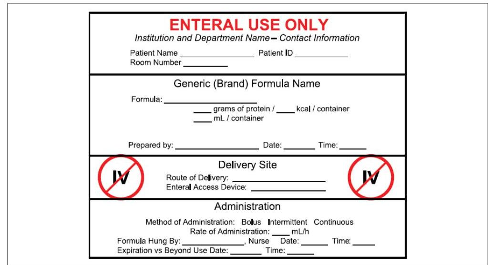

# NUTRITION SUPPORT CERTIFICATE 

## Enteral Nutrition

## Products

Planned by the American Society of Health-System Pharmacists (ASHP) in collaboration with the American Society for Parenteral and Enteral Nutrition (ASPEN).
(c)2022 American Society of Health-System Pharmacists, Inc. All rights reserved.

No part of this publication may be reproduced or transmitted in any form or by any means, electronic or mechanical, including photocopying, microfilming, and recording, or by any information storage and retrieval system, without written permission from the American Society of Health-System Pharmacists.

--- page 1 ---

# ENTERAL AND PARENTERAL PRODUCT PREPARATION AND DISTRIBUTION ENTERAL NUTRITION 

Anne M. Tucker, Pharm.D., BCNSP
University of Texas MD Anderson Cancer Center

NUTRITION SUPPORT CERTIFICATE

## RELEVANT FINANCIAL RELATIONSHIP DISCLOSURE

No one in control of the content of this activity has a relevant financial relationship (RFR) with an ineligible company.

As defined by the Standards of Integrity and Independence in Accredited Continuing Education definition of ineligible company. All relevant financial relationships have been mitigated prior to the CPE activity.

--- page 2 ---

# LEARNING OBJECTIVES 

- Compare the differences between preparing closed- vs. open-system enteral nutrition products.
- Review safe practices for labeling enteral and parenteral nutrition products.
- Identify safe transition practices in patient care from hospital to home for enteral and parenteral nutrition products.

## KEY ABBREVIATIONS

- ASPEN:
- DOB:
- EN:
- ID:
- PN:
- RTU:

American Society for Parenteral and Enteral Nutrition
date of birth
enteral nutrition
identification
parenteral nutrition
ready to use

--- page 3 ---

# SELF-ASSESSMENT \#1 

An institution's nutrition support team has noticed an increase in the incidence of diarrhea in critically ill patients receiving enteral nutrition since institution of a new enteral nutrition formulary requiring nurses to decant enteral formulations from cans into containers prior to administration. Nursing refills EN administration containers every 8 hours with fresh enteral formula. Which of the following is the likely cause of this occurrence?
A. Use of an open enteral formula system.
B. Use of ready to hang EN product.
C. Use of EN formulas beyond specified hang time.
D. Use of EN in sicker patients.

## SELF-ASSESSMENT \#2

It is determined that a patient will go home on PN as the primary means of nutrition. The patient had a central venous catheter placed prior to initiating PN and has been receiving PN at goal regimen for 4 days. Which of the following is MOST appropriate in an effort to provide a safe transition home?
A. Provide patient and caregiver home PN education on the day of discharge.
B. Contact home infusion company to determine stock products and potential shortages.
C. Allow home infusion company to provide patient and caregiver education.
D. Change nutrition support formulation upon transition to home or alternative care site.

--- page 4 ---

# ENTERAL NUTRITION SYSTEMS AND PREPARATION 

## ENTERAL NUTRITION

- Provision of nutrients to the gastrointestinal tract through the use of an enteral access device
- 250,000 hospitalized patients are supported using enteral nutrition
- Used in a variety of settings
- Hospital $\rightarrow$ long term care / rehab $\rightarrow$ home

--- page 5 ---

# INDICATIONS 

- Patients with or expected to have prolonged inadequate oral intake
- Functional gastrointestinal tract and clinical condition(s) for which oral intake is
- Impossible (intubated, unable to swallow or protect airway)
- Inadequate (poor appetite; high metabolic demands; unable to eat enough)
- Unsafe (confused, altered mental status)

## CLOSED SYSTEM

- Sterile container or bag, pre-filled with sterile, liquid enteral formula by the manufacturer
- Considered ready to administer products ("ready to hang")
- Large volume bags or containers ( 1000 mL and 1500 mL )
- Longer hang time: 24 to 48 hours
- Administration sets/tubing must be changed every 24 hours
- Per manufacturer, no more than 1 tubing spike per container/bag
- Less contamination risk (infection), less diarrhea
- Addition of medications and modular products not recommended
- Reduced nursing time

--- page 6 ---

# OPEN SYSTEM 

- Enteral system in which the clinician, patient, or caregiver is required to decant formula into an enteral container or bag for administration
- 2 main categories
- Small volume liquid cans, bags and cartons
- Powdered formulas for reconstitution
- Able to add modular products
- Increased nursing time due to preparation
- Increased contamination risk

Boullata Jlet al. JPEN J Parent Enteral Nutr. 2017; 41:15-103.

## SMALL VOLUME LIQUID CANS, BAGS AND CARTONS

- Open system
- Require preparation prior to administration
- Enteral formula is sterile within distribution container
- Decanted into non-sterile bag for administration
- Able to add modular products
- Hang time: 8 hours

--- page 7 ---

# POWDERED FORMULAS 

- Not sterile upon manufacture
- Requires meticulous handling and reconstitution process using sterile water
- Shortest hang time: 4 hours
- Increased infection risk
- Increased nursing time
- Not recommended for immunocompromised patients

Boullata Jlet al. JPEN J Parent Enteral Nutr. 2017; 41:15-103.

## MODULAR SUPPLEMENTS

- Nutritionally incomplete / single nutrient products
- Protein, amino acids
- Carbohydrates
- Fiber
- Fats (medium-chain triglycerides, oral fat emulsion)
- Thickeners
- Can be combined with diet or enteral nutrition to meet nutrient(s) requirement
- Liquid and powder products
- Typically given as a "flush" to enteral nutrition patients

--- page 8 ---

# FORMULA CONTAMINATION 

- High incidence
- Up to $57 \%$ of formulas prepared in hospitals
- Over $80 \%$ of formulas prepared in the home setting
- Steps associated with contamination risk
- When the feeding is transferred to the administration container
- During preparation, including when modular supplements are added
- During assembly of the feeding system
- During administration to the patient

Boullata Jlet al. JPEN J Parent Enteral Nutr. 2017; 41:15-103.

## FORMULA CONTAMINATION

- Consequences
- Abdominal distension
- Diarrhea
- Nosocomial infections
- Prevention
- Strict aseptic technique during preparation and administration
- Reconstitute powders with sterile water
- Store reconstituted formula in refrigerator immediately; discard after 24 hours
- Discard reconstituted formula at room temperature after 4 hours
- Use formula decanted from screw top instead of flip top

--- page 9 ---

# HANG TIME / BEYOND USE DATING 

- The maximum time enteral formula is considered safe for delivery to the patient
- Begins with the time the formula has either been reconstituted, warmed, decanted, or has had the original package seal broken.
- Differs by system type
- Closed systems: 24-48 hours
- Tubing must be changed every 24 hours or per manufacturer recommendations
- Open systems (small volume cans, bags, cartons): 8 hours
- Reconstituted powdered formulas: 4 hours

Boullata Jlet al. JPEN J Parent Enteral Nutr. 2017; 41:15-103.

## ADVANTAGES AND DISADVANTAGES

## Advantages

- Formula and container are sterilized prior to distribution
- Decreased manipulation
- Decreased human contact
- Reduced contamination $\rightarrow$ infection
- Increased hang time
- Decreased nursing time
- Reduced waste
- Cost effective

Boullata Jlet al. JPEN J Parent Enteral Nutr. 2017; 41:15-103.

## Disadvantages

- Increased product cost
- Standardized product size ( 1000 mL , 1500 mL and 2000 mL sizes) potential increased waste if intolerance or low volume infusions required
- Potential misconnection errors

--- page 10 ---

# LABELING RECOMMENDATIONS 

## LABELING RECOMMENDATIONS

- Express clearly and accurately what the patient is receiving at any time
- Reflect order elements, including expiration or beyond use dates
- Size that fits neatly on the EN product or PN formulation

--- page 11 ---

# ASPEN RECOMMENDATIONS: EN LABEL 

| Labeling of Enteral Formula |  |
| :-- | :-- |
| Patient identifiers (name, DOB, ID) | Date/time enteral formula hung |
| Formula name and strength (if diluted) | Initials of clinician who hung and checked   enteral nutrition against order |
| Date/time enteral formula prepared | Appropriate hang time (expiration date/time) |
| Initials of clinician who prepared EN formula | "Not for IV use", "Enteral use only" |
| Enteral delivery site (route and access device) | Dosing weight, if applicable |
| Administration method, infusion rate, duration (if cycled or intermittent) |  |

Figure 5. Standard enteral nutrition (EN) label template (adult patient). ID, identification; IV, intravenous. Adapted from Bankhead R, Boullata J, Brantley S, et al. Enteral nutrition practice recommendations. JPEN J Parenter Enteral Nutr. 2009;33(2):122-167.

--- page 12 ---

# ASPEN RECOMMENDATIONS - PN LABEL 

| Labeling of Parenteral Nutrition Formulation |  |
| :--: | :--: |
| Two patient identifiers | Patient location or address |
| Dosing weight | Administration date and time |
| Beyond use date (BUD) and time | Route of administration |
| Prescribed volume and overfill volume | Infusion rate ( $\mathrm{mL} / \mathrm{hr}$ ) |
| Duration of infusion (continuous vs. cyclic) | Size of in-line filter (1.2 or 0.22 micron) |
| Complete name of all ingredients | Barcode |
| Ingredients (amounts/day for adults)* | List electrolyte as complete salts |
| Phosphorus as mmol, others as mEq | Patient additives (home PN) |
| Name of pharmacy and contact information | Auxiliary labels or information may be used |

*specify product name, when appropriate
Ayers P et al. JPENJ Parent Enteral Nutr. 2014; 38:296-333.

| Patient Name $\qquad$   Births Average $\qquad$   Patient location $\qquad$   Height and dosing weight $1 / 2$ $\qquad$ cm Dosing Wt. $\qquad$ kg Diagnos(ed) Indications for PN $\qquad$   Vascular access device/location CVV, type $\qquad$ Location $\qquad$   Administration date $\qquad$ Administration time $\qquad$   Macronutrients $\qquad$ Amountrilay   Amino acids* $\qquad$   Dextrose $\qquad$ g   IV Fat emulsion* $\qquad$ g   Electrolytes $\qquad$   Sodium phosphate $\qquad$ mmol of phosphate (Sodium $\qquad$ mEq )   Sodium chloride $\qquad$ mEq   Sodium acetate $\qquad$ mEq   Potassium phosphate $\qquad$ mmol of phosphate (Potassium $\qquad$ mEq )   Potassium chloride $\qquad$ mEq   Potassium acetate $\qquad$ mEq   Magnesium sulfate/chloride $\qquad$   Calcium gluconate $\qquad$   Vitamins, Trace Elements $\qquad$   Multi-component Vitamins* $\qquad$   Multi-component Trace Elements* $\qquad$   Other Additives (eg, individual vitamins or trace elements, regular insulin)   PN Instructions   Pre-Central (peripheral) Skin Administration Only   Total volume $\qquad$ $\qquad$ $\mathrm{mL} \mathrm{C}$ Overfill volume $\qquad$ $\mathrm{mL}$   Infusion rate $\qquad$ $\mathrm{mL} / \mathrm{h}$   Start and Stop times $\qquad$   Cycle information $\qquad$   On-roll use after data/time   ****** Discard any unused volume after 24 hours*****   Prescriber and Contact Information $\qquad$   Institution/Pharmacy Name   Institution/Pharmacy Address   Pharmacy Telephone number

--- page 13 ---

Patient Name Medical Record Number
Birthdate/age
Patient location
Height and dosing weight: HI: cm Dosing WI: kg
Diagnosis(es)/Indication(s) for PN:
Vascular access device/location CVC type Location
Administration date Administration time
Macronutrients Amount/day
Amino acids* g
Dextrose g
IV Fat emulsion* g
Electrolytes
Sodium phosphate mmol of phosphate (Sodium mEq)
Sodium chloride mEq
Sodium acetate mEq
Potassium phosphate mmol of phosphate (Potassium mEq)
Potassium chloride mEq
Potassium acetate mEq
Magnesium sulfate/chloride mEq
Calcium gluconate mEq
Vitamins, Trace Elements
Multi-component Vitamins* mL
Multi-component Trace Elements* mL
Other Additives (eg, individual vitamins or trace elements, regular insulin)
Ayers P et al. JPEN J Parent Enteral Nutr. 2014; 38:296-333.

PN Instructions
For Central (peripheral) Vein Administration Only
Total volume mL Overfill volume mL
Infusion rate mL/h
Start and Stop times
Cycle information
Do not use after date/time
***** Discard any unused volume after 24 hours*****
Prescriber and Contact information
Institution/Pharmacy Name
Institution/Pharmacy Address
Pharmacy Telephone number

Ayers P et al. JPEN J Parent Enteral Nutr. 2014; 38:296-333.

--- page 14 ---

# TRANSITIONS OF CARE 

## TRANSITIONS OF CARE

- Multiple phases
- Transition between institutional levels of care
- Transition from institution to home or alternative care site
- Goals
- Ensure safety and prevention of errors
- Prevent untoward adverse effects or consequences
- Prevent hospital readmission

--- page 15 ---

# TRANSITIONS OF CARE, CONT. 

- Standardized ordering and administration
- Ingredients listed in the same sequence and measurements
- Clear and complete orders
- Accurate documentation for transfer of nutrition orders
- Collaboration among all disciplines and professions involved
- Clinician to clinician communication (EN orders)
- Pharmacist to pharmacist communication (PN orders)
- Determine company stock solutions and product shortages

Ayers P et al. JPENJ Parent Enteral Nutr. 2014; 38:296-333.
Boullata Jlet al. JPEN J Parent Enteral Nutr. 2017; 41:15-103.

## TRANSITIONS OF CARE, CONT.

- Establish tolerance and stability to goal regimen prior to transfer
- Patient and caregiver education
- Evaluation of home or alternative care site

--- page 16 ---

# PATIENT \& CAREGIVER EDUCATION 

- Begin early
- Assess learning styles to provide most effective educational strategy
- Standard checklist
- Nutrition support indication and goals
- Feeding regimen and safe preparation
- How to use infusion pump and supplies needed
- Access device and site care
- Access device flushing, hydration, and how to troubleshoot problems
- Monitoring (weight, temperature, inputs/outputs, labs)
- Recognition of complications including emergency plan \& contacts
- Return demonstration and teach-back method

## PATIENT \& CAREGIVER SUPPORT

- Written and verbal education
- Oley Foundation
- Feeding Tube Awareness Foundation
- Home health company
- Contact numbers for providers

--- page 17 ---

# Self Assessment Questions and Answers 

## SELF-ASSESSMENT \#1

An institution's nutrition support team has noticed an increase in the incidence of diarrhea in critically ill patients receiving enteral nutrition since institution of a new enteral nutrition formulary requiring nurses to decant enteral formulations from cans into containers prior to administration. Nursing refills enteral nutrition administration containers every 8 hours with fresh enteral formula. Which of the following is the likely cause of this occurrence?
A. Use of an open enteral formula system.
B. Use of ready to hang enteral nutrition product.
C. Use of enteral nutrition formulas beyond specified hang time.
D. Use of enteral nutrition in sicker patients.

--- page 18 ---

# SELF-ASSESSMENT \#1 

An institution's nutrition support team has noticed an increase in the incidence of diarrhea in critically ill patients receiving enteral nutrition since institution of a new enteral nutrition formulary requiring nurses to decant enteral formulations from cans into containers prior to administration. Nursing refills enteral nutrition administration containers every 8 hours with fresh enteral formula. Which of the following is the likely cause of this occurrence?
A. Use of an open enteral formula system.
B. Use of ready to hang enteral nutrition product.
C. Use of enteral nutrition formulas beyond specified hang time.
D. Use of enteral nutrition in sicker patients.

## SELF-ASSESSMENT \#2

It is determined that a patient will go home on PN as the primary means of nutrition. The patient had a central venous catheter placed prior to initiating PN and has been receiving PN at goal regimen for 4 days. Which of the following is MOST appropriate in an effort to provide a safe transition home?
A. Provide patient and caregiver home PN education the day of discharge.
B. Contact home infusion company to determine stock products and potential shortages.
C. Allow home infusion company to provide patient and caregiver education.
D. Change nutrition support formulation upon transition to home or alternative care site.

--- page 19 ---

# SELF-ASSESSMENT \#2 

It is determined that a patient will go home on PN as the primary means of nutrition. The patient had a central venous catheter placed prior to initiating PN and has been receiving PN at goal regimen for 4 days. Which of the following is MOST appropriate in an effort to provide a safe transition home?
A. Provide patient and caregiver home PN education the day of discharge.
B. Contact home infusion company to determine stock products and potential shortages.
C. Allow home infusion company to provide patient and caregiver education.
D. Change nutrition support formulation upon transition to home or alternative care site.

## CONCLUSIONS

- Enteral nutrition formulas can be delivered as part of a closed or open system.
- Closed enteral nutrition systems provide decreased contamination risk, reduced nursing time, and can be more cost effective.
- ASPEN recommendations exist for both enteral and parenteral nutrition labeling.
- Clear communication and detailed education can provide a smooth transition of patients from hospital to home or alternative care sites.

--- page 20 ---

# REFERENCES 

- Ayers P, Adams S, Boullata J et al. ASPEN parenteral nutrition safety consensus recommendations. JPEN J Parent Enteral Nutr. 2014; 38:296-333.
- Boullata JI, Carrera AL, Harvey L et al. ASPEN safe practices for enteral nutrition therapy. JPEN J Parent Enteral Nutr. 2017: 41:15-103.
- Herlick S J, Vogt C, Pangman V, Fallis W. Comparison of open versus closed systems of intermittent enteral feeding in two long-term care facilities. Nutr Clin Pract. 2000; 15:287-98.

## REFERENCES, CONT.

- Okuma T, Nakamura M, Totake H et al. Microbial contamination of enteral feeding formulas and diarrhea. Nutrition. 2000; 16(9):719-22.
- Phillips W. Economic impact of switching from an open to a closed enteral nutrition feeding system in an acute care setting. Nutr Clin Pract. 2013; 28(4):510-14.
- Silva SM, Assis MC, Silveira CR et al. Open versus closed enteral nutrition systems for critically ill adults: is there a difference? Rev Assoc Med Bras. 2012; 58(2):229-33.

--- page 21 ---

NUTRITION SUPPORT CERTIFICATE

--- page 22 ---

# Anne M. Tucker, Pharm.D., BCNSP 

Clinical pharmacy Specialist
University of Texas MD Anderson Cancer Center Houston, Texas

Anne M. Tucker is clinical pharmacy specialist at the MD Anderson Cancer Center, Houston, Texas. She received her BS in Chemistry from the University of Arkansas, Pharm.D. from the University of Arkansas for Medical Sciences (UAMS) where she also completed residency training. Dr. Tucker has over 20 years of experience in critical care and nutrition support practice and participates in didactic and experiential training of students and post-graduate trainees. Her areas of interest include fluid and electrolyte disorders, nutrition support in critically ill cancer patients, and the promotion of safe parenteral nutrition practices.

Dr. Tucker is currently the Chair of the American Society for Parenteral and Enteral Nutrition (ASPEN) Abstract Review Committee and President of the Texas Gulf Coast ASPEN Chapter. She is also a member and abstract reviewer for American Society of Health-System Pharmacists and Society of Critical Care Medicine. Past leadership includes Chair and member for the Board of Pharmacy Specialties Nutrition Support Specialty Council, Chair and Secretary of the ASPEN Pharmacy Practice Section, Chair of the ASPEN Self-Assessment Committee, Chair for the ASPEN Task Force for Revision of Nutrition Support Pharmacist Standards, and member of the ASPEN Parenteral Nutrition Safety Committee. She is a regular presenter at Clinical Nutrition Week and was most recently involved as an editor and author of the ASPEN Fluid, Electrolytes and Acid-Base Disorders Handbook.

--- page 23 ---

# Relevant Financial Relationship Disclosure

In accordance with our accreditor’s Standards of Integrity and Independence in Accredited Continuing Education, ASHP requires that all individuals in control of content disclose all financial relationships with ineligible companies. An individual has a relevant financial relationship if they have had a financial relationship with ineligible company in any dollar amount in the past 24 months and the educational content that the individual controls is related to the business lines or products of the ineligible company.

An ineligible company is any entity producing, marketing, re-selling, or distributing health care goods or services consumed by, or used on, patients. The presence or absence of relevant financial relationships will be disclosed to the activity audience.

The following persons in control of this activity’s content have relevant financial relationships:

- Phil Ayers: Fresenius Kabi, consultant and speaker
- David Evans: Fresenius Kabi, consultant and speaker; Abbott Laboratories, consultant and speaker; CVS/OptionCare, consultant; Alcresta, consultant and speaker
- Andrew Mays: Fresenius Kabi, speaker
- Jay Mirtallo: Fresenius Kabi, consultant
- Kris Mogensen: Baxter, speaker; ThriveRx, advisory board; Pfizer, advisory board

All other persons in control of content do not have any relevant financial relationships with an ineligible company.

As required by the Standards of Integrity and Independence in Accredited Continuing Education definition of ineligible company, all relevant financial relationships have been mitigated prior to the CPE activity.

# Methods and CE Requirements

This online activity consists of a combined total of 12 learning modules. Pharmacists and physicians are eligible to receive a total of 20 hours of continuing education credit by completing all 12 modules within this certificate.

Participants must participate in the entire activity, complete the evaluation and all required components to claim continuing pharmacy education credit online at ASHP Learning Center http://elearning.ashp.org. Follow the prompts to claim credit and view your statement of credit within 60 days after completing the activity.

# Important Note – ACPE 60 Day Deadline:

Per ACPE requirements, CPE credit must be claimed within 60 days of being earned. To verify that you have completed the required steps and to ensure your credits have been reported to CPE Monitor, check your NABP eProfile account to validate that your credits were transferred successfully before the ACPE 60-day deadline. After the 60 day deadline, ASHP will no longer be able to award credit for this activity.

# System Technical Requirements

Courses and learning activities are delivered via your Web browser and Acrobat PDF. Users should have a basic comfort level using a computer and navigating websites.

View Frequently Asked Questions for more information.