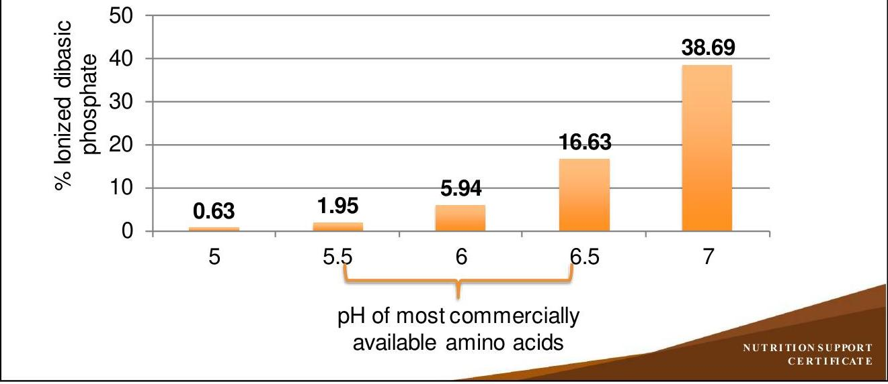

# NUTRITION SUPPORT CERTIFICATE 

## Parenteral Nutrition

## Products

Planned by the American Society of Health-System Pharmacists (ASHP) in collaboration with the American Society for Parenteral and Enteral Nutrition (ASPEN).
©2022 American Society of Health-System Pharmacists, Inc. All rights reserved.
No part of this publication may be reproduced or transmitted in any form or by any means, electronic or mechanical, including photocopying, microfilming, and recording, or by any information storage and retrieval system, without written permission from the American Society of Health-System Pharmacists.

--- page 1 ---

# PRODUCT PREPARATION AND DISTRIBUTION PARENTERAL NUTRITION 

Todd W. Canada, Pharm.D., BCNSP, BCCCP, FASHP, FTSHP, FASPEN
University of Texas MD Anderson Cancer Center

NUTRITION SUPPORT CERTIFICATE

## RELEVANT FINANCIAL RELATIONSHIP DISCLOSURE

No one in control of the content of this activity has a relevant financial relationship (RFR) with an ineligible company.

As defined by the Standards of Integrity and Independence in Accredited Continuing Education definition of ineligible company. All relevant financial relationships have been mitigated prior to the CPE activity.

--- page 2 ---

# LEARNING OBJECTIVES 

- Recommend strategies for handling parenteral nutrition product shortages.
- Assess the parenteral nutrition compatibility issues for a given formulation.
- Differentiate between stability concerns for 2-in-1 parenteral nutrition versus total nutrient admixture formulations.
- Describe educational instruction techniques for home preparation of parenteral nutrition.

## KEY ABBREVIATIONS

- ACD:
- EFAD:
- FDA:
- GI:
- H2:
- HPN:
- ILE:
- IV:
- L:
- PN:
- TNA: automated compounding device
essential fatty acid deficiency
U.S. Food and Drug Administration
gastrointestinal
histamine-2
home parenteral nutrition
lipid injectable emulsion
intravenous
liter
parenteral nutrition
total nutrient admixture

--- page 3 ---

# SELF-ASSESSMENT \#1 

A 54-year-old thin female ( $51 \mathrm{~kg}, 5^{\prime} 5^{\prime \prime}$ ) with a history of short bowel syndrome requiring her to be on long-term PN for the past 10 years is informed by her homecare pharmacy there is a national shortage of IV multivitamins. Which of the following doses of IV multivitamins would be MOST appropriate to use in this patient?
A. Continue same 10 mL daily dose until the supply is exhausted
B. Only provide 10 mL on Mondays each week
C. Only provide 10 mL on Mondays, Wednesdays and Fridays each week
D. Switch to standard dose of oral multivitamin 3 days per week

## SELF-ASSESSMENT \#2

A 69-year-old diabetic male with bowel obstruction from colon cancer is to be sent home on PN. During the cycling of his PN in the hospital, he has required 30 units of regular insulin to be added to his PN to maintain glucoses in the 130-150 mg/dL range. One week after discharge, his caregiver reports his finger stick glucose readings have been in the $60-80 \mathrm{mg} / \mathrm{dL}$ range. What is the most likely reason for the change in his glycemic control?
A. Stress of being hospitalized has resolved and his insulin needs are lower.
B. His HPN formulation was incorrectly compounded with less dextrose than in the hospital.
C. He is not receiving his HPN daily as instructed.
D. He has received more insulin than prescribed.

--- page 4 ---

# STRATEGIES FOR MANAGING PN PRODUCT SHORTAGES 

- PN product shortages have occurred since 1988
- Mostly isolated to IV multivitamins
- Deaths from thiamine deficiency resulting in refractory lactic acidosis
- 2010-2011 shortages resulted in almost every PN component used
- FDA regulations, inspections, recalls, issues with raw materials, demand, loss of manufacturing sites and quality issues
- Substitute PN products must be evaluated for compatibility/stability with other ingredients in PN admixtures. Carefully identify therapeutic equivalents:
- Communicate information to clinical staff
- Prioritize patients and manage inventory

Holcombe B et al. Nutr Clin Pract. 2018; 33(1):53-61.

## MANAGING PN PRODUCT SHORTAGES - AMINO ACIDS

- Amino acids shortage strategies:
- Reserve high (e.g., > 10\%) concentration amino acids for fluid-restricted PN patients
- Review entire portfolio of amino acids products available nationally
- Other concentrations may be available (e.g., 8.5\%)
- Different brands of amino acids products are not always substitutable
- Different pH , calcium-phosphate solubility, amounts of phosphate and other electrolytes (e.g., sodium, acetate, chloride)
- Compound in a single, central location to decrease inventory waste
- Evaluate need for each amino acid product on ACD

--- page 5 ---

# MANAGING PN PRODUCT SHORTAGES - ILE 

- ILE shortage strategies:
- Prioritize supply of soybean oil ILE
- Hospitalized patients on PN for $>2$ weeks
- Home or long-term patients on PN
- 100 g weekly for EFAD prevention
- Critically ill patients on PN receiving propofol do NOT require additional ILE for EFAD prevention
- Propofol is formulated in 10\% soybean oil ILE
- Consider using an alternative ILE containing soybean oil
- Monitor PN patients for risk of developing EFAD

Plogsted S et al. Nutr Clin Pract. 2017;32(3):427-29.

## MANAGING PN PRODUCT SHORTAGES - ELECTROLYTES

- Electrolytes and minerals shortage strategies:
- Consider switching to oral or enterally administered electrolyte or mineral supplement products when feasible
- Malabsorption syndromes or nonfunctional Gl tract may preclude use
- Reserve IV electrolyte and mineral products for patients requiring PN
- Therapeutic medical need for IV electrolyte and mineral products
- Reconsider use of serum electrolyte algorithms or protocols in asymptomatic patients to conserve inventory
- Assess PN patient population to determine if a standardized, commerciallyavailable PN product with electrolytes would be appropriate

--- page 6 ---

# MANAGING PN PRODUCT SHORTAGES - MULTIVITAMINS 

- IV Multivitamin shortage strategies:
- Reserve for patients receiving solely PN or therapeutic medical need
- Ration to dosing 3 times a week to conserve inventory
- Monitor for vitamin deficiencies during rationing
- Complete shortage - use individual thiamine, ascorbic acid, pyridoxine, folic acid, cyanocobalamin, vitamin K
- Consider switching to oral or enterally administered multivitamins when feasible
- Review vitamin profile of each product to be used for completeness
- Higher doses may be required in malabsorption syndromes

Plogsted S et al. Nutr Clin Pract. 2016; 31(4):556-9.

## MANAGING PN PRODUCT SHORTAGES - TRACE ELEMENTS

- IV trace elements shortage strategies:
- Reserve for patients receiving solely PN or therapeutic medical need
- Ration to dosing 3 times a week to conserve inventory
- Complete shortage - use individual zinc, selenium, copper
- Monitor for trace element deficiencies
- Consider switching to oral or enterally administered multitrace supplements when feasible
- Review trace element profile of each product to be used for completeness
- Higher doses may be required in malabsorption syndromes

--- page 7 ---

# APPRAISINGPN COMPATIBILITY ISSUES 

- Determine final concentrations:
- Dextrose 16\%, Amino Acids 5.5\%, ILE $2.3 \%$
- 206 mEq Sodium/L
- 99 mEq Potassium/L
- 305 mEq/L of monovalent cations
- 45 mmol Phosphate/L
- 7 mEq Magnesium/L
- 6 mEq Calcium/L
- 13 mEq/L of divalent cations

## APPRAISINGPN COMPATIBILITY ISSUES, CONT.

- It is recommended that TNAs maintain final concentrations of monohydrated dextrose $\geq 10 \%$, amino acids $\geq 4 \%$, ILE $\geq 2 \%$ to be more likely to remain stable for up to 30 hours at room temperature $\left(25^{\circ} \mathrm{C}\right)$ or for 9 days refrigerated $\left(5^{\circ} \mathrm{C}\right)$ followed by up to 24 hours at room temperature
- Current TNA formulation meets these recommendations
- Sodium content is recommended to have a maximum of $150 \mathrm{mEq} / \mathrm{L}$
- Current TNA has 206 mEq sodium/L
- Also exceeds recommended 1-2 mEq/kg/day at 5.6 mEq sodium/kg/day
- Potassium content recommended is 1-2 mEq/kg/day
- Current TNA provides 2.7 mEq potassium $/ \mathrm{kg} /$ day

--- page 8 ---

# APPRAISINGPN COMPATIBILITY ISSUES, CONT. 

- Commercially available ILEs are stabilized with egg yolk phosphatides providing a mechanical and electrical barrier to particle coalescence
- Phospholipid mixture imparts negative surface (anionic surfactant) charge on emulsified lipid particles and prevents coalescence by inducing electrostatic repulsion
- Addition of cations to a TNA neutralize the negative charge on the surface of the lipid particles and lead to loss of the electrostatic and mechanical barrier created by the anionic surfactant
- Monovalent $=$ Sodium + Potassium
- Divalent $=$ Magnesium + Calcium
- Trivalent $=$ Iron dextran (greatest impact on destabilization)

Boullata Jlet al. JPEN J Parenter Enteral Nutr. 2014; 38(3):334-77.
Driscoll DF et al. AmJ Health-Syst Pharm. 1995;52:623-34.

## APPRAISINGPN COMPATIBILITY ISSUES, CONT.

- Commercially available ILEs may exhibit the following characteristics:
- Creaming occurs when the electrostatic barrier is neutralized
- Single lipid droplets form aggregates and migrate to surface of the TNA
- Described as dense white color at the top of a TNA
- Heavy creaming occurs prior to "cracking" where the oil globules coalesce on the surface and separates from water in the TNA
- Unsafe for infusion if heavy creaming or "cracked" marbled appearance in TNA visible
- Oil globules $>5$ microns in size pose the risk of pulmonary embolism

--- page 9 ---

# APPRAISINGPN COMPATIBILITY ISSUES, CONT. 

- Commercially available ILEs are heavily influenced by the cations and may lead to lipid destabilization
- $305 \mathrm{mEq} / \mathrm{L}$ of monovalent cations with Sodium and Potassium
- Ranges in the literature have been up to $150 \mathrm{mEq} / \mathrm{L}$
- This TNA requires reformulation with a lower sodium and potassium concentration
- $13 \mathrm{mEq} / \mathrm{L}$ of divalent cations with Magnesium and Calcium
- Ranges in the literature have been up to $20 \mathrm{mEq} / \mathrm{L}$
- This TNA contains reasonable amounts of divalent cations

Boullata Jlet al. JPEN J Parenter Enteral Nutr. 2014; 38(3):334-77.
Driscoll DF et al. AmJ Health-Syst Pharm. 1995;52:623-34.

## STABILITY CONCERNS FOR 2-IN-1 PN VS. TNA

- Separate infusion of a commercially available ILE may be required in patients requiring higher combined dosages of monovalent, divalent and trivalent cations
- Dual chamber bags may also be required in the home setting
- Unstable TNAs may only reveal visual evidence of "cracked" oil droplets 65\% of the time
- Visual assessment is only available in most pharmacies
- Light obscuration analysis can detect unstable TNAs 90\% of the time
- Not routinely available
- Use of inline filter becomes life-saving
- 1.2 micron filter recommended for use with a TNA

--- page 10 ---

# STABILITY CONCERNS FOR 2-IN-1 PN VS. TNA, CONT. 

- TNA vs. PN with Intermittent ILE
- Oil-in-water emulsion cracking more likely to occur at $\mathrm{pH} \leq 5$
- Addition of monohydrated dextrose ( $\mathrm{pH} \sim 4$ ) directly to an ILE ( pH 6-9) can contribute to instability
- Amino acids are considered to provide a protective effect by enhancing the TNA's buffering effect and reducing probability of coalescence
- ILEs do not possess pH buffering capacity
- Hydrolytic degradation of triglycerides forming free fatty acids can lower the pH over the course of an ILE shelf life
» Minimal hydrolysis occurs at a pH of 6.5-7

Driscoll DF, et al. AmJ Health-SystPharm1995;52:623-34.

## DETERMINING CALCIUM-PHOSPHATE COMPATIBILITY IN PN

- Dextrose 16\%, Amino Acids 5.5\%, ILE 2.3\%
- 45 mmol Phosphate/L
- 6 mEq Calcium/L
- Appears to be compatible; however this Calcium-Phosphate compatible curve was based upon stability at $5^{\circ} \mathrm{C}$ for 24 hours followed by $25^{\circ} \mathrm{C}$ for 24 hours
- Affected by pH , temperature, order of mixing, agitation, calcium salt used, storage time, visual opacity

Anon. Calcium/phosphate solubility curves: Clínisol (Amino Acids) Injection. Baxter Healthcare Inc. 3/2006.

--- page 11 ---

# FDA SAFETY ALERT OF APRIL 1994 

- January 1994
- 2 patients died suddenly after receiving peripheral TNA
- Clinical diagnosis was pulmonary embolus
- Both autopsies revealed amorphous deposits of calcium-phosphate in the pulmonary vasculature
- Hospital switched from Travasol to FreAmine III
- FreAmine III contains 10 $\mathrm{mmol} / \mathrm{L}$ of phosphate
- Retrospective review identified 5 patients (out of 50 who received the TNA)
- Bilateral interstitial infiltrates
- 4 of 5 died within a median of 48 hrs on the TNA

Shay DK et al. Infect Control Hosp Epidemiol. 1997; 18:814-7.

## UNDERSTANDING CALCIUM PHOSPHATE COMPATIBILITY IN PN

| Form | pKa | Aqueous Solubility |
| :-- | :--: | :-- |
| Monobasic $-\mathrm{CaH}_{2} \mathrm{PO}_{4}$ | 2.12 | $18 \mathrm{~g} / \mathrm{L}$ |
| Dibasic $-\mathrm{CaHPO}_{4}$ | 7.21 | $0.3 \mathrm{~g} / \mathrm{L} \Leftrightarrow$ Problem with PN |
| Tribasic $-\mathrm{Ca}_{3}\left(\mathrm{PO}_{4}\right)_{2}$ | 12.67 | Insoluble |

Application of Henderson-Hasselbach equation
\% ionized $=100 /[1+$ antilog $(\mathrm{pKa}-\mathrm{pH})]$

- Travasol 10\%; pH 5.86
$\%$ ionized $=100 /[1+$ antilog $(7.2-5.86)]=4.4 \%$
- FreAmine III 10\%; pH 6.68
$\%$ ionized $=100 /[1+$ antilog $(7.2-6.68)]=23.2 \%$

--- page 12 ---

# PH EFFECTS OF AMINO ACIDS IN PN 

## DETERMINING CALCIUM-PHOSPHATE COMPATIBILITY IN PN, CONT.

- Guidelines
- Use established Calcium-Phosphate solubility curves for specific amino acids
- Consider Phosphate from ALL sources including amino acids
- Use Calcium Gluconate, avoid Calcium Chloride
- Add Phosphate salts early in compounding sequence, Calcium toward end
- Consider PN volume at time Calcium is added
- Periodically agitate, check for visual precipitation in PN
- Store at appropriate temperature
- Use appropriate in-line filter (1.2 micron)

[^0]
[^0]:    Mirtallo J et al.JPEN J Parenter Enteral Nutr. 2004;28:S39-S70.
    Mirtallo JM. AmJ Hosp Pharm. 1994; 51:1535-6.
    Worithington P et al. Nutr Clin Pract. 2021;36:29-39.

--- page 13 ---

# IMPORTANCE OF IN-LINE FILTRATION OF PN 

- Mean droplet size of commercially-available ILE is between 0.2-0.5 microns
- Particulates are common in most large volume injectables
- Foreign particles can produce phlebitis
- Peripheral $>$ central venous access
- Microprecipitates may lead to catheter occlusion
- Solubility of calcium \& phosphate is not entirely predictable
- 1.2 micron in-line filter will reduce these problems and can filter microorganisms (e.g., Candida albicans)
- Should be used for no longer than 24 hours

Mirtallo J et al.JPEN J Parenter Enteral Nutr. 2004;28:S39-S70.
Worthington P et al. Nutr Clin Pract. 2021; 36:29-39.

PROCESS AND EDUCATION OF HOME PN

Hospital
Acute Phase ( $<7$ days)

--- page 14 ---

# EDUCATIONAL INSTRUCTION FOR HPN 

- Verbal instructions given to patient and caregiver regarding complications associated with HPN and when to contact physician
- Oley PN Complication Chart (www.oley.org)
- Patient and caregiver receive diabetic teaching with glucometer prior to discharge (if appropriate)
- Verbal instructions given to patient and caregiver regarding signs and symptoms of hypoglycemia associated with stopping HPN
- When to administer carbohydrate (e.g., Dextrose 50\%) and notify physician
- Hands-on instruction of addition of other medications to HPN
- IV Multivitamins, regular insulin, H2 antagonists

## EDUCATIONAL INSTRUCTION FOR HPN, CONT.

- Verification of HPN label with patient or caregiver
- Correct patient
- Ingredients (dextrose, amino acids, ILE, electrolytes, micronutrients \& medications) listed as amount/day
- Beyond use date checked
- Visual instructions on the identification of a cracked HPN formulation discussed with patient and caregiver
- With instructions on when not to use the HPN formulation
- Importance of 1.2 micron in-line filter at all times during HPN infusion
- Monitoring: Periodic blood draws
- Consider patient accessibility, cost and frequency of labs

--- page 15 ---

# LIMITATIONS OR ASSUMPTIONS IN HPN EDUCATION 

- Nurse is generally NOT present
- Seven bags of HPN are sent on a weekly basis (depending on prescriber)
- Patient and/or caregiver will be able to learn what needs to be done, including:
- Catheter care, HPN preparation, HPN administration, IV pump management
- Most patients 'cycle at night'
- Frequent urination may impede sleep cycle
- Can the patient physically carry the HPN bag around their residence?
- Compliance issues (e.g., Are they really following the daily infusions?)
- Restarts upon hospital discharges
- Discarding expired HPNs
- End of life issues (or when do we stop HPN)

## DELIVERY/STORAGE ISSUES FOR HPN EDUCATION

- Patients may not be at their permanent residence for a number of reasons
- Unable to care for themselves independently
- Amount of storage space needed for ancillary drugs (e.g., $0.9 \% \mathrm{NaCl}$ flushes) and supplies
- Temporary living areas (e.g., hotel or recreational vehicle) limited
- Amount of refrigerated space needed for HPN formulations and additives (e.g., IV multivitamins)
- Access to full size refrigerator

--- page 16 ---

# SELF-ASSESSMENT \#1 

A 54-year-old thin female ( $51 \mathrm{~kg}, 5^{\prime} 5^{\prime \prime}$ ) with a history of short bowel syndrome requiring her to be on long-term PN for the past 10 years is informed by her homecare pharmacy there is a national shortage of IV multivitamins. Which of the following doses of IV multivitamins would be MOST appropriate to use in this patient?
A. Continue same 10 mL daily dose until the supply is exhausted
B. Only provide 10 mL on Mondays each week
C. Only provide 10 mL on Mondays, Wednesdays and Fridays each week
D. Switch to standard dose of oral multivitamin 3 days per week

## SELF-ASSESSMENT \#1

A 54-year-old thin female ( $51 \mathrm{~kg}, 5^{\prime} 5^{\prime \prime}$ ) with a history of short bowel syndrome requiring her to be on long-term PN for the past 10 years is informed by her homecare pharmacy there is a national shortage of IV multivitamins. Which of the following doses of IV multivitamins would be MOST appropriate to use in this patient?
A. Continue same 10 mL daily dose until the supply is exhausted
B. Only provide 10 mL on Mondays each week
C. Only provide 10 mL on Mondays, Wednesdays and Fridays each week
D. Switch to standard dose of oral multivitamin 3 days per week

--- page 17 ---

# SELF-ASSESSMENT \#2 

A 69-year-old diabetic male with bowel obstruction from colon cancer is to be sent home on PN. During the cycling of his PN in the hospital, he has required 30 units of regular insulin to be added to his PN to maintain glucoses in the 130-150 mg/dL range. One week after discharge, his caregiver reports his finger stick glucose readings have been in the $60-80 \mathrm{mg} / \mathrm{dL}$ range. What is the most likely reason for the change in his glycemic control?
A. Stress of being hospitalized has resolved and his insulin needs are lower
B. His HPN formulation was incorrectly compounded with less dextrose than in the hospital
C. He is not receiving his HPN daily as instructed
D. He has received more insulin than prescribed

## SELF-ASSESSMENT \#2

A 69-year-old diabetic male with bowel obstruction from colon cancer is to be sent home on PN. During the cycling of his PN in the hospital, he has required 30 units of regular insulin to be added to his PN to maintain glucoses in the 130-150 mg/dL range. One week after discharge, his caregiver reports his finger stick glucose readings have been in the $60-80 \mathrm{mg} / \mathrm{dL}$ range. What is the most likely reason for the change in his glycemic control?
A. Stress of being hospitalized has resolved and his insulin needs are lower
B. His HPN formulation was incorrectly compounded with less dextrose than in the hospital
C. He is not receiving his HPN daily as instructed
D. He has received more insulin than prescribed

--- page 18 ---

# CONCLUSIONS 

- PN product shortages will continue to occur in the U.S. and pharmacists are ideal to share management strategies with other healthcare professionals and patients.
- Inline use of a 1.2 micron filter is required of all TNAs given the risks of compatibility and stability.
- Calcium \& phosphate final concentrations (incorporating phosphates from all sources) must be below amino acids brand-based solubility curves.
- Education of HPN consumers and their caregivers is an on-going endeavor to provide the safest therapy.

## REFERENCES

- Boullata JI, Gilbert K, Sacks G et al. A.S.P.E.N. clinical guidelines: Parenteral nutrition ordering, order review, compounding, labeling, and dispensing. JPEN J Parenter Enteral Nutr. 2014; 38(3):334-77.
- Derenski K, Catlin J, Allen L. Parenteral nutrition basics for the clinician caring for the adult patient. Nutr Clin Pract. 2016; 31(5):578-95.
- Driscoll DF, Bhargava HN, Zaim PH et al. Physicochemical stability of total nutrient admixtures. Am J Health-Syst Pharm. 1995; 52:623-34.
- Hill SE, Heldman LS, Goo Ed et al. Fatal microvascular pulmonary emboli from precipitation of a total nutrient admixture solution. JPEN J Parenter Enteral Nutr. 1996; 20(1):81-7.
- Holcombe B, Mattox TW, Plogsted S. Drug shortages: Effect on parenteral nutrition therapy. Nutr Clin Pract. 2018; 33(1):53-61.

--- page 19 ---

# REFERENCES, CONT. 

- Mirtallo J, Canada T, Johnson D et al. Safe practices for parenteral nutrition. JPEN J Parenter Enteral Nutr. 2004; 28:S39-S70.
- Mirtallo JM. The complexity of mixing calcium and phosphate. Am J Hosp Pharm. 1994; 51:1535-6.
- Newton DW, Driscoll DF. Calcium and phosphate compatibility: revisited again. Am J Health-Syst Pharm. 2008; 65(1):73-80.
- Plogsted S, Adams SC, Allen K et al. Parenteral nutrition amino acids product shortage considerations. Nutr Clin Pract. 2016; 31(4):560-1.
- Plogsted S, Adams SC, Allen K et al. Parenteral nutrition lipid injectable emulsion products shortage considerations. Nutr Clin Pract. 2017; 32(3):427-29.

## REFERENCES, CONT.

- Plogsted S, Adams SC, Allen K et al. Parenteral nutrition electrolyte and mineral product shortage considerations. Nutr Clin Pract. 2016; 31(1):132-4.
- Plogsted S, Adams SC, Allen K et al. Parenteral nutrition multivitamin product shortage considerations. Nutr Clin Pract. 2016; 31(4):556-9.
- Plogsted S, Adams SC, Allen K et al. Parenteral nutrition trace element product shortage considerations. Nutr Clin Pract. 2016; 31(6):843-7.
- Shay DK, Fann LM, Jarvis WR. Respiratory distress and sudden death associated with receipt of a peripheral parenteral nutrition admixture. Infect Control Hosp Epidemiol. 1997; 18(12):814-7.
- Worthington P, Gura KM, Kraft MD et al. Update on the use of filters for parenteral nutrition: An ASPEN position paper. Nutr Clin Pract. 2021; 36(1):29-39.

--- page 20 ---

NUTRITION SUPPORT CERTIFICATE

--- page 21 ---

# Todd W. Canada, Pharm.D., BCNSP, BCCCP, FASHP, FTSHP, FASPEN 

Clinical Pharmacy Services Manager
Nutrition Support Team Coordinator
University of Texas MD Anderson Cancer Center
Houston, Texas
Todd W. Canada serves as a clinical pharmacy services manager and nutrition support team coordinator for the University of Texas MD Anderson Cancer Center in Houston, Texas. He received his B.S. in Pharmacy from the University of Oklahoma Health Sciences Center and his postbaccalaureate Pharm.D. from the University of Texas Health Science Center at San Antonio.

Dr. Canada completed a specialized residency in Critical Care / Nutrition Support at the University of Tennessee-Memphis and has been board certified in nutrition support since 1996 and critical care since 2016. Dr. Canada has previously served on the Board of Pharmaceutical Specialties - Nutrition Support Specialty Council and the American Society for Parenteral and Enteral Nutrition (ASPEN) Board of Directors. He was the recipient of the ASPEN Distinguished Nutrition Support Pharmacist Service Award in 2011 and Stanley Serlick Safety Award in 2017.

--- page 22 ---

# Relevant Financial Relationship Disclosure

In accordance with our accreditor’s Standards of Integrity and Independence in Accredited Continuing Education, ASHP requires that all individuals in control of content disclose all financial relationships with ineligible companies. An individual has a relevant financial relationship if they have had a financial relationship with ineligible company in any dollar amount in the past 24 months and the educational content that the individual controls is related to the business lines or products of the ineligible company.

An ineligible company is any entity producing, marketing, re-selling, or distributing health care goods or services consumed by, or used on, patients. The presence or absence of relevant financial relationships will be disclosed to the activity audience.

The following persons in control of this activity’s content have relevant financial relationships:

- Phil Ayers: Fresenius Kabi, consultant and speaker
- David Evans: Fresenius Kabi, consultant and speaker; Abbott Laboratories, consultant and speaker; CVS/OptionCare, consultant; Alcresta, consultant and speaker
- Andrew Mays: Fresenius Kabi, speaker
- Jay Mirtallo: Fresenius Kabi, consultant
- Kris Mogensen: Baxter, speaker; ThriveRx, advisory board; Pfizer, advisory board

All other persons in control of content do not have any relevant financial relationships with an ineligible company.

As required by the Standards of Integrity and Independence in Accredited Continuing Education definition of ineligible company, all relevant financial relationships have been mitigated prior to the CPE activity.

# Methods and CE Requirements

This online activity consists of a combined total of 12 learning modules. Pharmacists and physicians are eligible to receive a total of 20 hours of continuing education credit by completing all 12 modules within this certificate.

Participants must participate in the entire activity, complete the evaluation and all required components to claim continuing pharmacy education credit online at ASHP Learning Center http://elearning.ashp.org. Follow the prompts to claim credit and view your statement of credit within 60 days after completing the activity.

# Important Note – ACPE 60 Day Deadline:

Per ACPE requirements, CPE credit must be claimed within 60 days of being earned. To verify that you have completed the required steps and to ensure your credits have been reported to CPE Monitor, check your NABP eProfile account to validate that your credits were transferred successfully before the ACPE 60-day deadline. After the 60 day deadline, ASHP will no longer be able to award credit for this activity.

# System Technical Requirements

Courses and learning activities are delivered via your Web browser and Acrobat PDF. Users should have a basic comfort level using a computer and navigating websites.

View Frequently Asked Questions for more information.