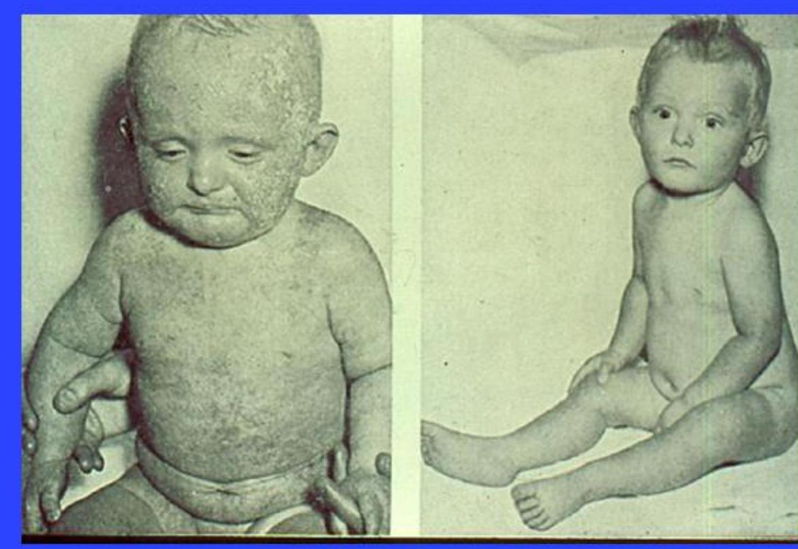
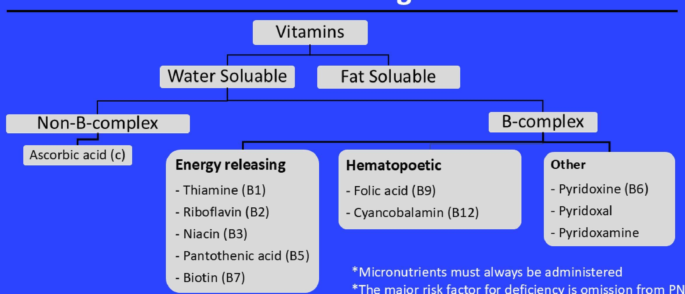
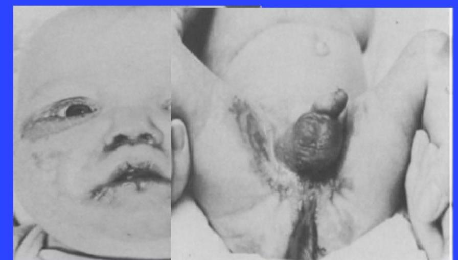
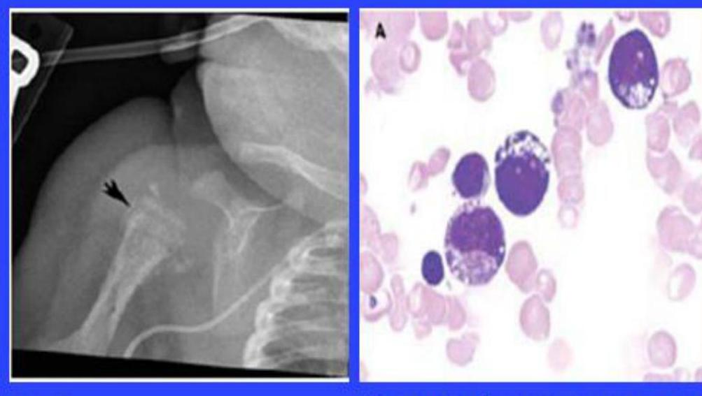
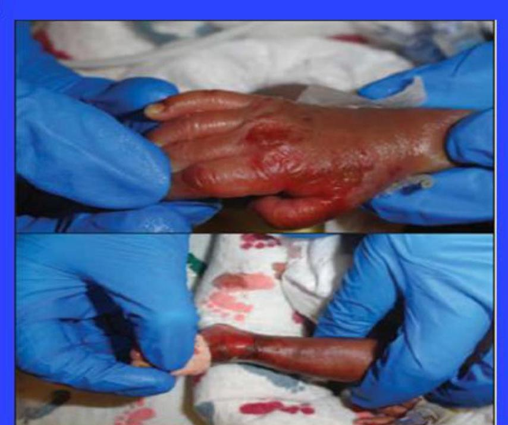
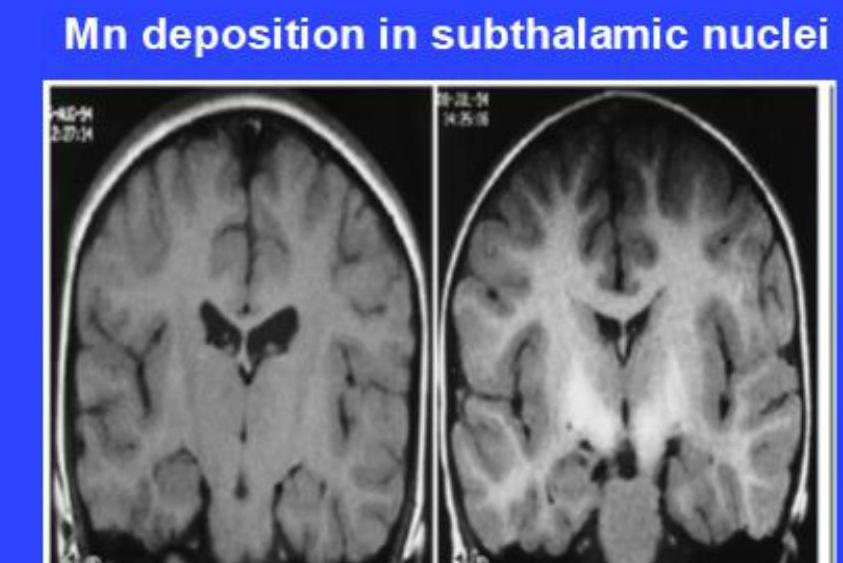
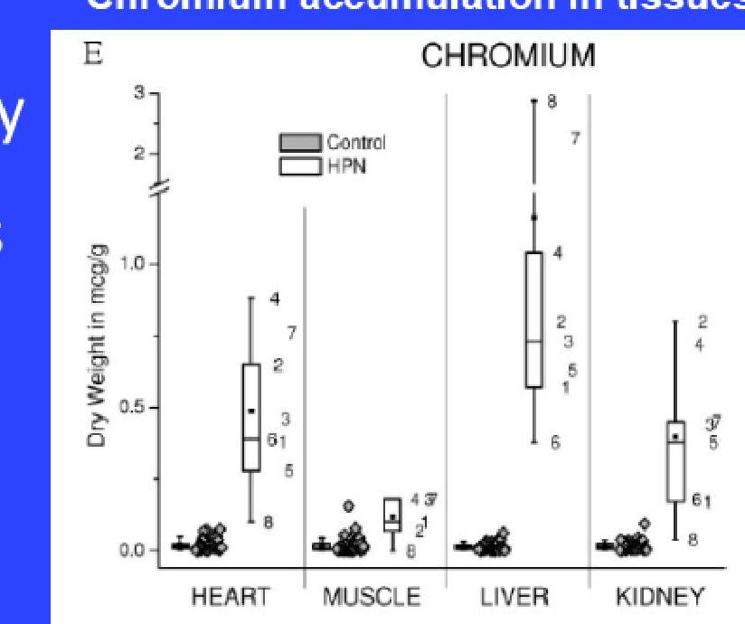

# Neonatal Parenteral Nutrition (PN)

--- page 1 ---

# Overview 

- Case study
- Indications and Rationale
- Energy requirements
- Fluid requirements
- Dextrose
- Amino Acids
- Lipids
- Deficiencies
- Monitoring
- Review of case

--- page 2 ---

# Case 

3-week-old boy born at 23-week gestation developed septic shock, renal failure, necrotizing enterocolitis, and bowel perforation. He was treated with peritoneal washouts, drains, antimicrobials, and bowel rest. PN was started on DOL\#1, but lipids were intermittently held since birth due to fluid overload and hypertriglyceridemia. He was later diagnosed with intestinal failure-associated liver disease (IFALD) (direct bilirubin $>2 \mathrm{mg} / \mathrm{dL}$ ) and essential fatty acid deficiency (EFAD) (T:T > 0.2). What is the most appropriate IV lipid emulsion (ILE) for this infant?
A) Hold ILE
B) $100 \%$ soybean oil ILE $0.5 \mathrm{~g} / \mathrm{kg}$
C) Mixed oil ILE $3 \mathrm{~g} / \mathrm{kg}$
D) $100 \%$ fish oil ILE $1 \mathrm{~g} / \mathrm{kg}$

--- page 3 ---

# Indications and Rationale: Common Indications - Term and Preterm Infants 

- Inability to feed due to GI condition or illness
- Failure to meet energy requirements by enteral nutrition
- Anticipated NPO > 3-5 days
- Increased metabolic demands during critical illness

--- page 4 ---

# Indications and Rationale: Specific Indications - Preterm Infants 

- Higher nutritional requirements for growth and development
- PN should be started after birth as soon as vascular access is obtained
- Gastrointestinal immaturity preventing full enteral feeding

--- page 5 ---

# Starter PN 

- A stock PN for immediate delivery of basic nutrition until a custom PN is ordered
- Amino acids, dextrose, and calcium
- No other electrolytes
- Additional intravenous fluids with electrolytes may be ordered as needed
- Early initiation of PN is critical for premature infants
- Supports growth and development
- Prevents catabolism

--- page 6 ---

# Neonatal PN: Energy Requirements

|  Preterm Infant (kcal/kg/day) | $110-120$  |
| --- | --- |
|  Term Infant (kcal/kg/day) | $90-100$  |

- Establish daily energy requirements
- Consider additional kcal based on clinical condition and postnatal growth
- Calculate energy needs using current dry weight or birth weight if not yet regained

--- page 7 ---

# Neonatal PN: Fluid Requirements

|   | Day of Life (birth) | Day of Life 1 | Day of Life 2+  |
| --- | --- | --- | --- |
|  Preterm Infant (mL/kg/day) | $80-100$ | 120 | 140  |
|  Term Infant (mL/kg/day) | $60-80$ | 100 | $100-120$  |

- Establish total fluid limit or allowance
- Determine PN volume PN = Total Fluid Requirement - (Medications + Flushes + Enteral Nutrition + IVF)

--- page 8 ---

# Neonatal PN: Fluid Requirements - Cont'd 

- Adjust fluid requirements for specific clinical situations
- Increase fluids: consider increasing fluid intake in cases of elevated insensible losses or excessive fluid output
- Diarrhea
- High ostomy outputs
- Polyuria
- Phototherapy for jaundice
- Extensive skin injuries
- Sepsis

--- page 9 ---

# Neonatal PN: Fluid Requirements - Cont'd 

- Adjust fluid requirements for specific clinical situations
- Reduce fluids: consider reducing fluid intake in scenarios where insensible losses are decreased or there is fluid overload
- Double walled isolators for premature or critically ill infants
- Ascites due to liver or renal failure
- Pulmonary edema
- Congestive heart failure

--- page 10 ---

# Neonatal PN: Dextrose

|   | Initiation | Advance By | Goals  |
| --- | --- | --- | --- |
|  Preterm Infant (mg/kg/min) | $5-7$ | $1-2$ (or 1-2.5\% dextrose) | $10-14$ (max $14-18$ )  |
|  Term Infant (mg/kg/min) | $6-9$ | $1-2$ (or $2.5-5 \%$ dextrose) | $10-14$ (max $14-18$ )  |

- Advance until energy goals met
- Monitor blood glucoses with target blood glucose 70-150 mg/dL
- Premature infants < 28 weeks are at increased risk of hyperglycemia
- Insulin should not be used given risk of hypoglycemia
- Maintain minimum Glucose Infusion Rate (GIR) $6 \mathrm{mg} / \mathrm{kg} / \mathrm{min}$ for brain's energy needs
- Note that GIR > $12.5 \mathrm{mg} / \mathrm{kg} / \mathrm{min}$ may stimulate lipogenesis from excess glucose

--- page 11 ---

# Neonatal PN: Amino Acids

|   | Initiate at Goal  |
| --- | --- |
|  Preterm Infant (g/kg/day) | 3 (max 3.5)  |
|  Term Infant (g/kg/day) | 2.5 – 3  |

- Start protein at goal
- Gradual advancement delays reaching target needs, leading to net negative nitrogen balance
- Limited benefit with protein dose > 3.5 g/kg/day
- Initiating protein > 3 g/kg/day has been linked to sepsis in premature infants

--- page 12 ---

# Neonatal PN: Lipids

|   | Initiation | Advance By | Goals  |
| --- | --- | --- | --- |
|  Preterm Infant (g/kg/day) | 1 | $0.5-1$ | 3  |
|  Term Infant (g/kg/day) | 1 | $0.5-1$ | 3  |

- Advance gradually to minimize risk of hypertriglyceridemia
- Infuse over 12 - 24 hours depending on formulation and clinical condition
- Insufficient lipids can cause essential fatty acid deficiency (EFAD)
- Excess lipids can cause hypertriglyceridemia

--- page 13 ---

# Types of Intravenous Lipid Emulsions (ILEs)

|   | 100% Soy oil-based ILE | Olive, soy oil-based ILE | Soy, MCT, olive, fish oil-based ILE | Fish oil-based ILE  |
| --- | --- | --- | --- | --- |
|   | 100% SO-ILE | OO, SO-ILE | SO, MCT, OO, FO-ILE | FO-ILE  |
|  Indication | ILE < 2 weeks
EFAD | ILE > 2 weeks | ILE > 2 weeks | IFALD
EFAD  |
|  Advantages | ↑↑↑ EFA | Sufficient EFA
↓ Phytosterols | Sufficient EFA
↓ Phytosterols | Sufficient EFA
↓ Triglycerides
↓↓ Phytosterols  |
|  Disadvantages | ↑ Triglycerides
↑ Phytosterols | EFAD * | EFAD * | ↓ Energy density  |

Mirtallo J, *et al.* *Nutr Clin Pract.* 2020;35:769-82. Calkins KL, *et al.* *Neoreviews* 2020;21(2):e109-e119.

--- page 14 ---

# Neonatal PN: Types of ILEs

|  Oil Source | SO-ILE | OO, SO-ILE | SO, MCT, OO,
FO-ILE | FO-ILE  |
| --- | --- | --- | --- | --- |
|  SO (\%) | 100 | 20 | 30 | 0  |
|  MCT (\%) | 0 | 0 | 30 | 0  |
|  OO (\%) | 0 | 80 | 25 | 0  |
|  FO (\%) | 0 | 0 | 15 | 100  |

--- page 15 ---

# Neonatal PN: Types of ILEs

|  Fatty Acid | SO-ILE | OO, SO-ILE | SO, MCT, OO, FO-ILE | FO-ILE  |
| --- | --- | --- | --- | --- |
|  Caprylic | 0 | 0 | $17 \% \pm 0.2 \%$ | 0  |
|  Capric | 0 | 0 | $12 \% \pm 0.2 \%$ | 0  |
|  Linoleic, $\omega-6$ | $44 \%-62 \%$ | $18 \%$ | $14 \%-25 \%$ | $1.5 \%$  |
|  $\alpha$-Linolenic, $\omega-3$ | $4 \%-11 \%$ | $1.7 \%$ | $1.5 \%-3.5 \%$ | $1.1 \%$  |
|  ARA, $\omega-6$ | 0 | $0.16 \%$ | $0.5 \%$ | $0.2 \%-2 \%$  |
|  DHA, $\omega-3$ | 0 | 0 | $1 \%-3.5 \%$ | $14 \%-27 \%$  |
|  EPA, $\omega-3$ | 0 | 0 | $1 \%-3.5 \%$ | $13 \%-26 \%$  |
|  Oleic acid, $\omega-9$ | $19 \%-30 \%$ | $60 \%$ | $23 \%-35 \%$ | $4 \%-11 \%$  |
|  $\omega-6: \omega-3$ | $7: 1$ | $9: 1$ | $2.5: 1$ | $1: 8$  |

--- page 16 ---

# Essential Fatty Acid Deficiency 

- Definition
- Insufficient supply of essential $\omega-6$ linoleic acid and $\omega-3 \alpha$-linolenic acid (LA) and
- Triene:Tetraene (T:T) or Mead acid:Arachidonic ratio > 0.2
- Risk Factors
- Prematurity, as maternal transfer of EFAs occurs mainly in the 3rd trimester
- Low birth weight
- Prolonged withdrawal, restriction or inappropriate dosage of IV lipids

--- page 17 ---

# Metabolism of Polyunsaturated Fatty Acids

↓ LA leads to, by default, elongation of OO(18:1ω-9), resulting in ↑ Mead Acid (20:3ω-9) and a ↑ T:T ratio [Mead Acid (20:3ω-9):Arachidonic Acid(20:4ω-6)]

Chan AP, et al. Clin Perinatol. 2023;50(3):575-89.

--- page 18 ---

# Essential Fatty Acid Deficiency

- **Biochemical Indicators (T:T > 0.2)**
  - ↑ LFTs
  - ↑ Triglyceride
  - ↓ Platelet

- **Physical Signs (T:T > 0.4)**
  - Dry, scaly rash
  - Poor wound healing
  - Growth restriction
  - Increased infection risks
  - Bleeding

Child with essential fatty acid deficiency (left) after successful treatment (right)

--- page 19 ---

# Essential Fatty Acid Deficiency

- Prevention
- Provide IV lipids at appropriate dosage
- Fish oil provides "conditionally essential" fatty acids, arachidonic acid and docosahexaenoic acid (DHA), that can be retro converted to linoleic acid and eicosapentaenoic acid (EPA), respectively
- Treatment
- Administer either 100\% soybean oil or 100\% fish oil IV lipid

|   | SO-ILE | SO, MCT, OO,
FO-ILE | FO-ILE  |
| --- | --- | --- | --- |
|  Minimum Dosage ( $\mathrm{g} / \mathrm{kg}$ ) | $0.5-1.0$ | $2.2-3.0$ | $1.0-1.5$  |

--- page 20 ---

# Hypertriglyceridemia 

- Definition
- Triglyceride level > 250-300 mg/dL
- Risk Factors
- Prematurity (< 28 weeks' gestation)
- Low birth weight (< 1000 g)
- IV lipid (based on dose ,concentration, oil source)
- Sepsis
- Renal failure
- Corticosteroids
- Dextrose overfeeding
- Essential fatty acid deficiency
- Inborn errors of metabolism
- Carnitine deficiency

--- page 21 ---

# Hypertriglyceridemia

|  Management of HTG | Comments  |
| --- | --- |
|  Ensure lab specimen is not contaminated |   |
|  Avoid excessive dextrose infusions | May limit nonprotein calories  |
|  Administer ILE over longer period |   |
|  Treat sepsis and renal failure |   |
|  Normalize serum calcium to optimize LPL activity |   |
|  Minimize use of medications associated with HTG (corticosteroids, chlorothiazide) |   |
|  Reduce ILE dose or pause ILE | Ensure infant's risk for EFAD is low and ILE dose will not cause an EFAD  |
|  Change ILE type to include fish oil | $\omega-3$ fatty acids in fish oil enhance lipid utilization, accelerate lipid clearance, and suppress lipogenesis  |
|  Heparin | Induces triglyceride clearance, but increased bleeding risk should be considered  |
|  Carnitine | Enhances fatty acid oxidation, but evidence on clinical effectiveness is limited  |

--- page 22 ---

# Growth Monitoring Charts 

- Growth curves used to track weight, length, and head circumference for age
- Selection of growth chart depends on patient age, gender, institutional preference, and specific underlying conditions (Down syndrome, Rett syndrome, etc.)
- Olsen: up to 36 weeks gestational age
- Intrauterine growth curves based on data from US
- Fenton: most used, best between 36-50 weeks corrected age
- Combination of intrauterine and postnatal curves based on data from Canada, Australia, Italy, Scotland, Germany, and US
- World Health Organization: after 4-8 weeks post-term until 2 years old
- International postnatal growth standards based on breastfed children

--- page 23 ---

# Growth Monitoring Target Goals

- Once birth weight is achieved, the following growth goals should be targeted
- Accurate growth monitoring may be difficult if edema is present

|   | Weight | Length | Head Circumference  |
| --- | --- | --- | --- |
|  Preterm Infant | $15-20 \mathrm{~g} / \mathrm{kg} /$ day | $1 \mathrm{~cm} /$ week | $0.7 \mathrm{~cm} /$ week  |
|  Term Infant ( $0-3$ months) | $30 \mathrm{~g} /$ day | $0.75 \mathrm{~cm} /$ week | $0.5 \mathrm{~cm} /$ week  |

--- page 24 ---

# Neonatal PN: Heparin 

- Prophylactic to prevent thrombosis
- Reduces the formation of a fibrin sheath around the catheter
- May reduce phlebitis with peripheral intravenous access
- May facilitate lipid clearance; increased lipolysis and release of free fatty acids
- Reduces the incidence of culture-positive catheter-related sepsis
- Heparin dosing
- 1 unit/mL full-term infants-adults
- 0.5 units/mL preterm and VLBW infants (<1500g)
- Cons: $\uparrow$ risk for heparin-induced thrombocytopenia and heparin medication interactions

--- page 25 ---

# Essential Micronutrients: Organic 

Birch P, et al. Arch Dis Child Fetal Neonatal Ed. 2010;95(4):F252-7.
Uslu S, et al. J Perinatol. 2010;30(12):794-9. Randolph AG, et al. Chest 1998;113(1):165-71.
Kerner JA. "Parenteral Nutrition" in Nutrition in Pediatrics 3rd Editon, 2003:969.

--- page 26 ---

# Essential Micronutrients: Inorganic

- Micronutrients must always be administered
- The major risk factor for deficiency is omission from PN

|  Electrolytes | Minerals  |
| --- | --- |
|  Sodium | Iron  |
|  Potassium | Iodide *  |
|  Mangesium | Zinc  |
|  Phosporus | Copper  |
|  Calcium | Chromium  |
|   | Manganese  |
|   | Selenium  |
|   | Cobalt  |
|   | Molybdenum  |

- PN Iodine not available in the USA

Birch P, et al. Arch Dis Child Fetal Neonatal Ed. 2010;95(4):F252-7. Uslu S, et al. J Perinatol. 2010;30(12):794-9. Randolph AG, et al. Chest 1998;113(1):165-71. Kerner JA. "Parenteral Nutrition" in Nutrition in Pediatrics 3rd Editon, 2003:969.

--- page 27 ---

# Comparison of Infant and Child Dosing of Electrolyte and Minerals

|   | Infant (0 - 5 kg ) | Infant / Child (5 - 20 kg )  |
| --- | --- | --- |
|  Sodium | $2-5 \mathrm{mEq} / \mathrm{kg}$ | $2-6 \mathrm{mEq} / \mathrm{kg}$  |
|  Potassium | $2-4 \mathrm{mEq} / \mathrm{kg}$ | $2-3 \mathrm{mEq} / \mathrm{kg}$  |
|  Chloride | $2-5 \mathrm{mEq} / \mathrm{kg}$ | $2-5 \mathrm{mEq} / \mathrm{kg}$  |
|  Acetate | Balance | Balance  |
|  Calcium | $1-4 \mathrm{mEq} / \mathrm{kg}$ | $0.5-1 \mathrm{mEq} / \mathrm{kg}$  |
|  Phosphorus | $2-4 \mathrm{mEq} / \mathrm{kg}$ | $1-2 \mathrm{mEq} / \mathrm{kg}$  |
|  Magnesium | $0.3-0.5 \mathrm{mEq} / \mathrm{kg}$ | $0.3-0.5 \mathrm{mEq} / \mathrm{kg}$  |

*Assumes normal age-related organ function and normal losses

--- page 28 ---

# Electrolytes: Acid / Base Balance 

- Chloride: provided as Na chloride, K chloride, and as part of cysteine hydrochloride
- Avoid prolonged use of chloride free-PN without close monitoring as it may increase the risk of metabolic alkalosis
- Bicarbonate can't be added to PN due to compatibility issues
- Acetate: provided as Na or K acetate
- K acetate has significantly lower aluminum content ( $200 \mathrm{mcg} / \mathrm{L}$ ) compared to Na acetate ( $360 \mathrm{mcg} / \mathrm{L}$ )
- Metabolized to bicarbonate and added to counter metabolic acidosis

--- page 29 ---

# Calcium and Phosphorus Challenges 

- Due to rapid bone accretion, infants require much higher Ca and Phos content per PN volume and per kg body weight than older children and adults
- Risk of precipitation is much greater in infants and should be considered with every PN order
- Metabolic bone disease is common in preterm infants and those receiving long-term PN
- Monitor serum levels closely
- Adjust Ca and Phos daily in PN if needed
- Ca and Phos should be dosed in a ratio that optimizes their deposition into bone

--- page 30 ---

# Calcium and Phosphorus Challenges - Cont'd 

- Ideal Ca:Phos ratio
$=1.3-1.7: 1$ by weight ratio (mg: mg)
$=1.1-1.3: 1$ molar ratio (mmol:mmol or mEq:mEq)
$=0.8-1.0^{* *}$ molar ratio during first 5-7 days in newborn preterm infants at risk for postnatal hypercalcemia and hypophosphatemia
- Ca and Phos in PN are based on both recommended intakes and ratios of these nutrients and the compounding limits of solubility
**In early PN when calcium and phosphorous intakes are low, and protein and energy are optimized it is recommended to use a molar Ca:P ratio below1 (0.8-1.0) to reduce the risk of early postnatal hypercalcemia and hypophosphatemia.

--- page 31 ---

# Calcium/Phosphorus Solubility & Cysteine

- Cysteine is considered an essential amino acid for preterm infants
- Can be added to the PN solution
- Lowers pH of the solution allowing increased solubility of Ca and Phos
- Cysteine improves nitrogen balance in extremely low birth weight infants
- Dosing recommendation is 40 mg cysteine/g of pediatric amino acid solution
- Addition of cysteine may necessitate supplementation with acetate in preterm infants and possibly other patients prone to acidosis

--- page 32 ---

# Carnitine 

- May aid triglyceride clearance
- Facilitates transport of fatty acids across the mitochondrial membrane
- Conditionally essential in the preterm infant
- Serum levels decrease when carnitine is not added to PN
- Consider supplementation
- Extremely low birth weight premature infants
- Children on long-term PN (> 2 weeks)
- Hypertriglyceridemia
- Significant liver disease

--- page 33 ---

# Carnitine - Cont'd 

- Recommended initial dose is Carnitine $2-5 \mathrm{mg} / \mathrm{kg} /$ day. This may be increased up to $20 \mathrm{mg} / \mathrm{kg} /$ day as clinically needed.
- The treatment dose for deficiency is Carnitine $20 \mathrm{mg} / \mathrm{kg} /$ day
- Patients with inborn errors of metabolism require very high doses of carnitine (i.e., $50-100 \mathrm{mg} / \mathrm{kg}$ ) and ideally should be administered separate from the PN solution to ensure the full dose is received

--- page 34 ---

# Multivitamin Products and Their Dosages

|  INFLUVITE ${ }^{\circledR} 2$ vial system ( 4 mL of vial 1, 1 mL of vial 2) |   |
| --- | --- |
|  Vitamin A: 2300 IU | Vitamin D: 400 IU  |
|  Vitamin E: 7 IU | Vitamin K: 200 mcg  |
|  Vitamin C: 80 mg | Thiamin 1.2 mg  |
|  Riboflavin 1.4 mg | Niacin 17 mg  |
|  Dexpanthenol 5 mg | VitaminB6: 1 mg  |
|  VitaminB12: 1 mcg | Biotin 20 mcg  |
|  Folic acid 140 mcg |   |
|  Infants $\geq 3 \mathrm{~kg}$ : $100 \%$ of Vial $1(4 \mathrm{~mL})$ \& Vial $2(1 \mathrm{~mL})$
Infants 1-3 kg: $65 \%$ of Vial $1(2.6 \mathrm{~mL})$ \& Vial $2(0.65 \mathrm{~mL})$
Infants $<1 \mathrm{~kg}$ : $30 \%$ of Vial $1(1.2 \mathrm{~mL})$ \& Vial $2(0.3 \mathrm{~mL})$ |   |

--- page 35 ---

# Suggested Intakes of Parenteral Vitamins in Infants and Children

|  Vitamin | Term Infants and Children Dose/day (identical to currently available formulations) | Preterm Infants Dose/kg body weight (maximum not to exceed term infant dose) |   |
| --- | --- | --- | --- |
|   |  | Current suggestions ( $40 \%$ of currently available formulations) | Best Estimate * for New Formulations  |
|  A (mcg) | 700 | 280 | 500  |
|  E (mg) | 7 | 2.8 | 2.8  |
|  K (mcg) | 200 | 80 | 80  |
|  D (IU) | 400 | 160 | 160  |
|  Ascorbic acid (mg) | 80 | 32 | 25  |
|  Thiamin (mg) | 1.2 | 0.48 | 0.35  |
|  Riboflavin (mg) | 1.4 | 0.56 | 0.15  |

*Because of elevated levels of water-soluble vitamins, the current proposal is to reduce the intake of water-soluble vitamins and increase retinal.

--- page 36 ---

# Suggested Intakes of Parenteral Vitamins in Infants and Children - Cont'd

|  Vitamin | Term Infants and Children Dose/day (identical to currently available formulations) | Preterm Infants Dose/kg body weight (maximum not to exceed term infant dose) |   |
| --- | --- | --- | --- |
|   |  | Current suggestions ( $40 \%$ of currently available formulations) | Best Estimate * for New Formulations  |
|  Pyridoxine (mg) | 1 | 0.4 | 0.18  |
|  Niacin (mg) | 17 | 6.8 | 6.8  |
|  Pantothenate (mg) | 5 | 2 | 2  |
|  Biotin (mcg) | 20 | 8 | 6  |
|  Folate (mcg) | 140 | 56 | 56  |
|  Vitamin B12 (mcg) | 1 | 0.4 | 0.3  |

*Because of elevated levels of water-soluble vitamins, the current proposal is to reduce the intake of water-soluble vitamins and increase retinal.

--- page 37 ---

# Multivitamins (MVI)

- Must always be administered
- Omission from PN is associated with an increased risk for onset of severe metabolic derangements
- Intolerance of MVIs may occur due to an anaphylactoid reaction to polysorbate – the solubilizing vehicle

Nonimmunologic anaphylactoid rash due to polysorbate – a solubilizing vehicle for MVIs*

Greene HL *et al. Am J Clin Nutr.* 1988;48(5):1324-42. CDC. MMWR Weekly 1997;40(23):523-28.

Darlington WS, *et al. Pediatric Blood Cancer* 2015;62:2232

Coors EA, *et al. Ann Allergy Asthma Immunol.* 2005;95:693-99.

--- page 38 ---

# MVI Shortage Considerations 

- Risk factor for deficiency
- Omission from PN
- National shortages
- History of anaphylactoid reaction to polysorbate 80 (vehicle for MVI)
- Vitamin A is susceptible to photodegradation and oxidization
- If no pediatric MVI is available, use adult products at reduced doses
- Infants $<2.5 \mathrm{~kg}$ or $<36$ gestation age, can receive an Adult MVI dose of 1 $\mathrm{mL} / \mathrm{kg}$ up to $2.5 \mathrm{~mL} /$ day
- Vitamin K: daily dose is $200 \mathrm{mcg} /$ day
- Thiamine: 0.35 to $0.5 \mathrm{mg} / \mathrm{kg} /$ day, max $1.2 \mathrm{mg} /$ day

--- page 39 ---

# Neonatal PN: Photodegredation and Oxidation 

- Light exposure generates peroxide/free radical formation in PN solutions
- Both dextrose and AA solutions containing vitamins and intravenous lipid emulsions are prone to peroxidation
- Premature infants are most susceptible to consequences of peroxide formation in PN admixtures because of immature defense mechanisms and conditions associated with oxidative stress e.g., bronchopulmonary dysplasia, necrotizing enterocolitis, and retinopathy of prematurity
- Covering PN bags and IV tubing with light protective covers or use of tinted bags and tubing reduces peroxide formation

--- page 40 ---

# Thiamine Deficiency 

- Thiamine is a coenzyme in biochemical reactions for energy formation, including carbohydrate metabolism, decarboxylation of $\alpha$-keto acids, pyruvate, and branchedchain amino acids, and transketolase reactions of the pentose phosphate pathway
- Source: 5 mL Pediatric MVI contains thiamine 1.2 mg
- Risk: omission of PN multivitamins for $\geq 10+$ days
- Thiamine can be given separately when MVIs are not available
- Treatment: IV thiamine $25-50 \mathrm{mg}$

## SYMPTOMS/SIGNS

- Severe lactic acidosis
- Increased anion gap
- Metabolic acidosis refractory to sodium bicarbonate
- Tachycardia
- Hypotension
- Lethargy
- Beriberi

--- page 41 ---

# **Biotin Deficiency**

- Cofactor for four distinct carboxylases that catalyze essential functions in human intermediary metabolism
- **Source:** 5 mL Pediatric MVI contains Biotin 20 µg
- **Risk:** omission of PN multivitamins
- **Symptoms:** alopecia totalis, hypotonia, scaly skin rash, and characteristic well-demarcated periorificial dermatitis
- **Diagnosis:** ↓ urinary biotin, ↑ urinary organic acids: methylcrotonyl-coenzyme A carboxylase, & propionyl-coenzyme A carboxylase (indicative of a deficiency of biotin-dependent enzymes)

--- page 42 ---

# Recommended Dosing of Trace Minerals

|  Trace Element | Preterm Neonates | Term Neonates
$3-10 \mathrm{~kg}$ | Children
$10-40 \mathrm{~kg}$ | Adolescents
$>40 \mathrm{~kg}$  |
| --- | --- | --- | --- | --- |
|  Zinc | $400 \mathrm{mcg} / \mathrm{kg}$ | $250 \mathrm{mcg} / \mathrm{kg}$ | $50 \mathrm{mcg} / \mathrm{kg}$
(max $5000 \mathrm{mcg} / \mathrm{d})$ | $2-5 \mathrm{mg}$  |
|  Copper | $20 \mathrm{mcg} / \mathrm{kg}$ | $20 \mathrm{mcg} / \mathrm{kg}$ | $20 \mathrm{mcg} / \mathrm{kg}$
(max $500 \mathrm{mcg} / \mathrm{d})$ | $200-500 \mathrm{mcg}$  |
|  Manganese | $1 \mathrm{mcg} / \mathrm{kg}$ | $1 \mathrm{mcg} / \mathrm{kg}$ | $1 \mathrm{mcg} / \mathrm{kg}$
(max $5000 \mathrm{mcg} / \mathrm{d})$ | $40-100 \mathrm{mcg}$  |
|  Chromium | $0.05-0.3 \mathrm{mcg} / \mathrm{kg}$ | $0.2 \mathrm{mcg} / \mathrm{kg}$ | $0.2 \mathrm{mcg} / \mathrm{kg}$
(max $5 \mathrm{mcg} / \mathrm{d})$ | $5-15 \mathrm{mcg}$  |
|  Selenium | $2 \mathrm{mcg} / \mathrm{kg}$ | $2 \mathrm{mcg} / \mathrm{kg}$ | $2 \mathrm{mcg} / \mathrm{kg}$
(max $100 \mathrm{mcg} / \mathrm{d})$ | $40-60 \mathrm{mcg}$  |

*Note: These requirements are different than the multi-trace element products currently available in the USA.

--- page 43 ---

# Iron (Fe) 

- Parenteral formulation: Fe Dextran
- Controversial; not recommended as a routine additive
- Iron dextran requires a test dose and carries an FDA black box warning
- Not a component of current multiple trace element preparations (limited stability in PN)
- Risks: potential for increased sepsis; oxidant; risk for anaphylaxis
- Avoid: in infants < 2 months age; chronic blood transfusions; Fe-overload conditions
- Dose: $0.1-0.2 \mathrm{mg} / \mathrm{kg} /$ day for infants $>2$ months of age or those with Fe deficiency

--- page 44 ---

# **Copper Deficiency**

- Required for co-factor in cuproenzymes
- **Source:** present in Multrys® or individually dosed
- **Risk:** omission from PN
- **Deficiency effects:** anemia, neutropenia, and metabolic bone disease

Irregular metaphysis & osteopenia

Vacuolated marrow precursors

- **Diagnosis:** ↓serum/plasma Copper & Ceruloplasmin
- **Prevention:** always include copper and monitor q1-3 months

--- page 45 ---

# Zinc Deficiency

- Required co-factor for enzymes involved in maintenance of structural integrity of proteins, regulation of gene expression
- **Source:** multitrace and/or individually dosed
- **Risk:** omission from PN
- **Deficiency effects:** alopecia, acral skin rash, impaired wound healing, growth retardation, diarrhea, hypogeusia
- **Diagnosis:** ↓serum/plasma Zinc
- **Prevention:** always include Zinc and monitor every 1-3 months

Ruktanonchai D, et al. *MIMWR.* 2013;62(7):134-7.

--- page 46 ---

# Selenium (Se) 

- Should be provided to all patients at initiation of PN
- Omit in patients with renal disease
- Increased requirement with oxidative stress, critical illness, and losses (e.g., fistula output, burns, drains)
- Se status: monitor plasma Se together with a measure of systemic inflammation ( $\uparrow$ C-reactive protein is associated with $\downarrow$ plasma Se)

--- page 47 ---

# Chromium (Cr) 

- Recent data suggests the need to lower the recommended amount of Cr in PN
- Cr improves glucose tolerance in VLWB and ELBW at risk for perinatal hyperglycemia
- Current PN components are contaminated with Cr
- Omit Cr in patients with renal disease or on long-term therapy with PN

--- page 48 ---

# **Manganese**

- Required for mucopolysaccharide metabolism
- Normally regulated through restricted enteric absorption
- **Source:** Multrys®
- **Toxicity:** manganese deposition in basal ganglia => dopamine depletion => Parkinsonian symptoms
- **Diagnosis:** ↑ plasma concentrations
- **Prevention:** discontinue Multrys® in chronic PN and give trace minerals individually

Quaghhebeur G, *et al. Neuroradiology* 1996;38(7):680-83. Howard L, *et al. J Parenter Enteral Nutr.* 2007;31(5):388-96.

--- page 49 ---

# Chromium

- Required for glucose regulation, ↑ insulin sensitivity
- **Source:** Multrys® & natural contaminant in PN solutions
- **Risk:** chronic deposition in tissues: Kidneys => ↑ long-term risk for nephropathy
- **Diagnosis:** ↑ serum/plasma concentrations
- **Prevention:** discontinue multi-trace in chronic PN and give other trace minerals individually

--- page 50 ---

# PN Monitoring

|  Trace Element | Initial | With Every Change in PN Order | Weekly Until Stable | Monthly / as Indicated  |
| --- | --- | --- | --- | --- |
|  Electrolytes | $\checkmark$ | $\checkmark$ | $\checkmark$ |   |
|  Glucose | $\checkmark$ | $\checkmark$ | $\checkmark$ |   |
|  Calcium | $\checkmark$ | $\checkmark$ | $\checkmark$ |   |
|  BUN | $\checkmark$ | $\checkmark$ | $\checkmark$ |   |
|  Creatinine | $\checkmark$ | $\checkmark$ | $\checkmark$ |   |
|  Magnesium | $\checkmark$ | $\checkmark$ | $\checkmark$ |   |
|  Phosphorus | $\checkmark$ | $\checkmark$ | $\checkmark$ |   |
|  ALT | $\checkmark$ |  | $\checkmark$ |   |
|  AST | $\checkmark$ |  | $\checkmark$ |   |
|  Alkaline phosphatase | $\checkmark$ |  | $\checkmark$ |   |

--- page 51 ---

# PN Monitoring - Cont'd

|  Trace Element | Initial | With Every Change in PN Order | Weekly Until Stable | Monthly / as Indicated  |
| --- | --- | --- | --- | --- |
|  Total protein | $\checkmark$ |  | $\checkmark$ |   |
|  Albumin | $\checkmark$ |  | $\checkmark$ |   |
|  GGT | $\checkmark$ |  | $\checkmark$ |   |
|  Prealbumin | $\checkmark$ |  | $\checkmark$ |   |
|  Triglycerides | $\checkmark$ | $\checkmark$ | $\checkmark$ |   |
|  Conjugated bilirubin | $\checkmark$ |  | $\checkmark$ |   |
|  CBC | $\checkmark$ |  | $\checkmark$ | $\checkmark$  |
|  Iron studies |  |  |  | $\checkmark$  |
|  Trace elements |  |  |  | $\checkmark$  |
|  Vitamins |  |  |  | $\checkmark$  |

--- page 52 ---

# Case 

3-week-old boy born at 23-week gestation developed septic shock, renal failure, necrotizing enterocolitis, and bowel perforation. He was treated with peritoneal washouts, drains, antimicrobials, and bowel rest. PN was started on DOL\#1, but lipids were intermittently held since birth due to fluid overload and hypertriglyceridemia. He was later diagnosed with intestinal failure-associated liver disease (IFALD) (direct bilirubin $>2 \mathrm{mg} / \mathrm{dL}$ ) and essential fatty acid deficiency (EFAD) (T:T > 0.2). What is the most appropriate IV lipid emulsion (ILE) for this infant?
A) Hold ILE
B) $100 \%$ soybean oil ILE $0.5 \mathrm{~g} / \mathrm{kg}$
C) Mixed oil ILE $3 \mathrm{~g} / \mathrm{kg}$
D) $100 \%$ fish oil ILE $1 \mathrm{~g} / \mathrm{kg}$

--- page 53 ---

# Case: Review 

3-week-old boy born at 23-week gestation developed septic shock, renal failure, necrotizing EFAD can develop rapidly in premature infants who do not have oneal washouts, receive an adequate amount of lipid. Therefore, ILE would, but lipids were withholding and ILE dose restriction is not appropriate for hypertrigly prednisolone in premature infants. ILEs should be given consistently to 100\% of the pre- and post-pregnancy (EFAD) pre- and post-gynaeal level of liver injury (EFAD) prevent an EFAD. The optimal type and dose of ILE depends on the patient's age, liver status, clinical goal, and nutritional goals. In this case, a 100\% fish oil ILE dosed at $\geq 1 \mathrm{~g} / \mathrm{kg} /$ day and, if it is not, can safely and effectively treat the infant's EFAD, IFALD, and hypertriglyceridemia.
D) $100 \%$ fish oil ILE $1 \mathrm{~g} / \mathrm{kg}$