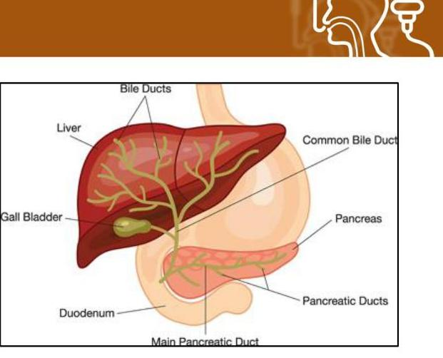

# NUTRITION SUPPORT CERTIFICATE 

## Administration of Nutrition Support, Part 1

Planned by the American Society of Health-System Pharmacists (ASHP) in collaboration with the American Society for Parenteral and Enteral Nutrition (ASPEN).
(c)2022 American Society of Health-System Pharmacists, Inc. All rights reserved.

No part of this publication may be reproduced or transmitted in any form or by any means, electronic or mechanical, including photocopying, microfilming, and recording, or by any information storage and retrieval system, without written permission from the American Society of Health-System Pharmacists.

--- page 1 ---

# ADMINISTRATION OF NUTRITION SUPPORT PART 1 

Andrew Mays, Pharm.D., BCNSP, CNSC University of Mississippi Medical Center

NUTRITION SUPPORT CERTIFICATE

## RELEVANT FINANCIAL RELATIONSHIP DISCLOSURE

The following persons in control of this activity's content have relevant financial relationships:

- Andrew Mays: Fresenius Kabi, speaker

All other persons in control of content do not have any relevant financial relationships with an ineligible company.

As defined by the Standards of Integrity and Independence definition of ineligible company. All relevant financial relationships have been mitigated prior to the CPE activity.

--- page 2 ---

# LEARNING OBJECTIVES 

- Review critical safety measures for initiating parenteral or enteral nutrition.
- Identify measures aimed at preventing tubing misconnections involving enteral and parenteral nutrition systems.
- Discuss administration procedures for parenteral nutrition to prevent complications related to tubing and inline filter changes.
- Distinguish steps in managing TNA vs. 2-in-1 parenteral nutrition with separate lipid injectable emulsion infusions

## KEY ABBREVIATIONS

- EN:
- ICU:
- ILE:
- NKDA:
- PN:
- PPN:
- TNA:
enteral nutrition
intensive care unit
lipid injectable emulsion
no known drug allergies
parenteral nutrition
peripheral parenteral nutrition
total nutrient admixture

--- page 3 ---

# SELF-ASSESSMENT \#1 

A 61-year-old woman with a history of Crohn's disease, develops persistent nausea and vomiting. X-rays reveal that the patient has a high-grade obstruction in the small bowel. What is the most appropriate approach for providing nutrition to this patient?
A. Low residue oral diet
B. Parenteral nutrition
C. Peripheral intravenous fluids
D. Tube feeding

## SELF-ASSESSMENT \#2

A 28 year old man was admitted to the ICU 7 days ago with multiple trauma following a motor vehicle accident. He has not tolerated EN due to intra-abdominal injuries. The medical team is considering starting PN by peripheral vein (PPN). Which of the following statements best describes PPN?
A. The osmolality limit for PPN is set at $600 \mathrm{mOsm} / \mathrm{L}$
B. The expected duration of therapy should be greater than 2 weeks.
C. PPN avoids the risks associated with central line placement
D. PPN is most appropriate for use with hypermetabolic conditions

--- page 4 ---

# THE FOUNDATION FOR SAFE NUTRITION SUPPORT PRACTICE 

- Collaborative interdisciplinary approaches
- Evidence-based policies and procedures
- Define the roles \& responsibilities of all involved
- Avoid variations in practice
- Implement protocols
- Standardize procedures (Equipment, hang time, care of access device, etc)
- Address challenges to optimal delivery of nutrition support delivery
- Selection, insertion, and maintenance of access devices
- Correct environmental issues that contribute to errors
- Work flow issues, distractions
- Availability of supplies and equipment

Ayers P et al. JPEN J Parenter Enteral Nutr. 2014; 38(3):296-333.

## INITIATING NUTRITION SUPPORT SAFELY

Judicious selection of candidates

Appropriate indication for nutrition support

Decisions guided by results of assessment findings

Evaluation of potential for complications

- Interdisciplinary collaboration
-Evidence based guidelines for indications
-Patient and caregiver agreement
- Assessment of risk versus benefit
- Timing of intervention is consistent with guidelines
- Nutrition plan is aligned with overall plan of care
- Nutrition status
- Gl function
- Clinical and metabolic stability
- Risk for complications of nutrition support access
- Risk forrefeeding syndrome

--- page 5 ---

# NUTRITION SUPPORT GUIDELINES 

- Enteral nutrition is preferred when Gl tract is functional
- Advantages of enteral nutrition
- Relies on normal digestive pathways
- Provides a more complete range of nutrients
- Preserves integrity of the gut, especially immune factors
- Associated with favorable outcomes compared to parenteral nutrition
- Lower risk of infection
- Fewer metabolic complications than IV route
- Less expensive than parenteral nutrition
- Reserve PN for situation where Gl function is inadequate

GUIDELINES FOR PN INITIATION

- Do not use based solely on medical diagnosis or disease state
- Evaluate clinical factors from history, physical examination, and diagnostic evaluations in determining if EN is not feasible
- Conduct a clinical review to assess PN appropriateness prior to compounding the PN admixture
- Use PN in patients who are malnourished or at risk for malnutrition when:
- A contraindication to EN exists OR
- Patient cannot tolerate adequate EN OR
- Lacks sufficient bowel function to maintain or restore nutrition status due to Gl dysfunction

--- page 6 ---

# INDICATIONS FOR PARENTERAL NUTRITION 

## - Impaired absorption

- short bowel syndrome, fistula
- Mechanical bowel obstruction
- stricture, tumor
- Motility disorders
- pseudo-obstruction, ileus, severe adhesive disease
- Need for bowel rest
- ischemic bowel, neutropenic colitis
- Inability to place or maintain safe enteral access

Worthington P et al. JPEN J Parenter Enter Nutr. 2017; 41:324-77.

## ASHLEY'S CASE

- Age: 37 year-old female
- Presents to the ED with fever, vomiting, and abdominal pain:
- 1 day history of fever, malaise, and abdominal pain which progressed to two vomiting episodes in 6 hours
- No diarrhea
- Subsequent work-up confirms acute pancreatitis

CC Image courtesy of the National Institute of Diabetes and Digestive and Kidney Diseases (NIDDK). https://www.niddk.nih.gov/health-information/diagnostic-tests/endoscopic-retrograde-cholangiopancreatography (accessed 2019 Feb 10).

--- page 7 ---

# ASHLEY'S CASE 

- Past medical history:
- Short bowel syndrome (SBS) due to Crohn's disease (285 cm of functional small intestine and an intact colon)
- Chronic diarrhea usually controlled by loperamide
- Chronic anemia
- Diet: Generally oral diet with oral supplements and vitamins
- Current medications:
- Azathioprine
- Loperamide
- Clonidine
- Prenatal vitamin
- Cyanocobalamin
- Iron sucrose
- NKDA

## ASHLEY'S CASE

- Vitals:
- RR: 18 breaths/min
- Pulse: 98-104 bpm, sinus tachycardia
- BP: 106/65 mmHg
- Temp: $101.5^{\circ} \mathrm{F}$
- Weight: 62.5 kg (decreased 0.8 kg from baseline)
- Height: 5'7" (170.2 cm)
- Body mass index: $21.5 \mathrm{~kg} / \mathrm{m}^{2}$

--- page 8 ---

# SELF ASSESSMENT \#4 

Is PN indicated upon admission for Ashley?
A. Yes; because of SBS and/or Crohn's disease
B. Yes; because of acute pancreatitis
C. Yes; because of abdominal pain and vomiting
D. No; because she tolerated an oral diet prior to admission

## SELF ASSESSMENT \#4

Is PN indicated upon admission for Ashley?
A. Yes; because of SBS and/or Crohn's disease
B. Yes; because of acute pancreatitis
C. Yes; because of abdominal pain and vomiting
D. No; because she tolerated an oral diet prior to admission

Rationale: Gut was functional prior to admission; no contraindication to EN

--- page 9 ---

# ASHLEY'S CASE CONTINUES 

- Oral diet not feasible
- What is her malnutrition risk?
- Weight change: No
- Pre-admission intake: Adequate
- Comorbidities: Controlled with medical management
- No absolute or relative contraindication to EN

## CONTRAINDICATIONS FOR EN

- Mechanical obstruction of the gastrointestinal tract
- Uncontrolled peritonitis
- Uncorrected coagulopathy or thrombocytopenia
- Bowel ischemia
- Recent gastrointestinal bleeding with high risk of recurrent bleeding (peptic ulcer disease or esophageal varices)
- Intractable nausea and diarrhea

--- page 10 ---

# ASHLEY'S CASE CONTINUES 

- Admitted to the medical ICU, started on IV fluid for dehydration
- Anti-emetics (ondansetron + diphenhydramine) for nausea and vomiting
- Blood culture sent, result pending
- Pain management
- Post-pyloric feeding tube placed (past the ligament of Treitz)
- EN to be started with a semi-elemental formula

## VERIFICATION STEPS: EN AND PN

- Verification Procedures for Nutrition Support

1. Confirm patient identity using 2 identifiers per organizational policy
2. Match components of PN formulation or EN product label against prescriber order
a) Product name, route, initiation time, rate of delivery and beyond use date
3. Inspect container to detect defects or visual changes

CC Image courtesy Shutterstock.com

--- page 11 ---

# VERIFICATION STEPS: EN AND PN, CONT. 

- Verification Procedures for Nutrition Support

1. Verify correct access device
a. Confirmation of correct position prior to first dose, per organizational policy
b. EN: Gastric vs Jejunal
c. PN: Correct vascular device
i. Central vs peripheral
ii. Dedicated lumen
d. Confirm patency of access device

Ayers P et al. JPEN J Parenter Enteral Nutr. 2014; 38(3):296-333.

## SELF ASSESSMENT \#5

Tube feeding is about to be initiated via the NJ tube. The ICU nurse directs the feeding tube toward the patient's feet and locates the enteral pump at the foot of the bed. What is the rationale for these actions?
A. Allows the patient to see that she is receiving adequate nutrition
B. Reduces the risk of tubing misconnections
C. Avoids microbial contamination of the enteral formula
D. Facilitates administration of medications with enteral formulation

--- page 12 ---

# SELF ASSESSMENT \#5 

Tube feeding is about to be initiated via the NJ tube. The ICU nurse directs the feeding tube toward the patient's feet and locates the enteral pump at the foot of the bed. What is the rationale for these actions?
A. Allows the patient to see that she is receiving adequate nutrition
B. Reduces the risk of tubing misconnections
C. Avoids microbial contamination of the enteral formula
D. Facilitates administration of medications with enteral formulation

## THE DANGER OF TUBING MISCONNECTIONS

- Issue: Universal Luer Connectors
- Allow connection of functionally dissimilar tubes and catheters
- Reports involve:
- IV catheters
- feeding tubes
- tracheostomy cuffs
- hemo/peritoneal dialysis tubes
- neuraxial catheters
- A persistent and potentially fatal event: 116 reports; 21 deaths

Simmons D et al. Nutr Clin Pract. 2011;26(3):286-93.
The Joint Commission. https://www.jointcommission.org/sea_issue_53/ (accessed 2019 Mar 14).

--- page 13 ---

# THE DANGER OF TUBING MISCONNECTIONS, CONT. 

## RISK REDUCTION STRATEGIES

1. Trace all lines back to their point of origin
2. Recheck connections and trace all lines as part of a handoff process
3. Never force connections
4. Designate route on product label
5. Label certain high-risk catheters as to the type of catheter

CC Image courtesy of the American Society for
Enteral and Parenteral Nutrition (ASPEN)

--- page 14 ---

# RISK REDUCTION STRATEGIES 

6. Route lines with different purposes in unique and standardized directions (e.g., route IV lines toward the patient's head, route enteral feeding lines toward the patient's feet).
7. Global initiative for complete design change: System specific connectors - starting with enteral connectors

GEDSA. ENFit® Advocacy Meeting. 2017 Jul.

## ENFIT® CONNECTORS: INCOMPATIBILITY BY DESIGN

CC Image courtesy of the Global Enteral Device Supplier Association.

--- page 15 ---

# ENFIT® CONVERSION CHALLENGES

- **Availability of adaptors**
  - Serve as a crutch
  - Perpetuate risks
- **Delay rollout for modified syringe design**
  - Variation in dead space; risk for dose variation, especially in pediatrics
  - Work flow: How to deliver medication to clinical area (Type of tube? oral, ENFit® syringe or luer syringe?)
  - Need for pharmacy equipment and supply overhaul
- **Regulatory influence by FDA and The Joint Commission**

*The Joint Commission. https://www.jointcommission.org/sea_issue_53/ (accessed 2019 Mar 14).*

# ADMINISTRATION STEPS: EN AND PN

- **Administration Procedures for Nutrition Support**
  1. Verify correct pump settings as indicated
  2. Two infusion pumps for dextrose/amino acids and ILE administered as a separate infusion
  3. Double check settings with a second clinician per organizational policy
  4. Adhere to sound infection control practices
    - Hand hygiene
    - Hang times
      - EN hang times
      - PN and lipid hang times

*Worthington P et al. JPEN J Parenter Enter Nutr. 2017;41:324-77.*

--- page 16 ---

# DOUBLE CHECK PUMP SETTINGS 

- Pump-related errors
- Wide use of multichannel pumps: enteral and parenteral
- Pump programming errors most common; potential for severe harm
- Double checks to verify pump settings
- Performed by 2 clinicians alone and apart from each other
- Expand to additional phases of nutrition support administration based on quality data, patient population
- When administering the dextrose/amino acid component of the PN and the ILE as separate infusions, the first infusion must be completely set up before the set up for the second infusion begins.
Ayers P et al. JPEN J Parenter Enteral Nutr. 2014; 38(3):296-333.
AHRQ. PSNet. https://psnet.ahrq.gov/cases/case/103 (accessed 2019 Mar 14).

## PN ADMINISTRATION CHECKLIST

- A listing of actions in the PN delivery sequence to ensure that no step is forgotten
- Addresses failures due to distraction or concentration rather than errors due to lack of experience or training
- Focus on key problem areas
- Aseptic technique
- Verification
- Tubing connections
- Initiation, maintenance of infusion
- Monitoring

--- page 17 ---

# ADMINISTRATION STEPS: EN AND PN, CONT. 

## - The Administration Procedures for Nutrition Support

- Maintain infusion at prescribed rate
- Use nurse-driven protocols for EN administration
- Avoid interruptions of PN and EN for routine care or GRVs $<500 \mathrm{~mL}$
- Limit "NPO" periods for EN
- Do not adjust PN rate for infusions that are off schedule
- Implement guidelines for medication administration with EN and co-infusion of medication with PN
- Maintain infection control measures

Worthington P et al. JPEN J Parenter Enter Nutr. 2017;41:324-377.

## HANG TIMES: EN FORMULATIONS

--- page 18 ---

# HANG TIMES: PN AND ILE 

## - PN Containers and Administration Tubing and Filters

- Change administration set and filter every 24 hours, with new container
" TNA
" Dextrose/amino acid PN formulations (2-in-1)
- ILE that is administered as a separate infusion must be completed within 12 hours of initiating the infusion.
- For ILE infusions longer than 12 hours, divide dose with new container and change administration tubing every 12 hours

Worthington P et al. JPEN J Parenter Enter Nutr. 2017;41:324-77.

## ASHLEY'S CASE CONTINUES

- Patient experiences several episodes of hypotension requiring vasopressor support
- Abdominal pain did not resolve and her abdomen becomes distended with no bowel sounds
- Surgical evaluation reveals ischemic bowel
- Another 75 cm of small intestine removed
- EN discontinued; PN is to be initiated

--- page 19 ---

# IS PPN A REASONABLE CHOICE? 

- Not suitable for patients with hypermetabolism or a catabolic state
- Requires relatively large fluid volumes
- Use as supplemental PN or a bridge therapy:
- Oral intake or EN is suboptimal
- Avoids risks inherent to central line placement
- Central line access not feasible
- Maximum duration of 10-14 days
- Better nutrient provision with osmolality limit of $900 \mathrm{mOsm} / \mathrm{L}$
- Associated with increased rates of infusion phlebitis

Worthington P. JPEN J Parenter Enteral Nutr. 2017; 41:324-77.

## SWITCHING TO PN: TIMING

- Initiate PN after 7 days for well-nourished, stable adult patients who have been unable to receive significant ( $50 \%$ or more of estimated requirements) oral or enteral nutrients
- Initiate PN within 3-5 days in those who are nutritionally at-risk and unlikely to achieve desired oral intake or EN
- Initiate PN as soon as is feasible for patients with baseline moderate or severe malnutrition in whom oral intake or EN is not possible or sufficient
- Delay the initiation of PN in a patient with severe metabolic instability until the patient's condition has improved

--- page 20 ---

# SELF ASSESSMENT \#6 

PN is initiated for nutritional support. On the second night the nurse calls the pharmacy to report that the the PN filter seems to be occluded and a "high pressure" pump alarm has sounded. What is the most appropriate course of action in this situation?
A. Silence the alarm
B. Send a new filter to the unit
C. Remove the filter and continue the infusion
D. Stop the infusion and review the PN formulation

## SELF ASSESSMENT \#6

PN is initiated for nutritional support. On the second night the nurse calls the pharmacy to report that the the PN filter seems to be occluded and a "high pressure" pump alarm has sounded. What is the most appropriate course of action in this situation?
A. Silence the alarm
B. Send a new filter to the unit
C. Remove the filter and continue the infusion
D. Stop the infusion and review the PN formulation

--- page 21 ---

# OCCLUDED PN FILTERS 

- High pressure pump alarms and occluded filters
- Incorrect size filter used?
- Verify pressure setting on pump
- Precipitate or particulate matter present

CC Image courtesy of British Columbia Institute of Technology (BCIT).

- Rule out mechanical or thrombotic causes
- Stop the PN infusion
- Remove and replace filter
- Pharmacy must review PN formulation for precipitates, incompatibilities, or cracked emulsions?
- Never allow infusion of unfiltered PN and ILE formulations

Ayers P et al. JPEN J Parenter Enteral Nutr. 2014; 38:296-333.
Worthington et al. Nutr Clin Prad. 2021 Feb; 36(1):29-39.

## RECOMMENDATIONS: FILTERS FOR PN AND ILE

- In-line filters are required on all PN and ILE infusions
- In-line filters serve to reduce exposure to particulate matter during PN administration
- A 1.2 micron in-line filter is recommended for administration of both TNAs and 2-in-1 PNs
- For TNAs, place the filter as close to the catheter hub as possible
- For 2-in-1 PNs, place the filter below the Y-site where the dextrose-amino acid admixture and the ILE co-infuse
- This practice is supported by decades of experience in hospital and home PN administration settings. This approach also eliminates filter confusion.

--- page 22 ---

# RECOMMENDATIONS: FILTERS FOR PN AND ILE

*Worthington et al. Nutr Clin Pract. 2021 Feb; 36(1):29-39.*

# WEANING PN

- Wean PN when oral intake and/or EN achieves 50%-75% of requirements for energy, protein, and micronutrients.
- Continue PN when impaired GI function precludes 100% absorption of nutrient needs.
- Consider using a weaning protocol during the transition from PN to EN.

--- page 23 ---

# SELF-ASSESSMENT \#1 

A 61-year-old woman with a history of Crohn's disease, develops persistent nausea and vomiting. X-rays reveal that the patient has a high-grade obstruction in the small bowel. What is the most appropriate approach for providing nutrition to this patient?
A. Low residue oral diet
B. Parenteral nutrition
C. Peripheral intravenous fluids
D. Tube feeding

## SELF-ASSESSMENT \#1

A 61-year-old woman with a history of Crohn's disease, develops persistent nausea and vomiting. X-rays reveal that the patient has a high-grade obstruction in the small bowel. What is the most appropriate approach for providing nutrition to this patient?
A. Low residue oral diet
B. Parenteral nutrition
C. Peripheral intravenous fluids
D. Tube feeding

--- page 24 ---

# SELF-ASSESSMENT \#2 

A 28 year old man was admitted to the ICU 7 days ago with multiple trauma following a motor vehicle accident. He has not tolerated EN due to intra-abdominal injuries. The medical team is considering starting PN by peripheral vein (PPN). Which of the following statements best describes PPN?
A. The osmolality limit for PPN is set at 600 mOsm/L
B. The expected duration of therapy should be greater than 2 weeks.
C. Peripheral PN avoids the risks associated with central line placement
D. Peripheral PN is most appropriate for use with hypermetabolic conditions

## SELF-ASSESSMENT \#2

A 28 year old man was admitted to the ICU 7 days ago with multiple trauma following a motor vehicle accident. He has not tolerated EN due to intra-abdominal injuries. The medical team is considering stating PN by peripheral vein (PPN). Which of the following statements best describes PPN?
A. The osmolality limit for PPN is set at 600 mOsm/L
B. The expected duration of therapy should be greater than 2 weeks.
C. Peripheral PN avoids the risks associated with central line placement
D. Peripheral PN is most appropriate for use with hypermetabolic conditions

--- page 25 ---

# CONCLUSIONS 

- Judicious selection of candidates for nutrition support is essential for achieving optimal patient outcomes
- Use clinical assessment, rather than medical diagnosis, to identify candidates for PN , as well as situations in which PN is not likely to be of benefit
- Establish protocols for initiating and administering nutrition support therapy that incorporate guidelines for patient safety

## REFERENCES

- American Association of Critical-Care Nurses. AACN Practice Alert: Initial and Ongoing Verification of Feeding Tube Placement in Adults. Crit Care Nurse. 2016; 36(2):e8-e13.
- AHRQ. PSNet. The wrong channel. https://psnet.ahrq.gov/cases/case/103 (accessed 2019 Mar 14).
- Ayers P, Adams S, Boulatta J et al. A.S.P.E.N. Parenteral nutrition safety consensus recommendations. JPEN J Parenter Enteral Nutr. 2014; 38(3):296-333.
- Boullata JI, Carrera AL, Harvey L et al. ASPEN safe practices for enteral nutrition therapy. JPEN J Parenter Enteral Nutr. 2017; 41(1):5-103.
- Cohen MR, Smetzer JL. ISMP Medication Error Report Analysis. Hospital Pharmacy. 2010; 45:191-95.
- GEDSA. ENFit ${ }^{\circledR}$ Advocacy Meeting. 2017 Jul. http://stayconnected.org/wp-content/uploads/2017/08/ENFit-Advocacy-Meeting-uploadv2.pdf.

--- page 26 ---

# REFERENCES, CONT. 

- Food and Drug Administration. Feeding Tube Placement Systems: Letter to Health Care Providers - Reports of Pneumothorax Events. (2018 Jan). https://www.fda.gov/Safety/MedWatch/SafetyInformation/SafetyAlertsforHumanMedicalProd ucts/ucm592051.htm (accessed 2019 Mar 14).
- Food and Drug Administration: Examples of Medical Device Misconnections. (2017 Dec). https://www.fda.gov/MedicalDevices/Safety/AlertsandNotices/ucm313275.htm (accessed 2019 Feb 2).
- ISMP Medication Alert. Safety Brief: IV fat emulsion needs a filter. 2016; 21(1):3-4.
- Lipman T. Grains or veins: is enteral nutrition really better than parenteral nutrition? A look at the evidence. JPEN J Parenter Enteral Nutr. 1998; 22:167-82.
- McClave SA, DiBaise JK, Mullin GE et al. ACG Clinical Guideline: Nutrition Therapy in the Adult Hospitalized Patient. Am J Gastroenterol. 2016; 111(3):315-34.

NUTRITION SUPPORT
CERTIFICATE

## REFERENCES, CONT.

- Simmons D, Symes L, Guenter P, et al. Tubing misconnections: Normalization of deviance. Nutr Clin Pract. 2011; 26(3):286-93.
- The Joint Commission. Sentinel Event Alert 53: Managing risk during transition to new ISO tubing connector standards. (2014 Aug). https://www.jointcommission.org/sea_issue_53/ (accessed 2019 Mar 14).
- Seres DS, Valcarcel M, Guillaume A. Advantages of enteral nutrition over parenteral nutrition. Therap Adv Gastroenterol. 2013; 6(2):157-67.
- Sorokin R, Gottlieb JE. Enhancing patient safety during feeding tube insertion: a review of more than 2000 insertions. JPEN J Parenter Enteral Nutr. 2006; 30(5):440-45.
- Worthington P, Gura KM, Kraft MD, Nishikawa R, Guenter P, Sacks GS; ASPEN PN Safety Committee. Update on the Use of Filters for Parenteral Nutrition: An ASPEN Position Paper. Nutr Clin Pract. 2021 Feb;36(1):29-39.

--- page 27 ---

NUTRITION SUPPORT CERTIFICATE

--- page 28 ---

Andrew Mays, Pharm.D., BSNCP, CNCS
Clinical Pharmacy Specialist
University of Mississippi Medical Center
Clinical Assistant Professor
University of Mississippi
Jackson, Mississippi

Andrew Mays is a clinical pharmacy specialist in nutrition support at the University of Mississippi Medical Center, where he serves as leader of the institution's adult nutrition support service. He is also a clinical assistant professor at the University of Mississippi School of Pharmacy, where he assists with nutrition support education. Mays graduated from the University of Mississippi with a Pharm.D. and then completed an ASHP-accredited PGY-1 pharmacy residency at North Mississippi Medical Center in Tupelo, Mississippi.

He has served as member of the ASHP Council on Therapeutics, member and chair of the ASHP New Practitioners Forum Membership and Outreach Advisory Group, and nutrition support roundtable discussion leader for the ASHP Section of Clinical Specialists and Scientists. He currently serves as a Mississippi delegate to the ASHP House of Delegates. Mays is also a past president of the Mississippi Society of Health Systems Pharmacists and is a faculty member for the ASHP-ASPEN Nutrition Support Certificate Program.

--- page 29 ---

# Relevant Financial Relationship Disclosure

In accordance with our accreditor’s Standards of Integrity and Independence in Accredited Continuing Education, ASHP requires that all individuals in control of content disclose all financial relationships with ineligible companies. An individual has a relevant financial relationship if they have had a financial relationship with ineligible company in any dollar amount in the past 24 months and the educational content that the individual controls is related to the business lines or products of the ineligible company.

An ineligible company is any entity producing, marketing, re-selling, or distributing health care goods or services consumed by, or used on, patients. The presence or absence of relevant financial relationships will be disclosed to the activity audience.

The following persons in control of this activity’s content have relevant financial relationships:

- Phil Ayers: Fresenius Kabi, consultant and speaker
- David Evans: Fresenius Kabi, consultant and speaker; Abbott Laboratories, consultant and speaker; CVS/OptionCare, consultant; Alcresta, consultant and speaker
- Andrew Mays: Fresenius Kabi, speaker
- Jay Mirtallo: Fresenius Kabi, consultant
- Kris Mogensen: Baxter, speaker; ThriveRx, advisory board; Pfizer, advisory board

All other persons in control of content do not have any relevant financial relationships with an ineligible company.

As required by the Standards of Integrity and Independence in Accredited Continuing Education definition of ineligible company, all relevant financial relationships have been mitigated prior to the CPE activity.

# Methods and CE Requirements

This online activity consists of a combined total of 12 learning modules. Pharmacists and physicians are eligible to receive a total of 20 hours of continuing education credit by completing all 12 modules within this certificate.

Participants must participate in the entire activity, complete the evaluation and all required components to claim continuing pharmacy education credit online at ASHP Learning Center http://elearning.ashp.org. Follow the prompts to claim credit and view your statement of credit within 60 days after completing the activity.

# Important Note – ACPE 60 Day Deadline:

Per ACPE requirements, CPE credit must be claimed within 60 days of being earned. To verify that you have completed the required steps and to ensure your credits have been reported to CPE Monitor, check your NABP eProfile account to validate that your credits were transferred successfully before the ACPE 60-day deadline. After the 60 day deadline, ASHP will no longer be able to award credit for this activity.

# System Technical Requirements

Courses and learning activities are delivered via your Web browser and Acrobat PDF. Users should have a basic comfort level using a computer and navigating websites.

View Frequently Asked Questions for more information.