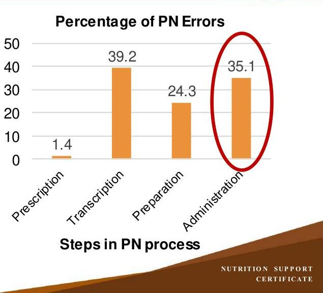

# NUTRITION SUPPORT CERTIFICATE 

## Administration of Nutrition Support, Part 2

Planned by the American Society of Health-System Pharmacists (ASHP) in collaboration with the American Society for Parenteral and Enteral Nutrition (ASPEN).
(c)2022 American Society of Health-System Pharmacists, Inc. All rights reserved.

No part of this publication may be reproduced or transmitted in any form or by any means, electronic or mechanical, including photocopying, microfilming, and recording, or by any information storage and retrieval system, without written permission from the American Society of Health-System Pharmacists.

--- page 1 ---

# ADMINISTRATION OF NUTRITION SUPPORT PART 2 

Todd W. Canada, Pharm.D., BCNSP, BCCCP, FASHP, FTSHP, FASPEN
University of Texas MD Anderson
Cancer Center

NUTRITION SUPPORT CERTIFICATE

## RELEVANT FINANCIAL RELATIONSHIP DISCLOSURE

The following persons in control of this activity's content have relevant financial relationships:

- Andrew Mays: Fresenius Kabi, speaker

All other persons in control of content do not have any relevant financial relationships with an ineligible company.

As defined by the Standards of Integrity and Independence definition of ineligible company. All relevant financial relationships have been mitigated prior to the CPE activity.

--- page 2 ---

# LEARNING OBJECTIVES 

- Outline safe medication administration practices with concurrent enteral or parenteral nutrition.
- Distinguish steps in managing total nutrient admixture vs. 2-in-1 parenteral nutrition with separate lipid injectable emulsion infusions.

## KEY ABBREVIATIONS

- EN:
- GI:
- ILE:
- IV:
- PN:
- TNA: enteral nutrition
gastrointestinal
lipid injectable emulsion
intravenous
parenteral nutrition
total nutrient admixture

--- page 3 ---

# SELF-ASSESSMENT \#1 

A 61-year-old male with Type 2 diabetes mellitus and benign prostatic hypertrophy is admitted with urosepsis in the intensive care unit. He is an ill appearing male ( 80 $\mathrm{kg}, 5^{\prime} 10^{\prime \prime}$ ) with a nasogastric tube placed. Which of the following medications would be MOST appropriate to administer through his nasogastric tube?
A. Tamsulosin 0.4 mg daily
B. Doxazosin 2 mg daily
C. Metformin ER 2000 mg daily
D. Metformin ER 500 mg TID

## SELF-ASSESSMENT \#2

A 55-year-old female with acute myelogenous leukemia and typhlitis is receiving parenteral nutrition. She has multiple IV medications that the nurse is asking you about Y-site compatibility with the PN. Which of the following medications would be compatible to administer via Y-site with the PN?
A. Acyclovir
B. Amphotericin B
C. Ondansetron
D. Piperacillin/Tazobactam

--- page 4 ---

# SAFE MEDICATION PRACTICES WITH EN 

- Dependent on type of feeding tube used:
- Gastrostomy
- Transgastric jejunostomy
- Be aware the use of each lumen and avoid medication administration into stomach when concerns about suctioning the medication before it can be absorbed may occur (e.g., proton pump inhibitors)
- $50 \%$ of patients experience ingredient-related diarrhea when using enteral access tubes for medication administration (especially sorbitol-containing medications)
- Many liquid formulations of medications have osmolalities far exceeding that of the GI tract
- Diarrhea, cramping, abdominal distention, and vomiting

McIntyre CM et al. AmJ Health-Syst Pharm. 2014;71:549-56.

## SAFE MEDICATION PRACTICES WITH EN, CONT.

- Nasoduodenal
- Nasojejunal
- Jejunostomy
- Significant risk of drug-nutrient interactions as both food (enteral nutrition) and medications are administered concurrently
- Post-pyloric administration assumes the medication can be absorbed where it enters the GI tract
- Intestinal site of absorption of most medications is lacking
- Potential increased toxicity due to lack of degradation from gastric acid or decreased first-pass metabolism (e.g., azathioprine)
- Treatment failure

McIntyre CM et al. AmJ Health-Syst Pharm. 2014;71:549-56.

--- page 5 ---

# SAFE MEDICATION PRACTICES WITH EN, CONT. 

- Nasoduodenal
- Nasojejunal
- Jejunostomy
- Avoid use of aspirin and ferrous sulfate post-pylorically
- Require gastric acid for absorption and can only be administered into the stomach
- Increased absorption has occurred post-pylorically for:
- Ciprofloxacin, fluconazole, pravastatin, zinc, azathioprine
- Decreased absorption has occurred post-pylorically for:
- Allopurinol, baclofen, calcium, gabapentin, sirolimus

McIntyre CM et al. AmJ Health-Syst Pharm. 2014;71:549-56.

## SAFE MEDICATION PRACTICES WITH EN, CONT.

- Avoid solid dosage form medications resulting in a significant change in absorption of the active ingredient if opened (e.g., capsule) or crushed (e.g., tablet)
- Immediate release products only
- Evaluate each medication for its inherent solubility and release characteristics
- Consider alternative dosage form, drug or route of administration
- Enteric coated or extended/sustained release especially
- May lead to occluded feeding tube
- Increased drug toxicity if crushed
- Do not add medication directly to an enteral feeding formula

--- page 6 ---

# SAFE MEDICATION PRACTICES WITH EN, CONT. 

- Only crush simple compressed tablets to fine powder and mix with purified water
- Only open hard gelatin capsules and mix powder containing the immediate release medication with purified water
- Provide feeding tube irrigation around the timing of drug administration
- Prior to medication administration, stop the enteral feeding and flush the tube with at least 15 mL water
- Administer the medication using a clean ENFIT syringe
- Flush the tube again with at least 15 mL water
- Repeat with the next medication
- Restart the enteral feeding in a timely manner

Boulatta Jlet al. JPEN J Parenter Enteral Nutr. 2017; 41(1):15-103.

## SAFE MEDICATION PRACTICES WITH EN, CONT.

- Enteral feeding tubes with an internal diameter equal to or greater than 10 French are best for administering crushed or dissolved solid dosage medications
- Tubes less than 10 French require medications in a liquid formulation with few residual solids (e.g., homogeneous)
- Smaller tube sizes are prone to clogging
- Institute for Safe Medication Practices resource:
- Do Not Crush list

--- page 7 ---

# SAFE MEDICATION PRACTICES WITH PN 

- Venous access device determines parenteral drug compatibility in the setting of PN
- Single lumen catheters are the greatest challenge as separate IV administration of other medications with PN is not always possible
- If simultaneous IV administration with PN is inevitable, utilize available IV drug compatibility resources (e.g., Handbook of Injectable Drugs)
- Y-site administration has limited published resources with PN
- 106 drugs evaluated with 83 deemed compatible
- Incompatible drugs included: acyclovir, amphotericin B, haloperidol, heparin, lorazepam, ondansetron
- Contact manufacturer(s) for new PN or ILE product compatibility

Trissel LA et al. JPEN J Parenter Enteral Nutr. 1999; 23(2):67-74.

## MANAGING PN WITH SEPARATE ILE INFUSIONS

- Possible threats to inadvertent PN administrations
- Both PN and separate ILE on same IV pole
- Using 2 separate pumps increases risk for rate error
- Double check of pump settings needed by 2nd nurse prior to start of infusions
- Inadequate room lighting
- Routinely trace lines back to source
- Lines confused despite color differences of IV products
- Confusion of rates of PN and separate ILE
- Omission of in-line filter placement

--- page 8 ---

# ADVANTAGES AND DISADVANTAGES OF TNA 

## Advantages

- $\downarrow$ Pharmacy preparation and nursing administration time
- Only one infusion pump required
- $\downarrow$ risk of touch contamination
- $\downarrow$ Rate of microbial growth vs. ILE alone
- Improved oxidation of lipids

Derenski K et al. Nutr Clin Pract. 2016; 31(5):578-95.

## Disadvantages

- Macronutrients limited to one manufacturer
- Cannot see particulate matter
- Cannot infuse ILE through a 0.22 micron in-line filter
- Requires 1.2 micron in-line filter as for all PN formulations
- Risk of ILE instability

PHE-CPOE PN SAFETY IMPLICATIONS

- Prospective, observational study in a large teaching hospital with a nutrition support team; 4730 PN prescriptions reviewed and 74 errors observed:
- 63\% transcription and preparation errors
- 35.1\% administration errors
- $8 \%$ contributed to or resulted in temporary patient harm
- 15.6 errors/1000 PN prescriptions

Sacks GS et al. Pharmacotherapy. 2009; 29:966-74.

Percentage of PN Errors

--- page 9 ---

# POST-CPOE PN SAFETY IMPLICATIONS 

- Observational study in a 350-bed urban pediatric hospital, 84,503 prescriptions for PN reviewed and 230 errors observed:
- 95\% related to administration
- $9.1 \%$ contributed to or resulted in temporary patient harm
- 2.7 errors/1000 PN prescriptions

MacKay Met al. Nutr Clin Pract. 2016;31:195-206.

## SELF-ASSESSMENT \#1

A 61-year-old male with Type 2 diabetes mellitus and benign prostatic hypertrophy is admitted with urosepsis in the intensive care unit. He is an ill appearing male ( 80 $\mathrm{kg}, 5^{\prime} 10^{\prime \prime}$ ) with a nasogastric tube placed. Which of the following medications would be MOST appropriate to administer through his nasogastric tube?
A. Tamsulosin 0.4 mg daily
B. Doxazosin 2 mg daily
C. Metformin ER 2000 mg daily
D. Metformin ER 500 mg TID

--- page 10 ---

# SELF-ASSESSMENT \#1 

A 61-year-old male with Type 2 diabetes mellitus and benign prostatic hypertrophy is admitted with urosepsis in the intensive care unit. He is an ill appearing male ( 80 $\mathrm{kg}, 5^{\prime} 10^{\prime \prime}$ ) with a nasogastric tube placed. Which of the following medications would be MOST appropriate to administer through his nasogastric tube?
A. Tamsulosin 0.4 mg daily
B. Doxazosin 2 mg daily
C. Metformin ER 2000 mg daily
D. Metformin ER 500 mg TID

## SELF-ASSESSMENT \#2

A 55-year-old female with acute myelogenous leukemia and typhlitis is receiving parenteral nutrition. She has multiple IV medications that the nurse is asking you about Y-site compatibility with the PN. Which of the following medications would be compatible to administer via Y-site with the PN?
A. Acyclovir
B. Amphotericin B
C. Ondansetron
D. Piperacillin/Tazobactam

--- page 11 ---

# SELF-ASSESSMENT \#2 

A 55-year-old female with acute myelogenous leukemia and typhlitis is receiving parenteral nutrition. She has multiple IV medications that the nurse is asking you about Y-site compatibility with the PN. Which of the following medications would be compatible to administer via Y-site with the PN?
A. Acyclovir
B. Amphotericin B
C. Ondansetron
D. Piperacillin/Tazobactam

## CONCLUSIONS

- Safe use of medication administration via an enteral feeding tube requires:
- Knowledge of proximal end of tube in Gl tract for drug absorption
- Osmolality of medication and use of other excipients such as sorbitol
- Dosage form that is immediate release
- Adequate flushing of the feeding tube before and after medication
- Safe use of medication administration via Y-site with PN requires:
- Confirmed drug compatibility (e.g., Handbook of Injectable Drugs)
- Other IV site or enteral options if no compatibility information exists
- Use of PN with separate ILE infusion increases the risk of administration errors

--- page 12 ---

# REFERENCES 

- Boullata JI, Carrera AL, Harvey L et al. A.S.P.E.N. safe practices for enteral nutrition therapy. JPEN J Parenter Enteral Nutr. 2017; 41(1):15-103.
- Derenski K, Catlin J, Allen L. Parenteral nutrition basics for the clinician caring for the adult patient. Nutr Clin Pract. 2016; 31(5):578-95.
- MacKay M, Anderson C, Boehme S et al. Frequency and severity of parenteral nutrition medication errors at a large children's hospital after implementation of electronic ordering and compounding. Nutr Clin Pract. 2016; 31(2):195-206.
- McIntyre CM, Monk HM. Medication absorption considerations in patients with postpyloric enteral feeding tubes. Am J Health-Syst Pharm. 2014; 71(7):549-56.
- Sacks GS, Rough S, Kudsk KA. Frequency and severity of harm of medication errors related to the parenteral nutrition process in a large university teaching hospital. Pharmacotherapy. 2009; 29(8):966-74.

NUTRITION SUPPORT CERTIFICATE

## REFERENCES, CONT.

- Simmons D, Symes L, Guenter P et al. Tubing misconnections: Normalization of deviance. Nutr Clin Pract. 2011; 26(3):286-93.
- Trissel LA, Gilbert DL, Martinez JF et al. Compatibility of medications with 3-in-1 parenteral nutrition admixtures. JPEN J Parenter Enteral Nutr. 1999; 23(2):67-74.

--- page 13 ---

NUTRITION SUPPORT CERTIFICATE

--- page 14 ---

# Todd W. Canada, Pharm.D., BCNSP, BCCCP, FASHP, FTSHP, FASPEN 

Clinical Pharmacy Services Manager
Nutrition Support Team Coordinator
University of Texas MD Anderson Cancer Center
Houston, Texas
Todd W. Canada serves as a clinical pharmacy services manager and nutrition support team coordinator for the University of Texas MD Anderson Cancer Center in Houston, Texas. He received his B.S. in Pharmacy from the University of Oklahoma Health Sciences Center and his postbaccalaureate Pharm.D. from the University of Texas Health Science Center at San Antonio.

Dr. Canada completed a specialized residency in Critical Care / Nutrition Support at the University of Tennessee-Memphis and has been board certified in nutrition support since 1996 and critical care since 2016. Dr. Canada has previously served on the Board of Pharmaceutical Specialties - Nutrition Support Specialty Council and the American Society for Parenteral and Enteral Nutrition (ASPEN) Board of Directors. He was the recipient of the ASPEN Distinguished Nutrition Support Pharmacist Service Award in 2011 and Stanley Serlick Safety Award in 2017.

--- page 15 ---

# Relevant Financial Relationship Disclosure

In accordance with our accreditor’s Standards of Integrity and Independence in Accredited Continuing Education, ASHP requires that all individuals in control of content disclose all financial relationships with ineligible companies. An individual has a relevant financial relationship if they have had a financial relationship with ineligible company in any dollar amount in the past 24 months and the educational content that the individual controls is related to the business lines or products of the ineligible company.

An ineligible company is any entity producing, marketing, re-selling, or distributing health care goods or services consumed by, or used on, patients. The presence or absence of relevant financial relationships will be disclosed to the activity audience.

The following persons in control of this activity’s content have relevant financial relationships:

- Phil Ayers: Fresenius Kabi, consultant and speaker
- David Evans: Fresenius Kabi, consultant and speaker; Abbott Laboratories, consultant and speaker; CVS/OptionCare, consultant; Alcresta, consultant and speaker
- Andrew Mays: Fresenius Kabi, speaker
- Jay Mirtallo: Fresenius Kabi, consultant
- Kris Mogensen: Baxter, speaker; ThriveRx, advisory board; Pfizer, advisory board

All other persons in control of content do not have any relevant financial relationships with an ineligible company.

As required by the Standards of Integrity and Independence in Accredited Continuing Education definition of ineligible company, all relevant financial relationships have been mitigated prior to the CPE activity.

# Methods and CE Requirements

This online activity consists of a combined total of 12 learning modules. Pharmacists and physicians are eligible to receive a total of 20 hours of continuing education credit by completing all 12 modules within this certificate.

Participants must participate in the entire activity, complete the evaluation and all required components to claim continuing pharmacy education credit online at ASHP Learning Center http://elearning.ashp.org. Follow the prompts to claim credit and view your statement of credit within 60 days after completing the activity.

# Important Note – ACPE 60 Day Deadline:

Per ACPE requirements, CPE credit must be claimed within 60 days of being earned. To verify that you have completed the required steps and to ensure your credits have been reported to CPE Monitor, check your NABP eProfile account to validate that your credits were transferred successfully before the ACPE 60-day deadline. After the 60 day deadline, ASHP will no longer be able to award credit for this activity.

# System Technical Requirements

Courses and learning activities are delivered via your Web browser and Acrobat PDF. Users should have a basic comfort level using a computer and navigating websites.

View Frequently Asked Questions for more information.