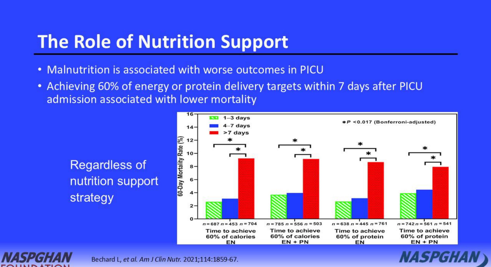
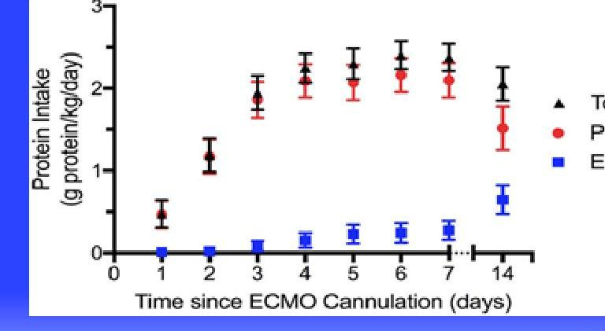

# Parenteral Nutrition (PN) for the Specialized Patient

--- page 1 ---

# Outline 

- Case
- Parenteral nutrition considerations in
- Critical illness
- Extracorporeal membrane oxygenation (ECMO)
- Chylothorax
- GI surgery, high ostomies
- Liver disease
- Renal disease
- Inborn errors of metabolism
- Short bowel syndrome/Intestinal Failure
- Case review

--- page 2 ---

# Case 

Lucy is a 5-month-old with biliary atresia and progressive end stage liver disease who is listed for transplant. She has been admitted on the GI ward for enteral nutrition to treat worsening malnutrition, however, is now transferred to PICU with fever, tachycardia, poor peripheral perfusion and hypoxia, requiring sedation and mechanical ventilation.

1) What information would you like to assess her nutrition?
2) Would you recommend parenteral nutrition and when?
3) What factors would influence the energy requirements of this patient?

--- page 3 ---

# **Pathophysiology of Injury in Pediatric Intensive Care (PICU)**

Traditionally considered pre-resuscitative ebb phase and 'often' hypometabolic

Traditionally considered flow phase and 'often' hypermetabolism

--- page 4 ---

# **Impact on Intermediary Metabolism**

## **CNS Hormones & Catecholamines**

- ↑ gluconeogenesis
- ↑ glycolysis
- ↑ insulin resistance
- ↑ lipolysis & FFA release
- ↑ proteolysis & hepatic synthesis acute phase proteins

## **Cytokines**

- ↑ proteolysis exceeds synthesis with ↑ urinary nitrogen
- ↑ lipolysis
- ↑ insulin resistance
- ↑ demand for and use of oxygen in tissues

## **Together results in catabolism with resistance to anabolism causing:**

- Skeletal muscle wasting
- Hyperglycemia
- High free fatty acids
- Hypertriglyceridemia
- High lactate levels

--- page 5 ---

# **Concepts of Inflammation and Immunosuppression in Critical Illness**

- These patients are at high risk for severe malnutrition: another risk factor for secondary infections

- Going forward it will be important to understand if nutrition support in PICU might modify **Systemic Inflammatory Response Syndrome (SIRS)** and **Compensatory Anti-inflammatory Response Syndrome (CARS)**

--- page 6 ---

# Malnutrition in Critical Illness 

- Undernutrition is common in patients admitted to PICU (20-45\%)
- Obesity increasingly common
- Catabolism with rapid loss of protein stores expected in all
- Greatest risk for undernourished children, neonates and infants
- Muscle loss and loss of muscle function results in sarcopenia, which increases risks:
- Prolonged ventilation
- Acquired pneumonia
- Prolonged length of stay
- Mortality
- Prolonged rehabilitation for survivors

--- page 7 ---

# **APSPEN Guidelines**

|  Clinical Guidelines | ASPEN
AAPEN
AAPEN
AAPEN
AAPEN
AAPEN
AAPEN
AAPEN
AAPEN
AAPEN
AAPEN
AAPEN
AAPEN
AAPEN
AAPEN
AAPEN
AAPEN
AAPEN
AAPEN
AAPEN
AAPEN
AAPEN
AAPEN
AAPEN
AAPEN
AAPEN
AAPEN
AAPEN
AAPEN
AAPEN
AAPEN
AAPEN
AAPEN
AAPEN
AAPEN
AAPEN
AAPEN
AAPEN
AAPEN
AAPEN
AAPEN
AAPEN
AAPEN
AAPEN
AAPEN
AAPEN
AAPEN
AAPEN
AAPEN
AAPEN
AAP

--- page 8 ---

# The Role of Nutrition Support

- Malnutrition is associated with worse outcomes in PICU
- Achieving 60% of energy or protein delivery targets within 7 days after PICU admission associated with lower mortality

Regardless of nutrition support strategy

--- page 9 ---

# Route of Nutrition Support in Critical Illness

- A functional gut should always be used for enteral nutrition (EN), including in critical illness where early enteral nutrition (EEN: 24 - 48h) is preferred and safe
- EN Contraindicated if: anatomical disruption, obstruction or ischemia
- PN Indicated when cannot use gut

|  Benefits | Limitations  |
| --- | --- |
|  Reduce gut atrophy | Increase gut oxygen needs; can be
contraindicated in severe shock  |
|  Improve gut motility | Risk of Aspiration  |
|  Reduced infections (enhanced gut
immune function and avoidance of
translocation) | Frequent interruptions for fasting
for diagnostic and other
procedures limit efficacy,
especially in malnourished
patients  |
|  Less likely to overfeed | Risk of underfeeding  |
|  Cost effective |   |

--- page 10 ---

# What is the Role \& Timing of Supplemental PN? 

- Based on lack of evidence timing to start supplemental PN when EN intake is insufficient remains controversial
- 2017 Guideline [low quality evidence, weak recommendations]:
- Start PN If cannot start EN
- Based on a single RCT, do not start PN within 24 h of admission
- Based on a single RCT, delay supplemental PN until 1 week after PICU admission for patients with normal nutrition and low risk of worsening nutritional status
- Use caution applying that approach to neonates or children with malnutrition at admission to PICU, who may warrant earlier intervention

--- page 11 ---

# The Early versus Late Parenteral Nutrition in the Pediatric Intensive Care Unit (PEPaNIC) Trial 

- Multicenter, prospective, randomized, controlled, parallel-group superiority trial (unblinded)
- 723 patients receiving early PN within 24 hours after ICU admission
- 717 patients received late PN on day 8 if still $<80 \%$ of target EN requirements
- All patients started early enteral nutrition (EEN) within 24h
- EN advanced for all per protocol
- Newborn - 17 years (45\% infants)
- Preterm neonates were excluded

--- page 12 ---

# The Early versus Late Parenteral Nutrition in the Pediatric Intensive Care Unit (PEPaNIC) Trial 

- No differences in mortality
- Late PN group had less infections (10.7\% vs 18.5\%; p<0.001)
- Late PN group had shorter ICU stay (9.2 vs 6.5d; p<0.001)
- Late PN group had shorter duration ventilation ( $p=0.001$ )
- Late PN group had less renal replacement therapy ( $p=0.04$ )
- Late PN group had shorter hospital stay (21.3 vs 17.2d; $p=0.001$ )
- Late PN group had more hypoglycemia ( $9.1 \%$ vs $4.8 \% ; p=0.001$ )

--- page 13 ---

# Limitations of the PEPaNIC Trial 

- 77\% of late PN group discharged prior to starting PN
- 55\% of early PN group discharged by day 4
- likely would tolerate EN and not need PN
- Protein and energy provision was estimated so that both groups may have had either over and under feeding
- Parenteral nutrient delivery was not standardized
- Risk of overfeeding particularly high in early PN group
- Overfeeding known risk factor for infections with PN
- Majority sample did not screen at nutritional risk and were normal weight limiting generalizability to malnourished patients

--- page 14 ---

# Risks of Underfeeding in Critical Illness 

- Hypoglycemia
- Progressive sarcopenia in PICU
- Prolonged ventilation due to sarcopenia
- Increased infection risk
- Poor wound healing
- Prolonged sarcopenia post PICU stay requiring rehabilitation
- Potential to adversely impact neurocognitive and psychomotor development

--- page 15 ---

# Risks of Overfeeding in Critical Illness 

- Hyperglycemia, which increases risk of sepsis and poor wound healing
- Hypertriglyceridemia
- Hepatic steatosis
- Cholestasis
- Uremia
- Ventilator dependency with hypercapnia from glucose overfeeding

--- page 16 ---

# **Until the Best Approach is Known Consider an Individualized Approach?**

- Delay PN 7 days if risk of overfeeding
- Only use if not meeting 60% of EN goals and advancing
- Consider supplemental PN 3-5 days if risk of underfeeding

--- page 17 ---

# Parenteral Energy Requirements 

- Energy requirements are highly variable in PICU
- Often lower than predicted, e.g., sedation, ventilation, paralysis, PN (NPO)
- Can be higher, e.g., CNS injury with dysautonomia, burns
- Predictive equations for energy have limited accuracy
- But due to lack of access to calorimetry are widely used

--- page 18 ---

# Parenteral Energy Requirements - Cont'd 

- 2017 Guideline [low quality evidence, weak recommendations]
- Use calorimetry to guide energy goals
- In the absence of calorimetry use Schofield/FAO/WHO/UNU equations
- NOT Harris Benedict or RDA
- DO NOT add stress factors
- Target at least $2 / 3$ of goal energy be end of first week in PICU
- Individualize approach according to baseline nutrition and risk for over or underfeeding

--- page 19 ---

# Priority Patients for Measuring Resting Energy Expenditure (REE) in PICU 

1. Malnutrition (BMI<5th percentile) or overweight (BMI $>85^{\text {th }}$ )
2. $>10 \%$ weight gain or loss during PICU stay
3. Failure to consistently meet prescribed caloric goals
4. Failure to wean or escalation in respiratory support
5. Need for muscle relaxants $>7$ days
6. Need for ventilation $>7$ days
7. CNS trauma (injury, hypoxia, ischemia) with dysautonomia
8. Oncologic diagnosis
9. PICU stay $>14$ days
10. Suspect Hypometabolism (e.g., hypothermia/cooling, drug induced coma) or Hypermetabolism (e.g., SIRS, status epilepticus, hyperthermia)

--- page 20 ---

# Parenteral Protein Requirements 

- Both protein breakdown and synthesis are increased in critical illness
- Negative nitrogen balance results
- Protein supply is critical and often underestimated
- Bedside tools to evaluate nitrogen balance limited (especially in renal impairment)
- Increased requirement in burns, gastrointestinal losses, open wounds, continuous renal replacement therapy
- 2017 Guideline [moderate quality evidence, strong recommendations]
- Provide a minimum of $1.5 \mathrm{~g} / \mathrm{kg} /$ day protein (and more in infants)
- Do not use RDA (recommended daily allowance) as will be insufficient

--- page 21 ---

# **Both Important to Achieve Positive Nitrogen Balance**

- Systematic review 9 studies 1981-2011 (n=347) children with heterogenous diagnoses admitted to PICU (who had measured protein balance)
- Positive balance with protein intake > 1.5g/kg/d or energy intake > 57Kcal/kg/day

--- page 22 ---

# Extracorporeal Membrane Oxygenation (ECMO) 

- Indicated for severe cardiac and/or respiratory failure
- Evidence base limited to expert opinion and case series
- EN safe for 75-90\% of patients on ECMO
- Feeding intolerance is common, up to $50 \%$
- Acknowledged risk for gut hypoperfusion, although severe GI complications reportedly rare
- PN (total parenteral nutrition with nil enteral) may be preferred in unstable patients with escalating inotropes or concerning symptoms like bilious emesis, GI bleeding or increasing abdominal distention

--- page 23 ---

# ECMO – Cont'd

- REE not readily measured or predicted by current equations
- EN has *risk of underfeeding* given feeding intolerance
- Supplemental PN can increase protein and energy delivery, but *risk of overfeeding*
- Start supplemental PN 5-7 days well nourished or 3-5 days in malnourished children

--- page 24 ---

# Chylothorax 

- Common complication in PICU after cardiac surgery, 5\%
- Majority can be managed medically: median chain triglyceride (MCT) enriched EN first line treatment
- No RCTs comparing MCT-rich EN to PN and nil per os
- PN (with lipids) may be indicated if refractory to EN or high-volume losses $>10 \mathrm{ml} / \mathrm{kg} /$ day
- More than $80 \%$ effective, without further medication or surgery
- Risk of nutritional losses and immunosuppression
- Chylous fluid has 20-60g/L protein, electrolytes, trace minerals, immune cells and immunoglobulins
- Monitor for EFAD if extended use of MCT-rich EN, although rare

--- page 25 ---

# Gastrointestinal Surgery \& Ostomies 

- Massive intestinal resection induces major functional and metabolic changes in the GI tract
- Loss of inhibitory reflexes of the enteric nervous system including cologastric and ileogastric reflexes, accelerating intestinal motility
- Decrease in enterohormones leading to accelerated gastric emptying and increased gastric secretion
- Bile acid loss
- Major net loss of fluids and electrolyte via end-jejunostomy
- Losses worsened by oral intake
- PN mixture must meet higher hydration needs and compensate nutrition losses

--- page 26 ---

# **Consider Site Specific Effects of Intestinal Resection for GI Function (and Stoma Losses) and GI Hormones**

|  Nutrient Absorption Sites | Mediator Release Sites  |
| --- | --- |
|  **Duodenum/Proximal Jejunum** | **Stomach**  |
|  - macronutrients | - gastrin  |
|  - iron | - ghrelin  |
|  - folate | **Duodenum**  |
|  - calcium | - cholecystokinin  |
|  - vitamins/minerals | - secretin  |
|  **Jejunum/Proximal Ileum** | **GIP**  |
|  - macronutrients | - VIP  |
|  - calcium | **Jejunum/Ileum**  |
|  - vitamins/minerals | - neurotensin  |
|  **Distal Ileum** | **Distal Ileum/Colon**  |
|  - bile salts | - peptide YY  |
|  - vitamin B12 | - GLP-1  |
|  - SCFA | - GLP-2  |
|  **Colon** |   |
|  - SCFA |   |
|  - minerals |   |
|  - vitamin K |   |

--- page 27 ---

# Gastrointestinal Surgery \& Ostomies 

- PN considerations to compensate for high losses in proximal ostomies
- Fluid
- Sodium; patients will not grow until adequately supplemented with sodium. Recommend following urine sodium to guide sodium replacement.
- Potassium
- Bicarbonate; incompatible with PN so replaced as acetate in PN; in end stage liver disease may have difficulty converting acetate to bicarbonate
- Zinc
- Iron; increased needs in ex-preterm, with chronic GI blood loss and extensive proximal small bowel loss; can be added to PN, but not with sepsis or 3:1 solutions
- Copper; standard supplementation may be inadequate

--- page 28 ---

# Malnutrition in Pediatric Chronic Liver Disease

|  Decreased energy intake | Anorexia
Changes in taste perception
Early satiety
Nausea / vomiting  |
| --- | --- |
|  Increased energy intake | Increased energy requirement up to 150\% EAR
Hypermetabolic state in end-stage liver disease
Sequelae of CLD (i.e., peritonitis, variceal bleeding)
Increased pro-inflammatory cytokines  |
|  Endocrine dysfunction | Impaired GH / IGF-1 axis
Decreased IGF-1 formation  |
|  Malabsorption and disordered substrate metabolism | Carbohydrate - hypoglycemia from decreased glycogen stores, hepatocyte loss in fulminant liver failure
Proteins - increased protein catabolism, impaired protein synthesis
Fats - malabsorption from decreased bile delivery to small bowel, unconjugation of bile salts with bacterial overgrowth (in children with Kasai portoenterostomy), congested intestinal mucosa.  |

--- page 29 ---

# Liver Disease 

- Supplement
- Zinc (if deficient)
- Potassium (especially if on diuretics)
- Fat soluble vitamins D, E, K (if deficient)
- Protein (if hypoalbuminemic and not encephalopathic)
- Encephalopathy
- Reduce protein
- Monitor ammonia
- Cholestasis
- Restrict copper, manganese since they are secreted in bile
- Adjust lipids: consider fish oil lipid emulsion (Omegaven ${ }^{\circledR}$ )
- Immunosuppressant medications can affect nutritional status

--- page 30 ---

# Vitamins: Lab Markers and Dosing Recommendations 

## Vitamin A

Laboratory Markers
Serum retinol level
If available RDR

## Recommendations

1000 IU/kg/day, up to
25,000 IU of water miscible formulations

- $<10 \mathrm{~kg}$ : start with 5000 IU/day
- $>10 \mathrm{~kg}$ : start with 10,000 IU/day

## Vitamin D

Laboratory Markers
Serum 25-OHD

## Recommendations

Cholecalciferol

- Weight $>40 \mathrm{~kg}$
- Serum level <10 $\mathrm{ng} / \mathrm{mL}: 5000 \mathrm{IU} /$ day
- Serum level 11-19 $\mathrm{ng} / \mathrm{mL}: 4000 \mathrm{IU} /$ day
- Serum level 20-29 $\mathrm{ng} / \mathrm{mL}: 3000 \mathrm{IU} /$ day
- Weight $<40 \mathrm{~kg}$
-120-200 IU/kg

## Vitamin E

Laboratory Markers
Serum tocopherol level
If available
$\alpha$-tocopherol/total
lipids ratio

## Recommendations

D- $\alpha$-tocopherol
polyethylene glycol 1000
succinate (TPGS) 15-25
IU/kg/day

## Vitamin K

Laboratory Markers
PT/INR
If available PIVKA-II

## Recommendations

2.5-5 mg/day 2-7 times weekly; 1-10 mg intravenous as needed

--- page 31 ---

# Nutritional Needs of Children With CLD Before and After Liver Transplant 

## Liver Transplant

## Before

## ENERGY INTAKE

- 130-150\% EAR

CARBOHYDRATES

- 15-20 g/kg/day given as glucose polymers

PROTEINS

- 3-4 g/kg/day; if acutely encephalopathic may temporarily restrict to $<2 \mathrm{~g} / \mathrm{kg} /$ day, BCAA-enriched formula can be considered

## FATS

- 8 g/kg/day, with 30-50\% as MCT
- Infants can receive formula containing up to $75 \%$ MCT; higher MCT content may result in essential fatty acid deficiency

## After

## ENERGY INTAKE

- 120\% EAR

CARBOHYDRATES

- 6-8 g/kg/day given as glucose polymers

PROTEINS

- 2.5-3 g/kg/day

## FATS

- 5-6 g/kg/day LCT
- Children receiving high MCT-containing supplementation pretransplant can transition to standard formula once bile flow is established post-transplant

--- page 32 ---

# Nutritional Side-Effects of Immunosuppressive Meds

|  Immunosuppressant | Nutritional Side-Effects  |
| --- | --- |
|  Calcineurin inhibitors (FK, tacrolimus, cyclosporine) | Hyperlipidemia, Hyperglycemia
Hypomagnesemia, Hyperkalemia
Hypertension
Avoid grapefruit  |
|  Corticosteroids (prednisone, methylprednisolone) | Hyperglycemia, Hyperlipidemia
Sodium retention, Hypertension
Increased appetite, Weight gain
Muscle wasting
Peptic ulcer disease
Impaired wound healing
Electrolyte disturbances  |
|  Mycophenolate (MMF) | Diarrhea, Nausea  |
|  Azathioprine | Nausea, vomiting, sore throat, altered taste acuity  |
|  Sirolimus | Hyperlipidemia, GI symptoms  |

--- page 33 ---

# Renal Disease 

- When to consider PN
- Peritoneal dialysis complicated by ileus or peritonitis
- Critically ill patients on hemodialysis
- Severe malnutrition, intolerance of enteral feeds
- Intestinal obstruction (mechanical or pseudo-obstruction)
- Acute Kidney Injury (AKI)
- Fluid intake is often reduced
- Volume available for PN can impact on caloric intake
- Protein intake often restricted to meet minimum requirements
- Electrolytes based on serum levels

--- page 34 ---

# Renal Disease - Cont'd 

- On dialysis
- Protein losses are increased by dialysis
- Dialysis removes excess urea
- Increase fluid, calorie, and protein provision
- No longer need to restrict or reduce protein provision

--- page 35 ---

# Renal Disease Nutrient Recommendations

|  Restriction may be required | Supplementation may be required  |
| --- | --- |
|  Deduct dialysate glucose when calculating glucose infusion rate (GIR) | Protein
(increased losses with dialysis)  |
|  Total fluids (based on fluid status and dialysis settings) | Alkali due to increased losses in 'nonoliguric' renal failure (e.g., congenital hydronephrosis, renal dysplasia)  |
|  Sodium (give in small amounts due to diminished excretion) | Sodium due to increased losses in 'nonoliguric' renal failure (e.g., congenital hydronephrosis, renal dysplasia)  |
|  Potassium (give in small amounts due to diminished excretion) | Potassium
(if on diuretics or depending on dialysate)  |
|  Phosphorous (give in small amounts due to diminished excretion) |   |
|  Vitamin C to <100 mg/day in pts with hyperoxaluria |   |
|  Lipids in patients with hyperlipidemia of renal failure |   |

--- page 36 ---

# Estimated Energy and Protein Requirements in Children with Renal Disease

|  Age Group | Pre-Dialysis |  | Hemodialysis |  | Peritoneal Dialysis |   |
| --- | --- | --- | --- | --- | --- | --- |
|   | Energy
Kcal/kg/d | Protein
g/kg/d | Energy
Kcal/kg/d | Protein
g/kg/d | Energy
Kcal/kg/d | Protein
g/kg/d  |
|  $0-6 \mathrm{~m}$ | $100-110$ | $1.5-2.2$ | $100-110$ | 1.6 | $100-110$ | 1.8  |
|  $6-12 \mathrm{~m}$ | $95-105$ | $1.2-1.7$ | $95-105$ | 1.3 | $95-105$ | 1.5  |
|  $1-3 \mathrm{y}$ | 90 | $1.05-1.5$ | 90 | 1.15 | 90 | 1.3  |
|  $4-10 \mathrm{y}$ | 70 | $0.95-1.35$ | 70 | $1.05-1.6$ | 70 | $1.1-2.0$  |
|  $11-14 \mathrm{y}$ (boys) | 55 | $0.95-1.35$ | 55 | $1.05-1.4$ | 55 | $1.1-1.8$  |
|  $11-14 \mathrm{y}$ (girls) | 47 | $0.95-1.35$ | 47 | $1.05-1.4$ | 47 | $1.1-1.8$  |
|  $15-18 \mathrm{y}$ (boys | 45 | $0.85-1.2$ | 45 | $0.95-1.3$ | 45 | $1.0-1.5$  |
|  $15-18$ (girls) | 40 | $0.85-1.2$ | 40 | $0.95-1.2$ | 40 | $1.0-1.5$  |

--- page 37 ---

# Micronutrients in AKI: Energy

|  Macronutrient | AKI, no RRT | CRRT | PIRRT | HD | PD  |
| --- | --- | --- | --- | --- | --- |
|  Energy | Dictated by disease state, malnutrition, and illness severity |  |  |  |   |
|  Key considerations | N/A | - High removal rates of levocarnitine may influence metabolism of free fatty acids
- Largely dependent o use of citrate-based anticoagulation and dextrose solutions used within respective institutions
- Larger patients likely receive more significant exposure
- May be CRRT dose dependent. Higher dose may clear more nonnutritive fluids into effluent than lower doses.
- Glucose-free replacement fluids may lead to energy removal
- Hyperosmolar, hyperglycemic states may contribute to energy deficit | N/A | - Dextrose is present in dialysate but assessment of exposure cannot be performed without assessment of membrane transporter status
- Monitor weight trends and adjust nutrition support accordingly |   |

Note: Suggestions within this table are initial recommendations that should be titrated based on patient progress and reassessment of the patient's nutrition status and medical goals of care.

--- page 38 ---

# Micronutrients in AKI: Protein

|  Macronutrient | AKI, no RRT | CRRT | PIRRT | HD | PD  |
| --- | --- | --- | --- | --- | --- |
|  Protein | DRI /
age minimum | $\geq 2.5 \mathrm{~g} / \mathrm{kg} /$ day protein or ASPEN/ age + additional $10 \%-20 \%$ to account for removal |  | ASPEN /
age $+0.1 \mathrm{~g} / \mathrm{kg} /$ day | ASPEN /
age $+0.3$
$\mathrm{g} / \mathrm{kg} /$ day  |
|  Key considerations | - Temporary protein restrictions may be implemented if AKI recovery expected soon
- Inability to obtain dialysis access may limit ability to provide goal protein intake | - No expectation the SUN levels are low or normal
- $2.5 \mathrm{~g} / \mathrm{kg} /$ day is extrapolated from adults | - May require less protein than CRRT, given intermittent nature | - Value is extrapolated from adults receiving HD $3 \times /$ week
- If HD frequency expected to be higher, adjust for increased frequency | - Values are extrapolated from populations with chronic ESRD  |

Note: Suggestions within this table are initial recommendations that should be titrated based on patient progress and reassessment of the patient's nutrition status and medical goals of care.

--- page 39 ---

# Micronutrients in AKI: Fluid

|  Macronutrient | AKI, no RRT | CRRT | PIRRT | HD | PD  |
| --- | --- | --- | --- | --- | --- |
|  Fluid | Largely dependent on responsiveness to diuretics | - Unrestricted
- May be temporarily restricted around initial start | Largely dependent on length of treatment | - < 13-ml/kg/h per treatment
- Limit myocardial stunning; may be lower in hemodynamically unstable patients | Unpredictable  |
|  Key considerations | - Follow I/Os and fluid balance goals accounting for urine output, volume of medications, and blood products
- Concentrate nutrition support when able if not achieving fluid balance goals |  |  |  |   |

Note: Suggestions within this table are initial recommendations that should be titrated based on patient progress and reassessment of the patient's nutrition status and medical goals of care.

--- page 40 ---

# Inborn Errors of Metabolism 

- PN should be initiated quickly during metabolic stressors
- Promote anabolism
- Diminish catabolism
- Use PN short-term and start enteral nutrition (EN) as soon as clinically feasible
- Metabolic parameters should be monitored closely with adjustment of type and amount of protein when necessary
- Common metabolic stressors
- Trauma
- Infection
- Burns
- Altered mental status
- Gastrointestinal (pancreatitis, ileus)
- Essential fatty acid deficiency

--- page 41 ---

# Inborn Errors of Metabolism: Phenylketonuria (PKU) 

- Hypercatabolism occurs during stress
- Parallels the extent of infection/injury
- Goal is prevention of prolonged phenylalanine (PHE) elevation
- Interventions to depress catabolic response
- PN as bridge to enteral nutrition
- PHE-free parenteral amino-acid solution with some standard parenteral amino acids
- Not commercially available
- Needs to be made by a compounding pharmacy

--- page 42 ---

# Inborn Errors of Metabolism: Mitochondrial Disorders 

- Avoid exposure to PN if possible
- High-glucose diet is a metabolic challenge for impaired oxidative phosphorylation
- Glucose oxidation is largely aerobic in the liver
- High lipid/low carbohydrate diet recommended in Complex I deficiency
- Carnitine supplementation is recommended in patients with secondary carnitine deficiency
- Dose of carnitine needed is higher than nutritional doses
- Carnitine to be administered separately from PN to ensure adequate provision

--- page 43 ---

# Inborn Errors of Metabolism: Propionic Acidemia and Methylmalonic Acidemia (MMA) 

Management of acute crisis

- Remove sources of isoleucine (ILE), methionine (MET), threonine (THR), valine (VAL)
- IV glucose and electrolytes: $150 \mathrm{~mL} / \mathrm{kg}$; glucose infusion rate (GIR): $10 \mathrm{mg} / \mathrm{kg} / \mathrm{min}$
- Treat metabolic acidosis and maintain normal sodium levels
- Add lipids $2-3 \mathrm{~g} / \mathrm{kg} /$ day to achieve total caloric goal of 120-150 $\mathrm{kcal} / \mathrm{kg} /$ day (infant)
- Intravenous L-carnitine 100-300 mg/kg/day to help improve clearance

--- page 44 ---

# Inborn Errors of Metabolism: Propionic Acidemia and MMA - Cont'd 

Management of acute crisis

- Combination PN (and EN) within 24 - 48 hours to prevent ILE, MET, THR and VAL deficiency
- Initiate protein at $0.5 \mathrm{~g} / \mathrm{kg} /$ day and increase as tolerated not exceeding prescribed amounts
- Monitor daily plasma amino acids until stable
- Peripheral PN will not provide sufficient energy for anabolism

--- page 45 ---

# Inborn Errors of Metabolism: Maple Syrup Urine Disease (MSUD) 

- Comatose or Neurologically compromised patients
- Goal calories

Infants: 120 - 140 kcal/kg/day
Children: 80 - 100 kcal/kg/day
Adults: 40 - 45 kcal/kg/day

- Add insulin to treat hyperglycemia (need anabolic GIR)

--- page 46 ---

# Inborn Errors of Metabolism: MSUD - Cont'd 

- Use branch chain amino acid (BCAA)-free solution and monitor plasma amino acids
- Neonates: give $2.5-3 \mathrm{~g} / \mathrm{kg} /$ day protein
- Plasma ILE/VAL decrease more rapidly then, LEU
- Add ILE/VAL supplement to PN at lower limits of recommended intake
- Add LEU when plasma LEU reaches $200 \mu \mathrm{~mol} / \mathrm{L}$
- Not commercially available, needs to be made by a compounding pharmacy
- Normalization of all 3 BCAA usually happens in 48 - 72 hours
- When able to tolerate enteral feeds start BCAA-free food

--- page 47 ---

# Inborn Errors of Metabolism: Urea Cycle Disorders (UCDs) 

- Provide abundant calories with high glucose and lipids to minimize catabolism
- Reduce nitrogen load
- Restrict nitrogen intake
- Activate alternate pathways for nitrogen excretion
- Arginine supplementation needed
- Available as a separate IV infusion for this purpose
- Monitor closely for catabolic stressors and risk factors for hyperammonemia
- Birth
- Illness
- Excess protein intake
- Surgery

--- page 48 ---

# Inborn Errors of Metabolism: UCDs - Cont'd 

- Early consideration of parenteral support, if emesis is present to diminish catabolic sequelae
- High parenteral energy provision
- 80 - 100 kcal/kg/day for infants
- 10\% dextrose and ILE with glucose infusion rate of 6 - 8 $\mathrm{mg} / \mathrm{kg} / \mathrm{min}$ and $1-2 \mathrm{~g} / \mathrm{kg} /$ day fat
- For persistent catabolism use 10 - 35\% dextrose along with insulin (to stop catabolism of glucose)

--- page 49 ---

# Short Bowel Syndrome / Intestinal Failure

- Pediatric Intestinal Failure as defined by NASPGHAN 2017 as, "The need for PN for > 60 days due to intestinal disease, dysfunction or resection."
- PN is needed to meet energy, fluid, and nutritional requirements when enteral nutrition (EN) is insufficient or cannot be tolerated

|  Diagnosis associated with intestinal failure and short bowel syndrome in infants (N=272) |   |
| --- | --- |
|  Diagnosis | N (\%)  |
|  Necrotizing enterocolitis | 71 (26)  |
|  Gastroschisis | 44 (16)  |
|  Intestinal atresia (large/small) | 27 (10)  |
|  Volvulus | 24 (9)  |
|  Long segment Hirschsprung's disease | 11 (4)  |
|  Tufting or microvillus inclusion | 3 (1)  |
|  Other single diagnoses | 14 (5)  |
|  Unknown | 1  |
|  Multiple single diagnoses | 77928)  |

--- page 50 ---

# **Intestinal Failure Associated Liver Disease (IFALD)**

- IFALD is seen in up to 2/3rds of patients on long-term PN
- IFALD is defined as *"hepatobiliary dysfunction as a consequence of medical and surgical management strategies for intestinal failure which can variably progress to end-stage liver disease or can be stabilized or reversed with promotion of intestinal adaptation."*
- Many factors contribute to the development of IFALD

Norsa L, *et al.* *Nutrients* 2018;10:664.

--- page 51 ---

# PN in Intestinal Failure 

- Multifactorial etiology
- Macronutrient excess promotes hepatic steatosis
- High GIR result in increased insulin, triggering hepatic lipogenesis
- Target required energy for disease state
- Balance nonprotein calories: $75 \%$ as carbohydrate, $25 \%$ as fat
- High cumulative infusion of amino acids may also play a role
- Use of PN amino acid solutions designed for children to avoid nitrogen excess is advised
- Blood urea nitrogen, acidosis, nitrogen balance and growth can be monitored

--- page 52 ---

# Lipid Emulsions and IFALD 

- Soy based intravenous lipid emulsions (ILE) contain high $\omega-6$ long-chain polyunsaturated fatty acids (PUFA), phytosterols and low antioxidant content which promote inflammation and worsen cholestasis
- Discontinuation or minimizing pure soybean oil lipid emulsions (typically to $1 \mathrm{~g} / \mathrm{kg} /$ day) may reverse cholestasis
- Risk of EFAD and compromised growth

--- page 53 ---

# Lipid Emulsions and IFALD - Cont'd 

- Composite lipid emulsions (containing soy, medium chain triglycerides, olive oil and fish oil) provider higher $\omega-3$ to $\omega-6$ fatty acid ratio, increased antioxidants through $\alpha$-tocopherol and less phytosterols
- Helps prevent and possibly treat IFALD in infants and children
- Fish oil emulsions provide $\omega-3$ PUFA, DHA and EHA, $\alpha$-tocopherol and reduced phytosterol load and have been shown to reverse cholestasis
- Typically dosed at $1 \mathrm{~g} / \mathrm{kg} /$ day; doses of $1.5-2 \mathrm{~g} / \mathrm{kg} /$ day have been used off label to decrease GIR

--- page 54 ---

# Intestinal Failure Nutritional Considerations 

- Start enteral feeds as soon as possible and advance as tolerated
- Cycle PN when possible
- PN is used to meet energy needs and promote normal growth
- The patient's response is best and PN should be adjusted to meet nutritional needs and promote normal growth
- Avoid overfeeding
- Care within multidisciplinary intestinal rehabilitation teams is beneficial

--- page 55 ---

# Case 

Lucy is a 5-month-old with biliary atresia and progressive end stage liver disease who is listed for transplant. She has been admitted on the GI ward for enteral nutrition to treat worsening malnutrition, however, is now transferred to PICU with fever, tachycardia, poor peripheral perfusion and hypoxia, requiring sedation and mechanical ventilation.

1) What information would you like to assess her nutrition?
2) Would you recommend parenteral nutrition and when?
3) What factors would influence the energy requirements of this patient?

--- page 56 ---

# Case Review 

Lucy is a 5-month-old with biliary atresia and progressive end stage liver
disea 1) What information would you like to assess her nutrition?
$\checkmark$ Anthropometrics like weight, length, weight for length, head circumference; ideally additional measures of body composition like MUAC; recent growth trends
$\checkmark$ Feeding history, including feeding tolerance, vomiting, diarrhea
1) $\checkmark$ Presence of ascites that can impact feeding tolerance and weight interpretation
2) $\checkmark$ CRP at admission

--- page 57 ---

# Case Review Cont'd 

Lucy is a 5-month-old with biliary atresia and progressive end stage liver disease who is listed for transplant. She has been admitted on the GI ward for er transtanshypoal

Should recommence enteral nutrition support ideally within 24 h and plan to advance to meet $60 \%$ of expected or ideally measured energy requirements within a week. However, if not meeting daily goals for EN deliver or experiencing significant feeding intolerance reasonable to consider starting PN in 72 h
2) Would you recommend parenteral nutrition and when?
3) What factors would influence the energy requirements of this patient?

--- page 58 ---

# Case Review Cont'd 

Lucy is a 5-month-old with biliary atresia and progressive end stage liver disease who is listed for transplant. She has been admitted on the GI ward
fo
3) What factors would influence the energy requirements of this patient?
$\checkmark$ Energy requirements are generally increased in liver failure
$\checkmark$ Sepsis can also increase energy requirements
$\checkmark$ Sedation and mechanical ventilation will both decrease energy needs
$\checkmark$ NPO and use of PN will also decrease total energy requirements

1) What information would you like to assess her nutrition?
2) Would you recommend parenteral nutrition and when?
3) What factors would influence the energy requirements of this patient?