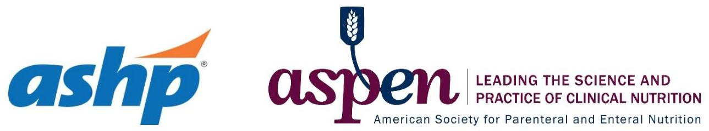

# NUTRITION SUPPORT CERTIFICATE 

## Glucose Control in Nutrition Support

Planned by the American Society of Health-System Pharmacists (ASHP) in collaboration with the American Society for Parenteral and Enteral Nutrition (ASPEN).
(c)2022 American Society of Health-System Pharmacists, Inc. All rights reserved.

No part of this publication may be reproduced or transmitted in any form or by any means, electronic or mechanical, including photocopying, microfilming, and recording, or by any information storage and retrieval system, without written permission from the American Society of Health-System Pharmacists.

--- page 1 ---

# NUTRITION SUPPORT COMPLICATIONS: GLUCOSE CONTROL IN NUTRITION SUPPORT 

Jay M Mirtallo, M.S., R.Ph., BCNSP, FASHP, FASPEN
The Ohio State University ASPEN

NUTRITION SUPPORT CERTIFICATE

## RELEVANT FINANCIAL RELATIONSHIP DISCLOSURE

The following persons in control of this activity's content have relevant financial relationships:

- Jay Mirtallo: Fresenius Kabi, consultant

All other persons in control of content do not have any relevant financial relationships with an ineligible company.

As defined by the Standards of Integrity and Independence definition of ineligible company. All relevant financial relationships have been mitigated prior to the CPE activity.

--- page 2 ---

# LEARNING OBJECTIVES 

- Review the clinical algorithm for controlling hyperglycemia in patients receiving nutrition support.
- Design a treatment plan for patients with hyperglycemia.

## KEY ABBREVIATIONS

- AA:
- Alb:
- Alk Phosph:
- Bili, T:
- BMI:
- BUN:
- CaGluc:
- Cal:
- $\mathrm{CO}_{2}$ :
- Cr:
amino acids
albumin
alkaline phosphatase
total bilirubin
body mass index
blood urea nitrogen
calcium gluconate
calories
carbon dioxide
creatinine

--- page 3 ---

# KEY ABBREVIATIONS, CONT. 

- D/C:
- Dext:
- Gluc:
- \%IBW:
- IBW:
- KCl :
- $\mathrm{KPO}_{4}$ :
- Lbs:
- $\mathrm{MgSO}_{4}$ :
- NaCl :
discontinue
dextrose
glucose
percent ideal body weigh
ideal body weight
potassium chloride
potassium phosphate
pounds
magnesium sulfate
sodium chloride

## KEY ABBREVIATIONS, CONT.

- NS:
- PN:
- Tg:
- WBC:
- Wt:
nutrition support
parenteral nutrition
triglycerides
white blood cell
weight

--- page 4 ---

# SELF-ASSESSMENT \#1 

The desired target glucose for a patient receiving nutrition support is in the range of which of the following?
A. $100-150 \mathrm{mg} / \mathrm{dl}$
B. $70-220 \mathrm{mg} / \mathrm{dl}$
C. $140-180 \mathrm{mg} / \mathrm{dl}$
D. $180-220 \mathrm{mg} / \mathrm{dl}$

## SELF-ASSESSMENT\#2

What is the ASPEN guideline recommendation for defining hypoglycemia?
A. Rapid fall of blood glucose in excess of $50 \mathrm{mg} / \mathrm{dl}$
B. $<70 \mathrm{mg} / \mathrm{dl}$
C. $<100 \mathrm{mg} / \mathrm{dl}$
D. $<40 \mathrm{mg} / \mathrm{dl}$

--- page 5 ---

# FREQUENCY OF HYPERGLYCEMIA IN PN 

| Reference | Criteria | $\mathrm{N}(%)$ | Comment | NSS |
| :--: | :--: | :--: | :--: | :--: |
| Dodds etal. NCP   2001 | @ least 1 value   $>200 \mathrm{mg} / \mathrm{dl}$ | 762 (28) | Only 2 pts developed   symptoms complication | Yes |
| Weinsieret*al.   JPEN 1982 | $>300 \mathrm{mg} / \mathrm{dl}$ after   at least 48 hrs of   PN | 47 (47) | No symptoms observed   Dextrose based PN | Yes but not used,   guidelines, flow sheets,   ordersets in place |
| ChrisAnderson* et   al JPEN 1996 | As per Weinsier | 23 (22)   (41)   (39) | No effect of NSS in   prospective trial   -Non NSS   -NSS   Use of 3 in 1 (TNA) | Yes, consult with   recommendations   only(64\% compliance),   substantial staff   education |

*Same institution

## FREQUENCY OF HYPERGLYCEMIA IN PN, CONT.

| Reference | Criteria | $\mathrm{N}(\%)$ | Comment | NSS |
| :--: | :--: | :--: | :--: | :--: |
| Rosmarinetal,   NCP 1995 | $>200 \mathrm{mg} / \mathrm{dl}$ | $\begin{aligned} & 0(0) \\ & 5(7) \\ & 18(43) \end{aligned}$ | -Dext infusion<4   -Dext infusion 4-5   -Dext infusion>5   No risk factors present | Yes, dextrose based diet |
| Pleva et al, NCP 2009 | $>200 \mathrm{mg} / \mathrm{dl}$   $>150 \mathrm{mg} / \mathrm{dl}$ | $\begin{aligned} & 22(44) \\ & 45(90) \end{aligned}$ | Resulted in 1.4 events per patient course   Risk factors: diabetes, pancreatitis, Steroids | Yes, pharmacist management |

--- page 6 ---

# SEVERITY OF HYPERGLYCEMIA IN PN 

- Stronger predictor of adverse outcomes than history of diabetes
- Majority of PN patients who become hyperglycemic are not diabetic
- Excluded from Rosmarin study
- $12 \%$ of Pleva study population
- $27 \%$ of Wah Cheung study population
- Evidence that hyperglycemia in itself is harmful.

Cheung NW, et al. Diabetes Care. 2005; 28:2367-71

## APPROACH TO IDENTIFYING HYPERGLYCEMIA RISK

Risk factors:

- Diabetes
- Pre-existing hyperglycemia
- Glucose $>140 \mathrm{mg} / \mathrm{dl}$
- Pancreatitis
- Corticosteroids
- Octreotide

--- page 7 ---

# GLUCOSE CONTROL ALGORITHM STEP 1 

## ALGORITHM - STEP 1 ADJUSTMENT

- Establish routine monitoring protocol for at risk patients
- Consider whether patient had been on insulin before
- What is the feasibility of point of care glucose?
- Establish criteria for abnormality
- When action will be taken
- May be different from target
- Is sliding scale insulin the best option for glucose control?
- Adjust the target range based on continuous, intermittent or cyclic nutrient administration

--- page 8 ---

# GLUCOSE CONTROL ALGORITHM STEP 2 

- Identify and manage glucose from sources other than NS
- Is the patient hyperglycemic while on sliding scale insulin?
- If yes, then minimize
- Dextrose in IV fluids
- Medications premixed in dextrose
- For PN: oral diet or tube feeding adequate then taper or D/C PN
- For EN: determine quantity and quality of glucose
- Ingestion (minimize simple or added sugars)

## CARBOHYDRATE CONTENT OF FLUIDS

| Fluid | Sugars   Grams@1 cc | Sugars   Grams/L | Calories   Content/L |
| :--: | :--: | :--: | :--: |
| Bottled water | 0 | 0 | 0 |
| Milk, 2\% | 13 | 55 | 220 |
| Sports drink | $14-29$ | $59-123$ | $236-492$ |
| Orange juice | 24 | 101 | 404 |
| Coffee | 0 | 0 | 0 |
| Dietsoda | 0 | 0 | 0 |
| Dextrose 5\% in Water (D5W) |  | 50 | 170 |
| Dextrose 10\% in Water (D10W) |  | 100 | 340 |
| Dextrose 15\% in Water (D15W) |  | 150 | 510 |
| Dextrose 25\% in Water (D25W) |  | 250 | 850 |

--- page 9 ---

# ALGORITHM - STEP 2 ADJUSTMENT 

- Establish criteria for categorizing the condition as hyperglycemia
- If significant carbohydrate from oral intake tolerated for PN patients
- Decrease dextrose content of PN
- Taper PN
- Frequency of infusions
- Volume of infusion
- Caloric content if intravenous fluid volume is still needed

## GLUCOSE CONTROL ALGORITHM STEP 3: ADDING INSULIN TO PN

What is the patient's glucose level prior to initiation?

Euglycemic (for diabetic): Insulin dose 0.1 U per gram of Dextrose ( 20 units for 200 grams)

Serum glucose $>300 \mathrm{mg} / \mathrm{dl}$ :PN contraindicated. Normalize glucose prior to initiating PN

Glucose between $140-180 \mathrm{mg} / \mathrm{dL}$ Insulin dose: $0.1-0.2 \mathrm{U}$ per gram of dextrose (20-40 U per 200 grams)

Glucose $>180 \mathrm{mg} / \mathrm{dL}$ : initiate PN with no more than 100 g dextrose. Insulin dose 0.1 U per gram ( 10 U insulin per 100 grams)

--- page 10 ---

# ALGORITHM - STEP 3 ADJUSTMENT 

- For Diabetics: determine daily dose of insulin used on a daily basis while stable
- This may be the basal needs of insulin for the patient and can be added to the PN or administered as long acting insulin on a daily basis and then use sliding scale insulin to adjust once PN started
- Consider criteria for withholding or discontinuing PN for hyper- or hypoglycemia
- Taper insulin in PN if patient becomes hypoglycemic

## GLUCOSE ALGORITHM - STEP 4

--- page 11 ---

# ALGORITHM - STEP 4 ADJUSTMENT 

- Point-of-care glucose for cycled PN
- 2 hours into and 1 hour post PN infusion
- Values dependent on glucose infusion rate
- Laboratory values usually drawn when PN infusion or cycle is complete
- Not as useful - establish false sense of security
- Monitor for symptoms of hypoglycemia
- No matter what the blood glucose is, this is a problem that must be addressed immediately
- Weakness, sweating, palpitations, anxiety, irritability
- Serious: seizures
- Long term assessment: Hemoglobin A1c

## SELF-ASSESSMENT \#1

The desired target glucose for a patient receiving nutrition support is in the range of which of the following?
A. $100-150 \mathrm{mg} / \mathrm{dl}$
B. $70-220 \mathrm{mg} / \mathrm{dl}$
C. $140-180 \mathrm{mg} / \mathrm{dl}$
D. $180-220 \mathrm{mg} / \mathrm{dl}$

--- page 12 ---

# SELF-ASSESSMENT \#1 

The desired target glucose for a patient receiving nutrition support is in the range of which of the following?
A. $100-150 \mathrm{mg} / \mathrm{dl}$
B. $70-220 \mathrm{mg} / \mathrm{dl}$
C. $140-180 \mathrm{mg} / \mathrm{dl}$
D. $180-220 \mathrm{mg} / \mathrm{dl}$

## SELF-ASSESSMENT\#2

What is the ASPEN guideline recommendation for defining hypoglycemia?
A. Rapid fall of blood glucose in excess of $50 \mathrm{mg} / \mathrm{dl}$
B. $<70 \mathrm{mg} / \mathrm{dl}$
C. $<100 \mathrm{mg} / \mathrm{dl}$
D. $<40 \mathrm{mg} / \mathrm{dl}$

--- page 13 ---

# SELF-ASSESSMENT \#2 

What is the ASPEN guideline recommendation for defining hypoglycemia?
A. Rapid fall of blood glucose in excess of $50 \mathrm{mg} / \mathrm{dl}$
B. $<70 \mathrm{mg} / \mathrm{dl}$
C. $<100 \mathrm{mg} / \mathrm{dl}$
D. $<40 \mathrm{mg} / \mathrm{dl}$

## ALGORITHM SUMMARY

- Glucose control in NS patients is critical to optimal patient outcomes
- An effective approach to glucose control is to establish
- Interdisciplinary process of care
- Specific goals of therapy
- A monitoring plan to identify and prevent serious problems from glucose control
- Establish a consistent approach (algorithm) for patient management

--- page 14 ---

# CASE STUDY: PATIENT MJ 

- A 35 year old male with a history of Colon Cancer status post multiple intestinal and colon resections for bowel obstructions
- Most recently, he had a drainage of an intra-abdominal abscess; a procedure that was complicated by the development of an enterocutaneous fistula originating in his small intestine
- He was started on PN 3 days ago and is currently receiving his goal calories and protein at a continuous infusion over 24 hours

## NUTRITIONAL STATUS

- Ht: 5' 8"
- Wt: 220 pounds
- He is post-op day 4 and he is expected to be discharged to home on this his 10th day of hospitalization
- His nutritional intake in the hospital was minimal prior to the findings of the enterocutaneous fistula
- He has high fistula output (about 1 liter per day) and is allowed to drink Gatorade ${ }^{\circledR}$ which he consumes about 1 L per day

--- page 15 ---

# NUTRITION HISTORY 

| Age: 35 | Assessment: No recent weight loss |
| :--: | :--: |
| Admit Wt: 100kg | \% IBW: 142 |
| Ht: 5'8" | BMI: 34 |
| IBW: 70 | Usual body weight: 100 kg |

## PN FORMULA

| PN Volume: 3000 ml | Continuous Infusion: 125 mL/hour |  |  |  |
| :--: | :--: | :--: | :--: | :--: |
|  | Cal/day | Total Cal | Cal/kg | $\begin{gathered} \text { AA } \\ \mathrm{g} / \mathrm{kg} \end{gathered}$ |
| Dextrose: 412 g | 1400 | 2800 | 28 | 1 |
| AA: 100 g | 400 |  |  |  |
| Fat: 100 g | 1000 |  |  |  |

--- page 16 ---

# PN ADDITIVES 

- Electrolytes per day
- NaCl 200 mEq
- $\mathrm{KCl} 60 \mathrm{mEq}$
- $\mathrm{KPO}_{4} 60 \mathrm{mEq}(45 \mathrm{mmol} / \mathrm{d})$
- CaGluc 10 mEq
- $\mathrm{MgSO}_{4} 16 \mathrm{mEq}$
- Trace Elements per day
- Multitrace-4, 5 ml
- Vitamins per day
- Multivitamins, 10 ml

## LAB VALUES

| Date | Baseline | Day 1 | Today |
| :-- | :--: | :--: | :--: |
| WBC | 10 | 8 | 8.2 |
| Hgb | 12.3 | 13 | 12.8 |
| Na | 138 | 140 | 145 |
| K | 4.0 | 3.7 | 4.1 |
| Cl | 110 | 111 | 107 |
| CO 2 | 21 | 24 | 26 |
| Gluc | 185 | 224 | 280 |
| BUN | 15 | 20 | 25 |
| Cr | 1.1 | 1.2 | 1.3 |

--- page 17 ---

# LAB VALUES: LIVER FUNCTION AND METABOLIC PARAMETERS 

| Date | Baseline | Day 1 | Today |
| :--: | :--: | :--: | :--: |
| Bili, T | 1.5 |  | 1.2 |
| Alk   Phosp | 65 |  | 154 |
| Metabolic Parameters |  |  |  |
| Tg | 130 |  | 112 |
| Alb | 2.0 | 1.8 |  |
| Ca | 7.6 | 7.8 | 9.8 |
| Mg | 1.4 | 1.4 | 1.8 |
| Phosp | 3.0 | 2.0 | 3.0 |

## SELF-ASSESSMENT \#3

What risk factors does this patient have for hyperglycemia while on PN?
A. Pre-existing hyperglycemia
B. Pancreatitis
C. Corticosteroids
D. Diabetes
E. Octreotide

--- page 18 ---

# SELF-ASSESSMENT \#3 

What risk factors does this patient have for hyperglycemia while on PN?
A. Pre-existing hyperglycemia
B. Pancreatitis
C. Corticosteroids
D. Diabetes
E. Octreotide

## SELF-ASSESSMENT \#4

If you were to add insulin to his PN at this time, what dose would you start with?
A. 15 units
B. 20 units
C. 40 units ( 0.1 U per gram dextrose)
D. 50 units

--- page 19 ---

# SELF-ASSESSMENT \#4 

If you were to add insulin to his PN at this time, what dose would you start with?
A. 15 units
B. 20 units
C. 40 units ( 0.1 U per gram dextrose)
D. 50 units

## SELF-ASSESSMENT \#5

Choose a target range for glucose in this patient:
A. $80-120 \mathrm{mg} / \mathrm{dl}$
B. $100-150 \mathrm{mg} / \mathrm{dl}$
C. $140-180 \mathrm{mg} / \mathrm{dl}$
D. $150-200 \mathrm{mg} / \mathrm{dl}$

--- page 20 ---

# SELF-ASSESSMENT \#5 

Choose a target range for glucose in this patient:
A. $80-120 \mathrm{mg} / \mathrm{dl}$
B. $100-150 \mathrm{mg} / \mathrm{dl}$
C. $140-180 \mathrm{mg} / \mathrm{dl}$
D. $150-200 \mathrm{mg} / \mathrm{dl}$

## SELF ASSESSMENT \#6

What additional monitoring tools would you order for this patient to better assess glucose control?
A. Urine for sugar and acetone
B. Serum and urine Osmolality
C. Capillary blood glucose every 12 hours
D. Capillary blood glucose every 6 hours

--- page 21 ---

# SELF ASSESSMENT \#6 

What additional monitoring tools would you order for this patient to better assess glucose control?
A. Urine for sugar and acetone
B. Serum and urine Osmolality
C. Capillary blood glucose every 12 hours
D. Capillary blood glucose every 6 hours

## CONCLUSIONS

- Glucose control in PN patients requires attention to a variety of details in order to keep the glucose values in a target range. Taking a planned approach will assist with achieving clinical success
- The planned approach includes
- Identifying risk factors for hyper- or hypoglycemia
- Establish a target glucose range
- Properly dose insulin when needed
- Modify glucose monitoring when glucose is poorly controlled

--- page 22 ---

# REFERENCES 

- Ahrens CL, Barietta JF, Kanji S et al. Effect of low-calorie parenteral nutrition on the incidence and severity of hyperglycemia in surgical patients: a randomized, controlled trial. Crit Care Med. 2005; 33:2507-12.
- Cheung NW, Zaccaria C, Napier B, Fletcher JP. Hyperglycemia is associated with adverse outcomes in patients receiving total parenteral nutrition. Diabetes Care. 2005; 28(10):2367-71.
- Choban PS, Burge JC, Scales D, Flancbaum L. Hypoenergetic nutrition support in hospitalized obese patients: a simplified method for clinical application. Am J Clin Nutr. 1997; 66:546-50.
- ChrisAnderson D, Heimburger DC, Morgan SL et al. Metabolic complications of total parenteral nutrition: effects of a nutrition support service. J Parenter Enter Nutr. 1996; 20(3):206-10.

## REFERENCES, CONT.

- Dodds ES, Murray JD, Trexler KM, Grant JP. Metabolic occurrences in total parenteral nutrition patients managed by a nutrition support team. Nutr Clin Pract. 2001; 16(2):78-84.
- McCowen KC, Friel C, Sternberg J, et al. Hypocaloric total parenteral nutrition: effectiveness in prevention of hyperglycemia and infectious complications - a randomized clinical trial. Crit Care Med. 2000; 28:3606-11.
- McMahon MM, Nystrom E, Braunschweig C et al. A.S.P.E.N. Clinical Guidelines: Nutrition support of adult patients with hyperglycemia. J Parenter Enter Nutr. 2013; 37: 23-36.
- Mirtallo JM, Canada T, Johnson D, et al. Safe practices for parenteral nutrition. J Parenteral Enter Nutr. 2004; 28:S39-S70.

--- page 23 ---

# REFERENCES, CONT. 

- Mirtallo JM, Fabri PJ. Hemoglobin A1c in home parenteral nutrition. J Parenter Enter Nutr. 1983; 7:59-61.
- Pleva M, Mirtallo JM, Steinberg SM. Hyperglycemic events in nonintensive care unit patients receiving parenteral nutrition. Nutr Clin Pract. 2009; 24(5): 626-34.
- Popkin BM, Armstrong LE, Bray GM, et al. A new proposed guidance system for beverage consumption in the United States. Am J Clin Nutr. 2006; 83:519-42.
- Rosmarin DK, Wardlaw GM, Mirtallo J. Hyperglycemia associated with high, continuous infusion rates of total parenteral nutrition. Nutr Clin Pract. 1996; 11(4):151-56.

## REFERENCES, CONT.

- Weinsier RL, Bacon J, Butterworth CE. Central venous alimentation: a prospective study of the frequency of metabolic abnormalities among medical and surgical patients. J Parenter Enter Nutr. 1982; 6(5): 421-25.

--- page 24 ---

NUTRITION SUPPORT CERTIFICATE

--- page 25 ---

Jay M. Mirtallo, M.S., R.Ph, BCNSP, FASHP, FASPEN
The Professor Emeritus
The Ohio State University, College of Pharmacy
Clinical Practice Specialist
American Society for Parenteral and Enteral Nutrition
Delaware, Ohio
As one of the pharmacy specialist pioneers, Professor Mirtallo was instrumental in leading cost-effective practices in parenteral nutrition and advancing the role of the pharmacist on nutrition support services.

Professor Mirtallo has been very active in professional societies and is Past President of the American Society for Parenteral and Enteral Nutrition (ASPEN). He also spent many years on the ASPEN Public Policy Committee, where he advocated for reimbursement of enteral and parenteral nutrition in the hospital and home, dealt with drug shortage issues and worked to improve the safety and efficacy of parenteral nutrition.

As a representative to the Joint Commission, he served on the task force that created the Nutrition Care Standards. Mr. Mirtallo has been actively involved with nutrition support guidelines. Recently, he coauthored an etiology-based definition of malnutrition which is the basis for an inter-professional malnutrition strategy. He chaired a parenteral nutrition safety summit in the fall of 2011 which led to the development of the safety consensus recommendations released by ASPEN and the American Society for Health System Pharmacists. Currently Professor Mirtallo is Professor Emeritus at The Ohio State University, College of Pharmacy, Division of Pharmacy Practice and Administration. He is also a Clinical Practice Specialist with ASPEN.

--- page 26 ---

# Relevant Financial Relationship Disclosure

In accordance with our accreditor’s Standards of Integrity and Independence in Accredited Continuing Education, ASHP requires that all individuals in control of content disclose all financial relationships with ineligible companies. An individual has a relevant financial relationship if they have had a financial relationship with ineligible company in any dollar amount in the past 24 months and the educational content that the individual controls is related to the business lines or products of the ineligible company.

An ineligible company is any entity producing, marketing, re-selling, or distributing health care goods or services consumed by, or used on, patients. The presence or absence of relevant financial relationships will be disclosed to the activity audience.

The following persons in control of this activity’s content have relevant financial relationships:

- Phil Ayers: Fresenius Kabi, consultant and speaker
- David Evans: Fresenius Kabi, consultant and speaker; Abbott Laboratories, consultant and speaker; CVS/OptionCare, consultant; Alcresta, consultant and speaker
- Andrew Mays: Fresenius Kabi, speaker
- Jay Mirtallo: Fresenius Kabi, consultant
- Kris Mogensen: Baxter, speaker; ThriveRx, advisory board; Pfizer, advisory board

All other persons in control of content do not have any relevant financial relationships with an ineligible company.

As required by the Standards of Integrity and Independence in Accredited Continuing Education definition of ineligible company, all relevant financial relationships have been mitigated prior to the CPE activity.

# Methods and CE Requirements

This online activity consists of a combined total of 12 learning modules. Pharmacists and physicians are eligible to receive a total of 20 hours of continuing education credit by completing all 12 modules within this certificate.

Participants must participate in the entire activity, complete the evaluation and all required components to claim continuing pharmacy education credit online at ASHP Learning Center http://elearning.ashp.org. Follow the prompts to claim credit and view your statement of credit within 60 days after completing the activity.

# Important Note – ACPE 60 Day Deadline:

Per ACPE requirements, CPE credit must be claimed within 60 days of being earned. To verify that you have completed the required steps and to ensure your credits have been reported to CPE Monitor, check your NABP eProfile account to validate that your credits were transferred successfully before the ACPE 60-day deadline. After the 60 day deadline, ASHP will no longer be able to award credit for this activity.

# System Technical Requirements

Courses and learning activities are delivered via your Web browser and Acrobat PDF. Users should have a basic comfort level using a computer and navigating websites.

View Frequently Asked Questions for more information.