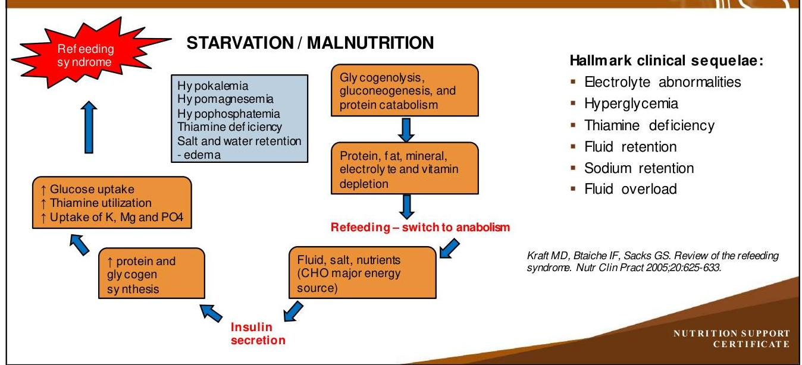
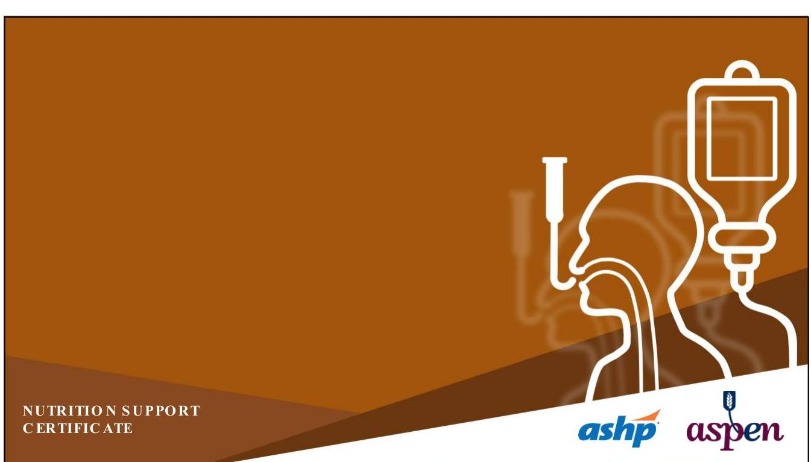

# NUTRITION SUPPORT CERTIFICATE 

## Refeeding Syndrome

Planned by the American Society of Health-System Pharmacists (ASHP) in collaboration with the American Society for Parenteral and Enteral Nutrition (ASPEN).
(c)2022 American Society of Health-System Pharmacists, Inc. All rights reserved.

No part of this publication may be reproduced or transmitted in any form or by any means, electronic or mechanical, including photocopying, microfilming, and recording, or by any information storage and retrieval system, without written permission from the American Society of Health-System Pharmacists.

--- page 1 ---

# NUTRITION SUPPORT COMPLICATIONS:   REFEEDING SYNDROME 

Ainsley Malone, MS, RD, LD, CNSC, FASPEN ASPEN
Mt. Carmel Grove City Hospital

NUTRITION SUPPORT CERTIFICATE

## RELEVANT FINANCIAL RELATIONSHIP DISCLOSURE

The following persons in control of this activity's content have relevant financial relationships:

- Jay Mirtallo: Fresenius Kabi, consultant

All other persons in control of content do not have any relevant financial relationships with an ineligible company.

As defined bythe Standards of Integrity and Independence definition of ineligible company. All relevant financial relationships have been mitigated prior to the CPE activity.

--- page 2 ---

# LEARNING OBJECTIVES 

- Identify nutrition support patients at risk for refeeding syndrome.
- Propose adjustments in enteral and parenteral nutrition delivery to minimize refeeding syndrome occurrence.

## ABBREVIATIONS

- BMI:
- COPD:
- $\mathrm{CHO}:$
- IV:
- K :
- Mg :
- PN:
- $\mathrm{PO}_{4}$ :
- TPP:
body mass index
chronic obstructive pulmonary disease
carbohydrate
intravenous
potassium
magnesium
parenteral nutrition
phosphate
thiamine pryophosphate

--- page 3 ---

# SELF-ASSESSMENT\#1 

The sequalae of potential symptoms that can occur with refeeding syndrome include:
A. Hyperglycemia
B. Hypokalemia
C. Hypophosphatemia
D. All of the above

## REF EEDING SYNDROME

- A collection of metabolic complications seen with initiation of feeding in a malnourished or starved patient
- First recognized in refeeding prisoners after World War II
- Re-emerged with parenteral nutrition utilization
- Example:
- 1981 publication "Death resulting from overzealous total parenteral nutrition: the refeeding syndrome revisited"

--- page 4 ---

# REFEEDING SYNDROME METABOLISM 

## RE-FEEDING SYNDROME RISK FACTORS

- Malignancy
- Chronic alcoholism
- Malabsorptive states
- Short bow el syndrome
- Crohn's disease
- Pancreatic insufficiency
- Eating disorders (anorexia nervosa)
- Minimal or no nutrient intake $>5-7$ days
- Surgery with complications
- Critical illness with impaired intake
- Prolonged fasting
- Bariatric surgery
- Protracted vomiting
- Hyperemesis gravidarum
- Gastroparesis

--- page 5 ---

# RISKASSESSMENT FOR REFEEDING SYNDROME 

Significant Risk: One or More Criteria
BMI $<16$
Unintentional weight loss of $7.5 \%$ in 3 months or $>10 \%$ in 6 months
Little or no nutrient intake for 7 days $<50 \%$ requirements $>5$ days illness or $>1$ month
Moderately low potassium, phosphate, magnesium levels

Moderate Risk: Two or More Criteria
BMI: 16 - 18.5
Unintentional weight loss of 5\% in 1 month
Little or no nutrient intake for 5-6 days $<75 \%$ requirements $>7$ days illness or $>1$ month
Mildly low potassium, phosphate, magnesium levels

DaSilva JS, Seres DS, Sabino K, et al. ASPEN consensus recommendations for refeeding syndrome. Nutr Clin Pract 2020;35(2):178-195

## MANAGEMENT STRATEGIES

- Check baseline electrolytes prior to start of nutrition support
- Replete if levels low (refer to recommendations in this module)
- Nutrient provision
- 10-20 kcals/kg day or 1000 kcals/day - at most
- In PN, limit dextrose to $100-150 \mathrm{~g} /$ day
- In EN, limit to $50 \%$ of total energy requirements
- Multivitamins
- MVI for PN; multivitamin supplement for EN
- Advance to goal energy intake over 3-4 days
- Increase by $33 \%$ of goal calories or dextrose q 1-2 days
- Monitor electrolyte levels daily and advance energy intakes when stabilized
- Consider all sources of dextrose
- Monitor weight status daily
- $0.5-1 \mathrm{~kg} / \mathrm{w}$ eight gain per week acceptable

--- page 6 ---

# THIAMINE SUPPLEMENTATION 

- Thiamine pyrophosphate
- Component of key metabolic cycles
- Glycolysis
- Kreb's cycle
- Pentose-phosphate shunt
- Thiamine supplementation
- Provide 100 mg IV prior to nutrition support initiation
- Include 100 mg IV or enteral thiamine for 5-7 days

Manzanares W., Hardy G. Thiamine supplementation in the critically ill. Curr Opinion in Clin Nutr Metab Care. 2011;14:610-617. DaSilva JS, Seres DS, Sabino K, et al. ASPEN consensus recommendations for refeeding syndrome. Nutr Clin Pract 2020;35(2):178-195

## REFEEDING SYNDROME

- The most important aspect of this syndrome is recognizing those who are at risk
- Cautious use of nutrition support
- Monitoring is crucial for all at risk patients including those receiving only maintenance IV's with dextrose

--- page 7 ---

# SELF-ASSESSMENT \#1 

The sequalae of potential symptoms that can occur with refeeding syndrome include:
A. Hyperglycemia
B. Hypokalemia
C. Hypophosphatemia
D. All of the above

## SELF-ASSESSMENT\#1

The sequalae of potential symptoms that can occur with refeeding syndrome include:
A. Hyperglycemia
B. Hypokalemia
C. Hypophosphatemia
D. All of the above

--- page 8 ---

# REFERENCES 

- Crook M. Refeeding syndrome: problems with definition and management. Nutrition 2014;30:1448-1455.
- Kraft MD, Btaiche IF, Sacks GS. Review of the refeeding syndrome. Nutr Clin Pract 2005;20:625-633.
- Manzanares W., Hardy G. Thiamine supplementation in the critically ill. Curr Opinion in Clin Nutr Metab Care. 2011;14:610-617.
- Mehanna HM, Moledina J, Travis J. Refeeding syndrome: what it is and how to prevent and treat it. Br Med J 2008; 336:1495-1498
- Weinsier RL, Krumdieck CL. Death resulting from overzealous total parenteral nutrition: the refeeding syndrome revisited. Am J Clin Nutr1981; 34:393-999.

--- page 9 ---

# Ainsley Malone, M.S., RDN, L.D., CNSC, FAND, FASPEN 

Clinical Practice Specialist
The American Society for Parenteral and Enteral Nutrition (ASPEN)
Nutrition Support Dietitian
Mount Carmel Grove City
Columbus, Ohio
Ainsley Malone is a Dietitian member of the Nutrition Support Team at Mount Carmel Grove City in Columbus, Ohio, where she is involved in managing nutrition care in patients who require enteral and parenteral nutrition. In addition, Ms. Malone serves as a
Clinical Practice Specialist for the American Society for Parenteral and Enteral Nutrition (ASPEN) where she works to guide clinical practice activities for the organization.

Ms. Malone is a certified nutrition support clinician and has given international, national and local presentations on many aspects of nutrition support practice. In addition to her clinical practice activities, Ms. Malone has authored multiple nutrition support related peer reviewed articles and book chapters. Ms. Malone is a fellow of both the Academy of Nutrition and Dietetics and ASPEN and has served in many nutrition leadership capacities including President of ASPEN, and Chairs of the Academy Positions and Evidence Based Practice Committees.

--- page 10 ---

# Relevant Financial Relationship Disclosure

In accordance with our accreditor’s Standards of Integrity and Independence in Accredited Continuing Education, ASHP requires that all individuals in control of content disclose all financial relationships with ineligible companies. An individual has a relevant financial relationship if they have had a financial relationship with ineligible company in any dollar amount in the past 24 months and the educational content that the individual controls is related to the business lines or products of the ineligible company.

An ineligible company is any entity producing, marketing, re-selling, or distributing health care goods or services consumed by, or used on, patients. The presence or absence of relevant financial relationships will be disclosed to the activity audience.

The following persons in control of this activity’s content have relevant financial relationships:

- Phil Ayers: Fresenius Kabi, consultant and speaker
- David Evans: Fresenius Kabi, consultant and speaker; Abbott Laboratories, consultant and speaker; CVS/OptionCare, consultant; Alcresta, consultant and speaker
- Andrew Mays: Fresenius Kabi, speaker
- Jay Mirtallo: Fresenius Kabi, consultant
- Kris Mogensen: Baxter, speaker; ThriveRx, advisory board; Pfizer, advisory board

All other persons in control of content do not have any relevant financial relationships with an ineligible company.

As required by the Standards of Integrity and Independence in Accredited Continuing Education definition of ineligible company, all relevant financial relationships have been mitigated prior to the CPE activity.

# Methods and CE Requirements

This online activity consists of a combined total of 12 learning modules. Pharmacists and physicians are eligible to receive a total of 20 hours of continuing education credit by completing all 12 modules within this certificate.

Participants must participate in the entire activity, complete the evaluation and all required components to claim continuing pharmacy education credit online at ASHP Learning Center http://elearning.ashp.org. Follow the prompts to claim credit and view your statement of credit within 60 days after completing the activity.

# Important Note – ACPE 60 Day Deadline:

Per ACPE requirements, CPE credit must be claimed within 60 days of being earned. To verify that you have completed the required steps and to ensure your credits have been reported to CPE Monitor, check your NABP eProfile account to validate that your credits were transferred successfully before the ACPE 60-day deadline. After the 60 day deadline, ASHP will no longer be able to award credit for this activity.

# System Technical Requirements

Courses and learning activities are delivered via your Web browser and Acrobat PDF. Users should have a basic comfort level using a computer and navigating websites.

View Frequently Asked Questions for more information.