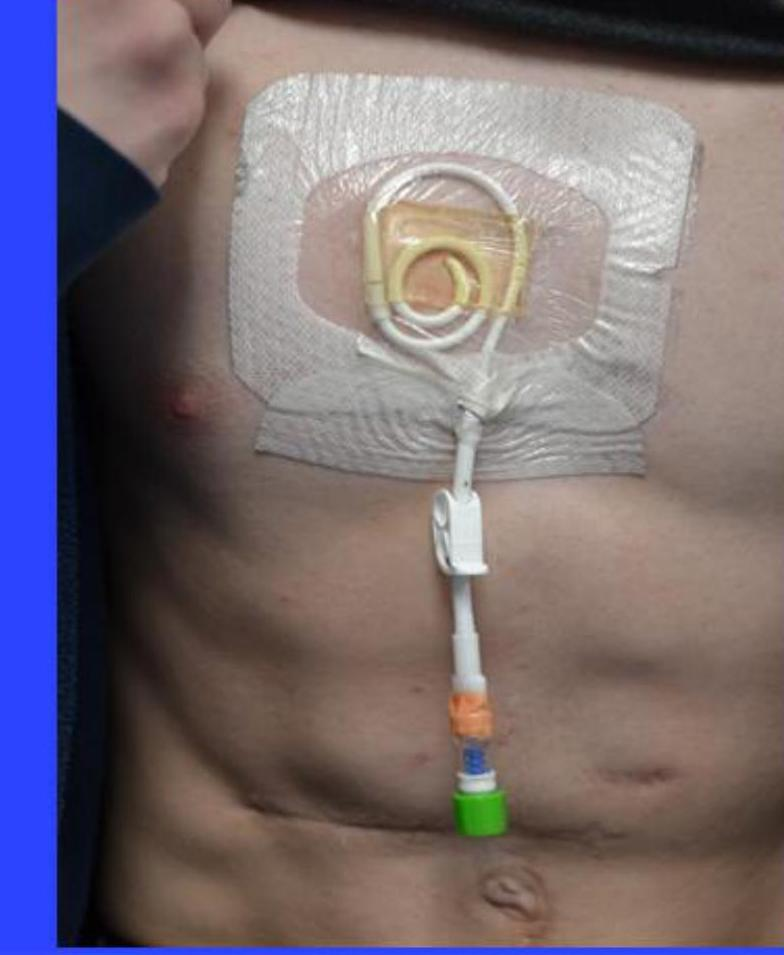
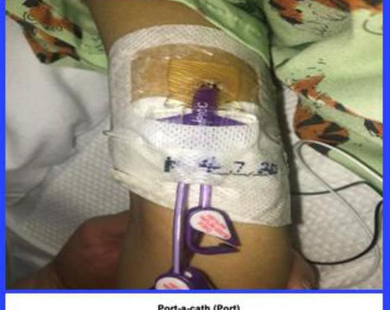
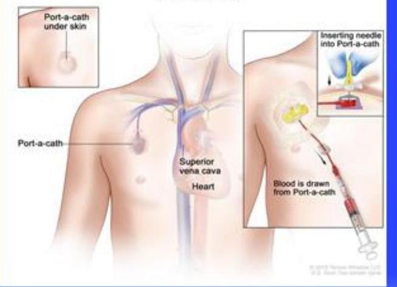
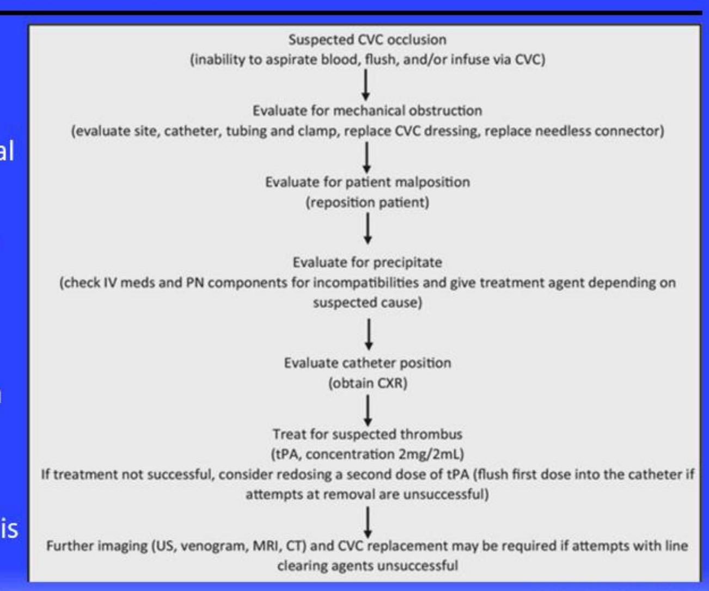
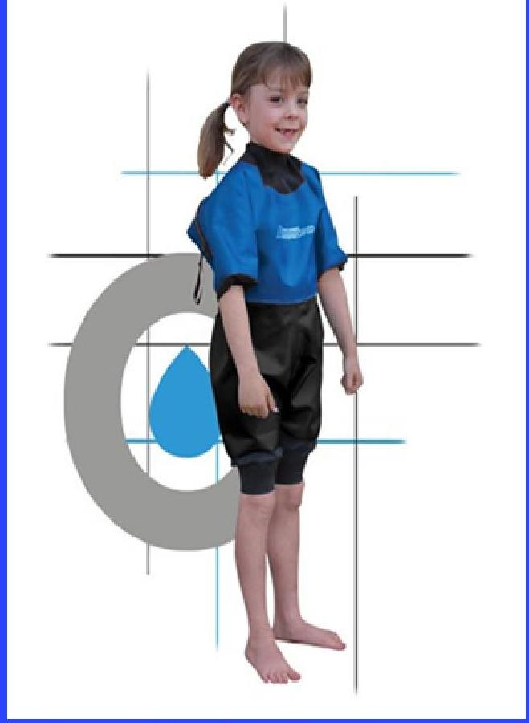
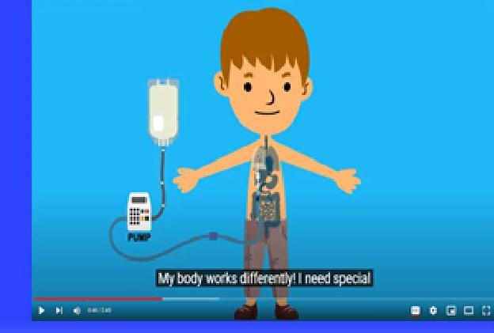
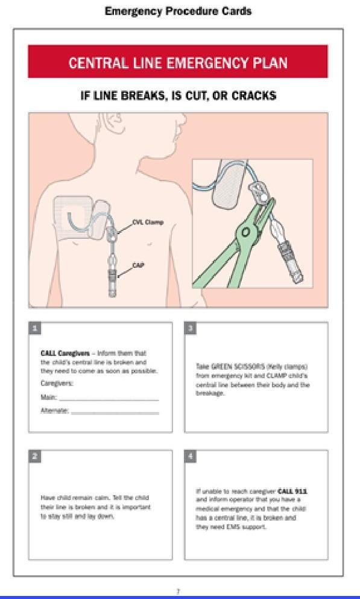

# Transitions in Parenteral Nutrition

--- page 1 ---

# Overview 

- Introduction
- Case
- Transitions in Parenteral Nutrition (PN)
- Hospital discharge and home PN
- Adult transition in long-term PN
- Weaning off PN
- Cases review

--- page 2 ---

# Introduction 

- Children on long-term PN undergo many transitions, starting from the transition to their home from the hospital, to transitions to school, and the transition to adulthood
- Patients on PN face unique challenges during these transitions

--- page 3 ---

# Case \#1 

A 3-month-old baby born with intestinal atresia, underwent bowel resection her first week of life. She has 40 cm of small intestine connected to the colon, her ileocecal valve is intact. She has been stable on room air and has been tolerating small amounts of breastmilk orally. She is receiving parenteral nutrition through a PICC line for 24 hours a day. She has been gaining weight, well hydrated and electrolytes have been normal.

You meet with her parents to discuss her care. The parents ask when they will be able to take their child home. Your reply includes all of the following except,
A) PN should be cycled
B) The child should have a tunneled venous catheter placed
C) When the child is weaned off PN
D) When two caregivers are trained in central line care and able to administer PN at home

--- page 4 ---

# Case \#2 

The parent of a 5-year-old patient with a history intestinal failure due to short bowel syndrome reaches out to the on-call provider because they were unable to flush the central line when they tried to hook the patient up to PN tonight. What is the next step?
A. Immediately have the parent bring the child to the emergency room for evaluation
B. Inquire how many hours of PN the child typically receives
C. Ask the parent to reposition the patient and try to flush the line again
D. Instruct the parent to call back in the morning to troubleshoot the issue

--- page 5 ---

# Case \#3 

A 3-year-old boy has received PN since birth due to a history of volvulus. He currently eats orally and receives formula through his gastrostomy tube. He has maintained his weight and height along the $25^{\text {th }} \%$ ile. He passes bowel movements 3 times a day. His medical team has been lowering the amount of PN he receives on a regular basis and are optimistic that he may be able to fully stop his PN soon.

All the following are true regarding the transition off PN except,
A. Oral rehydration solutions are beneficial in weaning off PN
B. Continuous tube feeding is necessary to stop PN
C. They should encourage small meals and frequent snacks throughout the day.
D. He will likely need more enteral calories as compared to parenteral calories to maintain his growth.

--- page 6 ---

# Hospital Discharge and Appropriateness for Home PN 

- Home PN is life-sustaining for patients with chronic intestinal failure
- Home PN is also considered in other clinical settings including palliative care, patients unable to tolerate oral/enteral feeding, or to provide short-term nutrition while undergoing other treatment
- Home PN may result in harm if not properly administered
- Families should understand and consent to this treatment
- A home PN program should provide an individualized, safe, and effective plan
- Home environments should be adequate to safely provide home PN

--- page 7 ---

# Hospital Discharge and Appropriateness for Home PN 

- Patient considerations discharge home on PN
- Patient stability
- Patient size
- Duration of therapy
- PN formulation stability
- Availability of home services
- Appropriate support system
- Patient safety is paramount. Points of transition in care are at risk for medical and medication errors
- Discharge checklists that are initiated early in a hospital stay and incorporates all aspects of the transition process are beneficial

--- page 8 ---

# Hospital Discharge and Home PN: Central Venous Catheter Recommendations 

- Smallest diameter + least number of lumens + silicone + upper extremity
- Most children with intestinal failure require only a single-lumen catheter
- Larger diameter catheters can cause venous obstruction and thrombosis
- Multiple lumens are associated with infection, thrombosis and malfunction
- Silicone catheters permit the use of ethanol locks
- Subclavian or internal jugular vein access is typically preferred
- Femoral vein access has a higher risk of infection from stool output

--- page 9 ---

# **Hospital Discharge and Home PN: Central Venous Catheters**

- Tunneled central venous catheter
- Provides stability, durability, longevity, accessibility, and possible decreased risk of infection
- Most tunneled catheters exit the skin on the chest. Subcutaneous tunneling to other exits sites such as the back is possible

LaRusso K, *et al. J Pediatr Surg.* 2019;54:999-1004.
Shin HS, *et al. Pediatr Radiol.* 2017;47:1670-5.

Christensen LD, *et al. Clin Nutr.* 2016;35:912-7.
Allen AW, *et al. J Vasc Interv Radiol.* 2000;11:1309-14.

--- page 10 ---

# **Hospital Discharge and Home PN: Central Venous Catheters**

- **Peripherally inserted central catheter (PICC)**
  - Used for short-term access (<6 months)
  - Increased risk of peripheral clots, venous stenosis, line breakage, site infection/phlebitis
  - Cuffed vs. uncuffed

- **Implanted central access device (port)**
  - Decreased infection risk, ability to be de-accessed, good for intermittent access needs
  - Requires a needlestick to access
  - Less stable when accessed, not useful if access needed daily

LaRusso K, *et al. J Pediatr Surg.* 2019;54:999-1004.
Christensen LD, *et al. Clin Nutr.* 2016;35:912-7.
Shin HS, *et al. Pediatr Radiol.* 2017;47:1670-5.
Allen AW, *et al. J Vasc Interv Radiol.* 2000;11:1309-14.

--- page 11 ---

# Hospital Discharge and Home PN: Cycling PN 

- Cycling refers to the administration of PN for < 24 hours, e.g., 8 - 22 hours, commonly 10 - 12 hours
- Pre-requisites to cycling PN
- Stable PN regimen
- Ability to handle larger volume of fluid and nutrients over a shorter amount of time
- Smaller infants and patients with no enteral intake may be less tolerant of cycling PN due to metabolic stress during time off the infusion
- Benefits of cycling PN
- Decrease intestinal failure associated liver disease
- Allows a more normal daytime routine
- Increase mobility of the patient when off PN

--- page 12 ---

# Hospital Discharge and Home PN: Cycling PN - Cont'd 

- Tapering up/down
- To avoid hypoglycemia associated with abruptly stopping PN wean rate for the first and last hours of the infusion
- Many home PN pumps can be programed to taper up/down automatically
- Blood sugar monitoring
- Check serum glucose 30 - 45 minutes after stopping PN with every change in the length of cycle
- Monitor for hyperglycemia and/or glucosuria when receiving PN

--- page 13 ---

# Hospital Discharge and Home PN: Caregiver Training 

- The caregiver's meticulous care of the Central Venous Catheter (CVC) directly impacts complication rates and preservation of long-term venous access
- Recommend at least 2 caregivers are trained
- Training starts in the hospital and continues after discharge
- Ideally caregiver training includes hands on care, rooming in with the child while in the hospital and/or simulator experience prior to discharge
- Expectations must be clearly outlined for caregivers to optimize safety

--- page 14 ---

# Hospital Discharge and Home PN: Caregiver Training 

- CVC care
- Proper hand hygiene with any manipulation of the site, tubing, catheter or connections
- Daily examination of the CVC dressing that it is in place, intact, and without signs of infection
- Sterile technique with sterile gloves for dressing changes
- CVC dressings should be changed every 7 days or if the dressing is not occlusive or compromised
- Skin preparation with antiseptic solution, often chlorhexidine-gluconate (CHG) solution or povidone-iodine if unable to tolerate CHG
- CHG impregnated supplies (disk, sponge, or dressing) are recommended

--- page 15 ---

# Hospital Discharge and Home PN: Caregiver Training 

- Accessing the CVC
- Maintain a sterile, closed infusion system (tubing and connectors)
- Antiseptic barrier caps should be placed when the catheter is not accessed
- When accessing the catheter, use a thorough cleansing technique with antiseptic solution ("scrub the hub")
- Tubing sets should be changed at least every 24 hours for patients receiving lipids or every 3-4 days if not receiving lipids
- Flushing the line before and following PN or medication administration prevents mixing of incompatible medications and solutions
- To maintain patency, ports should be flushed daily and locked with heparin, or an antimicrobial lock, if not being used. Ports should be flushed monthly.

--- page 16 ---

# Hospital Discharge and Home PN: Caregiver Training 

- Administering PN
- PN is stored in a refrigerator at a temperature of $35^{\circ} \mathrm{F}$ and should be removed 2 hours before use to come to room temperature
- Caregivers may need to add multivitamins or other medications including famotidine, insulin and thiamine to the PN bag
- Steps to review in administering PN at home include;
- Connection the PN bag and tubing (needle-free connectors are best)
- Priming the tubing
- Programming, or running, the ambulatory pump
- Connecting the PN to the central line catheter
- Caregivers should also be educated as to when PN bags should not be administered such as when cloudiness or particulate matter noted in the bag

--- page 17 ---

# **Home PN: CVC Complications**

- Mechanical issues (breaks and occlusions)
  - Repair is highly successful with minimal infectious risk
  - Precipitate, CVC malposition, thrombosis (intracatheter vs catheter associated)
  - Work with pharmacist to evaluate potential sources of precipitate
  - Tissue plasminogen activator (tPA) can successfully clear intracatheter thrombus
  - Therapeutic anticoagulation may be required if catheter-related thrombus is identified

McNiven C, *et al. J Pediatr Surg.* 2016; 51:395-7.
Chan AP, *et al. J Pediatr Surg.* 2019;54:517-20.
Wendel D, *et al. J Pediatr Gastroenterol Nutr.* 2021;72:474-86.

--- page 18 ---

# Home PN: CVC Complications 

- Central Line-associated blood stream infection (CLABSI)
- High risk in intestinal failure
- Immediate evaluation required for fever and initiate treatment with broadspectrum antibiotics
- Reduced with CVC care bundles and antimicrobial locks
- Antimicrobial locks
- Antibiotic
- Specific for spectrum of activity, contributes to resistance
- Other locks (e.g., ethanol, sodium bicarbonate, tetrasodium EDTA, Taurolidine, etc.)
- Broad spectrum, antiseptic
- May also have anticoagulant and/or anti-biofilm activity

--- page 19 ---

# Home PN Additional Considerations: Surveillance of the CVC 

- CVC tip should be at the cavoatrial junction
- Consider monitoring with chest radiograph every 6 - 12 months
- Knowledge of central venous patency is important
- Ultrasonography is often used but may not be sensitive enough for diagnosis of vascular occlusion
- CT or MR venography provide more accurate information obstruction however radiation exposure and need for anesthesia must be considered
- Venography is the diagnostic standard however it is invasive, requires radiation, intravenous contrast exposure, and vascular interventional expertise
- Echocardiogram can visualize thrombi at the tip of the catheter

--- page 20 ---

# Home PN Additional Considerations

- Emergency / travel letter
- Details of medical and surgical history, current medications, PN prescription, and 24-hour contact information for a patient's managing provider should be provided to the caregiver

|  Name: | XXX  |
| --- | --- |
|  Date of Birth: | $x / x / x x x x$  |

To Whom It May Concern: $X X X$ is a $X$ year old who has been diagnosed with short bowel syndrome secondary to name of disease. He has intestinal failure and requires chronic TPN management. He is followed closely by the Intestinal Rehabilitation program at $X X X$. Nutritional needs are currently $X X X$ (i.e. a combination of oral feeds along with TPN) and are being managed at $X X X$. Average daily stool/stoma output is $X X X$. As a patient with the need for chronic TPN, acute issues may arise. The most common of these would be a fever. In patients with a central line and fever, care must be taken to assure that a central line infection is diagnosed and treated with urgency. In the event of fever greater than $\geq 100.4$ (38.0), our standard of care is to:

1. Obtain both peripheral and central line blood cultures immediately along with a comprehensive metabolic panel and CBC with differential
2. Begin $X X X$ (antibiotics of choice) as soon as the cultures are obtained
3. Arrange for inpatient admission. Please contact the managing hospital for transfer upon stabilization and initiation of empiric antibiotics.

To call us, use the following numbers:

1. Monday through Friday, 8am to 4 pm, call $X X X-X X X-X X X X$ and speak to our nurse.
2. After 4 pm and on weekends, call $X X X-X X X-X X X X$ and ask the operator to connect you to the fellow or attending on call.

There are many other issues that can arise with a patient on chronic TPN for gastrointestinal disorders. Common issues include central line malfunction/breaks, fluid/electrolyte imbalance, and diarrhea. Please use the above contact numbers to alert us if this child presents to your facility for acute care. We will be available to help answer any questions you might have and to assist you in developing a care plan. Please do not hesitate to call.

--- page 21 ---

# Home PN Additional Considerations: Sports Participation 

- Participation in sports is an important physical and emotional component of childhood
- If engaging in sports, patients should guard medical devices. A tight-fitting shirt or wrap can keep lines and tubes close to the body.
- Recommend avoiding contact sports
- Caregivers should assess the dressing before and after sports as the occlusiveness may be affected by sweating
- Consider fluid replacement if excessive fluid losses or heat

--- page 22 ---

# **Home PN Additional Considerations: Swimming**

- Swimming poses a risk to those with a CVC
  - All bodies of water including chlorine treated pools, stagnant (lakes and ponds) and flowing (oceans and rivers) sources may be contaminated with human pathogens and pose a risk
  - Dry suits for patients with CVC are available but at a high cost and benefit has not been well studied
  - A general paucity of data exists and recommendations from intestinal rehabilitation programs vary greatly but all recommend site cleaning and dressing change following water exposure

--- page 23 ---

# Home PN Additional Considerations: Transition to School 

- The burden is often on caregivers to communicate their child's medical needs to the school
- Children should have an 'individual education plan' (IEP) upon entering school
- An IEP states a child's special education instruction and support services needed in school
- Providers should consider the impact of the medical and nutrition plan on school attendance and optimize plans when possible
- Medical providers can assist in providing schools with guidance regarding the safe care of medical devices

--- page 24 ---

# **Home PN Additional Considerations: Transition to School**

- Share resources about the needs of children with intestinal failure with educators, classroom caregivers, and classmates
  - https://www.aboutkidshealth.ca/globalassets/assets/school-readiness-package_intestinal-failure.pdf
- Consider providing specific instructions and supplies in the case of emergency such as a clamp, extra dressing, sterile gauze, and a roll of tape
- Any CVC issues are generally directed to the parent or a nurse trained in CVC care with the supply kit as a temporizing measure

--- page 25 ---

# Transition to Enteral Feeds 

- Transition off, of PN to EN, should be done as soon as possible to shorten PN dependency and the risk of PN complications
- Enteral feeding enhances intestinal adaptation
- Enteral feeds should be started as soon as possible
- Feeds typically start with trophic amounts (< 20\% of goal calories and volume)
- Feeds may be oral or by tube
- If stool/stoma output < 30 - $50 \mathrm{ml} / \mathrm{kg} /$ day, enteral feeds can be advanced

--- page 26 ---

# Transition to Enteral Feeds 

- PN volume can be weaned as enteral feeds are tolerated, depending on a patient's absorptive ability
- The goal fluid volume for feeds may not meet the caloric intake goals.
- Concentrating feeds may help to achieve goal caloric intake however doing so may lead to higher stool output in patients with short bowel syndrome
- Enteral fluid and caloric needs are generally higher than caloric goals in PN depending on absorptive capacity of the intestine

--- page 27 ---

# Example Initial Feeding Protocol for Infants with Short Bowel Syndrome 

## When ready for feeds

(low gastric output, minimal abdominal distention, stooling)

- Start continuous feeds $1 \mathrm{~mL} / \mathrm{hr}$ or $10 \mathrm{~mL} / \mathrm{kg} /$ day
- Breast milk first choice
- Donor breast milk if <32 weeks gestational age
- Elemental formula for intolerance

## Advance continuous feeds

- $1 \mathrm{~mL} / \mathrm{hr} /$ day or $10 \mathrm{~mL} / \mathrm{kg} /$ day
- Based on fluid volume and weight gain
- If feeds tolerated $1 \mathrm{x} / \mathrm{wk}$ and baby is ready, begin 1-2 oral feeds/day (hold tube feed and give hourly volume)
- Stool output $<30-50 \mathrm{~mL} / \mathrm{kg} /$ day or $<6-10$ stools/day
- Continue to increase feeds every 1-3 days
- Stool output $>30-50 \mathrm{~mL} / \mathrm{kg} /$ day or $>6-10$ stools/day
- Hold or reduce feeds
- If stool volume remains high, consider changing the type of feed

--- page 28 ---

# Transition to Enteral Feeds: Factors to Consider 

- Mode of feed; oral, nasogastric tube, gastric tube, or gastrojejunostomy tube
- Early oral feeding is recommended to avoid oral aversion
- Oral feeding is more physiologic and stimulates enteric hormones, salivary gland, gastric and pancreatic secretions
- Oral feeding may not be achievable as clinical condition, mechanical ventilation or intestinal dysmotility may preclude it
- Jejunal feeding usually is limited to patients with gastric dysmotility, severe gastroesophageal reflux or abnormal anatomy

--- page 29 ---

# Transition to Enteral Feeds: Factors to Consider - Cont'd 

- Timing of feeds; bolus vs. continuous
- Continuous infusion of enteral nutrition increases mucosal contact and may improve absorption per unit length of intestine
- Continuous feeding eliminates fasting periods and affects motility of the intestine
- Bolus feeding mimics normal feeding patterns and stimulates the release of gastrointestinal hormones
- Continuous feeding may improve tolerance when bolus feeds are not tolerated

--- page 30 ---

# Transition to Enteral Feeds: Factors to Consider - Cont'd 

- Human milk is the recommended first line enteral regimen for infant
- Many options for enteral feeding are available including formula (polymeric, hydrolyzed, amino acid) and blended food feeds
- Both hydrolyzed or amino acid formulas are used successfully without evidence for one over the other
- Increasingly, commercially prepared blenderized feeds are used in short bowel syndrome and may be helpful in improving feeding tolerance and stooling
- Families may have interest in homemade blenderized feeds however this is not recommended and would require close supervision by a dietician to ensure micronutrient and macronutrient needs are being met as there is a high risk of nutritional deficiencies with homemade tube feeds

--- page 31 ---

# Transition to Enteral Feeds: General Diet Guidelines in Short Bowel Syndrome 

- Feeding should transition to solid food when child is developmentally ready
- Aim for nutrient dense, calorie dense foods
- Balance the meal plan; encourage foods from each food group
- Tailor meal plans to the individual
- Encourage 5 - 6 small meals or snacks a day
- Smaller volumes of food at once may allow enhanced absorption by decreasing the nutrient load per surface area of the intestine
- Encourage high protein sources, generous complex carbohydrate intake

--- page 32 ---

# Transition to Enteral Feeds: General Diet Guidelines in Short Bowel Syndrome 

- Chew foods well
- If the colon is in continuity
- Limit fat in the diet (<30\%)
- Malabsorbed fat binds to calcium instead of oxalate in the gut lumen which may lead to kidney stones
- Encourage soluble fiber

--- page 33 ---

# Transition to Enteral Feeds: Hydration 

- Encourage drinking small amounts of fluid with meals and throughout the day
- Avoid excessive enteral fluid intake at once, especially in those with an ostomy, as this may lead to a loss of fluid and worsening dehydration
- Additional sodium is often needed, especially in patients without a colon
- Oral rehydration solution (ORS) helps to replace sodium losses
- Water absorption in the small intestine is dependent on sodiumglucose co-transport
- Commercial and homemade ORS may help hydration

--- page 34 ---

# Transition to Enteral Feeds: Vitamins and Minerals 

- Many patients with intestinal failure will require vitamin and mineral supplementation
- Influenced by the length of remaining bowel, absorptive ability, transit time and dietary intake
- Water soluble forms of fat-soluble vitamins (DEKAs) may be needed
- Micronutrient levels are to be monitored closely and supplemented as needed
- Fat soluble vitamins (A, D, E and K)
- Vitamin B12
- Calcium, magnesium
- Zinc, iron, copper and selenium
- Recommend monitoring every 3 - 6 months

--- page 35 ---

# Adult Transition in Long-Term PN 

- Increased survival in children with IF has resulted in a need for continued healthcare for children as they reach adulthood
- Care of children on PN is complex and the risk of complications is high
- 'Healthcare transition' is an active process that addresses medical, psychosocial and education needs. Transition begins in adolescence, continuing through young adulthood.
- Patients must learn daily tasks including CVC care, administering PN and tube feedings, medications and coordinating medical appointments as they transition to adulthood

--- page 36 ---

# Adult Transition in Long-Term PN: Barriers 

- Many barriers to successful transition exist in this setting of a complex chronic illness requiring a high level of medical care
- The most common barrier is difficulty leaving the pediatric team with which they have had a long-standing relationship, often since birth
- There is a lack of adult clinicians and multidisciplinary teams caring for intestinal failure
- Patients may have delayed neurodevelopment, health literacy, medical complexity and limited knowledge of underlying conditions

--- page 37 ---

# Adult Transition in Long-Term PN 

- A structured program with a multidisciplinary approach is crucial for successful transition
- Education for adolescents about their medical care includes:
- Understanding their specific anatomy
- Medical device use and care (CVC, ostomy, feeding tubes)
- Nutrition and medications
- Accessing medical care
- Understanding complications and when to seek care
- This period of transition should focus on a therapeutic relationship and nurturing to becoming independent in disease management

--- page 38 ---

# Adult Transition in Long-Term PN

- The transition process should start in early adolescence with the patient participating actively in their care
- Adolescents progress to take on a manager role of healthcare tasks as parents supervise
- Patients should demonstrate the ability to independently manage all aspects of their health before transitioning to adult care

|  Pediatric-
focused
intestinal
rehabilitation | The healthcare transition process |  | Adult-
focused
intestinal
rehabilitation  |
| --- | --- | --- | --- |
|  Early transition
(10-12 years) | Middle transition
(13-15 years) |  | Late transition
( $\geq 16$ years)  |
|  - Parent: Manager of
healthcare tasks
- Preadolescent: Begins to
participate | - Parent: Supervisor of
healthcare tasks
- Adolescent: Manager of
healthcare tasks |  | - Parent: Consultant for
healthcare tasks
- Adolescent: Manager of
healthcare tasks with
minimal or no supervision  |

--- page 39 ---

# Case \#1 

A 3-month-old baby born with intestinal atresia, underwent bowel resection her first week of life. She has 40 cm of small intestine connected to the colon, her ileocecal valve is intact. She has been stable on room air and has been tolerating small amounts of breastmilk orally. She is receiving parenteral nutrition through a PICC line for 24 hours a day. She has been gaining weight, well hydrated and electrolytes have been normal.

You meet with her parents to discuss her care. The parents ask when they will be able to take their child home. Your reply includes all of the following except,
A) Parenteral nutrition should be cycled
B) The child should have a tunneled venous catheter placed
C) When the child is weaned off parenteral nutrition
D) When two caregivers are trained in central line care and able to administer PN at home

--- page 40 ---

# Case \#1 Review 

A 3-month-old baby born with intestinal atresia, underwent bowel resection her first week of life. She has 40 cm of small intestine connected to the colon, her ileocecal valve is intact. She has been stable on room air and has been tolerating small caregivers are appropriately trained and the medical deems a patient clinically enough a PICC appropriate, a child may be discharged home on home PN. Two caregivers should eiec be trained for safety and would need to be able to provide central line care, PN administration, medication administration and feeding. A tunneled venous catheter You is recommended for long-term home PN. Cycling of PN is helpful for caregivers at will be able home and additionally is beneficial in the prevention of intestinal failure associated t, A) liver disease.
B) The child should have a tunneled venous catheter placed
C) When the child is weaned off parenteral nutrition
D) When two caregivers are trained in central line care and able to administer PN at home

--- page 41 ---

# Case \#2 

The parent of a 5-year-old patient with a history intestinal failure due to short bowel syndrome reaches out to the on-call provider because they were unable to flush the central line when they tried to hook the patient up to PN tonight. What is the next step?
A. Immediately have the parent bring the child to the emergency room for evaluation
B. Inquire how many hours of PN the child typically receives
C. Ask the parent to reposition the patient and try to flush the line again
D. Instruct the parent to call back in the morning to troubleshoot the issue

--- page 42 ---

# Case \#2 Review 

The parent of a 5-year-old patient with a history intestinal failure due to short
The first step in evaluation of an obstructed line is to evaluate for a mechanical obstruction by evaluating the site, catheter, tubing and clamp, and/or replacing the CVC dressing (if trained to do so). If none of these relieve the issue, then the next step is to reposition the patient to see if that moves the line enough to allow it to flush. If none of these steps resolve the problem, the next steps in evaluation require coming into the hospital for further evaluation. If they are not receiving daily PN or only receive minimal parenteral support, it may be safe to allow them to stay home for the night and come in for evaluation in the morning. If this patient is on a significant amount of PN support or 24 hours of PN, then they will need to be evaluated urgently.
a. Unmeasured were the parent using the time to the emergency room for evaluation
B. Inquire how many hours of PN the child typically receives
C. Ask the parent to reposition the patient and try to flush the line again
D. Instruct the parent to call back in the morning to troubleshoot the issue

--- page 43 ---

# Case \#3 

A 3-year-old boy has received parenteral nutrition since birth due to a history of volvulus. He currently eats orally and receives formula through his gastrostomy tube. He has maintained his weight and height along the $25^{\text {th }} \%$ ile. He passes bowel movements 3 times a day. His medical team has been lowering the amount of parenteral nutrition he receives on a regular basis and are optimistic that he may be able to fully stop his parenteral nutrition soon.

All of the following are true regarding the transition off parenteral nutrition except,
A. Oral rehydration solutions are beneficial in weaning off parenteral nutrition
B. Continuous tube feeding is necessary to stop parenteral nutrition
C. They should encourage small meals and frequent snacks throughout the day.
D. He will likely need more enteral calories as compared to parenteral calories to maintain his growth.

--- page 44 ---

# Case \#3 Review 

A 3-year-old boy has received parenteral nutrition since birth due to a history of volvulus. He currently eats orally and receives formula through his gastrostomy tube. Continuous tube feeding has not been shown to be superior to bolus feeding in short bowel syndrome. Oral rehydration solution provides additional salt to the diet and may help water absorption in the small intestine through sodium-glucose co-transport. Small meals and frequent snacks with complex carbohydrates and protein are recommended in short bowel syndrome. Due to malabsorption in short bowel syndrome, patients require higher enteral calories compared to parenteral. except,
A. Oral rehydration solutions are beneficial in weaning off parenteral nutrition
B. Continuous tube feeding is necessary to stop parenteral nutrition
C. They should encourage small meals and frequent snacks throughout the day.
D. He will likely need more enteral calories as compared to parenteral calories to maintain his growth.