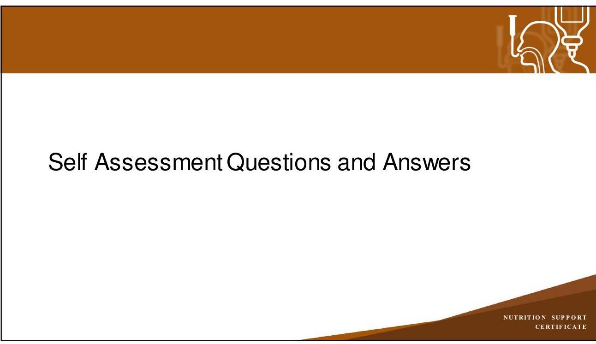

# NUTRITION SUPPORT CERTIFICATE 

## Electrolyte Disorders

Planned by the American Society of Health-System Pharmacists (ASHP) in collaboration with the American Society for Parenteral and Enteral Nutrition (ASPEN).
(c)2022 American Society of Health-System Pharmacists, Inc. All rights reserved.

No part of this publication may be reproduced or transmitted in any form or by any means, electronic or mechanical, including photocopying, microfilming, and recording, or by any information storage and retrieval system, without written permission from the American Society of Health-System Pharmacists.

--- page 1 ---

# NUTRITION SUPPORT COMPLICATIONS: ELECTROLYTE DISORDERS 

Anne M. Tucker, Pharm.D., BCNSP
University of Texas MD Anderson Cancer Center

NUTRITION SUPPORT CERTIFICATE

## RELEVANT FINANCIAL RELATIONSHIP DISCLOSURE

The following persons in control of this activity's content have relevant financial relationships:

- Jay Mirtallo: Fresenius Kabi, consultant

All other persons in control of content do not have any relevant financial relationships with an ineligible company.

As defined by the Standards of Integrity and Independence definition of ineligible company. All relevant financial relationships have been mitigated prior to the CPE activity.

--- page 2 ---

# LEARNING OBJECTIVES 

- Analyze patient information to determine the type of electrolyte disorder.
- Describe common etiologies of electrolyte disorders and their impact on the nutrition prescription.
- Design recommendations for the prevention and management of electrolyte disorders.

## KEY ABBREVIATIONS

- ACEI:
- AdjBW:
- AKI:
- ARB:
- ATPase:
- CKD:
- $\mathrm{CO}_{2}$ :
- ECF:
- ECG: angiotensin converting enzyme inhibitor
adjusted body weight
acute kidney injury
angiotensin receptor blocker
adenosine triphosphatase
chronic kidney disease
carbon dioxide
extracellular fluid
electrocardiogram

--- page 3 ---

# KEY ABBREVIATIONS 

- IBW:
- ICF:
- NSAID:
- PN:
- RRT:
ideal body weight
intracellular fluid
non-steroidal anti-inflammatory drug
parenteral nutrition
renal replacement therapy

NUTRITION SUPPORT CERTIFICATE

## NORMAL ELECTROLYTE CONCENTRATIONS

| Electrolyte | Adult |
| :-- | :-- |
| Sodium | $135-145 \mathrm{mEq} / \mathrm{L}$ |
| Potassium | $3.5-5 \mathrm{mEq} / \mathrm{L}$ |
| Chloride | $98-108 \mathrm{mEq} / \mathrm{L}$ |
| $\mathrm{CO}_{2}$ | $23-30 \mathrm{mEq} / \mathrm{L}$ |
| Calcium | $9-10.5 \mathrm{mg} / \mathrm{dL}$ |
| Phosphorus | $2.5-4.5 \mathrm{mg} / \mathrm{dL}$ |
| Magnesium | $1.7-2.4 \mathrm{mg} / \mathrm{dL}$ |
| *Variations in lab values exist between institutions |  |

--- page 4 ---

# ADULT ELECTROLYTE REQUIREMENTS 

| Electrolyte | Requirements |
| :-- | :-- |
| Sodium | $60-100 \mathrm{mEq} /$ day or $1-2 \mathrm{mEq} / \mathrm{kg} /$ day |
| Potassium | $60-100 \mathrm{mEq} /$ day or $1-2 \mathrm{mEq} / \mathrm{kg} /$ day |
| Chloride | As needed to maintain acid-base balance |
| Acetate | As needed to maintain acid-base balance |
| Calcium | $10-15 \mathrm{mEq} /$ day |
| Phosphorus | $20-40 \mathrm{mmol} /$ dayor $0.25-0.5 \mathrm{mmol} / \mathrm{kg} /$ day |
| Magnesium | $8-20 \mathrm{mEq} /$ day or $0.25-0.5 \mathrm{mEq} / \mathrm{kg} /$ day |
| *Consider lower doses for those with renal insufficiency |  |

Mirtallo J et al.JPEN J ParentEnteral Nutr. 2004; 28:S39-S70.

## ELECTROLYTE DOSING CONSIDERATIONS

- Renal dysfunction
- Empiric dose - 50\% recommended dose
- Obesity
- Adjusted body weight (AdjBW) for weight-based electrolyte dosing
- AdjBW $=[($ weight in $\mathrm{kg}-\mathrm{IBW}) \times 0.25]+\mathrm{IBW}$
- Electrolyte disorders
- Acute (< 48 hours) vs. chronic (> 48 hours)
- Rate of development, degree of abnormality and/or symptoms

--- page 5 ---

# POTASSIUM 

- Most abundant intracellular cation
- Normal serum potassium $3.5-5 \mathrm{mEq} / \mathrm{L}$
- Normal intracellular concentration $150 \mathrm{mEq} / \mathrm{L}$
- Functions in maintaining resting membrane potential, metabolism, protein and glycogen synthesis
- Na-K-ATPase pump regulates entry of K into the cell
- Intracellular shift: insulin, beta 2 agonists, alkalosis
- Extracellular shift: glucagon, acidosis, aldosterone (allows renal elimination)

## HYPOKALEMIA (K < 3.5 MEQ/L)

- Common electrolyte disorder
- Symptoms - cardiovascular and neuromuscular in nature
- ECG changes: prolonged QRS, ST-segment \& T-wave depression, U waves
- Arrhythmias: atrial fibrillation, ventricular tachycardia/fibrillation
- Muscle weakness, cramps, paralysis
- Rhabdomyolysis
- Intestinal ileus

--- page 6 ---

# HYPERKALEMIA (K > 5 MEQ/L) 

- Less common than hypokalemia
- Symptoms - cardiovascular and neuromuscular in nature
- ECG changes: peaked T waves, QRS widening, loss of P wave
- Arrhythmias: ventricular fibrillation, asystole
- Muscle weakness, paralysis

Canada TW et al. ASPEN Adult Nutrition Support Core Curriculum 3rd ed. 2017:113-37.

## POTASSIUM DISORDERS ETIOLOGY

Hypokalemia ( $\mathrm{K}<3.5 \mathrm{mEq} / \mathrm{L}$ )

- Poor intake
- Increased renal excretion
- K-wasting diuretics, aldosterone, amphotericin B, aminoglycosides
- Renal replacement therapy (RRT)
- Gl losses
- Diarrhea (stool 10 mEq K/L)
- Emesis/NG (up to $50 \mathrm{mEq} \mathrm{K/L}$ )
- Intracellular shift
- Alkalosis, insulin, beta agonists

--- page 7 ---

# POTASSIUM DISORDERS ETIOLOGY 

## Hyperkalemia ( $\mathrm{K}>5 \mathrm{mEq} / \mathrm{L}$ )

- Excessive intake
- Decreased renal excretion
- AKI, Stage 4/5 CKD
- ACEI, ARBs, aldosterone antagonists, renin inhibitors, NSAIDs
- K-sparing diuretics, trimethoprim, tacrolimus
- Extracellular shift
- Beta blockers, succinylcholine
- Cellular disruption
- Acidosis

Kraft MD et al. AmJ Health-Syst Pharm. 2005; 62:1663-82.

## HYPOKALEMIA MANAGEMENT

- Dietary modification, salt substitutes
- Check for hypomagnesemia and replace first as indicated
- Oral potassium therapy
- Asymptomatic, able to take oral medications
- Gastrointestinal adverse effect - large doses should be divided
- Parenteral potassium therapy
- Symptomatic, malabsorptive conditions, unable to take oral medications
- Adverse effects - phlebitis, hyperkalemia, arrhythmias
- Potassium-sparing diuretics

--- page 8 ---

# PARENTERAL POTASSIUM 

- Empiric potassium dose in PN: 1-2 mEq/kg/day
- Decrease dose by 50\% in renal impairment
- 10 mEq of K intravenously increases serum K by $\sim 0.1 \mathrm{mEq} / \mathrm{L}$
- Assumes normal renal and gastrointestinal function
- Dilution
- Sodium chloride-containing solutions
- Peripheral IV infusion: dilute $10 \mathrm{mEq} \mathrm{K} / 100 \mathrm{~mL}$ maximum
- Central IV infusion: can give more concentrated; check institutional policy
- Infusion rates
- $\leq 10 \mathrm{mEq} / \mathrm{hr}$ : no cardiac monitoring / peripheral IV access
- $>10 \mathrm{mEq} / \mathrm{hr}$ : cardiac monitoring / central IV access

Kraft MD et al. AmJ Health-Syst Pharm. 2005; 62:1663-82.

## HYPERKALEMIA MANAGEMENT

- Dietary modifications
- Identify and eliminate cause
- Medication therapy directed at hyperkalemia management
- Cardiac stabilization (does not reduce serum potassium levels)
- ECF to ICF shift
- Potassium elimination

--- page 9 ---

# HYPERKALEMIA MANAGEMENT 

| Agent | Dose / Route | Onset / Duration |
| :-- | :-- | :-- |
| Myocardial stabilization | 1-2 grams IV | $1-2 \mathrm{~min} / 10-30 \mathrm{~min}$ |
| Calcium gluconate | 10 units IV   25 gram IV |  |
| Cellular incorporation (ECF to ICF shift) | 15-45 min / 2-6 hours |  |
| Regular insulin $\pm$   Dextrose 50\% | $50-100 \mathrm{mEq} \mathrm{IV}$ | $30 \mathrm{~min} / 2-6$ hours |
| Sodium bicarbonate | $10-20 \mathrm{mg}$ nebulized | $30 \mathrm{~min} / 1-2$ hours |
| Albuterol |  |  |

HYPERKALEMIA MANAGEMENT

| Agent | Dose / Route | Onset / Duration |
| :-- | :-- | :-- |
| Increase potassium elimination | $20-40 \mathrm{mg} \mathrm{IV}$ |  |
| Furosemide | $5-15 \mathrm{~min} / 4-6$ hours |  |
| Sodium polystyrene sulfonate | $15-60$ grams PO or PR | $60 \mathrm{~min} / 4-6$ hours |
| Patiromer (not for acute use) | 8.4 grams PO daily | 7 hours / 24 hours |
| Sodium zirconium cyclosilicate (not for   acute use) | 10 grams PO 3 times daily   x 48 hours, then 10 grams   PO daily | 1 hour / 3.5 days |
| Hemodialysis | 2-4 hours | Immediate / Variable |

--- page 10 ---

# SELF-ASSESSMENT \#1 

A patient presents with serum potassium of $6 \mathrm{mEq} / \mathrm{L}$ and peaked T-waves on ECG. What intervention below is indicated for hyperkalemia management; however, will not reduce serum potassium levels?
A. Insulin
B. Sodium bicarbonate
C. Calcium gluconate
D. Sodium polystyrene sulfate

## MAGNESIUM

- Intracellular cation
- Normal serum magnesium 1.7-2.4 mg/dL
- Absorbed in the jejunum
- Regulated by the kidney
- Important as enzyme cofactor, nature's calcium blocker, neuromuscular transmission and cardiovascular tone, metabolism
- Maintaining high-normal range serum $\mathrm{Mg} \sim 2.7 \mathrm{mg} / \mathrm{dL}$
- Reduces ventricular ectopy
- Improves $\mathrm{K}^{+}$retention

--- page 11 ---

# HYPOMAGNESEMIA (MG < 1.7 MG/DL) 

- Common electrolyte disorder
- Up to 65\% ICU patients experience hypomagnesemia
- Symptoms - cardiovascular and neuromuscular in nature
- Refractory hypokalemia and hypocalcemia
- Hyperreflexia, muscle weakness, cramps
- Tetany, seizures, coma
- ECG changes: increased PR and QRS, prolonged QT interval, U waves
- Arrhythmias, atrial fibrillation, ventricular fibrillation, Torsade de pointes

## HYPERMAGNESEMIA (MG > 2.4 MG/DL)

- Symptomatic cases are rare
- Symptoms - related to loss of muscle tone
- Not typically observed until serum $\mathrm{Mg}>4-5 \mathrm{mg} / \mathrm{dL}$
- Hypotension
- Hyporeflexia, muscle weakness, paralysis
- Somnolence, coma

--- page 12 ---

# MAGNESIUM DISORDERS ETIOLOGY 

Hypomagnesemia ( $\mathrm{Mg}<1.7 \mathrm{mg} / \mathrm{dL}$ )

- Poor intake
- Malabsorption or gastrointestinal loss
- Small bowel diseases, gastric bypass, alcoholism, laxatives, diarrhea
- Renal replacement therapy (RRT)
- Increased renal excretion
- Renal tubular disorders
- Amphotericin B, aminoglycosides, cyclosporine, cisplatin, diuretics, foscarnet
- Intracellular shift (insulin)

Canada TW et al. ASPEN Adult Nutrition Support Core Curriculum 3rd ed. 2017:113-37.

## MAGNESIUM DISORDERS ETIOLOGY, CONT.

Hypermagnesemia ( $\mathrm{Mg}>2.4 \mathrm{mg} / \mathrm{dL}$ )

- Excessive intake
- Decreased renal excretion
- AKI, Stage 4/5 CKD, end stage renal disease (ESRD)
- Tumor lysis syndrome

--- page 13 ---

# HYPOMAGNESEMIA MANAGEMENT 

- Dietary modification
- Oral magnesium therapy
- Asymptomatic, able to take oral medications
- Magnesium oxide and magnesium hydroxide
- Adverse effect - abdominal cramping, diarrhea
- May be difficult to replace magnesium deficits orally if large doses for multiple days are required due risk of diarrhea
- Parenteral magnesium therapy
- Symptomatic, malabsorptive conditions, unable to take oral medications
- Adverse effects - phlebitis, injection site pain

## PARENTERAL MAGNESIUM

- Decrease dose by $50 \%$ in renal impairment
- Empiric magnesium dose in PN: 0.25-0.5 mEq/kg/day
- 8 mEq of Mg intravenously increases serum Mg by $\sim 0.1 \mathrm{mg} / \mathrm{dL}$
- Assumes normal renal and gastrointestinal function
- Dosing
- Serum Mg 1-1.5 mg/dL: 8-32 mEq, up to $1 \mathrm{mEq} / \mathrm{kg}$
- Serum Mg < $1 \mathrm{mg} / \mathrm{dL}$ : 32-64 mEq, up to $1.5 \mathrm{mEq} / \mathrm{kg}$
- Infusion rates
- $\leq 8 \mathrm{mEq}$ Mg per hour
- Prevents renal wasting and infusion reactions

--- page 14 ---

# HYPERMAGNESEMIA TREATMENT 

- Limit magnesium intake
- Increase magnesium elimination
- Volume expansion
- Loop diuretics
- RRT
- Direct magnesium antagonist
- Calcium chloride, calcium gluconate
- Supportive care measures
- Vasopressor therapy
- Mechanical ventilation

Kraft MD et al. AmJ Health-Syst Pharm. 2005; 62:1663-82.

## SELF-ASSESSMENT \#2

Upon morning review of a parenteral nutrition patient, it is noted that the serum magnesium is $1.5 \mathrm{mg} / \mathrm{dL}$. A magnesium sulfate replacement is needed. Serum creatinine is $2 \mathrm{mg} / \mathrm{dL}$. What magnesium supplementation dose is most appropriate?
A. No dose is indicated
B. 16 mEq magnesium sulfate
C. 32 mEq magnesium sulfate
D. 48 mEq magnesium sulfate

--- page 15 ---

# PHOSPHORUS 

- Intracellular anion
- Normal serum phosphorus $2.5-4.5 \mathrm{mg} / \mathrm{dL}$
- Essential part of phospholipid membranes, metabolism, ATP production, 2,3diphosphoglycerate regulation, buffer system
- Hormonal regulation
- Vitamin D
- Parathyroid hormone
- Calcitonin

## HYPOPHOSPHATEMIA (P < 2.5 MG/DL)

- 30-100\% nutrition support patients experience hypophophatemia
- Symptoms - cardiovascular and neuromuscular in nature
- Paresthesia, muscle weakness
- Cardiomyopathy
- Red blood cell breakdown
- Acute respiratory failure
- Rhabdomyolysis
- Seizures, coma

--- page 16 ---

# HYPERPHOSPHATEMIA (P > 4.5 MG/DL) 

- Symptomatic cases are rare
- Symptoms
- Soft tissue calcifications
- Nephrolithiasis
- Obstructive uropathy
- Hypocalcemia (tetany)

## PHOSPHORUS DISORDERS ETIOLOGY

Hypophosphatemia ( $\mathrm{P}<2.5 \mathrm{mg} / \mathrm{dL}$ )

- Poor intake
- Poor absorption
- Phosphate binders, vitamin D deficiency, laxatives, diarrhea
- Increased renal excretion
- Hyperparathyroidism, burns
- Diuretics, corticosteroids, foscarnet
- RRT
- Intracellular shift
- Insulin, calcitonin

--- page 17 ---

# PHOSPHORUS DISORDERS ETIOLOGY, CONT. 

Hyperphosphatemia ( $\mathbf{P > 4 . 5 ~ m g} / \mathrm{dL}$ )

- Excessive intake
- Excessive vitamin D intake
- Decreased renal excretion
- AKI, Stage 4/5 CKD, end stage renal disease (ESRD)
- Tumor lysis syndrome

Canada TW et al. ASPEN Adult Nutrition Support Core Curriculum 3rd ed. 2017:113-37.

## HYPOPHOSPHATEMIA MANAGEMENT

- Oral phosphate therapy
- Asymptomatic, able to take oral medications
- Neutraphos, KPhos neutral, sodium phosphate liquid
- Adverse effect - abdominal cramping, osmotic diarrhea
- Parenteral phosphate therapy
- Symptomatic, malabsorptive conditions, unable to take oral medications

--- page 18 ---

# PARENTERAL PHOSPHATE 

- Decrease dose by $50 \%$ in renal impairment
- Empiric phosphate dose in PN: 0.25-0.5 mmol/kg/day
- Check Na and K to determine appropriate phosphate salt
- $1 \mathrm{mmol} \mathrm{K}_{3} \mathrm{PO}_{4}=1.5 \mathrm{mEq} \mathrm{K}$
- $1 \mathrm{mmol} \mathrm{NaPO}_{4}=1.33 \mathrm{mEq} \mathrm{Na}$
- Phosphorus replacement dosing
- Serum P 2.3-2.7 mg/dL: 0.08-0.16 mmol/kg
- Serum P 1.5-2.2 mg/dL: 0.16-0.32 mmol/kg
- Serum P 2.3-2.7 mg/dL: 0.32-0.64 mmol/kg
- Infusion rate $\leq 7$ mmol phosphate per hour

Clark CL, et al. Crit Care Med 1995;23:1504-10.

## HYPERPHOSPHATEMIA TREATMENT

- Limit phosphorus intake
- Phosphorus binders
- Symptomatic hypocalcemia (tetany)
- Calcium chloride, calcium gluconate
- Renal replacement therapy

--- page 19 ---

# SELF-ASSESSMENT \#3 

Assuming normal renal function, how much will 30 mmol of potassium phosphate increase the serum potassium?
A. $0.15 \mathrm{mEq} / \mathrm{L}$
B. $0.3 \mathrm{mEq} / \mathrm{L}$
C. $0.45 \mathrm{mEq} / \mathrm{L}$
D. $0.6 \mathrm{mEq} / \mathrm{L}$

## CALCIUM

- Intracellular cation
- Normal serum calcium 9-10.5 mg/dL
- Normal serum ionized serum calcium
- $4.4-5.4 \mathrm{mg} / \mathrm{dL}$
- 1.1-1.35 mmol/L
- Essential for bone mineralization and growth, coagulation, platelet adhesion, propagation of neuromuscular activity, muscle excitation and contraction, endocrine and exocrine systems

--- page 20 ---

# CALCIUM, CONT. 

- Regulation
- Vitamin D
- Parathyroid hormone
- Calcitonin
- Phosphorus
- pH (affects albumin binding)

## HYPOCALCEMIA (CA < 9 MG/DL)

- Common in critically ill
- Albumin-corrected $\mathrm{Ca}^{2+}$ equation (not reliable in critically ill)
- Corrected $\mathrm{Ca}^{2+}=0.8$ (4 - measured albumin) + measured $\mathrm{Ca}^{2+}$
- Symptoms - cardiovascular and neuromuscular in nature
- Paresthesia (oral), tetany, muscle cramps
- Cardiovascular
- Depression, anxiety, memory loss, confusion
- Skin, hair, and nail changes

--- page 21 ---

# HYPOCALCEMIA ETIOLOGY 

- Poor intake
- Hypoparathyroidism
- Decreased bone resorption
- Bisphosphonates, calcitonin
- Vitamin D deficiency
- Poor intake of vitamin D
- Reduced sunlight exposure
- CKD
- Phenytoin, phenobarbital

Kraft MD et al. AmJ Health-Syst Pharm. 2005; 62:1663-82.

## HYPOCALCEMIA ETIOLOGY, CONT.

- Alkalosis
- Increased binding of $\mathrm{Ca}^{2+}$ to albumin
- Hypoalbuminemia
- Calcium binders
- Phosphate replacement products
- Citrate (anticoagulant)
- Hypomagnesemia
- Reduced PTH secretion and activity
- Loop diuretics, aminoglycosides, foscarnet, cisplatin, cyclosporine, amphotericin B

--- page 22 ---

# HYPERCALCEMIA (CA > 10.5 MG/DL) 

- Acute - hypercalcemia of malignancy
- Symptoms
- Nausea, vomiting, polyuria, polydipsia, AKI, altered mental status, malignant arrhythmias, coma
- Chronic - primary hyperparathyroidism
- Symptoms
- Renal calcium deposits, metastatic calcifications, CKD
- Medication-induced
- Vitamin D, calcium supplements, thiazide diuretics

Canada TW et al. ASPEN Adult Nutrition Support Core Curriculum 3rd ed. 2017:113-37.

## HYPOCALCEMIA MANAGEMENT

- Correct hypomagnesemia if present
- Oral calcium therapy
- Asymptomatic, able to take oral medications
- Elemental calcium content or oral products varies by salt (9-40\%)
- Adverse effect - constipation
- Oral vitamin D therapy
- Parenteral calcium therapy
- Symptomatic, malabsorptive conditions, unable to take oral medications

--- page 23 ---

# PARENTERAL CALCIUM 

- Empiric calcium dose in PN: 10-15 mEq/day
- Always check calcium-phosphate compatibility
- Calcium may be removed from PN for short periods in adults
- Gluconate salt preferred in PN and peripheral IV
- 1 g calcium gluconate $=4.65 \mathrm{mEq}$ elemental calcium
- 1 g calcium chloride $=13.6 \mathrm{mEq}$ elemental calcium
- Bolus dosing versus continuous infusions
- Maximum infusion rate: 0.8-1.5 mEq calcium per minute
- Adverse effects: infusion-related, hypotension, bradycardia

Kraft MD et al. AmJ Health-Syst Pharm. 2005; 62:1663-82.

## HYPERCALCEMIA TREATMENT

- Identify and treat underlying cause
- Hydration $\pm$ loop diuretics
- Calcitonin (rapid onset, tachyphylaxis)
- Bisphosphonates (slower onset, longer duration)
- Steroids
- Surgery (primary hyperparathyroidism)

--- page 24 ---

# SELF-ASSESSMENT \#1 

A patient presents with serum potassium of $6 \mathrm{mEq} / \mathrm{L}$ and peaked T-waves on ECG. What intervention below is indicated for hyperkalemia management; however, will not reduce serum potassium levels?
A. Insulin
B. Sodium bicarbonate
C. Calcium gluconate
D. Sodium polystyrene sulfonate

--- page 25 ---

# SELF-ASSESSMENT \#1 

A patient presents with serum potassium of $6 \mathrm{mEq} / \mathrm{L}$ and peaked T-waves on ECG. What intervention below is indicated for hyperkalemia management; however, will not reduce serum potassium levels?
A. Insulin
B. Sodium bicarbonate
C. Calcium gluconate
D. Sodium polystyrene sulfonate

## SELF-ASSESSMENT \#2

Upon morning review of a parenteral nutrition patient, it is noted that the serum magnesium is $1.5 \mathrm{mg} / \mathrm{dL}$. A magnesium sulfate replacement is needed. Serum creatinine is $2 \mathrm{mg} / \mathrm{dL}$. What magnesium supplementation dose is most appropriate?
A. No dose is indicated
B. 16 mEq magnesium sulfate
C. 32 mEq magnesium sulfate
D. 48 mEq magnesium sulfate

--- page 26 ---

# SELF-ASSESSMENT \#2 

Upon morning review of a parenteral nutrition patient, it is noted that the serum magnesium is $1.5 \mathrm{mg} / \mathrm{dL}$. A magnesium sulfate replacement is needed. Serum creatinine is $2 \mathrm{mg} / \mathrm{dL}$. What magnesium supplementation dose is most appropriate?
A. No dose is indicated
B. 16 mEq magnesium sulfate
C. 32 mEq magnesium sulfate
D. 48 mEq magnesium sulfate

## SELF-ASSESSMENT \#3

Assuming normal renal function, how much will 30 mmol of potassium phosphate increase the serum potassium?
A. $0.15 \mathrm{mEq} / \mathrm{L}$
B. $0.3 \mathrm{mEq} / \mathrm{L}$
C. $0.45 \mathrm{mEq} / \mathrm{L}$
D. $0.6 \mathrm{mEq} / \mathrm{L}$

--- page 27 ---

# SELF-ASSESSMENT \#3 

Assuming normal renal function, how much will 30 mmol of potassium phosphate increase the serum potassium?
A. $0.15 \mathrm{mEq} / \mathrm{L}$
B. $0.3 \mathrm{mEq} / \mathrm{L}$
C. $0.45 \mathrm{mEq} / \mathrm{L}$
D. $0.6 \mathrm{mEq} / \mathrm{L}$

## CONCLUSIONS

- A thorough history and physical, including medication review, is important for identification and diagnosis of electrolyte disorders.
- Knowledge of causes of electrolyte disorders will help in determining appropriate prevention and treatment plan development.
- Development of a nutrition care plan should be done using a systematic approach including comorbid states, medication therapy, and changes in clinical status.

--- page 28 ---

# REFERENCES 

- Canada TW, Lord LM. Chapter 7 Fluid, Electrolytes, and Acid-Base Disorders. In: Mueller CM, ed. The A.S.P.E.N. Adult Nutrition Support Core Curriculum. 3rd ed. Maryland: A.S.P.E.N.; 2017:113-37.
- Clark CL, Sacks GS, Dickerson RN et al. Treatment of hypophosphatemia in patients receiving specialized nutrition support using a graduated dosing scheme: results from a prospective clinical trial. Crit Care Med. 1995; 23:1504-10.
- Hammill-Ruth RJ, McGory R. Magnesium repletion and its effect on potassium homeostasis in critically ill adults: results of a double-blind, randomized, controlled trial. Crit Care Med. 1996; 24:38-45.

## REFERENCES, CONT.

- Kraft MD, Btaiche IF, Sacks GS, Kudsk KA. Treatment of electrolytes disorders in adult patients in the intensive care unit. Am J Health-Syst Pharm. 2005; 62:166382.
- Mirtallo J, Canada T, Johnson D et al. Safe practices for parenteral nutrition. JPEN J Parent Enteral Nutr. 2004; 28:S39-S70.

--- page 29 ---

NUTRITION SUPPORT CERTIFICATE

--- page 30 ---

# Anne M. Tucker, Pharm.D., BCNSP 

Clinical pharmacy Specialist
University of Texas MD Anderson Cancer Center Houston, Texas

Anne M. Tucker is clinical pharmacy specialist at the MD Anderson Cancer Center, Houston, Texas. She received her BS in Chemistry from the University of Arkansas, Pharm.D. from the University of Arkansas for Medical Sciences (UAMS) where she also completed residency training. Dr. Tucker has over 20 years of experience in critical care and nutrition support practice and participates in didactic and experiential training of students and post-graduate trainees. Her areas of interest include fluid and electrolyte disorders, nutrition support in critically ill cancer patients, and the promotion of safe parenteral nutrition practices.

Dr. Tucker is currently the Chair of the American Society for Parenteral and Enteral Nutrition (ASPEN) Abstract Review Committee and President of the Texas Gulf Coast ASPEN Chapter. She is also a member and abstract reviewer for American Society of Health-System Pharmacists and Society of Critical Care Medicine. Past leadership includes Chair and member for the Board of Pharmacy Specialties Nutrition Support Specialty Council, Chair and Secretary of the ASPEN Pharmacy Practice Section, Chair of the ASPEN Self-Assessment Committee, Chair for the ASPEN Task Force for Revision of Nutrition Support Pharmacist Standards, and member of the ASPEN Parenteral Nutrition Safety Committee. She is a regular presenter at Clinical Nutrition Week and was most recently involved as an editor and author of the ASPEN Fluid, Electrolytes and Acid-Base Disorders Handbook.

--- page 31 ---

# Relevant Financial Relationship Disclosure

In accordance with our accreditor’s Standards of Integrity and Independence in Accredited Continuing Education, ASHP requires that all individuals in control of content disclose all financial relationships with ineligible companies. An individual has a relevant financial relationship if they have had a financial relationship with ineligible company in any dollar amount in the past 24 months and the educational content that the individual controls is related to the business lines or products of the ineligible company.

An ineligible company is any entity producing, marketing, re-selling, or distributing health care goods or services consumed by, or used on, patients. The presence or absence of relevant financial relationships will be disclosed to the activity audience.

The following persons in control of this activity’s content have relevant financial relationships:

- Phil Ayers: Fresenius Kabi, consultant and speaker
- David Evans: Fresenius Kabi, consultant and speaker; Abbott Laboratories, consultant and speaker; CVS/OptionCare, consultant; Alcresta, consultant and speaker
- Andrew Mays: Fresenius Kabi, speaker
- Jay Mirtallo: Fresenius Kabi, consultant
- Kris Mogensen: Baxter, speaker; ThriveRx, advisory board; Pfizer, advisory board

All other persons in control of content do not have any relevant financial relationships with an ineligible company.

As required by the Standards of Integrity and Independence in Accredited Continuing Education definition of ineligible company, all relevant financial relationships have been mitigated prior to the CPE activity.

# Methods and CE Requirements

This online activity consists of a combined total of 12 learning modules. Pharmacists and physicians are eligible to receive a total of 20 hours of continuing education credit by completing all 12 modules within this certificate.

Participants must participate in the entire activity, complete the evaluation and all required components to claim continuing pharmacy education credit online at ASHP Learning Center http://elearning.ashp.org. Follow the prompts to claim credit and view your statement of credit within 60 days after completing the activity.

# Important Note – ACPE 60 Day Deadline:

Per ACPE requirements, CPE credit must be claimed within 60 days of being earned. To verify that you have completed the required steps and to ensure your credits have been reported to CPE Monitor, check your NABP eProfile account to validate that your credits were transferred successfully before the ACPE 60-day deadline. After the 60 day deadline, ASHP will no longer be able to award credit for this activity.

# System Technical Requirements

Courses and learning activities are delivered via your Web browser and Acrobat PDF. Users should have a basic comfort level using a computer and navigating websites.

View Frequently Asked Questions for more information.