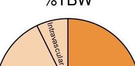
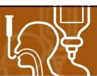
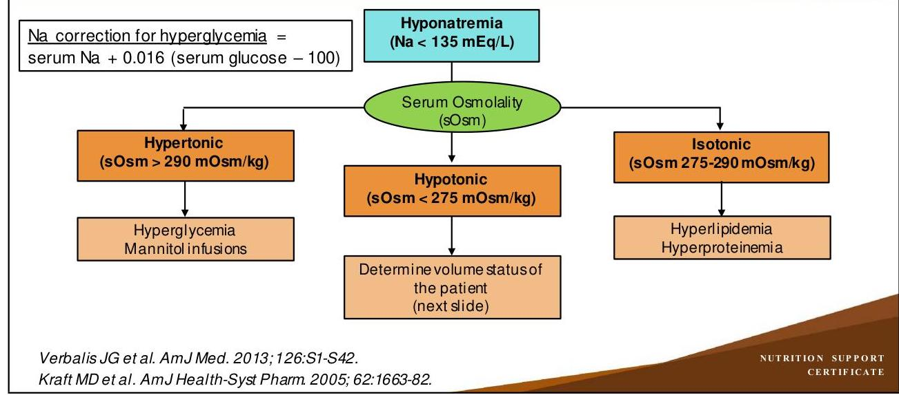
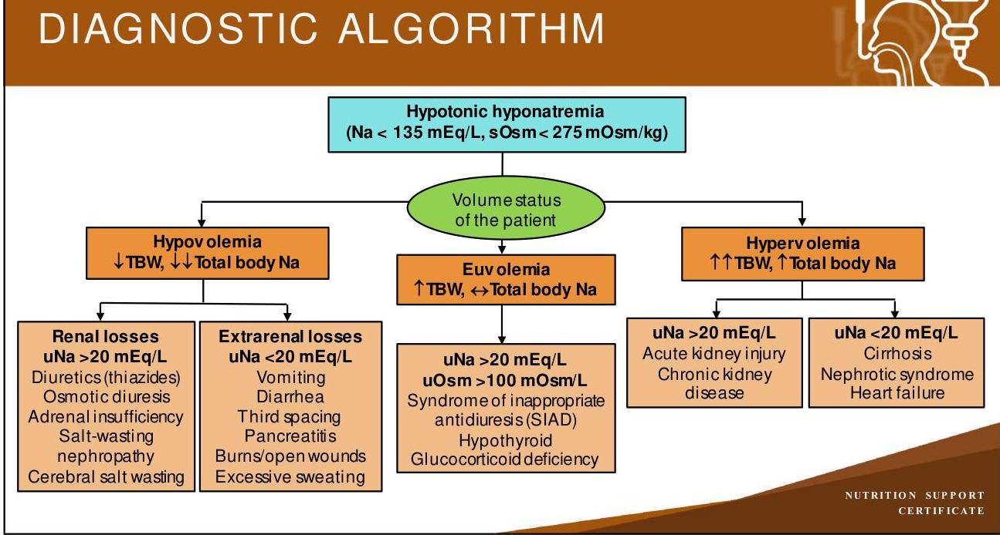
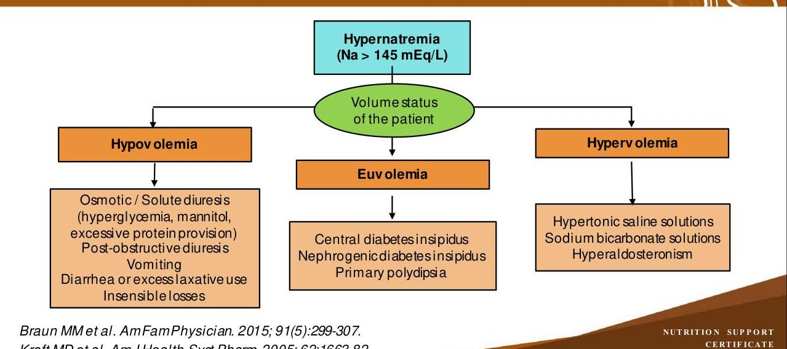
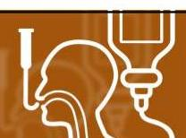
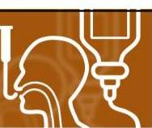
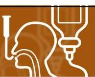

# NUTRITION SUPPORT CERTIFICATE 

## Fluids \& Sodium Disorders

Planned by the American Society of Health-System Pharmacists (ASHP) in collaboration with the American Society for Parenteral and Enteral Nutrition (ASPEN).
(c)2022 American Society of Health-System Pharmacists, Inc. All rights reserved.

No part of this publication may be reproduced or transmitted in any form or by any means, electronic or mechanical, including photocopying, microfilming, and recording, or by any information storage and retrieval system, without written permission from the American Society of Health-System Pharmacists.

--- page 1 ---

# NUTRITION SUPPORT COMPLICATIONS: FLUIDS \& SODIUM DISORDERS 

Anne M. Tucker, Pharm.D., BCNSP
University of Texas MD Anderson Cancer Center

NUTRITION SUPPORT CERTIFICATE

## RELEVANT FINANCIAL RELATIONSHIP DISCLOSURE

The following persons in control of this activity's content have relevant financial relationships:

- Jay Mirtallo: Fresenius Kabi, consultant

All other persons in control of content do not have any relevant financial relationships with an ineligible company.

As defined by the Standards of Integrity and Independence definition of ineligible company. All relevant financial relationships have been mitigated prior to the CPE activity.

--- page 2 ---

# LEARNING OBJECTIVES 

- Analyze patient information to determine the type of fluid \& sodium disorder.
- Describe common etiologies of fluid \& sodium disorders and their impact on the nutrition prescription.
- Design recommendations for the prevention and management of fluid and sodium disorders.

## KEY ABBREVIATIONS

- AdjBW:
- BUN:
- $\mathrm{CO}_{2}$ :
- ECF:
- IBW:
- ICF:
- PN:
adjusted body weight
blood urea nitrogen
carbon dioxide
extracellular fluid
ideal body weight
intracellular fluid
parenteral nutrition

--- page 3 ---

# KEY ABBREVIATIONS 

- SIAD:
- sOsm:
- TBW:
- uNa:
- uOsm:
syndrome of inappropriate antidiuresis
serum osmolality
total body water
urine sodium
urine osmolality

## SELF-ASSESSMENT \#1

- MN is a 72 year-old female who is admitted to the medicine service for a nonspecific complaint of general malaise. On physical exam, she has dry mucous membranes and exhibits poor skin turgor.
- Past medical history: HTN, osteoarthritis, and hyperlipidemia
- Home medications: hydrochlorothiazide, aspirin, simvastatin, calcium carbonate, vitamin D
- Vital signs: BP 96/52, HR 100, RR 14, Temp 37 C
- Laboratory values: Na $122 \mathrm{mEq} / \mathrm{L}, \mathrm{K} 4 \mathrm{mEq} / \mathrm{L}, \mathrm{Cl} 101 \mathrm{mEq} / \mathrm{L}, \mathrm{CO}_{2} 19 \mathrm{mEq} / \mathrm{L}$, BUN $45 \mathrm{mg} / \mathrm{dL}, \mathrm{Cr} 1.5 \mathrm{mg} / \mathrm{dL}$, glucose $115 \mathrm{mg} / \mathrm{dL}$, magnesium $2.4 \mathrm{mg} / \mathrm{dL}$, urine osmolality $450 \mathrm{mOsm} / \mathrm{L}$

--- page 4 ---

# SELF-ASSESSMENT \#1, CONT. 

Which of the following is the most likely diagnosis for this patient's hyponatremia?
A. Hypertonic
B. Hypovolemic hypotonic
C. Euvolemic hypotonic
D. Hypervolemic hypotonic

## FLUID AND SODIUM DISORDERS

--- page 5 ---

# TOTAL BODY WATER (TBW) 

- Water content of the body
- 60\% lean body mass for males
- 50\% lean body mass for females
- Body composition influence on TBW
- Water content of fat $\sim 10 \%$
- Water content of muscle $\sim 75 \%$

## BODY FLUID DISTRIBUTION

- Intracellular fluid (ICF)
- 2/3 total body water
- Potassium, magnesium phosphorus
- Extracellular fluid (ECF)
- 1/3 total body water
- Sodium, chloride, bicarbonate
- Subdivisions
- 3/4 ECF - Interstitial fluid
- 1/4 ECF - Intravascular fluid
- Transcellular fluid
\%TBW

$\square$ ICF $\square$ ECF

--- page 6 ---

# BODY FLUID MAINTENANCE 

- Normal cellular function
- Tight regulation
- Serum osmolality (sOsm)
- Important determinant of intracellular volume
- $\mathrm{sOsm}=2 \times[\mathrm{Na}]+[$ glucose/18] + [BUN/2.8]
- Alterations $\Rightarrow$ neurological symptoms
- Blood volume
- Determinant of effective tissue perfusion
- Plasma proteins play role in oncotic pressure
- Oxygen \& nutrient delivery
- Metabolic waste removal

## FLUID REQUIREMENTS

- Weight and age based
- Ages 18-55 years: $35 \mathrm{~mL} / \mathrm{kg} /$ day
- Ages 56-75 years: $30 \mathrm{~mL} / \mathrm{kg} /$ day
- Ages $>75$ years: $25 \mathrm{~mL} / \mathrm{kg} /$ day
- Fluid-restricted adults: $\leq 25 \mathrm{~mL} / \mathrm{kg} /$ day

--- page 7 ---

# FLUID REQUIREMENTS, CONT. 

- Adjusted Holiday-Segar formula
- 1500 mL for the first 20 kg of body weight, then ADD
- Ages $\leq 50$ years: 20 mL per kg of remaining body weight
- Ages $>50$ years: 15 mL per kg of remaining body weight
- $1 \mathrm{~mL} / \mathrm{kcal}$ ingested
- 1500-1600 mL/m² per 24 hours

Canada TW et al. ASPEN Adult Nutrition Support Core Curriculum 3rd ed. 2017:113-37.

## ASSESSING FLUID BALANCE

- Physical exam (mucous membranes, skin turgor, edema)
- Urine output ( $0.5-2 \mathrm{~mL} / \mathrm{kg} / \mathrm{hour}$ )
- Weight changes
- Temperature
- Vital signs (blood pressure, heart rate)
- Intake and output records
- Insensible losses

--- page 8 ---

# GASTROINTESTINAL LOSSES

|  Body Fluid Type | mEq/L |  |  |   |
| --- | --- | --- | --- | --- |
|   | Na | Cl | K | HCO₃  |
|  Stomach | 60 | 130 | 15 | 0  |
|  Duodenum | 140 | 80 | 5 | 0  |
|  Pancreas | 140 | 75 | 5 | 115  |
|  Bile | 145 | 100 | 5 | 35  |
|  Ileum | 140 | 104 | 5 | 30  |
|  Colon | 60 | 40 | 30 | 0  |

*ASPEN Adult Nutrition Support Core Curriculum, 3rd edition, 2017:113-137.*

# GASTROINTESTINAL LOSSES

|  Body Fluid Type | mEq/L |  |  |   |
| --- | --- | --- | --- | --- |
|   | Na | Cl | K | HCO₃  |
|  Stomach | 60 | 130 | 15 | 0  |
|  Duodenum | 140 | 80 | 5 | 0  |
|  Pancreas | 140 | 75 | 5 | 115  |
|  Bile | 145 | 100 | 5 | 35  |
|  Ileum | 140 | 104 | 5 | 30  |
|  Colon | 60 | 40 | 30 | 0  |

*ASPEN Adult Nutrition Support Core Curriculum, 3rd edition, 2017:113-137.*

--- page 9 ---

# REPLACEMENT FLUIDS 

- Based upon specific losses
- Gastric and colonic fluid losses
- 0.45\% NaCl (1/2 Normal Saline) + 10-20 mEq KCl/L
- Small bowel fluid losses
- 0.9\% NaCl (Normal Saline)
- Bicarbonate or acetate-based customized fluid
- Balanced crystalloid (e.g., Ringers Lactate)

## NORMAL ELECTROLYTE CONCENTRATIONS

| Electrolyte | Adult |
| :-- | :-- |
| Sodium | $135-145 \mathrm{mEq} / \mathrm{L}$ |
| Potassium | $3.5-5 \mathrm{mEq} / \mathrm{L}$ |
| Chloride | $98-108 \mathrm{mEq} / \mathrm{L}$ |
| $\mathrm{CO}_{2}$ | $23-30 \mathrm{mEq} / \mathrm{L}$ |
| Calcium | $9-10.5 \mathrm{mg} / \mathrm{dL}$ |
| Phosphorus | $2.5-4.5 \mathrm{mg} / \mathrm{dL}$ |
| Magnesium | $1.7-2.4 \mathrm{mg} / \mathrm{dL}$ |
| *Variations in lab values exist between institutions |  |

--- page 10 ---

# ADULT ELECTROLYTE REQUIREMENTS 

| Electrolyte | Requirements |
| :-- | :-- |
| Sodium | $60-100 \mathrm{mEq} /$ day or $1-2 \mathrm{mEq} / \mathrm{kg} /$ day |
| Potassium | $60-100 \mathrm{mEq} /$ day or $1-2 \mathrm{mEq} / \mathrm{kg} /$ day |
| Chloride | As needed to maintain acid-base balance |
| Acetate | As needed to maintain acid-base balance |
| Calcium | $10-15 \mathrm{mEq} /$ day |
| Phosphorus | $20-40 \mathrm{mmol} /$ dayor $0.25-0.5 \mathrm{mmol} / \mathrm{kg} /$ day |
| Magnesium | $8-20 \mathrm{mEq} /$ day or $0.25-0.5 \mathrm{mEq} / \mathrm{kg} /$ day |
| *Consider lower doses for those with renal insufficiency |  |

Mirtallo J et al.JPEN J ParentEnteral Nutr. 2004; 28:S39-S70.

## ELECTROLYTE DOSING CONSIDERATIONS

- Electrolyte disorders
- Acute (< 48 hours) vs. chronic (> 48 hours)
- Rate of development, degree of abnormality and/or symptoms
- Renal dysfunction
- Empiric dose - 50\% recommended dose
- Obesity
- Adjusted body weight (AdjBW) for weight-based electrolyte dosing
- AdjBW $=[($ weight in $\mathrm{kg}-\mathrm{IBW}) \times 0.25]+\mathrm{IBW}$

--- page 11 ---

# SODIUM 

- Most abundant extracellular cation
- Normal serum sodium $135-145 \mathrm{mEq} / \mathrm{L}$
- Primary influence on serum osmolality
- Changes in serum sodium are due to water balance changes
- Water flows from areas of lower osmolality to higher osmolality
- Sodium disorder diagnosis
- History and physical
- Laboratory analysis (serum, urine)
- Serum osmolality
- Volume status of the patient

## HYPONATREMIA (NA < 135 MEQ/L)

- Common electrolyte disorder
- $28 \%$ hospitalized patients
- $17.2 \%$ critically ill patients
- Up to 6-fold increase in morbidity and mortality
- Wide symptomatology - neurologic in nature
- None
- Moderate: headache, nausea, confusion
- Severe: vomiting, obtunded, seizures, coma

--- page 12 ---

# DIAGNOSTIC ALGORITHM 

## DIAGNOSTIC ALGORITHM

--- page 13 ---

# SIAD 

Sustained or intermittently elevated antidiuretic hormone (ADH) level inappropriate for osmotic and volume status which normally inhibits ADH secretion

| Essential Criteria | Supplemental Criteria |
| :--: | :--: |
| Effective sOsm < $275 \mathrm{mOsm} / \mathrm{kg}$   uOsm $>100 \mathrm{mOsm} / \mathrm{kg}$ at some level of decreased effective osmolality   Clinical euvolemia   uNa $>30 \mathrm{mEq} / \mathrm{L}$ (normal sodium \& w ater intake)   No adrenal, thyroid, pituitary or renal insufficiency   No recent diuretic use | Serum uric acid $<0.24 \mathrm{mmol} / \mathrm{L}(<4 \mathrm{mg} / \mathrm{dL})$   Fractional excretion of uric acid $>12 \%$   Serum urea $<3.6 \mathrm{mmol} / \mathrm{L}(<21.6 \mathrm{mg} / \mathrm{dL})$   Fractional excretion of urea $>55 \%$   Fractional excretion of $\mathrm{Na}>0.5 \%$   No change in serum Na with $0.9 \% \mathrm{NaCl}$ administration   Na correction with fluid restriction |

## CAUSES OF SIAD

- Diagnosis of exclusion
- Causes
- Pulmonary (small cell lung cancer, pneumonia, abscess, tuberculosis)
- Neurologic (tumors, trauma, meningitis, abscess, subarachnoid hemorrhage, pain, anxiety, nausea)
- Hypothyroidism
- Medications

--- page 14 ---

# SIAD: MEDICATIONS ASSOCIATED 

- Anticancer agents: cyclophosphamide, ifosfamide, vincristine
- Anticonvulsants: carbamazepine, oxcarbazepine
- Antidepressants: SSRIs, TCADs, MAOI, venlafaxine
- Antidiabetic agent: chlorpropamide
- Antipsychotics: phenothiazines
- Miscellaneous: opiates, 3,4-methylenedioxy-methamphetamine (MDMA), nonsteroidal anti-inflammatory drugs
- Vasopressin analogs: desmopressin, oxytocin, terlipressin, vasopressin

Braun MM et al. AmFamPhysician. 2015; 91(5):299-307.
Kraft MD et al. AmJ Health-Syst Pharm. 2005; 62:1663-82.

## HYPONATREMIA MANAGEMENT

- Focus on treatment of underlying cause
- Discontinuation of hypotonic fluids
- Replace sodium deficit or water excess
- Change in serum $\mathrm{Na}=$ infusate $\mathrm{Na}-$ serum Na

TBW + 1

- Hypertonic saline for symptomatic patients
- Sodium correction limited to 8-10 mEq per Liter per day
- Prevention of central pontine myelinolysis
- Gradual onset of neurologic alterations

--- page 15 ---

# HYPONATREMIA MANAGEMENT 

| Hyponatremia Type | Treatment (plus treat or remove underlying cause) |
| :-- | :-- |
| Hypertonic | Insulin (hyperglycemia), discontinue mannitol |
| Hypotonic | Isotonic fluids (0.9\% sodium chloride, lactated ringers), discontinue   diuretics, steroids (adrenal insufficiency) |
| Hypovolemic | Fluid restriction $\pm$ loop diuretics, concentrate PN, ensure at least isotonic   fluids, vaptan (SIAD); glucocorticoids (deficiency); thyroid hormone   replacement (hypothyroid) |
| Euvolemic | Sodium and fluid restriction, vaptans, diuretics |
| Hypervolemic |  |

## SELF-ASSESSMENT \#2

Which of the following medications increases the risk of developing hypotonic euvolemic hyponatremia?
A. Hydrochlorothiazide
B. Ondansetron
C. Sertraline
D. Spironolactone

--- page 16 ---

# SELF-ASSESSMENT \#3 

Which of the following sodium concentrations ( $\mathrm{mEq} / \mathrm{L}$ ) is the most appropriate choice to use when formulating a parenteral nutrition plan for a patient with heart failure with hyponatremia, shortness of breath, and edema?
A. 38.5 mEq sodium per Liter
B. 77 mEq sodium per Liter
C. 115 mEq sodium per Liter
D. 154 mEq sodium per Liter

HYPERNATREMIA (NA > 145 MEQ/L)

- All cases are hypertonic
- Less common than hyponatremia
- 1-7.9\% hospitalized patients
- Up to $70 \%$ increase in mortality
- Symptoms - neurologic in nature
- Thirst, dry mucus membranes
- Mild-moderate: lethargy, weakness, confusion, irritability
- Severe: twitching, seizures, coma

--- page 17 ---

# DIAGNOSTIC ALGORITHM 

## DIABETES INSIPIDUS

- Condition resulting in imbalance of water in the body due to large amounts of dilute urine excretion
- Central diabetes insipidus: lack of or decrease in antidiuretic hormone secretion
- Nephrogenic diabetes insipidus: decreased renal response to antidiuretic hormone
- Medication and electrolyte causes of nephrogenic diabetes insipidus
- Amphotericin B, cidofovir, foscarnet, demeclocycline, lithium toxicity
- Hypercalcemia, hypokalemia

--- page 18 ---

# HYPERNATREMIA MANAGEMENT 

- Focus on treatment of underlying cause
- Discontinuation of hypertonic fluids
- Correct water deficit with hypotonic fluids
- Water deficit (L) = TBW x [1 - (serum $\mathrm{Na} / 140)]$
- Administer 50\% in first 24 hours, remainder in next 48-72 hours
- Isotonic fluids for hemodynamic instability
- Sodium correction limited to 8-10 mEq per Liter per day
- Prevention of cerebral edema

Braun MM et al. AmFamPhysician. 2015; 91(5):299-307.
Kraft MD et al. AmJ Health-Syst Pharm. 2005; 62:1663-82.

## HYPERNATREMIA MANAGEMENT

Hypernatremia Type

| Hypovolemic | Oral water, enteral water flushes, hypotonic fluids (dextrose 5\% in water, 0.45\% sodium chloride, addition of sterile water to PN), insulin (hyperglycemia), amino acid dose reduction (solute diuresis) |
| :--: | :--: |
|  | Desmopressin (central diabetes insipidus) |
| Euvolemic | Thiazide diuretics, sodium restriction, calcium or potassium supplementation (nephrogenic diabetes insipidus) |
| Hypervolemic | Loop diuretic, hypotonic fluids (sodium overload), adrenalectomy or spironolactone (hyperaldosteronism) |

--- page 19 ---

# SELF-ASSESSMENT \#4 

- TT is a 65-year-old patient with enterocutaneous fistula who is on parenteral nutrition providing $28 \mathrm{kcal} / \mathrm{kg} /$ day and 3 g protein $/ \mathrm{kg} /$ day
- Vital signs: BP 102/62, HR 85, RR 20, Temp 38 C
- Physical exam: +thirst and dry mucous membranes
- Basic metabolic panel: Na $154 \mathrm{mEq} / \mathrm{L}, \mathrm{K} 3.2 \mathrm{mEq} / \mathrm{L}, \mathrm{Cl} 118 \mathrm{mEq} / \mathrm{L}, \mathrm{CO}_{2} 23$ $\mathrm{mEq} / \mathrm{L}$, BUN $30 \mathrm{mg} / \mathrm{dL}, \mathrm{Cr} 0.9 \mathrm{mg} / \mathrm{dL}$, glucose $82 \mathrm{mg} / \mathrm{dL}$, urine urea nitrogen $>700 \mathrm{mg} / \mathrm{dL}$
- Input: $2200 \mathrm{~mL} /$ day ( $31 \mathrm{~mL} / \mathrm{kg} /$ day $)$
- Urine output: $5400 \mathrm{~mL} /$ day ( $3.2 \mathrm{~mL} / \mathrm{kg} /$ hour)

## SELF-ASSESSMENT \#4

Which of the following is the likely type and cause of TT's hypernatremia?
A. Hypervolemic hypernatremia due to excessive fluid administration
B. Nephrogenic diabetes insipidus
C. Syndrome of inappropriate antidiuresis (SIAD)
D. Hypovolemic hypernatremia due to solute diuresis

--- page 20 ---

# Self Assessment Questions and Answers 

## SELF-ASSESSMENT \#1

- MN is a 72 year-old female who is admitted to the medicine service for a nonspecific complaint of general malaise. On physical exam, she has dry mucous membranes and exhibits poor skin turgor.
- Past medical history: HTN, osteoarthritis, and hyperlipidemia
- Home medications: hydrochlorothiazide, aspirin, simvastatin, calcium carbonate, vitamin D
- Vital signs: BP 96/52, HR 100, RR 14, Temp 37 C
- Laboratory values: Na $122 \mathrm{mEq} / \mathrm{L}, \mathrm{K} 4 \mathrm{mEq} / \mathrm{L}, \mathrm{Cl} 101 \mathrm{mEq} / \mathrm{L}, \mathrm{CO}_{2} 19 \mathrm{mEq} / \mathrm{L}$, BUN $45 \mathrm{mg} / \mathrm{dL}, \mathrm{Cr} 1.5 \mathrm{mg} / \mathrm{dL}$, glucose $115 \mathrm{mg} / \mathrm{dL}$, magnesium $2.4 \mathrm{mg} / \mathrm{dL}$, urine osmolality $450 \mathrm{mOsm} / \mathrm{L}$

--- page 21 ---

# SELF-ASSESSMENT \#1, CONT. 

Which of the following is the most likely diagnosis for this patient's hyponatremia?
A. Hypertonic
B. Hypovolemic hypotonic
C. Euvolemic hypotonic
D. Hypervolemic hypotonic

## SELF-ASSESSMENT \#1, CONT.

Which of the following is the most likely diagnosis for this patient's hyponatremia?
A. Hypertonic
B. Hypovolemic hypotonic
C. Euvolemic hypotonic
D. Hypervolemic hypotonic

--- page 22 ---

# SELF-ASSESSMENT \#2 

Which of the following medications increases the risk of developing hypotonic euvolemic hyponatremia?
A. Hydrochlorothiazide
B. Ondansetron
C. Sertraline
D. Spironolactone

## SELF-ASSESSMENT \#2

Which of the following medications increases the risk of developing hypotonic euvolemic hyponatremia?
A. Hydrochlorothiazide
B. Ondansetron
C. Sertraline
D. Spironolactone

--- page 23 ---

# SELF-ASSESSMENT \#3 

Which of the following sodium concentrations ( $\mathrm{mEq} / \mathrm{L}$ ) is the most appropriate choice to use when formulating a parenteral nutrition plan for a patient with heart failure with hyponatremia, shortness of breath, and edema?
A. 38.5 mEq sodium per Liter
B. 77 mEq sodium per Liter
C. 115 mEq sodium per Liter
D. 154 mEq sodium per Liter

## SELF-ASSESSMENT \#3

Which of the following sodium concentrations ( $\mathrm{mEq} / \mathrm{L}$ ) is the most appropriate choice to use when formulating a parenteral nutrition plan for a patient with heart failure with hyponatremia, shortness of breath, and edema?
A. 38.5 mEq sodium per Liter
B. 77 mEq sodium per Liter
C. 115 mEq sodium per Liter
D. 154 mEq sodium per Liter

--- page 24 ---

# SELF-ASSESSMENT \#4 

- TT is a 65-year-old patient with enterocutaneous fistula who is on parenteral nutrition providing $28 \mathrm{kcal} / \mathrm{kg} /$ day and 3 g protein $/ \mathrm{kg} /$ day
- Vital signs: BP 102/62, HR 85, RR 20, Temp 38 C
- Physical exam: +thirst and dry mucous membranes
- Basic metabolic panel: Na $154 \mathrm{mEq} / \mathrm{L}, \mathrm{K} 3.2 \mathrm{mEq} / \mathrm{L}, \mathrm{Cl} 118 \mathrm{mEq} / \mathrm{L}, \mathrm{CO}_{2} 23$ $\mathrm{mEq} / \mathrm{L}, \mathrm{BUN} 30 \mathrm{mg} / \mathrm{dL}, \mathrm{Cr} 0.9 \mathrm{mg} / \mathrm{dL}$, glucose $82 \mathrm{mg} / \mathrm{dL}$, urine urea nitrogen $>700 \mathrm{mg} / \mathrm{dL}$
- Input: $2200 \mathrm{~mL} /$ day ( $31 \mathrm{~mL} / \mathrm{kg} /$ day $)$
- Urine output: $5400 \mathrm{~mL} /$ day ( $3.2 \mathrm{~mL} / \mathrm{kg} /$ hour)

## SELF-ASSESSMENT \#4

Which of the following is the likely type and cause of TT's hypernatremia?
A. Hypervolemic hypernatremia due to excessive fluid administration
B. Nephrogenic diabetes insipidus
C. Syndrome of inappropriate antidiuresis (SIAD)
D. Hypovolemic hypernatremia due to solute diuresis

--- page 25 ---

# SELF-ASSESSMENT \#4 

Which of the following is the likely type and cause of TT's hypernatremia?
A. Hypervolemic hypernatremia due to excessive fluid administration
B. Nephrogenic diabetes insipidus
C. Syndrome of inappropriate antidiuresis (SIAD)
D. Hypovolemic hypernatremia due to solute diuresis

## CONCLUSIONS

- A thorough history and physical, including medication review, is important for identification and diagnosis of fluid \& sodium disorders.
- Knowledge of causes of fluid \& sodium disorders will help in determining appropriate prevention and treatment plan development.
- Development of a nutrition care plan should be done using a systematic approach including comorbid states, medication therapy, and changes in clinical status.

--- page 26 ---

# REFERENCES 

- Braun MM, Barstow CH, Pyzocha NJ. Diagnosis and management of sodium disorders: hyponatremia and hypernatremia. Am Fam Physician. 2015; 91:299307.
- Canada TW, Lord LM. Chapter 7 Fluid, Electrolytes, and Acid-Base Disorders. In: Mueller CM, ed. The A.S.P.E.N. Adult Nutrition Support Core Curriculum. 3rd ed. Maryland: A.S.P.E.N.; 2017:113-37.
- Kraft MD, Btaiche IF, Sacks GS, Kudsk KA. Treatment of electrolytes disorders in adult patients in the intensive care unit. Am J Health-Syst Pharm. 2005; 62:166382 .

## REFERENCES, CONT.

- Mannesse CK, Vondeling AM, van Marum RJ et al. Prevalence of hyponatremia on geriatric wards compared to other settings over four decades: a systematic review. Ageing Res Rev. 2013; 12(1):165-173.
- Mirtallo J, Canada T, Johnson D et al. Safe practices for parenteral nutrition. JPEN J Parent Enteral Nutr. 2004; 28:S39-S70.
- Verbalis JG, Goldsmith, SR, Greenberg A et al. Diagnosis, evaluation, and treatment of hyponatremia: expert panel recommendations. Am J Med. 2013; 126:S1-S42.

--- page 27 ---

NUTRITION SUPPORT CERTIFICATE

--- page 28 ---

Anne M. Tucker, Pharm.D., BCNSP Clinical pharmacy Specialist University of Texas MD Anderson Cancer Center Houston, Texas

Anne M. Tucker is clinical pharmacy specialist at the MD Anderson Cancer Center, Houston, Texas. She received her BS in Chemistry from the University of Arkansas, Pharm.D. from the University of Arkansas for Medical Sciences (UAMS) where she also completed residency training. Dr. Tucker has over 20 years of experience in critical care and nutrition support practice and participates in didactic and experiential training of students and post-graduate trainees. Her areas of interest include fluid and electrolyte disorders, nutrition support in critically ill cancer patients, and the promotion of safe parenteral nutrition practices.

Dr. Tucker is currently the Chair of the American Society for Parenteral and Enteral Nutrition (ASPEN) Abstract Review Committee and President of the Texas Gulf Coast ASPEN Chapter. She is also a member and abstract reviewer for American Society of Health-System Pharmacists and Society of Critical Care Medicine. Past leadership includes Chair and member for the Board of Pharmacy Specialties Nutrition Support Specialty Council, Chair and Secretary of the ASPEN Pharmacy Practice Section, Chair of the ASPEN Self-Assessment Committee, Chair for the ASPEN Task Force for Revision of Nutrition Support Pharmacist Standards, and member of the ASPEN Parenteral Nutrition Safety Committee. She is a regular presenter at Clinical Nutrition Week and was most recently involved as an editor and author of the ASPEN Fluid, Electrolytes and Acid-Base Disorders Handbook.

--- page 29 ---

# Relevant Financial Relationship Disclosure

In accordance with our accreditor’s Standards of Integrity and Independence in Accredited Continuing Education, ASHP requires that all individuals in control of content disclose all financial relationships with ineligible companies. An individual has a relevant financial relationship if they have had a financial relationship with ineligible company in any dollar amount in the past 24 months and the educational content that the individual controls is related to the business lines or products of the ineligible company.

An ineligible company is any entity producing, marketing, re-selling, or distributing health care goods or services consumed by, or used on, patients. The presence or absence of relevant financial relationships will be disclosed to the activity audience.

The following persons in control of this activity’s content have relevant financial relationships:

- Phil Ayers: Fresenius Kabi, consultant and speaker
- David Evans: Fresenius Kabi, consultant and speaker; Abbott Laboratories, consultant and speaker; CVS/OptionCare, consultant; Alcresta, consultant and speaker
- Andrew Mays: Fresenius Kabi, speaker
- Jay Mirtallo: Fresenius Kabi, consultant
- Kris Mogensen: Baxter, speaker; ThriveRx, advisory board; Pfizer, advisory board

All other persons in control of content do not have any relevant financial relationships with an ineligible company.

As required by the Standards of Integrity and Independence in Accredited Continuing Education definition of ineligible company, all relevant financial relationships have been mitigated prior to the CPE activity.

# Methods and CE Requirements

This online activity consists of a combined total of 12 learning modules. Pharmacists and physicians are eligible to receive a total of 20 hours of continuing education credit by completing all 12 modules within this certificate.

Participants must participate in the entire activity, complete the evaluation and all required components to claim continuing pharmacy education credit online at ASHP Learning Center http://elearning.ashp.org. Follow the prompts to claim credit and view your statement of credit within 60 days after completing the activity.

# Important Note – ACPE 60 Day Deadline:

Per ACPE requirements, CPE credit must be claimed within 60 days of being earned. To verify that you have completed the required steps and to ensure your credits have been reported to CPE Monitor, check your NABP eProfile account to validate that your credits were transferred successfully before the ACPE 60-day deadline. After the 60 day deadline, ASHP will no longer be able to award credit for this activity.

# System Technical Requirements

Courses and learning activities are delivered via your Web browser and Acrobat PDF. Users should have a basic comfort level using a computer and navigating websites.

View Frequently Asked Questions for more information.