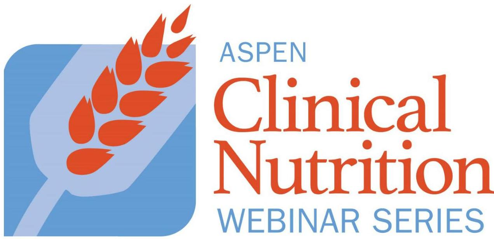
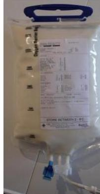
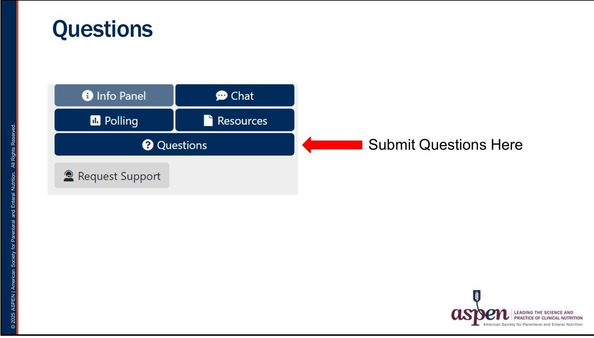

# Nutrition Support Fundamentals Course

## Parenteral Nutrition (PN) and Home PN

**Wednesday, August 6, 2025**

**3:00 pm – 4:30 pm ET**

## SESSION HANDOUT

|   | Page  |
| --- | --- |
|  Accreditation Information | 2  |
|  How to Claim CE Credit and Access CE Transcript | 3-6  |
|  How to Access Recording and Handout | 7  |
|  Session Slides | 8-54  |
|  Self-Assessment Q&A | 55-57  |

--- page 1 ---

Nutrition Support Fundamentals Course: Parenteral Nutrition (PN) and Home PN August 6, 2025, 3:00 pm - 4:30 pm Eastern Time

Course Goal and Target Audience: The American Society for Enteral and Parenteral Nutrition (ASPEN) programs are designed for dietitians, nurses, pharmacists, physicians, and researchers who practice the sciences of clinical nutrition and metabolic support. This course is ideal for nutrition professionals such as dietitians, nurses, pharmacists, physicians, and others seeking a comprehensive overview of core nutrition support topics. This course and all of its parts is designed at the intermediate learning level.

## Course Objectives:

## Parenteral Nutrition (PN) and Home PN

1. Identify current indications for parenteral nutrition
2. Discuss parenteral formula and admixture design
3. Evaluate components of parenteral nutrition monitoring and management
4. Identify key safe practice issues related to parenteral nutrition

Successful Completion: CE credit must be claimed by September 6, 2025. To obtain credit for the webinars, attendees must participate in the entire live program and complete an evaluation in ASPEN's eLearning Center. Certificates are stored in and can be printed from the eLearning Center. ASPEN submits data as required to the CPE Monitor for pharmacists. ASPEN submits physician earned CME credit to Pars. ASPEN does not submit data to any other credentialing organization.

Pharmacists and physicians, please note that ASPEN will upload earned CE credit into the appropriate system within the required timeframe. Any credit not claimed by the deadline will not be entered. Please provide your correct information when completing your evaluation and claiming your CE credit. ASPEN submits only the information that is entered by the pharmacist or physician when credit is claimed and is not responsible for following up to obtain any corrected information to ensure an error-free submission.

## Policies and Information:

Non-Commercialism. ASPEN subscribes to the Standards for Integrity and Independence in Accredited Continuing Education. ASPEN does not provide programs that constitute advertisement or include promotional materials. ASPEN does not endorse any products.

Privacy and Confidentiality. ASPEN respects the privacy of its members and customers. Companies that receive personal information from ASPEN to execute the business of ASPEN may use information only for that purpose.

Grievances. Grievances must be submitted in writing to Senior Director, Education and Research at ASPEN, 8401 Colesville Road, Ste 510, Silver Spring, MD 20910.

## Commercial Support and Sponsorship:

Commercial Support: None

## Accreditation Statement

In support of improving patient care, The American Society for Parenteral and Enteral Nutrition (ASPEN) is jointly accredited by the Accreditation Council for Continuing Medical Education (ACCME), Accreditation Council for Pharmacy Education (ACPE), and the American Nurses Credentialing Center (ANCC), to provide continuing education for the healthcare team.

ASPEN designates this live activity for a maximum of 1.5 AMA PRA Category 1 Credits ${ }^{T M}$. Physicians should only claim credit commensurate with the extent of their participation in the activity.

Pharmacists: ASPEN designates this activity for a maximum of 1.5 contact hours/0.15 CEUs. ACPE UAN: JA0002345-0000-25-124-L99P. Knowledge activity.

Nurses: ASPEN designates this activity for a maximum of 1.5 nursing contact hours.

Dietitians: ASPEN designates this activity for a maximum of 1.5 CPEUs.

|  Commission on |   |
| --- | --- |
|  Dietetic Registration | Completion of this 60,000 profession specific or PCE activity awards CPE to One PCE credit $\rightarrow$ One CPE to  |
|  Academic Accreditation and |   |
|  Education (ACCME), Accreditation Council for |   |
|  Pharmacy Education (ACPE), and the American Nurses Credentialing |   |
|  Center (ANCC), to provide continuing education for the healthcare |   |
|  team. |   |

ASPEN designates this live activity for a maximum of 1.5 AMA PRA Category 1 Credits ${ }^{T M}$. Physicians should only claim credit commensurate with the extent of their participation in the activity.

Pharmacists: ASPEN designates this activity for a maximum of 1.5 contact hours/0.15 CEUs. ACPE UAN: JA0002345-0000-25-124-L99P. Knowledge activity.

Nurses: ASPEN designates this activity for a maximum of 1.5 nursing contact hours.

Dietitians: ASPEN designates this activity for a maximum of 1.5 CPEUs.

|  Commission on |   |
| --- | --- |
|  Dietetic Registration | Completion of this 60,000 profession specific or PCE activity awards CPE to One PCE credit $\rightarrow$ One CPE to  |
|  Academic Accreditation and |   |
|  Education (ACCME), Accreditation Council for |   |
|  Pharmacy Education (ACPE), and the American Nurses Credentialing |   |
|  Center (ANCC), to provide continuing education for the healthcare |   |
|  team. |   |

ASPEN designates this live activity for a maximum of 1.5 AMA PRA Category 1 Credits ${ }^{T M}$. Physicians should only claim credit commensurate with the extent of their participation in the activity.

Pharmacists: ASPEN designates this activity for a maximum of 1.5 contact hours/0.15 CEUs. ACPE UAN: JA0002345-0000-25-124-L99P. Knowledge activity.

Nurses: ASPEN designates this activity for a maximum of 1.5 nursing contact hours.

Dietitians: ASPEN designates this activity for a maximum of 1.5 CPEUs.

|  Commission on |   |
| --- | --- |
|  Dietetic Registration | Completion of this 60,000 profession specific or PCE activity awards CPE to One PCE credit $\rightarrow$ One CPE to  |
|  Academic Accreditation and |   |
|  Education (ACCME), Accreditation Council for |   |
|  Pharmacy Education (ACPE), and the American Nurses Credentialing |   |
|  Center (ANCC), to provide continuing education for the healthcare |   |
|  team. |   |

ASPEN designates this live activity for a maximum of 1.5 AMA PRA Category 1 Credits ${ }^{T M}$. Physicians should only claim credit commensurate with the extent of their participation in the activity.

Pharmacists: ASPEN designates this activity for a maximum of 1.5 contact hours/0.15 CEUs. ACPE UAN: JA0002345-0000-25-124-L99P. Knowledge activity.

Nurses: ASPEN designates this activity for a maximum of 1.5 nursing contact hours.

Dietitians: ASPEN designates this activity for a maximum of 1.5 CPEUs.

|  Commission on |   |
| --- | --- |
|  Dietetic Registration | Completion of this 60,000 profession specific or PCE activity awards CPE to One PCE credit $\rightarrow$ One CPE to  |
|  Academic Accreditation and |   |
|  Education (ACCME), Accreditation Council for |   |
|  Pharmacy Education (ACPE), and the American Nurses Credentialing |   |
|  Center (ANCC), to provide continuing education for the healthcare |   |
|  team. |   |

ASPEN designates this live activity for a maximum of 1.5 AMA PRA Category 1 Credits ${ }^{T M}$. Physicians should only claim credit commensurate with the extent of their participation in the activity.

Pharmacists: ASPEN designates this activity for a maximum of 1.5 contact hours/0.15 CEUs. ACPE UAN: JA0002345-0000-25-124-L99P. Knowledge activity.

Nurses: ASPEN designates this activity for a maximum of 1.5 nursing contact hours.

Dietitians: ASPEN designates this activity for a maximum of 1.5 CPEUs.

|  Commission on |   |
| --- | --- |
|  Dietetic Registration | Completion of this 60,000 profession specific or PCE activity awards CPE to One PCE credit $\rightarrow$ One CPE to  |
|  Academic Accreditation and |   |
|  Education (ACCME), Accreditation Council for |   |
|  Pharmacy Education (ACPE), and the American Nurses Credentialing |   |
|  Center (ANCC), to provide continuing education for the healthcare |   |
|  team. |   |

ASPEN designates this live activity for a maximum of 1.5 AMA PRA Category 1 Credits ${ }^{T M}$. Physicians should only claim credit commensurate with the extent of their participation in the activity.

Pharmacists: ASPEN designates this activity for a maximum of 1.5 contact hours/0.15 CEUs. ACPE UAN: JA0002345-0000-25-124-L99P. Knowledge activity.

Nurses: ASPEN designates this activity for a maximum of 1.5 nursing contact hours.

Dietitians: ASPEN designates this activity for a maximum of 1.5 CPEUs.

|  Commission on |   |
| --- | --- |
|  Dietetic Registration | Completion of this 60,000 profession specific or PCE activity awards CPE to One PCE credit $\rightarrow$ One CPE to  |
|  Academic Accreditation and |   |
|  Education (ACCME), Accreditation Council for |   |
|  Pharmacy Education (ACPE), and the American Nurses Credentialing |   |
|  Center (ANCC), to provide continuing education for the healthcare |   |
|  team. |   |

ASPEN designates this live activity for a maximum of 1.5 AMA PRA Category 1 Credits ${ }^{T M}$. Physicians should only claim credit commensurate with the extent of their participation in the activity.

Pharmacists: ASPEN designates this activity for a maximum of 1.5 contact hours/0.15 CEUs. ACPE UAN: JA0002345-0000-25-124-L99P. Knowledge activity.

Nurses: ASPEN designates this activity for a maximum of 1.5 nursing contact hours.

Dietitians: ASPEN designates this activity for a maximum of 1.5 CPEUs.

|  Commission on |   |
| --- | --- |
|  Dietetic Registration | Completion of this 60,000 profession specific or PCE activity awards CPE to One PCE credit $\rightarrow$ One CPE to  |
|  Academic Accreditation and |   |
|  Education (ACCME), Accreditation Council for |   |
|  Pharmacy Education (ACPE), and the American Nurses Credentialing |   |
|  Center (ANCC), to provide continuing education for the healthcare |   |
|  team. |   |

ASPEN designates this live activity for a maximum of 1.5 AMA PRA Category 1 Credits ${ }^{T M}$. Physicians should only claim credit commensurate with the extent of their participation in the activity.

Pharmacists: ASPEN designates this activity for a maximum of 1.5 CPEUs.

|  Commission on |   |
| --- | --- |
|  Dietetic Registration | Completion of this 60,000 profession specific or PCE activity awards CPE to One PCE credit $\rightarrow$ One PCE to  |
|  Academic Accreditation and |   |
|  Education (ACCME), Accreditation Council for |   |
|  Pharmacy Education (ACPE), and the American Nurses Credentialing |   |
|  Center (ANCC), to provide continuing education for the healthcare |   |
|  team. |   |

ASPEN designates this live activity for a maximum of 1.5 AMA PRA Category 1 Credits ${ }^{T M}$. Physicians should only claim credit commensurate with the extent of their participation in the activity.

Pharmacists: ASPEN designates this activity for a maximum of 1.5 CPEUs.

|  Commission on |   |
| --- | --- |
|  Dietetic Registration | Completion of this 60,000 profession specific or PCE activity awards CPE to One PCE credit $\rightarrow$ One PCE to  |
|  Academic Accreditation and |   |
|  Education (ACCME), Accreditation Council for |   |
|  Pharmacy Education (ACPE), and the American Nurses Credentialing |   |
|  Center (ANCC), to provide continuing education for the healthcare |   |
|  team. |   |

ASPEN designates this live activity for a maximum of 1.5 AMA PRA Category 1 Credits ${ }^{T M}$. Physicians should only claim credit commensurate with the extent of their participation in the activity.

Pharmacists: ASPEN designates this activity for a maximum of 1.5 CPEUs.

|  Commission on |   |
| --- | --- |
|  Dietetic Registration | Completion of this 60,000 profession specific or PCE activity awards CPE to One PCE credit $\rightarrow$ One PCE to  |
|  Academic Accreditation and |   |
|  Education (ACCME), Accreditation Council for |   |
|  Pharmacy Education (ACPE), and the American Nurses Credentialing |   |
|  Center (ANCC), to provide continuing education for the healthcare |   |
|  team. |   |

ASPEN designates this live activity for a maximum of 1.5 AMA PRA Category 1 Credits ${ }^{T M}$. Physicians should only claim credit

--- page 2 ---

# Nutrition Support Fundamentals Course: Summer 2025 CE Credit Deadlines

|  Webinar Topic | CE Credit Deadline*  |
| --- | --- |
|  Fluids and Electrolytes | August 30, 2025  |
|  Parenteral Nutrition (PN) and Home PN | September 6, 2025  |
|  Nutrient Deficiencies and Malnutrition Assessment | September 13, 2025  |
|  Enteral Nutrition (EN) and Home EN | September 19, 2025  |
|  Enteral Nutrition and Parenteral Nutrition Access | September 27, 2025  |
|  Gastrointestinal (GI) Disorders | October 4, 2025  |
|  Acid Base | October 10, 2025  |
|  Critical Care and Statistics | October 12, 2025  |
|  Ethics for the Nutrition Professional | October 17, 2025  |
|  Pediatric and Neonatal Nutrition Support | October 19, 2025  |

*Please note that CE credit cannot be claimed after the deadline

--- page 3 ---

# Nutrition Support Fundamentals Course: Summer 2025 CE Credit - Important Information 

## Please note the following:

- CE credit CANNOT be claimed for missed webinars. You must attend the live webinar broadcast at the scheduled time to claim CE credit for that webinar.
- CE Credit is calculated on a per webinar attended basis. If you miss a webinar, you can still receive CE credit for other webinars attended.
- CE credit will be granted for each webinar attended up to a maximum of 15.5 CE credits for the entire course.
- You must complete the evaluation after each webinar to receive CE credit for that webinar.
- You must complete the Overall Conference Evaluation to receive your course certificate. This form will be available at the end of the course.

## IMPORTANT INFORMATION FOR PHARMACY PARTICIPANTS! Pharmacy participants should claim CE credit as soon as possible following each session attended.

Due to Accreditation Council for Pharmacy Education (ACPE) and National Association of Boards of Pharmacy (NABP) guidelines, ASPEN is required to submit CE credits claimed by Pharmacy participants within 60 days of the end of a session. Because this course takes place over several weeks with multiple webinars, Pharmacy participants are strongly encouraged to claim CE credit immediately following each session, so you do not forget or miss claiming credit within the required 60-day period.

Pharmacy participants are required to submit their birthdate (MM/DD), submit their NABP ID \#, and complete the session evaluation to claim CE credit. For more information or to create your NABP ID, please visit www.nabp.net.

ASPEN is not responsible for late or incorrect submissions by the participant.

--- page 4 ---

# Nutrition Support Fundamentals Course: Summer 2025 How to Claim CE Credit 

## Log into eLearning Center

Step 1: Log into the ASPEN eLearning Center at https://aspen.digitellinc.com.
(Your login is the same email and password you use for the main ASPEN website.)

## To Claim CE Credit

Step 2: Click on the "My Account" button at the top right of the screen.
Step 3: Click "Live Events" in the dropdown menu.
Step 4: Find the Nutrition Support Fundamentals Course Summer 2025. Under the course title and dates, "Attend Event" (note: you will see "Review Event" after the course ends).

Step 5: Click on "Evaluations" in the menu under the course title and dates.
Step 6: Click on the "Take Evaluation" button under the appropriate session heading.
After completing the evaluation, you should see a statement of completion with the date and time. The CE credit will now appear on your CE transcript.

--- page 5 ---

# Nutrition Support Fundamentals Course: Summer 2025
How to View CE Credit and Access CE Transcript

To View CE Credit
Step 1: Click on the "My Account" button at the top right of the screen.

Step 2: Click "CE Transcript" in the dropdown menu.

Step 3: Find the Nutrition Support Fundamentals Course Summer 2025 and click on the Course Title. You should now see the CE credit listed for each session for which you have completed the session evaluation.

To Access CE Transcript
Please note that you will not be able to print your CE transcript until the end of the course. After the last course session, follow the steps below to access your transcript.

Complete steps 1-3 above.

Click on the "Overall Evaluation" button at the bottom of the course information and complete the overall evaluation. This button will only work after the last course session.

A button that says "Print Transcript" should appear at the bottom of the course information. Click on the "Print Transcript" button to print a copy of your CE transcript. All course sessions for which you completed the individual webinar evaluation and the corresponding CE credit will appear on your final course transcript. The transcript will be saved in your eLearning Center account.

--- page 6 ---

# Nutrition Support Fundamentals Course: Summer 2025 How to Access Recording and Handout 

Step 1: Log into the ASPEN eLearning Center at https://aspen.digitellinc.com. (Your login is the same email and password you use for the main ASPEN website.)

Step 2: Click on the "My Account" button at the top right of the screen.
Step 3: Click "Live Events" in the dropdown menu.
Step 4: Find Nutrition Support Fundamentals Course Summer 2025. Under the course title and dates, click on "Attend Event" (note: you will see "Review Event" after the course ends).

Step 5: Click on "Recordings" in the menu under the course title and dates.
Step 6: Find the appropriate webinar session and click on the "View Archive" button.
To listen to the recording, click inside the webinar player.
To download the recording, click "Download MP3" underneath the webinar player on the right side of the screen.

To download the handouts, click on the "Download Handout" underneath the webinar player on the right side of the screen.
*The webinar recording will be available in the eLearning Center within 3 business days following the scheduled broadcast date. Please note that you cannot claim CE credit if you did not attend the live webinar broadcast and only listen to the webinar recording.
**If you miss the live webinar broadcast, you can still access the webinar handout and recording in the eLearning Center.

--- page 7 ---

# Nutrition Support Fundamentals Course

## Parenteral Nutrition (PN) and Home PN

**August 6, 2025 • 3:00 – 4:30 PM ET**

## Using the Webinar Player

Click on the tabs on the left side of your screen to access the webinar player functions.

- **Info Panel**: View session and presenter information
- **Chat**: Communicate with other session attendees
- **Polling**: Answer polling questions
- **Resources**: Download handout and reference material
- **Questions**: Submit questions for presenters

For technical assistance, click Request Support.

--- page 8 ---

# Phil Ayers, PharmD, BCNSP, FMSHP, FASHP, FASPEN

Chief, Clinical Pharmacy Services
Mississippi Baptist Medical Center
Clinical Associate Professor
University of Mississippi School of Pharmacy
Jackson, Mississippi

## Disclosures

- American Regent-Consultant
- B. Braun-Consultant
- Fresenius Kabi-Speaker/Consultant

--- page 9 ---

# Learning Objectives

- Discuss indications for parenteral nutrition (PN)
- Review parenteral nutrition prescription process
- Develop a proper plan for PN monitoring and management
- Identify issues related to safe practice

# Parenteral Nutrition Process

--- page 10 ---

# Parenteral Nutrition 

## Peripheral PN

- Short term
- May be limited by venous access
- Maximum osmolarity
- $900 \mathrm{mOsm} / \mathrm{L}$
- Dextrose concentration 5-10\%
- Amino acid concentration 3\%
- Large amount of fluids needed to provide nutrition
- Not suitable in RF, CHF
- Do potential complications outweigh benefits?

Central PN

- Long term indefinite duration
- Infused via CVC
- Hyperosmolar solution rapidly diluted
- Can be concentrated
- Used for many applications
- Home infusion, ICU

## Indications for PN

- Contraindication to EN or access
- Impaired absorption or loss of nutrients
- Mechanical bowel obstruction
- Need for bowel rest
- Motility disorders
- Inability to achieve or maintain enteral access

--- page 11 ---

# PN Criteria 

- Well nourished stable adult - wait 7 days
- Nutritionally-at-risk - wait 3-5 days
- Baseline moderate or severe malnutrition - as soon as feasible
- Delay in those with severe metabolic instability
- Address electrolyte abnormalities
- Address hypovolemia, shock, hypoxia
- CVC available?
- Duration of therapy exceeds 5-7 days

Worthington P, Balint J, Bechtold M, etal. When is Parenteral Nutrition Appropriate? JPEN. 2017 Mar;41(3):324-77.

## PN Delivery Systems

- Compounded PN
- 2 in 1
- Amino acid + Dextrose
- Intravenous lipid emulsion (ILE) piggybacked
- 12 hour hang time
- Improved visual inspection
- Filter with 0.2 micron filter and 1.2 micron for ILE
- Total Nutrient Admixture (TNA) or 3 in 1
- Amino acid + Dextrose + ILE in same bag
- Easier for home administration
- Filter with 1.2 micron filter
- 24 hour hang time

--- page 12 ---

# **Compounded PN**

2 in 1 PN

3 in 1 PN

**a** *a**p**e**n* LEADING THE SCIENCE AND PRACTICE OF SURVEYS, NUTRITION *a**s**p**e**n* LEADING THE SCIENCE AND PRACTICE OF SURVEYS, NUTRITION *a**s**p**e**n* LEADING THE SCIENCE AND PRACTICE OF SURVEYS, NUTRITION *a**s**p**e**n* LEADING THE SCIENCE AND PRACTICE OF SURVEYS, NUTRITION *a**s**p**e**n* LEADING THE SCIENCE AND PRACTICE OF SURVEYS, NUTRITION *a**s**p**e**n* LEADING THE SCIENCE AND PRACTICE OF SURVEYS, NUTRITION *a**s**p**e**n* LEADING THE SCIENCE AND PRACTICE OF SURVEYS, NUTRITION *a**s**p**e**n* LEADING THE SCIENCE AND PRACTICE OF SURVEYS, NUTRITION *a**s**p**e**n* LEADING THE SCIENCE AND PRACTICE OF SURVEYS, NUTRITION *a**s**p**e**n* LEADING THE SCIENCE AND PRACTICE OF SURVEYS, NUTRITION *a**s**p**e**n* LEADING THE SCIENCE AND PRACTICE OF SURVEYS, NUTRITION *a**s**p**e**n* LEADING THE SCIENCE AND PRACTICE OF SURVEYS, NUTRITION *a**s**p**e**n* LEADING THE SCIENCE AND PRACTICE OF SURVEYS, NUTRITION *a**s**p**e**n* LEADING THE SCIENCE AND PRACTICE OF SURVEYS, NUTRITION *a**s**p**e**n* LEADING THE SCIENCE AND PRACTICE OF SURVEYS, NUTRITION *a**s**p**e**n* LEADING THE SCIENCE AND PRACTICE OF SURVEYS, NUTRITION *a**s**p**e**n* LEADING THE SCIENCE AND PRACTICE OF SURVEYS, NUTRITION *a**s**p**e**n* LEADING THE SCIENCE AND PRACTICE OF SURVEYS, NUTRITION *a**s**p**e**n* LEADING THE SCIENCE AND PRACTICE OF SURVEYS, NUTRITION *a**s**p**e**n* LEADING THE SCIENCE AND PRACTICE OF SURVEYS, NUTRITION *a**s**p**e**n* LEADING THE SCIENCE AND PRACTICE OF SURVEYS, NUTRITION *a**s**p**e**n* LEADING THE SCIENCE AND PRACTICE OF SURVEYS, NUTRITION *a**s**p**e**n* LEADING THE SCIENCE AND PRACTICE OF SURVEYS, NUTRITION *a**s**p**e**n* LEADING THE SCIENCE AND PRACTICE OF SURVEYS, NUTRITION *a**s**p**e**n* LEADING THE SCIENCE AND PRACTICE OF SURVEYS, NUTRITION *a**s**p**e**n* LEADING THE SCIENCE AND PRACTICE OF SURVEYS, NUTRITION *a**s**p**e**n* LEADING THE SCIENCE AND PRACTICE OF SURVEYS, NUTRITION *a**s**p**e**n* LEADING THE SCIENCE AND PRACTICE OF SURVEYS, NUTRITION *a**s**p**e**n* LEADING THE SCIENCE AND PRACTICE OF SURVEYS, NUTRITION *a**s**p**e**n* LEADING THE SCIENCE AND PRACTICE OF SURVEYS, NUTRITION *a**s**p**e**n* LEADING THE SCIENCE AND PRACTICE OF SURVEYS, NUTRITION *a**s**p**e**n* LEADING THE SCIENCE AND PRACTICE OF SURVEYS, NUTRITION *a**s**p**e**n* LEADING THE SCIENCE AND PRACTICE OF SURVEYS, NUTRITION *a**s**p**e**n* LEADING THE SCIENCE AND PRACTICE OF SURVEYS, NUTRITION *a**s**p**e**n* LEADING THE SCIENCE AND PRACTICE OF SURVEYS, NUTRITION *a**s**p**e**n* LEADING THE SCIENCE AND PRACTICE OF SURVEYS, NUTRITION *a**s**p**e**n* LEADING THE SCIENCE AND PRACTICE OF SURVEYS, NUTRITION *a**s**p**e**n* LEADING THE SCIENCE AND PRACTICE OF SURVEYS, NUTRITION *a**s**p**e**n* LEADING THE SCIENCE AND PRACTICE OF SURVEYS, NUTRITION *a**s**p**e**n* LEADING THE SCIENCE AND PRACTICE OF SURVEYS, NUTRITION *a**s**p**e**n* LEADING THE SCIENCE AND PRACTICE OF SURVEYS, NUTRITION *a**s**p**e**n* LEADING THE SCIENCE AND PRACTICE OF SURVEYS, NUTRITION *a**s**p**e**n* LEADING THE SCIENCE AND PRACTICE OF SURVEYS, NUTRITION *a**s**p**e**n* LEADING THE SCIENCE AND PRACTICE OF SURVEYS, NUTRITION *a**s**p**e**n* LEADING THE SCIENCE AND PRACTICE OF SURVEYS, NUTRITION *a**s**p**e**n* LEADING THE SCIENCE AND PRACTICE OF SURVEYS, NUTRITION *a**s**p**e**n* LEADING THE SCIENCE AND PRACTICE OF SURVEYS, NUTRITION *a**s**p**e**n* LEADING THE SCIENCE AND PRACTICE OF SURVEYS, NUTRITION *a**s**p**e**n* LEADING THE SCIENCE AND PRACTICE OF SURVEYS, NUTRITION *a**s**p**e**n* LEADING THE SCIENCE AND PRACTICE OF SURVEYS, NUTRITION *a**s**p**e**n* LEADING THE SCIENCE AND PRACTICE OF SURVEYS, NUTRITION *a**s**p**e**n* LEADING THE SCIENCE AND PRACTICE OF SURVEYS, NUTRITION *a**s**p**e**n* LEADING THE SCIENCE AND PRACTICE OF SURVEYS, NUTRITION *a**s**p**e**n* LEADING THE SCIENCE AND PRACTICE OF SURVEYS, NUTRITION *a**s**p**e**n* LEADING THE SCIENCE AND PRACTICE OF SURVEYS, NUTRITION *a**s**p**e**n* LEADING THE SCIENCE AND PRACTICE OF SURVEYS, NUTRITION *a**s**p**e**n* LEADING THE SCIENCE AND PRACTICE OF SURVEYS, NUTRITION *a**s**p**e**n* LEADING THE SCIENCE AND PRACTICE OF SURVEYS, NUTRITION *a**s**p**e**n* LEADING THE SCIENCE AND PRACTICE OF SURVEYS, NUTRITION *a**s**p**e**n* LEADING THE SCIENCE AND PRACTICE OF SURVEYS, NUTRITION *a**s**p**e**n* LEADING THE SCIENCE AND PRACTICE OF SURVEYS, NUTRITION *a**s**p**e**n* LEADING THE SCIENCE AND PRACTICE OF SURVEYS, NUTRITION *a**s**p**e**n* LEADING THE SCIENCE AND PRACTICE OF SURVEYS, NUTRITION *a**s**p**e**n* LEADING THE SCIENCE AND PRACTICE OF SURVEYS, NUTRITION *a**s**p**e**n* LEADING THE SCIENCE AND PRACTICE OF SURVEYS, NUTRITION *a**s**p**e**n* LEADING THE SCIENCE AND PRACTICE OF SURVEYS, NUTRITION *a**s**p**e**n* LEADING THE SCIENCE AND PRACTICE OF SURVEYS, NUTRITION *a**s**p**e**n* LEADING THE SCIENCE AND PRACTICE OF SURVEYS, NUTRITION *a**s**p**e**n* LEADING THE SCIENCE AND PRACTICE OF SURVEYS, NUTRITION *a**s**p**e**n* LEADING THE SCIENCE AND PRACTICE OF SURVEYS, NUTRITION *a**s**p**e**n* LEADING THE SCIENCE AND PRACTICE OF SURVEYS, NUTRITION *a**s**p**e**n* LEADING THE SCIENCE AND PRACTICE OF SURVEYS, NUTRITION *a**s**p**e**n* LEADING THE SCIENCE AND PRACTICE OF SURVEYS, NUTRITION *a**s**p**e**n* LEADING THE SCIENCE AND PRACTICE OF SURVEYS, NUTRITION *a**s**p**e**n* LEADING THE SCIENCE AND PRACTICE OF SURVEYS, NUTRITION *a**s**p**e**n* LEADING THE SCIENCE AND PRACTICE OF SURVEYS, NUTRITION *a**s**p**e**n* LEADING THE SCIENCE AND PRACTICE OF SURVEYS, NUTRITION *a**s**p**e**n* LEADING THE SCIENCE AND PRACTICE OF SURVEYS, NUTRITION *a**s**p**e**n* LEADING THE SCIENCE AND PRACTICE OF SURVEYS, NUTRITION *a**s**p**e**n* LEADING THE SCIENCE AND PRACTICE OF SURVEYS, NUTRITION *a**s**p**e**n* LEADING THE SCIENCE AND PRACTICE OF SURVEYS, NUTRITION *a**s**p**e**n* LEADING THE SCIENCE AND PRACTICE OF SURVEYS, NUTRITION *a**s**p**e**n* LEADING THE SCIENCE AND PRACTICE OF SURVEYS, NUTRITION *a**s**p**e**n* LEADING THE SCIENCE AND PRACTICE OF SURVEYS, NUTRITION *a**s**p**e**n* LEADING THE SCIENCE AND PRACTICE OF SURVEYS, NUTRITION *a**s**p**e**n* LEADING THE SCIENCE AND PRACTICE OF SURVEYS, NUTRITION *a**s**p**e**n* LEADING THE SCIENCE AND PRACTICE OF SURVEYS, NUTRITION *a**s**p**e**n* LEADING THE SCIENCE AND PRACTICE OF SURVEYS, NUTRITION *a**s**p**e**n* LEADING THE SCIENCE AND PRACTICE OF SURVEYS, NUTRITION *a**s**p**e**n* LEADING THE SCIENCE AND PRACTICE OF SURVEYS, NUTRITION *a**s**p**e**n* LEADING THE SCIENCE AND PRACTICE OF SURVEYS, NUTRITION *a**s**p**e**n* LEADING THE SCIENCE AND PRACTICE OF SURVEYS, NUTRITION *a**s**p**e**n* LEADING THE SCIENCE AND PRACTICE OF SURVEYS, NUTRITION *a**s**p**e**n* LEADING THE SCIENCE AND PRACTICE OF SURVEYS, NUTRITION *a**s**p**e**n* LEADING THE SCIENCE AND PRACTICE OF SURVEYS, NUTRITION *a**s**p**e**n* LEADING THE SCIENCE AND PRACTICE OF SURVEYS, NUTRITION *a**s**p**e**n* LEADING THE SCIENCE AND PRACTICE OF SURVEYS, NUTRITION *a**s**p**e**n* LEADING THE SCIENCE AND PRACTICE OF SURVEYS, NUTRITION *a**s**p**e**n* LEADING THE SCIENCE AND PRACTICE OF SURVEYS, NUTRITION *a**s**p**e**n* LEADING THE SCIENCE AND PRACTICE OF SURVEYS, NUTRITION *a**s**p**e**n* LEADING THE SCIENCE AND PRACTICE OF SURVEYS, NUTRITION *a**s**p**e**n* LEADING THE SCIENCE AND PRACTICE OF SURVEYS, NUTRITION *a**s**p**e**n* LEADING THE SCIENCE AND PRACTICE OF SURVEYS, NUTRITION *a**s**p**e**n* LEADING THE SCIENCE AND PRACTICE OF SURVEYS, NUTRITION *a**s**p**e**n* LEADING THE SCIENCE AND PRACTICE OF SURVEYS, NUTRITION *a**s**p**e**n* LEADING THE SCIENCE AND PRACTICE OF SURVEYS, NUTRITION *a**s**p**e**n* LEADING THE SCIENCE AND PRACTICE OF SURVEYS, NUTRITION *a**s**p**e**n* LEADING THE SCIENCE AND PRACTICE OF SURVEYS, NUTRITION *a**s**p**e**n* LEADING THE SCIENCE AND PRACTICE OF SURVEYS, NUTRITION *a**s**p**e**n* LEADING THE SCIENCE AND PRACTICE OF SURVEYS, NUTRITION *a**s**p**e**n* LEADING THE SCIENCE AND PRACTICE OF SURVEYS, NUTRITION *a**s**p**e**n* LEADING THE SCIENCE AND PRACTICE OF SURVEYS, NUTRITION *a**s**p**e**n* LEADING THE SCIENCE AND PRACTICE OF SURVEYS, NUTRITION *a**s**p**e**n* LEADING THE SCIENCE AND PRACTICE OF SURVEYS, NUTRITION *a**s**p**e**n* LEADING THE SCIENCE AND PRACTICE OF SURVEYS, NUTRITION *a**s**p**e**n* LEADING THE SCIENCE AND PRACTICE OF SURVEYS, NUTRITION *a**s**p**e**n* LEADING THE SCIENCE AND PRACTICE OF SURVEYS, NUTRITION *a**s**p**e**n* LEADING THE SCIENCE AND PRACTICE OF SURVEYS, NUTRITION *a**s**p**e**n* LEADING THE SCIENCE AND PRACTICE OF SURVEYS, NUTRITION *a**s**p**e**n* LEADING THE SCIENCE AND PRACTICE OF SURVEYS, NUTRITION *a**s**p**e**n* LEADING THE SCIENCE AND PRACTICE OF SURVEYS, NUTRITION *a**s**p**e**n* LEADING THE SCIENCE AND PRACTICE OF SURVEYS, NUTRITION *a**s**p**e**n* LEADING THE SCIENCE AND PRACTICE OF SURVEYS, NUTRITION *a**s**p**e**n* LEADING THE SCIENCE AND PRACTICE OF SURVEYS, NUTRITION *a**s**p**e**n* LEADING THE SCIENCE AND PRACTICE OF SURVEYS, NUTRITION *a**s**p**e**n* LEADING THE SCIENCE AND PRACTICE OF SURVEYS, NUTRITION *a**s**p**e**n* LEADING THE SCIENCE AND PRACTICE OF SURVEYS, NUTRITION *a**s**p**e**n* LEADING THE SCIENCE AND PRACTICE OF SURVEYS, NUTRITION *a**s**p**e**n* LEADING THE SCIENCE AND PRACTICE OF SURVEYS, NUTRITION *a**s**p**e**n* LEADING THE SCIENCE AND PRACTICE OF SURVEYS, NUTRITION *a**s**p**e**n* LEADING THE SCIENCE AND PRACTICE OF SURVEYS, NUTRITION *a**s**p**e**n* LEADING THE SCIENCE AND PRACTICE OF SURVEYS, NUTRITION *a**s**p**e**n* LEADING THE SCIENCE AND PRACTICE OF SURVEYS, NUTRITION *a**s**p**e**n* LEADING THE SCIENCE AND PRACTICE OF SURVEYS, NUTRITION *a**s**p**e**n* LEADING THE SCIENCE AND PRACTICE OF SURVEYS, NUTRITION *a**s**p**e**n* LEADING THE SCIENCE AND PRACTICE OF SURVEYS, NUTRITION *a**s**p**e**n* LEADING THE SCIENCE AND PRACTICE OF SURVEYS, NUTRITION *a**s**p**e**n* LEADING THE SCIENCE AND PRACTICE OF SURVEYS, NUTRITION *a**s**p**e**n* LEADING THE SCIENCE AND PRACTICE OF SURVEYS, NUTRITION *a**s**p**e**n* LEADING THE SCIENCE AND PRACTICE OF SURVEYS, NUTRITION *a**s**p**e**n* LEADING THE SCIENCE AND PRACTICE OF SURVEYS, NUTRITION *a**s**p**e**n* LEADING THE SCIENCE AND PRACTICE OF SURVEYS, NUTRITION *a**s**p**e**n* LEADING THE SCIENCE AND PRACTICE OF SURVEYS, NUTRITION *a**s**p**e**n* LEADING THE SCIENCE AND PRACTICE OF SURVEYS, NUTRITION *a**s**p**e**n* LEADING THE SCIENCE AND PRACTICE OF SURVEYS, NUTRITION *a**s**p**e**n* LEADING THE SCIENCE AND PRACTICE OF SURVEYS, NUTRITION *a**s**p**e**n* LEADING THE SCIENCE AND PRACTICE OF SURVEYS, NUTRITION *a**s**p**e**n* LEADING THE SCIENCE AND PRACTICE OF SURVEYS, NUTRITION *a**s**p**e**n* LEADING THE SCIENCE AND PRACTICE OF SURVEYS, NUTRITION *a**s**p**e**n* LEADING THE SCIENCE AND PRACTICE OF SURVEYS, NUTRITION *a**s**p**e**n* LEADING THE SCIENCE AND PRACTICE OF SURVEYS, NUTRITION *a**s**p**e**n* LEADING THE SCIENCE AND PRACTICE OF SURVEYS, NUTRITION *a**s**p**e**n* LEADING THE SCIENCE AND PRACTICE OF SURVEYS, NUTRITION *a**s**p**e**n* LEADING THE SCIENCE AND PRACTICE OF SURVEYS, NUTRITION *a**s**p**e**n* LEADING THE SCIENCE AND PRACTICE OF SURVEYS, NUTRITION *a**s**p**e**n* LEADING THE SCIENCE AND PRACTICE OF SURVEYS, NUTRITION *a**s**p**e**n* LEADING THE SCIENCE AND PRACTICE OF SURVEYS, NUTRITION *a**s**p**e**n* LEADING THE SCIENCE AND PRACTICE OF SURVEYS, NUTRITION *a**s**p**e**n* LEADING THE SCIENCE AND PRACTICE OF SURVEYS, NUTRITION *a**s**p**e**n* LEADING THE SCIENCE AND PRACTICE OF SURVEYS, NUTRITION *a**s**p**e**n* LEADING THE SCIENCE AND PRACTICE OF SURVEYS, NUTRITION *a**s**p**e**n* LEADING THE SCIENCE AND PRACTICE OF SURVEYS, NUTRITION *a**s**p**e**n* LEADING THE SCIENCE AND PRACTICE OF SURVEYS, NUTRITION *a**s**p**e**n* LEADING THE SCIENCE AND PRACTICE OF SURVEYS, NUTRITION *a**s**p**e**n* LEADING THE SCIENCE AND PRACTICE OF SURVEYS, NUTRITION *a**s**p**e**n* LEADING THE SCIENCE AND PRACTICE OF SURVEYS, NUTRITION *a**s**p**e**n* LEADING THE SCIENCE AND PRACTICE OF SURVEYS, NUTRITION *a**s**p**e**n* LEADING THE SCIENCE AND PRACTICE OF SURVEYS, NUTRITION *a**s**p**e**n* LEADING THE SCIENCE AND PRACTICE OF SURVEYS, NUTRITION *a**s**p**e**n* LEADING THE SCIENCE AND PRACTICE OF SURVEYS, NUTRITION *a**s**p**e**n* LEADING THE SCIENCE AND PRACTICE OF SURVEYS, NUTRITION *a**s**p**e**n* LEADING THE SCIENCE AND PRACTICE OF SURVEYS, NUTRITION *a**s**p**e**n* LEADING THE SCIENCE AND PRACTICE OF SURVEYS, NUTRITION *a**s**p**e**n* LEADING THE SCIENCE AND PRACTICE OF SURVEYS, NUTRITION *a**s**p**e**n* LEADING THE SCIENCE AND PRACTICE OF SURVEYS, NUTRITION *a**s**p**e**n* LEADING THE SCIENCE AND PRACTICE OF SURVEYS, NUTRITION *a**s**p**e**n* LEADING THE SCIENCE AND PRACTICE OF SURVEYS, NUTRITION *a**s**p**e**n* LEADING THE SCIENCE AND PRACTICE OF SURVEYS, NUTRITION *a**s**p**e**n* LEADING THE SCIENCE AND PRACTICE OF SURVEYS, NUTRITION *a**s**p**e**n* LEADING THE SCIENCE AND PRACTICE OF SURVEYS, NUTRITION *a**s**p**e**n* LEADING THE SCIENCE AND PRACTICE OF SURVEYS, NUTRITION *a**s**p**e**n* LEADING THE SCIENCE AND PRACTICE OF SURVEYS, NUTRITION *a**s**p**e**n* LEADING THE SCIENCE AND PRACTICE OF SURVEYS, NUTRITION *a**s**p**e**n* LEADING THE SCIENCE AND PRACTICE OF SURVEYS, NUTRITION *a**s**p**e**n* LEADING THE SCIENCE AND PRACTICE OF SURVEYS, NUTRITION *a**s**p**e**n* LEADING THE SCIENCE AND PRACTICE OF SURVEYS, NUTRITION *a**s**p**e**n* LEADING THE SCIENCE AND PRACTICE OF SURVEYS, NUTRITION *a**s**p**e**n* LEADING THE SCIENCE AND PRACTICE OF SURVEYS, NUTRITION *a**s**p**e**n* LEADING THE SCIENCE AND PRACTICE OF SURVEYS, NUTRITION *a**s**p**e**n* LEADING THE SCIENCE AND PRACTICE OF SURVEYS, NUTRITION *a**s**p**e**n* LEADING THE SCIENCE AND PRACTICE OF SURVEYS, NUTRITION *a**s**p**e**n* LEADING THE SCIENCE AND PRACTICE OF SURVEYS, NUTRITION *a**s**p**e**n* LEADING THE SCIENCE AND PRACTICE OF SURVEYS, NUTRITION *a**s**p**e**n* LEADING THE SCIENCE AND PRACTICE OF SURVEYS, NUTRITION *a**s**p**e**n* LEADING THE SCIENCE AND PRACTICE OF SURVEYS, NUTRITION *a**s**p**e**n* LEADING THE SCIENCE AND PRACTICE OF SURVEYS, NUTRITION *a**s**p**e**n* LEADING THE SCIENCE AND PRACTICE OF SURVEYS, NUTRITION *a**s**p**e**n* LEADING THE SCIENCE AND PRACTICE OF SURVEYS, NUTRITION *a**s**p**e**n* LEADING THE SCIENCE AND PRACTICE OF SURVEYS, NUTRITION *a**s**p**e**n* LEADING THE SCIENCE AND PRACTICE OF SURVEYS, NUTRITION *a**s**p**e**n* LEADING THE SCIENCE AND PRACTICE OF SURVEYS, NUTRITION *a**s**p**e**n* LEADING THE SCIENCE AND PRACTICE OF SURVEYS, NUTRITION *a**s**p**e**n* LEADING THE SCIENCE AND PRACTICE OF SURVEYS, NUTRITION *a**s**p**e**n* LEADING THE SCIENCE AND PRACTICE OF SURVEYS, NUTRITION *a**s**p**e**n* LEADING THE SCIENCE AND PRACTICE OF SURVEYS, NUTRITION *a**s**p**e**n* LEADING THE SCIENCE AND PRACTICE OF SURVEYS, NUTRITION *a**s**p**e**n* LEADING THE SCIENCE AND PRACTICE OF SURVEYS, NUTRITION *a**s**p**e**n* LEADING THE SCIENCE AND PRACTICE OF SURVEYS, NUTRITION *a**s**p**e**n* LEADING THE SCIENCE AND PRACTICE OF SURVEYS, NUTRITION *a**s**p**e**n* LEADING THE SCIENCE AND PRACTICE OF SURVEYS, NUTRITION *a**s**p**e**n* LEADING THE SCIENCE AND PRACTICE OF SURVEYS, NUTRITION *a**s**p**e**n* LEADING THE SCIENCE AND PRACTICE OF SURVEYS, NUTRITION *a**s**p**e**n* LEADING THE SCIENCE AND PRACTICE OF SURVEYS, NUTRITION *a**s**p**e**n* LEADING THE SCIENCE AND PRACTICE OF SURVEYS, NUTRITION *a**s**p**e**n* LEADING THE SCIENCE AND PRACTICE OF SURVEYS, NUTRITION *a**s**p**e**n* LEADING THE SCIENCE AND PRACTICE OF SURVEYS, NUTRITION *a**s**p**e**n* LEADING THE SCIENCE AND PRACTICE OF SURVEYS, NUTRITION *a**s**p**e**n* LEADING THE SCIENCE AND PRACTICE OF SURVEYS, NUTRITION *a**s**p**e**n* LEADING THE SCIENCE AND PRACTICE OF SURVEYS, NUTRITION *a**s**p**e**n* LEADING THE SCIENCE AND PRACTICE OF SURVEYS, NUTRITION *a**s**p**e**n* LEADING THE SCIENCE AND PRACTICE OF SURVEYS, NUTRITION *a**s**p**e**n* LEADING THE SCIENCE AND PRACTICE OF SURVEYS, NUTRITION *a**s**p**e**n* LEADING THE SCIENCE AND PRACTICE OF SURVEYS, NUTRITION *a**s**p**e**n* LEADING THE SCIENCE AND PRACTICE OF SURVEYS, NUTRITION *a**s**p**e**n* LEADING THE SCIENCE AND PRACTICE OF SURVEYS, NUTRITION *a**s**p**e**n* LEADING THE SCIENCE AND PRACTICE OF SURVEYS, NUTRITION *a**s**p**e**n* LEADING THE SCIENCE AND PRACTICE OF SURVEYS, NUTRITION *a**s**p**e**n* LEADING THE SCIENCE AND PRACTICE OF SURVEYS, NUTRITION *a**s**p**e**n* LEADING THE SCIENCE AND PRACTICE OF SURVEYS, NUTRITION *a**s**p**e**n* LEADING THE SCIENCE AND PRACTICE OF SURVEYS, NUTRITION *a**s**p**e**n* LEADING THE SCIENCE AND PRACTICE OF SURVEYS, NUTRITION *a**s**p**e**n* LEADING THE SCIENCE AND PRACTICE OF SURVEYS, NUTRITION *a**s**p**e**n* LEADING THE SCIENCE AND PRACTICE OF SURVEYS, NUTRITION *a**s**p**e**n* LEADING THE SCIENCE AND PRACTICE OF SURVEYS, NUTRITION *a**s**p**e**n* LEADING THE SCIENCE AND PRACTICE OF SURVEYS, NUTRITION *a**s**p**e**n* LEADING THE SCIENCE AND PRACTICE OF SURVEYS, NUTRITION *a**s**p**e**n* LEADING THE SCIENCE AND PRACTICE OF SURVEYS, NUTRITION *a**s**p**e**n* LEADING THE SCIENCE AND PRACTICE OF SURVEYS, NUTRITION *a**s**p**e**n* LEADING THE SCIENCE AND PRACTICE OF SURVEYS, NUTRITION *a**s**p**e**n* LEADING THE SCIENCE AND PRACTICE OF SURVEYS, NUTRITION *a**s**p**e**n* LEADING THE SCIENCE AND PRACTICE OF SURVEYS, NUTRITION *a**s**p**e**n* LEADING THE SCIENCE AND PRACTICE OF SURVEYS, NUTRITION *a**s**p**e**n* LEADING THE SCIENCE AND PRACTICE OF SURVEYS, NUTRITION *a**s**p**e**n* LEADING THE SCIENCE AND PRACTICE OF SURVEYS, NUTRITION *a**s**p**e**n* LEADING THE SCIENCE AND PRACTICE OF SURVEYS, NUTRITION *a**s**p**e**n* LEADING THE SCIENCE AND PRACTICE OF SURVEYS, NUTRITION *a**s**p**e**n* LEADING THE SCIENCE AND PRACTICE OF SURVEYS, NUTRITION *a**s**p**e**n* LEADING THE SCIENCE AND PRACTICE OF SURVEYS, NUTRITION *a**s**p**e**n* LEADING THE SCIENCE AND PRACTICE OF SURVEYS, NUTRITION *a**s**p**e**n* LEADING THE SCIENCE AND PRACTICE OF SURVEYS, NUTRITION *a**s**p**e**n* LEADING THE SCIENCE AND PRACTICE OF SURVEYS, NUTRITION *a**s**p**e**n* LEADING THE SCIENCE AND PRACTICE OF SURVEYS, NUTRITION *a**s**p**e**n* LEADING THE SCIENCE AND PRACTICE OF SURVEYS, NUTRITION *a**s**p**e**n* LEADING THE SCIENCE AND PRACTICE OF SURVEYS, NUTRITION *a**s**p**e**n* LEADING THE SCIENCE AND PRACTICE OF SURVEYS, NUTRITION *a**s**p**e**n* LEADING THE SCIENCE AND PRACTICE OF SURVEYS, NUTRITION *a**s**p**e**n* LEADING THE SCIENCE AND PRACTICE OF SURVEYS, NUTRITION *a**s**p**e**n* LEADING THE SCIENCE AND PRACTICE OF SURVEYS, NUTRITION *a**s**p**e**n* LEADING THE SCIENCE AND PRACTICE OF SURVEYS, NUTRITION *a**s**p**e**n* LEADING THE SCIENCE AND PRACTICE OF SURVEYS, NUTRITION *a**s**p**e**n* LEADING THE SCIENCE AND PRACTICE OF SURVEYS, NUTRITION *a**s**p**e**n* LEADING THE SCIENCE AND PRACTICE OF SURVEYS, NUTRITION *a**s**p**e**n* LEADING THE SCIENCE AND PRACTICE OF SURVEYS, NUTRITION *a**s**p**e**n* LEADING THE SCIENCE AND PRACTICE OF SURVEYS, NUTRITION *a**s**p**e**n* LEADING THE SCIENCE AND PRACTICE OF SURVEYS, NUTRITION *a**s**p**e**n* LEADING THE SCIENCE AND PRACTICE OF SURVEYS, NUTRITION *a**s**p**e**n* LEADING THE SCIENCE AND PRACTICE OF SURVEYS, NUTRITION *a**s**p**e**n* LEADING THE SCIENCE AND PRACTICE OF SURVEYS, NUTRITION *a**s**p**e**n* LEADING THE SCIENCE AND PRACTICE OF SURVEYS, NUTRITION *a**s**p**e**n* LEADING THE SCIENCE AND PRACTICE OF SURVEYS, NUTRITION *a**s**p**e**n* LEADING THE SCIENCE AND PRACTICE OF SURVEYS, NUTRITION *a**s**p**e**n* LEADING THE SCIENCE AND PRACTICE OF SURVEYS, NUTRITION *a**s**p**e**n* LEADING THE SCIENCE AND PRACTICE OF SURVEYS, NUTRITION *a**s**p**e**n* LEADING THE SCIENCE AND PRACTICE OF SURVEYS, NUTRITION *a**s**p**e**n* LEADING THE SCIENCE AND PRACTICE OF SURVEYS, NUTRITION *a**s**p**e**n* LEADING THE SCIENCE AND PRACTICE OF SURVEYS, NUTRITION *a**s**p**e**n* LEADING THE SCIENCE AND PRACTICE OF SURVEYS, NUTRITION *a**s**p**e**n* LEADING THE SCIENCE AND PRACTICE OF SURVEYS, NUTRITION *a**s**p**e**n* LEADING THE SCIENCE AND PRACTICE OF SURVEYS, NUTRITION *a**s**p**e**n* LEADING THE SCIENCE AND PRACTICE OF SURVEYS, NUTRITION *a**s**p**e**n* LEADING THE SCIENCE AND PRACTICE OF SURVEYS, NUTRITION *a**s**p**e**n* LEADING THE SCIENCE AND PRACTICE OF SURVEYS, NUTRITION *a**s**p**e**n* LEADING THE SCIENCE AND PRACTICE OF SURVEYS, NUTRITION *a**s**p**e**n* LEADING THE SCIENCE AND PRACTICE OF SURVEYS, NUTRITION *a**s**p**e**n* LEADING THE SCIENCE AND PRACTICE OF SURVEYS, NUTRITION *a**s**p**e**n* LEADING THE SCIENCE AND PRACTICE OF SURVEYS, NUTRITION *a**s**p**e**n* LEADING THE SCIENCE AND PRACTICE OF SURVEYS, NUTRITION *a**s**p**e**n* LEADING THE SCIENCE AND PRACTICE OF SURVEYS, NUTRITION *a**s**p**e**n* LEADING THE SCIENCE AND PRACTICE OF SURVEYS, NUTRITION *a**s**p**e**n* LEADING THE SCIENCE AND PRACTICE OF SURVEYS, NUTRITION *a**s**p**e**n* LEADING THE SCIENCE AND PRACTICE OF SURVEYS, NUTRITION *a**s**p**e**n* LEADING THE SCIENCE AND PRACTICE OF SURVEYS, NUTRITION *a**s**p**e**n* LEADING THE SCIENCE AND PRACTICE OF SURVEYS, NUTRITION *a**s**p**e**n* LEADING THE SCIENCE AND PRACTICE OF SURVEYS, NUTRITION *a**s**p**e**n* LEADING THE SCIENCE AND PRACTICE OF SURVEYS, NUTRITION *a**s**p**e**n* LEADING THE SCIENCE AND PRACTICE OF SURVEYS, NUTRITION *a**s**p**e**n* LEADING THE SCIENCE AND PRACTICE OF SURVEYS, NUTRITION *a**s**p**e**n* LEADING THE SCIENCE AND PRACTICE OF SURVEYS, NUTRITION *a**s**p**e**n* LEADING THE SCIENCE AND PRACTICE OF SURVEYS, NUTRITION *a**s**p**e**n* LEADING THE SCIENCE AND PRACTICE OF SURVEYS, NUTRITION *a**s**p**e**n* LEADING THE SCIENCE AND PRACTICE OF SURVEYS, NUTRITION *a**s**p**e**n* LEADING THE SCIENCE AND PRACTICE OF SURVEYS, NUTRITION *a**s**p**e**n* LEADING THE SCIENCE AND PRACTICE OF SURVEYS, NUTRITION *a**s**p**e**n* LEADING THE SCIENCE AND PRACTICE OF SURVEYS, NUTRITION *a**s**p**e**n* LEADING THE SCIENCE AND PRACTICE OF SURVEYS, NUTRITION *a**s**p**e**n* LEADING THE SCIENCE AND PRACTICE OF SURVEYS, NUTRITION *a**s**p**e**n* LEADING THE SCIENCE AND PRACTICE OF SURVEYS, NUTRITION *a**s**p**e**n* LEADING THE SCIENCE AND PRACTICE OF SURVEYS, NUTRITION *a**s**p**e**n* LEADING THE SCIENCE AND PRACTICE OF SURVEYS, NUTRITION *a**s**p**e**n* LEADING THE SCIENCE AND PRACTICE OF SURVEYS, NUTRITION *a**s**p**e**n* LEADING THE SCIENCE AND PRACTICE OF SURVEYS, NUTRITION *a**s**p**e**n* LEADING THE SCIENCE AND PRACTICE OF SURVEYS, NUTRITION *a**s**p**e**n* LEADING THE SCIENCE AND PRACTICE OF SURVEYS, NUTRITION *a**s**p**e**n* LEADING THE SCIENCE AND PRACTICE OF SURVEYS, NUTRITION *a**s**p**e**n* LEADING THE SCIENCE AND PRACTICE OF SURVEYS, NUTRITION *a**s**p**e**n* LEADING THE SCIENCE AND PRACTICE OF SURVEYS, NUTRITION *a**s**p**e**n* LEADING THE SCIENCE AND PRACTICE OF SURVEYS, NUTRITION *a**s**p**e**n* LEADING THE SCIENCE AND PRACTICE OF SURVEYS, NUTRITION *a**s**p**e**n* LEADING THE SCIENCE AND PRACTICE OF SURVEYS, NUTRITION *a**s**p**e**n* LEADING THE SCIENCE AND PRACTICE OF SURVEYS, NUTRITION *a**s**p**e**n* LEADING THE SCIENCE AND PRACTICE OF SURVEYS, NUTRITION *a**s**p**e**n* LEADING THE SCIENCE AND PRACTICE OF SURVEYS, NUTRITION *a**s**p**e**n* LEADING THE SCIENCE AND PRACTICE OF SURVEYS, NUTRITION *a**s**p**e**n* LEADING THE SCIENCE AND PRACTICE OF SURVEYS, NUTRITION *a**s**p**e**n* LEADING THE SCIENCE, NUTRITION *a**s**p**e**n* LEADING THE SCIENCE, NUTRITION *a**s**p**e**n* LEADING THE SCIENCE, NUTRITION *a**s**p**e**n* LEADING THE SCIENCE, NUTRITION *a**s**p**e**n* LEADING THE SCIENCE, NUTRITION *a**s**p**e**n* LEADING THE SCIENCE, NUTRITION *a**s**p**e**n* LEADING THE SCIENCE, NUTRITION *a**s**p**e**n* LEADING THE SCIENCE, NUTRITION *a**s**p**e**n* LEADING THE SCIENCE, NUTRITION *a**s**p**e**n* LEADING THE SCIENCE, NUTRITION *a**s**p**e**n* LEADING THE SCIENCE, NUTRITION *a**s**p**e**n* LEADING THE SCIENCE, NUTRITION *a**s**p**e**n* LEADING THE SCIENCE, NUTRITION *a**s**p**e**n* LEADING THE SCIENCE, NUTRITION *a**s**p**e**n* LEADING THE SCIENCE, NUTRITION *a**s**p**e**n* LEADING THE SCIENCE, NUTRITION *a**s**p**e**n* LEADING THE SCIENCE, NUTRITION *a**s**p**e**n* LEADING THE SCIENCE, NUTRITION *a**s**p**e**n* LEADING THE SCIENCE, NUTRITION *a**s**p**e**n* LEADING THE SCIENCE, NUTRITION *a**s**p**e**n* LEADING THE SCIENCE, NUTRITION *a**s**p**e**n* LEADING THE SCIENCE, NUTRITION *a**s**p**e**n* LEADING THE SCIENCE, NUTRITION *a**s**p**e**n* LEADING THE SCIENCE, NUTRITION *a**s**p**e**n* LEADING THE SCIENCE, NUTRITION *a**s**p**e**n* LEADING THE SCIENCE, NUTRITION *a**s**p**e**n* LEADING THE SCIENCE, NUTRITION *a**s**p**e**n* LEADING THE SCIENCE, NUTRITION *a**s**p**e**n* LEADING THE SCIENCE, NUTRITION *a**s**p**e**n* LEADING THE SCIENCE, NUTRITION *a**s**p**e**n* LEADING THE SCIENCE, NUTRITION *a**s**p**e**n* LEADING THE SCIENCE, NUTRITION *a**s**p**e**n* LEADING THE SCIENCE, NUTRITION *a**s**p**e**n* LEADING THE SCIENCE, NUTRITION *a**s**p**e**n* LEADING THE SCIENCE, NUTRITION *a**s**p**e**n* LEADING THE SCIENCE, NUTRITION *a**s**p**e**n* LEADING THE SCIENCE, NUTRITION *a**s**p**e**n* LEADING THE SCIENCE, NUTRITION *a**s**p**e**n* LEADING THE SCIENCE, NUTRITION *a**s**p**e**n* LEADING THE SCIENCE, NUTRITION *a**s**p**e**n* LEADING THE SCIENCE, NUTRITION *a**s**p**e**n* LEADING THE SCIENCE, NUTRITION *a**s**p**e**n* LEADING THE SCIENCE, NUTRITION *a**s**p**e**n* LEADING THE SCIENCE, NUTRITION *a**s**p**e**n* LEADING THE SCIENCE, NUTRITION *a**s**p**e**n* LEADING THE SCIENCE, NUTRITION *a**s**p**e**n* LEADING THE SCIENCE, NUTRITION *a**s**p**e**n* LEADING THE SCIENCE, NUTRITION *a**s**p**e**n* LEADING THE SCIENCE, NUTRITION *a**s**p**e**n* LEADING THE SCIENCE, NUTRITION *a**s**p**e**n* LEADING THE SCIENCE, NUTRITION *a**s**p**e**n* LEADING THE SCIENCE, NUTRITION *a**s**p**e**n* LEADING THE SCIENCE, NUTRITION *a**s**p**e**n* LEADING THE SCIENCE, NUTRITION *a**s**p**e**n* LEADING THE SCIENCE, NUTRITION *a**s**p**e**n* LEADING THE SCIENCE, NUTRITION *a**s**p**e**n* LEADING THE SCIENCE, NUTRITION *a**s**p**e**n* LEADING THE SCIENCE, NUTRITION *a**s**p**e**n* LEADING THE SCIENCE, NUTRITION *a**s**p**e**n* LEADING THE SCIENCE, NUTRITION *a**s**p**e**n* LEADING THE SCIENCE, NUTRITION *a**s**p**e**n* LEADING THE SCIENCE, NUTRITION *a**s**p**e**n* LEADING THE SCIENCE, NUTRITION *a**s**p**e**n* LEADING THE SCIENCE, NUTRITION *a**s**p**e**n* LEADING THE SCIENCE, NUTRITION *a**s**p**e**n* LEADING THE SCIENCE, NUTRITION *a**s**p**e**n* LEADING THE SCIENCE, NUTRITION *a**s**p**e**n* LEADING THE SCIENCE, NUTRITION *a**s**p**e**n* LEADING THE SCIENCE, NUTRITION *a**s**p**e**n* LEADING THE SCIENCE, NUTRITION *a**s**p**e**n* LEADING THE SCIENCE, NUTRITION *a**s**p**e**n* LEADING THE SCIENCE, NUTRITION *a**s**p**e**n* LEADING THE SCIENCE, NUTRITION *a**s**p**e**n* LEADING THE SCIENCE, NUTRITION *a**s**p**e**n* LEADING THE SCIENCE, NUTRITION *a**s**p**e**n* LEADING THE SCIENCE, NUTRITION *a**s**p**e**n* LEADING THE SCIENCE, NUTRITION *a**s**p**e**n* LEADING THE SCIENCE, NUTRITION *a**s**p**e**n* LEADING THE SCIENCE, NUTRITION *a**s**p**e**n* LEADING THE SCIENCE, NUTRITION *a**s**p**e**n* LEADING THE SCIENCE, NUTRITION *a**s**p**e**n* LEADING THE SCIENCE, NUTRITION *a**s**p**e**n* LEADING THE SCIENCE, NUTRITION *a**s**p**e**n* LEADING THE SCIENCE, NUTRITION *a**s**p**e**n* LEADING THE SCIENCE, NUTRITION *a**s**p**e**n* LEADING THE SCIENCE, NUTRITION *a**s**p**e**n* LEADING THE SCIENCE, NUTRITION *a**s**p**e**n* LEADING THE SCIENCE, NUTRITION *a**s**p**e**n* LEADING THE SCIENCE, NUTRITION *a**s**p**e**n* LEADING THE SCIENCE, NUTRITION *a**s**p**e**n* LEADING THE SCIENCE, NUTRITION *a**s**p**e**n* LEADING THE SCIENCE, NUTRITION *a**s**p**e**n* LEADING THE SCIENCE, NUTRITION *a**s**p**e**n* LEADING THE SCIENCE, NUTRITION *a**s**p**e**n* LEADING THE SCIENCE, NUTRITION *a**s**p**e**n* LEADING THE SCIENCE, NUTRITION *a**s**p**e**n* LEADING THE SCIENCE, NUTRITION *a**s**p**e**n* LEADING THE SCIENCE, NUTRITION *a**s**p**e**n* LEADING THE SCIENCE, NUTRITION *a**s**p**e**n* LEADING THE SCIENCE, NUTRITION *a**s**p**e**n* LEADING THE SCIENCE, NUTRITION *a**s**p**e**n* LEADING THE SCIENCE, NUTRITION *a**s**p**e**n* LEADING THE SCIENCE, NUTRITION *a**s**p**e**n* LEADING THE SCIENCE, NUTRITION *a**s**p**e**n* LEADING THE SCIENCE, NUTRITION *a**s**p**e**n* LEADING THE SCIENCE, NUTRITION *a**s**p**e**n* LEADING THE SCIENCE, NUTRITION *a**s**p**e**n* LEADING THE SCIENCE, NUTRITION *a**s**p**e**n* LEADING THE SCIENCE, NUTRITION *a**s**p**e**n* LEADING THE SCIENCE, NUTRITION *a**s**p**e**n* LEADING THE SCIENCE, NUTRITION *a**s**p**e**n* LEADING

--- page 13 ---

# Carbohydrate Provision

- Preferred fuel for CNS, blood cells, granulation tissue
- Largest amount of calories in PN from carbohydrates
- Dextrose
  - 3.4 kcal/gram
  - pH ranging from 3.5 – 6.5

--- page 14 ---

# Protein Provision

- Necessary for synthesis of structural protein, growth, enzymatic function
- Amino acid solution (crystalline)
- 4 kcal/gram
- Acetate or chloride load from AA solution
- Assumed to be 16% nitrogen
- 6.25g protein = 1g nitrogen
- Standard 8.5% or 10%
- Concentrated 15% or 20%
- May benefit volume restricted patients

|  Generation of ILE^{1} | Description | Rationale for design | Other potential benefits  |
| --- | --- | --- | --- |
|  First | Single-oil formulation using either SO or safflower oil^{2} | Source of EFA and energy | Compatibility information available with commonly used medications^{16}  |
|  Second | Two-oil formulation including SO and MCT^{6} | Lower SO content | Reducing the ω-6 FA content^{7}  |
|   |  |  | More stable ILE product with MCT oil^{17}  |
|   |  |  | MCTs accumulate less in adipose tissues and liver and are cleared faster with minimal peroxidation^{18}  |
|   |  |  | MCTs do not produce proinflammatory mediators^{18}  |
|  Third | Two-oil ILE using SO and OO, resulting in a reduced amount of EFA (ω-6 FAs) | Reduce SO content but still provide enough EFA | Higher amounts of monounsaturated FAs have a lower amount of peroxides produced during oxidation than PUFAs  |
|   |  |  | Oleic acid in OO is not metabolized to mediators of inflammation and immunity  |
|   |  |  | Potentially well suited for patients who are at risk of immune suppression or are immune compromised^{18}  |
|  Fourth | Four-oil ILE including SO, MCT, OO, and FO | Designed to include an optimal level of ω-6 to ω-3 FAs and includes FO and OO | Lower ratio of ω-6 to ω-3 FA (reduced SO dose)  |
|   |  |  | FO included for critically ill and surgical patient populations  |
|   |  |  | OO may be beneficial in those with immune disorders  |
|   | FO | Source of FAs and energy in infants and children with IFALD | May reverse IFALD  |

Nutr Clin Pract 2020;00:1-14.

16

LEADING THE SCIENCE AND PRACTICE OF CLINICAL NUTRITION

Nutr Clin Pract 2020;00:1-14.

--- page 15 ---

# Fat Provision 

- Maintains cellular membranes, serves as precursor of prostanoids and leukotrienes
- Intravenous Lipid Emulsion (ILE)
- 10 kcal/gram
- Glycerin makes formulation isotonic
- Egg phospholipid acts as emulsifier
- Contains phosphate $-1.5 \mathrm{mmol} / 100 \mathrm{~mL}$
- Contain small amounts of vitamin K from soy or olive oil
- $10 \%$ and $20 \%$ okay to administer via central or peripheral line
- Soybean component provides essential fatty acids
- Must be infused with 1.2 micron filter

## Fat Provision

$100 \%$ Soybean based ILE

- $10 \%-1.1 \mathrm{kcal} / \mathrm{mL}$
- $20 \%-2 \mathrm{kcal} / \mathrm{mL}$
- $30 \%-3 \mathrm{kcal} / \mathrm{mL}$
- Only for 3-in-1 compounding

Clinolipid 20\%
Olive oil
Soybean oil

- Caution with soybean or egg allergies for 3 ILEs
- If no h/o previous ILE or medications suspended in ILE
- Test dose may be done $1 \mathrm{~mL} /$ minute for 30 minutes
- If tolerated may advance to prescribed rate
- Piggybacked ILE - 12 hour hang time
- TNA - 24 hour hang time

--- page 16 ---

|   | Implementing (preventing) | Implementing (preventing) | Final (preventing) | Development (preventing) | Development (preventing)  |
| --- | --- | --- | --- | --- | --- |
|  **Institutions** | Source of calories and essential fatty acids. Prevention of Essential Fatty Acid Deficiency (EFAD) | Source of calories and essential fatty acids. | Source of calories and fatty acids in pediatric patients with parenteral nutrition-associated cholestasis (PNAC) | Source of calories and essential fatty acids. | Source of calories and essential fatty acids.  |
|  **Chartered Populations** | Adult and Pediatric | Adult | Pediatric | Adult | Adult  |
|  **Local populations** | Disturbances of normal fat metabolism such as pathologic hyperlipemia, lipid necrosis, or acute pancreatitis accompanied by hyperlipidemia | Hypersensitivity to fish, egg soybean or peanut protein. Severe hyperlipidemia or severe disorders of lipid metabolism (serum triglycerides > 1000mg/dl) | Hypersensitivity to fish or egg protein or any of the active ingredients or excipients. Severe hemorrhagic disorders. Severe hyperlipidemia or severe disorders of lipid metabolism (serum triglycerides > 1000mg/dl) | Hypersensitivity to egg or soybean proteins or to any of the ingredients including excipients. Severe hyperlipidemia or severe disorders of lipid metabolism (serum triglycerides > 1000mg/dl) | Hypersensitivity to egg or soybean proteins or to any of the ingredients including excipients. Severe hyperlipidemia or severe disorders of lipid metabolism (serum triglycerides > 1000mg/dl)  |
|  **Maternal Uses** | - Short term use (1-2 weeks) - Short term use (1-2 weeks) - Short term use (1-2 weeks) - Treatment of EFAD | - Long term use - Elevated LFTs - Elevated triglyceride - Inflammatory states | - PNAC (IFALD) | - Long term use - Elevated LFTs - Elevated triglyceride | - Elevated triglycerides - Elevated triglycerides - Elevated triglycerides  |
|  **Timing** | - Adult: < 1g/kg/d for stable/home/long term. - Do not exceed 2.5g/kg/d - ICU: Consider withholding first week - Pediatrics: 0.5-3g/kg/day | - Adult: 1-2g/kg/d not to exceed 2.5g/kg/d - Pediatrics: (off label) 1-3g/kg/d | - Pediatric: 1g/kg/day (maximum dose) | - Adult: 1-1.5g/kg/d not to exceed 2.5g/kg/d | - Adult: 1-1.5g/kg/d not to exceed 2.5g/kg/d  |
|  **Dysmenstruation** | - Use a 1.2 micron filter - Use a non-vented infusion set or close vent on vented set - Use a non-DEHP set | - Use a 1.2 micron filter - Use a non-vented infusion set or close vent on vented set - Use a non-DEHP set | - Use a 1.2 micron filter - Use a vented infusion set when infused from the bottle - Use a non-DEHP set | - Use a 1.2 micron filter - Use a non-vented infusion set or close vent on vented set - Use a non-DEHP set | - Use a 1.2 micron filter - Use a non-vented infusion set or close vent on vented set - Use a non-DEHP set  |

*Special Report*

# **Update on the Use of Filters for Parenteral Nutrition: An ASPEN Position Paper**

**Patricia Worthington, MSN, RN, CNSC1,4 ; Kathleen M. Gura, PharmD, BCNSP, FASHP, FASPEN, FPPA, FMSHP2; Michael D. Kraft, PharmD, BCNSP3; Reid Nishikawa, PharmD, FASPEN4; Peggi Guenter, PhD, RN, FAAN, FASPEN5; Gordon S. Sacks, PharmD, BCNSP, FASPEN, FCCP6; and the ASPEN PN Safety Committee1**

--- page 17 ---

# Electrolytes 

| Electrolyte | Maintenance | Intake Maximum |
| :-- | :-- | :-- |
| Sodium | $1-2 \mathrm{mEq} / \mathrm{kg} /$ day | $150 \mathrm{mEq} / \mathrm{L}$   (NS concentration) |
| Potassium | $1-2 \mathrm{mEq} / \mathrm{kg} /$ day | $240 \mathrm{mEq} /$ day |
| Calcium | $10-15 \mathrm{mEq} /$ day | $25 \mathrm{mEq} /$ day |
| Magnesium | $8-20 \mathrm{mEq} /$ day | $48 \mathrm{mEq} /$ day |
| Phosphate | $20-40 \mathrm{mmol} /$ day | $60 \mathrm{mmol} /$ day |
| Chloride/acetate | Adjust salts to maintain acid base balance |  |

Derenski K, et al. Parenteral Nutrition Basics for the Clinician Caring for the Adult Patient, NCP epub July 2016

--- page 18 ---

# Electrolytes 

| Electrolyte | Salt |
| :-- | :-- |
| Sodium | Chloride, acetate, phosphate |
| Potassium | Chloride, acetate, phosphate |
| Chloride | Sodium, potassium |
| Acetate | Sodium, potassium |
| Calcium | Gluconate |
| Magnesium | Sulfate |

- Magnesium Sulfate and Calcium Gluconate are the preferred salts in PN
- 3 mmol of sodium phosphate $=4 \mathrm{mEq}$ sodium
- 3 mmol of potassium phosphate $=4.4 \mathrm{mEq}$ potassium

23

## Vitamins

MVI-13 10 mL provides the following

| Ascorbic acid | 200 mg | Pyridoxine (B6) | 6 mg |
| :-- | :-- | :-- | :-- |
| Vitamin A | 3300 IU | Biotin (B7) | 60 mcg |
| Vitamin D3 | 200 IU | Cyanocobalamin (B12) | 5 mcg |
| Thiamin (B1) | 6 mg | Vitamin E | 10 IU |
| Riboflavin (B2) | 3.6 mg | Vitamin K | 150 mcg |
| Niacinamide (B3) | 40 mg | Folic acid | 600 mcg |
| Dexpanthenol (B5) | 15 mg |  |  |

--- page 19 ---

# Trace Elements

|  Trace Element | Deficiency  |
| --- | --- |
|  Zinc | Dermatitis, alopecia, growth retardation, diarrhea  |
|  Copper | Anemia, depigmentation of hair, neurologic abnormalities  |
|  Chromium | Glucose intolerance  |
|  Manganese | Not well documented  |
|  Selenium | Cardiomyopathy  |

- Tralament ${ }^{\text {TM }}$ contains: Zinc 3 mg Copper 0.3 mg Manganese 55 mcg Selenium 60 mcg

## Trace Elements

- Check for availability of single entity TE
- Zinc
- Consider additional 10-15 mg/daily
- High GI loss, decubitus ulcers
- Copper
- Eliminated exclusively through bile
- Hold or decrease in cholestasis
- Chromium
- Renally eliminated
- Consider holding or decreasing in renal failure
- Manganese
- Eliminated exclusively through bile
- Hold or decrease in cholestasis
- Selenium
- Consider additional 20-40 mcg/daily
- Burns, malabsorptive states, critically ill

--- page 20 ---

# PN Osmolarity

- Provides limits for safe administration of peripheral PN
- Peripheral < 900 mOsm/L
- Central > 900 mOsm/L

## PN Osmolarity

|  PN Component | mOsm  |
| --- | --- |
|  Amino Acids | $1 \mathrm{~g}=10 \mathrm{mOsm}$  |
|  Dextrose | $1 \mathrm{~g}=5 \mathrm{mOsm}$  |
|  IV Lipid Emulsion | $1 \mathrm{~g}=0.71 \mathrm{mOsm}$  |
|  Electrolytes | $1 \mathrm{mEq}=1 \mathrm{mOsm}$  |

- REMEMBER this is an estimate base on the osmolarity of the PN components
- ILE osmolarity is product dependent

--- page 21 ---

# Question 1 

1 LPN is compounded with the following content:

- Amino acid -60 g
- Dextrose - 170 g
- 20\% ILE - 20 g
- Electrolytes - 243 mEq

What is the estimated osmolarity?
a) $1607 \mathrm{mOsm} / \mathrm{L}$
b) $1707 \mathrm{mOsm} / \mathrm{L}$
c) $1807 \mathrm{mOsm} / \mathrm{L}$
d) $1907 \mathrm{mOsm} / \mathrm{L}$

## Question 1

Answer b) $1707 \mathrm{mOsm} / \mathrm{L}$

Amino acid $60 \mathrm{~g} \times 10 \mathrm{mOsm} / \mathrm{g}=600 \mathrm{mOsm}$
Dextrose $170 \mathrm{~g} \times 5 \mathrm{mOsm} / \mathrm{g}=850 \mathrm{mOsm}$
ILE $20 \mathrm{~g} \times 0.71 \mathrm{mOsm} / \mathrm{g}=14.2 \mathrm{mOsm}$
Electrolytes $243 \mathrm{mEq} \times 1 \mathrm{mOsm} / \mathrm{mEq}=243 \mathrm{mOsm}$
$600 \mathrm{mOsm}+850 \mathrm{mOsm}+14.2 \mathrm{mOsm}+243 \mathrm{mOsm}=1707.2 \mathrm{mOsm} / \mathrm{L}$

--- page 22 ---

# Initiating PN 

- Dextrose
- Provides $\sim 50 \%$ of total calorie intake or $60-85 \%$ of NPC
- Most PN will have goal doses of $150-350 \mathrm{~g} /$ day
- Initiate at roughly $1 / 2$ of goal dextrose
- $150-200 \mathrm{~g} /$ day (general population)
- $100-150 \mathrm{~g} /$ day (h/o DM or stress hyperglycemia)
- Advance to goal when BG controlled and electrolytes and acid base status stabilized
- Optimal glucose infusion rate $3-5 \mathrm{mg} / \mathrm{kg} / \mathrm{min}$ (stressed, hospitalized)
- Reserve $6 \mathrm{mg} / \mathrm{kg} / \mathrm{min}$ in non-stressed, looking for weight gain
- Maximum $7 \mathrm{~g} / \mathrm{kg} /$ day

31

## Initiating PN

- Protein
- Minimal metabolic effects
- Can initiate at goal
- Caution with azotemia (BUN > $100 \mathrm{mg} / \mathrm{dL}$ )
- Fat (ILE)
- $15-30 \%$ total calories
- Can estimate dose based on body weight
- $<1-2 \mathrm{~g} / \mathrm{kg} /$ day
- Do not exceed $2.5 \mathrm{~g} / \mathrm{kg} /$ day
- To prevent EFAD (100 g weekly SO-ILE)
- Give 20\% ILE 250 mL twice weekly or 500 mL weekly
- This is important during shortages

--- page 23 ---

# Question 2 

A 3-in-1 TPN is compounded with the following:

- 440 mL of $15 \%$ Clinisol®
- 340 mL of $70 \%$ Dextrose
- 100 mL of $20 \%$ ILE

How much protein is provided per day?
a) 60 grams/day
b) 66 grams/day
c) 70 grams/day
d) 76 grams/day

## Question 2

Answer b) 66 grams

$$
\begin{aligned}
& \frac{15 \mathrm{~g}}{100 \mathrm{~mL}}=\frac{\mathrm{x}(\mathrm{~g})}{440 \mathrm{~mL}} \\
& 100 \mathrm{x}=15 \times 440 \\
& \mathrm{x}=\frac{6600}{100} \\
& \mathrm{x}=66 \text { grams }
\end{aligned}
$$

--- page 24 ---

# Question 3 

A 3-in-1 TPN is compounded with the following:

- 440 mL of $15 \%$ Clinisol
- 340 mL of $70 \%$ Dextrose
- 100 mL of $20 \%$ ILE

How many total calories are provided per day?
a) 1153 kcal
b) 1173 kcal
c) 1273 kcal
d) 1373 kcal

## Question 3

Answer c) 1273 kcal

$$
\begin{aligned}
& 66 \text { grams Protein } \times 4 \mathrm{kcal} / \mathrm{gram}=264 \mathrm{kcal} \\
& \begin{array}{c}
\frac{70 \mathrm{~g} \text { dextrose }}{100 \mathrm{~mL}}=\frac{\mathrm{x}(\mathrm{~g} \text { dextrose })}{340 \mathrm{~mL}} \\
100 \mathrm{x}=23800 \\
\mathrm{x}=238 \mathrm{~g} \text { dextrose } \\
238 \mathrm{~g} \text { dextrose } \times 3.4 \mathrm{kcal} / \mathrm{gram}=809 \mathrm{kcal}
\end{array} \\
& 100 \mathrm{~mL} \text { ILE } \times 2 \mathrm{kcal} / \mathrm{mL}=200 \mathrm{kcal}
\end{aligned}
$$

264 protein kcal +809 dextrose kcal +200 ILE kcal $=1273$ total daily kcal

--- page 25 ---

# PN Administration 

- Initial PN is infused 24 hour (continuous)
- When plans move to long term PN cycling is a possibility
- 8 - 22 hour infusion
- PN is "cycled down" based on tolerance
- PN is titrated and tapered over 1 - 2 hours before and after infusion
- "ramp up and down"
- Prevents hyper- and hypoglycemia
- Cycling improves QOL
- May alleviate PNALD

## Monitoring

- Fluid balance
- Daily weights, I/Os
- Acid-base status
- Visceral proteins?
- C-reactive protein
- APR that marks inflammation

--- page 26 ---

# The Use of Visceral Proteins as Nutrition Markers: An ASPEN Position Paper

**David C. Evans, MD, FACS, PNS¹; Mark R. Corkins, MD, CNSC, FASPEN, AGAF, FAAP²; Ainsley Malone, MS, RD, LD, CNSC, FAND, FASPEN¹,²**

**Sarah Miller, PharmD, BCNSP³; Kris M. Mogensen, MS, RD-AP, LDN, CNSC⁴**

**Peggi Guenter, PhD, RN, FAAN, FASPEN⁵; Gordon L. Jensen, MD, PhD⁶; and the ASPEN Malnutrition Committee⁸**

# Executive Summary

- Serum albumin and prealbumin are not components of currently accepted definitions of malnutrition.
- Serum albumin and prealbumin do not serve as valid proxy measures of total body protein or total muscle mass and should not be used as nutrition markers.
- The serum concentrations of albumin and prealbumin decline in the presence of inflammation, regardless of underlying nutrition status.
- Serum albumin and prealbumin declines must be recognized as inflammatory markers associated with "nutrition risk" in the context of nutrition assessment rather than with malnutrition per se. Nutrition risk is broadly defined as the risk of developing malnutrition and/or poor clinical outcomes if nutrition support is not provided.
- The role of serum albumin and prealbumin in monitoring delivery and efficacy of nutrition support remains undefined. Their normalization may indicate the resolution of inflammation, the reduction of nutrition risk, a transition to anabolism, or potentially lower calorie and protein requirements.

Nutr Clin Pract. 2021;36:22-28

**LIFESTYLE OF SURVEYS AND PRACTICE OF SURVEYS**

Nutrition in Clinical Practice Volume 36 Number 1 February 2021 22-28 © 2020 American Society for Parenteral and Enteral Nutrition DOI: 10.1002/asp.10588 wileyonlinelibrary.com WILEY

--- page 27 ---

# Monitoring 

- Nitrogen balance
- Asses protein requirement and adequacy
- Stool and skin losses are estimated to be 2 g nitrogen/day
nitrogen balance $=$ nitrogen intake - nitrogen output
nitrogen balance $\left(\frac{g}{\text { day }}\right)=\left(\frac{\text { protein intake }}{6.25}\right)-($ urinary nitrogen + losses $)$

## Monitoring

- Indirect calorimetry
- RQ is the ratio of $\mathrm{CO}_{2}$ production to $\mathrm{O}_{2}$ consumption

| Substrate Utilization | RQ |
| :-- | :-- |
| Ethanol | 0.67 |
| Fat oxidation | 0.71 |
| Protein oxidation | 0.82 |
| Mixed substrate oxidation | 0.85 |
| Carbohydrate oxidation | 1 |
| Lipogenesis | $1-1.2$ |

--- page 28 ---

# Laboratory Monitoring

|  Laboratory | Baseline | Initiation | Critically Ill | Stable Inpatient | Stable Home  |
| --- | --- | --- | --- | --- | --- |
|  Serum chemistry | $\checkmark$ | Daily $\times 7$ days | Daily | $1-3$ times per week | Every other week for $1-3$ months then monthly  |
|  Liver function tests | $\checkmark$ |  | Weekly | Monthly | Same as above  |
|  CBC with differential | $\checkmark$ |  | Weekly | Weekly | As needed  |

- Chemistry - electrolytes, BUN, SCr, glucose
- Corrected Ca++ = Serum Ca + [0.8 x (4 - serum albumin)]
- LFT - AST, ALT, total bilirubin, Alk Phos

Derenski K, et al. Parenteral Nutrition Basics for the Clinician Caring for the Adult Patient, NCP epub July 2016

## Laboratory Monitoring

|  Laboratory | Baseline | Initiation | Critically Ill | Stable Inpatient | Stable Home  |
| --- | --- | --- | --- | --- | --- |
|  Triglycerides | $\checkmark$ |  | Weekly | Weekly | Every other week for $1-3$ months then monthly  |
|  Capillary glucose |  | Every 6 hours | Every 4-6 hours | Every 6 hours | As needed  |
|  CBC with differential | $\checkmark$ |  | Weekly | Weekly | As needed  |

- Target BG $140-180 \mathrm{mg} / \mathrm{dL}$
- Can adjust POCT BG based on trends and h/o DM

--- page 29 ---

# PN Complications 

- Mechanical
- CVC, occlusion, phlebitis, pump failure
- Infectious
- PN contamination, bacteremia, site infection
- Metabolic
- Glycemic control
- Fluids and electrolytes, acid-base balance
- Renal and hepatic issues
- Nutrient excess or deficiency
- Bone diseases

## Catheter Issues

- Patency
- Ability to infuse or aspirate without resistance
- Thrombotic
- Intraluminal occlusion or fibrin sleeve
- Ensure adequate flushing
- Instill anti-thrombotic therapy
- Vessel thrombosis
- Evaluate for systemic anticoagulation
- Can be linked to increased infection risk
- Fibrin sheaths promote bacterial adhesion

--- page 30 ---

# Catheter Issues 

- Non-thrombotic
- Mechanical occlusion - kinking of CVC, pinch-off syndrome
- PN related
- Calcium-phosphate - infuse acidic agent 0.1 N HCl acid
- Lipid deposit - infuse ethanol $70 \%$
- Drug related
- Acid soluble - 0.1 Normal HCl acid (eg. vancomycin)
- Base soluble - sodium bicarbonate $8.4 \%$ (eg. phenytoin)

47

## Glycemic Control

- Target BG - 140 - $180 \mathrm{mg} / \mathrm{dL}$
- Initiate PN @ 50\% of target dextrose
- Remove dextrose from maintenance IVF
- Pharmacotherapy
- Regular insulin added to PN ( 0.1 units/g dextrose)
- Regular correctional ISS (q6h to q4h)
- Review response to correctional and add back to next PN
- Regular insulin infusion (preferred in critically ill)
- Modify calories
- Increase fat calories and decrease dextrose calories
- Reassess patient for caloric needs

--- page 31 ---

# Refeeding Syndrome 

- Can occur with any dextrose source
- PN, EN, PO, dextrose containing base fluid
- Carbohydrate introduction causes
- Insulin secretion
- Electrolyte shifting
- Thiamine depletion
- At risk patients
- Anorexia, alcoholism, chronic diseases associated with malnutrition
- Correct electrolyte derangements
- Add Thiamine 100 mg daily for $5-10$ days

Consensus Recommendation

## ASPEN Consensus Recommendations for Refeeding Syndrome

Joshua S. V. da Silva, DO ${ }^{1}$; David S. Seres, MD, ScM, PNS, FASPEN ${ }^{2}$; Kim Sabino, MS, RD, $\mathrm{CNSC}^{3}$ (3); Stephen C. Adams, MS, RPh, BCNSP ${ }^{4}$; Gideon J. Berdahl, BSFNS, BSPS ${ }^{5}$; Sandra Wolfe Citty, PhD, APRN-BC, CNE ${ }^{6}$ (8); M. Petrea Cober, PharmD, BCNSP, BCPPS, FASPEN ${ }^{7,8}$; David C. Evans, MD, FACS $^{9}$; June R. Greaves, RD, CNSC, CDN, LD, LDN ${ }^{10}$; Kathleen M. Gura, PharmD, BCNSP, FASHP, FPPPG, FASPEN ${ }^{11}$ (1); Austin Michalski, RDN, CNSC ${ }^{12}$; Stephen Plogsted, BS, PharmD, BCNSP, CNSC ${ }^{13}$; Gordon S. Sacks, PharmD, BCNSP, FASPEN, FCCP ${ }^{14}$; Anne M. Tucker, PharmD, BCNSP ${ }^{15}$; Patricia Worthington, MSN, RN, CNSC ${ }^{16}$; Renee N. Walker, MS, RDN, LD, CNSC, FAND ${ }^{17}$; Phil Ayers, PharmD, BCNSP, FMSHP, FASHP ${ }^{18}$ (1); and Parenteral Nutrition Safety and Clinical Practice Committees, American Society for Parenteral and Enteral Nutrition

--- page 32 ---

# ASPEN Consensus Criteria for Identifying at Risk Patients 

Table 3. ASPEN Consensus Criteria for Identifying Adult Patients at Risk for Refeeding Syndrome. ${ }^{49,71,110}$

|  | Moderate Risk: 2 Risk Criteria Needed | Significant Risk: 1 Risk Criterion Needed |
| :--: | :--: | :--: |
| BMI | $16-18.5 \mathrm{~kg} / \mathrm{m}^{2}$ | $<16 \mathrm{~kg} / \mathrm{m}^{2}$ |
| Weight loss | $5 \%$ in 1 month | $7.5 \%$ in 3 months or $>10 \%$ in 6 months |
| Caloric intake | None or negligible oral intake for 5-6 days OR $<75 \%$ of estimated energy requirement for $>7$ days during an acute illness or injury OR $<75 \%$ of estimated energy requirement for $>1$ month | None or negligible oral intake for $>7$ days OR $<50 \%$ of estimated energy requirement for $>5$ days during an acute illness or injury OR $<50 \%$ of estimated energy requirement for $>1$ month   Moderately/significantly low levels or minimally low/normal levels with recent low levels necessitating significant or multiple-dose supplementation |
| Abnormal prefeeding potassium, phosphorus, or magnesium serum concentrations ${ }^{a}$   Loss of subcutaneous fat   Loss of muscle mass   Higher-risk comorbidities (see Table 4) | Minimally low levels or normal current levels with recent low levels necessitating minimal or single-dose supplementation   Evidence of moderate loss   Evidence of mild or moderate loss   Moderate disease | Minimally low/normal levels with recent low levels necessitating significant or multiple-dose supplementation   Evidence of severe loss   Evidence of severe loss   Severe disease |

[^0]Table 6. ASPEN Consensus Recommendations for Avoidance and Treatment of RS in At-Risk Adults.

| Aspect of Care | Recommendations |
| :--: | :--: |
| Initiation of calories | - Initiate with $100-150 \mathrm{~g}$ of dextrose or $10-20 \mathrm{~kg} / \mathrm{dk} \mathrm{g}$ for the first 24 hours; advance by $33 \%$ of goal every 1 to 2 days. This includes enteral as well as parenteral glucose.   - In patients with moderate to high risk of RS with low electrolyte levels, holding the initiation or increase of calories until electrolytes are supplemented and/or normalized should be considered.   - Initiation of or increasing calories should be delayed in patients with severely low phosphorus, potassium, or magnesium levels until corrected.   - Calories from IV dextrose solutions and medications being infused in dextrose should be considered in the limits above and/or initiated with caution in patients at moderate to severe risk for RS. If a patient has received significant amounts of dextrose for several days, from maintenance IV fluids and/or medications in dextrose, and has been asymptomatic with stable electrolytes, calories from nutrition may be reintroduced at a higher amount than recommended above. |
| Fluid restriction | - No recommendation. |
| Sodium restriction | - No recommendation. |
| Protein restriction | - Check serum potassium, magnesium, and phosphorus before initiation of nutrition. |
| Electrolytes | - Monitor every 12 hours for the first 3 days in high-risk patients. May be more frequent based on clinical picture.   - Restrict low electrolytes based on established standards of care.   - No recommendation can be made for whether prophylactic dosing of electrolytes should be given if prefeeding levels are normal.   - If electrolytes become difficult to correct or drop precipitously during the initiation of nutrition, decrease calories/grams of dextrose by $50 \%$ and advance the dextrose/calories by approximately $33 \%$ of goal every 1-2 days based on clinical presentation. Recommendations may be deemed based on practitioner judgment and clinical presentation, and cessation of nutrition support may be considered when electrolyte levels are severely and/or life-threateningly low or dropping precipitously. |
| Thiamin and multivitamins | - Supplement thiamin 100 mg before feeding or before initiating dextrose-containing IV fluids in patients at risk.   - Supplement thiamin 100 mg/d for 5-7 days or longer in patients with severe starvation, chronic alcoholism, or other high risk for deficiency and/or signs of thiamin deficiency.   - Routine thiamin levels are unlikely to be of value.   - MVI is added to PN daily, unless contraindicated, as long as PN is continued. For patients receiving oral/enteral nourishment, add complete oral/enteral multivitamin once daily for 10 days or greater based on clinical status and mode of therapy.   - Recommend vital signs every 4 hours for the first 24 hours after initiation of calories in patients at risk.   - Cardiorespiratory monitoring is recommended for unstable patients or those with severe deficiencies, based on established standards of care.   - Daily weights with parenteral intake and output.   - Evaluate short- and long-term goals for nutrition care daily during the first several days until the patient is deemed stabilized (eg, no requirement for electrolyte supplementation for 2 days) and then based on institutional standards of care. |

[^1]
[^0]:    ASPEN, American Society for Parenteral and Enteral Nutrition; IV, intravenous; MVI, multivitamin injectable; PN, parenteral nutrition; RS, refeeding syndrome.

[^1]:    ASPEN, American Society for Parenteral and Enteral Nutrition; IV, intravenous; MVI, multivitamin injectable; PN, parenteral nutrition; RS, refeeding syndrome.

--- page 33 ---

# Hepatobiliary Complications 

- Steatosis
- Hepatic fat accumulation
- Predominantly in adults
- Modest elevations in transaminases within 2 weeks of PN therapy
- Transaminases normalize with D/C of PN
- Complication of overfeeding
- Cholestasis
- Impaired bile secretion or biliary obstruction
- Elevation of alk phos, GGT, and conjugated (direct) bilirubin
- Elevated total bilirubin $>2 \mathrm{mg} / \mathrm{dL}$
- Gallbladder sludge/stones
- Related to lack of enteral stimulation
- Related to duration of PN therapy

## Hepatobiliary Complication Risk Factors

- Energy
- Overfeeding promotes hepatic fat deposition
- Carbohydrates
- Balanced PN formulation
- ILE
- High concentrations of omega-6 fatty acids and phytosterols

--- page 34 ---

# Managing PN Associated Liver Complications

- **Rule out non-PN factors**
  - Medications, herbal supplements, biliary obstruction, hepatitis
- **Consider PN modifications**
  - Decrease dextrose, decrease ILE, balanced calories, cycle PN infusion
- **Maximize enteral intake**
  - Encourage oral intake if possible, slow rate EN
- **Treat SIBO**
  - Enteral antibiotics
- **Pharmacotherapy**
  - Ursodiol, antihistamines
- **Intestinal transplantation**

--- page 35 ---

# Hypertriglyceridemia 

- Can occur with dextrose overfeeding or rapid ILE administration rates
- Review risk factors increasing intolerance
- Disease states, medications
- Hold ILE if Serum TG > $400 \mathrm{mg} / \mathrm{dL}$
- Fat intolerant - reduce ILE
- $<30 \%$ of total calories or $1 \mathrm{~g} / \mathrm{kg} /$ day
- Can administer twice weekly

## Essential Fatty Acid Deficiency (EFAD)

- At risk patients
- ILE free PN > 2 - 4 weeks
- Poor nutritional status
- Manifestations
- Scaly dermatitis, alopecia, poor wound healing, thrombocytopenia
- Triene to tetraene ratio of more than 0.2
- How to avoid
- $1-2 \%$ of energy should be from linoleic acid
- $0.5 \%$ of energy should be from linolenic acid
- 20\% SO ILE 250 mL twice a week
- Trial topical safflower oil in those intolerant to ILE

--- page 36 ---

|  TABLE 2. CALCULATED MINIMUM ILE DAILY DOSE TO MEET 2\% OF TOTAL KCAL FROM LA ${ }^{2,3}$ |  |  |  |  |  |   |
| --- | --- | --- | --- | --- | --- | --- |
|  Daily total caloric dose | Daily dose SO-ILE (20\%) |  | Daily dose SO,MCT, OO,FO-ILE (20\%) |  | Daily dose OO, SO-ILE (20\%) |   |
|  kcal | $\mathrm{mL}^{*}$ | g | $\mathrm{mL}^{*}$ | g | $\mathrm{mL}^{*}$ | g  |
|  1000 | 20.4 | 4.1 | 62.9 | 12.6 | 61.5 | 12.3  |
|  1500 | 30.6 | 6.1 | 94.3 | 18.9 | 92.2 | 18.4  |
|  2000 | 40.8 | 8.2 | 125.7 | 25.1 | 122.9 | 24.6  |
|  Daily dose, \% total kcal to meet $\geq 2 \%$ of total kcal from LA | $\geq 4.1 \%$ |  | $\geq 12.5 \%$ |  | $\geq 12.5 \%$ |   |

# Metabolic Bone Disease

- Osteoporosis
- Reported in 67\% of long term PN due to intestinal failure
- Osteomalacia
- Laboratory monitoring
- $\mathrm{Ca}++$, PTH, urine $\mathrm{Ca}++$, alkaline phosphatase
- Risk factors
- Malabsorptive disorders, immobility
- Preventing and treating osteoporosis in long term PN
- Evaluate protein, phosphorus, calcium, sodium dosing
- Treat chronic metabolic acidosis
- Maintain $\mathrm{Mg}++$ and copper intake
- Minimize aluminum contamination
- Encourage weight bearing exercise
- Reduce caffeine and limit alcohol intake

--- page 37 ---

61

62

**LEADING THE SCIENCE AND PRACTICE OF CLINICAL NUTRITION**

*Landscape: Science for Parenthesis and Critical Nutrition*

--- page 38 ---

Table 10.1. Common Indications for Home Parenteral Nutrition. ${ }^{2,3,36}$

- Short bowel syndrome
- Crohn's disease
- Intestinal motility disorders
- Chronic bowel obstruction due to benign adhesions or strictures
- Radiation enteritis
- Malabsorptive disorders
- Intestinal and pancreatic fistula
- Gastrointestinal malignancy
- Malignant bowel obstruction, carcinomatosis
- Complications of bariatric surgery
- Gastroschisis
- Long-segment Hirschsprung's disease

Reprinted from Worthington P, Balint J, Bechtold M et al. When is parenteral nutrition appropriate? JPEN J Parenter Enteral Nutr. 2017; 41:324-77.

# Medicare Coverage for Home PN 

- September 2021 new Local Coverage Determination (LCD)
- Prosthetic Device Benefit within the Durable Medical Equipment benefit
- PN is covered for beneficiaries who qualify under the Prosthetic Device Benefit defined in the Medicare Benefit Policy Manual, Chapter 15, Section 120

--- page 39 ---

|  Considerations | Yes | No  |
| --- | --- | --- |
|  1. Does the patient require home PN for a long and indefinite duration? |  |   |
|  Has this been documented clearly in the medical record by the treating practitioner prior to discharge? |  |   |
|  2. Daily PN is considered reasonable and necessary for a patient with severe pathology of the alimentary (GI) tract which does not allow absorption of sufficient nutrients to maintain weight and strength commensurate with the patient's general condition. |  |   |
|  Does the medical record provide clear documentation that supports this? |  |   |
|  3. Has the treating practitioner documented in the medical record that enteral nutrition has been considered and ruled out, tried and been found ineffective, or that EN exacerbates gastrointestinal tract dysfunction? |  |   |
|  4. Does the home PN prescription provide 20–35 calories/kg/day? |  |   |
|  If NO: has the treating practitioner documented in the medical record the medical necessity for a caloric intake outside this range? |  |   |
|  5. Does the home PN prescription provide 0.8–2.0 gm/kg/day of protein, dextrose concentration above 10%, and lipid use as prescribed in the FDA approved dosing information? |  |   |
|  If NO: has the treating practitioner documented the medical necessity for protein orders outside of the range of 0.8–2.0 gm/kg/day, dextrose concentration less than 10%, or lipid use outside of the FDA approved dosing information? |  |   |

**Table 2. Sample Medicare PN Qualifying Checklist – PN LCD Effective September 5, 2021**

**DOI: 10.1002/ncp.10861**

**CONSENSUS STATEMENT**

**Safe care transitions for patients receiving parenteral nutrition**

**Stephen C. Adams MS, RPh^{1}** | **Kathleen M. Gura PharmD^{2}** | **David S. Seres MD, ScM^{3}** | **Debbie Kovacevich RN, BSN, MPH^{4}** | **Angela Maguire PharmD^{5}** | **Jean Herlitz RN^{6}** | **Todd W. Canada PharmD^{7}** | **Reid Nishikawa PharmD^{8}** | **Joseph Boullata PharmD, RPh^{9}** | **and the ASPEN Parenteral Nutrition Safety Committee**

--- page 40 ---

|   | Day of
Admission | Subsequent
days | Day of
Discharge | Post
discharge  |
| --- | --- | --- | --- | --- |
|  Indication for PN
PN coverage/reimbursement is verified
Patient is determined to be stable for discharge
Decision to cycle PN or not is determined and
communicated
Patient is deemed appropriate candidate for PN
Appropriate IV access is in place
Goals of PN therapy is identified |  |  |  |   |
|  Identification of caregiver(s)
Contact information for caregiver(s) is
recorded
Caregiver(s) is determined to be able/willing to
manage PN
Home environment is assessed to be safe |  |  |  |   |
|  PN formula and other home IV therapies
PN formula is transmitted to home infusion
provider, home health
Orders are received for other home infusion
therapies |  |  |  |   |
|  Medication safety
Current medications are reviewed, updated,
and documented
Allergies are reviewed, updated and
documented |  |  |  |   |
|  Follow up
Physician/service following patient identified
and documented
Labs, including long-term micronutrient
assessments, are ordered
Discharge summary is forwarded to primary
care provider
Follow up appointments with following |  |  |  |   |

Nutr Clin Pract. 2022;37:493-508

67

|  Home Care / Alternate Site Care
Home care infusion provider is identified
Home health agency is identified
Patient information is transmitted to home care
infusion provider, home health agency |  |  |  |   |
| --- | --- | --- | --- | --- |
|  Education
Catheter care and management of
complications are reviewed and
understanding is demonstrated
Details of PN administration are reviewed and
understanding is demonstrated
Considerations for travel while on PN are
reviewed and understanding is
demonstrated
Monitoring complications of PN are reviewed
and understanding is demonstrated
Monitoring of fluid intake and losses are
reviewed and understanding demonstrated |  |  |  |   |

Nutr Clin Pract. 2022;37:493-508

L040146 THE SCIENCE AND PRACTICE OF CLINICAL NUTRITION

Nutr Clin Pract. 2022;37:493-508

--- page 41 ---

# HPN - Facilitating Discharge 

- Obtain diagnostic testing and procedures, verify insurance
- Establish long-term vascular access
- Establish tolerated PN formula
- Assess patient
- Activities of daily living, caregiver, home setting, determine patient buy-in
- Begin patient education
- Identify outpatient management

## HPN - Home Evaluation

- Is home accessible to home health provider?
- Is environment clean with reliable utilities?
- Can patient move around home safely?
- Is the patient willing to learn operation of equipment?
- Is the caregiver willing to provide additional assistance?
- Is the patient and caregiver willing to learn problems and willing to contact appropriate services?
- Is laboratory monitoring available as needed to prevent complications?

--- page 42 ---

Table 4.1. Clinical Conditions Warranting Cautious Initiation of Parenteral Nutrition in Adults. ${ }^{52,53}$

| Conditions | Suggested Criteria |
| :-- | :-- |
| Hyperglycemia | Glucose greater than $180 \mathrm{mg} / \mathrm{dL}$ |
| Azotemia | Blood urea nitrogen greater than $100 \mathrm{mg} / \mathrm{dL}$ |
| Hypertriglyceridemia | Serum triglycerides greater than $200 \mathrm{mg} / \mathrm{dL}$ |
| Hyponatremia | Serum sodium less than $130 \mathrm{mEq} / \mathrm{L}$ |
| Hypernatremia | Serum sodium greater than $150 \mathrm{mEq} / \mathrm{L}$ |
| Hypokalemia | Serum potassium less than $3 \mathrm{mEq} / \mathrm{L}$ |
| Hypomagnesemia | Serum magnesium less than $1.3 \mathrm{mEq} / \mathrm{L}$ |
| Hypocalcemia | Ionized calcium less than $4.5 \mathrm{mg} / \mathrm{dL}$ |
| Hypophosphatemia | Serum phosphorus less than $2 \mathrm{mg} / \mathrm{dL}$ |

Table 13.2. Laboratory Monitoring During PN (Adult and Pediatric). ${ }^{1,14,17,18}$

| Parameter | Acute Care PN |  |  | Long-Term PN |  |  |  |
| :--: | :--: | :--: | :--: | :--: | :--: | :--: | :--: |
|  | Baseline | Days 1-7 | Ongoing, Stable | Initial,   Postdischarge | Weeks 1-4   (or Until Stable) | At 3 mo | Ongoing, Stable |
| Glucose, BUN, creatinine, electrolytes, calcium, magnesium, phosphorus | $\checkmark$ | Daily $>3$ or until stable | $1-2 \times / w k$ at as clinically indicated | $\checkmark$ | $\checkmark$ |  | Monthly |
| CBC with differential | $\checkmark$ | Daily $>3$ or until stable | $1-2 \times / w k$ | $\checkmark$ | $\checkmark$ |  | Monthly |
| Total bilirubin, direct bilirubin, AP, AST, ALT, | $\checkmark$ |  | Weekly | $\checkmark$ |  |  | Monthly |
| PTT, PT, INR | $\checkmark$ |  | Weekly |  |  |  | Monthly |
| Triglyceride level | $\checkmark$ | Pediatric: daily until stable then weekly | Weekly | $\checkmark$ |  |  | Monthly |
| Serum proteins (to monitor inflammation) | $\checkmark$ |  | Weekly | $\checkmark$ |  |  | Monthly |
| Iron indices |  |  | As clinically indicated |  |  | $\checkmark$ | Every 3-6 mo |
| Zinc, selenium, manganese, copper, chromium |  |  | As clinically indicated |  |  | $\checkmark$ | Every 3-6 mo |
| Vitamin A, 25-OH vitamin D, vitamin E |  |  | As clinically indicated |  |  | $\checkmark$ | Every 12 mo |
| Vitamin B ${ }_{12}$ and folate |  |  | As clinically indicated |  |  | $\checkmark$ | Every 6-12 mo |
| TSH |  |  |  | As indicated |  |  | Every 12 mo |
| Carnitine |  |  | No guideline for adults |  |  | $\checkmark$ Pediatric patients | Every 3-12 mo |

ALT, alanine aminotransferase; AP, alkaline phosphatase; AST, aspartate aminotransferase; BUN, blood urea nitrogen; CBC, complete blood count; INR, international normalized ratio; PN, parenteral nutrition; PT, prothrombin time; PTT, partial thromboplastin time; TSH, thyroid-stimulating hormone.

Reprinted from Worthington P, Balint J, Bechtold M et al. When is parenteral nutrition appropriate? JPEN J Parenter Enteral Nutr. 2017; 41:324-77.

--- page 43 ---

# PN Errors

- Two deaths from Ca/Phos precipitate
- Death from HPN patient receiving PN with final dextrose concentration of 50%
- Infant fatally overdosed with dextrose
- Infant fatally under dosed with dextrose
- Irreversible neonate brain damage from PN with no dextrose
- Iron overload and liver toxicity in child receiving iron dextran in PN

# Med-MARX® Database Severity Scale

|  Severity | Description  |
| --- | --- |
|  A | Circumstances or events that have the capacity to cause error  |
|   | An Error occurred:  |
|  B | Did not reach the patient  |
|  C | Reached the patient but no resulted in no harm  |
|  D | Required monitoring to confirm that it resulted in no harm and/or required intervention to prevent harm  |
|  E | May have contributed to or resulted in temporary harm or required intervention  |
|  F | Contributed to or resulted in temporary harm and required initial or prolonged hospitalization  |
|  G | Contributed to or resulted in permanent harm  |
|  H | Intervention required to sustain life  |
|  I | Resulted in patient death  |

National Coordinating Council for Medication Error Reporting and Prevention (NCC-MERP)

--- page 44 ---

# PN Errors Reported to Med-MARX® by Node and Ingredient

|  Node | Severity, N
A-D | Severity, N
E-E | Type  |
| --- | --- | --- | --- |
|  Ordering | 472 | 8 | Improper dose, omission of dose  |
|  Transcribing | 360 | 3 | Omission of dose, prepared incorrectly  |
|  Compounding | 90 | 1 | Deteriorated product, omission  |
|  Administration | 487 | 10 | Expired drug, deteriorated product, omission  |
|  Ingredient |  |  |   |
|  Dextrose | 21 | 3 |   |
|  Fat Emulsion | 254 | 3 |   |
|  Electrolyte | 92 | 2 |   |
|  Other | 74 | $5^{*}$ | *Preparation, administration, ordering and administration  |

*Insulin was the most frequent in the 'Other' category related to more harmful events.

Story MA et al. Nutr Clin Pract 31(2);211, 2016

## Stability

- The degradation of nutritional components that change their original characteristics.
- Also, additives maintaining chemical integrity and pharmacologic activity.
- Maillard reaction - brown discoloration
- Photodegradation
- Vitamins

--- page 45 ---

# TNA Stability 

The following will compromise TNA stability.

Amino Acids

- Final concentration < 4\%

Dextrose

- Final concentration < 10\%

ILE

- Final concentration < 2\%

High cation concentrations

- More than $20 \mathrm{mEq} / \mathrm{L}$ of divalent cations $(\mathrm{Ca}++$, Mg++)
- Addition of iron dextran

Admixture of dextrose with ILE
before adding amino acids

## Stability of ILE and TNA

- ILE consists of interior oil phase dispersed in external water phase
- There is a negative charge on the surface of the fat droplet
- When the charge becomes less negative, fat globules form that can lodge in the pulmonary vasculature
- $\mathrm{pH} 6-9$ is most favorable
- When pH is $<5$ or $>10$ this can cause cracking
- Monitor crystalline amino acid solution use
- Do not add concentrated dextrose directly to ILE
- Combine dextrose with amino acid first

--- page 46 ---

# Compatibility 

- Involved the formation of precipitates
- Most studies evaluate only physical compatibility
- Review physical compatibility charts (Y-site)
- This does not mean a medication can be added to PN

## Calcium and Phosphorus Stability

- Lower pH favors the more soluble monobasic calcium phosphate
- Calcium gluconate preferred
- L-cysteine can decrease pH
- Minimize large calcium doses
- Confirm doses > 2 times RDA
- Hypoalbuminemia, fluid status, acid-base status
- Add phosphate first, add calcium last
- Store refrigerated

--- page 47 ---

# Parenteral nutrition compatibility and stability: Practical considerations 

Joseph I. Boullata PharmD, RPh ${ }^{1}$ | Genene Salman PharmD ${ }^{2}$ | Jay M. Mirtallo MS ${ }^{3}$ | Todd W. Canada PharmD ${ }^{4}$ (1) | Jessica Monczka RD, LD ${ }^{5}$ | Kathleen M. Gura PharmD ${ }^{6}$ (1) | Paul Kiritsy MS, PharmD, RPh ${ }^{7}$

Nutr Clin Pract. 2024;1-14.

TABLE 1 Examples of concentration limits.
To avoid TNA instability
Example $1^{25}$
PN component product Concentration
Amino acids injection (Aminosyn II 15\%) $4 \%-7 \%$
Dextrose (dextrose $70 \%$ ) $10 \%-20 \%$
ILE (Liposyn III ${ }^{a} 20 \%$ ) $2 \%-5 \%$
Divalent cations (sum of calcium and magnesium) ${ }^{b} \quad 4-20 \mathrm{mEq} / \mathrm{L}$
Monovalent cations (sum of sodium and potassium) ${ }^{c} \quad 0-150 \mathrm{mEq} / \mathrm{L}$
Phosphate (as sodium and potassium) $15 \mathrm{mmol} / \mathrm{L}$

Nutr Clin Pract. 2024;1-14.

--- page 48 ---

# Ca-Phos Solubility Curve 

Figure 1. Composite curve for compatibility of calcium (as gluconate) with phosphates at $20-25^{\circ} \mathrm{C}$ and pH 6.3 in $25 \%$ dextrose injection and $4-4.25 \%$ amino acids injection. ${ }^{89}$ The farther concentrations are below the curve, the greater the probability of nonprecipitation is, and the closer to or farther above the curve concentrations are, the greater the probability of precipitation of $\mathrm{CaHPO}_{4}$ is.

Newton D, Driscoll D. Calcium and phosphate compatibility: Revisited again. AJHP. 2008; 65:73-80.

## Visual Inspection

- 2 in 1 PN
- Able to see solid precipitates
- 3 in 1 PN
- Cracking
- Creaming
- Coalescence
- Aggregation

--- page 49 ---

|  Phase of Destabilization | Definition | Visual appearance | Consequences  |
| --- | --- | --- | --- |
|  Aggregation (flocculation) | Process by which dispersed droplets come together but do not fuse | Particle size may be too small to visualize but may begin to reach the USP threshold | May be redispersed with gentle agitation and used safely  |
|  Creaming | Formation of a layer of aggregates at the emulsion surface | A translucent phase appearing at the bottom of the emulsion | May be redispersed with gentle agitation and used safely  |
|  Coalescence | A fusion of droplets leading to fewer droplets and increase in droplet size | Contains large droplets from 5 to 50 µm. Visualized as a presence of yellow-brown oil droplets at or near the TNA surface. Free oil may exist as individual spherical droplets or as segmented discontinuous oil layers | Cannot be fully redispersed. Unsafe to use  |
|  Oiling out (crack) | Coalescence continues to a point of complete separation—oily layer is seen at the top | Appears as a yellow-brown liquid at the surface of the TNA readily discernible from the remainder of the TNA; can be accompanied by marbling or streaking of the oil throughout the formula | Unsafe to use  |

Nutr Clin Pract 2020;00:1-14

--- page 50 ---

# Storage and Handling 

- Room temperature - 24 hours
- Refrigerated (36 - 46 degrees F) - 9 days
- Home
- Clean shelves and enough space
- Do not place in direct sunlight or apply artificial heat
- Warm TPN to room temperature before infusing
- Review emergency procedures

## Questions:

## George.Ayers@BMHCC.org

--- page 51 ---

# References 

1. Worthington P, Balint J, Bechtold M, etal. When is Parenteral Nutrition Appropriate? JPEN. 2017 Mar;41(3):324-77.
2. Derenski K, et al. Parenteral Nutrition Basics for the Clinician Caring for the Adult Patient, NCP epub July 2016
3. Henrickson E, Corrigan M. Navigating Reimbursement for Home Parenteral Nutrition. NCP. 2013 Oct;28(5):566-71.
4. Newton D, Driscoll D. Calcium and phosphate compatibility: Revisited again. AJHP. 2008; 65:73-80.
5. Ayers P, Adams S, Boullata J, etal. A.S.P.E.N. Parenteral Nutrition Safety Consensus Recommendations. JPEN. 2013 Nov.38(3):296-333.
6. Boullata JI, Gilbert K, Sacks G, etal. A.S.P.E.N. clinical guidelines: parenteral nutrition ordering, order review, compounding, labeling, and dispensing. JPEN. 2014 MarApr;38(3):334-77.
7. Boullata JI, Holcombe B, Sacks G. Standardized Competencies for Parenteral Nutrition Order Review and Parenteral Nutrition Preparation, Including Compounding. The ASPEN Model. NCP. 2016 Jun;31(4):548-55.

## ASPen

LEADING THE SCIENCE AND
PRACTICE OF CLINICAL NUTRITION
Education Society for Parenteral and Enteral Nutrition

## References

8. Mirtallo JM, Ayers P, Boullata J, et al. ASPEN Lipid Injectable Emulsion Safety Recommendations, Part 1: Background and Adult Considerations. Nutr Clin Pract 2020;00:1-14.
9. da Silva JSV, Seres DS, Sabino K, et al. ASPEN Consensus Recommendations for Refeeding Syndrome [published correction appears in Nutr Clin Pract. 2020 Jun;35(3):584-585]. Nutr Clin Pract. 2020;35(2):178-195. doi:10.1002/ncp. 10474.
10. Adams SC, Gura KM, Seres DS, et al. Safe transitions for patients receiving parenteral nutrition. Nutr Clin Pract. 2022;37:493-508.
11. Allen P, Medicare coverage for home parenteral nutrition: Policy change after almost four decades. Practical Gastroenterology, October 21: 42-54.
12. Boullata JI, Salman G, Mirtallo JM, et al. Parenteral nutrition compatibility and stability: practical considerations. Nutr Clin Pract. 2024;1-14.doi:10.1002/ncp. 11189.

--- page 52 ---

# Claim CE Credit

## Parenteral Nutrition (PN) and Home PN

### Deadline to claim CE credit: September 6, 2025

- You must complete and submit the evaluation form for an individual session to claim CE credit for that session. You can complete the form at the end of each session.
- You must complete the Overall Conference Evaluation to receive your course certificate. You can complete this form at the end of the course.
- Detailed Instructions for claiming CE credit are listed in the course handout.

### Pharmacy Participants

PharmD and RPh participants should claim CE immediately after each session to ensure submission to ACPE within required 60-day timeframe. See handout packet for more information.

--- page 53 ---

# aspen   American SOCIETY FOR   PARENTERAL AND ENTERALNUTRITION 

## LEADING THE SCIENCE AND PRACTICE OF CLINICAL NUTRITION

## Visit:

nutritioncare.org for more information on clinical nutrition and metabolism
nutritioncare.org/membership to become a member
nutritioncare.org/elearning for on-demand continuing education

Follow or like us on:
$\square$ nutritioncare.org/facebook
$\square$ nutritioncare.org/X
in nutritioncare.org/linkedin
$\square$ nutritioncare.org/youtube
$\square$ nutritioncare.org/podcasts

--- page 54 ---

# Name, Title, Affiliation 

Phil Ayers, PharmD, BCNSP, FMSHP, FASHP
Chief, Clinical Pharmacy Services, Mississippi Baptist Medical Center
Associate Clinical Professor, University of Mississippi School of Pharmacy

## Presentation Title

Parenteral Nutrition (PN) and Home PN

## Disclosures

Consultant: American Regent, B. Braun
Consultant/Speakers Bureau: Fresenius Kabi

## Presentation Overview/Summary

This presentation will cover the foundational principles related to parenteral nutrition (PN). Topics will include protein/calorie requirements, electrolyte and fluid balance and acid-base balance. The care of the home PN patient will be addressed. Appropriate candidates for home PN and monitoring strategies will be discussed.

## Learning Objectives

At the conclusion of the presentation, the learner will be able to:

1. Discuss indications for parenteral nutrition (PN)
2. Review parenteral prescription process
3. Develop a proper plan for PN monitoring and management
4. Identify issues related to safe practice

## Key Takeaways/Fast Facts

- PN is a high risk medication that requires close management in the inpatient and home arena.
- There are roughly 56,000 patients on home PN in the United States.
- Safe delivery of PN is the responsibility of healthcare providers, patients, and caregivers.

## Learning Assessment Questions

1. Question 1: Peripheral parenteral nutrition is a nutritional support option for patients receiving long term parenteral nutrition.
A. True
B. False
2. Question 2: 2-in-1 PN will have intravenous lipid emulsion (ILE) piggybacked along with the PN. What is the appropriate hang time for ILE when piggybacked with a 2-in-1 PN?
A. 8 hours
B. 12 hours
C. 18 hours
D. 24 hours
3. Question 3: What is the safe osmolarity limit for the administration of peripheral PN?
A. $500 \mathrm{mOsm} / \mathrm{L}$
B. $900 \mathrm{mOsm} / \mathrm{L}$
C. $1200 \mathrm{mOsm} / \mathrm{L}$
D. $1500 \mathrm{mOsm} / \mathrm{L}$

--- page 55 ---

4. Question 4: Which of the following elements can compromise TNA (3-in-1 PN) stability?
A. Amino acid final concentration $<4 \%$
B. Dextrose final concentration $<10 \%$
C. ILE final concentration $<2 \%$
D. All of the above
5. Question 5: Which of the following lipid injectable emulsions (ILE) contains the highest amount of phytosterol?
A. FO-ILE
B. OO-SO-ILE
C. SO-MCT-OO-FO-ILE
D. SO-ILE

# Learning Assessment Answers: 

1. Answer = False; Rationale: Peripheral PN is a short term option for the provision of nutrition support. It is limited by large amounts of fluids required to deliver adequate nutrition. Those who have significant malnutrition, severe metabolic stress, large nutrient needs, fluid restrictions, or the need for prolonged PN are not candidates for Peripheral PN.
2. Answer $=$ B; Rationale: Current recommendations state that ILE within a TNA should have a maximum hang time of 24 hours. Recommendations also state than ILE piggybacked into a 2-in-1 PN solution should have a maximum hang time of 12 hours. Tubing should also be changed every 12 hours when ILE is piggybacked with 2-in-1 PN. These recommendations also state that if ILE is to be infused separately over $>12$ hours, the dose should be divided into two parts with a new container and tubing every 12 hours.
3. Answer $=$ B; Rationale: To minimize extravasation and pheblitis risk, the recommended osmolarity limit for peripheral PN is $<900 \mathrm{mOsm} / \mathrm{L}$.
4. Answer $=$ D; Rationale: TNA stability is compromised by the following: amino acid final concentration $<4 \%$, dextrose final concentration $<10 \%$, ILE final concentration $<2 \%$, high cation concentrations ( $\mathrm{Ca}++$, Mg , iron), and admixture of dextrose directly with ILE.
5. Answer $=$ D; Rationale: SO-ILE contains the highest amount of phytosterol when compared to the other ILEs available in the US market.

## References

1. Worthington P, Balint J, Bechtold M, etal. When is Parenteral Nutrition Appropriate? JPEN. 2017 Mar;41(3):324-77.
2. Derenski K, et al. Parenteral Nutrition Basics for the Clinician Caring for the Adult Patient, NCP epub July 2016
3. Henrickson E, Corrigan M. Navigating Reimbursement for Home Parenteral Nutrition. NCP. 2013 Oct;28(5):566-71.
4. Newton D, Driscoll D. Calcium and phosphate compatibility: Revisited again. AJHP. 2008; 65:73-80.
5. Ayers P, Adams S, Boullata J, etal. A.S.P.E.N. Parenteral Nutrition Safety Consensus Recommendations. JPEN. 2013 Nov.38(3):296-333.
6. Boullata JI, Gilbert K, Sacks G, etal. A.S.P.E.N. clinical guidelines: parenteral nutrition ordering, order review, compounding, labeling, and dispensing. JPEN. 2014 Mar-Apr;38(3):334-77.
7. Boullata JI, Holcombe B, Sacks G. Standardized Competencies for Parenteral Nutrition Order Review and Parenteral Nutrition Preparation, Including Compounding. The ASPEN Model. NCP. 2016 Jun;31(4):548-55.
8. Mirtallo JM, Ayers P, Boullata J, et al. ASPEN Lipid Injectable Emulsion Safety Recommendations, Part 1: Background and Adult Considerations. Nutr Clin Pract 2020;00:1-14.

--- page 56 ---

9. Boullata JI, Salman G, Mirtallo JM, et al. Parenteral nutrition compatibility and stability: practical considerations. Nutr Clin Pract. 2024;1-14.doi:10.1002/ncp. 11189.
10. Allen, P. Medicare coverage for home parenteral nutrition: Policy change after almost four decades. Practical Gastroenterology, October 2021. 42-54.