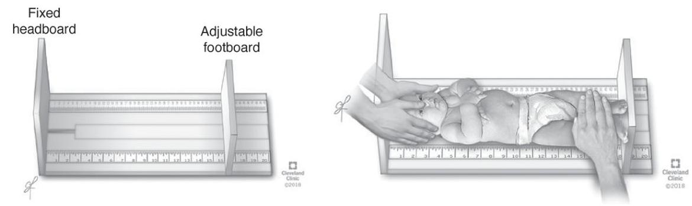
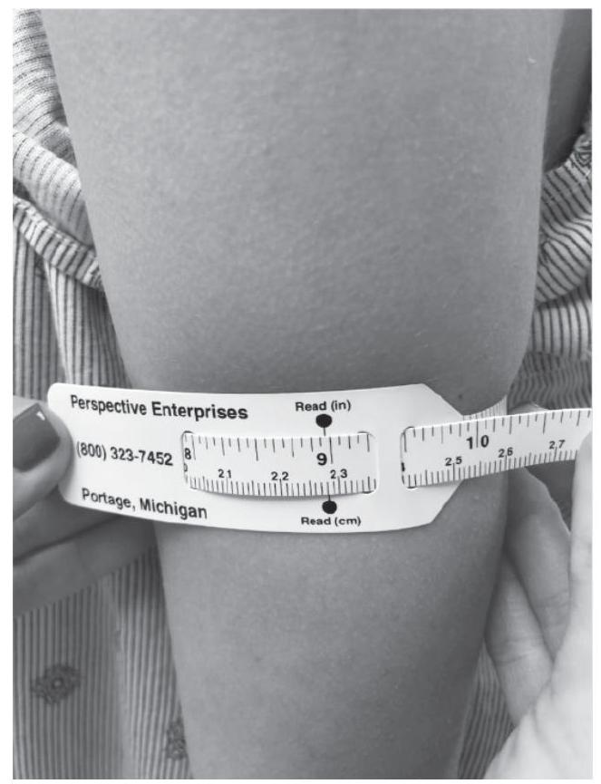
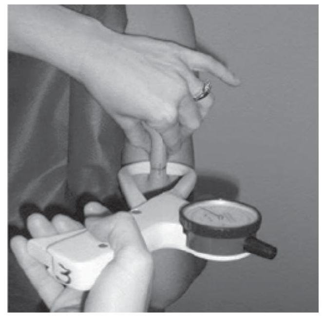
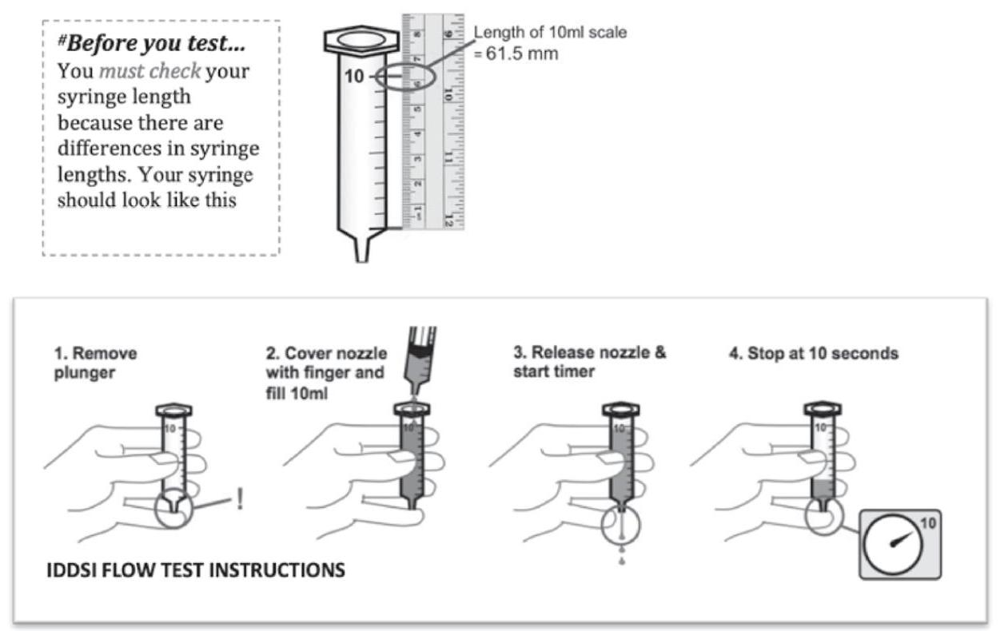
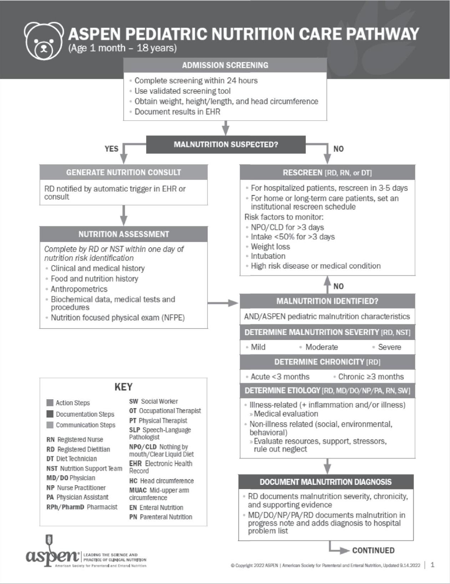
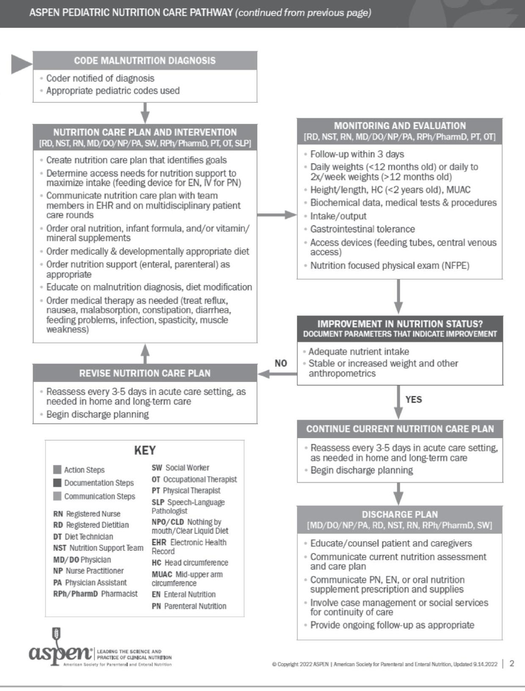
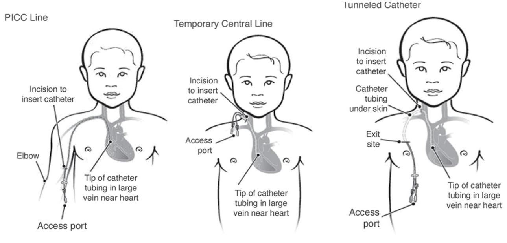
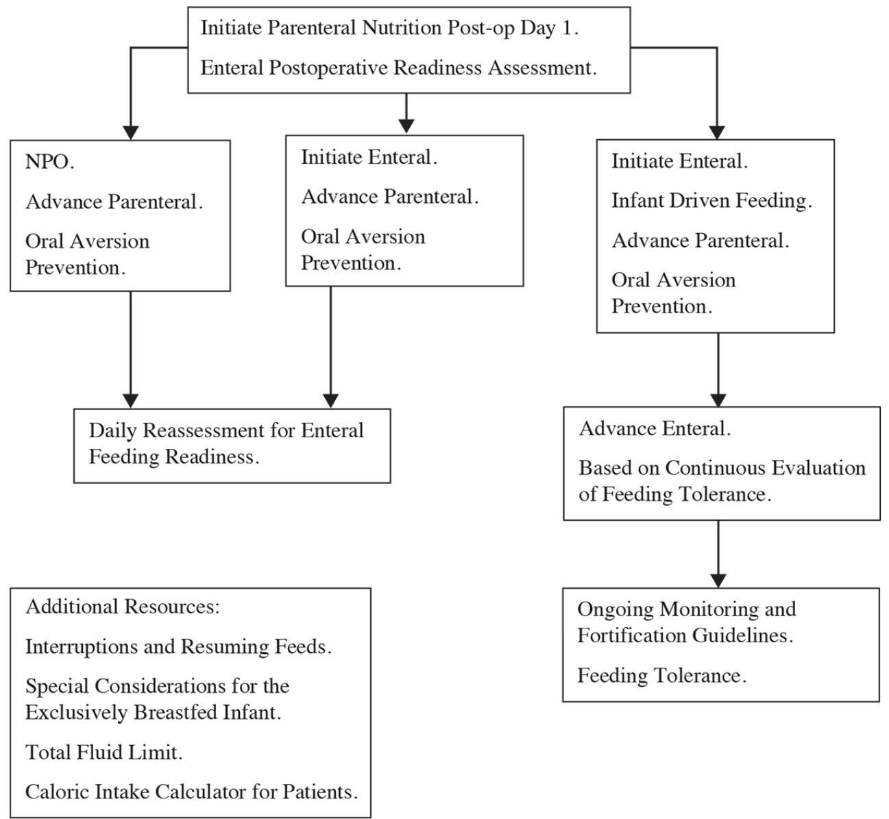
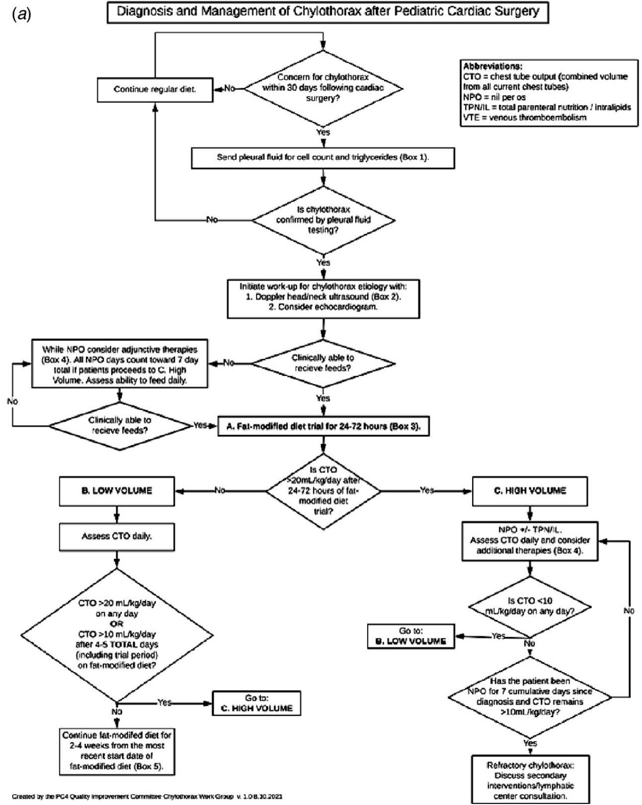

# ASPEN Pediatric and Neonatal Nutrition Support Handbook 

THIRD EDITION

EDITOR
Catherine Larson-Nath, MD, CNSC

--- page 1 ---

# ASPEN   Pediatric and Neonatal Nutrition Support Handbook

--- page 2 ---

.

--- page 3 ---

# ASPEN Pediatric and Neonatal Nutrition Support Handbook 

THIRD EDITION

EDITOR
Catherine Larson-Nath, MD, CNSC

--- page 4 ---

.

--- page 5 ---

Copyright (C) 2024 by the American Society for Parenteral and Enteral Nutrition (ASPEN). All rights reserved. Except as permitted under the United States Copyright Act of 1976, no part of this publication may be reproduced or distributed in any form, including but not limited to, the process of scanning and digitization, or stored in a database or retrieval system, without prior written permission from the publisher.

Electronic edition published 2024.
ISBN: 978-1-8896-2255-2 (electronic edition).
Published by ASPEN, 8401 Colesville Road, Suite 510, Silver Spring, MD 20910
https://www.nutritioncare.org
aspen@nutritioncare.org
ASPEN is a scientific society whose members are dietitians, nurses, pharmacists, physicians, scientists, students, other health professionals, and researchers who envision an environment in which every patient receives safe, efficacious, and high-quality nutrition care. ASPEN's mission is to improve patient care by advancing the science and practice of clinical nutrition and metabolism.

NOTE: This publication is designed to provide accurate authoritative information regarding the subject matter covered. It is sold with the understanding that the publisher is not engaged in rendering medical or other professional advice. Trademarked commercial product names are used only for education purposes and do not constitute endorsement by ASPEN.

This publication does not constitute medical or professional advice and should not be taken as such. Use of the information published herein is subject to the sole professional judgment of the attending health professional, whose judgment is the primary component of quality medical care. The information presented herein is not a substitute for the exercise of such judgment by the health professional.

ISBN: 978-1-889622-54-5
eISBN: 978-1-889622-55-2

--- page 6 ---

# Contents 

List of Tables, Figures, Exhibits, and Appendices Contributors
Preface

## PART I: Nutrition Status

1. Nutrition Screening and History

Patricia J. Becker and Gina Rempel
2. Malnutrition

Patricia J. Becker and Gina Rempel
3. Clinical Considerations

Gina Rempel and Patricia J. Becker

## PART II: Nutrition Care Plan

4. Infant to Adolescent

Mary Pat Turon-Findley
5. Enteral Nutrition

Laura Gearman
6. Parenteral Nutrition

Elaina Szeszycki and Francine Breckler
7. Neonatal Nutrition

Austin Michalski and Kathleen Gura

## PART III: Disease-Specific Nutrition

--- page 7 ---

8. Allergy and Eosinophilic Esophagitis

Anam Bashir and Praveen S. Goday
9. Cardiac Disease

Erin Sullivan, Sharon Y. Irving, Vijay Srinivasan, and Chitra Ravishankar
10. Celiac Disease

Anam Bashir and Praveen S. Goday
11. Critical Illness

Sharon Y. Irving, Stephanie Seiple, and Vijay Srinivasan
12. Cystic Fibrosis

Anam Bashir and Praveen S. Goday
13. Neurological Impairment and Developmental Disabilities Gina Rempel
14. Diabetes Mellitus

Christina Wright Yee and Emely Reyes
15. Disordered Eating

Mary Pat Turon-Findley
16. Dyslipidemia

Kari Murdy
17. Inborn Errors of Metabolism

Mary Sowa, Laura Jaimes, and Sandy Van Calcar
18. Inflammatory Bowel Disease

Anam Bashir and Praveen S. Goday
19. Renal Disease

Paige Balgie
20. Liver Disease

Anam Bashir and Praveen S. Goday
21. Oncology and Hematopoietic Stem Cell Transplant

Temitope Pedro and Jocelyn Fry
22. Pancreatitis

Anam Bashir and Praveen S. Goday
23. Seizures and the Ketogenic Diet

Jessica Ernst and Meredith Johnson
24. Short Bowel Syndrome

Anam Bashir and Praveen S. Goday
25. Weight Management and Obesity

--- page 8 ---

# Jessica Graumann 

Additional Resources: ASPEN Endorsed Pediatric Guidelines, Consensus Recommendations, and Other Documents

--- page 9 ---

# List of Tables, Figures, Exhibits, and Appendices 

| Tables |  |
| :--: | :--: |
| Table 1-1 | Parameters for Pediatric Malnutrition Risk Screening Tools |
| Table 1-2 | Advantages/Disadvantages of Food Intake Collection Methods |
| Table 1-3 | Assessing Intake for Breastfed Infants, Including Frequency of Intake, Output, and Weight Gain |
| Table 1-4 | Measuring Anthropometrics in Children |
| Table 1-5 | Segmental Measurement Techniques and Equations to Calculate Extrapolated Lengths |
| Table 1-6 | Daily Weight Gain Velocity in Grams per Day for Infants and Children Under 24 Months |
| Table 1-7 | Average Weight Gain and Growth Goals: Ages 310 Years |
| Table 1-8 | Average Growth Goals: Males and Females Ages 11-20 Years |
| Table 1-9 | WHO z Score Cutoff Points for Various Growth Concerns |
| Table 1-10 | Gross Motor Function Classification Scale for Children With Cerebral Palsy |
| Table 1-11 | Comparing WHO Percentiles From Set 1 of the WHO Growth Charts With Approximate Corresponding z Scores |

--- page 10 ---

|  Table 1-12 | Nutrition-Focused Physical Examination Clinical Signs  |
| --- | --- |
|  Table 1-13 | Pediatric Nutrition-Focused Physical Examination Checklist  |
|  Table 1-14 | Signs and Symptoms of Dehydration  |
|  Table 1-15 | The Revised SGNA  |
|  Table 2-1 | Pediatric Academy of Nutrition and Dietetics/ASPEN Consensus–Derived “Indicators of Malnutrition” and Associated Billing Codes  |
|  Table 2-2 | Pediatric Academy of Nutrition and Dietetics/ASPEN Consensus–Derived Indicators of Malnutrition Factors to Include When Assessing for Pediatric Malnutrition  |
|  Table 2-3 | WHO-Based Weight Gain Velocity Assessment for Malnutrition: Girls 0–24 Months  |
|  Table 2-4 | WHO-Based Weight Gain Velocity Assessment for Malnutrition: Boys 0–24 Months  |
|  Table 2-5 | Biochemical Markers of Inflammation in Pediatric Patients  |
|  Table 2-6 | Malnutrition Criteria for Preterm Infants and Neonates: Primary Indicators to Diagnose Malnutrition  |
|  Table 3-1 | Developmental Feeding Stages and Appropriate Foods for Different Ages  |
|  Table 3-2 | Potential Thickening Agents and Considerations  |
|  Table 3-3 | Description of Enteral Access Devices and Their Advantages and Disadvantages  |
|  Table 4-1 | Daily Energy Requirements for Pediatric Patients  |
|  Table 4-2 | Daily Protein Requirements for Pediatric Patients  |
|  Table 4-3 | Calculating Basal Metabolic Rate Using the Schofield Equation  |
|  Table 4-4 | Calculating Resting Energy Expenditure Using the WHO Equation  |
|  Table 4-5 | Calculating Estimated Fluid Requirements Using the Holliday-Segar Formula  |

--- page 11 ---

|  Table 4-6 | Dietary Reference Intake for Calcium, Phosphorus, and Magnesium  |
| --- | --- |
|  Table 4-7 | Dietary Reference Intake for Fat-Soluble Vitamins  |
|  Table 4-8 | Content per Unit Dose of Fat-Soluble Multivitamin Preparations for Use With Parenteral Nutrition  |
|  Table 4-9 | Dietary Reference Intake of Water-Soluble Essential Micronutrients in Pediatric Populations  |
|  Table 4-10 | Daily Parenteral Water-Soluble Vitamin Recommendations for Pediatric Patients  |
|  Table 4-11 | Suggested Parameters to Monitor for Infants and Children Receiving EN  |
|  Table 5-1 | Short-Term Devices vs Long-Term Devices: Clinical Indications, Advantages, and Disadvantages  |
|  Table 5-2 | Balloon Gastrostomy Tubes vs Nonballoon Tubes: Indications, Advantages, and Disadvantages  |
|  Table 5-3 | High-Profile Tubes vs Low-Profile Tubes: Indications, Advantages, and Disadvantages  |
|  Table 5-4 | Gastric Tubes vs Transpyloric Tubes: Indications, Advantages, and Disadvantages  |
|  Table 5-5 | Action Plan of Tube Dislodgement Based on Type of EAD  |
|  Table 5-6 | Infant Formula Powder Recipes  |
|  Table 5-7 | Infant Formula Concentrate Recipes  |
|  Table 5-8 | Initiation, Advancement, and Proposed Goal Volumes of Enteral Feedings  |
|  Table 5-9 | Common Enteral Nutrition–Related Complications and Interventions  |
|  Table 5-10 | Liquid Medication Preparation  |
|  Table 6-1 | Summary of miniMAGIC Guidelines  |
|  Table 6-2 | Location, Advantages, and Disadvantages of Vascular Access Devices  |
|  Table 6-3 | Dosing for Initiation and Advancement of PN Macronutrients  |
|  Table 6-4 | Amino Acid Variations Between Pediatric Amino Acids and Adult or Standard Amino Acids  |

--- page 12 ---

|  Table 6-5 | Lipid Injectable Emulsion Products,Characteristics, Abbreviations, and Approval forUse in the United States  |
| --- | --- |
|  Table 6-6 | Composition and Properties of ILE Products  |
|  Table 6-7 | Published Pediatric Dosage for ILE Products  |
|  Table 6-8 | Electrolyte Composition of Body Fluids  |
|  Table 6-9 | Drug-Induced Metabolic Disorders  |
|  Table 6-10 | Daily Dose of Individual Electrolytes  |
|  Table 6-11 | Frequency of Short-Term and Long-TermMetabolic Monitoring  |
|  Table 6-12 | Comparison of Pediatric and Adult MultivitaminProducts  |
|  Table 6-13 | Function of Trace Metals and Symptoms ofDeficiency  |
|  Table 6-14 | Ingredients for Currently Available Trace ElementProducts in the United States  |
|  Table 6-15 | Dosing of Trace Metals  |
|  Table 6-16 | Composition of Frequently Used IV Iron Products  |
|  Table 6-17 | Parameters to Evaluate Adequacy of PN Volume  |
|  Table 6-18 | Frequency of Long-Term Nutrition-RelatedMonitoring  |
|  Table 6-19 | ASPEN Consensus Criteria for IdentifyingPediatric Patients at Risk for Refeeding Syndrome  |
|  Table 6-20 | ASPEN Consensus Recommendations forAvoidance and Management of RS in At-RiskPediatric Patients  |
|  Table 7-1 | Gestational Age Categories  |
|  Table 7-2 | Birth Weight Classifications  |
|  Table 7-3 | Birth Size Assessment  |
|  Table 7-4 | Indications for Nutrition Support  |
|  Table 7-5 | Neonatal Growth Charts  |
|  Table 7-6 | Growth Monitoring  |
|  Table 7-7 | Term Infant Energy and Protein Needs: DailyRequirements  |
|  Table 7-8 | Preterm Infant Energy and Protein Needs: DailyRequirements  |

--- page 13 ---

|  Table 7-9 | Osmolarity of Select PN Solutions  |
| --- | --- |
|  Table 7-10 | Conditions That Influence Neonatal Fluid Requirements  |
|  Table 7-11 | Gastrointestinal Electrolyte Losses and Suggested Replacement Regimen  |
|  Table 7-12 | Energy Density of PN Macronutrients  |
|  Table 7-13 | ASPEN Recommendations for Initiation and Advancement of Parenteral Nutrition Macronutrients  |
|  Table 7-14 | Brand-Specific Composition of Common Pediatric Parenteral Amino Acid Solutions Designed for Infants  |
|  Table 7-15 | ASPEN Recommendations for Parenteral Nutrition Electrolyte and Mineral Daily Doses  |
|  Table 7-16 | Factors That Influence Calcium Phosphorus Precipitation  |
|  Table 7-17 | ASPEN Recommendations for Parenteral Nutrition Trace Element Daily Dosing  |
|  Table 7-18 | Trace Element Dosing Using Combination Product: Multrys (American Regent)  |
|  Table 7-19 | ASPEN Recommended Parenteral Nutrition Daily Multiple Vitamin Product Dosing  |
|  Table 7-20 | Recommended Levels of Intake for Intravenous Multivitamins for Term and Preterm Infants  |
|  Table 7-21 | Suggested PN Monitoring Guidelines  |
|  Table 7-22 | Metabolic Complications Associated With PN Use  |
|  Table 7-23 | Multinutrient Human Milk Fortifiers  |
|  Table 7-24 | Preterm Infant Formulas and Human Milk Fortifiers  |
|  Table 7-25 | Preterm Infant Formula Composition  |
|  Table 7-26 | Enteral Feeding Routes in Term and Preterm Infants  |
|  Table 7-27 | Recommended Daily Enteral Intake of Electrolytes, Minerals, and Trace Elements  |
|  Table 7-28 | Recommended Enteral Intake of Vitamins  |
|  Table 8-1 | Different Categories of Food Allergies  |

--- page 14 ---

|  Table 9-1 | Nutrition Guidelines for Neonates Undergoing Surgery for CHD  |
| --- | --- |
|  Table 9-2 | High MCT and/or Low LCT Formulas  |
|  Table 10-1 | List of Common Gluten-Containing and Gluten-Free Foods  |
|  Table 11-1 | Operational Definitions of Malnutrition  |
|  Table 11-2 | Approach to Feeding Intolerance  |
|  Table 11-3 | Nutrition Considerations for Children With Burn Injuries  |
|  Table 11-4 | Vitamin and Mineral Supplementation and Laboratory Monitoring Recommendations for Pediatric Patients With Pressure Injuries  |
|  Table 12-1 | Vitamin Supplementation in Children With Cystic Fibrosis  |
|  Table 12-2 | Dosing of Pancreatic Enzymes  |
|  Table 13-1 | Factors Impacting Nutrition Status and Their Outcomes in Children With NI  |
|  Table 13-2 | Cooccurring Conditions and Their Impact on Nutrition in Children With NI  |
|  Table 13-3 | Feeding History Framework for Children With NI  |
|  Table 13-4 | Tools, Measurements, and Nutrition Targets for Children With NI  |
|  Table 13-5 | Red Flags for Undernutrition in Children With NI  |
|  Table 13-6 | Designing Diet Plans for Children With NI  |
|  Table 14-1 | HbA1c and Estimated Average Glucose  |
|  Table 14-2 | Plasma Blood Glucose and HbA1c Target for Pediatric Age Groups With T1DM  |
|  Table 14-3 | Education Approaches for Mealtime Management for Children With Diabetes  |
|  Table 14-4 | Helpful Tools for Carbohydrate Counting  |
|  Table 14-5 | Subcutaneous Insulin Injectables  |
|  Table 14-6 | Approved Medications for Children Over Age 10 Years With T2DM  |
|  Table 14-7 | Monitoring of Laboratory Studies in Pediatric T1DM and T2DM  |

--- page 15 ---

|  Table 15-1 | Eating Disorder and Feeding Disorder Summary (DSM-5)  |
| --- | --- |
|  Table 15-2 | History and Examination Considerations in Disordered Eating  |
|  Table 15-3 | Initiation and Advancement of Nutrition Support in Patients With Disordered Eating  |
|  Table 16-1 | Types of Dyslipidemia  |
|  Table 16-2 | Lipoprotein Reference Ranges for Children and Adolescents  |
|  Table 16-3 | Management of Specific Lipoprotein Abnormal Findings  |
|  Table 16-4 | Specific Nutrient Recommendations  |
|  Table 17-1 | Amino Acid Disorders  |
|  Table 17-2 | Urea Cycle Disorders  |
|  Table 17-3 | Organic Acidemias  |
|  Table 17-4 | Fatty Acid Oxidation Disorders  |
|  Table 17-5 | Disorders of Carbohydrate Metabolism  |
|  Table 18-1 | Monitoring of Vitamin and Micronutrient Deficiency in Children With IBD  |
|  Table 18-2 | Different Dietary Therapies Used in Crohn’s Disease  |
|  Table 19-1 | Stages of CKD: Greater Than 2 Years of Age  |
|  Table 19-2 | Nutrition for Kidney Stone Management  |
|  Table 19-3 | Energy and Protein Needs  |
|  Table 19-4 | Micronutrients  |
|  Table 19-5 | Commonly Used Phosphate Binder Medications and Their Calcium Content  |
|  Table 19-6 | Renal Formulas  |
|  Table 19-7 | Modulars and Additives  |
|  Table 20-1 | Vitamin Supplementation in Patients With Liver Disease  |
|  Table 20-2 | Management of Complications of Acute Liver Disease  |
|  Table 21-1 | Contributors to Malnutrition in Pediatric Cancer  |
|  Table 21-2 | Calorie and Protein Requirements of Pediatric Oncology Patients  |

--- page 16 ---

|  Table 21-3 | Calorie and Protein Requirements of Pediatric Patients Undergoing HSCT  |
| --- | --- |
|  Table 21-4 | Nutrition Strategies for Symptom Management  |
|  Table 22-1 | Pancreatitis Diagnostic Criteria  |
|  Table 23-1 | Types of Ketogenic Diets  |
|  Table 23-2 | Epilepsy Syndromes and Conditions  |
|  Table 23-3 | Contraindications to the Use of KDT  |
|  Table 23-4 | Possible Adverse Effects of KDT  |
|  Table 23-5 | Estimating Nutrient Needs  |
|  Table 23-6 | Macronutrient Composition of Each Diet in Percentage of Total Calories  |
|  Table 23-7 | Initiation Location  |
|  Table 23-8 | Classic KDT Initiation Methods  |
|  Table 23-9 | Laboratory Monitoring  |
|  Table 23-10 | Ketone Measurements  |
|  Table 23-11 | Sample KDT Weaning Plan  |
|  Table 24-1 | Laboratory Monitoring in Patients With Short Bowel Syndrome  |
|  Table 24-2 | Simple and Complex Carbohydrates  |
|  Table 25-1 | Laboratory Assessment for Childhood and Adolescent Obesity  |
|  Table 25-2 | Staged Approach to Weight Management in Children and Adolescents  |
|  Table 25-3 | Weight Recommendations According to Age and BMI Percentile  |
|  Table 25-4 | Estimated Daily Amounts of Food Groups Based on Calorie Range  |
|  Table 25-5 | Traffic Light Diet Guidelines  |
|  Table 25-6 | Postoperative Diet by Stages  |
|  Figures |   |
|  Figure 1-1 | Measuring Recumbent Length by Using an Infantometer  |
|  Figure 1-2 | Measuring Standing Height by Using a Stadiometer  |

--- page 17 ---

|  Figure 1-3 | Technique for Measuring Mid–Upper Arm Circumference  |
| --- | --- |
|  Figure 1-4 | Obtaining a Triceps Skinfold Measurement by Using a SkinfoldCaliper  |
|  Figure 1-5 | Technique for Using a Handgrip Dynamometer  |
|  Figure 3-1 | The IDDSI Categorization of Food and Liquid Viscosities and Consistencies  |
|  Figure 3-2 | The IDDSI Syringe Test for Measuring Liquid Viscosity  |
|  Figure 4-1 | ASPEN Pediatric Nutrition Care Pathway  |
|  Figure 6-1 | Access Types and Locations of Select Central Venous Access Devices in Children  |
|  Figure 9-1 | Pathway for Nutrition of Neonates Undergoing Surgery for Congenital Heart Disease  |
|  Figure 9-2 | Clinical Management Algorithm for Postoperative Chylothorax  |
|  Figure 20-1 | Effects of Liver Disease on Macronutrients  |
|  Exhibits |   |
|  Exhibit 1-1 | Pediatric Nutrition Screening Tool Questions  |
|  Exhibit 1-2 | Screening for Nutrition Status in Children With Eating and Drinking Difficulties  |
|  Exhibit 1-3 | Comparison of WHO and CDC Growth Charts  |
|  Exhibit 6-1 | Considerations for Peripheral Parenteral Nutrition  |
|  Exhibit 6-2 | Considerations When Reviewing Medication Compatibility With PN  |
|  Exhibit 6-3 | Parameters to Evaluate Adequacy of PN Order  |
|  Exhibit 10-1 | Common Sources of Contamination  |
|  Exhibit 15-1 | Nutrition Support Order Set for Patient With Disordered Eating  |
|  Exhibit 19-1 | Pretreatment of Liquids to Reduce Potassium Content  |
|  Exhibit 19-2 | Nondietary Causes of Hyper- or Hypokalemia  |
|  Exhibit 19-3 | Nutrition Considerations of Renal Replacement Therapy  |

--- page 18 ---

|  Exhibit 21-1 | Food Safety Practices for Immunocompromised Patients  |
| --- | --- |
|  Exhibit 25-1 | History Assessment  |
|  Exhibit 25-2 | Physical Examination for Childhood Obesity  |
|  Exhibit 25-3 | Indications and Contradictions for Adolescent Weight Loss Surgery  |
|  Appendices |   |
|  Appendix 5-1 | Sample Enteral Nutrition Plan for Pediatric and Infant Patients  |
|  Appendix 5-2 | Standard Infant Formulas  |
|  Appendix 5-3 | Reduced-Lactose Infant Formulas  |
|  Appendix 5-4 | Soy Infant Formulas  |
|  Appendix 5-5 | Extensively Hydrolyzed Protein Infant Formulas  |
|  Appendix 5-6 | Elemental Infant Formulas  |
|  Appendix 5-7 | Added Rice Starch Infant Formulas  |
|  Appendix 5-8 | Other Specialized Infant Formulas  |
|  Appendix 5-9 | Pediatric Elemental Formula  |
|  Appendix 5-10 | Pediatric Semi-Elemental Formula  |
|  Appendix 5-11 | Pediatric Standard Formula  |
|  Appendix 5-12 | Pediatric Real Food–Based Formula  |
|  Appendix 5-13 | Standard Adult Formulas  |
|  Appendix 5-14 | Adult Semi-Elemental Formulas  |
|  Appendix 5-15 | Other Adult Formulas  |
|  Appendix 5-16 | Product Manufacturer Websites  |
|  Appendix 6-1 | Sample Parenteral Nutrition Plan  |

--- page 19 ---

# Contributors 

Paige Balgie, RDN, LD
M Health Fairview University of Minnesota Masonic Children's Hospital, Minneapolis

## Anam Bashir, MD

Division of Pediatric Gastroenterology, Hepatology \& Nutrition, Medical College of Wisconsin/Children's Wisconsin

Patricia J. Becker, MS, RDN, CSP, FAND
Pediatric Nutrition Specialist, KidsRD.com, Cincinnati, OH

## Francine Breckler, PharmD, BCPPS

Clinical Pharmacist, Pediatric General Surgery, Riley Hospital for Children, Department of Pharmacy, Indianapolis, IN

Jessica Ernst, MS, RDN, CSP, LD
Registered Dietitian Nutritionist, The Keto RD, LLC, Cincinnati, OH
Jocelyn Fry, RD, CSP
Clinical Dietitian III, Stanford Medicine, Children's Health, Palo Alto, CA

Laura Gearman, MS, RD, LD, CNSC
Clinical Nutrition Manager, M Health Fairview University of Minnesota Masonic Children's Hospital, Minneapolis

--- page 20 ---

# Praveen S. Goday, MBBS 

Director of Nutrition and Feeding Programs, Nationwide Children's Hospital, Professor of Clinical Pediatrics, The Ohio State University, Columbus

## Jessica Graumann, MS, RDN, LD

Pediatric Clinical Dietitian, MHealth Fairview Masonic Children's Hospital, Minneapolis, MN

Kathleen Gura, PharmD, BCNSP, FASHP, FPPA, FASPEN, FMSHP Manager, Clinical Research, Department of Pharmacy, Boston Children's Hospital, Boston, MA

## Sharon Y. Irving, PhD, CRNP

Department of Nursing and Clinical Care Services, Critical Care, The Children's Hospital of Philadelphia; Department of Family and Community Health, University of Pennsylvania School of Nursing, Philadelphia

## Laura Jaimes, MS, RD, CNSC

Clinical Dietitian, Metabolic Genetics, Oregon Health \& Science University, Portland

Meredith Johnson, MS, RDN, CSP, LD
Nutritionist 3, Ketogenic Diet \& Metabolics, Children's Healthcare of Atlanta, Atlanta, GA

## Austin Michalski, RDN, CNSC

Registered Dietitian Nutritionist, CS Mott Children's Hospital, University of Michigan Health, Michigan Medicine, Ann Arbor

## Kari Murdy, RD, LD

University of Minnesota Physicians, Minneapolis

## Temitope Pedro, MPH, RD, CSP

Clinical Dietitian III, Stanford Medicine, Children's Health, Palo Alto, CA

--- page 21 ---

Chitra Ravishankar, MBBS, MRCP (UK)
Division of Cardiology, Department of Pediatrics, The Children's Hospital of Philadelphia, University of Pennsylvania Perelman School of Medicine, Philadelphia

# Gina Rempel, MD, FRCPC, FASPEN 

Health Sciences Center Winnipeg, Winnipeg, Manitoba

## Emely Reyes, RDN, CDCES

Clinical Dietitian, Certified Diabetes Care and Education Specialist, Clinical Nutrition and Lactation Services, Children's Hospital of Orange County, Orange County, CA

## Stephanie Seiple, RD, LDN, CNSC

Department of Clinical Nutrition, The Children's Hospital of Philadelphia, Philadelphia, PA

## Vijay Srinivasan, MBBS, MD

Department of Anesthesiology, Critical Care, and Pediatrics, The Children's Hospital of Philadelphia, University of Pennsylvania Perelman School of Medicine, Philadelphia

## Mary Sowa, MS, RD

Clinical Dietitian IV/Metabolic Dietitian, Children's Hospital of Orange County, Orange County, CA

## Erin Sullivan, RD, LDN, CSPCC

Department of Clinical Nutrition, The Children's Hospital of Philadelphia, Philadelphia, PA

## Elaina Szeszycki, PharmD, BCNSP

Clinical Pharmacist, Nutrition Support and Pediatric Gastroenterology, Department of Pharmacy Services, Riley Hospital for Children at Indiana University Health, Indianapolis

Mary Pat Turon-Findley, Med, RD, CMHIMP, LD
Registered Dietitian, Cincinnati Children's Hospital, Cincinnati, OH

--- page 22 ---

Sandy Van Calcar, PhD, RD
Associate Professor, Department of Molecular and Medical Genetics, Graduate Programs in Human Nutrition, Oregon Health \& Science University, Portland

Christina Wright Yee, MPH, RD, CSP
Clinical Dietitian III, Clinical Nutrition and Lactation Services, Children's Hospital of Orange County, Orange County, CA

--- page 23 ---

# Preface 

The period from infancy through adolescence is a time of rapid growth and development filled with many critical milestones, which if missed, cannot be overcome. This rapid growth leads to higher metabolic needs. Nutrition plays an essential role in optimizing growth and developmental outcomes during these life stages, putting children at high risk for malnutrition.

To provide the best care for children, practitioners must know how to recognize malnutrition and identify children who are at risk to provide appropriate evidenced-based nutrition support for both prevention and treatment. There is no single parameter that reflects nutritional status. Therefore, nutrition support for pediatric patients requires comprehensive screening, assessment, intervention, and follow-up. It is important to recognize the complex and changing nature of nutrition and nutrition support in this young population and to understand the importance of timely assessment and clear communication between families, patients, and the health care team in all settings.

This handbook is divided into three sections to guide clinicians as they provide nutrition support-related care for neonates, infants, children, and adolescents. Part I, "Nutrition Status," outlines how to assess the nutritional status of neonatal and pediatric patients. Part II, "Nutrition Care Plan," addresses how to develop parenteral and enteral nutrition care plans for neonates, infants, children, and adolescents. Part III, "Disease-Specific Nutrition," reviews nutrition considerations for pediatric patients with acute and chronic illness.

--- page 24 ---

The handbook is meant to supplement the ASPEN Pediatric Nutrition Support Core Curriculum, ASPEN guidelines, and ASPEN position statements, so readers should refer to these resources for more in-depth discussions of covered topics.

--- page 25 ---

# PART 

I

## Nutrition Status

--- page 26 ---

# Nutrition Screening and History 

Patricia J. Becker, MS, RDN, CSP, FAND Gina Rempel, MD, FRCPC, FASPEN

## Overview

Nutrition assessment lies at the heart of the nutrition care process, which involves developing a nutrition diagnosis, creating a nutrition care plan, and monitoring progress. ${ }^{1}$ Nutrition assessment is the "systematic process of collecting and interpreting information to make decisions about the nature and cause of nutritionrelated health issues that affect an individual." ${ }^{2}$ Assessment of nutrition involves a detailed history of cooccurring medical conditions and clinical considerations, a meticulous history of the food intake pattern, anthropometric variables, monitoring growth and weight gain velocity, and appropriate laboratory evaluation. These factors are all incorporated into a nutrition diagnosis that defines the chronicity and cause of the nutrition problem. A nutrition intervention plan follows with a clear outline of the goals and establishes which parameters will be used to define a positive outcome. ${ }^{1}$

This chapter focuses on the nutrition assessment of infants and children, including ancillary conditions, factors, and indicators that come into play when assessing a child's nutrition and diagnosing malnutrition.

## Nutrition Screening

Nutrition "screening" and "assessment" are different processes. The former indicates risk factors for a nutrition condition and the latter provides the nutrition diagnosis. ${ }^{3}$ Nutrition risk screening should be completed upon presentation to all health care settings to ensure opportunities for remediation of malnutrition are not lost.

--- page 27 ---

Early identification of nutrition risk facilitates timely nutrition intervention, potentially limiting malnutrition-related complications. Nutrition screening is an important preliminary step that identifies the risk of a nutrition problem. Nutrition screening also initiates entry into the nutrition care process. It identifies the need for additional nutrition assessment and the need for referral to a registered dietitian (RD) for a potential diagnosis of nutrition-related problem(s).

Nutrition screening tools are used to identify the risk of malnutrition or change in the risk of malnutrition, which can occur during periods of illness. Nutrition screening tools should make screening quick and easy to complete. They should allow the process to be completed by staff without formal nutrition training. The most common parameters included in the tools to identify malnutrition risk are the following:

- Appetite or dietary intake
- Clinical information, such as the presence of a medical condition that impacts nutrition status or medical treatment
- One or more anthropometric measures and/or concerns about weight or growth ${ }^{4}$

Nutrition screening tools that have demonstrated moderate to high validity, reliability, and agreement are preferred. The use of tools that have low or undemonstrated validity and reliability may result in missing individuals at risk for malnutrition. It may also result in referral for nutrition assessments for those who are not at risk.

Tools used to identify malnutrition risk should be valid and reliable for the population and setting. Although no screening tool can be $100 \%$ accurate, pediatric nutrition screening tools should have at least moderate to high validity and reliability based on grade 1 (good/strong) or grade 2 (fair) evidence. Although there are gaps in validation for pediatric nutrition screening tools for use in the outpatient setting, simple tools such as the Pediatric Nutrition Screening Tool (PNST), ${ }^{5}$ which consists of 4 questions, can be used in these settings. ${ }^{4}$ Exhibit 1-1 lists the questions in the PNST and its scoring. ${ }^{5}$

EXHIBIT 1-1. Pediatric Nutrition Screening Tool Questions

| Questions | Yes | No |
| :-- | :-- | :-- |
| Has the child lost weight unintentionally lately? |  |  |
| Has the child had poor weight gain over the past few months? |  |  |
| Has the child been eating/feeding less over the past few weeks? |  |  |
| Is the child obviously underweight? |  |  |
| Scoring: If yes to 2 or more of the above, refer the child for   - further nutrition assessment   - measurement of weight and length for height   - food or diet intake record |  |  |

--- page 28 ---

Adapted with permission from the American Society for Parenteral and Enteral Nutrition from White M, Lawson K, Ramsey R, et al. Simple nutrition screening tool for pediatric inpatients. JPEN J Parenter Enteral Nutr. 2016;40(3):392-398. https://doi.org/10.1177/0148607114544321

There are several other tools besides the PNST that have moderate-to-high validation in the pediatric population in both acute care and ambulatory settings:

- Screening Tool for Assessment of Malnutrition in Pediatrics
- Screening Tool for Risk of Nutrition Status and Growth
- Pediatric Yorkhill Malnutrition Screen
- Pediatric Nutrition Risk Screen

Table 1-1 outlines and compares parameters of these validated Pediatric Malnutrition Risk Scoring tools. ${ }^{6}$ Exhibit 1-2 outlines another validated nutrition screening tool consisting of 4 questions that addresses nutrition screening in children with eating and drinking difficulty. ${ }^{7}$

TABLE 1-1. Parameters for Pediatric Malnutrition Risk Screening Tools ${ }^{a}$

| Parameter | PNST | STAMP | STRONG $_{\text {kids }}$ | PYMS | PNRS |
| :-- | :-- | :-- | :-- | :-- | :-- |
| Weight loss in the recent past | X |  | X | X | X |
| Poor growth in the recent past   (poor weight gain) | X |  | X |  |  |
| Poor dietary intake | X | X | X | X | X |
| Medical condition(s) that impact   nutritional status |  | X | X | X | X |
| Child appears thin or underweight   (observation) | X |  |  |  |  |
| BMI or weight for length decline   (anthropometric measurement) |  | X |  | X |  |
| Setting for use | IP or OP | IP or OP | IP or OP | IP | IP or OP |
| Other |  |  | X (appearance of   loss of fat/muscle   mass) |  | X (pain) |

Abbreviations: BMI, body mass index; IP, inpatient; OP, outpatient; PNRS, Pediatric Nutrition Risk Screen; PNST, Pediatric Nutrition Screening Tool; PYMS, Pediatric Yorkhill Malnutrition Screen; STAMP, Screening Tool for Assessment of Malnutrition in Pediatrics; STRONG $_{\text {kids }}$, Screening Tool for Risk of Nutrition Status and Growth.
${ }^{a}$ Data from Nutrition Screening Pediatrics: NSP tool component and descriptions (2018).
Academy of Nutrition and Dietetics. 2018. Accessed June 30, 2022.
https://www.andeal.org/topic.cfm?menu=5767\&cat=5922

--- page 29 ---

EXHIBIT 1-2. Screening for Nutrition Status in Children With Eating and Drinking Difficulties

| Score | An answer of "yes" scores 1 point. |
| :-- | :-- |
|  | Do you think your child is underweight? |
|  | Does your child have problems gaining weight? |
| Score | An answer of $>7$ scores 1 point. |
|  | Rate from 1 to 10 whether you think your child has any problem eating compared with   other children. |
|  | Rate from 1 to 10 whether you think your child has any problem drinking compared with   other children. |
| Total: | A score $>3$ suggests a referral for assessment of nutrition status and eating and drinking   skills is indicated. |

Adapted with permission from Bell KL, Benfer KA, Ware RS, et al. Development and validation of a screening tool for feeding/swallowing difficulties and undernutrition in children with cerebral palsy. Dev Med Child Neurol. 2019;61(10):1175-1181. https://doi.org/10.1111/dmcn. 14220

# Nutrition Assessment and Interpretation 

Upon completion of the nutrition risk screen, children who are deemed to be at nutrition risk should be referred for further nutrition assessment. The purpose of nutrition assessment is to determine whether a nutrition problem or diagnosis exists and whether nutrition intervention is indicated. The nutrition assessment includes the following detailed data collection:

- The child's health and wellbeing
- The child's intake
- Anthropometric measures
- Weight gain and growth velocity and appropriate growth charts
- A nutrition-focused physical examination
- Laboratory evaluation

## Data for the Nutrition Assessment

The nutrition providers who complete the nutrition assessment should ensure that all available information pertaining to the child's nutrition status is reviewed as part of this process. There are several data sources for nutrition assessment:

- The health record
- Biochemical data
- Medical/surgical history
- Vital signs
- Medical procedures/consultations
- Medication
- Route of delivery
- Recorded anthropometric measurements/growth history

--- page 30 ---

- Data created during the assessment
- Client interview
- Nutrient intake data
- Mode of delivery
- Obtained anthropometric measurements
- Physical assessment
- Biochemical Data
- Other
- Birth history
- Feeding history
- Developmental history
- Achievement of developmental milestones
- Social and family environment ${ }^{9}$

Assessing nutrition status enables health professionals from a variety of disciplines to identify whether children are growing appropriately or whether they are at risk of under- or overnutrition or inadequate growth or weight gain. See also chapter 3, "Clinical Considerations," "Feeding, Eating, and Drinking Difficulties, Including Swallowing Problems (Dysphagia)" section for specific questions related to children with eating and drinking difficulties.

# Diet Assessment Methods 

Assessing the adequacy and appropriateness of a child's nutrient intake is essential to nutrition assessment, and should include a comprehensive review of the key elements of the child's diet history.

## Key Elements of a Pediatric Diet History

The key elements of a pediatric diet history include the following:

- Type and amount of food, beverages, formula, and human milk consumed and route of intake
- Methods of food or formula preparation
- Feeding history/introduction of solids
- Meal/snack frequency/duration
- Use of/skill with eating utensils/cups
- Gastrointestinal function/gastroesophageal reflux, constipation
- Urinary output, quality/quantity
- Sleep schedule
- Caregiver/child interaction at meals/meal location/setting

## Approaches to Quantify Nutrient Intake

There are several approaches to quantify nutrient intake data:

- Diet history is designed to determine the pattern of usual food intake. This type of history queries the types and frequency of foods eaten and includes the intake of nutrition supplements. The diet history is generally a detailed interview conducted by a registered dietitian nutritionist. An estimate of nutrient intake can then be calculated from the collected data.

--- page 31 ---

- 24-hour recall provides an estimate of nutrient intake based on the child's or their caregiver's recollection of food consumed over the previous day. This method has been used successfully for groups of individuals; however, it is less valid in evaluating diet adequacy for an individual because the 24-hour period assessed may not represent the usual diet. Nutrient intakes calculated from 24-hour recalls may be lower than those based on dietary histories or food records. This method has many online applications for use with caregivers and older children. ${ }^{10}$
- 3-7 day food records provide prospective food intake data. These are recorded by the parent, child, or other caregiver. These types of records require literacy. They must be returned to the nutrition care provider for analysis. Food records encompassing 7 days may provide more accurate information than those of shorter duration, as they include both weekend and weekday meal patterns. However, accuracy of diet recordkeeping can deteriorate over time. When a 7-day food record is not possible, use of shorter time periods including selected days of the week is an alternative. ${ }^{11}$
- Nutrient intake analysis (calorie count) is frequently ordered in inpatient facilities to assess a child's food intake. These are used to determine a child's ability to consume enough food for growth or to verify the achievement and adequacy of a prescribed feeding regimen. These records, however, do not provide data representative of intake within the home environment.
- Food frequencies estimate the frequency and amounts of specific foods eaten. These often consist of questionnaires that can be self-administered and therefore reduce professional interview time. The questionnaire generally cannot retrieve unique details of an individual's diet unless designed to do so. Overreporting of food intake is common with this method. ${ }^{12,13}$ Table 1-2 outlines the advantages and disadvantages of food intake collection methods. ${ }^{14}$

# TABLE 1-2. Advantages/Disadvantages of Food Intake Collection Methods ${ }^{\mathbf{a}, \mathbf{b}}$ 

| Data Collection   Method | Advantages | Disadvantages |
| :--: | :--: | :--: |
| Diet record | - Intake quantified   - Does not require recall   - Provides typical food intake and   mealtime pattern information   - Requires repeated records for   accuracy | - Can influence and change   eating behavior   - High patient burden   - High staff cost and burden   - Requires patient literacy |
| 24-h recall | - Intake is quantified   - Does not influence eating behavior   - Low patient burden   - Does not require patient literacy | - High staff cost and burden   - Multiple recalls required for   accurate habitual intake   - High reliance of patient recall |
| Food frequency   questionnaire | - Low patient burden   - Does not alter eating behavior   - Low staff burden   - Captures habitual intake   - Does not reflect short term intake | - Relies on patient recall   - Requires patient literacy   - Not quantifiably precise   - Does not provide mealtime   pattern information |

[^0]
[^0]:    ${ }^{a}$ Data from Thompson FE, Byers T. Dietary Assessment Resource Manual. J Nutr. 1994;124(suppl 11):2245s-2317s. https://doi.org/10.1093/jn/124.suppl_11.2245s
    ${ }^{\text {b }}$ Data from Diet Assessment Primer. National Cancer Institute. Accessed June 6, 2022. http://dietassessmentprimer.cancer.gov

--- page 32 ---

# Nutrition Analysis Programs 

After a food or nutrition intake history is obtained, there are several options for performing a nutrient analysis. The US Department of Agriculture (USDA) National Nutrient Database for Standard Reference ${ }^{15}$ is a major source of food composition data in the United States and provides the foundation for most food composition databases in the public and private sectors. FoodData Central provides expanded nutrient data and links to related agricultural and experimental research. Other food analysis options include software programs that are available for purchase. Some of the most popular options for health professionals include the following:

- The USDA food and nutrient database (FoodData Central: https://fdc.nal.usda.gov)
- Food Processor (https://esha.com/products/food-processor)
- Nutritionist Pro (https://nutritionistpro.com)
- Nutrihand (https://www.nutrihand.com/Static/index.html)
- Information for families and caregivers regarding food and nutrition:
- "Nutrition Resources for Parents, Caregivers, and Teachers"
(https://www.nutrition.gov/topics/nutrition-age/teens/parents-caregivers-and-teachers)
- USDA MyPlate (https://www.myplate.gov)
- American Academy of Pediatrics (https://www.healthychildren.org/english/healthyliving/nutrition/pages/default.aspx)
- CalorieKing (for calories in common "fast foods" (https://www.calorieking.com)

## Assessing Intake in Infants

For infants who are exclusively breastfed, adequacy of intake is based on the duration of feeding, hydration status, and growth as reflected in weight gain velocity. Table 1-3 provides information based on age for infants who receive human milk at the chest. For information on how much to feed an infant, refer to the American Academy of Pediatrics website (https://www.healthychildren.org/English/ages-stages/baby/feeding-nutrition/Pages/How-Often-and-How-Much-Should-Your-Baby-Eat.aspx). Table 13 outlines the approximate frequency of feedings and volumes, the urinary and stool output, and the expected weight gain per day or week. ${ }^{16}$

--- page 33 ---

TABLE 1-3. Assessing Intake for Breastfed Infants, Including Frequency of Intake, Output, and Weight Gain ${ }^{a}$

| Age   (mo) | Number of   Breastfeedings   per Day | Approximate   Volume/Feeding   (oz) | Length   of   Each   Feed   (min) | Other   Foods | Number   of Wet   Diapers   per Day | Number   of   Stools   per Day | Daily/Weekly   Weight Gain |
| :-- | :--: | :--: | :--: | :-- | :--: | :--: | :--: |
| $0-1$ | $8-12$ | $1-3$ | $10-30$ | None | $8+$ | $6+$ | $30 \mathrm{~g} / \mathrm{d}$ |
| $1-2$ | $8+$ | $4-5$ | $15-30$ | None | $6-8$ | $6+$ | $30-34 \mathrm{~g} / \mathrm{d}$ |
| $2-3$ | $6-8$ | $5-6$ | $15-30$ | None | $6+$ | $4+$ | $180 \mathrm{~g} / \mathrm{wk}$ |
| $3-4$ | 6 | $6+$ | $15-20$ | None | $6+$ | $3+$ | $125 \mathrm{~g} / \mathrm{wk}$ |
| $4-6$ | $5-6$ | $6-8$ | $15+$ | Iron-   containing   first   foods | $4-6$ | $2+$ | $100 \mathrm{~g} / \mathrm{wk}$ |
| $6-8$ | $5-6$ | $6-8$ | $15+$ | Iron-   containing   first   foods | $4+$ | $1+$ | $80 \mathrm{~g} / \mathrm{wk}$ |
| $8-10$ | $4-5$ | $6-8$ | $15+$ | Soft   mashed   table   foods | $4+$ | $1+$ | $60 \mathrm{~g} / \mathrm{wk}$ |
| $10-12$ | 4 | 8 | $15+$ | Table   foods are   offered   first. Milk   is taken   from a   cup. | $4+$ | $1+$ | $60 \mathrm{~g} / \mathrm{wk}$ |

${ }^{a}$ Data from American Academy of Pediatrics Committee on Nutrition. Breastfeeding. In: Kleinman RE, Greer FR, eds. Pediatric Nutrition. 8th ed. American Academy of Pediatrics; 2019:45-78.
${ }^{\text {b }}$ First foods are generally pureed or blended single foods. Iron-containing foods such as infant cereal, legumes and meats should be offered first.

When discussing nutrient intake with caregivers, it is important to determine how the food and formula are prepared. Asking what product is used, how much is made, and how it is made can assist with the assessment of nutrient intake of the child. The following are examples of questions regarding infant and pediatric formula preparation:

- What is the name of the pediatric or infant formula the child is receiving?
- Is the formula being used as a ready-to-serve product?
- How and where is the formula prepared and stored?
- Is there a special recipe for mixing the formula or is it made as per can instructions?
- What is the exact recipe?
- How much water is used?
- How much powder or liquid concentrate is being used?
- Is water or powder added first?
- How much liquid concentrate is used and how much water is added?

--- page 34 ---

- Is anything else being added to the formula (eg, thickeners, medications, vitamins)?

# Anthropometric Measurement 

Anthropometric measures followed longitudinally are integral to the nutrition assessment. All anthropometric measurements are most useful as serial measurements, taken by the same person, whenever possible.

Weights, length, or height are standard measurements for all children. Head circumference should be measured in infants and children under 2 years of age. If the child has a head circumference that does not match the child's other parameters, the weight for length can be impacted. For example, a very small head circumference, as is seen in microcephaly, can skew the weight for height downward making a child who may be adequately nourished plot low on the weight-for-length curve. A plateauing head circumference can be an indicator of severe chronic malnutrition, as weight and length measurements are generally impacted before the head circumference plateaus. Each of the measurements must be compared with another measurement to see whether the child's weight is proportional to their length or height. Any anthropometric measurement in isolation does not provide valid information.

Mid-upper arm circumference (MUAC), triceps skinfold (TSF), and midarm muscle circumference are measurements used to evaluate body fat and muscle stores and thereby are proxies for body composition. These measurements are useful in further evaluating the nutrition status of infants and children who fall into a wasted or overweight status or who have altered body composition due to NI.

In children who are acutely ill, fluid shifts and edema may make the weight unreliable. In this situation, the MUAC and TSF are important indicators, as they are less sensitive to fluid shifts. In the critical care setting, MUAC may be a more sensitive indicator to identify acute malnutrition in children. ${ }^{17-22}$

## Measurement Techniques

Obtaining accurate anthropometric measurements is crucial to the assessment of the nutrition status of children. The use of the correct equipment and thorough training of personnel are essential to ensuring accurate measurements are performed. The following information provides guidelines for obtaining accurate measurements. Table 1-4 provides details on measuring anthropometrics in children and references values to use in the assessment of the values. ${ }^{23-27}$

--- page 35 ---

TABLE 1-4. Measuring Anthropometrics in Children

| Anthropometrics for Typically Growing Children ${ }^{a}$ |  |  | References, Norms, or Comparative Standards |
| :--: | :--: | :--: | :--: |
| Parameter | Age | Measurement | Charting |
| Weight | $\begin{aligned} & 0- \\ & 24 \mathrm{mo} \end{aligned}$ | Weigh the infant naked or wearing a dry diaper on a calibrated scale that is zeroed. Record to the nearest gram. | WHO growth standards ${ }^{b}$ |
|  | $\begin{aligned} & >24 \\ & \text { mo } \end{aligned}$ | Obtain a measured weight.   - Weigh standing with minimal clothing to nearest 0.1 kg .   - If the child is unable to stand, use a wheelchair, recumbent, or mechanical lift scale.   - If necessary, obtain an indirect weight by weighing a caregiver holding the child. Reweigh the caregiver alone and subtract that weight from the combined weight. | CDC growth charts or WHO growth standards ${ }^{\text {b.c }}$ |
| Length | $\begin{aligned} & 0-24 \\ & \text { mo } \end{aligned}$ | Measure the child without shoes in a recumbent position on a calibrated length board with fixed head piece and movable foot piece. Two people are needed for an accurate measurement. | WHO growth standards ${ }^{b}$ |
|  | $\begin{aligned} & 24- \\ & 36 \mathrm{mo} \end{aligned}$ | Measure recumbent length or standing height. | WHO growth standards or CDC growth charts ${ }^{\text {b.c }}$ |
|  | $\begin{aligned} & >36 \\ & \text { mo } \end{aligned}$ | Measure standing height without shoes and with heels together, legs straight, arms at the sides, and shoulders relaxed looking straight ahead. | CDC growth charts or WHO growth standards ${ }^{\text {b.c }}$ |
| Head circumference | $\begin{aligned} & 0-24 \\ & \text { mo } \end{aligned}$ | - Position the measuring tape just above the eyebrows, above the ears, and around the largest part of the head.   - Use a flexible, nonstretchable tape.   - Measure to the nearest 0.1 cm . | CDC growth charts or WHO growth standards ${ }^{\text {b.c }}$ |
| MUAC | $\begin{aligned} & 3 \text { mo } \\ & \text { to } 19 \\ & y \end{aligned}$ | - Bend the arm at a $90^{\circ}$ angle at the elbow with the upper arm held parallel to the body.   - Measure the distance between the acromion (the bony protrusion on the back of the upper shoulder) and the olecranon (tip) of the elbow.   - Mark the midpoint.   - The arm should be relaxed hanging loosely by the side of the body.   - Measure the arm at the marked midpoint snuggly, but not pinching, to the nearest 0.1 cm by using a flexible, nonstretchable measuring tape. | WHO child growth standards for MUAC ${ }^{\text {d }}$ |

--- page 36 ---

| Anthropometrics for Typically Growing Children ${ }^{a}$ |  |  | References,   Norms, or   Comparative   Standards |
| :--: | :--: | :--: | :--: |
| Parameter | Age | Measurement | Charting |
| TSF | 3 mo   to 19   y | - A skinfold caliper is required.   - Measure the midpoint of the upper arm as described for measuring MUAC.   - Pinch the skin and subcutaneous fat between the thumb and forefinger about 1 cm above the marked midpoint.   - Holding the caliper parallel to the floor, take 3 readings (in millimeters) and average them.   - Readings should be taken as soon as caliper dial stabilizes (count to 2 ). | WHO child   growth standards   for TSF $^{\text {e }}$   Frisancho norms after the age of 5 $y^{f}$ |
| MAMC | $\begin{aligned} & 1-19 \\ & y \end{aligned}$ | MAMC determines muscle stores and is calculated by using MUAC and TSF: MAMC in millimeters = MUAC in millimeters - ( $3.14 \times$ TSF in millimeters) | Frisancho norms, ${ }^{\dagger}$ as no WHO standards exist for this measure |

Abbreviations: CDC, Centers for Disease Control and Prevention; MAMC, midarm muscle circumference; MUAC, mid-upper arm circumference; TSF, triceps skinfold; WHO, World Health Organization.
${ }^{a}$ Data from DeTallo C, ed. The Practitioner's Guide to Nutrition-Focused Physical Exam of Infants, Children, and Adolescents: An Illustrated Handbook. American Society for Parenteral and Enteral Nutrition; 2019.
${ }^{\text {b }}$ Child Growth Standards. World Health Organization. Accessed July 5, 2022.
https://www.who.int/tools/child-growth-standards/standards
${ }^{c}$ Clinical Growth Charts. Centers for Disease Control and Prevention. June 16, 2017. Accessed July 5, 2022. https://www.cdc.gov/growthcharts/clinical_charts.htm
${ }^{d}$ Arm Circumference-for-age. World Health Organization. Accessed June 28, 2022.
https://www.who.int/tools/child-growth-standards/standards/arm-circumference-for-age
${ }^{\text {e }}$ Triceps Skinfold-for-age. World Health Organization. Accessed June 28, 2022.
https://www.who.int/tools/child-growth-standards/standards/triceps-skinfold-for-age
${ }^{\dagger}$ Frisancho AR. New norms of upper limb fat and muscle areas for assessment of nutritional status. Am J Clin Nutr. 1981;34(11):2540-2545. https://doi.org/10.1093/ajcn/34.11.2540

# Illustrations of Measurement Techniques 

Figures 1-1 through 1-4 supplement the narrative descriptions for specific anthropometric measurements (recumbent length, standing height, MUAC, and TSF). ${ }^{23}$

--- page 37 ---

FIGURE 1-1. Measuring recumbent length by using an infantometer. Reproduced with permission from the American Society for Parenteral and Enteral Nutrition and Cleveland Clinic Foundation from DeTallo C, ed. The Practitioner's Guide to Nutrition-Focused Physical Exam of Infants, Children, and Adolescents: An Illustrated Handbook. American Society for Parenteral and Enteral Nutrition; 2019:5.

--- page 38 ---

FIGURE 1-2. Measuring standing height by using a stadiometer. Reproduced with permission from the American Society for Parenteral and Enteral Nutrition and Cleveland Clinic Foundation from DeTallo C, ed. The Practitioner's Guide to Nutrition-Focused Physical Exam of Infants, Children, and Adolescents: An Illustrated Handbook. American Society for Parenteral and Enteral Nutrition; 2019:6.

--- page 39 ---

FIGURE 1-3. Technique for measuring mid-upper arm circumference. Reproduced with permission from the American Society for Parenteral and Enteral Nutrition and Cleveland Clinic Foundation from DeTallo C, ed. The Practitioner's Guide to Nutrition-Focused Physical Exam of Infants, Children, and Adolescents: An Illustrated Handbook. American Society for Parenteral and Enteral Nutrition; 2019:34.

--- page 40 ---

FIGURE 1-4. Obtaining a triceps skinfold measurement by using a skinfold caliper. Reproduced with permission from the American Society for Parenteral and Enteral Nutrition and Cleveland Clinic Foundation from DeTallo C, ed. The Practitioner's Guide to Nutrition-Focused Physical Exam of Infants, Children, and Adolescents: An Illustrated Handbook. American Society for Parenteral and Enteral Nutrition; 2019:70.

# Segmental Measurements of Height in Children 

For children who are unable to stand or who have skeletal deformities because of underlying NI, segmental measures are validated for proxy measurements for height. ${ }^{24}$ Table 1-5 outlines the techniques for performing segmental measures and the equations for calculation of extrapolated height. ${ }^{24,26}$

--- page 41 ---

TABLE 1-5. Segmental Measurement Techniques and Equations to Calculate Extrapolated Lengths

| Measurement | Age | Equipment | Technique ${ }^{a}$ | Calculation |
| :--: | :--: | :--: | :--: | :--: |
| Knee height $(\mathrm{KH})$ | All ages | KH calipers | With the child sitting, place the bottom blade of the caliper under the heel. With the knee and ankle joint at $90^{\circ}$, position the top blade of the caliper just behind the patella on the end of the femur. | The KH (in centimeters) is the distance between the blades of the caliper.   - For children up to 12 y with NI, use the following: Estimated height $=(2.69) \times \mathrm{KH}$ in $\mathrm{cm}+24.2^{b}$   - For youth $>12 \mathrm{y}$, use age-specific formulas stratified by age and sex. ${ }^{\text {c }}$ |
| Tibial length (TL) | $2-12 y$ | Tape measure | The tibia is measured on the inside of the leg (medial side). With the child sitting or supine, find and mark the joint space between the tibia and the femur. Then mark the distal edge of the medial malleolus. | The TL is the distance between these points in centimeters: Estimated height $=3.26 \times$ TL in cm +30.8 |

--- page 42 ---

| Measurement | Age | Equipment | Technique ${ }^{a}$ | Calculation |
| :--: | :--: | :--: | :--: | :--: |
| Arm span | All ages | Tape measure | - With the child recumbent lying on paper with horizontal lines or a measuring tape, the arms are positioned flat against the measuring tape/paper. The recorder pushes the elbows flat against the tapes. Measure the distance between the 2 middle fingers.   - Or, with the child standing, heels together, against a wall with lined paper, the arm span is measured with the arms straight and parallel to one of the horizontal lines on the paper; the distance between the tips of the middle fingers is measured. ${ }^{d}$ | - This can be used in children without shoulder or arm contractures. Arm span correlates strongly with length or height in children, but different equations are required for different ethnic populations for better height and arm span matches.   - Arm span and ulnar length are reliable and accurate estimates of recumbent length and height in a multiethnic population of infants and children under 6 y of age. ${ }^{\text {e }}$ |
| Upper arm length | All ages | Anthropometer | The child should be sitting up with their arm relaxed at their side. Measure from the lateral edge of the acromion to the head of the radius, which is the forearm bone on the side of the thumb. | Estimated stature in centimeters $=(4.35 \times$ upper arm length in cm$)+21.8^{b}$ |

Abbreviation: NI, neurological impairment.
${ }^{a}$ In children with motor impairment related to neurodevelopmental disabilities, measure the less affected side.
${ }^{\text {b }}$ Stevenson RD. Use of segmental measures to estimate stature in children with cerebral palsy. Arch Pediatr Adolesc Med. 1995;149(6):658-662.
https://doi.org/10.1001/archpedi.1995.02170190068012
${ }^{c}$ Chumlea WC, Guo SS, Steinbaugh ML. Prediction of stature from knee height for Black and White adults and children with application to mobility-impaired or handicapped persons. J Am Diet Assoc. 1994;94(12):1385-1388, 1391; quiz 1389-1390. https://doi.org/10.1016/0002-8223(94)92540-2
${ }^{d}$ Tsuji M, Ayabe T, Tanaka R, et al. Comparative study on three different methods for arm-span measurement: the Japan Environment and Children's Study pilot. Environ Health Prev Med. 2017;22(1):28. https://doi.org/10.1186/s12199-017-0632-9
${ }^{\text {e }}$ Forman MR, Zhu Y, Hernandez LM, et al. Arm span and ulnar length are reliable and accurate estimates of recumbent length and height in a multiethnic population of infants and children under

--- page 43 ---

# Interpreting Anthropometric Measurements 

Anthropometric measures are an integral part of the nutrition assessment. They allow comparison with other children's growth patterns through reference standards and are therefore important for assessing and monitoring nutrition goals.

## Interpreting Weight

Like any anthropometric measure, a weight cannot be interpreted without understanding how it compares with a child's other anthropometric measures and in the context of the child's health and nutrition history. method of understanding weight gain is to look at the weight gain velocity, which assesses whether a child is meeting weight gain goals for age compared with other children.

Table 1-6 demonstrates weight gain velocity at different percentiles and their approximate $z$ score equivalents on the World Health Organization (WHO) growth standards, ${ }^{18}$ whereas Tables 1-7 and 1-8 look at weight and height gain stratified by age and sex. ${ }^{18,28,29}$ See also chapter 2, "Malnutrition in Preterm Infants and Neonates" section

--- page 44 ---

TABLE 1-6. Daily Weight Gain Velocity in Grams per Day for Infants and Children Under 24 Months ${ }^{\text {a,b }}$

|  Interval   (mo) | Males (g/d) |  | Females (g/d) |   |
| --- | --- | --- | --- | --- |
|   | Daily Weight Velocity Range (15th to 85th Percentile; z Score From -1 to +1 ) | Daily Weight Velocity Average (50th Percentile; $z$ Score of 0 ) | Daily Weight Velocity Range (1585th Percentile; $z$ Score From -1 to +1 ) | Daily Weight Average Velocity (50th Percentile; $z$ Score of 0 )  |
|  $0-1$ | $24-48$ | 37 | $22-42$ | 31  |
|  $1-2$ | $30-51$ | 40 | $24-43$ | 34  |
|  $2-3$ | $19-36$ | 27 | $16-23$ | 24  |
|  $3-6$ | $13-23$ | 18 | $12-21$ | 16  |
|  $6-9$ | $7-15$ | 11 | $6-15$ | 10  |
|  $9-12$ | $4-12$ | 8 | $4-12$ | 8  |
|  $12-18$ | $4-10$ | 7 | $4-10$ | 7  |
|  $18-24$ | $4-9$ | 6 | $4-10$ | 7  |

${ }^{a}$ Data from Weight Velocity. World Health Organization. Accessed June 30, 2022. https://www.who.int/tools/child-growth-standards/standards/weight-velocity ${ }^{\text {b }}$ Data from Danner E, Joeckel R, Michalak S, Phillips S, Goday PS. Weight velocity in infants and children. Nutr Clin Pract. 2009;24(1):76-79. https://doi.org/10.1177/0884533608329663

TABLE 1-7. Average Weight Gain and Growth Goals: Ages 310 Years ${ }^{\mathrm{a}, \mathrm{b}}$

|  Age (y) | Weight (g/d) | Height (cm/mo)  |
| --- | --- | --- |
|  $2-<4$ | $3.5-5$ | $0.5-0.7$  |
|  $4-7$ | $4.5-6.5$ | 0.5  |
|  $7-<9$ | $5-8.5$ | $0.4-0.5$  |
|  $9-<10$ | $6-10$ | $0.3-0.4$  |
|  $10-<11$ | $7-11$ | $0.3-0.5$  |

${ }^{a}$ Growth velocity based on the median $z$ score for age from the Centers for Disease Control and Prevention growth chart for ages 2-20 y. ${ }^{\text {b }}$ Data from Clinical Growth Charts. Centers for Disease Control and Prevention. Accessed June 16, 2017. https://www.cdc.gov/growthcharts/clinical_charts.htm

--- page 45 ---

TABLE 1-8. Average Growth Goals: Males and Females Ages 11-20 Years $^{\mathrm{a}, \mathrm{b}}$

| Age (y) | Weight Gain   Velocity (kg/y) | Height Gain   Velocity (cm/y) | Weight Gain   Velocity (kg/y) | Height Gain   Velocity (cm/y) |
| :-- | :--: | :--: | :--: | :--: |
|  | Males |  | Females |  |
| $11-12$ | 4.7 | 5 | $4-5$ | $5-8$ |
| $12-15$ | $5.2-5.4$ | $6-8$ | $2-3.5$ | $2-3$ |
| $15-17$ | $3.6-4.6$ | $4-6$ | $1-2$ | $0.5-1$ |
| $17-18$ | 2.6 | $2-4$ | NA | NA |
| $18-20$ | 1.9 | 2 | NA | NA |

Abbreviation: NA, not applicable.
${ }^{a}$ Growth velocity is based on the median $z$ score for age from the Centers for Disease Control and Prevention growth chart for ages 2-20 years.
${ }^{\text {b }}$ Data from Clinical Growth Charts. Centers for Disease Control and Prevention. Accessed June 16, 2022. https://www.cdc.gov/growthcharts/clinical_charts.htm

Recovery Growth. Recovery or "catch-up" growth can be seen when an acceleration in weight gain velocity occurs after a period of weight loss or poor weight gain. In general, recovery growth happens in a stepwise fashion of weight gain, MUAC gain, and, finally, height gain, a reverse of the order in which the losses occur.

# Interpreting Length and Height 

Well-nourished children who meet their nutrient needs should follow a stable growth trajectory on a percentile or $z$ score curve [see discussion of $z$ scores in "Use of $z$ Scores (SDs vs Percentiles)" section in this chapter]. Plotting a single data point allows the provider to compare the child's growth to the reference standard. When sequential plots are recorded, the child's growth trajectory can be described. Multiple recorded data points allow the child's growth to be tracked over time.

Although downward trends of height percentiles on growth charts can be indicators of poor nutrition status, height is also influenced by hereditary factors, and, therefore, in children aged 2-9 years, interpretation of the height status can be improved by assessing the midparental height. ${ }^{30}$

A child's height percentile before pubertal growth should fall within 2 SDs or 8.5 cm of midparental height, which is calculated as follows ${ }^{31}$ :

--- page 46 ---

Males: [(father's height in centimeters + mother's height
in centimeters) +13 ]/2
Females: [(father's height in centimeters + mother's height
in centimeters) -13 ]/2

Health and wellness, nutrition intake, and pubertal status all impact growth. A detailed chart of the assessment of pubertal status can be found in the ASPEN Pediatric Nutrition Support Core Curriculum. ${ }^{30}$ Pubertal development can also be classified by using a child and parent reporting algorithm (Pubertal Development Scale), ${ }^{32}$ which may be adequate for most applications for nutrition reasons. This tool compares favorably to traditional visual staging done according to the Tanner staging of puberty. ${ }^{33}$

# Interpreting Body Mass Index 

Body mass index (BMI) correlates with body fat, and a high BMI has been linked to future obesity. Age-related increases in BMI are associated with increases in fat mass and fat-free mass, depending on the age, sex, and pubertal maturation of the child. The BMI $z$-score for age is the recommended nutrition indicator to screen children ages 2 years and older to identify individuals who are underweight, overweight, or have obesity. To calculate BMI, use one of the following equations:

Weight in kilograms/height in meter squared
(Weight in kilograms/height in meters)/height in meters

BMI can be difficult to interpret in children who have skeletal deformities or are unable to stand because of NI, as height measurement errors are magnified by BMI calculation.

Comparing the weight and height by using weight for length or BMI plays an important role in assessing nutrition status and making a nutrition diagnosis. Table 1-9 outlines the WHO cutoff points for various nutrition states based on weight for length or BMI. The values are expressed in terms of $z$ scores, which are an expression of SDs above or below the mean in a normal distribution of values. ${ }^{34}$ [For a discussion of $z$ scores, see "Use of $z$ Scores (SDs vs Percentiles)" section in this chapter].

--- page 47 ---

TABLE 1-9. WHO z Score ${ }^{a}$ Cutoff Points for Various Growth Concerns

| Growth Concern | Birth to 2 y: Weight for   Length | 2-5 y: BMI for   Age | 5-19 y: BMI for Age |
| :-- | :--: | :--: | :--: |
| Severely wasted | -3 | -3 | -3 |
| Wasted | -2 | -2 | -2 |
| Risk of   overweight | +1 | +1 | NA |
| Overweight | +2 | +2 | +1 |
| Obese | +3 | +3 | +2 |
| Severely obese | NA | NA | +3 |

Abbreviations: BMI, body mass index; NA, not applicable; WHO, World Health Organization. Adapted with permission from the Dietitians of Canada and Canadian Pediatric Society from A Health Professional's Guide for Using the WHO Growth Charts for Canada. Dietitians of Canada and Canadian Pediatric Society. 2014. Accessed July 5, 2022.
https://www.dietitians.ca/DietitiansOfCanada/media/Documents/WHO\ Growth\ Charts/2014 -A-Health-Professionals-Guide-to-Using-the-Charts.pdf
${ }^{a}$ For more information on interpreting $z$ scores, see "Interpreting Patterns of Growth" section in this chapter.

# Growth Charts 

Growth Charts for All Children. All anthropometric measures should be compared with appropriate reference standards. The WHO growth charts ${ }^{18}$ were developed by using measurements of children of many ethnic backgrounds. They demonstrate how children with access to good nutrition will grow when raised in environmental conditions favorable to growth. At under 24 months, growth should be analyzed with the WHO international growth standards for weight, length, weight for length, and head circumference, regardless of the feeding method. Healthy breastfed infants typically gain weight faster than healthy formula-fed infants during the first 34 months. Growth after 2 years of age should be monitored on the Centers for Disease Control and Prevention (CDC) growth reference charts published in 2000 for children in the United States, as these are national growth references. ${ }^{19}$ Some countries use the WHO growth charts for all ages. Exhibit 1-3 is a comparison of WHO and CDC growth charts and when to consider use of the growth standards and growth reference charts. ${ }^{18,19,34}$

EXHIBIT 1-3. Comparison of WHO and CDC Growth Charts
2006 WHO Child Growth Standards From Birth to 5 Years ${ }^{a}$

--- page 48 ---

- A growth standard defines a recommended "model" pattern of growth associated with specified health outcomes and minimization of long-term risks of disease. It represents the best description of physiologic growth for children from birth to 5 years.
- These prescriptive standards are based on term, singleton babies receiving optimal health care, with a nonsmoking mother, predominantly breastfed for at least 4 months, at least partially breastfed until 12 months, and with introduction of complementary foods between 4 and 6 months. Children that were excluded include preterm and very low birth weight infants $(<1500 \mathrm{~g})$.
- In addition, they are based on international sample population in 6 different countries (Brazil, Ghana, India, Norway, Oman, and the United States).

# 2007 WHO Growth Reference Charts From 5 to 19 Years ${ }^{b}$ 

- A growth reference describes the growth pattern of a defined population without making claims about health status.
- They are updated to address the obesity epidemic and are therefore closer to being considered growth standards than the CDC growth charts.
- Data fitted to an almost perfect match of measurements at 5 years of age between the growth standards and growth references. At 19 years of age, BMI for age at the 85th percentile (overweight) and the 97th percentile (obesity) match almost perfectly with adult cutoffs for BMI of 25 and 30, respectively.
- Set 1 of the WHO child growth standards and growth references includes the third, 15th, 50th, 85th, 97th, and 99.99th percentiles, which closely correspond to $z$ score cutoff points that define pediatric malnutrition.
- Set 2 of the WHO Child Growth Standards include the third, 10th, 25th, 50th, 75th, 90th and 97 th percentiles.

## 2000 CDC Growth Charts ${ }^{c}$

- The CDC growth charts represent the standard growth reference for American children describing how children grew in a particular place and time. The CDC recommends using the WHO growth charts before 2 years of age and using the CDC growth charts from 2 to 20 years.
- The clinical charts for infants and older children were published in 2 sets:
- Set 1 contains 10 charts ( 5 for boys and 5 for girls), which include the fifth, 10th, 25th, 50th, 75th, 90th, and 95th smoothed percentile lines for all charts and the 85th percentile for BMI for age and weight for stature.
- Set 2 contains 10 charts ( 5 for boys and 5 for girls), which include the third, 10th, 25th, 50th, 75th, 90th, and 97th smoothed percentile lines for all charts and the 85th percentile for BMI for age and weight for stature.

Abbreviations: BMI, body mass index; CDC, Centers for Disease Control and Prevention; WHO, World Health Organization.
${ }^{a}$ Child Growth Standards. World Health Organization. Accessed July 5, 2022.
https://www.who.int/tools/child-growth-standards/standards
${ }^{\text {b }}$ A Health Professional's Guide for Using the WHO Growth Charts for Canada. Dietitians of Canada and Canadian Pediatric Society. 2014. Accessed July 5, 2022.
https://www.dietitians.ca/Downloadable-Content/Public/Growth_Charts_backgrounder_eng.aspx
${ }^{c}$ Clinical Growth Charts. Centers for Disease Control and Prevention. June 16, 2017. Accessed July 5, 2022. https://www.cdc.gov/growthcharts/clinical_charts.htm

--- page 49 ---

Specialized Growth Charts. Specialized growth charts are available for children with genetic or neurodevelopmental conditions; often, they are developed by using small historical samples that predate optimized nutrition care. Specialized growth charts should always be used together with standard WHO or CDC growth charts.

When assessing specialized growth charts, check the following:

- What are the sources of the data, sample size, and age of participants?
- How was the data collected?
- What measurements were collected?
- Are the curves "smoothed?"
- Are weights and heights collected appropriately?
- Was the information generated before treatment for the condition or nutrition support was available?

Trisomy 21 is the most common chromosomal variation. Growth charts have been developed and should be used to plot children with this genetic condition. Two trisomy 21 growth charts are in common usage. ${ }^{35,36}$

Cerebral palsy (CP) is a neuromuscular condition that affects motor function and tone. It is the most common of the neuromuscular/neurodevelopmental conditions, and it impacts motor functioning and is often used as a prototype for children with NI. Specific growth charts for children with CP are available online (see https://www.lifeexpectancy.org/articles/GrowthCharts.shtml), although their use is not without controversy, as they have not been clinically validated. They are representative of how a large cohort of children with CP grew but do not tell us how the children "should grow." They are descriptive, not prescriptive.

The CP-specific growth charts are stratified by sex, tube feeding, and functional severity by using the Gross Motor Function Classification Scale (GMFCS). By using the GMFCS, children can be classified according to their motor function before their second birthday to 18 years. ${ }^{37}$ Table 1-10 provides a brief description of GMFCS levels. Team members from disciplines not regularly using the GMFCS should rely on the disciplines on their teams for help with this classification to enable plotting on the CP growth charts. GMFCS level 5 is the only level stratified by tube feeding status.

--- page 50 ---

TABLE 1-10. Gross Motor Function Classification Scale for Children With Cerebral Palsy

| Level | Description |
| :-- | :-- |
| 1 | Walks without limitations |
| 2 | Walks with limitations |
| 3 | Walks with hand-held mobility device |
| 4 | Self-mobility with limitations; may use powered mobility |
| 5 | Transported in a manual wheelchair |

Data from Palisano R, Rosenbaum P, Bartlett D, Livingston M. Gross Motor Function Classification System-Expanded and Revised (GMFCS-E\&R). McMaster University; 2007. Accessed July 5, 2022. https://www.canchild.ca/system/tenon/assets/attachments/000/000/058/original/GMFCS-
ER_English.pdf

Plotting under the 20th percentile for weight for age on the CP growth charts places children in the "zone of concern," which is demarcated on the charts. Plotting in this region places children at increased risk of morbidity and mortality based on their nutrition status alone. Plotting above the zone of concern does not mean the child's nutrition has been optimized; it simply reflects how they plot with respect to other children similarly affected by motor impairment. Despite their limitations, these growth charts are valuable tools for discussions regarding nutrition rehabilitation with families and the possible need for a significant change in their child's nutrition care plan. ${ }^{38}$

# Interpreting Patterns of Growth 

The following scenarios trigger a deeper look into a child's nutrition and general health status:

- sharp inclines or declines in weight gain or growth,
- plateau of weight or growth percentiles or $z$ scores, and/or
- unexpected movement downward from a previously established growth pattern on weight or growth percentiles or $z$ scores.

Investigation of changes in weight and height should occur before a child has crossed 2 percentiles on a growth chart or has experienced a decline in BMI-for-age $z$ score or weight for length for age $z$ score of 2 . In the first $2-3$ years of life, children may cross percentiles as they are finding their own growth trajectory. ${ }^{39}$

## Use of z Scores (SDs vs Percentiles)

--- page 51 ---

Percentiles are commonly used and indicate the child's position within the context of the reference population (ie, when measurements are within the third and 97th percentiles [2 SDs]). Percentiles indicate what percentage of the population will be less than or greater than the individual being compared with the reference standard. This is a descriptive standard.

Values expressed as $z$ scores describe how far, in SDs or SD units, the child's measurement is from the mean (average). Values expressed as $z$ scores are more precise in describing anthropometric status than percentiles, as they compare actual numbers (vs percentiles).

The use of $z$ scores is beneficial when the child plots far from the expected growth percentiles on a standard growth chart. Changes in weight gain or growth may be seen more clearly when they are expressed as $z$ scores instead of percentiles. A $z$ score $<-2$ SDs indicates a growth pattern of concern requiring close monitoring and investigation.

Table 1-11 shows percentiles from set 1 of the WHO child growth standards and the corresponding $z$ score. This references percentiles that closely correspond to $z$ score cutoff points that define pediatric malnutrition. ${ }^{18,34}$

TABLE 1-11. Comparing WHO Percentiles From Set 1 of the WHO Growth Charts With Approximate Corresponding z Scores ${ }^{\mathrm{a}, \mathrm{b}}$

| Rounded Percentile | Corresponding $\boldsymbol{z}$ Score |
| :-- | :--: |
| 0.1 st | -3 |
| 3rd | -2 |
| 15th | -1 |
| 50th | 0 |
| 85th | +1 |
| 97th | +2 |
| 99.9 th | +3 |

Abbreviation: WHO, World Health Organization.
${ }^{a}$ Data from Child Growth Standards, Set 1 WHO Growth Charts. World Health Organization. Accessed June 30, 2022. https://www.who.int/tools/child-growth-standards/standards
${ }^{\text {b }}$ Data from A Health Professional's Guide for Using the WHO Growth Charts for Canada. 2014. Dietitians of Canada and Canadian Pediatric Society. Accessed June 30, 2022.
https://www.dietitians.ca/Downloadable-Content/Public/Growth_Charts_backgrounder_eng.aspx

# Mobile Device and Online Applications to Assist With Nutrition Assessments

--- page 52 ---

There are several mobile device and online applications that can be used to assist with nutrition assessments:

- PediTools Home (https://www.peditools.org and mobile app)
- WHO growth charts including weight, length/height, weight for height and BMI, head circumference, arm circumference, subscapular skinfold for age, TSF for age and weight, length and head circumference velocity (https://www.who.int/tools/child-growth-standards/standards)
- CDC growth charts (https://www.cdc.gov/growthcharts/cdc_charts.htm)
- Fenton growth charts for preterm infants (https://peditools.org/fenton2013)
- Olsen growth charts for preterm infants (https://www.peditools.org/olsen2010)

# Nutrition-Focused Physical Examination 

The nutrition-focused physical examination (NFPE) is an important part of the overall nutrition assessment of the child. It is the subjective assessment by the nutrition provider of the presence of malnutrition in children. The techniques of inspection and palpation are used to identify both macronutrient and micronutrient deficiency.

The clinical signs of malnutrition due to potential nutrient deficiency and the clinical data that support these physical findings can be assessed through a thorough hands-on examination of the child. Table 1-12 provides details on NFPE clinical signs of potential nutrient deficiency, physical signs of those deficiencies, and potential clinical support data. ${ }^{23,40,41}$

--- page 53 ---

TABLE 1-12. Nutrition-Focused Physical Examination Clinical Signs ${ }^{\text {a,b }}$

| Physical Findings | Potential   Nutrient   Deficiency | Potential Clinical Support Data |
| :--: | :--: | :--: |
| Skin |  |  |
| Lanugo hair (fine, unpigmented, downy) | Protein/calorie | $\downarrow$ Serum urea nitrogen $\downarrow$ Serum creatinine |
| Xerosis, dry, scaling | Essential fatty acid | Elevated triene/tetraene ratio |
| Hyperkeratosis, plaques around hair follicles | Vitamins A and K | $\downarrow$ Plasma retinol   Prolonged prothrombin time |
| Ecchymoses, petechiae | Vitamin C | $\downarrow$ Serum ascorbic acid |
| Hyperpigmentation | Vitamin $B_{12}$   Niacin | $\begin{aligned} & \downarrow \text { Serum } B_{12} \\ & \text { Macrocytosis on RBC smear } \\ & \downarrow \text { Urinary } N \text {-methyl nicotinamide } \\ & \downarrow \text { Plasma tryptophan } \end{aligned}$ |
| Hair |  |  |
| Easily plucked, dyspigmented, lackluster | Protein | $\downarrow$ Serum protein   $\downarrow$ Serum urea nitrogen $\downarrow$ Serum creatinine |
| Nails |  |  |
| Thin, spoon-shaped | Iron | $\begin{aligned} & \downarrow \text { Ferritin } \\ & \downarrow \text { Iron saturation } \\ & \uparrow \text { TIBC } \\ & \downarrow \text { Hemoglobin } \end{aligned}$ |
| Eyes, nose, mouth |  |  |
| Pale conjunctiva | Iron   Folic acid   Vitamin $B_{12}$   Copper | $\begin{aligned} & \downarrow \uparrow \text { TIBC } \\ & \downarrow \text { Serum folic acid or RBC folic } \\ & \text { acid } \\ & \downarrow \text { Serum } B_{12} \\ & \downarrow \text { Serum copper } \end{aligned}$ |
| Bitot spots (foamy spots on the whites of the eye [conjunctiva]) | Vitamin A | $\downarrow$ Plasma retinol |
| Conjunctival or corneal xerosis, keratomalacia (softening of part or all of cornea) | Vitamin A | $\downarrow$ Plasma retinol |
| Cracks at nasal angles | Niacin | $\downarrow$ Urinary $N$-methyl nicotinamide   $\downarrow$ Plasma tryptophan |
| Angular fissures, redness, edema at corners of mouth | Riboflavin   Pyridoxine | $\begin{aligned} & \downarrow \text { RBC glutathione reductase } \\ & \downarrow \text { Plasma pyridoxal phosphate } \end{aligned}$ |
| Magenta tongue | Riboflavin | $\downarrow$ RBC glutathione reductase |

--- page 54 ---

| Physical Findings | Potential   Nutrient   Deficiency | Potential Clinical Support Data |
| :--: | :--: | :--: |
| Beefy red tongue, edema | Vitamin $B_{12}$   Niacin | $\downarrow$ Serum $B_{12}$   Macrocytosis on RBC smear   $\downarrow$ Urinary $N$-methyl nicotinamide   $\downarrow$ Plasma tryptophan |
| Pale gums/lips | Iron, folic acid Vitamin $B_{12}$ Copper | $\begin{aligned} & \downarrow \text { Ferritin, } \uparrow \text { TIBC } \\ & \downarrow \text { Serum folic acid or } \downarrow \text { RBC folic } \\ & \text { acid } \\ & \downarrow \text { Serum } B_{12} \\ & \downarrow \text { Serum copper } \end{aligned}$ |
| Bleeding spongy gums | Vitamin C | $\downarrow$ Serum ascorbic acid |
| General |  |  |
| Edema   Pallor | Protein   Vitamin E (in preterm infants) Iron   Folic acid   Vitamin $B_{12}$   Copper | $\downarrow$ Serum protein, $\downarrow$ Serum urea nitrogen, $\downarrow$ Serum creatinine   $\downarrow$ Serum vitamin E   $\uparrow$ Peroxide hemolysis   Evidence of hemolysis on blood smear   $\downarrow$ Ferritin, $\uparrow$ TIBC   $\downarrow$ Serum folic acid   Macrocytosis on RBC smear   $\downarrow$ Serum $B_{12}$   Macrocytosis on RBC smear   $\downarrow$ Serum copper |
| Muscle wasting, prominence of body skeleton, poor muscle tone | Protein/calorie | $\begin{aligned} & \downarrow \text { Serum protein } \\ & \downarrow \text { Serum urea nitrogen, } \downarrow \text { Serum } \\ & \text { creatinine } \\ & \downarrow \text { Arm muscle circumference } \end{aligned}$ |
| Poor weight bearing or sudden inability to walk | Vitamin C | $\begin{aligned} & \downarrow \text { Serum vitamin C } \\ & \text { X-rays of long bones } \\ & \text { MRI of long bones } \end{aligned}$ |

Note: The traditional signs of mucous membrane ecchymosis may be less common in children. Abbreviations: MRI, magnetic resonance imaging; RBC, red blood cell; TIBC, total iron-binding capacity.
${ }^{a}$ Data from Gerasimidis K, Bronsky J, Catchpole A, et al; ESPGHAN Committee on Nutrition. Assessment and interpretation of vitamin and trace element status in sick children: A position paper from the European Society for Paediatric Gastroenterology Hepatology, and Nutrition Committee on Nutrition. J Pediatr Gastroenterol Nutr. 2020 Jun;70(6):873-881.
https://doi.org/10.1097/MPG.0000000000002688
${ }^{\text {b }}$ Data from DeTallo C, ed. The Practitioner's Guide to Nutrition-Focused Physical Exam of Infants, Children, and Adolescents: An Illustrated Handbook. American Society for Parenteral and Enteral Nutrition; 2019.

--- page 55 ---

Using a checklist format (as shown in Table 1-13) when performing a NFPE allows the practitioner to select signs and symptoms present during the examination, for further consideration following the exam. ${ }^{42,43}$ These indicators of malnutrition can then be recorded in the medical record to support the diagnosis.

TABLE 1-13. Pediatric Nutrition-Focused Physical Examination Checklist ${ }^{\mathrm{a}, \mathrm{b}}$

| Head | Characteristic |  |  |  |  |  |  |
| :--: | :--: | :--: | :--: | :--: | :--: | :--: | :--: |
| Hair | Dry | Pluckable | Pale | Dull | Thin | Striped | Normal |
| Skull | Sunken temples (temporal wasting) |  | Sunken fontanelle in infants |  | Buccal fat pad wasting in infants and toddlers |  | Normal |
| Eye | Dark circles | Pale conjunctiva | Dry | Sunken | Dull | Spots on cornea | Normal |
| Nose | Red | Cracked | Fissures | Scaling | Dry | Crusted | Normal |
| Mouth | Cracks at corners | Gums: spongy/bleeding |  | Lesions | Thrush | Receding | Normal |
| Tongue | White patches | Atrophy   papillae | Edema | Red | Dry | Swollen | Normal |
| Teeth | Decay | Missing | Mottled | Malocclusion | Horizontal lines | Bleeding gums | Normal |
| Lips | Cracked, dry | Lesions | Angular fissures | Red | Swollen | Ulcers | Normal |

${ }^{a}$ Data from DeTallo C, ed. The Practitioner's Guide to Nutrition-Focused Physical Exam of Infants, Children, and Adolescents: An Illustrated Handbook. American Society for Parenteral and Enteral Nutrition; 2019.
${ }^{\text {b }}$ Data from Green Corkins K. Nutrition-focused physical examination in pediatric patients. Nutr Clin Pract. 2015;30(2):203-209. https://doi.org/10.1177/0884533615572654

# Assessments of Muscle Wasting and Strength 

Malnourished children can have muscle wasting, fatigue, and decreased muscle strength. ${ }^{44-46}$ This change in functional status can be measured by handgrip strength which is a good indicator of overall muscle strength. ${ }^{47}$ However, the handgrip strength test can be more difficult to perform and interpret in children than in adults, in whom it is more studied. Because considerable cooperation is required, young children and those with neurodevelopmental challenges may have trouble with performance and cooperation. Figure 1-5 demonstrates the technique for using a handgrip dynamometer. ${ }^{41}$

--- page 56 ---

FIGURE 1-5. Technique for using a handgrip dynamometer. Reproduced with permission from the American Society for Parenteral and Enteral Nutrition and Cleveland Clinic Foundation from Hamilton C, ed. Nutrition-Focused Physical Exam for Adults: An Illustrated Handbook. 2nd ed. American Society for Parenteral and Enteral Nutrition; 2022:45.

A 6-minute walk test measures how far an individual can walk in 6 minutes. It has broad applications in assessing pulmonary function in children with chronic cardiorespiratory illness (eg, cystic fibrosis, congenital heart lesions, or pulmonary hypert enson) and in endurance in children with neuromuscular conditions like CP, spinal muscular atrophy, and muscular dystrophies. It is thought to reflect capabilities in the activities of daily living. However, reference levels for interpretation of the 6 -minute walk test vary widely, and its use as a nutrition indicator is not validated, which makes interpretation challenging. ${ }^{48}$

If children are undergoing regular 6 -minute walk tests for other reasons, the results could be used in conjunction with other nutrition data to assess changes in muscle function and strength, which can be an important indicator of nutrition status. (See "Subjective Global Nutrition Assessment" section in this chapter.) It may be difficult to tease out whether cardiopulmonary function, primary muscle dysfunction, or nutrition status was the cause of a change in distance walked in a 6minute walk test.

# Assessments of Fluid Status 

Fluid status and hydration in children should be assessed as part of the overall nutrition assessment. In general, fluid intake and fluid output should be in balance. Decreased intake or increased losses can lead to dehydration, just as increased intake and/or decreased output can lead to fluid retention and overhydration. Table 1-14 provides information that can be used to assess hydration status in children. ${ }^{49}$

--- page 57 ---

TABLE 1-14. Signs and Symptoms of Dehydration

| Parameter | Mild   Dehydration | Moderate   Dehydration | Severe   Dehydration |
| :-- | :-- | :-- | :-- |
| Recent weight loss from usual body   weight | Up to 3\% | $4 \%-7 \%$ | $>7 \%$ |
| Mental status | Normal | Listless, irritable | Altered |
| Heart rate | Normal | Increased | Increased |
| Capillary refill | Normal | Prolonged | Prolonged |
| Urine output/tears | Normal | Decreased | Absent |
| Urine color | Light yellow | Dark yellow to   brown | Absent |
| Blood pressure | Normal | Normal | Decreased |
| Mucous membranes | Normal | Dry | Dry |

Adapted with permission from StatPearls Publishing from Vega RM, Avva U. Pediatric dehydration. In: StatPearls. StatPearls Publishing; 2022. Updated August 1, 2022.

# Subjective Global Nutrition Assessment 

The Subjective Global Nutrition Assessment (SGNA) is an assessment tool that has been validated for the assessment and diagnosis of malnutrition in the pediatric population including children with developmental differences and growth rates. ${ }^{50-52}$ This tool can be used to assess for the presence of malnutrition and is often used as the reference standard against which other tools are validated. Table 1-15 shows all the assessment components of the SGNA to identify normal nutrition status or moderate or severe variation in the expected nutrition status for age.

--- page 58 ---

# TABLE 1-15. The Revised SGNA 

| Nutrition-Focused History | Normal | Moderate | Severe |
| :--: | :--: | :--: | :--: |
| 1. Appropriateness of height for age |  |  |  |
| a. HAZ | $>-2 z$ score | -2 to -3 z score | $<-3 z$ score |
| b. Serial growth | HAZ remains stable or trends upward on growth curve | HAZ shows a gradual downward trend | HAZ shows a sharp or rapid downward trend |
| c. Appropriate considering midparental height ${ }^{a}$ | Within 8.5 cm or 2 SDs of calculated midparental height | No criteria | No criteria |
| 2. Appropriateness of current weight for length or height BMI for age | $>-2 z$ score | -2 to -3 z score | $<-3 z$ score |
| 3. Unintentional change in body weight |  |  |  |
| a. Change in weight for age $z$ score | Remains stable on growth curve | Declined, but recovering | Trending downwards |
| b. Weight loss | $<5 \%$ UBW | $5 \%-10 \%$ UBW | $>10 \%$ UBW |
| c. Changes in past 2 wk | No change | Increased weight loss | Decreased weight loss |
| 4. Adequacy of diet intake |  |  |  |
| a. Current vs usual | Adequate intake | $50 \%-75 \%$ of need | $<50 \%$ of need |
| b. Duration of change | Short | Moderate | Prolonged |
| 5. GI symptoms |  |  |  |
| a. Presence of GI symptoms | No symptoms | 1 or more but not daily | Multiple/daily symptoms |
| b. Duration of symptoms | Short | Moderate | Prolonged |
| 6. Functional capacity |  |  |  |
| a. Overall | Can perform ageappropriate activity, play | Increased fatigue, reduced play, light activity | Little play, confined to bed, increased sleep |
| b. Function in past 2 wk | Improved | Unchanged | Worsened |
| c. Metabolic stress of disease | None | Moderate | Severe |
| 7. Nutrition-focused physical exam |  |  |  |
| a. Loss of subcutaneous fat | None | Some loss | Severe loss |
| b. Muscle wasting | None | Some wasting | Severe wasting |
| c. Edema | None | Moderate | Severe |
| Overall SGNA Score |  |  |  |

Abbreviations: BMI, body mass index; GI, gastrointestinal; HAZ, height-for-age z score; SGNA, Subjective Global Nutrition Assessment; UBW, usual body weight.

--- page 59 ---

Adapted with permission from the American Society for Parenteral and Enteral Nutrition from Carter L, Hulst JM, Afzal N, Jeejeebhoy K, Brunet-Wood K. Update to the pediatric Subjective Global Nutritional Assessment (SGNA). Nutr Clin Pract. 2022;20.
https://doi.org/10.1002/ncp. 10859
${ }^{a}$ Boys: father's height (cm) + 13 cm + mother's height (cm) divided by 2
Girls: father's height (cm) - 13 cm + mother's height (cm) divided by 2
Note: This is expected height at age 18 years.

# Laboratory Evaluation 

Laboratory evaluation of nutrition-related factors depends on the child's cooccurring medical conditions, their nutrition status, and the route of intake. There is no single indicator that can be used to determine nutrition status. Prealbumin and albumin were traditionally used as such markers; however, they are not useful nutrition indicators but instead are more important markers of inflammation. ${ }^{53}$ The NFPE or the SGNA may help point the way to laboratory evaluation based on the targeted history and clinical signs that it encompasses. Although there is some debate about whether children on stable enteral nutrition require regular laboratory evaluation, Romano et al suggest that for children with NI, assessment of their blood counts, iron status, zinc, and bone health status (vitamin D, calcium, and phosphate) is warranted. ${ }^{54}$ (See chapter 13, "Neurological Impairment and Developmental Disabilities.") They also note that in children with NI, micronutrient status may need to be monitored because of restrictions in dietary intake.

The same applies for all children with limited dietary repertoires. Deficiencies in iron (especially if vitamin C intake is limited), zinc, copper, calcium, phosphorus, carnitine, folic acid, vitamin $B_{12}$ (when using anticonvulsant medications), and vitamin D (if there is limited sunlight exposure) all need to be considered. ${ }^{52}$

## Summary of Nutrition Assessment

All children should be screened for nutrition risk in all settings, including inpatient (acute care), outpatient (ambulatory care), and community care settings. Simple pediatric nutrition risk screening tools are available that can be used in all settings. These can be administered by trained staff or by caregivers under the instruction of trained staff. A thorough nutrition assessment that is a follow-up to a positive score on a nutrition risk screen has been shown to lead to improved delivery of care for pediatric patients.

The assessment of nutrition status that includes all the information from the dietary and medical history, serial anthropometric measurements, NFPE, and laboratory data should be used to diagnose the nutrition problem(s) present. These data should be compared with accepted reference standards or established goals for

--- page 60 ---

the child. This information should be documented and communicated to the medical team to ensure that appropriate treatment, coding, and billing are provided for the care of the child. Once a nutrition plan is developed, the process continues with monitoring, reassessment, and adjusting of the plan as needed to ensure appropriate growth and wellbeing for the child.

# References 

1. Swan WI, Vivanti A, Hakel-Smith NA, et al. Nutrition care process and model update: toward realizing people-centered care and outcomes management. J Acad Nutr Diet. 2017;117(12):2003-2014. https://doi.org/10.1016/j.jand.2017.07.015
2. Model and process for nutrition and dietetic practice. British Dietetics Association. 2021. Accessed January 16, 2023. https://www.bda.uk.com/practice-and-education/nutrition-and-dietetic-practice/professional-guidance/model-and-process-for-dietetic-practice.html
3. Correia MITD. Nutrition screening vs nutrition assessment: what's the difference? Nutr Clin Pract. 2018;33(1):62-72. https://doi.org/10.1177/0884533617719669
4. Becker PJ, Gunnell Bellini S, Wong Vega M, et al. Validity and reliability of pediatric nutrition screening tools for hospital, outpatient, and community settings: a 2018 evidence analysis center systematic review. J Acad Nutr Diet. 2020;120(2):288-318.e2. https://doi.org/10.1016/j.jand.2019.06.257
5. White M, Lawson K, Ramsey R, et al. Simple nutrition screening tool for pediatric inpatients. JPEN J Parenter Enteral Nutr. 2016;40(3):392-398. https://doi.org/10.1177/0148607114544321
6. Nutrition Screening Pediatrics: NSP tool component and descriptions (2018). Academy of Nutrition and Dietetics. 2018. Accessed June 30, 2022. https://www.andeal.org/topic.cfm?menu=5767\&cat=5922
7. Bell KL, Benfer KA, Ware RS, et al. Development and validation of a screening tool for feeding/swallowing difficulties and undernutrition in children with cerebral palsy. Dev Med Child Neurol. 2019;61(10):1175-1181. https://doi.org/10.1111/dmcn. 14220
8. Allen J, Molloy E, McDonald D. Severe neurological impairment: a review of the definition. Dev Med Child Neurol. 2020;62(3):277-282. https://doi.org10.1111/dmcn. 14294
9. American Academy of Pediatrics Committee on Nutrition. Assessment of nutritional status. In: Kleinman RE, Greer FR, eds. Pediatric Nutrition. 8th ed. American Academy of Pediatrics; 2019:72377 .
10. Sharman SJ, Skouteris H, Powell MB, Watson B. Factors related to the accuracy of self-reported dietary intake of children aged 6 to 12 years elicited with interviews: a systematic review. J Acad Nutr Diet. 2016;116(1):76-114. https://doi.org/10.1016/j.jand.2015.08.024
11. Mauch C, Magarey A, Byrne R, Daniels L. Serve sizes and frequency of food consumption in Australian children aged 14 and 24 months. Aust N Z J Public Health. 2017;41(1):38-44. https://doi.org/10.1111/1753-6405.12622
12. Zheng M, Campbell K, Scanlan E, McNaughton. Development and evaluation of a food frequency questionnaire for use among young children. PLoS One. 2020;25;15(3):e0230669. https://doi.org/10.1371/journal.pone. 0230669
13. Vioque J, Gimenez-Monzo D, Navarrete-Muñoz EM, et al; INMA-Valencia Cohort Study. Reproducibility and validity of a food frequency questionnaire designed to assess diet in children aged 4-5 years. PLoS One. 2016;11(11):e0167338. https://doi.org/10.1371/journal.pone. 0167338
14. Thompson FE, Byers T. Dietary assessment resource manual. J Nutr. 1994;124(11) (suppl):2245S-2317S. Oxford Academic. Accessed February 13, 2023. https://academic.oup.com/jn/article-abstract/124/suppl_11/2245s/4730326

--- page 61 ---

15. Haytowitz DB, Ahuja JKC, Wu X, et al. USDA National Nutrient Database for Standard Reference, legacy release. US Department of Agriculture; 2019. Modified January 7, 2022. https://data.nal.usda.gov/dataset/usda-national-nutrient-database-standard-reference-legacy-release
16. American Academy of Pediatrics Committee on Nutrition. Breastfeeding. In: Kleinman RE, Greer FR, eds. Pediatric Nutrition. 8th ed. American Academy of Pediatrics; 2019:45-78.
17. Beer SS, Juarez MD, Vega MW, Canada NL. Pediatric malnutrition: putting the new definition and standards into practice. Nutr Clin Pract. 2015;30(5):609-624. https://doi.org/10.1177/0884533615600423
18. Child growth standards. World Health Organization. Accessed July 5, 2022. https://www.who.int/tools/child-growth-standards/standards
19. Clinical growth charts. Centers for Disease Control and Prevention. June 16, 2017. Accessed July 5, 2022. https://www.cdc.gov/growthcharts/clinical_charts.htm
20. Arm circumference-for-age. World Health Organization. Accessed June 28, 2022. https://www.who.int/tools/child-growth-standards/standards/arm-circumference-for-age
21. Triceps skinfold-for-age. World Health Organization. Accessed June 28, 2022. https://www.who.int/tools/child-growth-standards/standards/triceps-skinfold-for-age
22. Frisancho AR. New norms of upper limb fat and muscle areas for assessment of nutritional status. Am J Clin Nutr. 1981;34(11):2540-2545. https://doi.org/10.1093/ajcn/34.11.2540
23. Nutrition assessment. In: DeTallo C, ed. The Practitioner's Guide to Nutrition-Focused Physical Exam of Infants, Children, and Adolescents: An Illustrated Handbook. American Society for Parenteral and Enteral Nutrition; 2019:3-11.
24. Stevenson RD. Use of segmental measures to estimate stature in children with cerebral palsy. Arch Pediatr Adolesc Med. 1995;149(6):658-662. https://doi.org/10.1001/archpedi.1995.02170190068012
25. Tsuji M, Ayabe T, Tanaka R, et al. Comparative study on three different methods for arm-span measurement: the Japan Environment and Children's Study pilot. Environ Health Prev Med. 2017;22(1):28. https://doi.org/10.1186/s12199-017-0632-9
26. Chumlea WC, Guo SS, Steinbaugh ML. Prediction of stature from knee height for Black and White adults and children with application to mobility-impaired or handicapped persons. J Am Diet Assoc. 1994;94(12):1385-1388, 1391; quiz 1389-1390. https://doi.org/10.1016/0002-8223(94)92540-2
27. Forman MR, Zhu Y, Hernandez LM, et al. Arm span and ulnar length are reliable and accurate estimates of recumbent length and height in a multiethnic population of infants and children under 6 years of age. J Nutr. 2014;144(9):1480-1487. https://doi.org/10.3945/jn.114.194340
28. Wright CM, Parkinson KN. Postnatal weight loss in term infants: what is normal and do growth charts allow for it? Arch Dis Child Fetal Neonatal Ed. 2004;89(3):F254-F257. https://doi.org/10.1136/adc.2003.026906
29. Danner E, Joeckel R, Michalak S, Phillips S, Goday PS. Weight velocity in infants and children. Nutr Clin Pract. 2009;24(1):76-79. https://doi.org/10.1177/0884533608329663
30. Wagner E, Sentongo T. Assessment of nutrition status by age and determining nutrient needs. In: Corkins MR, ed. Bobo E, Christensen ML, Larson-Nath C, Nuse Tome R, Plogsted S, associate eds. ASPEN Pediatric Nutrition Support Core Curriculum. 3rd ed. American Society for Parenteral and Enteral Nutrition. Forthcoming 2024.
31. Tanner JM, Goldstein H, Whitehouse RH. Standards for children's height at ages 2-9 years allowing for heights of parents. Arch Dis Child. 1970;45(244):755-762. https://doi.org/10.1136/adc.45.244.755
32. Koopman-Verhoeff ME, Gredvig-Ardito C, Barker DH, Saletin JM, Carskadon MA. Classifying pubertal development using child and parent report: comparing the pubertal development scales to Tanner staging. J Adolesc Health. 2020;66(5):597-602. https://doi.org/10.1016/j.jadohealth.2019.11.308
33. Tanner JM, Whitehouse RH. Clinical longitudinal standards for height, weight, height velocity, weight velocity, and stages of puberty. Arch Dis Child. 1976;51(3):170-179. https://doi.org/10.1136/adc.51.3.170
34. A health professional's guide for using the WHO growth charts for Canada. Dietitians of Canada and Canadian Pediatric Society. 2014. Accessed July 5, 2022.

--- page 62 ---

https://www.dietitians.ca/DietitiansOfCanada/media/Documents/WHO\%20Growth\%20Charts/2014-A-Health-Professionals-Guide-to-Using-the-Charts.pdf
35. Growth charts for children with down syndrome. Centers for Disease Control and Prevention. December 7, 2020. https://www.cdc.gov/ncbddd/birthdefects/downsyndrome/growth-charts.html
36. Zemel BS, Pipan M, Stallings VA, et al. Growth charts for children with Down syndrome in the United States. Pediatrics. 2015;136(5):e1204-e1211. https://doi.org/10.1542/peds.2015-1652
37. Palisano R, Rosenbaum P, Bartlett D, Livingston M. Gross Motor Function Classification SystemExpanded and Revised (GMFCS-E\&R). McMaster University; 2007. https://www.canchild.ca/system/tenon/assets/attachments/000/000/058/original/GMFCS-
ER_English.pdf
38. Stevenson RD, Conaway MR. Weight \& mortality rates: "Gómez classification" for children with cerebral palsy? Pediatrics. 2011;128(2):e436-e437. https://doi.org/10.1542/peds.2011-1472
39. Mei Z, Grummer-Strawn LM, Thompson D, Dietz WH. Shifts in percentiles of growth during early childhood: analysis of longitudinal data from the California Child Health and Development Study. Pediatrics. 2004;113(6):e617-e627. https://doi.org/10.1542/peds.113.6.e617
40. Kothari P, Tate A, Adewumi A, Kinlin LM, Ritwik P. The risk for scurvy in children with neurodevelopmental disorders. Spec Care Dentist. 2020;40(3):251-259. https://doi.org/10.1111/scd. 12459
41. Yule S, Wanik J, Holm EM, et al. Nutritional deficiency disease secondary to ARFID symptoms associated with autism and the broad autism phenotype: a qualitative systematic review of case reports and case series. J Acad Nutr Diet. 2021;121(3):467-492. https://doi.org/10.1016/j.jand.2020.10.017
42. Overview of physical exam techniques. In: DeTallo C, ed. The Practitioner's Guide to NutritionFocused Physical Exam of Infants, Children, and Adolescents: An Illustrated Handbook. American Society for Parenteral and Enteral Nutrition; 2019:14-18.
43. Physical exam of subcutaneous fat loss and muscle wasting. In: DeTallo C, ed. The Practitioner's Guide to Nutrition-Focused Physical Exam of Infants, Children, and Adolescents: An Illustrated Handbook. American Society for Parenteral and Enteral Nutrition; 2019:19-35.
44. Green Corkins K. Nutrition-focused physical examination in pediatric patients. Nutr Clin Pract. 2015;30(2):203-20. https://doi.org/10.1177/0884533615572654
45. Briend A, Khara T, Dolan C. Wasting and stunting-similarities and differences: policy and programmatic implications. Food Nutr Bull. 2015;36(1)(suppl):S15-S23. https://doi.org/10.1177/15648265150361S103
46. Mehta NM, Corkins MR, Lyman B, et al; American Society for Parenteral and Enteral Nutrition Board of Directors. Defining pediatric malnutrition: a paradigm shift toward etiology-related definitions. JPEN J Parenter Enteral Nutr. 2013;37(4):460-481. https://doi.org/10.1177/0148607113479972
47. Assessing functional status. In: DeTallo C, ed. The Practitioner's Guide to Nutrition-Focused Physical Exam of Infants, Children, and Adolescents: An Illustrated Handbook. American Society for Parenteral and Enteral Nutrition; 2019:40-44.
48. Mylius CF, Paap D, Takken T. Reference value for the 6-minute walk test in children and adolescents: a systematic review. Expert Rev Respir Med. 2016;10(12):1335-1352. https://doi.org/10.1080/17476348.2016.1258305
49. Vega RM, Avva U. Pediatric dehydration. In: StatPearls. StatPearls Publishing; 2022. Updated August 1, 2022. https://www.ncbi.nlm.nih.gov/books/NBK436022/
50. Secker DJ, Jeejeebhoy KN. Subjective Global Nutritional Assessment for children. Am J Clin Nutr. 2007;85(4):1083-1089. https://doi.org/10.1093/ajcn/85.4.1083
51. Secker DJ, Jeejeebhoy KN. How to perform Subjective Global Nutritional Assessment in children. $J$ Acad Nutr Diet. 2012;112(3):424-431.e6. https://doi.org/10.1016/j.jada.2011.08.039
52. Carter L, Hulst JM, Afzal N, Jeejeebhoy K, Brunet-Wood K. Update to the pediatric Subjective Global Nutritional Assessment (SGNA). Nutr Clin Pract. 2022;37(6):1448-1457. https://doi.org/10.1002/ncp. 10859

--- page 63 ---

53. Evans DC, Corkins MR, Malone A, et al; ASPEN Malnutrition Committee. The use of visceral proteins as nutrition markers: an ASPEN position paper. Nutr Clin Pract. 2021;36(1):22-28. https://doi.org/10.1002/ncp. 10588
54. Romano C, van Wynckel M, Hulst J, et al. European Society for Paediatric Gastroenterology, Hepatology and Nutrition Guidelines for the evaluation and treatment of gastrointestinal and nutritional complications in children with neurological impairment. J Pediatr Gastroenterol Nutr. 2017;65(2):242264. https://doi.org/10.1097/MPG. 0000000000001646

--- page 64 ---

# 2 

## Malnutrition

Patricia J. Becker, MS, RDN, CSP, FAND Gina Rempel, MD, FRCPC, FASPEN

## Malnutrition in Children

In the assessment for malnutrition in children, it is beneficial to use established standards to identify and diagnose the presence of the condition and to document its severity. In the United States, the most commonly used set of criteria for malnutrition are the Pediatric Academy of Nutrition and Dietetic and ASPEN consensus-derived "Indicators of Malnutrition" (pAAIM). ${ }^{1}$ Table 2-1 provides the pAAIM and the billing codes associated with the various indicators and gradations of malnutrition. ${ }^{1,2}$ When assessing a child for malnutrition using the pAAIM, it is recommended to include all the indicators in the assessment for which information or data for the child is available. A thorough nutrition assessment helps ensure accurate identification of the cause and acuity of malnutrition. Table 2-2 identifies the age-based criteria for children. ${ }^{1}$

--- page 65 ---

TABLE 2-1. Pediatric Academy of Nutrition and Dietetics/ASPEN Consensus-Derived "Indicators of Malnutrition" and Associated Billing Codes

| Indicators | Severe   Malnutrition | Moderate   Malnutrition | Mild Malnutrition |
| :--: | :--: | :--: | :--: |
| Billing codes ${ }^{\text {a,b }}$ | ICD-10/E43 | ICD-10/E44.0 | ICD-10/E44.1 |
| Weight-for-length $z$ score | $\geq-3 z$ score | $\begin{aligned} & -2.0 \text { to }-2.99 z \\ & \text { score } \end{aligned}$ | $\begin{aligned} & -1.0 \text { to } 1.99 z \\ & \text { score } \end{aligned}$ |
| BMI-for-age $z$ score | $\geq-3 z$ score | -2.0 to 2.99 z score | $\begin{aligned} & -1.0 \text { to } 1.99 z \\ & \text { score } \end{aligned}$ |
| Length/height $z$ score | $\geq-3 z$ score | No data available | No data available |
| Mid-upper arm circumference | $\geq-3 z$ score | $\begin{aligned} & -2.0 \text { to }-2.99 z \\ & \text { score } \end{aligned}$ | $\begin{aligned} & -1.0 \text { to } 1.99 z \\ & \text { score } \end{aligned}$ |
| Weight gain velocity ${ }^{c}(\leq 2$ y of age) | $\leq 25 \%$ of norm | $26 \%-50 \%$ of norm | $51 \%-75 \%$ of the norm |
| Weight loss 2-20 y | 10\% of UBW | 7.5\% of UBW | 5\% of UBW |
| Deceleration in weight for length/height or BMI for age | Deceleration across $3 z$ score lines (decline of 3 SDs) | Deceleration across $2 z$ score lines (decline of 2 SDs) | Deceleration across $1 z$ score line (decline of 1 SD) |
| Inadequate nutrient intake | $\leq 25 \%$ of estimated energy/protein need | $26 \%-50 \%$ of estimated energy/protein need | $51 \%-75 \%$ of estimated energy/protein need |

Abbreviations: BMI, body mass index; ICD-10, International Classification of Diseases, Tenth Revision; UBW, usual body weight.
Adapted with permission from the American Society for Parenteral and Enteral Nutrition from Becker P, Carney LN, Corkins MR, et al; Academy of Nutrition and Dietetics; American Society for Parenteral and Enteral Nutrition. Consensus statement of the Academy of Nutrition and Dietetics/American Society for Parenteral and Enteral Nutrition: indicators recommended for the identification and documentation of pediatric malnutrition (undernutrition). Nutr Clin Pract. 2015;30(1):147-161.
https://doi.org/10.1177/0884533614557642
${ }^{a}$ International Statistical Classification of Diseases and Related Health Problems, Tenth Revision. World Health Organization. 2010. Accessed July 3, 2022.
https://www.cdc.gov/nchs/icd/icd10.htm

--- page 66 ---

${ }^{\text {b }}$ ICD-10 codes are used for medical claim reporting in all health care settings, ICD-10-CM is a standardized classification system of diagnosis codes that represent conditions and diseases, related health problems, abnormal findings, signs and symptoms, injuries, external causes of injuries and diseases, and social circumstances.
${ }^{\text {c }}$ Weight gain increments at the median of the WHO growth velocity standards for the time span between the 2 data points.

# TABLE 2-2. Pediatric Academy of Nutrition and Dietetics/ASPEN Consensus-Derived Indicators of Malnutrition Factors to Include When Assessing for Pediatric Malnutrition 

| Children 1-24 mo | Children 2-18 y |
| :-- | :-- |
| WHZ | BAZ |
| Length-for-age z score | HAZ |
| MUAC | MUAC |
| Weight gain velocity | Weight loss as percentage of UBW |
| Decline in WHZ | Decline in BAZ |
| Inadequate nutrient intake compared   with estimated need | Inadequate nutrient intake compared with   estimated need |

Abbreviations: BAZ, BMI-for-age z score; HAZ, height-for-age z score; mo, months; MUAC, mid-upper arm circumference; UBW, usual body weigh; WHZ, weight-forheight/length $z$ score.
Data from Becker P, Carney LN, Corkins MR, et al; Academy of Nutrition and Dietetics; American Society for Parenteral and Enteral Nutrition. Consensus statement of the Academy of Nutrition and Dietetics/American Society for Parenteral and Enteral Nutrition: indicators recommended for the identification and documentation of pediatric malnutrition (undernutrition). Nutr Clin Pract. 2015;30(1):147-161.
https://doi.org/10.1177/0884533614557642

Weight gain velocity assessment for malnutrition is based on an average daily or monthly weight gain required children to remain stable on the growth curve. These rates are determined by the trajectory of the growth curve, and they vary by age. The reference standard for ages 1 month to 24 months are the World Health Organization (WHO) velocity standards for weight. They are presented as a 1-month increment

--- page 67 ---

table from birth to 12 months, and as 2- to 6-month increment tables from birth to 24 months. The calculation of weight gain velocity percentage of normal is based on the WHO weight gain velocity 1- to 2-month interval charts. Charts for weight gain velocity percentage of the norm in $\mathrm{g} / \mathrm{d}$ for mild, moderate, and severe malnutrition are provided for girls and boys in Tables $2-3$ and $2-4 .{ }^{3}$ There are other criteria for diagnosing malnutrition, including the WHO recommended criteria for diagnosis of severe acute malnutrition (undernutrition):

- Weight-for-height/length $z$ score (WHZ) of less than -3 of the WHO 2006 standard
- Mid-upper arm circumference (MUAC) of less than 115 mm
- Edema related to nutrition status

TABLE 2-3. WHO-Based Weight Gain Velocity Assessment for Malnutrition: Girls 0-24 Months

| Age | Median   Weight   Gain |  | Mild   Malnutrition,   $<75 \%$ Expected |  | Moderate   Malnutrition, <50\%   Expected |  | Severe   Malnutrition, <25\%   Expected |  |
| :--: | :--: | :--: | :--: | :--: | :--: | :--: | :--: | :--: |
|  | g/d | g/mo | g/d | g/mo | g/d | g/mo | g/d | g/mo |
| $0-30$   d | 30 | 880 | 22 | 660 | 15 | 440 | 7.5 | 220 |
| $30-60$   d | 34 | 1012 | 25 | 760 | 17 | 506 | 8.5 | 253 |
| $2-4$   mo | 24 | 720 | 18 | 540 | 12 | 360 | 6 | 180 |
| $4-6$   mo | 15 | 445 | 11 | 334 | 7.5 | 223 | 4 | 111 |
| $6-9$   mo | 10 | 310 | 8 | 232 | 6 | 173 | 3 | 86 |
| $9-12$   mo | 8 | 240 | 6 | 180 | 4 | 120 | 2 | 60 |
| $12-$   18 mo | 7 | 200 | 5 | 150 | 3.5 | 100 | 2 | 50 |

Abbreviation: WHO, World Health Organization.
Data from Child Growth Standards: Weight Velocity. World Health Organization.
Accessed May 31, 2022. https://www.who.int/tools/child-growth-
standards/standards/weight-velocity

--- page 68 ---

TABLE 2-4. WHO-Based Weight Gain Velocity Assessment for Malnutrition: Boys 0-24 Months

|  | Median   Weight   Gain |  | Mild   Malnutrition, <75\% Expected |  | Moderate   Malnutrition, <50\%   Expected |  | Severe   Malnutrition, <25\%   Expected |  |
| :--: | :--: | :--: | :--: | :--: | :--: | :--: | :--: | :--: |
| Age | g/d | g/mo | g/d | g/mo | g/d | g/mo | g/d | g/mo |
| $\begin{aligned} & 0-30 \\ & d \end{aligned}$ | 35 | 1025 | 26 | 770 | 17 | 513 | 9 | 256 |
| $\begin{aligned} & 30-60 \\ & d \end{aligned}$ | 40 | 1200 | 30 | 900 | 20 | 600 | 10 | 300 |
| $\begin{aligned} & 2-4 \\ & \text { mo } \end{aligned}$ | 25 | 815 | 20 | 611 | 13.5 | 407 | 7 | 204 |
| $\begin{aligned} & 4-6 \\ & \text { mo } \end{aligned}$ | 16 | 475 | 12 | 356 | 8 | 238 | 4 | 120 |
| $\begin{aligned} & 6-9 \\ & \text { mo } \end{aligned}$ | 11 | 330 | 8 | 250 | 6 | 165 | 3 | 83 |
| $\begin{aligned} & 9-12 \\ & \text { mo } \end{aligned}$ | 9 | 254 | 7 | 191 | 4.5 | 127 | 2 | 64 |
| $\begin{aligned} & 12-18 \\ & \text { mo } \end{aligned}$ | 7 | 200 | 5 | 150 | 3.5 | 100 | 2 | 50 |
| $\begin{aligned} & 18- \\ & 24 \mathrm{mo} \end{aligned}$ | 7 | 195 | 5 | 147 | 3.5 | 98 | 2 | 49 |

Abbreviation: WHO, World Health Organization.
Data from Child Growth Standards: Weight Velocity. World Health Organization.
Accessed May 31, 2022. https://www.who.int/tools/child-growth-
standards/standards/weight-velocity

Children identified with severe acute malnutrition by a low MUAC $(<115 \mathrm{~mm})$ and those identified by a low WHZ ( $z$ score $<-3$ ) have a similar mortality hazard, which is about 4 times higher than those without an anthropometric deficit. Having a low MUAC and a low WHZ was associated with an 8 times higher hazard of dying compared with children within the normal range. ${ }^{4,5}$

# Coding and Billing for Malnutrition

--- page 69 ---

The use of terms such as "failure to thrive" (FTT) to diagnose growth failure are less beneficial in documenting and communicating information regarding the child's nutrition state. FTT is a nonspecific, poorly defined term used to describe poor growth or the inability to maintain growth, usually in early childhood. It lacks the descriptive information required to diagnose malnutrition. ${ }^{1}$
"Malnutrition Matters: A Call to Action for Providers Caring for Pediatric Patients" provides information on documentation, coding, and reimbursement for malnutrition. ${ }^{6}$ It states that early recognition and intervention can reduce length of hospital stay and readmission, and that accurate coding improves reimbursement for the costs of care. ${ }^{7-10}$

Inflammation related to malnutrition leads to adverse outcomes through poor appetite and decreased food intake. It causes increased energy expenditure and increased muscle catabolism. It can lead to derangements of micronutrient function of vitamin D, iron, and zinc. Inflammation interferes with a child's response to nutrition interventions and may render medical therapies less effective. ${ }^{11}$ For children, inflammation also affects growth. It suppresses hepatic production of insulin-like growth factor and causes growth factor resistance at the growth plate. ${ }^{12}$ Being aware of the presence of inflammation in the assessment, identification, and treatment of malnutrition in children is a critical part of the nutrition plan of care. Biochemical markers of inflammation in pediatric patients are described in Table 2-5. ${ }^{1,10,13}$

--- page 70 ---

TABLE 2-5. Biochemical Markers of Inflammation in Pediatric Patients ${ }^{a}$

| Marker | Value (Units) | Increase in | Decrease in | Comments |
| :--: | :--: | :--: | :--: | :--: |
| WBCs | $\begin{aligned} & 5-11.5 \\ & \left(\times 10^{3} / \mathrm{mm}^{3} / \mathrm{L}\right)^{\mathrm{b}} \end{aligned}$ | Infection | Malnutrition and infection | WBCs may be reduced in malnutrition, which is a cause of increased morbidity and mortality |
| CRP | $\begin{aligned} & <0.35 \\ & (<1.0 \mathrm{mg} / \mathrm{L}) \end{aligned}$ | Infection Inflammation | Malnutrition | NA |
| Hematocrit/ hemoglobin | $\begin{aligned} & 35 \%- \\ & 45 \% / 11.5-15 \\ & \mathrm{~g} / \mathrm{dL}^{\mathrm{b}} \end{aligned}$ | Dehydration | Inflammation Anemia Malnutrition | NA |
| Albumin | $3.5-5 \mathrm{~g} / \mathrm{dL}^{\mathrm{b}}$ | Dehydration | Inflammation Overhydration | Not a marker of nutrition status. Correlates with hydration, inflammation, morbidity, and mortality ${ }^{\mathrm{c}, \mathrm{d}}$ |
| Prealbumin | $14-30 \mathrm{mg} / \mathrm{dL}^{\mathrm{b}}$ | Dehydration | Inflammation Overhydration | See comments on albumin |
| Temperature | $36.5-37.2^{\circ} \mathrm{C}$ (oral) | Infection Dehydration Stress | Malnutrition Starvation | May affect energy requirements |
| Zinc | $65-144 \mu \mathrm{~g} / \mathrm{dL}$ | Over supplementation | Malnutrition Starvation | Deficiency reduces IGF-1 synthesis resulting in linear growth failure/stunting |

Abbreviations: CRP, C-reactive protein; IGF-1, insulin-like growth factor-1; NA, not applicable; Tmax, body temperature maximum; WBC, white blood cell.
${ }^{a}$ Data from Evans DC, Corkins MR, Malone A et al; ASPEN Malnutrition Committee. The use of visceral proteins as nutrition markers: an ASPEN position paper. Nutr Clin Pract. 2021;36(1):22-28. https://doi.org/10.1002/ncp. 10588
${ }^{\text {b }}$ Range varies with age. A reference app called Caliper (Canadian Laboratory Initiative on Pediatric Reference Intervals) has been developed for pediatricians, family physicians, other health care workers, and parents, providing a reference range

--- page 71 ---

for laboratory tests at different ages and with different units. It is available free of charge wherever apps can be downloaded.
${ }^{c}$ DeBoer MD, Scharf RJ, Leite AM, et al. Systemic inflammation, growth factors, and linear growth in the setting of infection and malnutrition. Nutrition. 2017;33:248-253. https://doi.org/10.1016/j.nut.2016.06.013
${ }^{d}$ Jensen GL. Malnutrition and inflammation-"burning down the house": inflammation as an adaptive physiologic response versus self-destruction? JPEN J Parenter Enteral Nutr. 2015;39(1):56-62. https://doi.org/10.1177/0148607114529597

# Malnutrition in Preterm Infants and Neonates 

Malnutrition in the preterm infant and neonate can have a lifelong negative impact. The data used to assess the presence of malnutrition of the preterm infant or neonate are like those used for the pediatric population. Evaluations of nutrient intake, anthropometric measurements, and growth velocity are used to determine if an infant is malnourished. The 2013 Fenton preterm growth chart ${ }^{14}$ or the 2010 Olsen intrauterine growth curves ${ }^{15}$ are the reference standards and should be used for infants born earlier than 37 weeks' gestation (both are available at https://www.peditools.org). The WHO child growth standards should be used for infants born at $370 / 7$ weeks' gestation and older. ${ }^{16}$

Growth assessment begins at birth by identifying whether an infant is small for gestational age (SGA), appropriate for gestational age (AGA), or large for gestational age, or has experienced intrauterine growth restriction (IUGR). SGA is defined as a $z$ score below -1.25 (less than the 10th percentile) for gestational age, AGA is a $z$ score between -1.25 and 1.25 (10th to 90th percentile). IUGR is defined as a pathological process that causes weight to be less than the genetically predicted weight. IUGR is diagnosed by intrauterine growth failure with normal head circumference. ${ }^{17,18}$

Criteria for the diagnosis of preterm and neonatal infant malnutrition were suggested in an article published in $2018^{16}$ and are used for this population in the neonatal intensive care unit setting. Two sets of malnutrition indicators are available:

1. Those that require only a single indicator for diagnoses:

--- page 72 ---

a. "Adequacy of nutrient intake": preferred indicator for diagnosing malnutrition in the first 2 weeks of life
b. Decline in weight-for-age $z$ score and weight gain velocity lower than expected
2. Those that require 2 indicators for diagnosis of malnutrition in preterm infants and neonates:
a. Number of days to regain birth weight
b. Length gain velocity
c. Decline in length-for-age $z$ score.

In general, these indicators are used in combination with inadequate nutrient (energy and/or protein) intake as outlined in Table 2-6. ${ }^{16}$

--- page 73 ---

TABLE 2-6. Malnutrition Criteria for Preterm Infants and Neonates: Primary Indicators to Diagnose Malnutrition

| Primary   Indicator | Mild Malnutrition | Moderate   Malnutrition | Severe   Malnutrition | Use of   Indicator |
| :-- | :-- | :-- | :-- | :-- |

# Criteria requiring a single indicator to diagnose malnutrition 

| Decline in weight-for-age $z$ score $^{a}$ | Decline of 0.8-1.2   SD | Decline of $>1.2-2$   SD | Decline of $>2$ SD | Not appropriate for the first 2 wk of life |
| :--: | :--: | :--: | :--: | :--: |
| Weight gain velocity | $<75 \%$ of expected rate of weight gain to maintain growth rate | $<50 \%$ of expected rate of weight gain to maintain growth rate | $<25 \%$ of expected rate of weight gain to maintain growth rate | Not appropriate for the first 2 wk of life |
| Nutrient intake | $\geq 3-5$ consecutive days of protein or energy intake $\leq 75 \%$ of estimated needs | $\geq 5-7$ consecutive days of protein or energy intake $\leq$ $75 \%$ of estimated needs | $>7$ consecutive days of protein or energy intake $\leq$ $75 \%$ of estimated needs | Preferred indicator during the first 2 wk of life |
| Criteria requiring 2 indicators to diagnose malnutrition |  |  |  |  |
| Days to regain birth weight | $15-18$ | $19-21$ | $>21$ | Use information with nutrient intake |
| Linear growth velocity $^{a}$ | $<75 \%$ of expected rate of linear gain to maintain expected growth rate | $<50 \%$ of expected rate of linear gain to maintain expected growth rate | $<25 \%$ of expected rate of linear gain to maintain expected growth rate | Not appropriate for the first 2 wk of life ${ }^{b}$ |
| Decline in length-for-age $z$ score $^{a}$ | $<75 \%$ of expected rate of linear gain to maintain expected growth rate | $<50 \%$ of expected rate of linear gain to maintain expected growth rate | $<25 \%$ of expected rate of linear gain to maintain expected growth rate | Not appropriate for the first 2 wk of life ${ }^{b}$ |

Adapted with permission from the Academy of Nutrition and Dietetics from Goldberg DL, Becker PJ, Brigham K et al. Identifying malnutrition in preterm and neonatal populations: recommended indicators. J Acad Nutr Diet. 2018;118(9):1571-1582. https://doi.org/10.1016/j.jand.2017.10.006
${ }^{a}$ Expected weight growth velocity and $z$ scores can be determined using the online calculator PediTools (https://www.peditools.org).

--- page 74 ---

${ }^{\text {b }}$ Use with a second indicator and an accurate length measurement.

# Regain of Birth Weight 

Most infants, both term and preterm, demonstrate an initial postnatal weight loss. This usually results in a loss of $7 \%-10 \%$ of birth weight during the first few days of life. It is generally expected that infants will regain birth weight by $7-14$ days of age. ${ }^{19}$ When used in conjunction with adequacy of nutrient intake, the length of time required for the infant to regain birth weight, when longer than usual, suggests malnutrition, as delineated in the preterm/neonatal criteria.

## Weight Gain Velocity

The growth goal for the infant to maintain a weight gain velocity that will allow them to improve or maintain stability of their weight-for-age $z$ score ranges from $15-30 \mathrm{~g}$ per day. ${ }^{20}$ As with older children, weight gain velocity that is less than the weight gain needed to maintain stable growth is an indicator of malnutrition. ${ }^{21}$ The rate of weight gain velocity needed to maintain a stable weight-for-age $z$ score varies with weight, age, and sex; therefore, weight gain velocity goals are adjusted frequently. Weight gain goals can be established using preterm growth charts or a preterm growth calculator program or application such as PediTools (https://www.peditools.org).

## Change in Weight-for-Age z Score

Faltering growth as indicated by a decline in weight-for-age $z$ score is one of the recommended indicators for the identification of malnutrition in the preterm/neonatal population. The indicator for decline in weight-for-age $z$ score is based on a large, international, longitudinal, observational study that reported infants with uncomplicated postnatal adaptation transitioned to a weight gain trajectory 0.8 SD below birth at day of life 21 . The cutoffs for mild, moderate, and severe malnutrition also reflect the expected rate of weight gain of preterm infants and

--- page 75 ---

neonates. ${ }^{22}$ Rates of weight gain vary depending on the infant and need to be calculated based on growth charts, weight gain velocity charts, or using a growth calculator such as PediTools.

# Length 

The indicators related to length include less-than-expected linear growth velocity and decline in length-for-age $z$ score. Linear growth is dependent on fat-free mass accretion and adequate protein and micronutrient intake. Therefore, it is recommended that the indicators related to linear growth be used in conjunction with nutrient intake in the identification of malnutrition. ${ }^{23}$

The publication "Applying the Recommended Indicators for the Diagnosis of Preterm and Neonatal Malnutrition: Answers to Frequently Asked Questions" offers some additional guidance for the use of the indicators. ${ }^{24}$ There are a few simple steps to follow to diagnose malnutrition in an infant: ${ }^{22}$

1. Determine which set of criteria to use to diagnose the infant.
a. Is the infant preterm-is the infant term and less than 30 days old?

- Use the preterm/neonatal indicators.
b. Is the infant a term baby and/or are they 1 month of age or older?
- Use the pediatric criteria.

2. Assess all criteria for which data are available.
a. Preterm-neonatal criteria
b. Pediatric criteria for $1-24$ months of age
3. Select the criteria with the highest acuity/severity on which to base the diagnosis.
a. Mild vs moderate vs severe malnutrition
4. Document the diagnosis and the assessment on which the diagnosis is based.
a. State the diagnosis, the criteria, and the severity
5. Communicate the diagnosis and treatment to the medical provider responsible for the care of the child.

## References

1. Becker P, Carney LN, Corkins MR, et al; Academy of Nutrition and Dietetics; American Society for Parenteral and Enteral Nutrition. Consensus statement of the Academy of Nutrition and Dietetics/American Society for Parenteral and Enteral Nutrition: indicators recommended for the identification and documentation of pediatric malnutrition (under-

--- page 76 ---

nutrition). Nutr Clin Pract. 2015;30(1):147-161. https://doi.org/10.1177/0884533614557642
2. International Statistical Classification of Diseases and Related Health Problems, Tenth Revision. World Health Organization. 2010. Accessed July 3, 2022. https://www.cdc.gov/nchs/icd/icd10.htm
3. Child growth standards: weight velocity. World Health Organization. Accessed May 31, 2022. https://www.who.int/tools/child-growth-standards/standards/weight-velocity
4. Grellety E, Golden MH. Severely malnourished children with a low weight-for-height have a higher mortality than those with a low mid-upper-arm-circumference: I. Empirical data demonstrates Simpson's paradox. Nutr J. 2018;17(1):79. https://doi.org/10.1186/s12937-018-0384-4
5. Grellety E, Golden MH. Severely malnourished children with a low weight-for-height have a higher mortality than those with a low mid-upper-arm-circumference: III. Effect of case-load on malnutrition related mortality-policy implications. Nutr J. 2018;17(1):81. https://doi.org/10.1186/s12937-018-0382-6
6. ASPEN Malnutrition Committee 2018. Malnutrition Matters for Pediatric Patients [Video]. YouTube. Published September 7, 2018. Accessed March 31, 2023. https://www.youtube.com/watch?v=tjyCepbtDT0
7. Beser OF, Cokugras FC, Erkan T, et al; TUHAMAR Study Group. Evaluation of malnutrition development risk in hospitalized children. Nutrition. 2018;48:40-47. https://doi.org/10.1016/j.nut.2017.10.020
8. Diamanti A, Cereda E, Capriati T, et al. Prevalence and outcome of malnutrition in pediatric patients with chronic diseases: focus on the settings of care. Clin Nutr. 2019;38(4):1877-1882. https://doi.org/10.1016/j.clnu.2018.07.008
9. Gerasimidis K, Milani S, Tester A, et al. A multicentre development and evaluation of a dietetic referral score for nutritional risk in sick infants. Clin Nutr. 2019;38(4):1636-1642. https://doi.org/10.1016/j.clnu.2018.08.017
10. Ladd MR, Garcia AV, Leeds IL, et al. Malnutrition increases the risk of 30-day complications after surgery in pediatric patients with Crohn disease. J Pediatr Surg. 2018;53(11):2336-2345. https://doi.org/10.1016/j.jpedsurg.2018.04.026
11. Jensen GL. Malnutrition and inflammation-"burning down the house": inflammation as an adaptive physiologic response versus self-destruction? JPEN J Parenter Enteral Nutr. 2015;39(1):56-62. https://doi.org/10.1177/0148607114529597
12. DeBoer MD, Scharf RJ, Leite AM, et al. Systemic inflammation, growth factors, and linear growth in the setting of infection and malnutrition. Nutrition. 2017;33:248-253. https://doi.org/10.1016/j.nut.2016.06.013
13. Secker DJ, Jeejeebhoy KN. How to perform Subjective Global Nutritional assessment in children. J Acad Nutr Diet. 2012;112(3):424-431.e6. https://doi.org/10.1016/j.jada.2011.08.039
14. Fenton TR, Kim JH. A systematic review and meta-analysis to revise the Fenton growth chart for preterm infants. BMC Pediatr. 2013;13(1):59. https://doi.org/10.1186/1471-2431-13-59
15. Olsen IE, Groveman SA, Lawson ML, Clark RH, Zemel BS. New intrauterine growth curves based on United States data. Pediatrics. 2010;125(2):e214-e224. https://doi.org/10.1542/peds.2009-0913

--- page 77 ---

16. Goldberg DL, Becker PJ, Brigham K, et al. Identifying malnutrition in preterm and neonatal populations: recommended indicators. J Acad Nutr Diet. 2018;118(9):1571-1582. https://doi.org/10.1016/j.jand.2017.10.006
17. Clark RH, Olsen IE, Spitzer AR. Assessment of neonatal growth in prematurely born infants. Clin Perinatol. 2014;41(2):295-307. https://doi.org/10.1016/j.clp.2014.02.001
18. Fenton TR, Elmrayed S, Alshaikh B. Nutrition, growth and long-term outcomes. World Rev Nutr Diet. 2021;122:12-31. https://doi.org/10.1159/000514745
19. Wright CM, Parkinson KN. Postnatal weight loss in term infants: what is normal and do growth charts allow for it? Arch Dis Child Fetal Neonatal Ed. 2004;89(3):F254-F257. https://doi.org/10.1136/adc.2003.026906
20. Fenton TR, Anderson D, Groh-Wargo S, Hoyos A, Ehrenkranz RA, Senterre T. An attempt to standardize the calculation of growth velocity of preterm infants-evaluation of practical bedside methods. $J$ Pediatr. 2018;196:77-83. https://doi.org/10.1016/j.jpeds.2017.10.005
21. Rochow N, Fusch G, Mühlinghaus A, et al. A nutritional program to improve outcome of very low birth weight infants. Clin Nutr. 2012;31(1):124-131. https://doi.org/10.1016/j.clnu.2011.07.004
22. Rochow N, Raja P, Liu K, et al. Physiological adjustment to postnatal growth trajectories in healthy preterm infants. Pediatr Res. 2016;79(6):870-879. https://doi.org/10.1038/pr.2016.15
23. Power VA, Spittle AJ, Lee KJ, et al. Nutrition, growth, brain volume, and neurodevelopment in very preterm children. J Pediatr. 2019;215:50-55.e3. https://doi.org/10.1016/j.jpeds.2019.08.031
24. Goldberg DL, Becker PJ. Applying the recommended indicators for the diagnosis of preterm and neonatal malnutrition: answers to frequently asked questions. Nutr Clin Pract. 2022;37(1):50-58. https://doi.org/10.1002/ncp. 10814

--- page 78 ---

# 3 

## Clinical Considerations

Gina Rempel, MD, FRCPC, FAND Patricia J. Becker, MS, RDN, CSP, SNSC

## Developmental Feeding Stages

As part of the nutrition assessment, noting the child's achievement of their developmental milestones related to feeding skills is an essential part of the process. This information will help the provider in developing an appropriate treatment plan for the child. Table 3-1 outlines important features of feeding development and transitions to age-appropriate foods. ${ }^{1-4}$ Useful guidance on breastfeeding can be found in the American Academy of Pediatrics (AAP) Policy statement, "Breastfeeding and the Use of Human Milk." ${ }^{5}$

--- page 79 ---

TABLE 3-1. Developmental Feeding Stages and Appropriate Foods for Different Ages ${ }^{\text {a,b }}$

| Age | Major Motor Developmental Milestones | Developmental Feeding Stage | Appropriate Foods | Feeding and Eating Frequency | Feeding Tips |
| :--: | :--: | :--: | :--: | :--: | :--: |
| Newborn and infant, $0-4 \mathrm{mo}$ | Head control developing | - Reflexive suckle dominates   - Latch, suckle, swallow pattern   - Tongue acts as a pump and moves forward to back to assist in propelling the bolus   - Tongue fills most of mouth | - Human milk   - Infant formula | On-demand feeding every $1.5-2 \mathrm{~h}$ for neonates and 2-4 h for 1-4-mo-old infants | - Promote a quiet, relaxed environment for feeding.   - Allow the baby to determine the feeding pattern and when they are done.   - Do not make the infant finish their bottle. |
| 4-6 mo | - Steady head control   - Can reach for spoon   - Supported sitting | - Transition from reflexive suckle to learned, more mature suck pattern   - Suckling pattern on spoon   - Can focus vision on food   - Shows interest in eating   - Opens mouth for food | - Human milk   - Infant formula   - Ironcontaining first foods ${ }^{\mathrm{c}}$ | On-demand feeding every $3-4 \mathrm{~h}$ | - Bring the baby to the table when the family is eating.   - Avoid wiping mouth after every mouthful because it can promote aversive feeding behavior. |
| 6-9 mo | - Good head control   - Hand-tomouth play around 6 mo   - Transfers objects from one hand to the other   - Sits independently by 6-7 mo for short periods | - Maturation of spoonfeeding skills   - Can hold bottle or cup unassisted   - Can feed self larger items such as a banana slice | - Human milk   - Infant formula   - Transition from smooth puree to more textured soft mashed table food in this period | On-demand liquids 3.54 h | - Not too early to introduce a cup and sitdown meals and snacks   - Solids often offered before liquids at this age to promote the intake of complementary foods and foster developmental skills with solids |

--- page 80 ---

| Age | Major Motor Developmental Milestones | Developmental   Feeding Stage | Appropriate Foods | Feeding and Eating Frequency | Feeding Tips |
| :--: | :--: | :--: | :--: | :--: | :--: |
| 9-11 mo | - Sitting for prolonged periods   - Crawling   - Pulling to stand | - Tongue is learning to push food to the emerging teeth ( 9 mo )   - Munching pattern is developing and maturing into chewing   - Can hold a utensil   - Can drink from an open cup   - Can eat finger foods unassisted | - Human milk   - Infant formula   - Dissolvable solids at 10 mo (meltable cereals, puffs, some crackers)   - Easily chewed foods (ones that can be mashed in the mouth without requiring rotary jaw action) | - Generally,   3 meals and 3 snacks   - Frequency of breast or bottle feeding 46 h as part of the meals and snacks) | Introduction of foods for oral play under supervision $(9 \mathrm{mo})^{\mathrm{d}}$ |
| 11-12 mo | - Cruising furniture   - Walking with support   - Pincer grasp facilitates picking up smaller pieces of food | - The tongue actively moves food from side to side to facilitate chewing   - Chewing skills involve circular chewing action | - Human milk   - Formula   - Multiingredient soft foods like pasta with sauce at 12 mo | - 3 meals and 3 snacks   - Frequency of breast or bottle feeding 68 h as part of the meals and snacks | Foods may need to be offered multiple times before being accepted as skepticism about food emerges and continues through early preschool period |
| 12-18 mo | Independent walker | - Can eat chopped meats   - Can eat sandwiches   - Can use utensils | - Human milk, infant or toddler formula, dairy milk ${ }^{e}$   - Table or finger foods   - Wean to a cup ${ }^{f}$   - See dietary guidelines for children ages $0-2$ years $^{g}$ | 3 meals and $2-3$ snacks | - Parents decide what and when the children will eat   - Children decide if they will eat and how much ${ }^{f}$ |
| 19-24 mo | Can walk, run, and climb | - Can sit at a table in a chair   - Can drink from an open cup   - Can eat pizza | - See dietary guidelines for age   - AAPrecommended drinks for young children ${ }^{e}$ | 3 meals and $2-3$ snacks | Parents need to maintain a healthy feeding relationship with their children ${ }^{f}$ |

--- page 81 ---

| Age | Major Motor   Developmental   Milestones | Developmental   Feeding Stage | Appropriate   Foods | Feeding   and Eating   Frequency | Feeding Tips |
| :-- | :-- | :-- | :-- | :-- | :-- |
| Preschooler,   $2-4 \mathrm{y}$ | - Strong   independent   mobility skills   - Able to ride a   tricycle | Can assist with   simple meal   preparation | - See dietary   guidelines for   age $^{h}$   - AAP-   recommended   drinks for   young   children $^{e}$ | 3 meals and   $2-3$ snacks |  |
| Young   schoolers,   $5-6 \mathrm{y}$ | - Strong   independent   mobility skills   - Can kick a   ball | - Can cut meat   - Can assist   with meal   preparation | - See dietary   guidelines for   age $^{h}$   - AAP-   recommended   drinks for   young   children $^{e}$ |  |  |

Abbreviation: AAP, American Academy of Pediatrics.
${ }^{a}$ Data from Nutrition. American Academy of Pediatrics. Accessed February 14, 2023. https://www.healthychildren.org/English/ages-stages/baby/feedingnutrition/Pages/default.aspx
${ }^{b}$ Data from Corkins MR, McKown CG, Gosa MM. Mechanics of nutrient intake. In: Corkins MR, ed. Bobo E, Christensen ML, Larson-Nath C, Nuse Tome R, Plogsted S, associate eds. ASPEN Pediatric Nutrition Support Core Curriculum. 3rd ed. American Society for Parenteral and Enteral Nutrition. Forthcoming 2024.
${ }^{c}$ Spoon feeding is generally not started until head control is achieved.
${ }^{d}$ Avoid foods with a high risk of choking, which include but are not limited to hard fruits and vegetables, uncut grapes, uncut raisins, nuts, uncut sausages, round candy, and food with cocktail sticks in them.
${ }^{e}$ Muth ND. Recommended Drinks for Children Age 5 \& Younger. American Academy of Pediatrics. May 13, 2022. https://www.healthychildren.org/English/healthyliving/nutrition/Pages/Recommended-Drinks-for-Young-Children-Ages-0-5.aspx ${ }^{f}$ Child Feeding Ages and Stages. Ellyn Satter Institute. Accessed April 1, 2023. https://www.ellynsatterinstitute.org/how-to-feed/child-feeding-ages-and-stages/ ${ }^{g}$ Infant and Toddler Nutrition. Centers for Disease Control and Prevention. June 3, 2022. https://www.cdc.gov/nutrition/infantandtoddlernutrition/index.html
${ }^{h}$ Childhood Nutrition Facts. Centers for Disease Control and Prevention. August 5, 2022. https://www.cdc.gov/healthyschools/nutrition/facts.htm

# Feeding, Eating, and Drinking Difficulties, Including Swallowing Problems (Dysphagia)

--- page 82 ---

Feeding oneself or feeding someone else involves more than just swallowing. Food is imbued with a tangle of emotions and meaning for all of us. It is how we celebrate, relate, and communicate and how we learn about our cultures. For infants, the most important developmental task is learning how to eat because it lies at the heart of communication.

The same holds true for children with feeding, eating, and drinking difficulties. They and their families want the same shared sensory and social experiences, although these may be more difficult to achieve. Because of the broad range of challenges with food consumption, the help of a multidisciplinary team in the assessment of feeding, eating, and drinking difficulties is invaluable.

Dysphagia is difficulty swallowing. It has different connotations for different people; hence, we will refer to "feeding, eating, and drinking difficulties" because the phrase is more inclusive of some of the ancillary problems associated with eating. "Penetration" means that swallowed material enters the upper airway but does not pass below the vocal cords, whereas "aspiration" means that food or liquid has passed below the vocal cords when a child swallows. Aspiration can occur before, during, or after swallowing, as well as from gastroesophageal reflux (GER).

# Three Phases of Swallowing 

The process of swallowing is usually divided into three phases: oral, pharyngeal, and esophageal phases, all of which can be impacted by anatomic or physiologic variation, thereby impacting food intake. ${ }^{2}$ Although reflexively driven in early infancy, as the oral phase matures, it is voluntary. Once it is volitional, food is to be put closer to the front of the mouth for more manipulation of texture.

Once triggered, the pharyngeal phase is involuntary. It involves the following:

- Moving food or liquid through the pharynx
- Automatic closures of the
- Nasopharynx with the uvula and soft palate rising
- Larynx and the epiglottis retroflexing over the airway
- Brief cessation of breathing followed by an exhalation

--- page 83 ---

The esophageal phase is also involuntary. The upper esophageal sphincter opens, and food is propelled to the stomach by peristaltic action. The delicate, millisecond choreography among the neurological, gastrointestinal (GI), and respiratory systems is important in every swallow. That is why eating and drinking are difficult tasks and why swallowing safety can be so easily disrupted by developmental, physiologic, or anatomic variation.

Feeding, eating, and swallowing difficulties include ${ }^{6}$ food processing issues occurring in the preparatory and oral stages of swallowing, also known as oromotor problems, which are most common in children with neurological impairment (NI). Children with NI may be completely dependent on others and unable to signal hunger or thirst, thereby limiting their intake. Swallowing difficulty and aspiration are problems related to the pharyngeal and esophageal stages and are most often present in children with disabilities or anatomic variations in the aerodigestive tract.

Oral-sensory problems occur most often in children with autism spectrum disorder (ASD), although they can be present with any developmental disability, and are one of the reasons for food selectivity in children with ASD. The sensation, smell, texture, presentation, and viscosity of food can result in aversive behavior in some children and limit their food intake. Behavioral challenges that impact intake and increase stress in caregivers can occur in any child, whether they are typically developing or have NI. Self-feeding difficulties may be related to behavioral challenges, NI, or anatomic variation of their limbs.

# Conditions Causing Feeding, Eating, and Swallowing Difficulties 

Feeding, eating, and swallowing difficulties may occur in children with any of the following conditions.

## Craniofacial Anomalies

- Choanal atresia may cause difficulties because infants are obligate nasal breathers.
- A cleft lip may also cause difficulties, so consider using a nipple with a broad base or alternating different positions during breastfeeding so that the baby gets a good seal.

--- page 84 ---

- A cleft palate can impact food/liquid intake, processing, and swallowing, so special bottle systems with a one-way valve can help infants who cannot develop suction because of the open palate.
- Chiari malformations may impact swallowing function because of brain stem effects.

# Aerodigestive Tract Anomalies 

- Laryngomalacia: It is important to pay close attention to infants' respiratory effort expended for drinking by monitoring weight gain.
- Vocal cord dysfunction: Can occur congenitally or after cardiothoracic surgery and can impair airway protection, so consider the following:
- liquid modification,
- adjusting liquid flow, and
- alternative positions for breastfeeding may help.
- Tracheolaryngeal clefts: Success of feeding depends on the depth of the cleft. Some require surgical intervention. Swallowing can be affected long after the surgical repair.
- Tracheoesophageal fistula with or without esophageal atresia: Requires surgical intervention and there can be ongoing challenges with swallowing after repair.
- Vascular rings
- Tumors/growths

## Neurological Conditions, Developmental Variation, and Genetic Conditions

Any condition impacting the nerves or muscles can affect the complex choreography between swallowing and breathing that is required for successful eating and drinking, from accepting food to swallowing. Children benefit from a concerted look at all the factors that affect feeding, from co-occurring medical conditions, their oromotor and swallowing skills, their nutrition status, and the feeding environment to their families' values around feeding or eating.

## Chronic Lung Disease and Cardiovascular Disease

Chronic lung disease can impact the respiratory rate and effort during eating or feeding, which can impact swallowing safety. Changes in the respiratory rate and effort can impact swallowing safety. Cardiovascular disease can also impact feeding, eating, and swallowing. The energy required during the process of food consumption can be high in children

--- page 85 ---

with heart disease. This can result in the energy cost of drinking/eating exceeding their caloric intake.

# GI Tract Disturbance 

GER disease can impact swallowing function by affecting the esophageal phase of swallowing. It can also cause aspiration of refluxate. Allergic phenomena such as food protein-induced enterocolitis syndrome, eosinophilic esophagitis, or IgE-mediated food allergies can all affect intake and change a child and family's approach to food. Limited dietary repertoires may have to be initiated. Constipation can also have significant negative impact on intake of food.

## Preterm Birth

Preterm birth can affect the feeding process because preterm infants often have chronic lung disease, which can be associated with feeding difficulties. They may have difficulties transitioning from enteral nutrition (EN) support to oral feeding, so consider the following:

- oromotor work,
- positioning, and
- flow control from the nipple.

A lot of patience with very cautious increases in intake can facilitate safe feeding.

## An Approach to Feeding, Eating, and Drinking Difficulties

The International Classification of Function, Disease and Disability ${ }^{7}$ can be used to map feeding difficulties regardless of the underlying problems. If one can identify a barrier to oral intake, then it is potentially amenable to intervention by one of the multidisciplinary team members, the family, or other players involved in the child's care and feeding.

The following are considerations for approaching feeding, eating, and drinking difficulties. All the factors are interdependent.

1. Fitness to eat
a. Cognition, awareness, and sensing hunger and thirst

--- page 86 ---

b. Strength, control, and endurance
c. Impact of illness and hospitalization on intake
2. Health
a. Nutrition and hydration
b. Secretion management
c. Aspiration
d. Respiratory illness

- Chronic lung disease
- Obstructive sleep apnea
e. Cardiovascular disease
f. GI disturbances
- Food protein-induced syndromes
- GER
- Constipation
g. Pubertal status affecting weight gain and growth rates ${ }^{8}$

3. Functional motor ability to consume food
a. Sensory factors affecting intake
b. Positioning challenges for children with skeletal deformities
c. Oromotor skills
d. Swallowing competence
4. Adaptation of the environment to foster participation in eating
a. Safety of eating across all environments
b. Training all caregivers
c. Participation in the "activity of eating," when possible, with family, at school, and in community settings
5. Environmental factors
a. Family values around food
b. Adequate time to eat
c. Appropriate utensils
d. Access to appropriate, affordable food
e. Food preparation for appropriate texture and viscosity
f. Air quality affecting lung health and thereby affecting oral intake and swallowing competence
6. Personal factors
a. Behavioral issues interfering with intake
b. Food preferences

# Medical Tests in the Assessment of Eating and Drinking Difficulties 

A good history, physical examination, and feeding observation lie at the heart of a complete feeding assessment. Instrumental swallowing assessments such as a videofluoroscopic swallowing study (VFSS) or a

--- page 87 ---

fiberoptic endoscopic evaluation of swallowing (FEES) are extensions of the clinical information obtained in the feeding observation and are the only way to definitively diagnose swallowing dysfunction and aspiration.

Other common tests for children with eating and drinking difficulties include the following:

- Chest x-ray to assess chronic signs of aspiration.
- VFSS, also known as a "modified barium swallow," can be used to assess all phases of swallowing and assist in the decisions about making the oral feeding experience safer.
- Food and liquids of different skill level-appropriate consistencies, viscosities, and textures are mixed with contrast and offered to the child sitting in a chair that supports them well.
- The VFSS is not the same as an upper GI series, which is also sometimes called a "barium swallow." Whereas the VFSS focuses on the path of a food bolus from the mouth, through the pharynx and esophagus, an upper GI series looks more broadly at the upper GI anatomy.
- FEES, an evaluation in which a laryngoscope is placed above the larynx while feeding is observed. Although the FEES can determine aspiration by direct visualization, part of the swallowing process cannot be seen because the food/liquid bolus envelopes the scope.
- A salivagram is a nuclear medicine test showing the transit of saliva from the mouth to the stomach or, if not swallowed correctly, into the lungs. A small amount of tracer is placed on the child's tongue, and the progress of the tracer is followed to see if any saliva enters the lung.
- In an upper GI series, an x-ray contrast study is often done when reflux is suspected and one wants to clarify the anatomy to ensure that there are no factors predisposing the child to GER (ie, outflow obstruction of the stomach or malrotation of the intestine). Although the study does not quantitate GER, it does provide valuable information about the upper GI tract, through which the food boluses must travel.
- Endoscopy of the otorhinological system, respiratory system, and the GI tract may be required to fully diagnose complex conditions involving all 3 systems (anatomic and physiologic).

# Interventions for Swallowing Dysfunction 

Swallowing safety is impacted by a host of factors, which have been mentioned in previous sections. One of the mainstays of managing swallowing dysfunction is ensuring that the food texture and viscosity are appropriate for the child's skill level. In small infants for whom thickening may not be appropriate (see the following list), swallowing safety may be improved by positioning, pacing the feeding, and changing the flow from the nipple. In older children, texture changes may be

--- page 88 ---

required to ensure that the bolus is homogeneous because of poor oral processing skills or because a cohesive food bolus is required to prevent the bolus from dividing in the pharynx and causing aspiration.

Improving swallowing safety may involve thickening the liquids, which changes the swallowing mechanics and improves pacing as the bolus moves through the oropharynx. ${ }^{9}$

- The effect of thickening may lie in the inherent properties of a thickened liquid being more cohesive.
- Thickening may, however, result in more residual food in the pharynx that a child is unable to clear because of pharyngeal muscle weakness. This residual material causes a risk of aspiration.
- Thickening may also decrease liquid palatability and increase the risk of dehydration. ${ }^{10}$ AVFSS or FEES can help determine the most appropriate food consistency, texture, and viscosity for a child and help improve swallowing safety.

# The International Dysphagia Diet Standardisation Initiative 

The International Dysphagia Diet Standardisation Initiative (IDDSI) ${ }^{11}$ was founded with the goal of developing new international standardized terminology and definitions to describe texture- and viscosity-modified foods and thickened liquids. Aligning our vocabulary with the IDDSI terms in our clinical assessments and in commercial and home kitchens where food modification is required will result in a common language that improves our understanding and communication of a child's needs with colleagues and members of assessment teams. Figure 3-1 illustrates the IDDSI categorization of food and liquid viscosities and consistencies.

--- page 89 ---

# **FOODS**

## **REGULAR EASY TO CHEW**

### **SOFT & BITE-SIZED**

- **MINCED & MOIST**
- **PUREED**
- **4 EXTREMELY THICK**
- **LIQUIDISED**
- **3 MODERATELY THICK**
- **1**
- **2 MILDLY THICK**
- **SLIGHTLY THICK**
- **THIN**

## **DRINKS**

Complete IDDSI Framework Detailed definitions 2.0 | 2019

--- page 90 ---

FIGURE 3-1. The IDDSI categorization of food and liquid viscosities and consistencies. Abbreviation: IDDSI, International Dysphagia Diet Standardisation Initiative. Reproduced in accordance with the CreativeCommons Attribution Sharealike 4.0 International License (https://creativecommons.org/licenses/by-sa/4.0/legalcode). Copyright The IDDSI 2019 (https://iddsi.org/framework/). Derivative works extending beyond language translation are not permitted.

The IDDSI group also developed the "syringe flow test" to measure the consistency, thickness, and flow properties of foods by using utensils that can easily be sourced for home. The tool allows families to try different thickeners to improve palatability and thereby increases adherence to the use of thickened liquids, which may mitigate the aspiration risk.

However, the IDDSI syringe flow test does not always match the viscosities as measured by a viscometer. ${ }^{12}$ The testing is impacted by the degree of blending and, among other factors, the residual fiber size after the blending process has been completed and whether a kitchen strainer has been used to remove them. These fiber particulates can clog the test syringe and thus overestimate the thickness or viscosity of the preparation tested. ${ }^{13}$ The IDDSI syringe test is illustrated in Figure 3-2.

--- page 91 ---

# THE IDDSI Flow Test is used to classify liquid thickness 

IDDSI uses an objective measurement tool for liquid thickness, 10 mL syringe. In the near future funnels that have been specifically designed for IDDSI testing may be available.

FIGURE 3-2. The IDDSI syringe test for measuring liquid viscosity. Abbreviation: IDDSI, International Dysphagia Diet Standardisation Initiative. Reproduced in accordance with the CreativeCommons Attribution Sharealike 4.0 International License (https://creativecommons.org/licenses/by-sa/4.0/legalcode). Copyright The IDDSI 2019 (https://iddsi.org/framework/). Derivative works extending beyond language translation are not permitted.

Sometimes, viscosity, consistency, or texture changes achieved by using blenderized tube feeding is recommended for the treatment of retching, GER, or GER-related aspiration events. In that case, the IDDSI syringe flow test may need to be carried out after using a kitchen strainer to minimize the impact of the particulates on the flow measurement.

## Thickening Agents

--- page 92 ---

Commercial thickeners need to be used with caution in preterm infants, especially before they reach 44 weeks' corrected gestational age. In these small infants, there is a risk of late-onset necrotizing enterocolitis. ${ }^{14}$ Most commercial thickeners carry a warning not to use them before certain ages. Thickeners can negatively impact gastric emptying and the palatability and digestibility of the infant formula or breast milk. When considering thickener use, close teamwork among dietitians, swallowing specialists (speech language pathologists, occupational therapists, or feeding team pediatricians), and the medical team is invaluable in achieving a nutritious diet that is safer for infants and children to swallow. Table 3-2 outlines the use of thickening agents for children with dysphagia. ${ }^{14,15}$

--- page 93 ---

TABLE 3-2. Potential Thickening Agents and Considerations

| Thickener | Approved Age of Use | Special Considerations |
| :--: | :--: | :--: |
| Infant cereal | - Preterm infants must be $>44$ wk of corrected age.   - Term infants should be $>37$ wk.   - If infants are $<48 \mathrm{wk}$ (preterm and term), cereal use as a thickener should be approved by attending physician to ensure that the medical benefits outweigh potential risk (such as necrotizing enterocolitis). ${ }^{a}$ | - Ensure that the upper tolerable limit of iron is not exceeded because of the high iron content of infant cereal.   - Calorie concentration of the formula is increased by $5 \mathrm{kcal} /$ teaspoon of cereal.   - 10 mL of cereal per 30 mL of formula may make a viscosity similar to "mildly thick"; however, all thickened formula must be checked at various temperatures/times to see how much postmixing thickening occurs.   - Infant cereal will not thicken breast milk. ${ }^{\text {b }}$   - If using rice cereal, the arsenic content may need to be considered. |
| Commercial thickened infant formula (rice starchadded infant formula) | - Preterm infants must be $>44$ wk of corrected age.   - Term infants $>37 \mathrm{wk}$ (term infants).   - If $<48 \mathrm{wk}$ (preterm and term), thickener use should be approved by attending physician to ensure that the medical benefits outweigh potential risk such as necrotizing enterocolitis. ${ }^{a}$ | - Slightly thick viscosity is similar to rice starch-added formula made at $0.68 \mathrm{kcal} / \mathrm{mL}$.   - Concentrating the added starch formula will increase viscosity, but is variable because commercially thickened formulas are meant to be thickened when exposed to acid. |
| Gum-based thickeners | - Carob bean gum thickener is used in preterm infants $>42 \mathrm{wk}$ of corrected age. | Will thicken breast milk. ${ }^{\text {b }}$ |
|  | - Xanthan gum thickeners   - Gels and powders are not recommended for infants $<1 \mathrm{y}$ of age. ${ }^{\text {C }}$ | - Will thicken breast milk.   - Some products contain milk. |
|  | - Tara gum thickener for children $>1 \mathrm{y}$ |  |

--- page 94 ---

| Thickener | Approved Age of Use | Special Considerations |
| :-- | :-- | :-- |

Abbreviation: IDDSI, International Dysphagia Diet Standardisation Initiative.
${ }^{a}$ Beal J, Silverman B, Bellant J, Young TE, Klontz K. Late onset necrotizing enterocolitis in infants following use of a xanthan gum-containing thickening agent. J Pediatr. 2012;161(2):354-356. https://doi.org/10.1016/j.jpeds.2012.03.054
${ }^{\text {b }}$ Not all thickeners can be used to thicken breast milk because the enzymes in the milk inactivate/digest the added starches.
${ }^{c}$ Different jurisdictions have different rules and requirements for the safety of thickener use.
${ }^{d}$ Brooks L, Liao J, Ford J, Harmon S, Breedveld V. Thickened liquids using pureed foods for children with dysphagia: IDDSI and rheology measurements. Dysphagia. 2022;37:578-590. https://doi.org/10.1007/s00455-021-10308-1

# Options for Route of Intake 

When oral feeding is unsafe or insufficient to meet the nutrition requirements, enteral feeding may be required. Family considerations are very important when discussing the move from oral to enteral feeding. In general, families value oral feeding and eating because they are so important to all cultures and heritages. It is around the table that we learn

--- page 95 ---

communication skills, where we learn about celebrations and family traditions.

When introducing the concept of enteral feeding, it is important for team members to explore the family values around eating and drinking. Family goals about oral feeding should be discussed, and when there are foods with textures or viscosities that are safe for the children to continue eating, these should be incorporated into an overall nutrition care plan.

It is important for team members evaluating oral feeding to appreciate that skills do change over time for many children, and therefore, enteral feeding may only be required temporarily. Thus, developing an "exit strategy" from EN support may be appropriate early during enteral feeding, whether by nasogastric tube, gastrostomy tube, or postpyloric tube. Table 3-3 describes the various types of enteral access devices (EADs) for nutrition support and the advantages and disadvantages for use. ${ }^{16-21}$ (See also chapter 5, "Enteral Nutrition," for more information on various types of EADs.)

--- page 96 ---

TABLE 3-3. Description of Enteral Access Devices and Their Advantages and Disadvantages

| Enteral   Access   Devices | Usage | Advantages | Disadvantages |
| :--: | :--: | :--: | :--: |
| OG tube | When NG tube is difficult to place (choanal atresia) or infant is unable to breathe easily with NG tube | Easily placed by skilled staff | Unstable for home use |
| NG tube | - Generally thought of as "short-term usage" (<12 wk) but can be used for longer periods   - Can be used in the home setting with appropriate safety teaching and support ${ }^{a}$   - Parents need to demonstrate the ability to measure and mark the tube position, insert the tube, verify position of the tube, and secure it ${ }^{a}$ | - Can be used for months   - Relatively inexpensive   - Can facilitate hospital discharge   - Parents can be taught safe tube usage and replacement | - With long-term usage ( $>6 \mathrm{mo}$ ), the passage of tubes may become more difficult   - Nose bleeds, sinusitis, and septal erosion can occur with prolonged usage |
| NJ tube | Short-term usage for children with intractable emesis (eg, those undergoing chemotherapy) |  | Needs skilled bedside or fluoroscopic placement |
| GT | - Tubes are placed directly into the stomach by endoscopic, laparoscopic, or open procedure   - Usually placed when children are not making any progress toward oral feeding after several months of NG feeding | - Tubes are relatively stable   - Parent satisfaction generally high   - Education for families needed to ensure that they are well supported | Placement of GT increases cost, emergency room visits, and hospitalization ${ }^{b}$ |

--- page 97 ---

| Enteral   Access   Devices | Usage | Advantages | Disadvantages |
| :--: | :--: | :--: | :--: |
| Jejunal tubes ${ }^{c}$ | - Usually placed in situations of intractable regurgitation but indications vary   - Can be placed via a mature gastrostoma (GJ tube) or directly by surgical procedure | - May decrease reflux symptoms   - May allow greater intake because children may reach their nutrition goals faster when there is less fear of reflux | - Easily   dislodged   - Need to be replaced in hospital setting   - High radiation cost from frequent replacement   - Gastric outflow can be impeded by the presence of the tube   - Direct surgical jejunostomy tube placement is associated with high complication rate ${ }^{d}$   - There is no advantage to GJ feeding in preterm infants ${ }^{e}$   - Risk of jejunal perforation is higher in infants under $10 \mathrm{~kg}^{\mathrm{d}-\mathrm{f}}$ |

Abbreviations: GJ, gastrojejunal; GT, gastrostomy tube; NG, nasogastric; NJ, nasojejunal; OG, orogastric.
Note: Entanglement risk needs to be discussed, especially when using enteral tubes at home when the parents are sleeping. Some enteral support programs do not feed children at night unless they are observed.
${ }^{a}$ Irving SY, Rempel G, Lyman B, Sevilla WMA, Northington L, Guenter P; American Society for Parenteral and Enteral Nutrition. Pediatric Nasogastric Tube Placement

--- page 98 ---

and Verification: Best Practice Recommendations from the NOVEL Project. Nutr Clin Pract. 2018;33(6):921-927. https://doi.org/10.1002/ncp. 10189
${ }^{\text {b }}$ McSweeney ME, Kerr J, Amirault J, Mitchell PD, Larson K, Rosen R. Oral feeding reduces hospitalizations compared with gastrostomy feeding in infants and children who aspirate. J Pediatr. 2016;170:79-84. https://doi.org/10.1016/j.jpeds.2015.11.028
${ }^{\text {c }}$ Broekaert, I, Falconer J, Bronsky, et al. The use of jejunal tube feeding in children: a position paper by the Gastroenterology and Nutrition Committees of the European Society for Paediatric Gastroenterology, Hepatology, and Nutrition 2019, J Pediatr Gastroenterol Nutr. 2019;69:239-258.
https://doi.org/10.1097/MPG. 0000000000002379
${ }^{d}$ Campwala I, Perrone E, Yanni G, Shah M, Gollin G. Complications of gastrojejunal feeding tubes in children. J Surg Res. 2015;199(1):67-71.
https://doi.org/10.1016/j.jss.2015.06.058
${ }^{\text {e }}$ Watson J, McGuire W. Transpyloric versus gastric tube feeding for preterm infants. Cochrane Database Syst Rev. 2013(2):CD003487.
https://doi.org/10.1002/14651858.CD003487.pub3
${ }^{\text {f }}$ Demehri FR, Simha S, Herrman E, Jarboe MD, Geiger JD, Teitelbaum DH, Gadepalli SK. Analysis of risk factors contributing to morbidity from gastrojejunostomy feeding tubes in children. J Pediatr Surg. 2016;51(6):1005-1009.
https://doi.org/10.1016/j.jpedsurg.2016.02.072

# References 

1. Nutrition. American Academy of Pediatrics. Accessed February 14, 2023. https://www.healthychildren.org/English/ages-stages/baby/feedingnutrition/Pages/default.aspx
2. Corkins MR, McKown CG, Gosa MM. Mechanics of nutrient intake. In: Corkins MR, ed. Bobo E, Christensen ML, Larson-Nath C, Nuse Tome R, Plogsted S, associate eds.ASPEN Pediatric Nutrition Support Core Curriculum. 3rd ed. American Society for Parenteral and Enteral Nutrition. Forthcoming 2024.
3. Muth ND. Recommended drinks for children age $5 \&$ younger. American Academy of Pediatrics. May 13, 2022. https://www.healthychildren.org/English/healthyliving/nutrition/Pages/Recommended-Drinks-for-Young-Children-Ages-0-5.aspx
4. Child feeding ages and stages. Ellyn Satter Institute. Accessed April 1, 2023. https://www.ellynsatterinstitute.org/how-to-feed/child-feeding-ages-and-stages/
5. Meek JY, Noble L; Section on Breastfeeding. Policy statement: breastfeeding and the use of human milk.Pediatrics. 2022;150(1):e2022057988. https://doi.org/10.1542/peds.2022057988
6. Tutor JD, Gosa MM. Dysphagia and aspiration in children.Pediatr Pulmonol. 2012;47(4):321-337. https://doi.org/10.1002/ppul. 21576
7. International classification of functioning, disability and health (ICF). World Health Organization. Accessed June 6, 2022.

--- page 99 ---

https://www.who.int/standards/classifications/international-classification-of-functioning-disability-and-health
8. Wagner E, Sentongo T. Assessment of nutrition status by age and determining nutrient needs. In: Corkins MR, ed. Bobo E, Christensen ML, Larson-Nath C, Nuse Tome R, Plogsted S, associate eds.ASPEN Pediatric Nutrition Support Core Curriculum. 3rd ed. American Society for Parenteral and Enteral Nutrition. Forthcoming 2024.
9. Duncan DR, Larson K, Rosen RL. Clinical aspects of thickeners for pediatric gastroesophageal reflux and oropharyngeal dysphagia.Curr Gastroenterol Rep. 2019;21(7):30. https://doi.org/10.1007/s11894-019-0697-2
10. Newman R, Vilardell N, Clavé P, Speyer R. Effect of bolus viscosity on the safety and efficacy of swallowing and the kinematics of the swallow response in patients with oropharyngeal dysphagia: white paper by the European Society for Swallowing Disorders (ESSD).Dysphagia. 2016;31(2):232-249. https://doi.org/10.1007/s00455-016-9696-8
11. The IDDSI framework. International Dysphagia Diet Standardization Initiative. 2019. Accessed June 28, 2022. https://iddsi.org/framework
12. Hron B, Rosen R. Viscosity of commercial food-based formulas and home-prepared blenderized feeds.J Pediatr Gastroenterol Nutr. 2020;70(6):e124-e128. https://doi.org/10.1097/MPG. 0000000000002657
13. Weston S, Clarke T. Determining viscosity of blenderized formula: a novel approach using the International Dysphagia Diet Standardisation Initiative framework.JPEN J Parenter Enteral Nutr. 2020;44(6):1140-1143. https://doi.org/10.1002/jpen. 1788
14. Beal J, Silverman B, Bellant J, Young TE, Klontz K. Late onset necrotizing enterocolitis in infants following use of a xanthan gum-containing thickening agent.J Pediatr. 2012;161(2):354-356. https://doi.org/10.1016/j.jpeds.2012.03.054
15. Brooks L, Liao J, Ford J, Harmon S, Breedveld V. Thickened liquids using pureed foods for children with dysphagia: IDDSI and rheology measurements. Dysphagia. 2022;37(3):578590. https://doi.org/10.1007/s00455-021-10308-1
16. Irving SY, Rempel G, Lyman B, Sevilla WMA, Northington L, Guenter P; American Society for Parenteral and Enteral Nutrition. Pediatric nasogastric tube placement and verification: best practice recommendations from the NOVEL project. Nutr Clin Pract. 2018;33(6):921-927. https://doi.org/10.1002/ncp. 10189
17. McSweeney ME, Kerr J, Amirault J, Mitchell PD, Larson K, Rosen R. Oral feeding reduces hospitalizations compared with gastrostomy feeding in infants and children who aspirate. J Pediatr. 2016;170:79-84. https://doi.org/10.1016/j.jpeds.2015.11.028
18. Broekaert IJ, Falconer J, Bronsky J, et al. The use of jejunal tube feeding in children: a position paper by the Gastroenterology and Nutrition Committees of the European Society for Paediatric Gastroenterology, Hepatology, and Nutrition 2019.J Pediatr Gastroenterol Nutr. 2019;69(2):239-258. https://doi.org/10.1097/MPG.0000000000002379
19. Campwala I, Perrone E, Yanni G, Shah M, Gollin G. Complications of gastrojejunal feeding tubes in children.J Surg Res. 2015;199(1):67-71. https://doi.org/10.1016/j.jss.2015.06.058
20. Demehri FR, Simha S, Herrman E, et al. Analysis of risk factors contributing to morbidity from gastrojejunostomy feeding tubes in children.J Pediatr Surg. 2016;51(6):1005-1009. https://doi.org/10.1016/j.jpedsurg.2016.02.072

--- page 100 ---

21. Watson J, McGuire W. Transpyloric versus gastric tube feeding for preterm infants. Cochrane Database Syst Rev. 2013;(2):CD003487. https://doi.org/10.1002/14651858.CD003487.pub3

--- page 101 ---

# PART II 

## Nutrition Care Plan

--- page 102 ---

# Infant to Adolescent 

Mary Pat Turon-Findley, Med, RD, CMHIMP, LD

## Introduction

Health status and a fundamental nutrition base start at the level of conception, with the support of a healthy and nourished fetus throughout gestation and continue throughout the lifespan. Nutrition support practice should include use of evidence-based practices, acknowledged growth/nutrient guidelines, monitoring for malnutrition, and the use of outcomes from timely research and references. Synthesis of this information should guide any required treatment and nutrition interventions for clinical professionals. Key communication within the interdisciplinary team and family will create continuity of care following the nutrition support journey from infancy to adolescence. ${ }^{1}$

## Determining Nutrient Needs

Determining nutrient and fluid needs is a critical step in developing an enteral nutrition (EN) plan, as energy and protein needs change with age and vary by sex (see Tables 4-1 and 4-2).

--- page 103 ---

TABLE 4-1. Daily Energy Requirements for Pediatric Patients

| Age Group | Energy Requirements $(\mathbf{k c a l} / \mathbf{k g} / \mathbf{d})^{\mathbf{a}}$ |
| :-- | :--: |
| Preterm neonates | $90-120$ |
| $<6$ mo | $85-105$ |
| 6-12 mo | $80-100$ |
| $1-7$ y | $75-90$ |
| $7-12$ y | $60-75$ |
| $12-18$ y | $30-50$ |

Adapted with permission from the American Society for Parenteral and Enteral Nutrition from Malone A, Carney LN, Carrera AL, Mays A, eds. ASPEN Enteral Nutrition Handbook. 2nd ed. American Society for Parenteral and Enteral Nutrition; 2019:256.
${ }^{a}$ Assumes normal age-related organ function and normal losses.

TABLE 4-2. Daily Protein Requirements for Pediatric Patients

| Age or Weight Group | Protein Requirements $(\mathbf{g} / \mathbf{k g} / \mathbf{d})^{\mathbf{a}}$ |
| :-- | :--: |
| Preterm neonates | $3-4$ |
| Birth to age 1 y | $2-3$ |
| Weight $>10 \mathrm{~kg}$ or ages $1-10 \mathrm{y}$ | $1-2$ |
| Ages $11-17 \mathrm{y}$ | $0.8-1.5$ |

Adapted with permission from the American Society for Parenteral and Enteral Nutrition from Malone A, Carney LN, Carrera AL, Mays A, eds. ASPEN Enteral Nutrition Handbook. 2nd ed. American Society for Parenteral and Enteral Nutrition; 2019:257.
${ }^{a}$ Assumes normal age-related organ function and normal losses.

# Energy Needs 

Indirect calorimetry (IC) is the gold standard for estimating resting energy expenditure (REE). ${ }^{2}$ It measures oxygen consumption and carbon dioxide production to determine REE. Given equipment needs and patient requirements, IC is not always clinically feasible. IC devices may include devices that can be used with patients who are mechanically ventilated or smaller devices that are use a hood canopy, mouthpiece, or

--- page 104 ---

handheld unit. ${ }^{2}$ See chapter 11, "Critical Care," for further discussion of IC.

To estimate energy needs for children without IC available, calculate basal metabolic rate (BMR), assess growth goals, and consider increased needs related to illness. Predictive equations can be helpful in determining BMR using the Schofield equation (Table 4-3) and REE using the World Health Organization (WHO) equation (Table 4-4). ${ }^{1}$ Infants and children who are below their expected growth patterns may require higher energy provision to allow for catch-up growth. Not attaining catch-up growth may lead to additional medical issues, permanent stunting, and cognitive delays. ${ }^{1,2}$ For hospitalized children whose energy needs may be altered with metabolic stress, the following stress factors may be used to better estimate energy needs:

- Starvation: $0.7-0.85$
- Surgery: $1.05-1.5$
- Sepsis: $1.2-1.6$
- Closed head injury: 1.3
- Trauma: $1.1-1.8$
- Growth Failure: $1.5-2$
- Burn: $1.5-2.5^{3}$

--- page 105 ---

# TABLE 4-3. Calculating Basal Metabolic Rate Using the Schofield Equation 

|  | Calculations |  |
| :-- | :-- | :-- |
| Age (y) | Males | Females |
| $0-3$ | $(0.167 \times \mathrm{wt}[\mathrm{kg}])+$ | $(16.252 \times \mathrm{wt}[\mathrm{kg}])+$ |
|  | $(15.174 \times \mathrm{ht}[\mathrm{cm}])-617.6$ | $(10.232 \times \mathrm{ht}[\mathrm{cm}])-413.5$ |
| $3-10$ | $(19.59 \times \mathrm{wt}[\mathrm{kg}])+$ | $(16.969 \times \mathrm{wt}[\mathrm{kg}])+$ |
|  | $(1.303 \times \mathrm{ht}[\mathrm{cm}])+414.9$ | $(1.618 \times \mathrm{ht}[\mathrm{cm}])+371.2$ |
| $10-18$ | $(16.25 \times \mathrm{wt}[\mathrm{kg}])+$ | $(8.365 \times \mathrm{wt}[\mathrm{kg}])+$ |
|  | $(1.372 \times \mathrm{ht}[\mathrm{cm}])+515.5$ | $(4.65 \times \mathrm{ht}[\mathrm{cm}])+200$ |
| $>18$ | $(15.057 \times \mathrm{wt}[\mathrm{kg}])+$ | $(13.623 \times \mathrm{wt}[\mathrm{kg}])+$ |
|  | $(1.0004 \times \mathrm{ht}[\mathrm{cm}])+705.8$ | $(23.8 \times \mathrm{ht}[\mathrm{cm}])+98.2$ |

Abbreviations: ht, height; wt, weight.
Data from Wagner E, Sentongo T. Assessment of nutrition status by age and determining nutrient needs. In: Corkins MR, ed. Bobo E, Christensen ML, Larson-Nath C, Nuse Tome R, Plogsted S, associate eds. ASPEN Pediatric Nutrition Support Core Curriculum. 3rd ed. American Society for Parenteral and Enteral Nutrition. Forthcoming 2024.

## TABLE 4-4. Calculating Resting Energy Expenditure Using the WHO Equation

|  | Calculations |  |
| :-- | :-- | :-- |
| Age (y) | Males | Females |
| $0-3$ | $(60.9 \times \mathrm{wt}[\mathrm{kg}])-54$ | $(61 \times \mathrm{wt}[\mathrm{kg}])-51$ |
| $3-10$ | $(22.7 \times \mathrm{wt}[\mathrm{kg}])+495$ | $(22.5 \times \mathrm{wt}[\mathrm{kg}])+499$ |
| $10-18$ | $(17.5 \times \mathrm{wt}[\mathrm{kg}])+651$ | $(12.2 \times \mathrm{wt}[\mathrm{kg}])+746$ |

Abbreviations: WHO, World Health Organization; wt, weight.
Data from Wagner E, Sentongo T. Assessment of nutrition status by age and determining nutrient needs. In: Corkins MR, ed. Bobo E, Christensen ML, Larson-Nath C, Nuse Tome R, Plogsted S, associate eds. ASPEN Pediatric Nutrition Support Core Curriculum. 3rd ed. American Society for Parenteral and Enteral Nutrition. Forthcoming 2024.

Catch-up growth for children who are medically stable may additionally be calculated as follows:

--- page 106 ---

(Recommended dietary allowance [RDA] for age and weight in kcal/kg $\times$ ideal body weight for height)/actual weight ${ }^{4}$

# Fluids 

Adequate hydration is essential for maintenance of health. The HolidaySegar method allows for calculation of baseline fluid needs (Table 4-5). Baseline hydration status and the presence of dehydration or fluid overload should be assessed and used to guide the nutrition care plan (see chapter 1, "Nutrition Screening and History," Table 1-14). Children with acute and chronic illness may have special nutrition and fluid considerations. See disease-specific chapters for more information.

## TABLE 4-5. Calculating Estimated Fluid Requirements Using the Holliday-Segar Formula

| Body Weight | Daily Fluid Requirement (Holliday-Segar) | Fluid Requirements (4:2:1 Shortcut) |
| :--: | :--: | :--: |
| $\leq 10 \mathrm{~kg}$ | $100 \mathrm{~mL} / \mathrm{kg}$ | $4 \mathrm{~mL} / \mathrm{kg} / \mathrm{h}^{\mathrm{a}}$ |
| $>10 \mathrm{~kg}$ to $\leq 20 \mathrm{~kg}$ | $\begin{aligned} & 1000 \mathrm{~mL}+50 \mathrm{~mL} / \mathrm{kg} \text { for wt } \\ & >10 \mathrm{~kg} \end{aligned}$ | $40 \mathrm{~mL} / \mathrm{h}+2 \mathrm{~mL} / \mathrm{kg} / \mathrm{h}>10 \mathrm{~kg}$ |
| $>20 \mathrm{~kg}$ | $\begin{aligned} & 1500 \mathrm{~mL}+20 \mathrm{~mL} / \mathrm{kg} \text { for wt } \\ & >20 \mathrm{~kg} \end{aligned}$ | $60 \mathrm{~mL} / \mathrm{h}+1 \mathrm{~mL} / \mathrm{kg}>20 \mathrm{~kg}$ |

Abbreviation: wt, weight.
Reproduced with permission from the American Society for Parenteral and Enteral Nutrition from Schmidt GL. Fluids and electrolytes. In: Corkins MR, ed. Bobo E, Christensen ML, Larson-Nath C, Nuse Tome R, Plogsted S, associate eds. ASPEN Pediatric Nutrition Support Core Curriculum. 3rd ed. American Society for Parenteral and Enteral Nutrition. Forthcoming 2024.
${ }^{a}$ This may underestimate fluid requirements by about $5 \%$ in young children; 5 $\mathrm{mL} / \mathrm{kg} / \mathrm{h}$ is often used to avoid this.

## Acid-Base Status

Acid-base balance is maintained by the lungs, kidneys, and endogenous buffers. Acid-base disorders include acidosis and alkalosis of either

--- page 107 ---

metabolic or respiratory origin. Many of these imbalances may be attributed to chronic health issues, organ issues, medications, parenteral nutrition (PN), diarrhea, and other electrolyte/metabolic changes. Careful attention to fluid losses is important when developing a nutrition care plan. See chapter 6, "Parenteral Nutrition," Table 6-8 for the electrolyte composition of different body fluids. ${ }^{2,5}$

# Vitamins and Minerals 

Vitamins and minerals are essential for growth and development in infants and children. Ensuring adequacy is a key component of the nutrition care plan. Key terms to know when assessing the vitamin and nutrient needs of a patient include the following:

- Estimated average requirements (EAR): The intake value that is estimated to meet the requirement defined by a specified indicator of adequacy in $50 \%$ of an age- and sexspecific group. ${ }^{2}$
- Recommended dietary allowance (RDA): The intake level that is sufficient to meet the nutrient requirements of nearly all healthy persons and includes a wide safety margin to prevent deficiency. ${ }^{2}$
- Adequate intake (AI): The recommended daily average intake from observed estimates that is assumed to be adequate for the population. AI should be used as a goal for intake when no RDAs exist. ${ }^{2}$
- Upper intake limit (UL): The maximum level of daily nutrient intake that is unlikely to pose risk of adverse health effects. ${ }^{2}$
- Daily dietary reference intake (DRI): Intake amounts based on contemporary studies that not only address preventing nutrition deficiencies but also reducing the risk of chronic disease, promoting optimal health, and preventing toxicities. ${ }^{2}$

See Tables 4-6 through 4-10 for vitamin and mineral references.

--- page 108 ---

TABLE 4-6. Dietary Reference Intake for Calcium, Phosphorus, and Magnesium ${ }^{a}$

| Life Stage | Calcium (mg/d) ${ }^{\text {b }}$ | Phosphorus $(\mathrm{mg} / \mathrm{d})^{\text {b }}$ | Magnesium $(\mathrm{mg} / \mathrm{d})^{\text {b }}$ |
| :--: | :--: | :--: | :--: |
| 0-6 mo | 200 (1000) | 100 | 30 |
| 7-12 mo | 260 (1000) | 275 | 75 |
| 1-3 y | 700 (2500) | 460 (3000) | 80 (65) |
| 4-8 y | 1000 (2500) | 500 (3000) | 130 (110) |
| Males |  |  |  |
| 9-13 y | 1300 (3000) | 1250 (4000) | 240 (350) |
| 14-18 y | 1300 (3000) | 1250 (4000) | 410 (350) |
| Females |  |  |  |
| 9-13 y | 1300 (3000) | 1250 (4000) | 240 (350) |
| 14-18 y | 1300 (3000) | 1250 (4000) | 360 (350) |
| Pregnancy |  |  |  |
| 14-18 y | 1300 (3000) | 1250 (3500) | 400 (350) |
| Lactation |  |  |  |
| 14-18 y | 1300 (3000) | 1250 (4000) | 360 (350) |

${ }^{a}$ Adapted with permission from the American Society for Parenteral and Enteral Nutrition from Koo W, Saba M, Warren L, Lulic-Botica M. Minerals. In: Corkins MR, ed. Bobo E, Christensen ML, Larson-Nath C, Nuse Tome R, Plogsted S, associate eds. ASPEN Pediatric Nutrition Support Core Curriculum. 3rd ed. American Society for Parenteral and Enteral Nutrition. Forthcoming 2024.
${ }^{\text {b }}$ Tolerable upper intake level for each life stage is indicated in parenthesis. Magnesium values apply to nonfood sources only.

--- page 109 ---

TABLE 4-7. Dietary Reference Intake for Fat-Soluble Vitamins ${ }^{a}$

| Life   Stage | Vitamin A, mg RAE (1 mg 5 $3.3 \mathrm{IU})^{\mathrm{b}}$ | Vitamin D, IU (1 mg 540 IU) $)^{\mathrm{b}}$ | Vitamin E, $\mathrm{mg}^{\mathrm{b}}$ | Vitamin K, mg |
| :--: | :--: | :--: | :--: | :--: |
| $0-6$ mo | 400 (600) | 400 (1000) | 4 | 2.0 |
| 7-12 mo | 500 (600) | 400 (1500) | 5 | 2.5 |
| $1-3 y$ | 300 (600) | 600 (2500) | 6 (200) | 30 |
| $4-8 y$ | 400 (900) | 600 (3000) | 7 (300) | 55 |
| 9-13 y | 600 (1700) | 600 (4000) | 11 (600) | 60 |
| Males |  |  |  |  |
| 14-18 y | 900 (2800) | 600 (4000) | 15 (800) | 75 |
| Females |  |  |  |  |
| 14-18 y | 700 (2800) | 600 (4000) | 15 (800) | 75 |
| Pregnancy |  |  |  |  |
| 14-18 y | 750 (2800) | 600 (4000) | 15 (800) | 75 |
| Lactation |  |  |  |  |
| 14-18 y | 1200 (2800) | 600 (4000) | 19 (800) | 75 |

Abbreviation: RAE, retinol activity equivalent.
${ }^{a}$ Adapted with permission from the American Society for Parenteral and Enteral Nutrition from Koo W, Saba M, Lulic-Botica M, Christie J. Fat-soluble vitamins. In: Corkins MR, ed. Bobo E, Christensen ML, Larson-Nath C, Nuse Tome R, Plogsted S, associate eds. ASPEN Pediatric Nutrition Support Core Curriculum. 3rd ed. American Society for Parenteral and Enteral Nutrition. Forthcoming 2024.
${ }^{\text {b }}$ Upper limit for each life stage is indicated in parenthesis.

--- page 110 ---

TABLE 4-8. Content per Unit Dose of Fat-Soluble Multivitamin Preparations for Use With Parenteral Nutrition

| Ingredient | M.V.I.   Pediatric | Infuvite   Pediatric | M.V.I. Adult for Ages $\geq 11$ y | M.V.I.-12 | Infuvite   Adult |
| :--: | :--: | :--: | :--: | :--: | :--: |
| Unit dose volume (mL) | 5 | 5 | 10 | 10 | 10 |
| Fat-Soluble Vitamins |  |  |  |  |  |
| Vitamin A (retinol; mg) | 0.7 | 0.7 | 1 | 1 | 1 |
| Vitamin D (ergocalciferol, cholecalciferol; $\mu \mathrm{g}$ ) | 10 | 10 | 5 | 5 | 5 |
| Vitamin E (DL- $\alpha$ tocopherol acetate; mg) | 7 | 7 | 10 | 10 | 10 |
| Vitamin K (phytonadione; $\mu \mathrm{g}$ ) | 200 | 200 | 150 | None | 150 |
| Other |  |  |  |  |  |
| Aluminum ( $\mu \mathrm{g} / \mathrm{L}$ ) | 42 | 30 | 43-183 | 43-78 | 70 |
| Polysorbate 80 (mg) | 50 | 50 | 160 | 160 | 140 |
| Polysorbate 20 (mg) | 0.8 | - | 2.8 | 2.8 | - |
| Propylene glycol (g) | - | - | 3 | 3 | 3 |

Adapted with permission from the American Society for Parenteral and Enteral Nutrition from Koo W, Saba M, Lulic-Botica M, Christie J. Fat-soluble vitamins. In: Corkins MR, ed. Bobo E, Christensen ML, Larson-Nath C, Nuse Tome R, Plogsted S, associate eds. ASPEN Pediatric Nutrition Support Core Curriculum. 3rd ed. American Society for Parenteral and Enteral Nutrition. Forthcoming 2024.

--- page 111 ---

TABLE 4-9. Dietary Reference Intake of Water-Soluble Essential Micronutrients in Pediatric Populations ${ }^{a}$

| Life   Stage | Thiamin $\left(B_{1}\right), \mathrm{mg}$ | Riboflavin $\left(B_{2}\right), \mathrm{mg}$ | Niacin $\left(B_{3}\right)$, mgb | $\begin{gathered} \mathrm{B}_{6} \\ \text { (Pyridoxine), } \\ \mathrm{mg}^{\text {b }} \end{gathered}$ | Folate $\left(\mathrm{B}_{9}\right)$, $\mu \mathrm{g}^{\text {b }}$ | $\begin{gathered} \mathrm{B}_{12} \\ \text { (Cobalamin), } \\ \mu \mathrm{g} \end{gathered}$ | Vitamin C, mg ${ }^{\text {b }}$ | Pantothenic   Acid $\left(\mathrm{B}_{5}\right)$, mg | Biotin $\left(\mathrm{B}_{7}\right)$, $\mu \mathrm{g}$ | $\begin{aligned} & \text { Choline, } \\ & \text { mg }^{\text {b }} \end{aligned}$ |
| :--: | :--: | :--: | :--: | :--: | :--: | :--: | :--: | :--: | :--: | :--: |
| $0-6 m$ | 0.2 | 0.3 | 2 | 0.1 | 65 | 0.4 | 40 | 1.7 | 5 | 125 |
| 7-12 m | 0.3 | 0.4 | 4 | 0.3 | 80 | 0.5 | 50 | 1.8 | 6 | 150 |
| $1-3 y$ | 0.5 | 0.5 | 6 (15) | 0.5 (30) | $\begin{aligned} & 150 \\ & (300) \end{aligned}$ | 0.9 | 15 (400) | 2 | 8 | $\begin{aligned} & 200 \\ & (1000) \end{aligned}$ |
| $4-8 y$ | 0.6 | 0.6 | 8 (20) | 0.6 (40) | $\begin{aligned} & 200 \\ & (400) \end{aligned}$ | 1.2 | 25 (650) | 3 | 12 | $\begin{aligned} & 250 \\ & (1000) \end{aligned}$ |
| Males |  |  |  |  |  |  |  |  |  |  |
| 9-13 y | 0.9 | 0.9 | 12 (20) | 1.0 (60) | $\begin{aligned} & 300 \\ & (600) \end{aligned}$ | 1.8 | $\begin{aligned} & 45 \\ & (1200) \end{aligned}$ | 4 | 20 | $\begin{aligned} & 375 \\ & (2000) \end{aligned}$ |
| $\begin{aligned} & 14- \\ & 18 \text { y } \end{aligned}$ | 1.2 | 1.3 | 16 (30) | 1.3 (80) | $\begin{aligned} & 400 \\ & (800) \end{aligned}$ | 2.4 | $\begin{aligned} & 75 \\ & (1800) \end{aligned}$ | 5 | 25 | $\begin{aligned} & 550 \\ & (3000) \end{aligned}$ |
| Females |  |  |  |  |  |  |  |  |  |  |
| 9-13 y | 0.9 | 0.9 | 12 (20) | 1.0 (60) | $\begin{aligned} & 300 \\ & (600) \end{aligned}$ | 1.8 | $\begin{aligned} & 45 \\ & (1200) \end{aligned}$ | 4 | 20 | $\begin{aligned} & 375 \\ & (2000) \end{aligned}$ |
| $\begin{aligned} & 14-18 \\ & y \end{aligned}$ | 1.0 | 1.0 | 14 (30) | 1.2 (80) | $\begin{aligned} & 400 \\ & (800) \end{aligned}$ | 2.4 | $\begin{aligned} & 65 \\ & (1800) \end{aligned}$ | 5 | 25 | $\begin{aligned} & 400 \\ & (3000) \end{aligned}$ |
| Pregnancy |  |  |  |  |  |  |  |  |  |  |
| $\begin{aligned} & 14-18 \\ & y \end{aligned}$ | 1.4 | 1.4 | 18 (30) | 1.9 (80) | $\begin{aligned} & 600 \\ & (800) \end{aligned}$ | 2.6 | $\begin{aligned} & 80 \\ & (1800) \end{aligned}$ | 6 | 30 | $\begin{aligned} & 450 \\ & (3000) \end{aligned}$ |
| Lactation |  |  |  |  |  |  |  |  |  |  |
| $\begin{aligned} & 14-18 \\ & y \end{aligned}$ | 1.4 | 1.6 | 17 (30) | 2.0 (80) | $\begin{aligned} & 500 \\ & (800) \end{aligned}$ | 2.8 | $\begin{aligned} & 115 \\ & (1800) \end{aligned}$ | 7 | 35 | $\begin{aligned} & 550 \\ & (3000) \end{aligned}$ |
| $\begin{aligned} & \text { Highest } \\ & \text { intake } \end{aligned}$ | $\begin{aligned} & 11 \mathrm{mg} \text { at } \\ & >51 \text { y } \end{aligned}$ | $\begin{aligned} & 11 \mathrm{mg} \text { at } \\ & >70 \text { y } \end{aligned}$ | $\begin{aligned} & 35 \mathrm{mg} \text { at } \\ & 51-70 \text { y } \end{aligned}$ | $\begin{aligned} & 3.9 \mathrm{mg} \text { at } 19- \\ & 30 \text { y } \end{aligned}$ | $\begin{aligned} & 1000 \mu \mathrm{~g} \\ & \text { at } \\ & 51-70 \text { y } \end{aligned}$ | $\begin{aligned} & 36.8 \mu \mathrm{~g} \text { at } 14- \\ & 55 \text { y } \end{aligned}$ | $\begin{aligned} & 656 \mathrm{mg} \\ & \text { at } 51-70 \\ & \text { y } \end{aligned}$ | NA | NA | NA |

Abbreviation: NA, not available.
${ }^{a}$ Adapted with permission from the American Society for Parenteral and Enteral Nutrition from Koo W, Christie J, Saba M, Warren L, Lulic-Botica M. Water-soluble essential micronutrients. In: Corkins MR, ed. Bobo E, Christensen ML, Larson-Nath C, Nuse Tome R, Plogsted S, associate eds. ASPEN Pediatric Nutrition Support Core Curriculum. 3rd ed. American Society for Parenteral and Enteral Nutrition. Forthcoming 2024.
${ }^{\text {b }}$ Upper limit for each life stage is indicated in parenthesis.

--- page 112 ---

TABLE 4-10. Daily Parenteral Water-Soluble Vitamin Recommendations for Pediatric Patients

|  | Neonates   Preterm | Neonates   Term | Infants | Children |
| :-- | :-- | :-- | :-- | :-- |
| Thiamin   (vitamin $\mathrm{B}_{1}$ ) | $200-350 \mathrm{mcg} / \mathrm{kg} / \mathrm{d}$ | $1.2 \mathrm{mg} / \mathrm{d}$ | $0.35-0.5$   $\mathrm{mg} / \mathrm{kg} / \mathrm{d}$ | $1.2 \mathrm{mg} / \mathrm{d}$ |
| Riboflavin   (vitamin $\mathrm{B}_{2}$ ) | $150-200 \mathrm{mcg} / \mathrm{kg} / \mathrm{d}$ | $1.4 \mathrm{mg} / \mathrm{d}$ | $0.15-0.2$   $\mathrm{mg} / \mathrm{kg} / \mathrm{d}$ | $1.4 \mathrm{mg} / \mathrm{d}$ |
| Niacin   (vitamin $\mathrm{B}_{3}$ ) | $4-6.8 \mathrm{mg} / \mathrm{kg} / \mathrm{d}$ | $17 \mathrm{mg} / \mathrm{d}$ | $4.0-6.8 \mathrm{mg} / \mathrm{kg} / \mathrm{d}$ | $17 \mathrm{mg} / \mathrm{d}$ |
| Vitamin B6 | $150-200 \mathrm{mcg} / \mathrm{kg} / \mathrm{d}$ | $1000 \mathrm{mcg} / \mathrm{d}$ | $0.15-0.2$   $\mathrm{mg} / \mathrm{kg} / \mathrm{d}$ | $1 \mathrm{mg} / \mathrm{d}$ |
| Folate   (vitamin B9) | $56 \mathrm{mcg} / \mathrm{kg} / \mathrm{d}$ | $140 \mathrm{mcg} / \mathrm{d}$ | $56 \mathrm{mcg} / \mathrm{kg} / \mathrm{d}$ | 140   $\mathrm{mcg} / \mathrm{d}$ |
| Vitamin B12 | $0.3 \mathrm{mcg} / \mathrm{kg} / \mathrm{d}$ | $1 \mathrm{mcg} / \mathrm{d}$ | $0.3 \mathrm{mcg} / \mathrm{kg} / \mathrm{d}$ | $1 \mathrm{mcg} / \mathrm{d}$ |
| Vitamin C | $15-25 \mathrm{mg} / \mathrm{kg} / \mathrm{d}$ | $80 \mathrm{mg} / \mathrm{d}$ | $15-25 \mathrm{mg} / \mathrm{kg} / \mathrm{d}$ | $80 \mathrm{mg} / \mathrm{d}$ |
| Pantothenic   acid   (vitamin B5) | $1-2 \mathrm{mg} / \mathrm{kg} / \mathrm{d}$ | $5 \mathrm{mg} / \mathrm{d}$ | $1-2 \mathrm{mg} / \mathrm{kg} / \mathrm{d}$ | $5 \mathrm{mg} / \mathrm{d}$ |
| Biotin   (vitamin B7) | $5-8 \mathrm{mcg} / \mathrm{kg} / \mathrm{d}$ | $20 \mathrm{mcg} / \mathrm{d}$ | $5-8 \mathrm{mcg} / \mathrm{kg} / \mathrm{d}$ | $20 \mathrm{mcg} / \mathrm{d}$ |

No parenteral choline preparation.
Reproduced with permission from the American Society for Parenteral and Enteral Nutrition from Koo W, Saba M, Lulic-Botica M, Christie J. Water-soluble vitamins. In: Corkins MR, ed. Balint J, Bobo E, Plogsted S, Yaworski JA, associate eds. The A.S.P.E.N Pediatric Nutrition Support Core Curriculum.

2nd ed. American Society for Parenteral and Enteral Nutrition; 2015:72.

# Nutrition Diagnosis 

Ascertainment of information is critical to support an accurate and descriptive nutrition diagnosis. The interview/screen or gathering of information should include growth and anthropometric history, intake history, supplements, cultural needs, food barriers/challenges, economic concerns, family systems, food insecurity issues, home environment, avoidances/food beliefs, medical issues, medications, laboratory values,

--- page 113 ---

gastrointestinal (GI) issues/concerns, physical activity/interests, sleep patterns, signs and symptoms of malnutrition, and the nutrition-focused physical examination. ${ }^{1,2,6,7}$

# Terminology 

In the nutrition care plan, it is important to document the presence of malnutrition, chronicity, and etiology. ${ }^{8}$

- Acute malnutrition: Present $<3$ months
- Chronic malnutrition: Present $>3$ months
- Illness-related malnutrition: Occurs as the result of a disease process leading to increased nutrient losses such as with diarrhea or vomiting, altered nutrient use, and/or increased energy needs
- Non-illness-related malnutrition: Occurs as the result of environmental or behavioral factors that lead to decreased nutrient intake. Underlying causes of non-illness-related malnutrition include economic issues such as food insecurity, decreased nutrient provision or intake, and behavioral issues.

Chapter 1, "Nutrition Screening and History," and chapter 2, "Malnutrition," further discuss malnutrition diagnostic criteria.

## Billing and Coding

The nutrition diagnosis should reflect specific criteria to align with the billable diagnosis. ${ }^{1,2,8,9}$ International Classification of Diseases (ICD) codes were developed by WHO and were adapted by the US health care system for billing purposes. Codes vary greatly and the clinical nutrition professional should consult the hospital billing codes that reflect the criteria of the nutrition diagnosis. The following are examples ofICD, Tenth Revision, Clinical Modification, codes:

- E44.1: Mild protein-calorie malnutrition
- E44.0: Moderate protein-calorie malnutrition
- E43: Severe protein-calorie malnutrition

## Nutrition Interventions

Nutrition interventions should be patient- and disease-specific with a nutrition care plan that addresses the specific issues identified by the

--- page 114 ---

clinical nutrition professional and team. ${ }^{1,2,6,9}$

# Nutrition Care Plan 

The basic nutrition care plan for nutrition support should include the following:

- Route of administration
- Type of diet or formula
- Schedule of administration
- Starting rate, advancement plan, and target rate
- Monitoring frequency
- Details of nutrient goals (energy, protein, carbohydrates, fat, fluid, vitamin, and minerals as applicable)
- Weight gain and growth targets

The ASPEN Pediatric Nutrition Care Pathway guides the nutrition care professional through all steps of the nutrition care pathway, including screening, assessment, classification, documentation, intervention, monitoring, and discharge planning (see Figure 4-1; fullsize color version available on the ASPEN website: https://www.nutritioncare.org/uploadedFiles/Documents/Malnutrition/Pe diatric-Nutrition-Pathway_9.14.22.pdf).

--- page 115 ---

FIGURE 4-1. ASPEN Pediatric Nutrition Care Pathway (ages 1 month to 18 years). Reproduced with permission from the American Society for Parenteral and Enteral Nutrition. ASPEN pediatric nutrition care pathway. Updated September 14, 2022.

--- page 116 ---

https://www.nutritioncare.org/uploadedFiles/Documents/Malnutrition/Pediatric-Nutrition-Pathway_9.14.22.pdf

--- page 117 ---

.

--- page 118 ---

FIGURE 4-1. (Continued)

--- page 119 ---

Frequency of monitoring the nutrition care plan depends on the age and severity of malnutrition present and is outlined in Table 4-11. Infants have higher expected growth and weight gain velocity than older children and therefore require more frequent assessment of their growth. See chapter 1, "Nutrition Screening and History," for expected rates of weight gain and linear growth.

--- page 120 ---

TABLE 4-11. Suggested Parameters to Monitor for Infants and Children Receiving EN

| Parameter | Initial   Week | During Hospitalization | Outpatient EN Only Patient | Outpatient EN With PN Patient |
| :--: | :--: | :--: | :--: | :--: |
| Growth parameters |  |  |  |  |
| Weight |  |  |  |  |
| NICU | Daily | Daily | Weekly to monthly | Weekly |
| Infants | Daily | Daily | Weekly to monthly | Weekly |
| Children | Daily | Daily to twice weekly | Weekly or at clinic | Weekly |
| Length |  |  |  |  |
| NICU | Baseline | Weekly | Monthly or at clinic | Monthly or at clinic |
| Infants | Baseline | Monthly | — | — |
| Children | Baseline | Monthly | — | — |
| Height (>24 mo) | Baseline | Monthly | — | — |
| Head circumference (<24 mo) | Baseline | Weekly to monthly | Monthly or at clinic | Monthly or at clinic |
| Weight gain | Daily to weekly | Daily to weekly | Weekly to monthly | Weekly |
| Linear/OFC gain |  |  |  |  |
| NICU | Weekly | Weekly | — | — |
| Infants | Weekly | Weekly to monthly | Monthly | Monthly |
| Intake parameters |  |  |  |  |
| Intake | Daily | Weekly | Monthly | Weekly |
| Calories |  |  |  |  |
| Protein |  |  |  |  |
| Vitamins |  |  |  |  |
| Minerals |  |  |  |  |
| Fluid balance |  |  |  |  |

--- page 121 ---

| Parameter | Initial   Week | During Hospitalization | Outpatient EN Only Patient | Outpatient EN With PN Patient |
| :--: | :--: | :--: | :--: | :--: |
| GI tolerance |  |  |  |  |
| Abdominal girth | As indicated | As indicated | As indicated | As indicated |
| Emesis | As reported | As reported | As reported | As reported |
| Stool (volume, frequency, consistency, color) | Daily as reported | Daily as reported | Report changes in stool pattern | Report changes in stool pattern |
| Ostomy (volume, consistency) |  |  |  |  |
| Physical |  |  |  |  |
| Temperature | Per nursing policy | Per nursing policy | Report when $>101^{\circ} \mathrm{F}\left(38.5\right.$ ${ }^{\circ} \mathrm{C}$ ) | Report when $>101^{\circ} \mathrm{F}(38.5$ ${ }^{\circ} \mathrm{C}$ ) |
| Tube placement | Prior to each feeding | Before each feeding | Before each feeding | Prior to each feeding |
| Tube site care | Daily | Daily | Daily | Daily |

Abbreviations: EN, enteral nutrition; GI, gastrointestinal; NICU, neonatal intensive care unit; OFC, occipital frontal circumference; PN, parenteral nutrition.
Adapted with permission from the American Society for Parenteral and Enteral Nutrition from Szeszycki E, Cruse W, McLaughlin C. Evaluation and monitoring of pediatric patients receiving specialized nutrition support. In: Corkins MR, ed. Bobo E, Christensen ML, Larson-Nath C, Nuse Tome R, Plogsted S, associate eds. ASPEN Pediatric Nutrition Support Core Curriculum. 3rd ed. American Society for Parenteral and Enteral Nutrition. Forthcoming 2024.

# Route of Administration 

Whenever possible, the GI tract should be used. If a patient is able to take any or all oral feeds safely, this should be promoted. ${ }^{1,2,9}$ If the oral route cannot be used, enteral feeding via tube may be used. An initial tube feeding plan should include starting and goal volumes, rate of administration, and feeding schedule. Patients should be monitored for

--- page 122 ---

tolerance, refeeding syndrome if applicable, changes in malnutrition status, and medical stability.

For cases in which oral and enteral tube feeding are not available or tolerated, parenteral feeding can be used. With any form of nutrition support, long-term goals may include returning to oral intakes as medically appropriate, even if only to promote quality of life. ${ }^{1,2,9}$

# Feeding Advancement 

Initiate feeds and advance to the anticipated goal taking into consideration medical status, tolerance, growth needs, physical activity, developmental status, and malnutrition status. Enteral feeding rate, concentration of formula, and schedule of feeds may be adjusted as feedings increase. When advancing oral feeds, it is important to consider the rapid development in feeding skills of infants and children as outlined in chapter 3, "Clinical Considerations," Table 3-1.

## Transitions

Managing transitional feedings is the process of transitioning nutrition support from one modality to another or weaning a patient off nutrition support to oral eating and should be individualized with goals and timing reflective of patient's clinical status. ${ }^{5}$

Parenteral Nutrition to Tube Feedings. When transitioning from PN to tube feeding, begin tapering PN when tube feedings are providing $33 \%-50 \%$ of patient's nutrient requirements. Progress with decreasing PN and increasing EN until tube feedings are tolerated and provide $60 \%-75 \%$ of nutrient requirements; PN can then be discontinued. ${ }^{5}$ It is important to continuously meet assessed nutrition needs for children who may be weaning slowly off PN to EN or may continue to require small amounts of supplemental PN long-term.

--- page 123 ---

Tube Feeding to Oral Intake. As oral intake increases, supplement EN to meet needs at a reduced rate. Maintain placement of temporary access device until meeting nutrient requirements and showing consistent growth. ${ }^{5}$ Long-term enteral access devices may remain in place for several months to ensure the patient continues to meet weight gain and growth goals.

Ways to help increase oral intake include the following:

- Offer meals in an age-appropriate seat.
- Schedule meals and snacks to prevent grazing.
- Ensure that there are no distractions during mealtime., 1,2,6,7
- Offer oral foods before tube feeds.
- Give tube feeds while offering oral foods.

# Communication With the Patient and Family 

Communication is key to improved assessment, treatment, intervention, outcomes, and continuity of care. The clinical nutrition professional needs to communicate with both the patient and family as well as the patient care teams in medical and ancillary areas such as the kitchen, formula room, home care, or food service providers.

It is important to address barriers to communication, including the following:

- Cultural differences and beliefs
- Language
- Educational levels, including understanding of health and medical terms
- Cognitive issues, including past trauma, substance use, and neurological losses
- Religious beliefs
- Economic or family stressors
- Geography and location
- Grief
- Surrogate decision makers
- Shortages in staffing and/or supplies
- Insurance
- Any additional barriers to care. ${ }^{1,2,9}$

Taking time to address the individualized communication needs of patients and their families will aid in the monitoring process and the ability to offer targeted nutrition education and support when needed, improving outcomes and the continuum of care.

--- page 124 ---

# References 

1. Corkins MR, ed. Bobo E, Christensen ML, Larson-Nath C, Nuse Tome R, Plogsted S, associate eds.ASPEN Pediatric Nutrition Support Core Curriculum. 3rd ed. American Society for Parenteral and Enteral Nutrition. Forthcoming 2024.
2. Konek S, Becker P.Pediatric Nutrition in Clinical Care. 5th ed. Jones and Barrett Learning; 2020.
3. Table 8.10. In: Leonberg B.ADA Pocket Guide to Pediatric Nutrition Assessment. American Dietetic Association; 2007.
4. Peterson KE, Washington J, Rathbun JM. Team management of failure to thrive.J Am Diet Assoc. 1984;84(7):810-815.
5. Malone A, Carney LN, Carrera AL, Mays A, eds.ASPEN Enteral Nutrition Handbook. 2nd ed. American Society for Parenteral and Enteral Nutrition; 2019.
6. Pediatric Nutrition Dietetic Practice Group, Academy of Nutrition and Dietetics.Pediatric Nutrition Care Manual. Academy of Nutrition and Dietetics. Accessed February 23, 2023. https://www.nutritioncaremanual.org/pediatric-nutrition-care
7. Division of Nutrition Therapy.Pediatric Nutrition Handbook. 4th ed. Cincinnati Children's Hospital Medical Center; 2018.
8. What isICD (International Classification of Diseases)? ICD codes. October 1, 2015. Accessed February 23, 2023. https://icd.codes/articles/what-is-icd
9. Kleinman RE, Greer FR, eds.Pediatric Nutrition. 8th ed. American Academy of Pediatrics; 2020.

--- page 125 ---

# 5 

## Enteral Nutrition

Laura Gearman, MS, RD, LD, CNSC

## Enteral Nutrition Access

Enteral nutrition (EN) support is a nutrition intervention that can provide full or partial nutrition support to patients with a functional gastrointestinal (GI) tract. To supply nutrition, an enteral access device (EAD) is required. Temporary EADs are intended to be used for 12 weeks or fewer. ${ }^{1}$ The feeding tube type should be selected for each individual patient considering the intended use of the tube, the diameter or French size, and the insertion length. Long-term EADs are placed when it is determined that nutrition support will be needed for more than 3 months. ${ }^{2}$ Patients should meet one of the following criteria to proceed with the placement of a long-term EAD:

- Not safe or unable to feed by mouth
- Not able to eat enough by mouth
- Unable to consume special medical diet by mouth
- Adequate support for management of a short-term device not available
- Require gastric decompression ${ }^{2}$

Tables 5-1 through 5-5 further discuss EADs.

--- page 126 ---

TABLE 5-1. Short-Term Devices vs Long-Term Devices: Clinical Indications, Advantages, and Disadvantages

| Enteral   Nutrition   Access   Device | Indications | Advantages | Disadvantages |
| :--: | :--: | :--: | :--: |
| Short-term EAD (NG, OG, NJ) | - Short duration (<12 wk)   - Temporary | - Can be placed at the bedside   - NG tubes can be replaced by a trained caregiver   - No surgery required   - No sedation required   - Can be readily discontinued | - May be accidentally pulled   - Dislodgement leads to interruption of feeds with consequent loss of energy and/or hydration   - Excess retching or vomiting can cause dislodgement   - May require x-ray to verify placement   - NJ tubes require placement by a trained clinician and may require fluoroscopy |
| Long-term EAD (gastric, GJ, jejunal) | Duration anticipated to be long term ( $>4-12 \mathrm{wk}$ ) | - More stable than short-term devices   - Lower likelihood of dislodgement and hence loss of energy and/or hydration | - Initially requires surgery and anesthesia   - May have surgical complications associated with initial placement |

Abbreviations: EAD, enteral access device; GJ, gastrojejunal; NG, nasogastric; NJ, nasojejunal; OG, orogastric.
Adapted with permission from Ruba Abdelhadi. Copyright 2022.

--- page 127 ---

TABLE 5-2. Balloon Gastrostomy Tubes vs Nonballoon Tubes: Indications, Advantages, and Disadvantages

| Enteral   Nutrition   Access   Device | Indications | Advantages | Disadvantages |
| :--: | :--: | :--: | :--: |
| Balloon   gastrostomy   tube | Any age | - Balloon   facilitates   bedside   replacement   - A trained   caregiver can   replace the tube   - Replacement   involves minimal   trauma, minimal   discomfort, or   bleeding   - Can be routinely   upsized as the   child grows | - There may be   possible risk of   balloon obstructing   the pylorus in   neonates   - If excess   retching/vomiting,   there may be higher   chances of frequent   balloon breakage |
| Nonballoon   gastrostomy   tube | - Children whom the   balloon was noted   to obstruct their   pylorus on contrast   imaging   - Patients who have   frequent balloon   failures from   excess   retching/vomiting | - Lower   dislodgement   risk   - May last 8-12   mo | - Higher skin   breakdown risk if not   resized during   growth spurts   - Caregivers cannot   replace   - Difficult to replace at   bedside, and ideally   sedation is used   during replacement   - Replacement may   involve higher risk of   trauma, discomfort,   or bleeding |

Adapted with permission from Ruba Abdelhadi. Copyright 2022.

--- page 128 ---

# TABLE 5-3. High-Profile Tubes vs Low-Profile Tubes: Indications, Advantages, and Disadvantages 

| Enteral   Nutrition   Access   Device | Indications | Advantages | Disadvantages |
| :--: | :--: | :--: | :--: |
| Highprofile tube | - Anterior abdominal wall thickness $>5 \mathrm{~cm}$   - Intermittent abdominal distension   - Fluctuations in weight   - Older teen, adolescent, adult   - Large body habitus | - Adjustable outer disk/bolster is wide and cushioned   - The silicon grade of the bolster is skinfriendly   - The balloon facilitates bedside replacement by the trained clinician   - There is lower risk of skin breakdown because the adjustable disk facilitates frequent resizing | - Long tube is visible above skin level   - There is a risk of accidental avulsion or trauma if tube catches or snags on something   - Patients may pull on the tube   - Patients with larger body habitus likely to require fluoroscopy-guided replacement   - Caregivers are instructed to not replace it at bedside and to have a trained clinician replace it |
| Lowprofile tube | - Anterior abdominal wall thickness $<5 \mathrm{~cm}$   - Any age | - Less visible under clothes   - Preferred for positive body image   - Balloon facilitates bedside replacement by the trained caregiver   - Lower dislodgement risk | - No adjustable outer disk/bolster   - Requires tube length resizing during growth spurts or significant weight loss   - There is higher risk of skin breakdown if not appropriately sized in comparison with the highprofile tube |

Adapted with permission from Ruba Abdelhadi. Copyright 2022.

--- page 129 ---

TABLE 5-4. Gastric Tubes vs Transpyloric Tubes: Indications, Advantages, and Disadvantages

| Enteral   Nutrition   Access   Device | Indications | Advantages | Disadvantages |
| :--: | :--: | :--: | :--: |
| Gastric tube | Any age | Most tubes can be inserted at bedside as well as by trained caregivers | - Risk of aspiration compared with transpyloric feeds   - There is risk of not tolerating feeds in dysmotility or gastroparesis |
| Transpyloric tube | - Recurrent aspiration   - Chronic or worsening lung disease   - Duodenal hematoma   - May be considered in severe acute pancreatitis, depending on clinical setting | - There is lower risk of aspirating feeds, but risk is not entirely eliminated   - Better chances of tolerating feeds in gastroparesis or dysmotility   - May last 4-6 mo | - Cannot be exchanged at the bedside by the caregiver   - With surgically placed jejunostomy tubes, there is risk of volvulus around jejunal segment that contains the tube   - For nasojejunal and gastrojejunal tubes, there is risk of dislodgement back into stomach or kinking of tube   - Risk of clogging   - Requires fluoroscopyguided interventional radiology and/or endoscopic replacement |

Adapted with permission from Ruba Abdelhadi. Copyright 2022.

--- page 130 ---

TABLE 5-5. Action Plan of Tube Dislodgement Based on Type of EAD

| Dislodged   Tube | Intervention |
| :-- | :-- |
| Nasogastric   tube | Caregiver is trained to reinsert nasogastric tubes and verify placement |
| Low-profile   balloon   tube | Caregiver can reinsert the tube, but if the reinsertion faces resistance,   bleeding, or inability to aspirate gastric contents after placement, have   the child seen at the hospital |
| Low-profile   nonballoon   tube | Caregiver should have the child seen at the hospital so that an EAD   can be inserted at the bedside and placement can be verified |
| High-profile   balloon   tube |  |
| All   transpyloric   tubes |  |

Abbreviation: EAD, enteral access device.
Adapted with permission from Ruba Abdelhadi. Copyright 2022.

# Enteral Nutrition Complications 

## Clogged Tubes

Any feeding tube may become clogged; however, smaller-bore and longer EADs are most implicated. Feeding tubes may become clogged from inadequate tube flushing with medication administration or feedings. To prevent clogged tubes, use the following guidelines:

- Provide adequate flushing with sterile water before and after administering medications.
- Avoid providing crushed medications.
- Provide scheduled flushing of jejunal tubes. ${ }^{2}$

If a tube does become clogged, a pancreatic enzyme activated with a $650-\mathrm{mg}$ tablet of sodium bicarbonate may be used to attempt to unclog the tube. Avoid cola soda and juice as they may lead to further worsening of the clog because of pH changes in the mixture. ${ }^{3}$

--- page 131 ---

# Skin Complications 

Caring for the skin around an EAD is essential to maintaining skin integrity. Skin breakdown around a tube site may cause drainage and leaking from the tube site, which can further damage the skin and interrupt feedings. Proper hygiene and protecting the skin from moisture, friction, and trauma are the most important steps to prevent skin breakdown. ${ }^{2}$ Patients requiring EN should have an interdisciplinary team to provide comprehensive care and treat complications. ${ }^{2}$ Clinicians and families can find more resources on feeding tubes on the Feeding Tube Awareness Foundation website (https://www.feedingtubeawareness.org/). ${ }^{4}$

## Formula Selection

## Human Milk

Human milk is the optimal feeding choice for most infants. Mother's milk or donor human milk may be used in feeding infants.

## Human Milk Fortification

Human milk can be fortified for both preterm and term infants. Liquid human milk fortifiers, powdered infant formulas, concentrated infant formulas or modulars may be used. See chapter 7, "Neonatal Nutrition," for more details.

## Infant Formulas

Infant formulas are regulated by the US Food and Drug Administration (FDA) with specifications regarding labeling, quality control, formula recalls, new product notifications, exempt products, and nutrient levels. Infant formulas are intended to meet the nutrition needs of healthy infants from birth to 1 year of age. Manufacturers are required to declare the levels of each nutrient and analyze each batch of formula to ensure those

--- page 132 ---

levels are present in the product. There are established minimal levels for 29 nutrients and maximum levels for 9 nutrients. ${ }^{5}$

# Standard Infant Formulas 

Standard infant formulas have the following characteristics (see Appendix 5-2):

- They are made from cow's milk and suitable for most term infants.
- Composition of macronutrients and micronutrients varies among manufacturers.
- Higher in protein and some essential nutrients than breast milk, in which these nutrients are more bioavailable.
- Varieties include organic formulas, formulas targeted for breast milk supplementation, and formulas with additional prebiotics or probiotics.

## Reduced-Lactose/Lactose-Free Formulas

Reduced-lactose and lactose-free formulas are similar to standard milkbased formulas in both macronutrient and micronutrient content, but polysaccharides are used instead of lactose for the carbohydrate source. This may be done in formulas with hydrolyzed protein to reduce the osmolality. Formulas with reduced-lactose and/or partially hydrolyzed protein are not appropriate for infants with cow's milk protein intolerance. Congenital lactase deficiency is extremely rare because most babies make adequate amounts of lactase. See Appendix 5-3.

## Soy-Based Formulas

Soy-based formulas are fortified with iron and are lactose free. They contain higher calcium and phosphorous content than standard infant formulas because of decreased bioavailability. They may be used with galactosemia, hereditary lactase deficiency, or if a vegan human milk substitute is desired. See Appendix 5-4.

## Extensively Hydrolyzed Protein Formulas

Extensively hydrolyzed protein formulas are considered hypoallergenic and can be used for infants with cow's milk or soy protein intolerance

--- page 133 ---

because of the protein content of free amino acids and small peptides. These formulas have similar macronutrient distribution among them but differ in sources of carbohydrates and fats. They may also be used for infants with malabsorption. See Appendix 5-5.

# Amino Acid-Based Formulas 

Amino acid-based formulas contain free amino acids as the protein source with varying carbohydrate and fat sources. They may be indicated in allergic infants and infants who do not respond to extensively hydrolyzed protein formulas, eosinophilic GI disorders, or short bowel syndrome. See Appendix 5-6.

## Added Rice Starch Formulas

Formulas with added rice starch are designed to thicken in the acidic environment of the stomach to reduce episodes of spit up. The macronutrient distribution is similar to standard milk-based formulas. If rice or oat cereal is added to a standard formula in attempt to reduce spit up, the macronutrient distribution is disturbed, resulting in increased carbohydrate intake. See Appendix 5-7.

## Preterm Formulas

Preterm or low birth weight formulas as well as preterm discharge formulas are discussed in chapter 4, "Infant to Adolescent."

## Other Infant Formulas

Other types of infant formulas include the following (see Appendix 5-8):

- Carbohydrate free: Designed for infants with carbohydrate metabolism disorders or carbohydrate malabsorption and require the addition of a carbohydrate source for use.
- Modified fat: Used in conditions of fat malabsorption, lymphatic disorders, chylothorax, or long-chain 3-hydroxyacyl-coenzyme A dehydrogenase deficiency and require monitoring for essential fatty acid (EFA) deficiencies.
- Reduced mineral: Designed to mimic mineral content of human milk to support infants with calcium disorders or impaired renal function and require additional supplementation of iron if indicated.

--- page 134 ---

# European Formulas 

European formulas for infants have several differences compared with formulas produced in the United States and regulated by the FDA. First, the labels of European formula may not be in English. Mixing of European infant formulas can vary from formulas manufactured in the United States, including units of measurement, which presents a concern for appropriate mixing and safety. There are generally 2 stages of formulas for ages $0-6$ months and $6-12$ months. Both stages require docosahexaenoic acid (DHA)/arachidonic acid (ARA) to be added per the European formula guidelines. The iron content required in European formula is 0.2 mg per serving, compared with 1 mg per serving required in the United States by the FDA. ${ }^{5,6}$ Families should be cautious when purchasing European formula from third-party vendors because the consumer protections of the FDA are bypassed, which increases safety risks such as tampering, contamination, and suboptimal nutrient composition. ${ }^{7}$

## Concentration

Infants may require concentrated infant formula if their fluid volume is limited and/or energy needs are increased. Table 5-6 provides recipes for many powdered infant formulas. Formula concentrates may come in various volumes; the use of Table 5-7 is appropriate with 13-oz cans of formula concentrate. Recipes should always be verified before using in an institution or supplying to a patient.

--- page 135 ---

TABLE 5-6. Infant Formula Powder Recipes ${ }^{a}$

| Concentration | Powder | Water | Final Volume |
| :-- | :--: | :--: | :--: |
| $22 \mathrm{cal} / \mathrm{oz}$ | 3 scoops | 5.5 oz | 6 oz |
| $24 \mathrm{cal} / \mathrm{oz}$ | 3 scoops | 5 oz | 3.5 oz |
| $26 \mathrm{cal} / \mathrm{oz}$ | 2 scoops | 3 oz | 5 oz |
| $27 \mathrm{cal} / \mathrm{oz}$ | 4 scoops | 6 oz | 6.5 oz |
| $28 \mathrm{cal} / \mathrm{oz}$ | 3 scoops | 4 oz | 4.5 oz |
| $30 \mathrm{cal} / \mathrm{oz}$ | 4 scoops | 5 oz | 5.5 oz |

${ }^{a}$ Confirm mixing instructions for the individual formula.

TABLE 5-7. Infant Formula Concentrate Recipes ${ }^{a}$

| Concentration | Concentrate | Water | Final Volume |
| :-- | :--: | :--: | :--: |
| $22 \mathrm{cal} / \mathrm{oz}$ | 13 oz | 11 oz | 24 oz |
| $24 \mathrm{cal} / \mathrm{oz}$ | 13 oz | 9 oz | 22 oz |
| $26 \mathrm{cal} / \mathrm{oz}$ | 13 oz | 7 oz | 20 oz |
| $27 \mathrm{cal} / \mathrm{oz}$ | 13 oz | 6 oz | 19 oz |
| $28 \mathrm{cal} / \mathrm{oz}$ | 13 oz | 5 oz | 18 oz |
| $30 \mathrm{cal} / \mathrm{oz}$ | 13 oz | 4 oz | 17 oz |

${ }^{a}$ Confirm mixing instructions for the individual formula.

# Functional Ingredients 

## Docosahexaenoic Acid/Arachidonic Acid

DHA and ARA are long-chain polyunsaturated fatty acids that are synthesized from the dietary EFAs $\alpha$-linolenic acid and linoleic acid. DHA and ARA are present in human milk and added to infant formulas voluntarily in the United States.

## Prebiotics

Prebiotics are fermentable carbohydrates that are not fully digested in the small intestine and promote the growth of normal gut flora and limit

--- page 136 ---

pathogenic bacteria. Fermentation produces short-chain fatty acids that can be used for energy by colonocytes. Short-chain galactooligosaccharides and long-chain fructo-oligosaccharides are studied the most and have demonstrated benefits of stool softening, reduced infections, and modulation of the immune system.

Human milk oligosaccharides are prebiotics that may be added to infant formulas. ${ }^{8}$

# Probiotics 

Probiotics consist of nonpathogenic bacteria that change microflora in the intestine and may promote the development of the infant's immune system and decrease inflammation. ${ }^{8}$

## Synbiotics

Synbiotics are a combination of both probiotics and prebiotics. They may be beneficial, but more studies are needed. ${ }^{8}$

## Postbiotics

Postbiotics consist of inactivated microbial cells with demonstrated health benefits. They are more stable than probiotics in industrial process and storage because they are not sensitive to heat or oxygen.

Formulas fermented withBifidobacterium breve C50 andStreptococcus thermophilus are available in some parts of the world. There is no clear evidence of the benefit of one formula over another. The recommendation for health care providers is to determine whether the potential benefits outweigh costs. ${ }^{9}$

## Human Milk Oligosaccharides

More than 100 human milk oligosaccharides (HMOs) have been identified in human milk. They are the third most abundant solid component in human milk after lactose and lipids. A trisaccharide consisting of glucose, galactose, and fructose, 2'-fucosyllactose (2'-FL),

--- page 137 ---

is the most abundant HMO in most human milk analyzed. The HMO 2'FL is thought to act as a prebiotic with additional gut, immune, and cognition benefits. A structurally identical $2^{\prime}$-FL has been synthesized and added to infant formulas to support immune and gut health. ${ }^{10}$

Lacto- N -neotetraose is a tetra-saccharide also added to infant formulas. ${ }^{8}$

# Pediatric Formulas 

Pediatric enteral product options continue to increase as alternative formulas for specific disease states, nutrient content, and consumer desire are created. Most standard pediatric enteral formulas that include vitamins and minerals meet the micronutrient needs of children ages 110 in $1000 \mathrm{~mL} / \mathrm{d}$. Adult formulas may be considered for children when deemed appropriate for disease state or nutrient needs.

## Oral Supplements

Oral supplements are intended to supplement insufficient oral diets and may not be appropriate for sole-source nutrition intakes. They are available in standard pediatric, adult, semi-elemental, and elemental varieties.

## Pediatric Elemental Enteral Formulas

Pediatric elemental enteral formulas are the sole-source nutrition indicated for malabsorption or multiple food allergies. They are a protein source of $100 \%$ free amino acids and the macronutrient content varies among formulas within the category. See Appendix 5-9.

## Pediatric Semi-Elemental/Hydrolysate Enteral Formulas

Pediatric semi-elemental/hydrolysate enteral formulas are the sole-source nutrition designed for malabsorption or intolerance to polymeric formula. See Appendix 5-10.

- Protein content of peptides derived from hydrolyzed whey or soy protein

--- page 138 ---

- Higher amount of fat from medium-chain triglycerides (MCTs) than polymeric formula
- Available in $1 \mathrm{kcal} / \mathrm{mL}$ and $1.5 \mathrm{kcal} / \mathrm{mL}$

# Pediatric Polymeric Complete Enteral Formulas 

Pediatric polymeric complete enteral formulas are sole-source nutrition indicated for tube feeding for children with normal GI function. See Appendix 5-11.

- May be flavored or unflavored
- Milk-based, lactose-free, soy, and pea protein option
- Available with and without fiber
- Caloric densities: $0.67 \mathrm{kcal} / \mathrm{mL}, 1 \mathrm{kcal} / \mathrm{mL}, 1.5 \mathrm{kcal} / \mathrm{mL}$

## Pediatric Whole Food-Based Enteral Formulas

Some pediatric whole food-based enteral formula varieties are tailored to sole-source nutrition, whereas others are only supplemental and require micronutrient analysis and supplementation. See Appendix 5-12.

- The protein source may be plant or meat based.
- They differ in caloric densities: 1.1 to $1.4 \mathrm{kcal} / \mathrm{mL}$
- They may need to be diluted to be thin enough to be safely and effectively administered.

## Other Specialized Pediatric Enteral Formulas

For other specialized pediatric enteral formulas, consider the following:

- Ketogenic: Ratios of 3:1 and 4:1 available in standard protein or semi-elemental varieties (see chapter 23, "Seizures," for more information)
- Altered fat content: Increased MCTs and low long-chain triglycerides (LCTs)
- Renal disease: Liquid and powdered formulas available (see chapter 19, "Renal Disease")
- Metabolic diseases: Modified amino acid content, altered fat content, and protein-free formulas (see chapter 17, "Inborn Errors of Metabolism," for more details)

## Adult Formula

Adult formulas may be indicated for use in pediatric patients with increased protein needs because of the higher protein content than most pediatric formulas. Additionally, adult formulas may be used in pediatric patients with certain disease states because of differing macronutrient or

--- page 139 ---

micronutrient content. When adult formulas are used in pediatric patients, total micronutrient intakes should be evaluated. See chapter 4, "Infant to Adolescent," for dietary reference intakes. Adult formulas, like pediatric formulas, are available in the categories of polymeric, semi-elemental, elemental, and specialized formulas. See Appendixes 5-13 through 5-16.

# Modular Macronutrients 

Modulars can be used to increase the calorie, protein, and/or fat content of formula.

- Protein:
- Liquid or powder
- Intact or extensively hydrolyzed
- Pureed baby food meats
- May alter osmolarity of formula significantly
- Carbohydrate:
- Liquid or powder
- Table sugar, juice, corn starch
- May significantly alter osmolarity of formula
- Fat:
- MCTs or LCTs

Combination products with varying contents of carbohydrate, protein, or fat available

## Formula Safety

Enteral formulas are shelf stable. Once the container is opened, it can be covered and stored for 24 hours in the refrigerator. Formula mixed from powder can be stored in the refrigerator for up to 24 hours.

## Recommended Hang Time

Recommended hang times for enteral formulas are as follows:

- Formula from powder, formula with additives, and human milk: 4 hours
- Sterile, ready-to-feed formula: 8 hours
- Closed system: 24 hours
- Home blended: 2 hours ${ }^{11}$

--- page 140 ---

# Administration 

## Bolus Feeds

Bolus feeds can only be administered into the stomach via a nasogastric (NG) tube or gastrostomy tube because the stomach provides a reservoir for the feeding, and feeds should not be administered into the jejunum.

## Gravity Feeds

In gravity feeds formula is placed into a feeding syringe and allowed to flow into the tube.

- Minimal equipment is required.
- The rate of administration can be changed by how far the feeding is from the patient. Holding the syringe higher will achieve faster flow, and holding the syringe near the patient will slow the flow.

## Syringe Feeds

In syringe feeds, formula is put into the feeding syringe, and a plunger is used to administer the feeds from the syringe into the patient.

- The rate of administration can be controlled.
- Syringe feeds may be required for the administration of blended tube feeds because of the viscosity.

## Pump-Assisted Feeds

Pump-assisted feeds require a pump, pole, and necessary supplies.

- Required for jejunal feedings
- More options for feeding rate and duration

## Continuous Feeds

Continuous feeds require a feeding pump and can be administered in the stomach or small intestine. If patient is mobile, may also require a backpack or bag to transport feeding pump and formula. Pump may be cycled to allow time off.

--- page 141 ---

# Initiation of Formula 

EN schedules and delivery methods are patient dependent and should be adjusted based on tolerance of feedings, demonstrated growth, and family preference if the patient is to have home tube feedings. Clinicians should consider the risk of refeeding syndrome when designing the initiation and advancement plans for EN. Slower initiation and advancement and monitoring of electrolytes and physical examination are advised. Table 58 discusses the initiation, advancement, and potential goal volumes of enteral feedings. See Appendix 5-1 for EN regimen examples.

## TABLE 5-8. Initiation, Advancement, and Proposed Goal Volumes of Enteral Feedings

| Age | Continuous Feeds |  |  | Bolus Feeds |  |  |
| :--: | :--: | :--: | :--: | :--: | :--: | :--: |
|  | Initiation | Advancement | Goal Volume | Initiation | Advancement | Goal Volume |
| $\begin{aligned} & 0- \\ & 12 \\ & \text { mo } \end{aligned}$ | $\begin{aligned} & 1-2 \\ & \mathrm{~mL} / \mathrm{kg} / \mathrm{h} \end{aligned}$ | $\begin{aligned} & 1-2 \mathrm{~mL} / \mathrm{kg} \\ & \text { every } 2-8 \mathrm{~h} \end{aligned}$ | $\begin{aligned} & 6 \\ & \mathrm{~mL} / \mathrm{kg} / \mathrm{h} \end{aligned}$ | $\begin{aligned} & 10-15 \mathrm{~mL} / \mathrm{kg} \\ & \text { every } 2-3 \mathrm{~h} \end{aligned}$ | $10-30 \mathrm{~mL} /$ feed | $\begin{aligned} & 20-30 \\ & \text { mL/kg } \\ & \text { every } \\ & 4-5 \mathrm{~h} \end{aligned}$ |
| $\begin{aligned} & 1-6 \\ & y \end{aligned}$ | $\begin{aligned} & 1 \\ & \mathrm{~mL} / \mathrm{kg} / \mathrm{h} \end{aligned}$ | $\begin{aligned} & 1 \mathrm{~mL} / \mathrm{kg} \text { every } \\ & 2-8 \mathrm{~h} \end{aligned}$ | Up to 6 $\mathrm{mL} / \mathrm{kg} / \mathrm{h}$ | $\begin{aligned} & 5-10 \mathrm{~mL} / \mathrm{kg} \\ & \text { every } 3 \mathrm{~h} \end{aligned}$ | $30-45 \mathrm{~mL} /$ feed | $\begin{aligned} & 15-20 \\ & \mathrm{~mL} / \mathrm{kg} \\ & \text { every } \\ & 4-6 \mathrm{~h} \end{aligned}$ |
| $>7$ y | $25 \mathrm{~mL} / \mathrm{h}$ | $\begin{aligned} & 25 \mathrm{~mL} \text { every } \\ & 2-8 \mathrm{~h} \end{aligned}$ | $\begin{aligned} & 100- \\ & 150 \\ & \mathrm{~mL} / \mathrm{h} \end{aligned}$ | $\begin{aligned} & 90-120 \mathrm{~mL} \\ & \text { every } 3-4 \mathrm{~h} \end{aligned}$ | $60-90 \mathrm{~mL} /$ feed | $\begin{aligned} & 240- \\ & 480 \mathrm{~mL} \\ & \text { every } \\ & 4-6 \mathrm{~h} \end{aligned}$ |

Data from Yi DY. Enteral nutrition in pediatric patients. Pediatr Gastroenterol Hepatol Nutr. 2018;21(1):12-19. https://doi.org/10.5223/pghn.2018.21.1.12

## Tolerance of Formula

Diarrhea, constipation, delayed gastric emptying, and vomiting may all be signs of formula intolerance. It is important to examine all potential

--- page 142 ---

causes and interventions to improve the symptoms. See Table 5-9 for common interventions for symptoms of tube feeding intolerance.

# TABLE 5-9. Common Enteral Nutrition-Related Complications and Interventions 

| Problem | Potential Interventions |
| :--: | :--: |
| Constipation | - Evaluate fluid intake to ensure meeting goals   - Change to formula with fiber   - Evaluate medications for bowel regimen |
| Delayed gastric emptying | - Position patient upright   - Change to lower fat formula   - Decrease rate of infusion and/or extend time of bolus   - Change to continuous feeds   - Use room-temperature formula   - Consider postpyloric tube placement |
| Diarrhea | - Look at medications that may be causing diarrhea (especially liquid medications that contain sorbitol)   - Decrease osmolality   - Evaluate fiber intake, considering providing a mix of fiber   - Assess for infection/illness   - Consider peptide-based formula with evidence of malabsorption |
| Nausea/vomiting | - Position patient upright or elevate head of bed   - Provide room-temperature formula   - Decrease rate of bolus feeds or transition to continuous feeds   - Reduce volume by concentrating formula   - Trial peptide-based or elemental formula   - Consider postpyloric feedings |

Data from Singhal S, Baker SS, Bojczuk GA, Baker RD. Tube feeding in children. Pediatr Rev. 2017;38(1):23-34. https://doi.org/10.1542/pir.2016-0096

Changes in tolerance of formula may also indicate acute illness or changes in chronic illness management, which should be evaluated if interventions do not improve symptoms.

--- page 143 ---

# Nutrition-Focused Physical Examination Related to Enteral Nutrition 

Nutrition-focused physical examination (NFPE) is an important tool for clinicians' evaluation of patients receiving EN. Following a head-to-toe assessment method, practitioners should assess for muscle wasting, fat loss, hydration status, and signs of micronutrient deficiencies. Anthropometric measurements should be evaluated to see whether what is recorded in the medical record matches a visual assessment. Additionally, measurements such as mid-upper arm circumference or triceps skin fold may be completed. ${ }^{12}$

For infants and children without known malabsorption issues who are receiving adequate volumes of formula appropriate for sole-source nutrition to meet micronutrient intakes, a physical examination should be tailored to signs of muscle wasting, fat loss, and hydration status while observing for any signs of micronutrient deficiencies (see chapter 1, "Nutrition Screening and History," for further discussion on NFPE). NFPE should also include a more thorough evaluation of signs and symptoms of micronutrient deficiencies in the following situations:

- Volume of feeds not adequate to meet minimum micronutrient requirements for age without additional supplementation
- Use of home-blended tube feeds, formulas that are not FDA regulated, or formulas that do not have added micronutrients
- Enteral regimens with low provisions of any macronutrients (low fat, low carbohydrate, low protein)
- Known malabsorptive condition or chronic GI losses
- Receiving micronutrient supplementation or other dietary supplements
- Patients with unknown or inconsistent total intakes of enteral formula
- Partial enteral feeds with oral or parenteral nutrition intakes

See chapter 1, "Nutrition Screening and History," Table 1-12 for physical examination findings associated with nutrient deficiencies.

## Medication Administration

Consider the following for medication administration in patients receiving EN:

--- page 144 ---

- Site, size, and type of feeding tube
- Formulation of medication
- Drug-nutrient interactions
- Safety

# Feeding Tube Sites 

## Gastric Access

Gastric access is the preferred administration site if a patient is unable to take medication orally. Generally, larger-bore tubes decrease the risk of clogging.

- The stomach is more tolerant of hypertonic medications than the jejunum.
- A bolus feeding schedule may be used, allowing medication and feeds to be separated for fewer concerns with drug-nutrient interactions and tube clogging. ${ }^{13}$
- EN should be held 30 minutes before and after administration of ketoconazole, penicillin, and tetracyclines that should be administered on an empty stomach. ${ }^{14}$

## Jejunal Access

The following are considerations for jejunal access:

- Hypertonic medications should be diluted with $10-30 \mathrm{~mL}$ of sterile water before administration to avoid bloating, nausea, cramping, and diarrhea. ${ }^{13}$
- Medications with minimal effects if not administered into the stomach include calcium carbonate, sucralfate, and bismuth.
- There is decreased bioavailability if ketoconazole and itraconazole are not administered into the stomach as a result of the need for acidic activation.
- Some medications may have increased absorption and greater systemic effects when administered into the jejunum, including opioids, tricyclic antidepressants, betablockers, and nitrates. ${ }^{13,14}$
- There is decreased bioavailability of iron, warfarin, and tacrolimus if administered into the jejunum as a result of usual absorption in the duodenum or proximal to the jejunum. ${ }^{14}$

## Medication Formulation

## Liquid Preparations

The preferred method of administering medications via enteral tubes in most scenarios is by using a liquid preparation. Table 5-10 discusses liquid medication preparations.

--- page 145 ---

TABLE 5-10. Liquid Medication Preparation

| Advantages | Disadvantages |
| :-- | :-- |
| Less likely to cause to   cause tube occlusions | Syrups may cause clumping when exposed to formula.   c |
| Readily absorbed | Large volumes may be needed for older children or adult   patients, especially if dilution is needed.   a |
| Less preparation   required.   a | May be hyperosmolar or contain sorbitol leading to GI   discomfort or diarrhea.   a-c |

Abbreviation: GI, gastrointestinal.
${ }^{a}$ Williams NT. Medication administration through enteral feeding tubes. Am J Health Syst Pharm. 2008;65(24):2347-2357. https://doi.org/10.2146/ajhp080155
${ }^{\text {b }}$ Bayraktar Ekincioglu A, Demirkan K. Clinical nutrition and drug interactions. Ulus Cerrahi Derg. 2013;29(4):177-186. https://doi.org/10.5152/UCD.2013.112013
${ }^{c}$ Bankhead R, Boullata J, Brantley S, et al; A.S.P.E.N. Board of Directors. A.S.P.E.N. enteral nutrition practice recommendations. JPEN J Parenter Enteral Nutr. 2009;33(2):122-167. https://doi.org/10.1177/0148607108330314

If a liquid preparation is not available or inappropriate with enteral feedings, certain solid-dose forms of medications can be used.

# Tablets 

Medications that are immediate release and sugar or film coated may be crushed with minimal pharmacokinetic changes to the drug. Tablets should be crushed with a mortar and pestle, then mixed with $15-30 \mathrm{~mL}$ of water for administration.

## Capsules

Hard gelatin capsules may be opened and the contents diluted in 10-15 mL of water to make a slurry for administration. ${ }^{13-15}$ Soft gelatin capsules may be dissolved in warm water and all of the contents given to ensure the entire dose of medication is provided. The undissolved gelatin portion of the capsule should be removed prior to administration. ${ }^{13,14}$

--- page 146 ---

# Dose Forms Not Appropriate for Enteral Administration 

Dose forms not appropriate for enteral administration include the following:

- Enteric-coated products should not be crushed because it may cause adverse effects in the stomach, decreased drug effectiveness from destruction by gastric acid, or clumping of enteric pieces and clogging of the feeding tube. ${ }^{13,14}$
- Buccal or sublingual preparations should not be administered via EADs because they are not designed for absorption in the GI tract and may cause reduced absorption and decreased efficacy.
- Medications with carcinogenic, teratogenic, or cytotoxic properties should not be crushed because of the risk of aerosolized particles that could harm the person administering the medication.
- Extended-release capsules may be opened and the contents administered via an EAD if appropriate; however, crushing the capsules is not recommended because it may lead to toxic peaks and low troughs of medications. ${ }^{15}$

## Safety

Medications should only be drawn up and dispensed in oral syringes to avoid accidental parenteral administration of an oral formulation of medication. ${ }^{13,15}$ If the formulation of the medication is changing, attention should be paid to need for adjusting dose or frequency.

## Drug-Formula Incompatibilities

Medications (other than liquid electrolytes) should not be added to enteral formula because of the following risks:

- Physical incompatibilities with acidic syrup and elixirs denaturing the protein in formula (seen more often with intact protein formulas than hydrolyzed or free amino acid formulas) ${ }^{13-15}$
- Decreased drug absorption
- Increased risk of tube occlusions
- Potential microbial contamination
- Suboptimal drug dosing if tube feeding is interrupted ${ }^{13}$

## Administration of Medication

Medications should be given as a bolus and separated from EN when possible, using the following procedure:

--- page 147 ---

1. Flush feeding tube with $15-30 \mathrm{~mL}$ water.
2. Administer medication after diluting with water if appropriate.
3. If multiple medications are being provided, flush with $5-10 \mathrm{~mL}$ water between each medication.
4. Flush feeding tube with $15-30 \mathrm{~mL}$ water.

Adequate flushing of an EAD maintains patency of the tube, reduces risk of occlusion, and ensures drug delivery. ${ }^{13,14}$ In smaller children, smaller water flush volumes are recommended. ${ }^{13,15}$ Dilution of medication should also be with smaller volumes in pediatric patients. A minimum of 50:50 medication and water should be used with a $5-\mathrm{mL}$ water flush if not restricted in volume. ${ }^{15}$

When administering medication with continuous feeding, EN may need to be interrupted multiple times per day depending on the frequency of dosing. It may be necessary to alter the feeding rate to compensate for time that formula was held during drug delivery, particularly if the medications provided require administration on an empty stomach. With bolus and intermittent feeding schedules, medication can generally be scheduled around feedings.

# Drug-Nutrient Interactions 

ASPEN recommends stopping feeds for 30 minutes before and after administration of drugs whose absorption properties are affected by EN, such as the following.

- Ciprofloxacin
- Doxycycline
- Isoniazid
- Levofloxacin
- Ofloxacin
- Penicillin
- Rifampicin
- Phenytoin
- Carbamazepine
- Theophylline
- Strontium
- Aluminum
- Magnesium
- Calcium-containing preparations ${ }^{14}$

--- page 148 ---

Other studies suggest a longer duration of feeding interruptions of 12 hours before and after administration. ${ }^{16}$ Collaboration with a pharmacist should occur when starting new medications or initiating EN to ensure the appropriate safety and administration of medications with EN.

# References 

1. Corkins MR, ed. Bobo E, Christensen ML, Larson-Nath C, Nuse Tome R, Plogsted S, associate eds.ASPEN Pediatric Nutrition Support Core Curriculum. 3rd ed. American Society for Parenteral and Enteral Nutrition. Forthcoming 2024.
2. Abdelhadi RA, Rahe K, Lyman B. Pediatric enteral access device management.Nutr Clin Pract. 2016;31(6):748-761. https://doi.org/10.1177/0884533616670640
3. Dandeles LM, Lodolce AE. Efficacy of agents to prevent and treat enteral feeding tube clogs.Ann Pharmacother. 2011;45(5):676-680. https://doi.org/10.1345/aph.1P487
4. Feeding Tube Awareness Foundation. Accessed June 26, 2022. https://www.feedingtubeawareness.org/
5. Federal Food, Drug, and Cosmetic Act, 412. 21 CFR §106.1, §107.
6. Food for Infants and Young Children. Accessed June 26, 2022. https://ec.europa.eu/food/safety/labelling-and-nutrition/specific-groups/food-infants-and-young-children_en
7. DiMaggio DM, Du N, Scherer C, Brodlie S, Shabanova V, Belamarich P, Porto AF. Comparison of imported European and us infant formulas: labeling, nutrient and safety concerns.J Pediatr Gastroenterol Nutr. 2019;69(4):480-486. https://doi.org/10.1097/MPG.0000000000002395
8. Salminen S, Stahl B, Vinderola G, Szajewska H. Infant formula supplemented with biotics: current knowledge and future perspectives.Nutrients. June 2020;12(7):1952. https://doi.org/10.3390/nu12071952
9. Szajewska H, Kołodziej M, Skórka A, Pieścik-Lech M. Infant formulas with postbiotics: an updated systematic review.J Pediatr Gastroenterol Nutr. 2022;74(6):823-829. https://doi.org/10.1097/MPG. 0000000000003441
10. Reverri EJ, Devitt AA, Kajzer JA, Baggs GE, Borschel MW. Review of the clinical experiences of feeding infants formula containing the human milk oligosaccharide 2'fucosyllactose.Nutrients. 2018;10(10):1346. https://doi.org/10.3390/nu10101346
11. Steele C, Collins E, eds. Infant and Pediatric Feedings: Guidelines for Preparation of Human Milk and Formula in Health Care Facilities. 3rd ed. Academy of Nutrition and Dietetics; 2018.
12. Green Corkins K. Nutrition-focused physical examination in pediatric patients.Nutr Clin Pract. 2015;30(2):203-209. https://doi.org/10.1177/0884533615572654
13. Williams NT. Medication administration through enteral feeding tubes.Am J Health Syst Pharm. 2008;65(24):2347-2357. https://doi.org/10.2146/ajhp080155

--- page 149 ---

14. Bayraktar Ekincioglu A, Demirkan K. Clinical nutrition and drug interactions. Ulus Cerrahi Derg. 2013;29(4):177-186. https://doi.org/10.5152/UCD.2013.112013
15. Bankhead R, Boullata J, Brantley S, et al; A.S.P.E.N. Board of Directors. A.S.P.E.N. enteral nutrition practice recommendations.JPEN J Parenter Enteral Nutr. 2009;33(2):122-167. https://doi.org/10.1177/0148607108330314
16. Magnuson BL, Clifford TM, Hoskins LA, Bernard AC. Enteral nutrition and drug administration, interactions, and complications.Nutr Clin Pract. 2005;20(6):618-624. https://doi.org/10.1177/0115426505020006618

--- page 150 ---

# APPENDIX 5-1. Sample Enteral Nutrition Plan for Pediatric and Infant Patients 

## Pediatric Patient

Patient: 8-year-old female with a history of complex congenital heart disease. She has a gastrostomy tube in place that has not been used for fluid or nutrition in several years. No malnutrition noted on admission for cardiac surgery, and parental report is that patient ate 3 meals per day plus snacks. She included all food groups and consumed portions sizes similar to her peers, although parents could not quantify. Beverages commonly consumed included water and $1 \%$ milk. No known food allergies or intolerance. When a gastrostomy tube was used in the past, a standard milk protein-based pediatric formula was tolerated. Postoperative course was complicated by bleeding, extracorporeal membrane oxygenation, seizures, and spinal cord injury resulting in paralysis from the waist down.

- Height: $129 \mathrm{~cm}, 29$ th percentile, $-0.57 z$ score
- Weight: $28 \mathrm{~kg}, 45$ th percentile, $-0.13 z$ score
- Body mass index: $16.83 \mathrm{~kg} / \mathrm{m}^{2}, 60$ th percentile, $0.27 z$ score

## Assessed Nutrition Needs

- Basal metabolic rate (BMR) (Schofield): 1063 kcal (38 kcal/kg)
- Estimated energy needs: $38-46 \mathrm{kcal} / \mathrm{kg}$ [BMR - (BMR × 1.2)] with critical illness
- Estimated protein needs: $1.5-2 \mathrm{~g} / \mathrm{kg}$ with critical illness
- Estimated fluid needs: per team
- Micronutrient needs: recommended dietary allowance (RDA) for age

Trophic feeds initiated postoperative day 5 with standard non-fiber-containing formula at 15 mL every 3 hours via gastrostomy tube. Registered nurse noted formula coming out of orogastric tube when tube unclamped. With desire to advance feeds more rapidly, nasojejunal (NJ) tube was placed under fluoroscopy. Feeds resumed and advanced by $5 \mathrm{~mL} / \mathrm{h}$ every 6 hours to goal of $50 \mathrm{~mL} / \mathrm{h}$ for 1200 $\mathrm{mL}(43 \mathrm{~mL} / \mathrm{kg}), 1200 \mathrm{kcal}(43 \mathrm{kcal} / \mathrm{kg})$, and 36 g protein $(1.3 \mathrm{~g} / \mathrm{kg})$ with consideration of adding a protein modular once at goal feeds. Patient was monitored for signs and symptoms of refeeding syndrome. There was no change noted in electrolytes or nutrition-related physical examination.

After 6 days on NJ feeds, patient was noted to have improved bowel sounds and motility, with decreasing gastrostomy tube output and subsequent tolerance of gastrostomy tube clamped. Feeds were transitioned from NJ to gastrostomy tube continuous feeds. Bowel regimen started with MiraLAX, Senna, daily glycerin suppositories, and as-needed enemas because of difficulty stooling. Once full feedings were tolerated via gastrostomy tube, the formula was transitioned to standard fiber-containing formula, and protein modular was added to formula to increase protein intake, with slow-healing wound requiring a wound vac. By this time, patient had undergone diuresis postoperatively and was maintaining weights $27-29 \mathrm{~kg}$. Total fluid volume was still restricted, with numerous intravenous (IV)

--- page 151 ---

medications still providing additional fluid as well as clinical status not appropriate for additional fluids.

Patient proceeded to have tracheostomy placed. Postoperatively, feeds were transitioned from continuous to bolus feeding via gastrostomy tube: 240 mL over 2 hours for 5 feedings per day. Over the next several days, the time feeds were given over was decreased by $30 \mathrm{~min} / \mathrm{d}$ until feeds were given over 30 minutes 5 times per day. Patient passed a video fluoroscopic swallow study and was allowed to take liquids with the speech language pathologist, and she drank 60 mL of water twice daily. As IV medications were weaned, water flushes of 60 mL after each of 5 feedings were provided for a total volume of 420 mL water daily in addition to the 1200 mL of formula. Additional protein was continued until wounds were healed. Micronutrient supplementation was not needed because patient was receiving great than $1 \mathrm{~L} / \mathrm{d}$ of pediatric formula, which met the RDAs for age.

# Infant Patient 

Patient: 5-month-old female admitted with respiratory distress due to respiratory syncytial virus requiring intubation and mechanical ventilation. Physical examination reveals well-nourished-appearing infant with no nutrition-related physical findings. Parents report home intakes of 5.5-6 oz 6 times per day of standard, milk-based infant formula for approximately $33-36 \mathrm{oz} / \mathrm{d}$ of total intakes when well. Intakes have been decreased to about $20 \mathrm{oz} / \mathrm{d}$ for the past 2 days. Parents confirm they follow the instructions on the can to mix the formula to 20 cal/oz. Infant has not trialed any other foods or beverages. Parents report no micronutrient supplementation.

- Length: $60 \mathrm{~cm}, 5$ th percentile, -1.68 z score
- Weight: $6 \mathrm{~kg}, 15$ th percentile, -1.04 z score
- Head circumference: $40 \mathrm{~cm}, 15$ th percentile, -1.02 z score
- Weight for length: 59th percentile, 0.23 z score

Review of the growth chart reveals age-appropriate weight gain and linear growth for age.

## Assessed Nutrition Needs

- RDA for age: $108 \mathrm{kcal} / \mathrm{kg}, 2.2 \mathrm{~g} / \mathrm{kg}$ protein, home intakes reported at 110-120 $\mathrm{kcal} / \mathrm{kg}$
- Estimated energy needs: $90-100 \mathrm{kcal} / \mathrm{kg} / \mathrm{d}$ (while intubated)
- Estimated protein needs: $2.2-3 \mathrm{~g} / \mathrm{kg} / \mathrm{d}$
- Estimated fluid needs: $100 \mathrm{~mL} / \mathrm{kg} / \mathrm{d}$ minimum

Nasogastric (NG) bolus feeds begin the day of intubation with home infant formula of standard dilution at 30 mL every 4 hours and advanced by 30 mL every feeding to goal of 150 mL to provide $100 \mathrm{kcal} / \mathrm{kg} / \mathrm{d}$. Feeds are well tolerated.

Patient is extubated after 3 days and is cleared by speech language pathologist to start taking formula via bottle with every other feed. Patient is transitioned to a by

--- page 152 ---

mouth/NG bolus schedule, and feedings are increased to home intakes of 180 mL per feeding. She is able to take $40 \%-50 \%$ of feedings offered by mouth and is liberalized to take a bottle at each feeding time. After 2 days, intakes are consistently greater than $85 \%$ of feeding volumes with demonstrated weight gain meeting goals for age, and NG tube is removed. No micronutrient supplementation was added because patient was meeting needs with more than 1 L of infant formula intakes.

APPENDIX 5-2. Standard Infant Formulas

| Formula | Protein Type | Whey/Casein | Carbohydrate Source | Prebiotics |
| :--: | :--: | :--: | :--: | :--: |
| Enfamil Enspire (Mead Johnson) | Nonfat milk, whey protein concentrate | 60:40 | Lactose | Galacto-oligosaccharides, polydextrose |
| Enfamil   NeuroPro   Infant (Mead   Johnson) | Nonfat milk, whey protein concentrate | 60:40 | Lactose | Galacto-oligosaccharides, polydextrose, 2'-FL |
| Enfamil Simply Organic (Mead Johnson) | Nonfat milk, whey protein concentrate | 60:40 | Organic lactose, organic maltodextrin | Organic galactooligosaccharides |
| Gerber Good Start GentlePro (Gerber) | Hydrolyzed whey protein | 100\% whey | Lactose, maltodextrin | 2'-FL HMO, probiotic: Bifidobacterium lactis |
| Similac 360   Total Care (Abbott Nutrition) | Nonfat milk, whey protein concentrate | 48:52 | Lactose | HMOs (2'-FL, lacto- $N$-tetraose, 3fucosyllactose, 6'sialyllactose, 3'sialyllactose) |
| Similac Organic (Abbott Nutrition) | Organic nonfat milk | 18:82 | Organic lactose | Short-chain fructooligosaccharides |

Abbreviations: 2'-FL, 2'-fucosyllactose; HMO, human milk oligosaccharide.
Note: All values accurate at the time of publication. Always check with manufacturer for the most up-to-date information.

--- page 153 ---

APPENDIX 5-3. Reduced-Lactose Infant Formulas

| Formula | Protein Type | Whey/Casein | Carbohydrate Source | Prebiotic |
| :--: | :--: | :--: | :--: | :--: |
| Enfamil   NeuroPro   Gentlease   (Mead   Johnson) | Partially hydrolyzed nonfat milk and whey protein concentrate solids (soy) | 60:40 | Corn syrup solids ( $80 \%$ less lactose than standard formula) | 2'-Fucosyllactose |
| Enfamil   Reguline   (Mead   Johnson) | Partially hydrolyzed nonfat milk and whey protein concentrate solids (soy) | 60:40 | Corn syrup solids, lactose (50\%) | Polydextrose, galacto-oligosaccharides |
| Gerber   Good Start   Soothe   (Gerber) | Partially hydrolyzed whey protein | $100 \%$ whey | Lactose (30\%), maltodextrin | 2'-   Fucosyllactose, probiotic:   Limosilactobacillus reuteri |
| Similac 360   Total Care   Sensitive   (Abbott   Nutrition) | Milk protein isolate | 18:82 | Sugar, corn syrup | Human milk oligosaccharides (2'-   fucosyllactose, lacto- $N$-tetraose, 3-fucosyllactose, 6'-sialyllactose, 3'-sialyllactose) |
| Similac Pro-   Total   Comfort   (Abbott   Nutrition) | Whey protein hydrolysate | $100 \%$ whey | Maltodextrin (corn), sugar ( $98 \%$ lactose free) | 2'-   Fucosyllactose, short-chain fructo-oligosaccharides |

Note: All values accurate at the time of publication. Always check with manufacturer for the most up-to-date information.

APPENDIX 5-4. Soy Infant Formulas

|  | Protein Type | Carbohydrate   Source |
| :-- | :-- | :-- | :-- |

--- page 154 ---

| Formula | Protein Type | Carbohydrate   Source |
| :-- | :-- | :-- |
| Earth's Best Non-GMO Plant Based   (Earth's Best) | Soy protein | Corn syrup solids |
| Enfamil ProSobee Simply Plant-Based   (Mead Johnson) | Soy protein isolate | Corn syrup solids |
| Gerber Good Start Gentle Soy (Gerber) | Hydrolyzed soy   protein isolate | Maltodextrin (corn),   sucrose |
| Similac Soy Isomil (Abbott Nutrition) | Soy protein isolate | Corn syrup solids,   sugar |

Abbreviation: GMO, genetically modified organism.
Note: All values accurate at the time of publication. Always check with manufacturer for the most up-to-date information.

APPENDIX 5-5. Extensively Hydrolyzed Protein Infant Formulas

| Formula | Protein   Type | Whey/Casein | Carbohydrate   Source | MCT   Percentage | Probiotic |
| :-- | :-- | :-- | :-- | :--: | :-- |
| Gerber   Extensive   HA   (Gerber) | Whey   protein   hydrolysate | $100 \%$ whey | - Maltodextrin,   potato starch   - Contains   probiotic | 49 | Bifido-   bacterium   lactis |
| Nutramigen   with   Probiotic   LGG   (Mead   Johnson) | Casein   hydrolysate | $100 \%$ casein,   free amino   acids | Corn syrup   solids, modified   corn starch | - | LGG |
| Pregestimil   (Mead   Johnson) | Casein   hydrolysate | $100 \%$ casein | Corn syrup   solids, modified   corn starch | 55 | None |
| Similac   Alimentum   (Abbott   Nutrition) | Casein   hydrolysate | $100 \%$ casein,   free amino   acids | - Maltodextrin   (corn), sugar   - Ready-to-   feed is corn   free | 33 | Prebiotic:   2'-   fucosyl-   lactose |

Abbreviations: HA, hypoallergenic; LGG, Lactobacillus rhamnosus GG; MCT, mediumchain triglyceride.
Note: All values accurate at the time of publication. Always check with manufacturer for the most up-to-date information.

--- page 155 ---

APPENDIX 5-6. Elemental Infant Formulas

| Formula | Protein   Type | Carbohydrate   Source | MCT   Percentage | Other Information |
| :-- | :-- | :-- | :--: | :-- |
| Alfamino Infant   (Nestlé) | Amino   acids | Corn syrup   solids, potato   starch | 43 | - |
| EleCare Infant   (Abbott   Nutrition) | Amino   acids | Corn syrup solids | 33 | - |
| Neocate Infant   DHA/ARA   (Nutricia) | Amino   acids | Corn syrup solids | 33 | - |
| Neocate Syneo   Infant (Nutricia) | Amino   acids | Corn syrup solids | 33 | Prebiotics: fructo-   oligosaccharides   (oligofructose [4%],   inulin [0.5%]), probiotic:   Bifidobacterium breve   M-16V |
| PurAmino   (Mead   Johnson) | Amino   acids | Corn syrup   solids, modified   tapioca starch | 33 | Contains soy oil |

Abbreviation: MCT, medium-chain triglyceride.
Note: All values accurate at the time of publication. Always check with manufacturer for the most up-to-date information.

APPENDIX 5-7. Added Rice Starch Infant Formulas

| Product | Protein Type | Whey/Casein | Carbohydrate   Source | Prebiotic |
| :-- | :-- | :-- | :-- | :-- |
| Enfamil A.R.   (Mead   Johnson) | Nonfat milk,   whey protein   concentrate | $20: 80$ | Lactose, rice   starch,   maltodextrin | Galacto-oligo-   saccharides,   polydextrose |
| Similac for Spit   Up (Abbott   Nutrition) | Milk protein   isolate | $18: 82$ | Corn syrup,   rice starch,   sugar | Galacto-   oligosaccharides |

Note: All values accurate at the time of publication. Always check with manufacturer for the most up-to-date information.

APPENDIX 5-8. Other Specialized Infant Formulas

--- page 156 ---

| Formula | Protein Type | Whey/Casein   Ratio | Carbohydrate   Source | Notes |
| :-- | :-- | :-- | :-- | :-- |
| Enfaport   (Mead   Johnson) | Nonfat milk,   whey protein   concentrate | $60: 40$ | Corn syrup   solids | $83 \%$ of fat as MCT |
| LIPIstart   (Vitaflo) | Whey protein   concentrate | - | Corn syrup | $75 \%$ of fat as MCT |
| Monogen   (Nutricia) | Skim milk   powder, whey   protein   concentrate,   caseinate | $29: 61$ | Maltodextrin | $84 \%$ of fat as MCT |
| Similac PM   60/40   (Abbott   Nutrition) | Whey protein   concentrate,   sodium caseinate | $60: 40$ | Lactose | - Reduced   minerals;   calcium to   phosphorous   ratio designed   to manage   calcium   disorders   - Requires iron   supplementation   as appropriate |

Abbreviation: MCT, medium-chain triglyceride.
Note: All values accurate at the time of publication. Always check with manufacturer for the most up-to-date information.
${ }^{a}$ Suited for $>1$ year of age per manufacturer.

APPENDIX 5-9. Pediatric Elemental Formula

| Product | Protein   Type | Carbohydrate   Source | Percentage   of Fat as   MCTs | Notes |
| :-- | :-- | :-- | :--: | :-- |
| Alfamino Junior   (Nestlé) | Amino   acids | Corn syrup   solids, potato   starch | 65 | - |
| EleCare Junior   (Abbott   Nutrition) | Amino   acids | Corn syrup   solids | 33 | Additional flavors:   vanilla, chocolate,   banana |

--- page 157 ---

| Product | Protein   Type | Carbohydrate   Source | Percentage   of Fat as   MCTs | Notes |
| :-- | :-- | :-- | :--: | :-- |
| Neocate Junior   (Nutricia) | Amino   acids | Corn syrup   solids | 35 | Additional flavors:   vanilla, chocolate,   strawberry, tropical |
| Neocate Junior   with Prebiotics   (Nutricia) | Amino   acids | Corn syrup   solids | 35 | Prebiotics: fructo-   oligosaccharides, inulin |
| Neocate Splash   (Nutricia) | Amino   acids | Maltodextrin,   sugar | 35 | Additional flavors:   orange-pineapple,   grape, tropical fruit,   vanilla |
| PurAmino   Junior (Mead   Johnson) | Amino   acids | Corn syrup   solids, modified   tapioca starch | 33 | Also available in vanilla |
| Vivonex   Pediatric   (Nestlé) | Amino   acids | Maltodextrin,   modified corn   starch | 70 | Standard dilution: 0.8   kcal/mL |

Abbreviation: MCT, medium-chain triglyceride.
Note: All values accurate at the time of publication. Always check with manufacturer for the most up-to-date information.

APPENDIX 5-10. Pediatric Semi-Elemental Formula

| Product | Protein Type | Carbohydrate   Source | Percentage   of Fat as   MCTs | Notes |
| :-- | :-- | :-- | :--: | :-- |
| Kate Farms   Pediatric   Peptide 1.0   Vanilla (Kate   Farms) | Organic   hydrolyzed   pea protein | Organic brown rice   syrup solids,   organic agave   syrup, organic pea   starch | 50 | $8 \mathrm{~g} / \mathrm{L}$ organic   agave inulin |
| Kate Farms   Pediatric   Peptide 1.5   (Kate Farms) | Organic   hydrolyzed   pea protein | Organic brown rice   syrup solids,   organic agave   syrup, organic pea   starch | 50 | Also available in   vanilla |

--- page 158 ---

| Product | Protein Type | Carbohydrate Source | Percentage of Fat as MCTs | Notes |
| :--: | :--: | :--: | :--: | :--: |
| PediaSure   Peptide   (Abbott   Nutrition) | Whey protein hydrolysate, hydrolyzed sodium caseinate | Corn maltodextrin | 60 | Additional flavors: vanilla, chocolate, strawberry |
| PediaSure   Peptide 1.5   Vanilla   (Abbott   Nutrition) | Whey protein hydrolysate, hydrolyzed sodium caseinate | Corn maltodextrin | 60 | $3 \mathrm{~g} / \mathrm{L}$ fructooligosaccharides |
| Peptamen Jr (Nestlé) | Hydrolyzed whey protein | Maltodextrin, corn starch | 60 | Additional flavors: vanilla, strawberry |
| Peptamen Jr High Protein (Nestlé) | Hydrolyzed whey protein ( $16 \%$ of calories from protein) | Maltodextrin, sugar, corn starch | 60 | $4 \mathrm{~g} / \mathrm{L}$ PHGG (soluble fiber); $1.2 \mathrm{kcal} / \mathrm{mL}$ |
| Peptamen Jr PHGG (Nestlé) | Hydrolyzed whey protein | Maltodextrin, sugar, corn starch | 60 | $12 \mathrm{~g} / \mathrm{L}$ PHGG (soluble fiber) $1.2 \mathrm{kcal} / \mathrm{mL}$ |
| Peptamen Jr 1.5 (Nestlé) | Hydrolyzed whey protein | Maltodextrin, corn starch | 60 | $6 \mathrm{~g} / \mathrm{L}$ PHGG (soluble fiber) |
| Peptamen Jr with Fiber (Nestlé) | Hydrolyzed whey protein | Maltodextrin, sugar, corn starch | 60 | $8 \mathrm{~g} / \mathrm{L}$ pea fiber (insoluble fiber) and PHGG (soluble fiber) |
| Vital Peptide   1.5 Vanilla   (Abbott   Nutrition) | Whey protein hydrolysate, hydrolyzed sodium caseinate | Corn maltodextrin, sugar | 55 | Intended for ages 14+ |

Abbreviation: MCT, medium-chain triglyceride.
Note: All values accurate at the time of publication. Always check with manufacturer for the most up-to-date information.

# APPENDIX 5-11. Pediatric Standard Formula

--- page 159 ---

| Product | Protein Type | Carbohydrate Source | Percentage of Fat as MCTs | Notes |
| :--: | :--: | :--: | :--: | :--: |
| Boost Kid Essentials 1.0 (Nestlé) | Milk protein concentrate | Brown rice syrup, sugar | 0 | Flavors: vanilla, chocolate, strawberry |
| Boost Kid Essentials 1.5 (Nestlé) | Milk protein concentrate | Brown rice syrup, sugar | 10 | Flavors: vanilla, chocolate, strawberry |
| Boost Kid Essentials 1.5 with Fiber (Nestlé) | Milk protein concentrate | Brown rice syrup, sugar | 10 | $8 \mathrm{~g} / \mathrm{L}$ pea fiber (insoluble fiber) and partially hydrolyzed guar gum (soluble fiber) |
| Kate Farms   Pediatric   Standard 1.2   Vanilla (Kate   Farms) | Organic pea protein | Organic brown rice syrup solids, organic agave syrup | 40 | $12 \mathrm{~g} / \mathrm{L}$ organic agave inulin; also available in chocolate |
| Nutren Jr (Nestlé) | Milk protein concentrate, whey protein concentrate (50\%) | Maltodextrin, sugar | 20 | Also available in vanilla |
| Nutren Jr with Fiber (Nestlé) | Milk protein concentrate, whey protein concentrate (50\%) | Maltodextrin, sugar | 20 | $6 \mathrm{~g} / \mathrm{L}$ pea fiber, fructo-oligosaccharides, inulin |
| PediaSure   Enteral (Abbott   Nutrition) | Milk protein concentrate, soy protein isolate | Corn   maltodextrin, sugar | 15 | - |
| PediaSure   Enteral with   Fiber (Abbott   Nutrition) | Milk protein concentrate, soy protein isolate | Corn maltodextrin, sugar | 15 | $13 \mathrm{~g} / \mathrm{L}$ oat fiber, soy fiber, fructooligosaccharides |

--- page 160 ---

| Product | Protein Type | Carbohydrate   Source | Percentage   of Fat as   MCTs | Notes |
| :-- | :-- | :-- | :--: | :-- |
| PediaSure   Enteral 1.5   (Abbott   Nutrition) | Milk protein   concentrate,   soy protein   isolate | Corn   maltodextrin | 10 | - |
| PediaSure   Enteral 1.5 with   Fiber (Abbott   Nutrition) | Milk protein   concentrate,   soy protein   isolate | Corn   maltodextrin,   sugar | 10 | $13 \mathrm{~g} / \mathrm{L}$ oat fiber,   soy fiber fructo-   oligosaccharides |

Abbreviation: MCT, medium-chain triglyceride.
Note: All values accurate at the time of publication. Always check with manufacturer for the most up-to-date information.

APPENDIX 5-12. Pediatric Real Food-Based Formula

| Product | Protein Type | Carbohydrate   Source | MCT   Percentage | Fiber |
| :-- | :-- | :-- | :--: | :-- |
| Compleat   Pediatric   (Nestlé) | Dehydrated   chicken   powder, milk   protein   concentrate,   pea protein   isolate | Brown rice syrup,   fruits, vegetables | 20 | $8 \mathrm{~g} / \mathrm{L}$ fruits,   vegetables, pea   fiber, fructo-   oligosaccharides,   inulin |
| Compleat   Pediatric   Reduced   Calorie (0.6   kcal/mL)   (Nestlé) | Dehydrated   chicken   powder, milk   protein   concentrate,   pea protein   isolate | Brown rice syrup,   fruits, vegetables | 20 | $10 \mathrm{~g} / \mathrm{L}$ fruits,   vegetables, pea   fiber, fructo-   oligosaccharides,   inulin |
| Compleat   Pediatric   Peptide 1.5   (Nestlé) | Hydrolyzed pea   protein isolate,   I-cystine | Brown rice syrup,   fruits, vegetables | 40 | $12 \mathrm{~g} / \mathrm{L}$ partially   hydrolyzed guar   gum, fruits,   vegetables |
| Compleat   Pediatric   Standard   1.0 (Nestlé) | Pea protein   isolate, I-   cystine | Brown rice syrup | 20 | $10 \mathrm{~g} / \mathrm{L}$ partially   hydrolyzed guar   gum, pea fiber |

--- page 161 ---

| Product | Protein Type | Carbohydrate Source | MCT   Percentage | Fiber |
| :--: | :--: | :--: | :--: | :--: |
| Compleat   Pediatric   Standard   Plant Based   1.4 (Nestlé) | Pea protein isolate, Icystine | Brown rice syrup | 20 | $10 \mathrm{~g} / \mathrm{L}$ partially hydrolyzed guar gum, pea fiber |
| Compleat   Pediatric   Organic   Blends   Chicken-   Garden   Blend (1.2   kcal/mL)   (Nestlé) | Organic chicken, organic brown rice flour, organic hydrolyzed pea protein | Organic fruits, vegetables, organic brown rice flour | 0 | $3 \mathrm{~g} / 300 \mathrm{~mL}$ organic fruits, vegetables, organic brown rice flour, organic hydrolyzed pea protein |
| Compleat   Pediatric   Organic   Blends Plant   Based Blend   (1.2   kcal/mL)   (Nestlé) | Organic sweet potato, organic brown rice flour, organic hydrolyzed pea protein, organic rice protein concentrate | Organic fruits, vegetables, organic brown rice flour | 0 | $5 \mathrm{~g} / 300 \mathrm{~mL}$ organic fruits, vegetables, organic brown rice flour, organic hydrolyzed pea protein |
| Nourish   (Functional   Formularies) | Organic pea protein, organic whole grain brown rice, organic garbanzo beans, organic green peas, organic sprouted quinoa | Organic vegetables, organic garbanzo beans, organic green peas, organic whole grain brown rice, organic sprouted quinoa, organic pea protein | 0 | $7 \mathrm{~g} / 355 \mathrm{~mL}$ organic vegetables, organic garbanzo beans, organic green peas, organic whole grain brown rice, organic sprouted quinoa, organic pea protein |
| PediaSure   Harvest   (Abbott   Nutrition) | Organic brown rice, soy protein isolate, organic rice protein concentrate | Organic fruits, vegetables, organic brown rice | 0 | $8 \mathrm{~g} / \mathrm{L}$ organic fruits, vegetables, organic brown rice |

--- page 162 ---

| Product | Protein Type | Carbohydrate   Source | MCT   Percentage | Fiber |
| :-- | :-- | :-- | :-- | :-- |
| Real Food   Blends $^{\mathrm{a}}$   (Real Food   Blends) | Varies: turkey,   chicken, beef,   egg, salmon,   quinoa | Fruits, vegetables | - | Varies: fruits,   vegetables |

Abbreviation: MCT, medium-chain triglyceride.
Note: All values accurate at the time of publication. Always check with manufacturer for the most up-to-date information.
${ }^{a}$ Not nutritionally complete.

APPENDIX 5-13. Standard Adult Formulas

| Product | Protein   Type | Carbohydrate   Source | Fiber | Notes |
| :-- | :-- | :-- | :-- | :-- |
| Fibersource HN   (Nestlé) | Milk   (casein),   soy | Glucose syrup,   maltodextrin | $15.2 \mathrm{~g} / \mathrm{L}$ pea   fiber, fructo-   oligosaccharides,   inulin | $1.2$   kcal/mL |
| Isosource HN   (Nestlé) | Milk   (casein),   Soy | Corn syrup,   maltodextrin | None | $1.2$   kcal/mL |
| Isosource 1.5   (Nestlé) | Milk   (casein),   soy | Glucose syrup,   maltodextrin | $15.2 \mathrm{~g} / \mathrm{L}$ pea   fiber, fructo-   oligosaccharides,   inulin | - |
| Jevity 1.0   (Abbott   Nutrition) | Milk   (casein),   soy | Corn   maltodextrin, corn   syrup solids | $14.4 \mathrm{~g} / \mathrm{L}$ soy fiber | - |
| Jevity 1.2   (Abbott   Nutrition) | Milk   (casein),   soy | Corn maltodextrin, corn syrup solids | $17 \mathrm{~g} / \mathrm{L}$ soy and   oat fiber, short-chain   fructo-   oligosaccharides | - |
| Jevity 1.5   (Abbott   Nutrition) | Milk   (casein),   Soy | Corn   maltodextrin, corn   syrup solids | $21 \mathrm{~g} / \mathrm{L}$ soy and   oat fiber, short-chain   fructo-   oligosaccharides | - |
| Nutren 1.0   (Nestlé) | Milk   (casein),   soy | Corn syrup,   maltodextrin | None | - |

--- page 163 ---

| Product | Protein   Type | Carbohydrate Source | Fiber | Notes |
| :--: | :--: | :--: | :--: | :--: |
| Nutren 1.0 Fiber (Nestlé) | Milk (casein), soy | Corn syrup, maltodextrin | $12 \mathrm{~g} / \mathrm{L}$ pea fiber, fructo-oligosaccharides, inulin | — |
| Nutren 1.5 (Nestlé) | Milk (casein), soy | Corn syrup, maltodextrin | None | — |
| Nutren 2.0 (Nestlé) | Milk (casein), soy | Corn syrup, maltodextrin | None | — |
| Osmolite 1.0   (Abbott   Nutrition) | Milk (casein), soy | Corn maltodextrin, corn syrup solids | None | — |
| Osmolite 1.2   (Abbott   Nutrition) | Milk (casein) | Corn maltodextrin | None | — |
| Osmolite 1.5   (Abbott   Nutrition) | Milk (casein), soy | Corn maltodextrin, corn syrup solids | None | — |
| Promote (Abbott Nutrition) | Milk (casein), soy | Corn maltodextrin, sugar | None | Available in vanilla flavor |
| Promote with Fiber (Abbott Nutrition) | Milk (casein), soy | Corn maltodextrin, sugar | $14.4 \mathrm{~g} / \mathrm{L}$ oat fiber, soy fiber | — |
| Replete (Nestlé) | Milk (casein) | Corn syrup, maltodextrin | None | — |
| Replete with Fiber (Nestlé) | Milk (casein), soy | Corn syrup, maltodextrin | $12 \mathrm{~g} / \mathrm{L}$ pea fiber, fructooligosaccharides, inulin | — |
| TwoCal HN (Abbott Nutrition) | Milk (casein) | Corn syrup solids, corn maltodextrin, sugar | None | $2 \mathrm{kcal} / \mathrm{mL}$; available in vanilla flavor |

Note: All values accurate at the time of publication. Always check with manufacturer for the most up-to-date information.

--- page 164 ---

APPENDIX 5-14. Adult Semi-Elemental Formulas

| Product | Protein Type | Carbohydrate Source | Fiber | Notes |
| :--: | :--: | :--: | :--: | :--: |
| Impact Peptide 1.5 (Nestlé) | Hydrolyzed whey (milk) | Maltodextrin, cornstarch | None | — |
| Peptamen (Nestlé) | Hydrolyzed whey (milk) | Maltodextrin, corn starch | None | — |
| Peptamen AF (Nestlé) | Hydrolyzed whey (milk) | Maltodextrin, corn starch | $6 \mathrm{~g} / \mathrm{L}$ inulin, fructo-oligosaccharides | $1.2 \mathrm{kcal} / \mathrm{mL}$ |
| Peptamen with Prebio (Nestlé) | Hydrolyzed whey (milk) | Maltodextrin, corn starch | $12 \mathrm{~g} / \mathrm{L}$ inulin, fructo-oligosaccharides | Available in vanilla flavor |
| Peptamen 1.5 (Nestlé) | Hydrolyzed whey (milk) | Maltodextrin, corn starch | None | — |
| Peptamen 1.5 with Prebio (Nestlé) | Hydrolyzed whey (milk) | Maltodextrin, sugar, corn starch | $6.4 \mathrm{~g} / \mathrm{L}$ inulin, fructo-oligosaccharides | — |
| Peptamen Intense VHP (Nestlé) | Hydrolyzed whey (milk) | Maltodextrin, corn starch | $4 \mathrm{~g} / \mathrm{L}$ inulin, fructo-oligosaccharides | $92 \mathrm{~g} / \mathrm{L}$ protein |
| Perative (Abbott Nutrition) | Hydrolyzed whey and casein (milk) | Maltodextrin (corn) | $6.4 \mathrm{~g} / \mathrm{L}$ fructooligosaccharides | — |
| Pivot 1.5 (Abbott Nutrition) | Hydrolyzed whey and casein (milk) | Corn syrup solids | $7.2 \mathrm{~g} / \mathrm{L}$ fructooligosaccharides | — |
| Vital (Abbott Nutrition) | Hydrolyzed whey and casein (milk) | Corn maltodextrin, sugar | $4 \mathrm{~g} / \mathrm{L}$ fructooligosaccharides | Available in vanilla flavor |
| Vital 1.5 (Abbott Nutrition) | Hydrolyzed whey and casein (milk) | Corn maltodextrin, sugar | $5.6 \mathrm{~g} / \mathrm{L}$ fructooligosaccharides | — |
| Vital AF 1.2 (Abbott Nutrition) | Hydrolyzed whey and casein (milk) | Corn maltodextrin | $5.1 \mathrm{~g} / \mathrm{L}$ fructooligosaccharides | Available in vanilla flavor |
| Vital High   Protein (Abbott Nutrition) | Hydrolyzed whey and casein (milk) | Corn maltodextrin | - | $87.3 \mathrm{~g} / \mathrm{L}$ protein |

--- page 165 ---

Note: All values accurate at the time of publication. Always check with manufacturer for the most up-to-date information.

APPENDIX 5-15. Other Adult Formulas

| Product | Protein   Type | Carbohydrate   Source | Fiber | Notes |
| :-- | :-- | :-- | :-- | :-- |
| Nepro   Vanilla   (Abbott   Nutrition) | Milk protein   isolate,   caseinates | Corn syrup   solids, sugar | $25 \mathrm{~g} / \mathrm{L}$ corn fiber,   short-chain fructo-   oligosaccharides | Also available in   mixed berry and   butter pecan;   $1.8 \mathrm{kcal} / \mathrm{mL}$ |
| Novasource   Renal Vanilla   (Nestlé) | Milk   (casein),   soy | Corn syrup,   sugar,   maltodextrin | None | Also available in   café mocha and   strawberry;   $2 \mathrm{kcal} / \mathrm{mL}$ |
| Nutren   Pulmonary   (Nestlé) | Milk   (casein) | Sugar,   maltodextrin | None | $1.5 \mathrm{kcal} / \mathrm{mL} ;$   $100 \mathrm{~g} / \mathrm{L}$   carbohydrate |
| Pulmocare   (Abbott   Nutrition) | Milk   (casein) | Sugar, corn   maltodextrin | None | $1.5 \mathrm{kcal} / \mathrm{mL} ;$   $105.7 \mathrm{~g} / \mathrm{L}$   carbohydrate |
| Suplena   Vanilla   (Abbott   Nutrition) | Milk   (casein) | Corn   maltodextrin,   isomaltulose,   sugar | $24 \mathrm{~g} / \mathrm{L}$ corn fiber,   short-chain fructo-   oligosaccharides | $1.8 \mathrm{kcal} / \mathrm{mL}$ |
| Tolerex   (Nestlé) | Free amino   acids | Maltodextrin,   modified   cornstarch | None | $2 \mathrm{~g} \mathrm{fat} / \mathrm{L}$   Safflower oil |
| Vivonex Plus   (Nestlé) | Free amino   acids | Maltodextrin,   modified   cornstarch | None | $6.7 \mathrm{~g} \mathrm{fat} / \mathrm{L}$   Soybean oil |
| Vivonex RTF   (Nestlé) | Free amino   acids | Maltodextrin,   modified   cornstarch | None | $11.6 \mathrm{~g} \mathrm{fat} / \mathrm{L}$   Soybean oil,   MCT |
| Vivonex   T.E.N.   (Nestlé) | Free amino   acids | Maltodextrin,   modified   cornstarch | None | $2.6 \mathrm{~g} \mathrm{fat} / \mathrm{L}$   Safflower oil |

Abbreviation: MCT, medium-chain triglyceride.
Note: All values accurate at the time of publication. Always check with manufacturer for the most up-to-date information.

--- page 166 ---

APPENDIX 5-16. Product Manufacturer Websites ${ }^{a}$

| Company | Website |
| :-- | :-- |
| Abbott Nutrition | https://abbottnutrition.com/ |
| Earth's Best | https://www.earthsbest.com/ |
| Functional Formularies | https://www.functionalformularies.com/ |
| Gerber | https://www.gerber.com/gerber-good-start |
| Kate Farms | https://www.katefarms.com/ |
| Mead Johnson | https://www.meadjohnson.com/ |
| Nestlé | https://www.nestlehealthscience.com/ |
| Nutricia | https://nutricia-na.com/ |
| Real Food Blends | https://www.realfoodblends.com/ |
| Vitaflo | https://www.vitaflousa.com/ |

Note: All values accurate at the time of publication. Always check manufacturer information for the most up-to-date information.
${ }^{a}$ All values accurate at time of creation. Always check with manufacturer for the most up-to-date nutrition information.

--- page 167 ---

# 6 

## Parenteral Nutrition

Elaina Szeszycki, PharmD
Francine Breckler, PharmD, BCPPS

## Indications for Parenteral Nutrition

Parenteral nutrition (PN) is a therapeutic option for patients who are unable to tolerate an enteral diet. Prior to the initiation of PN, a complete evaluation of enteral delivery options should be considered. Consensus guidelines published by ASPEN in 2017 outlined appropriate PN use as follows ${ }^{1}$ :

- Identify clinical indicators for PN such as impaired gastrointestinal (GI) absorption, mechanical bowel obstruction, or motility disorders.
- Identify clinical scenarios in which PN may not be indicated.
- Ensure appropriate selection of vascular access devices.
- Take measures to ensure safe use of PN and decrease adverse effects.
- Ensure continual PN evaluation, including ongoing need.
- Transition to oral nutrition or enteral nutrition (EN) when feasible.
- Collaborate with multiple disciplines to ensure appropriate therapy decisions and outcomes.

The focus of this chapter is to provide a concise review of PN therapy including vascular access selection, initiation of PN, doses of macro- and micronutrients, PN monitoring, and long-term management.

## Vascular Access for PN

--- page 168 ---

Selection of a vascular access device for PN requires careful consideration that should account for length of catheter use, patient characteristics, vascular access history, location of PN administration (hospital vs home), and family input. ${ }^{1}$ Different peripheral and central access devices are available that carry their own risks and benefits. To assist with selection of a catheter, The Michigan Appropriateness Guide for Intravenous Catheters in Pediatrics (miniMAGIC) was developed to provide clinical guidance for selection of a vascular access device based on length of catheter use and type of intravenous (IV) solution. ${ }^{2}$ The miniMAGIC guidelines are summarized in Table 6-1. Table 6-2 highlights each catheter type, access location, advantages, and disadvantages. ${ }^{1,3-5}$ Figure 6-1 provides a pictorial representation of a peripherally inserted central catheter (PICC) and nontunneled and tunneled central venous catheters.

TABLE 6-1. Summary of miniMAGIC Guidelines

| Age | Duration of   Catheter Need   (Days) | Peripherally   Compatible IV   Solution | Non-Peripherally   Compatible IV Solution |
| :-- | :-- | :-- | :-- |
| Hospitalized   infant $\leq 1$ y | $\leq 14 \mathrm{~d}$ | PIV   PICC   Tunneled CVC, PICC | PICC, nontunneled CVC   PICC   PICC, tunneled CVC,   implantable CVC (port) |
| Hospitalized   child $>1$ y | $\leq 14 \mathrm{~d}$ | PIV, midline | PICC, nontunneled CVC   PICC   PICC, nontunneled CVC,   implantable CVC (port) |
|  | $15-30 \mathrm{~d}$ | PICC   PICC, tunneled CVC,   implantable CVC (port) |  |

Abbreviations: CVC, central venous catheter; IV, intravenous; miniMAGIC, Michigan Appropriateness Guide for Intravenous Catheters in Pediatrics; PICC, peripherally inserted central catheter; PIV, peripheral IV.

--- page 169 ---

TABLE 6-2. Location, Advantages, and Disadvantages of Vascular Access Devices

| Vascular   Access   Device | Location of   Access | Advantages | Disadvantages |
| :--: | :--: | :--: | :--: |
| Peripheral   IV catheter | Hand, antecubital,   scalp veins | - Lower cost of placement   - Can be placed by nursing personnel   - Low infection risk | - Limited to solutions with osmolarity $<900 \mathrm{mOsm} / \mathrm{L}$   - Phlebitis   - Possibility of extravasation and tissue damage   - Not useful for home PN |
| Midline catheter | Proximal basilic or cephalic veins | - May retain in place longer than peripheral IV line   - Decreased rate of phlebitis | - Limited to solutions with osmolarity $<900 \mathrm{mOsm} / \mathrm{L}$   - Not useful for home PN |
| PICC | Basilic, brachial or cephalic vein | - Decreased risk of pneumothorax   - May be used for short/medium duration PN   - Can be used for blood draws   - Easily removed   - Lower infection risk compared with CVC | - Deep vein thrombosis   - Coiling and malposition   - Dislodgement |
| Nontunneled CVC | Internal jugular vein, subclavian vein, and femoral vein | - Can infuse hyperosmolar intravenous solutions   - Useful for acute care settings | - Infection   - Dislodgement   - Not useful for home PN   - Thrombosis |
| Tunneled CVC | Subclavian or internal jugular vein | - Can be used long term   - Useful for home PN therapy | - Infection   - Thrombosis   - Occlusion |

--- page 170 ---

| Vascular   Access   Device | Location of   Access | Advantages | Disadvantages |
| :-- | :-- | :-- | :-- |
| Implantable   CVC (port) | Subclavian or   internal jugular vein | - Longest   duration of   access   - Lowest risk for   infection   - No local care   needed if not   accessed | - Requires surgical   removal   - Limited use for PN   administration because   of need for frequent   accessing |

Abbreviations: CVC, central venous catheter; IV, intravenous; PICC, peripherally inserted central catheter; PN, parenteral nutrition.

FIGURE 6-1. Access types and locations of select central venous access devices in children. PICC, peripherally inserted central catheter. Reproduced with permission from the Children's Hospital of Philadelphia. Copyright 2014 by the Children's Hospital of Philadelphia.

# PN Ordering and Safety Considerations 

PN is a complex IV solution that requires specialized expertise to ensure that the order is both safe and effective. Although PN can improve

--- page 171 ---

nutrition status, EN is still preferred over PN because of decreased complications and cost. ${ }^{6}$ The indication for PN must be carefully considered to determine appropriateness as use can expose patients to unnecessary procedures, potential harm, and increased costs. Assessment, prescription, and review are 3 important steps in the PN ordering process.

1. Assessment

- Evaluation of patient history
- Physical and caloric requirements
- Access options

2. Prescription

- Indication for PN
- Patient weight
- Macronutrients ordered as $\mathrm{g} / \mathrm{kg} / \mathrm{d}$ or $\mathrm{g} / \mathrm{d}$
- Order based on access (peripheral or central)
- Desired PN volume
- Nutrition goals for macronutrients
- Choice of electrolytes including decision for selection of cations and anions as determined by the patient's acid/base status ordered as $\mathrm{mEq} / \mathrm{kg} / \mathrm{d}$ or $\mathrm{mEq} / \mathrm{d}$
- Micronutrients (use of a commercially available trace metal package vs prescribing each individually)
- Multivitamins
- Additives (Carnitine, heparin, etc)

3. Review

- Appropriate route of administration
- Appropriate weight
- Current date and time
- Correct PN prescription form for weight and age
- Infusion rate within usual limits for weight and age ( $\mathrm{mL} / \mathrm{kg} / \mathrm{d}$ or $\mathrm{mL} / \mathrm{h}$ )
- Macronutrients, micronutrient, medication additives within usual dosing limits
- Multivitamin ordered based on weight and age
- Trace minerals ordered based on weight and age
- Appropriate ordering units (grams, milligrams, micrograms, millimoles, etc)
- Calcium and phosphorus solubility within limits
- Formulation within all stability limits
- Osmolarity not exceeded if peripheral PN ordered

All disciplines should be involved in assessing, prescribing, ordering, administering, evaluating, and monitoring PN prescriptions daily. A multidisciplinary team review process creates an environment that allows each discipline to use their expertise to provide excellent patient care and outcomes. ${ }^{7}$

--- page 172 ---

# Access Considerations 

The type of access will determine whether a peripheral or central PN can be ordered. Central access is preferred for PN administration, especially for those patients who will require long-term IV nutrition. The use of peripheral nutrition is limited by the osmolarity of the solution that in turn limits the calorie content of the PN. Exhibit 6-1 lists the considerations for use of peripheral PN when this is the only access available. ${ }^{8}$

## EXHIBIT 6-1. Considerations for Peripheral Parenteral Nutrition

- Limited by osmolarity ( $60-900 \mathrm{mOsm} / \mathrm{L}$ [institution specific])
- Generally, will not meet $100 \%$ of estimated calories and protein
- Used for short-term nutrition support (3-7 d) until transitioned to CPN or EN
- Maximum dextrose concentration $12.5 \%$
- Osmolarity driven by amino acids, dextrose, sodium, potassium, and calcium
- Monitor closely for phlebitis or infiltration of intravenous line

Abbreviations: CPN, central parenteral nutrition; EN, enteral nutrition.

## Use of 2-in-1 vs 3-in-1 PN

The PN can be ordered as amino acid/dextrose solution with the lipids co-infused (2-in-1) or all 3 macronutrients added to one bag (3-in-1). These types of PN can be customized for the needs of the individual patient. Commercially available premade solutions can be considered in select situations as an option, especially in times of product shortages. ${ }^{9}$ Advantages of the 3-in-1 PN includes compounding efficiency, less contamination risk during administration, and potential cost savings. ${ }^{8}$ Disadvantages of the 3-in-1 include potential for emulsion destabilization and medication incompatibility with the solution. ${ }^{8}$ When considering a 2-in-1 vs 3-in-1 formulation, the choice of formulation type may be dictated by the amount of access available for nutrition (number of lumens), current stability, compatibility information for PN, lipid formulation, and patient medications. ${ }^{10}$

--- page 173 ---

# Use of Filters and Photoprotection 

## Filters

Filters are available in a variety of sizes and are essential for trapping particulate matter, microbes, air, and large lipid droplets. Particulate matter can include rubber, silicone, fibers, and drug/mineral precipitates. Highlights of ASPEN's best practices for use of filters with PN include the following ${ }^{11}$ :

- Ensure pharmacist review of the stability and compatibility of the PN solution.
- Perform a visual inspection of the PN.
- If a 2-in-1 PN solution is ordered, the amino acids and dextrose should be set up first, and the infusion pump should be programmed before setting up the lipid infusion.
- Avoid co-administration of medications if possible.
- Ensure use of appropriate flushing techniques before and after medication administration.
- If a medication must be co-administered with the PN, the medication tubing should be attached at a Y-site above the filter.
- Medications that cannot be filtered should not be given with PN.
- Use a $1.2-\mu \mathrm{m}$ filter for all PN admixtures.

## Photoprotection

Components of the PN including lipid injectable emulsions (ILEs) can undergo oxidation when exposed to light, which leads to production of free radicals. ${ }^{12}$ Infants, especially those born prematurely, are at highest risk. Photoprotection recommendations from ASPEN include both the bag and infusion sets. ASPEN also recommends complete PN light protection starting during the compounding of the PN and continuing until the bag is completely infused. Complete implementation of these recommendations may not be feasible, but individual health care organizations should bring together experts to discuss how these recommendations could be achieved. ${ }^{12}$

## Calculating PN Fluid Requirements

The PN fluid volume is usually based on the patient's maintenance requirements. Other clinical factors can impact how much fluid the patient will require. For example, the volume may need to be increased

--- page 174 ---

for patients who have an increased amount of ostomy output or diarrhea. A volume less than maintenance fluid may be ordered for those patients with decreased renal, liver, or cardiac function. The Holliday-Segar method is frequently used to estimate maintenance fluid requirements in pediatric patients (see chapter 4, "Infant to Adolescent," Table 4-5). ${ }^{13}$

Individualized patient assessment, especially in the critically ill child, is necessary to determine if fluid needs are above or below maintenance fluid requirements because of changes in energy expenditure and electrolyte requirements. ${ }^{14}$

# Macronutrient Requirements 

## General

The amounts of amino acids, dextrose, and ILEs are based on individual requirements. Table 6-3 provides guidance on starting dose, advancements, and general requirements for each macronutrient. ${ }^{15}$ It may take up to $2-3$ days to reach goal calories and protein based on the patient's estimated nutrition requirements. The duration of time to goal may be even longer if a patient presents moderately to severely malnourished because these patients would require a slower increase to avoid refeeding.

--- page 175 ---

TABLE 6-3. Dosing for Initiation and Advancement of PN Macronutrients ${ }^{\mathrm{a}, \mathrm{b}}$

|  | Initiation | Advance By | Goal |
| :-- | :--: | :--: | :--: |
| Children (1-10 y) |  |  |  |
| Protein $(\mathrm{g} / \mathrm{kg} / \mathrm{d})$ | $1.5-2.5$ | - | $1.5-2.5$ |
| Dextrose $(\mathrm{mg} / \mathrm{kg} / \mathrm{min})$ | $3-6$ | $1-2$ | $8-10$ |
| SO-ILE | $1-2$ | $0.5-1$ | $2-2.5$ |
| Adolescents |  |  |  |
| Protein $(\mathrm{g} / \mathrm{kg} / \mathrm{d})$ | $0.8-2$ | - | $0.8-2$ |
| Dextrose $(\mathrm{mg} / \mathrm{kg} / \mathrm{min})$ | $2.5-3$ | $1-2$ | $5-6$ |
| SO-ILE | 1 | 1 | $1-2$ |

Abbreviations: GIR, glucose infusion rate; PN, parenteral nutrition; SO-ILE, soybean oil-based lipid injectable emulsion.
${ }^{a}$ Adapted with permission from the American Society for Parenteral and Enteral Nutrition from ASPEN Recommendations on Appropriate Parenteral Nutrition Dosing for Neonatal and Pediatric and Neonatal Patients. 2019. Updated November 17, 2020. https://www.nutritioncare.org/uploadedFiles/Documents/Guidelines_and_Clinical_Res ources/PN\ Dosing\ 1-Sheet-Nov\ 2020-FINAL.pdf
${ }^{\text {b }}$ GIR calculation in $\mathrm{mg} / \mathrm{kg} / \mathrm{min}=[$ dextrose $(\mathrm{g} /$ day $) \times 1000] /[24(\mathrm{~h} /$ day $) \times 60(\mathrm{~min} / \mathrm{h}) \times$ weight $(\mathrm{kg})]$

Macronutrients are generally ordered in weight-based units such as $\mathrm{g} / \mathrm{kg} / \mathrm{d}$, but in pediatric patients weighing greater than 40 kg , it may be acceptable to order them as $\mathrm{g} / \mathrm{d}$ to avoid overfeeding. Initial goals for calorie needs and protein requirements are listed in chapter 4, "Infant to Adolescent," Tables 4-1 and 4-2 These goals may need to be modified based on routine nutrition assessment by a multidisciplinary team. ${ }^{16}$

# Amino Acids 

Pediatric amino acid products are usually reserved for neonatal patients based on the original research but may still be used in younger pediatric patients and those with intestinal failure-associated liver disease (IFALD). ${ }^{17}$ The pediatric amino acid product decreases the risk of abnormal plasma amino acid levels due to reduced metabolism by

--- page 176 ---

immature and damaged livers. Standard amino acids are routinely used in the remainder of our pediatric patients similarly to adult patients. Amino acids provide energy of $4 \mathrm{kcal} / \mathrm{g}$. Table 6-4 lists the differences in essential and nonessential amino acids between 2 currently available amino acid products. ${ }^{18,19}$

# TABLE 6-4. Amino Acid Variations Between Pediatric Amino Acids and Adult or Standard Amino Acids 

| Amino Acid Type | Pediatric Amino Acid | Standard Amino Acid |
| :--: | :--: | :--: |
| Essential amino acids |  |  |
| Leucine (branched chain) | Higher | Lower |
| Isoleucine (branched chain) | Higher | Lower |
| Valine (branched chain) | Slightly higher | Slightly lower |
| Lysine | Similar | Similar |
| Histidine | Slightly lower | Slightly higher |
| Phenylalanine (aromatic) | Slightly lower | Slightly higher |
| Threonine | Similar | Similar |
| Methionine (sulfur containing) | Lower | Higher |
| Tyrosine (aromatic) | Higher | Lower |
| Tryptophan (aromatic) | Slightly higher | Slightly lower |
| Cysteine (sulfur containing) | Small amount | None |
| Nonessential amino acids |  |  |
| Arginine | Higher | Lower |
| Proline | Slightly higher | Slightly lower |
| Alanine | Lower | Higher |
| Glutamic acid | Similar | Similar |
| Serine | Similar | Similar |
| Glycine | Lower | Higher |
| Aspartic acid | Slightly higher | Slightly lower |
| Taurine (sulfur containing) | Small amount | None |

## Dextrose

--- page 177 ---

Carbohydrate calories are ordered as dextrose, which provides energy or $3.4 \mathrm{kcal} / \mathrm{g}$. It is preferred to order dextrose using glucose infusion rate (GIR; $\mathrm{mg} / \mathrm{kg} / \mathrm{min}$ ) in neonates and young pediatric patients or $\mathrm{g} / \mathrm{d}$ in older pediatric patients. Use of percent final concentration should be avoided to prevent concentration errors and provide appropriate carbohydrate intake. ${ }^{20}$ The dextrose is advanced daily until the goal is reached as long as adequate blood glucose levels are maintained. Blood glucose levels should be monitored by daily serum or capillary glucose. Dextrose usually constitutes $60 \%-70 \%$ of nonprotein calories while lipid constitutes $30 \%-40 \%$ of nonprotein calories. The ratio or dose may vary based on blood glucose levels, triglyceride levels, carbon dioxide retention as a byproduct of carbohydrate metabolism, or development of IFALD. ${ }^{21,22}$

# Lipid Injectable Emulsions 

Lipid injectable emulsions (ILEs) provide a concentrated source of calories and essential fatty acids that are required for pediatric growth and development. ${ }^{23}$ ILEs provide $10 \mathrm{kcal} / \mathrm{g}$ of energy. The first ILEs consisted of soybean oil, which contains a high concentration of omega-6 fatty acids, and phytosterols, which are thought to contribute to the development of IFALD. The availability of newer lipid emulsions has allowed clinicians to customize therapy based on individual patient needs. The choice of an ILE product should consider oil source, anticipated duration of PN use, and patient comorbidities. ${ }^{23}$ Use of soybean oil-based ILE (SO-ILE) should be limited to patients receiving short-term PN. Use of multi-oil ILEs (soy, medium-chain triglyceride [MCT], olive, fish oil-based ILE [SO,MCT,OO,FO-ILE]) should be considered for use in patients that require PN for a prolonged period of time. A fish oil-based ILE (FO-ILE) is indicated in patients who have established IFALD. ${ }^{23}$ Neonatal use of lipid emulsions will be discussed in chapter 7, "Neonatal Nutrition." Table 6-5 is a compilation of the available lipid emulsions and US Food and Drug Administrationapproved indications. Table 6-6 provides the composition of the various

--- page 178 ---

lipid emulsions. Table 6-7 provides dosing recommendations for the ILE products.

--- page 179 ---

TABLE 6-5. Lipid Injectable Emulsion Products, Characteristics, Abbreviations, and Approval for Use in the United States

| Lipid   Injectable   Emulsion | Characteristic | Abbreviation | FDA-Approved Neonatal and   Pediatric Indication |
| :-- | :-- | :-- | :-- |
| - | Lipid injectable   emulsion | ILE | - |
| Intralipid   (Baxter   Healthcare   Corporation) | Soybean oil-   based ILE | SO-ILE | A source of calories and EFAs for   patients requiring PN for extended   periods of time (usually for $>5 \mathrm{~d}$ ) and   as a source of EFAs for prevention of   EFAD syndrome $^{\mathrm{a}}$ |
| Nutrilipid (B.   Braun   Medical,   Inc) | Soybean oil-   based ILE | SO-ILE | A source of calories and EFAs for PN   and a source of FAs when a   deficiency occurs for which oral   nutrition or EN is not possible,   insufficient, or contraindicated ${ }^{\text {b }}$ |
| SMOFlipid   (Fresenius   Kabi) | Soybean,   MCTs, olive,   fish oil-based   ILE | SO,MCT,   OO,FO-ILE,   multi-oil | A source of calories and EFAs for PN   when oral or EN is not possible,   insufficient, or contraindicated ${ }^{\text {c }}$ |
| Omegaven   (Fresenius   Kabi) | Fish oil-based   ILE | FO-ILE | A source of calories and FAs in   pediatric patients with PN-associated   cholestasis ${ }^{\text {d }}$ |
| Clinolipid   (Baxter   Healthcare   Corporation) | Olive, soybean   oil-based ILE | OO,SO-ILE,   Multi-oil | FDA approval not yet attained ${ }^{\text {e }}$ |

Abbreviations: EFA, essential fatty acid; EFAD, EFA deficiency; EN, enteral nutrition; FA, fatty acid; FDA, US Food and Drug Administration; MCT, medium-chain triglyceride; PN, parenteral nutrition.
Adapted with permission from the American Society for Parenteral and Enteral Nutrition from Cober MP, Gura KM, Mirtallo JM, et al; ASPEN Parenteral Nutrition Safety Committee. ASPEN lipid injectable emulsion safety recommendations part 2: neonate and pediatric considerations. Nutr Clin Pract. 2021;36(6):1106-1125. https://doi.org/10.1002/ncp. 10778
${ }^{a}$ Intralipid 20\%. Package insert. Fresenius Kabi; 2016.
${ }^{\text {b }}$ Nutrilipid. Package insert. B. Braun Medical Inc; 2020.
${ }^{\text {c }}$ SMOFlipid. Package insert. Fresenius Kabi; 2022.

--- page 180 ---

${ }^{d}$ Omegaven. Package insert. Fresenius Kabi; 2018.
${ }^{e}$ Clinolipid. Package insert. Baxter Healthcare Corporation, 2016.

--- page 181 ---

TABLE 6-6. Composition and Properties of ILE Products

| Category | Component $^{\text {a }}$ | $\begin{gathered} \text { OO,SO- } \\ \text { ILE }^{\text {b }} \end{gathered}$ | $\begin{gathered} \text { SO- } \\ \text { ILE }^{\text {c }} \end{gathered}$ | $\begin{gathered} \text { SO- } \\ \text { ILE }^{\text {d }} \end{gathered}$ | $\begin{gathered} \text { FO- } \\ \text { ILE }^{\text {e }} \end{gathered}$ | $\begin{gathered} \text { SO,MCT,OO,FO- } \\ \text { ILE }^{\text {f }} \end{gathered}$ |
| :--: | :--: | :--: | :--: | :--: | :--: | :--: |
| Source oil | SO, \% | 20 | 100 | 100 | 0 | 30 |
|  | FO, \% | 0 | 0 | 0 | 100 | 15 |
|  | MCT, \% | 0 | 0 | 0 | 0 | 30 |
|  | OO, \% | 80 | 0 | 0 | 0 | 25 |
| Additives | Egg phospholipid, $\mathrm{g} / 100 \mathrm{~mL}$ | 1.2 | 1.2 | 1.2 | 1.2 | 1.2 |
|  | Glycerin, g/100 mL | 2.25 | 2.25 | 2.5 | 2.5 | 2.5 |
|  | $\alpha$-Tocopherol, $\mathrm{mg} / 100 \mathrm{~mL}$ | 3.2 | 0 | 0 | $15-30$ | 16.3-22.5 |
|  | Sodium oleate, $\mathrm{g} / 100 \mathrm{~mL}$ | 0.03 | 0 | 0.03 | 0.03 | 0.03 |
| $\omega-3$ | Linolenic acid, \% | $0.5-4.2$ | $4-11$ | $4-11$ | $\begin{gathered} 1.1 \\ \text { (mean) } \end{gathered}$ | $1.5-3.5$ |
|  | EPA, \% | 0 | 0 | 0 | $13-26$ | $1-3.5$ |
|  | DHA, \% | 0 | 0 | 0 | $14-27$ | $1-3.5$ |
| $\omega-6$ | Linoleic acid, \% | $13.8-22$ | $44-62$ | $\begin{gathered} 48- \\ 58 \end{gathered}$ | $\begin{gathered} 1.5 \\ \text { (mean) } \end{gathered}$ | $14-25$ |
|  | Arachidonic acid, \% | 0 | 0 | 0 | $0.2-2$ | NR |
| $\omega-7$ | Palmitoleic acid, \% | 0 | 0 | 0 | $4-10$ | NR |
| $\omega-9$ | Oleic acid, \% | $\begin{gathered} 44.3- \\ 79.5 \end{gathered}$ | $19-30$ | $\begin{gathered} 17- \\ 30 \end{gathered}$ | $4-11$ | $23-35$ |
| Saturated fatty acids | Caprylic acid, \% | 0 | 0 | 0 | 0 | $13-24$ |
|  | Capric acid, \% | 0 | 0 | 0 | 0 | $5-15$ |
|  | Palmitic acid, \% | $\begin{gathered} 7.6- \\ 19.3 \end{gathered}$ | $7-14$ | $9-13$ | $4-12$ | $7-12$ |
|  | Stearic acid, \% | $0.7-5$ | $1.4-5.5$ | $\begin{gathered} 2.5- \\ 5 \end{gathered}$ | 0 | $1.5-4$ |
|  | Myristic acid, \% | 0 | 0 | 0 | $2-7$ | NR |
|  | $\omega-6 / \omega-3$ ratio | 9:1 | 7:1 | 7:1 | 1:8 | 2.5:1 |

--- page 182 ---

| Category | Component $^{\text {a }}$ | $\begin{gathered} \text { OO,SO- } \\ \text { ILE }^{\text {b }} \end{gathered}$ | $\begin{gathered} \text { SO- } \\ \text { ILE }^{\text {c }} \end{gathered}$ | $\begin{gathered} \text { SO- } \\ \text { ILE }^{\text {d }} \end{gathered}$ | $\begin{gathered} \text { FO- } \\ \text { ILE }^{\text {e }} \end{gathered}$ | $\begin{gathered} \text { SO,MCT,OO,FO- } \\ \text { ILE }^{\text {f }} \end{gathered}$ |
| :--: | :--: | :--: | :--: | :--: | :--: | :--: |
|  | Phytosterols, $\mathrm{mg} / \mathrm{L}^{\mathrm{g}}$ | $\begin{gathered} 208.8 \pm \\ 39.4 \end{gathered}$ | $\begin{gathered} 422.4 \pm \\ 130.5 \end{gathered}$ | NR | 0 | $142.2 \pm 15.3$ |
| Energy, $\mathrm{kcal} / \mathrm{mL}$ | — | 2 | $2^{\text {h }}$ | 2 | 1.12 | 2 |

Abbreviations: DHA, docosahexaenoic acid; EPA, eicosapentaenoic acid; FO, fish oil; FO-ILE, FO-based ILE; ILE, lipid injectable emulsion; MCT, medium-chain triglyceride; NR, not reported; OO, olive oil; OO,SO-ILE, OO and SO-based ILE; SO, soy oil; SOILE, SO-based ILE; SO,MCT,OO,FO-ILE, SO, MCT, OO, and FO-based ILE.
Reproduced with permission from the American Society for Parenteral and Enteral Nutrition from Cober MP, Gura KM, Mirtallo JM, et al; ASPEN Parenteral Nutrition Safety Committee. ASPEN lipid injectable emulsion safety recommendations part 2: neonate and pediatric considerations. Nutr Clin Pract. 2021;36(6):1106-1125. https://doi.org/10.1002/ncp. 10778
${ }^{a}$ The "\%" symbol in this column refers to the percent of total oil content of the product.
${ }^{\text {b }}$ Clinolipid. Package insert. Baxter Healthcare Corporation, 2016.
${ }^{\text {c }}$ Intralipid 20\%. Package insert. Fresenius Kabi; 2016.
${ }^{d}$ Nutrilipid. Package insert. B. Braun Medical Inc; 2020.
${ }^{\text {e }}$ Omegaven. Package insert. Fresenius Kabi; 2018.
${ }^{f}$ SMOFlipid. Package insert. Fresenius Kabi; 2015.
${ }^{9}$ Llop Talaverón JM, Novak A, Suñé Negre JM, Badia Tahull M, Leiva Badosa E, Ticó Grau JR. Phytosterol determination in lipid emulsions for parenteral nutrition. Farm Hosp. 2018;4(3):116-119. https://doi.org/10.7399/fh. 10954
${ }^{\text {h }}$ This applies for the $20 \%$ product, whereas there is also a $30 \%$ product to be used for compounding purposes only, having an energy content of $3 \mathrm{kcal} / \mathrm{mL}$.

--- page 183 ---

TABLE 6-7. Published Pediatric Dosage for ILE Products

|  | $\begin{gathered} \text { OO,SO-ILE } \\ (\mathrm{g} / \mathrm{kg} / \mathrm{d})^{\mathrm{a}, \mathrm{b}} \end{gathered}$ | $\begin{gathered} \text { SO-ILE } \\ (\mathrm{g} / \mathrm{kg} / \mathrm{d})^{\mathrm{c}, \mathrm{d}} \end{gathered}$ | $\begin{gathered} \text { FO-ILE } \\ (\mathrm{g} / \mathrm{kg} / \mathrm{d})^{\mathrm{e}} \end{gathered}$ | $\begin{gathered} \text { SO,MCT,OO, } \\ \text { FO-ILE }(\mathrm{g} / \mathrm{kg} / \mathrm{d})^{\mathrm{f}} \end{gathered}$ |
| :--: | :--: | :--: | :--: | :--: |
| Preterm neonate | $3^{9}$ | 3 | $1^{9}$ | $3^{9}$ |
| Term neonate, infant $(0-12 \mathrm{mo})$ | $3^{9}$ | $2.5-3$ | $1^{9}$ | $3^{9}$ |
| Pediatric (1-10 y) | $3^{9}$ | 2.5 | $1^{9}$ | $2.5-3^{9}$ |
| Adolescent (11-17 y) | $2.5^{9}$ | $2-2.5$ | $1^{9}$ | $2-2.5^{9}$ |

Abbreviations: FO-ILE, fish oil-based ILE; ILE, lipid injectable emulsion; OO,SO-ILE, olive oil and soy oil-based ILE; SO-ILE, soy oil-based ILE; SO,MCT,OO,FO-ILE, soy oil, medium-chain triglyceride, olive oil, and fish oil-based ILE.
Reproduced with permission from the American Society for Parenteral and Enteral Nutrition from Cober MP, Gura KM, Mirtallo JM, et al; ASPEN Parenteral Nutrition Safety Committee. ASPEN lipid injectable emulsion safety recommendations part 2: neonate and pediatric considerations. Nutr Clin Pract. 2021;36(6):1106-1125. https://doi.org/10.1002/ncp. 10778
${ }^{a}$ Kerner JA Jr, Poole RL. The use of IV fat in neonates. Nutr Clin Prac. 2006;21(4):374-380.
${ }^{\text {b }}$ Gura KM, Calkins KL, Puder M. Use of fish oil lipid intravenous emulsions as monotherapy in the pediatric intestinal failure patient: beyond the package insert. Nutr Clin Pract. 2020;35(1):108-118. https://doi.org/10.1002/ncp. 10413
${ }^{\text {c }}$ Intralipid 20\%. Package insert. Fresenius Kabi; 2016.
${ }^{d}$ Nutrilipid. Package insert. B. Braun Medical Inc; 2020.
${ }^{\text {e }}$ Omegaven. Package insert. Fresenius Kabi; 2018.
${ }^{f}$ Diamond IR, Grant RC, Pencharz PB, et al. Preventing the progression of intestinal failure-associated liver disease in infants using a composite lipid emulsion: a pilot randomized controlled trial of SMOFlipid. JPEN J Parenter Enter Nutr. 2017;41(5):866-877. https://doi.org/10.1177/0148607115626921
${ }^{9} 1.5 \mathrm{~g} / \mathrm{kg} / \mathrm{d}$ has been used off label for FO51 doses for OO, SO-ILE, and SO,MCT,OO,FO-ILEs are also considered to be off label.

The maximum lipid infusion rate is not clearly established for pediatric patients, but there are studies to suggest an increased risk of hypertriglyceridemia when the infusion rate exceeds $0.15 \mathrm{mg} / \mathrm{kg} / \mathrm{h} .{ }^{23}$ It is recommended to not exceed this infusion rate and reevaluate the rate with each dose change or when cycling the PN to ensure that the infusion rate remains near or below the adult maximum.

--- page 184 ---

# Micronutrients: Electrolytes 

Electrolytes play a large role in many physiologic functions and are added to PN solutions to maintain appropriate concentrations when the patient is unable to meet their needs enterally. The function of electrolytes is elaborated next ${ }^{24,25}$ :

- Sodium is the main cation in the extracellular fluid and is responsible for maintaining intravascular and interstitial fluid volumes and also supports growth and weight gain ${ }^{48}$.
- Potassium is the major intracellular cation and is responsible for neuromuscular function and protein/glycogen synthesis.
- Chloride and acetate are the 2 main anions that are responsible for acid/base balance and osmotic pressure. Typically, the dose of sodium in the PN is matched to the dose of chloride with the rest added as acetate. These 2 anions can be manipulated in the PN as acid/base status changes. One needs to be cautious when using only chloride or acetate in the PN as this could cause large shifts in acid-base balance.
- Calcium and phosphorus are very important for bone mineralization and growth. ${ }^{8}$ In addition, phosphorus is an important component of adenosine triphosphate. The optimal ratio for neonatal bone mineralization is a calcium to phosphorus ratio of $1.7: 1(\mathrm{mg} / \mathrm{mg})$ or $1.3: 1(\mathrm{mmol} / \mathrm{mmol}) .^{7}$ Both calcium and phosphorus are important for the maintenance of electric impulses.
- Magnesium is important for coenzyme activation and calcium and potassium homeostasis.

Abnormal fluid losses as the result of diarrhea, vomiting, high nasogastric tube, or ostomy output can impact serum electrolytes. Table 6-8 provides the estimated electrolyte concentrations for different GI body fluids, which may be helpful in determining electrolyte replacement dosing. ${ }^{24,26}$ Medications can also impact serum electrolytes. ${ }^{25}$ Any changes to the patient's medication regimen needs to be evaluated for any potential impact on electrolyte dosing. Table 6-9 provides some of the medication classes that can impact serum electrolytes.

--- page 185 ---

TABLE 6-8. Electrolyte Composition of Body Fluids

| Fluid   Type | Sodium   $(\mathbf{m E q} / \mathbf{L})$ | Potassium   $(\mathbf{m E q} / \mathbf{L})$ | Bicarbonate   $(\mathbf{m E q} / \mathbf{L})$ | Chloride   $(\mathbf{m E q} / \mathbf{L})$ | Volume   $(\mathbf{m L} / \mathbf{2 4 ~ h})$ |
| :-- | :--: | :--: | :--: | :--: | :--: |
| Gastric | $20-80$ | $5-20$ | 0 | $8-154$ | $100-4000$ |
| Small   intestine | $100-140$ | $5-15$ | 40 | 80 | $100-2000$ |
| Diarrheal   stool | $10-90$ | $10-80$ | 40 | - | - |
| Ileostomy | $45-135$ | $3-15$ | 40 | $43-137$ | $100-9000$ |
| Colon | 60 | 30 | 0 | 40 | - |
| Bile | $131-164$ | $3-12$ | 35 | 100 | $50-800$ |
| Pancreas | $113-185$ | $3-7$ | 115 | $54-95$ | $100-800$ |

TABLE 6-9. Drug-Induced Metabolic Disorders

| Medication | Metabolic Disorder |
| :-- | :-- |
| Loop diuretics | Hyponatremia, hypokalemia, hypocalcemia, metabolic   alkalosis |
| Histamine 2 receptor   antagonists | Hyponatremia |
| Corticosteroids | Hypokalemia, hypocalcemia, hypophosphatemia,   metabolic alkalosis |
| Amphotericin B | Hypokalemia, hypomagnesemia, metabolic acidosis |
| Calcineurin inhibitors | Hypomagnesemia, hyperkalemia, hypertriglyceridemia |
| Aminoglycosides | Metabolic acidosis |
| Citrate | Hypocalcemia |

Monitoring of drug interactions with PN electrolytes and adjustment is an important role of the pharmacist. Electrolyte dosing for pediatric patients is based on weight and should not exceed adult starting doses (Table 6-10). Metabolic monitoring will constitute the most frequent monitoring (Table 6-11), especially early on in PN therapy, so that tolerance can be established. Electrolyte monitoring should occur daily

--- page 186 ---

for new PN starts. Once the patient is on a stable formulation, weekly or twice weekly electrolyte monitoring is possible. ${ }^{27}$

TABLE 6-10. Daily Dose of Individual Electrolytes

| Electrolyte | Pediatric Dosing | Adolescents/Children   Weighing $>50 \mathrm{~kg}$ |
| :-- | :-- | :-- |
| Sodium | $2-5 \mathrm{mEq} / \mathrm{kg}$ | $1-2 \mathrm{mEq} / \mathrm{kg}$ |
| Potassium | $2-4 \mathrm{mEq} / \mathrm{kg}$ | $1-2 \mathrm{mEq} / \mathrm{kg}$ |
| Chloride and   acetate | As needed to maintain   acid/base balance | As needed to maintain acid/base   balance |
| Calcium | $0.5-4 \mathrm{mEq} / \mathrm{kg}$ | $10-20 \mathrm{mEq}$ |
| Phosphorus | $0.5-2 \mathrm{mmol} / \mathrm{kg}$ | $10-40 \mathrm{mmol}$ |
| Magnesium | $0.3-0.5 \mathrm{mEq} / \mathrm{kg} / \mathrm{d}$ | $10-30 \mathrm{mEq} / \mathrm{d}$ |

--- page 187 ---

TABLE 6-11. Frequency of Short-Term and Long-Term Metabolic Monitoring

| Parameter | Initial | Follow-Up |
| :-- | :-- | :-- |
| BMP | Daily | Included in   CMP |
| Magnesium | Daily to weekly | Every 1-4 wk |
| Phosphorus | Daily to weekly | Every 1-4 wk |
| CMP | Weekly | Every 1-4 wk |
| CBC with   differential/platelets | Weekly | Every 1-4 wk |
| Triglycerides | Baseline and then weekly or as   indicated | Monthly |
| GGTP | Baseline if indicated | Monthly |
| Direct or conjugated   bilirubin | Baseline if indicated | Every 1-4 wk |
| PT/INR | Baseline | Monthly |

Abbreviations: BMP, basic metabolic panel; CBC, complete blood cell count; CMP, comprehensive metabolic panel; GGTP, $\gamma$-glutamyl transpeptidase; INR, international normalized ratio; PT, prothrombin time.
Adapted with permission from the American Society for Parenteral and Enteral Nutrition from Szeszycki E, Cruse W, McLaughlin C. Evaluation and monitoring of pediatric patients receiving specialized nutrition support. In: Corkins MR, ed. Bobo E, Christensen ML, Larson-Nath C, Nuse Tome R, Plogsted S, associate eds. ASPEN Pediatric Nutrition Support Core Curriculum. 3rd ed. American Society for Parenteral and Enteral Nutrition. Forthcoming 2024.

# Micronutrients: Multivitamins 

IV multivitamins provide the fat-soluble vitamins A, D, E, and K; watersoluble B vitamins; and ascorbic acid. Multivitamins are a routine addition to daily PN solutions. A dose of $2 \mathrm{~mL} / \mathrm{kg} / \mathrm{d}$ (maximum 5 mL ) is used for pediatric patients up to 11 years of age. An adult multivitamin dose of 10 mL is used for patients greater than 11 years. Table 6-12 provides a comparison of both pediatric and adult multivitamin IV products currently available. ${ }^{28}$

--- page 188 ---

TABLE 6-12. Comparison of Pediatric and Adult Multivitamin Products

| Vitamin | Infuvite: Neonatal/Pediatric, 5 mL | Infuvite: 10 mL |
| :-- | :-- | :-- |
| Ascorbic acid | 80 mg | 200 mg |
| Vitamin A | 2300 IU | 3300 IU |
| Vitamin D | 400 IU | 200 IU |
| Thiamine | 1.2 mg | 6 mg |
| Riboflavin | 1.4 mg | 3.6 mg |
| Pyridoxine | 1 mg | 6 mg |
| Niacinamide | 17 mg | 40 mg |
| Dexpanthenol | 5 mg | 15 mg |
| Vitamin E | 7 IU | 10 IU |
| Biotin | 20 mcg | 60 mcg |
| Folic acid | 140 mcg | 600 mcg |
| Cyanocobalamin | 1 mcg | 5 mcg |
| Vitamin K | 200 mcg | 150 mcg |

Note: All values accurate at the time of publication.

# Micronutrients: Trace Metals 

Trace metals represent a very small component of normal dietary intake. ${ }^{29}$ These micronutrients play an essential role in a variety of physiologic processes such as immune support, bone growth, and wound healing. Deficiencies of trace metals can occur when intake is inadequate or abnormal losses (GI tract) are present, which lead to adverse effects (see Table 6-13). ${ }^{27,30}$ If acute deficiencies are suspected, trace metal levels should be obtained. See "Long-Term PN Management" section in this chapter for recommendations on monitoring trace metals for patients on long-term PN. Trace metals can be provided in the PN solution as either individual components or as a trace metal package. Trace metals should be provided within a few days on PN initiation. ${ }^{31}$ Table 6-14 lists the ingredients for the currently available trace metal packages in the United States. ${ }^{32,33}$ The package insert lists the dose in $\mathrm{mL} / \mathrm{kg} / \mathrm{d}$ or $\mathrm{mL} / \mathrm{d}$

--- page 189 ---

based on weight, or institutions may develop a standardized protocol for ease of ordering. Manganese and chromium are contaminants of other IV products used to compound PN , so the need to supplement may not be required. In patients who are on long-term PN or neonates who are at risk for accumulation of these minerals, the use of the individual trace element products may be more appropriate for some patients. Individualized dosing will also allow for higher doses based on serum levels or increased need in certain populations. ${ }^{34}$ Dosing of the individual trace metals can be found in Table 6-15. ${ }^{15}$ A sample case with subsequent PN recommendations is outlined in Appendix 6-1.

--- page 190 ---

TABLE 6-13. Function of Trace Metals and Symptoms of Deficiency

| Trace   Metal | Role | Signs of   Deficiency |
| :-- | :-- | :-- |
| Zinc | - Growth   - Immune health   - Tissue repair | - Dermatitis   - Alopecia   - Growth failure   - Alopecia |
| Copper | - Hemoglobin synthesis   - Bone formation   - Neurotransmitter synthesis | - Neutropenia   - Leukopenia   - Hypochromic,   microcytic   anemia   - Loss of hair and   skin   pigmentation |
| Selenium | - Protection against oxidative stress   - Thyroid metabolism   - Immune health | - Cardiomyopathy   - Myalgias   - Myositis   - Brittle hair and   nails |
| Chromium | - Glucose metabolism   - Coenzyme | - Hyperglycemia   - Weight loss   - Increased free   fatty acids |
| Manganese | Cofactor for enzymatic reactions including those   involved in immune health, reproductive health,   neuronal function | Not well   documented |

--- page 191 ---

TABLE 6-14. Ingredients for Currently Available Trace Element Products in the United States ${ }^{a}$

| Per 1 mL | Tralement (Trace Element   Injection 4) | Multrys (Trace Element Injection   4 Peds) |
| :-- | :-- | :-- |
| Zinc | 3 mg | 1 mg |
| Copper | 0.3 mg | 0.06 mg |
| Selenium | $60 \mu \mathrm{~g}$ | $6 \mu \mathrm{~g}$ |
| Chromium | - | - |
| Manganese | $55 \mu \mathrm{~g}$ | $3 \mu \mathrm{~g}$ |

${ }^{a}$ Accurate at the time of publication.

TABLE 6-15. Dosing of Trace Metals

| Trace   Metal | Term Neonates/Infants, 3-   10 kg (mcg/kg/d) | Children, 10-   40 kg (mcg/kg/d) | Adolescents   $>40 \mathrm{~kg}$ (per Day) |
| :-- | :-- | :-- | :-- |
| Zinc | $50-250$ | $50-125$   (max 5000 mcg/d) | $2-5 \mathrm{mg}$ |
| Copper | 20 | $20(\max 500$   $\mathrm{mcg} / \mathrm{d})$ | $200-500 \mathrm{mcg}$ |
| Selenium | 2 | $2 \mathrm{mcg} / \mathrm{kg}$   (max $100 \mathrm{mcg} / \mathrm{d})$ | $40-60 \mathrm{mcg}$ |
| Chromium | 0.2 | $0.2 \mathrm{mcg} / \mathrm{kg}$   (max $5 \mathrm{mcg} / \mathrm{d})$ | $5-15 \mathrm{mcg}$ |
| Manganese | 1 | $1 \mathrm{mcg} / \mathrm{kg}$   (max $55 \mathrm{mcg} / \mathrm{d})$ | $40-100 \mathrm{mcg}$ |

Abbreviation: max, maximum.

# Other Micronutrients and Additives: Heparin, Carnitine, and Iron 

Medication additives may be added to a PN solution based on patient need and compatibility with other PN ingredients. Heparin can be added at lower concentrations $(0.5-1 \mathrm{U} / \mathrm{mL})$ to central neonatal and pediatric PN solutions to aid in maintaining patency. Central venous line patency

--- page 192 ---

issues are common in neonatal and pediatric patients because of the small inner lumens of pediatric central line catheters, low infusion rates, and frequent infusion interruptions or co-infusion of medications based on compatibility information. ${ }^{35,36}$

Carnitine is a quaternary ammonium compound that is synthesized from lysine and methionine and is responsible for the transport of fatty acids into the mitochondria. It is present in a general diet but not in PN unless added separately. It is considered an essential nutrient in patients with renal disease on a dialysis modality, liver disease, preterm infants, metabolic disorders resulting in carnitine deficiency, and patients dependent on PN. The dose ranges from 5 to $20 \mathrm{mg} / \mathrm{kg} / \mathrm{d}$ depending on the indication and can be monitored periodically to ensure that the dose does not need to be adjusted. ${ }^{37,38}$

Patients dependent on PN routinely develop iron deficiency anemia (IDA) because of inadequate enteral intake, inability to absorb enough iron, blood loss related to mucosal inflammation or iatrogenic blood draws, and no iron in the injectable multivitamin. Once IDA is diagnosed, based on the severity, parenteral iron may be a reasonable solution to improve iron stores and subsequent anemia status. IV iron, although effective, can be associated with a variety of side effects from nausea to anaphylaxis. Allergies and comorbidities such as asthma and prior infusion history should be evaluated before ordering IV iron. Administering IV iron in a health care setting is ideal so that appropriate monitoring and necessary supportive care can be performed. If the patient has received multiple infusions without incident, infusions of IV iron in the home may be considered with close monitoring by home nursing. Product selection is dependent on the age, weight, total dose required, convenience for the patient and family, insurance coverage, and prior infusion history. ${ }^{39,40}$ See Table 6-16 for comparison of frequently used IV products. ${ }^{41}$

--- page 193 ---

TABLE 6-16. Composition of Frequently Used IV Iron Products

| Parameter | Ferric   Carboxymaltose (Injectafer) | Sodium Ferric Gluconate (Ferrlecit) | Iron Sucrose (Venofer) | Iron Dextran (INFeD) |
| :--: | :--: | :--: | :--: | :--: |
| FDA   Indications | Iron deficiency anemia, with intolerance or inadequate response to oral iron, or in non-dialysisdependent CKD | Hemodialysis: iron deficiency anemia, during epoetin therapy | CKD: iron deficiency anemia | - Iron deficiency anemia   - Iron deficiency due to blood loss |
| PN   compatibility | No | No | No | 2 in 1 only |
| Total dose infusion possible | No | No | No | Yes |
| Test dose | None | Not required | Not required | - Required prior to first therapeutic dose   - Wait at least 1 h before giving remainder of dose   - Infants $<10$ $\mathrm{kg}: 10 \mathrm{mg}$   - Children $10-20 \mathrm{~kg}$ : 15 mg   - Children $>20 \mathrm{~kg}$ and adolescents: 25 mg |

--- page 194 ---

| Parameter | Ferric   Carboxymaltose (Injectafer) | Sodium Ferric Gluconate (Ferrlecit) | Iron Sucrose (Venofer) | Iron Dextran (INFeD) |
| :--: | :--: | :--: | :--: | :--: |
| Pediatric dose | Total replacement dose:   - Weight $<50 \mathrm{~kg}$ :   $15 \mathrm{mg} / \mathrm{kg} /$ dose   (max dose:   750 mg )   - Weight $\geq 50$   kg :   750 mg | Total replacement dose: Children $\geq 6 \mathrm{y}$ and adolescents: IV: $1.5 \mathrm{mg} / \mathrm{kg}$ of elemental iron (max:   $125 \mathrm{mg} /$ dose) per dialysis session | Total   replacement   dose (mg of iron) $=0.6 \times$   weight $(\mathrm{kg}) \times$   (100 - (actual   $\mathrm{Hb} / 12 \times 100)$ )   - First dose:   - For patients $\leq 14 \mathrm{~kg}$ : iron sucrose: up to 7 $\mathrm{mg} / \mathrm{kg}$ (max: 50 mg )   - For patients $>14 \mathrm{~kg}$ and $<40$ kg : iron sucrose: $7 \mathrm{mg} / \mathrm{kg}$ (max: 100 mg )   - For patients $\geq 40 \mathrm{~kg}$ : iron sucrose: $7 \mathrm{mg} / \mathrm{kg}$ (max: 200 mg )   - Subsequent doses: iron sucrose: $7 \mathrm{mg} / \mathrm{kg}$ (max: 300 mg ) | - Use with caution in the first 4 mo of life   - Total replacement dose (mg of iron) $=0.6 \times$ weight ( kg ) $\times(100-$ (actual $\mathrm{Hb} / 12) \times$ 100))   - Given as a total dose infusion or multiple doses using daily max dose up to total replacement dose |

--- page 195 ---

| Parameter | Ferric   Carboxymaltose (Injectafer) | Sodium Ferric Gluconate (Ferrlecit) | Iron Sucrose (Venofer) | Iron Dextran (INFeD) |
| :--: | :--: | :--: | :--: | :--: |
|  | Maintenance dose: NA | Maintenance dose:   - Children $\geq 6$ $y$ and adolescents $<17$ y: initial: 1 $\mathrm{mg} / \mathrm{kg} /$ dose once weekly during dialysis session   - Adjust dose to desired iron indices (reported range: $0.75-$ 1.5 $\mathrm{mg} / \mathrm{kg} /$ dose)   - Max dose: $125 \mathrm{mg} /$ dose | Maintenance dose:   - IV: 5-7 $\mathrm{mg} / \mathrm{kg} /$ dose every $1-7 \mathrm{~d}$ until total replacement dose achieved   - Max dose: 300 $\mathrm{mg} /$ dose | Maintenance dose:   - Infants $<5$ $\mathrm{kg}: 25 \mathrm{mg}$ max   - Children 510 kg : 50 mg max   - Children $>10 \mathrm{~kg}$ and adolescents: 100 mg max   - Frequency varies depending on laboratory results |
| Black box warning | None | None | None | Anaphylaxis |
| Adverse events | See package insert | See package insert | See package insert | See package insert |

Abbreviations: CKD, chronic kidney disease; FDA, US Food and Drug Administration; Hb , hemoglobin; IV, intravenous; max, maximum; NA, not applicable.

# Medication Compatibility With PN 

Compatibility questions are a frequent occurrence with PN to pediatric patients because of limited vascular access and volume concerns. Although infusing PN with or without lipids in a dedicated lumen is ideal as an infection prevention strategy, it may be impossible. It may be necessary to determine what medications and fluids can be added to PN or co-infused with PN. If there is no information available, or there is an incompatibility present, the nurse, pharmacist, and physician will need to

--- page 196 ---

discuss alternatives, which may include more access, brief PN pause, change to enteral, change to compatible fluid, and so forth. Exhibit 6-2 lists a variety of considerations when reviewing medication and fluid compatibility with PN. ${ }^{42}$

# EXHIBIT 6-2. Considerations When Reviewing Medication Compatibility With PN 

- Medication concentration tested as a Y-site, additive, or in a syringe
- Diluent of medication
- Concentration of amino acid and dextrose in PN
- Total nutrient admixture (3-in-1 or 2-in-1)
- Electrolyte, mineral, vitamin, trace mineral additives, and medications (ie, heparin) in PN
- Organic or inorganic salts in PN
- Type, pH , inactive ingredients, salts, in amino acid product
- Type, pH , globule size in lipid product
- Temperature of testing conditions
- Duration of testing conditions
- Container used for testing

Abbreviation: PN, parenteral nutrition.

## Drug and Enteral Formula Shortages

Awareness of drug and enteral formula shortages are a part of the medical and nutrition support team's responsibility to ensure that appropriate alternatives are prescribed and increased monitoring is ordered as needed to identify deficiencies or toxicities early on in the shortage period. All PN ingredients have been affected at one time or another so communication among pharmacists, dietitians, nurses, care managers, home infusion providers, and medical providers is critical to avoid shortage related complications. The ASPEN website (www.nutritioncare.org) contains useful information regarding what ingredients are short and how they might be managed. ${ }^{43}$

## Assessing Tolerance to PN

--- page 197 ---

Once the PN is at goal, constant monitoring and evaluation of PN adequacy begins. Exhibit 6-3 lists the parameters used to accomplish this evaluation. The rate at which these parameters change will vary based on age but should still be increasing over time because of the expectation of growth in children. Mid-upper arm circumference (MUAC), wound healing, and functional capacity are helpful measures when weight is not useful as in our patients with critical illness, liver disease, renal disease, or cardiac failure. Assessment of weight change may be difficult to interpret based on a patient's clinical status or disease process, but it is still of utmost importance to determine the etiology of weight variance and if PN volume requires adjustment. Table 6-17 lists signs and symptoms that may assist in this evaluation.

# EXHIBIT 6-3. Parameters to Evaluate Adequacy of PN Order 

- Weight
- Length or height
- Head circumference
- Weight gain
- Linear/occipital frontal circumference gain
- MUAC
- Skin or wound healing
- Functional capacity (energy and strength)

Abbreviations: MUAC, mid-upper arm circumference; PN, parenteral nutrition.

--- page 198 ---

TABLE 6-17. Parameters to Evaluate Adequacy of PN Volume

| Parameter | Dehydration | Fluid Overload |
| :-- | :-- | :-- |
| Weight   change;   real vs fluid | Rapid $\downarrow$ weight | Rapid $\uparrow$ weight |
| All recorded   intake | Total intake < total output | Total intake $>$ total output |
| All recorded   output | Decreased urine output; dark   urine | Increased urine output in patients   with normal renal and liver function;   edema |
| Laboratory | $\uparrow$ Serum urea nitrogen,   $\uparrow$ sodium, $\uparrow$ serum osmolality, $\uparrow$   urine specific gravity, $\uparrow$ albumin   or Hb | $\downarrow$ Sodium, serum osmolality, $\downarrow$ urine   specific gravity,   $\downarrow$ albumin or Hb |
| Vitals | $\uparrow$ Heart rate, $\uparrow$ insensible losses   with fever | $\uparrow$ Respiratory rate |
| Medications | Addition of diuretic or change in   frequency | Fluid retention with steroids or   excessive sodium intake |
| Physical   assessment | Thirst, dry lips, dry mucous   membranes, dry skin,   headaches, dizziness | Peripheral, facial, and orbital   edema, $\uparrow$ abdominal girth,   shortness of breath |

Abbreviations: Hb , hemoglobin; PN, parenteral nutrition.
Adapted with permission from the American Society for Parenteral and Enteral Nutrition from Szeszycki E, Cruse W, McLaughlin C. Evaluation and monitoring of pediatric patients receiving specialized nutrition support. In: Corkins MR, ed. Bobo E, Christensen ML, Larson-Nath C, Nuse Tome R, Plogsted S, associate eds. ASPEN Pediatric Nutrition Support Core Curriculum. 3rd ed. American Society for Parenteral and Enteral Nutrition. Forthcoming 2024.

As macronutrients are advanced, monitoring for hyperglycemia, hypertriglyceridemia, and azotemia will determine if advancement to goal can continue or if modification is required. Electrolyte and mineral laboratory monitoring along with evaluation of intake and outputs (see Tables 6-11, 6-17, and 6-18) will guide the need for adjustments. Once electrolytes and calories are stable, the frequency of metabolic monitoring can be reduced. Baseline liver and coagulation numbers are useful to determine if there is any cholestasis, hepatic inflammation, or

--- page 199 ---

vitamin K deficiency present prior to initiation of PN and any need for consistent monitoring of these parameters early in PN therapy.

# Refeeding Syndrome 

Refeeding syndrome (RS) occurs in patients who have had prolonged undernutrition, especially with continued electrolyte losses. ${ }^{44}$ Patients who may be at increased risk of RS include those with anorexia nervosa, malabsorption, failure to thrive, mental disorders, or critical illness. ${ }^{44}$ Hallmark features of RS include hypophosphatemia, hypokalemia, and hypomagnesemia. ${ }^{44}$ Thiamine deficiency can also be caused by RS as its demand increases dramatically during the transition from starvation to feeding. Thiamine is a cofactor for glucose dependent metabolic pathways. Thiamine deficiency can manifest as neurological abnormalities or oculomotor abnormalities. ${ }^{44}$ ASPEN has published consensus recommendations for identifying and management of pediatric patients with RS (see Tables 6-19 and 6-20).

--- page 200 ---

TABLE 6-19. ASPEN Consensus Criteria ${ }^{a}$ for Identifying Pediatric Patients at Risk for Refeeding Syndrome ${ }^{\text {b-d }}$

| Parameter | Mild Risk: 3   Risk   Categories   Needed | Moderate Risk: 2   Risk Criteria Needed | Significant Risk: 1   Risk Criteria Needed |
| :--: | :--: | :--: | :--: |
| Weight-for-length $z$ score (1-24 mo) or BMI-forage $z$ score (220 y) | -1 to $-1.9 z$ score that is a change from baseline | -2 to $-2.9 z$ score that is a change from baseline | $-3 z$ score or greater that is a change from baseline |
| Weight loss | $<75 \%$ of norm for expected weight gain | $<50 \%$ of norm for expected weight gain | $<25 \%$ of norm for expected weight gain |
| Energy intake | 3-5   consecutive d of protein or energy intake $<75 \%$ of estimated need | 5-7 consecutive d of protein or energy intake $<75 \%$ of estimated need | $>7$ consecutive d of protein or energy intake $<75 \%$ of estimated need |
| Abnormal prefeeding serum potassium, phosphorus, or magnesium concentrations ${ }^{e}$ | Mildly abnormal or decreased to $25 \%$ below lower limit of normal | Moderately/significantly abnormal or down to $25 \%-50 \%$ below lower limit of normal | Moderately/significantly abnormal or down to $25 \%-50 \%$ below lower limit of normal |
| Higher-risk comorbidities | Mild disease | Moderate disease | Severe disease |
| Loss of subcutaneous fat | Evidence of mild loss OR MUAC $z$ score of -1 to -1.9 z score | Evidence of moderate loss OR   MUAC $z$ score of -2 to -2.9 | Evidence of severe loss OR   MUAC $z$ score of -3 or greater |
| Loss of muscle mass | — | Evidence of mild or moderate loss OR   MUAC $z$ score of -2 to -2.9 | Evidence of severe loss OR   MUAC $z$ score of -3 or greater |

--- page 201 ---

Abbreviations: BMI, body mass index; MUAC, mid-upper arm circumference.
Reproduced with permission from the American Society for Parenteral and Enteral Nutrition from da Silva JSV, Seres DS, Sabino K, et al; Parenteral Nutrition Safety and Clinical Practice Committees, American Society for Parenteral and Enteral Nutrition. ASPEN consensus recommendations for refeeding syndrome. Nutr Clin Pract. 2020;35(2):178-195. https://doi.org/10.1002/ncp. 10474
${ }^{a}$ Not intended for use in patients $\leq 28 \mathrm{~d}$ of life or $\leq 44 \mathrm{wk}$ of corrected gestational age.
${ }^{\text {b }}$ Data from Khan LU, Ahmed J, Khan S, Macfie J. Refeeding syndrome: a literature review. Gastroenterol Res Pract. 2011;2011:410971.
https://doi.org/10.1155/2011/410971
${ }^{\text {c }}$ Data from Mehanna H, Nankivell PC, Moledina J, Travis J. Refeeding syndromeawareness, prevention and management. Head Neck Oncol. 2009;1:4.
https//doi.org/10.1186/1758-3284-1-4
${ }^{d}$ Data from Becker P, Carney LN, Corkins MR, et al; Academy of Nutrition and Dietetics; American Society for Parenteral and Enteral Nutrition. Consensus statement of the Academy of Nutrition and Dietetics/American Society for Parenteral and Enteral Nutrition: indicators recommended for the identification and documentation of pediatric malnutrition (undernutrition). Nutr Clin Pract. 2015;30(1):147-161.
https://doi.org/10.1177/0884533614557642
${ }^{\text {e }}$ Please note that electrolytes may be normal despite total-body deficiency, which is believed to increase risk of refeeding syndrome.

--- page 202 ---

# TABLE 6-20. ASPEN Consensus Recommendations for Avoidance and Management of RS in At-Risk Pediatric Patients 

| Aspect of   Care | Recommendations |
| :-- | :-- |
| Initiation of   nutrition | - Initiate nutrition at a maximum of 40\%-50\% goal, but usually   starting the glucose infusion rate around $4-6 \mathrm{mg} / \mathrm{kg} / \mathrm{min}$ and   advancing by $1-2 \mathrm{mg} / \mathrm{kg} / \mathrm{min}$ daily as blood glucose levels allow   until you reach a max of $14-18 \mathrm{mg} / \mathrm{kg} / \mathrm{min}$. This includes enteral   as well as parenteral glucose.   - Calories from IV dextrose solutions and medications being infused   in dextrose should be considered in the aforementioned limits   and/or initiated with caution in patients at moderate to severe risk   for RS. If the patient is already receiving IV dextrose for several   days and/or medications in dextrose and has been asymptomatic   with stable electrolytes, calories from nutrition may be reintroduced   at a higher amount than recommended here. |
| Fluid   restriction | No recommendation |
| Sodium   restriction | No recommendation |
| Protein   restriction | No recommendation |
| Electrolytes | - Check serum potassium, magnesium, and phosphorus before   initiation of nutrition.   - Monitor every 12 h for the first 3 d in high-risk patients. May be   more frequent based on clinical picture.   - Replete low electrolytes based on established standards of care.   - No recommendation can be made for whether prophylactic dosing   of electrolytes should be given if prefeeding levels are normal.   - If electrolytes become difficult to correct or drop precipitously   during the initiation of nutrition, decrease calories/grams of   dextrose by 50\% and advance the dextrose/calories by   approximately 33\% of goal every 1-2 d based on clinical   presentation. Recommendations may be changed based on   practitioner judgment and clinical presentation, and cessation of   nutrition support may be considered when electrolyte levels are   severely and/or life-threateningly low or dropping precipitously. |

--- page 203 ---

| Aspect of   Care | Recommendations |
| :-- | :-- |
| Thiamin and   multivitamins | - Thiamin $2 \mathrm{mg} / \mathrm{kg}$ to a max of $100-200 \mathrm{mg} / \mathrm{d}$ before feeding   commences or before initiating IV fluids containing dextrose in   high-risk patients.   - Continue thiamin supplementation for 5-7 d or longer in patients   with severe starvation, chronic alcoholism, or other high risk for   deficiency and/or signs of thiamin deficiency.   - Routine thiamin levels are unlikely to be of value.   - MVI is added to PN daily, unless contraindicated, as long as PN is   continued. For patients receiving oral/enteral nourishment, add   complete oral/enteral multivitamin once daily for 10 d or greater   based on clinical status and mode of therapy.   - Once patient is within adult weight ranges, refer to adult   multivitamin recommendations. |
| Monitoring   and long-   term care | - Recommend vital signs every 4 h for the first 24 h after initiation in   those at risk.   - Cardiorespiratory monitoring is recommended for unstable patients   or those with severe deficiencies, based on established standards   of care.   - Daily weights with monitored intake and output.   - Estimation of energy requirements as needed for oral feeding   patients.   - Evaluate short- and long-term goals for nutrition care daily during   the first several days until the patient is deemed stabilized (eg, no   requirement for electrolyte supplementation for 2 d) and then   based on institutional standards of care. |

Abbreviations: IV, intravenous; MVI, multivitamin injectable; PN, parenteral nutrition; RS, refeeding syndrome.
Reproduced with permission from the American Society for Parenteral and Enteral Nutrition from da Silva JSV, Seres DS, Sabino K, et al; Parenteral Nutrition Safety and Clinical Practice Committees, American Society for Parenteral and Enteral Nutrition. ASPEN Consensus recommendations for refeeding syndrome. Nutr Clin Pract. 2020;35:178-195. https://doi.org/10.1002/ncp. 10474

# Managing Discontinuation of PN 

As EN intake improves, PN can be decreased in a stepwise fashion. The volume and rate, macronutrient doses, and micronutrient doses can be decreased by a percentage based on EN advancement until the PN is less than $30 \%-50 \%$ intake. The doses should be low enough to allow for

--- page 204 ---

discontinuation. Cyclic PN can be considered in patients who are able to eat but experience poor appetite while receiving PN or for those who will be discharged on home PN . PN can be transitioned from 24 to 12 hours over 3-4 days based on amount of EN intake and blood glucose levels measured at the high rate of PN cycle and when off PN. There are a variety of methods to taper up and taper down, but generally, a smaller rate is infused for $30-60$ minutes for $1-2$ hours at the beginning of the infusion and at the end of the infusion with a higher rate for the middle hours. As the infant grows and receives more EN, the PN infusion time can be decreased as mentioned previously. ${ }^{45}$ A general rule of thumb is to not exceed twice maintenance volume for any hourly rate. If blood glucose is greater than $150 \mathrm{mg} / \mathrm{dL}$, consider decreasing the GIR or if hypoglycemia is present when patient off PN, consider increasing PN hours or tapering PN over a longer period at the end of the cyclic infusion. ${ }^{46}$

# Nutrition-Focused Physical Examination for PN 

Nutrition-focused physical examination (NFPE) is an important piece of the nutrition evaluation of patients receiving PN. Following a head-to-toe assessment method, evaluation of muscle wasting, fat loss, hydration status, and signs of micronutrient deficiencies is essential. Recorded anthropometrics should be evaluated against physical examination to assess accuracy. Additional measurements of MUAC and triceps skinfold may be completed. Patients receiving PN should have hair, eyes, mouth, skin, and nails evaluated, paying particular attention to signs of copper, selenium, zinc, iron, vitamin A, and vitamin D deficiencies. See chapter 1, "Nutrition Screening and History," for more details on NFPE.

## Long-Term PN Management

If PN continues for weeks to months, then it is considered long-term PN, and metabolic monitoring frequency may be adjusted based on stability of the patient. Increasing the interval between blood draws may decrease

--- page 205 ---

the anemia associated with chronic disease and iron-deficient anemia. The need for nutrition-related monitoring as listed in Tables 6-11 and 618 will now be required in prolonged PN because of the risk of vitamin and mineral deficiencies. ${ }^{47}$

# TABLE 6-18. Frequency of Long-Term Nutrition-Related Monitoring 

| Parameter | Initial | Follow-Up |
| :-- | :-- | :-- |
| Iron studies | 3 mo | Every 3-6 mo |
| Zinc | $2-3$ mo | Every 3-6 mo |
| Selenium | $2-3$ mo | Every 3-6 mo |
| Copper | $2-3$ mo | Every 3-6 mo |
| Manganese | $2-3$ mo | Every 6-12 mo if in PN |
| Chromium | $2-3$ mo | Every 6-12 mo if in PN |
| Vitamin D | $2-3$ mo | Every 3-6 mo |
| Prothrombin/INR | Baseline if   indicated | Every 1-3 mo |
| Essential fatty acid panel | $3-6$ mo | Every 6-12 mo |
| Carnitine profile | 3 mo | Every 6-12 mo |
| Thyroid function tests and urine   iodine | 3 mo | Every 3-6 mo |

Abbreviations: INR, international normalized ratio; PN, parenteral nutrition. Adapted with permission from the American Society for Parenteral and Enteral Nutrition from Szeszycki E, Cruse W, McLaughlin C. Evaluation and monitoring of pediatric patients receiving specialized nutrition support. In: Corkins MR, ed. Bobo E, Christensen ML, Larson-Nath C, Nuse Tome R, Plogsted S, associate eds. ASPEN Pediatric Nutrition Support Core Curriculum. 3rd ed. American Society for Parenteral and Enteral Nutrition. Forthcoming 2024.

Patients on long-term PN generally receive no to minimal EN or are unable to adequately absorb enough EN for enteral autonomy and therefore are at risk for a variety of nutrition deficiencies. Multivitamin and trace minerals are added to PN but may provide too much or too little supplement, which is why periodic monitoring is required with

--- page 206 ---

subsequent additive modification. If individual injectable vitamins, minerals, and other nutrient additives are not available from a manufacturer or are in short supply, enteral supplements can be initiated with close monitoring.

Growth and development are monitored routinely by a multidisciplinary team through clinic, virtual, or phone visits with subsequent adjustments in PN with the goal of EN autonomy as able. Monitoring for mechanical complications such as infiltration, catheter dislodgement, thrombus, embolism, and catheter-related blood stream infections are continuous through the therapy. Clinicians rely on home infusion nurses and caregivers to monitor for signs and symptoms of these complications with immediate notification so that appropriate care can be administered. ${ }^{48}$ Education about sterile technique, limiting blood draws, and avoiding sick contacts are strategies used to decrease central line infections. Close communication with patient and caregivers can reinforce the aforementioned strategies and aid in evaluating the routine monitoring parameters.

# References 

1. Worthington P, Balint J, Bechtold M, et al. When is parenteral nutrition appropriate? JPEN J Parenter Enteral Nutr. 2017;41(3):324-377. https://doi.org/10.1177/0148607117695251
2. Ullman AJ, Bernstein SJ, Brown E, et al. The Michigan Appropriateness Guide for Intravenous Catheters in Pediatrics: miniMAGIC. Pediatrics. 2020;145(suppl 3):S269S284. https://doi.org/10.1542/peds.2019-3474I
3. Naik VM, Mantha SSP, Rayani BK. Vascular access in children. Indian J Anaesth. 2019;63(9):737-745. https://doi.org/10.4103/ija.IJA_489_19
4. Lappas BM, Patel D, Kumpf V, Adams DW, Seidner DL. Parenteral nutrition indications, access, and complications. Gastroenterol Clin $N$ Am. 2018;47(1):39-59. https://doi.org/10.1016/j.gtc.2017.10.001
5. Vanek VW. The ins and outs of venous access: part 1. Nutr Clin Pract. 2002;17(2):85-98. https://doi.org/10.1177/011542650201700285
6. Cober MP, Gura KM. Enteral and parenteral nutrition considerations in pediatric patients. Am J Health Syst Pharm. 2019;76(19):1492-1510. https://doi.org/10.1093/ajhp/zxz174
7. Ayers P, Adams S, Boullata J, et al; American Society for Parenteral and Enteral Nutrition. A.S.P.E.N. parenteral nutrition safety consensus recommendations. JPEN J Parenter Enteral Nutr. 2014;39(3):296-333. https://doi.org/10.1177/0148607113511992
8. Boullata JI, Gilbert K, Sacks G, et al. A.S.P.E.N. Clinical guidelines: parenteral nutrition ordering, order review, compounding, labeling, and dispensing. JPEN J Parenter Enteral

--- page 207 ---

Nutr. 2014;38(3):334-377. https://doi.org/10.1177/0148607114521833
9. Chhim RF, Crill CM. Premixed parenteral nutrition solution use in children. J Pediatr Pharmacol Ther. 2015;20(5):378-384. https://doi.org/10.5863/1551-6776-20.5.378
10. Boullata JI, Mirtallo JM, Sacks GS, et al; ASPEN Parenteral Nutrition Safety Committee. Parenteral nutrition compatibility and stability: a comprehensive review. JPEN J Parenter Enteral Nutr. 2021;46(2):273-299. https://doi.org/10.1002/jpen. 2306
11. Worthington P, Gura KM, Kraft MD, Nishikawa R, Guenter P, Sacks GS; ASPEN PN Safety Committee. Update on the use of filters for parenteral nutrition: an ASPEN position paper. Nutr Clin Pract. 2021;36(1): 29-39. https://doi.org/10.1002/ncp. 10587
12. Robinson DT, Ayers P, Fleming B, et al. Recommendations for photoprotection of parenteral nutrition for premature infants: an ASPEN position paper. Nutr Clin Pract. 2021;36(5):927-941. https://doi.org/10.1002/ncp. 10747
13. Holliday MA, Segar WE. The maintenance need for water in parenteral fluid therapy. Pediatrics. 1957;19(5):823-832. https://doi.org/10.1542/peds.19.5.823
14. Choong K, Bohn D. Maintenance parenteral fluids in the critically ill child. J Pediatr (Rio J). 2007;83(2 suppl):S3-S10. https://doi.org/10.1590/S0021-75572007000300002
15. Szeszycki E, Cruse W, McLaughlin C. Evaluation and monitoring of pediatric patients receiving specialized nutrition support. In: Corkins MR, ed. Bobo E, Christensen ML, Larson-Nath C, Nuse Tome R, Plogsted S, associate eds. ASPEN Pediatric Nutrition Support Core Curriculum. 3rd ed. American Society for Parenteral and Enteral Nutrition. Forthcoming 2024.
16. Hermanspann T, Scoberer M, Robel-Tillig E, et al. Incidence and severity of prescribing errors in parenteral nutrition for pediatric patients at a neonatal and pediatric intensive care unit. Front Pediatr. 2017;5:149. https://doi.org/10.3389/fped.2017.00149
17. Storm MC, Helms RA. Normalizing plasma amino acid levels in pediatric patients requiring parenteral nutrition. Nutr Clin Pract. 2007;22(2):194-203. https://doi.org/10.1177/0115426507022002194
18. Premasol. Package insert. Baxter Healthcare Corporation; 2014.
19. Clinisol. Package insert. Baxter Healthcare Corporation; 2018.
20. Mirtallo J, Canada T, Johnson D, et al; Task Force for the Revision of Safe Practices for Parenteral Nutrition. Safe practices for parenteral nutrition. JPEN J Parenter Enteral Nutr. 2004;28(6):S39-S70. https://doi.org/10.1177/0148607104028006s39
21. Mehta NM, Skillman HE, Irving SY, et al. Guidelines for the provision and assessment of nutrition support therapy in the pediatric critically ill patient: Society of Critical Care Medicine and American Society for Parenteral and Enteral Nutrition. JPEN J Parenter Enteral Nutr. 2017;41(5):706-742. https://doi.org/10.1177/0148607117711387
22. Wales PW, Allen N, Worthington P, et al; American Society for Parenteral and Enteral Nutrition. A.S.P.E.N. clinical guidelines: support of pediatric patients with intestinal failure at risk of parenteral nutrition-associated liver disease. JPEN J Parenter Enteral Nutr. 2014;38(5):538-557. https://doi.org/10.1177/0148607114527772
23. Cober MP, Gura, KM, Mirtallo JM, et al; ASPEN Parenteral Nutrition Safety Committee. ASPEN lipid injectable emulsion safety recommendations part 2: neonate and pediatric considerations. Nutr Clin Pract. 2021;36(6):1106-1125. https://doi.org/10.1002/ncp. 10778
24. Rhoda KM, Porter MJ, Quintini C. Fluid and electrolyte management: putting a plan in motion. JPEN J Parenter Enteral Nutr. 2011;35(6):675-685.

--- page 208 ---

25. Nyffeler MS, Frankel E, Hayes E, et al. Drug-nutrient interactions. In: Merritt R, Delegge MH, Holcombe B, et al., eds. The A.S.P.E.N. Nutrition Support Practice Manual. 2nd ed. American Society for Parenteral and Enteral Nutrition; 2005;118-136.
26. Alexander E, Weatherhead J, Creo A, et al. Fluid management in hospitalized pediatric patients. Nutr. Clin. Pract. 2022;37:1033-1049.
27. Infuvite Pediatric/Adult. Package insert. Baxter Healthcare Corporation; 2003.
28. Perks P, Huynh E, Kaluza K, Boullata JI. Advances in trace metal supplementation for parenteral nutrition. Nutrients. 2022;14(9):1-15. https://doi.org/10.3390/nu14091770
29. Wong T. Parenteral trace elements in children: clinical aspects and dosage recommendations. Curr Opin Clin Nutr Metab Care 2012;15(6):649-656. https://doi.org/10.1097/MCO.0b013e3283582187
30. Hardy G, Wong T, Morrissey H, et al. Parenteral provision of micronutrients to pediatric patients: an international expert consensus paper. JPEN J Parenter Enteral Nutr. 2020;44 (suppl 2):S5-S23. https://doi.org/10.1002/jpen. 1990
31. Tralement. Package insert, American Regent, Inc.; 2020.
32. Multrys. Package insert. American Regent, Inc.; 2021.
33. Szeszycki E, Cruse W, McLaughlin C. Evaluation and monitoring of pediatric patients receiving specialized nutrition support. In: Corkins MR, ed. Bobo E, Christensen ML, Larson-Nath C, Nuse Tome R, Plogsted S, associate eds. ASPEN Pediatric Nutrition Support Core Curriculum. 3rd ed. American Society for Parenteral and Enteral Nutrition. Forthcoming 2024.
34. Domellöf M, Szitanyi P, Simchowitz V, et al. ESPGHAN/ESPEN/ESPR/CSPEN guidelines on pediatric parenteral nutrition: iron and trace minerals. Clin Nutr. 2018;37:2354-2359. https://doi.org/10.1016/j.clnu.2018.06.949
35. Gervasio JM, McKinney M, Kalsekar I, Szeszycki E. A comparison of efficacy of heparin 0.5 unit $/ \mathrm{ml}$ versus heparin $1 \mathrm{unit} / \mathrm{mL}$ in parenteral nutrition administrated in the neonatal population. 2010. Scholarship and Professional Work - COPHS. 18. https://digitalcommons.butler.edu/cophs papers/18
36. Vanek, VW, Borum P, Buchman A, et al; Novel Nutrient Task Force, Parenteral MultiVitamin and Multi-Trace Element Working Group, American Society for Enteral and Parenteral Nutrition (A.S.P.E.N.) Board of Directors. A.S.P.E.N. position paper: recommendations for commercially available parenteral multivitamin and multi-trace element products. Nutr Clin Pract. 2012;27(4):440-491. https://doi.org/10.1177/0884533612446706
37. Slicker J, Vermilyea S. Pediatric parenteral nutrition: putting the microscope on macronutrients and micronutrients. Nutr Clin Pract. 2009;24(4):481-486. https://doi.org/10.1177/0884533609339073
38. Wang C, Graham DJ. Kane RC, et al. Comparative risk of anaphylactic reactions associated with intravenous iron products. JAMA. 2015;314(19):2062-2068. https://doi.org/10.1001/jama.2015.15572
39. Powers JM, Shamoun M, McCavit TL, Adix L, Buchanan GR. Intravenous ferric carboxymaltose in children with iron deficiency anemia who respond poorly to oral iron. $J$ Pediatr. 2017;180:212-216. https://doi.org/10.1016/j.jpeds.2016.09.053
40. Gura K, Chang E, Casey A, Roach E. Parenteral iron therapy in the pediatric patient: a review. ICAN Infant Child Adolesc Nutr. 2011;3(3):145-151.

--- page 209 ---

https://doi.org/10.1177/1941406411408600
41. Robinson CA, Lee JE. Y-site compatibility of medications with parenteral nutrition. In: Phelps SJ, Hak EB, Crill CM, eds. Teddy Bear Book: Pediatric Injectable Drugs. 8th ed. American Society of Health-System Pharmacists; 2007:459-463.
42. A.S.P.E.N. Clinical Practice Committee Shortage Subcommittee. A.S.P.E.N. parenteral nutrition trace element product shortage considerations. Nutr Clin Pract. 2014;29(2):249251. https://doi.org/10.1177/0884533614522497
43. da Silva JSV, Seres DS, Sabino K, et al; Parenteral Nutrition Safety and Clinical Practice Committees, American Society for Parenteral and Enteral Nutrition. ASPEN consensus recommendations for refeeding syndrome. Nutr Clin Pract. 2020;35(2):178-95. https://doi.org/10.1002/ncp. 10474
44. Hill S. Practical management of home parenteral nutrition in infancy. Early Hum Dev. 2019;138:104876. https://doi.org/10.1016/j.earlhumdev.2019.104876
45. Bendorf K, Friesen CA, Roberts CC. Glucose response to discontinuation of parenteral nutrition in patients less than 3 years of age. JPEN J Parenter Enteral Nutr. 1996;20(2):120-122. https://doi.org/10.1177/0148607196020002120
46. Heimburger DC, McLaren DS, Shils ME. Clinical manifestations of nutrient deficiencies and toxicities: a resume. In: Shils ME, Shike M, Ross, AC, Caballero B, Cousins RJ, eds. Modern Nutrition in Health and Disease. 10th ed. Lippincott Williams \& Wilkins; 2006:595-612.
47. Norman JL and Crill CM. Optimizing the transition to home parenteral nutrition in pediatric patients. Nutr Clin Pract. 2011;26(3):273-285. https://doi.org/10.1177/0884533611405797
48. Butterworth SA, Lalari V, and Dheensaw K. Evaluation of sodium deficit in infants undergoing intestinal surgery. J Ped Surg 2014;49:736-740.

--- page 210 ---

# APPENDIX 6-1. Sample Parenteral Nutrition Plan 

T.B. is a 10-year-old patient with a past surgical history of gastroschisis repair who comes to the emergency department with abdominal pain and vomiting for the past 5 days and report of being unable to tolerate any food by mouth. An abdominal computed tomography scan demonstrated dilated bowel with air fluid levels. She was taken to the operating room (OR) where it was found she had adhesive bowel disease and underwent a lysis of adhesions. Her nutrition was assessed postoperatively, and she received a diagnosis of moderate malnutrition (weight-forlength $z$ score) of -2.3 . Based on findings in the OR (anticipated prolonged nothing-by-mouth status) and her nutrition, it was decided that parenteral nutrition (PN) therapy should be initiated. A peripherally inserted central catheter (PICC) line was placed by Interventional Radiology.

Admission weight: 30 kg
Allergies: No known drug allergy

## Laboratory results on the day of PN initiation:

Sodium $=138 \mathrm{mmol} / \mathrm{L}$, potassium $=3.5 \mathrm{mmol} / \mathrm{L}$, chloride $=101 \mathrm{mmol} / \mathrm{L}$, carbon dioxide $=24 \mathrm{mmol} / \mathrm{L}$, serum urea nitrogen $=10 \mathrm{mg} / \mathrm{dL}$, creatinine $=0.5 \mathrm{mg} / \mathrm{dL}$, glucose $=100 \mathrm{mg} / \mathrm{dL}$
Calcium $=9.1 \mathrm{mg} / \mathrm{dL}$, Phosphorus $=3.7 \mathrm{mg} / \mathrm{dL}$, magnesium $=1.7 \mathrm{mg} / \mathrm{dL}$, Albumin $=$ $3 \mathrm{~g} / \mathrm{dL}$, Total bilirubin $=0.5 \mathrm{mg} / \mathrm{dL}$, triglycerides $=50 \mathrm{mg} / \mathrm{dL}$
Current intravenous fluid: dextrose 5\% with $0.9 \%$ sodium chloride plus $20 \mathrm{mEq} / \mathrm{L}$ of potassium chloride at $70 \mathrm{~mL} / \mathrm{h}$
Calorie and protein goal $=1600 \mathrm{cal} / \mathrm{d}, 1.5 \mathrm{gm} / \mathrm{kg} / \mathrm{d}$ protein
Nasogastric tube replacement with Lactated Ringer's solution at $0.5-1 \mathrm{~mL}$ every 4 h

--- page 211 ---

Plan for PN initiation: Weight $=30 \mathrm{~kg}$

|  | Day 1 | Day 2 | Day 3 |
| :-- | :-- | :-- | :-- |
| Total PN volume | 1700 mL | 1700 mL | 1700 mL |
| Amino acids $(\mathrm{g} / \mathrm{kg} / \mathrm{d})$ | 1.5 | 1.5 | 1.5 |
| Calories from amino acids | 180 kcal | 180 kcal | 180 kcal |
| Dextrose $(\mathrm{mg} / \mathrm{kg} / \mathrm{min})$ | $4 \mathrm{mg} / \mathrm{kg} / \mathrm{min}$ | $5 \mathrm{mg} / \mathrm{kg} / \mathrm{min}$ | $6.7 \mathrm{mg} / \mathrm{kg} / \mathrm{min}$ |
| Calories from dextrose | 587 kcal | 734 kcal | 984 kcal |
| Lipids | $1 \mathrm{~g} / \mathrm{kg} / \mathrm{d}$ | $1.5 \mathrm{~g} / \mathrm{kg} / \mathrm{d}$ | $1.5 \mathrm{~g} / \mathrm{kg} / \mathrm{d}$ |
| Calories from lipids | 300 kcal | 450 kcal | 450 kcal |
| Total calories from PN/d | 1067 | 1364 | 1614 |

# Micronutrient additions to PN: 

Sodium: $3 \mathrm{mEq} / \mathrm{kg} / \mathrm{d}$
Potassium: $3 \mathrm{mEq} / \mathrm{kg} / \mathrm{d}$
Chloride: $3 \mathrm{mEq} / \mathrm{kg} / \mathrm{d}$
Excess anion: acetate
Calcium: $1 \mathrm{mEq} / \mathrm{kg} / \mathrm{d}$
Phosphorus: $0.8 \mathrm{mmol} / \mathrm{kg} / \mathrm{d}$
Magnesium: $0.3 \mathrm{mEq} / \mathrm{kg} / \mathrm{d}$
Standard multivitamin
Standard trace metal solution
Monitoring: Daily weights, intake/output, laboratory results as follows.

--- page 212 ---

# Frequency of Short-Term Metabolic Monitoring ${ }^{a}$ 

| Parameter | Initial |
| :-- | :-- |
| Basic metabolic profile | Daily |
| Magnesium | Daily to weekly |
| Phosphorus | Daily to weekly |
| Complete metabolic profile | Weekly |
| Complete blood cell count with   differential/platelets | Weekly |
| Triglyceride level | Baseline and then weekly or as   indicated |
| $\gamma$-Glutamyl transpeptidase | Baseline if indicated |
| Direct or conjugated bilirubin | Baseline if indicated |
| Prothrombin time/international normalized   ratio | Baseline |

${ }^{a}$ May need to consider monitoring more frequently as patient is at risk for refeeding syndrome.

--- page 213 ---

# Neonatal Nutrition 

Austin Michalski, RDN, CNSC

Kathleen Gura, PharmD, BCNSP

## Overview

The nutrition needs for the growth and development of neonates and infants are unique compared with those of other pediatric populations because of physiologic immaturity and significant nutrition demands of growth. The nutrition support plan for these patients will depend on a detailed nutrition assessment, starting with an assessment of maturity by gestational age (GA), the birth weight classification, and size assessment for GA, which provides an indicator of the intrauterine growth history. ${ }^{1,2}$ The neonatal period refers to the first 28 days of infant life, and infants may be born full term, late preterm, or preterm (Table 7-1). ${ }^{3}$ Birth weight classification will help to determine nutrition needs (Table 7-2) and, along with size assessment (Table 7-3), will help to identify infants who may have increased nutrition risk and neonatal morbidities due an alteration in intrauterine growth. ${ }^{1}$ Growth is assessed regularly by using an appropriate growth chart, and the nutrition support plan is modified as needed to achieve goals. Hospitalized term and preterm infants often require specialized nutrition support (enteral and parenteral) because of increased energy and protein needs for growth, clinical status, immature oral feeding skills, and gastrointestinal (GI) immaturity. See Table 7-4 for indications for enteral nutrition (EN) and parenteral nutrition (PN) support. EN and PN require careful initiation, advancement, and monitoring and will be reviewed in this chapter.

TABLE 7-1. Gestational Age Categories

| Category | Gestational Age at Birth (wk) |
| :-- | :-- |
| Full term | $\geq 370 / 7$ |
| Late preterm | $34-366 / 7$ |
| Moderate preterm | $32-34$ |
| Very preterm | $28-32$ |
| Extremely preterm | $<280 / 7$ |

TABLE 7-2. Birth Weight Classifications

| Classification | Birth Weight |
| :-- | :-- |
| Low birth weight | $<2500 \mathrm{~g}$ |
| Very low birth weight | $<1500 \mathrm{~g}$ |
| Extremely low birth weight | $<1000 \mathrm{~g}$ |

--- page 214 ---

TABLE 7-3. Birth Size Assessment ${ }^{a}$

| Size | Description |
| :-- | :-- |
| AGA | Birth weight between 10th and 90th percentile plotted on an intrauterine growth chart (Olsen/Fenton) |
| LGA | Birth weight $>90$ th percentile plotted on an intrauterine growth chart (Olsen/Fenton) |
| SGA | Birth weight $<10$ th percentile plotted on an intrauterine growth chart (Olsen/Fenton) |

Abbreviations: AGA, appropriate for gestational age; IUGR, intrauterine growth restriction; LGA, large for gestational age; SGA, small for gestational age.
${ }^{a}$ IUGR is not synonymous with SGA. IUGR is an assessment of fetal growth trajectory, whereas SGA is based on the birth weight. Infants with IUGR may be born AGA.

TABLE 7-4. Indications for Nutrition Support

| EN | PN |
| :--: | :--: |
| - Inability to feed by mouth   - Congenital malformation (esophageal atresia/tracheoesophageal fistula)   - Airway protection   - Immature oral feeding skills (GA <34 wk)   - Clinical status/respiratory support   - Oral intake insufficient to meet growth needs   - Oral aversion   - GI dysfunction/malabsorption | - Congenital GI conditions or illness   - Clinical status requiring NPO   - Unable to provide EN   - EN unable to meet energy expenditure/growth needs |

Abbreviations: EN, enteral nutrition; GA, gestational age; GI, gastrointestinal; NPO, nothing by mouth; PN, parenteral nutrition.

# Growth Monitoring and Assessment 

Infant weight, length, and head circumference should be measured regularly and plotted on an appropriate chart. Preterm infants should be plotted on an intrauterine reference growth chart, and term infants should be plotted on the World Health Organization (WHO) growth standard charts (Table 75). ${ }^{4,5}$ Although intrauterine growth serves as the model for preterm infants, the currently available cross-sectional references are limited, and ultimately the pattern of growth over time provides the best indication of nutrition status and growth outcomes.

--- page 215 ---

TABLE 7-5. Neonatal Growth Charts

| Preterm Infants (<37 0/7 wk at Birth) |  |
| :--: | :--: |
| Fenton (2013) ${ }^{a}$ | - Intrauterine growth chart, 22-50 wk of gestational age   - Data/curves are blended to WHO term growth chart   - Appropriate to use for birth size assessment from 22-36 wk   - Transition to WHO 0-24 mo at 50 wk of GA, plotted by corrected age |
| Olsen (2010) ${ }^{b}$ | - Intrauterine growth chart, 22-39 wk of gestational age   - Transition to WHO at 40 wk   - Appropriate to use for birth size assessment from 23-39 wk |
| Term Infants (>37 0/7 wk) |  |
| WHO 0-24 mo (2006) ${ }^{\text {C }}$ | - Growth standard for human milk-fed infants   - *Did not include infants born <38 wk; should not be used for birth size assessment   - Preterm infants $>40 \mathrm{wk}$ of GA, plotted by corrected age   - Preterm infants should be plotted by corrected age until 2-3 y of age |

Abbreviations: GA, gestational age; WHO, World Health Organization.
${ }^{a}$ Fenton Preterm Growth Charts. University of Calgary. Accessed February 21, 2023. https://live-
ucalgary.ucalgary.ca/resource/preterm-growth-chart/preterm-growth-chart
${ }^{\text {b }}$ Olsen IE, Groveman SA, Lawson ML, Clark RH, Zemel BS. New intrauterine growth curves based on United States data. Pediatrics. 2010;125(2):e214-e224. https://doi.org/10.1542/peds.2009-0913
${ }^{\text {c }}$ World Health Organization. Growth Standards. Accessed February 23, 2023. https://www.who.int/tools/child-growthstandards

Growth monitoring and assessment in the first 1-2 weeks should focus on the degree of weight loss compared with birth weight and regaining birth weight by at least day of life 14 in the setting of stable or euvolemic fluid status and adequate nutrition intake. ${ }^{6,7}$ After the first 2 weeks, weight gain velocity is assessed over 5 - to 7 -day periods. ${ }^{8,9}$ Length and head circumference should be measured weekly and assessed on the growth chart after the first $2-3$ weeks. Weekly assessment of growth velocity should be paired with assessment of the growth pattern by using $z$ scores (Table 7-6). ${ }^{6,7,10}$

TABLE 7-6. Growth Monitoring

| Anthropometric   Measurement | Frequency | Target Growth Rates ${ }^{\text {a-c }}$ | z Score Change $^{\text {a }}$ |
| :-- | :-- | :-- | :-- |
| Weight | Daily or at least 2-3   times/wk | Preterm/LBW:   $15-20 \mathrm{~g} / \mathrm{kg} / \mathrm{d}$   $2-2.5 \mathrm{~kg}: 12-15 \mathrm{~g} / \mathrm{kg} / \mathrm{d}$   $>2.5 \mathrm{~kg}$ and term infants:   $30-40 \mathrm{~g} / \mathrm{d}$   *until about 2 mo CA | Within 0.8 SD decline from birth   weight $z$ score |
| Length | Weekly | Preterm: $>1 \mathrm{~cm} / \mathrm{wk}$   Term: $0.6-0.8 \mathrm{~cm} / \mathrm{wk}$ | Within 0.8 SD decline from birth   length $z$ score |
| Head circumference | Weekly | Preterm: $0.8-1 \mathrm{~cm} / \mathrm{wk}$   Term: $0.5 \mathrm{~cm} / \mathrm{wk}$ | - |

Abbreviations: CA, corrected age; LBW, low birth weight.
${ }^{a}$ Goldberg DL, Becker PJ, Brigham K, et al. Identifying malnutrition in preterm and neonatal populations: recommended indicators. J Acad Nutr Diet. 2018;118(9):1571-1582. https://doi.org/10.1016/j.jand.2017.10.006
${ }^{\text {b }}$ Taylor SN, Buck Co. Monitoring of growth and body composition: New methodologies. In: Koletzko B, Cheah F-C, Domellöf M, Poindexter BB, Vain N, van Goudoever JB, eds. Nutritional Care of Preterm Infants: Scientific Basis and Practical Guidelines. S. Karger AG; 2021:32-45. https://doi.org/10.1159/000514741
${ }^{\text {c }}$ American Academy of Pediatrics Committee on Nutrition. Nutritional needs of the preterm infant. In: Kleinman RE, Greer FR, eds. Pediatric Nutrition. 8th ed. American Academy of Pediatrics; 2019:113-162

--- page 216 ---

The current goal for neonates and preterm infants is to maintain the growth trajectory within approximately 1 SD of the birth weight $z$ score; however, there is some debate about whether birth weight or a postdiuresis weight should be used, given the expected physiologic weight loss that occurs as the extracellular water (ECW) contracts in postnatal diuresis. ${ }^{11}$ In current practice, the focus should be on following the pattern of growth, ideally parallel to the growth chart curves, while also monitoring weight growth velocities and $z$ score changes over time. ${ }^{12}$

# Energy and Protein Needs 

Term infants require energy and protein intakes to support optimal health, development, and a normal growth trajectory. Preterm infants require increased energy and protein intakes to account for the lack of nutrient stores at birth and accumulated nutrition deficits and to support gradual catch-up growth. Energy and protein intake needs for preterm infants are determined based on the physiologic requirements to achieve an adequate rate and composition of growth and weight gain compared with a fetus of similar size and GA. ${ }^{13}$

## Energy Needs

Total energy needs are determined by considering the basal energy requirements, energy cost of growth, energy requirements of physical activity and stress, and thermic effect of food and the energy need for temperature regulation. ${ }^{13,14}$ The goal is to provide adequate early energy intake to prevent breakdown of the limited energy stores a neonate may have, while also accounting for energy that is needed for growth. Energy needs can vary significantly over the first days and weeks and should be assessed regularly. A variety of factors may influence the energy expenditure of a hospitalized term or preterm infant ${ }^{14}$ :

- Physical activity
- Dietary intake
- Environmental interactions
- Clinical conditions
- Medications

Measurement of energy expenditure by using indirect calorimetry in neonates, although possible, is not widely used because of a lack of available expertise and equipment at most centers as well as technical limitations such as complex clinical status and mechanical ventilation modalities. It is especially challenging for preterm infants because of size, feeding schedules, and respiratory support modalities, and it is not typically used outside of the research setting. ${ }^{15,16}$ Predictive equations are not generally used in neonates, as they have not been shown to correctly predict energy expenditure in infants. ${ }^{16}$ Growth remains the gold standard for the assessment of energy requirements.

Parenterally fed infants typically require less energy than enterally fed infants, as the energy cost of digestion and absorption is lower with intravenous nutrient delivery, and there are reduced fecal energy losses. ${ }^{14}$ An additional $30 \mathrm{kcal} / \mathrm{kg} / \mathrm{d}$ is required for enterally fed neonates to account for these differences. ${ }^{13}$ Parenteral and enteral energy requirements for term and preterm infants are listed in Tables 7-7 and 7-8. Some infants will require energy intakes greater than the amounts listed to achieve adequate growth.

--- page 217 ---

TABLE 7-7. Term Infant Energy and Protein Needs: Daily Requirements ${ }^{\text {a-c }}$

| Birth to 3   mo | Energy   (kcal/kg/d) | Protein   (g/kg/d) | Notes |
| :-- | :--: | :--: | :-- |
| Enteral | $105-120$ | $2-2.5$ | Values serve as starting points; intakes may vary depending on clinical   status and need for growth |
| Parenteral | $90-110$ | $2.5-3$ |  |

${ }^{a}$ Data from Goldberg DL, Becker PJ, Brigham K, et al. Identifying malnutrition in preterm and neonatal populations: recommended indicators. J Acad Nutr Diet. 2018;118(9):1571-1582. https://doi.org/10.1016/j.jand.2017.10.006
${ }^{\text {b }}$ Data from American Academy of Pediatrics Committee on Nutrition. Nutritional needs of the preterm infant. In: Kleinman RE, Greer FR, eds. Pediatric Nutrition. 8th ed. American Academy of Pediatrics; 2019:113-162.
${ }^{\text {c }}$ Data from Huff KA, Denn SC, Hay WW. Energy requirements and carbohydrates in preterm infants. In: Koletzko B, Cheah F, Domellöf M, Poindexter BB, Vain N, van Goudoever JB, eds. Nutritional Care of Preterm Infants: Scientific Basis and Practical Guidelines. S. Karger AG; 2021:60-74. https://doi.org/10.1159/000514736

TABLE 7-8. Preterm Infant Energy and Protein Needs: Daily Requirements ${ }^{\text {a-c }}$

| Birth Weight/Current Weight   $(\mathbf{g})$ | PN Energy   $(\mathbf{k c a l} / \mathbf{k g} / \mathbf{d})$ | PN Protein   $(\mathbf{g} / \mathbf{k g})$ | EN Energy   $(\mathbf{k c a l} / \mathbf{k g} / \mathbf{d})$ | EN Protein   $(\mathbf{g} / \mathbf{k g})$ |
| :-- | :--: | :--: | :--: | :--: |
| $<1000$ | $100-115$ | $3.5-4$ | $110-130$ | $3.5-4.5$ |
| $1000-1500$ | $90-110$ | $3.2-3.8$ | $110-130$ | $3.5-4.5$ |
| $1500-2000$ | $90-100$ | $3-3.5$ | $110-130$ | $3-4$ |
| $2000-2500$ | $90-105$ | $3-3.5$ | $110-130$ | $2.5-3.5$ |

Abbreviations: EN, enteral nutrition; PN, parenteral nutrition.
${ }^{a}$ Data from Goldberg DL, Becker PJ, Brigham K, et al. Identifying malnutrition in preterm and neonatal populations: recommended indicators. J Acad Nutr Diet. 2018;118(9):1571-1582. https://doi.org/10.1016/j.jand.2017.10.006
${ }^{\text {b }}$ Data from American Academy of Pediatrics Committee on Nutrition. Nutritional needs of the preterm infant. In: Kleinman RE, Greer FR, eds. Pediatric Nutrition. 8th ed. American Academy of Pediatrics; 2019:113-162.
${ }^{\text {c }}$ Data from Huff KA, Denn SC, Hay WW. Energy requirements and carbohydrates in preterm infants. In: Koletzko B, Cheah F, Domellöf M, Poindexter BB, Vain N, van Goudoever JB, eds. Nutritional Care of Preterm Infants: Scientific Basis and Practical Guidelines. S. Karger AG; 2021:60-74. https://doi.org/10.1159/000514736

# Protein Needs 

Human milk serves as the model for determining protein needs for neonates and informs the recommended intakes for full-term infants, which are estimated at about $1.5 \mathrm{~g} / \mathrm{kg} / \mathrm{d}$, but the exact requirements are not defined, given the variability of human milk composition over the course of lactation. ${ }^{17}$ Preterm and low birth weight (LBW) infants require higher protein intake to account for the increased growth rates while also considering catch-up growth. Protein requirements are estimated from fetal accretion rates and the intake required to achieve a rate of growth and body composition of a fetus of similar GA. ${ }^{18}$ The optimal protein dose and composition for PN and EN are listed in Tables 7-7 and $7-8 .{ }^{19}$ Human milk with added human milk fortifiers and preterm infant formulas will meet protein intake goals when infants are fed at least $120 \mathrm{kcal} / \mathrm{kg} / \mathrm{d}$. Full-term infants receiving an exclusively human milk diet require approximately $1.5 \mathrm{~g} / \mathrm{kg} / \mathrm{d}$ of protein, and full-term formula-fed infants require between 2 and $2.5 \mathrm{~g} / \mathrm{kg} / \mathrm{d}$ of protein.

## Vitamin and Micronutrients

## Micronutrient Requirements

Clinical conditions will affect absorption of micronutrients. For example, absorption of calcium and phosphorus is influenced by postnatal age and intake of vitamin D, lactose, and fat. In preterm infants,

--- page 218 ---

however, vitamin D may contribute little to calcium absorption. ${ }^{20}$ Similarly, vitamins are supplied to the fetus via maternal transfer. Water-soluble vitamins are actively transported across the placenta throughout pregnancy, whereas the fat-soluble vitamins $\mathrm{A}, \mathrm{D}$ and E are transferred during the last trimester of pregnancy. There is negligible transfer of vitamin $\mathrm{K} .^{21}$

# Fluid Needs 

Fluid requirements for the neonate should be based on weight and clinical condition. In the first few days of life, fluid intake should be individualized based on ongoing changes in weight, urine output, and sodium status. At birth, fluid intake is approximately $70-80 \mathrm{~mL} / \mathrm{kg} / \mathrm{d}$ and gradually increases to 150 $\mathrm{mL} / \mathrm{kg} / \mathrm{d}$ by the end of the first week of life. ${ }^{22}$ Requirements are inversely related to GA, reaching as high as $100 \mathrm{ml} / \mathrm{kg} / \mathrm{d}$ on the first day of life in the extremely LBW (ELBW) infant. ${ }^{23}$ At birth, there is a physiologic loss of sodium because of the normal contraction of extracellular volume. In comparison with term infants, preterm infants have higher total body water and ECW per kilogram. The extent of contraction of the ECW compartment is greater in small-for-GA infants than in appropriate-for-GA infants. During the first week of life, term infants exhibit a $5 \%-7 \%$ weight loss, whereas preterm infants may exhibit a $10 \%-15 \%$ weight loss. ${ }^{24}$ Depending on other clinical characteristics, fluid requirements may reach as high as $200 \mathrm{ml} / \mathrm{kg} / \mathrm{d}$. Achieving the right balance is key, as excessive fluids could potentially increase the risk of patent ductus arteriosus and necrotizing enterocolitis (NEC). ${ }^{25}$

## Neonatal Parenteral Nutrition

## Indications

Because of their low nutrient reserves at birth, many preterm and LBW infants require parenteral nutrition (PN) until they are able sustain themselves enterally. The immaturity of their intestinal tract and the paucity of digestive enzymes makes it difficult for the preterm infant to digest nutrients enterally.

## Venous Access

The type of vascular access and the location of the catheter will dictate the type of PN formulation that can be safely infused. The location of the catheter tip in the central venous circulation is crucial for the infusion of hypertonic PN solutions. ${ }^{26}$ Central location reduces the risk of thrombus and vascular intimal damage. A central catheter tip location allows for instantaneous dilution of hypertonic PN solution ( $>900 \mathrm{mOsm} / \mathrm{L}$ ) into the blood stream. In children, the superior vena cava (SVC), the junction of the SVC and the right atrium, the brachiocephalic/SVC junction, and the inferior vena cava above the bifurcation of the iliac veins all are considered central locations for the catheter tip placement and offer the largest-caliber lumen and high blood flows. ${ }^{26}$ Documentation of catheter tip location by radiographic confirmation is required for PN administration because malpositioned catheters can have serious and even fatal consequences.

Peripheral vascular access may be used to infuse PN, but the final osmolarity must be less than 900 $\mathrm{mOsm} / \mathrm{L}$ to decrease the risk of phlebitis. ${ }^{27}$ This limits the amount of protein, dextrose, and electrolytes that can be delivered. Patients receiving PN via the peripheral route must be able to tolerate higher volumes of fluid to meet their nutrition goals because a more dilute PN must be used. Table 7-9 lists the osmolarity of commonly use PN fluids. The following equation shows one method of determining PN osmolarity:

--- page 219 ---

| [Dextrose g/L $\times 5]+[$ amino acid $\mathrm{g} / \mathrm{L} \times 10]+[($ sodium + potassium + |
| :-- | :-- |
| calcium + magnesium $\mathrm{mEq} / \mathrm{L}) \times 2]=$ approximate $\mathrm{mOsm} / \mathrm{L} \mathrm{mEq} / \mathrm{L}$ |

TABLE 7-9. Osmolarity of Select PN Solutions

| Solution | Osmolarity $(\mathrm{mOsm} / \mathrm{L})$ |
| :-- | :--: |
| $5 \%$ dextrose | 300 |
| $10 \%$ dextrose | 600 |
| $20 \%$ dextrose | 1200 |
| $10 \%$ dextrose $+2 \%$ amino acids | 900 |
| $20 \%$ dextrose $+2 \%$ amino acids | 1500 |
| $25 \%$ dextrose $+3 \%$ amino acids | 1800 |
| $30 \%$ dextrose $+3 \%$ amino acids | 2200 |
| $10 \%$ lipid injectable emulsion | 276 |
| $20 \%$ lipid injectable emulsion | 258 |
| $30 \%$ lipid injectable emulsion | 310 |

Abbreviation: PN, parenteral nutrition.

# Fluid Requirements 

Typically, maintenance fluid is provided with the PN solution. Maintenance fluid requirements can be assessed by using the Holliday-Segar method (see Table 4-5 in chapter 4, "Infant to Adolescent"). ${ }^{28}$ Fluid requirements can be higher when there are increased insensible losses (fever or tachypnea) or sensible losses (diarrhea, nasogastric [NG] output, ostomy losses, polyuria, or vomiting). In certain clinical situations, such as cardiac, hepatic, or renal dysfunction, fluids may need to be restricted. Fluid needs will vary with a variety of clinical and environmental conditions (Table 7-10). Therefore, routine clinical monitoring of hydration status, including electrolytes and intakes and outputs, is essential for neonates receiving PN. Table 7-11 lists the estimated electrolyte losses and typical replacement fluids used in various GI losses; however, precise quantification is possible by sending a specimen to the chemistry laboratory for measurement of electrolyte concentrations.

TABLE 7-10. Conditions That Influence Neonatal Fluid Requirements

| Factors That Increase Fluid Needs | Factors That Decrease Fluid Needs |
| :-- | :-- |
| Radiant warmers | Heat shields |
| Phototherapy | Double-walled incubators |
| Some incubators | Highly humidified environments |

--- page 220 ---

TABLE 7-11. Gastrointestinal Electrolyte Losses and Suggested Replacement Regimen ${ }^{a}$

| Source of   Body Fluid   Loss | Sodium   $(\mathbf{m E q} / \mathbf{L})$ | Potassium   $(\mathbf{m E q} / \mathbf{L})$ | Chloride   $(\mathbf{m E q} / \mathbf{L})$ | Bicarbonate   $(\mathbf{m E q} / \mathbf{L})$ | Typical Replacement Fluid |
| :-- | :--: | :--: | :--: | :--: | :-- |
| Gastric | $20-80$ | $5-20$ | $100-150$ | - | $1 / 2$ NS with 10 mEq potassium/L ${ }^{\text {b }}$ : mL replacement for   mL losses as tolerated by patient hydration status |
| Ileostomy | $45-135$ | $3-15$ | $20-115$ | $50-70$ | $1 / 2-3 / 4$ NS: mL replacement for mL losses as tolerated   by patient hydration status   If $\mathrm{CO}_{2}$ is low could use Lactated Ringer's solution or   may need $50 \%$ of sodium as NaCl and $50 \%$ of sodium   as sodium acetate salts |
| Colostomy | $50-120$ | $30-40$ | $90-95$ | $20-30$ | $1 / 2-3 / 4$ NS with 20 mEq potassium/L ${ }^{\text {b }}$ : mL replacement   for mL losses as tolerated by patient fluid status |

Abbreviations: $\mathrm{CO}_{2}$, carbon dioxide; NaCl , sodium chloride; NS, normal saline.
${ }^{a}$ Data from Sonneville K, Duggan C, eds. Manual of Pediatric Nutrition. 5th ed. People's Medical Publishing House; 2014.
${ }^{\text {b }}$ Any replacement solution with potassium needs to be infused over several hours depending on the total amount of potassium and total volume of replacement fluid required.

In the parenterally fed patient, if the patient's fluid requirements are being met but their energy needs are not, it is generally recommended to increase the volume of PN administered rather than to increase the concentration of nutrients in the PN. This reduces the need to infuse hypertonic solutions, which are more damaging to the intima of blood vessels. ${ }^{29}$ This approach assumes that the patient's cardiovascular and renal systems can tolerate the increased volume of parenteral fluids.

# Components of PN 

In neonatal PN solutions, dextrose, amino acids, electrolytes, and micronutrients are typically provided in a single solution. Because of stability limitations, lipid injectable emulsions (ILEs) are usually infused separately from the dextrose-protein solution. In circumstances in which severe fluid restriction is necessary, the fluid from the fat emulsion is considered in the total fluid allotment. ${ }^{29}$ In most cases, however, fluid provision from fat emulsion is calculated in addition to the PN volume.

## Macronutrients

To achieve optimal growth, neonatal PN contains protein calories (as crystalline amino acids) and nonprotein calories as carbohydrates (as dextrose) and fat (in the form of an ILE). Table 7-12 describes the energy density of these components. Table 7-13 summarizes current recommendations for macronutrient initiation and advancement in the parenterally fed neonate.

--- page 221 ---

TABLE 7-12. Energy Density of PN Macronutrients

| Macronutrient | Energy Density | Examples |
| :-- | :-- | :-- |
| Amino acids $^{\mathrm{a}}$ | $4 \mathrm{kcal} / \mathrm{g}$ | $2 \%=2 \mathrm{~g} / \mathrm{dL} \times 4=8 \mathrm{kcal} / \mathrm{dL}=0.08 \mathrm{kcal} / \mathrm{mL}$ |
| Dextrose $^{\mathrm{b}}$ | $3.4 \mathrm{kcal} / \mathrm{g}$ | $10 \%=10 \mathrm{~g} / \mathrm{dL} \times 3.4=34 \mathrm{kcal} / \mathrm{dL}=0.34 \mathrm{kcal} / \mathrm{mL}$ |
| Fats $^{\mathrm{c}}$ | $9 \mathrm{kcal} / \mathrm{g}$ | $10 \%=10 \mathrm{~g} / \mathrm{dL} \times 9=90 \mathrm{kcal} / \mathrm{dL} \rightarrow 1.1 \mathrm{kcal} / \mathrm{mL}$   $20 \%=20 \mathrm{~g} / \mathrm{dL} \times 9=180 \mathrm{kcal} / \mathrm{dL} \rightarrow 2 \mathrm{kcal} / \mathrm{mL}$   $30 \%=30 \mathrm{~g} / \mathrm{dL} \times 9=270 \mathrm{kcal} / \mathrm{dL} \rightarrow 3 \mathrm{kcal} / \mathrm{mL}$ |

Abbreviation: PN, parenteral nutrition.
${ }^{a}$ A normal nonprotein energy (kilocalories)/nitrogen (grams) ratio is between 150:1 and 250:1. The ratio is calculated as follows: nonprotein energy (kilocalories)/nitrogen (grams) ratio = (carbohydrate calories + fat calories)/(protein intake in grams/6.25).
${ }^{\text {b }}$ To convert from \% dextrose to $\mathrm{mg} / \mathrm{kg} / \mathrm{min}$, use the following formula: \% dextrose $\times(1 \mathrm{dL} / 100 \mathrm{~mL}) \times(1000 \mathrm{mg} / 1 \mathrm{~g}) \times$ (hourly infusion rate in $\mathrm{mL} / \mathrm{h}) \times(1 \mathrm{~h} / 60 \mathrm{~min}) \times(1 /$ weight in kg$)$. For example, $10 \%$ dextrose infusing at $10 \mathrm{~mL} / \mathrm{h}$ in a 3 kg infant is calculated as follows: $10 \times(1 / 100 \mathrm{~mL}) \times(1000 \mathrm{mg} / 1 \mathrm{~g}) \times(10 \mathrm{~mL} / \mathrm{h}) \times(1 \mathrm{~h} / 60 \mathrm{~min}) \times(1 / 3 \mathrm{~kg})=5.6 \mathrm{mg} / \mathrm{kg} / \mathrm{min}$ ${ }^{\text {c }}$ Additional calories are provided by phospholipid emulsifiers and glycerol.

TABLE 7-13. ASPEN Recommendations for Initiation and Advancement of Parenteral Nutrition Macronutrients ${ }^{a}$

|  | Initiation |  | Advance By |  | Goals |  |
| :--: | :--: | :--: | :--: | :--: | :--: | :--: |
| Macronutrient | Preterm | Term | Preterm | Term | Preterm | Term |
| Protein $^{\mathrm{b}}(\mathrm{g} / \mathrm{kg} / \mathrm{d})$ | $\begin{gathered} 1-3 \\ (3-4 \text { max }) \end{gathered}$ | $2.5-3$ | - | - | $3-4$ | $2.5-3$ |
| Dextrose   ( $\mathrm{mg} / \mathrm{kg} / \mathrm{min}$ ) | $6-8$ | $6-8$ | $1-2$ | $1-2$ | $10-14$ (max, 14-18) | $\begin{gathered} 10-14(\max , \\ 14-18) \end{gathered}$ |
| Soy oil ILE ${ }^{\text {c }}$   ( $\mathrm{g} / \mathrm{kg} / \mathrm{d})$ | $0.5-1$ | $0.5-1$ | $0.5-1$ | $0.5-1$ | $\begin{gathered} 3(\max , \\ 0.15 \mathrm{~g} / \mathrm{kg} / \mathrm{h}) \end{gathered}$ | $\begin{gathered} 2.5-3(\max , \\ 0.15 \mathrm{~g} / \mathrm{kg} / \mathrm{h}) \end{gathered}$ |

Abbreviations: ASPEN, American Society for Parenteral and Enteral Nutrition; ILE, lipid injectable emulsion.
${ }^{a}$ Adapted with permission from the American Society for Parenteral and Enteral Nutrition from Appropriate Dosing for Parenteral Nutrition. American Society for Parenteral and Enteral Nutrition. 2019. Accessed June 26, 2022.
https://www.nutritioncare.org/uploadedFiles/Documents/Guidelines_and_Clinical_Resources/PN\ Dosing\ 1-Sheet-Nov\%202020-FINAL.pdf
${ }^{\text {b }}$ Protein does not need to be titrated; needs are increased with critical illness.
${ }^{\text {c }}$ The ILE dose $/ \mathrm{kg}$ is based on pure soy oil products; consult the manufacturers' product information for other products.

# Protein 

Because of hepatic immaturity and different requirements, special crystalline amino acid formulations have been developed (Table 7-14). In comparison with traditional amino acid products, these products are designed to mimic the plasma amino acid profiles of the healthy breastfed infant. Pediatric amino acid formulations contain less methionine, phenylalanine, and glycine and are supplemented with the semi-essential amino acids taurine, glutamic acid, and aspartic acid. Because of stability limitations, cysteine is added at the time of compounding. In addition to improving nitrogen balance and normalizing the plasma amino acid profile in the neonate, cysteine decreases the pH of the PN, thus improving calcium and phosphorus solubility. Given that it is a chloride salt, cysteine may also predispose the neonate to metabolic acidosis.

--- page 222 ---

TABLE 7-14. Brand-Specific Composition of Common Pediatric Parenteral Amino Acid Solutions Designed for Infants ${ }^{a}$

| Component | Product (Manufacturer) |  |
| :--: | :--: | :--: |
|  | Aminosyn PF (ICU Medical) | TrophAmine (B. Braun) Premasol (Baxter) |
| Nitrogen ( $\mathrm{mg} / 100 \mathrm{~mL}$ of $1 \%$ solution) | 152 | 155 |
| Essential amino acids ( $\mathrm{mg} / 100 \mathrm{~mL}$ of a $1 \%$ solution) |  |  |
| Isoleucine | 76 | 82 |
| Leucine | 120 | 140 |
| Lysine | 68 | 82 |
| Methionine | 18 | 34 |
| Phenylalanine | 43 | 48 |
| Threonine | 51 | 42 |
| Tryptophan | 18 | 20 |
| Valine | 67 | 78 |
| Nonessential amino acids ( $\mathrm{mg} / 100 \mathrm{~mL}$ of a $1 \%$ solution) |  |  |
| Alanine | 70 | 54 |
| Arginine | 123 | 120 |
| Histidine | 31 | 48 |
| Proline | 81 | 68 |
| Serine | 50 | 38 |
| Taurine | 7 | 2.5 |
| Tyrosine | 4 | 24 |
| Glycine | 39 | 36 |
| Glutamic acid | 82 | 50 |
| Aspartic acid | 53 | 32 |
| Cysteine | 0 | $<1.6$ |
| $N$-ac-l-tyrosine | 0 | 24 |

Abbreviation: PF, pediatric formula.
${ }^{a}$ Accurate at the time of publication, check with manufacturer for most current information.

Traditional doses of cysteine range from 20 to 40 mg per gram of amino acids. In times of shortage, to conserve supplies, cysteine should be reserved for neonates weighing less than 1 kg , in whom cysteine has been shown to improve nitrogen balance. Specially formulated amino acid blends may be extemporaneously compounded from individual amino acids for infants with inborn errors of metabolism (eg, maple syrup urine disease).

To prevent additional losses, protein is dosed as high as $4 \mathrm{~g} / \mathrm{kg} / \mathrm{d}$ in preterm neonates receiving "starter PN." For term neonates, dosing begins as $2-3 \mathrm{~g} / \mathrm{kg} / \mathrm{d}$ with a goal dose of $2.5-3 \mathrm{~g} / \mathrm{kg} / \mathrm{d}$ (Table 713). Although some centers may advance protein provision more slowly (ie, $0.5 \mathrm{~g} / \mathrm{kg} / \mathrm{d}$ ), there is no evidence to support that practice. Protein doses of $1 \mathrm{~g} / \mathrm{kg} / \mathrm{d}$ have been shown to prevent negative nitrogen balance and minimize the risk of hyperkalemia. ${ }^{30}$ To prevent catabolism and additional protein losses, it is important that protein be provided in addition to dextrose soon after birth. Infants only provided dextrose-containing fluids would continue to break down muscle mass that is difficult to regain.

# Carbohydrates

--- page 223 ---

Anhydrous dextrose is the form of carbohydrate used in PN. To meet the neonate's obligatory needs, it is initiated at a minimum glucose infusion rate (GIR) of $5-8 \mathrm{mg} / \mathrm{kg} / \mathrm{min}$. Depending on tolerance, dextrose is gradually advanced to a GIR of $12-15 \mathrm{mg} / \mathrm{kg} / \mathrm{min}$. Use of insulin is avoided, and ILE provision can be altered to offset the loss of carbohydrate calories in glucose-intolerant neonates. Table 7-13 provides dextrose advancement guidelines.

# Fat 

In the parenterally fed neonate, fat is provided as an ILE. These are isotonic emulsions containing an oil source, glycerin, and an egg yolk phospholipid emulsifying agent. In addition to providing an alternative to dextrose as a nonprotein calorie source, these products provide essential fatty acids (EFAs). Similar to human milk, about $40 \%-50 \%$ of total PN calories are provided as fat. At doses of 2$3 \mathrm{~g} / \mathrm{kg} / \mathrm{d}$, fat can improve protein retention. ${ }^{31}$

There are currently 3 ILE formulations approved by the US Food and Drug Administration (FDA) for pediatric use (see chapter 6, "Parenteral Nutrition," Table 6-6). A pure soy oil ILE may theoretically increase the risk of bronchopulmonary dysplasia and retinopathy of prematurity (ROP). ${ }^{31}$ Recently approved products have reduced amounts of the proinflammatory fatty acids and higher amounts of omega- 3 fatty acids that may also be less hepatotoxic.

Because of differences in oil composition, different dosing strategies for ILE products must be used to prevent EFA deficiency (EFAD) (see chapter 6, "Parenteral Nutrition," Table 6-6). Preterm infants lose out on maternal transfer of the EFAs docosahexaenoic acid and arachidonic acid, and, moreover, because of hepatic immaturity, are inefficient at synthesizing these EFAs from their respective precursors $\alpha$-linolenic acid and linolenic acid. Using products that contain these preformed EFAs may be beneficial in this population, but evidence is still lacking.

Serum triglyceride (TG) levels should be monitored for ILE tolerance. The goal is to have serum TG levels less than $250 \mathrm{mg} / \mathrm{dL}$. Infants prone to hypertriglyceridemia should have their lipids infused over 24 hours at an ILE infusion rate not to exceed $0.15-0.17 \mathrm{~g} / \mathrm{kg} / \mathrm{h}$ (depending on ILE product). ${ }^{31}$ Because of low amounts of lipoprotein lipase in their capillary epithelium that facilitates TG metabolism, infants may benefit from the addition of heparin to the PN at $0.5-1 \mathrm{U} / \mathrm{mL}$ of PN to induce the enzyme and improve clearance. ${ }^{32}$ The addition of the lysine derivative levocarnitine has also been shown to help manage hypertriglyceridemia by transporting long-chain TGs across the cell membrane into the mitochondria. ${ }^{33}$

## Micronutrients

Preterm infants are born deficient in many micronutrients. Most maternal transfer of these vitamins, minerals, and electrolytes occurs in the third trimester of growth. The more premature the neonate, the greater the requirements. Table 7-15 summarizes the ASPEN-recommended PN electrolyte and mineral daily doses.

--- page 224 ---

TABLE 7-15. ASPEN Recommendations for Parenteral Nutrition Electrolyte and Mineral Daily Doses ${ }^{a}$

| Electrolyte/Mineral | Preterm Neonates | Infants |
| :-- | :-- | :-- |
| Sodium | $2-5 \mathrm{mEq} / \mathrm{kg}$ | $2-5 \mathrm{mEq} / \mathrm{kg}$ |
| Potassium | $2-4 \mathrm{mEq} / \mathrm{kg}$ | $2-4 \mathrm{mEq} / \mathrm{kg}$ |
| Calcium | $2-4 \mathrm{mEq} / \mathrm{kg}$ | $0.5-4 \mathrm{mEq} / \mathrm{kg}$ |
| Phosphorus | $1-2 \mathrm{mmol} / \mathrm{kg}$   $(3.1-6.2 \mathrm{mg} / \mathrm{kg})$ | $0.5-2 \mathrm{mmol} / \mathrm{kg}$   $(1.55-6.2 \mathrm{mg} / \mathrm{kg})$ |
| Magnesium | $0.3-0.5 \mathrm{mEq} / \mathrm{kg}$ | $0.3-0.5 \mathrm{mEq} / \mathrm{kg}$ |
| Acetate | As needed to maintain acid-base balance |  |
| Chloride | As needed to maintain acid-base balance |  |

Abbreviation: ASPEN, American Society for Parenteral and Enteral Nutrition.
Note: 1 g calcium gluconate $=$ elemental calcium $93 \mathrm{mg}=$ calcium $4.65 \mathrm{mEq}=$ calcium 2.33 mmol . Phosphorous 3 mmol is equivalent to phosphorus 93 mg .
${ }^{a}$ Data from Appropriate Dosing for Parenteral Nutrition. American Society for Parenteral and Enteral Nutrition. 2019. Accessed June 25, 2022.
https://www.nutritioncare.org/uploadedFiles/Documents/Guidelines_and_Clinical_Resources/PN\ Dosing\ 1-SheetNov\%202020-FINAL.pdf

# Sodium 

Because of the normal contraction of extracellular volume in the first days of life, there is a loss of sodium. Because of their inability to conserve sodium, the amount of sodium the preterm infant requires is greater than that of the term neonate. Sodium is an important growth factor. Failure to provide adequate sodium can result in a growth failure. ${ }^{34}$ Monitoring urine sodium is preferred, although its utility is limited in infants receiving diuretics. Although not perfect, measurement of the urine sodium concentration allows assessment of total body sodium stores. ${ }^{35}$ Current best practice suggests that in patients with normal and mature renal function, urine sodium higher than $30 \mathrm{mEq} / \mathrm{L}$ is reflective of a positive sodium balance, measurements less than $30 \mathrm{mEq} / \mathrm{L}$ represent total body sodium depletion, and measurements less than $10 \mathrm{mEq} / \mathrm{L}$ indicate a severe deficit.

## Potassium

Potassium is the major intracellular cation responsible for muscle contractility and cardiac function. It is influenced by acid-base status. Acidosis causes potassium to move from cells to extracellular fluid in exchange for hydrogen ions, whereas alkalosis causes the reverse movement of potassium and hydrogen ions. ${ }^{36}$ Preterm infants tend to have higher serum potassium levels at birth, but it gradually decreases. Supplementation at $1-2 \mathrm{mEq} / \mathrm{kg} / \mathrm{d}$ should be done once adequate urine output is established. ${ }^{37}$

## Calcium and Phosphorus

To avoid hypophosphatemia and optimize bone mineralization, high intakes of both calcium and phosphorus are necessary. In clinically stable, growing preterm infants, calcium intake of $65-100 \mathrm{mg}$ of elemental calcium and $60-80 \mathrm{mg}$ of phosphorus is recommended. In addition to optimizing intake, the proper ratio of calcium and phosphorus in also required to promote bone mineralization. ASPEN recommends a ratio of 1.3:1 (molar ratio) or 1.7:1 (mass ratio) of calcium to phosphorus. Others have suggested ratios of $1.7: 1(\mathrm{mg} / \mathrm{mg})$ or as low as $1.1: 1(\mathrm{mg} / \mathrm{mg}) .{ }^{38}$ Failure to provide the proper intake of calcium and phosphorus at the proper ratios can result in electrolyte derangements. If amino acids are provided without sufficient phosphorus, hypophosphatemia and hypercalcemia can result. Likewise,

--- page 225 ---

hypercalcemia can occur if inadequate phosphorus is provided or high calcium/phosphorus ratios are used. Provision of calcium without phosphorus or phosphorus without calcium should be avoided, as proper bone mineralization requires provision of both.

Monitoring of the calcium and phosphorus status takes additional factors into consideration. In patients with hypoalbuminemia, serum calcium levels must be adjusted, or an ionized serum calcium should be obtained, recognizing that acidosis can increase ionized calcium. To properly interpret whether intake is adequate, a serum phosphorus level should be obtained at the same time. Age-based normal ranges should be used because errors in interpretation can occur when the wrong age range is applied while assessing phosphorus status. ${ }^{39}$ In patients with hypomagnesemia, the magnesium status should be corrected prior to correcting calcium stores, as the 2 are interrelated. Similarly, significant hyperphosphatemia should be corrected prior to correcting hypocalcemia to minimize the risk of softtissue calcification if $\left[\mathrm{Ca}^{2+}\right] \times\left[\mathrm{PO}_{4}{ }^{3-}\right]>70 .{ }^{40}$

One of the challenges in providing adequate calcium and phosphorus in the parenterally fed neonate is avoiding precipitation in the PN solution. Calcium-phosphate crystals can form, which can result in pulmonary thromboembolism. There are multiple factors that increase the risk of precipitation (Table 716). Given the risk and the wide variability of predisposing factors to precipitation, it is imperative that all PN is infused through a $1.2-\mu \mathrm{m}$ inline filter $(0.2 \mu \mathrm{~m}$ may be used if there are no ILEs being infused through the same catheter). ${ }^{41}$

TABLE 7-16. Factors That Influence Calcium Phosphorus Precipitation

| Factor | Minimizes Risk of Precipitation | Increases Risk of Precipitation |
| :-- | :-- | :-- |
| pH | pH 4.5-7; addition of cysteine | $\mathrm{pH}>7$ |
| Calcium salt | Calcium gluconate | Calcium chloride |
| Temperature | Room temperature (ie, $25^{\circ} \mathrm{C}$ ) | $>25^{\circ} \mathrm{C}$; avoid excessive warming of   the solution |
| Order of mixing | Add phosphorus salts first and dilute well; add   calcium gluconate as the last ingredient in   compounding formula | Adding calcium and phosphorus salts   without proper dilution between the 2   additives |
| Final concentration of   dextrose and amino acids | - Final dextrose concentration between 4\% and   $25 \%$   - Final amino acid concentration between 2\%   and $6 \%$ | - Final dextrose concentration $<4 \%$   - Final amino acid concentration   $<2 \%$ |
| Total concentration of calcium   salt (mEq/L) $\times$ phosphate salt   (mEq/L) | Calcium salt (mEq/L) $\times$ phosphate salt (mEq/L)   product $<200$ | Calcium-phosphate product $>200$ |
| Age of PN | $<24 \mathrm{~h}$ from time of compounding | $>24 \mathrm{~h}$ |

Abbreviation: PN, parenteral nutrition.
Data from Ku N. Compounding compatibility, stability, and safety in parenteral nutrition. Support Line. 2011;33(6):13-20.

# Magnesium 

Magnesium, like calcium, is influenced by albumin status and the following formula can be used to correct serum magnesium levels in the presence of hypoalbuminemia. ${ }^{42}$

$$
\begin{aligned}
& {[\text { Dextrose } \mathrm{g} / \mathrm{L} \times 5]+[\text { amino acid } \mathrm{g} / \mathrm{L} \times 10]+[\text { (sodium }+ \text { potassium }+} \\
& \text { calcium }+ \text { magnesium } \mathrm{mEq} / \mathrm{L}) \times 2]=\text { approximate } \mathrm{mOsm} / \mathrm{L} \mathrm{mEq} / \mathrm{L}
\end{aligned}
$$

--- page 226 ---

Ionized magnesium levels are available but less frequently used. Typically, magnesium can be provided upon initiation of PN in the neonate. The exception is the neonate born to the mother who has received magnesium to treat preeclampsia during delivery. Magnesium concentrations tend to be elevated in these infants prior to starting PN, and provision in the PN should be held until they are normalized.

# Anion Balance 

Patients developing acidosis while receiving PN may benefit from the addition of base to the solution in the form of sodium or potassium acetate salts. Bicarbonate should never be added to the PN, as it may result in precipitation of calcium and phosphate. ${ }^{43}$ Chloride-free PNs should be avoided, as they may predispose patients to metabolic alkalosis. ${ }^{44}$

## Levocarnitine

The ability of preterm infants to oxidize fatty acids is related to their limited carnitine stores. Carnitine is necessary in long-chain fatty acid transport into the mitochondrial matrix for $\beta$-oxidation. ${ }^{45}$ Carnitine is obtained from the diet or synthesized endogenously from the amino acids lysine and methionine. Neonates weighing less than 5 kg are generally carnitine deficient and will require that carnitine in the form of levocarnitine be added to their PN at an initial dose of $2-5 \mathrm{mg} / \mathrm{kg} / \mathrm{d} .{ }^{46}$ Higher doses up to $10-$ $20 \mathrm{mg} / \mathrm{kg} / \mathrm{d}$ may be necessary in patients who have elevated TG levels or are receiving PN for longer than 7 days. Both free and total plasma carnitine concentrations should be monitored. To evaluate for carnitine deficiency, the plasma acylcarnitine/free carnitine (A/F) ratio should be used ${ }^{47}$ :

A/F ratio $=($ plasma total carnitine - free carnitine $) /($ free carnitine $)$

A normal plasma A/F ratio is 0.25 ; carnitine deficiency is associated with an $\mathrm{A} / \mathrm{F}$ ratio greater than 0.4 .

## Trace Elements

Maternal transfer of approximately two-thirds of zinc, copper, and iron to the fetus occurs during the last $10-12$ weeks of gestation. ${ }^{48}$ Infants born at $28-30$ weeks of gestation, weighing less than 1 kg are born with limited stores. Trace elements commonly added to PN solutions include zinc, copper, selenium, manganese, and chromium. For term infants requiring short (ie, $<2$ weeks) courses of PN, it may not be necessary to provide them, but they should be provided to preterm neonates upon PN initiation. In particular, zinc and copper are necessary for growth, and serious complications have been reported when they have not been provided. Table 7-17 provides the typical doses of the most commonly supplemented trace elements. Because of biliary excretion of copper and manganese, these trace elements should be reduced in patients with cholestasis. Similarly, parenteral intake of selenium and chromium should be reduced or held in cases of renal dysfunction. If a multi-ingredient trace element mixture is used, practitioners should take the amount provided by the product into consideration when determining the added amount to supplement (Table 7-18).

--- page 227 ---

TABLE 7-17. ASPEN Recommendations for Parenteral Nutrition Trace Element Daily Dosing

| Trace Element | Preterm Neonate <3kg | Term Neonates at 3-10 kg |
| :-- | :-- | :-- |
| Zinc | $400 \mu \mathrm{~g} / \mathrm{kg}$ | $250 \mu \mathrm{~g} / \mathrm{kg}$ |
| Copper | $20 \mu \mathrm{~g} / \mathrm{kg}$ | $20 \mu \mathrm{~g} / \mathrm{kg}$ |
| Manganese | $1 \mu \mathrm{~g} / \mathrm{kg}$ | $1 \mu \mathrm{~g} / \mathrm{kg}$ |
| Chromium | $0.05-0.3 \mu \mathrm{~g} / \mathrm{kg}$ | $0.2 \mu \mathrm{~g} / \mathrm{kg}$ |
| Selenium | $2 \mu \mathrm{~g} / \mathrm{kg}$ | $2 \mu \mathrm{~g} / \mathrm{kg}$ |

Abbreviation: American Society for Parenteral and Enteral Nutrition.
Data from Appropriate Dosing for Parenteral Nutrition. American Society for Parenteral and Enteral Nutrition. 2019.
Accessed June 26, 2022.
https://www.nutritioncare.org/uploadedFiles/Documents/Guidelines_and_Clinical_Resources/PN\ Dosing\ 1-SheetNov\%202020-FINAL.pdf

TABLE 7-18. Trace Element Dosing Using Combination Product: Multrys (American Regents $^{a}$

| Daily Dose of Multrys (mL/d) |  |  |  |  |  |
| :--: | :--: | :--: | :--: | :--: | :--: |
|  |  | Amount of Trace Element Provided by the Corresponding Multrys Volume |  |  |  |
| Body Weight | Volume of Multrys | Zinc | Copper | Manganese | Selenium |
| 0.4 to $<0.6 \mathrm{~kg}$ | 0.2 mL (every other day) | $200 \mu \mathrm{~g}$ | $12 \mu \mathrm{~g}$ | $0.6 \mu \mathrm{~g}$ | $1.2 \mu \mathrm{~g}$ |
| 0.6 to $<0.9 \mathrm{~kg}$ | 0.2 mL daily | $200 \mu \mathrm{~g}$ | $12 \mu \mathrm{~g}$ | $0.6 \mu \mathrm{~g}$ | $1.2 \mu \mathrm{~g}$ |
| 0.9 to $<1.2 \mathrm{~kg}$ | 0.3 mL daily | $300 \mu \mathrm{~g}$ | $18 \mu \mathrm{~g}$ | $0.9 \mu \mathrm{~g}$ | $1.8 \mu \mathrm{~g}$ |
| 1.2 to $<1.5 \mathrm{~kg}$ | 0.4 mL daily | $400 \mu \mathrm{~g}$ | $24 \mu \mathrm{~g}$ | $1.2 \mu \mathrm{~g}$ | $2.4 \mu \mathrm{~g}$ |
| 1.5 to $<1.8 \mathrm{~kg}$ | 0.5 mL daily | $500 \mu \mathrm{~g}$ | $30 \mu \mathrm{~g}$ | $1.5 \mu \mathrm{~g}$ | $3 \mu \mathrm{~g}$ |
| 1.8 to $<2.1 \mathrm{~kg}$ | 0.6 mL daily | $600 \mu \mathrm{~g}$ | $36 \mu \mathrm{~g}$ | $1.8 \mu \mathrm{~g}$ | $3.6 \mu \mathrm{~g}$ |
| 2.1 to $<2.4 \mathrm{~kg}$ | 0.7 mL daily | $700 \mu \mathrm{~g}$ | $42 \mu \mathrm{~g}$ | $2.1 \mu \mathrm{~g}$ | $4.2 \mu \mathrm{~g}$ |
| 2.4 to $<2.7 \mathrm{~kg}$ | 0.8 mL daily | $800 \mu \mathrm{~g}$ | $48 \mu \mathrm{~g}$ | $2.4 \mu \mathrm{~g}$ | $4.8 \mu \mathrm{~g}$ |
| 2.7 to $<3 \mathrm{~kg}$ | 0.9 mL daily | $900 \mu \mathrm{~g}$ | $54 \mu \mathrm{~g}$ | $2.7 \mu \mathrm{~g}$ | $5.4 \mu \mathrm{~g}$ |
| 3 to $<10 \mathrm{~kg}$ | 1 mL daily (max dose) | $1000 \mu \mathrm{~g}$ | $60 \mu \mathrm{~g}$ | $3 \mu \mathrm{~g}$ | $6 \mu \mathrm{~g}$ |

Note: Additional daily supplementation of zinc, copper, and/or selenium may be needed to meet daily requirements. ${ }^{a}$ Contents per 1 mL : zinc, $1000 \mu \mathrm{~g}$; copper, $60 \mu \mathrm{~g}$; manganese, $3 \mu \mathrm{~g}$; and selenium , $6 \mu \mathrm{~g}$ (accurate at the time of publication; check with manufacturer for current information).

# Zinc 

Zinc is an essential trace element necessary for metabolism of energy and growth. Neonates receiving zinc-free PN for prolonged periods are at risk for growth retardation, infections, and a distinctive rash (ie, acrodermatitis enteropathica). Some infants will require higher intakes of zinc. Infants with short bowel syndrome or excessive diarrhea from other causes may require significantly higher amounts of zinc. For such neonates, it is common practice to add additional zinc to help replace those losses. ${ }^{49}$ Assessment of zinc status by monitoring serum zinc concentrations is inaccurate, as it does not reflect total body stores of zinc. A better way to assess zinc status is by monitoring alkaline phosphatase concentrations. In states of zinc deficiency, serum alkaline phosphatase levels will also be depressed. ${ }^{50}$

## Copper

--- page 228 ---

Like zinc, copper is also important to infant growth. It is also important for bone health, as copper deficiency can affect the epiphyses of the bone and cupping can occur. Because of biliary excretion of copper, it should be reduced in patients with cholestasis. Copper should not be eliminated totally without monitoring levels periodically, as individuals on long-term PN with intestinal failure-associated liver disease (IFALD) can develop hypocupremia. This can result in anemia, thrombocytopenia, osteopenia, and neutropenia. ${ }^{51}$ Cases of microcytic hypochromic anemia unresponsive to iron supplementation are suggestive of copper deficiency. As the serum level of copper is influenced by that of ceruloplasmin, both should be considered when interpreting copper levels. The following formula can be used to more accurately assess copper status ${ }^{52}$ :

$$
\begin{gathered}
\text { Adjusted copper in } \mu \mathrm{mol} / \mathrm{L}=(\text { total copper in } \mu \mathrm{mol} / \mathrm{L})+ \\
(0.052 \times \text { ceruloplasmin in } \mathrm{mg} / \mathrm{L})+(17.5 \mu \mathrm{~mol} / \mathrm{L})
\end{gathered}
$$

# Selenium 

The addition of selenium may be necessary after 30 days of PN and no or minimal enteral intake. Neonates with intestinal failure may have greater selenium losses due to diarrhea or ostomy losses. In infants, selenium deficiency is associated with growth retardation and alopecia with pseudoalbinism, which are reversible with adequate supplementation. ${ }^{53}$ Selenium intake should be reduced in cases of renal dysfunction.

## Chromium

Early hyperglycemia is prevalent in preterm infants receiving PN therapy. Chromium improves glucose tolerance by potentiating the action of insulin. Although important in glucose tolerance, newer trace element mixtures do not contain it (Table 7-18). PN chromium supplementation has been shown to improve glucose tolerance and calorie delivery during the first week of life, especially in very LBW (VLBW) infants. ${ }^{54}$

## Manganese

Manganese is a component of the antioxidant enzyme superoxide dismutase, which helps fight free radicals. There may be sufficient manganese contamination that routine supplementation may not be necessary. ${ }^{55}$ Manganese neurotoxicity is a concern in neonates receiving PN. ${ }^{56}$ If manganese toxicity is suspected, manganese should be removed from the PN and erythrocyte manganese levels and a 24 -hour urine manganese level should be obtained. ${ }^{57}$ There are reports of abnormal cranial magnetic resonance imaging findings consistent with manganese deposition, a concern for neonates receiving long-term PN who may be at risk of neurocognitive dysfunction due to prematurity and other preexisting medical problems. ${ }^{58}$ If IFALD is present, manganese is usually removed or dose reduced from PN. ${ }^{58}$

## Vitamins

The importance of vitamins in neonates receiving PN has been underscored in the United States by several widespread shortages of parenteral multivitamins and reports of symptomatic thiamine deficiency. ${ }^{59}$ Vitamin deficiencies have been reported in patients receiving vitamin-free PN in as little as a few weeks. Table 7-19 describes the current pediatric parenteral vitamin products available in the United States.

--- page 229 ---

TABLE 7-19. ASPEN Recommended Parenteral Nutrition Daily Multiple Vitamin Product Dosing $^{\mathbf{a}}$

| Manufacturer Recommendation ${ }^{\text {b }}$ |  | NAG-AMA Recommendations |  |
| :-- | :--: | :--: | :--: |
| Weight (kg) | Dose (mL) | Weight (kg) | Dose (mL) |
| $<1$ | 1.5 | $<2.5$ | 2 |
| $1-3$ | 3.25 | $>2.5$ | 5 |
| $>3$ | 5 |  |  |

Abbreviations: AMA, American Medical Association; NAG, Nutrition Advisory Group.
${ }^{a}$ Data from Appropriate Dosing for Parenteral Nutrition. American Society for Parenteral and Enteral Nutrition. 2019. Accessed June 26, 2022. https://www.nutritioncare.org/uploadedFiles/Documents/Guidelines_and_Clinical_ Resources/PN\%20Dosing\%201-Sheet-Nov\%202020-FINAL.pdf
${ }^{\mathrm{b}}$ Infuvite (Baxter).

In comparison with the products intended for patients older than age 11, the pediatric versions of multivitamins are notable for higher amounts of vitamins K and D and lower amounts of the B vitamins. Certain patient conditions may require adjustments to their parenteral vitamin intake. For example, patients with high GI fistula output may require a double dose of multivitamins because of increased losses. ${ }^{60}$ Patients with prolonged prothrombin times may benefit from short courses of supplemental vitamin K.

In the event of a parenteral multivitamin shortage, it is imperative that practitioners provide adequate thiamine with dextrose infusions to avoid metabolic lactic acidosis. Adult parenteral multivitamins should never be used in the neonate because of the propylene glycol and polysorbates contained in many of these products that could be toxic to a neonate. ${ }^{61}$ Adult multivitamin products contain less vitamin D and K and may increase the risk of metabolic bone disease in neonates on long-term PN therapy. Neonates who must receive PN without conventional pediatric parenteral multivitamins should always receive parenteral thiamine in the PN at a dose of $0.03 \mathrm{mg} / \mathrm{kg} / \mathrm{d} .{ }^{62}$ There is currently no parenteral vitamin preparation designed especially for preterm infants, and there is some controversy concerning vitamin requirements for these patients. ${ }^{62}$ Table 7-20 describes the recommended levels of intake for parenteral multivitamins for term and preterm infants.

--- page 230 ---

TABLE 7-20. Recommended Levels of Intake for Intravenous Multivitamins for Term and Preterm Infants ${ }^{a}$

| Vitamin | Term Infants (Dose/d) ${ }^{b}$ | Preterm Infants (Dose/kg) ${ }^{\text {c }}$ |  |
| :--: | :--: | :--: | :--: |
|  |  | Current Suggestion ${ }^{d}$ | Best New Estimate ${ }^{e}$ |
| A (IU) | 2300 | 920 | 1643 |
| $D(\mu \mathrm{~g})$ | 10 | 4 | 4 |
| E (mg) | 7 | 2.8 | 2.8 |
| K ( $\mu \mathrm{g}$ ) | 200 | 80 | 80 |
| Ascorbic acid (mg) | 80 | 32 | 25 |
| Thiamine (mg) | 1.2 | 0.48 | 0.35 |
| Riboflavin (mg) | 1.4 | 0.56 | 0.15 |
| Niacin (mg) | 17 | 6.8 | 6.8 |
| Pantothenate (mg) | 5 | 2.0 | 2.0 |
| Pyridoxine (mg) | 1.0 | 0.4 | 0.18 |
| Vitamin $B_{12}(\mu \mathrm{~g})$ | 1.0 | 0.4 | 0.3 |
| Biotin ( $\mu \mathrm{g}$ ) | 20 | 8.0 | 6.0 |
| Folate ( $\mu \mathrm{g}$ ) | 140 | 56 | 56 |

${ }^{a}$ Data from Sonneville K, Duggan C, eds. Manual of Pediatric Nutrition. 5th ed. People's Medical Publishing House; 2014.
${ }^{\text {b }}$ These are all met by currently available pediatric parenteral multivitamins.
${ }^{\text {c }}$ Maximum dose not to exceed term infant dose.
${ }^{d}$ These are met by $40 \%$ of the single dose $(0.4 \times 5 \mathrm{~mL}=2 \mathrm{~mL})$ of a pediatric multivitamin per $\mathrm{kg} / \mathrm{d}$.
${ }^{e}$ Based on data suggesting a reduced need for water-soluble vitamins and increased need for vitamin A in preterm infants.

# Other Additives 

## Heparin

Heparin is often added to neonatal PN, especially those infusing via a central venous catheter (CVC). Limited evidence suggests that the addition of heparin to neonatal PN may reduce the incidence of CVC occlusion. ${ }^{63}$ When used as a PN additive to maintain catheter patency doses of $0.5-1 \mathrm{U} / \mathrm{mL}$ (final heparin concentration in the PN solution) have been used. ${ }^{46}$ The final concentration of heparin used for PN solutions may need to be reduced in smaller neonates receiving large PN volumes to avoid approaching therapeutic doses.

## Insulin

Because the risk of hypoglycemia outweighs the potential benefits of insulin on growth, the addition of insulin to PN is not recommended. ${ }^{64}$

## Special Situations

## Starter PN

Evidence has demonstrated that early PN administration in preterm LBW neonates can improve growth and potentially neurodevelopment. Within hours of delivery, a solution of protein (as amino acids, fat [in the form of ILE], and carbohydrates [as dextrose]) is administered until a customized PN can be compounded. Also, referred to as "vanilla bags" or "day of life 1 PN ," these solutions are started soon

--- page 231 ---

after birth and are intended to prevent the catabolic processes that can result in additional muscle mass loss. These solutions provide sufficient energy and protein and sufficient calcium to prevent hypocalcemia. Typical starter PNs contain dextrose, amino acids, and calcium but are free of sodium, potassium, magnesium, and phosphorus. Some programs also provide ILE as part of the starter PN provision. ${ }^{65}$

Term neonates should also be provided PN if they are unable to receive enteral feedings for more than 2-3 days. The glycogen and fat stores are rapidly depleted, and the neonate will become catabolic and break down their protein stores for energy. Neonates with severe respiratory failure, congenital heart defects, or NEC often receive PN initially. ${ }^{66}$

# Compounding PN for the Neonate 

In addition to the calcium and phosphorus compatibility issues, other compounding factors have been the focus of recent attention in hopes of preventing PN-related complications in the neonate. These include minimizing aluminum exposure, protecting the solutions from light, and avoidance of di(2ethylhexyl)phthalate-containing materials. Preterm infants and children with intestinal failure have immature or diminished antioxidant defenses that render them more susceptible to oxidant stress that can influence the selection of many PN additives.

Practitioners responsible for overseeing the compounding of PN solutions for neonates must be familiar with the differences in additive formulations and the impact that any potential product substitution may pose to this fragile population. In times of shortages, a proactive approach to conserve and prioritize supplies for neonates requiring PN and being aware of expert opinions and guidelines as the drug shortages crisis continues are necessary.

## Ambient Light

When PN is exposed to ambient light, hydrogen peroxide and lipid peroxides are generated. ${ }^{67}$ There is an approximate $50 \%$ reduction in the amount of hydrogen peroxide generated when the entire PN solution and delivery system is protected from ambient light (ie, amino acid dextrose bag, lipid syringe, and tubing). ${ }^{68,69}$ This interaction was first reported in the early 1980s when it was observed that light exposure might cause vitamin instability, but most practitioners still choose not to cover solutions, especially if the multivitamins are added immediately prior to infusing. Multivitamins, however, are not the only component of PN that may be impacted by light. The amino acids tryptophan and tyrosine undergo photo-oxidation to form free radicals with hepatotoxic properties. ${ }^{70}$ Other amino acids such as cysteine, histidine, and methionine are also prone to photo-oxidation. By serving as a photosensitizing agent, riboflavin appears to facilitate the photo-oxidation process. ${ }^{68}$ Lipid emulsions are also negatively impacted by exposure to ambient light. Phototherapy might cause significant peroxidation to ILE, resulting in the formation of cytotoxic TG hydroperoxides. ${ }^{71}$ Lipid hydroperoxides have been linked with pulmonary vasoconstriction via an interference with endogenous prostaglandin synthesis. ${ }^{72}$ Recently, ASPEN issued recommendations for the use of photoprotection of PN and ILE but recognized that the limitations to the ability of available products to ensure complete photoprotection are still a major obstacle for implementation. ${ }^{73}$

## Di(2-Ethylhexyl)Phthalate Toxicity

$\mathrm{Di}(2$-ethylhexyl)phthalate (DEHP) is an industrial additive plasticizer found in polyvinylchloride (PVC). PN administration sets and containers have been shown to be the most important source of DEHP load. Although DEHP has a rapid turnover (half-life less than 24 hours), this phthalate and its

--- page 232 ---

metabolites are consistently detected in human bodily fluids such as plasma and urine. ${ }^{74}$ In critically ill neonates, DEHP exposure has been shown to increase oxidative stress and toxicity. ${ }^{75} \mathrm{PN}$ infusion sets and containers containing DEHP have been implicated as contributing to this risk. One retrospective study suggests that by changing to PVC-free infusion systems, the incidence of PN cholestasis could be reduced. ${ }^{75}$

# Aluminum Contamination 

Aluminum exposure is a risk in patients receiving prolonged courses of receiving PN. This nonessential trace element is found in raw materials, incorporated into products during the manufacturing process, and leached from glass containers. ${ }^{76}$ When aluminum is delivered parenterally, it bypasses the protective barrier of the GI tract. Specific findings of this toxicity include encephalopathy, impaired neurodevelopment, bone pain with development of osteopenia or osteomalacia, microcytic anemia, and cholestasis. In 2004, the FDA issued a mandate that required manufacturers to include the aluminum content on the label of additives commonly used in the compounding of PN solutions. ${ }^{77}$ The amount of aluminum provided by PN should be less than $5 \mu \mathrm{~g} / \mathrm{kg} / \mathrm{d}$, the threshold deemed "safe" by the FDA.

Calcium gluconate salts are a major source of aluminum contamination in PN patients. Because calcium gluconate salts are a large source of contamination, infants and children are at risk of developing toxicity because of their high calcium requirements coupled with renal immaturity. In response to the findings of potential adverse neurodevelopment associated with aluminum exposure, the use of calcium chloride in PN solutions has been reevaluated. ${ }^{78}$ Calcium chloride salts are inherently less contaminated and in theory could be used as an alternative to calcium gluconate salts. Calcium/phosphorus solubility is a major a concern, as calcium chloride salts have a higher degree of dissociation and a greater risk of precipitation. ${ }^{79}$ This risk can be minimized if calcium chloride salts are used with an organic phosphate salt; however, these organic phosphate salts are expensive and not available in many countries.

The implementation of the FDA mandate has been difficult to incorporate into clinical practice because of limitations in current product formulations. Currently, there are few options available to reduce the aluminum load in PN solutions. One is to replace potassium phosphate with sodium phosphate salts that have considerably less aluminum. Moreover, not all ingredients (ie, heparin, albumin, insulin) added to PN solutions have a requirement for aluminum to be listed on their label, which makes it even more difficult to accurately calculate potential aluminum exposure secondary to PN use. ${ }^{80}$

## Monitoring

Monitoring the neonate's biochemical and clinical response to the initiation and continuation of PN is an essential part of patient treatment. One especially important parameter with which to assess the effectiveness of PN is weight gain. In neonates, weight and length gain along standard reference curves should be the goal for nutrition therapy, including PN. Serial measurements of head circumference and arm anthropometrics are also worthwhile to monitor. Biochemical monitoring helps to ensure tolerance to specific components of PN and may prevent many of the complications associated with this high-risk therapy. Recommended monitoring parameters are provided in Table 7-21, and Table 7-22 lists the metabolic conditions that are common among patients receiving PN, along with suggested therapeutic interventions.

--- page 233 ---

TABLE 7-21. Suggested PN Monitoring Guidelines ${ }^{a}$

| Parameter | Daily | Weekly $^{\text {b }}$ | Periodically ${ }^{\text {b }}$ |
| :--: | :--: | :--: | :--: |
| Weight | X |  |  |
| Fluid balance | X |  |  |
| Vital signs | X |  |  |
| Urine sugar/ketones | X |  |  |
| Catheter site/function | X |  |  |
| Laboratory test: |  |  |  |
| Sodium |  | X |  |
| Potassium |  | X |  |
| Chloride |  | X |  |
| $\mathrm{TCO}_{2}$ |  | X |  |
| Glucose |  | X |  |
| Serum urea nitrogen |  | X |  |
| Creatinine |  | X |  |
| Triglycerides |  | X |  |
| Calcium |  | X |  |
| Magnesium |  | X |  |
| Phosphorus |  | X |  |
| Prealbumin |  | X |  |
| Albumin |  | X |  |
| Total protein |  | X |  |
| SGPT |  | X |  |
| Alkaline phosphatase |  | X |  |
| Bilirubin (total and direct) |  | X |  |
| GGTP |  | X |  |
| Selenium |  |  | X |
| Copper |  |  | X |
| Zinc |  |  | X |
| Iron |  |  | X |
| Carnitine |  |  | X |
| C-reactive protein |  |  | X |
| Vitamins A, D, E |  |  | X |
| Aluminum |  |  | X |

Abbreviations: GGTP, y-glutamyl transpeptidase; PN, parenteral nutrition; SGPT, serum glutamate pyruvate transaminase; $\mathrm{TCO}_{2}$, total carbon dioxide.
Note: Frequency will depend on clinical status; metabolically unstable patients should be assessed more frequently.
${ }^{a}$ Data from Sonneville K, Duggan C, eds. Manual of Pediatric Nutrition. 5th ed. People's Medical Publishing House; 2014.
${ }^{\text {b }}$ More often as necessitated by clinical condition.

--- page 234 ---

TABLE 7-22. Metabolic Complications Associated With PN Use ${ }^{a}$

| Complication | Possible Etiology | Clinical Findings | Prevention/Monitoring | Intervention |
| :--: | :--: | :--: | :--: | :--: |
| Complications related to macronutrients |  |  |  |  |
| Hyperglycemia | - Excessive dextrose infusion   - Metabolic stress/sepsis   - Corticosteroids   - Peritoneal dialysis or CAVH-D   - Chromium deficiency | - Elevated blood glucose (>200 mg/dL)   - Glucosuria $>2 \%$ | - Limit initial dextrose infusion to approximately $10 \%-$ $15 \%$   - Limit increments in dextrose to $2.5-5 \mathrm{mg}$ $\mathrm{CHO} / \mathrm{kg} / \mathrm{min}$   - Monitor serum glucose   - Monitor urine glucose | Decrease dextrose intake |
| Hypoglycemia | - Sudden discontinuation of PN   - Exogenous insulin administration   - Sepsis | - Blood glucose $<50 \mathrm{mg} / \mathrm{dL}$   - Lethargy or palpitations   - Agitation/irritability   - Coma | Avoid abrupt cessation of PN | IV dextrose |
| Hypercapnia (elevated $\mathrm{pCO}_{2}$ ) | - Excessive dextrose or total caloric intake   - Respiratory failure | - Increased $\mathrm{pCO}_{2}$   - Respiratory distress | - Avoid excessive caloric or dextrose infusion   - Obtain indirect calorimetry measurement; adjust PN regimen to meet needs | Decrease total caloric intake and/or increase calories as fat |
| Azotemia | - Dehydration   - Renal insufficiency   - Excessive amino acid infusion   - Lean tissue catabolism   - Hepatic immaturity   - Liver disease   - Inborn errors of protein metabolism | - Elevated serum urea nitrogen   - Lethargy   - Coma | - Adequate hydration prior to PN initiation   - Avoid excessive amino acid infusion   - Provide adequate nutrition to minimize lean tissue catabolism   - Monitor serum urea nitrogen and ammonia | - Free water administration   - Decrease amino acid intake |
| Abnormal amino acid profile | - Inborn errors of metabolism   - Hepatic disease   - Composition of PN solution | Serum amino acid profile out of normal range | - Monitor serum amino acid levels   - Avoid excess protein intake in liver disease | Consider use of special amino acid solution |
| Hypertriglyceridemia | - Excessive ILE rate of infusion   - Decreased clearance (stress/sepsis, liver failure)   - Sustained hyperglycemia   - Congenital dyslipidemia   - Excessive caloric intake, especially dextrose | - Lipemia   - Serum TGs $>200 \mathrm{mg} / \mathrm{dL}$ | - Avoid excessive ILE infusion rates ( $>0.15 \mathrm{~g} / \mathrm{kg} / \mathrm{h}$ )   - Monitor serum TGs weekly   - Infuse ILE over 1820 h | - Decrease ILE infusion rate   - If sustained, provide only enough ILE to prevent EFAD |

--- page 235 ---

| Complication | Possible Etiology | Clinical Findings | Prevention/Monitoring | Intervention |
| :--: | :--: | :--: | :--: | :--: |
| Fluid overload | - Excessive fluid administration   - Renal dysfunction, congestive heart failure, liver disease | - Rapid weight gain   - Fluid intake > output   - Increased blood pressure   - Decreased serum sodium and hematocrit   - Edema | - Avoid excessive fluid administration   - Close monitoring of   - Weights   - Intake/output   - Physical examination   - Electrolytes | - Fluid restriction   - Sodium restriction and/or diuretics, as clinically necessary |
| Dehydration | - Inadequate fluid intake   - Excessive diuresis   - Increased Gl losses   - Vomiting   - Diarrhea   - Fever | - Decreased urine output   - Increased serum sodium, serum urea nitrogen, hematocrit   - Poor skin turgor   - Rapid weight loss | - Provide adequate fluid   - Replace insensible and GI losses   - Monitor fluid status | Replace fluid losses using separate solutions from PN |
| Hypokalemia | - Inadequate potassium supplementation during anabolism   - Increased Gl losses (vomiting, diarrhea, medications) | - Metabolic alkalosis   - Cardiac arrhythmias   - Ileus | - Ensure adequate potassium in PN   - Measure and replace losses   - Monitor serum levels daily until stable; biweekly thereafter | - Increase potassium in PN if mildly to moderately depleted   - Provide additional IV supplementation if severely depleted |
| Hyperkalemia | - Renal insufficiency   - Excessive potassium administration   - Medications (eg, spironolactone)   - Catabolism | - Paresthesias   - Hyporeflexia   - Cardiac arrhythmias | - Avoid excessive potassium intake   - Monitor serum levels daily until stable; monitor biweekly thereafter   - Monitor serum potassium daily in patients with renal insufficiency; restrict as appropriate | Decrease potassium in PN |
| Hyponatremia | - Fluid overload   - SIADH   - Excessive losses (urinary, GI, or through skin) | - Irritability   - Lethargy   - Seizures | - Ensure adequate sodium in PN   - Avoid excessive fluid administration   - Monitor serum sodium daily until stable; monitor biweekly thereafter | - Restrict fluid   - Increase sodium in PN if sodium depleted   - Replace with separate IV fluid if there are increased losses |
| Hypernatremia | - Dehydration   - Excessive sodium administration   - Osmotic diuresis secondary to hyperglycemia | - Restlessness   - Muscle tremor and rigidity   - Hyperactive reflexes   - Coma   - Seizures | - Provide adequate fluid   - Avoid excessive sodium administration   - Monitor intake/output, urine sodium, and osmolarity | - Provide fluid replacement if dehydrated   - Decrease sodium in PN if appropriate |

--- page 236 ---

| Complication | Possible Etiology | Clinical Findings | Prevention/Monitoring | Intervention |
| :--: | :--: | :--: | :--: | :--: |
| Metabolic acidosis | - Increased intestinal losses of bicarbonate (diarrhea, fistulas)   - Renal bicarbonate losses   - Ketoacidosis   - Lactic acidosis (shock, cardiac arrest)   - Chronic renal failure or renal tubular acidosis   - Excessive chloride in PN (rare) | - Nausea/vomiting   - Diarrhea   - Seizures | - Measure and replace intestinal losses   - Avoid excessive chloride in PN | Increase acetate and decrease chloride in PN |
| Metabolic alkalosis | - Gastric acid losses (increased NG tube output)   - Excess base administration | - Nausea/vomiting   - Diarrhea   - Tremors   - Seizures | Measure and replace NG tube output | - Treat underlying cause   - Increase chloride and decrease acetate in PN |
| Mineral imbalances |  |  |  |  |
| Hypocalcemia | - Hypoalbuminemia   - Hypomagnesemia   - Hyperphosphatemia   - Hypoparathyroidism   - Malabsorption   - Inadequate calcium in PN | - Muscular/abdominal cramping   - Irritability   - Tetany   - Seizures   - Prolonged QT interval | - Ensure adequate calcium in PN   - Monitor serum calcium biweekly: check ionized calcium if total calcium decreased   - Monitor PTH and vitamin D levels | - Correct magnesium deficiency   - Increase calcium in PN if ionized calcium is low |
| Hypercalcemia | - Renal insufficiency   - Excessive vitamin D intake   - Bone resorption caused by prolonged immobilization/stress | - Lethargy   - Dehydration   - Muscle weakness   - Nausea and vomiting   - Constipation   - Arrhythmias   - Extraskeletal calcification | - Monitor serum levels daily until stable; monitor biweekly thereafter   - Restrict as appropriate | - Decrease calcium in PN   - Hydrate with isotonic saline   - Vitamin D may need to be removed from PN |
| Hypomagnesemia | - Increased GI losses (vomiting, diarrhea, fistula)   - Increased urinary losses secondary to medications   - Inadequate magnesium supplementation during anabolism | - Muscle tremors   - Ataxia   - Tetany   - Paresthesias   - Irritability   - Seizures   - Cardiac arrhythmias | - Ensure adequate magnesium in PN   - Monitor serum levels daily until stable; monitory biweekly thereafter | - Increase magnesium in PN if mildly to moderately depleted   - Provide separate IV magnesium infusion if severely depleted |

--- page 237 ---

| Complication | Possible Etiology | Clinical Findings | Prevention/Monitoring | Intervention |
| :--: | :--: | :--: | :--: | :--: |
| Hypermagnesemia | - Renal insufficiency   - Excessive magnesium intake | - Nausea/vomiting   - Lethargy   - Cardiac arrhythmias   - Hypotension   - Respiratory depression | - Monitor serum levels daily until stable; monitor biweekly thereafter   - Monitor serum levels daily in patients with renal insufficiency; restrict as appropriate   - Avoid excessive magnesium administration | Decrease magnesium in PN |
| Hypophosphatemia | Inadequate phosphorous supplementation during anabolism/refeeding | - Serum level $<2 \mathrm{mg} / \mathrm{dL}$   - Paresthesias   - Lethargy   - Respiratory failure   - Coma | - Supplement in PN above standard amounts in patients at risk   - Monitor serum levels daily until stable; monitor biweekly thereafter | - Increase phosphorous in PN if mildly to moderately depleted   - Provide additional IV supplementation if severely depleted |
| Hyperphosphatemia | - Renal insufficiency   - Excessive phosphorus administration   - PTH deficiency | Prolonged elevations may lead to tissue calcification | - Monitor serum levels daily until stable; monitor biweekly thereafter   - Monitor serum levels daily in patients with renal insufficiency; restrict as appropriate   - Avoid excessive phosphorus administration | Decrease phosphorus in PN |
| Other |  |  |  |  |
| Refeeding syndrome | Rapid or excessive dextrose infusion (especially in malnourished patients) | - Hyperglycemia   - Hypophosphatemia   - Hypokalemia   - Hypomagnesemia   - Edema   - Pulmonary edema/CHF | - Identify patients at risk   - Replete serum electrolyte deficiencies prior to PN initiation   - Limit initial caloric intake to basal requirement | - Decrease infusion rate   - Replete serum electrolyte, phosphorus, and magnesium deficiencies; monitor closely |
|  |  |  | - Supplement phosphorus in PN; advance PN cautiously   - Monitor serum glucose, electrolytes, phosphorus, and magnesium daily until stable; monitor biweekly thereafter | - Limit fluid in presence of edema |

--- page 238 ---

| Complication | Possible Etiology | Clinical Findings | Prevention/Monitoring | Intervention |
| :--: | :--: | :--: | :--: | :--: |
| EFAD | Prolonged insufficient ILE intake | - Dry, scaly skin   - Hair loss   - Thrombocytopenia   - Elevated triene/tetraene ratio | Provide at least $0.5-1.0$ g of $\mathrm{ILE} / \mathrm{kg} / \mathrm{d}$ (as soy oil) | - Daily ILE infusion   - Topical application of linoleic acid-rich oils if ILE contraindicated |
| Hepatic dysfunction | Cholestasis | Elevated LFT results and direct bilirubin | - Avoid excess energy intake   - Avoid excess protein intake   - Rule out infectious, metabolic, or anatomic causes of cholestasis | - Reduce copper and manganese intake   - Reduce energy and protein to meet requirements   - Reduce soy oil intake   - Consider fish oil ILE monotherapy   - Advance EN |
| Trace nutrient deficiencies |  |  |  |  |
| Iron | - Long-term NPO status without iron supplementation   - Increased blood loss | - Decreased ferritin   - Decreased transferrin saturation   - Decreased hemoglobin   - Tachypnea/tachycardia   - Poor weight gain   - Poor feeding | Monitor serum iron levels | - Provide maintenance dose in PN   - Do not give iron if being transfused |
| Zinc | - Increased GI losses   - Acrodermatitis enteropathica | - Growth failure   - Perineal and perioral lesions   - Impaired wound healing | - Increase zinc if there are chronic GI losses   - Monitor serum zinc and alkaline phosphatase   - Monitor growth   - Address poor wound healing | Increase zinc in PN if there are increased GI losses |
| Selenium | - Increased GI losses   - Inadequate supplementation   - Long-term NPO status without supplementation | - Cardiomyopathy   - Sepsis   - Reduced glutathione peroxidase activity   - Hypopigmentation of hair and nails   - Hemolytic anemia | - Provide selenium supplementation with long-term NPO status   - Monitor serum selenium levels   - Monitor serum or RBC glutathione peroxidase levels | Supplement as necessary |
| Carnitine | Long-term NPO status without supplementation | - Liver dysfunction   - Steatosis   - Progressive myopathy   - Growth failure   - Hypertriglyceridemia   - Hypoglycemia | Monitor serum carnitine levels | Supplement for long-term NPO, if low serum levels are present |

--- page 239 ---

| Complication | Possible Etiology | Clinical Findings | Prevention/Monitoring | Intervention |
| :--: | :--: | :--: | :--: | :--: |
| Metabolic bone disease | - Etiology unclear/possibly multifactorial   - Possible etiologies include   - Altered vitamin D metabolism   - Aluminum toxicity   - Protein-induced calcium loss   - Drug therapy (eg, loop diuretics)   - Inactivity   - Inadequate calcium or phosphate or vitamin D | - Demineralization   - Hypercalciuria   - Pathologic fractures | - Moderate nutrient provision   - Monitor minerals and other PN solutions for presence of aluminum | - Ensure adequate calcium, $\mathrm{PO}_{4}$, and vitamin D   - Use weightbearing exercise   - Change diuretic therapy, if feasible |

Abbreviations: CAVH-D, continuous arteriovenous hemodialysis; CHF, congestive heart failure; CHO, carbohydrate; EFAD, essential fatty acid deficiency; EN, enteral nutrition; GI, gastrointestinal; ILE, lipid injectable emulsion; IV, intravenous; LFT, liver function test; NG, nasogastric; NPO, nothing by mouth; $\mathrm{pCO}_{2}$, partial pressure of carbon dioxide; PN, parenteral nutrition; PTH, parathyroid hormone; RBC, red blood cell; SIADH, syndrome of inappropriate antidiuretic secretion; TG, triglyceride.
${ }^{a}$ Data from Sonneville K, Duggan C, eds. Manual of Pediatric Nutrition. 5th ed. People's Medical Publishing House; 2014

# Weaning/Discontinuing PN 

When the patient is tolerating more than $50 \mathrm{~mL} / \mathrm{kg} / \mathrm{d}$ of feedings, PN should be gradually tapered off. PN may be discontinued when the infant is tolerating $100-120 \mathrm{~mL} / \mathrm{kg}$ or more of enteral feedings or is receiving $25 \mathrm{~mL} / \mathrm{kg} / \mathrm{d}$ or less of PN . Taper the dextrose infusion rate to prevent rebound hypoglycemia. In comparison with older children, neonates require slower tapering with continued monitoring of blood glucose even after the PN is discontinued. ILEs may be stopped without tapering.

## Enteral Nutrition

## Human Milk

Human milk is the preferred feeding choice for all infants, especially those who are hospitalized and/or born prematurely. The short- and long-term benefits of a human milk diet for all infants are great, but increasing evidence points to the clinical benefits of human milk for hospitalized infants, sick term infants, and especially preterm VLBW infants. These benefits include lower incidences of NEC, lateonset sepsis, chronic lung disease, ROP, and neurodevelopmental impairment. ${ }^{81,82}$ Human milk is available as "mother's own milk" (MOM), expressed from the infant's mother, or as "donor human milk" (DHM). DHM is donated, pooled, pasteurized human milk. It is important that DHM is obtained from a DHM bank to ensure appropriate screening of donors and safe handling, processing, and pasteurization of the milk. Donor milk is the recommended feeding option for VLBW infants if the maternal milk supply is inadequate or not available. ${ }^{83}$ Infants receiving DHM either as a supplement to MOM or as full feedings should be monitored closely for poor growth due to lower nutrient content, including of protein, zinc, and sodium. ${ }^{84}$ DHM is typically provided to VLBW infants with insufficient MOM until approximately $32-36$ weeks' GA, when the risk of NEC is lower before transition to a preterm infant formula. ${ }^{83}$ Challenges with achieving adequate growth and limited availability outside of the hospital should be considered if DHM is provided beyond this period.

--- page 240 ---

Human milk is a biological fluid, and contamination is a risk that must be mitigated by establishing protocols and providing education to parents and health care providers about safe practices for pumping, storing, handling, and transporting MOM and DHM. ${ }^{83}$ In addition to infectious contaminants, maternal health conditions and medications should be evaluated. Donors to human milk banks are carefully screened for health and infectious risk factors before the milk is pasteurized, which has been shown to be highly effective at removing contaminants. Specific safety protocols should also be in place for the appropriate handling, storage, transportation, and administration of DHM. ${ }^{13,83}$ The following resources help health care providers and facilities develop usage guidelines and safety protocols to meet their needs:

- Human Milk Banking Association of North America (https://www.hmbana.org/ ${ }^{85}$
- Infant and Pediatric Feedings: Guidelines for Preparation of Human Milk and Formula in Healthcare Facilities (3rd ed; Academy of Nutrition and Dietetics; 2018) ${ }^{86}$
- LactMed (https://www.ncbi.nlm.nih.gov/books/NBK501922/) ${ }^{87}$
- Hale's Medications \& Mother's Milk (https://www.halesmeds.com/) ${ }^{88}$

# Human Milk Fortification 

Although human milk is the ideal source of nutrition for neonates and infants, it does not meet the nutrition needs of most growing preterm infants. ${ }^{13}$ Term infants with medical or surgical conditions that increase energy requirements or impact feeding and growth may require additional calories to be added to breast milk in the form of infant formula if they are unable to take a volume of human milk to meet the demand for adequate growth. ${ }^{89}$

For preterm infants, multiple commercially sterile, multinutrient, concentrated liquid human milk fortifier (HMF) products are available, and when they are added to human milk fed at recommended volumes, they are designed to meet the nutrition needs of these infants for adequate growth, mineral accretion, and neurodevelopment. ${ }^{13,84}$ Historically, human milk fortification involves the addition of a specific amount of fortifier to a volume of human milk, referred to as standard fortification. Because of the variable nature of human milk and ongoing struggles with optimizing growth in preterm infants, targeted and adjustable fortification strategies are being used. These consist of either adding additional protein based on serum urea nitrogen levels (adjustable) or adjusting fortification based on human milk nutrient analysis (target). ${ }^{90}$

There are 2 categories of HMFs for preterm infants: bovine or cow's milk-based fortifiers and human milk-based fortifiers that are derived from donated human milk (Table 7-23). Preterm infants born weighing less than 1800 g should be fed fortified human milk by using commercially available multinutrient fortifier at volumes between 150 and $180 \mathrm{~mL} / \mathrm{kg} / \mathrm{d}$ to meet their nutrition needs for growth. ${ }^{91-93}$ HMF products are often used in neonatal intensive care units (NICUs) for all preterm infants born at less than 34 weeks to optimize nutrition intake before transition to discharge feedings shortly before discharge, as preterm fortifier products are not commercially available outside of the hospital setting. ${ }^{94}$

--- page 241 ---

TABLE 7-23. Multinutrient Human Milk Fortifiers ${ }^{\text {a-c }}$

| Manufacturer | Human Milk Fortifier Product(s) | Protein Type | Clinical Considerations |
| :--: | :--: | :--: | :--: |
| Mead   Johnson | - Enfamil Human Milk Fortifier   - Nonacidified concentrated liquid   - Acidified concentrated liquid   - Powder | Whey protein isolate hydrolysate | - Nonacidified liquid product available in 2 forms: "standard protein" and "HP"   - Appropriate for use in preterm and late preterm infants   - May be used for concentrating human milk to $22-30 \mathrm{kcal} / \mathrm{oz}$   - Caution: When fortifying human milk with HMF $>24 \mathrm{kcal} / \mathrm{oz}$, infants may receive excessive intakes of protein and fatsoluble vitamins; close monitoring is required   - More than $70 \%$ of fat as MCTs   - Contains iron   - Powder product is not commercially sterile |
| Similac | Similac Human Milk Fortifier   - Concentrated liquid, hydrolyzed protein   - Concentrated liquid   - Powder | - Casein hydrolysate (hydrolyzed protein product)   - Whey protein (concentrated liquid/powder products) | - Standard concentrations are 22 and $24 \mathrm{kcal} / \mathrm{oz}$ when added to human milk   - Low iron content   - Powder product is not commercially sterile |
| Prolacta Bioscience | Prolact $+\mathrm{H}^{3} \mathrm{MF}$   - Prolact +4   - Prolact +6   - Prolact +8   - Prolact +10   Prolact CR   Human Milk   Caloric Fortifier   Prolact RTF 24,   26,28 | Human milk | - Used to achieve an exclusive human milk diet in infants with $<1250 \mathrm{~g} B W$   - Products add approximately 4, 6, 8, and $10 \mathrm{kcal} / \mathrm{oz}$ to human milk   - Product has no added vitamins, iron, manganese, iron, or selenium   - Requires vitamin and iron supplementation and monitoring   - Prolact CR is a human milk fat calorie supplement, 2.6 $\mathrm{kcal} / \mathrm{mL}$ |

Abbreviations: BW, birth weight; HMF, human milk fortifier; MCT, medium-chain triglyceride; PN, parenteral nutrition; RTF, ready-to-feed.
Note: Information accurate at the time of publication.
${ }^{a}$ Data from Thanigainathan S, Abiramalatha T. Early fortification of human milk versus late fortification to promote growth in preterm infants. Cochrane Database Syst Rev. 2020;2020(7):CD013392.
https://doi.org/10.1002/14651858.CD013392.pub2
${ }^{\text {b }}$ Data from Alyahya W, Simpson J, Garcia AL, Mactier H, Edwards CA. Early versus delayed fortification of human milk in preterm infants: a systematic review. Neonatology. 2020;117(1):24-32. https://doi.org/10.1159/000501279
${ }^{\text {c }}$ Data from Bergner EM, Taylor SN, Gollins LA, Hair AB. Human milk fortification: a practical analysis of current evidence. Clin Perinatol. 2022;49(2):447-460. https://doi.org/10.1016/j.clp.2022.02.010

Donor milk provided to preterm infants should be fortified with a multinutrient HMF product and may require increased fortification compared with MOM. ${ }^{81,83}$ Historically, fortification was often delayed until volumes of $100 \mathrm{~mL} / \mathrm{kg} / \mathrm{d}$ or even full feedings because of fear of feeding intolerance and NEC, but there is a lack of high-quality evidence to support or refute this practice. ${ }^{95-97}$ Earlier fortification can improve nutrient delivery during the transition from PN, which has been associated with improved growth outcomes. ${ }^{98}$

The precise feeding volume for early fortification will depend on the type of fortifier used. Cow's milk-based fortifier products should be initiated at $60-80 \mathrm{~mL} / \mathrm{kg} / \mathrm{d}$ feeding volume and may be used for preterm infants until a weight of 3.6 kg at standard feeding volumes $(150-160 \mathrm{~mL} / \mathrm{kg} / \mathrm{d}) .{ }^{93,94}$ Above this volume, infants will need close monitoring because of the potential for excessive protein, mineral, and fat-soluble vitamin intakes. For the human milk-based fortifier, it is recommended to initiate at or

--- page 242 ---

before a feeding volume of $60 \mathrm{~mL} / \mathrm{kg} / \mathrm{d}$ and continue until 34 weeks. ${ }^{99}$ Most of these infants will still require fortification with cow's milk-based HMF or preterm formula to ensure adequate growth.

# Neonatal Infant Formulas 

If human milk, either MOM or DHM, is unavailable for the neonate, a broad range and selection of infant formulas are available. Standard term infant formulas, tolerance, and specialized formulas are routinely used for high-risk full-term infants and some preterm infants with specific conditions. These are reviewed in detail in chapter 5, "Enteral Nutrition." This section will review the currently available infant formulas indicated for preterm infants. Preterm infant formulas have been developed to meet the nutrition needs of growing preterm infants with consideration of their GI immaturity and specific nutrient requirements (see Tables 7-24 and 7-25). These formulas have been shown to improve weight gain and bone mineralization approaching that of the fetus when compared with preterm infants fed term formulas. ${ }^{13}$ They are available as ready-to-feed (RTF) sterile liquids at 20, 24, and $30 \mathrm{kcal} / \mathrm{oz}$ and contain significantly higher levels of protein, minerals and vitamins compared with term infant formulas.

TABLE 7-24. Preterm Infant Formulas and Human Milk Fortifiers

| Formula or Fortifier | Type | $\begin{gathered} \text { Protect/ } \\ 100 \text { kcal } \\ (g)^{a, b} \end{gathered}$ | $\begin{gathered} \text { Ca/ } \\ 100 \text { kcal } \\ (m g)^{a, b} \end{gathered}$ | $\begin{gathered} \text { Phos/ } \\ 100 \\ \text { kcal } \\ (m g)^{a, b} \end{gathered}$ | Vitamin D/ $100$   kcal (mg) $)^{\mathrm{a}, \mathrm{b}}$ | Iron/ $100 \mathrm{kcal}$ (mg) $)^{\mathrm{a}, \mathrm{b}}$ | Product Forms and Usage Information | Website |
| :--: | :--: | :--: | :--: | :--: | :--: | :--: | :--: | :--: |
| Enfamil Premature | PF | 3.3 | 165 | 90 | 7.5 | 1.8 | - Available as 20, 24, and 30-kcal/oz RTF   - May require vitamin D and iron supplementation if weight is $<1.1 \mathrm{~kg}$ | https://www.hcp. meadjohnson.com |
| Enfamil Premature 24-cal/fl oz HP | PF | 3.6 | 165 | 90 | 7.5 | 1.8 | - Only available as 24-kcal/oz RTF   - May require vitamin D and iron supplementation if weight is $<1.1 \mathrm{~kg}$ | https://www.hcp. meadjohnson.com |
| Similac Special Care | PF | 3 | 180 | 100 | 3.75 | 1.8 | - Available as 20, 24, and 30-kcal/oz RTF   - May require vitamin D and iron supplementation if weight is $<2.1 \mathrm{~kg}$ | https://abbottnutrition.com |
| Similac Special Care 24 HP | PF | 3.3 | 180 | 100 | 3.75 | 1.8 | - Only available as 24-kcal/oz RTF   - May require vitamin D and iron supplementation if weight is $<2.1 \mathrm{~kg}$ | https://abbottnutrition.com |
| Enfamil Liquid Human Milk Fortifier Standard Protein | HMF | 2.7 | 145 | 80 | 5 | 1.9 | - 5.5-8 oz bottle for hospital use, batch fortification - May require vitamin D and iron supplementation if weight is $<2.1 \mathrm{~kg}$ | https://www.hcp. meadjohnson.com |
| Enfamil Liquid Human Milk Fortifier HP | HMF | 3.2 | 145 | 80 | 5 | 1.9 | - 5.5-8 oz bottle for hospital use, batch fortification - May require vitamin D and iron supplementation if weight is $<2.1 \mathrm{~kg}$ | https://www.hcp. meadjohnson.com |
| Enfamil Human Milk Fortifier Acidified Liquid | HMF | 3.2 | 145 | 80 | 5 | 1.9 | May require vitamin D and iron supplementation if weight is $<1.7 \mathrm{~kg}$ | https://www.hcp. meadjohnson.com |
| Similac Human Milk Fortifier Hydrolyzed Protein Concentrated Liquid | HMF | 3 | 150 | 85 | 4.05 | 0.5 | May require vitamin D and iron supplementation if weight is $<2.1 \mathrm{~kg}$ | https://abbottnutrition.com |
| Similac Human Milk Fortifier Concentrated Liquid | HMF | 2.4 | 172 | 97 | 3.95 | 0.5 | May require vitamin D and iron supplementation if weight is $<2.1 \mathrm{~kg}$ | https://abbottnutrition.com |
| Liquid Protein Fortifier (extensively hydrolyzed protein) | Protein   modular | - | - | - | - | - | - 1 g protein per 6 mL, 4 cal per 6 mL   - Refrigerate after opening; use within 72 h | https://abbottnutrition.com |
| Enfamil NeuroPro EnfaCare | PDF | 2.8 | 120 | 66 | 1.875 | 1.8 | - Available RTF at 22 kcal/oz or powder   - At standard concentration, will require vitamin D supplementation until intake is $<720 \mathrm{~mL} / \mathrm{d}$ | https://www.hcp. meadjohnson.com |
| Similac NeoSure | PDF | 2.8 | 105 | 62 | 1.75 | 1.8 | - Available RTF at 22 kcal/oz or powder   - At standard concentration, will require vitamin D supplementation until intake is $<720 \mathrm{~mL} / \mathrm{d}$ | https://abbottnutrition.com |
| Prolact $+4^{\mathrm{c}}$ | HMB   HMF | 2.3 | 146 | 78.5 | $1.9(0 . /)$ | 0.1 | Requires vitamin and iron supplementation, see manufacturer recommendations | https://www.prolacta.com |
| Prolact $+6^{\mathrm{c}}$ | HMB   HMF | 2.6 | 135 | 73 | $0.1(0 . /)$ | 0.1 | Requires vitamin and iron supplementation, see manufacturer recommendations | https://www.prolacta.com |
| Prolact $+8^{\mathrm{c}}$ | HMB   HMF | 3 | 126 | 68 | $0.1(0 . /)$ | 0.1 | Requires vitamin and iron supplementation, see manufacturer recommendations | https://www.prolacta.com |

Abbreviations: Ca, calcium; HMB, human milk-based; HMF, human milk fortifier; HP, high protein; PDF, preterm discharge formula; PF, preterm formula; Phos, phosphorous; RTF, read-to-feed.
${ }^{a}$ Nutrition data from published values on manufacturer websites.
${ }^{\text {b }}$ Nutrient values for human milk fortifiers added to term human milk. Term human milk nutrient content data from American Academy of Pediatrics Committee on Nutrition. Appendix A: components of human milk. In: Kleinman RE, Greer FR, eds. Pediatric Nutrition. 8th ed. American Academy of Pediatrics; 2019:1503-1516.
${ }^{c}$ Prolact values are calculated per standard recipes as recommended by Prolacta Bioscience.

--- page 243 ---

TABLE 7-25. Preterm Infant Formula Composition ${ }^{\mathrm{a}, \mathrm{b}}$

| Formula Type | Protein | Fat | Carbohydrate | Vitamin/Mineral |
| :--: | :--: | :--: | :--: | :--: |
| Preterm | - Whey protein concentrate   - Nonfat milk   - Whey/casein ratios of 80:20 (Enfamil) and 60:40 (Similac)   - 3-3.3 g per 100 kcal   - Added taurine | - Vegetable oils rich in LCPUFAs   - MCTs ( $40 \%-50 \%$ fat as MCTs) | - Corn syrup solids   - Maltodextrin   - Lactose | - Calcium: 165$180 \mathrm{mg} /$   100 kcal   - Phosphorous:   $90-100 \mathrm{mg} /$   100 kcal   - Vitamin D:   $150-300 \mathrm{U} /$   100 kcal   - Iron: $1.8 \mathrm{mg} /$   100 kcal |
| Preterm discharge formula | - Nonfat milk   - Whey protein concentrate   - Added taurine | - High oleic sunflower oil   - Soy oil   - MCTs ( $20 \%$ fat as MCTs) | - Corn syrup solids   - Lactose | - Calcium:   $120 \mathrm{mg} /$   100 kcal   - Phosphorous:   $66 \mathrm{mg} /$   100 kcal   - Vitamin D:   $75 \mathrm{U} /$   100 kcal   - Iron: $1.8 \mathrm{mg} /$   100 kcal |

Abbreviations: LCPUFA, long-chain polyunsaturated fatty acid; MCT, medium-chain triglyceride.
${ }^{a}$ Data from Thanigainathan S, Abiramalatha T. Early fortification of human milk versus late fortification to promote growth in preterm infants. Cochrane Database Syst Rev. 2020;2020(7):CD013392.
https://doi.org/10.1002/14651858.CD013392.pub2
${ }^{\text {b }}$ Data from Alyahya W, Simpson J, Garcia AL, Mactier H, Edwards CA. Early versus delayed fortification of human milk in preterm infants: a systematic review. Neonatology. 2020;117(1):24-32. https://doi.org/10.1159/000501279

Preterm infant formulas are not routinely available outside of the hospital, and infants are typically transitioned to preterm discharge formulas between 34 and 36 weeks' GA. For infants with a history of osteopenia of prematurity or a prolonged course of PN, preterm infant formulas may be used to supplement mineral intake up to a weight of approximately $3.6 \mathrm{~kg} .{ }^{94}$ Preterm infants are transitioned to preterm discharge formulas before discharge from the hospital. These formulas are enriched with protein and minerals, are standard at $22 \mathrm{kcal} / \mathrm{oz}$, and are available as an RTF liquid and powder. Infants will require vitamin D supplementation to meet the recommended dietary allowance until taking at least $24 \mathrm{oz} / \mathrm{d} .^{95,96}$

# Feeding Initiation and Advancement 

Initiating feedings in the neonate requires careful consideration of clinical status, medical and surgical history, GA, and developmental maturity. Coordinated suck-swallow-breathe patterns for nutritive feeding are not generally present before 32 weeks' GA. Although research has shown some infants have coordinated suck-swallow-breathe patterns at earlier GAs, successful nutritive feeding also relies on a degree of physiologic development and maturity that may vary even between infants of similar GA. The goal is to provide care that facilitates appropriate development and to identify each infant's maturational state prior to initiating oral feedings. ${ }^{97}$ Specific variables must be considered to determine an infant's oral feeding readiness:

- GA at birth
- GA at time oral feeding is considered

--- page 244 ---

- Severity of illness
- Respiratory and cardiovascular stability (need for oxygen, apnea, or bradycardia events)
- Motor stability (tone, posture, quality of movement)
- Sucking, swallowing, and breathing coordination
- Temperature stability
- Alertness
- Hunger cues
- Tolerance of enteral feedings

Full-term infants may be able to initiate feedings orally by breast or bottle if their clinical status allows. If a family's goal is to breastfeed their baby, every effort should be made to work toward this goal. Many hospitalized term neonates will not be able to feed at the breast from the start of feedings because of their medical condition and required care, but by working with a multidisciplinary team, including a lactation consultant, important steps can be taken to promote the maternal milk supply and improve the chance of a successful breastfeeding outcome. ${ }^{98}$ Recommendations have been published to support breastfeeding success in late preterm and early term infants. ${ }^{99}$ Baby-Friendly USA, Inc, serves as the national authority for the WHO/United Nations Children's Fund Baby-Friendly Hospital Initiative in the United States and has published 10 steps and recommendations for successful breastfeeding adapted for the NICU setting. ${ }^{100}$

Tube feedings are routinely administered in the hospitalized neonate if the infant is unable to feed orally. The gastric route, accessed by orogastric or NG feeding tubes is most common (see chapter 5, "Enteral Nutrition"). Postpyloric feeding is used less commonly and may offer some advantages in certain patients; however, this practice has not been well studied in the modern era of neonatology. ${ }^{101}$ Feedings should be initiated as soon as the infant is medically stable to feed, ideally within 48 hours for preterm infants if clinically stable. ${ }^{102}$

Delays initiating even trophic feeds or "minimal enteral feeding" (MEF) for preterm infants should be avoided because they may impact the infant's immature GI tract, potentially contributing to feeding intolerance, and have been associated with intestinal inflammation and an increased risk of morbidities. ${ }^{103,104}$ Gastric route feedings may be administered by bolus or continuously on a feeding pump, and postpyloric feedings should only be administered by continuous infusion.

There are potential advantages and disadvantages of these feeding administration methods, and changes to the route and administration method may help with individual patient feeding tolerance but this has not been well studied (Table 7-26). ${ }^{105,106}$ Term and late preterm infant feedings can be initiated at $30-40 \mathrm{~mL} / \mathrm{kg} / \mathrm{d}$ and advanced by this volume daily to goal. Feedings for infants with congenital GI defects requiring surgery are typically initiated at lower volumes and advanced more slowly. ${ }^{107}$ Providing trophic feeding or MEF for a period of time prior to advancing is common for VLBW infants, typically at less than $25 \mathrm{~mL} / \mathrm{kg} / \mathrm{d}$, but the duration is still a matter of debate. ${ }^{108}$ For moderate and very preterm infants, feeding initiation and advancement volumes have been debated in the literature, but a recent meta-analysis of randomized controlled trials (RCTs) including over 4000 preterm infants concluded that the low volume and slow advancement of feedings ( $15-20 \mathrm{~mL} / \mathrm{kg} / \mathrm{d}$ ) did not reduce the risk of NEC or death in very preterm or VLBW infants when compared with faster advancement $(30-40 \mathrm{~mL} / \mathrm{kg} / \mathrm{d}) .{ }^{109}$

--- page 245 ---

TABLE 7-26. Enteral Feeding Routes in Term and Preterm Infants

| Feeding   Route | Administration   Methods | Clinical Considerations |
| :--: | :--: | :--: |
| Gastric   - Nasogastric tube   - Orogastric tube   - Gastrostomy tube | - Continuous drip via feeding pump   - Timed bolus via feeding pump   - Gravity bolus | - Nutrient loss with continuous feedings of human milk ${ }^{\text {a,b }}$   - Bolus feedings may allow venting of stomach, especially if on noninvasive positive pressure ventilation |
| Postpyloric   - Nasojejunal tube   - Orojejunal tube | Continuous drip via feeding pump | - Nutrient loss with continuous feedings of human milk ${ }^{\text {a,b }}$   - Placement is more challenging, difficult to maintain/manage outside of the hospital |

${ }^{a}$ Castro M, Asbury M, Shama S, et al. Energy and fat intake for preterm infants fed donor milk is significantly impacted by enteral feeding method. JPEN J Parenter Enteral Nutr. 2019;43(1):162-165. https://doi.org/10.1002/jpen. 1430
${ }^{\text {b }}$ Paulsson M, Jacobsson L, Ahlsson F. Factors influencing breast milk fat loss during administration in the neonatal intensive care unit. Nutrients. 2021;13(6):5. https://doi.org/10.3390/nu13061939

It is important to consider each infant's individual risk factors when determining feeding initiation and advancement. In addition, the RCT that provides most of the data for the meta-analysis did not include many ELBW infants and human milk fortification practices were not tracked, although most infants received human milk and formula. ${ }^{110}$ Feeding tolerance should be monitored closely as feedings advance. Routine monitoring of gastric residual volumes is not recommended. Signs of or concerns about feeding intolerance should be accompanied by serial abdominal examinations and consideration of clinical signs such as apnea, bradycardia, and temperature instability. ${ }^{111}$

# Micronutrient Requirements of the Enterally Fed Infant 

The absorption of micronutrients will be impacted by clinical conditions. For example, calcium and phosphorus absorption are influenced by postnatal age and vitamin D, lactose, and fat intake. In preterm infants, however, vitamin D may contribute little to calcium absorption. ${ }^{112}$ Suggested enteral intakes for other micronutrients are listed in Table 7-27. The appropriate enteral intake for a particular nutrient can be estimated from established rates of intrauterine accretion, plus estimation of daily losses, divided by the bioavailability (net absorption) of the nutrient. ${ }^{113}$

--- page 246 ---

TABLE 7-27. Recommended Daily Enteral Intake of Electrolytes, Minerals, and Trace Elements ${ }^{\text {a-e }}$

| Component | Preterm Infants <1500 g Birth Weight | Term Infants |
| :--: | :--: | :--: |
| Sodium | $3-5 \mathrm{mEq} / \mathrm{kg}(69-115 \mathrm{mg} / \mathrm{kg})$ | 2-5 mEq/kg/d |
| Potassium | $2-3 \mathrm{mEq} / \mathrm{kg}(78-117 \mathrm{mg} / \mathrm{kg})$ | Initial: 1-2 mEq/kg/d in divided doses; titrate to desired clinical response; usual range: $1-5 \mathrm{mEq} / \mathrm{kg} / \mathrm{d}$; not to exceed $1-2 \mathrm{mEq} / \mathrm{kg}$ as a single dose |
| Chloride | $3-5 \mathrm{mEq} / \mathrm{kg}(106-177 \mathrm{mg} / \mathrm{kg})$ | - |
| Calcium | $150-220 \mathrm{mg} / \mathrm{kg}$ | $150-220 \mathrm{mg} / \mathrm{kg} / \mathrm{d}$ |
| Phosphorus | $75-140 \mathrm{mg} / \mathrm{kg}$ | $3.2 \mathrm{mmol} / \mathrm{d}(100 \mathrm{mg} / \mathrm{d})$ |
| Magnesium | $8-15 \mathrm{mg} / \mathrm{kg}$ | 30 mg daily |
| Iron | - $2-3 \mathrm{mg} / \mathrm{kg}$   - $2-2.5 \mathrm{~kg}$ : oral: $1-2 \mathrm{mg}$ elemental iron $/ \mathrm{kg} / \mathrm{d}$ divided every $12-24 \mathrm{~h}$; maximum daily dose: 15 mg elemental iron/d   - Birth weight $>2.5 \mathrm{~kg}$ : oral: 2 mg elemental iron $/ \mathrm{kg} / \mathrm{d}$ divided every $12-24 \mathrm{~h}$; begin at $4-8 \mathrm{wk}$ of life; maximum daily dose: 15 mg elemental iron/d   - Note: Infants who receive erythropoietin treatment may need a higher iron dose (up to $6 \mathrm{mg} / \mathrm{kg} / \mathrm{d}$ ) during the treatment period. | - 1-2 mg elemental iron $/ \mathrm{kg} / \mathrm{d}$   - GA $\geq 37 \mathrm{wk}$ : In healthy, term infants (exclusively feeding human milk or human milk provides $>50 \%$ of nutrition without iron fortified food), AAP recommends iron supplementation beginning at 4 mo of age and continued until sufficient iron is provided in complementary foods. |
| Zinc | $2-3 \mathrm{mg} / \mathrm{kg}$ | $2 \mathrm{mg} / \mathrm{d}$ |
| Copper | $120-230 \mu \mathrm{~g} / \mathrm{kg}$ | $200 \mu \mathrm{~g} / \mathrm{d}(-30 \mu \mathrm{~g} / \mathrm{kg} / \mathrm{d})$ |
| Chromium | $0.03-2.25 \mu \mathrm{~g} / \mathrm{kg}$ | - |
| lodine | $10-55 \mu \mathrm{~g} / \mathrm{kg}$ | - |
| Manganese | $1-15 \mu \mathrm{~g} / \mathrm{kg}$ | - |
| Molybdenum | $0.3-5 \mu \mathrm{~g} / \mathrm{kg}$ | - |
| Selenium | $7-10 \mu \mathrm{~g} / \mathrm{kg}$ | - |

Abbreviations: AAP, American Association of Pediatrics; GA, gestational age.
${ }^{a}$ Data from Microminerals: Iron, zinc, copper, selenium, manganese, iodine, chromium and molybdenum. In: Koletzko B, Cheah F-C, Domellöf M, Poindexter BB, Vain N, van Goudoever JB, eds. Nutritional Care of Preterm Infants: Scientific Basis and Practical Guidelines. S. Karger AG; 2021:140-148. https://doi.org/10.1159/000514738
${ }^{\text {b }}$ Data from Abrams SA; Committee on Nutrition. Calcium and vitamin D requirements of enterally fed preterm infants. Pediatrics. 2013;131(5):e1676-1683. https://doi.org/10.1542/peds.2013-0420
${ }^{\text {c }}$ Data from Mirtallo J, Canada T, Johnson D, et al; Task Force for the Revision of Safe Practices for Parenteral Nutrition. Safe practices for parenteral nutrition. JPEN J Parenter Enteral Nutr. 2004;28(6):S39-S70.
https://doi.org/10.1177/0148607104028006s39
${ }^{\text {d }}$ Data from Corkins MR, ed. Bobo E, Christensen ML, Larson-Nath C, Nuse Tome R, Plogsted S, associate eds. ASPEN Pediatric Nutrition Support Core Curriculum. 3rd ed. American Society for Parenteral and Enteral Nutrition. Forthcoming 2024.
${ }^{\text {e }}$ Data from Institute of Medicine (US) Panel on Micronutrients. Dietary Reference Intakes for Vitamin A, Vitamin K, Arsenic, Boron, Chromium, Copper, lodine, Iron, Manganese, Molybdenum, Nickel, Silicon, Vanadium, and Zinc. National Academies Press; 2001.

# Vitamin Needs 

Vitamins are supplied to the fetus via maternal transfer. Water-soluble vitamins are actively transported across the placenta throughout pregnancy, whereas the fat-soluble vitamins A, D, and E are transferred

--- page 247 ---

during the last trimester of pregnancy. There is negligible transfer of vitamin $\mathrm{K} .{ }^{114}$ Human milk from mothers with adequate vitamin stores contains sufficient amounts of most vitamins apart from vitamins D and K . Thus, unsupplemented infants depend on antenatally acquired hepatic stores as well as cutaneous synthesis in response to sunlight for vitamin D and depend on synthesis by gut bacteria for vitamin K. Human milk alone does not provide infants with an adequate amount of vitamin D. Within days after birth, most infants will need an additional source of vitamin D. To avoid developing a vitamin D deficiency, the Dietary Guidelines for Americans and American Academy of Pediatrics (AAP) recommend that breastfed and partially breastfed infants be supplemented with $10 \mu \mathrm{~g}$ ( 400 IU ) per day of vitamin D beginning in the first few days of life and that this be continued until the child is fully weaned and drinking fortified milk. Table 7-28 summarizes current recommendations for enteral vitamin intake in the neonate and infant.

--- page 248 ---

TABLE 7-28. Recommended Enteral Intake of Vitamins ${ }^{\mathrm{a}, \mathrm{b}}$

| Vitamin | Suggested Enteral Dose |  |  |  |
| :--: | :--: | :--: | :--: | :--: |
|  | Preterm Infants <1500 g Birth Weight | $>1500 \mathrm{~g}$ | Healthy Term Infants, 0-6 mo | 6-11 mo |
| Vitamin A | - 1332-3330   IU/kg/d   - Corresponds to $400-1100$   $\mu \mathrm{g}$ retinol equivalent $/ \mathrm{kg}^{\mathrm{c}}$ | - | - 1332-3330 IU/kg/d   - Corresponds to $400-1100 \mu \mathrm{~g}$ retinol equivalent $/ \mathrm{kg}^{\mathrm{c}}$ | - $500 \mu \mathrm{~g}$ retinol activity equivalents   - 1500-2000 U |
| Vitamin D | - 5-10 $\mu \mathrm{g}$ (200-400 IU)   - Increase to 10 $\mu \mathrm{g}(400 \mathrm{IU})$ daily when weight is $>1.5-2 \mathrm{~kg}$ | $10 \mu \mathrm{~g}(400 \mathrm{IU})$ daily when tolerating full enteral nutrition | - Full-term neonates: Breastfed (fully or partially): oral: $10 \mu \mathrm{~g}(400 \mathrm{IU})$ daily beginning in the first few days of life   - Continue supplementation unless infant is transitioned to full formula intake | $10 \mu \mathrm{~g}(400$ IU) |
| Vitamin E | $2.2-11 \mathrm{mg} \alpha$ tocopherol $/ \mathrm{kg}$ | - 25-50 U/kg/d; monitor closely and adjust doses as needed to maintain target ratio of serum vitamin E to total serum lipid concentrations   - Reported range: $10-50 \mathrm{U} / \mathrm{kg} / \mathrm{d}$ | - Full-term: $2.2-11 \mathrm{mg} / \mathrm{kg} / \mathrm{d}$   - 1 mg of $\alpha$-tocopherol (vitamin E) is equivalent to 2.22 U of synthetic form or 1.49 U of naturally sourced form | $5 \mathrm{mg} \alpha$ tocopherol |
| Vitamin K | $4.4-28 \mu \mathrm{~g} / \mathrm{kg}$ | $8-10 \mu \mathrm{~g} / \mathrm{kg} / \mathrm{d}$ | $4.4-28 \mu \mathrm{~g} / \mathrm{kg} / \mathrm{d}$ | $2.5 \mu \mathrm{~g}$ |
| Folic acid | $35-100 \mu \mathrm{~g} / \mathrm{kg}$ | - $65 \mu \mathrm{~g} \mathrm{DFE} / \mathrm{d}$   - For oral dosing, folic acid $1 \mathrm{mg}=$ DFE 1.67 mg (when taken with food) or DFE 2 mg (if taken on an empty stomach) | $22-10 \mu \mathrm{~g} / \mathrm{kg} / \mathrm{d}$ | $80 \mu \mathrm{~g}$ dietary folate equivalent |
| Niacin | $1-5.5 \mathrm{mg} / \mathrm{kg}$ | $2 \mathrm{mg} / \mathrm{d}$ | $1100-5500 \mu \mathrm{~g} / \mathrm{kg} / \mathrm{d}$ | 4 mg |
| Pyridoxine | $50-300 \mu \mathrm{~g} / \mathrm{kg}$ | $0.1 \mathrm{mg} / \mathrm{d}(0.01 \mathrm{mg} / \mathrm{kg} / \mathrm{d})$ | $66-275 \mu \mathrm{~g} / \mathrm{kg} / \mathrm{d}$ | 0.3 mg |
| Riboflavin | $200-400 \mu \mathrm{~g} / \mathrm{kg}$ | $0.3 \mathrm{mg} / \mathrm{d}(0.04 \mathrm{mg} / \mathrm{kg} / \mathrm{d})$ | $200-430 \mu \mathrm{~g} / \mathrm{kg} / \mathrm{d}$ | 0.4 mg |
| Thiamine | $104-300 \mu \mathrm{~g} / \mathrm{kg}$ | Preterm neonates: $180-240 \mu \mathrm{~g} / \mathrm{kg} / \mathrm{d}$ | $132-275 \mu \mathrm{~g} / \mathrm{kg} / \mathrm{d}$ | 0.3 mg |
| Vitamin $\mathrm{B}_{12}$ | $0.1-0.8 \mu \mathrm{~g} / \mathrm{kg}$ | $0.4 \mu \mathrm{~g} / \mathrm{d}(\sim 0.05 \mu \mathrm{~g} / \mathrm{kg} / \mathrm{d})$ | $0.12-0.6 \mu \mathrm{~g} / \mathrm{kg} / \mathrm{d}$ | $0.5 \mu \mathrm{~g}$ |
| Vitamin C | $20-55 \mathrm{mg} / \mathrm{kg}$ | $40 \mathrm{mg} / \mathrm{d}$ | $16.5-41 \mathrm{mg} / \mathrm{kg} / \mathrm{d}$ | 50 mg |

Abbreviation: DFE, dietary folate equivalent.
${ }^{a}$ Data from Domellöof M. Microminerals: Iron, zinc, copper, selenium, manganese, iodine, chromium, and molybdenum. In: Koletzko B, Cheah F-C, Domellöf M, Poindexter BB, Vain N, van Goudoever JB, eds. Nutritional Care of Preterm Infants: Scientific Basis and Practical Guidelines. S. Karger AG; 2021:140-148. https://doi.org/10.1159/000514738
${ }^{\text {b }}$ Data from Vanek VW, Borum P, Buchman A, et al; Novel Nutrient Task Force, Parenteral Multi-Vitamin and Multi-Trace Element Working Group; American Society for Parenteral and Enteral Nutrition (A.S.P.E.N.) Board of Directors. A.S.P.E.N. position paper: recommendations for changes in commercially available parenteral multivitamin and multi-trace element products. Nutr Clin Pract. 2012;27(4):440-491. https://doi.org/10.1177/0884533612446706
${ }^{c} 0.3 \mu \mathrm{~g}$ retinol $=1 \mathrm{U}$ vitamin A .

# Monitoring 

Neonates receiving EN support require careful growth monitoring as previously described. If growth target growth rates are not achieved, the feeding plan should first be evaluated to ensure it meets recommended energy and protein requirements for the infant's size and age. Calorie and protein intakes may be increased with a higher feeding volume, further fortification of human milk, the addition of a

--- page 249 ---

calorie or protein modular, and the concentration of infant formula to $22-30 \mathrm{cal} / \mathrm{oz}$. If the infant requires intakes greater than the typical requirements and growth remains inadequate, other factors may need to be considered, such as the underlying condition, clinical status changes, anemia, carbohydrate or fat malabsorption, medications, nutrient losses due to the feeding administration method, or electrolyte losses. ${ }^{115}$

No routine biochemical monitoring is required for the enterally fed neonate, with the only exceptions being certain populations of preterm infants or those receiving medications that may impact the nutrition or electrolyte status. The AAP recommends routine evaluation of the bone mineral status for preterm infants born weighting less than 1500 g , with testing including alkaline phosphatase and serum phosphorus levels starting at $4-5$ weeks of age. ${ }^{116}$ The adequacy of the dietary intake of calcium and phosphorus should be monitored, and factors that could contribute to poor mineral intake or increased losses should be addressed. Routine monitoring of ferritin levels to assess iron status has also been recommended for VLBW infants during NICU admission. ${ }^{117,118}$ A ferritin level of less than $35-70$ $\mu \mathrm{g} / \mathrm{L}$ requires increased iron dose to $3-4 \mathrm{mg} / \mathrm{kg} / \mathrm{d}$ (maximum of $6 \mathrm{mg} / \mathrm{kg} / \mathrm{d}$ ) and a level of greater than $300 \mu \mathrm{~g} / \mathrm{L}$ may warrant a decrease in iron supplementation or fortification. It should be noted that as an acute-phase reactant, ferritin is not a reliable marker of iron status during periods of acute inflammation or stress; levels will be elevated. ${ }^{119}$

# Conclusion 

The nutrition care of the neonate, whether full term or preterm, brings unique challenges during this critical period of growth and development. As advances in neonatology have led to decreased mortality rates for the preterm infant, new challenges have emerged when attempting to optimize their nutrition needs. The preterm infant is born with increased energy needs coupled with limited nutrient stores. This is further exacerbated by the physiologic demands of prematurity itself, as there are disruptions in nutrient delivery that lead to additional nutritional deficits. Evidence has shown that postnatal growth restriction, specifically a slow rate of growth during and after a NICU stay, is strongly associated with adverse neurodevelopmental outcomes. ${ }^{119,120}$ Moreover, complications such as respiratory distress and osteopenia that are associated with prematurity can further complicate the ability to provide optimal nutrition safely. Despite these challenges, the goal is to strive to maintain intrauterine growth rates and optimize outcomes in this vulnerable population.

## References

1. Cordova EG, Belfort MB. Updates on assessment and monitoring of the postnatal growth of preterm infants. Neoreviews. 2020;21(2):e98-e108. https://doi.org/10.1542/neo.21-2-e98
2. Engle WA; American Academy of Pediatrics Committee on Fetus and Newborn. Age terminology during the perinatal period. Pediatrics. 2004;114(5):1362-1364. https://doi.org/10.1542/peds.2004-1915
3. Preterm birth. World Health Organization. November 14, 2022. https://www.who.int/news-room/fact-sheets/detail/preterm-birth
4. Fenton TR, Kim JH. A systematic review and meta-analysis to revise the Fenton growth chart for preterm infants. BMC Pediatr. 2013;13:59. https://doi.org/10.1186/1471-2431-13-59
5. Olsen IE, Groveman SA, Lawson ML, Clark RH, Zemel BS. New intrauterine growth curves based on United States data. Pediatrics. 2010;125(2):e214-e224. https://doi.org/10.1542/peds.2009-0913
6. Goldberg DL, Becker PJ, Brigham K, et al. Identifying malnutrition in preterm and neonatal populations: recommended indicators. J Acad Nutr Diet. 2018;118(9):1571-1582. https://doi.org/10.1016/j.jand.2017.10.006
7. Taylor SN, Buck Co. Monitoring of growth and body composition: New methodologies. In: Koletzko B, Cheah F-C, Domellöf M, Poindexter BB, Vain N, van Goudoever JB, eds. Nutritional Care of Preterm Infants: Scientific Basis and Practical Guidelines. S. Karger AG; 2021:32-45. https://doi.org/10.1159/000514741
8. Fenton TR, Anderson D, Groh-Wargo S, Hoyos A, Ehrenkranz RA, Senterre T. An attempt to standardize the calculation of growth velocity of preterm infants-evaluation of practical bedside methods. J Pediatr. 2018;196:77-83. https://doi.org/10.1016/j.jpeds.2017.10.005

--- page 250 ---

9. Fenton TR, Senterre T, Griffin IJ. Time interval for preterm infant weight gain velocity calculation precision. Arch Dis Child Fetal Neonatal Ed. 2019;104(2):F218-F219. https://doi.org/10.1136/archdischild-2018-314843
10. Becker P, Carney LN, Corkins MR, et al; Academy of Nutrition and Dietetics; American Society for Parenteral and Enteral Nutrition. Consensus statement of the Academy of Nutrition and Dietetics/American Society for Parenteral and Enteral Nutrition: indicators recommended for the identification and documentation of pediatric malnutrition (undernutrition). Nutr Clin Pract. 2015;30(1):147-161. https://doi.org/10.1177/0884533614557642
11. Rochow N, Raja P, Liu K, et al. Physiological adjustment to postnatal growth trajectories in healthy preterm infants. Pediatr Res. 2016;79(6):870-879. https://doi.org/10.1038/pr.2016.15
12. Keller JA. Counting the Weighs: Growth Velocity Tables for Preterm Infants. Nutr Clin Pract. 2020;35(6):1119-1128. https://doi.org/10.1002/ncp. 10550
13. American Academy of Pediatrics Committee on Nutrition. Nutritional needs of the preterm infant. In: Kleinman RE, Greer FR, eds. Pediatric Nutrition. 8th ed. American Academy of Pediatrics; 2019:113-162.
14. Huff KA, Denn SC, Hay WW. Energy requirements and carbohydrates in preterm infants. In: Koletzko B, Cheah F-C, Domellöf M, Poindexter BB, Vain N, van Goudoever JB, eds. Nutritional Care of Preterm Infants: Scientific Basis and Practical Guidelines. S. Karger AG; 2021:60-74. https://doi.org/10.1159/000514736
15. Bauer J, Werner C, Gerss J. Metabolic rate analysis of healthy preterm and full-term infants during the first weeks of life. Am J Clin Nutr. 2009;90(6):1517-1524. https://doi.org/10.3945/ajcn.2009.28304
16. Bechard LJ, Ziegler J, Duggan C. Is energy expenditure of infants predictable after surgery?: a review of the evidence. ICAN: Infant, Child, \&. Infant Child Adolesc Nutr. 2010;2(3):170-176. https://doi.org/10.1177/1941406410370850
17. Dupont C. Protein requirements during the first year of life. Am J Clin Nutr. 2003;77(6):1544S-1549S. https://doi.org/10.1093/ajcn/77.6.1544S
18. Van den Akker CH, de Pipaon MS, van Goudoever JB. Proteins and amino acids. In: Koletzko B, Cheah F-C, Domellöf M, Poindexter BB, Vain N, van Goudoever JB, eds. Nutritional Care of Preterm Infants: Scientific Basis and Practical Guidelines. S. Karger AG; 2021:75-88. https://doi.org/10.1159/000514748
19. Embleton ND, van den Akker CHP. Protein intakes to optimize outcomes for preterm infants. Semin Perinatol. 2019;43(7):151154. https://doi.org/10.1053/j.semperi.2019.06.002
20. Bronner F, Salle BL, Putet G, Rigo J, Senterre J. Net calcium absorption in premature infants: results of 103 metabolic balance studies. Am J Clin Nutr. 1992;56(6):1037-1044. https://doi.org/10.1093/ajcn/56.6.1037
21. Powers HJ. Vitamin requirements for term infants: considerations for infant formulae. Nutr Res Rev. 1997;10(1):1-33. https://doi.org/10.1079/NRR19970003
22. Darmaun D, Lapillonne A, Simeoni U, et al; Committee on Nutrition of the French Society of Pediatrics (CNSFP); French Society of Neonatology (SFN). Parenteral nutrition for preterm infants: issues and strategy. Arch Pediatr. 2018;25(4):286-294. https://doi.org/10.1016/j.arcped.2018.02.005
23. Johnson PJ. Review of micronutrients in parenteral nutrition for the NICU population. Neonatal Netw. 2014;33(3):155-161. https://doi.org/10.1891/0730-0832.33.3.155
24. Baraton L, Ancel PY, Flamant C, Orsonneau JL, Darmaun D, Rozé JC. Impact of changes in serum sodium levels on 2-year neurologic outcomes for very preterm neonates. Pediatrics. 2009;124(4):e655-e661. https://doi.org/10.1542/peds.2008-3415
25. Bell EF, Acarregui MJ. Restricted versus liberal water intake for preventing morbidity and mortality in preterm infants. Cochrane Database Syst Rev. 2014;2014(12):CD000503. https://doi.org/10.1002/14651858.CD000503.pub3
26. Racadio JM, Doellman DA, Johnson ND, Bean JA, Jacobs BR. Pediatric peripherally inserted central catheters: complication rates related to catheter tip location. Pediatrics. 2001;107(2):E28. https://doi.org/10.1542/peds.107.2.e28
27. American Society for Parenteral and Enteral Nutrition (A.S.P.E.N.) Board of Directors. Clinical guidelines for the use of parenteral and enteral nutrition in adult and pediatric patients, 2009. JPEN J Parenter Enteral Nutr. 2009;33(3):255-259. https://doi.org/10.1177/0148607109333115
28. Holliday MA, Segar WE. The maintenance need for water in parenteral fluid therapy. Pediatrics. 1957;19(5):823-832. https://doi.org/10.1542/peds.19.5.823
29. Collier S, Gura KM, DeLoid L. Dalton M, Summers L. Parenteral nutrition. In: Sonneville K, Duggan C, eds. Manual of Pediatric Nutrition. 5th ed. People's Medical Publishing House; 2014.
30. Osborn DA, Schindler T, Jones LJ, Sinn JK, Bolisetty S. Higher versus lower amino acid intake in parenteral nutrition for newborn infants. Cochrane Database Syst Rev. 2018;2018(3):CD005949. https://doi.org/10.1002/14651858.CD005949.pub2
31. Cober MP, Gura KM, Mirtallo JM, et al; ASPEN Parenteral Nutrition Safety Committee. ASPEN lipid injectable emulsion safety recommendations part 2: neonate and pediatric considerations. Nutr Clin Pract. 2021;36(6):1106-1125. https://doi.org/10.1002/ncp. 10778
32. Zaidan H, Dhanireddy R, Hamosh M, Bengtsson-Olivecrona G, Hamosh P. Lipid clearing in premature infants during continuous heparin infusion: role of circulating lipases. Pediatr Res. 1985;19(1):23-25. https://doi.org/10.1203/00006450-198501000-00007
33. Btaiche IF, Khalidi N. Parenteral nutrition-associated liver complications in children. Pharmacotherapy. 2002;22(2):188-211. https://doi.org/10.1592/phco.22.3.188.33553
34. Vanpée M, Herin P, Broberger U, Aperia A. Sodium supplementation optimizes weight gain in preterm infants. Acta Paediatr. 1995;84(11):1312-1314. https://doi.org/10.1111/j.1651-2227.1995.tb13556.x
35. Schrier RW. Diagnostic value of urinary sodium, chloride, urea, and flow. J Am Soc Nephrol. 2011;22(9):1610-1613. https://doi.org/10.1681/ASN. 2010121289
36. Lee Hamm L, Hering-Smith KS, Nakhoul NL. Acid-base and potassium homeostasis. Semin Nephrol. 2013;33(3):257-264. https://doi.org/10.1016/j.semnephrol.2013.04.006

--- page 251 ---

37. Bolisetty S, Osborn D, Sinn J, Lui K; Australasian Neonatal Parenteral Nutrition Consensus Group. Standardised neonatal parenteral nutrition formulations - an Australasian group consensus 2012. BMC Pediatr. 2014;14(1):48. https://doi.org/10.1186/1471-2431-14-48
38. Nehra D, Carlson SJ, Fallon EM, et al; American Society for Parenteral and Enteral Nutrition. A.S.P.E.N. clinical guidelines: nutrition support of neonatal patients at risk for metabolic bone disease. JPEN J Parenter Enteral Nutr. 2013;37(5):570-598. https://doi.org/10.1177/0148607113487216
39. Christmann V, Gradussen CJ, Körnmann MN, Roeleveld N, van Goudoever JB, van Heijst AF. Changes in biochemical parameters of the calcium-phosphorus homeostasis in relation to nutritional intake in very-low-birth-weight infants. Nutrients. 2016;8(12):764. https://doi.org/10.3390/nu8120764
40. Kliegman R. Stanton b, Geme St J, Schor N, eds. Nelson Textbook of Pediatrics. 20th ed. Elsevier; 2016.
41. Worthington P, Gura KM, Kraft MD, Nishikawa R, Guenter P, Sacks GS; ASPEN PN Safety Committee. Update on the use of filters for parenteral nutrition: an ASPEN position paper. Nutr Clin Pract. 2021;36(1):29-39. https://doi.org/10.1002/ncp. 10587
42. Kroll MH, Elin RJ. Relationships between magnesium and protein concentrations in serum. Clin Chem. 1985;31(2):244-246. https://doi.org/10.1093/clinchem/31.2.244
43. Brown EW, McClellan NH, Minard G, Maish GO III, Dickerson RN. Avoiding patient harm with parenteral nutrition during electrolyte shortages. Hosp Pharm. 2018;53(6):403-407. https://doi.org/10.1177/0018578718769571
44. Ayers P, Dixon C, Mays A. Acid-base disorders: learning the basics. Nutr Clin Pract. 2015;30(1):14-20. https://doi.org/10.1177/0884533614562842
45. Rebouche CJ. Carnitine function and requirements during the life cycle. FASEB J. 1992;6(15):3379-3386. https://doi.org/10.1096/fasebj.6.15.1464372
46. Corkins MR, ed. Bobo E, Christensen ML, Larson-Nath C, Nuse Tome R, Plogsted S, associate eds. ASPEN Pediatric Nutrition Support Core Curriculum. 3rd ed. American Society for Parenteral and Enteral Nutrition. Forthcoming 2024.
47. Schmidt-Sommerfeld E, Penn D, Wolf H. Carnitine deficiency in premature infants receiving total parenteral nutrition: effect of 1carnitine supplementation. J Pediatr. 1983;102(6):931-935. https://doi.org/10.1016/S0022-3476(83)80027-4
48. Widdowson EM, Dauncey J, Shaw JCL. Trace elements in foetal and early postnatal development. Proc Nutr Soc. 1974;33(3):275-284. https://doi.org/10.1079/PNS19740050
49. Chen W, Wong WK, Chen TC. A case of zinc deficiency during long-term total parenteral nutrition. J Formos Med Assoc. 1990;89(5):388-391.
50. Naber TH, Baadenhuysen H, Jansen JB, van den Hamer CJ, van den Broek W. Serum alkaline phosphatase activity during zinc deficiency and long-term inflammatory stress. Clin Chim Acta. 1996;249(1-2):109-127. https://doi.org/10.1016/0009-8981(96)06281-X
51. Hurwitz M, Garcia MG, Poole RL, Kerner JA. Copper deficiency during parenteral nutrition: a report of four pediatric cases. Nutr Clin Pract. 2004;19(3):305-308. https://doi.org/10.1177/0115426504019003305
52. Twomey PJ, Viljoen A, House IM, Reynolds TM, Wierzbicki AS. Adjusting copper concentrations for caeruloplasmin levels in routine clinical practice. J Clin Pathol. 2006;59(8):867-869. https://doi.org/10.1136/jcp.2005.034876
53. Masumoto K, Nagata K, Higashi M, et al. Clinical features of selenium deficiency in infants receiving long-term nutritional support. Nutrition. 2007;23(11-12):782-787. https://doi.org/10.1016/j.nut.2007.08.001
54. Capone K, Sriram S, Patton T, et al. Effects of chromium on glucose tolerance in infants receiving parenteral nutrition therapy. Nutr Clin Pract. 2018;33(3):426-432.
55. Sauberan J, Mercier M, Katheria A. Sources of unintentional manganese delivery in neonatal parenteral nutrition. JPEN J Parenter Enteral Nutr. 2022;46(6)1283-1289. https://doi.org/10.1002/jpen. 2315
56. Takagi Y, Okada A, Sando K, Wasa M, Yoshida H, Hirabuki N. Evaluation of indexes of in vivo manganese status and the optimal intravenous dose for adult patients undergoing home parenteral nutrition. Am J Clin Nutr. 2002;75(1):112-118. https://doi.org/10.1093/ajcn/75.1.112
57. Hardy IJ, Gillanders L, Hardy G. Is manganese an essential supplement for parenteral nutrition? Curr Opin Clin Nutr Metab Care. 2008;11(3):289-296. https://doi.org/10.1097/MCO.0b013e3282f9e889
58. Hanson C, Thoene M, Wagner J, Collier D, Lecci K, Anderson-Berry A. Parenteral nutrition additive shortages: the short-term, long-term and potential epigenetic implications in premature and hospitalized infants. Nutrients. 2012;4(12):1977-1988. https://doi.org/10.3390/nu4121977
59. Hahn JS, Berquist W, Alcorn DM, Chamberlain L, Bass D. Wernicke encephalopathy and beriberi during total parenteral nutrition attributable to multivitamin infusion shortage. Pediatrics. 1998;101(1):E10. https://doi.org/10.1542/peds.101.1.e10
60. Dudrick SJ, Maharaj AR, McKelvey AA. Artificial nutritional support in patients with gastrointestinal fistulas. World J Surg. 1999;23(6):570-576. https://doi.org/10.1007/PL00012349
61. MacDonald MG, Fletcher AB, Johnson EL, Boeckx RL, Getson PR, Miller MK. The potential toxicity to neonates of multivitamin preparations used in parenteral nutrition. JPEN J Parenter Enteral Nutr. 1987;11(2):169-171. https://doi.org/10.1177/0148607187011002169
62. Green H, Hambridge KM, Schanler R, et al. Guidelines for the use of vitamins, trace elements, calcium, magnesium, and phosphorus in infants and children receiving total parenteral nutrition. Report of the Subcommittee on Clinical Practice Issues of the American Society for Clinical Nutrition. Am J Clin Nutr. 1988;48:1324-1342. https://doi.org/10.1093/ajcn/48.5.1324
63. Shah PS, Kalyn A, Satodia P, et al. A randomized, controlled trial of heparin versus placebo infusion to prolong the usability of peripherally placed percutaneous central venous catheters (PCVCs) in neonates: the HIP (Heparin Infusion for PCVC) study. Pediatrics. 2007;119(1):e284-e291. https://doi.org/10.1542/peds.2006-0529

--- page 252 ---

64. Arsenault D, Brenn M, Kim S, et al; American Society for Parenteral and Enteral Nutrition Board of Directors. A.S.P.E.N. Clinical Guidelines: hyperglycemia and hypoglycemia in the neonate receiving parenteral nutrition. JPEN J Parenter Enteral Nutr. 2012;36(1):81-95. https://doi.org/10.1177/0148607111418980
65. Kresch M, Mehra K, Jack R, Greecher C. Sustaining improved nutritional support for very low birthweight infants. BMJ Open Qual. 2020;9(1):e000672. https://doi.org/10.1136/bmjoq-2019-000672
66. Neonatal Parenteral Nutrition. National Institute for Health and Care Excellence (NICE); 2020. NICE Guideline 154.
67. Sherlock R, Chessex P. Shielding parenteral nutrition from light: does the available evidence support a randomized, controlled trial? Pediatrics. 2009;123(6):1529-1533. https://doi.org/10.1542/peds.2008-1865
68. Laborie S, Lavoie JC, Chessex P. Paradoxical role of ascorbic acid and riboflavin in solutions of total parenteral nutrition: implication in photoinduced peroxide generation. Pediatr Res. 1998;43(5):601-606. https://doi.org/10.1203/00006450-199805000-00007
69. Lavoie, J.C., Belanger, S., Spalinger, M., et al. Admixture of a multivitamin preparation to parenteral nutrition: the major contributor to in vitro generation of peroxides. Pediatrics. 1997;99(3):e6. https://doi.org/10.1542/peds.99.3.e6
70. Shattuck KE, Bhatia J, Grinnell C, Rassin DK. The effects of light exposure on the in vitro hepatic response to an amino acidvitamin solution. JPEN J Parenter Enteral Nutr. 1995;19(5):398-402. https://doi.org/10.1177/0148607195019005398
71. Bhatia J, Moslen MT, Kaphalia L, Rassin DK. Glutathione and tissue amino acid responses to light-exposed parenteral nutrients. Toxicol Lett. 1992;63(1):79-89. https://doi.org/10.1016/0378-4274(92)90110-6
72. Neuzil J, Darlow BA, Inder TE, Sluis KB, Winterbourn CC, Stocker R. Oxidation of parenteral lipid emulsion by ambient and phototherapy lights: potential toxicity of routine parenteral feeding. $J$ Pediatr. 1995;126(5 pt 1):785-790. https://doi.org/10.1016/S0022-3476(95)70412-4
73. Robinson DT, Ayers P, Fleming B, et al. Recommendations for photoprotection of parenteral nutrition for premature infants: an ASPEN position paper. Nutr Clin Pract. 2021;36(5):927-941. https://doi.org/10.1002/ncp. 10747
74. Calafat AM, Needham LL, Silva MJ, Lambert G. Exposure to di-(2-ethylhexyl) phthalate among premature neonates in a neonatal intensive care unit. Pediatrics. 2004;113(5):e429-e434. https://doi.org/10.1542/peds.113.5.e429
75. von Rettberg H, Hannman T, Subotic U, et al. Use of di(2-ethylhexyl)phthalate-containing infusion systems increases the risk for cholestasis. Pediatrics. 2009;124(2):710-716. https://doi.org/10.1542/peds.2008-1765
76. Gura KM. Aluminum contamination in parenteral products. Curr Opin Clin Nutr Metab Care. 2014;17(6):551-557. https://doi.org/10.1097/MCO. 0000000000000091
77. Aluminum in large and small volume parenterals used in total parenteral nutrition. Fed Regist. 2002;67(228):70691-70692. To be codified at 21 CFR $\S 201$.
78. Bishop NJ, Morley R, Day JP, Lucas A. Aluminum neurotoxicity in preterm infants receiving intravenous-feeding solutions. $N$ Engl J Med. 1997;336(22):1557-1561. https://doi.org/10.1056/NEJM199705293362203
79. Newton DW, Driscoll DF. Calcium and phosphate compatibility: revisited again. Am J Health Syst Pharm. 2008;65(1):73-80. https://doi.org/10.2146/ajhp070138
80. Gura KM. Aluminum contamination in products used in parenteral nutrition: has anything changed? Nutrition. 2010;26(6):585594. https://doi.org/10.1016/j.nut.2009.10.015
81. Eidelman AI, Schanler RJ, Johnston M, et al; Section on Breastfeeding. Breastfeeding and the use of human milk. Pediatrics. 2012;129(3):e827-e841. https://doi.org/10.1542/peds.2011-3552
82. Parker MG, Stellwagen LM, Noble L, Kim JH, Poindexter BB, Puopolo KM; Section on Breastfeeding; Committee on Nutrition; Committee on Fetus and Newborn. Promoting human milk and breastfeeding for the very low birth weight infant. Pediatrics. 2021;148(5):e2021054272. https://doi.org/10.1542/peds.2021-054272
83. Daniels S, Corkins M, de Ferranti S, et al; Committee on Nutrition; Section on Breastfeeding; Committee on Fetus and Newborn. Donor human milk for the high-risk infant: preparation, safety, and usage options in the United States. Pediatrics. 2017;139(1):e20163440. https://doi.org/10.1542/peds.2016-3440
84. Valentine CJ, Gates A. Human milk feeding and clinical considerations. In: Corkins MR, ed. Bobo E, Christensen ML, LarsonNath C, Nuse Tome R, Plogsted S, associate eds. ASPEN Pediatric Nutrition Support Core Curriculum. 3rd ed. American Society for Parenteral and Enteral Nutrition. Forthcoming 2024.
85. Human Milk Banking Association of North America. Accessed June 2022. https://www.hmbana.org/
86. Steele C, Collins E, eds. Infant and Pediatric Feedings: Guidelines for Preparation of Human Milk and Formula in Health Care Facilities. 3rd ed. Academy of Nutrition and Dietetics; 2018.
87. Drugs and Lactation Database (LactMed). National Library of Medicine (US); 2006. Accessed June 21, 2022. https://www.ncbi.nlm.nih.gov/books/NBK501922/
88. Hale's Medications \& Mother's Milk. 2022. Accessed June 21, 2022. https://www.halesmeds.com/
89. DiLauro S, Unger S, Stone D, O'Connor DL. Human milk for ill and medically compromised infants: strategies and ongoing innovation. JPEN J Parenter Enteral Nutr. 2016;40(6):768-782. https://doi.org/10.1177/0148607116629676
90. Ong ML, Belfort MB. Preterm infant nutrition and growth with a human milk diet. Semin Perinatol. 2021;45(2):151383. https://doi.org/10.1016/j.semperi.2020.151383
91. Moro GE, Arslanoglu S, Bertino E, et al; American Academy of Pediatrics; European Society for Pediatric Gastroenterology, Hepatology, and Nutrition. XII. Human milk in feeding premature infants: consensus statement. J Pediatr Gastroenterol Nutr. 2015;61(suppl 1):S16-S19. https://doi.org/10.1097/01.mpg.0000471460.08792.4d
92. Agostoni C, Buonocore G, Carnielli VP, et al; ESPGHAN Committee on Nutrition. Enteral nutrient supply for preterm infants: commentary from the European Society of Paediatric Gastroenterology, Hepatology and Nutrition Committee on Nutrition. $J$ Pediatr Gastroenterol Nutr. 2010;50(1):85-91. https://doi.org/10.1097/MPG.0b013e3181adaee0

--- page 253 ---

93. Picaud JC, Vincent M, Buffin R. Human milk fortification for preterm infants: A review. In: Koletzko B, Cheah F-C, Domellöf M, Poindexter BB, Vain N, van Goudoever JB, eds. Nutritional Care of Preterm Infants: Scientific Basis and Practical Guidelines. S. Karger AG; 2021:225-247. https://doi.org/10.1159/000514744
94. Sapsford A, Smith C. Enteral nutrition. In: Groh-Wargo S, Thompson M, Hovasi Cox J, eds. Pocket Guide to Neonatal Nutrition. 2nd ed. Academy of Nutrition and Dietetics; 2015:32-75.
95. Basu S, Upadhyay J, Singh P, Kumar M. Early versus late fortification of breast milk in preterm infants: a systematic review and meta-analysis. Eur J Pediatr. 2020;179(7):1057-1068. https://doi.org/10.1007/s00431-020-03677-6
96. Thanigainathan S, Abiramalatha T. Early fortification of human milk versus late fortification to promote growth in preterm infants. Cochrane Database Syst Rev. 2020;2020(7):CD013392. https://doi.org/10.1002/14651858.CD013392.pub2
97. Alyahya W, Simpson J, Garcia AL, Mactier H, Edwards CA. Early versus delayed fortification of human milk in preterm infants: a systematic review. Neonatology. 2020;117(1):24-32. https://doi.org/10.1159/000501279
98. Bergner EM, Taylor SN, Gollins LA, Hair AB. Human milk fortification: a practical analysis of current evidence. Clin Perinatol. 2022;49(2):447-460. https://doi.org/10.1016/j.clp.2022.02.010
99. Huston R, Lee M, Rider E, et al. Early fortification of enteral feedings for infants.J Neonatal Perinatal Med. 2020;13(2):215-221. https://doi.org/10.3233/NPM-190300
100. Mead Johnson Nutrition. Updated 2021. Accessed June 2022. https://www.hcp.meadjohnson.com
101. Abbott Nutrition. Updated 2023. Accessed June 2022. https://abbottnutrition.com
102. Prolacta Bioscience. Accessed June 2022. https://www.prolacta.com
103. Jones LR. Oral feeding readiness in the neonatal intensive care unit. Neonatal Netw. 2012;31(3):148-155. https://doi.org/10.1891/0730-0832.31.3.148
104. Barbas KH, Kelleher DK. Breastfeeding success among infants with congenital heart disease. Pediatr Nurs. 2004;30(4):285289 .
105. Boies EG, Vaucher YE. ABM clinical protocol \#10: breastfeeding the late preterm (34-36 6/7 weeks of gestation) and early term infants (37-38 6/7 weeks of gestation), second revision 2016. Breastfeed Med. 2016;11(10):494-500. https://doi.org/10.1089/bfm.2016.29031.egb
106. Baby-Friendly USA. BFUSA Neonatal Intensive Care (NICU) Resources: A Guide to Recommended Practices. Baby-Friendly USA; 2021.
107. Wallenstein MB, Stevenson DK. Need for reassessment of early transpyloric feeding in preterm infants. JAMA Pediatr. 2018;172(11):1004-1005. https://doi.org/10.1001/jamapediatrics. 2018.2035
108. Bozzetti V, Martin CR. The practice of enteral nutrition in very low and extremely low birth weight infants. In: Koletzko B, Cheah F-C, Domellöf M, Poindexter BB, Vain N, van Goudoever JB, eds. Nutritional Care of Preterm Infants: Scientific Basis and Practical Guidelines. S. Karger AG; 2021:265-280. https://doi.org/10.1159/000514743
109. Konnikova Y, Zaman MM, Makda M, D’Onofrio D, Freedman SD, Martin CR. Late enteral feedings are associated with intestinal inflammation and adverse neonatal outcomes. PLoS One. 2015;10(7):e0132924. https://doi.org/10.1371/journal.pone. 0132924
110. Sadrudin Premji S, Chessell L, Stewart F. Continuous nasogastric milk feeding versus intermittent bolus milk feeding for preterm infants less than 1500 grams. Cochrane Database Syst Rev. 2021;2021(6):CD001819. https://doi.org/10.1002/14651858.CD001819.pub3
111. Jones A. Congenital anomalies of the alimentary tract. In: Groh-Wargo S, Thompson M, Hovasi Cox J, eds. Pocket Guide to Neonatal Nutrition. 2nd ed. Academy of Nutrition and Dietetics; 2015:32-75.
112. Oddie SJ, Young L, McGuire W. Slow advancement of enteral feed volumes to prevent necrotising enterocolitis in very low birth weight infants. Cochrane Database Syst Rev. 2021;2021(8):CD001241. https://doi.org/10.1002/14651858.CD001241.pub8
113. Dorling J, Abbott J, Berrington J, et al; SIFT Investigators Group. Controlled trial of two incremental milk-feeding rates in preterm infants. N Engl J Med. 2019;381(15):1434-1443. https://doi.org/10.1056/NEJMoa1816654
114. Castro M, Asbury M, Shama S, et al. Energy and fat intake for preterm infants fed donor milk is significantly impacted by enteral feeding method. JPEN J Parenter Enteral Nutr. 2019;43(1):162-165. https://doi.org/10.1002/jpen. 1430
115. Paulsson M, Jacobsson L, Ahlsson F. Factors influencing breast milk fat loss during administration in the neonatal intensive care unit. Nutrients. 2021;13(6):5. https://doi.org/10.3390/nu13061939
116. Ziegler EE, Biga RL, Fomon SJ. Nutritional requirements of the premature infant. In: Suskind RM, ed. Textbook of Pediatric Nutrition. Raven Press; 1981:29-39.
117. Poindexter BB, Cormack BE, Bloomfield FH. Approaches to growth faltering. In: Koletzko B, Cheah F-C, Domellöf M, Poindexter BB, Vain N, van Goudoever JB, eds. Nutritional Care of Preterm Infants: Scientific Basis and Practical Guidelines. S. Karger AG; 2021:312-324. https://doi.org/10.1159/000514877
118. Domellöof M. Microminerals: Iron, zinc, copper, selenium, manganese, iodine, chromium, and molybdenum. In: Koletzko B, Cheah F-C, Domellöf M, Poindexter BB, Vain N, van Goudoever JB, eds. Nutritional Care of Preterm Infants: Scientific Basis and Practical Guidelines. S. Karger AG; 2021:140-148. https://doi.org/10.1159/000514738
119. Ziegler EE. Meeting the nutritional needs of the low-birth-weight infant. Ann Nutr Metab. 2011;58(suppl 1):8-18. https://doi.org/10.1159/000323381
120. Fenton TR, Cormack B, Goldberg D, et al. "Extrauterine growth restriction" and "postnatal growth failure" are misnomers for preterm infants. J Perinatol. 2020;40(5):704-714. https://doi.org/10.1038/s41372-020-0658-5

--- page 254 ---

PART
III

# Disease-Specific Nutrition

--- page 255 ---

# 8 

## Allergy and Eosinophilic Esophagitis

Anam Bashir, MD Praveen S. Goday, MBBS

## Introduction

A food allergy is an adverse reaction arising from a specific immune response that occurs reproducibly on exposure to a given food. Based on the pathophysiologic characteristics, food allergies are classified as immunoglobin E (IgE)-mediated, non-IgE-mediated, or mixed type (Table 8-1). Major food allergens include cow's milk, eggs, soy, fish/shellfish, peanut/tree nuts, and wheat. IgE-mediated reactions are rapid, beginning within minutes to 2 hours from ingestion with a wide spectrum of manifestations involving the skin, respiratory system, gastrointestinal (GI) system, and cardiovascular system. Non-IgEmediated reactions are more subacute or chronic and usually involve the GI system and skin. The mainstay of management of food allergies is avoidance of the specific food. ${ }^{1}$

--- page 256 ---

TABLE 8-1. Different Categories of Food Allergies

| Category | Manifestations |
| :-- | :-- |
| IgE-mediated | - Urticaria |
|  | - Angioedema |
|  | - Anaphylaxis |
| Non-IgE-mediated | - FPIES |
|  | - Food protein-induced enteropathy |
|  | - Food protein-induced proctitis |
|  | - Food protein-induced hemosiderosis |
| Mixed | - Atopic dermatitis |
|  | - EoE |
|  | - Eosinophilic gastroenteritis |

Abbreviations: EoE, eosinophilic esophagitis; FPIES, food protein-induced enterocolitis syndrome; $\operatorname{IgE}$, immunoglobin $E$.

Children with food allergies may have nutrient deficiencies because of food restriction and are at risk of growth failure, micronutrient deficiency, and feeding difficulties. The child's growth should be closely monitored, and a dietitian should be involved to ensure appropriate dietary intake, particularly when more than one food allergy is present. The role of the dietitian is 2 -fold: education of the child and family to avoid the allergenic foods and suggestion of replacement foods that are of similar nutritional value.

# Assessment and Nutrient Requirements 

Because of allergen avoidance, children with food allergies are at risk for nutrient deficiencies. Assessment involves careful history taking and thorough physical examination.

- History: feeding history, dietary recall, and use of food substitutes
- Nutrition-focused physical examination
- Anthropometric assessment: weight, height or length, head circumference, body mass index, weight for length, and mid-upper arm circumference

## Implementation of Nutrition Plan and Monitoring

--- page 257 ---

The mainstay of managing food allergies is allergen avoidance, therefore it is important that patients and families are educated on the following:

- reading and understanding food labels,
- prevention of cross-contamination through shared utensils and other means, and
- careful replacement with foods that are nutritionally similar and micronutrient supplementation when needed.

# Milk Allergy 

Maternal restriction of cow milk protein is not required for IgE-mediated allergies in breastfed infants. For non-IgE-mediated allergies in infants, maternal dairy elimination is recommended. Infants with a true milk allergy should be given substitute formula like elemental formula or protein hydrolysate formula until 2 years of age. These formulas are complete sources of calcium, phosphorus, vitamin D , vitamin $\mathrm{B}_{12}$, riboflavin, and pantothenic acid. For toddlers with cow milk protein allergy, an elemental pediatric formula can be an appropriate replacement.

Some plant-based milks like enriched soy milk may be a suitable replacement. Pea protein-based milk, depending on the specific energy, protein, vitamin, and mineral content of the product, may also be an alternative for children who are allergic to both cow and soy milk. In general, almond, rice, coconut, hemp, flax seed, and cashew milks do not meet protein, calcium, and vitamin D needs of toddlers and should be avoided when used as the primary nutritious beverage. ${ }^{1,2}$

## Egg Allergy

Eggs are a source of vitamins $\mathrm{B}_{2}, \mathrm{~B}_{3}, \mathrm{~B}_{12}$, E, folic acid, biotin, selenium, iron, and chromium. ${ }^{3}$ Other foods such as milk, soy, meat, and fish can be the source of these micronutrients. Because eggs do not account for a large percentage of daily diet, sole egg avoidance is unlikely to cause significant deficiencies. Eggs are frequently used in recipes, so parents should know how to replace eggs in such recipes. ${ }^{1}$

--- page 258 ---

# Soybean Allergy 

Soy is rich in thiamin, vitamin $B_{2}$, niacin, iron, zinc, selenium, chromium, and folic acid. ${ }^{3}$ Soy does not constitute a large portion of diet, therefore sole soy restriction is unlikely to cause nutrient deficiencies. Soybeans are found in products like tofu, edamame, tempeh, and soy sauce. Heat-pressed soybean oil and lecithin, commonly found in packaged foods, are highly refined and generally well tolerated because soy protein is removed. Children with concomitant cow milk and soy allergies are at high risk of nutrient deficiencies and require very careful nutrition management. ${ }^{1}$

## Wheat Allergy

Wheat is a major source of carbohydrates. Wheat is also rich in micronutrients like thiamin, vitamin $\mathrm{B}_{2}$, niacin, iron, zinc, selenium, chromium, and folic acid. ${ }^{3}$ Alternative grains and flours like rice, corn, oat, barley, quinoa, buckwheat, millet, amaranth, potato, and arrowroot can serve as suitable replacements. Patients can have allergy to multiple grains, so tolerance of other grains should be monitored. ${ }^{1}$

## Nuts

Nuts do not form a large portion of daily dietary intake and hence do not need replacement. Tree nuts include almond, cashew, chestnut, macadamia, pecan, pine nut, pistachio, Brazil nut, filbert/hazelnut, and walnut. ${ }^{1}$ Nuts are commonly found in confectionery foods such as candy and cookies, and food labels need to be read very carefully. Peanut oil is safe if it is heat pressed, but crude peanut oil should be avoided.

## Food Protein-Induced Enterocolitis

Food protein-induced enterocolitis (FPIES) is a potential emergency, which can present in infants and young children with vomiting and diarrhea severe enough to cause hemodynamic instability. Symptoms

--- page 259 ---

develop 1-4 hours after ingestion and resolve 24 hours after ingestion. The diagnosis is made clinically with improvement after withdrawal of the allergen. The mainstay of management of FPIES is elimination of trigger foods from the diet.

# Implementation of Nutrition Plan and Monitoring 

Particularly with FPIES to multiple foods, the risk of nutrient deficiency increases, and consultation with a dietitian is recommended. Infants with FPIES should be on extensively hydrolyzed formula. Some children may require elemental formula. Foods that enhance feeding skills with various tastes and textures are recommended. Timely introduction of different flavors and textures positively impacts feeding skills. ${ }^{4}$

## Eosinophilic Esophagitis

Eosinophilic esophagitis (EoE) is a chronic allergen-mediated esophageal inflammatory disease. Classic symptoms include nausea, vomiting, abdominal pain, malnutrition, feeding disorder, and food impaction. Diagnosis is usually made by upper endoscopy and biopsy confirmation of elevated eosinophilic counts in esophageal tissue. Treatment includes dietary therapy and medications. Medications include proton pump inhibitors, topical corticosteroids, and monoclonal antibodies. Dietary therapies include elemental diet, allergen-directed elimination diet, and empiric elimination diet. We will focus on the dietary management of EoE.

## Implementation of Nutrition Plan and Monitoring

Elemental (or amino acid-based) formula eliminates all potential food allergens. It is $90 \%$ effective in the treatment of EoE in children and adults. The approach is very effective but because the diet is restricted solely to formula with poor palatability, it is associated with a lower quality of life.

--- page 260 ---

An allergen-directed elimination diet refers to the avoidance of foods that are identified as allergens via allergy testing. It has been successful only in less than $50 \%$ of patients with EoE and is not recommended.

Empiric elimination diets involve removing the most common food allergens (cow's milk, wheat, soy, egg, peanut/tree nut, fish/shellfish). The efficacy of the 6 -food elimination diet, wherein all the most common food allergens are eliminated, is around $70 \%$. However, in an effort to decrease food restriction and improve quality of life, decreasing the number of eliminated foods and a step-up of empiric diet is possible.

The rates of success vary from approximately $50 \%$ for elimination of cow's milk alone (the most common food allergen implicated in EoE) to $64 \%$ for 4 -food elimination diet (cow's milk, soy, egg, and wheat).

With the empiric elimination diets, histologic response is monitored, and foods can be sequentially eliminated (when response is inadequate) or reintroduced (when response is good) to enable the patient to be on the least restrictive diet needed for the optimal therapy for EoE. ${ }^{5}$

With the avoidance of foods that constitute a major portion of the diet, understanding how to avoid the allergenic foods and then optimally replace them is crucial. Such education by a registered dietitian is important to avoid malnutrition and nutrient deficiencies.

# References 

1. Cassin A, Devonshire A, Ward S, McNeill M. Food Allergy. In: Goday PS, Walia CLS, eds. Pediatric Nutrition for Dietitians. CRC Press; 2022. https://doi.org/10.1201/9781003147855-15
2. Merritt RJ, Fleet SE, Fifi A, et al; NASPGHAN Committee on Nutrition. North American Society for Pediatric Gastroenterology, Hepatology, and Nutrition position paper: plantbased milks. J Pediatr Gastroenterol Nutr. 2020;71(2):276-281. https://doi.org/10.1097/MPG.0000000000002799
3. Goday PS. Food allergies. In: Corkins MR, ed. Bobo E, Christensen ML, Larson-Nath C, Nuse Tome R, Plogsted S, associate eds. ASPEN Pediatric Nutrition Support Core Curriculum. 3rd ed. American Society for Parenteral and Enteral Nutrition. Forthcoming 2024.
4. Nowak-Węgrzyn A, Chehade M, Groetch ME, et al. International consensus guidelines for the diagnosis and management of food protein-induced enterocolitis syndrome: executive summary-workgroup report of the Adverse Reactions to Foods Committee,

--- page 261 ---

American Academy of Allergy, Asthma \& Immunology. J Allergy Clin Immunol. 2017;139(4):1111-1126.e4. https://doi.org/10.1016/j.jaci.2016.12.966
5. Turner J, Schwartz S. Gastrointestinal diseases. In: Goday PS, Walia CLS, eds. Pediatric Nutrition for Dietitians. CRC Press; 2022. https://doi.org/10.1201/9781003147855-16

--- page 262 ---

# 9 

## Cardiac Disease

Erin Sullivan, RD, LDN, CSPCC Sharon Y. Irving, PhD, CRNP Vijay Srinivasan, MBBS, MD Chitra Ravishankar, MBBS, MRCP (UK)

## Introduction

Congenital heart disease (CHD) is the most common birth anomaly in children with a prevalence in 9 of 1000 live births. ${ }^{1}$ A significant proportion of neonates with a CHD diagnosis will not survive without a surgical or catheter-based intervention in the newborn period. ${ }^{2}$ As survival has improved, both short-term and long-term morbidities assume greater importance and have been brought to the forefront. Issues with feeding and growth are major concerns for children with CHD. ${ }^{3}$ Most neonates with CHD are born at term with anthropometric measurements that fall within the reference range, but they quickly begin to experience nutrition challenges that place them at high risk for growth failure and malnutrition. All neonates who require cardiac surgery within the first few days to weeks of life are at risk for growth faltering. Length is affected as much as weight with less recovery of length compared with weight. In fact, short stature is a life-long issue for children with CHD, ${ }^{4,5}$ particularly for those with univentricular or single-ventricle heart defects.

--- page 263 ---

To identify best nutrition practices to improve growth, the National Pediatric Cardiology Quality Improvement Collaborative (NPC-QIC) formed a Feeding Workgroup composed of surgeons, physicians, dietitians, speech and occupational therapists, nurses, and parents from over 50 centers across North America. ${ }^{6}$ This workgroup has provided best practice recommendations to promote a uniform approach to nutrition of children with CHD across institutions. The value of a structured nutrition program with establishment of best practices in nutrition (assessment, prescription, delivery and evaluation) is well recognized in the current era among patients with heart defects. ${ }^{6,7}$

In this chapter, we focus on nutrition considerations in neonates who require cardiac interventions within the first few days to weeks of life. These principles can also be applied broadly to older children with congenital and acquired cardiac defects, including those presenting with heart failure.

# Risks and Special Considerations 

The etiology of growth failure is multifactorial from a combination of inadequate caloric intake; high metabolic demand; gastrointestinal (GI) pathology, including malabsorption and gastroesophageal reflux (GER); and endocrine and genetic factors. ${ }^{3}$ Factors that impede the delivery of adequate enteral nutrition in the cardiac population include vocal cord dysfunction, poor oral coordination and endurance, emesis, and feeding intolerance. Other challenges include concerns for poor cardiac output, the need for inotropic support, limitations of fluid intake, the risk of necrotizing enterocolitis (NEC), and frequent interruptions in nutrient delivery because of both patient-specific factors as well as diagnostic and therapeutic considerations.

Neonates with CHD experience NEC more commonly compared with healthy neonates who have reported incidence of $2.5 \%-5 \%$ and may experience significant morbidity. ${ }^{8}$ Neonates with CHD who are treated with prostaglandin infusion to maintain patency of the ductus arteriosus are at risk for splanchnic ischemia owing to the presence of diastolic vascular runoff and reversal of flow in the mesenteric artery. This risk

--- page 264 ---

persists in infants with shunt-dependent circulation, including those with an aortopulmonary shunt or a stent in the patent ductus arteriosus. Prematurity substantially increases the risk of NEC. Other potential risk factors include chronic cyanosis, the presence of umbilical arterial catheters, and the inflammatory cascade activated by cardiopulmonary bypass. The Feeding Workgroup of the NPC-QIC has focused on addressing these concerns in single-ventricle patients who are considered the highest risk for intestinal hypoperfusion and NEC. ${ }^{9}$

# Assessment and Nutrient Requirements 

## Anthropometry and Energy Expenditure

For hospitalized neonates with CHD,

- weight should be measured daily (unless hemodynamically unstable)
- length should be measured weekly
- head circumference should be measured monthly

Fluid shifts and fluid overload may affect anthropometric measurements, especially weight. There is no evidence to support the use of biochemical markers to monitor nutrition status. Studies have shown that standard predictive equations frequently overestimate energy needs in the postoperative period. While it is technically challenging to accurately measure resting energy expenditure (REE) in mechanically ventilated patients, indirect calorimetry (IC) may be used to measure REE in postoperative patients. ${ }^{10}$ When IC is not available or practical, use the Schofield equation to estimate energy needs.

## Implementation of Nutrition Plan and Monitoring

Nutrition therapy for infants and children with CHD is vital to the care continuum and life span-from acute critical illness through chronic illness and from infancy through adulthood. Accurate assessment of nutrition requirements and provision of adequate nutrition through the most physiologically appropriate route play an important role in

--- page 265 ---

enhancing outcomes. ${ }^{11}$ Close monitoring and evaluation are required to minimize risk of malnutrition and its complications.

# Preoperative Feeding Guidelines 

Prostaglandin infusions are not a contraindication to enteral feeding. There is sufficient evidence to support the safe provision of enteral feeds in the preoperative period in hemodynamically stable neonates treated with prostaglandin infusion. ${ }^{9}$ Enteral feeding can be achieved safely with appropriate vigilance and intensive monitoring. Oral ad lib feedings should be encouraged, although early feeding intolerance may suggest poor systemic perfusion and/or impending shock or NEC states.

Human milk is the preferred feeding option given its immunologic benefits and high biologically available protein. Standard infant formula is used when human milk is not available with specialty formula preparations as dictated by the clinical condition. Early initiation of parenteral nutrition (PN) is important to promote positive nitrogen balance and mitigate perioperative risk of malnutrition. Umbilical catheters are not a contraindication to enteral feeding.

## Postoperative Nutrition Support

The best surgical outcomes are accomplished when patients can establish positive nitrogen balance and maintain good nutrition status postoperatively. The goal of postoperative nutrition management is to optimize nutrient delivery while accounting for changes in the hemodynamic and medical stability of the patient. Evidence suggests that there are 3 predominant phases in critically ill children during which macronutrient requirements change considerably:

1. Acute phase
2. Stable phase
3. Recovery phase

Metabolic targets and nutrition goals change based on the phase of disease state, but generally growth is not a critical priority in the immediate postoperative period. Growth does not resume until the

--- page 266 ---

postoperative stress response resolves, and positive nitrogen balance is attained.

Studies of REE in critically ill infants after cardiac surgery have observed that outcomes are improved with a minimum intake of 43 $\mathrm{kcal} / \mathrm{kg} / \mathrm{d}$. Energy needs are reduced for the first $3-5$ postoperative days: approximately $55-65 \mathrm{kcal} / \mathrm{kg} / \mathrm{d}$. As patients recover, energy needs increase substantially: at least $120-150 \mathrm{kcal} / \mathrm{kg} / \mathrm{d}$. Estimated nutrition needs require reassessment at regular intervals (see Table 9-1.) ${ }^{12}$

--- page 267 ---

TABLE 9-1. Nutrition Guidelines for Neonates Undergoing Surgery for $\mathrm{CHD}^{\mathrm{a}}$

|  | Postoperative Guidelines | Acute Care Guidelines |
| :--: | :--: | :--: |
| Energy | - Determined by indirect calorimetry ${ }^{b}$   - $55-65 \mathrm{kcal} / \mathrm{kg} / \mathrm{d}$ for first $3-5 \mathrm{~d}$ | Advance to at least 120$150 \mathrm{kcal} / \mathrm{kg} / \mathrm{d}^{\mathrm{c}}$ |
| Protein | - Preterm: $3-4.5 \mathrm{~g} / \mathrm{kg} / \mathrm{d}$   - Term: $3-4 \mathrm{~g} / \mathrm{kg} / \mathrm{d}$   - Protein needs lower with acute kidney injury or higher with continuous renal replacement therapy or peritoneal dialysis | $2.5-3.5 \mathrm{~g} / \mathrm{kg} / \mathrm{d}$ |
| Carbohydrate | - $40 \%-60 \%$ of total cal/d   - Initiate GIR of $4-8 \mathrm{mg} / \mathrm{kg} / \mathrm{min}$   - Advance to max GIR of 12$14 \mathrm{mg} / \mathrm{kg} / \mathrm{min}$ | - |
| Lipid | $1.5-3 \mathrm{~g} / \mathrm{kg}^{\mathrm{d}}$ | - |
| Fluid | Restriction 50\%-85\% maintenance/d | - Advance to 100-150 $\mathrm{mL} / \mathrm{kg} / \mathrm{d}$   - Increase by $10 \%-15 \%$ with insensible losses because of fever, tachycardia, diarrhea |

Abbreviations: CHD, congenital heart disease; GIR, glucose infusion rate.
${ }^{a}$ Adapted with permission from the American Society for Parental and Enteral Nutrition from Owens JL, Musa N. Nutrition support after neonatal cardiac surgery. Nutr Clin Pract. 2009;24(2):242-249.
${ }^{\text {b }}$ If available. Results may be affected by ventilation, sedation, medications.
${ }^{c}$ Estimated needs from enteral nutrition.
${ }^{d}$ Limited with cholestasis or hypertriglyceridemia.

A standardized approach to nutrition therapy using clinical pathways has demonstrated positive outcomes in infants with CHD, including reduced time to achieve goal calories, increased percentage of patients meeting energy and protein targets, decreased incidence of NEC, decreased duration of postoperative PN, decreased hospital length of stay, and improved weight-for-age $z$ score change over the course of hospitalization. ${ }^{7,13-15}$

--- page 268 ---

The following are general guidelines for provision of nutrition in the postoperative period:

- Use PN in the early postoperative period while advancing enteral feeds.
- Initiate enteral feeds as early as possible once hemodynamic stability is established.
- Consider use of a standardized protocol or algorithm for nutrition delivery that includes guidance on type of feeds, mode of feeding, feed advance, and relative contraindications/considerations or "red flags" ${ }^{6,7}$ (see Figure 9-1).

--- page 269 ---

FIGURE 9-1. Pathway for nutrition of neonates undergoing surgery for congenital heart disease. Abbreviations: NPO, nothing by mouth; post-op, postoperative. Adapted with permission from Elsevier from Lisanti AJ, Savoca M, Gaynor JW, et al. Standardized feeding approach mitigates weight loss in infants with congenital heart disease. J Pediatr. 2021;231:124-130.e1. https://doi.org/10.1016/j.jpeds.2020.12.047

Types of feeds include the following:

- Human milk is preferred but often needs to be fortified, and higher concentration standard formulas are frequently required.
- In infants with a history of NEC or significant feeding intolerance, the use of semielemental or elemental formulas may be more appropriate.

--- page 270 ---

- Emerging literature suggests that peptide nutrient-energy dense formulas can be safely provided to neonates and infants with CHD. ${ }^{16}$

Postpyloric rather than gastric tube feedings are frequently used in infants with marginal respiratory status and in those with severe GER. Optimization of therapy for GER includes the use of alternative formulas, appropriate positioning, and medications such as prokinetic agents and proton pump inhibitors. Standardization of airway evaluation and assessment of safe swallowing ability in infants with suspected or confirmed vocal cord injury and feeding difficulties with oral aversion is key to facilitate and establish oral feeding.

# Special Situations 

## Chylothorax

Chylothorax, or an accumulation of milky-appearing chyle within the pleural space, is a well-known and increasingly more-prevalent complication of cardiac surgery and is associated with greater postoperative morbidity and mortality. This condition is estimated to occur in $2.5 \%-4.7 \%$ of patients after cardiac surgery. ${ }^{17}$ Chylothorax occurs most often as a result of traumatic injury of the thoracic duct or its surrounding lymphatic tributaries during surgery (eg, repair of coarctation or vascular ring), thrombosis of the superior vena cava resulting in occlusion, or elevated central venous pressures postoperatively (as seen in cavopulmonary connections). ${ }^{17}$ Children with genetic syndromes, including trisomy 21, Noonan and Turner syndromes, and cardiofaciocutaneous syndrome, frequently have abnormalities in their lymphatic system and are also at higher risk for developing chylothorax after cardiac surgery.

Recognizing the large and often unnecessary practice variation in management of chylous effusions and leaks, a Pediatric Critical Care Consortium Chylothorax Workgroup representing 22 cardiac centers has recently published an algorithm to standardize and guide for making diagnostic decisions, selecting first line medical therapies, and identifying timing and duration of interventions (Figure 9-2). ${ }^{18}$

--- page 271 ---

FIGURE 9-2. Clinical management algorithm for postoperative chylothorax. (a) Flowchart for the diagnosis and management of chylothorax after pediatric cardiac surgery. (b) Diagnostic studies, etiologic workup, diet modifications, additional

--- page 272 ---

therapies, and fat-modified diet duration for chylothorax after pediatric cardiac surgery. Adapted with permission from Cambridge University Press from Lion RP, Winder MM, Amirnovin R, et al; PC4 Chylothorax Work Group. Development of consensus recommendations for the management of post-operative chylothorax in paediatric CHD. Cardiol Young. 2022;32(8):1202-1209.
(b)

# BOX 1: Diagnostic Studies to Consider 

Concern for chylothorax may include: milky CTO, CTO $>20 \mathrm{~mL} / \mathrm{kg} /$ day beginning 24 hours after chest closure, surgeon concern based on surgical findings, etc.
Pleural fluid studies confirmatory for chylothorax (at least 1 of the following must be positive):

- Triglycerides ( $>110 \mathrm{mg} / \mathrm{dL}$ )
- Lymphocyte predominance ( $>00 \%$ )
- Positive chylomicrons
- Pleural>serum triglycerides

BOX 2: Etiology Work-up (Risk factors: previous chylothorax, elevated venous pressure, decreased function, and VTE)
-Venous doppler head/neck ultrasound: If VTE present, provide anticoagulation per institutional standard.
-Echo to include evaluation of SVC for thrombus and consider venogram with negative echo but suspicion for VTE remains high.
-Prior to referral to lymphatic center, complete echocardiogram and diagnostic cardiac catheterization are recommended.

## Box 3: Diet Modifications Following Chylous Effusion Diagnosis

Defatted human milk, fortify as below with MCT based formula for $<1$ year of age. Supplement with ADEK multivitamin.

## MCT based enteral formulas:

$<1$ year of age: Monogen*, Enfaport, Lipstart*, or Vivonex Pediatric* (for milk protein intolerance). Supplement with 400 IU Vitamin D/day. 1-13 years of age: Monogen, Vivonex Pediatric (for milk protein intolerance), or Portagen.**
Medium Chain Triglyceride (MCT) Based Calorie Modulars: MCT oil ( 8 Cal/ml), Nutricia Liquigen ( $4.5 \mathrm{Cal} / \mathrm{ml}$ ), Vitalfo MCT Procal ( 112 Cal/1 powder packet).

Oral Fat Modified Diet:
Start $\leq 10 \mathrm{~g}$ fat/day from long-chain triglycerides to provide $2-4 \%$ total calories from linoleic acid (LA) and $0.25-0.5 \%$ from alpha-linolenic acid (ALA).

## Essential Fatty Acid (EFA) Deficiency Monitoring:

EFA deficiency may develop in 1-3 weeks on no/low exogenous EFA delivery. Watch for physical symptoms including dry/scaly rash, sparse hair, poor wound healing.
For prolonged restriction or manifestation of symptoms: obtain EFA profiles, monitoring triene:tetraene ratio ( $>0.4$ diagnostic of EFA deficiency), LFTs, platelets.

Parenteral Nutrition: Optimize calories and protein. Protein may need to be increased by $1.5-2 \times$ RDA/DRI ( $0-2$ years old: provide $3-4 \mathrm{~g} / \mathrm{kg}$; preterm: provide $3.5-4 \mathrm{~g} / \mathrm{kg}$ ).
Dose lipids (IL) per needs/tolerance but with minimum of $0.5 \mathrm{~g} / \mathrm{kg} /$ day $20 \%$ IL or $1 \mathrm{~g} / \mathrm{kg} /$ day SMOF (goal is $2 \mathrm{~g} / \mathrm{kg} /$ day SMOF for $0-12$ months of age) in order to deliver $\sim 0.1 \mathrm{~g} / \mathrm{kg} /$ day LA. For preterm infants, double lipid dose in order to deliver the minimum $0.25 \mathrm{~g} / \mathrm{kg} /$ day LA to prevent EFA deficiency.

Parental Nutrition Screening Labs: daily until stability: electrolytes (BMP) including Mg, PO4; 1-2x/week: triglycerides, LFTs and albumin.
*Nutritionally complete but off label use in patients less than 1 yo
**Not nutritionally complete, requires trace mineral supplementation

## BOX 4: Additional Therapies

Additional considerations for refractory chylothorax: defined as 7 cumulative days of NPO with chest tube output remaining $>10 \mathrm{ml} / \mathrm{kg} /$ day Please refer to Supplemental Table 3 for a review of potential additional therapies.

## BOX 5: Fat-modified Diet Duration

Concurrent PC4 Chylothorax Work Group project aims to decrease current fat-modified diet duration at individual institutions by 2 weeks from the previous institutional standard to a minimum of 2 weeks.

If no current institutional standard, we recommend no more than 4 week duration of fat-modified diet duration.

## FIGURE 9-2. (Continued)

--- page 273 ---

Chylothorax management involves strategies to decrease thoracic flow, allowing the lymphatic channels to heal primarily through pleural space evacuation via chest tubes and the minimization of exposure to long-chain triglycerides (LCTs). LCTs bind with chyle to form chylomicrons for absorption and transport to the bloodstream by intestinal lymphatics, whereas medium-chain triglycerides (MCTs) are directly absorbed by enterocytes into the portal venous system and do not stimulate an increase in lymphatic flow. ${ }^{19}$ Diet modification, with use of low-fat diets supplemented with MCTs for 4-6 weeks, has been successfully used as a conservative strategy to reduce lymphatic flow (see Table 9-2).

TABLE 9-2. High MCT and/or Low LCT Formulas

| Formula $^{\mathbf{a}}$ | MCT/LCT   Ratio | Calories From   LCT Fat (\%) | LCT Fat Grams   per 100 cal | Notes |
| :-- | :-- | :--: | :--: | :-- |
| Enfaport | $83: 17$ | 7.8 | 0.9 | Contains milk   proteins |
| LIPIstart | $80: 20$ | 7.6 | 0.82 |  |
| Monogen | $83: 17$ | 4.5 | 0.5 |  |
| Portagen | $87: 13$ | 5.5 | 0.6 |  |
| Tolerex | $0: 100$ | 2 | 0.2 | Elemental, 100\%   free amino acids |
| Vivonex   Pediatric | $70: 30$ | 7.5 | 0.87 |  |
| Vivonex   T.E.N. | $0: 100$ | 3 | 0.3 |  |

Abbreviations: LCT, long-chain triglyceride; MCT, medium-chain triglyceride.
${ }^{a}$ Compiled from published manufacturer product information. Always confirm nutrient contents with manufacturer.

Inadequate dietary intake of linoleic acid (LA) and $\alpha$-LA (ALA) associated with prolonged dietary fat restriction can cause essential fattyacid deficiency. Minimal intake of $1 \%$ of energy from LA (C18:2) and at least $0.2 \%$ from ALA is recommended to decrease risk of deficiency. ${ }^{20}$

--- page 274 ---

An abnormal triene/tetraene ratio ( $>0.2$ ), is indicative of essential fattyacid deficiency. ${ }^{21}$

Prolonged dietary restriction is not recommended and may be harmful, resulting in nutrition deficiencies of essential fatty acids and fatsoluble vitamins, elevated transaminases, thrombocytopenia, poor wound healing, scaly dermatitis, hypertriglyceridemia, and growth failure. Vitamin D and calcium supplementation are necessary in patients on MCT oil-rich diets.

Resumption of regular diet, human milk, or standard formula in a stepped approach 4-6 weeks after resolution of chylous drainage and completion of low-fat diet therapy is necessary to minimize the risk of essential fatty-acid and fat-soluble vitamin deficiencies. Patients may need PN formulations containing LA and ALA to prevent essential, fattyacid deficiency.

# Protein-Losing Enteropathy 

Protein-losing enteropathy (PLE) occurs when excess albumin and other protein-rich materials leak into the intestine, causing general abdominal discomfort/bloating, malabsorptive diarrhea, electrolyte derangements, and ascites. PLE occurs almost exclusively after the Fontan operation. An elevated level of stool $\alpha-1$-antitrypsin indicates a general state of GI protein loss and is the primary diagnostic marker for PLE. A diet rich in protein is recommended for patients with PLE. There is no evidence to support the use of a fat-restricted diet in the management of PLE.

## References

1. Mozaffarian D, Benjamin EJ, Go AS, et al; American Heart Association Statistics Committee and Stroke Statistics Subcommittee. Heart disease and stroke statistics-2015 update: a report from the American Heart Association. Circulation. 2015;131(4):e29e322. https://doi.org/10.1161/CIR.0000000000000152
2. Chen MY, Riehle-Colarusso T, Yeung LF, Smith C, Farr SL, Ed S. Children with heart conditions and their special health care needs-United States, 2016. MMWR Morb Mortal Wkly Rep. 2018;67(38):1045-1049. https://doi.org/10.15585/mmwr.mm6738a1
3. Medoff-Cooper B, Ravishankar C. Nutrition and growth in congenital heart disease: a challenge in children. Curr Opin Cardiol. 2013;28(2):122-129.

--- page 275 ---

https://doi.org/10.1097/HCO.0b013e32835dd005
4. Williams RV, Zak V, Ravishankar C, et al; Pediatric Heart Network Investigators. Factors affecting growth in infants with single ventricle physiology: a report from Pediatric Heart Network Infant Single Ventricle Trial. J Pediatr. 2011;159(6):1017-1022.e2. https://doi.org/10.1016/j.jpeds.2011.05.051
5. Burch PT, Ravishankar C, Newburger JW, et al; Pediatric Heart Network Investigators. Assessment of growth 6 years after the Norwood procedure. J Pediatr. 2017;180:270274.e6. https://doi.org/10.1016/j.jpeds.2016.09.048
6. Slicker J, Hehir DA, Horsley M, et al; Feeding Work Group of the National Pediatric Cardiology Quality Improvement Collaborative. Nutrition algorithms for infants with hypoplastic left heart syndrome; birth through the first interstage period. Congenit Heart Dis. 2013;8(2):89-102. https://doi.org/10.1111/j.1747-0803.2012.00705.x
7. Lisanti AJ, Savoca M, Gaynor JW, et al. Standardized feeding approach mitigates weight loss in infants with congenital heart disease. J Pediatr. 2021;231:124-130.e1. https://doi.org/10.1016/j.jpeds.2020.12.047
8. Kelleher, ST, McMahon CJ, James A. Necrotizing enterocolitis in children with congenital heart disease: a literature review. Pediatr Cardiol. 2021;42(8):1688-1699. https://doi.org/10.1007/s00246-021-02691-1
9. Sagiv E, Tjoeng YL, Davis M, et al. Assessing the association between pre-operative feeding and the development of oral feeding skills in infants with single ventricle heart disease: an analysis of the NPC-QIC dataset. Pediatr Cardiol. 2022;43(5):1141-1155. https://doi.org/10.1007/s00246-022-02837-9
10. Mehta NM, Skillman HE, Irving SY, et al. Guidelines for the provision and assessment of nutrition support therapy in the pediatric critically ill patient: Society of Critical Care Medicine and American Society for Parenteral and Enteral Nutrition. JPEN J Parenter Enteral Nutr. 2017;41(5):706-742. https://doi.org/10.1097/PCC.0000000000001134
11. Larsen BMK, Beggs MR, Leong AY, Kang SH, Persad R, Garcia Guerra G. Can energy intake alter clinical and hospital outcomes in PICU? Clin Nutr ESPEN. 2018;24:41-46. https://doi.org/10.1016/j.clnesp.2018.02.002
12. Owens JL, and Musa N. Nutrition support after neonatal cardiac surgery. Nutr Clin Pract. 2009;24(2):242-249. https://doi.org/10.1177/0884533609332086
13. Kelleher DK, Laussen P, Teixeira-Pinto A, Duggan C. Growth and correlates of nutritional status among infants with hypoplastic left heart syndrome (HLHS) after stage 1 Norwood procedure. Nutrition. 2006;22(3):237-244. https://doi.org/10.1016/j.nut.2005.06.008
14. Larsen BMK, Goonewardene LA, Field CJ et al. Low energy intakes are associated with adverse outcomes in infants after open heart surgery. JPEN J Parenter Enteral Nutr. 2013;37(2):254-260. https://doi.org/10.1177/0148607112463075
15. Srinivasan V, Hasbani NR, Mehta NM, et al; Heart and Lung Failure-Pediatric Insulin Titration (HALF-PINT) Study Investigators. Early enteral nutrition is associated with improved clinical outcomes in critically ill children: a secondary analysis of nutrition support in the heart and lung failure-pediatric insulin titration trial. Pediatr Crit Care Med. 2020;21(3):213-221. https://doi.org/10.1097/PCC.0000000000002135
16. Marino LV, Eveleens RD, Morton K, Verbruggen SCAT, Joosten KFM. Peptide nutrientenergy dense enteral feeding in critically ill infants: an observational study. J Hum Nutr Diet. 2019;32(3):400-408. https://doi.org/10.1111/jhn. 12645

--- page 276 ---

17. Raatz A, Schöber M, Zant R, et al. Risk factors for chylothorax and persistent serous effusions after congenital heart surgery. Eur J Cardiothorac Surg. 2019;56(6):1162-1169. https://doi.org/10.1093/ejcts/ezz203
18. Lion RP, Winder MM, Amirnovin R, et al; PC4 Chylothorax Work Group. Development of consensus recommendations for the management of post-operative chylothorax in paediatric CHD. Cardiol Young. 2022;32(8):1202-1209. https://doi.org/10.1017/S1047951122001871
19. Panthongviriyakul C, Bines JE. Post-operative chylothorax in children: an evidence-based management algorithm. J Paediatr Child Health. 2008;44(12):716-721. https://doi.org/10.1111/j.1440-1754.2008.01412.x
20. Marino LV, Bell KL, Woodgate J, Doolan A; British Dietetic Paediatric Cardiology Interest Group. An international survey of the nutrition management of chylothorax: a time for change. Cardiol Young. 2019;29(9):1127-1136. https://doi.org/10.1017/S1047951119001525
21. Carlson SE. Polyunsaturated fatty acids and infant nutrition. In: Galli C, Simopoulos AP, eds. Dietary $\omega 3$ and $\omega 6$ Fatty Acids. Springer; 1989:147-157. https://doi.org/10.1007/978-$1-4757-2043-3$

--- page 277 ---

# 10 

## Celiac Disease

Anam Bashir, MD Praveen S. Goday, MBBS

## Introduction

Celiac disease is an autoimmune enteropathy triggered by the intake of gluten, a protein complex found in wheat, barley, and rye. Patients can present with growth failure, osteopenia, and anemia. Celiac disease causes villous damage in the small intestine that leads to malabsorption and risk of various nutrient deficiencies. With the exclusion of gluten, patients need to avoid cereals that are either rich in or fortified with vitamins and minerals and hence are at risk of micronutrient deficiencies. Also, commercially available gluten-free foods are typically not fortified and contain lower amounts of micronutrients. Treatment of patients with celiac disease should include strategies to prevent nutrition deficiencies. At the time of diagnosis, patients may be deficient in iron, vitamin D, zinc, calcium, and folic acid. These deficiencies improve with treatment, and there is lack of consensus on usefulness of periodic assessment for micronutrient deficiencies.

## Assessment and Nutrient Requirements

A careful history review, examination, and evaluation are critical for all patients with celiac disease to ensure appropriate nutrient provision.

--- page 278 ---

- History: Extensive review of dietary history to identify any inadvertent exposure to gluten
- Nutrition-focused physical examination
- Anthropometric assessment: Weight, height/length, head circumference, body mass index, weight for length, and mid-upper arm circumference
- Laboratory assessment: screening for micronutrient deficiency at diagnosis and periodically, if needed

# Implementation of Nutrition Plan and Monitoring 

The fundamental treatment of patients with celiac disease is a lifelong gluten-free diet, which involves avoidance of wheat, barley, and rye (Table 10-1). Natural gluten-free foods such as meat, fish, legumes, and vegetables should be encouraged because their nutritional value is higher than commercially prepared gluten-free foods in terms of lipid composition and vitamin content.

--- page 279 ---

TABLE 10-1. List of Common Gluten-Containing and GlutenFree Foods

| Gluten-Containing   Foods | Gluten-Free Foods | Foods That May   Contain Gluten |
| :-- | :-- | :-- |

Detailed food-label reading and education with a registered dietitian to ensure patients are not inadvertently consuming gluten is recommended. For example, oats that are labeled as gluten free can be consumed, whereas other oats may be contaminated with wheat during processing (Exhibit 10-1). Pseudocereals such as quinoa and buckwheat are considered good alternatives because they have ample fiber, vitamin, proteins, and polyunsaturated fatty acids. For foods to be labeled gluten free, the gluten level should be less than 20 ppm . Consumption of more than $10-100 \mathrm{mg} / \mathrm{d}$ can cause mucosal damage. ${ }^{1}$

--- page 280 ---

# EXHIBIT 10-1. Common Sources of Contamination 

- Lipstick/lip gloss/lip balms
- Oral care and dental products
- Herbal supplements
- Prescription medications
- Over-the-counter medications
- Play-Doh
- Probiotics

## Prevention of Micronutrient and Vitamin Deficiency

Celiac disease can affect bone health. Age-appropriate calcium and vitamin D intake and regular exercise to promote bone health should be encouraged. ${ }^{2}$

With prolonged delay in diagnosis of celiac disease or symptomatic patients with rickets or bone pain, laboratory testing including 25hydroxy vitamin D, calcium, phosphate, and parathyroid hormone levels should be considered. Patients with deficiencies should be treated, and annual screening should be repeated until levels normalize. At diagnosis, because of malabsorption, an evaluation for iron-deficiency anemia with iron studies is recommended. A complete blood cell count and iron studies should also be obtained annually.

Gluten-free diets are known to be low in vitamins $\mathrm{D}, \mathrm{E}$, and $\mathrm{B}_{12}$, folate, iron, magnesium, potassium, calcium, zinc, and sodium. Longterm, a complete multivitamin-multimineral preparation that is gluten free should be considered. ${ }^{3}$

## References

1. Hischenhuber C, Crevel R, Jarry B, et al. Review article: safe amounts of gluten for patients with wheat allergy or coeliac disease. Aliment Pharmacol Ther. 2006;23(5):559575. https://doi.org/10.1111/j.1365-2036.2006.02768.x
2. Snyder J, Butzner JD, DeFelice AR, et al. Evidence-informed expert recommendations for the management of celiac disease in children. Pediatrics. 2016;138(3):e20153147. https://doi.org/10.1542/peds.2015-3147
3. Di Nardo G, Villa MP, Conti L, et al. Nutritional deficiencies in children with celiac disease resulting from a gluten-free diet: a systematic review. Nutrients. 2019;11(7):1588. https://doi.org/10.3390/nu11071588

--- page 281 ---

# Critical Illness 

Sharon Y. Irving, PhD, CRNP Stephanie Seiple, RD, LDN, CNSC Vijay Srinivasan, MBBS, MD

## Introduction

Critical illness or trauma in children is a complex state characterized by abnormal vital organ function that, if untreated, will progress to lifethreatening physiologic deterioration and mortality. ${ }^{1}$ During critical illness, the mechanical, hormonal, immunologic, and motility functions of the gastrointestinal (GI) tract and associated organs are disrupted to varying degrees, resulting in pathologic changes in nutrient absorption, digestion, and metabolism. The stress response to critical illness is further influenced by pre-illness metabolism and nutrition status. ${ }^{2,3}$ It is well established that preexisting malnutrition can be a major determinant of patient response to intensive care unit (ICU) therapies. ${ }^{4-7}$ Irrespective of nutrition status, current evidence supports the provision of nutrition therapy early and throughout the course of critical illness. ${ }^{4,8}$

The physiologic route for delivery of nutrition is via the GI tract and is preferred even during critical illness states. Nutrition delivery using the GI tract is not only physiologic and cost efficient but also helps to maintain mucosal integrity through modifying the microbiome and decreasing the risk of bacterial translocation, which can exacerbate the

--- page 282 ---

course of critical illness. Studies of critically ill children who received enteral nutrition (EN) early in the course of illness demonstrate association with tolerance of feeds, decreased intensive care and hospital lengths of stay, decreased need for mechanical ventilation, reduction in the rate of acquired infections, and overall improved outcomes. ${ }^{4,8-11}$

The decision of when to initiate nutrition involves recognition of the pre-illness nutrition status and keen understanding of the multifactorial dynamic changes that occur during critical illness. Initiation and assessment of nutrition during critical illness requires a team of professionals. The registered dietitian (RD) plays a key role together with the physician, nurse, pharmacist, and parents/caregivers of the child to optimize prescription, delivery, and monitoring of nutrient intake. ${ }^{12}$ Using a team-based approach, nutrition therapy during critical illness aims to meet both baseline metabolic needs to promote growth while simultaneously counteracting the stress response to illness to support a positive nitrogen balance and preserve lean body mass. ${ }^{2,3}$

# Assessment of Nutrition Status 

## General Principles

A comprehensive nutrition status assessment is the first step and key component to optimizing nutrition therapy during critical illness. The RD plays a key role in nutrition assessment to facilitate accurate and appropriate nutrient prescription. ${ }^{12}$ Full dietary and medical history should be obtained as soon as possible following pediatric ICU (PICU) admission to facilitate early initiation of nutrition therapy. Current pediatric nutrition screening tools can be helpful as part of a general nutrition assessment and screening to examine patients at risk for nutrition deterioration. ${ }^{13}$ However, these tools have not been validated in critical illness.

## Anthropometry

--- page 283 ---

Traditional anthropometric measurements, consisting of weight, length, and head circumference, should be obtained as soon as possible upon admission to the PICU to facilitate assessment of the child's nutrition status and guide delivery of care. Additionally, mid-upper arm circumference (MUAC) is a measure of combined muscle and fat mass and may be used as a proxy for fat stores and muscle accretion. MUAC is considered more sensitive to changes in muscle and fat mass and less sensitive to fluid shifts in critically ill states. ${ }^{14}$

No published standards exist to define optimal frequency for obtaining anthropometric measurements in critically ill children. The clinical status of the patient, essential therapies, and unit- or hospital-specific standards typically guide the frequency of obtaining anthropometric measurements during critical illness. Factors to consider include the following:

- Weight may be measured daily but may also be obtained less frequently (weekly to several times per week) and must be interpreted with caution, as this parameter is easily influenced by patient age, clinical status, and changes in fluid balance due to resuscitation and fluid shifts, fluid administered, and use of medications, including diuretic agents.
- Stature/length/height should be assessed at least monthly or more frequently based on clinical concerns especially in very young infants and children.
- Length is measured in children less than 2 years of age.
- Height is measured in children equal to or greater than 2 years (if clinically appropriate). Note: Many critically ill children are unable to stand for a height measurement, and alternative methods to obtain height may be necessary.
- Critically ill children with contractures or other skeletal deformities (eg, scoliosis) require alternative measures for stature measurement (forearm length, knee-heel length, upper arm length, arm span, etc). These must be obtained by trained personnel who are experienced with these measurements (see chapter 1, "Nutrition Screening and History").
- Head circumference (also referred to as frontal-occipital circumference) should be obtained every 2 weeks in children up to 3 years of age (or more frequently with specific clinical indications or concerns) because this is an important clinical indicator for brain growth and associated abnormalities (eg, hydrocephalus from raised intracranial pressure).
- MUAC can be used to characterize growth and nutrition status and to monitor body composition, using the child as their own control. ${ }^{14}$
- MUAC can be used in special circumstances, including, but not limited to, body edema (particularly lower extremity), ascites, and steroid therapy.
- MUAC should be obtained by RDs or other trained personnel experienced with these measurements.

--- page 284 ---

The critical illness state poses several challenges to obtaining accurate anthropometric measurements:

- severity of illness,
- competing priorities,
- time of day,
- patient clinical state and device challenges (weight),
- safety concerns,
- patient contractures and limb anomalies (stature), and
- medical devices (weight, length, and head circumference).

Serial assessment and monitoring of clinical severity and risk for nutrition deterioration should be conducted.

# Malnutrition 

Malnutrition is a severe imbalance (either deficiencies or excesses) between nutrient requirements and intake manifesting as cumulative alterations of energy, protein, fat, and micronutrients, negatively impacting growth and development ${ }^{15}$ (Table 11-1; see also chapter 2, "Malnutrition," Table 2-1). Malnutrition can be classified as acute or chronic malnutrition ${ }^{15}$ :

- Acute: Typically severe and sudden in onset, less than 3 months
- Chronic: Develops and increases in severity over an extended timeframe ( 3 months or longer)

--- page 285 ---

TABLE 11-1. Operational Definitions of Malnutrition

| Definition | BMI Range | z Score | MUAC z   Score $^{a}$ |
| :-- | :-- | :--: | :--: |
| Severe   underweight | - | $<-3$ | $<-3$ |
| Underweight | $<5$ th percentile | $-3$ to $<$   -1 | -1 to -3 |
| Healthy weight | 5th to <85th percentile | -1 to <   +1 | +1 to -1 |
| Overweight | 85th to <95th percentile | +1 to <   +2 | +1 to +5 |
| Obesity | $>95$ th to 98th percentile | +2 to <   +3 | - |
| Severe obesity ${ }^{b}$ | $>98$ th percentile (120\% of the 95th   percentile) | $>+3$ | - |

Abbreviations: BMI, body mass index; MUAC, mid-upper arm circumference.
${ }^{a}$ Stephens K, Orlick M, Beattie S, et al. Examining mid-upper arm circumference malnutrition z-score thresholds. Nutr Clin Pract. 2020;35(2):344-352.
https://doi.org/10.1002/ncp. 10324
${ }^{\text {b }}$ Centers for Disease Control and Prevention from CDC extended BMI-for-age growth charts. Centers for Disease Control and Prevention. December 15, 2022.
https://www.cdc.gov/growthcharts/extended-bmi.htm

Malnutrition is associated with immune system dysfunction leading to increased risks of infection, postoperative complications, impaired wound healing, and development of pressure injuries with overall greater morbidity and mortality. Critically ill children are at increased risk for malnutrition during PICU admission. The reported prevalence of malnutrition in the PICU population ranges from $7.2 \%$ to $65 \%,{ }^{16}$ with the widespread range being due to pre-illness nutrition status, patient age, and the parameters and standards used for assessment. ${ }^{14,17}$

# Biomarkers/Laboratory Assessment 

There are no biomarkers specific to clinical GI function available for measurement during critical illness. The visceral proteins, serum albumin

--- page 286 ---

and prealbumin, should not be used or interpreted as nutrition markers as they do not specifically and independently reflect nutrition status during acute critical illness states. ${ }^{18}$ These laboratory values correlate to a greater extent with inflammation and may have an association with the overall clinical status.

# Implementation of Nutrition Plan and Monitoring 

## Nutrition Prescription

Prescription for nutrition therapy should be adequate and individualized to meet energy, protein, and fat requirements to satisfy the metabolic needs of the critically ill child. Clinical status and severity of illness must be considered when prescribing nutrient intake, which will often vary individually by patient. In general, sedation, neuromuscular blockade, or therapeutic hypothermia decrease metabolic demand, whereas persistent fever, seizures, and paroxysmal sympathetic hyperactivity will increase metabolic needs. For example, the mechanically ventilated patient who is treated with sedation and/or neuromuscular blockade will typically have less energy requirements than the patient treated with noninvasive ventilation support. In contrast, the neurologically impaired patient with autonomic dysfunction and episodes of "storming" often experiences periods of substantial increase in energy expenditure. Similarly, patients with sepsis and uncontrolled inflammation may have increased metabolic needs.

The RD must work with the clinical team to determine appropriate nutrient intake over the course of illness. The clinical status of the child will dictate these needs and may fluctuate throughout the PICU stay, resulting in need to titrate prescriptions for nutrition therapy.

Indirect calorimetry (IC) is a noninvasive, per-breath measurement of respiratory gas exchange (oxygen consumption and carbon dioxide production) to determine energy use. ${ }^{19} \mathrm{IC}$ is considered the gold standard to determine energy expenditure. The output of IC measurements can be used to facilitate individualization of the nutrition prescription. Limitations to IC use include the following:

--- page 287 ---

- $\mathrm{FiO}_{2}$ greater than 0.60
- Presence of air leak (eg, pneumothorax, uncuffed endotracheal tube or tracheotomy, inability to capture all exhaled gases)
- Levels of positive end-expiratory pressure; greater than 10 cm of water
- Changing dynamics of clinical status

Considerations for IC use are as follows:

- Cost of equipment
- Need for trained operators
- Accurate interpretation of serial measurements
- Alignment of output with clinical status of the patient
- Knowledge regarding application of these measurements for appropriate decisionmaking to modify nutrient prescription.

Current nutrition intake guidelines recommend use of the Schofield equations ${ }^{20}$ or $\mathrm{WHO}^{21}$ equations to determine energy needs when IC is not used or unavailable ${ }^{4,22}$ (details available in chapter 4, "Infant to Adolescent"). Nutrition therapy prescriptions should be reassessed serially in critically ill children because energy and nutrient needs often dynamically fluctuate over the course of illness, reflecting the state of inflammation and injury. Exogenous protein intake is necessary to prevent muscle degradation, minimize catabolism, limit negative nitrogen balance, and prevent loss of lean muscle mass.

Current ASPEN/Society of Critical Care Medicine (SCCM) guidelines recommend a minimum of $1.5 \mathrm{~g} / \mathrm{kg} / \mathrm{d}$ for protein intake in critically ill children. ${ }^{4}$ The clinical status may dictate the need for higher levels of protein intake to prevent and/or reverse negative nitrogen balance and support wound healing. Infants and children up to 2 years of age require an intake of $2-3 \mathrm{~g} / \mathrm{kg} / \mathrm{d} .^{23}$

# Nutrition Delivery 

EN is the preferred delivery method, because it is physiologically most appropriate based on clinical status. Placement of a nasogastric tube for feedings is common practice in the PICU. Care must be taken to ensure proper placement and tube location verification, both at initial placement and at regular intervals to confirm that proper tube placement is maintained. Feeding into the stomach is the preferred approach to

--- page 288 ---

enterally delivered feeds but may be affected by other factors including risk of gastric reflux and pulmonary aspiration in critically ill children. ${ }^{4,24}$

Findings from a recent study of mechanically ventilated critically ill children suggest that intermittent gastric feedings are well tolerated in comparison with continuous gastric feedings. Target energy and volume intake were safely attained within 18 hours of feeding initiation in the intermittently fed group and slightly earlier than children receiving continuous gastric feedings. ${ }^{24}$

Postpyloric/transpyloric feedings may be more appropriate when there is evidence of delayed gastric emptying or concern for pulmonary aspiration as judged by the clinical team. Limitations of post/transpyloric feeding include accurate placement of the postpyloric/transpyloric feeding tube (ideally in the distal duodenum or jejunum) and time to tube placement (which may delay initiation of enteral feeds). Numerous methods exist for successful post/transpyloric placement, but they require trained personnel and often necessitate patient transport to radiology for use of fluoroscopy to facilitate tube placement. Electromagnetic devices and ultrasonography are increasingly more useful to facilitate placement of post/transpyloric feeding tubes.

Postpyloric/transpyloric feeds must be administered continuously because the duodenum and jejunum are not anatomically designed as a reservoir. Monitoring for symptoms of "dumping syndrome" with occurrence of hypoglycemia as feeds are initiated is important. Once EN is initiated, many patients also require initiation of a bowel regimen to facilitate regular bowel movements. Considerations for EN in hemodynamically unstable children who are treated with vasoactive medications include type of medication, dose, and evidence of GI tract dysfunction. Patients requiring vasoactive medications may benefit from EN because it may play a protective role by stimulating blood flow, enhancing gastric emptying, and decreasing risk of bacterial translocation. ${ }^{25,26}$

Monitoring tolerance of EN is vital for a successful approach to using EN in critical illness. No specific global definition exists for EN

--- page 289 ---

intolerance. Symptoms of EN intolerance requiring investigation and resolution are listed in Table 11-2 and include the following ${ }^{27}$ :

- Emesis
- Abdominal distension and pain
- High gastric residual volumes
- Diarrhea/constipation

--- page 290 ---

# TABLE 11-2. Approach to Feeding Intolerance 

| Symptom | Definition/Signs | Considerations/Interventions |
| :--: | :--: | :--: |
| Emesis | - Forceful ejection of stomach contents   - May initially be seen as "spitting up" or "regurgitation" in the ill child | - Check enteral tube position   - Correct any electrolyte imbalance   - Check medication (volume/osmolality)   - Rule out surgical etiologies   - Administer formula at room temperature   - Provide prokinetic agent   - Consider hydrolyzed formula   - Consider postpyloric tube for feeding   - Reduce enteral narcotic medications   - For bilious emesis, consider intestinal obstruction and further diagnostic evaluation is needed |
| Abdominal distension | Elevated abdominal girth from known baseline by itself does not constitute feeding intolerance | - Vent nasogastric/gastric tube   - Correct any electrolyte imbalance   - Institute bowel regimen   - Deliver enteral feeds via gravity   - Consider postpyloric tube for feeding   - Reduce enteral narcotic medications |

--- page 291 ---

| Symptom | Definition/Signs | Considerations/Interventions |
| :--: | :--: | :--: |
| Abdominal pain | - Inconsolable irritability that coincides with feeds   - Irritability with abdominal palpitation   - Verbalizes abdominal pain   - Demonstrates nonverbal cues (fetal self-positioning with knees and hips flexed) directly associated with or immediately following feeding | - Vent nasogastric/gastric tube   - Antireflux measures (acid blockade)   - Institute bowel regimen   - Deliver formula at room temperature   - Rule out surgical etiologies   - Decrease rate of feed administration   - Change bolus feeding to continuous feeding   - Consider antiflatulence medications   - Consider formula change   - Evaluate for dysmotility |
| Diarrhea | - Loose watery stools $>5$ times in 24 h OR $\geq 30 \mathrm{~mL} / \mathrm{kg} / \mathrm{d}$ of liquid, watery stool   - Change in consistency of stool to more liquid   - May/may not present with abdominal pain and/or cramping | - Titrate bowel regimen   - Correct any electrolyte imbalance   - Consider stool studiesClostridium difficile, viral illness, malabsorption   - Provide fiber with enteral feeds   - Consider formula change   - Consider opioid withdrawal   - Administer probiotics (if not contraindicated)   - Consider antidiarrheal agent (after infectious cause ruled out) |

--- page 292 ---

| Symptom | Definition/Signs | Considerations/Interventions |
| :-- | :-- | :-- |
| Constipation | - Delay or difficulty in passing stool   present for $>48 \mathrm{~h}$, sufficient to   cause pain, stress, discomfort   - Straining, lumpy, or hard stools   with more than one-fourth of   defecations   - <3 bowel movements/wk | - Optimize or increase   hydration (if possible)   - Correct any electrolyte   imbalance   - Institute bowel regimen   (enemas if not   contraindicated)   - Provide fiber with enteral   feeds   - Increase activity (physical   therapy/occupational   therapy)   - Manual maneuver to   facilitate defecation   - Rule out surgical etiologies |

Data from Irving SY, Srinivasan V, Mascarenhas M, et al. PICU/PCU clinical pathway for initiation and advancement of nutrition in children. Children's Hospital of Philadelphia. Accessed November 2, 2022. https://www.chop.edu/clinical-pathway/nutrition-picu-pcu-initiation-and-advancement-clinical-pathway

Use of a systematized feeding algorithm/guideline/pathway can help facilitate an organized approach to the initiation and advance of EN. Such an approach is associated with increased EN delivery, decreased EN interruption, and improved patient feeding tolerance. ${ }^{4,28-30}$

- Example of feeding guideline focused on provision of $\mathrm{EN}^{27}$ :
https://www.chop.edu/clinical-pathway/nutrition-picu-pcu-initiation-and-advancement-clinical-pathway

Parenteral nutrition (PN) is not recommended as the major source of nutrient intake in the initial 24 hours of critical illness/admission. However, PN may be necessary in the following circumstances:

- EN is contraindicated (eg, abdominal operation, trauma).
- Anticipated delay for initiation of EN beyond 3-5 days.
- Supplementation of EN with PN is necessary to meet all metabolic needs.
- Timing and route of PN initiation depends on the patient's clinical status:
- Consider at day 3 if moderate to severe malnutrition is present.
- Consider at day $4-5$ for patients in whom enteral feeds are unable to advance to meet minimum nutrition needs.

--- page 293 ---

- Recommend PN via a central venous catheter to optimize nutrition composition in solution. ${ }^{27}$

# Special Considerations 

## Postsurgical Nutrition

Poor nutrition status is associated with suboptimal postsurgical outcomes. ${ }^{25,31}$ Surgical intervention subjects the child to physiologic stress, organ function disruption, and transient or prolonged alteration in energy requirements. It is therefore imperative that the nutrition assessment and preparation for surgery occur as early as possible in the course of illness. It is necessary to identify and correct derangements and optimize the child's clinical status prior to surgical intervention. Considerations for the child undergoing surgical intervention include the use of the Enhanced Recovery After Surgery guidelines to limit surgical stress and enhance treatment and therapies supportive of nutrition therapy ${ }^{25}$ :

- Preoperative oral or enteral feeds for as long as possible
- Intraoperative modified use of opiates and increased use of regional anesthesia to promote the early resumption of oral or enteral feeds.
- Postoperative early reintroduction of oral or enteral feeds to mitigate catabolism following surgery
- Use of a bowel regimen as appropriate

## Burns

Thermal injuries are characterized by hypermetabolic and hypercatabolic states associated with dramatic losses in lean body mass especially in children. ${ }^{32}$ There is an acute increase in energy expenditure and protein metabolism in the early phase following burn injury with negative protein balance that persists as long as 9 months after the initial injury. Early nutrition initiation within 24-48 hours of the burn injury is paramount to counter the catabolic state. EN is the preferred mode of nutrition therapy and can be delivered continuously and safely without interruptions even during intraoperative periods for skin debridement and grafting. PN

--- page 294 ---

should be used if EN is not tolerated or is inadequate to meet energy and protein needs.

Hyperglycemia is common and may require administration of insulin infusions to maintain an optimal strategy of glycemic control to minimize complications. Typically, energy needs often exceed $1.5 \times$ basal metabolic rate and protein needs usually exceed $2.5 \mathrm{gm} / \mathrm{kg} / \mathrm{d}^{32}$ (see Table 11-3). Children with major burns should receive the following vitamin supplementation ${ }^{33}$ :

- Vitamin A: 5000-10,000 U daily
- Vitamin C: $250-500 \mathrm{mg}$ twice daily
- Zinc: $100-220 \mathrm{mg}$ daily
- Multivitamin supplementation

# TABLE 11-3. Nutrition Considerations for Children With Burn Injuries 

|  | Age   Group | Maintenance   Energy Needs   (kcal/kg/d) | Burn-Related Additional Energy   Needs (+ Calories/kg/d $\times$ \%TBSA) |
| :-- | :--: | :--: | :--: |
| Infants | $0-1 y$ | $98-108$ | $+15 \times$ TBSA |
| Children | $1-3 y$ | 102 | $+25 \times$ TBSA |
|  | $4-6 y$ | 90 | $+40 \times$ TBSA |
|  | $7-10 y$ | 70 | $+40 \times$ TBSA |
| Adolescents | $11-14$ | $47-55$ | $+40 \times$ TBSA |
|  | $y$ | $40-45$ | $+40 \times$ TBSA |
|  | $15-18$ |  |  |

Abbreviation: TBSA, total burn surface area.
Data from Chan MM, Chan GM. Nutritional therapy for burns in children and adults. Nutrition. 2009 Mar;25(3):261-269. https://doi.org/10.1016/j.nut.2008.10.011

In situations with resistant hypercatabolism, pharmacologic adjuncts such as recombinant growth hormone, beta-blockers, and anabolic steroids may be used.

## Extracorporeal Life Support

--- page 295 ---

Children supported with extracorporeal life support and extracorporeal membrane oxygenation (ECMO) experience variable total energy expenditure (TEE). Contrary to belief that ECMO is a hypermetabolic state with increased TEE, many children are either hypometabolic (33\%) or experience normal metabolism ( $30 \%$ ). ${ }^{34}$ An individualized approach to prescription and delivery of nutrition is desirable.

Measurement of TEE is challenging because IC cannot be easily used with ECMO. Predictive energy equations are often imprecise in this setting. Alternative methods such as respiratory mass spectroscopy, bioelectricalimpedance analysis, and dilution techniques with isotopes have been explored to assess energy expenditure but are not widely validated. ${ }^{35}$ Current guidelines lack consensus on energy and protein requirements in children supported on ECMO. In general, ASPEN guidelines for nutritiontherapy in critically ill children are extrapolated to this setting because most children on ECMO are supported with invasive mechanical ventilation and/or vasoactive agents.

The impact of ECMO on micronutrients is unclear. Circuit losses of essential amino acids (EAAs), such as isoleucine, and other nutrients, such as calcium, vitamin A, and vitamin E, are common. ECMO patients requiring continuous renal replacement therapy experience micronutrient losses such as vitamins $\mathrm{B}_{1}, \mathrm{~B}_{6}, \mathrm{~B}_{9}, \mathrm{C}$, and trace elements (especially selenium). EN should be initiated within 24-48 hours of ECMO therapy initiation and often requires PN for supplementation of energy and nutrient needs because of numerous barriers to EN initiation and advancement. Barriers include

- challenges with device insertion for delivery of EN,
- contraindications such as ongoing resuscitation,
- severe hemorrhage with suspected or proven GI ischemia, and
- feeding intolerance.

The use of a center- or facility-specific feeding/nutrition guideline in consultation with the RD is highly recommended for nutrition therapy for patients on ECMO. In the absence of standardized guidelines, frequent monitoring of nutrition status and assessment of efficacy of nutrition therapy are essential in pediatric ECMO to optimize metabolism and improve overall outcomes. Each center should establish its own

--- page 296 ---

guidelines and provide recommendations to closely follow these patients, including the use of alternative measurements, such as MUAC, because of difficulties with obtaining weights in these patients.

# Nutrition Therapy for Pressure Injury and Wound Management 

Macro- and micronutrient intake is necessary to maintain skin integrity to protect against foreign microbes and noxious substances and prevent pressure injury (PI). PI is defined as localized damage to the skin and underlying soft tissue. In critically ill children, the incidence of PI ranges between $10 \%$ and $27 \%$ and can be as high as $43 \%$. A multidisciplinary comprehensive approach to care involving physicians, surgeons, nurses specializing in wound care, and the RD is ideal to address PI and wound management in critically ill children. ${ }^{36,37}$

PIs are staged according to severity, with a scale of 1-4, with 4 being the most severe and having the greatest protein needs. PIs occur because of intense and/or prolonged pressure with or without shearing of the skin:

- Often over a bony prominence
- May be related to medical or other necessary devices

Malnourished children-both underweight and overweight or with obesity-are at increased risk of PI, particularly during critical illness. Adequate energy delivery is needed to attain and maintain positive balance to support protein use for collagen and nitrogen synthesis. Protein requirements in critically ill children are increased compared with healthy states. When PI or wounds are present, protein intake will need to exceed the current ASPEN/SCCM minimum recommendation of 1.5 $\mathrm{g} / \mathrm{kg} / \mathrm{d}$ during critical illness to support positive nitrogen balance and anabolism. ${ }^{4}$

Comorbidities affecting protein metabolism and use such as acute kidney injury and other organ dysfunction must be taken into consideration. Fluid requirements may need to be increased if surface areas of wounds are large and there is a moderate-large degree of insensible losses from wound drainage. ${ }^{38}$

--- page 297 ---

Micronutrients for management of PI and wounds ${ }^{36}$ (Table 11-4) include the following:

- Zinc-a mineral: Vital role in wound healing, cell division, immune function, and synthesis of DNA and RNA
- Vitamin C-an antioxidant: Key role in fatty acid transport, collagen synthesis, neurotransmitter synthesis, prostaglandin metabolism, and nitric oxide synthesis; poor wound healing may indicate deficiency
- Vitamin A-an antioxidant: Role in collagen synthesis, gene transcription, and cell and tissue differentiation; deficiency may impair wound healing
- Iron-a mineral: Essential for skin health; necessary for collagen synthesis, red blood cell production; risk for iron deficiency anemia, with transition from iron-fortified formula to cow's milk
- Arginine-EAA: Role in collagen synthesis and immune modulation that may contribute to wound healing

--- page 298 ---

# TABLE 11-4. Vitamin and Mineral Supplementation and Laboratory Monitoring Recommendations for Pediatric Patients With Pressure Injuries 

| Nutrient | Initial   Dose | Route | Wound   Assessment | Laboratory   Monitoring | Laboratory   Value   Interpretation | Duration of Therapy or Nutrient Adjustments | Signs and Symptoms of Toxicity | Tolerable   Upper Limit (TUL) |
| :--: | :--: | :--: | :--: | :--: | :--: | :--: | :--: | :--: |
| Vitamin C | $\begin{aligned} & 62.5- \\ & 100 \mathrm{mg} \\ & \text { daily } \end{aligned}$ | Enteral or IV | Improved | NA | NA | Discontinue supplement | Rare: diarrhea, nausea, occult rectal bleeding, renal colic | - 1-3 y old:   400 mg   - 4-8 y   old:   650 mg   - 9-13 y   old:   1200 mg |
|  |  |  | Stable or not healing | Check at time of initiation, then every 4 wk | Sufficient or elevated | Discontinue supplement |  |  |
|  |  |  |  |  | Deficient | Increase dose by $50 \%$ |  |  |
| Zinc | $1 \mathrm{mg} / \mathrm{kg}$ | Enteral or IV | Improved | NA | NA | Discontinue supplement | - Early: nausea, vomiting, diarrhea, headache   - Chronic: copper or iron deficiency | - 0-6 mo:   - 4 mg   - 7-12   - mo:   5 mg   - 1-3 y   old:   7 mg   - 4-8 y   old:   12 mg   - 9-13 y   old:   23 mg |
|  |  |  | Stable or not healing | Check at time of initiation, then every 4 wk | Sufficient or elevated | Discontinue supplement |  |  |
|  |  |  |  |  | Deficient | Continue supplement and consider increasing the dose if able |  |  |
| Vitamin   A | NA | NA | Not healing | Check level | Deficient | Increase total vitamin A dose by changing formula or adjusting multivitamin product | - Early: sparse coarse hair, dry rough skin, dry eyes, cracked lips   - Late: headache, generalized weakness, pruritus, anorexia, bone pain, hepatomegaly, splenomegaly | - Birth-3   y old:   $600 \mu \mathrm{~g}$   - 4-8 y   old: 900   $\mu \mathrm{g}$   - 9-13 y   old:   $1700 \mu \mathrm{~g}$ |
| Arginine | NA | NA | Not healing | NA | NA | Consider using arginine-based enteral formula or oral nutrition supplement for 4 wk | NA | NA |
| Iron | NA | NA | Not healing | Check iron panel and ferritin | Deficient | Start enteral iron supplementation $1-2 \mathrm{mg} / \mathrm{kg} /$ dose (max dose 300 mg ) | NA | - Birth to 13 y old:   40 mg ;   - 14-19 y   old:   45 mg |

Abbreviations: IV, intravenous; NA, not applicable.

## References

1. Nates JL, Nunnally M, Kleinpell R, et al. ICU admission, discharge, and triage guidelines: a framework to enhance clinical operations, development of institutional policies, and

--- page 299 ---

further research. Crit Care Med. 2016;44(8):1553-1602. https://doi.org/10.1097/CCM. 0000000000001856
2. Lambell KJ, Tatucu-Babet OA, Chapple LA, Gantner D, Ridley EJ. Nutrition therapy in critical illness: a review of the literature for clinicians. Crit Care. 2020;24(1):35. https://doi.org/10.1186/s13054-020-2739-4
3. Irving S, McKeever L, Srinivasan V, et al. Nutrition support in critically ill adults and children. In: Marriott BP, Birt DF, Stallings VA, Yates YA, eds. Present Knowledge in Nutrition: Clinical and Applied Topics in Nutrition. 11th ed. Academic Press; 2020:587604. https://doi.org/10.1016/B978-0-12-818460-8.00032-0
4. Mehta NM, Skillman HE, Irving SY, et al. Guidelines for the provision and assessment of nutrition support therapy in the pediatric critically ill patient: Society of Critical Care Medicine and American Society for Parenteral and Enteral Nutrition. Pediatr Crit Care Med. 2017;18(7):675-715. https://doi.org/10.1097/PCC.0000000000001134
5. Bechard LJ, Duggan C, Touger-Decker R, et al. Nutritional status based on body mass index is associated with morbidity and mortality in mechanically ventilated critically ill children in the PICU. Crit Care Med. 2016; 44(8):1530-1537. https://doi.org/10.1097/CCM. 0000000000001713
6. Ayalon I, Woo JG, Basu RK, Kaddourah A, Goldstein SL, Kaplan JM; AWARE Investigators. Weight as a risk factor for mortality in critically ill patients. Pediatrics. 2020;146(2):e20192829. https://doi.org/10.1542/peds.2019-2829
7. Irving SY, Daly B, Verger J, et al. The association of nutrition status expressed as body mass index $z$ score with outcomes in children with severe sepsis: a secondary analysis from the Sepsis Prevalence, Outcomes, and Therapies (SPROUT) Study. Crit Care Med. 2018;46(11):e1029-e1039. https://doi.org/10.1097/CCM. 0000000000003351
8. Srinivasan V, Hasbani NR, Mehta NM, et al. Early enteral nutrition is associated with improved clinical outcomes in critically ill children: a secondary analysis of nutrition support in the Heart and Lung Failure-Pediatric Insulin Titration Trial. Pediatr Crit Care Med. 2020;21(3):213-221. https://doi.org/10.1097/PCC.0000000000002135
9. Mikhailov TA, Kuhn EM, Manzi J, et al. Early enteral nutrition is associated with lower mortality in critically ill children. JPEN J Parenter Enteral Nutr. 2014;38(4):459-466. https://doi.org/10.1177/0148607113517903
10. Haney A, Burritt E, Babbitt CJ. The impact of early enteral nutrition on pediatric acute respiratory failure. Clin Nutr ESPEN. 2018;26:42-46. https://doi.org/10.1016/j.clnesp.2018.04.017
11. Mehta NM, Bechard LJ, Cahill N, et al. Nutritional practices and their relationship to clinical outcomes in critically ill children-an international multicenter cohort study. Crit Care Med. 2012;40(7):2204-2211. https://doi.org/10.1097/CCM.0b013e31824e18a8
12. Wakeham M, Christensen M, Manzi J, et al. Registered dietitians making a difference: early medical record documentation of estimated energy requirement in critically ill children is associated with higher daily energy intake and with use of the enteral route. $J$ Acad Nutr Diet. 2013;113(10):1311-1316. https://doi.org/10.1016/j.jand.2013.04.025
13. Teixeira AF, Viana KD. Nutritional screening in hospitalized pediatric patients: a systematic review. J Pediatr (Rio J). 2016;92(4):343-352.
14. Becker P, Carney LN, Corkins MR, et al. Consensus statement of the Academy of Nutrition and Dietetics/American Society for Parenteral and Enteral Nutrition: indicators

--- page 300 ---

recommended for the identification and documentation of pediatric malnutrition (undernutrition). Nutr Clin Pract. 2015;30(1):147-161.
15. Mehta NM, Corkins MR, Lyman B, et al. Defining pediatric malnutrition: a paradigm shift toward etiology-related definitions. JPEN J Parenter Enteral Nutr. 2013;37(4):460-481. https://doi.org/10.1177/0148607113479972
16. Moreno YMF, Ventura JC, Oliveira LDdA, Silveira TT, Hauschild DB. Undernutrition in critically ill children. Pediatr Med. 2020;3:22. https://doi.org/10.21037/pm-20-66
17. Stephens K, Orlick M, Beattie S, et al. Examining mid-upper arm circumference malnutrition $z$-score thresholds. Nutr Clin Pract. 2020;35(2):344-352. https://doi.org/10.1002/ncp. 10324
18. Evans DC, Corkins MR, Malone A, et al; ASPEN Malnutrition Committee. The use of visceral proteins as nutrition markers: an ASPEN position paper. Nutr Clin Pract 2021;36(1):22-28. https://doi.org/10.1002/ncp. 10588
19. Silva-Gburek J, Zhu PH, Mansour M, Walding D, Coss-Bu JA. A methodological and clinical approach to measured energy expenditure in the critically ill pediatric patient. Front Pediatr. 2022;10:1027358. https://doi.org/10.3389/fped.2022.1027358
20. Schofield WN. Predicting basal metabolic rate, new standards and review of previous work. Hum Nutr Clin Nutr. 1985;39(suppl 1):5-41.
21. World Health Organization. Energy and Protein Requirements. Report of a Joint FAO/WHO/UNU Expert Consultation. World Health Organization; 1985.
22. Tume LN, Valla FV, Joosten K, et al. Nutritional support for children during critical illness: European Society of Pediatric and Neonatal Intensive Care (ESPNIC) metabolism, endocrine and nutrition section position statement and clinical recommendations. Intensive Care Med. 2020;46(3):411-425. https://doi.org/10.1007/s00134-019-05922-5
23. Mehta NM, Compher C; A.S.P.E.N. Board of Directors. A.S.P.E.N. Clinical Guidelines: nutrition support of the critically ill child. JPEN J Parenter Enteral Nutr. 2009;33(3):260276. https://doi.org/10.1177/0148607109333114
24. Brown AM, Irving SY, Pringle C, et al; NutriNet and Pediatric Acute Lung Injury and Sepsis Investigators (PALISI) Network. Bolus gastric feeds improve nutrition delivery to mechanically ventilated pediatric medical patients: results of the Continuous vs Bolus Multicenter Trial. JPEN J Parenter Enteral Nutr. 2022;46(5):1011-1021. https://doi.org/10.1002/jpen. 2305
25. Irving SY, Albert BA, Mehta NM, Srinivasan V. Strategies to optimize enteral feeding and nutrition in the critically ill child: a narrative review. Pediatr Med. 2022;5:9. https://doi.org/10.21037/pm-21-6
26. Panchal AK, Manzi J, Connolly S, et al. Safety of enteral feedings in critically ill children receiving vasoactive agents. JPEN J Parenter Enteral Nutr. 2014;40(2):236-241. https://doi.org/10.1177/0148607114546533
27. Irving SY, Srinivasan V, Mascarenhas M, et al. PICU/PCU clinical pathway for initiation and advancement of nutrition in children. Children's Hospital of Philadelphia. Accessed July 26, 2022. https://www.chop.edu/clinical-pathway/nutrition-picu-pcu-initiation-and-advancement-clinical-pathway
28. Martinez EE, Bechard LJ, Mehta NM. Nutrition algorithms and bedside nutrient delivery practices in pediatric intensive care units: an international multicenter cohort study. Nutr Clin Pract. 2014;29(3):360-367. https://doi.org/10.1177/0884533614530762

--- page 301 ---

29. Brown A-M, Forbes ML, Vitale VS, Tirodker UH, Zeller R. Effects of a gastric feeding protocol on efficiency of enteral nutrition in critically ill infants and children. Infant Child Adolesc Nutr. 2012;4(3):175-180. https://doi.org/10.1177/1941406412446699
30. Hamilton S, McAleer DM, Ariagno K, et al. A stepwise enteral nutrition algorithm for critically ill children helps achieve nutrient delivery goals. Pediatr Crit Care Med. 2014; 15(7):583-589. https://doi.org/10.1097/PCC. 0000000000000179
31. Martins DS, Piper HG. Nutrition considerations in pediatric surgical patients. Nutr Clin Pract. 2022;37(3):510-520. https://doi.org/10.1002/ncp. 10855
32. Chan MM, Chan GM. Nutritional therapy for burns in children and adults. Nutrition. 2009;25(3):261-269. https://doi.org/10.1016/j.nut.2008.10.011
33. Gonzalez R, Shanti CM. Overview of current pediatric burn care. Semin Pediatr Surg. 2015;24(1):47-49. https://doi.org/10.1053/j.sempedsurg.2014.11.008
34. Li J, Zhang G, Herridge J, et al. Energy expenditure and caloric and protein intake in infants following the Norwood procedure. Pediatr Crit Care Med. 2008;9(1):55-61. https://doi.org/10.1097/01.PCC.0000298756.82286.23
35. Toh TSW, Ong C, Mok YH, Mallory P, Cheifetz IM, Lee JH. Nutrition in pediatric extracorporeal membrane oxygenation: a narrative review. Front Nutr. 2021;8:666464. https://doi.org/10.3389/fnut.2021.666464
36. Berry KG, Seiple SM, Stellar JJ, et al. A scoping review to inform a multi-disciplinary approach for nutrition therapy in critically ill children with pressure injuries. Transl Pediatr. 2021;10(10):2799-2813. https://doi.org/10.21037/tp-21-3
37. Visscher M, King A, Nie AM, et al. A quality-improvement collaborative project to reduce pressure ulcers in PICUs. Pediatrics. 2013;131(6):e1950-e1960. https://doi.org/10.1542/peds.2012-1626
38. Becker PJ, Nieman Carney L, Corkins MR, et al. Consensus statement of the Academy of Nutrition and Dietetics/American Society for Parenteral and Enteral Nutrition: indicators recommended for the identification and documentation of pediatric malnutrition (undernutrition). J Acad Nutr Diet. 2014;114(12):1988-2000. https://doi.org/10.1016/j.jand.2014.08.026

--- page 302 ---

# 12 

## Cystic Fibrosis

Anam Bashir, MD Praveen S. Goday, MBBS

## Introduction

Cystic fibrosis (CF) is a multisystem genetic disease caused by mutations in the CF transmembrane conductance regulator (CFTR) gene. CFTR encodes the CFTR protein. Dysfunction of this protein leads to impaired transport of sodium and chloride across the epithelium and cell membranes. This leads to abnormally thick mucus, which causes impairment in functioning of organs such as the lungs, pancreas, liver, gallbladder, and intestines. ${ }^{1}$

Patients with a CF diagnosis are at risk of malnutrition secondary to increased metabolic demand, pancreatic insufficiency, chronic infections, pulmonary exacerbations, and feeding disorders. ${ }^{1,2}$ Optimal nutrition status is strongly correlated with pulmonary function and survival. To prevent malnutrition in these patients, it is important to screen these patients for malnutrition and include a diet that is high in energy, fat, and protein to meet the increased energy demands if needed. Treatment also includes pancreatic enzyme supplementation and supplementation of vitamins and micronutrients. ${ }^{1}$

## Assessment and Nutrient Requirements

--- page 303 ---

# Frequency of Assessments 

Infants should be assessed monthly until they are 1 year of age and then every 3 months. Children can be assessed more frequently if they are malnourished. ${ }^{2}$

## History, Physical Examination, and Assessment

A careful history review, examination, and evaluation are critical for all patients with cystic fibrosis to ensure appropriate nutrient provision.

- History: 24-hour dietary recall, assessment of appetite, feeding problems (picky eating, family mealtimes), assessment of malabsorption (stool frequency and consistency), adherence to pancreatic enzymatic replacement therapy, and intake of fat-soluble vitamins
- Nutrition-focused physical exam
- Anthropometric assessment: Weight for age, head circumference (up to 2 years of age) length/height, weight for length, body mass index [BMI]) and assessing muscle mass by assessing lean BMI.
- Laboratory and imaging: Annual assessment of fecal elastase ${ }^{1}$; bone mineral density examination by dual energy x-ray absorptiometry, which should be assessed after 810 years of age ${ }^{3}$; and fat-soluble vitamin and iron studies annually. ${ }^{1,2}$

## Goals

The Cystic Fibrosis Foundation recommends weight for length higher than the 75 th percentile for age by 2 years of age (World Health Organization growth charts) and BMI greater than or equal to the 50th percentile for age for children more than 2 years of age (Centers for Disease Control and Prevention growth charts). ${ }^{1}$

## Implementation of Nutrition Plan and Monitoring

## Nutrition

Traditionally, a well-balanced, high-energy, high-protein, high-fat diet has been encouraged in patients with CF. With the advent of CFTRmodulator therapy, patients have demonstrated decreased energy

--- page 304 ---

expenditure. Thus, patient will need an individualized plan to meet their nutrition needs. ${ }^{3}$

# Increasing Energy Provision 

Increasing fat additives, frequency of meals and snacks, and increasing calories in general through energy-dense foods is recommended if the patient's weight for length or BMI are not meeting goals. ${ }^{1}$ Appetite stimulants can be used if decreased oral intake is the underlying barrier. Enteral nutrition (EN) can be implemented, if patient fails to meet goals despite high-energy foods, addressing mealtime behaviors, and treatment of malabsorption. The Cystic Fibrosis Foundation recommends using nocturnal enteral tube feeding and encouraging oral intake throughout the day. ${ }^{1}$ For infants, human milk or infant formula is recommended. Fortification of breast milk or infant formula can be implemented if there is slow weight gain. ${ }^{1}$ During solid food introduction, pureed meats are recommended early because of their higher content of protein, zinc, and iron. Early introduction of eggs and nuts is helpful as well. ${ }^{1}$ Barriers to achieve optimal nutrition including small bowel bacterial overgrowth, gastroesophageal reflux disease, constipation, and CF-related liver disease and should be addressed. Evaluation of CF-related diabetes (CFRD) should be considered. Undiagnosed CFRD can contribute to poor weight gain, faltering linear growth, and decreased pulmonary function.

## Essential Fatty Acids

Foods high in linolenic acid and monounsaturated and polyunsaturated fats should be encouraged. Children with CF are at risk of essential fatty acid (EFA) deficiency due to pancreatic insufficiency. Dietary sources like vegetable oils and cold-water fish are rich sources of essential fatty acids. EFA deficiency can be assessed by triene/tetraene ratio if there are concerns for deficiency. ${ }^{1}$

## Sodium Supplementation

--- page 305 ---

Salt supplementation is recommended because of high sodium losses. Infants should be supplemented with $1 / 8$ teaspoon of salt until 6 months of age and $1 / 4$ teaspoon from 6 to 12 months of age. After 1 year of age, a high-salt diet should be encouraged.

In warm environments or during exercise, salted sports drinks or adding $1 / 8$ teaspoon to 12 oz of sports drink should be used to combat sodium losses. ${ }^{2}$

# Vitamin Supplementation 

Patients with CF are at risk of fat-soluble vitamin deficiency because of fat malabsorption. Vitamin supplementation should be guided by actual laboratory values rather than the patient's age (Table 12-1). ${ }^{4}$

--- page 306 ---

TABLE 12-1. Vitamin Supplementation in Children With Cystic Fibrosis

| Vitamin | Intake | Monitoring |
| :--: | :--: | :--: |
| Vitamin A | - 0-12 mo:   1500 IU   - 1-3 y:   5000 IU   - 4-   8 y: 5000-   10,000 IU   - 8 y and   older: 10,   000 IU | - Annual retinol levels   - Patients with malnutrition and liver disease due to falsely low vitamin A molar ratio of retinol to RBP   - Goal: serum retinol $20 \mu \mathrm{~g} / \mathrm{dL}$, ratio of retinol to RBP $<0.8$ in children with malnutrition and liver disease |
| Vitamin D | - <1 y: 10-   $12.5 \mu \mathrm{~g}$   - 1-10 y:   $20-25 \mu \mathrm{~g}$   - 10 y and older: 20$50 \mu \mathrm{~g}$ | - Annual screening of serum 25-hydroxy vitamin D   - Goal: $>30 \mathrm{ng} / \mathrm{mL}$ |
| Vitamin E | - 0-12 mo:   40-50 IU   - 1-3 y: 80-   150 IU   - 4-8 y:   100-120   IU   - 8 y and older:   200-400   IU | - Annual screening of $\alpha$-tocopherol levels, $\alpha$ tocopherol/cholesterol ratio, and $\alpha$-tocopherol/total lipid ratio is preferred because patients have low lipids and $\alpha$-tocopherol might not be accurate   - Goal: $\alpha$-tocopherol level $>0.5 \mathrm{mg} / \mathrm{dL}, \alpha$-tocopherol/total lipid ratio $>0.8 \mathrm{mg}$ |

--- page 307 ---

| Vitamin | Intake | Monitoring |
| :-- | :-- | :-- |
| Vitamin K | - 0-12 mo: | Annual screening of prothrombin time/INR or PIVKA II if |
|  | $0.3-0.5$ | available |
|  | mg |  |
|  | - 1-3 y: |  |
|  | $0.3-0.5$ |  |
|  | mg |  |
|  | - 4-8 y: |  |
|  | $0.3-0.5$ |  |
|  | mg |  |
|  | - 8 y and |  |
|  | older: |  |
|  | $0.3-0.5$ |  |
|  | mg |  |

Abbreviations: INR, international normalized ratio; PIVKA II, proteins induced by vitamin K absence or antagonism; RBP, retinol-binding protein.
Data from Sankararaman S, Hendrix SJ, Schindler T. Update on the management of vitamins and minerals in cystic fibrosis. Nutr Clin Pract. 2022;37:1074-1087.
https://doi.org/10.1002/ncp. 10899

# Zinc Supplementation 

Fat malabsorption can also cause zinc deficiency. The Cystic Fibrosis Foundation recommends zinc supplementation for 6 months (dose of 1 mg elemental zinc $/ \mathrm{kg} / \mathrm{d}$ ) in infants and children with poor growth. ${ }^{2}$

## Pancreatic Enzyme Supplementation

In cases of severe CF mutations identified by newborn screening, pancreatic enzyme supplements can be started even without confirmation of exocrine pancreatic insufficiency.

Currently, FDA-approved preparations are enteric coated to prevent damage from gastric acid degradation (Creon, Abbvie, Inc.; Pancreaze, Vivus Inc; Zenpep, Nestlé Health Science; Pertzye, Digestive Care, Inc). Pertyze is bicarbonate buffered, which leads to better release in case the gastric environment is too acidic.

For infants and young children who cannot swallow capsules, capsules can be opened and placed directly into the mouth or mixed with

--- page 308 ---

a small amount of acidic food like apple sauce or prepared baby foods like pears. The food should be soft and not require chewing. Non-enteric-coated tablets like Viokace are typically not recommended first-line intervention for enzyme replacement and should be taken with an acid blocker. The tablets can be crushed into a fine powder and added directly to the formula.

Enzyme-containing cartridges like Relizorb or Alcresta contain only pancreatic lipase and are used with continuous EN. Enzyme dosing is usually based on the weight of the child, or the amount of total fat consumed. Dosing for replacement with enteral formula is usually recommended by the total amount of fat in the diet in the enteral formula (Table 12-2).

## **TABLE 12-2. Dosing of Pancreatic Enzymes**

|  Dosing Type | Dose^{a}  |
| --- | --- |
|  Weight-based | • 500–2500 U of lipase per kilogram of body weight per meal and 250–1250 U of lipase per kilogram of body weight per snack  |
|   | • Infants: 2000–4000 U of lipase is used per 120 mL of human milk or formula  |
|  Fat-based | 500–4000 U of lipase per gram of fat  |

^{a} Total daily dose should not exceed more than 2500 U of lipase per kilogram because of the risk of fibrosing colonopathy.

## **References**

1. Downs EM, Mai JK, Schwarzenberg SJ. Cystic fibrosis and pancreatic disease. In: Goday PS, Walia CLS, eds. *Pediatric Nutrition for Dietitians*. CRC Press; 2022. https://doi.org/10.1201/9781003147855-19
2. Sullivan JS, Mascarenhas MR. Nutrition: prevention and management of nutritional failure in cystic fibrosis. *J Cyst Fibros*. 2017;16(Suppl 2):S87–S93. https://doi.org/10.1016/j.jcf.2017.07.010
3. Bass R, Brownell JN, Stallings VA. The impact of highly effective CFTR modulators on growth and nutrition status. *Nutrients*. 2021;13(9):2907. https://doi.org/10.3390/nu13092907

--- page 309 ---

4. Borowitz D, Baker RD, Stallings V. Consensus report on nutrition for pediatric patients with cystic fibrosis. J Pediatr Gastroenterol Nutr. 2002;35(3):246-259. https://doi.org/10.1097/00005176-200209000-00004

--- page 310 ---

# Neurological Impairment and Developmental Disabilities 

Gina Rempel, MD, FRCPC, FASPEN

## Introduction

Good nutrition is the cornerstone of health and well-being for all children, whether they are typically developing or have neurological impairment (NI). ${ }^{1,2}$ It is the most important tool in our rehabilitation toolkit and a powerful prognosticator of survival in children with NI (Table 13-1). ${ }^{3,4}$ For this section, NI will be used as the collective term to describe a large and heterogeneous group of children, many of whom have special nutrition requirements.

--- page 311 ---

# TABLE 13-1. Factors Impacting Nutrition Status and Their Outcomes in Children With NI 

| Good Nutrition Results in | Malnutrition Results in | Factors Negatively Impacting Nutrition Status |
| :--: | :--: | :--: |
| - Better growth and weight gain   - Improved general health ${ }^{a}$   - More participation in community activities ${ }^{a}$   - Improved survival ${ }^{b}$   - Improved bone health ${ }^{c}$   - Better neurodevelopmental outcomes ${ }^{\text {d,e }}$   - Improved immune function and wound healing ${ }^{f}$ | - Poor general health ${ }^{9}$   - Poor wound healing ${ }^{h}$   - Low muscle mass   - Decreased muscle strength   - Respiratory muscle weakness (affecting length of stay in critical care settings) ${ }^{i}$ | - Poor intake from a young age in children with severe NI and motor impairment ${ }^{\mathrm{j}-\mathrm{m}}$   - Food processing and swallowing difficulty   - Prolonged mealtimes   - Poor communication of hunger and thirst   - Selective intake |

Abbreviation: NI, neurological impairment.
${ }^{a}$ Samson-Fang L, Fung E, Stallings VA, et al. Relationship of nutritional status to health and societal participation in children with cerebral palsy. J Pediatr. 2002;141(5):637-643. https://doi.org/10.1067/mpd.2002.129888
${ }^{\text {b }}$ Brooks J, Day S, Shavelle R, Strauss D. Low weight, morbidity and mortality in children with cerebral palsy: new clinical growth charts. Pediatrics. 2011;128(2):e299e307. https://doi.org/10.1542/peds.2010-2801
${ }^{c}$ Jesus AO, Stevenson RD. Optimizing nutrition and bone health in children with cerebral palsy. Phys Med Rehabil Clin N Am. 2020;31(1):25-37.
https://doi.org/10.1016/j.pmr.2019.08.001
${ }^{d}$ Cheong JL, Hunt RW, Anderson PJ, et al. Head growth in preterm infants: correlation with magnetic resonance imaging and neurodevelopmental outcome. Pediatrics. 2008;121(6):e1534-e1540. https://doi.org/10.1542/peds.2007-2671
${ }^{e}$ Dabydeen L, Thomas JE, Aston TJ, Hartley H, Sinha SK, Eyre JA. High-energy and -protein diet increases brain and corticospinal tract growth in term and preterm infants after perinatal brain injury. Pediatrics. 2008;121(1):148-156.
https://doi.org/10.1542/peds.2007-1267
${ }^{\mathrm{f}}$ Pinto C, Borrego R, Eiró-Gomes M, et al. Embracing the nutritional assessment in cerebral palsy: a toolkit for healthcare professionals for daily practice. Nutrients. 2022;14(6):1180. https://doi.org/10.3390/nu14061180

--- page 312 ---

${ }^{g}$ Fung EB, Samson-Fang L, Stallings VA, et al. Feeding dysfunction is associated with poor growth and health status in children with cerebral palsy. J Am Diet Assoc. 2002;102(3):361-373. https://doi.org/10.1016/S0002-8223(02)90084-2
${ }^{\text {h }}$ Mehta NM, Corkins MR, Lyman B, et al; American Society for Parenteral and Enteral Nutrition Board of Directors. Defining pediatric malnutrition: a paradigm shift toward etiology-related definitions. JPEN J Parenter Enteral Nutr. 2013;37(4):460-481. https://doi.org/10.1177/014860711347997
${ }^{i}$ Mehta NM, Skillman HE, Irving SY, et al. Guidelines for the provision and assessment of nutrition support therapy in the pediatric critically ill patient: Society of Critical Care Medicine and American Society for Parenteral and Enteral Nutrition. JPEN J Parenter Enteral Nutr. 2017;41(5):706-742.
https://doi.org/10.1177/0148607117711387
${ }^{j}$ Sullivan PB, Lambert B, Rose M, Ford-Adams M, Johnson A, Griffiths P. Prevalence and severity of feeding and nutritional problems in children with neurological impairment: Oxford Feeding Study. Dev Med Child Neurol. 2000;42(10):674-680. https://doi.org/10.1017/S0012162200001249
${ }^{\text {k}}$ Liptak GS, O'Donnell M, Conaway M, et al. Health status of children with moderate to severe cerebral palsy. Dev Med Child Neurol. 2001;43(6):364-370.
https://doi.org/10.1017/S001216220100069x
${ }^{1}$ Karagiozoglou-Lampoudi T, Daskalou E, Vargiami E, Zafeiriou D. Identification of feeding risk factors for impaired nutrition status in paediatric patients with cerebral palsy. Acta Paediatr. 2012;101(6):649-654. https://doi.org/10.1111/j.16512227.2012.02641.x
${ }^{\text {m}}$ Stevenson RD, Conaway M, Chumlea WC, et al; North American Growth in Cerebral Palsy Study. Growth and health in children with moderate-to-severe cerebral palsy. Pediatrics. 2006;118(3):1010-1018. https://doi.org/10.1542/peds.2006-0298

The challenges in achieving good nutrition status require creative solutions, which will vary in different jurisdictions depending on resources, supports, and team structures. The concerted effort and advocacy of all multidisciplinary feeding team members, families, and school staff is often required to ensure a safe feeding/eating environment for children with NI in all settings.

# Assessment and Nutrient Requirements 

Given that nutrition status has such an impact on health and well-being in children with NI, it is important to evaluate it thoroughly. A comprehensive history of cooccurring conditions that affect nutrition is

--- page 313 ---

required at the beginning of a nutrition assessment. Some considerations are outlined in Table 13-2.

--- page 314 ---

# TABLE 13-2. Cooccurring Conditions and Their Impact on Nutrition in Children With NI 

| Conditions | Impact on Nutrition/Health | Considerations for Diet Plan |
| :--: | :--: | :--: |
| Motor function | - Affects chewing   - Swallowing   - Energy expenditure   - Body composition | - Ensure the child receives adequate calories but not too many. ${ }^{a}$   - Overweight status negatively affects movement and respiratory function. |
| Seizures | - May impact oral feeding skills   - May increase aspiration risk | Anticonvulsants can affect appetite, swallowing, bone health status, and micronutrient profiles. |
| Dental health ${ }^{b}$ | - Food intake   - Food processing   - General and respiratory health | - Food modification may be required when dental health is poor.   - Ensure mouth care is part of the nutrition care plan. |
| Sialorrhea ${ }^{c}$ | Fluid loss may be high. | Adjust fluid intake as needed. |
| Respiratory status (chronic lung disease, obstructive sleep apnea) ${ }^{d}$ | High respiratory rate and effort increases energy expenditure. | Adjust calorie intake as needed. |
| Gastroesophageal reflux ${ }^{e}$ | - Pain   - Nutrient loss   - Decreased interest in food | - Thickened feeding   - Blenderized diets for enteral feeding   - Small frequent feedings   - Medication use   - Upright positioning after feeding |
| Constipation ${ }^{e}$ | - Pain   - Nutrient loss   - Decreased interest in food | Consider fluid and fiber adjustment. |
| Bone health ${ }^{f}$ | - Immobility   - Anticonvulsant use   - Decreased sun exposure | Ensure adequate dietary calcium, magnesium, phosphate, and vitamin D. Monitor these and parathormone levels. |

--- page 315 ---

| Conditions | Impact on   Nutrition/Health | Considerations for Diet Plan |
| :-- | :-- | :-- |
| Medications | - May affect   appetite   - Nausea   - Constipation   - Affect bone   health | Check medications and changes at   each clinic visit. |

Abbreviation: NI, neurological impairment.
${ }^{a}$ Vernon-Roberts A, Wells J, Grant H, et al. Gastrostomy feeding in cerebral palsy: enough and no more. Dev Med Child Neurol. 2010;52(12):1099-1105.
https://doi.org/10.1111/j.1469-8749.2010.03789.x
${ }^{\text {b }}$ Costa A, Martin A, Arreola V, et al. Assessment of swallowing disorders, nutritional and hydration status, and oral hygiene in students with severe neurological disabilities including cerebral palsy. Nutrients. 2021;13(7):2413.
https://doi.org/10.3390/nu13072413
${ }^{c}$ Sialorrhea in cerebral palsy. American Academy of Cerebral Palsyand Developmental Medicine (AACPDM). Accessed September 4, 2022.
http://www.aacpdm.org/publications/care-pathways/sialorrhea-in-cerebral-palsy
${ }^{d}$ Marpole R, Blackmore AM, Gibson N, Cooper MS, Langdon K, Wilson AC.
Evaluation and management of respiratory illness in children with cerebral palsy. Front Pediatr. 2020;8:333. https://doi.org/10.3389/fped.2020.00333
${ }^{\text {e }}$ Romano C, van Wynckel M, Hulst J, et al. European Society for Paediatric Gastroenterology, Hepatology and Nutrition guidelines for the evaluation and treatment of gastrointestinal and nutritional complications in children with neurological impairment. J Pediatr Gastroenterol Nutr. 2017;65(2):242-264.
https://doi.org/10.1097/MPG. 0000000000001646
${ }^{f}$ Osteoporosis in cerebral palsy. American Academy of Cerebral Palsy and Developmental Medicine. Accessed September 4, 2022.
https://www.aacpdm.org/publications/care-pathways/osteoporosis-in-cerebral-palsy

# Nutrition-Focused History for Children With NI 

Children with NI frequently need adaptations to their meal plans for a safe and comfortable feeding experience. Table 13-3 provides a framework to gather information for a feeding history and to assist in understanding the child's feeding environment.

--- page 316 ---

TABLE 13-3. Feeding History Framework for Children With $\mathrm{Nl}^{\mathrm{a}-\mathrm{c}}$

| Questions | Secondary Questions | Special Considerations |
| :--: | :--: | :--: |
| Who feeds the child? | Is there assistance to foster safe feeding at school or daycare? | Lack of support for a child in the classroom requires creative solutions and advocacy to promote safe feeding. |
|  | Are feeders in all settings familiar with the following?   - Safe, comfortable positioning   - Feeding techniques   - Special food preparation | - Positioning is key to safe mealtimes.   - Feeding techniques may be required to facilitate mouth closure and swallowing.   - Education for all feeders is beneficial for the child's nutrition and for the interaction between caregiver and child. ${ }^{d}$ |
| What does the child eat? | What and how much does the child eat? | Type, quality, and quantity of food consumed |
|  | Is the liquid thickened? | See section on dysphagia in chapter 3, "Clinical Considerations." |
|  | Is the food modified? | - Adjust food texture and consistency to match the child's needs.   - Speech therapists, occupational therapists, and dietitians all have a role in this assessment and management. |
|  | Is there a limited dietary repertoire? | - Consider monitoring micronutrient values.   - For laboratory monitoring, see Table 13-5. ${ }^{\text {e }}$ |
| When does the child eat? | With the family? | Family mealtime is important whether the child is orally or enterally fed. |
|  | Is the child fed before going to bed? | Timing of meals may need adjustment to decrease reflux symptoms at night. |
| Where does the child eat? | How is the child positioned? | - Feeding team therapists can help to optimize positioning and assess adaptive seating.   - The goal is comfortable, upright positioning with support at the hips and trunk for a stable base so that the child can breathe easily and concentrate on oromotor tasks.   - Upright feeding is preferred for enteral feeding to encourage participation in meals. |

--- page 317 ---

| Questions | Secondary   Questions | Special Considerations |
| :--: | :--: | :--: |
|  | Is adapted seating required? | - Observation for all feeding/eating may be an essential safety initiative. |
|  | Are distractions limited for meals? | The child may require mealtime routines, environmental cues, few distractions, and relaxation before meals to foster safe feeding. |
| How does the child eat? | How long does it take? | - Adequate time to eat is important, but prolonged mealtimes (>30 min) can increase aspiration risk and fatigue.   - Find the balance between fatigue and the pleasure of eating/being fed. |
|  | Is the aspiration risk increased? | Watch for clinical signs of aspiration including watery eyes, coughing, choking, and congested upper airway noises (gurly sounds during/after feeding). |
|  | Does the child pocket the food in their mouth? | - A speech therapist or occupational therapist can assess and address.   - Consider heightening the sensory awareness of the food with changes in taste, texture, and temperature. |
|  | Are special utensils required for others to feed the child or to promote self-feeding? | Feeding team therapists address utensil use, for example, by using the following:   - Cutaway cups or angled cups for drinking   - Self-feeding aids such as angled spoons for limited wrist mobility or weighted spoons for children with tremors   - Scoop plates with the sides built up to help with loading the spoon |

Abbreviation: NI, neurological impairment.
${ }^{a}$ Data from Rempel G. The importance of good nutrition in children with cerebral palsy. Phys Med Rehabil Clin N Am. 2015;26(1):39-56.
https://doi.org/10.1016/j.pmr.2014.09.001
${ }^{\text {b }}$ Data from Kuperminc MN, Gottrand F, Samson-Fang L, et al. Nutritional management of children with cerebral palsy: a practical guide. Eur J Clin Nutr. 2013;67(suppl 2):S21-S23. https://doi.org/10.1038/ejcn.2013.227
${ }^{c}$ Data from Gellert-Jones ME. Assessment and treatment of feeding in children and youth with cerebral palsy. In: Miller F, Bachrach S, Lennon N, O’Neil M, eds. Cerebral Palsy. Springer; 2020:1-26. https://doi.org/10.1007/978-3-319-50592-3_176-1
${ }^{d}$ Huysentruyt K, Geeraert F, Allemon H, et al. Nutritional red flags in children with cerebral palsy. Clin Nutr. 2020;39(2):548-553.

--- page 318 ---

https://doi.org/10.1016/j.clnu.2019.02.040
${ }^{\text {e }}$ Romano C, van Wynckel M, Hulst J, et al. European Society for Paediatric Gastroenterology, Hepatology and Nutrition guidelines for the evaluation and treatment of gastrointestinal and nutritional complications in children with neurological impairment. J Pediatr Gastroenterol Nutr. 2017;65(2):242-264.
https://doi.org/10.1097/MPG. 0000000000001646

# Tools, Anthropometric Measurements, and Nutrition Targets in Children With NI 

Once the history has been taken and there is a good understanding of a child's intake and needs, the clinical assessment and anthropometric measurements need to be integrated with the history information to develop a nutrition care plan. Table 13-4 addresses these and nutrition targets for children with NI. For more detailed information, see also chapter 1, "Nutrition Screening and History."

--- page 319 ---

TABLE 13-4. Measurements, and Nutrition Targets for Children With NI

| Tools and Measurements | Descriptions |  | Considerations | Nutrition   Targets |
| :--: | :--: | :--: | :--: | :--: |
| Subjective Global Nutrition Assessment | Validated tool that provides a framework for targeted history and physical examination ${ }^{\mathrm{a}, \mathrm{b}}$ |  | Identifies more malnourished children with NI than anthropometric data alone $^{\mathrm{c}}$ | Appropriate for age |
| Anthropometry | Each measure may identify a different child at risk of a nutrition deficiency ${ }^{d}$ |  | Accuracy is key. |  |
|  | Weight | Direct weights whenever possible | Using $z$ scores provides a special advantage for unusual growth patterns. | Weight-forage $z$ score $>-2^{\mathrm{e}}$ |
|  | Height | Segmental measures for height ${ }^{f}$ | Required because of inability to stand or skeletal deformities | - |
|  | BMI | Unreliable if child cannot stand or has skeletal deformities | Height measurement error magnified by BMI calculation | - |
|  | MUAC | Lean body mass is generally low | This may be due to underlying condition and inactivity. Interpretation can be difficult. ${ }^{9}$ | $>10$ th percentile for age ${ }^{e}$ |
|  | TSF | Good screening tool for depleted fat stores ${ }^{h}$ | Fat is stored centrally in children with NI, so TSF may underestimate the total body fat. | $>10$ th percentile for age ${ }^{e}$ |

--- page 320 ---

| Tools and Measurements | Descriptions |  | Considerations | Nutrition   Targets |
| :--: | :--: | :--: | :--: | :--: |
| Body composition | - DXA is the standard for measuring body composition. ${ }^{i}$   - BIA is useful and correlates well with DXA. ${ }^{\text {i,k }}$ |  | - Decreased muscle and bone mass are seen because of underlying condition and decreased activity.   - Children with NI look thin even when fat mass is adequate.   - Fat mass is similar to age-matched peers. | - |
| Growth charts (see chapter 1, "Nutrition Screening and History") | Many condition-specific charts are available. | - Use standard growth charts for regular interval plotting for all.   - CP growth charts can be used for episodic plotting, but they have limitations. ${ }^{1}$ | CP growth charts are useful to open discussions with families when a change in direction in the nutrition care plan is required for nutrition rehabilitation (eg, introducing enteral nutrition). | $>20$ th   percentile   weight for   age on CP   charts |
| Weight gain velocity | - Should be adequate to allow a child to follow their own curve even if their plots are distant from the curve on standard growth charts.   - If height gain is very slow, the weight gain targets will need to be decreased. |  | $4-7 \mathrm{~g} / \mathrm{d}$   when $>1$ y of age |  |

Abbreviations: BIA, bioelectrical impedance analysis; BMI, body mass index; CP, cerebral palsy; DXA, dual energy x-ray absorptiometry; MUAC, mid-upper arm circumference; NI, neurological impairment; TSF, triceps skinfold.
${ }^{a}$ Secker DJ, Jeejeebhoy KN. Subjective Global Nutritional Assessment for children. Am J Clin Nutr. 2007;85(4):1083-1089. https://doi.org/10.1093/ajcn/85.4.1083
${ }^{\text {b }}$ Carter L, Hulst JM, Afzal N, Jeejeebhoy K, Brunet-Wood K. Update to the pediatric Subjective Global Nutritional Assessment (SGNA). Nutr Clin Pract. 2022;37(6):14481457. https://doi.org/10.1002/ncp. 10859

--- page 321 ---

${ }^{c}$ Bell K, Benfer K, Ware R, et al. The Pediatric Subjective Global Nutrition Assessment classifies more children with cerebral palsy as malnourished compared with anthropometry. J Aca Nutr Diet. 2020;120(11):1893-1901.
https://doi.org/10.1016/j.jand.2020.04.012
${ }^{d}$ Huysentruyt K, Geeraert F, Allemon H, et al. Nutritional red flags in children with cerebral palsy. Clin Nutr. 2020;39(2):548-553.
https://doi.org/10.1016/j.clnu.2019.02.040
${ }^{\text {e }}$ The $z$ scores for age are from references for typically growing children (see chapter 1, "Nutrition Screening and History").
${ }^{f}$ Stevenson RD. Use of segmental measures to estimate stature in children with cerebral palsy. Arch Pediatr Adolesc Med. 1995;149(6):658-662.
https://doi.org/10.1001/archpedi.1995.02170190068012
g Oftedal S, Davies PS, Boyd RN, et al. Body composition, diet and physical activity: a longitudinal cohort study in preschoolers with cerebral palsy. Am JClin Nutr. 2017;105(2):369-378. https://doi.org/10.3945/ajcn.116.137810
${ }^{\text {h }}$ Samson-Fang LJ, Stevenson RD. Identification of malnutrition in children with cerebral palsy: poor performance of weight-for-height centiles. Dev Med Child Neurol. 2000;42(3):162-168. https://doi.org/10.1017/s0012162200000293
${ }^{i}$ Romano C, van Wynckel M, Hulst J, et al. European Society for Paediatric Gastroenterology, Hepatology and Nutrition guidelines for the evaluation and treatment of gastrointestinal and nutritional complications in children with neurological impairment. J Pediatr Gastroenterol Nutr. 2017;65(2):242-264.
https://doi.org/10.1097/MPG. 0000000000001646
${ }^{j}$ Bell KL, Boyd RN, Walker JL, Stevenson RD, Davies PS. The use of bioelectrical impedance analysis to estimate total body water in young children with cerebral palsy. Clin Nutr. 2013;32(4):579-584. https://doi.org/10.1016/j.clnu.2012.10.005
${ }^{\text {k }}$ Oeffinger DJ, Gurka MJ, Kuperminc M, Hassani S, Buhr N, Tylkowski C. Accuracy of skinfold and bioelectrical impedance assessments of body fat percentage in ambulatory individuals with cerebral palsy. Dev Med Child Neurol. 2014;56(5):475481. https://doi.org/10.1111/dmcn. 12342
${ }^{1}$ Brooks J, Day S, Shavelle R, Strauss D. Low weight, morbidity and mortality in children with cerebral palsy: new clinical growth charts. Pediatrics. 2011;128(2):e299e307. https://doi.org/10.1542/peds.2010-2801

# Identifying Undernutrition in Children With NI 

The goal of all the detailed history, the clinical evaluations, and anthropometric measures is to identify the risk factors that may lead to undernutrition. The exact measures needed to define malnutrition in children with NI are not yet defined, but several historical factors,

--- page 322 ---

nutrition indicators, and clinical signs are important. They are outlined in Table 13-5.

# TABLE 13-5. Red Flags for Undernutrition in Children With $\mathrm{NI}^{\mathrm{a}-\mathrm{c}}$ 

| Historical Considerations | Nutrition Indicators | Clinical Signs |
| :--: | :--: | :--: |
| - Children with severe functional limitations and feeding difficulties   - Stressful and prolonged (>30 min) mealtimes | - Weight-for-age $z$ score $<$ -2   - TSF:   <10th percentile   - Weight loss between visits | - Decubitus skin ulcers   - Clinical signs of aspiration (see "Dysphagia" section in chapter 3, "Clinical Considerations") |

Abbreviations: NI, neurological impairment; TSF, triceps skinfold.
${ }^{a}$ Data from Romano C, van Wynckel M, Hulst J, et al. European Society for Paediatric Gastroenterology, Hepatology and Nutrition guidelines for the evaluation and treatment of gastrointestinal and nutritional complications in children with neurological impairment. J Pediatr Gastroenterol Nutr. 2017;65(2):242-264.
https://doi.org/10.1097/MPG. 0000000000001646
${ }^{\text {b }}$ Data from Kuperminc MN, Gottrand F, Samson-Fang L, et al. Nutritional management of children with cerebral palsy: a practical guide. Eur J Clin Nutr. 2013;67(suppl 2):S21-S23. https://doi.org/10.1038/ejcn. 2013.227
${ }^{c}$ Data from Huysentruyt K, Geeraert F, Allemon H, et al. Nutritional red flags in children with cerebral palsy. Clin Nutr. 2020;39(2):548-553.
https://doi.org/10.1016/j.clnu.2019.02.040

## Implementation of Nutrition Plan and Monitoring

## Designing Diet Plans for Children With NI

Many of the considerations required in developing appropriate diet plans for children with NI are imbedded in the information gleaned from the

--- page 323 ---

nutrition assessment, the nutrition targets for children with NI, and the red flags for malnutrition.

Oral nutrition rehabilitation involves increasing a child's caloric and nutrient intake and improving the feeding/eating process itself. See the references and Table 13-6 for considerations to optimize oral feeding. ${ }^{5,6}$ Similarly, enteral nutrition (EN) also requires the optimization of nutrient intake; however, the challenges experienced by oral feeding are replaced by problems related to skin management, enteral access devices, and feeding tolerance. Families often experience decisional uncertainty regarding gastrostomy tube (GT) placement; however, they have high satisfaction rates once the GTs are in place. Children generally have improved nutrition indicators and better health with the initiation of EN. ${ }^{7}$

--- page 324 ---

TABLE 13-6. Designing Diet Plans for Children With NI

| Nutrients | Consideration | Formulas and Calculations |
| :--: | :--: | :--: |
| Energy requirements   - Affected by tone, movement, metabolism ${ }^{a}$   - Decreased in nonambulant children ${ }^{b}$   - Similar to agematched peers in ambulant children with NI   - May increase during intensive therapy ${ }^{c}$ | - Most dietary reference standards overestimate calorie needs for children with $\mathrm{NI}^{a}$   - Frequent reassessment of weight and fat mass is essential to avoid overestimation of needs | Despite their limitations, dietary reference standards for typically developing children should be used to estimate caloric needs in children with NI. ${ }^{a}$ The following is a generalization that can serve as a starting point ${ }^{d}$ : |
|  |  | $<1 \mathrm{y}$ |
|  |  | 1 to 3 y |
|  |  | 4 to 5 y |
|  |  | 6 to 8 y |
|  |  | $>9 \mathrm{y}$ |
|  |  | Some authors use 75\% of the dietary reference standard for calorie requirements when initiating needed during frequent followups $^{e}$ |
| Fluid | Meet DRIs for age | Children with NI are at risk of dehydration because of the following:   - Inability to communicate thirst well   - Oromotor skills affect intake of fluids   - Possible increased salivary losses |
| Protein | Meet DRIs for age | For severely malnourished children, consider increasing to $2-2.4 \mathrm{~g} / \mathrm{kg} / \mathrm{d}^{\mathrm{a}}$ |
| Micronutrients | Meet DRIs for age | - Hypocaloric diets, including diluted formula, and highly selective diets interfere with adequate nutrient intake   - Anticonvulsants can affect bone health and carnitine levels   - Iron; calcium; zinc; selenium; and vitamins C, D, and E are commonly deficient in children with $\mathrm{NI}^{\mathrm{a}}$ |

--- page 325 ---

| Nutrients | Consideration | Formulas and Calculations |
| :--: | :--: | :--: |
| Laboratory evaluation | - | - Full blood count, iron stores   - Urea, creatinine, electrolytes, glucose   - Liver enzymes, albumin, total protein   - Calcium, magnesium, phosphate, vitamin D, parathormone   - Vitamins A, C, E, and B; folate   - Zinc ${ }^{a}$ |
| Hypocaloric diets | If weight gain is $>7$ $\mathrm{g} / \mathrm{d}$ and/or TSF $>25$ th percentile | - Ensure fluid, protein, and micronutrient needs are met   - Modular additions may be required to meet requirements (protein powders, minerals, vitamins)   - If using enteral nutrition, assess which commercial formula provides the best nutrient profile ${ }^{f}$   - Home-blenderized diets may be well tolerated and may provide appropriate calorie/nutrient intake |

Abbreviations: DRI, dietary reference intake; NI, neurological impairment; TSF, triceps skinfold.
Note: For further information, see chapter 4, "Infant to Adolescent."
${ }^{a}$ Romano C, van Wynckel M, Hulst J, et al. European Society for Paediatric Gastroenterology, Hepatology and Nutrition guidelines for the evaluation and treatment of gastrointestinal and nutritional complications in children with neurological impairment. J Pediatr Gastroenterol Nutr. 2017;65(2):242-264.
https://doi.org/10.1097/MPG. 0000000000001646
${ }^{\text {b }}$ Walker JL, Bell KL, Boyd RN, Davies PSW. Energy requirements in preschool-age children with cerebral palsy. Am J Clin Nutr. 2012;96(6):1309-1315.
https://doi.org/10.3945/ajcn. 112.043430
${ }^{c}$ Arrowsmith FE, Allen JR, Gaskin KJ, et al. Nutritional rehabilitation increases the resting energy expenditure of malnourished children with severe cerebral palsy. Dev Med Child Neurol. 2012;54(2):170-175. https://doi.org/10.1111/j.14698749.2011.04166.x
${ }^{d}$ Faizan U, Rouster AS. Nutrition and hydration requirements in children and adults. In: StatPearls. StatPearls Publishing; 2022.
https://www.ncbi.nlm.nih.gov/books/NBK562207/
${ }^{\text {e Vernon-Roberts A, Wells J, Grant H, et al. Gastrostomy feeding in cerebral palsy: }}$ enough and no more. Dev Med Child Neurol. 2010;52(12):1099-1105.
https://doi.org/10.1111/j.1469-8749.2010.03789.x
${ }^{\text {f }}$ American Society for Parenteral and Enteral Nutrition. EN pediatric formulas.
https://www.nutritioncare.org/Guidelines_and_Clinical_Resources/EN_Formula_Guide

--- page 326 ---

# References 

1. Kuperminc M, Stevenson RD. Growth and nutrition disorders in children with cerebral palsy. Dev Disabil Res Rev. 2008;14(2):137-146. https://doi.org/10.1002/ddrr. 14
2. Rempel G. The importance of good nutrition in children with cerebral palsy. Phys Med Rehabil Clin N Am. 2015;26(1):39-56. https://doi.org/10.1016/j.pmr.2014.09.001
3. Strauss D, Brooks J, Rosenbloom L, Shavelle R. Life expectancy in cerebral palsy: an update. Dev Med Child Neurol. 2008;50(7):487-493. https://doi.org/10.1111/j.14698749.2008.03000.x
4. Strauss D, Shavelle R, Reynolds R, Rosenbloom L, Day S. Survival in cerebral palsy in the last 20 years: signs of improvement? Dev Med Child Neurol. 2007;49(2):86-92. https://doi.org/10.1111/j.1469-8749.2007.00086.x
5. Romano C, van Wynckel M, Hulst J, et al. European Society for Paediatric Gastroenterology, Hepatology and Nutrition guidelines for the evaluation and treatment of gastrointestinal and nutritional complications in children with neurological impairment. $J$ Pediatr Gastroenterol Nutr. 2017;65(2):242-264. https://doi.org/10.1097/MPG. 0000000000001646
6. Gellert-Jones. M. Coming to the table. HMS School for Cerebral Palsy. Accessed September 5, 2022. https://hmsschool.org/news/coming-to-the-table/
7. Mahant S, Friedman JN, Connolly B, Goia C, Macarthur C. Tube feeding and quality of life in children with severe neurological impairment. Arch Dis Child. 2009;94(9):668-673. https://doi.org/10.1136/adc.2008.149542

--- page 327 ---

# 14 

## Diabetes Mellitus

Christina Wright Yee, MPH, RD, CSP
Emely Reyes, RDN, CDCES

## Introduction

In both type 1 diabetes mellitus (T1DM) and type 2 diabetes mellitus (T2DM), a variety of genetic, environmental, and other factors result in the progressive loss of beta-cell function, which results in hyperglycemia; however, the first line of treatment and treatment modalities may differ.

## Types of Diabetes

T1DM is an autoimmune disease that results in a complete loss of betacell function, which results in elevated glucose levels and requires the administration of insulin for food consumption and maintenance of euglycemia. T2DM is a disease that results from insulin resistance due to declining beta-cell function, which is exacerbated by puberty and obesity in children. The progression in decline of $\beta$-cell function is much more rapid in youth with T2DM than T1DM or adults with T2DM, which is associated with higher risks for comorbidities than children with T1DM ${ }^{1}$. Symptoms of diabetes include polyuria, polydipsia, polyphagia, dehydration, weight loss, electrolyte disturbances, vision changes, fatigue, acetone-smelling breath, and vomiting ${ }^{2}$. The onset of these symptoms is much more rapid in the T1DM population, occurring over

--- page 328 ---

weeks or months, whereas in patients with T2DM, it may develop over months or years.

# Hemoglobin A1c and Goal Blood Glucose Ranges Based on Age 

The hemoglobin A1c test is an indirect measure of a 90-day average glycemic control of an individual and may be influenced by other factors, such as blood cell turnover. ${ }^{2-3}$ Refer to Tables 14-1 and 14-2.

TABLE 14-1. HbA1c and Estimated Average Glucose ${ }^{\text {a-c }}$

| HbA1c (\%) | $\mathbf{m g} / \mathbf{d L}$ | $\mathbf{m m o l} / \mathbf{L}$ |
| :-- | :-- | :-- |
| 5 | $97(76-120)$ | $5.4(4.2-6.7)$ |
| 6 | $126(100-152)$ | $7.0(5.5-8.5)$ |
| 7 | $154(123-185)$ | $8.6(6.8-10.3)$ |
| 8 | $183(147-217)$ | $10.2(8.1-12.1)$ |
| 9 | $212(170-249)$ | $11.8(9.4-13.9)$ |
| 10 | $240(193-282)$ | $13.4(10.7-15.7)$ |
| 11 | $269(217-314)$ | $14.9(12.0-17.5)$ |
| 12 | $298(240-347)$ | $16.5(13.3-19.3)$ |

Abbreviation: HbA1c, hemoglobin A1c.
${ }^{a}$ Data from American Diabetes Association. 2. Classification and diagnosis of diabetes: standards of medical care in diabetes-2022. Diabetes Care. 2022;45(suppl 1):S17-S38. https://doi.org/10.2337/dc22-S002
${ }^{\text {b }}$ Data from American Diabetes Association. EAG/A1C conversion calculator. Accessed June 25, 2022. https://professional.diabetes.org/diapro/glucose_calc
${ }^{c}$ Data from Draznin B, Aroda VR, Bakris G, et al.; American Diabetes Association Professional Practice Committee. 14. Children and adolescents: standards of medical care in diabetes-2022. Diabetes Care. 2022;45(suppl 1):S208-S231.
https://doi.org/10.2337/dc22-S014

--- page 329 ---

TABLE 14-2. Plasma Blood Glucose and HbA1c Target for Pediatric Age Groups With T1DM ${ }^{a}$

| Plasma Blood Glucose Goal Range |  |  |
| :-- | :-- | :--: |
| Before Meals | Bedtime/0vernight | HbA1c |
| $90-130 \mathrm{mg} / \mathrm{dL}$ | $90-150 \mathrm{mg} / \mathrm{dL}$ | $<7 \%$ |

Abbreviations: HbA1c, hemoglobin A1c; T1DM, type 1 diabetes mellitus.
${ }^{a}$ Data from American Diabetes Association. EAG/A1C conversion calculator. Accessed June 25, 2022. https://professional.diabetes.org/diapro/glucose_calc
${ }^{\mathrm{b}} \mathrm{HbA1c}$ targets should be set in accordance with guidelines and consideration of individual and family factors. It may adjust to a higher goal based on many individual factors, such as toddlers or children who cannot articulate symptoms of hypoglycemia ( $<7.5 \%$ ) and those who have frequent severe hypoglycemia ( $<8 \%$ ). Additionally, it may be lowered ( $<6.5 \%$ ) if a patient can reach the goal without significant hypoglycemia, a significant burden on the child and/or family from the intensity of the regimen.

# Assessment and Nutrient Requirements 

In children with T1DM and T2DM, calorie needs are typically calculated on initial diagnosis. Few studies have assessed whether the caloric needs of children or adolescents with diabetes differ from the general population; thus, it is recommended to use the dietary reference intake (DRI) incorporating the individual's growth patterns, food history, physical activity, and nutrition-related laboratories. ${ }^{5,6}$

For children who are overweight and obese, attaining a body mass index (BMI) below the 85th percentile can help increase insulin sensitivity and decrease the risk for comorbidities. It should be noted that obesity rates in children with T1DM are the same as those of the general population. ${ }^{7}$ Refer to chapter 25, "Weight Management and Obesity," for estimating calorie needs for the overweight/obese population.

Carbohydrate intake should be equivalent to the acceptable macronutrient distribution range of $45 \%-65 \%$ of estimated caloric needs being divided between meals and snacks. "Low-carb" diet is not well defined throughout the literature, making it more challenging to study, and is not well studied in pediatrics ${ }^{6}$; thus, it is not recommended. A minimum of 130 g of carbohydrates per day is recommended and 14 g

--- page 330 ---

dietary fiber per 1000 kcal . ${ }^{8,9}$ Emphasis should be placed on increasing intake of complex carbohydrate foods and limiting foods high in added sugars, particularly sugar-sweetened beverages. Education should be provided regarding the quality of the fat source ${ }^{10}$ and avoidance of overconsuming fat products to decrease consumption of carbohydrates. ${ }^{4,8,11}$

Protein, fat, and fluid needs do not differ from the average pediatric population, and the DRI is recommended unless otherwise indicated. ${ }^{10}$ Refer to chapter 16, "Dislipidemia" for the distribution of fats from the diet.

# Implementation of Nutrition Plan and Monitoring 

## Assess for Food Insecurity and Social Determinants of Health

These will impact nutrition education and/or delivery of information, including how to overcome these barriers, should they exist.

- Use the Hunger Vital Signs tool, which is validated in the pediatric population. ${ }^{12}$
- Refer to social worker or case manager for assistance and/or resources.

## Nutrition Support

Use the age-appropriate formula as indicated by the patient's other medical conditions because a "diabetic" formula is not necessarily indicated. ${ }^{13}$ Subcutaneous insulin injections may be used to match the feeding regimen. ${ }^{14}$ In acute states, patients may have increased insulin resistance ${ }^{13}$ and may require working with the endocrinologist on adjusting insulin regimen.

## Education

Education should be provided on the following topics.

## Nutrition

--- page 331 ---

A patient's medication regimen, literacy, and numeracy levels, as well as respect for cultural preferences, will affect the educational approach taken by the practitioner. Refer to Table 14-3 for details regarding educational approaches.

--- page 332 ---

# TABLE 14-3. Education Approaches for Mealtime Management for Children With Diabetes 

| Approach and Description | Benefits | Limitations |
| :--: | :--: | :--: |
| Carbohydrate counting: A method of determining carbohydrate containing foods and estimating the total grams of carbohydrates consumed to dose insulin. An ICR is individualized and determined by an endocrinologist or CDCES. Determining to round to half or whole units is typically determined by the diabetes care team. ICR $=X$ unit(s) of insulin for every $X g$ carbohydrate consumed. For example, Sandy is going to eat 60 g of carbohydrates and uses an ICR of 1 U of insulin for every 5 g of carbs she eats. $60 \div 5=12 \mathrm{U}$ of fastacting insulin. | - Improved accuracy compared with other methods   - Greater freedom of portion control and customization of insulin therapy   - Preferred method for diabetes management | - Literacy and numeracy can be potential barriers   - Precise carbohydrate counting may be overwhelming for some individuals   - Potential for hyperfixation on and avoidance of carbohydrates in the diet |
| Diabetic exchanges: A method in which portions of foods with 15 g carbohydrates are interchangeable from starch, fruit, and milk products. The patient is instructed to consistently consume a certain number of "exchanges" each meal or snack. The provider determines the ICR and instructs the patient to give a set dose of insulin to reduce the mathematical burden on the patient or family. For example, Sandy is allowed 4 exchanges ( 60 g carb) per meal to be covered with 6 U of fast-acting insulin. (This is the same as using ICR 1:10.) | - Involves less math/fewer calculations than carbohydrate counting while still being suitable for people on an ICR   - Possibility of set dosing of insulin for meals | - Literacy and numeracy in very low education levels   - Less precise than carbohydrate counting, therefore, greater potential for inaccuracy |

--- page 333 ---

| Approach and Description | Benefits | Limitations |
| :--: | :--: | :--: |
| MyPlate plan: The MyPlate method can help families create balanced meals by making one-half of their plate non starchy vegetables, one-quarter lean proteins, and one-quarter carbohydrates, in addition to a serving of milk and fruit. Not appropriate for calculating insulin dosing for T1DM population. | - Ease of use, especially with ethnic and cultural foods   - Promotion of balanced eating and portion control of all food groups   - Appropriate for very low literacy and numeracy | - Not appropriate for individuals using an ICR   - Some cultures use bowls or other flatware/utensils, making this method nonapplicable |
| Traffic light plan: Foods are assigned a color on a stoplight based on nutritional and caloric density to encourage children and families to be mindful of their food choices and reduce the frequency of consumption of high-calorie, sugary, salty, and fatty foods. Not appropriate for calculating insulin dosing for T1DM population. | - Ease of use   - Promotes principles of mindful eating and choosing nutrientdense foods | - Some individuals may have trouble categorizing foods without assistance   - Requires some literacy |

Abbreviations: CDCES, Certified Diabetes Care and Education Specialist; ICR, insulin/carbohydrate ratio; T1DM, type 1 diabetes mellitus.

# Portion control involves the following: 

- Using measuring cups and/or food scales during meal prep and when serving food.
- Reading nutrition facts labels for serving size, servings per container, and total grams of carbohydrates.

Refer to Table 14-4 for helpful tools for carbohydrate counting.

--- page 334 ---

TABLE 14-4. Helpful Tools for Carbohydrate Counting

| Name of Tool (Type) | Pros | Cons | Cost |
| :--: | :--: | :--: | :--: |
| CalorieKing (app/website) https://www.calorieking.com Available in English/Spanish | - Accuracy of information   - Large database of restaurants and packaged foods   - Uses the USDA database | - Limited cultural foods included   - App is in English only (website available in other languages) | Free |
| MyFitnessPal (app) Available in multiple languages | - Large database of foods, including cultural foods   - Users can analyze recipes and create entries for new foods   - Includes food label scanner | - Requires creation of username and profile   - Some food entries may not be accurate because anyone can create them   - Education needed on how to use discretion when looking up foods | - Basic features are free to use   - Paid subscription to use advanced features is optional; not necessary for carbohydrate counting |

--- page 335 ---

| Name of Tool (Type) | Pros | Cons | Cost |
| :--: | :--: | :--: | :--: |
| Figwee (app)   Available in English | - Provides visual estimator based on how foods appear on a plate   - Visual portions are adjustable on the app, which provides approximate nutrition information | Inaccurate informationimprecise method of assessing carbohydrate content | Requires paid subscription |
| MyPlate (app/website) https://www.myplate.gov Available in English/Spanish | Users can navigate the website to learn more about food groups and healthy eating | Not specific to diabetes portions or exchanges | Free |
| American Diabetes   Association: Diabetes Food Hub (website) diabetesfoodhub.org Available in English/Spanish | Provides recipes, meal planning, grocery lists | - Website is a little hard to navigate   - To save recipes, plan meals, and create grocery list, user must create login/password | Free |

Abbreviation: USDA, US Department of Agriculture.

It is important to consider the difference between simple verses complex carbohydrates that contain fiber. Also consider the impact of protein and fat on postprandial glucose rises. Sugar alcohols (polyols) are not fully absorbed from the small intestine into the blood and therefore have a lower impact on glucose levels than other sources of

--- page 336 ---

carbohydrates; they may cause a laxative effect if consumed in large amounts ( $>20 \mathrm{~g}$ ), especially in children. ${ }^{15}$

For insulin dosing of foods that contain high fiber ( $>5 \mathrm{~g}$ ) or sugar alcohols ( $>5 \mathrm{~g}$ ), subtract half the fiber and/or sugar alcohols from total carbohydrates and dose for the remainder. ${ }^{16}$ Dosing rules should be further discussed with the dietitian and physician on follow-up visits. Encourage limiting "snacking" between meals, even if carb free, to prevent excessive weight gain.

# Medications 

For those on mealtime insulin, it is important to educate on dosing rapid or fast-acting insulin $10-15$ minutes before the meal to prevent significant glucose rises postprandially. In certain circumstances (eg, toddlers or picky eaters), midmeal dosing may be appropriate and should be discussed with the diabetes team. Refer to Table 14-5 for details regarding the types of insulin.

--- page 337 ---

TABLE 14-5. Subcutaneous Insulin Injectables ${ }^{a-c}$

| Action | Analogue | Insulin Name | Onset | Peak | Effective   Duration |
| :-- | :-- | :-- | :-- | :-- | :-- |
| Bolus | Very rapid   acting | Aspart (Fiasp) | 2.5 min | $\sim 60 \mathrm{~min}$ | $3-5 \mathrm{~h}$ |
|  | Rapid acting | Novolog, Humalog,   Apidra | $5-15$   min | $30-90$   min | $<5 \mathrm{~h}$ |
|  | Short acting | Regular | $30-60$   min | $2-3 \mathrm{~h}$ | $5-8 \mathrm{~h}$ |
|  | Intermediate | NPH | $2-4 \mathrm{~h}$ | $4-10 \mathrm{~h}$ | $10-16 \mathrm{~h}$ |
|  | Long acting | Lantus/   Basalglar | $2-4 \mathrm{~h}$ | No peak | $20-24 \mathrm{~h}$ |
|  |  | Tresiba | $\sim 1 \mathrm{~h}$ | - | $<42 \mathrm{~h}$ |

Abbreviation: NPH, Neutral Protamine Hagedorn.
${ }^{a}$ Data from Cornell S, Halstenson C, Miller DK. The Art and Science of Diabetes Care and Education. Association of Diabetes Care \& Education Specialists; 2021.
${ }^{\text {b }}$ Data from medication guides. US Food and Drug Administration. Accessed May 28, 2022. https://www.accessdata.fda.gov/scripts/cder/daf/index.cfm? event=medguide.page
${ }^{c}$ Data from Office of the Commissioner. FDA approves new treatment for pediatric patients with type 2 diabetes. US Food and Drug Administration. June 17, 2017. Accessed May 19, 2022. https://www.fda.gov/news-events/press-announcements/fda-approves-new-treatment-pediatric-patients-type-2-diabetes

For those on T2DM medications, encourage taking medication with meals to reduce potential gastrointestinal adverse effects. Refer to Table 14-6 for pediatric-approved T2DM medications.

--- page 338 ---

TABLE 14-6. Approved Medications for Children Over Age 10 Years With T2DM

| Type of Medication | Medication Name | Frequency | Dose | Considerations |
| :--: | :--: | :--: | :--: | :--: |
| Oral medication (Biguanide) | Tablet:   Metformin,   Glucophage,   Fortamet,   Metformin XR,   Glucophage   XR   Liquid: Riomet | $1-2$ times/d | - 250 mg BID with meals; gradually increase every 1-2 wk to improve GI tolerability   - Maximum dose: 2550 $\mathrm{mg} / \mathrm{d}$   - Maximum effective dose: $2000 \mathrm{mg} / \mathrm{d}$ | - First-line agent in T2DM   - Adverse effects: Nausea, bloating, diarrhea, B12 deficiency   - To minimize GI adverse effects, use XR and take with meals   - Obtain GFR before starting - If <30, do not use   - If <45, do not start Metformin   - If patient on Metformin and GFR falls to 3045 , evaluate risk vs benefit; consider decreasing dose |

--- page 339 ---

| Type of   Medication | Medication   Name | Frequency | Dose | Considerations |
| :--: | :--: | :--: | :--: | :--: |
| Subcutaneous injection (GLP-1 RA) | Liraglutide,   Victoza | Once a week | - 0.6 mg to improve Gl tolerability for at least 1 wk ; 1.2 mg if further glycemic control is needed   - If additional glycemic control is needed after at least 1 wk of 1.2 mg , dose may be increased to 1.8 mg | - Renally excreted   - Potential adverse reactions: Nausea, vomiting, weight loss, injection site reaction |
|  | Exenatide, Byetta, Exenatide XR, Bydureon, Bydureon BCise | Once a week | 2 mg once a week, with or without food |  |

Abbreviations: BID, twice a day; GFR, glomerular filtration rate; GI, gastrointestinal; GLP-1 RA, glucagon-like peptide-1 receptor agonist; T2DM, type 2 diabetes mellitus; $X R$, extended release.

# Exercise 

For children and adolescents, encourage 30-60 minutes of moderate-to-vigorous-intensity exercise daily in addition to strength and bone strengthening training at least 3 days per week. Limit non-academic screen time to 2 hours per day. ${ }^{17}$

For adults ( $>18 \mathrm{y}$ ), encourage 150 minutes or more of moderate-to-vigorous-intensity exercise per week, with no more than 2 days in succession without activity. In younger, healthy individuals, shorter durations of high intensity or interval training of $\geq 75$ minutes is

--- page 340 ---

acceptable. Moderate-to-intense exercise should be delayed if glucose levels are $\geq 350 \mathrm{mg} / \mathrm{dL}[19.4 \mathrm{mmol} / \mathrm{L}]$ ) and/or the child has moderate-tohigh urine ketones. ${ }^{17}$

A plan should be customized to promote euglycemia during exercise. For those on insulin, consumption of a carbohydrate- and proteincontaining snack before or during activity can prevent hypoglycemia with physical activity. ${ }^{18}$ In children with T2DM on oral medications, the risk for exercise-induced hypoglycemia is rare.

Weight Management. For children and adolescents 18 y , weight loss of $7 \%-10 \%$ body weight is suggested if BMI $\geq 85$ th percentile, however there is conflicting evidence to support this. ${ }^{4}$ For adults $\geq 18 \mathrm{y}$, supporting weight loss of $15 \%$ is recommended. ${ }^{4}$

# Nutrition Monitoring and Recommendations 

Refer to Table 14-7 for a comprehensive list of routine labs and examinations to help prevent or monitor comorbidities.

--- page 341 ---

TABLE 14-7. Monitoring of Laboratory Studies in Pediatric T1DM and T2DM ${ }^{a, b}$

| Lab | Frequency of Screening | T1DM | T2DM |
| :--: | :--: | :--: | :--: |
| Hemoglobin   A1c | Every 3 mo | All | All |
| T4 and TSH   (thyroid   function) | At diagnosis and every 1-2   y or if symptoms occur | $17 \%-30 \%$ of people   with T1DM also   have autoimmune   hypothyroidism | NA |
| tTG IgA   (celiac   antibodies) | At diagnosis, after 2 y , then   every 5 y , or if symptoms   occur. If positive, do not   eliminate gluten from the   diet until results can be   confirmed by biopsy. | Affects 1.6\%-16\%   of people with   T1DM vs $0.3 \%-$   $1.0 \%$ of the general   population | NA |
| Blood   pressure | At each visit | Increased risk for   hypertension with   poor glycemic   control | Increased risk for   hypertension   with poor   glycemic control |
| Lipid panel | T1DM: After glycemic   control is attained at   diagnosis and if $>2$ y of age.   If fasting LDL $<100 \mathrm{mg} / \mathrm{dL}$,   repeat screening at 9 y of   age or every 3 y .   T2DM: At diagnosis and   repeat yearly | $14 \%-45 \%$   increased CVD risk   factors than the   general pediatric   population with poor   glycemic   management | Obese youth,   girls, and ethnic   minorities are at   a greater risk for   CVD |
| Urine   microalbumin | T1DM: 5 y after diagnosis,   at puberty, or $>10 \mathrm{y}$,   whichever comes first;   repeat yearly   T2DM: At diagnosis and   repeat yearly | $10 \%$ of persons with   T1DM have   microalbuminuria | $30 \%$ of persons   with T2DM have   microalbuminuria |
| Retinopathy   screening | T1DM: 3-5 y after   diagnosis, at puberty, or $>11$   y, whichever comes first;   repeat every 2 y   T2DM: At diagnosis and   repeat yearly or every 2 y if   the patient is low risk | At an increased risk   with poor glycemic   control and/or   hypertension | At an increased   risk with poor   glycemic control   and/or   hypertension |

--- page 342 ---

| Lab | Frequency of Screening | T1DM | T2DM |
| :-- | :-- | :-- | :-- |
| Neuropathy   screening | T1DM: 5 y after diagnosis,   at puberty, or $>10 \mathrm{y}$,   whichever comes first;   repeat yearly   T2DM: At diagnosis and   repeat yearly | At an increased risk   with poor glycemic   control | At an increased   risk with poor   glycemic control |
| Pancreatic   antibodies | Overweight/obese children   at diagnosis to rule out   T1DM | NA. It may help to   confirm the   diagnosis of T1DM   if unclear. | Newly   diagnosed,   suspected T2DM |
| AST and ALT   (liver   function) | At diagnosis and repeat   yearly | At higher risk than   the general   population | T2DM at higher   risk for   nonalcoholic   fatty liver   disease with   obesity and/or   insulin resistance |
| Sleep apnea | When symptoms present | NA | T2DM at higher   risk |
| Polycystic   ovary   syndrome | Female adolescents, when   symptoms present | NA | T2DM at higher   risk |

Abbreviations: ALT, alanine aminotransferase; AST, aspartate aminotransferase; CVD, cardiovascular disease; $\operatorname{IgA}$, immunoglobulin A; $\operatorname{IgG}$, immunoglobulin G; LDL, lowdensity lipoprotein; NA, not applicable; TSH, thyroid-stimulating hormone; tTG, tissue transglutaminase; T1DM, type 1 diabetes mellitus; T2DM, type 2 diabetes mellitus; $\mathrm{T}_{4}$, thyroxine.
${ }^{a}$ Data from Yehl K. AADE practice paper in brief: pediatric diabetes: the role of the diabetes educator based on etiology of the diagnosis. AADE in Practice. 2019;7(5):46-48. https://doi.org/10.1177/2325160319865249
${ }^{\text {b }}$ Data from Draznin B, Aroda VR, Bakris G, et al.; American Diabetes Association Professional Practice Committee. 14. Children and Adolescents: standards of Medical Care in Diabetes-2022. Diabetes Care. 2022;45(suppl 1):S208-S231. https://doi.org/10.2337/dc22-S014

Screen youth with T1DM for disordered eating starting at 10 to 12 years of age using the Diabetes Eating Problems Survey-Revised (DEPS-R). ${ }^{4,19}$ Providers should be aware that adolescents with diabetes

--- page 343 ---

are at a higher risk than their peers for developing an eating disorder. ${ }^{20,21}$ It is important for the educator to encourage open discussions about weight, shape, and healthy body image in addition to medical nutrition therapy. If a patient is exhibiting symptoms of an eating disorder, a referral to amental health professional is recommended.

# References 

1. Serbis A, Giapros V, Kotanidou EP, Galli-Tsinopoulou A, Siomou E. Diagnosis, treatment and prevention of type 2 diabetes mellitus in children and adolescents. World J Diabetes. 2021;12(4):344-365. https://doi.org/10.4239/wjd.v12.i4.344
2. American Diabetes Association. 2. Classification and diagnosis of diabetes: Standards of Medical Care in Diabetes-2023. Diabetes Care. 2023;45(Suppl 1):S19-S40. https://doi.org/10.2337/dc23-S002
3. American Diabetes Association. EAG/A1C conversion calculator. Accessed June 25, 2022. https://professional.diabetes.org/diapro/glucose_calc
4. ElSayed NA, Aleppo G, Aroda VR, et al. 14. Children and adolescents: Standards of Care in Diabetes-2023. Diabetes Care. 2023; 46(Supp 1):S230-S253. https://doi.org/10.2337/dc23-S014
5. Beaver B, Ling H, Carvalho-Salemi J, et al. Texas Children's Hospital Pediatric Nutrition Reference Guide. 12th ed. Texas Children's Hospital; 2019.
6. Wheeler ML, Dunbar SA, Jaacks LM, et al. Macronutrients, food groups, and eating patterns in the management of diabetes: a systematic review of the literature, 2010. Diabetes Care. 2012;35(2):434-445. https://doi.org/10.2337/dc11-2216
7. Corbin KD, Driscoll KA, Pratley RE, Smith SR, Maahs DM; Advancing Care for Type 1 Diabetes and Obesity Network (ACT1ON). Obesity in type 1 diabetes: pathophysiology, clinical impact, and mechanisms. Endocr Rev. 2018;39:629-663
8. U.S. Department of Agriculture and U.S. Department of Health and Human Services. Dietary guidelines for Americans 2020-2025. 9th ed., December 2020. Accessed February 2, 2023. Available from https://www.dietaryguidelines.gov/sites/default/files/2020-
12/Dietary_Guidelines_for_Americans_2020-2025.pdf
9. Daly A. Use of insulin and weight gain: optimizing diabetes nutrition therapy. J Am Diet Assoc. 2007;107(8):1386-1393. https://doi.org/10.1016/j.jada.2007.05.004
10. Gray A, Threlkeld RJ. Nutritional recommendations for individuals with diabetes. In: Feingold KR, Anawalt B, Boyce A, et al., eds. Endotext. MDText.com, Inc.; 2019. Updated October 13, 2019. https://www.ncbi.nlm.nih.gov/books/NBK279012/? report=classic
11. Seckold R, Howley P, King BR, Bell K, Smith A, Smart CE. Dietary intake and eating patterns of young children with type 1 diabetes achieving glycemic targets. BMJ Open Diabetes Res Care. 2019;7(1):e000663. https://doi.org/10.1136/bmjdrc-2019-000663

--- page 344 ---

12. Hager ER, Quigg AM, Black MM, et al. Development and validity of a 2-item screen to identify families at risk for food insecurity. Pediatrics. 2010;126(1):26-32. https://doi.org/10.1542/peds.2009-3146
13. Franz MJ, Bantle JP, Beebe CA, et al.; American Diabetes Association. Nutrition principles and recommendations in diabetes. Diabetes Care. 2004;27(suppl 1):S36-S46. https://doi.org/10.2337/diacare.27.2007.s36
14. Korytkowski MT, Muniyappa R, Antinori-Lent K, et al. Management of hyperglycemia in hospitalized adult patients in non-critical care settings: an Endocrine Society clinical practice guideline. J Clin Endocrinol Metab. 2022;107(8):2101-2128. https://doi.org/10.1210/clinem/dgac278
15. Evert AB, Boucher JL, Cypress M, et al. Nutrition therapy recommendations for the management of adults with diabetes. Diabetes Care. 2013;36(11):3821-3842. https://doi.org/10.2337/dc13-2042
16. Msomi NZ, Erukainure OL, Islam MS. Suitability of sugar alcohols as antidiabetic supplements: a review. J Food Drug Anal. 2021;29(1):1-14. https://doi.org/10.38212/2224-6614.3107
17. ElSayed NA, Aleppo G, Aroda VR, et al.; American Diabetes Association. 5. Facilitating positive health behaviors and wellbeing to improve health outcomes: Standards of Care in Diabetes-2023. Diabetes Care. 2023; 46(suppl 1):S68-S96. https://doi.org/10.2337/dc23S005
18. Cornell S, Halstenson C, Miller DK. The Art and Science of Diabetes Care and Education. Association of Diabetes Care \& Education Specialists; 2021.
19. Markowitz JT, Butler DA, Volkening LK, Antisdel JE, Anderson BJ, Laffel LMB. Brief screening tool for disordered eating in diabetes: internal consistency and external validity in a contemporary sample of pediatric patients with type 1 diabetes. Diabetes Care. 2010;33:495-500.
20. Clery P, Stahl D, Ismail K, Treasure J, Kan C. Systematic review and meta-analysis of the efficacy of interventions for people with Type 1 diabetes mellitus and disordered eating. Diabet Med. 2017;34(12):1667-1675. https://doi.org/10.1111/dme. 13509
21. Arslanian S, Bacha F, Grey M, Marcus MD, White NH, Zeitler P. Evaluation and management of youth-onset type 2 diabetes: a position statement by the American Diabetes Association. Diabetes Care. 2018;41(12):2648-2668. https://doi.org/10.2337/dci18-0052

--- page 345 ---

# Disordered Eating 

Mary Pat Turon-Findley, Med, RD, CMHIMP, LD

## Introduction

Disordered eating and eating disorders are often underdiagnosed disease states that affect many youths, adolescents, and young adults. Because of the secrecy and many of the signs and symptoms of disordered eating or an eating disorder, it may be difficult to identify; many cases go undetected and underdiagnosed. Although sources differ greatly, it is estimated that 30 million individuals are battling eating disorders in the United States, many of which have comorbidities with mental health illnesses. ${ }^{1}$

This chapter reviews the classification, diagnosis, assessment, general etiology, therapy and treatment strategies, and interdisciplinary teamwork and monitoring, including reviewing for refeeding syndrome and planning for a continuum of care.

## Classification and Diagnosis of Disordered Eating

The American Psychiatric Association recommends using a multiaxial system in the assessment and diagnosis of mental disorders and lists subcategories under "Feeding Disorders" in the Diagnostic and Statistical Manual of Mental Disorders, Fifth Edition (Table 15-1). ${ }^{1-4}$ These may be associated comorbid mental health illnesses. ${ }^{2,4,5}$

--- page 346 ---

TABLE 15-1. Eating Disorder and Feeding Disorder Summary (DSM-5)

| Anorexia nervosa | - Restriction of energy intake or requirements leading to significantly low body weight for age, sex, development trajectory or physical health   - Intense fear of weight gains and disturbances in one's body perceptions or false self-evaluations   - May have comorbid obsessive-compulsive disorder, which can be seen with other mental disorders   - Types: restricting type (during last 3 mo ) and binge eating/purge type (during the last 3 mo )   - Ranges of mild, moderate, severe, and extreme are dependent on BMI values |
| :--: | :--: |
| Bulimia nervosa | - Recurrent episodes of binge eating over a discrete period of time and a sense of lack-of-control overeating during the episode, which is done to prevent weight gain with use of compensatory behaviors such as self-induced vomiting, misuse of laxatives, diuretics/other medications, fasting, or excessive exercise   - May have restriction type, which can be seen with other mental disorders   - Behaviors occur at least weekly for 3 mo; dysmorphic body image   - Ranges of mild, moderate, severe, and extreme based on episodes of compensatory behaviors per week |
| Avoidant/restrictive food intake disorder | - An eating or feeding disturbance with significant weight loss or failure to achieve expected growth   - May have low interest in eating or food; avoidance secondary to sensory issues or reality-altered thoughts on consequences of eating   - May have had choking or swallowing trauma   - Avoidant because of fear-based phobia, pain, extreme pickiness, forgetfulness, or aversion to textures   - Sometimes seen with medications or other disorders (eg, autism) |
| Rumination disorder | - Repeated regurgitation or chewing and spitting foods over a period of at least 1 mo   - Symptoms may occur in context of another mental disorder or in addition to other eating disorder categories   - Symptoms are not a result of another medical condition |
| Binge eating disorder | - Recurrent episodes of binge eating over a discrete period of time of amounts larger than what most people consume |

--- page 347 ---

|  | during that period, and a sense of lack of control   - Eating is more rapid than normal, feeling uncomfortably full,   eating large amounts, feelings of embarrassment,   loneliness, and guilt/disgust/self-loathing with one's self   - Sometimes associated with food addictions   - Ranges of mild, moderate, severe, and extreme dependent   on binge eating episodes per week |
| :-- | :-- |
| Other specified   feeding or eating   disorder | Applies to presentations associated with distress or impairment   in social, occupational, or other important areas of function over   the following designations: atypical anorexia nervosa; bulimia   nervosa (low frequency or limited duration); binge eating   disorder (low frequency or limited duration); purging disorder;   and night eating syndrome |
| Unspecified   feeding or eating   disorders | May present as an eating disorder owing to a variety of clinical   distress or impairments of important functional areas in which   the patient does not meet full criteria |

Abbreviations: BMI, body mass index; DSM-5, Diagnostic and Statistical Manual of Mental Disorders, Fifth Edition.

# Assessment and Nutrient Requirements 

Establishing trust and rapport is vital to proper assessment and successful treatment with a nonjudgmental approach in interviewing. It is recommended to speak in low tones and calmly, maintain a nonthreatening posture, avoid surprise or showing disappointment, speak firmly but with empathy, gauge eye contact to match the patient, monitor nonverbal cues and body posture of the patient, ask open-ended questions, and allow time to respond because cognition can change or slow with malnutrition and starvation. ${ }^{1,2,6}$

During the assessment process, the clinical practitioner should assess for signs and symptoms of malnutrition along with a thorough nutritionfocused physical examination (NFPE; Table 15-2). Additional information should be gathered on weight and development of not only the patient but also the history of the family, if available, to include in the assessment and treatment. ${ }^{1}$ It should be noted that most often patients with anorexia will have normal test results for albumin levels.

--- page 348 ---

# TABLE 15-2. History and Examination Considerations in Disordered Eating ${ }^{\text {a-e }}$ 

| History | Examination |  |
| :-- | :-- | :-- |
| Growth stunting | Muscle wasting | Scars on knuckles |
| Cognition changes | Lanugo type hair | Cyanosis of   extremities |
| Impaired healing | Hair loss | Dehydration |
| Unexplained weight loss or gain | Dental erosions | Bradycardia |
| Early satiety | Cuts on corners of   mouth | Edema |
| Isolation | Salivary gland   swelling | Balance issues |
| Relationship changes | Dry skin | Marks from self-   injury |
| Changes in menstruation | Constipation or   diarrhea | Cognitive   impairment |
| Binging or purging | - | - |
| Laxative, diet pill, caffeine, or diuretic   use | - | - |

${ }^{a}$ Data from Findley MP. Eating disorders. In: Corkins MR, ed. The A.S.P.E.N. Pediatric Nutrition Support Core Curriculum. 2nd ed. American Society for Parenteral and Enteral Nutrition; 2015:275-287.
${ }^{\text {b }}$ Data from American Psychiatric Association. Feeding and Eating Disorders. In: Diagnostic and Statistical Manual of Mental Disorders. 5th ed. American Psychiatric Association; 2013:329-354.
${ }^{c}$ Data from National Eating Disorders Association. 2022.
https://www.nationaleatingdisorders.org
${ }^{d}$ Data from Setnick J. The Eating Disorders Clinical Pocket Guide. 2nd ed. Snack Time Press; 2013.
${ }^{e}$ Data from Setnick J. Academy of Nutrition and Dietetics Pocket Guide to Eating Disorders. 2nd ed. Academy of Nutrition and Dietetics; 2017.

## Macronutrient Requirements

For patients with anorexia nervosa, estimated energy requirements are $30-40 \mathrm{kcal} / \mathrm{kg}$ of current body weight; with thermogenesis this may increase to $80-100 \mathrm{kcal} / \mathrm{kg} / \mathrm{d} .{ }^{1}$ For patients with bulimia nervosa or a

--- page 349 ---

binge eating disorder, energy requirements for weight maintenance are around $1.2-1.3 \mathrm{kcal} / \mathrm{kg}$ per resting energy expenditure. ${ }^{1}$ Protein requirements are the same as the recommended dietary allowance and are calculated based on ideal body weight (IBW), and fat should make up $25 \%-30 \%$ of calories. ${ }^{1}$

# Implementation Plan and Monitoring 

Disordered eating is a complex process, and it is important that any protocol is adjusted based on patient factors including the patient's medical condition, cardiac and laboratory status, or probability of refeeding and prior intake. ${ }^{7-9}$ The following protocol is recommended unless your hospital policy/program dictates otherwise.

The laboratory assessment at presentation includes the following:

- Complete blood cell count
- Electrolytes, including magnesium, phosphorus, and calcium
- Glucose
- Zinc
- Ferritin, iron-binding capacity, and iron saturation
- 25-hydroxy vitamin D
- Thiamin

## Nutrition Support Plan

When developing the nutrition support plan, the IBW should be used (estimated 50th percentile for age/sex with consideration for height). The estimated IBW may need to be adjusted during treatment. ${ }^{4-7}$ Goals for weight gain depend on program or hospital policy and the medical status of the patient (while managing refeeding syndrome if present). Most sources support a goal of $0.5-1.0 \mathrm{lb} / \mathrm{wk}$ for weight gain. ${ }^{1,3,4}$

Recommendations for initiation and advancement of nutrition support in patients with disordered eating are outlined in Table 15-3. Energy provision should start at $20-40 \mathrm{kcal} / \mathrm{kg} / \mathrm{d}$ of current body weight initially with an advance of 200 cal every other day if tolerated. Some resources suggest starting as low as $5 \mathrm{kcal} / \mathrm{kg} / \mathrm{d}$ in extremely high-risk cases.

--- page 350 ---

Clinical professionals should assess patients and advance energy intake goals based on refeeding risk. ${ }^{9}$

--- page 351 ---

TABLE 15-3. Initiation and Advancement of Nutrition Support in Patients With Disordered Eating

| Energy or   Nutrient | Days 1-3 | Days 4-7 | Days 8-14 |
| :-- | :-- | :-- | :-- |
| Energy | $50 \%$ of goal, or 20-40   kcal/kg/d of current body   weight | Advance by 200-   300 kcal if   electrolytes and   orthostatic   measures are   stable | Advance every 3 d   by 200-300 kcal if   electrolytes and   orthostatic   measures remain   stable |
| Carbohydrate | $2-3 \mathrm{~g} / \mathrm{kg} / \mathrm{d}$ | Advance to meet   daily calorie   adjustments | Advance to meet   daily calorie   adjustments |
| Protein | $1-1.5 \mathrm{~g} / \mathrm{kg} / \mathrm{d}$ | $1-1.5 \mathrm{~g} / \mathrm{kg} / \mathrm{d}$ | $1-1.5 \mathrm{~g} / \mathrm{kg} / \mathrm{d}$ |
| Fat | $1 \mathrm{~g} / \mathrm{kg} / \mathrm{d}$ | $1 \mathrm{~g} / \mathrm{kg} / \mathrm{d}$ | $1 \mathrm{~g} / \mathrm{kg} / \mathrm{d}$ |
| Fluid | $800-1000 \mathrm{~mL} / \mathrm{d}$ | Advance with   calories if   electrolytes are   stable and there are   no clinical signs of   fluid overload | Advance with   calories if   electrolytes are   stable and there are   no clinical signs of   fluid overload |
| Phosphorus | Correct low serum levels   aggressively with 9-18   mmol over 2-12 h as   indicated | $0.3-0.6 \mathrm{mmol} / \mathrm{kg} / \mathrm{d}$;   continue to correct   low serum levels as   necessary | $0.3-0.6 \mathrm{mmol} / \mathrm{kg} / \mathrm{d}$;   continue to correct   low serum levels as   necessary |
| Potassium | Correct low serum levels   as necessary | $2-4 \mathrm{mmol} / \mathrm{kg} / \mathrm{d}$;   correct low serum   levels as necessary | $2-4 \mathrm{mmol} / \mathrm{kg} / \mathrm{d}$;   correct low serum   levels as necessary |
| Magnesium | Correct moderately low   serum levels with 0.5   mmol/kg over 24 h ;   correct severely low   levels with 24 mmol over   6 h | $0.2 \mathrm{mmol} / \mathrm{kg} / \mathrm{d}$ if   stable; 0.25   mmol/kg/d for   patients who have   been   hypomagnesemic | $0.2 \mathrm{mmol} / \mathrm{kg} / \mathrm{d}$ |
| Thiamin | $200-300 \mathrm{mg} / \mathrm{d}$ | $200-300 \mathrm{mg} / \mathrm{d}$ | $200-300 \mathrm{mg} / \mathrm{d}$ until   day 10 |
| Other   vitamins/   minerals | Multivitamin/mineral   supplement daily | Multivitamin/mineral   supplement daily | Multivitamin/mineral   supplement daily |

--- page 352 ---

Adapted with permission from the American Society for Parenteral and Enteral Nutrition from Turon-Findley MP. Eating disorders. In: Corkins MR, ed. Bobo E, Christensen ML, Larson-Nath C, Nuse Tome R, Plogsted S, associate eds. ASPEN Pediatric Nutrition Support Core Curriculum. 3rd ed. American Society for Parenteral and Enteral Nutrition. Forthcoming 2024.

Protein provision should be $0.8-1.5 \mathrm{~g} / \mathrm{kg}$ or $15 \%-20 \%$ of total calories from high biologic value source; this will need to be monitored and reassessed carefully. Fat provision should be $25 \%-30 \%$ of total calories with choices of appropriate sources of essential fatty acids as well as healthy fat selections; this may be a trigger for patients, and support should be offered for positive health recovery and outcomes. ${ }^{6}$

Fluids are critical for hydration, and orthostatic pulse and blood pressure need to be monitored from lying, sitting, and standing per hospital or program policy. All patients should have intakes and outputs closely monitored. ${ }^{6}$

The clinical professional should take daily opportunities to reassess health and medical status using orthostatic fluid and cardiac measurements and using NFPE assessment for edema, swelling, capillary refill, pitting of skin, skin quality and integrity, as well as thinking errors and cognition. ${ }^{1,6,10}$

Micronutrient deficiencies often occur in patients with disordered eating, especially in the setting of restrictive eating. Common deficiencies include zinc, B vitamins (especially thiamin), ${ }^{9}$ and vitamin D. Most patients will benefit from the initial multivitamin with a mineral supplement. Obtain initial laboratory value markers upon admission. Reassessment of laboratory values per program or policy, or alignment with medical condition of the patient may be necessary. If there is no policy, monitor electrolytes and hydration markers as well as liver profile weekly until the patient is stable in weight gain, intake, and medical status. ${ }^{1,4-6}$

Mealtime should be calm, and clinical professionals should offer patient support and discussion as needed. Times of eating should be limited to about 20-30 minutes per hospital or program policy. Meals and snacks should incorporate a variety of foods and fluids that meet nutrient

--- page 353 ---

needs in addition to stabilization of health. An example nutrition support order set for patients with disordered eating can be found in Exhibit 15-1.

# EXHIBIT 15-1. Nutrition Support Order Set for Patient With Disordered Eating 

- Order 4-6 feedings daily to provide recommended caloric energy, protein, fat, fluids, and nutrients.
- Record calorie count and intake and output.
- Blind weight in morning after void in gown, suggest same scale and same time of day with same type of gown, preferably prior to intake or shower (may water load), and suggest monitoring for any hidden weights or objects.
- Restrict physical activity.
- Monitor laboratory values.
- Monitor orthostatic measures.
- Create behavioral plan on allotted time for eating.
- Recommend a multivitamin with mineral supplement.
- Create a calories and advancement plan.
- Create weight goals for stay, per day, and per week.
- Monitor for bowel sounds/movements.
- Supplement plan for refusal of intake. ${ }^{\text {a,b }}$
a Turon-Findley MP. Eating disorders. In: Corkins MR, ed. Bobo E, Christensen ML, Larson-Nath C, Nuse Tome R, Plogsted S, associate eds. ASPEN Pediatric Nutrition Support Core Curriculum. 3rd ed. American Society for Parenteral and Enteral Nutrition. Forthcoming 2024.
${ }^{\text {b }}$ Setnick J. Academy of Nutrition and Dietetics Pocket Guide to Eating Disorders. 2nd ed. Academy of Nutrition and Dietetics; 2017.

The interdisciplinary team should be unified and maintain communication throughout the process of treatment and care. ${ }^{1}$ During treatment, close monitoring of the patient is required. Monitoring should include documentation of intake by type and amount, assessment for behaviors like hiding food (possibly in clothing or on person), throwing food away, and excessive physical activity (eg, pacing, exercise in room, exercise in shower, or tensing muscles). The care team should also monitor boundaries with other patients, challenges or triggers, and anxiety. ${ }^{1,6}$

## Enteral Nutrition Support and Route of Feeding

--- page 354 ---

Disordered eating and eating disorders are complex and in treatment, when patient is refusing oral intake, a decision to initiate enteral nutrition is relative to medical status. Use of the nasogastric (NG) route is preferred with relative ease of administration as well as mimicry of usual meal or snack times. In cases in which long-term enteral support is needed, some success is reported with NG tube placement when purging is not an issue. ${ }^{6}$ Parenteral nutrition is only indicated for patients with digestive inability or in severely malnourished patients, but this method does not aid in hunger cues. ${ }^{1,6,7}$

# Refeeding Syndrome 

Re-initiation of carbohydrate-containing feeding of severely malnourished patients may result in refeeding syndrome, in which there are acute intracellular shifts of electrolytes as cell anabolism is stimulated. ${ }^{9,11}$ Refeeding syndrome can affect cardiac, respiratory, hepatic, cognition, neuromuscular, other various complications, and even death. ${ }^{9,11}$ Refeeding may occur when patients over-report intake in instances of starvation and can occur even with initiation of dextrosecontinuing-intravenous fluids. Careful monitoring for refeeding syndrome is required for all at-risk patients. See chapter 6, "Parenteral Nutrition," for a further discussion of refeeding syndrome.

## Summary

Daily monitoring includes multiple factors during the treatment and implementation of the nutrition plan such as observation for food acceptance, appropriate weight gain, fewer compensatory behaviors, stable medical status, normalized laboratory values, appropriate cardiac function and orthostatic measures, and behavioral and therapeutic advances. Imperative to continued success is support for both patient and family, including a stable aftercare plan to ensure continuum of care to monitor the patient's status for nutrition as well as medical and overall mental health.

--- page 355 ---

# References 

1. Turon-Findley MP. Eating disorders. In: Corkins MR, ed. Bobo E, Christensen ML, Larson-Nath C, Nuse Tome R, Plogsted S, associate eds. ASPEN Pediatric Nutrition Support Core Curriculum. 3rd ed. American Society for Parenteral and Enteral Nutrition. Forthcoming 2024.
2. American Psychiatric Association. Feeding and eating disorders. In: Diagnostic and Statistical Manual of Mental Disorders. 5th ed. American Psychiatric Association; 2013:329-354.
3. Eating recovery center webinar and materials. Eating Recovery Center. 2022. Accessed February 23, 2023. https://www.eatingrecoverycenter.com
4. National Eating Disorders Association. 2022. Accessed February 23, 2023. https://www.nationaleatingdisorders.org
5. Setnick J. The Eating Disorders Clinical Pocket Guide. 2nd ed. Snack Time Press; 2013.
6. Setnick J. Academy of Nutrition and Dietetics Pocket Guide to Eating Disorders. 2nd ed. Academy of Nutrition and Dietetics; 2017.
7. Konek SH, Becker PJ. Eating and feeding disorders. Samour \& King's Pediatric Nutrition in Clinical Care. 5th ed. Jones \& Barrett Learning; 2019:523-548.
8. Crosbie C, Sterling W. How to Nourish Your Child Through an Eating Disorder. The Experiment; 2016.
9. da Silva JSV, Seres DS, Sabino K, et al; Parenteral Nutrition Safety and Clinical Practice Committees, American Society for Parenteral and Enteral Nutrition. ASPEN consensus recommendations for refeeding syndrome. Nutr Clin Prac. 2020;35(2):178-195. https://doi.org/10.1002/ncp. 10474
10. Hamilton C, ed. Nutrition-Focused Physical Exam for Adults: An Illustrated Guide. 2nd ed. American Society for Parenteral and Enteral Nutrition; 2022.
11. Malone A, Carney LN, Carrera AL, Mays A, eds. ASPEN Enteral Nutrition Handbook. 2nd ed. American Society for Parenteral and Enteral Nutrition; 2019.

--- page 356 ---

# 16 

## Dyslipidemia

Kari Murdy, RD, LD

## Introduction

Dyslipidemia is defined as a disorder of lipoprotein metabolism that leads to 1 or more of the following abnormal findings: elevated total cholesterol (TC), triglycerides, low-density lipoprotein cholesterol, non-high-density lipoprotein cholesterol (non-HDL-C), and high-density lipoprotein (HDL) cholesterol (HDL-C). ${ }^{1}$ There are 2 forms of dyslipidemia: primary and secondary. Primary dyslipidemias are caused by genetic anomalies, and secondary dyslipidemias are caused by other conditions. ${ }^{2}$ Table 16-1 provides a list of primary and secondary dyslipidemias.

--- page 357 ---

# TABLE 16-1. Types of Dyslipidemia 

| Primary or Genetic   Forms | Secondary Causes |
| :--: | :--: |
| - Familial hypercholesterolemia (most common; 1:250 people)   - Exogenous hypertriglyceridemia   - Familial hypertriglyceridemia   - Familial combined hyperlipidemia   - Polygenic hypercholesterolemia   - Broad $\beta$ disease (dysbetalipoproteinemia) | - Obesity: most common   - Endocrine/metabolic: hypothyroidism/hypopituitarism, type 1 and type 2 diabetes, pregnancy, polycystic ovarian syndrome, lipodystrophy, or acute intermittent porphyria   - Renal: chronic renal disease, hemolytic uremic syndrome, or nephrotic syndrome   - Drug: alcohol, corticosteroids, isotretinoin, $\beta$ blockers, some oral contraceptives, select chemotherapeutic agents, or select antiretroviral agents   - Infectious: acute viral/bacterial infection, HIV, or hepatitis   - Hepatic: obstructive liver disease/cholestatic conditions, biliary cirrhosis, or Alagille syndrome   - Storage disease: glycogen-storage disease, Gaucher disease, cystine-storage disease, juvenile Tay-Sachs disease, or Niemann-Pick disease   - Inflammatory disease: systemic lupus erythematosus or juvenile rheumatoid arthritis   - Other: Kawasaki disease, anorexia nervosa, after solid organ transplant, childhood cancer survivor, progeria, idiopathic hypercalcemia, Klinefelter syndrome, or Werner syndrome |

The prevalence of dyslipidemia in US children (ages 6-19 years) is about $20 \% .{ }^{3}$ Dyslipidemia is a key risk factor for coronary heart disease and stroke. ${ }^{4}$ Exposure to cardiovascular risk factors early in life has been found to contribute to the development of structural and functional vascular changes related to atherosclerosis. ${ }^{5}$ Because heart disease remains the leading cause of death in the United States, timely and effective treatment of dyslipidemia in the pediatric population is imperative to help prevent cardiovascular disease (CVD) later in life. ${ }^{6,7}$

## Assessment and Nutrient Requirements

--- page 358 ---

Universal lipid screening is recommended between 9 and 11 years of age. ${ }^{5}$ If a nonfasting sample is obtained, calculate the non-HDL-C (TC -HDL-C). If non-HDL-C $\geq 145 \mathrm{mg} / \mathrm{dL} \pm \mathrm{HDL}<40 \mathrm{mg} / \mathrm{dL}$, a fasting (nothing to eat or drink for $10-12$ hours) lipid profile via venipuncture two times should be obtained, and the results should be averaged. ${ }^{5}$ Table 16-2 provides lipoprotein reference ranges.

# TABLE 16-2. Lipoprotein Reference Ranges for Children and Adolescents 

| Category | Low   (mg/dL) | Acceptable (mg/dL) | Borderline (mg/dL) | High   (mg/dL) |
| :-- | :--: | :--: | :--: | :--: |
| TC | - | $<170$ | $170-199$ | $\geq 200$ |
| LDL-C | - | $<110$ | $110-129$ | $\geq 130$ |
| Non-HDL-C | - | $<120$ | $120-144$ | $\geq 145$ |
| TGs | - | $<75$ | $75-99$ | $\geq 100$ |
|  | - | $<90$ | $90-129$ | $\geq 130$ |
| HDL-C | $<40$ | $>45$ | $40-45$ | - |

Abbreviations: HDL-C, high-density lipoprotein cholesterol; LDL-C, low-density lipoprotein cholesterol; TC, total cholesterol; TG, triglyceride.
Adapted with permission from the National Heart Lung and Blood Institute from Expert Panel on Integrated Guidelines for Cardiovascular Health, Risk Reduction in Children and Adolescents, National Heart Lung and Blood Institute. Expert panel on integrated guidelines for cardiovascular health and risk reduction in children and adolescents: summary report. Pediatrics. 2011;128(suppl 5):S213-S256.
https://doi.org/10.1542/peds.2009-2107C

Once two reliable fasting lipid profiles are obtained, review the breakdown of the lipid profiles, analyzing the various lipoprotein abnormalities that comprise the TC value. By determining which particular lipoproteins are out of range, specific dietary, lifestyle, and pharmacotherapy recommendations can then be provided (see Table 163).

--- page 359 ---

TABLE 16-3. Management of Specific Lipoprotein Abnormal Findings

| Risk   Factor | Dietary   Recommendation | Specific   Nutrient/Pharmacotherapy   Recommendations | Other   Considerations (for   Any Dyslipidemia) |
| :--: | :--: | :--: | :--: |
| High   LDL-C | Diet focused on polyunsaturated and monounsaturated fats, low in saturated fats and devoid of trans fats, high in soluble fiber from fruits/vegetables, whole grains, lean protein and low-fat or fat-free dairy ${ }^{a}$ (see Table 16-4 for more specific numbers/values) | Consider phytosterol supplementation of 2 g daily ${ }^{\text {b,c }}$ :   - May see the term "phytosterols" on supplements, which is another word for plant sterols and stanols   - Food sources ${ }^{d}$ : fruits, vegetables, whole grains, legumes, nuts, seeds, vegetable oils, as well as fortified in some buttery spreads, but often difficult to get 2 g daily through food sources alone | Weight management:   - If BMI >85th percentile, obtaining a healthy weight through weight loss and maintenance should be encouraged ${ }^{e}$   - Weight loss has a favorable impact on LDL-C, HDL-C, and TGs ${ }^{\mathrm{f}}$   - Focus on a healthy dietary pattern and increasing physical activity (see chapter 25, "Weight Management and Obesity," for more detailed recommendations)   Physical activity:   - Recommendation for 1 h daily of moderate-tovigorous activity with vigorous intense physical activity on 3 d weekly ${ }^{e}$   - Aerobic exercise has been shown to decrease TG, total and LDL-C, |

--- page 360 ---

| Risk   Factor | Dietary   Recommendation | Specific   Nutrient/Pharmacotherapy   Recommendations | Other   Considerations (for   Any Dyslipidemia) |
| :--: | :--: | :--: | :--: |
| High   TGs $^{9}$ | Diet low in simple carbohydrates (replacing with complex carbohydrates), low in added sugars, no sugar-sweetened beverages, high in dietary fiber, polyunsaturated fats, and monounsaturated fats | Omega-3 fatty acid supplementation:   - 2-4 g of EPA + DHA supplement daily can lower TG levels 20\%$40 \%^{\text {h,i }}$ | while increasing   HDL-C |
| Low   HDL-C | Follow a healthy dietary pattern with emphasis on increasing aerobic activity (goal $\geq 5-7 \mathrm{~h}$ weekly) ${ }^{\mathrm{f}}$ | — | — |

Abbreviations: BMI, body mass index; DHA, docosahexaenoic acid; EPA, eicosapentaenoic acid; HDL-C, high-density lipoprotein cholesterol; LDL-C, lowdensity lipoprotein cholesterol; TG, triglyceride.
${ }^{a}$ de Ferranti SD, Steinberger J, Ameduri R, et al. Cardiovascular risk reduction in high-risk pediatric patients: a scientific statement from the American Heart Association. Circulation. 2019;139(13):e603-e634.
https://doi.org/10.1161/CIR.0000000000000618
${ }^{\text {b }}$ Reijman MD, Kusters DM, Wiegman A. Advances in familial hypercholesterolaemia in children. Lancet Child Adolesc Health. 2021;5(9):652-661.
https://doi.org/10.1016/S2352-4642(21)00095-X
${ }^{c}$ Barkas F, Nomikos T, Liberopoulos E, Panagiotakos D. Diet and cardiovascular disease risk among individuals with familial hypercholesterolemia: systematic review and meta-analysis. Nutrients. 2020;12(8):12. https://doi.org/10.3390/nu12082436
${ }^{d}$ Clinician's lifestyle modification toolbox. National Lipid Association. 2022. https://www.lipid.org/CLMT
${ }^{e}$ Expert Panel on Integrated Guidelines for Cardiovascular Health, Risk Reduction in Children and Adolescents, National Heart Lung and Blood Institute. Expert panel on integrated guidelines for cardiovascular health and risk reduction in children and adolescents: summary report. Pediatrics. 2011;128(suppl 5):S213-S256.
https://doi.org/10.1542/peds.2009-2107C

--- page 361 ---

${ }^{f}$ Jacobson TA, Maki KC, Orringer CE, et al; NLA Expert Panel. National Lipid Association recommendations for patient-centered management of dyslipidemia: part 2. J Clin Lipidol. 2015;9(6):S1-122.e1. https://doi.org/10.1016/j.jacl.2015.09.002 ${ }^{g}$ When TG levels exceed $1000 \mathrm{mg} / \mathrm{dL}$, there is an increased risk for pancreatitis. If pancreatitis occurs, more strict fat restriction is recommended. See "Pancreatitis" section of the following article for more information: Valaiyapathi B, Sunil B, Ashraf AP. Approach to hypertriglyceridemia in the pediatric population. Pediatr Rev. 2017;38(9):424-434. https://doi.org/10.1542/pir.2016-0138
${ }^{\text {h }}$ Carson JAS, Lichtenstein AH, Anderson CAM, et al; American Heart Association Nutrition Committee of the Council on Lifestyle and Cardiometabolic Health; Council on Arteriosclerosis, Thrombosis and Vascular Biology; Council on Cardiovascular and Stroke Nursing; Council on Clinical Cardiology; Council on Peripheral Vascular Disease; and Stroke Council. Dietary cholesterol and cardiovascular risk: a science advisory from the American Heart Association. Circulation. 2020;141(3):e39-e53. https://doi.org/10.1161/CIR.0000000000000743
${ }^{i}$ Jain AP, Aggarwal KK, Zhang PY. Omega-3 fatty acids and cardiovascular disease. Eur Rev Med Pharmacol Sci. 2015;19(3):441-445.

# Implementation of Nutrition Plan and Monitoring 

## Step 1: History and Education

Obtain a detailed patient dietary history and family history of lipid abnormalities, premature CVD, and weight history; assess physical activity status; and educate/counsel the patient based on the findings.

## Diet

Education regarding a healthy dietary pattern is important, especially for the pediatric population. Focusing on a healthy eating pattern can help prevent patients and their families from feeling overwhelmed with counting grams of food consumption and calculating percentages of daily macronutrient intake. MyPlate is a great place to start. See MyPlate.gov for education materials. At each meal, $1 / 2$ of the plate should be fruits/vegetables, $1 / 4$ should be grains, and $1 / 4$ should be protein; $2-3$ servings of low-fat or fat-free dairy should be consumed daily. When educating a patient with dyslipidemia using the MyPlate method, focus should be on fruits, vegetables, whole grains, legumes, lean protein

--- page 362 ---

sources, low-fat or fat-free dairy products, and healthy fat sources as well as limiting processed foods and sugary beverage intake. ${ }^{8}$

# Weight 

If a patient's weight is over or equal to the 85 th percentile, discuss achieving and maintaining a healthy weight. See chapter 25, "Weight Management and Obesity," for more detailed recommendations.

## Physical Activity

Encourage the patient to increase physical activity level with a goal of 1 hour daily of moderate-to-vigorous activity. It helps to brainstorm with the patient the types of aerobic activity that interest them and that they feel they could sustain.

## Step 2: Plan

Review fasting lipid profile laboratory results to determine the abnormal lipoproteins, and provide the patient with more detailed education/counseling on specific dietary recommendations based on the lipid profile makeup. Table 16-4 specifies thorough nutrition recommendations for the various dyslipidemias.

--- page 363 ---

TABLE 16-4. Specific Nutrient Recommendations

| Nutrient | Recommendation | Examples |
| :--: | :--: | :--: |
| Total fat | - $25 \%-35 \%$ of daily calories ${ }^{a}$   - Replace saturated and trans fats with monounsaturated and polyunsaturated fats | — |
| Healthy fats (monounsaturated, polyunsaturated) | - $20 \%$ of daily calories ${ }^{b}$   - Replace saturated and trans fats with these | Avocado, fatty fish, nuts, nut butters, seeds, liquid vegetable oils ${ }^{c}$ |
| Unhealthy fats (saturated, trans) | - Limit saturated fats to $<7 \%$ of daily energy/calorie intake ${ }^{a}$   - Limit trans fats to $<1 \%$ of total daily calories or eliminate from diet completely ${ }^{d}$ | - Saturated fats: red meat, whole fat milk, butter   - Trans fats: processed/fried foods |
| Cholesterol | - Limit to $<200 \mathrm{mg} / \mathrm{d}^{\mathrm{b}}$   - Higher cholesterol foods often have higher levels of saturated fats ${ }^{e}$   - Egg yolks: limit to 2-3 (yolks)/wk if have high LDL-C (choose egg white and egg substitutes; no cholesterol) ${ }^{c}$   - Choose small portions of leananimal foods (seafood, chicken/turkey with no skin); limit to 6-7 oz daily ${ }^{c}$   - Choose nonfat or low-fat dairy   - Limit intake of butter, whole milk, cheese, red meat, processed meats | Foods from animals such as red meat, chicken, fish, shellfish, milk, cheese, egg yolks |
| Omega-3 fatty acids | The AHA recommends consumption of two 4-oz servings of fish/wk for those with no history of CVD and 1 serving daily for those with CVD ${ }^{\dagger}$ | Fatty fish such as anchovies, mackerel, tuna, swordfish, salmon, sardines ${ }^{c}$ |
| Protein | - About 15\% of daily calories ${ }^{d}$   - Focus on lean protein sources | Lean sources: low-fat dairy products (cheeses, milk, yogurt), seafood, legumes, skinless chicken breast, skinless turkey |

--- page 364 ---

| Nutrient | Recommendation | Examples |
| :--: | :--: | :--: |
| Carbohydrates | - About 55\% of daily calories ${ }^{d}$   - Focus on more complex carbohydrates and limiting simple/refined carbohydrates | - Complex carbohydrates: whole, unprocessed foods such as fruits, vegetables, whole grains, beans   - Simple or refined carbohydrates: candy, sugary drinks, honey, syrup, table sugar, baked goods, cereals |
| Soluble fiber ${ }^{c}$ | Goal of 5-10 g daily found in plant foods that are not absorbed in intestines and can bind with cholesterol in the intestines to excrete it from the body | - Whole grains: cooked barley, oatmeal, oat bran, quinoa   - Lean protein: beans, chickpeas   - Healthy fats: avocado, chia seeds, flax seeds   - Vegetables: broccoli, brussels sprouts, cabbage, carrots, green beans, okra, onions, sweet potatoes   - Fruits: apple, banana, guava, orange, peach, mango, berries |

Abbreviations: AHA, American Heart Association; CVD, cardiovascular disease; LDLC, low-density lipoprotein cholesterol.
${ }^{a}$ Jacobson TA, Maki KC, Orringer CE, et al; NLA Expert Panel. National Lipid Association recommendations for patient-centered management of dyslipidemia: part 2. J Clin Lipidol. 2015;9(6):S1-122.e1. https://doi.org/10.1016/j.jacl.2015.09.002
${ }^{\text {b }}$ Expert Panel on Integrated Guidelines for Cardiovascular Health, Risk Reduction in Children and Adolescents; National Heart Lung and Blood Institute. Expert panel on integrated guidelines for cardiovascular health and risk reduction in children and adolescents: summary report. Pediatrics. 2011;128(suppl 5):S213-256.
https://doi.org/10.1542/peds.2009-2107C
${ }^{c}$ Clinician's Lifestyle Modification Toolbox. National Lipid Association. 2022.
https://www.lipid.org/CLMT
${ }^{d}$ Corkins MR, Daniels SR, de Ferranti SD, et al. Nutrition in children and adolescents. Med Clin North Am. 2016;100(6):1217-1235.
https://doi.org/10.1016/j.mcna.2016.06.005
${ }^{\text {e }}$ Carson JAS, Lichtenstein AH, Anderson CAM, et al; American Heart Association Nutrition Committee of the Council on Lifestyle and Cardiometabolic Health; Council

--- page 365 ---

on Arteriosclerosis, Thrombosis and Vascular Biology; Council on Cardiovascular and Stroke Nursing; Council on Clinical Cardiology; Council on Peripheral Vascular Disease; and Stroke Council. Dietary cholesterol and cardiovascular risk: a science advisory from the American Heart Association. Circulation. 2020;14(3)1:e39-e53. https://doi.org/10.1161/CIR.0000000000000743
${ }^{\dagger}$ Jain AP, Aggarwal KK, Zhang PY. Omega-3 fatty acids and cardiovascular disease. Eur Rev Med Pharmacol Sci. 2015;19(3):441-445.

# Step 3: Monitoring 

A fasting lipid profile should be rechecked $3-12$ months after initiating lifestyle modifications to see if improvements in lipid values have occurred. ${ }^{8,9}$ If inadequate lipoprotein levels are reached, referral to a lipid specialist to consider medication management is recommended.

## References

1. de Ferranti SD, Newburger JW. Dyslipidemia in children and adolescents: definition, screening, and diagnosis. UpToDate.com. 2023. https://www.uptodate.com/contents/dyslipidemia-in-children-and-adolescents-definition-screening-and-diagnosis
2. McCrindle BW. Hyperlipidemia in children. Thromb Res. 2006;118(1):49-58. https://doi.org/10.1016/j.thromres.2005.01.006
3. Nguyen D, Kit B, Carroll M. Abnormal cholesterol among children and adolescents in the United States, 2011-2014. NCHS Data Brief. 2015;2015(228):1-8.
4. Fodor G. Primary prevention of CVD: treating dyslipidaemia. BMJ Clin Evid. 2010;0215.
5. Expert Panel on Integrated Guidelines for Cardiovascular Health, Risk Reduction in Children and Adolescents; National Heart Lung and Blood Institute. Expert Panel on Integrated Guidelines for Cardiovascular Health and Risk Reduction in Children and Adolescents: summary report. Pediatrics. 2011;128(suppl 5):S213-S256. https://doi.org/10.1542/peds.2009-2107C
6. de Ferranti SD, Steinberger J, Ameduri R, et al. Cardiovascular risk reduction in high-risk pediatric patients: a scientific statement from the American Heart Association. Circulation. 2019;139(13):e603-e634. https://doi.org/10.1161/CIR.0000000000000618
7. Dietary Guidelines for Americans, 2020-2025. 2020. US Department of Agriculture. https://www.dietaryguidelines.gov/resources/2020-2025-dietary-guidelines-onlinematerials
8. Grundy SM, Stone NJ, Bailey AL, et al. 2018 AHA/ACC/AACVPR/AAPA/ABC/ACPM/ADA/AGS/APhA/ASPC/NLA/PCNA guideline on the management of blood cholesterol: a report of the American College of

--- page 366 ---

Cardiology/American Heart Association task force on clinical practice guidelines. J Am Coll Cardiol. 2019;139(25):e1082-e1143. https://doi.org/10.1161/CIR.0000000000000625
9. Rosenson RS, Cannon PC. Patient education: high cholesterol and lipid treatment options (beyond the basics). UpToDate.com. 2023. https://www.uptodate.com/contents/high-cholesterol-and-lipid-treatment-options-beyond-the-basics

--- page 367 ---

# Inborn Errors of Metabolism 

Mary Sowa, MS, RD Laura Jaimes, MS, RD, CNSC Sandy Van Calcar, PhD, RD

## Introduction

There are over 750 identified inborn errors of metabolism (IEM) to date, with some presenting at birth and others presenting later in life. ${ }^{1}$ Some IEM can present with symptoms of acute metabolic crisis, whereas others develop clinical manifestations over time. ${ }^{2}$ For most IEM, there is a range of severity that is dictated by the degree of enzyme or cofactor deficiency, resulting in both early and later-onset clinical presentations. ${ }^{3}$ Most IEM are inherited in an autosomal recessive pattern wherein both parents are asymptomatic carriers, each passing the genetic variant to their offspring. ${ }^{1}$

Newborn screening (NBS) has transformed the outcomes for infants with IEM by allowing for early diagnosis and management. For NBS, blood is collected on a filter paper card from an infant's heel within 24-48 hours following birth. ${ }^{1}$ NBS laboratory tests use tandem mass spectrometry technology to detect multiple disorders from amino acid and acylcarnitine analysis from dried blood spots. ${ }^{4}$ The Recommended Uniform Screening Panel from the Department of Health and Human Services is a national guideline of core and secondary conditions to include in screening programs. ${ }^{1,5}$

There is a high risk of acute metabolic crises with many IEM and symptoms may be present before NBS results become available. ${ }^{3}$ These events can also occur during subsequent catabolic events such as illness, surgery, injury, and the postpartum period. The increase in energy needs and rapid accumulation of toxic metabolites can lead to life-threatening emergencies. Presentations in a neonate in a metabolic crisis vary with the disorder, but some common signs and symptoms can include failure to thrive, vomiting, lethargy, fluctuating muscle tone, respiratory failure, hepatic dysfunction, cardiac abnormalities, seizures, and/or coma. ${ }^{2,6}$ Presenting laboratory abnormalities can include hypoglycemia, metabolic acidosis (high anion gap), ketonemia/ketonuria, lactic acidosis, hyperammonemia, abnormal liver function markers, and/or thrombocytopenia. Metabolic crises need to be managed with a physician trained in the treatment of IEM, and all patients should be provided with an emergency protocol.

In this chapter, we outline the general principles of treatment for the 5 main categories of IEM: aminoacidopathies, urea cycle defects, organic acidemias, fatty acid oxidation disorders,

--- page 368 ---

and disorders of carbohydrate metabolism. The tables provide a list of the most common IEM in each of these categories with general guidelines for chronic treatment.

# Nutrition Therapy Basics 

## Aminoacidopathies

Aminoacidopathies are a group of inherited genetic disorders involved in the metabolism of a specific amino acid(s). With a deficiency in an enzyme in an amino acid metabolic pathway, the offending amino acid, plus the amino acid's associated metabolite(s), accumulate in blood and various tissues. The manifestations of aminoacidopathies vary greatly with each disorder. ${ }^{2}$ For example, in untreated phenylketonuria (PKU) and homocystinuria, signs and symptoms develop gradually over time with prolonged exposure to the offending metabolites (Table 17-1). In contrast, maple syrup urine disease (MSUD) can present acutely prior to diagnosis, and patients remain at risk for metabolic decompensation during any illness or other catabolic event, even with a chronic treatment regimen (Table 17-1).

--- page 369 ---

TABLE 17-1. Amino Acid Disorders

| Disorder | Enzyme Affected | NBS $^{\text {a }}$ | Biochemical Findings | Clinical Features | Nutrition Modification |
| :--: | :--: | :--: | :--: | :--: | :--: |
| PKU: severe (classical), moderate (atypical), mild (hyperphenylalaninemia) | Phenylalanine hydroxylase | $X X$ | Increased blood phenylalanine   Severe: $>1200$ $\mu \mathrm{mol} / \mathrm{L}$   Moderate: $360-$ $1200 \mu \mathrm{~mol} / \mathrm{L}$   Mild: $120-360$ $\mu \mathrm{mol} / \mathrm{L}$ | If untreated, intellectual disability, seizures, hyperactivity, and eczema; normal development with proper treatment | Phenylalanine restriction ${ }^{b}$, $\pm$ tyrosine supplementation |
| Maternal PKU | Phenylalanine hydroxylase |  | Same as above | Untreated PKU in the mother causes intellectual disability, congenital heart disease, low birth weight, and microcephaly in offspring | Phenylalanine restriction ${ }^{b}$, $\pm$ tyrosine supplementation |
| Tyrosinemia type I | Fumarylacetoacetate hydrolase | $X X$ | Increased blood tyrosine and phenylalanine; increased $\alpha$ fetoprotein; urinary succinylacetone | Liver failure; renal tubular acidosis, failure to thrive, vomiting, diarrhea, rickets, porphyria-like crises, hepatic carcinoma | Tyrosine and phenylalanine restriction ${ }^{b}$ (diet used in conjunction with NTBC or until liver transplant is possible) |
| Tyrosinemia type II | Tyrosine aminotransferase | X | Increased blood tyrosine and phenylalanine | Intellectual disability, photophobia, palmar keratosis | Tyrosine and phenylalanine restriction ${ }^{b}$ |
| Homocystinuria (pyridoxine nonresponsive) | Cystathionine $\beta$ synthase | $X X$ | Homocysteine in blood and urine, increased methionine and decreased cystine in blood | Dislocated lenses, marfanoid-like skeletal changes, intravascular thromboses, intellectual disability, osteopenia | - Methionine restriction ${ }^{b}$   - Cystine and folate supplementation   - Betaine 100 $\mathrm{mg} / \mathrm{kg} / \mathrm{d}$ orally |
| Homocystinuria (pyridoxine responsive) | Cystathionine $\beta$ synthase | $X X$ | Same as above | Same as above | Pyridoxine 25$500 \mathrm{mg} / \mathrm{d}$ orally |

--- page 370 ---

| Disorder | Enzyme Affected | $\mathrm{NBS}^{\mathrm{a}}$ | Biochemical   Findings | Clinical   Features | Nutrition   Modification |
| :--: | :--: | :--: | :--: | :--: | :--: |
| Maple syrup urine disease | Branched-chain keto acid dehydrogenase complex | XX | Elevated blood, urine, and CSF leucine, isoleucine, valine, alloisoleucine | - Neonatal form: poor feeding, fluctuating tone, apnea, seizures, death, developmental delay   - Variant forms: milder ketoacidosis triggered by protein load or illness | - Leucine restriction ${ }^{b}$   - Valine and/or isoleucine supplementation may be required to prevent deficiency   - Only in variant forms: 100-300 $\mathrm{mg} / \mathrm{d}$ oral thiamin may enhance residual enzyme activity |

Abbreviations: CSF, cerebrospinal fluid; IEM, inborn errors of metabolism; NBS, newborn screening; NTBC, nitisinone; PKU, phenylketonuria.
Adapted with permission from Springer International from Bernstein LE, Rohr F, Helm JR, eds. Nutrition Management of Inherited Metabolic Diseases: Lessons From Metabolic University. Springer International; 2015:320-323.
${ }^{a}$ The disorder is included in NBS: $X X=$ listed as core disorder for screening; $X=$ listed as secondary disorder for screening based on Recommended Uniform Screening Program.
${ }^{\text {b }}$ This IEM can include a medical food (formula) as part of treatment.

# Example: MSUD 

MSUD results from a deficiency of the branched-chain ketoacid dehydrogenase complex required for catabolism of the branched-chain amino acids (BCAAs) leucine, valine and isoleucine, although leucine and its associated ketoacid ( $\alpha$-ketoisocaproic acid) are the primary toxic metabolites. ${ }^{7}$ MSUD is rare in the general population, but a founder variant in the OldOrder Mennonite results in a high incidence of approximately 1 in 350 live births in this population. ${ }^{8}$

## Medical Nutrition Therapy Basics for MSUD

The goal of nutrition management for MSUD is to maintain near-normal leucine concentrations, prevent isoleucine and valine deficiency, and provide sufficient energy intake to allow for normal growth and development. Lifelong diet treatment can result in good cognitive and developmental outcomes, especially if illnesses and other catabolic events are aggressively managed. Especially for those with severe forms of this disorder, liver transplant prevents metabolic crises and allows for diet liberalization. ${ }^{7}$

The nutrition treatment of MSUD includes the following ${ }^{9-11}$ :

1. Provide appropriate calories and fluid for age.
2. Restrict intact protein sources to limit intake of leucine to meet age-appropriate requirements, avoiding excessive or deficient intake (for infants younger than 6 months, leucine tolerance ranges from 40 to $100 \mathrm{mg} / \mathrm{kg}$ ).
3. Provide a BCAA-free medical food (protein substitute without leucine, valine, and isoleucine [ie, MSUD Anamix Early Years, Nutricia North America]) to minimally meet the age-appropriate dietary reference intake (DRI) for protein.
4. Prevent isoleucine and/or valine deficiency by supplementing these amino acids, as needed.
5. Adjust nutrition plan based on leucine, valine, and isoleucine concentrations in plasma amino acid profiles to meet goal concentrations, listed next.

--- page 371 ---

# Routine Monitoring for MSUD 

Routine monitoring includes plasma amino acids (or BCAAs on dried blood spots) ${ }^{12}$ :

- Treatment goals ${ }^{9,13}$ :
- Leucine: $100-300 \mathrm{umol} / \mathrm{L}(100-200 \mathrm{umol} / \mathrm{L}$ in infants)
- Isoleucine: $100-300 \mathrm{umol} / \mathrm{L}$
- Valine: $200-400 \mathrm{umol} / \mathrm{L}$

## Acute Care for MSUD

During illness or other catabolic events, individuals are likely to require aggressive nutrition support. ${ }^{10,14}$ Promoting protein anabolism is key to reducing leucine concentrations. Check BCAA concentrations in plasma amino acids every 12-24 hours to guide treatment adjustments.

1. Provide optimal nonprotein caloric support.
a. Energy

- Individuals may require 1.5 to more than 2 times the estimated energy expenditure for age from enteral and/or parenteral sources. ${ }^{10}$
b. Dextrose
- Start with $10 \%$ dextrose (D10) intravenous (IV) fluids at an age-appropriate glucose infusion rate (GIR) but consider a higher concentration by central access to meet high caloric needs.
- Insulin may be needed in the presence of hyperglycemia to allow for adequate caloric support. ${ }^{14}$
c. Intralipids
- Initiate age-appropriate dosing with goal of $30 \%-50 \%$ of nonprotein sources from lipid.
d. Fluid
- Avoid excess fluid administration and hypotonic solutions, given the high risk for cerebral edema. Ensure normal serum osmolarity.

2. Initiate a source of BCAA-free amino acids as soon as possible.
a. Hold leucine intake with elimination of intact protein sources until the leucine concentration is $<300 \mu \mathrm{~mol} / \mathrm{L}$.
b. Initiate BCAA-free medical food by continuous nasogastric (NG) feeding to provide amino acids to promote protein anabolism.

- Goal: $2.0-3.5 \mathrm{~g} / \mathrm{kg}$ for infants; it is greater than the DRI for all ages. ${ }^{10,14}$
c. Initiate addition of valine and isoleucine solutions $(100 \mathrm{mg} / \mathrm{mL})$ to the medical food to prevent deficiency of these amino acids. The goal concentration is $>400 \mu \mathrm{~mol} / \mathrm{L}$ in plasma amino acids for both.
d. Consider parenteral BCAA-free specialty amino acid solutions if the patient is unable to tolerate an enteral medical food. (See "Resources" section in this chapter.)

3. When the leucine concentration has decreased ( $<300 \mu \mathrm{~mol} / \mathrm{L}$ ), reintroduce a source of leucine from a standard enteral formula or expressed breast milk for neonates.
a. Initiate enteral feeds (NG and/or oral) to provide leucine at approximately $25 \%$ of usual leucine tolerance.

- Continue isoleucine and valine supplements to ensure concentrations of both remain above $400 \mu \mathrm{~mol} / \mathrm{L}$ as leucine is added.
b. Increase leucine intake based on tolerance and plasma leucine concentrations.
c. If enteral feeding is not possible, initiate a standard amino acid parenteral solution to provide leucine needs.

4. Reduce parenteral fluids as enteral feeding increases to maintain adequate caloric intake.

## Disorders of the Urea Cycle

Inborn errors of the urea cycle, called urea cycle disorders (UCDs), are a group of 8 disorders affecting the enzymes or transporters associated with the urea cycle with an overall incidence of 1 in 35,000 births ${ }^{15}$ (Table 17-2). Except in arginase deficiency, the hallmark of UCDs is hyperammonemia, which can be rapidly lethal in those with severe neonatal forms of these disorders. However, milder forms of these disorders can present at any age. ${ }^{16}$ Later-onset symptoms include cognitive delay, neurological/psychiatric symptoms, and chronic liver disease. Only argininosuccinic acid synthetase, argininosuccinic acid lyase, and arginase deficiencies can

--- page 372 ---

be detected by NBS; thus, it is essential to include ammonia in the initial laboratory evaluations of critically ill infants. ${ }^{15,17}$

TABLE 17-2. Urea Cycle Disorders

| Disorder | Enzyme Affected | NBS $^{\mathrm{a}}$ | Biochemical Findings | Clinical Features | Nutrition Modification |
| :--: | :--: | :--: | :--: | :--: | :--: |
| NAGS deficiency | Nacetylglutamate synthase |  | Hyperammonemia | Lethargy, vomiting, apnea, coma, death if untreated; intellectual disability | Protein restriction ${ }^{b}$ : EAA and arginine supplementation (in conjunction with carglumic acid) |
| OTC deficiency | Ornithine transcarbamylase |  | Hyperammonemia, respiratory alkalosis | Lethargy, vomiting, apnea, coma, death if untreated; intellectual disability | Protein restriction ${ }^{b}$ : EAA and citrulline supplementation (in conjunction with nitrogen scavenging medications) |
| CPS deficiency | Carbamoyl phosphate synthetase |  | Hyperammonemia, respiratory alkalosis | Lethargy, vomiting, apnea, coma, death if untreated; intellectual disability | Protein restriction ${ }^{b}$ : EAA and citrulline supplementation (in conjunction with nitrogen scavenging medications) |
| Citrullinemia | Argininosuccinic synthetase | $X X$ | Hyperammonemia, respiratory alkalosis | Lethargy, vomiting, apnea, coma, death if untreated; intellectual disability | Protein restriction ${ }^{b}$ : EAA and arginine supplementation (in conjunction with nitrogen scavenging medications) |
| Argininosuccinic aciduria | Argininosuccinic lyase | $X X$ | Hyperammonemia, respiratory alkalosis | Lethargy, vomiting, apnea, coma, death if untreated; cirrhosis, intellectual disability | Protein restriction ${ }^{b}$ : EAA and arginine supplementation (in conjunction with nitrogen scavenging medications) |
| Argininemia | Arginase | X | $\pm$ Hyperammonemia | Spastic diplegia, death if untreated; intellectual disability | Protein restriction ${ }^{b}$ : EAA supplementation (in conjunction with nitrogen scavenging medications) |

Abbreviations: EAA, essential amino acid; IEM, inborn errors of metabolism; NBS, newborn screening. Adapted with permission from Springer International from Bernstein LE, Rohr F, Helm JR, eds. Nutrition Management of Inherited Metabolic Diseases: Lessons From Metabolic University. Springer International; 2015:320-323.
${ }^{a}$ The disorder is included in NBS: $X X=$ listed as core disorder for screening; $X=$ listed as secondary disorder for screening based on Recommended Uniform Screening Panel.
${ }^{\mathrm{b}}$ This IEM can include a medical food (formula) as part of treatment.

Except in milder forms of these disorders, diet treatment is typically paired with medications, including nitrogen scavengers (ie, Ravicti, Hyperion Therapeutics) or enzyme cofactors (carglumic acid for $N$-acetylglutamate synthase [NAGS] deficiency; Carbalglu, Recordati Rare Diseases). ${ }^{15}$ The outcome of treatment varies depending on the severity of the enzyme defect and prevention of hyperammonemia with aggressive illness management. For those with severe forms of these disorders, early liver transplant is often indicated. ${ }^{18}$

# Example: Ornithine Transcarbamylase Deficiency 

The most common UCD is ornithine transcarbamylase (OTC) deficiency. OTC deficiency can present in neonatal crisis or later in infancy or childhood, depending on the degree of enzyme deficiency. ${ }^{15}$ Unlike the other UCDs, which are inherited in an autosomal recessive pattern, OTC is X-linked; female carriers may not be diagnosed until they have a child with this disorder or when experiencing severe catabolism, such as during delivery and the postpartum period. ${ }^{19}$

## Medical Nutrition Therapy Basics for OTC Deficiency

The goal for nutrition management of OTC deficiency is to maintain normal ammonia and plasma amino acid levels with protein restriction while providing sufficient energy sources to promote normal growth and development. In OTC deficiency and other UCDs, total protein is

--- page 373 ---

limited. This is different from many other IEM wherein total protein is not limited but is provided as medical food without the offending amino acid(s). ${ }^{20,21}$

The nutrition treatment for OTC deficiency includes the following ${ }^{20,21}$ :

1. Ensure adequate energy intake to prevent catabolism.
2. Total protein restriction is typically at DRI for age or below.
3. Protein composition includes essential amino acids (EAAs) and intact protein sources.
a. Provide $30 \%-50 \%$ of total protein from a medical food providing only EAAs (ie, Cyclinex 1, Abbott Nutrition).
b. The remainder of total protein will come from intact sources.
4. Amino acid supplementation: In all UCDs except arginase deficiency, arginine becomes a conditionally EAA to replace arginine that is typically produced by the urea cycle. ${ }^{22}$
a. In OTC deficiency, supplement with l-citrulline ( $100-200 \mathrm{mg} / \mathrm{kg}$ ) to prevent arginine deficiency.
b. See Table 17-2 for amino acid (L-arginine or L-citrulline) to supplement in other UCDs.
5. Frequent monitoring of amino acid profiles is the primary marker for diet adjustments.

# Routine Monitoring for OTC 

## Routine monitoring for OTC includes the following:

1. Ammonia: Often only checked during acute situations, given the difficulty of laboratory draw and processing, which can lead to false elevations. ${ }^{23}$
2. Amino acid profiles
a. Glutamine: Primary marker to adjust protein prescription; can be elevated even without hyperammonemia. ${ }^{24}$
b. Arginine and citrulline are used to assess success of supplementation.
c. BCAAs (leucine, valine, isoleucine) are used to assess the overall sufficiency of protein intake; BCAAs may be low with nitrogen scavenger medications.

## Acute Care for OTC

Acute care for OTC includes the following ${ }^{20,25,26}$ :

1. Provide optimal nonprotein caloric support.
a. Calories

- Individuals may require $120 \%$ of DRI for age.
b. Dextrose
- Start with $10 \%-20 \%$ dextrose solution at an age-appropriate GIR.
- Insulin may be needed in the presence of hyperglycemia to allow for adequate caloric support.
c. Intralipid
- Age-appropriate dosing: $2-3 \mathrm{~g} / \mathrm{kg} / \mathrm{d}$ (infants/toddlers); up to $3-4 \mathrm{~g} / \mathrm{kg} / \mathrm{d}$ in neonates.
d. Protein
- Goal is to initiate a source of amino acids within 24 hours of admission or when a patient is dialyzed to prevent further catabolism.

2. Start a parenteral EAA solution (or enteral, if tolerated) at $0.25-0.5 \mathrm{~g} / \mathrm{kg} / \mathrm{d}$. If an EAA solution is not available, use a standard parenteral amino acid source to prevent delay in initiation.
a. Advance EAA delivery based on clinical status and ammonia and amino acid concentrations.
b. Initiate enteral EAA source as soon as possible, even if only small volumes are tolerated.
c. Transition, as tolerated, to enteral feeds providing approximately $30 \%-50 \%$ of estimated total protein needs from an EAA medical food with remainder from intact sources.
d. For neonates, intact protein sources can include breast milk.

## Organic Acidemias

Organic acidemias (OAs) are a group of inherited genetic disorders involved in the degradation of BCAAs, methionine, and/or threonine with production of non-amino acid organic acids that cause disruption in normal metabolism (Table 17-3). ${ }^{2}$ Organic acids bind to carnitine (as acylcarnitine) and are detected in the blood and urine. Thus, supplemental L-carnitine is included

--- page 374 ---

in the treatment for OAs to avoid depletion of free carnitine stores. ${ }^{27}$ OAs can present in a severe neonatal form; milder forms present during the first year or later. ${ }^{28}$

TABLE 17-3. Organic Acidemias

| Disorder | Enzyme Affected | NBS $^{\text {a }}$ | Biochemical Findings | Clinical Features | Nutrition Modification |
| :--: | :--: | :--: | :--: | :--: | :--: |
| Glutaric acidemia type I | Glutaryl-CoA dehydrogenase | XX | Elevated blood, urine, and CSF glutaric acid and 3-hydroxy-glutaric acid; metabolic acidosis | Acute metabolic crisis (vomiting, acidosis) and neurological deterioration triggered by illness; macrocephaly, ataxia, choreoathetosis, developmental delay | - Lysine and tryptophan restriction ${ }^{b}$; carnitine supplementation   - Dietary protein restriction may be liberalized after 6 y of age   - May have partial response to riboflavin 100$300 \mathrm{mg} / \mathrm{d}$ orally |
| Glutaric acidemia type II | Multiple acyl-CoA dehydrogenase | X | Elevated blood, urine, and CSF glutaric acid and 2-hydroxy-glutaric acid; metabolic acidosis, hyperammonemia, hypoglycemia (zketones), impaired fatty acid oxidation | Malformations in most severe form, hypotonia, hepatomegaly, developmental delay | - Mild protein and fat restriction   - Fasting, avoidance, $z$ carnitine supplementation zriboflavin 100$300 \mathrm{mg} / \mathrm{d}$ orally |
| Isovaleric acidemia | Isovaleryl-CoA dehydrogenase | XX | Elevated blood, urine, and CSF isovaleric acid; metabolic acidosis, hyperammonemia, hypoglycemia | Poor feeding, vomiting, sweaty feet, body odor, seizures, coma, death if untreated | - Leucine restriction ${ }^{b}$   - Glycine and carnitine supplementation |
| Methylmalonic acidemia | Methylmalonyl-CoA mutase | XX | Metabolic acidosis, ketonuria, hypoglycemia, hyperammonemia, hyperglycinemia | Lethargy, failure to thrive, vomiting, hepatomegaly, hypotonia, coma, death if untreated | - Isoleucine, methionine, valine, and threonine restriction ${ }^{b}$   - Carnitine supplementation |
| Methylmalonic acidemia | Cobalamin processing defect (hydroxocobalamin or adenosylcobalamin) | X | Metabolic acidosis, ketonuria, zhomocysteine in urine and blood, zfolate deficiency | Lethargy, failure to thrive, vomiting, hepatomegaly, hypotonia, coma, death if untreated | - DRI for protein   - Hydroxocobalamin $1-2 \mathrm{mg}$ daily to weekly intramuscularly Carnitine supplementation |
| Propionic acidemia | Propionyl-CoA carboxylase | XX | Metabolic acidosis, ketonuria, hyperglycinemia, hypoglycemia, hyperammonemia | Poor feeding, vomiting, lethargy, hypotonia, seizures, coma, death if untreated; developmental delay | - Isoleucine, methionine, valine, and threonine restriction ${ }^{b}$   - Carnitine supplementation |

Abbreviations: CoA, coenzyme A; CSF, cerebrospinal fluid; DRI, dietary reference intake; IEM, inborn errors of metabolism; NBS, newborn screening.
Adapted with permission from Springer International from Bernstein LE, Rohr F, Helm JR, eds. Nutrition Management of Inherited Metabolic Diseases: Lessons From Metabolic University. Springer International; 2015:320-323.
${ }^{a}$ The disorder is included in NBS: $X X=$ listed as core disorder for screening; $X=$ listed as secondary disorder for screening based on the Recommended Uniform Screening Panel.
${ }^{\text {b }}$ This IEM can include a medical food (formula) as part of treatment.

# Example: Propionic Acidemia 

Oxidation of the propiogenic amino acids valine, methionine, isoleucine, and threonine results in the production of propionyl-coenzyme A (CoA) by the enzyme propionyl-CoA carboxylase. In

--- page 375 ---

individuals with propionic acidemia (PROP), this enzyme deficiency results in the accumulation of propionyl-CoA and its metabolites, which inhibit the Krebs cycle and other pathways, resulting in a secondary energy deficit. ${ }^{29}$ In the United States, the incidence of PROP is thought to be 1 in $105,000-130,000$ births. ${ }^{30}$

# Medical Nutrition Therapy Basics for PROP 

The goals for nutrition management of PROP include restricting the propiogenic amino acids to reduce production of toxic metabolites while providing adequate total protein and calories to allow for normal growth and development. ${ }^{27,31}$ The effectiveness of diet treatment varies with the severity of the disorder. Liver transplant is an option; however, complications can remain, and patients still require some protein restriction and L-carnitine supplementation. ${ }^{32}$

The nutrition treatment for PROP includes the following ${ }^{27,31}$ :

1. Provide age-appropriate calories and fluid depending on activity level.
2. Restrict intact protein to reduce intake of the propiogenic amino acids, without resulting in deficiencies.
a. Intact protein goal intake is $60 \%-100 \%$ of DRI recommendations for age.
3. Provide a medical food (protein substitute without isoleucine, valine, methionine, and threonine [ie, MMA/PA Anamix Early Years, Nutricia North America]) if the patient's intact protein tolerance remains below total DRI requirements; the goal for total protein is $120 \%$ of DRI requirements.
4. L-carnitine supplementation: Provide L-carnitine to maintain free carnitine levels in the normal range; $50-100 \mathrm{mg} / \mathrm{kg} / \mathrm{d}$ is often used as a starting dose.

## Routine Monitoring for PROP

Routine monitoring for PROP includes the following ${ }^{27,31}$ :

1. Plasma amino acids:
a. Maintain low normal concentrations of valine, methionine, isoleucine, and threonine; each laboratory will have its own normal range for various amino acids.
b. Low BCAAs (leucine, valine, isoleucine) can suggest overrestriction of protein.
c. Glycine will be elevated in all individuals with PROP.
2. Plasma carnitine profile (total, free, esterified fractions)
a. Supplemental carnitine dose is adjusted to prevent deficient free carnitine.
3. Complete blood cell count and chemistry panela. Evaluate for neutropenia, metabolic acidosis, and liver impairment. These laboratory values are expected to be normal in a well state.
4. Ammonia
a. Some individuals with PROP are prone to hyperammonemia. Goal is to maintain normal concentrations. ${ }^{26}$

## Acute Care for PROP

Management of an acutely ill individual with PROP or another OA focuses on promoting anabolism, detoxification, and other supportive treatments. ${ }^{27,33}$ In less severe decompensation, providing dextrose (D10 IV fluids) at an age-appropriate GIR for 24-48 hours may be sufficient to allow the individual to start/resume their usual nutrition plan of care.

If the individual remains acutely ill, escalation in nutrition support may be needed. Nutrition support guidelines for individuals with PROP are available. ${ }^{27,31}$ Individuals may require $110 \%$ $120 \%$ of usual energy needs using age-appropriate dextrose and intralipid recommendations.

Protein recommendations are as follows: ${ }^{27}$

1. Restrict protein intake no longer that $24-48$ hours, depending on clinical status.

--- page 376 ---

2. Initiate or restart an enteral source of intact protein when ammonia, plasma amino acids, and other laboratory results indicate metabolic stability. Add a medical food to meet the total protein goal.
a. Initial goal is $0.50 \mathrm{~g} / \mathrm{kg} / \mathrm{d}$; increase by $0.25 \mathrm{~g} / \mathrm{kg} / \mathrm{d}$, as tolerated.
3. If parenteral support is needed long term and protein goals cannot be met, consider a combination of a standard amino acid solution and specialty amino acid solutions without the propiogenic amino acids.

# Disorders of Fatty Acid Oxidation 

Fatty acid oxidation disorders (FAODs) are a group of inherited genetic disorders involved in the carnitine cycle for the transport of fatty acids across the mitochondrial membrane, $\beta$-oxidation, or ketone use (see Table 17-4). ${ }^{2,34}$ Prevention of extended fasting and attention during intercurrent illnesses or other catabolic events is essential for all FAODs. Medium-chain acyl-CoA dehydrogenase (MCAD) is one of the most common metabolic disorders with an estimated prevalence of 1 in 13,000-19,000 in the United States. ${ }^{35}$ MCAD does not require a specific diet intervention. However, the long-chain FAODs (LC-FAODs) typically require restriction of longchain fat (LCF) sources and supplementation of medium-chain triglyceride (MCTs).

## TABLE 17-4. Fatty Acid Oxidation Disorders

| Disorder | Enzyme Affected | NBS ${ }^{a}$ | Biochemical Findings | Clinical Features | Nutrition Modification |
| :--: | :--: | :--: | :--: | :--: | :--: |
| VLCAD deficiency: severe, moderate, mild | Very long-chain acyl-CoA dehydrogenase | XX | Hypoketotic hypoglycemia, ehyperammonemia | Cardiomyopathy, failure to thrive, hypotonia, hepatomegaly, lethargy, coma, death if untreated; long term; exercise intolerance, rhabdomyolysis, retinopathy (LCHAD only) | - Fasting avoidance; sLCF restriction (10\%$25 \%$ of energy); MCT-based formula ${ }^{b}$ or oil, $z$ carnitine, and zessential fatty acid supplementation   - Triheptanoin (C7) may replace MCT oil |
| LCHAD deficiency | Long-chain hydroxyacyl-CoA dehydrogenase |  |  |  |  |
| TFP deficiency | Trifunctional protein |  |  |  |  |
| CPT II deficiency | Carnitine palmitoyltransferase II | X |  |  |  |
| CACT deficiency | Carnitineacylcarnitine translocase | X |  |  |  |
| MCAD deficiency | Medium-chain acylCoA dehydrogenase | XX | Hypoketotic hypoglycemia, mild hyperammonemia, metabolic acidosis | Metabolic decompensation with fasting (lethargy, vomiting, coma) and hepatomegaly | Fasting and MCT avoidance; fat restriction not required when healthy; $z$ carnitine |
| SCAD deficiency | Short-chain acylCoA dehydrogenase | X | Hypoketotic hypoglycemia | Metabolic decompensation with prolonged fasting possible | Fasting avoidance; zcarnitine |

Abbreviations: CoA, coenzyme A; IEM, inborn errors of metabolism; MCT, medium-chain triglyceride; NBS, newborn screening.
Adapted with permission from Springer International from Bernstein LE, Rohr F, Helm JR, eds. Nutrition Management of Inherited Metabolic Diseases: Lessons From Metabolic University. Springer International; 2015:320-323.
${ }^{a}$ The disorder is included in NBS: $X X=$ listed as core disorder for screening; $X=$ listed as secondary disorder for screening based on the Recommended Uniform Screening Panel.
${ }^{\text {b }}$ This IEM can include a medical food (formula) as part of treatment.

## Example: Very-Long-Chain Acyl-CoA Dehydrogenase Deficiency

The very-long-chain acyl-CoA dehydrogenase enzyme allows for oxidation of fatty acids of 10 20 carbons in length. Very-long-chain acyl-CoA dehydrogenase deficiency (VLCAD) has a wide spectrum of phenotypes. Those with severe VLCAD can present with cardiomyopathy in the neonatal period and are at risk for episodes of hypoketotic hypoglycemia with illness. Those with mild VLCAD can remain asymptomatic but may develop exercise intolerance with episodes of

--- page 377 ---

rhabdomyolysis in adolescence. Nutrition management for other disorders of long-chain fatty acid metabolism is similar to that for VLCAD. ${ }^{36,37}$

# Medical Nutrition Therapy Basics for VLCAD 

The goals for nutrition management of VLCAD include providing fasting precautions and providing adequate calories for normal growth and development. LCF from diet sources is limited, and a source of MCTs is added to bypass the enzymes involved in $\beta$-oxidation of longchain fatty acids. MCTs provide a source of fatty acids for continued $\beta$-oxidation and production of ketones. ${ }^{36,37}$

The nutrition treatment for VLCAD includes the following ${ }^{36,37}$ :

1. Avoid extended fasting: Maximum 3-4 hours for those under 4 months of age; $8-10$ hours above 1 year of age. ${ }^{38}$
2. Provide appropriate energy and fluid needs for age.
3. Meet age-appropriate recommendations for total fat intake from dietary fat and MCT sources.
4. Restrict intake of LCF from dietary sources, depending on age and disease severity.
a. All sources of dietary fat can be counted as LCF and include triglycerides with unsaturated or saturated fatty acids of 10 or more carbons in length. The most common fatty acid found in food is palmitic acid (C16:0).
b. Those with severe forms of VLCAD need to limit dietary fat to $10 \%-15 \%$ of total calories.
5. Provide a source of MCTs.
a. Choose a low-fat, MCT-supplemented medical food (ie, Enfaport, Mead Johnson). MCT oil or powder can be added to the diet after 1 year of age.
b. MCT doses range from $10 \%$ to $45 \%$ of total kilocalories, or $2-3 \mathrm{~g} / \mathrm{kg}$ in infants and $1.0-1.25 \mathrm{~g} / \mathrm{kg}$ after the first year, depending on age and disease severity.
c. Replacement of standard sources of MCTs with triheptanoin (Doljolvi, Ultragenyx Pharmaceuticals), an odd-chain fatty acid, may improve cardiac function and reduce metabolic crises, especially in those with severe forms of LCFAOD. ${ }^{39,40}$
6. Supplement with sources of essential fatty acids (EFAs) to maintain normal plasma concentrations, if needed.
7. Higher protein intake may preserve lean body mass and reduce hepatic fat deposition. ${ }^{41}$
8. Adjunct therapy
a. L-carnitine: Supplementation may not be needed unless free carnitine is $<10 \mathrm{umol} / \mathrm{L}$. Starting dose recommendation is $1025 \mathrm{mg} / \mathrm{kg} / \mathrm{d} .{ }^{37}$

## Routine Monitoring for VLCAD

Routine monitoring for VLCAD includes the following ${ }^{36,37}$ :

1. Creatine kinase
a. Elevations suggest muscle injury and possible rhabdomyolysis. Normal or mild elevations can be seen in individuals with VLCAD in a well state.
2. Plasma carnitine profile (total, free, esterified)
a. Maintain plasma-free carnitine at above $10 \mathrm{umol} / \mathrm{L}$.
3. Chemistry panel
a. Evaluate for hypoglycemia and liver impairment.
b. In a well state, normoglycemia is expected. Individuals with VLCAD can have mild elevations in liver enzymes.
4. EFA profile
a. Normal concentrations of linolenic acid, $\alpha$-linolenic acid, arachidonic acid, docosahexaenoic acid and ratios (ie, Holman ratio) should be maintained.
5. Troponin and brain natriuretic peptide should be used to evaluate cardiac status. Elevations can be seen in a compromised cardiac state.

## Acute Care for VLCAD

The management of an acutely ill individual with a LC-FAOD focuses on promoting anabolism, maintaining blood glucose, addressing rhabdomyolysis, and other supportive treatments.

--- page 378 ---

Providing dextrose (D10 IV fluids) at an age-appropriate GIR for 24-48 hours may be sufficient to allow the individual to start/resume their usual nutrition plan of care. If the individual remains acutely ill, escalation in nutrition support may be needed. Individuals with VLCAD can be prescribed age-appropriate recommendations for energy, dextrose, protein, and micronutrients.

Recommendations for IV lipids include the following ${ }^{36,37}$ :

1. Initially hold IV lipid sources because of the inability to use long-chain fatty acids.
2. Provide an IV lipid source for EFAs if there is a prolonged nothing-by-mouth status.
a. Infants: Add by day 7 .
b. Adults: Add by day 10 .
c. SMOFlipid (Fresenius Kabi) may be beneficial because of its MCT content.
3. Initiate or resume enteral feedings following usual age-appropriate guidelines.

# Inborn Errors of Carbohydrate Metabolism 

Disorders of enzyme deficiencies in the metabolism of glucose, fructose, and galactose include hereditary fructose intolerance and galactosemia (Table 17-5). ${ }^{42,43}$ Glycogen storage diseases (GSDs) result from deficiency of enzymes involved in the synthesis or use of glycogen primarily in hepatic and/or muscle tissue, although other tissues such as heart or brain tissues can be involved. ${ }^{44,45}$ GSDs involving the liver often present with hypoglycemia, hepatomegaly, hyperlipidemia, and lactic acidosis. ${ }^{44,46}$ Those involving muscle present with muscle wasting, hypotonia, and/or rhabdomyolysis. ${ }^{44,47}$

## TABLE 17-5. Disorders of Carbohydrate Metabolism

| Disorder | Enzyme Affected | NBS $^{\text {a }}$ | Biochemical Findings | Clinical Features | Nutrition Modification |
| :--: | :--: | :--: | :--: | :--: | :--: |
| GSD, type I | Glucose-6-   phosphatase |  | Hypoglycemia, lactic acidosis, hepatomegaly, elevated uric acid, elevated lipids | Poor growth, irritability, confusion, hypotonia, enlarged abdomen, fatigue; can result in liver failure, short stature, and developmental delay if left untreated | - Fasting precautions, restrict simple carbohydrates: lactose (galactose), sucrose (fructose); restrict sorbitol   - Comstarch supplementation |
| GSD, type III | Debranching enzyme amylo-1,6-glucosidase |  | Hypoglycemia, hepatomegaly, ketosis, elevated transaminases, elevated creatine kinase, elevated lipids | Hypotonia, delayed growth, irritability, enlarged abdomen, fatigue, skeletal myopathy; can result in liver failure, short stature, and cardiac insufficiency if left untreated | - Fasting precautions, high-protein diet, restrict simple carbohydrates   - Comstarch supplementation |
| Galactosemia | Galactose-1phosphate uridyltransferase | XX | Galactose in blood and urine; elevated RBC galactose-1phosphate | Cataracts, diarrhea, failure to thrive, hepatomegaly, jaundice, vomiting; E. coli sepsis and death if untreated | - Restrict galactose ${ }^{b}$   - Calcium and vitamin D supplementation |
| Pyruvate dehydrogenase complex deficiency | Pyruvate dehydrogenase |  | Elevated blood pyruvate and lactate, elevated blood alanine | Hypotonia, failure to thrive, seizures, zdysmorphism, developmental delay | - Restrict carbohydrates   - Provide high-fat diet ( $50 \%$ of energy) or ketogenic diet   - Thiamin $50-100 \mathrm{mg} / \mathrm{d}$ orally |
| Hereditary fructose intolerance | Aldolase B |  | Decreased blood glucose, phosphate, increased fructose in urine and blood | Nausea, diarrhea, vomiting, hypoglycemia after fructose ingestion; if untreated: failure to thrive, liver and kidney disease, seizures | Restrict fructose, sucrose, and sorbitol |

Abbreviations: E. coli, Escherichia coli; GSD, glucose storage disorder; IEM, inborn errors of metabolism; NBS, newborn screening; RBC, red blood cell.
Adapted with permission from Springer International from Bernstein LE, Rohr F, Helm JR, eds. Nutrition Management of Inherited Metabolic Diseases: Lessons From Metabolic University. Springer International; 2015:320-323.
${ }^{a}$ The disorder is included in NBS; $X X=$ listed as core disorder for screening; $X=$ listed as secondary disorder for screening based on the Recommended Uniform Screening Panel.
${ }^{\text {b }}$ This IEM can include a medical food (formula) as part of treatment.

## Example: GSD, Type I (Von Gierke Disease)

--- page 379 ---

GSD I is the most common of the GSDs with a prevalence of 1 in 100,000 live births. ${ }^{48}$ In GSD I, a deficiency of the hepatic glucose-6-phosphatase complex can result in severe hypoglycemia because the enzyme complex is involved in both glycogenolysis and gluconeogenesis. There are 2 subtypes: (1) GSD Ia, which involves deficiency of glucose-6-phosphatase, and (2) GSD Ib, which involves deficiency of the glucose-6-phosphate transporter. GSD Ib has the same characteristics as GSD Ia but with the addition of neutropenia, increasing the risk of recurrent infections and chronic inflammatory bowel disease. Without sufficient glucose-6-phosphatase activity, fructose and galactose cannot be converted to glucose-6-phosphate, therefore, limiting fruit (fructose), sugar (sucrose), and dairy products (lactose) is recommended. ${ }^{49,50}$

# Medical Nutrition Therapy Basics for GSD la and Ib 

The goals for nutrition management of GSD Ia and Ib is to maintain normoglycemia ( $>70 \mathrm{mg} / \mathrm{dL}$ ) by preventing excessive fasting and supplementing with uncooked cornstarch (UCCS) as a slowrelease source of glucose. Avoiding excessive intake of fructose and galactose is necessary because both contribute to glycogen synthesis. ${ }^{49,50}$ Poor metabolic control can contribute to development of hepatic adenomas, renal failure, gout, and inadequate bone density.

1. Avoid excessive fasting.
a. Fasting should be $2-3$ hours maximum in infants and $4-6$ hours maximum in adults.
b. Evaluate blood glucose frequently to guide fasting tolerance.
c. Gastrostomy feeding with a nighttime drip is often required to avoid hypoglycemia in younger patients.

- Use a sucrose-free, soy-based formula for infants or a high-carbohydrate elemental formula for older individuals.

2. Carbohydrates ( $60 \%-70 \%$ of total energy)
a. Emphasize complex sources; avoid simple sugar sources.
b. Limit fructose to 2.5 g per meal, and limit dairy to 1 serving per day.
c. UCCS can be used to provide a slow-release source of glucose.

- Initiate in infants over 9-12 months of age because insufficient pancreatic amylase enzyme activity exists for digestion of UCCS before this age.
- Initiate UCCS with 1 g per dose, increasing by 1 g per dose each week until the optimal dose is achieved.
- Mix in formula or cold water, and do not heat or add to acidic foods; 1 g of UCCS mixes in $2-3 \mathrm{~mL}$ of fluid.
- UCCS needs vary with age, weight, and fasting tolerance. ${ }^{50,51}$ Use the Bier equation to determine the ideal carbohydrate dose for each feeding (includes formula + UCCS) for children under 8 years of age and weighing $<30$ kg :

$$
\begin{gathered}
Y=0.0014 X^{3}-0.214 X^{2}+10.411 X-9.084 \\
Y=\mathrm{mg} / \text { glucose } / \mathrm{min} \text { and } X=\text { weight in } \mathrm{kg}
\end{gathered}
$$

- 1 g UCCS provides 0.9 g glucose. UCCS is typically divided into $4-8$ doses per day and adjusted based on blood glucose monitoring.
d. Glycosade (Vitaflo USA) ( 55 g of UCCS $=60 \mathrm{~g}$ Glycosade) is a high-amylopectin cornstarch that may extend overnight fasting tolerance in those over 5 years of age. Efficacy is greater for those with GSD Ia than for those with GSD Ib. ${ }^{52,53}$

3. Lean protein ( $10 \%-15 \%$ of total energy)
4. Low fat ( $<30 \%$ of total energy)
5. Micronutrient supplementation: Complete vitamin and mineral, calcium, and vitamin D supplementation is needed because of dietary restrictions.

## Routine Monitoring for GSD la and Ib

Routine monitoring for GSD Ia and Ib includes the following ${ }^{49,50}$ :

1. Blood glucose: avoid hypoglycemia (Goal $>70 \mathrm{mg} / \mathrm{dL}$ )

--- page 380 ---

a. Frequent monitoring of blood glucose is required.
b. Consider a continuous glucose monitor to assess blood glucose trends. ${ }^{54}$
2. Other laboratory tests include lactic acid, lipid panel, uric acid, liver transaminases, and renal function. Individuals under good metabolic control can maintain levels in the normal range; however, elevations in some of these laboratory markers will remain.

# Acute Care for GSD la and Ib 

Management of an acutely ill individual with GSD type I focuses on preventing hypoglycemia and minimizing lactic acidemia. ${ }^{49,50}$ Providing dextrose (D10 IV fluids) at an age-appropriate GIR for 24-48 hours when ill may be sufficient to allow the individual to start/resume their usual nutrition plan of care.

For individuals that are unable to resume UCCS regimen and oral diet after several days, additional nutrition support may be needed. Follow age-appropriate guidelines for energy, dextrose, protein, lipids, and micronutrients. When resuming UCCS therapy,

1. Begin with $25 \%-50 \%$ of usual cornstarch doses and advance toward the goal.
2. Taper IV support as UCCS is increased and tolerated and maintain blood glucose above $70 \mathrm{mg} / \mathrm{dL}$.

## IEM Resources

## Newborn Screening

- Health Resources \& Services Administration Newborn Screening Report (https://newbornscreening.hrsa.gov/yourstate)
- American College of Medical Genetics and Genomics ACT Sheets and Algorithms (https://www.acmg.net/ACMG/Medical-Genetics-Practice-Resources/ACT_Sheets_and_Algorithms.aspx)

## Genetic Metabolic Dietitians International/Southeast Regional Genetics Network Nutrition Guidelines and Toolkit

- https://managementguidelines.net/guidelines.php
- Available for PKU, MSUD, PROP, and VLCAD deficiency

## Book on IEM Nutrition Management

Bernstein LE, Rohr F, Van Calcar S, eds. Nutrition Management of Inherited Metabolic Diseases: Lessons From Metabolic University. 2nd ed. Springer Nature; 2022.

## Nutrition Analysis Software for Metabolic Disorders

MetabolicPro (https://metabolicpro.org)

## Medical Food/Nutrition Support Suppliers

- Parenteral solutions:
- Integrity Compounding Pharmacy (https://www.mixwithintegrity.com/)
- Single amino acids:
- Ajinomoto (https://www.ajinomoto.com)
- JoMar Labs (https://www.jomarlabs.com)
- Vitaflo USA (https://www.vitaflousa.com)
- Medical foods (USA suppliers):
- Abbott Nutrition (https://abbottnutrition.com/therapeutic)
- Ajinomoto Cambrooke Foods (https://www.cambrooke.com)
- Mead Johnson (https://www.hcp.meadjohnson.com/)

--- page 381 ---

- Nutricia North America (https://nutricia-na.com)
- Vitaflo USA (https://www.vitaflousa.com)

# References 

1. Fabie NAV, Pappas KB, Feldman GL. The current state of newborn screening in the United States. Pediatr Clin North Am. 2019;66(2):369-386. https://doi.org/10.1016/j.pcl.2018.12.007
2. Saudubray JM, Garcia-Cazorla À. Inborn errors of metabolism overview: pathophysiology, manifestations, evaluation, and management. Pediatr Clin North Am. 2018;65(2):179-208. https://doi.org/10.1016/j.pcl.2017.11.002
3. Balakrishnan U. Inborn errors of metabolism-approach to diagnosis and management in neonates. Indian J Pediatr. 2021;88(7):679-689. https://doi.org/10.1007/s12098-021-03759-9
4. Chace DH, Kalas TA, Naylor EW. The application of tandem mass spectrometry to neonatal screening for inherited disorders of intermediary metabolism. Annu Rev Genomics Hum Genet. 2002;3:17-45. https://doi.org/10.1146/annurev.genom.3.022502.103213
5. Watson MS, Mann MY, Lloyd-Puryear MA, Rinaldo P, Howell RR; American College of Medical Genetics Newborn Screening Expert Panel. Newborn screening: toward a uniform screening panel and system-executive summary. Pediatrics. 2006;117(5 Pt 2):S296-S307. https://doi.org/10.1542/peds.2005-26331
6. Ogata BN, Trahms C. Medical nutrition therapy for genetic metabolic disorders. In: Raymond JL, Morrow K, eds. Krause's Food \& the Nutrition Care Process. 14th ed. Elsevier; 2017:890-909.
7. Strauss KA, Puffenberger EG, Carson VJ. Maple syrup urine disease. In: Adam MP, Ardinger HH, Pagon RA, Wallace SE, Bean LJH, Mirzaa GM, eds. GeneReviews. University of Washington;1993-2022.
8. Chapman KA, Gramer G, Viall S, Summar ML. Incidence of maple syrup urine disease, propionic acidemia, and methylmalonic aciduria from newborn screening data. Mol Genet Metab Rep 2018;15:106-109. https://doi.org/10.1016/j.ymgmr.2018.03.011
9. Frazier DM, Allgeier C, Homer C, et al. Nutrition management guideline for maple syrup urine disease: an evidence- and consensus-based approach. Mol Genet Metab. 2014;112(3):210-217. https://doi.org/10.1016/j.ymgme.2014.05.006
10. Strauss KA, Carson VJ, Soltys K, et al. Branched-chain $\alpha$-ketoacid dehydrogenase deficiency (maple syrup urine disease): treatment, biomarkers, and outcomes. Mol Genet Metab. 2020;129(3):193-206. https://doi.org/10.1016/j.ymgme.2020.01.006
11. Van Calcar S. Nutrition management of maple syrup urine disease. In: Bernstein LE, Rohr F, Van Calcar S, eds. Nutrition Management of Inherited Metabolic Disorders: Lessons From Metabolic University. 2nd ed. Springer; 2022:241-254.
12. Kaur J, Nagy L, Wan B, et al. The utility of dried blood spot monitoring of branched-chain amino acids for maple syrup urine disease: a retrospective chart review study. Clin Chim Acta. 2020;500:195-201. https://doi.org/10.1016/j.cca.2019.10.016
13. Morton DH, Strauss KA, Robinson DL, Puffenberger EG, Kelley RI. Diagnosis and treatment of maple syrup disease: a study of 36 patients. Pediatrics. 2002;109(6):999-1008. https://doi.org/10.1542/peds.109.6.999
14. Rodan LH, Aldubayan SH, Berry GT, Levy HL. Acute illness protocol for maple syrup urine disease. Pediatr Emerg Care. 2018;34(1):64-67. https://doi.org/10.1097/PEC.0000000000001299
15. Ah Mew N, Simpson KL, Gropman AL, Lanpher BC, Chapman KA, Summar ML. Urea cycle disorders overview. In: Adam MP, Mirzaa GM, Pagon RA, et al, eds. GeneReviews. University of Washington; 1993-2022.
16. Rüegger CM, Lindner M, Ballhausen D, et al. Cross-sectional observational study of 208 patients with non-classical urea cycle disorders. J Inherit Metab Dis. 2014;37(1):21-30. https://doi.org/10.1007/s10545-013-9624-0
17. Summar ML, Dobbelaere D, Brusilow S, Lee B. Diagnosis, symptoms, frequency and mortality of 260 patients with urea cycle disorders from a 21-year, multicentre study of acute hyperammonaemic episodes. Acta Paediatr. 2008;97(10):1420-1425. https://doi.org/10.1111/j.1651-2227.2008.00952.x
18. Ng VL, Alonso EM, Bucuvalas JC, et al; Studies of Pediatric Liver Transplantation (SPLIT) Research Group. Health status of children alive 10 years after pediatric liver transplantation performed in the US and Canada: report of the studies of pediatric liver transplantation experience. J Pediatr. May 2012;160(5):820-826.E3. https://doi.org/10.1016/j.jpeds.2011.10.038
19. Lamb S, Aye CY, Murphy E, Mackillop L. Multidisciplinary management of ornithine transcarbamylase (OTC) deficiency in pregnancy: essential to prevent hyperammonemic complications. BMJ Case Rep. 2013;2013:bcr2012007416. https://doi.org/10.1136/bcr-2012-007416
20. MacLeod EL. Nutrition management of urea cycle disorders. In: Bernstein LE, Rohr F, Van Calcar S, eds. Nutrition Management of Inherited Metabolic Disorders: Lessons From Metabolic University. 2nd ed. Springer; 2022:225-240.
21. Singh RH. Nutritional management of patients with urea cycle disorders. J Inherit Metab Dis. 2007;30(6):880-887. https://doi.org/10.1007/s10545-007-0718-4
22. Molema F, Gleich F, Burgard P, et al. Evaluation of dietary treatment and amino acid supplementation in organic acidurias and urea-cycle disorders: on the basis of information from a European multicenter registry. J Inherit Metab Dis.

--- page 382 ---

2019;42(6):1162-1175. https://doi.org/10.1002/jimd. 12066
23. Maranda B, Cousineau J, Allard P, Lambert M. False positives in plasma ammonia measurement and their clinical impact in a pediatric population. Clin Biochem. 2007;40(8):531-535. https://doi.org/10.1016/j.clinbiochem.2007.01.024
24. Batshaw ML, Tuchman M, Summar M, Seminara J; Members of the Urea Cycle Disorders Consortium. A longitudinal study of urea cycle disorders. Mol Genet Metab. 2014;113(1-2):127-130. https://doi.org/10.1016/j.ymgme.2014.08.001
25. MacLeod EL, Hall KD, McGuire PJ. Computational modeling to predict nitrogen balance during acute metabolic decompensation in patients with urea cycle disorders. J Inherit Metab Dis. 2016;39(1):17-24. https://doi.org/10.1007/s10545-015-9882-0
26. Häberle J, Burlina A, Chakrapani A, et al. Suggested guidelines for the diagnosis and management of urea cycle disorders: first revision. J Inherit Metab Dis. 2019;42(6):1192-1230. https://doi.org/10.1002/jimd. 12100
27. Jurecki E, Ueda K, Frazier D, et al. Nutrition management guideline for propionic acidemia: an evidence- and consensusbased approach. Mol Genet Metab. 2019;126(4):341-354. https://doi.org/10.1016/j.ymgme.2019.02.007
28. McCrory NM, Edick MJ, Ahmad A, et al; Inborn Errors of Metabolism Collaborative. Comparison of methods of initial ascertainment in 58 cases of propionic acidemia enrolled in the Inborn Errors of Metabolism Information System reveals significant differences in time to evaluation and symptoms at presentation. J Pediatr. 2017;180:200-205.e8. https://doi.org/10.1016/j.jpeds.2016.09.050
29. Fraser JL, Venditti CP. Methylmalonic and propionic acidemias: Clinical management update. Curr Opin Pediatr. 2016;28(6):682-693. https://doi.org/10.1097/MOP.0000000000000422
30. Shchelochkov OA, Carrillo N, Venditti C. Propionic acidemia. In: Adam MP, Mirzaa GM, Pagon RA, et al. eds. GeneReviews. University of Washington; 1993-2022.
31. Sowa M. Nutrition management of propionic acidemia and methylmalonic acidemia. In: Bernstein LE, Rohr F, Van Calcar S, eds. Nutrition Management of Inherited Metabolic Disorders: Lessons From Metabolic University. 2nd ed. Springer; 2022:295-305.
32. Arrizza C, De Gottardi A, Foglia E, Baumgartner M, Gautschi M, Nuoffer JM. Reversal of cardiomyopathy in propionic acidemia after liver transplantation: a 10-year follow-up. Transpl Int. 2015;28(12):1447-1450. https://doi.org/10.1111/tri. 12677
33. Baumgartner MR, Hörster F, Dionisi-Vici C, et al. Proposed guidelines for the diagnosis and management of methylmalonic and propionic acidemia. Orphanet J Rare Dis. 2014;9:130. https://doi.org/10.1186/s13023-014-0130-8
34. Knottnerus SJG, Bleeker JC, Wüst RCI, et al. Disorders of mitochondrial long-chain fatty acid oxidation and the carnitine shuttle. Rev Endocr Metab Disord. 2018;19(1):93-106. https://doi.org/10.1007/s11154-018-9448-1
35. Merritt JL, Chang IJ. Medium-chain acyl-coenzyme A dehydrogenase deficiency. In: Adam MP, Mirzaa GM, Pagon RA, et al, eds. GeneReviews. University of Washington; 1993-2022.
36. Rohr F. Nutrition management of fatty acid oxidation disorders. In: Bernstein LE, Rohr F, Van Calcar S, eds. Nutrition Management of Inherited Metabolic Disorders: Lessons From Metabolic University. 2nd ed. Springer; 2022:309-324.
37. Van Calcar SC, Sowa M, Rohr F, et al. Nutrition management guideline for very-long chain acyl-CoA dehydrogenase deficiency (VLCAD): an evidence- and consensus-based approach. Mol Genet Metab. 2020;131(1-2):23-37. https://doi.org/10.1016/j.ymgme.2020.10.001
38. Walter JH. Tolerance to fast: rational and practical evaluation in children with hypoketonaemia. J Inherit Metab Dis. 2009;32(2):214-217. https://doi.org/10.1007/s10545-009-1087-y
39. Gillingham MB, Heitner SB, Martin J, et al. Triheptanoin versus trioctanoin for long-chain fatty acid oxidation disorders: a double blinded, randomized controlled trial. J Inherit Metab Dis. 2017;40(6):831-843. https://doi.org/10.1007/s10545-017-0085-8
40. Vockley J, Burton B, Berry G, et al. Effects of triheptanoin (UX007) in patients with long-chain fatty acid oxidation disorders: results from an open-label, long-term extension study. J Inherit Metab Dis. 2021;44(1):253-263. https://doi.org/10.1002/jimd. 12313
41. Gillingham MB, Elizondo G, Behrend A, et al. Higher dietary protein intake preserves lean body mass, lowers liver lipid deposition, and maintains metabolic control in participants with long-chain fatty acid oxidation disorders. J Inherit Metab Dis. 2019;42(5):857-869. https://doi.org/10.1002/jimd. 12155
42. Ali M, Rellos P, Cox TM. Hereditary fructose intolerance. J Med Genet. 1998;35(5):353-365. https://doi.org/10.1136/jmg.35.5.353
43. Welling L, Bernstein LE, Berry GT, et al. International clinical guideline for the management of classical galactosemia: diagnosis, treatment, and follow-up. J Inherit Metab Dis. 2017;40(2):171-176. https://doi.org/10.1007/s10545-016-99905
44. Mayatepek E, Hoffmann B, Meissner T. Inborn errors of carbohydrate metabolism. Best Pract Res Clin Gastroenterol. 2010;24(5):607-618. https://doi.org/10.1016/j.bpg.2010.07.012
45. Sentner CP, Hoogeveen IJ, Weinstein DA, et al. Glycogen storage disease type III: diagnosis, genotype, management, clinical course and outcome. J Inherit Metab Dis. 2016;39(5):697-704. https://doi.org/10.1007/s10545-016-9932-2
46. Smit GP, Rake JP, Akman HO, DiMauro S. The glycogen storage diseases and related disorders. Inborn Metabolic Diseases: Diagnosis and Treatment. Springer; 2016:101-119.

--- page 383 ---

47. Weinstein DA, Steuerwald U, De Souza CFM, Derks TGJ. Inborn errors of metabolism with hypoglycemia: glycogen storage diseases and inherited disorders of gluconeogenesis. Pediatr Clin North Am. 2018;65(2):247-265. https://doi.org/10.1016/j.pcl.2017.11.005
48. Herbert M, Goldstein JL, Rehder C, Austin S, Kishnani PS, Bali DS. Phosphorylase kinase deficiency. In: Adam MP, Mirzaa GM, Pagon RA, et al, eds. GeneReviews. University of Washington; 1993-2022.
49. Korlimarla A, Gibson R, Kishnani PS. Glycogen storage diseases. In: Bernstein LE, Rohr F, Van Calcar S, eds. Nutrition Management of Inherited Metabolic Diseases: Lessons From Metabolic University. 2nd ed. Springer; 2022:349-362.
50. Sowa M. Nutrition management of glycogen storage disease. In: Bernstein LE, Rohr F, Van Calcar S, eds. Nutrition Management of Inherited Metabolic Disorders: Lessons From Metabolic University. 2nd ed. Springer; 2022:363-376.
51. Ross KM, Ferrecchia IA, Dahlberg KR, Dambska M, Ryan PT, Weinstein DA. Dietary management of the glycogen storage diseases: evolution of treatment and ongoing controversies. Adv Nutr. 2020;11(2):439-446. https://doi.org/10.1093/advances/nmz092
52. Ross KM, Brown LM, Corrado MM, et al. Safety and efficacy of chronic extended release cornstarch therapy for glycogen storage disease type I. JIMD Rep. 2016;26:85-90. https://doi.org/10.1007/8904_2015_488
53. Vitaflo USA. A Practical Guide for Overnight Use of Glycosade in Hepatic Glycogen Storage Disease. Vitaflo; 2020.
54. Herbert M, Pendyal S, Rairikar M, Halaby C, Benjamin RW, Kishnani PS. Role of continuous glucose monitoring in the management of glycogen storage disorders. J Inherit Metab Dis. 2018;41(6):917-927. https://doi.org/10.1007/s10545-018-0200-5

--- page 384 ---

# 18 

## Inflammatory Bowel Disease

Anam Bashir, MD Praveen S. Goday, MBBS

## Introduction

Inflammatory bowel disease (IBD) is characterized by inflammation of the gastrointestinal (GI) tract and can involve the entire tract from the mouth to anus. It consists of Crohn's disease (CD), ulcerative colitis (UC), and indeterminate colitis; UC affects only the colon, but CD can affect the entire GI tract. The disease results from a complex interplay of genetic, immune, and environmental factors. Diet may contribute to the pathophysiology and is suspected to be a risk factor, thus the interest in nutrition therapies for CD. However, the use of nutrition therapy in UC is not supported by data. Inflammation of the GI tract often leads to malabsorption and poor oral intake. Children with IBD, and especially CD, are at risk of growth failure and malnutrition. Prevention of malnutrition, micronutrient deficiencies, and promoting optimal growth and development is important. In this chapter, we will review the nutrition therapies in CD and optimal nutrition strategies to prevent micronutrient deficiencies and malnutrition.

## Assessment and Nutrient Requirements

--- page 385 ---

Children with IBD are at increased risk for nutrient losses during times of active disease from diarrhea, vomiting, and decreased appetite. In addition, chronic inflammation associated with IBD and medications such as steroids may impact their growth. For these reasons, a detailed nutrition assessment is critical:

- History: Nausea, vomiting, appetite, and dietary recall of 3-5 days
- Nutrition-focused physical examination
- Anthropometric data: Weight, height, body mass index, height velocity
- Laboratory assessment: Iron studies (ferritin, total iron binding capacity, transferrin saturation, serum iron), a complete blood cell count, and vitamin D levels should be measured annually. Additional laboratory assessment may be needed in select patients (Table 18-1).

--- page 386 ---

TABLE 18-1. Monitoring of Vitamin and Micronutrient Deficiency in Children With IBD ${ }^{a}$

| Vitamin and Micronutrient | Laboratory   Monitoring | Management | Monitoring   Frequency on   Therapy |
| :--: | :--: | :--: | :--: |
| Iron | - CBC annually   - Ferritin, serum iron, total iron binding capacity, percent saturation annually | - For mild/moderate anemia ( $\mathrm{Hb}>10 \mathrm{~g} / \mathrm{dL}$ ) supplement with 23 mg of elemental iron $/ \mathrm{kg} / \mathrm{d}$ divided into 12 doses   - For severe deficiency ( $\mathrm{Hb}<10 \mathrm{~g} / \mathrm{dL}$ ), supplement with 46 mg of elemental iron $/ \mathrm{kg} / \mathrm{d}$ in divided doses   - IV iron should be considered in patients with severe anemia ( Hb $<10 \mathrm{~g} / \mathrm{dL}$ ), active disease, and poor tolerance/response to oral iron | CBC and iron studies every 1-3 mo |
| Vitamin D | 25hydroxyvitamin D level annually | - Supplement if level $<30 \mathrm{mg} / \mathrm{mL}$   - Consider weekly/monthly dosing with poor adherence | - Recheck levels 3-6 mo after supplementation   - Yearly after normalization |
| Vitamin $B_{12}$ | - Should be considered in patients with ileal/ileocolonic resections   - Every 12-24 mo   - Methylmalonic acid level should be checked if vitamin $B_{12}$ is low | - Supplementation should be considered in case serum $B_{12}$ is low and MMA $>400 \mathrm{nmol} / \mathrm{L}$   - Supplementation can be intranasal, injectable, or subcutaneous   - High-dose oral supplements are available, but adherence is an issue | - Recheck every 3-6 mo after supplementation   - Yearly after normalization |

--- page 387 ---

| Vitamin and   Micronutrient | Laboratory   Monitoring | Management | Monitoring   Frequency on   Therapy |
| :-- | :-- | :-- | :-- |
| Zinc | Every 12 mo in   patients with   Crohn's disease | $0.5-1 \mathrm{mg}$ elemental   zinc/kg/d in 1-3 divided   doses | - Recheck 3 mo   after   supplementation   - Yearly after   normalization |
| Folate | Consider in   patients who are   on drugs that can   exacerbate folate   deficiency such   as sulfasalazine,   methotrexate | Supplement in patients   who are on   sulfasalazine/methotrexate   those who have low folate   levels | - Recheck every   3-6 mo after   supplementation   - Yearly after   normalization |

Abbreviations: CBC, complete blood cell count; Hb, hemoglobin; IBD, inflammatory bowel disease; IV, intravenous; MMA, methylmalonic acid.
${ }^{a}$ Data from Corkins MR, ed. Bobo E, Christensen ML, Larson-Nath C, Nuse Tome R, Plogsted S, associate eds. ASPEN Pediatric Nutrition Support Core Curriculum. 3rd ed. American Society for Parenteral and Enteral Nutrition. Forthcoming 2024.

# Implementation of Nutrition Plan and Monitoring 

The nutrition management of IBD involves nutrition therapies and optimizing nutrition to prevent malnutrition and prevent vitamin and micronutrient deficiencies.

## Nutrition Therapies for Crohn's Disease

The mainstays of nutrition therapy for patients with CD include exclusive enteral nutrition, which can promote mucosal healing in active luminal CD. It is used as first-line induction therapy as an alternative to antiinflammatory medications. ${ }^{1-3}$ Other nutrition therapies for CD include partial enteral nutrition (PEN) and CD exclusion diet (CDED). CDED + PEN can be considered for induction by 6 weeks and maintenance of remission at 12 weeks (see Table 18-2). ${ }^{1-3}$

--- page 388 ---

# TABLE 18-2. Different Dietary Therapies Used in Crohn's Disease 

| Type of Diet | Inclusion | Restriction/Avoidance | Nutrition Consideration | Other Information |
| :--: | :--: | :--: | :--: | :--: |
| EEN | - 100\% formula-based diet (polymeric formula/semielemental formula/elemental formula) orally or via nasogastric tube, usually for $6-8 \mathrm{wk}$   - Solids gradually introduced after weaning formula | All table foods (can consume hard-boiled candy and calorie-free flavored water) | - Monitoring for adherence   - Monitoring of electrolytes because of risk refeeding when starting EEN   - Diet is considered nutritionally adequate | - Widely accepted as first-line therapy for induction for active luminal disease   - Avoids steroid-related adverse effects such as risk of infections   - Nonadherence is a limiting factor |
| PEN | - Formula for 10\%-90\% of caloric intake   - Restricted diet such as CDED diet/unrestricted diet for the remainder | Table foods should include 10\%-90\% of calories | Monitoring for adherence | - Has shown some benefit for maintenance of remission combined with CDED   - PEN + CDED better tolerance then EEN alone |
| CDED (can be combined with PEN) | - Multistage diet including induction phase followed by maintenance phase in which more foods are allowed   - Individualized food-based therapy, which includes complex and simple carbohydrates, fruits, vegetables, meats | - Processed meats   - Dairy   - Gluten   - Gluten-free baked foods   - Dried fruits   - Packaged food such as nuts and chips   - Soft drinks   - Candies   - Emulsifiers   - Chocolates and desserts   - Animal fats   - Sulfites   - Coffee | - With exclusion of dairy, calcium supplements must be considered   - Gluten-free diet may be deficient in vitamin D, vitamin $B_{12}$, and folate, iron, zinc, magnesium, and calcium   - Supplementation with multivitamins should be considered | - More data needed to use this therapy alone   - Adds more foods with time, which improves adherence |
| CD-   TREAT | - Matching foods to Modulen formula available in Europe to recreate a similar composition   - Lean meats, fish, eggs, some fruits, vegetables | - Gluten   - Lactose   - Alcohol | - Gluten-free diet may be deficient in vitamin D, vitamin $B_{12}$, folate, iron, zinc, magnesium, and calcium   - Supplementation with multivitamins should be considered | - Comparatively more diverse diet   - Needs more data to be used alone |

--- page 389 ---

| Type of   Diet | Inclusion | Restriction/Avoidance | Nutrition   Consideration | Other   Information |
| :--: | :--: | :--: | :--: | :--: |
| SCD | - Unprocessed meats   - Eggs   - Fish   - Nuts   - Vegetables   - Low-sugar fruits   - Oils   - Honey   - Hard cheese | - All grains   - Refined sugars   - Cow's milk products   - "Processed foods" | - Most milk substitutes are not allowed so calcium supplements should be considered   - Unprocessed meat texture can be hard for young children   - Because no grains are allowed, home-baked foods such as coconut flour can be used | - Limited data on mucosal healing   - Very restrictive diet that eliminates major food groups |

Abbreviations: CDED, Crohn's Disease Exclusion Diet; CD-TREAT, Crohn's Disease Treatment with Eating Diet; EEN, exclusive enteral nutrition; PEN, partial enteral nutrition; SCD, specific carbohydrate diet.

More research is needed to incorporate other dietary therapies in daily practice. Several other exclusion diets such as the Low in Fermentable Oligo-, Di-, and Monosaccharides and Polyol (FODMAP) diet, paleolithic diet, and vegan diet have been proposed but require further research. ${ }^{1-3}$

# Prevention of Malnutrition 

Children with poor energy stores and active inflammation require 5\%$35 \%$ more energy than healthy children. Patients with active inflammation or infection, and patients who are recovering from surgery require higher protein intake than healthy children. If oral nutrition is inadequate, enteral nutrition (EN) may be recommended, and if EN is not feasible, parenteral nutrition may be required. ${ }^{4}$

## Prevention of Vitamin and Micronutrient Deficiency

Vitamin D, iron, and zinc deficiencies most commonly occur in children with IBD (Table 18-1). To prevent deficiency, patients with IBD need careful monitoring and supplementation as needed. ${ }^{4,5}$

--- page 390 ---

- Patients younger than age 8 can usually be supplemented with standard complete multivitamins.
- For children older than age 9, prenatal vitamins are usually sufficient. ${ }^{4}$

# References 

1. Verburgt CM, Ghiboub M, Benninga MA, de Jonge WJ, Van Limbergen JE. Nutrition therapy strategies in pediatric Crohn's disease. Nutrients. 2021;13(1):212. https://doi.org/10.3390/nu13010212
2. Cucinotta U, Romano C, Dipasquale V. Diet and nutrition in pediatric inflammatory bowel diseases. Nutrients. 2021;13(2):655. https://doi.org/10.3390/nu13020655
3. Levine A, Wine E, Assa A, et al. Crohn's disease exclusion diet plus partial enteral nutrition induces sustained remission in a randomized controlled trial. Gastroenterology. 2019;157(2):440-450.e8. https://doi.org/10.1053/j.gastro.2019.04.021
4. Corkins MR, ed. Bobo E, Christensen ML, Larson-Nath C, Nuse Tome R, Plogsted S, associate eds. ASPEN Pediatric Nutrition Support Core Curriculum. 3rd ed. American Society for Parenteral and Enteral Nutrition. Forthcoming 2024.
5. Fritz J, Walia C, Elkadri A, et al. A systematic review of micronutrient deficiencies in pediatric inflammatory bowel disease. Inflamm Bowel Dis. 2019;25(3):445-459. https://doi.org/10.1093/ibd/izy271

--- page 391 ---

# 19 

## Renal Disease

Paige Balgie, RDN, LD

## Introduction

The primary causes of pediatric renal disease differ greatly from adult disease. Chronic kidney disease (CKD) is defined by the "Kidney Disease: Improving Global Outcomes Guidelines" as abnormalities of the kidney structure or function or by decline in glomerular filtration rate below $60 \mathrm{~mL} / \mathrm{min} / 1.73 \mathrm{~m}^{2}$, present for more than 3 months, which has been categorized via a continuum of stages (see Table 19-1). ${ }^{1}$ About 50\% of pediatric CKD is related to structural abnormalities at birth known as congenital anomalies of the urinary tract, which often affects males more than females, with the most common diagnoses being congenital obstructive uropathy and aplastic, hypoplastic, or dysplastic kidneys. Functional abnormalities can encompass glomerular diseases, with focal segmental glomerulosclerosis being a common diagnosis of children with end-stage renal disease (ESRD). With less than $2 \%$ of the ESRD population being pediatric, the population is small, but the nutrition challenges are profound and complex. ${ }^{2}$

--- page 392 ---

TABLE 19-1. Stages of CKD: Greater Than 2 Years of Age

| Stage | Description | eGFR $\left(\mathrm{mL} / \mathrm{min} / 1.73 \mathrm{~m}^{2}\right)$ |
| :-- | :-- | :--: |
| 1 | Normal or high | $\geq 90$ |
| 2 | Mildly decreased | $60-89$ |
| 3a | Mildly to moderately decreased | $45-59$ |
| 3b | Moderately to severely decreased | $30-44$ |
| 4 | Severe decrease | $15-29$ |
| 5 | Kidney failure | $<15$ (or dialysis) |

Abbreviations: CKD, chronic kidney disease; eGFR, estimated glomerular filtration rate.
Reproduced with permission from the National Kidney Foundation from K/DOQI clinical practice guidelines for chronic kidney disease: evaluation, classification, and stratification. Am J Kidney Dis. 2002;39(2 suppl 1):S1-S266.

Acute kidney injury (AKI) is an abrupt decrease in kidney function with rise in serum creatinine or decrease in urine output. Etiologies of AKI are often categorized as prerenal, intrinsic, and postrenal, with the resolution of etiology aiming to improve and reverse kidney dysfunction. ${ }^{2}$ Nutrition interventions depend on the degree and length of kidney dysfunction, often using staging of CKD (although temporary) and intensive care fundamentals.

Nephrotic syndrome is a combination of symptoms including proteinuria, hypoalbuminemia, hyperlipidemia, anasarca, and oliguria. ${ }^{2}$ Nephrotic syndrome can be idiopathic or congenital, with idiopathic renal diseases being most common; specifically, minimal change disease accounts for about $80 \%$ of nephrotic syndrome cases in childhood. ${ }^{3}$ Nutrition interventions such as decreasing sodium and fluid intake along with pharmacologic care are imperative to medical management of nephrotic syndrome.

Nephrolithiasis, or calculi within the urinary tract, also known as kidney stones, can have significant nutrition modifications for preventing recurrence of stone formation. Although some have genetic or familial origins such as primary hyperoxaluria, much of pediatric kidney stone formation is related to lifestyle habits, environment, and diet. Increased

--- page 393 ---

risk factors for kidney stones include obesity, hypertension, living in a warm climate, and secondary diagnoses such as short bowel syndrome and Crohn's disease. More than $50 \%$ of kidney stones contain calcium and oxalate, with many children exhibiting hypercalciuria and hypocitraturia. ${ }^{2}$ Eliminating risk factors for stone formation through diet (see Table 19-2) and lifestyle is strongly recommended.

TABLE 19-2. Nutrition for Kidney Stone Management

|  | Increase   Fluid | Increase Fruit and Vegetable Intake | Limit   Acid-   Based   Foods | Limit   Meats   and   Protein | Limit   Oxalate | Limit   Sodium | Achieve DRI for Calcium (Avoid Excess or Inadequate Calcium Intake) |
| :--: | :--: | :--: | :--: | :--: | :--: | :--: | :--: |
| Calcium-based stones | $X$ | $X$ | $X$ | $X$ |  | $X$ | $X$ |
| Oxalosis or hyperoxaluria with calciumbased stones | $X$ | $X$ | $X$ | $X$ | $X$ | $X$ | $X$ |
| Uric acid stones | $X$ | $X$ | $X$ | DRI, especially limit purines |  |  |  |
| Cystine stones | $X$ | $X$ | $X$ | $X$ |  | $X$ |  |
| Struvite stones | $X$ |  |  |  |  |  |  |
| Other kidney stones | $X$ | ? | ? | $X$ |  | ? |  |

Abbreviations: DRI, dietary reference intake.
Reproduced with permission from the American Society for Parenteral and Enteral Nutrition from Nelms C, Juarez-Calderon M, Warady BA. Renal disease. In: Corkins MR, ed. Bobo E, Christensen ML, Larson-Nath C, Nuse Tome R, Plogsted S, associate eds. ASPEN Pediatric Nutrition Support Core Curriculum. 3rd ed. American Society for Parenteral and Enteral Nutrition. Forthcoming 2024.

# Renal Replacement Therapy 

## Continuous Renal Replacement Therapy

Continuous renal replacement therapy is continuous or nearly continuous fluid and/or solute removal, with multiple methods of therapy depending on the needs of a critically ill patient to replace kidney function.

--- page 394 ---

# Hemodialysis 

Hemodialysis (HD) or intermittent HD is fluid and/or solute removal from blood via a central venous catheter or surgically constructed arteriovenous fistula using passive diffusion with a semipermeable membrane. Pediatric HD treatments are often 3-4 hours 3-5 times per week, most often in a dialysis center depending on the child's size, fluid status, metabolic abnormalities, and tolerance. ${ }^{2}$

## Peritoneal Dialysis

Peritoneal dialysis is fluid and solute removal via a surgically placed catheter into peritoneal cavity using passive diffusion with the peritoneal membrane. Therapy is typically $10-12$ hours nightly, with dialysate fluid being infused and drained (a cycle) often using an automated cycler machine in pediatrics. ${ }^{2}$ Dialysate solutions contain various degrees of dextrose ( $1.5 \%, 2.5 \%$, or $4.25 \%$ ), sodium, chloride, magnesium, calcium, and lactate to create gradients for diffusion.

## Transplant

Solid organ transplant of a living or deceased donor kidney can be preemptive or for children with ESRD on dialysis if the patient meets criteria as a surgical candidate by the transplant team. Children often need to be around 10 kg or more to be eligible to proceed with transplant because of the size constraints of receiving an adult kidney.

## Assessment and Nutrient Requirements

## Assessment and Growth

Poor weight gain and linear growth continue to be the most challenging and recognizable adverse events and can result in decline of quality of life and risk of hospitalization and mortality for pediatric CKD. ${ }^{2}$ Reasons for this decline can be decreased nutrition intake, hormonal abnormalities affecting appetite, urinary or dialysis losses of nutrients, renal

--- page 395 ---

osteodystrophy, acidosis, uremia, growth hormone abnormalities, prematurity, steroid use, and inflammation. ${ }^{2}$ Obtaining and monitoring anthropometrics are extremely important in this population. ${ }^{4}$

# Euvolemic Weight 

Determine the weight at which the child is neither fluid overloaded nor dehydrated, which can be based on physical examination, vital signs, and symptoms. See chapter 1, "Nutrition Screening and History," for nutrition-focused physical examination. Use euvolemic or "dry" weight for nutrition calculations and growth monitoring. ${ }^{2,4}$

## Body Mass Index and Body Composition

Children can have decreased lean mass with higher adiposity. Because of short stature, the body mass index (BMI) of individuals that fall below the third percentile for height may overestimate the prevalence of underweight and lean body mass. It is recommended to adjust BMI for age using the height age of the child, for which the child's height would be at the fiftieth percentile, to better estimate lean mass and adiposity. However, once the child has reached adult height, this method is no longer appropriate. ${ }^{4}$

## Estimating Needs

Despite poor weight gain and linear growth, estimating energy needs in pediatric kidney disease should be based on age-appropriate calculations and methods. Patients with nephrotic syndrome, progressing CKD, and receiving renal replacement therapies may require adjustments of energy and protein intakes to achieve goal weight gain, growth, and serum levels as listed in Table 19-3.

--- page 396 ---

TABLE 19-3. Energy and Protein Needs

|  | Nephrotic Syndrome | CRRT | CKD   Stage   3 | CKD   Stages   4-5 | HD | PD |
| :--: | :--: | :--: | :--: | :--: | :--: | :--: |
| Energy | - Age-appropriate energy needs   - CNS: May require $130 \mathrm{kcal} / \mathrm{kg} / \mathrm{d}$ to achieve weight gain and growth goals ${ }^{a}$ | - Age-appropriate energy needs (see chapter 4, "Infant to Adolescent")   - If weight gain and growth are below goals, increase energy intake towards high end of estimation or suggested dietary intake (SDI) ${ }^{\text {b,c }}$ |  |  |  |  |
| Protein | - DRI for age without need for additional protein to replenish urinary losses ${ }^{b}$   - CNS: $2-4 \mathrm{~g} / \mathrm{kg} / \mathrm{d}$ to achieve weight gain and growth goals ${ }^{a}$ | Increased protein provision towards 2.5 $\mathrm{g} / \mathrm{kg} / \mathrm{d}^{\mathrm{b}}$ | $\begin{aligned} & 100 \%- \\ & 140 \% \times \\ & \text { DRI/kg } \\ & \text { IBW }^{\text {b }} \end{aligned}$ | $\begin{aligned} & 100 \%- \\ & 120 \% \times \\ & \text { DRI/kg } \\ & \text { IBW }^{\text {b }} \end{aligned}$ | DRI   $+0.1$   $\mathrm{g} / \mathrm{kg}$   IBW $^{\text {b }}$ | DRI +   $0.15-$   0.3   $\mathrm{g} / \mathrm{kg}$   IBW $^{\text {b }}$ |

Abbreviations: CKD, chronic kidney disease; CNS, congenital nephrotic syndrome; CRRT, continuous renal replacement therapy; DRI, dietary reference intake; HD, hemodialysis; IBW, ideal body weight; PD, peritoneal dialysis.
${ }^{a}$ Hampson KJ, Gay ML, Band ME. Pediatric nephrotic syndrome: pharmacologic and nutrition management. Nutr Clin Pract. 2021;36(2):331-343.
https://doi.org/10.1002/ncp. 10622
${ }^{\text {b }}$ Nelms C, Juarez-Calderon M, Warady BA. Renal disease. In: Corkins MR, ed. Bobo E, Christensen ML, Larson-Nath C, Nuse Tome R, Plogsted S, associate eds. ASPEN Pediatric Nutrition Support Core Curriculum. 3rd ed. American Society for Parenteral and Enteral Nutrition. Forthcoming 2024.
${ }^{c}$ Shaw V, Polderman N, Renken-Terhaerdt J, et al. Energy and protein requirements for children with CKD stages 2-5 and on dialysis-clinical practice recommendations from the Pediatric Renal Nutrition Taskforce. Pediatr Nephrol. 2020;35(3):519-531. https://doi.org/10.1007/s00467-019-04426-0

# Electrolytes and Micronutrients 

Electrolyte and micronutrient intake in pediatric kidney disease continue to be the most challenging to manage because patients require individualized prescriptions that must be monitored and adjusted based on laboratory values, age, growth, and degree of kidney function.

--- page 397 ---

Micronutrient considerations are listed in Table 19-4, including restrictions, monitoring, and rationale for concern. See also Table 19-5.

--- page 398 ---

TABLE 19-4. Micronutrients

| Micronutrient | Description | Recommendations |
| :--: | :--: | :--: |
| Sodium | Needs can vary pending fluid status, sodium losses in urine or dialysate, hypertension, and cardiovascular risk. | - Restriction: 1500 mg or $1-3 \mathrm{mEq} / \mathrm{kg} / \mathrm{d}^{\mathrm{a}}$   - Supplement considered in the following:   - Infancy   - Exclusively enterally fed children on PD   - Salt wasting defects |
| Potassium | 90\% of potassium excretion is via the kidney, and fatal cardiac arrythmias can occur with severe derangements in potassium levels. | - Restriction: Based on serum potassium levels after assessment of dietary intake   - Challenge: Estimating potassium additives in processed foods that can be $90 \%-100 \%$ bioavailable ${ }^{b}$   - Supplement: PD losses may be greater than intake because of poor appetite and food preferences.   Hyperkalemia:   - Use of SPS or patiromer to reduce potassium levels   - See Exhibit 19-1 for pretreatment of liquids with SPS and considerations of use.   - Consider nondietary causes of hyperkalemia or hypokalemia in Exhibit 19-2. |

--- page 399 ---

| Micronutrient | Description | Recommendations |
| :-- | :-- | :-- |
| Phosphorus | Serum levels are sensitive indicators   of progression of CKD, including   contributing to the following:   - PTH levels   - Calcium deposition and absorption   - Vitamin D status (active and   inactive forms)   Achieving goal serum levels is key to   preventing CKD-MBD. | - Restriction: CKD stages   3-5D: Limit phosphorus   intake to 80\%-100\%   DRI for age to maintain   serum levels within   normal limits.   - Challenge: Limiting   phosphorus additives in   processed foods   because of nearly 100\%   bioavailability.   - Chronic   hypophosphatemia   related to low   phosphorus intake or   phosphorus wasting   diseases is detrimental   to bone health and   growth.   - Phosphorus binder   medications may be   used if dosed at the time   of oral intake and/or   enteral feedings (see   Table 19-5). |

--- page 400 ---

| Micronutrient | Description | Recommendations |
| :--: | :--: | :--: |
| Calcium | - Potential for both hypercalcemia and hypocalcemia   - Hypercalcemia due to the following:   - Medications   - Medical treatments (dialysis)   - Elevated vitamin D or vitamin A intake   - Hypocalcemia due to the following:   - Low dietary calcium intake   - Elevated serum phosphorus   - Decreased 1,25dihydroxyvitamin D (active)   - Vitamin D deficiency (inactive)   - Magnesium deficiency   - Hypoparathyroidism | - Closely monitor calcium levels.   - Intake below DRI may result in poor bone mineralization, whereas excessive calcium intake may contribute to cardiovascular disease.   - Do not exceed 200\% DRI for age or 2500 mg calcium intake in adolescents from all sources (dietary, enteral, medications).   - Avoid use of calcium citrate with concern for increased aluminum absorption; calcium chloride could contribute to metabolic acidosis. ${ }^{\text {a }}$ |
| Vitamin D | - Both inactive (25-hydroxyvitamin D) and active (1,25dihydroxyvitamin D) are important components of bone and cardiovascular health in relation to their effect on the calcium-PTHvitamin D axis.   - The kidney will convert inactive to active vitamin D; however, with kidney dysfunction, supplemental active vitamin D is required in response to secondary hyperparathyroidism. | - Inactive vitamin D levels should be maintained in normal range for positive effects on inflammation, bone health, and cardiovascular risk. ${ }^{a}$   - Assess and monitor 25hydroxyvitamin D (inactive) status in all pediatric renal disease.   - If on dietary vitamin D supplementation (ergocalciferol or cholecalciferol) and with normal vitamin D levels, measure serum levels every 6 mo .   - If a low level of vitamin D is found, adjust supplementation and repeat serum levels in 3 mo. ${ }^{\text {d }}$ |

--- page 401 ---

| Micronutrient | Description | Recommendations |
| :--: | :--: | :--: |
| Vitamin A | - CKD stages 4-5D: Risk of hypercalcemia and worsening of CKD-MBD due to elevated vitamin A metabolites   - Thought to reduce osteoblastic activity resulting in increased osteoclastic activity causing release of calcium from bone as shown in animal models. ${ }^{\text {e }}$ | Do not exceed DRI for age, especially from supplemental vitamin A in formulas or supplement. ${ }^{\text {f }}$ |
| Water-soluble vitamins | - CKD stages 4-5: Often due to poor oral intake, dietary restrictions, and fluid losses   - Supplementing water-soluble vitamins is recommended, specifically being mindful of thiamin, pyridoxine, folic acid, and vitamin C. ${ }^{a}$ | - CKD stage 5D:   Recommend watersoluble vitamin supplementation to $100 \%$ DRI for age. ${ }^{a}$   - Typically, adult formulated supplements are used; thus, dose should be dependent on DRI for age.   - Avoid standard vitamin supplementation that would contain fat-soluble vitamins to prevent excess vitamin A intake. |
| Iron | Anemia is common Etiologies include the following:   - Erythropoietin deficiency and/or dysregulation   - Iron deficiencies   - Inflammation and hepcidin upregulation   - Chronic blood loss (frequent laboratory monitoring, HD losses, GI/menstrual losses)   - Uremia and oxidative stress   - Hyperparathyroidism   - Nutrition deficiencies (vitamin $\mathrm{B}_{12}$, folate, carnitine, vitamin C)   - Medications (nonadherence, drug toxicity/adverse effects) ${ }^{9}$ | - Supplement: Oral dose of $3-6 \mathrm{mg} / \mathrm{kg} / \mathrm{d}$ of elemental iron with doses given 1-2 h before or after calciumcontaining phosphorus binders. ${ }^{\text {c,g }}$   - Absorption may be hindered with use of gastric pH lowering medications.   - IV iron can be used in HD or those with IV access to bypass absorption issues. ${ }^{9}$ |

--- page 402 ---

| Micronutrient | Description | Recommendations |
| :-- | :-- | :-- |
| Zinc and   copper | Inadequate intake is common   because of dietary restrictions,   dialysis losses, and poor oral intake. | - CKD stages 1-5: Check   zinc and copper levels if   assessed to have low   dietary intake or   symptoms of zinc   deficiency.   - CKD stage 5D: Check   zinc and copper levels   biannually, including an   albumin level. |

Abbreviations: CKD, chronic kidney disease; CKD-MBD, CKD-induced mineral bone disease; DRI, dietary reference intake; GI, gastrointestinal; HD, hemodialysis; IV, intravenous; PTH, parathyroid; SPS, sodium polystyrene sulfonate.
${ }^{a}$ Nelms CL, Juarez-Calderon M, Warady BA. Renal disease. In: Corkins MR, ed. Bobo E, Christensen ML, Larson-Nath C, Nuse Tome R, Plogsted S, associate eds. ASPEN Pediatric Nutrition Support Core Curriculum. 3rd ed. American Society for Parenteral and Enteral Nutrition. Forthcoming 2024.
${ }^{\text {b }}$ Shaw V, Polderman N, Renken-Terhaerdt J, et al. Energy and protein requirements for children with CKD stages 2-5 and on dialysis-clinical practice recommendations from the Pediatric Renal Nutrition Taskforce. Pediatr Nephrol. 2020;35(3):519-531. https://doi.org/10.1007/s00467-019-04426-0
${ }^{c}$ McAlister L, Pugh P, Greenbaum L, et al. The dietary management of calcium and phosphate in children with CKD stages 2-5 and on dialysis-clinical practice recommendation from the Pediatric Renal Nutrition Taskforce. Pediatr Nephrol. 2020;35(3):501-518. https://doi.org/10.1007/s00467-019-04370-z
${ }^{d}$ Shroff R, Wan M, Nagler EV, et al; European Society for Paediatric Nephrology Chronic Kidney Disease Mineral and Bone Disorders and Dialysis Working Groups. Clinical practice recommendations for native vitamin D therapy in children with chronic kidney disease stages 2-5 and on dialysis. Nephrol Dial Transplant. 2017;32(7):10981113. https://doi.org/10.1093/ndt/gfx065
${ }^{e}$ Manickavasagar B, McArdle AJ, Yadav P, et al. Hypervitaminosis A is prevalent in children with CKD and contributes to hypercalcemia. Pediatr Nephrol. 2015;30(2):317-325. https://doi.org/10.1007/s00467-014-2916-2
${ }^{\text {f }}$ Harris M, Varnell C, Taylor V, Nehus ST, Zhang B, Erkan E. Hypervitaminosis A in pediatric patients with advanced chronic kidney disease. J Ren Nutr. 2022;32(3):275281. https://doi.org/10.1053/j.jrn.2021.03.010
${ }^{g}$ Atkinson MA, Warady BA. Anemia in chronic kidney disease. Pediatr Nephrol. 2018;33(2):227-238. https://doi.org/10.1007/s00467-017-3663-y

--- page 403 ---

TABLE 19-5. Commonly Used Phosphate Binder Medications and Their Calcium Content

| Phosphate   Binder   Medication | Percentage   Calcium   Content | Percentage   Calcium   Absorbed   When   Taken With   Food | Phosphate   Bound per   Grams of   Calcium   Absorbed   (mg/mg) | Comments |
| :--: | :--: | :--: | :--: | :--: |
| Calcium carbonate | $40 \%$ | $20 \%-30 \%$ | $\sim 1 \mathrm{mg} / 8$   mg | High calcium load; usually well tolerated with few gastrointestinal adverse effects; requires an acidic pH in the stomach to dissociate into calcium and carbonate, hence must not be given with antacids or $\mathrm{H}_{2}$-receptor blockers; disperses easily when crushed and added to feeds; inexpensive |
| Calcium acetate | $25 \%$ | $22 \%$ | $\sim 1 \mathrm{mg} / 3$   mg | Less calcium load than calcium carbonate; few gastrointestinal adverse effects but may not be well tolerated in infants; forms a suspension when mixed with feeds; can thicken or curdle some feeds; inexpensive |
| Sevelamer hydrochloride or sevelamer carbonate | $0 \%$ | $0 \%$ | Not   applicable | Calcium free; may be difficult to administer to young children; expensive; tablet too hard to crush; will form a gel when mixed with water and allowed to stand; can block feeding tubes if not flushed through |

Reproduced with permission under a Creative Commons Attribution 4.0 International License (http://creativecommons.org/licenses/by/4.0/), from McAlister L, Pugh P, Greenbaum L, et al. The dietary management of calcium and phosphate in children with CKD stages 2-5 and on dialysis-clinical practice recommendation from the

--- page 404 ---

One method of lowering potassium in liquids including human milk, formulas (oral and enteral), and beverages such as cow's milk is the use of medications to lower the potassium content with a binding agent. Potassium, when bound to the heavy polymer, falls to the bottom of the container, which creates a sludge that can be discarded. Exhibit 19-1 describes use of sodium polystyrene sulfonate. When potassium intake has been exhausted, yet electrolyte derangements remain, clinicians should consider nondietary contributors as listed in Exhibit 19-2. The nutrition considerations of each renal replacement therapy can be found in Exhibit 19-3.

# EXHIBIT 19-1. Pretreatment of Liquids to Reduce Potassium Content 

- Add sodium polystyrene sulfonate (SPS) to volume of formula or expressed human milk, allow it to precipitate for a minimum of 30 minutes in a refrigerator, then decant the liquid from the residue that has settled at the bottom of the container.
- Suggested starting dose of SPS is $0.4-1.5 \mathrm{~g} / 100 \mathrm{~mL}$ or $0.25-1 \mathrm{~g} / \mathrm{mmol} \mathrm{K}$.
- Acting as an exchange resin, SPS could increase sodium, aluminum, iron, sulfur, pH while decreasing calcium, zinc, copper, phosphorus, manganese, and magnesium content of liquid.

Reproduced with permission under a Creative Commons Attribution 4.0 International License (http://creativecommons.org/licenses/by/4.0/), from Desloovere A, RenkenTerhaerdt J, Tuokkola J, et al. The dietary management of potassium in children with CKD stages 2-5 and on dialysis-clinical practice recommendations from the Pediatric Renal Nutrition Taskforce. Pediatr Nephrol. 2021;36(6):1331-1346. https://doi.org/10.1007/s00467-021-04923-1

## EXHIBIT 19-2. Nondietary Causes of Hyper- or Hypokalemia

## Nondietary causes of chronic hyperkalemia

- Constipation
- Impaired renal function: low glomerular filtration rate, chronic metabolic acidosis, tubular conditions, medications (potassium sparing diuretics, renin-angiotensinaldosterone system inhibitors, calcineurin inhibitors, nonsteroidal antiinflammatory drugs)
- Impaired cellular entry of potassium (beta-blockers)

--- page 405 ---

- Exogenous potassium administration (oral potassium supplements, potassiumcontaining medications)

# Nondietary causes of chronic hypokalemia 

- Gastrointestinal potassium losses (vomiting, drainage from gastrostomy tubes, diarrhea, laxative or enema abuse)
- Dialysate potassium losses
- Medications: potassium-binding resins, diuretics
- Renal tubular diseases (such as cystinosis and Bartter syndrome)

Adapted with permission under a Creative Commons Attribution 4.0 International License (http://creativecommons.org/licenses/by/4.0/), from Desloovere A, RenkenTerhaerdt J, Tuokkola J, et al. The dietary management of potassium in children with CKD stages 2-5 and on dialysis-clinical practice recommendations from the Pediatric Renal Nutrition Taskforce. Pediatr Nephrol. 2021;36(6):1331-1346. https://doi.org/10.1007/s00467-021-04923-1

## EXHIBIT 19-3. Nutrition Considerations of Renal Replacement Therapy

1. Continuous renal replacement therapy:
a. Higher protein provisions are recommended, and limitations in electrolytes are likely not needed because of continuous removal and losses.
b. Consider nonrenal formulas for enteral formula choice to provide lower osmolality and nutrition for primary disease state (eg, sepsis, cardiovascular, oncology, burns, etc).
c. May need additional supplementation of folate, thiamine, selenium, carnitine. ${ }^{a}$
2. Hemodialysis:
a. Limited intake of potassium, phosphorus, sodium, and fluid via oral intake, enteral, and parenteral nutrition often required. Individualized restrictions based on age, size, and urine output.
3. Peritoneal dialysis:
a. Daily dialysis may allow liberalized diet without potassium, sodium, or fluid restriction. Phosphorus restriction often remains.
b. May need to consider absorption of dextrose from the dialysate if the child is gaining weight rapidly and/or considered overweight or obese.
4. Transplant:
a. Successful kidney transplant should result in liberalization of electrolyte restrictions with increased fluid needs to maintain hydration.
b. Hypophosphatemia is common posttransplant related to increased urinary phosphate excretion, decreased intestinal phosphate absorption, and hyperparathyroidism requiring a high phosphorus diet and/or supplementation. ${ }^{b}$
c. Calcineurin inhibitor use (tacrolimus, cyclosporine) could result in hypomagnesemia and/or hyperkalemia. Magnesium supplementation, along with a high-magnesium diet, is often needed to maintain normal serum levels.

--- page 406 ---

Despite a functioning kidney, a low-potassium diet may be needed to maintain normal serum potassium levels. Avoid contraindicated fruits and their juices such as grapefruit because of disruption of drug metabolism.
d. Prevention of hyperlipidemia and cardiovascular disease is key to dietary goals posttransplant, including balanced macronutrient distribution with limited sodium, simple sugars, saturated fat, and trans fat. Rapid weight gain and obesity is common, which is thought to be related to improved appetite, reduction of malaise, liberalized diet, and/or use of corticosteroids. Nutrition counseling in weight management strategies is important after transplant. ${ }^{a}$
e. Follow food safety guidelines as established by the US Food and Drug Administration (https://www.fda.gov/food/people-risk-foodborne-illness/food-safety-older-adults-and-people-cancer-diabetes-hivaids-organ-transplants-and-autoimmune). ${ }^{a}$
${ }^{a}$ Nelms CL, Juarez-Calderon M, Warady BA. Renal disease. In: Corkins MR, ed. Bobo E, Christensen ML, Larson-Nath C, Nuse Tome R, Plogsted S, associate eds. ASPEN Pediatric Nutrition Support Core Curriculum. 3rd ed. American Society for Parenteral and Enteral Nutrition. Forthcoming 2024.
${ }^{\text {b }}$ National Kidney Foundation. KDOQI Clinical Practice Guideline for Nutrition in Children with CKD: 2008 update. Am J Kidney Dis. 2009;53(3 suppl 2):S11-S104. https://doi.org/10.1053/j.ajkd.2008.11.017

# Implementation of Nutrition Plan and Monitoring 

For an infant with CKD, breast feeding and/or breast milk is considered the preferred diet for under 1 year of age. ${ }^{5}$ However, because of potential for poor weight gain and growth, gastrointestinal symptoms (vomiting, diarrhea, constipation, slow gastric emptying), restricted or increased fluid needs, and modifications in nutrient intake, infants and children with CKD often need supplemental enteral feedings and adjustments in dietary intake to achieve goals for growth and nutrient levels. If oral intake is safely allowed, enteral feedings aim to supplement intake to promote oral skills and prevent oral aversion. ${ }^{6}$ Oral or enteral formula selection is individualized to achieve energy, protein, fluid, electrolyte, and micronutrient goals. Often combinations of breast milk, formulas, modulars, additives, and medications are required to meet the individual's needs and tolerance (see Tables 19-6 and 19-7). Because of the limited formula options for children with CKD, infant formulas may be used in those greater than 1 year of age, as well as adult formulas

--- page 407 ---

being used in children greater than 1 year of age. The clinician must be mindful of macro- and micronutrient intake if using these outside of the indicated age groups.

--- page 408 ---

# TABLE 19-6. Renal Formulas 

| Name   (Manufacturer) | Features |
| :--: | :--: |
| Similac PM 60/40   (Abbott Nutrition) ${ }^{a}$ | - Infant, powder with standard mixing (2 oz water +1 scoop   powder $=20 \mathrm{kcal} / \mathrm{oz}$ )   - Dairy-based intact protein ( $60 \%$ whey: $40 \%$ casein)   - Decreased sodium, potassium, phosphorus, calcium, iron   content |
| Calcilo XD   (Abbott Nutrition) ${ }^{a}$ | - Infant, powder with standard mixing (2 oz water +1 scoop   powder $=20 \mathrm{kcal} / \mathrm{oz}$ )   - Dairy-based intact protein   - Very low calcium and no vitamin D |
| Renastart   (Vitaflo, Nestlé   Health Science) ${ }^{b}$ | - Pediatric, powder (mixed $1 \mathrm{oz}+1 \mathrm{scoop}=30 \mathrm{kcal} / \mathrm{oz}$ or 1   $\mathrm{kcal} / \mathrm{mL}$, standard pediatric concentration)   - Dairy-based whey protein   - Very low potassium, phosphorus, calcium content |
| Renastep   (Vitaflo, Nestlé   Health Science) ${ }^{b}$ | - Pediatric, liquid (ready to feed), flavors: vanilla   - 200 mL bottle, $2 \mathrm{kcal} / \mathrm{mL}$, ideal for fluid restrictions   - Dairy-based intact protein   - Very low potassium, phosphorus, calcium content |
| Nepro   (Abbott Nutrition) ${ }^{a}$ | - Adult, liquid (ready to feed), flavors: vanilla, berry, butter   pecan   - 237 mL carton, $1.8 \mathrm{kcal} / \mathrm{mL}$, fiber containing   - High protein, dairy-based   - Low potassium and phosphorus content |
| Suplena   (Abbott Nutrition) ${ }^{a}$ | - Adult, liquid (ready to feed), flavors: vanilla   - 237 mL carton, $1.8 \mathrm{kcal} / \mathrm{mL}$, fiber containing   - Lower protein, dairy-based   - Low potassium and phosphorus content |
| NovoSource Renal   (Nestlé Health   Science) ${ }^{c}$ | - Adult, liquid (ready to feed), flavors: vanilla, café mocha,   strawberry   - 237 mL carton, $2 \mathrm{kcal} / \mathrm{mL}$, no fiber   - High protein, dairy-based   - Low potassium and phosphorus content |
| Kate Farms Renal   Support 1.8   (Kate Farms) ${ }^{d}$ | - Adult, liquid (ready to feed), flavors: vanilla   - 250 mL carton, $1.8 \mathrm{kcal} / \mathrm{mL}$, fiber containing, organic   - High protein, nondairy (pea protein)   - Low potassium and phosphorus content |

[^0]
[^0]:    ${ }^{a}$ Abbott Nutrition. Accessed July 9, 2022. https://www.abbottnutrition.com
    ${ }^{\text {b }}$ Vitaflo. Accessed July 9, 2022. https://www.vitaflousa.com

--- page 409 ---

${ }^{\text {c }}$ Nestlé medical hub. Accessed July 9, 2022. https://www.nestlemedicalhub.com
${ }^{\text {d }}$ Kate Farms. Accessed July 9, 2022. https://www.katefarms.com

TABLE 19-7. Modulars and Additives

| Name   (Manufacturer) | Features |  |  |  |
| :--: | :--: | :--: | :--: | :--: |
| Beneprotein   (Nestlé Health Science) ${ }^{a}$ | - Unflavored powder, whey protein, and soy lecithin   - No fortification with vitamins or minerals |  |  |  |
| Duocal   (Nutricia) ${ }^{b}$ | - Unflavored powder, carbohydrates, and fat   - No protein or fortification with vitamins or minerals (very low electrolyte content) |  |  |  |
| Table salt, iodized (sodium chloride) ${ }^{\text {c,d }}$ | Table salt (tsp) | Sodium (mg) | Sodium (mEq) | Table salt (g) |
|  | $1 / 8$ | 295 | 12.8 | 0.77 |
|  | $1 / 4$ | 590 | 25.7 | 1.53 |
|  | $1 / 2$ | 1180 | 51.3 | 3.05 |
|  | 1 | 2360 | 102.6 | 6.1 |

Abbreviation: tsp, teaspoon.
Note: Information current at the time of publication.
${ }^{a}$ Nestlé medical hub. Accessed July 9, 2022. https://www.nestlemedicalhub.com
${ }^{\text {b }}$ Neocate. Nutricia. Accessed July 9, 2022. https://www.neocate.com/
${ }^{\text {c }}$ Salt, table, iodized. US Department of Agriculture FoodData Central. Accessed July 9, 2022. https://fdc.nal.usda.gov/fdc-app.html\#/food-details/746775/nutrients
${ }^{\text {d }}$ Morton Lite Salt. Morton Salt. Accessed July 9, 2022.
https://www.mortonsalt.com/home-product/morton-lite-salt-mixture-2/

# References 

1. Becherucci F, Roperto RM, Materassi M, Romagnani P. Chronic kidney disease in children. Clin Kidney J. 2016;9(4):583-591. https://doi.org/10.1093/ckj/sfw047
2. Nelms CL, Juarez-Calderon M, Warady BA. Renal disease. In: Corkins MR, ed. Bobo E, Christensen ML, Larson-Nath C, Nuse Tome R, Plogsted S, associate eds. ASPEN Pediatric Nutrition Support Core Curriculum. 3rd ed. American Society for Parenteral and Enteral Nutrition. Forthcoming 2024.
3. Hampson KJ, Gay ML, Band ME. Pediatric nephrotic syndrome: pharmacologic and nutrition management. Nutr Clin Pract. 2021;36(2):331-343. https://doi.org/10.1002/ncp. 10622

--- page 410 ---

4. Nelms CL, Shaw V, Greenbaum LA, et al. Assessment of nutritional status in children with kidney diseases-clinical practice recommendations from the Pediatric Renal Nutrition Taskforce. Pediatr Nephrol. 2021;36(4):995-1010. https://doi.org/10.1007/s00467-020-04852-5
5. Shaw V, Anderson C, Desloovere A, et al. Nutritional management of the infant with chronic kidney disease stages $2-5$ and on dialysis. Pediatr Nephrol. 2023;38(1):87-103. https://doi.org/10.1007/s00467-022-05529-x
6. Rees L, Shaw V, Qizalbash L, et al. Delivery of a nutritional prescription by enteral tube feeding in children with chronic kidney disease stages $2-5$ and on dialysis-clinical practice recommendations from the Pediatric Renal Nutrition Taskforce. Pediatr Nephrol. 2021;36(1):187-204. https://doi.org/10.1007/s00467-020-04623-2

--- page 411 ---

# 20 

## Liver Disease

Anam Bashir, MD
Praveen S. Goday, MBBS

## Introduction

The liver plays a role in the metabolism of all macronutrients. It stores glycogen, synthesizes major proteins, and makes bile, which is necessary for the absorption of fats and fat-soluble vitamins. In acute liver disease, malnutrition is unusual. ${ }^{1}$ Children with chronic liver disease are at risk of malnutrition because of liver function chronically being affected. In the early stages of liver dysfunction, malnutrition is secondary to malabsorption with increased expenditure. In end-stage liver disease, malnutrition is caused by malabsorption, anorexia, nausea, vomiting, and increased metabolic demands. The management of chronic liver disease must include nutrition strategies to prevent malnutrition and nutrient deficiencies for optimal growth and development. Pretransplant nutrition status has a direct effect on recovery after transplant. ${ }^{2}$

## Assessment and Nutrient Requirements

Regular assessment of nutrition status and nutrition requirements is critical for children with liver disease to promote growth and minimize complications of their disease.

--- page 412 ---

- History: Dietary recall
- Nutrition-focused physical examination
- Anthropometrics: Weight (affected by fluid overload and organomegaly in liver disease), length or height, head circumference, midarm upper circumference, triceps or subscapular skinfold thickness (less likely to be affected by fluid overload); upper arm measurements less affected than lower limb or truncal measurements ${ }^{3}$
- Laboratory test: Screening for fat-soluble vitamin (vitamins A, D, E, and K) deficiencies and for iron deficiency every $1-3$ months $^{3}$

Liver disease affects macronutrient needs for multiple reasons, as outlined in Figure 20-1.

| Carbohydrates | Protein | Fat |
| :--: | :--: | :--: |
| Risk of hypoglycemia due to decreased gluconeogenesis and reduced glycogen stores | - Increased use of protein for gluconeogenesis and reduced hepatocyte function to make proteins   - Increased breakdown leads to increased ammonia.   - Since children with chronic liver disease are growing, protein should not be restricted.   - Requirement is usually $3-4 \mathrm{~g} / \mathrm{kg} / \mathrm{d}$.   - Branched-chain amino acids like leucine, isoleucine, and valine are preferred.   - If encephalopathic, may consider decreasing protein to $1-1.5 \mathrm{~g} / \mathrm{kg}$. | - Cholestasis leads to malabsorption of fats due to decreased bile salts.   - Congested gastric mucosa and intestinal mucosa causes further worsening of fat malabsorption.   - Fat malabsorption can lead to deficiency of LCTs, fat-soluble vitamins, and essential fatty acids.   - Children with liver diseases need formula rich in MCTs, since MCTs do not require bile salts for absorption.   - To avoid essential fatty acid deficiency, supplemental essential fatty acids should be provided.   - LCTs should not be decreased to less than $10 \%$ of total energy intake to decrease the risk of essential fatty acid deficiency. |

FIGURE 20-1. Effects of liver disease on macronutrients. Abbreviations: LCT, longchain triglycerides; MCT, medium-chain triglycerides.

# Implementation of Nutrition Plan and Monitoring 

Children with liver disease require individualized nutrition plans and close monitoring. Energy intake should be $130 \%-150 \%$ of recommended daily allowance, which is about $130-150 \mathrm{kcal} / \mathrm{kg} / \mathrm{d}$ in infants and $90-120$ $\mathrm{kcal} / \mathrm{kg} / \mathrm{d}$ in children. ${ }^{1,4}$ Vitamin supplementation is outlined in Table 201 .

--- page 413 ---

# TABLE 20-1. Vitamin Supplementation in Patients With Liver Disease 

| Micronutrients and Vitamins | Manifestations | Laboratory   Monitoring | Deficiency | Supplementation | Measurements |
| :--: | :--: | :--: | :--: | :--: | :--: |
| Vitamin A ${ }^{a}$ | Night blindness, xeropthalmia, dry skin | - Retinol   - Retinol-   binding protein   vitamin A   molar ratio $=$   (retinol + RBP   $\times 0.0734$ ) | Serum retinol   $<20 \mu \mathrm{~g} / \mathrm{dL}$ or   molar ratio   $<0.8$ | 5000-25,000 IU/d | 3-6 mo |
| Vitamin $D^{a}$ | Muscle hypotonia, rickets | 25-hydroxy vitamin D | $<20 \mathrm{ng} / \mathrm{mL}$   (deficiency) or   $<30 \mathrm{mg} / \mathrm{mL}$   (insufficiency) | Vitamin $\mathrm{D}_{3}$   (colecalciferol)/   vitamin $\mathrm{D}_{2}$   (ergocalciferol)   $20-200 \mu \mathrm{~g} / \mathrm{d}$   (cholecalciferol requires conversion to ergocalciferol, which requires sun exposure) | 3-6 mo |
| Vitamin $E^{a}$ | Hyporeflexia, ataxia, peripheral neuropathy, myopathy, hemolytic anemia | Serum vitamin E a-Tocopherol to total lipid (triglycerides, phospholipids, and total cholesterol) ratio | Vitamin E to total lipids ratio $<0.6 \mathrm{mg} / \mathrm{g}$ (age $<1 \mathrm{y}$ ) and $<0.8 \mathrm{mg} / \mathrm{g}$ (age $>1 \mathrm{y}$ ) | 25-50 IU/kg/d of water-soluble preparation (tocopherol polyethylene glycol succinate) | 3-6 mo |
| Vitamin $K^{a}$ | Hemorrhagic disease | INR | INR > 1.2 | Oral phytonadione 2.5-5.0 mg daily or IM phytonadione 25 mg every 4 wk | 3-6 mo |
| Zinc | Dermatitis, depressed immune function, alopecia | Serum zinc   Alkaline   phosphatase | Serum zinc $<60 \mu \mathrm{~g} / \mathrm{dL}$ | 1-2 mg/kg/d of elemental zinc | - |
| Iron | Anemia, fatigue, pallor, koilonychia | Hemoglobin Ferritin Total iron-binding capacity | - | 3-10 mg of elemental iron daily | 3-6 mo |
| Calcium | Poor dentition, bone disease | - | - | Vitamin D administration, palatable agents such as Tums | - |
| Phosphorous | - | Serum phosphorous level | - | $25-50 \mathrm{mg} / \mathrm{kg} / \mathrm{d}$ if continues to stay low despite vitamin D supplementation | - |

Abbreviations: IM, intramuscular; INR, internationalized normalized ratio; IU, international unit; RBP, retinol-binding protein.
${ }^{a}$ Combination aqueous fat-soluble vitamin formulations can be used to maintain vitamin in normal range, but additional supplementation may be needed to maintain

--- page 414 ---

# Type and Mode of Feeds 

## Enteral Nutrition

Oral feeds are preferred when possible. Human milk is generally preferred, supplemented with medium-chain triglyceride (MCT) oil. If using fortification, human milk can be fortified with formula containing a higher proportion of MCTs. ${ }^{2}$ Most MCT-containing formulas have lower palatability because of hydrolyzed products, but generally infants tolerate the formulas better with time. ${ }^{2}$

If nutrition needs are not met orally, supplementation via a nasogastric (NG) tube is required. Starting continuous feeds at night improves intake during the day intake and maximizes oral nutrition. Gastrostomy tubes should be avoided in children with chronic liver disease because of portal hypertension and the possibility of peristomal varices. They can be considered in patients with more stable disease. NG tubes may exacerbate variceal bleed and should be placed with caution.

## Parenteral Nutrition

Children who cannot tolerate or fail to grow on EN may need parenteral nutrition (PN). The energy goal of PN should be based on estimated energy requirement for age because there is no risk of malabsorption. The fluid goal is typically $75 \%-90 \%$ of maintenance fluids because of the risk of ascites, and daily sodium is limited to $2-3 \mathrm{mEq} / \mathrm{kg}$ because aggressive correction in end-stage liver disease can aggravate ascites. ${ }^{2}$

In end-stage liver disease, PN may be needed to run over 24 hours because of the risk of hypoglycemia. ${ }^{2}$

## Acute Liver Disease

Acute liver disease is a rapidly progressive disease that requires a multidisciplinary team including a hepatologist for management.

--- page 415 ---

Management of acute liver failure requires fluid resuscitation and electrolyte replacements as outlined in Table 20-2.

TABLE 20-2. Management of Complications of Acute Liver Disease

| Complication | Monitoring | Management |
| :-- | :-- | :-- |
| Hypo/hyperglycemia | Glucose   checks | - Maintain blood glucose between 90 and   $120 \mathrm{mg} / \mathrm{dL}$   - Maintain glucose infusion rate of 10-   $15 \mathrm{mg} / \mathrm{kg} / \mathrm{min}$ |
| Hypo/hypernatremia | Electrolyte   monitoring | - Maintain sodium: 145-155 mmol/L   - Sodium restriction of 2-3 mEq/kg/d |
| Hypophosphatemia | Electrolyte   monitoring | Maintain serum level $>3 \mathrm{mg} / \mathrm{dL}$ |
| Overhydration or   underhydration | - | - Total intravenous fluids restricted to 90\% of   maintenance fluids   - Fluids with preterminal electrolytes such as   Ringer Lactate should be avoided |
| Increased energy   demands | - | - Enteral feeds preferred   - Nasogastric or nasojejunal feeds before   considering parenteral nutrition   - Parenteral nutrition if unable to be on enteral   feeds   - Consider protein restriction to 1-1.5 g/kg/d if   encephalopathic |

Data from Squires JE, Alonso EM, Ibrahim SH, et al. North American Society for Pediatric Gastroenterology, Hepatology, and Nutrition position paper on the diagnosis and management of pediatric acute liver failure. J Pediatr Gastroenterol Nutr. 2022;74(1):138-158. https://doi.org/10.1097/MPG.0000000000003268

# Posttransplant Considerations of Nutrition 

## Early Postoperative Period

Early enteral feeds within 24-36 hours are preferred once postoperative ileus has resolved. NG tube feedings can be used.

Once oral feeds are started, enteral feeds can be used at night to maintain daytime appetite. The oral diet should be high protein and high

--- page 416 ---

energy to compensate for the weight loss before transplant and promote early healing. In the case of chylous ascites, a low-fat diet or low-longchain triglyceride formula can be used. ${ }^{2}$

PN should be used if surgical complications delay the initiation of enteral feeds. Electrolyte abnormalities are common after transplant and should be monitored. It is important to monitor for drug-nutrient interactions and counsel patients about possible interactions.

# Long-Term Posttransplant Nutrition 

A standard age-appropriate diet is appropriate for most children. The goal of energy intake is $100 \%-120 \%$ of the estimated energy requirement for catch-up growth. ${ }^{2}$ Once pretransplant weight gain is achieved and muscle mass is gained, careful weaning should be done to avoid excessive weight gain. Long-term increased energy and fat intake and the need for steroids can increase the risk of obesity.

The diet and anthropometrics of patients with a liver transplant should be monitored at each visit to prevent obesity, and patient and families should be educated about the risk of obesity. A diet low in saturated fat and high in fruits and vegetables should be encouraged.

Patients are at risk of bone disease because of fat-soluble vitamin maldigestion pretransplant, deconditioning and loop diuretics, and frequent steroid use.

- Vitamin D should be monitored at least every 3-6 months for the first 2 years after transplant.
- Following dual energy x-ray absorptiometry (DEXA) scans annually can be considered.
- Calcium, magnesium, and phosphorous should be monitored regularly.
- Calcium supplementation should be considered in those with decreased bone density and vitamin D deficiency. ${ }^{3}$

## References

1. Cameron R, Kogan-Liberman D. Nutritional considerations in pediatric liver disease. Pediatr Rev. 2014;35(11):493-496. https://doi.org/10.1542/pir.35-11-493
2. Boster JM, Klaczkiewicz KA, Sundaram SS. Liver diseases. In: Goday PS, Walia CLS, eds. Pediatric Nutrition for Dietitians. Taylor \& Francis; 2022. https://doi.org/10.1201/9781003147855-18

--- page 417 ---

3. Mouzaki M, Bronsky J, Gupte G, et al. Nutrition support of children with chronic liver diseases: a joint position paper of the North American Society for Pediatric Gastroenterology, Hepatology, and Nutrition and the European Society for Pediatric Gastroenterology, Hepatology, and Nutrition. J Pediatr Gastroenterol Nutr. 2019;69(4):498-511. https://doi.org/10.1097/MPG.0000000000002443
4. Yang CH, Perumpail BJ, Yoo ER, Ahmed A, Kerner JA Jr. Nutritional needs and support for children with chronic liver disease. Nutrients. 2017;9(10):1127. https://doi.org/10.3390/nu9101127

--- page 418 ---

# Oncology and Hematopoietic Stem Cell Transplant 

Temitope Pedro, MPH, RD, CSP Jocelyn Fry, RD, CSP

## Introduction

Childhood cancer is the leading cause of death from a disease in children in the United States, affecting an estimated 1 in 285 children less than 20 years old with 15,780 new cases yearly. ${ }^{1}$ The survival rate of childhood cancer is $80 \%$, but it can be much lower for rare cancers. ${ }^{2}$

Types of childhood cancers include the following:

- Leukemia: Cancer of the blood; it is the most common type of childhood cancer. Types include
- Acute lymphoblastic leukemia and
- Acute myeloid leukemia. ${ }^{2}$
- Lymphoma: Cancer of the immune system; types include
- Hodgkin and
- Non-Hodgkin lymphoma. ${ }^{2}$
- Solid tumors: Cancer of the bones, organs, or tissues. The most common solid tumors in children include
- Brain and spinal cord tumors
- Ewing sarcoma
- Germ cell tumors
- Hepatoblastoma
- Kidney/Wilms tumors
- Neuroblastoma
- Osteosarcoma
- Retinoblastoma

--- page 419 ---

- Rhabdomyosarcoma ${ }^{2}$

Treatment options include surgery, radiation, chemotherapy, immunotherapy, and hematopoietic stem cell transplant (HSCT). ${ }^{3,4}$ HSCT is typically used for refractory or high-risk cancers and various nonmalignant conditions. HSCT is the transplant of bone marrow, peripheral blood stem cells, or umbilical cord blood to replace diseased and defective bone marrow and restore hematopoietic and immunologic function, typically after high-dose chemotherapy and/or radiation. Patients can receive their own stem cells (autologous) or cells from another person such as a sibling, parent (haploidentical), or unrelated donor (allogeneic). ${ }^{4,5}$

# Assessment and Nutrient Requirements 

Standard criteria that put patients at high nutrition risk apply to patients with cancer. Patients who do not meet these criteria but are receiving high-dose chemotherapy or combination therapy for aggressive cancers or are undergoing HSCT may be considered at high nutrition risk.

A standard nutrition assessment should be conducted at diagnosis, throughout treatment, and into survivorship with consideration for type and stage of cancer, treatment protocol, and effects of therapy. ${ }^{6,7}$ Anthropometric data should be compared with prediagnosis data and monitored longitudinally. ${ }^{6}$ A nutrition-focused physical examination can help identify the presence of lean muscle loss, increased fat mass, influence of tumor mass, and hydration status. Routine mid-upper arm circumference and triceps skinfold measurements may be a better indicator of nutrition status than weight because they are less affected by fluid shifts and tumor mass. Careful assessment of hair, eyes, mouth, skin, and nails should be conducted to identify signs of micronutrient deficiencies. ${ }^{7}$

## Malnutrition in Oncology and HSCT Patients

--- page 420 ---

Between $6 \%$ and $50 \%$ of children will present with acute malnutrition at diagnosis, whereas $8 \%-32 \%$ of children will develop malnutrition during treatment. ${ }^{4,8,9}$ The degree and pattern of malnutrition will depend on the diagnosis, stage of disease, intensity of the treatment regimen, socioeconomic status, nutrition status at diagnosis, and other comorbidities. ${ }^{10,11}$ Malnutrition during treatment can lead to decreased immune function, increased risk of infection, delayed wound healing, and altered drug metabolism. See Table 21-1 for the contributors to malnutrition in pediatric cancer.

--- page 421 ---

TABLE 21-1. Contributors to Malnutrition in Pediatric Cancer ${ }^{\mathrm{a}, \mathrm{b}}$

| Categories | Contributors |
| :--: | :--: |
| Oncologic process-   and tumor-related   factors | - Mechanical obstruction   - Energy consumption of tumor or disease   - Appetite suppression   - Fatigue   - Changes in lean body and fat mass |
| Nutrition factors | - Growth requirements   - Changes in energy needs (BMR, energy expenditure)   - Developmental changes   - Socioeconomic status/food security |
| Treatment-related   factors | - Altered GI function including mucositis, enteritis, ileus, changes in bowel function, and changes in gut mucosa   - Nausea and vomiting   - Taste changes   - Appetite changes   - Fatigue |
| Psychologic factors | - Sadness related to diagnosis and circumstances   - Anxiety and anticipation   - Family/parent and child dynamics   - Learned food aversion   - Learned disordered eating   - Stress |

Abbreviations: BMR, basal metabolic rate; GI, gastrointestinal.
${ }^{a}$ Data from Larson S, Bechard LJ. Oncology and stem cell transplantation. In:
Sonneville K, Duggan C, Hendricks KM, eds. Manual of Pediatric Nutrition. 5th ed. People's Medical Publishing House-USA; 2014:512-518.
${ }^{\text {b }}$ Data from Kleinman RE, ed. Pediatric Nutrition. 8th ed. American Academy of Pediatrics; 2019.

The goal of nutrition therapy is to maintain body stores and minimize muscle wasting to promote normal growth and development while the patient is receiving therapy. ${ }^{6,7}$

Patients can be at risk for refeeding at time of diagnosis and various periods throughout treatment. Nutrition recommendations for refeeding should be followed (see discussion on refeeding in chapter 6, "Parenteral Nutrition").

--- page 422 ---

# Energy, Protein, and Fluid Needs 

The energy needs of pediatric oncology and HSCT patients will vary depending on their current nutrition status, phase of the disease, and treatment plan. ${ }^{10}$ Indirect calorimetry (IC) is the gold standard to determine resting energy expenditure (REE) in this population. In the absence of IC, energy needs can by estimated by using a predictive equation such as the Schofield equation for the basal metabolic rate (BMR), the World Health Organization equation for the REE, or the estimated energy requirement equation with stress factors for growth, infections, and stress. ${ }^{7,13}$ See Tables 21-2 and 21-3 for calorie and protein requirements.

## TABLE 21-2. Calorie and Protein Requirements of Pediatric Oncology Patients ${ }^{\mathbf{a}-\mathbf{c}}$

| Age | Calories | Protein (g/kg/d) |
| :--: | :--: | :--: |
| $\begin{aligned} & 0-12 \\ & \text { mo } \end{aligned}$ | RDA for age using actual weight or IBW for catch up growth | $\begin{aligned} & 0-6 \text { mo: } 3 \\ & 6-12 \text { mo: } 2.5-3 \end{aligned}$ |
| $1-18 y$ | Normal weight: BMR $\times 1.6$   Obese: BMR $\times 1.3$   $>5 \%$ weight loss and sedentary: BMR $\times 1.4-1.6$   $>10 \%$ weight loss or < 90\% IBW: BMR $\times 1.8-2$ | Children: 2-2.5   Adolescents: 1.5-   1.8 |
| $>18 y$ | $25-30 \mathrm{kcal} / \mathrm{kg}$ | $1-1.5$ |

BMR, basal metabolic rate; DRI, dietary reference intake; IBW, ideal body weight.
${ }^{a}$ Data from Hunt K, Macris PC. Oncology and hematology. In: Konek S, Becker P, eds. Pediatric Nutrition in Clinical Care. 5th ed. Jones \& Barlett Learning; 2020:37421.
${ }^{\text {b }}$ Data from Bechard LJ, Adiv OE, Jaksic T, Duggan C. Nutritional supportive care. In: Pizzo PA, Poplack DG, eds. Principles and Practice of Pediatric Oncology. 5th ed. Lippincott Williams \& Wilkins; 2006:1330-1335.
${ }^{c}$ Data from Muscaritoli M, Arends J, Bachmann P, et al. ESPEN practical guideline: clinical nutrition in cancer. Clin Nutr. 2021;40(5):2898-2913.
https://doi.org/10.1016/j.clnu.2021.02.005

--- page 423 ---

TABLE 21-3. Calorie and Protein Requirements of Pediatric Patients Undergoing HSCT ${ }^{a}$

| Age | Calories $^{\text {b }}$ | Protein $(\mathrm{g} / \mathrm{kg} / \mathrm{d})$ |
| :-- | :-- | :--: |
| $0-12 \mathrm{mo}$ | $\mathrm{BMR} \times 1.6-1.8$ | 3 |
| $1-6 \mathrm{y}$ | $\mathrm{BMR} \times 1.6-1.8$ | $2.5-3$ |
| $7-10 \mathrm{y}$ | $\mathrm{BMR} \times 1.6-1.8$ | 2.4 |
| $11-14 \mathrm{y}$ | $\mathrm{BMR} \times 1.6-1.8$ | 2 |
| $15-18 \mathrm{y}$ | $\mathrm{BMR} \times 1.6-1.8$ | 1.8 |
| $>19 \mathrm{y}$ | $\mathrm{BEE} \times 1.5$ | 1.5 |

BEE, basal energy expenditure; BMR, basal metabolic rate; ht, height; wt, weight.
${ }^{a}$ Reproduced with permission from the American Society for Parenteral and Enteral Nutrition from Williams H, Squilllante B, Wilhelm D, Smith K, Pineda E, Rheingold S. Pediatric oncology and hematopoietic cell transplant patients. In: Corkins MR, ed. Bobo E, Christensen ML, Larson-Nath C, Nuse Tome R, Plogsted S, associate eds. ASPEN Pediatric Nutrition Support Core Curriculum. 3rd ed. American Society for Parenteral and Enteral Nutrition. Forthcoming 2024.
${ }^{\text {b }}$ For BEE, use the Harris-Benedict equations:
Male, $66+(13.7 \times$ wt in kg$)+(5 \times$ ht $)-(6.8 \times$ age $)$
Female, $665+(9.6 \times$ wt in kg$)+(1.7 \times$ ht $)-(4.7 \times$ age $)$

Use adjusted body weight in overweight patients and patients with obesity, who are over $125 \%$ of their ideal body weight or the body mass index weight at the seventy-fifth percentile. ${ }^{7}$ The Holliday-Segar method may be used to calculate estimated maintenance fluid needs. ${ }^{12}$ A patient's actual fluid requirements may vary depending on clinical status.

# Oral Nutrition 

Optimization of oral nutrition may be offered as an initial strategy, including an emphasis on small, frequent meals of nutrient-dense foods and beverages, as well as oral supplements. ${ }^{6}$ Appetite stimulants may be used, although their efficacy has not been consistently demonstrated. ${ }^{4,6}$ Common appetite simulants include megestrol, dronabinol, and cyproheptadine. Young children and toddlers are at risk for developing

--- page 424 ---

oral/food aversions because of nausea, vomiting, and taste changes during treatment. Referral to feeding therapy should be considered. ${ }^{10}$

Patients who are immunocompromised (absolute neutrophil count $<500$ cells $/ \mu \mathrm{L}$ ) should receive counseling on proper food safety guidelines as recommended by the US Food and Drug Administration (Exhibit 21-1). ${ }^{14}$ Recent studies have shown that following a neutropenic or low-microbial diet does not decrease risk of infection more than that of standard food safety practices. ${ }^{15,16}$

# EXHIBIT 21-1. Food Safety Practices for Immunocompromised Patients ${ }^{\text {a,b }}$ 

- Wash hands and surfaces often with warm soapy water.
- Do not share foods with others.
- Cook meat, poultry, seafood, and eggs to safe internal temperature.
- Reheat deli meats until steaming.
- Avoid raw eggs and raw sprouts.
- Store cold foods at $<40^{\circ} \mathrm{F}$ and hot foods at $>140^{\circ} \mathrm{F}$ to prevent bacterial growth.
- Buy only pasteurized milk, cheese, and dairy products.
- Wash raw fruits and vegetables well before eating.
- Use separate cutting boards for raw foods and ready-to-eat foods.
- Eat foods within their expiration/best-by dates.
- Refrigerate perishable foods within 2 hours of purchase/preparation.
- Eat refrigerated leftovers within 3 days of preparation.
- Avoid food from buffets, potlucks, sidewalk vendors, food trucks, salad bars, and open bins from grocery stores.
a Data from Food Safety for Older Adults and People With Cancer, Diabetes, HIV/AIDS, Organ Transplants, and Autoimmune Diseases. US Food and Drug Administration; 2020. Accessed July 7, 2022.
https://www.fda.gov/media/83744/download
${ }^{\text {b }}$ Data from Larson S, Bechard LJ. Oncology and stem cell transplantation. In: Sonneville K, Duggan C, Hendricks KM, eds. Manual of Pediatric Nutrition. 5th ed. People's Medical Publishing House; 2014:512-518.

## Enteral Nutrition

Enteral nutrition (EN) via feeding tube should be considered when oral intake/supplementation is unsuccessful in maintaining adequate nutrition. For children undergoing highly intensive therapy, including HSCT, proactive EN tube placement should be considered. ${ }^{6}$ There can be

--- page 425 ---

hesitation and reluctance in providing EN within the pediatric oncology and HSCT community. EN can often be perceived as a punishment for not eating; therefore, it is important to present EN as a positive, not punitive, intervention. Studies have shown that EN in HSCT patients is feasible, reduces costs, and may have a protective benefit over PN in the development of acute gastrointestinal (GI) graft vs host disease (GVHD). ${ }^{17}$

Continuous feeds are generally better tolerated than intermittent bolus feedings and are the preferred schedule for patients at high risk for nausea and vomiting, constipation, or diarrhea. In patients with intractable vomiting, placement of a postpyloric feeding tube can minimize the risk of repeated reinsertions of the tube. ${ }^{6}$

Formula considerations include the following:

- For most oncology and HSCT patients, a low-osmolarity standard formula with or without fiber may be used to initiate tube feeds. ${ }^{6}$
- Extensively hydrolyzed or elemental formulas can be appropriate for patients with significant GI tract inflammation or malabsorption. ${ }^{6}$
- With postpyloric feeding, consider formulas with fiber or low osmolarity because they may minimize the duration and severity of diarrhea. ${ }^{6}$

Table 21-4 discusses other strategies for symptom management.

--- page 426 ---

TABLE 21-4. Nutrition Strategies for Symptom Management

| Symptom | Dietary Intervention Strategies |
| :-- | :-- |
| Nausea/vomiting | Small, frequent meals; high-carbohydrate content; nonacidic   beverages; cold clear foods and beverages; avoid extreme   temperatures and highly seasoned items; avoid high fat content   items |
| Anorexia | Small, frequent meals; nutrient-dense foods and supplements;   carbohydrate and protein modulars; create a pleasant   atmosphere; dine with the child; vary colors, flavors, and textures   of food |
| Diarrhea | Low-fat, cold, or room-temperature foods; avoid caffeine;   encourage adequate fluid intake |
| Dysgeusia | Herbs, spices, and marinades; cold non-odorous foods; fruit-   flavored beverages; good oral hygiene; mint mouthwashes;   lemon-flavored beverages; sour candies |
| Mucositis | Soft diet; smooth, bland, moist foods; frozen slushes, ices, and   ice cream; high-calorie beverages |
| Xerostomia | Moist foods; encourage liquids with meals; add sauces, gravy,   butter, or broth; add vinegar and lemons to stimulate saliva; good   oral hygiene |

Reproduced with permission from the American Society for Parenteral and Enteral Nutrition from Williams H, Squilllante B, Wilhelm D, Smith K, Pineda E, Rheingold S. Pediatric oncology and hematopoietic cell transplant patients. In: Corkins MR, ed. Bobo E, Christensen ML, Larson-Nath C, Nuse Tome R, Plogsted S, associate eds. ASPEN Pediatric Nutrition Support Core Curriculum. 3rd ed. American Society for Parenteral and Enteral Nutrition. Forthcoming 2024.

# Parenteral Nutrition 

Parenteral nutrition (PN) should be considered when all attempts for sufficient oral and enteral feedings have failed or EN is contraindicated. ${ }^{6}$ Indications for PN include neutropenic enterocolitis, ileus, bowel obstruction/perforation, severe GI GVHD after HSCT, radiation enteritis, severe mucositis, intractable vomiting, and protracted diarrhea. ${ }^{4,6,7}$ Pediatric oncology patients receiving PN are at high risk for hepatoxicity due to hepatotoxic chemotherapy agents and infections. ${ }^{6}$

--- page 427 ---

# Vitamins and Minerals 

Oncology and HSCT patients are at risk of osteopenia and osteoporosis because of prolonged hospitalizations with decreased physical activity, decreased sun exposure, and treatments including methotrexate, corticosteroids, and radiation. ${ }^{10}$ Monitor and supplement serum 25hydroxyvitamin D levels at diagnosis and throughout treatment. Calcium supplementation should be considered for patients not meeting dietary reference intake (DRI) for age through oral or EN intake. ${ }^{10}$

The routine use of micronutrient supplements can be controversial, but in the depleted patient, supplementation within DRI for age is generally regarded as safe. ${ }^{6}$ Avoid iron supplements because of the risk for iron overload from frequent blood transfusions. ${ }^{7}$

## Laboratory Values

Clinical judgement should be used when assessing laboratory values because cancer therapy drugs, inflammation, infections, and fluid status may alter these results. ${ }^{6}$

## Additional Treatment-Related Adverse Effects

The following are additional treatment-related adverse effects:

- Pancreatitis: Nutrition recommendations for pancreatitis should be followed (see discussion on nutrition management of pancreatitis in chapter 22, "Pancreatitis").
- Tumor lysis syndrome: In cases of elevated potassium and phosphorus levels, some patients may need to limit potassium and phosphorus intake in their diet and use phosphorus binders. ${ }^{18}$
- Neutropenic enterocolitis (typhlitis): Bowel rest may be indicated, and PN may be required. ${ }^{6}$
- Steroids: Acute adverse effects of steroid use include hyperglycemia and increased appetite. A no-concentrated-sweets diet and the use of insulin may be indicated to help manage elevated blood glucose levels. Longer-term effects of steroid use include insulin resistance, decreased bone mineralization, and increases in fat mass. ${ }^{4,12}$
- GVHD: This is a condition in which donor-derived T cells attack host cells after HSCT. In cases of severe GI GVHD, patients may need bowel rest with PN followed by a lowfiber, low-lactose, low-fat, bland diet. ${ }^{10}$

--- page 428 ---

- Hepatic sinusoidal obstructive syndrome, also called hepatic veno-occlusive disease: This syndrome typically occurs within the first 10-20 days after HSCT. Chemotherapy toxicity leads to the narrowing and occlusion of hepatic venules, sinusoidal fibrosis, and hepatocyte necrosis, which results in hyperbilirubinemia, jaundice, weight gain, ascites, and painful hepatomegaly. Sodium and fluid restrictions are often indicated. ${ }^{19} \mathrm{EN}$ or oral diet is preferred over PN to reduce stress on the liver. ${ }^{20}$ If PN is indicated, measures to reduce stress on the liver should be taken such as preventing overfeeding, preventing high dextrose load, monitoring triglyceride levels, and discontinuing or reducing added copper and manganese. ${ }^{21}$

# Monitoring and Late Effects 

Survivors of childhood cancer are at risk for multiple long-term morbidities, including obesity, metabolic syndrome, heart disease, and osteopenia/osteoporosis. ${ }^{6}$ Promotion of a healthy lifestyle and ongoing nutrition assessment and counseling is beneficial.

## References

1. Ward E, DeSantis C, Robbins A, Kohler B, Jemal A. Childhood and adolescent cancer statistics, 2014. CA Cancer J Clin. 2014;64(2):83-103. https://doi.org/10.3322/caac. 21219
2. Types of children's cancer. Children's Oncology Group. Accessed June 25, 2022. https://childrensoncologygroup.org/index.php/typescancer
3. Treatment options. Children's Oncology Group. Accessed June 25, 2022. https://childrensoncologygroup.org/treatmentoptions
4. Williams H, Squilllante B, Wilhelm D, Smith K, Pineda E, Rheingold S. Pediatric oncology and hematopoietic cell transplant patients. In: Corkins MR, ed. Bobo E, Christensen ML, Larson-Nath C, Nuse Tome R, Plogsted S, associate eds. ASPEN. Pediatric Nutrition Support Core Curriculum. 3rd ed. American Society for Parenteral and Enteral Nutrition. Forthcoming 2024.
5. Blood-forming stem cell transplants. National Cancer Institute. Updated August 12, 2013. Accessed September 19, 2022. https://www.cancer.gov/about-cancer/treatment/types/stem-cell-transplant/stem-cell-fact-sheet
6. Kleinman RE, ed. Pediatric Nutrition. 8th ed. American Academy of Pediatrics; 2019.
7. Hunt K, Macris PC. Oncology and hematology. In: Konek S, Becker P, eds. Pediatric Nutrition in Clinical Care. 5th ed. Jones \& Barlett Learning; 2020: 37-421.
8. Coates TD, Rickard KA, Grosfeld JL, Weetman RM. Nutritional support of children with neoplastic diseases. Surg Clin North Am. 1986;66(6):1197-1212. https://doi.org/10.1016/S0039-6109(16)44082-X

--- page 429 ---

9. Han-Markey T. Nutritional considerations in pediatric oncology. Semin Oncol Nurs. 2000;16(2):146-151. https://doi.org/10.1053/on.2000.5552
10. Brinksma A, Huizinga G, Sulkers E, Kamps W, Roodbol P, Tissing W. Malnutrition in childhood cancer patients: a review on its prevalence and possible causes. Crit Rev Oncol Hematol. 2012;83(2):249-275. https://doi.org/10.1016/j.critrevonc.2011.12.003
11. Ladas EJ, Sacks N, Meacham L, et al. A multidisciplinary review of nutrition considerations in the pediatric oncology population: a perspective from children's oncology group. Nutr Clin Pract. 2005;20(4):377-393. https://doi.org/10.1177/0115426505020004377
12. Texas Children's Hospital. Texas Children's Hospital Pediatric Nutrition Reference Guide. 12th ed. Texas Children's Hospital; 2019.
13. Oncology (2017) comparative standards. In: Pediatric Nutrition Dietetic Practice Group. Pediatric Nutrition Care Manual. Academy of Nutrition and Dietetics; 2017. Accessed July 7, 2022. https://www.nutritioncaremanual.org/topic.cfm? ncm_category_id=13\&lv1=144629\&lv2=273754\&ncm_toc_id=273754\&ncm_heading=N utrition\%20Care\%20home\%20page
14. Food Safety for Older Adults and People With Cancer, Diabetes, HIV/AIDS, Organ Transplants, and Autoimmune Diseases. US Food and Drug Administration; 2020. Accessed July 7, 2022. https://www.fda.gov/media/83744/download
15. Moody KM, Baker RA, Santizo RO, et al. A randomized trial of the effectiveness of the neutropenic diet versus food safety guidelines on infection rate in pediatric oncology patients. Pediatr Blood Cancer. 2018;65(1):e26711. https://doi.org/10.1002/pbc. 26711
16. Taggart C, Neumann N, Alonso PB, et al. Comparing a neutropenic diet to a food safetybased diet in pediatric patients undergoing hematopoietic stem cell transplantation. Biol Blood Marrow Transplant. 2019;25(7):1382-1386. https://doi.org/10.1016/j.bbmt.2019.03.017
17. Evans JC, Hirani SP, Needle JJ. Nutritional and post-transplantation outcomes of enteral versus parenteral nutrition in pediatric hematopoietic stem cell transplantation: a systematic review of randomized and nonrandomized studies. Biol Blood Marrow Transplant. 2019;25(8):e252-e259. https://doi.org/10.1016/j.bbmt.2019.02.023
18. Fisher MJ, Rheingold SR. Oncologic emergencies. In: Pizzo PA, Poplack DG, eds. Principles and Practice of Pediatric Oncology. 6th ed. Lippincott Williams and Wilkins; 2011:1125-1151.
19. Lipkin AC, Lenssen P, Dickson BJ. Nutrition issues in hematopoietic stem cell transplantation: state of the art. Nutr Clin Pract. 2005;20(4):423-439. https://doi.org/10.1177/0115426505020004423
20. Charuhas PM. Hematopoietic Stem Cell Transplantation Nutrition Care Criteria. 2nd ed. Seattle Cancer Care Alliance; 2002.
21. Ringo K, Chen L. Nutrition challenges in a patient with sinusoidal obstructive syndrome following an allogeneic stem cell transplant: a case study. Nutr Clin Pract. 2012;27(5):651-654. https://doi.org/10.1177/0884533612457180

--- page 430 ---

# 22 

## Pancreatitis

Anam Bashir, MD Praveen S. Goday, MBBS

## Introduction

In this chapter, we will review the nutrition management of 3 categories of pancreatitis: acute, acute recurrent, and chronic (Table 22-1). Chronic pancreatitis related to cystic fibrosis (CF) is discussed in chapter 12, "Cystic Fibrosis."

--- page 431 ---

TABLE 22-1. Pancreatitis Diagnostic Criteria

| Type | Diagnostic Criteria |
| :-- | :-- |
| Acute | Child meeting 2 of the following 3 criteria:   1. Acute abdominal pain (typically in the epigastrium)   2. Serum lipase or amylase $\geq 3$ times the upper limit of normal   3. Imaging findings (from ultrasonography, CT scanning, or MRI)   characteristic of acute pancreatitis |
| Acute   recurrent | Defined as having 2 episodes of acute pancreatitis with either complete   resolution of pain for at least 1 mo OR complete normalization of   pancreatic enzymes before the next episode, irrespective of the time   interval |
| Chronic | Defined as having either abdominal pain consistent with a pancreatic   origin and imaging findings suggestive of chronic pancreatitis OR   evidence of endocrine pancreatic insufficiency and either imaging findings   suggestive of chronic pancreatitis or surgical findings/biopsy specimens   demonstrating histopathologic features of chronic pancreatitis |

Abbreviations: CT, computed tomography; MRI, magnetic resonance imaging.

# Assessment and Nutrient Requirements 

Nutrition screening is required at admission for every child with acute pancreatitis. An initial screening and periodic rescreening are recommended in chronic pancreatitis because of the risk of vitamin and fat malabsorption. Children with acute recurrent pancreatitis or chronic pancreatitis should undergo nutrition screening at every outpatient follow-up visit, typically every 3-6 months.

- History: Dietary recall, assessment of malabsorption (stool frequency and consistency), and adherence to pancreatic enzymatic supplements.
- Physical exam: Anthropometric data (weight for age, weight for length, body mass index, mid-upper arm circumference, and triceps skinfold thickness).
- Laboratory assessment: Screening for pancreatic insufficiency with fecal elastase should be performed at least annually. Vitamin A, D, E, and K screening should be conducted annually, and a dual-energy x-ray absorptiometry scan should be done in case of malnutrition, persistently low vitamin D, or a history of fractures.

## Implementation of Nutrition Plan and Monitoring

--- page 432 ---

The type of pancreatitis a child has influences their nutrition plan and monitoring.

# Acute Pancreatitis 

For acute pancreatitis, early introduction of oral or enteral nutrition (EN) is recommended. ${ }^{1}$ An oral solid diet with no fat restrictions can be introduced early; this has been associated with a shorter length of stay and fewer intensive care unit admissions. The oral route is preferred to EN, but EN can be used when oral intake is poor. Parenteral nutrition $(\mathrm{PN})$ should be used only when oral, nasogastric, or nasojejunal feeds are not tolerated. If PN is needed, it should be combined with EN as tolerated.

## Acute Recurrent Pancreatitis

In between episodes of acute pancreatitis, children should be given a regular-fat diet, except for patients with hypertriglyceridemia. A lowfiber diet is preferred with pancreatic enzyme replacement therapy because fiber can absorb pancreatic enzymes and/or decrease their action. In case of failure to meet nutrition goals with an oral diet, oral highenergy beverages can be used. EN is used when necessary.

Pancreatic enzyme supplementation should not be routinely used in children with acute recurrent pancreatitis. These children should not have exocrine pancreatic insufficiency; if they do, they should receive a diagnosis of chronic pancreatitis and will need pancreatic enzyme supplementation.

## Chronic Pancreatitis

Children with chronic pancreatitis should be given a regular diet. In case of diabetes, children with chronic pancreatitis require a low-carbohydrate diet. ${ }^{2}$ Pancreatic enzyme supplementation is similar to supplementation for patients with CF (see chapter 12, "Cystic Fibrosis").

--- page 433 ---

# References 

1. Abu-El-Haija M, Uc A, Werlin SL, et al. Nutritional considerations in pediatric pancreatitis: a position paper from the NASPGHAN Pancreas Committee and ESPGHAN Cystic Fibrosis/Pancreas Working Group. J Pediatr Gastroenterol Nutr. 2018;67(1):131143. https://doi.org/10.1097/MPG. 0000000000002023
2. O'Brien SJ, Omer E. Chronic pancreatitis and nutrition therapy. Nutr Clin Pract. 2019;34(suppl 1):S13-S26. https://doi.org/10.1002/ncp. 10379

--- page 434 ---

# Seizures and the Ketogenic Diet 

Jessica Ernst, MS, RDN, CSP, LD Meredith Johnson, MS, RDN, CSP, LD

## Introduction

Ketogenic diet therapies (KDTs) are therapeutic interventions for the treatment of refractory epilepsy that have been in use since the 1920s. The diets are designed to mimic the biochemical response to starvation, in which ketone bodies rather than glucose become the main fuel for the brain's energy demands. Although the exact mechanism of action has never been fully elucidated, KDT has become an integral part of the management of refractory epilepsy. ${ }^{1,2}$

The use of KDT involves multiple health care team members who work collaboratively to ensure a successful transition to KDT, monitoring, and maintenance. Team members include the parents/caregivers, dietitian, neurologist, pharmacist, and other subspecialists to manage and monitor the cooccurring conditions and adverse effects that may occur. This chapter will focus on KDT management by the dietitian and demonstrate their role as an integral member of the multidisciplinary team.

## Types of Ketogenic Diets

--- page 435 ---

Ketogenic diets fall on a spectrum, with classic diets being the most restrictive and low glycemic index treatment diets being the least restrictive (Table 23-1). Ketogenic diet options frequently use ratios of grams of fat to nonfat (protein and net carbohydrates), whereas other variations use carbohydrate counting.

--- page 436 ---

# TABLE 23-1. Types of Ketogenic Diets 

| Type of   Diet | Description | Sample Meal |
| :--: | :--: | :--: |
| Classic ketogenic diet | High ketogenic ratios (4:1, 3:1)   - More commonly used in infants, younger children, and those who require enteral nutrition   - Uses a gram scale to measure macronutrients for all nutritional intake and is very precise | 4:1, 400 cal   30 g heavy cream, $36 \%$   20 g broccoli, raw   28 g eggs (raw, mixed well)   10 g cheese, Swiss   17 g butter   10 g olive oil   3:1, 400 cal   30 g heavy cream, $36 \%$   54 g broccoli, raw   30 g eggs (raw, mixed well)   10 g cheese, Swiss   15 g butter   10 g olive oil |
| Modified ketogenic diet | Lower ketogenic ratios (2:1, 1:1)   - More commonly used in adolescents and adults   - May use a gram scale and recipes for all nutritional intake or may rely on macronutrient tracking in which goals for macronutrients will be provided based on a calculated ratio | 2:1, 400 cal   20 g heavy cream, $36 \%$   94 g broccoli, raw   50 g eggs (raw, mixed well)   12 g cheese, Swiss   13 g butter   10 g olive oil   1:1, 400 cal   20 g heavy cream, $36 \%$   173 g broccoli, raw   65 g eggs (raw, mixed well)   28 g cheese, Swiss   5 g butter   5 g olive oil |

--- page 437 ---

| Type of   Diet | Description | Sample Meal |
| :--: | :--: | :--: |
| MAD | Relies on carbohydrate counting (either net or total carbohydrates)   - Net carbohydrates are calculated by subtracting grams of fiber from grams of total carbohydrates   - There are 2 options for carbohydrate reduction:   1. MAD from Johns Hopkins: Limit to 20g net carbohydrates/d ${ }^{a}$   2. Adapted MAD from Lurie Children's Hospital ${ }^{\text {b }}$ : Calculate average total carbohydrate intake obtained from a 3-d diet history, then restrict to $50 \%$ of average total carbohydrate intake, then continue to decrease by 10 g of total carbohydrate/wk until   a. patient has desired seizure control,   b. family feels they cannot reduce carbohydrates further, or   c. patient has reached 40 g of total carbohydrates/d   - Primarily recommended for adults and adolescents but can be used in children over age 2   - Uses standard household measuring tools for food measurements | 2 large eggs   2 sausage patties   1 tbsp salted butter   $1 / 2$ cup strawberries   $=450$ cal |
| MCT oil diet $^{\text {C }}$ | - Uses MCT oil supplementation as primary fat source to make up 50\% of total calories   - Must also include long-chain carbohydrate source to make up 20\% of total calories   - Allows more carbohydrates and protein than other therapies   - Recommended for any age group | 1/4 cup cantaloupe 1/3 cup of broccoli 1/4 cup green beans 2.5 oz chicken breast 2 tbsp +1 tsp olive oil 23 mL MCT oil $=450$ cal |

--- page 438 ---

| Type of   Diet | Description | Sample Meal |
| :-- | :-- | :-- |
| LGIT | - Uses carbohydrate exchange lists and   allows carbohydrates that are low   glycemic index (fewer than 50)   - Achieving ketosis is not the goal; the   goal is to achieve stable blood glucose   levels   - Recommended for children, adolescents,   or adults | 8 oz whole milk   2 large eggs   4 slices of bacon   $=450$ cal |

Abbreviations: cal, calories; LGIT, low glycemic index treatment; MAD, modified Atkins diet; MCT, medium-chain triglyceride.
${ }^{a}$ Kossoff EH, Cervenka MC, Henry BJ, Haney CA, Turner Z. A decade of the modified Atkins diet (2003-2013): results, insights, and future directions. Epilepsy Behav. 2013;29(3):437-442. https://doi.org/10.1016/j.yebeh.2013.09.032
${ }^{\text {b }}$ Zupec-Kania B, Vanatta L, Johnson ML. Ketogenic Diet Therapies for Neurological Disorders: Pocket Guide. 3rd ed. Charlie Foundation; 2021.
${ }^{c}$ Liu Y-MC, Wang H-S. Medium-chain triglyceride ketogenic diet, an effective treatment for drug-resistant epilepsy and a comparison with other ketogenic diets. Biomed J. 2013;36(1):9-15. https://doi.org/10.4103/2319-4170.107154
${ }^{d}$ Pfeifer HH, Thiele EA. Low-glycemic-index treatment: a liberalized ketogenic diet for treatment of intractable epilepsy. Neurology. 2005;65(11):1810-1812.
https://doi.org/10.1212/01.wnl.0000187071.24292.9e

When selecting a ketogenic diet option for a patient, consider the following:

- Diagnosis (see Tables 23-2 and 23-3)
- Age (certain KDTs can provide greater benefit for specific age ranges)
- Feeding method (enteral, parenteral, by mouth, or a combination of feeding methods)
- Family desire for structure vs flexibility

--- page 439 ---

TABLE 23-2. Epilepsy Syndromes and Conditions ${ }^{a}$

| Syndromes/Conditions for Which KDT Has Been Consistently Beneficial ${ }^{b}$ | Syndromes/Conditions for Which KDT Has Been Moderately Beneficial ${ }^{c}$ |
| :--: | :--: |
| Angelman syndrome | Adenylosuccinate lyase deficiency |
| Complex 1 mitochondrial disorders | CDKL5 encephalopathy |
| Dravet syndrome | Childhood absence epilepsy |
| Epilepsy with myoclonic-atonic seizures (Doose syndrome) | Cortical malformations |
|  | Epilepsy of infancy with migrating focal seizures |
| FIRES |  |
| Formula-fed (solely) children or infants | Epileptic encephalopathy with continuous spike-and-wave during sleep |
| Glut-1 | Glycogenosis type V |
| Glut1DS | Juvenile myoclonic epilepsy |
| Infantile spasms | Lafora body disease |
| Ohtahara syndrome | Landau-Kleffner syndrome |
| PDHD | Lennox-Gastaut syndrome |
| Super-refractory status epilepticus | Phosphofructokinase deficiency |
| Tuberous sclerosis complex | Rett syndrome |
|  | SSPE |

Abbreviations: CDKL5, cyclin-dependent kinase-like 5; FIRES, febrile infection-related epilepsy syndrome; Glut-1, glucose transporter protein 1; Glut1DS, Glut-1 deficiency syndrome; KDT, ketogenic diet therapy; PDHD, pyruvate dehydrogenase deficiency; SSPE, subacute sclerosing panencephalitis.
${ }^{a}$ Adapted with permission from the International League Against Epilepsy from Kossoff EH, Zupec-Kania BA, Auvin S, et al; Charlie Foundation; Matthew's Friends; Practice Committee of the Child Neurology Society. Optimal clinical management of children receiving dietary therapies for epilepsy: updated recommendations of the International Ketogenic Diet Study Group. Epilepsia Open. 2018;3(2):175-192. https://doi.org/10.1002/epi4.12225
${ }^{\mathrm{b}}>70 \%$ than the average $50 \%$ KDT response (defined as $>50 \%$ seizure reduction).
${ }^{c}$ Not better than the average dietary therapy response or in limited single-center case reports.

--- page 440 ---

TABLE 23-3. Contraindications to the Use of KDT $^{\text {a }}$

| Absolute Contraindications | Relative Contraindications |
| :-- | :-- |
| Carnitine deficiency (primary) | Inability to maintain adequate nutrition |
| CPT I or II deficiency | Surgical focus identified by neuroimaging and   video-EEG monitoring |
| Carnitine translocase   deficiency | Parent or caregiver nonadherence |
| $\beta$-Oxidation defects | Propofol concurrent use (risk of propofol infusion   syndrome may be higher) |
| MCADLCADSCAD |  |
| Long-chain 3-hydroxyacyl-   CoA deficiency |  |
| Medium-chain 3-hydroxyacyl-   CoA deficiency |  |
| Pyruvate carboxylase   deficiency |  |
| Porphyria |  |

Abbreviations: CoA, coenzyme A; CPT, carnitine palmitoyltransferase; EEG, electroencephalographic; KDT, ketogenic diet therapy; LCAD, long-chain acyl dehydrogenase deficiency; MCAD, medium-chain acyl dehydrogenase deficiency; SCAD, short-chain acyl dehydrogenase deficiency.
${ }^{a}$ Adapted with permission from the International League Against Epilepsy from Kossoff EH, Zupec-Kania BA, Auvin S, et al; Charlie Foundation; Matthew's Friends; Practice Committee of the Child Neurology Society. Optimal clinical management of children receiving dietary therapies for epilepsy: updated recommendations of the International Ketogenic Diet Study Group. Epilepsia Open. 2018;3(2):175-192. https://doi.org/10.1002/epi4.12225

# Indications for Diet Therapy Versus Contraindications 

Indications for ketogenic diets have been grouped into 2 categories by the International Ketogenic Diet Study Group ${ }^{2}$ : (a) those that are considered above average responders and (b) those that are reported to have average efficacy.

## Potential Adverse Effects

--- page 441 ---

All medical treatments for epilepsy can have side effects, including KDTs (see Table 23-4).

TABLE 23-4. Possible Adverse Effects of KDT

| Common | Sporadic | Rare |
| :-- | :-- | :-- |
| Acidosis | Bruising | Cardiomyopathy |
| Constipation | Carnitine deficiency | Essential fatty acid deficiency |
| Reflux | Dehydration | Hunger |
|  | Diarrhea | Hypercalcemia |
|  | Elevated blood lipids | Hypoproteinemia |
|  | Excess ketosis | Increased infections |
|  | Feeding intolerance | Increased seizures |
|  | Food refusal | Irritability |
|  | Hypoglycemia | Medication toxicity |
|  | Kidney stones | Optic neuropathy |
|  | Lethargy | Osteoporosis |
|  | Low ketones | Pancreatitis |
|  | Nausea/vomiting |  |
|  | Slow growth |  |
|  | Weight loss |  |

# Suggested Treatment Recommendations for Most Common Adverse Effects 

The following are potential adverse effects that the health care team will need to address and advise an appropriate treatment plan based on the patient's individual needs.

1. Acidosis

- Signs and symptoms include dehydration, fatigue, and vomiting.
- Consider prescribing a bicarbonate and/or citrate buffer at initiation of classic ketogenic ratios.
o $1-2 \mathrm{mEq} / \mathrm{kg}$ divided into $2-3$ doses daily.

--- page 442 ---

- Discuss with the health care team whether topiramate or zonisamide can be reduced or avoided as KDT in combination with these medications may put the child at higher risk of acidosis.

2. Constipation

- Ensure adequate hydration.
- Incorporate medium-chain triglyceride oil, avocados, or high insoluble fiber vegetables into the diet.
- The child may require additional medications, such as milk of magnesia, suppository, enema, or polyethylene glycol 3350.

3. Gastroesophageal Reflux (GER)

- Recommend smaller, more frequent meals.
- Children with GER will likely require an acid blocker reflux medication.

# Assessment and Nutrient Requirements 

## Pediatric Growth Assessment

Use the following guidelines for pediatric growth assessment:

- World Health Organization growth charts: $0-24$ months of age
- Centers for Disease Control and Prevention growth charts: 2-20 years of age
- Use of body mass index (BMI) may not be useful for this population because many children have neurological disabilities; therefore, BMI may not be accurate. Consider using mid-upper arm circumference measurements instead.

## Estimating Nutrient Needs

Table 23-5 provides guidance on estimating nutrient needs, and Table 236 provides macronutrient composition of each diet in percent of total calories.

--- page 443 ---

# TABLE 23-5. Estimating Nutrient Needs 

| Energy | May use predictive equations, match energy intake to current estimated   intake, or estimate based on ideal body weight. Calories are controlled on   all ketogenic diets except the modified Atkins diets (unless needed). |
| :-- | :-- |
| Protein | Ensure minimum requirements for age are met. Continue to adjust protein   requirements with growth. A protein/energy ratio goal of 1.5 g protein/100   kcal or higher is recommended to prevent growth retardation. ${ }^{\text {a }}$ |
| Fluid | Recommend using the Holliday-Segar method (see chapter 4, "Infant to   Adolescent") to calculate fluid requirements based on weight. Fluid   requirements may be higher or lower than this equation based on clinical   need (ie, increased fluid needs for prevention of constipation or kidney   stones). Fluids are not restricted for any ketogenic diet types. |

${ }^{a}$ Data from Nation J, Humphrey M, MacKay M, Boneh A. Linear growth of children on a ketogenic diet: does the protein-to-energy ratio matter? J Child Neurol.
2014;29(11):1496-1501. https://doi.org/10.1177/0883073813508222

## TABLE 23-6. Macronutrient Composition of Each Diet in Percentage of Total Calories

| Macronutrient Ratio | Fat | Protein | Carbohydrate |
| :-- | :--: | :--: | :--: |
| Classic keto (4:1) | $90 \%$ | $6 \%$ | $4 \%$ |
| Modified keto (3:1) | $87 \%$ | $10 \%$ | $3 \%$ |
| Modified keto (2:1) | $82 \%$ | $12 \%$ | $6 \%$ |
| Modified keto (1:1) | $70 \%$ | $15 \%$ | $15 \%$ |
| MCT oil (1.9:1) | $50 \% / 21 \%$ | $19 \%$ | $10 \%$ |
| LGIT (2:3) | $60 \%$ | $28 \%$ | $12 \%$ |
| MAD (0.8:1) | $65 \%$ | $29 \%-32 \%$ | $3 \%-6 \%$ |

Abbreviations: LCT, long-chain triglyceride; LGIT, low glycemic index treatment; MAD, modified Atkins diet; MCT, medium-chain triglyceride.
Reproduced with permission from Beth Zupec-Kania for The Charlie Foundation for Ketogenic Therapies. https://charliefoundation.org/diet-plans/
a $50 \%$ MCTs/21\% LCTs.

## Vitamin and Electrolyte Supplementation

--- page 444 ---

Vitamin and mineral supplementation is required for all types of medical ketogenic diets because of the high fat and low carbohydrate volume in the diet (see chapter 2, "Malnutrition," for specific requirements). The following nutrients are most commonly deficient in ketogenic diets:

- Vitamin $B_{1}$
- Vitamin D
- Magnesium
- Phosphorus
- Copper
- Zinc
- Selenium
- Carnitine ${ }^{3}$

Vitamin and mineral supplementation plans should be specific to the patient and their individual needs, but most children will need a multivitamin and vitamin D/calcium supplement while on a ketogenic diet. Salt or potassium supplementation may be needed based on calculated intake and laboratory results.

# Medication and Carbohydrate Content 

Many medications contain carbohydrates that may need to be calculated into a child's ketogenic diet plan. It is recommended that all medications be changed to the lowest carbohydrate form, which is often a pill or tablet formulation. It is important to include a clinical pharmacist on the team and aim for the carbohydrate content of medications to be less than 1000 mg of carbohydrates, if possible. To reduce exposure to higher carbohydrate content medications such as liquid suspensions, having a clinical decision support tool like an alert or flag can be useful in reducing prescribing errors. ${ }^{4}$

## Implementation and Nutrition Plan and Monitoring

Most ketogenic diets can be initiated at home or in the hospital. However, medical supervision is required for all diet starts. Baseline laboratory results should be obtained prior to initiation (see Table 23-7 for

--- page 445 ---

recommendations) and should then be obtained regularly during initiation.

# TABLE 23-7. Initiation Location 

| Location | Classic | Modified Ketogenic | Modified Atkins | MCT Oil | LGIT |
| :-- | :-- | :-- | :-- | :-- | :-- |
| Home | Yes | Yes | Yes | Yes | Yes |
| Hospital | Yes | Yes | No | Yes | No |

Abbreviations: LGIT, low glycemic index treatment; MCT, medium-chain triglyceride. Data from van der Louw E, Olieman J, Poley MJ, et al. Outpatient initiation of the ketogenic diet in children with pharmacoresistant epilepsy: an effectiveness, safety and economic perspective. Eur J Paediatr Neurol. 2019;23(5):740-748.
https://doi.org/10.1016/j.ejpn.2019.06.001

## Initiation Methods of Classic Ketogenic Diets

Table 23-8 provides initiation methods of classic ketogenic diets.

## TABLE 23-8. Classic KDT Initiation Methods

| Ratio-   Based | Strength-Based | Meal-Based |
| :-- | :-- | :-- |
| $1: 1 \rightarrow$ | $1 / 3$ ketogenic | Change 1 meal/d to goal ratio $\rightarrow$ change 2 meals/d to |
| $2: 1 \rightarrow$ | formula + | goal ratio $\rightarrow$ change 3 meals/d to goal ratio $\rightarrow$ all |
| $3: 1 \rightarrow$ | $2 / 3$ home formula | meals and snacks at goal ratio |
| $4: 1$ | $\rightarrow 2 / 3$ ketogenic |  |
|  | formula + |  |
|  | $1 / 3$ home formula |  |
|  | $\rightarrow$ goal ketogenic |  |
|  | formula |  |

Abbreviation: KDT, ketogenic diet therapy.

Note the following:

- Ketogenic diet formulas are more concentrated ( $\sim 1.5 \mathrm{kcal} / \mathrm{mL}$ ) than standard pediatric products ( $\sim 1 \mathrm{kcal} / \mathrm{mL})$; therefore, dilution of the ketogenic formula may be necessary.

--- page 446 ---

- In the intensive care unit, ketogenic diets are often initiated at the goal ratio, whereas calories are slowly titrated up.
- Outpatient (home) diet initiations are typically a slower induction process, making 1 change every week or more.

# Laboratory Monitoring Protocol 

Laboratory monitoring is important throughout the course of KDT to monitor for any abnormalities and trends (see Table 23-9). The laboratory monitoring protocols can be adjusted for each institution.

## TABLE 23-9. Laboratory Monitoring

| Frequency | Laboratory Measurement |
| :-- | :-- |
| Prior to   starting   KDT | Urine organic acids, complete metabolic panel, CBC with platelets,   liver profile, ionized calcium, magnesium, phosphate, fasting lipid   panel, 25-hydroxy vitamin D, free and total carnitine, selenium, zinc,   urinalysis including urine calcium and urine creatinine |
| Daily   during   initiation   phase | Complete metabolic panel, CBC with platelets, $\beta$-hydroxybutyrate |
| Every 3 mo   until stable | Complete metabolic panel, CBC with platelets, liver profile,   magnesium, phosphate, fasting lipid panel, 25-hydroxy vitamin D, free   and total carnitine, selenium, zinc, urinalysis including urine calcium   and urine creatinine |
| Every 12   mo | DXA, EKG, renal ultrasonography |

Abbreviations: CBC, complete blood cell count; DXA, dual-energy x-ray absorptiometry; EKG, electrocardiogram; KDT, ketogenic diet therapy.

## Ketone Measurements

Ketones are generally checked frequently during the initial period of the KDT (sometimes twice daily or every void) and are eventually spaced out once in the maintenance phase of the diet (see Table 23-10).

--- page 447 ---

TABLE 23-10. Ketone Measurements

| Measurement Type | Description |
| :--: | :--: |
| Blood ketones ( $\beta$ hydroxybutyrate) | - The most reliable and accurate form of ketosis   - Levels can be obtained from a home ketone meter with a single droplet of blood   - Testing recommended a few times/week at home, in the afternoon, until diet is stable   - Goal ketone level is $>3 \mathrm{mmol} / \mathrm{L}$; however, goal is individualized based on seizure control   - To convert results from $\mathrm{mg} / \mathrm{dL}$ to $\mathrm{mmol} / \mathrm{L}$, divide by 10.41 |
| Urine ketones (acetoacetate) | - Hydration dependent and not as accurate as blood ketones   - Levels can be obtained from urinating on a urinalysis reagent strip   - Infants are low urine ketone excreters; therefore, not an accurate measurement of ketosis   - Goal is consistent with moderate to large urine ketones |
| Breath ketones (acetone) | - Noninvasive measurement   - Many external factors can negatively affect readings   - Expensive and not covered by insurance   - Not often used for the ketogenic diet with epilepsy |

# Sick Day Management 

When a child on a ketogenic diet is ill and unable to consume the prescribed diet plan, it is very important to maintain adequate hydration with sugar-free fluids, broths, or sugar-free gelatin. Monitor for signs and symptoms of hypoglycemia (defined as a blood glucose $<50 \mathrm{mg} / \mathrm{dL}$ ) or excessive ketosis and provide small amounts of carbohydrate correction if needed, ensuring that all medications are in the lowest carbohydrate form.

If the patient can tolerate clear liquids, advance to a half-strength formula or half of a ketogenic diet meal without the added fat. Once the patient is tolerating this step, advance to a three-fourths strength formula mixture if enterally fed or add half the volume of fat back into the diet if orally fed. Once the patient is tolerating this step, advance back to the full ketogenic diet ratio.

--- page 448 ---

# Special Circumstances 

## Infants ${ }^{5}$

Initiation of KDT in all infants should occur in the hospital setting. The goal ratio is at least $3: 1$, with advancement to goal using a stepped approach. Monitor and adjust nutrient needs (calories, protein, fluid) accordingly based on growth, and evaluate the diet closely to meet micronutrient needs. Monitor the following:

- Blood glucose (minimum of twice daily) to watch for hypoglycemia
- Blood ketones twice daily (blood ketones are more accurate than urine ketones in infants)

Blood ketone and blood glucose monitoring can be decreased based on trends and provider discretion.

## Intensive Care Unit ${ }^{6}$

Ketogenic diets may be emergently started in the intensive care unit (ICU) setting for patients with the following diagnoses (among others, as determined by the medical team):

- New-onset refractory status epilepticus
- Febrile infection-related epilepsy syndrome
- Super-refractory status epilepticus

Generally, classic diets are initiated at goal ratio (4:1) with $50 \%$ of calories that are titrated to goal. Higher ratios (such as 5:1) may be used temporarily. Indirect calorimetry is helpful for determining caloric goals. Continuous enteral feeds or parenteral nutrition may be needed, depending on clinical status. The dietary reference intake for protein should be provided at a minimum. Monitoring of urine ketones is not recommended in the ICU; check blood ketones if possible.

## Total Parenteral Nutrition ${ }^{7}$

Ketogenic total parenteral nutrition (TPN) is indicated when enteral feedings are not tolerated. The indication for starting ketogenic TPN is based on clinical condition. Electrolytes in the TPN solution should be

--- page 449 ---

adjusted based on clinical need. Dextrose limits are individualized per institution. Attempt to provide the least amount of dextrose possible. Some institutions may be able to compound with no dextrose included.

- Lipid infusion should start at $0.5-1 \mathrm{~mL} / \mathrm{kg} / \mathrm{h}$ and be advanced by $0.5-1 \mathrm{~mL} / \mathrm{kg} / \mathrm{h}$ daily until achieving the highest possible lipid infusion rate.
- Count the carbohydrate content of glycerol from the lipids when calculating the ketogenic ratio.
- Protein intake should be adequate for need based on the clinical condition.

Monitor laboratory measurements daily, specifically triglycerides (TGs), electrolytes, and bicarbonate. When interpreting TG results, consider whether the lipid infusion was running at the time of the blood draw. Adding carnitine supplementation to TPN is recommended.

# Discontinuing the Ketogenic Diet 

Significant variation of when and how quickly to discontinue diet therapy is based on the child's individual needs. ${ }^{8}$ Many institutions adhere to the recommendation of attempting the diet for a minimum of 3 months to allow time for fine-tuning and time for the diet to demonstrate effectiveness. If the diet is successful in reducing the child's seizure burden, most centers will start the weaning discussion after the child has been on the diet for 2 years. A plan for recurrence of seizures or worsening of seizures during the diet wean should be discussed with the child's ketogenic diet team. Some families may be hesitant to wean their child's KDT based on how beneficial it has been.

There has been a concern that weaning KDTs too quickly would cause a dramatic increase in seizures, but this is not supported by current literature. It is typically safe to make diet changes every $1-2$ weeks, but children may require a faster or slower wean depending on the circumstances. Table 23-11 provides a sample KDT weaning plan.

--- page 450 ---

# TABLE 23-11. Sample KDT Weaning Plan 

| Classic KDT:   Sample A | Classic KDT:   Sample B | Modified Atkins |
| :-- | :-- | :-- |
| Starting point-4:1   ratio | Starting point-4:1   ratio | Increase carbohydrate restriction by 5   g/wk |
| Step 1-3:1 ratio   Step 2-2:1 ratio   Step 3-1:1 ratio   Step 4-off | Step 1-3.5:1 ratio   Step 2-3:1 ratio   Step 3-2.5:1 ratio   Step 4-2:1 ratio   Step 5-1.5:1 ratio   Step 6-1:1 ratio   Step 7-off |  |

Abbreviation: KDT, ketogenic diet therapy.

## Helpful Resources

The following are helpful resources for clinicians who are treating patients with refractory epilepsy:

- Keto Diet Calculator (https://www.ketodietcalculator.org)
- Charlie Foundation (https://charliefoundation.org)
- Matthew's Friends (https://www.matthewsfriends.org)
- Atkins for Seizures (https://atkinsforseizures.com)
- International Neurological Ketogenic Society (https://neuroketo.org)
- Devinsky O, Conway E, Schnabel Glick C. Epilepsy in Children: What Every Parent Needs to Know. Demos Health; 2015.
- Whitmer E, Riether JL. Fighting Back with Fat: A Guide to Battling Epilepsy Through the Ketogenic Diet and Modified Atkins Diet. Demos Health; 2012.
- Snyder D. Keto Kid: Helping Your Child Succeed on the Ketogenic Diet. Demos Health; 2006.
- Martenz DM, Cramp L. The Keto Cookbook. Demos Health; 2011.
- Kossoff EH, Turner Z, Cervenka MC, Barron BJ. Ketogenic Diet Therapies for Epilepsy and Other Conditions. 7th ed. Demos Health; 2020.
- Martenz DM, Zupec-Kania B. The Modified Keto Cookbook: Quick, Convenient GreatTasting Recipes for Following a Low-Ratio Ketogenic Diet. Demos Health; 2015.
- Bergqvist C, Vondran P, Chee C, Walker M, Groveman S, Fenton C; Ketogenic Diet Team, Children's Hospital of Philadelphia. The Ketogenic Diet Cookbook. Children's Hospital of Philadelphia Neuroscience Center; 2022.

## References

--- page 451 ---

1. Wheless JW. History of the ketogenic diet. Epilepsia. 2008;49(suppl 8):3-5. https://doi.org/10.1111/j.1528-1167.2008.01821.x
2. Kossoff EH, Zupec-Kania BA, Auvin S, et al; Charlie Foundation; Matthew's Friends; Practice Committee of the Child Neurology Society. Optimal clinical management of children receiving dietary therapies for epilepsy: updated recommendations of the International Ketogenic Diet Study Group. Epilepsia Open. 2018;3(2):175-192. https://doi.org/10.1002/epi4.12225
3. Andrewski E, Cheng K, Vanderpool C. Nutritional deficiencies in vegetarian, gluten-free, and ketogenic diets. Pediatr Rev. 2022;43(2):61-70. https://doi.org/10.1542/pir.2020004275
4. Siegel BI, Johnson M, Dawson TE, et al. Reducing prescribing errors in hospitalized children on the ketogenic diet. Pediatr Neurol. 2021;115:42-47. https://doi.org/10.1016/j.pediatrneurol.2020.11.009
5. van der Louw E, van den Hurk D, Neal E, et al. Ketogenic diet guidelines for infants with refractory epilepsy. Eur J Paediatr Neurol. 2016;20(6):798-809. https://doi.org/10.1016/j.ejpn.2016.07.009
6. Cobo NH, Sankar R, Murata KK, Sewak SL, Kezele MA, Matsumoto JH. The ketogenic diet as broad-spectrum treatment for super-refractory pediatric status epilepticus: challenges in implementation in the pediatric and neonatal intensive care units. J Child Neurol. 2015;30(2):259-266. https://doi.org/10.1177/0883073813516192
7. van der Louw E, Aldaz V, Harvey J, et al; Review Group. Optimal clinical management of children receiving ketogenic parenteral nutrition: a clinical practice guide. Dev Med Child Neurol. 2020;62(1):48-56. https://doi.org/10.1111/dmcn. 14306
8. Kossoff EH, Turner Z, Cervenka MC, Barron BJ. Ketogenic Diet Therapies for Epilepsy and Other Conditions. 7th ed. Demos Health; 2020.

--- page 452 ---

# 24 

## Short Bowel Syndrome

Anam Bashir, MD Praveen S. Goday, MBBS

## Introduction

Pediatric intestinal failure is the reduction of functional intestinal mass below that which can sustain life, resulting in dependence on supplemental parenteral support for a minimum of 60 days within a 74 -consecutive-day interval. ${ }^{1}$ The most common cause of intestinal failure in children is short bowel syndrome (SBS). SBS is defined as less than $25 \%$ of the small bowel length predicted for gestational age (GA) or dependence on parenteral nutrition for more than 6 weeks after bowel resection. ${ }^{2}$ Causes of SBS include necrotizing enterocolitis, congenital atresia, volvulus, gastroschisis, or inflammatory bowel disease. The primary goal of management of SBS is to attain enteral autonomy. Management includes maintaining proper growth and development until patients can attain enteral autonomy. ${ }^{3}$ This can be achieved by supplementation of adequate nutrients, electrolytes, vitamins, and minerals and by providing substrate to the intestine to maintain intestinal health and promote intestinal adaptation. In this chapter, we will be reviewing the nutrition management of patients with SBS.

## Assessment and Nutrient Requirements

--- page 453 ---

Nutrition rehabilitation is key to promoting adaptation in children with SBS. Children with SBS are at risk for intolerance of enteral nutrition (EN), and a complete and thorough history and assessment is required to optimize their clinical status.

- History: Evaluation of intake (oral nutrition, EN, parenteral nutrition [PN]) and evaluation of output (stool output, ostomy output if [applicable], gastrostomy output)
- Physical exam: Anthropometrics (height/length, weight, weight for age, body mass index) and a nutrition-focused physical examination
- Laboratory assessment: Table 24-1 outlines the laboratory monitoring in patients with SBS.

TABLE 24-1. Laboratory Monitoring in Patients With Short Bowel Syndrome

| Laboratory Test | Monitoring on PN | Monitoring   on EN |
| :-- | :-- | :-- |
| CBC | On initiating PN, with every   change in PN, every 1-3 mo   while on PN | Every 6 mo |
| Iron studies | Every 3 mo | Every 6-12   mo |
| TPN profile (electrolytes, serum   urea nitrogen, creatinine, glucose,   phosphorous, calcium, magnesium,   albumin, triglycerides) | On initiating PN, with every   change in PN, weekly until stable   PN; can be spaced out to every   1-3 mo once on stable PN | Every 6 mo |
| Urine electrolytes/urine specific   gravity | On initiating PN, with every   change in PN, weekly until stable   PN; can be spaced out to every   1-3 mo once on stable PN | Monthly if   indicated |
| Vitamin D | 3 mo after starting PN, then   every 3-6 mo | Every 6 mo |
| Vitamin B12 | Every 6 mo | Anatomy   dependent |
| Vitamins A, E, K | 3-6 mo after starting PN, then   every 3-6 mo | Anatomy   dependent |

Abbreviations: CBC, complete blood cell count; EN, enteral nutrition; PN, parenteral nutrition; TPN, total PN.

--- page 454 ---

In addition to these, the prothrombin time/partial thromboplastin time, copper, zinc, selenium, chromium, triene/tetraene ratio, and manganese can be monitored as indicated. ${ }^{4}$ Urine sodium should be checked in patients with high ostomy output and poor growth. Goal should be to maintain level more than $20 \mathrm{mEq} / \mathrm{L} .^{4}$

# Implementation of Nutrition Plan and Monitoring 

Maximizing enteral/oral feeds and lowering dependence on PN should be the goal of management in children with SBS. To do this, many factors need to be considered when implementing and monitoring the nutrition care plan for children with SBS.

## Nutrition Prescription

Daily energy intake of infants with SBS is most often higher than 100$140 \mathrm{kcal} / \mathrm{kg}$ because of poor nutrient absorption. Daily fluid requirements for infants can be as high as $150-200 \mathrm{~mL} / \mathrm{kg} / \mathrm{d}$ and older children may also have increased nutrient and fluid requirements.

The total energy needs are ultimately guided by gain in weight and length. PN energy needs are less likely to be increased because there is no thermic energy associated with digestion of food. PN fluid needs may be increased as per the stool or ostomy output. ${ }^{3}$

## Enteral Nutrition

EN should be started as soon as clinically appropriate after a resection. At the very least, minimal or trophic feeds are encouraged to maintain mucosal health. Oral feeds, in small volumes, should be encouraged to maintain oral skills.

Human milk is recommended in infants because it contains immunoglobulins, prebiotics, and growth factors, which help in intestinal adaptation. Donor breast milk can be used for preterm infants under 32 weeks' GA. If human milk is not available, formulas can be used. Amino acid-based formulas or extensively hydrolyzed formulas are

--- page 455 ---

preferred because children with SBS absorb nutrients better if they are broken down. ${ }^{2}$

# Mode of Feeds 

Feeds can be given as continuous, bolus, or a combination of both. Bolus feeds mimic physiologic feeds and should be trialed in low volumes. If not well tolerated, continuous feeds can be tried. An approach employing both bolus and continuous feeds (eg, continuous feeds overnight and bolus feeds through the day) can be used to gain the benefits of both. ${ }^{3}$

## Advancement of Enteral Nutrition

The volume of enteral feeds should be increased slowly to allow the intestine to adapt. Monitoring of the stool output, stool consistency, tolerance of feeds, and growth should guide this decision. Stool output should be maintained at around less than $40 \mathrm{~mL} / \mathrm{kg} / \mathrm{d}$ or at a less than $50 \%$ increase from baseline. ${ }^{3}$ As enteral feeds are advanced, PN should be weaned accordingly to maintain total energy needs.

Solids can be introduced at 4-6 months of age. ${ }^{2}$ New foods should be introduced after 3-5 days to allow for assessment of tolerance. Fiber in the form of pectin, pureed green beans, and guar gum leads to the production of short-chain fatty acids in the colon that in turn can facilitate water absorption and help with stool losses.

- Pectin should be $3 \%$ of feed volume.
- Pureed green beans should be provided at 4 oz per 8 -oz formula, bringing the $30-\mathrm{kcal} / \mathrm{oz}$ formula down to $22 \mathrm{kcal} / \mathrm{oz}$.
- Guar gum should be provided at $20 \mathrm{~g} / \mathrm{L}$.

There are some data indicating that patients older than 1 year of age can benefit from food-based formulas. However, they may need closer monitoring of their growth and micronutrient adequacy. ${ }^{2}$ A high-fat diet is preferred because it has a high energy content and promotes intestinal adaptation. Long-chain triglycerides (LCTs) are helpful for intestinal adaptation but require micelle formation, without which they are not absorbed well in the small intestine. Medium-chain triglycerides (MCTs)

--- page 456 ---

are absorbed better, do not require micelle formation, and bypass the need for lymphatic continuity. The optimal source of fat is usually a combination of MCTs and LCTs. ${ }^{3}$

Limiting simple sugars like juices and fruits is a general rule because of osmotic diarrhea. Complex carbohydrates have a lower osmotic load and are better tolerated. ${ }^{3}$ See Table 24-2 for a list of simple and complex carbohydrates.

TABLE 24-2. Simple and Complex Carbohydrates

| Type of Carbohydrate | Source |
| :--: | :--: |
| Simple carbohydrates |  |
| Monosaccharides   - Glucose   - Galactose   - Fructose | Honey, fruit, fruit juice, maple syrup, agave nectar |
| Disaccharides   - Sucrose (glucose + fructose)   - Lactose (glucose + galactose) | Table sugar, milk |
| Complex carbohydrates |  |
| Polysaccharides   - Glycogen   - Amylose   - Amylopectin   - Soluble fiber   - Insoluble fiber | Potatoes, pasta, cereals, vegetables, whole fruits, seeds |

# Parenteral Nutrition 

PN is needed to support the partial or complete energy needs of patients with SBS until they achieve enteral autonomy.

--- page 457 ---

- Blended lipid injectable emulsions (ILEs; eg, soy, MCT, olive, fish oil-based ILEs) are preferred over the traditional soy oil-based ILE because of a lower risk of cholestasis and intestinal failure-associated liver disease (IFALD).
- Iron is not compatible with 3-in-1 PN preparations and needs to be given either orally/enterally or via intravenous iron infusions.
- Multivitamin and micronutrient additives are available based on the age and weight of the patient. (See chapter 6, "Parenteral Nutrition," for more details on specific products.)

PN can be started over 24 hours, but "cycling," which is the process of building in time off PN during every 24 -hour cycle, should be attempted once fluid status is stable. Cycling decreases the risk of IFALD, is more physiologic, and is easier for family functioning. Attempts to decrease PN and maximize dependence on EN should be the goal, which is guided by enteral tolerance, stool output, and growth of the patient. PN in infants with SBS increases the risk of IFALD. Frequently, patients can be weaned off PN but continue to need parenteral fluids for hydration and electrolyte imbalance.

During the transition period from PN to EN and after successful transition, patients are at risk of key micronutrient, vitamin, and mineral deficiencies. The most common deficiencies are of iron, copper, and fatsoluble vitamins. Other reported micronutrient deficiencies include those of vitamin $\mathrm{A}, \mathrm{D}, \mathrm{E}, \mathrm{B}_{12}$, and zinc. Hence, there is a need for aggressive laboratory monitoring in patients during weaning from PN and the transition to EN even if they are growing well. ${ }^{5}$

# References 

1. Modi BP, Galloway DP, Gura K, et al. ASPEN definitions in pediatric intestinal failure. JPEN J Parenter Enteral Nutr. 2022;46(1):42-59. https://doi.org/10.1002/jpen. 2232
2. Channabasappa N, Girouard S, Nguyen V, Piper H. Enteral nutrition in pediatric shortbowel syndrome. Nutr Clin Pract. 2020;35(5):848-854. https://doi.org/10.1002/ncp. 10565
3. Patil R, King E, Rudolph J. Intestinal failure. In: Goday PS, Walia C, eds. Pediatric Nutrition for Dietitians. CRC Press; 2022. https://doi.org/10.1201/9781003147855-17
4. Youssef NN, Mezoff AG, Carter BA, Cole CR. Medical update and potential advances in the treatment of pediatric intestinal failure. Curr Gastroenterol Rep. 2012;14(3):243-252. https://doi.org/10.1007/s11894-012-0262-8
5. Ubesie AC, Kocoshis SA, Mezoff AG, Henderson CJ, Helmrath MA, Cole CR. Multiple micronutrient deficiencies among patients with intestinal failure during and after transition

--- page 458 ---

to enteral nutrition. $J$ Pediatr. 2013;163(6):1692-1696.
https://doi.org/10.1016/j.jpeds.2013.07.015

--- page 459 ---

# 25 

## Weight Management and Obesity

Jessica Graumann, MS, RDN, LD

## Introduction

Childhood obesity continues to be an ongoing health problem affecting the United States, with 1 out of 5 children having obesity. ${ }^{1}$ Children and adolescents with obesity are more likely to have obesity as adults and are more at risk for what we have traditionally thought of as adult health problems, including type 2 diabetes, heart disease, and orthopedic issues. ${ }^{2-5}$ In addition, children and adolescents who have obesity experience psychosocial problems including depression, low self-esteem, and suicidal ideation because of being bullied for their weight. ${ }^{3},{ }^{5},{ }^{6}$

## Assessment and Nutrient Requirements

Anthropometrics should be assessed including height, weight, and body mass index (BMI). BMI is a method of assessing a person's body fat and the most common measure used to define obesity in children and adolescents. Although it is not a direct measurement of body fat, BMI for age correlates reasonably well with measurements of more direct methods. ${ }^{7,8} \mathrm{BMI}$ is calculated by using the following equations:

--- page 460 ---

$$
\text { BMI }=(\text { weight in kilograms/height in centimeters squared }) \times 10,000
$$

$$
\text { BMI }=(\text { weight in pounds/height in inches squared }) \times 703
$$

Anthropometrics including height, weight, and BMI are plotted on ageand sex-specific growth charts from the Centers for Disease Control and Prevention. ${ }^{9}$ The Expert Committee recommends using the following cutoffs for children $2-20$ years of age ${ }^{2}$ :

- Overweight: BMI between 85th and 94th percentile
- Obesity: BMI greater than or equal to the 95th percentile
- Severe obesity: BMI greater than the 99th percentile

A more specific classification divides obesity into 3 classes ${ }^{10,11}$ :

- Class I obesity: greater than or equal to the 95 th percentile
- Class II obesity: greater than or equal to $120 \%$ of the 95 th percentile
- Class III obesity: greater than or equal to $140 \%$ of the 95 th percentile

If a child has obesity, further evaluation is needed and should include a history assessment (Exhibit 25-1) and a physical examination (Exhibit 25-2). ${ }^{2,12,13}$

# EXHIBIT 25-1. History Assessment 

Weight History: Review the child's rate of weight gain and age at onset of obesity.
Diet History: This information helps to identify targets for change and should include information about eating patterns (timing, quality, location of meals/snacks), frequency of foods higher in calories and low in nutrition value (meals outside of home, sugar-containing drinks, snack foods like chips/cookies), and food preferences/dislikes. Energy intake/dietary patterns can be assessed using a combination of methods including 24-h recalls, food records, and food frequency questionnaires. ${ }^{a}$

Activity: Evaluate child's level of activity during structured (sports and physical conditioning) and unstructured play (time outside or walking to school). Also gather information about the child's sedentary behaviors, both recreational and educational.

--- page 461 ---

Sleep: Assess sleep habits including duration, quality, and schedule, as well as symptoms of sleep disorders.

Family History: Inquire about first- and second-degree relatives' history of obesity and common comorbidities of obesity, such as cardiovascular disease, hypertension, diabetes, liver or gallbladder disease, and respiratory problems.
${ }^{a}$ Krebs NF, Himes JH, Jacobson D, Nicklas TA, Guilday P, Styne D. Assessment of child and adolescent overweight and obesity. Pediatrics. 2007; 120(suppl 4):S193S228. https://doi.org/10.1542/peds.2007-2329D

# EXHIBIT 25-2. Physical Examination for Childhood Obesity 

1. Anthropometrics
a. Short stature
b. Unexpected decrease in height velocity
2. Vital signs
a. Blood pressure
b. Pulse
3. Skin
a. Acanthosis nigricans
b. Excessive acne
4. Head, eyes, ears, nose, and throat
a. Enlarged tonsils and abnormal breathing
b. Enlarged or swollen thyroid gland (goiter)
c. Papilledema or optic disc swelling
5. Chest and abdomen
a. Irregular rhythms or sounds
b. Wheezing (asthma)
c. Right-upper-quadrant tenderness
d. Hepatomegaly or enlargement of liver
6. Secondary sexual development
a. Premature/abnormal puberty
7. Musculoskeletal
a. Limited range of motion or pain within the lower extremities including hips, knees, and ankles

## Physical Examination

The physical examination should be used to evaluate comorbidities and possible causes of the obesity seen in Exhibit 25-2. ${ }^{2,12}$

--- page 462 ---

# Laboratory Data 

Laboratory tests recommended are determined by the classification of obesity, physical examination, and existence of risk factors (family history of obesity-related diseases, elevated blood pressure, etc). ${ }^{2,12}$ Expert Committee on Assessment, Prevention, and Treatment of Child and Adolescent Overweight and Obesity recommendations for laboratory assessments can be found in Table 25-1. ${ }^{13}$

## TABLE 25-1. Laboratory Assessment for Childhood and Adolescent Obesity

| BMI Percentile for Age   and Sex | Risk Factors | Recommended   Laboratory Test |
| :-- | :-- | :-- |
| 85th-94th | None | Fasting lipid panel |
| 85th-94th | 10 y old or older with other   risk factors | - Fasting lipid panel   - AST   - ALT   - Fasting glucose |
| $\geq 95$ th | All patients 10 y of age or   older | - Fasting lipid panel   - AST   - ALT   - Fasting glucose |

Abbreviations: ALT, alanine aminotransferase; AST, aspartate aminotransferase; BMI, body mass index.
Reproduced with permission from the Academy of Nutrition and Dietetics from Mullen MC, Shield J. Academy of Nutrition and Dietetics Pocket Guide to Pediatric Weight Management. 2nd ed. Academy of Nutrition and Dietetics; 2018.

## Implementation of Nutrition Plan and Monitoring

Although there are numerous diets available for the general public, scientific evidence shows weight loss for children and adolescents should include a reduced calorie intake through consumption of 5 or more servings of fruits and vegetables per day and the elimination of sugarsweetened beverages, as well as behavioral components such as the following ${ }^{14}$ :

--- page 463 ---

- Plan what to eat in advance.
- Eat 3 daily meals that are balanced.
- Do not skip meals.
- Make physical activity a daily part of the routine, aiming for more than $1 \mathrm{~h} / \mathrm{d}$.
- Decrease sedentary behavior, such as watching television and playing video games, to fewer than $2 \mathrm{~h} / \mathrm{d}$.
- Make physical activity fun and age-appropriate for each individual child.

A staged approach to weight management in children and adolescents is provided in Table 25-2. Specific weight loss goals are recommended depending on patient's age and BMI percentile as shown in Table 25-3.

TABLE 25-2. Staged Approach to Weight Management in Children and Adolescents

| Stage | Description |
| :-- | :-- |
| 1: Plus-implemented in primary care   setting | Healthy lifestyle changes including 5 or   more fruit and vegetables/d,   minimizing/eliminating intake of sugar-   containing beverages, <2 h of screen   time, and >1 h of physical activity |
| 2: Structured Weight Management-   implemented in primary care setting   with referral to dietitian | Includes stage 1 recommendations   along with structured meals and snacks   with more consideration for energy   density of foods |
| 3: Comprehensive Multidisciplinary   Intervention-implemented within   primary care setting with   multidisciplinary team coordination | Includes stage 2 recommendations   along with increased structured physical   activity and dietary program |
| 4: Tertiary Care Intervention-   implemented in a pediatric weight   management center with   multidisciplinary team | Includes stage 3 recommendations   along with medications, extremely   structured dietary regimens, and bariatric   surgery |

Adapted with permission from the American Academy of Pediatrics from Spear BS, Barlow SE, Ervin C, et al. Recommendations for treatment of child and adolescent overweight and obesity. Pediatrics. 2007;120(suppl 4):S254-S288.
https://doi.org/10.1542/peds.2007-2329F

--- page 464 ---

TABLE 25-3. Weight Recommendations According to Age and BMI Percentile

| Age: 2-5 y |  |
| :--: | :--: |
| $\begin{aligned} & \text { BMI } \\ & 85 \mathrm{th}- \\ & 94 \mathrm{th} \\ & \text { percentile } \end{aligned}$ | Weight maintenance until BMI is $<85$ th percentile or slowing of weight gain, as indicated by downward deflection of BMI curve |
| $\mathrm{BMI} \geq$   95th   percentile | Weight maintenance until BMI is $<85$ th percentile; however, if weight loss occurs with healthy, adequate-energy diet, then it should not exceed $1 \mathrm{lb} / \mathrm{mo}$. If greater loss is noted, then patient should be monitored for causes of excessive weight loss. |
| Age: 6-11 y |  |
| $\begin{aligned} & \text { BMI } \\ & 85 \mathrm{th}- \\ & 94 \mathrm{th} \\ & \text { percentile } \end{aligned}$ | Weight maintenance until BMI is $<85$ th percentile or slowing of weight gain, as indicated by downward deflection of BMI curve |
| $\begin{aligned} & \text { BMI } \\ & 95 \mathrm{th}- \\ & 98 \mathrm{th} \\ & \text { percentile } \end{aligned}$ | Weight maintenance until BMI is $<85$ th percentile or gradual weight loss of $\sim 1 \mathrm{lb} / \mathrm{mo}$. If greater loss is noted, then patient should be monitored for causes of excessive weight loss. |
| $\mathrm{BMI} \geq$   99th   percentile | Weight loss not to exceed average of $2 \mathrm{lb} / \mathrm{wk}$. If greater loss is noted, then patient should be monitored for causes of excessive weight loss. |
| Age: 12-18 y |  |
| $\begin{aligned} & \text { BMI } \\ & 85 \mathrm{th}- \\ & 94 \mathrm{th} \\ & \text { percentile } \end{aligned}$ | Weight maintenance until BMI is $<85$ th percentile or slowing of weight gain, as indicated by downward deflection of BMI curve |
| $\begin{aligned} & \text { BMI } \\ & 95 \mathrm{th}- \\ & 98 \mathrm{th} \\ & \text { percentile } \end{aligned}$ | Weight loss until BMI is <85th percentile, no more than average $2 \mathrm{lb} / \mathrm{wk}$. If greater loss is noted, then patient should be monitored for causes of excessive weight loss. |
| $\mathrm{BMI} \geq$   99th   percentile | Weight loss not to exceed average of $2 \mathrm{lb} / \mathrm{wk}$. If greater loss is noted, then patient should be monitored for causes of excessive weight loss. |

Abbreviation: BMI, body mass index.
Reproduced with permission from the American Academy of Pediatrics from Spear BS, Barlow SE, Ervin C, et al. Recommendations for treatment of child and adolescent

--- page 465 ---

# Diets Designed for Use in Children and Adolescents 

## Balanced-Macronutrient, Low-Kilocalorie Diet

Within a multicomponent weight management program, reduced calorie intake (no less than 1200 kcal ) in short-term and long-term durations for both children ages $6-12$ as well as adolescents has shown to be effective; however, without continual dietary intervention, weight regain is possible. ${ }^{15}$ The Institute of Medicine has specific sex formulas to calculate total energy expenditure (TEE) for youth who have overweight or obesity. This can be used as a starting point to determine a patient's energy needs for weight maintenance. ${ }^{16}$ If weight loss is recommended, goals need to be realistic and individualized.

Weight Maintenance TEE for Boys Ages 3-18 Years Who Are Overweight. To calculate the weight maintenance TEE, use the following equations:
(Recommended dietary allowance [RDA] for age and weight in $\mathrm{kcal} / \mathrm{kg}$ $\times$ ideal body weight for height)/actual weight ${ }^{4}$

PA is the physical activity coefficient:

$$
\begin{gathered}
\text { PA }=1.00 \text { if the physical activity level (PAL) is } \geq 1.0 \\
\text { and }<1.4 \text { (sedentary) } \\
\text { PA }=1.12 \text { if PAL is } \geq 1.4 \text { and }<1.6 \text { (low active) } \\
\text { PA }=1.24 \text { if PAL is } \geq 1.6 \text { and }<1.9 \text { (active) } \\
\text { PA }=1.45 \text { if PAL is } \geq 1.9 \text { and }<2.5 \text { (very active) }
\end{gathered}
$$

--- page 466 ---

Weight Maintenance TEE for Girls Ages 3-18 Years Who Are Overweight. To calculate the weight maintenance TEE, use the following equations:

$$
\begin{gathered}
\text { TEE }=[389-(41.2 \times \text { age in years })] \\
+(P A \times[(15.0 \times \text { weight in kilograms })+(701.6 \times \text { height in meters })]) \\
P A=1.00 \text { if PAL is } \geq 1.0 \text { and }<1.4 \text { (sedentary) } \\
\text { PA }=1.18 \text { if PAL is } \geq 1.4 \text { and }<1.6 \text { (low active) } \\
\text { PA }=1.35 \text { if PAL is } \geq 1.6 \text { and }<1.9 \text { (active) } \\
\text { PA }=1.60 \text { if PAL is } \geq 1.9 \text { and }<2.5 \text { (very active) }
\end{gathered}
$$

# MyPlate 

MyPlate (https://www.myplate.gov/) was created to replace the Food Guide Pyramid and provide a guide for diet and exercise to help families make healthier food choices. Five food groups are illustrated using a plate and showing relational portions (see Table 25-4). ${ }^{17}$ The messaging emphasizes the following:

- Making half your plate fruits and vegetables
- Making at least half your grains whole grains
- Cutting back on sugary drinks and drinking more water

--- page 467 ---

TABLE 25-4. Estimated Daily Amounts of Food Groups Based on Calorie Range

| Food Group | $\mathbf{1 0 0 0}$ cal | $\mathbf{1 2 0 0}$ cal | $\mathbf{1 4 0 0}$ cal | $\mathbf{1 6 0 0}$ cal | $\mathbf{1 8 0 0}$ cal | $\mathbf{2 0 0 0}$ cal |
| :-- | :-- | :-- | :-- | :-- | :-- | :-- |
| Fruits | 1 cup | 1 cup | 1.5 cups | 1.5 cups | 1.5 cups | 2 cups |
| Vegetables | 1 cup | 1.5 cups | 1.5 cups | 2 cups | 2.5 cups | 2.5 cups |
| Grains | 3 oz | 4 oz | 5 oz | 5 oz | 6 oz | 6 oz |
| Protein | 2 oz | 3 oz | 4 oz | 5 oz | 5 oz | 5.5 oz |
| Dairy | 2 cups | 2.5 cups | 2.5 cups | 3 cups | 3 cups | 3 cups |

Adapted from the US Department of Agriculture and US Department of Health and Human Services. Dietary Guidelines for Americans, 2020-2025. 9th ed. December 2020. Accessed August 21, 2022. In the public domain.
https://www.dietaryguidelines.gov/sites/default/files/2021-
03/Dietary_Guidelines_for_Americans-2020-2025.pdf

# Traffic Light Diet 

The Traffic Light Diet was designed to promote weight loss while being easy to follow for families. Foods are divided into 3 color groups that correlate with the colors of a traffic light, as seen in Table 25-5. ${ }^{18}$

--- page 468 ---

TABLE 25-5. Traffic Light Diet Guidelines ${ }^{\text {a,b }}$

| Go (green) | - Foods you can eat as much as you like   - Foods <20 kcal/serving (vegetables) |
| :-- | :-- |
| Caution   (yellow) | - Foods to eat in moderate amounts   - Staple foods (protein, grain, fruit, starchy vegetables, milk and   dairy foods)   - Eat in recommended amounts for adequate nutrition |
| Stop (red) | - Foods to be eaten rarely or occasionally   - Foods high in calories, sugar, or fat   - Higher calorie value than yellow foods |

${ }^{a}$ Data from Freestone D. Childhood overweight and obesity: Efficacy and safety of popular diets and weight control programs. In: Corkins MR, ed. Bobo E, Christensen ML, Larson-Nath C, Nuse Tome R, Plogsted S, associate eds. ASPEN Pediatric Nutrition Support Core Curriculum. 3rd ed. American Society for Parenteral and Enteral Nutrition. Forthcoming 2024.
${ }^{\text {b }}$ Data from Epstein LH, Valoski A, Wing RR, McCurley J. Ten-year follow-up of behavioral, family-based treatment for obese children. JAMA. 1990;264(19):25192523. https://doi.org/10.1001/jama.1990.03450190051027

# Weight Loss Medications for Treatment of Pediatric Obesity 

Weight loss through lifestyle changes alone is ideal; however, it has been shown to be less effective, especially within the severe obesity category. ${ }^{19}$ The use of pharmacotherapy may be used in adjunctive therapy for a more aggressive treatment option within a tertiary care center. ${ }^{14}$

## Weight Loss Surgery

Because of lifestyle modifications having a modest effect on weight loss ${ }^{19}$, weight loss surgery needs to be seriously considered in the treatment for adolescents with severe obesity. The American Society of Metabolic and Bariatric Surgery has created guidelines for the selection of appropriate adolescent patients for weight loss surgery, seen in Exhibit 25-3. ${ }^{20}$ Although physical maturity such as Tanner staging and linear growth were previously used to determine suitability for weight

--- page 469 ---

loss surgery, no data has shown these measurements are affected negatively by weight loss surgery, and they should not be used to determine appropriateness for surgery. ${ }^{21}$

# EXHIBIT 25-3. Indications and Contradictions for Adolescent Weight Loss Surgery 

Indications for adolescent weight loss surgery:

- BMI $\geq 35 \mathrm{~kg} / \mathrm{m} 2$ or $120 \%$ of the 95 th percentile with a comorbidity (T2D, NAFLD, HTN, hyperlipidemia, OSA)
- BMI $\geq 40 \mathrm{~kg} / \mathrm{m} 2$ or $140 \%$ of the 95 th percentile

Contraindications for adolescent weight loss surgery:

- Medically correctable cause of obesity
- Ongoing substance use (within previous year)
- A condition (medical, psychiatric, psychosocial, or cognitive) that prevents adherence with postoperative regimens
- Current or planned pregnancy within 12-18 mo of surgery

Abbreviations: BMI, body mass index; HTN, hypertension; NAFLD, nonalcoholic fatty liver disease; OSA, obstructive sleep apnea; T2D, type 2 diabetes.
Adapted with permission from the American Society for Metabolic and Bariatric Surgery from Pratt JSA, Browne A, Browne NT, et al. ASMBS pediatric metabolic and bariatric surgery guidelines, 2018. Surg Obes Relat Dis. 2018;14(7):882-901. https://doi.org//10.1016/j.soard.2018.03.019

Under the Metabolic and Bariatric Surgery Accreditation and Quality Improvement Program, a multidisciplinary team must examine the patient and consult with the family to determine their ability to adhere to recommended treatments pre- and postoperatively. The team should include the following ${ }^{20}$ :

- Surgeon (experienced in weight loss surgery)
- Pediatric specialist (specialty in endocrinology, gastroenterology, nutrition, and/or adolescent medicine)
- Registered dietitian
- Mental health specialist
- Coordinator (registered nurse, social worker, or team member responsible for coordinating care for each patient)
- Exercise physiology/physical therapist

--- page 470 ---

# Diet Progression 

The diet advancement guidelines for weight loss surgery, including Roux-en-Y gastric bypass (RYGB) and sleeve gastrectomy (SG), will vary by consistency, texture of food, and progression of amount of food eaten at each meal, as shown in Table 25-6. ${ }^{22}$

--- page 471 ---

TABLE 25-6. Postoperative Diet by Stages ${ }^{a}$

| Stage | Diet   Advancement | Goals per Day |
| :--: | :--: | :--: |
| 1: Clear liquid (sugar free) | RYGB: $1 \mathrm{oz} / \mathrm{h}$ for the first 2448 h , then for $3-7 \mathrm{~d}$ ad lib SG: $1 \mathrm{oz} / \mathrm{h}$ for the first 24-48 h , then $3-7 \mathrm{~d}$ ad lib | 4-6 oz of water or sugar-free clear liquid/h (48-64 oz/d)   Acceptable liquids: water, clear broth, sugar-free gelatin, sugar-free flavored drinks, sugar-free popsicles   Restrictions: no carbonated beverages, no caffeine |
| 2: High-protein full liquids | RYGB: wk 2-4 SG: wk 1-5 | Calories: 500-600 kcal   Protein: 60 g   Fluids: 80-90 oz (or based on estimated requirements)   New foods: skim or 1\% milk, low-fat soy milk, highprotein drinks, light yogurt (plain or vanilla) thinned out with milk   Meal pattern: 3-6 meals/d   Volume: half cup per meal |
| 3: Smoothconsistency, high-protein foods | RYGB: wk 4-6 SG: wk 5-8 | Calories: 500-700 kcal/d   Protein: 60 g   Fluids: 80-90 oz (or based on estimated requirements)   New foods: scrambled eggs, blenderized/minced meat (turkey, chicken, flaked fish) or mashed tofu, tuna, melted low-fat cheese, low-fat cottage cheese (small curd only), low-fat ricotta cheese Consistency of food: smooth Meal pattern: 3-4 meals/d Volume: half cup per meal for solid foods or 5-6 oz per meal of protein drink Try new foods 1 at a time every 2-3 d |

--- page 472 ---

| Stage | Diet   Advancement | Goals per Day |
| :--: | :--: | :--: |
| 4: Soft foods | RYGB: wk 7-9   SG: wk 9-12 | Calories: 700-800 kcal   Protein: 60 g   Fluids: 80-90 oz (or based on estimated   requirements)   New foods: protein foods (shaved deli meats, low-   fat soft cheese, Canadian bacon, cooked beans),   fruit (soft or canned in own juice; no skin),   vegetables (canned or soft cooked), whole grains   (toast, low-sugar cereal, crackers, oatmeal,   mashed potatoes)   Meal pattern: 3-6 meals/d   Volume: half cup to 1 cup per meal for solid foods   or 1 cup ( 8 oz ) protein drink |
| 5: Healthy   foods for   life | RYGB: begin   at wk 9 for life   SG: begin at   wk 13 for life | Calories: 800-900 kcal   Protein: 60 g   Fluids: 80-90 oz (or based on estimated   requirements)   New foods: all healthy food choices   Meal pattern: 3-6 meals/d   Volume: three-quarters cup to 1.5 cups per meal |

Abbreviations: RYGB, Roux-en-Y gastric bypass; SG, sleeve gastrectomy.
Adapted with permission from the European Society for Pediatric Gastroenterology, Hepatology, and Nutrition and the North American Society for Pediatric Gastroenterology, Hepatology, and Nutrition from Fullmer MA, Abrams SH, Hrovat K, et al; National Association of Children's Hospitals and Related Institutions; North American Society of Pediatric Gastroenterology, Hepatology, and Nutrition. Nutrition strategy for adolescent undergoing bariatric surgery: report of a working group of the Nutrition Committee of NASPGHAN/NACHRI. J Pediatr Gastroenterol Nutr. 2011;54(1):125-135.

# Micronutrient Needs for Adolescents 

There is a potential for deficiencies after weight loss surgery; therefore, adolescents will need to take a daily vitamin and mineral supplement regimen. Annual nutrition-related laboratory tests should be obtained to evaluate that a patient's individual supplement needs are met. Ensure the following standard supplementation regimen for RYGB and SG patients ${ }^{22,23}$ :

--- page 473 ---

- Multivitamin-multimineral supplement
- Thiamin: 1.2 mg for male patients and 1.1 mg for female patients
- Folic acid: $400 \mu \mathrm{~g}$ for male and female patients
- Iron: 8 mg for male patients, 18 mg for female patients
- Copper: $900 \mu \mathrm{~g}$ for male and female patients
- Vitamin $\mathrm{B}_{12}$
- Dosage: $350-500 \mu \mathrm{~g} / \mathrm{d}$ as an oral, sublingual, or nasal supplement or $1000 \mu \mathrm{~g} / \mathrm{mo}$ intramuscularly
- Calcium
- Dose: 1200 mg
- Calcium citrate or carbonate and should include Vitamin D
- Vitamin $\mathrm{D}_{3}$
- Dosage: $3000 \mathrm{IU} / \mathrm{d}$
- Elemental iron
- Dosage: iron in multivitamin possibly sufficient for some patients (males); 45$60 \mathrm{mg} / \mathrm{d}$ possibly needed for menstruating female patients

# Monitoring 

Follow-up with the child or adolescent is essential to monitor and evaluate change. Data that can be monitored and evaluated could come from anthropometric measurements, food- and nutrition-related history, biochemical data, medical tests and procedures, and physical nutritionfocused findings. Follow-up between a provider and patient within 1 week to 1 month is ideal. Within stage 1, "Prevention Plus" or stage 2, "Structured Weight Management," monthly follow-ups are recommended, whereas weekly follow-up appointments for $8-12$ weeks and subsequent monthly follow-ups are recommended for a patient within stage 3, "Comprehensive Multidisciplinary Intervention."2,14

## References

1. Hales CM, Carroll MD, Fryar CD, Ogden CL. Prevalence of Obesity Among Adults and Youth: United States, 2015-2016. NCHS data brief, no. 288. National Center for Health Statistics; 2017.
2. Barlow SE; Expert Committee. Expert committee recommendations regarding the prevention, assessment, and treatment of child and adolescent overweight and obesity: summary report. Pediatrics. 2007;120(suppl 4):S164-S192. https://doi.org/10.1542/peds.2007-2329C

--- page 474 ---

3. Daniels SR. The consequences of childhood overweight and obesity. Future Child. 2006;16(1):47-67. https://doi.org/10.1353/foc.2006.0004
4. Freedman DS, Khan LK, Dietz WH, Srinivasan SR, Berenson GS. Relationship of childhood obesity to coronary heart disease risk factors in adulthood: the Bogalusa Heart Study. Pediatrics. 2001;108(3):712-718. https://doi.org/10.1542/peds.108.3.712
5. Must A, Strauss RS. Risks and consequences of childhood and adolescent obesity. Int $J$ Obesity. 1999;23(suppl 2):S2-S11. https://doi.org/10.1038/sj.ijo.0800852
6. Puhl RM. Weight stigmatization toward youth: a significant problem in need of societal solutions. Child Obes. 2011;7(5):359-363. https://doi.org/10.1089/chi.2011.0500.pers
7. Styne DM, Arslanian SA, Connor EL, et al. Pediatric obesity - assessment, treatment, and prevention: an Endocrine Society clinical practice guideline. J Clin Endocrinol Metab. 2017;102(3):709-757. https://doi.org/10.1210/jc.2016-2573
8. Mei Z, Grummer-Strawn LM, Pietrobelli A, Goulding A, Goran MI, Dietz WH. Validity of body mass index compared with other body-composition screening indexes for the assessment of body fatness in children and adolescents. Am J Clin Nutr. 2002;75(6):978985. https://doi.org/10.1093/ajcn/75.6.978
9. Kuczmarski RJ, Ogden CL, Grummer-Strawn LM, et al. CDC growth charts: United States. Adv Data. 2000;(314):1-27.
10. Skinner AC, Ravanbakht SN, Skelton JA, Perrin EM, Armstrong SC. Prevalence of obesity and severe obesity in US children, 1999-2016. Pediatrics. 2018;141(3):e20173459. https://doi.org/10.1542/peds.2017-3459
11. Skinner AC, Perrin EM, Moss LA, Skelton JA. Cardiometabolic risks and severity of obesity in children and young adults. $N$ Engl J Med. 2015;373(14):1307-1317. https://doi.org/10.1056/NEJMoa1502821
12. Krebs NF, Himes JH, Jacobson D, Nicklas TA, Guilday P, Styne D. Assessment of child and adolescent overweight and obesity. Pediatrics. 2007;120(suppl 4):S193-S228. https://doi.org/10.1542/peds.2007-2329D
13. Mullen MC, Shield J. Academy of Nutrition and Dietetics Pocket Guide to Pediatric Weight Management. 2nd ed. Academy of Nutrition and Dietetics; 2018.
14. Spear BA, Barlow SE, Ervin C, et al. Recommendations for treatment of child and adolescent overweight and obesity. Pediatrics. 2007;120(suppl 4):S254-S288. https://doi.org/10.1542/peds.2007-2329F
15. Freestone D. Childhood overweight and obesity: Efficacy and safety of popular diets and weight control programs. In: Corkins MR, ed. Bobo E, Christensen ML, Larson-Nath C, Nuse Tome R, Plogsted S, associate eds. ASPEN Pediatric Nutrition Support Core Curriculum. 3rd ed. American Society for Parenteral and Enteral Nutrition. Forthcoming 2024.
16. Institute of Medicine. Dietary Reference Intake for Energy, Carbohydrates, Fat, Fatty Acids, Cholesterol, Protein, and Amino Acids (Macronutrients). National Academies Press; 2005.
17. US Department of Agriculture; US Department of Health and Human Services. Dietary Guidelines for Americans, 2020-2025. 9th ed. US Department of Agriculture; 2020. Accessed August 21, 2022. https://www.dietaryguidelines.gov/sites/default/files/2021-03/Dietary_Guidelines_for_Americans-2020-2025.pdf

--- page 475 ---

18. Epstein LH, Valoski A, Wing RR, McCurley J. Ten-year follow-up of behavioral, familybased treatment for obese children. JAMA. 1990;264(19):2519-2523. https://doi.org/10.1001/jama.1990.03450190051027
19. Johnston CA, Tyler C, Palcic JL, Stansberry SA, Gallagher MR, Foreyt JP. Smaller weight changes in standardized body mass index in response to treatment as weight classification increases. J Pediatr. 2011;158(4):624-627. https://doi.org/10.1016/j.jpeds.2010.09.049
20. Pratt JSA, Browne A, Browne NT, et al. ASMBS pediatric metabolic and bariatric surgery guidelines, 2018. Surg Obes Relat Dis. 2018;14(7):882-901. https://doi.org//10.1016/j.soard.2018.03.019
21. Alqahtani A, Elahmedi M, Al Qahtani AR. Laparoscopic sleeve gastrectomy in children younger than 14 years: refuting the concerns. Annals Surgery. 2016;263(2):312-319. https://doi.org/10.1097/SLA.0000000000001278
22. Fullmer MA, Abrams SH, Hrovat K, et al; National Association of Children's Hospitals and Related Institutions; North American Society of Pediatric Gastroenterology, Hepatology, and Nutrition. Nutritional strategy for adolescents undergoing bariatric surgery: report of a working group of the Nutrition Committee of NASPGHAN/NACHRI. $J$ Pediatr Gastroenterol Nutr. 2012;54(1):125-135. https://doi.org//10.1097/MPG.0b013e318231db79
23. Cummings S, Ison KA. Academy of Nutrition and Dietetics Pocket Guide to Bariatric Surgery. 2nd ed. Academy of Nutrition and Dietetics; 2015.

--- page 476 ---

# Additional Resources: ASPEN Endorsed Pediatric Guidelines, Consensus Recommendations, and Other Documents 

## Guidelines

Clinical Guidelines are systematically developed statements to assist practitioner and patient decisions about appropriate nutrition care for specific clinical circumstances; they define the role of specific diagnostic and treatment modalities in the diagnosis and management of patients; and they contain recommendations based on evidence from rigorous systematic reviews and evaluation of the published medical literature. https://www.nutritioncare.org/Guidelines_and_Clinical_Resources/Clinic al_Guidelines/

## Intensive care

2017 Guidelines for the Provision and Assessment of Nutrition Support Therapy in the Pediatric Critically Ill Patient. JPEN J Paren Ent Nutr. 2017;41(5):706-742. https://doi.org/10.1177/0148607117711387

## Neonatal

2013 ASPEN Clinical Guidelines: Nutrition Support of Neonatal Patients at Risk for Metabolic Bone Disease. JPEN J Paren Ent Nutr. 2013;37(5):570-598. https://doi.org/10.1177/0148607113487216
2012 ASPEN Clinical Guidelines: Nutrition Support of Neonatal Patients at Risk for Necrotizing Enterocolitis. JPEN J Paren Ent Nutr. 2012;36(5):506-523. https://doi.org/10.1177/0148607112449651
2012 ASPEN Clinical Guidelines: Hyperglycemia and Hypoglycemia in the Neonate Receiving Parenteral Nutrition. JPEN J Paren Ent Nutr. 2012;36(1):81-95. https://doi.org/10.1177/0148607111418980

--- page 477 ---

# Parenteral Nutrition 

2014 ASPEN Clinical Guidelines: Parenteral Nutrition Ordering, Order Review, Compounding, Labeling, and Dispensing. JPEN J Paren Ent Nutr. 2014;38(3):334-377. https://doi.org/10.1177/0148607114521833

## Intestinal Failure

2014 ASPEN Clinical Guidelines: Support of Pediatric Patients with Intestinal Failure at Risk of Parenteral Nutrition-Associated Liver Disease. JPEN J Paren Ent Nutr. 2014;38(5):538-557. https://doi.org/10.1177/0148607114527772

## General Nutrition Support

2012 Clinical Guidelines for the Use of Parenteral and Enteral Nutrition in Adult and Pediatric Patients: Applying the GRADE System to Development of ASPEN Clinical Guidelines. JPEN J Paren Ent Nutr. 2012;36(1):77-80. https://doi.org/10.1177/0148607111420157
2010 Nutrition Support of Hospitalized Pediatric Patients with Obesity JPEN J Paren Ent Nutr. 2010;34(1):13-20. https://doi.org/10.1177/0148607109354088
2009 Clinical Guidelines for the Use of Parenteral and Enteral Nutrition in Adult and Pediatric Patients. JPEN J Paren Ent Nutr. 2009;33(3):255-259. https://doi.org//10.1177/0148607109333115

## Consensus Recommendations

Consensus Recommendations answer questions for which the level of evidence in the literature did not support any GRADE-level recommendations. These documents address questions about a nutrition practice topic using weaker supporting literature and expert opinion and consensus recommendations as well as identify areas for future research. These recommendations are not clinical guidelines as defined by ASPEN. The need to deliver practice information to clinicians, even when it is of a consensus nature from practice experts, remains an important role of ASPEN.
https://www.nutritioncare.org/Guidelines_and_Clinical_Resources/Clinic al_Practice_Library/Consensus_Recommendations/

--- page 478 ---

# Parenteral Nutrition 

ASPEN lipid injectable emulsion safety recommendations part 2: Neonate and pediatric considerations Nutr Clin Pract. Published online 27 October 2021. https://doi.org/10.1002/ncp. 10778
Standardized Competencies for Parenteral Nutrition Order Review and Parenteral Nutrition Preparation, Including Compounding: The ASPEN Model. Nutr Clin Pract. 2016;31(4):548-555. https://doi.org/10.1177/0884533616653833
Standardized Competencies for Parenteral Nutrition Prescribing: The American Society for Parenteral and Enteral Nutrition Model. Nutr Clin Pract. 2015:30(4):570-576. https://doi.org/10.1177/0884533615591167
Standardized Competencies for Parenteral Nutrition Prescribing: The American Society for Parenteral and Enteral Nutrition Model. Nutr Clin Pract. 2015;30(4):570-576. https://doi.org/10.1177/0884533615591167
PN Safety Consensus Recommendations. JPEN. 2014;38(3):296-333. https://doi.org/10.1177/0148607113511992

## Malnutrition

Consensus Statement of the Academy of Nutrition and Dietetics/American Society for Parenteral and Enteral Nutrition: Indicators Recommended for the Identification and Documentation of Pediatric Malnutrition (Undernutrition). Nutr Clin Pract. 2015;30(1):147-161. https://doi.org/10.1177/0884533614557642

## General Nutrition Support

Nutritional care is a human right: Translating principles to clinical practice. Nutr Clin Pract. 2022. https://doi.org/10.1002/ncp. 10864

ASPEN Consensus Recommendations for Refeeding Syndrome Nutr Clin Pract. 2020;35(2):178-195. https://doi.org/10.1002/ncp. 10474
Consensus Recommendations for Optimizing Electronic Health Records for Nutrition Care. Nutr Clin Pract. 2019. https://doi.org/10.1002/ncp. 10433
ASPEN Safe Practices for Enteral Nutrition Therapy. JPEN J Paren Ent Nutr. 2017;41(1):15103. https://doi.org/10.1177/0148607116673053

## Position Papers

Position papers present the official opinion of ASPEN on a particular topic. These papers include a comprehensive review of the literature supporting the position taken.

--- page 479 ---

https://www.nutritioncare.org/Guidelines_and_Clinical_Resources/Clinic al_Practice_Library/Position_Papers/

# Neonatal 

Recommendations for Photoprotection of Parenteral Nutrition for Neonates and Premature Infants: An ASPEN Position Paper. Nutr Clin Pract. 2021, First published: 01 September 2021. https://doi.org/10.1002/ncp. 10747

## Parenteral Nutrition

Update on the Use of Filters for Parenteral Nutrition: An ASPEN Position Paper. Nutr Clin Pract. 2020, published online 22 October 2020. https://doi.org/10.1002/ncp. 10587
ASPEN Position Paper: Recommendations for Changes in Commercially Available Parenteral Multivitamin and Multi-Trace Element Products Endorsed by the American Academy of Pediatrics, American Society of Health-System Pharmacists, Society of Critical Care Medicine. Nutr Clin Pract. 2012;27(4):440-491. https://doi.org/10.1177/0884533612446706
ASPEN Clinical Role for Alternative Intravenous Fat Emulsions Adopted by the Academy of Nutrition and Dietetics. Nutr Clin Pract. 2012;27(2):150-192. https://doi.org/10.1177/0884533612439896
A.S.P.E.N. Position Paper: Parenteral Nutrition Glutamine Supplementation Adopted by the Academy of Nutrition and Dietetics. Nutr Clin Pract. 2011;26(4):479-494. https://doi.org/10.1177/0884533611410975

## General Nutrition Support

Ethical Aspects of Artificially Administered Nutrition and Hydration: An ASPEN Position Paper. Nutr Clin Pract. 2021, First published: 22 February 2021. https://doi.org/10.1002/ncp. 10633
The Use of Visceral Proteins as Nutrition Markers: An ASPEN Position Paper. Nutr Clin Pract. 2020, published online 30 October 2020. https://doi.org/10.1002/ncp. 10588
The State of Nutrition Support Teams and Update on Current Models for Providing Nutrition Support Therapy to Patients. Nutr Clin Pract. 2010;25(1):76-84. https://doi.org/10.1177/0884533609354901
Advocacy and Public Policy Special Report: Disease-Related Malnutrition and Enteral Nutrition Therapy: A Significant Problem With a Cost-Effective Solution Nutr Clin Pract. 2010;25(5):548-554. https://doi.org/10.1177/0884533610378524

## Practice Standards

--- page 480 ---

https://www.nutritioncare.org/Guidelines_and_Clinical_Resources/Clinical_Practice_Library/S tandards/
2021 Academy of Nutrition and Dietetics and American Society for Parenteral and Enteral Nutrition: Revised 2021 standards of practice and standards of professional performance for registered dietitian nutritionists (competent, proficient, and expert) in nutrition support. https://doi.org/10.1002/ncp. 10774
2016 Standards of Nutrition Care Practice and Professional Performance for Nutrition Support and Generalist Nurses. https://doi.org/10.1177/0884533616653835
2015 American Society for Parenteral and Enteral Nutrition (ASPEN) Standards of Practice for Nutrition Support Pharmacists. https://doi.org/10.1177/0884533614550318
2013 Standards for Nutrition Support: Pediatric Hospitalized Patients. https://doi.org/10.1177/0884533613475822
2012 Standards of Practice for Nutrition Support Physicians. https://doi.org/10.1177/0884533612438286

# Special Reports 

Documents that present ASPEN generated clinical, research, or public policy information or findings that are important for ASPEN constituents and do not fall into any of the other categories. https://www.nutritioncare.org/Guidelines_and_Clinical_Resources/Clinic al_Practice_Library/Special_Reports/

## Intestinal Failure

2021 ASPEN Definitions in Pediatric Intestinal Failure. https://doi.org/10.1002/jpen. 2232

## General Nutrition Support

2018 Definition of Terms, Style and Conventions Used in ASPEN Board of DirectorsApproved

Documents. https://www.nutritioncare.org/uploadedFiles/Documents/Guidelines_and_Clinical_Resour ces/ASPEN\%20Definition\%20of\%20Terms,\%20Style,\%20and\%20Conventions\%20Used \%20in\%20ASPEN\%20Board\%20of\%20Directors\%E2\%80\%93Approved\%20Documents. pdf
Resources for the Provision of Nutrition Support to Children in Educational Environments. Nutr Clin Pract. 2017;32(6):834-843. https://doi.org/10.1177/0884533617718471

## ASPEN Endorsed Documents

--- page 481 ---

ASPEN endorses these key resources from other organizations that are in line with our mission and scope of practice. https://www.nutritioncare.org/Guidelines_and_Clinical_Resources/Clinic al_Practice_Library/ASPEN_Endorsed_Documents/

Evidence-Based Strategies and Recommendations for Preservation of Central Venous Access in Children. First published: 21 April 2019. https://doi.org/10.1002/jpen. 1591