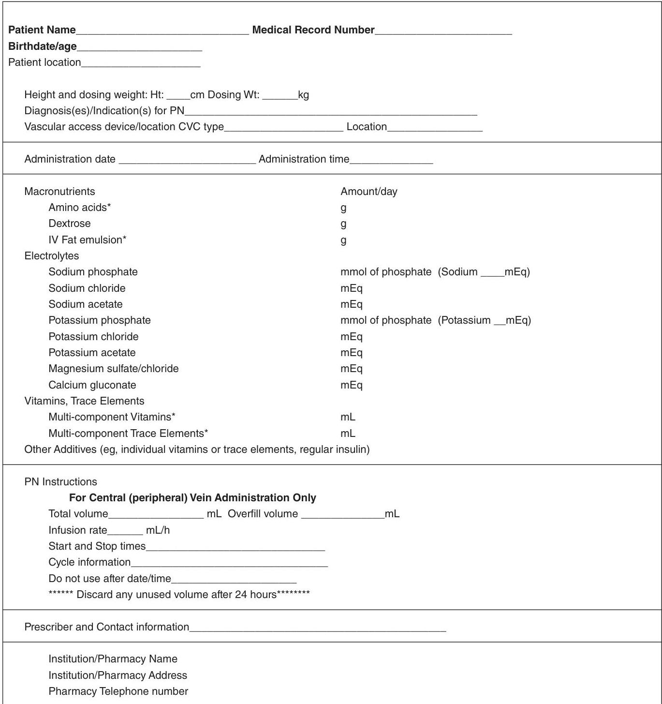
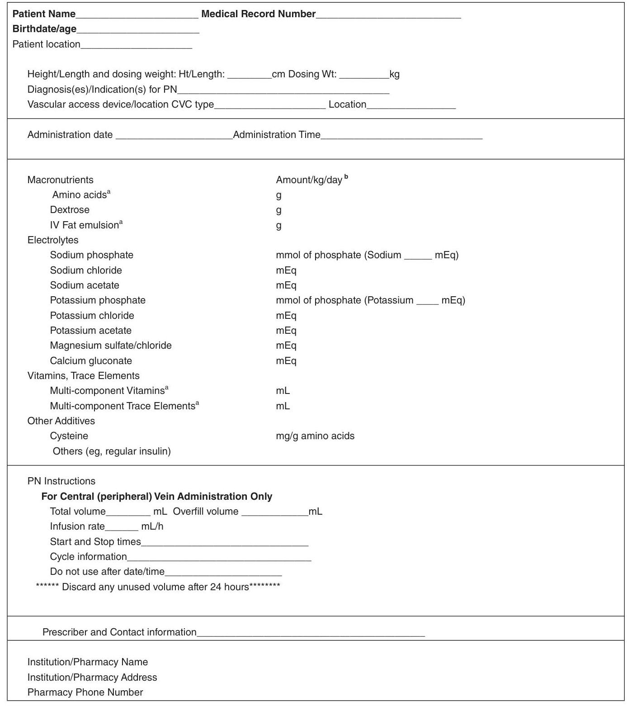
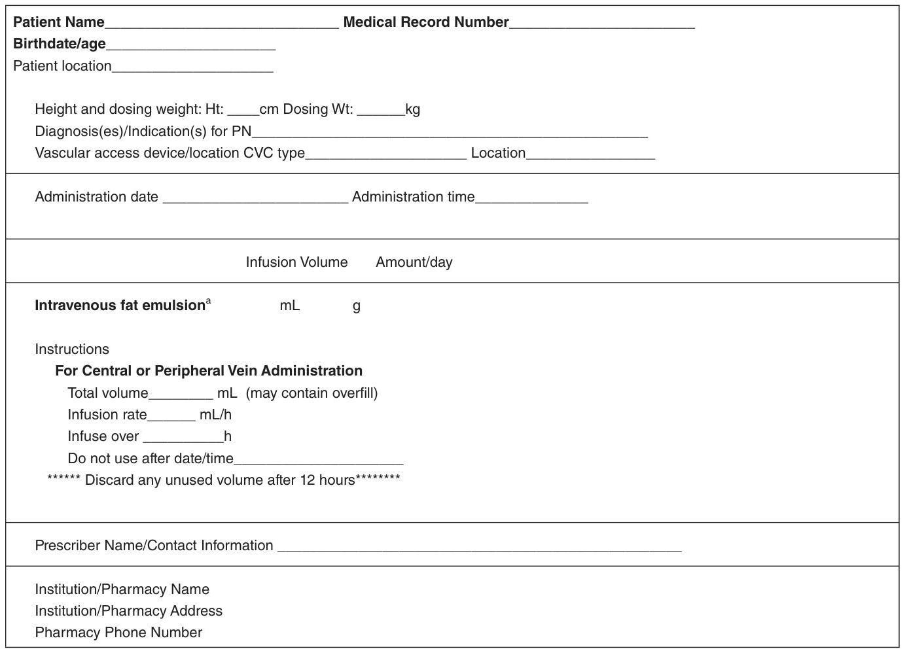
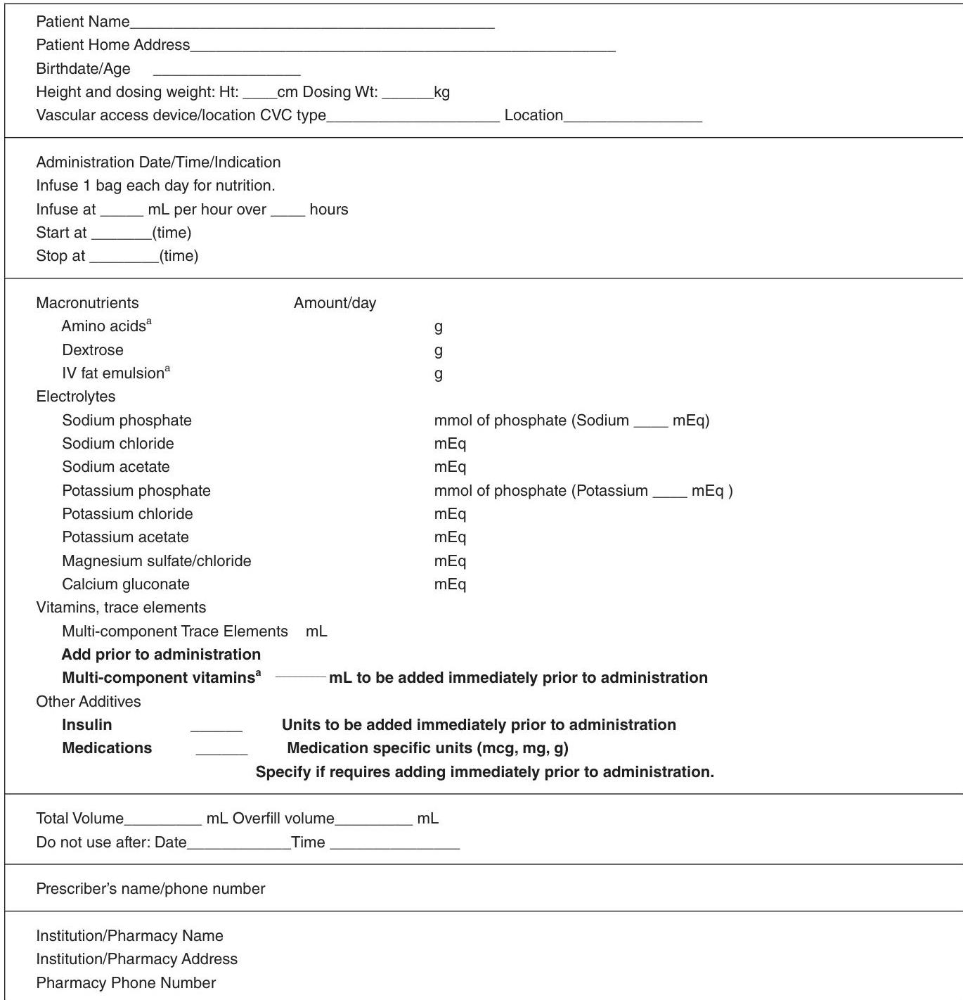

## A.S.P.E.N. Parenteral Nutrition Safety Consensus Recommendations

Phil Ayers, PharmD, BCNSP, FASHP ${ }^{1}$; Stephen Adams, MS, RPh, BCNSP ${ }^{2}$; Joseph Boullata, PharmD, RPh, BCNSP ${ }^{3}$; Jane Gervasio, PharmD, BCNSP, FCCP $^{4}$; Beverly Holcombe, PharmD, BCNSP, FASHP ${ }^{5}$; Michael D. Kraft, PharmD, BCNSP ${ }^{6}$; Neil Marshall, RN, BSN, CRNI, CNSC ${ }^{7}$; Antoinette Neal, RN, CRNI, CNSC, VA-BC ${ }^{8}$; Gordon Sacks, PharmD, BCNSP, FCCP ${ }^{9}$; David S. Seres, MD, ScM, PNS ${ }^{10}$; Patricia Worthington, MSN, RN, CNSC ${ }^{11}$; and the American Society for Parenteral and Enteral Nutrition

Journal of Parenteral and Enteral Nutrition Volume 38 Number 3 March 2014 296-333 (c) 2013 American Society for Parenteral and Enteral Nutrition DOI: $10.1177 / 0148607113511992$<jpen.sagepub.com hosted at online.sagepub.com SSAGE

#### Abstract

Parenteral nutrition (PN) serves as an important therapeutic modality that is used in adults, children, and infants for a variety of indications. The appropriate use of this complex therapy aims to maximize clinical benefit while minimizing the potential risks for adverse events. Complications can occur as a result of the therapy and as the result of the PN process. These consensus recommendations are based on practices that are generally accepted to minimize errors with PN therapy, categorized in the areas of PN prescribing, order review and verification, compounding, and administration. These recommendations should be used in conjunction with other A.S.P.E.N. publications, and researchers should consider studying the questions brought forth in this document. (JPEN J Parenter Enteral Nutr. 2014;38:296-333)

# Keywords 

parenteral nutrition; nutrition; parenteral formulas/compounding; safety

Table of Contents
Introduction ..... 296
Prescribing and Communicating the Parenteral Nutrition Order ..... 298
Parenteral Nutrition Order Review and Verification Process ..... 305
Compounding ..... 318
Parenteral Nutrition Administration ..... 323
Conclusion ..... 333

## Introduction

Parenteral nutrition ( PN ) serves as an important therapeutic modality that is used in adults, children, and infants for a variety of indications. The appropriate use of this complex therapy aims to maximize clinical benefit while minimizing the potential risk for adverse events. Despite being classified and acknowledged as a high-alert medication, ${ }^{1}$ only $58 \%$ of organizations have precautions in place to prevent errors and patient harm associated with PN. ${ }^{2}$ Complications can occur as a result of the therapy and as the result of the PN process. These recommendations are based on practices that are generally accepted to minimize errors with PN therapy. However, the broad range of healthcare settings in which PN administration occurs-from critical care to home care-raises the potential for disparities to
exist in the knowledge and skills of the healthcare professionals responsible for PN prescribing, review, compounding, and administration. Regardless of the setting or the number of patients treated in a given facility, the classification of PN as a high-alert medication requires healthcare organizations to develop evidence-based policies and procedures related to PN.

[^0][^1]
[^0]:    From ${ }^{1}$ Baptist Health Systems, Department of Pharmacy, Jackson, Mississippi; ${ }^{2}$ Vitaline Infusion Pharmacy Services, Geisinger Medical Center, Danville, Pennsylvania; ${ }^{3}$ University of Pennsylvania, School of Nursing, Philadelphia; ${ }^{4}$ Butler University College of Pharmacy and Health Science, Indianapolis, Indiana; ${ }^{5}$ American Society for Parenteral and Enteral Nutrition, Silver Spring, Maryland; ${ }^{6}$ University of Michigan Health System, Department of Pharmacy Services, Ann Arbor; ${ }^{7}$ Walgreens Infusion Services, Sun Valley, California; ${ }^{8}$ Infusion Pharmacy, Cleveland Clinic at Home, Independence, Ohio; ${ }^{9}$ Department of Pharmacy Practice, Harrison School of Pharmacy, Auburn University, Auburn, Alabama; ${ }^{10}$ Division of Preventive Medicine and Nutrition, New York Presbyterian Hospital-Columbia University Medical Center, New York; ${ }^{11}$ Thomas Jefferson University Hospital, Philadelphia, Pennsylvania.

    Received for publication October 3, 2013; accepted for publication October 3, 2013.

    This article originally appeared online on November 26, 2013.

    Corresponding Author:
    Peggi Guenter, A.S.P.E.N., Silver Spring, MD, USA.
    Email: peggig@aspen.nutr.org

--- page 1 ---

Conceptually, the American Society for Parenteral and Enteral Nutrition (A.S.P.E.N.) recommends use of the standardized process, which includes clinicians with expertise in the area of nutrition support. ${ }^{3}$

During the past few years, many circumstances and incidents have threatened the safety of patients receiving PN as an important therapy. In light of the need to revise A.S.P.E.N.'s Safe Practices for Parenteral Nutrition guidelines and to publicly address the safety of PN prescribing, compounding, and delivery, A.S.P.E.N. leaders hosted a multiorganizational safety summit on September 23, 2011. This summit brought together 46 key stakeholders to identify processes to improve the safety of prescribing, preparing, and delivering PN to patients across a variety of healthcare settings. ${ }^{4}$ Findings from this summit guided the A.S.P.E.N. PN Safety Task Force to develop safety consensus recommendations.

In an attempt to answer as many questions about PN safety as possible, this Task Force, in partnership with the A.S.P.E.N. Clinical Practice Guidelines Editorial Board PN workgroup, developed many clinical questions still unanswered in existing documents. The workgroups were divided into two segments, each responsible for specific tasks. The first group developed questions that could be answered with a high level of confidence using the Grading of Recommendations Assessment, Development and Evaluation (GRADE) process (the process by which the A.S.P.E.N. Clinical Guidelines are developed). ${ }^{5}$ The second group developed questions for which the level of evidence in the literature did not support any GRADE-level recommendations, meaning that consensus recommendations would depend on expert opinion. This paper addresses clinical concerns that impact PN safety for which current literature does not provide GRADE-level evidence and provides consensus recommendations for safe PN practice and future research based on expert opinion. These recommendations are not clinical guidelines as defined by A.S.P.E.N. ${ }^{6}$ The need to deliver practice information to clinicians, even when it is of a consensus nature from practice experts, remains an important role of A.S.P.E.N. Redundancies were deliberately built into this document between sections for users who may only view individual sections based on their practice area. Reviewers of this paper included the A.S.P.E.N. Clinical Practice Committee, Dietetics Practice, Medical Practice, Nutrition Support Nurses, and Pharmacy Practice Sections, as well as clinical content experts outside of the organization. This document was also reviewed and approved by the A.S.P.E.N. Board of Directors. The questions to be answered with the Clinical Practice Guidelines GRADE process, listed in Appendix 1, will be addressed by a separate workgroup and published separately. This document should be used in conjunction with those guidelines.

Similar to A.S.P.E.N.'s Standards of Practice documents, the following terminology is used with each recommendation
to indicate the level of evidence and strength of consensus reached for each statement.
"Shall": Indicates that the recommendation is to be followed strictly.
"Should": Indicates that among several possibilities, one is particularly suitable, without mentioning or excluding others, or that a certain course of action is preferred, but not necessarily required.
"May": Indicates a course of action that is permissible within the limits of recommended practice.

The recommendations within this document are intended for discussion and adoption over time by organizations and individual professionals involved in the routine care of patients requiring PN. These recommendations are not intended to supersede the judgment of the healthcare professional based on the circumstances of the individual patient. Although the substantial focus of these recommendations is on institutional settings, many of the safety issues exist across other patient-care settings. Concerns that are unique to home care are also addressed where appropriate. In every clinical setting, it is the responsibility of the prescriber, pharmacist, nurse, dietitian, and nutrition support team to recognize and report all PN-related medication errors, whether or not they reach the patient. This allows the medication safety officer/committee to review and address these events periodically with the committee or individuals having oversight of PN.

## References

1. Institute for Safe Medication Practices. ISMP's list of high-alert medications, 2012. http://www.ismp.org/Tools/highalertmedications.pdf. Accessed May 2012.
2. Institute for Safe Medication Practices. Results of ISMP survey on high alert medications. ISMP Medication Safety Alert! 2012;7(3):1-4.
3. Kochevar M, Guenter P, Holcombe B, Malone A, Mirtallo J; A.S.P.E.N. Board of Directors and Task Force on Parenteral Nutrition Standardization. A.S.P.E.N. statement on parenteral nutrition standardization. JPEN J Parenter Enteral Nutr. 2007;31:441-448.
4. Mirtallo JM, Guenter P. Introduction and goals of the A.S.P.E.N. parenteral nutrition safety summit. JPEN J Parenter Enteral Nutr. 2012;36:7S9S.
5. Druyan ME, Compher C, Boullata JI, et al; A.S.P.E.N. Board of Directors. Clinical guidelines for the use of parenteral and enteral nutrition in adult and pediatric patients: applying the GRADE system to development of A.S.P.E.N. clinical guidelines. JPEN J Parenter Enteral Nutr. 2012;36:77-80.
6. American Society for Parenteral and Enteral Nutrition (A.S.P.E.N.) Board of Directors and Clinical Practice Committee. Definition of terms, style, and conventions used in A.S.P.E.N. Board of Directors-approved documents May 2012. http://nutritioncare.org/Professional_Resources/ Guidelines_and_Standards/Guidelines/2012_Definitions_of_Terms,_ Style,_and_Conventions_Used_in_A_S_P_E_N._Board_of_DirectorsApproved_Documents/ Accessed November 25, 2012.

--- page 2 ---

## Prescribing and Communicating the Parenteral Nutrition Order

## Background

PN is a complex prescription therapy associated with significant adverse effects. Deaths have occurred when safe practice guidelines were not followed. ${ }^{1}$ Appropriate and safe prescribing and ordering of PN is a critical first step and an essential component of the PN use process. The safe prescribing of PN requires a thorough knowledge of protein and energy requirements, macronutrients, micronutrients, fluid homeostasis, and acid-base balance. The prescriber shall be well versed in the appropriate indications for PN , basics in sterility and infection control, as well as vascular access devices (peripheral and central) and their associated complications. Safe prescribing of PN begins with PN-specific interdisciplinary education and institutional policies focused on writing clear PN orders. Furthermore, there shall be clear means of communication among physicians, physician extenders/mid-level providers (eg, nurse practitioners, physician assistants), dietitians, pharmacists, and nurses involved in this process. This section provides guidance and suggestions for healthcare institutions to adopt in order to promote safe prescribing of PN. Many of these recommendations have been adapted from literature of another high-alert therapy: cancer chemotherapy. ${ }^{2-4}$

## Question: Prescribing 1-2 (P1-P2)

(P1) Does a standardized process for PN prescribing increase clarity and reduce PN-related errors? (P2) What are the essential elements of a PN order that minimize errors?

## Recommendations

1. Healthcare organizations shall use a standardized process for PN management, and this process shall include clinicians with expertise in the area of nutrition support, preferably from multiple disciplines. ${ }^{5,6}$
a. Healthcare organizations shall develop written policies and procedures for all aspects of PN therapy in the manner described in the A.S.P.E.N. Safe Practices for Parenteral Nutrition. ${ }^{1}$
b. The patient and caregivers shall be informed of the risks and benefits associated with PN.
c. A comprehensive PN education program and competency assessment shall be developed for healthcare professionals who are involved in the care of patients receiving PN therapy, and competency should be assessed at least annually. ${ }^{4}$
d. Healthcare organizations shall have a written policy addressing credentials, training, and competency certification(s) required of clinicians who prescribe PN. ${ }^{4}$
2. The primary healthcare team, in collaboration with nutrition support professionals, shall evaluate, clearly define, and accurately document the patient's medical problem(s) and indication(s) for PN.
a. The patient shall have an appropriate indication for PN therapy based on published guidelines and evidence for the use of PN , which shall be documented in the medical record. ${ }^{1}$
b. The healthcare team shall confirm that the patient has appropriate intravenous (IV) access for PN prior to prescribing PN therapy. ${ }^{1}$
c. The indication(s) for PN and appropriate IV access shall be included on the PN order (see section 4 and Table 1). ${ }^{1}$
3. The primary healthcare team, in collaboration with nutrition support professionals, shall specify and document the therapeutic goal(s) of PN therapy.
a. Appropriate energy and protein goals shall be determined for the patient's condition based on published guidelines and evidence. ${ }^{1}$
b. Appropriate parameters and frequency of monitoring shall be determined for the patient's condition to assess efficacy, detect and prevent complications, evaluate changes, and document outcomes. ${ }^{1}$
c. Appropriate monitoring parameters for PN shall include fluid requirements, serum electrolyte concentrations, serum glucose concentrations, hepatic function, renal function, serum triglyceride concentrations, and signs or symptoms of vascular access device complications. ${ }^{1}$
d. Therapeutic goals should be established for PN, including end points, response to treatment, and treatment failure.
4. PN shall be prescribed using a standardized PN order format and review process applicable to patients of every age and disease state within a healthcare organization. ${ }^{1,6}$
a. Standardized electronic PN orders (eg, a computerized prescriber order entry [CPOE] system) should be used to prescribe PN for all patients. ${ }^{1,7-9}$ Handwritten orders to prescribe PN should be avoided due to potential for error. Verbal and telephone orders for PN should be avoided.
b. Clinical decision support should be available within electronic PN orders to alert and prevent prescribers from ordering doses of macronutrients, micronutrients, and/or medications that exceed recommended/safe clinical limits or that exceed limits of compatibility (eg, hard limits when maximum concentrations have been exceeded). ${ }^{1,7,8}$

--- page 3 ---

c. When a CPOE system is not available, PN should be prescribed using a standardized order template as an editable electronic document in order to avoid handwritten orders.
d. PN order templates shall be designed so they are clear and easily understood by all healthcare professionals involved in the care of patients receiving PN. ${ }^{1}$
e. Table 1 lists components that shall be included on the PN order. ${ }^{1,4}$
f. All PN order templates should include the required components listed in the sequence in Table 1. This sequence should match the PN labels as well. See Figure 1 and Figure 2 for PN Order Templates.
g. In the event of a product shortage, PN component conservation and allocation strategies should include the A.S.P.E.N. parenteral nutrition shortage considerations for multivitamins, trace elements, IV fat emulsions (IVFE), amino acids, electrolyte/minerals, and cysteine, ${ }^{10-15}$ and the PN order format should be updated accordingly. Multivitamins shall be prescribed daily in PN admixtures. When multivitamin products are not available, thiamine, ascorbic acid, pyridoxine, and folic acid should be prescribed daily. ${ }^{10}$
h. All PN ingredients shall be ordered in amounts per day (eg, for adult patients) or amounts per kilogram per day (eg, pediatric and neonatal patients) rather than in amounts per liter, percent concentration, or volume. ${ }^{1}$ Amount per day refers to macronutrients in grams per day, and micronutrients in mEq, mmol, mcg, or mg per day. Electrolytes shall be ordered as the complete salt form rather than the individual ion. ${ }^{1}$ Each individual macronutrient and micronutrient ordered shall be listed with its corresponding dose. ${ }^{1}$ If available, the total ion amounts and concentrations may be reported or displayed to the prescriber within the PN order.
i. The PN order template in CPOE systems should display current patient monitoring values and their date and time of entry to include parameters such as laboratory values, temperature, weight, etc.
j. The PN order template should contain the full generic name for each ingredient. ${ }^{1,4}$ Proprietary names should only be used when multiple products exist and/or when the proprietary name may assist in identifying unique properties of the specific dosage form (eg, inherent electrolytes in amino acid formulations, fatty acids in IVFE). ${ }^{4}$ Any abbreviations shall follow The Joint Commission standards on abbreviations. ${ }^{4,16}$ Abbreviations on
the Institute for Safe Medication Practices (ISMP) list of error-prone abbreviations, symbols, and dose designations shall not be used. ${ }^{17}$
k. The PN order should include related orders for routine care, laboratory tests, and relevant monitoring parameters. ${ }^{1}$

1. Prescribing a PN formulation that includes nonnutrient medications should be avoided. When no other reasonable alternatives exist, non-nutrient medications shall only be included on the PN order if data support compatibility/stability. ${ }^{1}$
m . Healthcare organizations should develop policies and/or protocols to allow modification of PN orders when potential incompatibilities may exist (eg, incompatibilities associated with calcium and phosphate salts, adjustment of IVFE dosing when it is not expected to be stable as a total nutrient admixture [TNA] [ordering IVFE separately or adjusting IVFE dosing such that the daily dose achieves minimum concentration for stability]). ${ }^{1}$ All PN order modifications shall be communicated to the healthcare team and documented in the medical record. PN orders shall be signed by a licensed prescriber who has been credentialed by the healthcare organization to prescribe PN. ${ }^{4}$
n. PN orders should be prescribed with a time limitation to allow for appropriate patient evaluation at predetermined intervals based on clinical status and required level of care. ${ }^{1-4}$
o. For optimal safety, PN orders should be prescribed and transmitted when supported by properly trained personnel who regularly perform this task. This is usually done during daytime hours. ${ }^{18}$
2. Institutions shall create a home PN order template/format that provides a safe plan for multiple days of therapy. The prescription for home PN therapy should be written in a format that specifically reflects trends in laboratory values and previous days of PN therapy. An institutional daily PN order format should not be used as a home PN prescription.
3. The most appropriate nutrition modality, in collaboration with nutrition support professionals, should be prescribed for the patient. Healthcare organizations should determine the most appropriate types of PN formulation(s) for their patient population(s) (eg, standardized compounded, standardized commercial [premixed] PN products, or customized compounded PN admixtures) or methods of delivery (eg, dextrose/ amino acid vs total nutrient admixtures) and should develop criteria for each formulation that will be used in their patients. ${ }^{19}$

--- page 4 ---

Table 1. Required Components for PN Orders and Preferred Sequence.

# Components for the PN Order 

Patient Information
Patient identifiers (patient name, medical record number or other unique identifiers, birth date/age, patient location)
Patient location (home address for home PN patients)
Allergies and reactions
Height and dosing weight (metric)
Diagnosis(es)/indication(s) for PN
Vascular access device/location
Administration date/time
PN Ingredients (should match PN label)
Amino acids
Dextrose
IVFE
Sodium phosphate
Sodium chloride
Sodium acetate
Potassium phosphate
Potassium chloride
Potassium acetate
Magnesium sulfate or magnesium chloride
Calcium gluconate
Multivitamins
Trace elements
Additives (eg, cysteine, regular insulin) as clinically appropriate and compatible
PN Instructions
Total volume, infusion rate, start and stop times, cycle information
Prescriber and contact information

## Rationale

PN is a complex prescription therapy with many potential safety concerns. The World Health Organization (WHO) advocates a systematic approach to prescribing in order to improve quality and minimize errors. ${ }^{2}$ Pollock and colleagues described considering drug costs and using computer technology when prescribing medications. ${ }^{3}$ These approaches provide an excellent template for the clinician prescribing PN. The A.S.P.E.N. Safe Practices for PN document describes the benefits of using a standardized PN ordering process and recommends components that should be included on a PN order template (mandatory, strongly recommended, and worthy of consideration). ${ }^{1}$ Like PN, chemotherapy is a class of complex prescription medications with critical safety concerns. The American Society of Clinical Oncology and Oncology Nursing Society developed Chemotherapy Administration Safety Standards in the outpatient setting in 2009, ${ }^{20}$ with revisions to expand these to the inpatient setting in 2011. ${ }^{4}$ The concepts in these safety standards are consistent with the A.S.P.E.N. Safe Practices for PN. We recommend that healthcare organizations and clinicians adopt these standards and guidelines when creating policies for ordering/prescribing PN. ${ }^{1-4}$

Standardized order formats for PN incorporating prescriber guidelines can provide education that can lead to reduced prescribing errors, improved efficiency/productivity, and ultimately reduced costs and waste. ${ }^{1}$ In addition, adopting a standardized PN order format designed with ingredients listed in the same sequence may improve consistency, and clarifying orders decreases the risk of errors when patients transition care from one setting to another. The Agency for Healthcare Research and Quality recently reported on a meaningful reduction in errors (from 9 to 2 per 1000 PN orders) at a children's hospital that adopted a standardized ordering and administration process for PN. ${ }^{6}$ Other observations included a reduced need for pharmacists to correct orders, a more efficient ordering and administration process, earlier delivery and administration, and an associated increase in staff satisfaction. ${ }^{6}$

The use of electronic or computerized PN orders can also improve efficiency and safety and reduce errors. Maat and colleagues demonstrated a significant $16 \%$ time reduction for simple and a $60 \%$ time reduction for complex calculations related to PN prescribing in neonates when using a CPOE system with basic clinical decision support. ${ }^{7}$ Brown and colleagues completed a retrospective cross-sectional study evaluating the impact of an interactive computerized PN worksheet on PN-prescribing

--- page 5 ---

Patient Information
Patient name $\qquad$ Medical record number $\qquad$ Birthdate/age
$\qquad$ Patient location $\qquad$ Allergies $\qquad$
Height and dosing weight: Ht: $\qquad$ cm Dosing Wt: $\qquad$ kg
Diagnosis(es)/Indication(s) for PN $\qquad$
Vascular access device/location CVC type $\qquad$ Location $\qquad$
Administration date/time

| Base Formula | Amount/day |
| :-- | :--: |
| Amino acids | g |
| Dextrose | g |
| IV Fat emulsion | g |
| Electrolytes |  |
| Sodium phosphate | mmol |
| Sodium chloride | mEq |
| Sodium acetate | mEq |
| Potassium phosphate | mmol |
| Potassium chloride | mEq |
| Potassium acetate | mEq |
| Magnesium sulfate | mEq |
| Calcium gluconate | mEq |
| Vitamins, Trace Elements, Additives |  |
| Multi-component vitamins | mL |
| Multi-component Trace elements | mL |

Other Additives (eg, individual vitamins or trace elements, cysteine, regular insulin) as clinically appropriate and compatible

PN Instructions
Total volume $\qquad$ mL Infusion rate $\qquad$ $\mathrm{mL} / \mathrm{hr}$, start and stop times $\qquad$
Cycle information
Prescriber and contact information $\qquad$
Figure 1. Parenteral Nutrition Order Template: Adult Patient.
errors. The worksheet was developed using commonly available spreadsheet software (ie, not part of an integrated CPOE system), but still required separate entry and transcription of the PN order. While use of the worksheet was associated with a reduction in the prescribing error rate, all of the errors that did occur were attributed to transcription or data entry mistakes. ${ }^{9}$ Shamliyan and colleagues completed a review of studies to examine the association between computerization of physician orders and prescribing medication orders. ${ }^{8}$ Computerized orders were associated with a $43 \%$ reduction in dosing errors, $37.5 \%$ reduction in adverse drug events, and $66 \%$ reduction in total prescribing errors in adults. ${ }^{8}$ Of the studies included in this review, $80 \%$ reported a significant reduction in total prescribing errors. ${ }^{8}$ While these data are not specific to PN therapy, they do highlight the benefits of CPOE on the medication use process and associated errors and adverse drug events.

The ISMP reported a case of a 16-year-old boy who received a PN order in which the ingredients were ordered in amounts per kg , but the PN admixture was prepared in amounts per day. ${ }^{21}$ This resulted in infusion of a hypo-osmolar PN admixture ( $138 \mathrm{mOsm} / \mathrm{L}$ ) with very low doses of nutrients (eg, protein and dextrose both at $1 \mathrm{~g} / \mathrm{d}$ rather than $1 \mathrm{~g} / \mathrm{kg} / \mathrm{d}$ ) for almost an entire day before it was identified (no adverse effects were incurred by the patient). There were multiple failures across the entire medication use process in this scenario. For example, the PN order template in the CPOE system did not match the template in the pharmacy system/Automated Compounding Device (ACD). Further, there was a lack of clinical decision support and automated warnings in both the CPOE PN order template and the ACD, a lack of redundancies in the process, and multiple points of transcription. ISMP provided several safe practice recommendations ${ }^{21}$ :

--- page 6 ---

Patient Information
Patient name $\qquad$ Medical record number $\qquad$ Birthdate/age $\qquad$
Patient location $\qquad$ Allergies $\qquad$
Height and dosing weight: Ht: $\qquad$ cm Dosing Wt: $\qquad$ kg
Diagnosis(es)/Indication(s) for PN $\qquad$
Vascular access device/location CVC type $\qquad$ Location $\qquad$
Administration date/time

| Base Formula | Amount/kg/day |
| :-- | :--: |
| Amino acids | g |
| Dextrose | g |
| IV Fat emulsion | g |
| Electrolytes |  |
| Sodium phosphate | mmol |
| Sodium chloride | mEq |
| Sodium acetate | mEq |
| Potassium phosphate | mmol |
| Potassium chloride | mEq |
| Potassium acetate | mEq |
| Magnesium sulfate | mEq |
| Calcium gluconate | mEq |
| Vitamins, Trace Elements, Additives |  |
| Multi-component vitamins | mL |
| Multi-component trace elements | mL |
| Other Additives (eg, cysteine, regular insulin) as clinically appropriate and compatible |  |

PN Instructions
Total volume $\qquad$ mL Infusion rate $\qquad$ $\mathrm{mL} / \mathrm{hr}$, start and stop times $\qquad$
Cycle information
Prescriber and contact information $\qquad$

Figure 2. Parenteral Nutrition Order Template: Pediatric/Neonatal Patient.

- Match prescribing and pharmacy templates
- Build, test, and heed automated warnings
- Heighten suspicions of errors
- Carry out effective redundancies
- Provide clear labeling (and the label should always match the PN order template in the PN order form/ CPOE system and the ACD)
- Educate and validate competency
- Eliminate transcription of PN orders

Despite the potential advantages of CPOE, use of CPOE with respect to PN orders appears to be limited. A 2011 survey of PN practices noted that a CPOE system was used for PN orders in only $33 \%$ of the surveyed organizations. ${ }^{22}$ Most recently, Radley et al conducted a systematic review of the literature and derived a summary estimate of the effect of CPOE using a random effects meta-analytic technique. Their pooled analysis revealed that implementing CPOE was associated with a $48 \%$ ( $95 \%$ CI,
$41 \%-55 \%$ ) reduction in medication error rates. They further estimated that as many as 104 million medication errors could be averted annually if all hospitals fully adopted CPOE to process all medication orders. ${ }^{23}$ To the best of our knowledge, only one large commercial Health Information System-Electronic Medical Record/CPOE system provides even rudimentary PN calculation or decision support capability.

## Question: Prescribing 3 (P3)

(P3) What improvements in the physical environment would promote safe PN ordering and use?

## Recommendations

Institutions shall meet the following requirements for the physical environment as described in The United States Pharmacopeial Convention, USP General Chapter $<1066>$ :

--- page 7 ---

1. Illumination: USP $<1066>$ recommends the following lighting levels for healthcare settings ${ }^{24}$ :

Computer order entry
Handwritten order processing
Sterile compounding and preparation
Lux
Medication preparation area
Medication administration work area
1000 Lux
1000 Lux
1000 Lux
1000 Lux
2. Interruptions and distractions: The 2008 USP MEDMARX Data Reports noted distractions rank high (approximately $45 \%$ ) as contributing to medication errors in hospitals and health systems. ${ }^{25}$
3. Sound and noise: The standard for sound levels for medication safety zones is set at 50 decibels A-weighted for sound (dBA), the level of conversation. ${ }^{24}$
4. Physical design and organization of work space: The design of the workplace environment can influence the effectiveness of the prescriber to perform tasks. ${ }^{24}$ USP $<1066>$ promotes ergonomic design of the workplace environment. Factors such as counter height, height of supplies, drawer lighting, and work clutter are noted to influence efficiency as well as safety.
5. Medication safety zones: Defined as a critical area where medications are prescribed, orders are entered into a computer or transcribed onto paper documents, and where medications are prepared, dispensed, or administered. ${ }^{24}$

## Rationale

The process of ordering/prescribing PN is very complex and requires an environment that promotes safety. According to the United States Pharmacopeia (USP), the work environment has been identified as one of the most common reported factors known to contribute to medication errors. ${ }^{24}$ In October 2010, The United States Pharmacopeial Convention published an official bulletin titled Physical Environments That Promote Safe Medication Use, General Chapter <1066>. This chapter focuses on the characteristics of the physical environment that are essential to promoting accurate medication use. ${ }^{24}$ These guidelines provide an excellent resource to promote safe prescribing for the nutrition support clinicians to incorporate into their practice.

## Question: Prescribing 4 (P4)

(P4) How often should the PN prescription be reordered after the initial order?

1. An institution-specific or organization-specific policy should be created to dictate the duration of a PN order.
2. When reordering PN, each PN component should be reordered in its entirety, including full generic names and doses.
3. Patients with newly initiated PN should be monitored and have their orders reviewed more frequently.
4. The reordering process should be structured to require accountability for reviewing the orders, laboratory findings, and patient's condition. Simple processes (eg, a single-step "renew order" button) that lack this accountability should not be used. The following are categories for patients and examples for their corresponding monitoring frequencies:
a. Patients who are new to PN should be monitored daily until stable (more frequently if clinically significant metabolic abnormalities are found or patient is at risk for refeeding syndrome).
b. Patients in an unstable clinical condition (eg, acutely ill, critically ill, recovering from critical illness, recent surgery) should be monitored daily until stable (more frequently if clinically significant abnormalities are observed).
c. Stable patients in the hospital with no required changes in formulation for 1 week should be monitored every 2 to 7 days.
d. Stable patients in a hospital, long-term care, or home setting with no changes in formulation for more than 1 week should be monitored every 1 to 4 weeks or longer in select clinically stable patients.

## Rationale

There are no known studies that examine whether the duration of a PN order or the frequency with which such orders are renewed impacts outcomes or safety measures. However, the collaborative multidisciplinary care approach and application of safe practices guidelines have repeatedly proven to reduce complications, costs, and inappropriate use of PN. ${ }^{26}$ It is reasonable to assume that patients newly initiated on PN, especially those with preexisting electrolyte abnormalities or at risk for refeeding syndrome or with unstable clinical status (such as those newly critically ill or postoperative patients), will require more frequent monitoring. Similarly, patients who have been stable for some time may need less frequent monitoring. Policies regarding the frequency of PN order renewals improve monitoring practices. Protocols for ordering PN may be designed such that laboratory values must be entered or acknowledged prior to submitting the order as is common in home infusion practice. Published guidelines and literature on prescribing should be adopted and reinforced and each healthcare organization shall include clinicians with expertise in the area of nutrition support, preferably from multiple disciplines in the prescribing process. ${ }^{4,6}$

--- page 8 ---

## Question: Prescribing 5 (P5)

(P5) How can education be provided to non-nutrition support specialist clinicians to improve PN prescribing and safety?

## Recommendations

1. Prescribers from all disciplines, including physicians, pharmacists, nurse practitioners, physician assistants, and dietitians, should be educated on basic PN prescribing and monitoring.
2. Introductory didactic and experiential education/training about PN should be included in the core curriculum. Knowledge and skills should be evaluated for all clinicians in each discipline involved with PN as determined by the individual institution. Education and assessment materials and processes shall be developed and led by clinicians with expertise in the area of nutrition support, preferably from multiple disciplines. ${ }^{5,6}$
3. In-depth education on PN should be included as a standard component of acute care and home care pharmacy and physician residency training. This is also applicable to all pharmacists, nurses, dietitians, physicians, physician extenders, and other clinicians involved in caring for patients who receive PN.

## Rationale

There are few known studies evaluating the impact of safe prescribing education programs on the outcomes of patients receiving PN. Interdisciplinary teams, applying education as part of an overall quality intervention, have been successful in reducing unnecessary PN use and decreasing errors. ${ }^{29}$ In general, participating in PN education programs has been associated with improvement in safer prescribing practices. ${ }^{27}$ Such programs are well received by students who perceive a large gap in their training in safe prescribing practices. ${ }^{28-30}$ Safe prescribing, both in general and specific to PN , should be a component of all clinical training, including the core curricula of professional programs (medical, pharmacy, advanced practice nurse prescribers, nursing, nutrition, physician assistant, etc), residency, and specialty/fellowship programs for all who may be engaged in prescribing PN.

## Topics for Further Research

1. Documentation of errors associated with PN prescribing
2. Impact of PN template standardization on PN prescribing and transcription errors
a. Impact of listing PN ingredients in the same format using amounts per day (or amounts per $\mathrm{kg} / \mathrm{d}$ ), using standard units of measure (eg, mEq, mmol)
on PN ordering and transcription errors, especially with transition or transfer of patient care
b. Impact of listing PN ingredients in a standard sequence on PN order forms and whether this can improve communication and reduce PN transcription-related errors, especially with transition or transfer of patient care
3. Impact of electronic PN orders and use of clinical decision support on accuracy and safety of PN therapy
a. Impact of electronic orders and clinical decision support vs handwritten paper PN orders on PN prescribing error occurrence
b. Impact of CPOE interface with ACDs vs no interface vs handwritten or verbal transcription/ communication on PN prescribing and transcription errors
4. Demonstration of improved patient outcomes with incorporation of appropriate monitoring parameters on the PN prescription
5. Impact of a standard commercial PN product (premixed) vs compounded PN formulation on prescribing errors
6. Demonstration of improvement in time to achieve nutrition goals and reduced length of stay with consultation from a nutrition support clinician during the PN ordering process
7. Impact of healthcare organization PN education programs, PN competency assessment, and credentialing/ certification on PN ordering errors and PN safety
8. Impact of PN clinical effectiveness or quality improvement processes on PN prescribing errors

## References

1. Mirtallo J, Canada T, Johnson D, et al; A.S.P.E.N. Board of Directors and Task Force for the Revision of Safe Practices for Parenteral Nutrition. Safe practices for parenteral nutrition [published correction appears in JPEN J Parenter Enteral Nutr. 2006;30:177]. JPEN J Parenter Enteral Nutr. 2004;28:S39-S70.
2. De Vries TP, Henning RH, Hogerzeil HV, Fresle DA; World Health Organization. Guide to good prescribing: a practical manual. http://whqlibdoc.who.int/hq/1994/WHO_DAP_94.11.pdf. Accessed May 20, 2012.
3. Pollock M, Bazaldua O, Dobie A. Appropriate prescribing of medications: an eight-step approach. Am Fam Physician. 2007;75:231-236, 239240 .
4. Jacobson JO, Polovich M, Gilmore TR, et al. Revisions to the 2009 American Society of Clinical Oncology/Oncology Nursing Society chemotherapy administration safety standards: expanding the scope to include inpatient settings. Oncology Nurs Forum. 2012;39:31-38.
5. Kochsvar M, Guenter P, Holcombe B, Malone A, Mirtallo J; A.S.P.E.N. Board of Directors and Task Force on Parenteral Nutrition Standardization. A.S.P.E.N. statement on parenteral nutrition standardization. JPEN J Parenter Enteral Nutr. 2007;31:441-448.
6. Standardized ordering and administration of total parenteral nutrition reduces errors in children's hospital. Agency for Healthcare Research and Quality website. http://www.innovations.ahrq.gov/content.aspx?id=2323. Updated July 17, 2013. Accessed May 20, 2012.

--- page 9 ---

7. Maat B, Rademaker Carin MA, Oostveen MI, et al. The effect of a computerized prescribing and calculating system on hypo- and hyperglycemias and on prescribing time efficiency in neonatal intensive care patients. JPEN J Parenter Enteral Nutr. 2013;37:85-91.
8. Shamliyan TA, Duval S, Du J, Kane RL. Just what the doctor ordered: review of the evidence of the impact of computerized physician order entry on medication errors. Health Serv Res. 2008;43:32-53.
9. Brown CL, Garrison NA, Hutchinson AA. Error reduction when prescribing neonatal parenteral nutrition. Am J Perinatol. 2007;24:417-427.
10. Information to use in the event of an intravenous multivitamin shortageMay 2012: information to use in the event of adult IV multivitamin shortage. American Society for Parenteral and Enteral Nutrition website. http:// www.nutritioncare.org/1content.aspx?id=5346. Accessed August 5, 2013.
11. Information to use in the event of an intravenous amino acids shortageOctober 2010. American Society for Parenteral and Enteral Nutrition website. http://www.nutritioncare.org/Index.aspx?id=5646. Accessed August $5,2013$.
12. Information to use in the event of an intravenous fat emulsion shortageJune 2010. American Society for Parenteral and Enteral Nutrition website. http://www.nutritioncare.org/Professional_Resources/Information_to_ Use_in_the_Event_of_an_Intravenous_Fat_Emulsion_Shortage/. Accessed August 5, 2013.
13. Parenteral nutrition trace element product shortage considerations (5-19-2011). American Society for Parenteral and Enteral Nutrition website. http://www.nutritioncare.org/News/Parenteral_Nutrition_Trace_ Element_Product_Shortage_Considerations/. Accessed August 5, 2013.
14. Parenteral nutrition cysteine product shortage considerations: September, 2011. American Society for Parenteral and Enteral Nutrition website. http://www.nutritioncare.org/Professional_Resources/Guidelines_and_ Standards/Guidelines/PN_Cysteine_Product_Shortage_Considerations/. Accessed August 5, 2013.
15. Holcombe B, Andris DA, Brooks G, Houston DR, Plogsted SW. Parenteral nutrition electrolyte/mineral product shortage considerations. JPEN J Parenter Enteral Nutr. 2011;35:434-436.
16. The Joint Commission. Official "Do Not Use" abbreviations list. Information Management Standard IM 02.02.01.
17. Institute for Safe Medication Practices. List of error-prone abbreviations, symbols, and dose designations. http://www.ismp.org/tools/errorproneabbreviations.pdf. Accessed September 21, 2012.
18. Institute for Safe Medication Practices. Fatal 1,000-fold overdoses can occur, particularly in neonates, by transposing mcg and mg. ISMP Medication Safety Alert! September 6, 2007. http://www.ismp.org/ Newsletters/acutecare/articles/20070906.asp. Accessed June 2012.
19. Gervasio J. Compounding vs. standard commercial parenteral nutrition product: pros and cons. JPEN J Parenter Enteral Nutr. 2012;36:40S-41S.
20. Jacobson JO, Polovich M, McNiff KK, et al. American Society of Clinical Oncology/Oncology Nursing Society chemotherapy administration safety standards. Oncology Nurs Forum. 2009;36:651-658.
21. Institute for Safe Medication Practices. Mismatched prescribing and pharmacy templates for parenteral nutrition (PN) lead to data entry errors. ISMP Medication Safety Alert! June 28, 2012;17(13).
22. Boullata J, Guenter P, Mirtallo J. A parenteral nutrition use survey with a gap analysis. JPEN J Parenter Enteral Nutr. 2013;37:212-222.
23. Radley DC, Wasserman MR, Olsho LEW, et al. Reduction in medication errors in hospitals due to adoption of computerized provider order entry systems. J Am Med Inform Assoc. 2013;20:470-476.
24. USP Chapter <1066> Physical Environments That Promote Safe Medication Use. 2010. The United States Pharmacopeial Convention.
25. Hicks RW, Becker SC, and Cousins DD, eds. USP MEDMARX Data Report: A Report on the Relationship of Drug Names and Medication Errors in Response to the Institute of Medicine's Call for Action. Rockville, MD: Center for Advancement of Patient Safety, U.S. Pharmacopeia; 2008.
26. Boitano M, Bojak S, McCloskey S, McCaul DS, McDonough M. Improving the safety and effectiveness of parenteral nutrition: results of a quality improvement collaboration. Nutr Clin Pract. 2010;25:663-671.
27. Scobie SD, Lawson M, Cavell G, Taylor K, Jackson SH, Roberts TE. Meeting the challenge of prescribing and administering medicines safely: structured teaching and assessment for final year medical students. Med Educ. 2003;37:434-437.
28. Naritoku DK, Faingold CL. Development of a therapeutics curriculum to enhance knowledge of fourth-year medical students about clinical uses and adverse effects of drugs. Teach Learn Med. 2009;21:148-152.
29. Tobaiqy M, McLay J, Ross S. Foundation year 1 doctors and clinical pharmacology and therapeutics teaching: a retrospective view in light of experience. Br J Clin Pharmacol. 2007;64:363-372.
30. Garbutt JM, Highstein G, Jeffe DB, Dunagan WC, Fraser VJ. Safe medication prescribing: training and experience of medical students and housestaff at a large teaching hospital. Acad Med. 2005;80:594-599.

## Parenteral Nutrition Order Review and Verification Process

## Background

PN is a highly complicated therapy administered to patients in hospitals and alternative sites including the home and longterm care facilities. PN formulations may contain more than 40 ingredients, including amino acids, dextrose, IVFE, electrolytes, vitamins, trace elements, insulin, and other medications. PN is considered a high-alert medication because significant patient harm may occur when this therapy is used in error. ${ }^{1,2} \mathrm{~A}$ critical step in the PN process is a pharmacist's review and verification of PN orders. Breaches in the review and verification processes have resulted in errors and patient harm. ${ }^{1}$ Healthcare organizations have the opportunity to improve the safety of PN therapy by optimizing technology for prescribing PN and transmitting PN order information as well as standardizing the PN review and verification processes.

## Question: Verification 1 (V1)

(V1) What are the essential components or attributes for safely transmitting PN orders to pharmacists for review and verification?

## Recommendations

1. PN should be prescribed using a CPOE system that is fully integrated with an automated compounding device (ACD). ${ }^{3}$ "Fully integrated" is described to mean that the order entered into the CPOE system is transmitted electronically to the ACD without requiring reentry of any data and any modifications to an order are electronically transmitted back to the CPOE system for physician approval and signature.
2. When PN formulations are outsourced to a third-party vendor for compounding, PN orders should be prescribed using a CPOE system and electronically transmitted to the vendor to avoid transcription errors.
3. In the absence of a fully integrated system, PN should be prescribed using a standardized order template as an

--- page 10 ---

editable electronic document in order to avoid handwritten orders.
4. Verbal and telephone orders for PN should be avoided except for pharmacist to prescriber communication to modify or clarify the order.
5. PN order data should be in a standardized format, including standardized sequence of ingredients, standard units, standard formulas, and formulation options ${ }^{1}$ as described above in the Questions (P1-P2).
6. If transcription into the ACD is required, the output of the PN order data should be formatted to support direct entry into the ACD without requiring reordering of the ingredients, manual calculations of amounts, or unit-of-measure conversions.
7. Data should only be manually transcribed from the PN order into the ACD when absolutely necessary. Transcribed data should always be double-checked by independent processes to monitor accuracy. ${ }^{4}$ Multiple manual transcriptions of PN order data should be avoided.
8. PN orders should be prescribed, transmitted, and compounded when supported by properly trained personnel who regularly perform this task. ${ }^{5}$ This is usually during the daytime hours.
9. Vendors and application architects for CPOE systems should place priority on developing pathways for prescribing PN that support the prescriber with appropriate clinical decision support (as previously described), enforce standards of practice, and communicate directly with ACDs.
10. Application vendors and application architects for CPOE systems should collaborate with ACD manufacturers to develop fully integrated systems.
11. Application vendors and application architects for CPOE systems should collaborate with ACD manufacturers and outsourcing pharmacies to develop fully integrated systems.

## Rationale

Few healthcare organizations currently use a CPOE system for prescribing PN formulations that is fully integrated with an ACD. While some healthcare organizations use a CPOE system for prescribing PN , the majority continue to use paper order forms to prescribe PN , including handwritten orders. ${ }^{6-8}$ Outsourcing pharmacies receive PN data in a variety of formats, including handwritten forms, which are commonly transmitted to the pharmacy. This may necessitate unit-of-measure conversion calculations, data manipulation, and transcription, which may result in errors. Editable electronic documents allow prescribers to complete orders and avoid the risks associated with handwritten orders. ${ }^{9,10}$ The lack of integration of the PN order with an ACD requires the manual entry of PN order data, which may lead to transcription errors. ${ }^{11}$ A recent survey of PN practices reported that more than half of PN orders are transcribed by a pharmacist from handwritten orders or a printed label or requisition. ${ }^{8}$ Two recent reports from the ISMP describe transcription errors. One was the death of a 6 -weekold infant who received a dose of sodium 60 times the prescribed amount. ${ }^{12}$ The second report describes a PN order data entry error in which nutrients were entered into an incorrect PN template, resulting in a patient receiving a hypotonic PN formulation. ${ }^{3}$ Sacks et al also described a PN system in which PN order data were transcribed from a handwritten order into a hospital pharmacy computer and then reentered into the ACD, thereby increasing the risk for transcription errors. ${ }^{11}$ If the PN process requires transcriptions, limiting the number of times data are entered from one system to another will decrease the risk of data entry errors. PN errors associated with incorrect calculations or converting units of measure have been reported and may result in patient harm. The ISMP reported the death of a neonate who received PN that included zinc at a dose 1000 times the prescribed amount. This error was the result of a calculation error in converting $\mathrm{mcg} / 100 \mathrm{~mL}$ to $\mathrm{mcg} / \mathrm{kg} / \mathrm{d}^{5}$

There are numerous CPOE vendors but few offer templates for prescribing PN that are user-friendly, allow institution-specific customization, or interface with an ACD. Although the number of orders for PN is a small percentage of the total number of medications prescribed, it is one of the most complex and complicated therapies provided by pharmacies. A CPOE system that is fully integrated with an ACD improves the safety of the PN process. ${ }^{5}$

## Question: Verification 2 (V2)

(V2) What improvements in the PN review and verification processes will enhance the safety of PN therapy?

## Recommendations

1. Healthcare organizations shall have a written policy and procedure for pharmacists to review and verify PN orders.
2. The review and verification of PN orders should be conducted in an environment without distractions.
3. PN orders shall be reviewed by a knowledgeable and skilled pharmacist to assess that the order is clear and complete.
4. The PN order shall include the following elements:
a. Complete patient identifiers (patient name, medical record number or other unique identifiers, patient location)
b. Birth date and/or age
c. Allergies and associated reactions
d. Height and dosing weight in metric units
e. Diagnosis/diagnoses
f. Indication(s) for PN
g. Administration route/vascular access device (peripheral vs central)
h. Contact information for prescriber

--- page 11 ---

i. Date and time order submitted
j. Administration date and time
k. Volume and infusion rate

1. Infusion schedule (continuous or cyclic)
m . Type of formulation (dextrose/amino acids with separate infusion of IVFE or total nutrient admixture)
n. All PN ingredients shall be ordered as follows:
2. Ingredients ordered as amounts per day (for adult patients) or amounts per kilogram per day (for pediatric and neonatal patients) rather than in amounts per liter, percent concentration, or volume. "Amount per day" refers to macronutrients in grams per day and micronutrients in $\mathrm{mEq}, \mathrm{mmol}, \mathrm{mcg}$, or mg per day.
3. Electrolytes shall be ordered as the complete salt form rather than the individual ion.
4. The PN order should contain the full generic name for each ingredient. ${ }^{1,13}$ Brand names should only be used when multiple products exist and/or when the brand name may assist in identifying unique properties of the specific dosage form (eg, inherent electrolytes in amino acid formulations, fatty acids in IVFE). ${ }^{1,13}$
5. All abbreviations shall follow The Joint Commission standards on abbreviations. ${ }^{13,14}$ Abbreviations on the ISMP's list of errorprone abbreviations, symbols, and dose designations shall not be used. ${ }^{15}$
o. A dose for each macronutrient
p. A dose for each electrolyte
q. A dose for vitamins, including multivitamins and/ or individual vitamin entities. Multivitamins shall be included daily in PN formulations ${ }^{1,16}$
r. A dose for trace elements, including multicomponents and/or individual trace element entities
s. A dose for each non-nutrient medication (eg, insulin)
6. PN orders shall undergo a clinical review to assess appropriateness and shall include the following elements:
a. Indication is consistent with published guidelines.
b. Calculated osmolarity of the PN formulation is appropriate for the route of administration/vascular access device (peripheral vs central). ${ }^{1}$
c. Each additive macronutrient, micronutrient, nonnutrient medication (eg, insulin) is evaluated to confirm that the dose is clinically appropriate for the patient's nutrition needs, metabolic status, organ function, allergies, concomitant interventions, and other indices, and to confirm that the
dose is consistent with institutional practice standards.
d. The formulation is compared with the previous day's PN formulation, if any, to assess for substantial additions, deletions, increases, or decreases in dosages of macronutrients, micronutrients, or medications (eg, insulin).
e. When laboratory data are available, updated laboratory values that have been reported since the order was submitted should be reviewed for significant changes and, if present, the appropriateness of additive dosing should be reevaluated.
7. PN orders shall undergo a formulation safety review that includes the following elements:
a. All ingredients are evaluated for compatibility with each other. Calcium-phosphate precipitation risk should be assessed according to institutional policies and procedures.
b. PN formulation is evaluated for expected stability from the time of preparation until the time that administration of the PN is complete. For example, emulsion stability of a total nutrient admixture should be evaluated.
8. Healthcare organizations shall develop policies and/or protocols to clarify PN orders when doses are outside normal ranges or potential incompatibilities may exist (eg, adjusting calcium and phosphate doses to avoid the risk of calcium-phosphate precipitation, adjusting the IVFE dose when it is not expected to be stable as a TNA [ordering IVFE separately or adjusting IVFE dosage such that the daily dose achieves minimum concentration for stability]).
9. Modifications to the prescriber's original PN order shall be communicated to the licensed prescriber (or their designee) and documented in the patient's medical record in a manner that is auditable.
10. All PN orders that require transcription of order data should undergo an independent double-check ${ }^{4}$ process prior to compounding the PN formulation. The doublecheck shall be documented and auditable.
11. All PN orders requiring calculations or conversion of units of measure should undergo an independent dou-ble-check ${ }^{4}$ process prior to compounding the PN formulation. All double-checks shall be documented and auditable.
12. Recommendations for pharmacy review of PN orders apply whether the pharmacist reviewing the PN order is on site or at a remote location from the prescriber. The time dedicated for the pharmacist(s) to review PN orders should be based on the average number of PN orders and the estimated time to review, clarify, and/or modify a PN order at an organization.

--- page 12 ---

12. PN orders that are completed in a hospital but outsourced to a third-party pharmacy for compounding and PN orders submitted to home infusion pharmacies should undergo the same standardized pharmacy review and verification process prior to transmission to the pharmacy for compounding.
13. Institutions shall create a home PN order process that provides a safe plan for multiple days of therapy. The prescription for home PN therapy should be written in a format that specifically reflects trends in laboratory values and previous days of PN therapy. An institutional daily PN order format should not be used as a home PN prescription.
14. Pharmacies have the same responsibility of maintaining the PN orders in their records as with other medication orders.
15. The healthcare organization shall develop criteria to evaluate and identify pharmacists who are competent to review and verify PN orders.
a. Pharmacists responsible for the review and verification of PN orders should have completed specialty residency training and/or be certified as a Board Certified Nutrition Support Pharmacist (BCNSP) by the Board of Pharmacy Specialties (BPS).
b. In the absence of pharmacists with specialty residency training or BCNSP certification, the organization should have methods to identify and evaluate pharmacists competent to review and verify PN orders such as the certification program offered by the National Board of Nutrition Support Certification (NBNSC) until such time that a pharmacist with specialty residency training or BCNSP certification is available.
c. In the absence of pharmacists with specialty residency training or BCNSP certification, the organization should provide formal training programs or an opportunity to participate in formal training programs to increase knowledge and skills in nutrition support and with a goal of becoming certified in nutrition support. Training should focus on evaluating dosage of macronutrients and micronutrients as well as prescribing non-nutrient medications (eg, insulin) and their compatibilities and stabilities in PN.
16. Pharmacists who review and verify PN orders should demonstrate competency at least annually.
17. Quality improvement programs should be in place to report, track, and analyze errors associated with the PN order review and verification process.

## Rationale

The review of medication orders, including PN orders, involves many steps in which the pharmacist evaluates the order for safety, efficacy, and appropriateness. These processes require knowledge of PN therapy and formulations; critical thinking and decision making by the pharmacist is crucial, and appropriate allotment of time is necessary. ${ }^{2,17}$ Before any PN formulation is compounded, the PN order is reviewed and verified. Standardizing these processes satisfies that all elements are included and the order is complete. The review and verification of PN orders includes both a clinical review and a pharmaceutical review. The verification is conducted to check that the PN order is complete and that the appropriate vascular access is in place for new patients beginning PN. ${ }^{2}$ Additionally, the clinical review evaluates the appropriateness of the dose of each macronutrient and micronutrient as well as non-nutrient medications in the PN formulation. A pharmaceutical review of PN orders is also conducted to determine if the prescribed components are compatible and if the PN formulation is expected to be stable. ${ }^{2}$

A recent survey of PN practices reported that most institutions ( $60.2 \%$ ) dedicate 0.6 full-time equivalent or more pharmacists to verify and review PN orders. However, $23.1 \%$ did not have any dedicated pharmacist time for these tasks. When a pharmacist is involved, most conduct both a clinical and pharmaceutical review of PN orders. The 2012 survey by the American Society of Health-System Pharmacists of pharmacy practice in hospitals reports that $11.1 \%$ of hospital pharmacies have pharmacists responsible for monitoring patients receiving PN therapy. ${ }^{18}$

The complexity of PN orders necessitates special knowledge and skills to adequately review PN orders. Special training programs focusing on all aspects of the review process, especially the total daily dose of PN components, will improve the review process and heighten the pharmacist's awareness and ability to identify errors. ${ }^{12}$ Identification of errors in turn requires follow-up and/or clarification with the prescriber. In the recent survey of PN practices conducted by Boullata et al, the reasons for PN order clarification included illegible orders, doses outside normal ranges, incompatible additives, and incorrect PN volume or infusion rate. ${ }^{8}$ Errors and patient harm have also occurred when pharmacists misinterpreted information on the PN label when patients transferred from one healthcare setting to another (eg, home to hospital). ${ }^{1}$ Failure to follow and be judicious with the verification and review processes have resulted in adverse events. ${ }^{1,3,5,12}$ Certification in nutrition support validates an individual's qualifications and level of knowledge to practice in this area. ${ }^{19}$ BPS criteria for recognition states that the area of specialization shall be one for which specifically trained practitioners are needed to fulfill the responsibilities of the pharmacy profession in improving the health and welfare of the public, which are responsibilities that may not otherwise be fulfilled effectively. Nutrition support pharmacy practice fulfills that criteria. ${ }^{19}$ In one paper, staff obtained certification in nutrition support and targeted individuals with specialty certification when recruiting for new staff. This resulted in a substantial increase in knowledge and ability of pharmacists to manage the associated complexities of PN. ${ }^{20}$

--- page 13 ---

## Question: Verification 3 (V3)

(V3) What are the steps healthcare organizations can take to improve the PN label and labeling system?

## Recommendations

1. Healthcare organizations shall have a policy and procedure/protocol for standardized labeling of PN formulations.
2. Elements of the PN label include ${ }^{1}$ : (see Figure 3 and Figure 4)
a. Two patient identifiers (eg, name, medical record number, date of birth)
b. Patient location or address
c. Dosing weight in metric units
d. Administration date and time
e. Beyond-use date and time
f. Route of administration (central vs peripheral vascular access)
g. Prescribed volume and overfill volume
h. Infusion rate expressed in $\mathrm{mL} / \mathrm{h}$
i. Duration of the infusion (continuous vs cyclic)
j. Size of in-line filter ( 1.2 or 0.22 micron)
k. Complete name of all ingredients
3. Barcode
m . All ingredients shall be listed in the same sequence and same units of measure as PN order.
O All PN ingredients shall be ordered in amounts per day (for adult patients) or amounts per kilogram per day (for pediatric and neonatal patients) rather than in amounts per liter, percent concentration, or volume. "Amount per day" refers to macronutrients in grams per day and micronutrients in $\mathrm{mEq}, \mathrm{mmol}, \mathrm{mcg}$, or mg per day.
O Electrolytes shall be ordered as the complete salt form rather than the individual ion. Each individual macronutrient and micronutrient ordered shall be listed with its corresponding dose.
O For home or alternative site PN labels, a list of patient/caregiver additives shall be included; these additives shall be easily identified and differentiated from the other PN components. Techniques to identify patient additives include highlighting or an asterisk to identify the additives that are added just prior to administration.
4. Name of institution or pharmacy
5. Institution or pharmacy contact information, including telephone number
6. Auxiliary labels may be used to express individual electrolytes as mEq and the phosphorus content as mmol per day. The label may also include information on the amount of energy provided by each macronutrient or electrolytes intrinsic to the amino acids product.
7. If IVFEs are infused separately (vs TNA), the essential elements of the IVFE label are: (see Figure 5 and Figure 6)
a. Two patient identifiers (name, medical record number, date of birth)
b. Patient location or address
c. Dosing weight
d. Administration date and time
e. Route of administration (central vs peripheral access)
f. Prescribed amount of IVFE and volume required to deliver that amount
g. Infusion rate expressed in $\mathrm{mL} / \mathrm{h}$
h. Duration of the infusion (not longer than 12 hours)
i. Complete name of the IVFE, even though label placed on original manufacturer container
j. Beyond-use date and time
k. Name of institution or pharmacy
8. Institution or pharmacy telephone number
9. Labels for home PN formulations should be consistent with USP General Chapter $<17>$ 21 (See Figure 7)
a. Organize the prescription label in a patient-centered manner.

- Organized in a manner that best reflects how most patients seek out and understand medical information
- Includes only the most important patient information needed for safe and effective understanding
b. Emphasize instructions and other information important to the patient.
- Prominently display information that is critical for patient's safe and effective use of therapy
- At the top of the label, specify the patient's name, drug name (spelling out full generic and brand name), and strength/dose. Include explicitly clear directions for use in simple language
- Directions should follow a standard format so the patient can expect that each element will be in the same regimented order each time the medication is received
c. Simplify language
- Language on the label should be clear, simplified, concise, and familiar, and should be used in a standardized manner. Only common terms and sentences should be used.

--- page 14 ---

- Use simplified, standardized sentences that have been developed to promote ease of understanding the instructions correctly.
d. Give explicit instructions
- Do not use alphabetic characters for numbers.
- Use standardized directions.
- List which PN ingredients must be added by the patient/caregiver.
- Ambiguous directions such as "take as directed" should be avoided unless clear and unambiguous supplemental instructions and counseling are provided.
e. Include purpose for use of PN using clear, simple terms such as "for nutrition supplementation" or "to provide nutrition"
f. Limit auxiliary information
- Auxiliary information should be evidence based in simple explicit language that is minimized to avoid distracting patients with nonessential information.
- Information should be presented in a standardized manner and critical for patient understanding and safe medication use.
- Use only icons for which adequate evidence suggests improved patient understanding about correct use of medication.
g. Address limited English proficiency
- Whenever possible, the directions for use should be provided in the patient's preferred language, otherwise there is risk of misinterpretation of instructions with limited English proficiency, which could lead to medication errors.
- Whenever possible, the directions for use should also appear in English to facilitate counseling.
- Medication names shall be in English so that emergency personnel and other intermediaries can have quick access to the information.
- Translations of prescription labels should be produced using a high-quality translation process.
h. Improve readability
- Labels should be designed and formatted so that they are easy to read.
- Optimize typography using:
- high-contrast print
- simple uncondensed familiar fonts with space within letters and between letters
- sentence case with initial capital followed by lowercase words
- large font size for critical information
- adequate white space between lines of text
- white space to distinguish sections on the label such as directions for use vs pharmacy information
- horizontal text only
- never truncate or abbreviate critical information
- highlighting, bolding, and other typographical cues should preserve readability and should emphasize patient-centric information or information that facilitates adherence
- limit the number of colors used for highlighting
- address visual impairment

## Rationale

PN formulations are complex mixtures with multiple ingredients. The pharmacy-generated label is a critical tool used to compare the PN ingredients and administration information against the PN order. Standardized pharmacy labels for PN formulations provide information in a clear, uniform, and organized manner, and improves the verification processes for pharmacists. ${ }^{1}$ Additionally, the label serves as a final check for those administering the PN , including nurses or patients/caregivers. ${ }^{12,13}$ Listing ingredients in a uniform sequence and units of measure removes the need for calculations and reduces the risk of misinterpretation. The misinterpretation of a PN label resulted in a child receiving an overdose of iron dextran and experiencing subsequent liver toxicity from iron overload. ${ }^{22}$ The lack of standardization has created confusion, especially when patients are transferred from one healthcare environment to another. ${ }^{23}$

## Question: Verification 4 (V4)

(V4) What processes can healthcare organizations implement to improve the safety of PN therapy during shortages of PN components?

## Recommendations

1. Healthcare organizations (including vendors and home infusion providers) shall have a process to communicate PN component shortages and outages to prescribers and staff who participate in providing PN therapy. ${ }^{24}$
2. Healthcare organizations shall develop and approve written PN component substitution protocols to be used in the event of a PN component shortage or outage. ${ }^{24}$
3. Healthcare organizations shall develop and approve written protocols for PN component substitution and/ or conservation strategies to be used in the event of a PN component shortage or outage. ${ }^{24}$

--- page 15 ---

Figure 3. Parenteral Nutrition Label Template: Adult Patient.
*Specify product name.
4. Healthcare organizations have a process to communicate PN component substitution protocols and PN component conservation strategies to prescribers and staff who participate in providing PN therapy. ${ }^{24}$
5. Healthcare organizations have a process to implement PN component substitution protocols and/or PN component conservation strategies to prescribers and staff who participate in providing PN therapy. ${ }^{24}$

--- page 16 ---

Figure 4. Parenteral Nutrition Label Template: Pediatric/Neonatal Patient.
${ }^{a}$ Specify product name.
${ }^{\text {b }}$ Since the admixture usually contains multiple sources of sodium, potassium, chloride, acetate, and phosphorus, the amount of each electrolyte $/ \mathrm{kg}$ provided by the PN admixture is determined by adding the amount of electrolyte provided by each salt.

--- page 17 ---

Figure 5. Standard Intravenous Fat Emulsion Label Template: Adult.
${ }^{a}$ Specify product name.
6. PN component conservation and allocation strategies should include the A.S.P.E.N. PN product shortage considerations for multivitamins, trace elements, IVFE, amino acids, electrolyte/minerals, and cysteine. Thiamine, ascorbic acid, pyridoxine, and folic acid should be given daily. Thiamine is critical. Several deaths have resulted from cardiac failure due to thiamine deficiency when long-term PN patients did not receive vitamins for 3 to 4 weeks. Patients receiving a carbohydrate load are particularly susceptible to thiamine deficiency. ${ }^{16,25-29}$
7. Processes shall be in place to evaluate alternative PN components procured from compounding pharmacies, including compliance with USP General Chapter $<797>$ Pharmaceutical Compounding-Sterile Preparations, federal laws and regulations, and state Boards of Pharmacy rules and regulations.
8. Processes should be in place to modify the PN order to reflect component outages and/or conservation strategies in a timely manner.
9. Processes should be in place to modify the PN label to reflect changes in the PN order due to component outages and/or PN component conservation strategies.
10. Processes should be in place to modify ACD software to reflect changes in PN components due to outages and/or conservation strategies. This includes compatibility of all ingredients and changing National Drug Code (NDC) numbers, which is mandatory for barcoding systems to function correctly. Any changes in ACD software should require two individuals to perform the validation check using a standardized process and checklist.
11. Quality improvement programs should be in place to track and analyze errors associated with PN

--- page 18 ---

Patient Name $\qquad$ Medical Record Number $\qquad$
Birthdate/age $\qquad$
Patient location $\qquad$

Height/length and dosing weight: Ht/length: $\qquad$ cm Dosing Wt: $\qquad$ kg
Diagnosis(es)/Indication(s) for PN $\qquad$
Vascular access device/location CVC type $\qquad$ Location $\qquad$

Administration date $\qquad$ Administration time $\qquad$

Infusion Volume Amount/kg/day

Intravenous fat emulsion ${ }^{a} \quad \mathrm{~mL} \quad \mathrm{~g}$

Instructions
For Central or Peripheral Vein Administration
Total volume $\qquad$ mL (may contain overfill)
$\square$ syringe
$\square$ bottle
Infusion rate $\qquad$ $\mathrm{mL} / \mathrm{h}$
Infuse over $\qquad$ h
Do not use after date/time $\qquad$
${ }^{* * * * * *}$ Discard any unused volume after 12 hours ${ }^{* * * * * * * *}$

Prescriber Name/Contact Information $\qquad$

Institution/Pharmacy Name
Institution/Pharmacy Address
Pharmacy Phone Number

Figure 6. Standard Intravenous Fat Emulsions Label Template: Neonate or Pediatric Patient.
${ }^{a}$ Specify product name.
component outages and shortages. Errors associated with outages and shortages should be reported to the ISMP National Medication Errors Reporting Program.
12. Severe PN component shortage information should be reported to the FDA Drug Shortage Program, ASHP, and A.S.P.E.N.
13. During outage or shortage of PN components, clinicians shall monitor patients for deficiencies. Anticipate an increase in deficiencies with ongoing shortages. Increase awareness and assessment for signs and symptoms of electrolyte and mineral deficiencies.
14. Providers may need to seek out other sources of PN components by coordinating with other healthcare institutions or other infusion companies.

## Rationale

The drug shortage crisis continues in the United States and threatens the integrity of the pharmaceutical supply chain and compromises patient care, especially patients requiring PN
therapy. ${ }^{30}$ The number of new drug shortages has increased over the past 5 years, with the most significant being sterile injectable products.

To assess the effect of drug shortages on patient safety, the ISMP surveyed healthcare professionals. More than 1800 healthcare professionals responded and reported 1000 medication errors or adverse patient events due to a drug shortage. Of those who responded, $35 \%$ reported their institution had experienced a near miss during the past year due to a drug shortage; $25 \%$ reported an actual error, and $20 \%$ reported an adverse patient outcome. ${ }^{31}$ Another drug shortage survey was conducted by Premier Healthcare Alliance. Over 300 pharmacy experts from hospitals and other healthcare sites participated. Shortages that may have resulted in a medication safety issue or error in patient care were reported as having been experienced by $89 \%$ of respondents. ${ }^{32}$

To understand the impact of PN product shortages on patient safety, each step of the PN process should be considered. The steps of the PN process include procurement, management, prescribing, order review, compounding and dispensing,

--- page 19 ---

Figure 7. Standard Home Parenteral Nutrition Label Template: Adult Patient (as an Example).
${ }^{a}$ Specify product name.
administration, monitoring, and patient outcomes. In a recent survey, $16.4 \%$ of respondents reported that patient outcome was directly affected by PN-related product shortages, including nutrient deficits, increased length of stay, and increased morbidity and mortality. ${ }^{8}$ Managing PN product shortages includes activities such as developing and revising policies and
procedures for rationing or restricting PN products, use of alternative products, prescribing systems, and changes in compounding and dispensing as the result of shortages.

PN product shortages may be so critical that prescribers may elect not to provide PN therapy because there are no products to prevent or treat complications. Outsourcing pharmacies

--- page 20 ---

may dictate to customers PN product conservation strategies. Although this is severe, the PN product shortages have resulted in prescribing suboptimal therapy due to shortages or rationing of products. The prescribing step is affected as prescribers find it difficult to keep up with shortages, alternative products, rationing, restrictions, and so on. Furthermore, the prescribing process is constantly changing, and prescribers may use workarounds to circumvent safety checks. Lastly, an increase in the number of prescribing errors has been associated with shortages. ${ }^{30,31}$

Many of the same safety concerns have been identified in the PN order review step. Pharmacists who perform this step have difficulty staying current with shortages, alternative products, and rationing. There has been an increase in the number of PN orders that require clarification or those with prescribing errors.

The compounding and dispensing steps are associated with numerous patient safety issues resulting from PN product shortages. As with other aspects of the PN process, those responsible for compounding and dispensing find it difficult and stressful trying to keep up with the many shortages. During a shortage, alternative products that are unfamiliar or are similar in appearance to other products may be substituted. This may lead to errors. Furthermore, PN may be compounded using alternative products such as calcium chloride or magnesium chloride, for which there are insufficient stability and compatibility data or known unfavorable differences. Frequent changes in PN products or the size of the source containers necessitate a change in the configuration of ACD , increasing the potential for error. Some products cannot be configured for the ACD , requiring a manual addition to a PN formulation. Frequent changes in products, alternative products, ordering process, and ACD configuration may result in PN orders and PN bag labels that do not match. This creates significant concerns for those responsible for the administration of the PN admixture.

The PN product shortages affect the administration of PN whether administered by a nurse, patient, or caregiver. Just like others involved in the PN process, it is difficult and stressful to keep current with the shortages. As noted above, the PN order and PN bag labels may not match as the result of changes in the compounding process. With some shortages, patients may require supplemental electrolyte or mineral infusions when the alternative product cannot be added to the PN formulation due to stability or compatibility concerns. Increasing the number of times the patient's intravascular device is accessed may increase the risk of catheter-related bloodstream infections. ${ }^{30} \mathrm{~A}$ recent study of PN practices reported the consequences of PN product shortages. Of the pharmacists responding, more than two-thirds reported that valuable time is consumed in developing contingencies. Additionally, $70.3 \%$ of respondents indicated that shortages interfere with the ability to meet patients' micronutrient needs, and almost half reported that shortages interfere with ability to meet macronutrient needs. ${ }^{8}$

The lack of a PN component increases the risk of a deficiency of that nutrient or complications. Shortages have been associated with patient harm. Anemia and leukopenia due to copper deficiency has been reported in an adult patient receiving PN without trace elements for 4 months. ${ }^{33}$ Clinicians must have a heightened awareness of potential deficiencies and monitor for the deficiencies or associated complications.

The shortages pose safety risks throughout the entire PN process, from procurement to patient outcomes. Providing PN therapy during product shortages requires vigilance and continuous assessment of the entire PN process to optimize patient care quality and avoid patient harm.

## Topics for Future Research

1. Demonstration of decrease in PN errors when CPOE systems are fully integrated with ACDs.
2. Demonstration of decrease in PN errors with elimination of handwritten paper PN orders and use of editable electronic orders or CPOE systems for prescribing PN.
3. Documentation of PN errors associated with PN verification process.
4. Documentation of PN errors associated with the clinical and pharmaceutical reviews of PN orders.
5. Documentation of PN errors associated with transcription of PN data from the order to an ACD.
6. Impact of PN order standardization on PN data transcription errors.
7. Demonstration of PN error reduction with implementation of standardized review and verification of PN orders.
8. Demonstration of a reduction in PN errors with implementation of a standardized checklist for the verification and review of PN orders.
9. Impact of a fully integrated electronic system for prescribing PN and data into an ACD.
a. Demonstration of medication error reduction
b. Demonstration of improved patient safety
c. Demonstration of decreased costs
10. Documentation of PN errors associated with PN order calculations.
11. Documentation of PN errors associated with misinterpretation of PN bag labeling.
12. Demonstration of PN error reduction with standardized PN labeling.
13. Development and implementation of a standardized home PN label that is consistent with the A.S.P.E.N. Safe Practices for PN and USP General Chapter $<17>$.
14. Evaluation of patient understanding and satisfaction with PN labeling that is consistent with the A.S.P.E.N. Safe Practices for PN and USP General Chapter $<17>$.
15. Demonstration of reduction in PN errors when PN orders are reviewed by a pharmacist with specialty residency training and/or BCNSP certification.

--- page 21 ---

16. Report of successful PN formal training programs for pharmacists and pharmacy technicians.
17. Demonstration of PN error reduction with PN formal training programs for pharmacists and pharmacy technicians.
18. Compatibility of PN components, including macronutrients, micronutrients, and non-nutrient medications.
19. Determination of maximum osmolarity of PN formulations for administration via peripheral veins.
20. Impact of PN product shortages on patient outcomes.

## References

1. Mirtallo J, Canada T, Johnson D, et al; A.S.P.E.N. Board of Directors and Task Force for the Revision of Safe Practices for Parenteral Nutrition. Safe practices for parenteral nutrition [published correction appears in JPEN J Parenter Enteral Nutr. 2006;30:177]. JPEN J Parenter Enteral Nutr. 2004;28:S39-S70.
2. Boullata JI. Overview of the parenteral nutrition use process. JPEN J Parenter Enteral Nutr. 2012;36:10S-13S.
3. Institute for Safe Medication Practices. Mismatched prescribing and pharmacy templates for parenteral nutrition (PN) lead to data entry errors. ISMP Medication Safety Alert! June 28, 2012. Accessed November 25, 2012.
4. Institute for Safe Medication Practices. Independent double-checks: undervalued and misused. ISMP Medication Safety Alert! June 13, 2013. Accessed June 2, 2013.
5. Institute for Safe Medication Practices. 1,000-Fold overdoses can occur, particularly in neonates, by transposing mcg and mg. ISMP Medication Safety Alert! September 6, 2007. Accessed November 25, 2012.
6. O'Neal BC, Schneider PJ, Pedersen CA, Mirtallo JM. Compliance with safe practices for preparing parenteral nutrition formulations. Am J Health-Syst Pharm. 2002;59:264-269.
7. Seres D, Sacks GS, Pedersen CA, et al. Parenteral nutrition safe practices: results of the 2003 American Society for Parenteral and Enteral Nutrition survey. JPEN J Parenter Enteral Nutr. 2006;30:259-265.
8. Boullata J, Guenter P, Mirtallo J. A parenteral nutrition use survey with a gap analysis. JPEN J Parenter Enteral Nutr. 2012;13:212-222.
9. Koppel R, Metlay JP, Cohen A, et al. Role of computerized physician order entry systems in facilitating medication errors. JAMA. 2005;293:1197-1203.
10. Shamliyan TA, Duval S, Du J, Kane RL. Just what the doctor ordered: review of the evidence of the impact of computerized physician order entry on medication errors. HSR Health Serv Res. 2008;43:32-53.
11. Sacks GS, Rough S, Kudsk KA. Frequency and severity of harm of medication errors related to the parenteral nutrition process in a large university teaching hospital. Pharmacotherapy. 2009;29:966-974.
12. Institute for Safe Medication Practices. Another tragic parenteral nutrition compounding error. ISMP Medication Safety Alert! April 21, 2011. Accessed November 25, 2012.
13. Jacobson JO, Polovich M, Gilmore TR, et al. Revisions to the 2009 American Society of Clinical Oncology/Oncology Nursing Society Chemotherapy Administration Safety Standards: expanding the Scope to Include Inpatient Settings. Oncology Nurs Forum. 2012;39:31-38.
14. The Joint Commission. Official "Do Not Use" abbreviations list. Information Management Standard IM 02.02.01.
15. Institute for Safe Medication Practices. List of error-prone abbreviations, symbols, and dose designations. http://www.ismp.org/tools/errorproneabbreviations.pdf. Accessed January7, 2013.
16. Information to use in the event of an intravenous multivitamin short-age-May 2012: information to use in the event of adult IV multivitamin shortage. American Society for Parenteral and Enteral Nutrition website. http://www.nutritioncare.org/lcontent.aspx?id=5346. Accessed January 6, 2013 .
17. Meyer LD, Raymond CB, Rodrigue CM. Development and evaluation of a checklist for medication order review by pharmacists. Can J Hosp Pharm. 2011;64:199-206.
18. Pedersen CA, Schneider PJ, Scheckelhoff DJ. ASHP national survey of pharmacy practice in hospital settings: monitoring and patient education-2012. Am J Health-Syst Pharm. 2013;70:787-803.
19. Durfee SM. Pharmacist specialty certification. JPEN J Parenter Enteral Nutr. 2012;36(2)(suppl):51S-52S.
20. Boitano M, Bojak S, McCloskey S, McCaul DS, McDonough M. Improving the safety and effectiveness of parenteral nutrition: results of a quality improvement collaboration. Nutr Clin Pract. 2010;25: $663-671$.
21. USP General Chapter $<17>$ Prescription Container Labeling. 2012. The United States Pharmacopeial Convention.
22. Iron overdose due to miscommunication of TPN order: error alert. Pharmacy Today. September 1995.
23. Carey LC, Haffey M. Incident: home TPN formula order misinterpreted after hospital admission. Home Care Highlights. Spring 1995:7.
24. The Joint Commission. Medication Management Standard MM. 02.01. 2012.
25. Information to use in the event of an intravenous amino acids shortage. American Society for Parenteral and Enteral Nutrition website. http:// www.nutritioncare.org/Index.aspx?id=5646. Accessed January 6, 2013.
26. Information to use in the event of an intravenous fat emulsion shortageJune 2010. American Society for Parenteral and Enteral Nutrition website. http://www.nutritioncare.org/Professional_Resources/Information_to_ Use_in_the_Event_of_an_Intravenous_Fat_Emulsion_Shortage/. Accessed January 6, 2013.
27. Parenteral nutrition trace element product shortage considerations (5-19-2011). American Society for Parenteral and Enteral Nutrition website. http://www.nutritioncare.org/News/Parenteral_Nutrition_Trace_ Element_Product_Shortage_Considerations/. Accessed January 6, 2013.
28. Holcombe B, Andris DA, Brooks G, Houston DR, Plogsted SW. Parenteral nutrition electrolyte/mineral product shortage considerations. JPEN J Parenter Enteral Nutr. 2011;35:434-436.
29. Parenteral nutrition cysteine product shortage considerations-September, 2011. American Society for Parenteral and Enteral Nutrition website. http://www.nutritioncare.org/Professional_Resources/Guidelines_and_ Standards/Guidelines/PN_Cysteine_Product_Shortage_Considerations/. Accessed January 6, 2013.
30. Holcombe B. Parenteral nutrition product shortages: impact on safety. JPEN J Parenter Enteral Nutr. 2012;36:44S-47S.
31. Institute for Safe Medical Practices. Drug shortages: national survey reveals high level of frustration, low level of safety. ISMP Medication Safety Alert! 2010;15(19):1-4. http://www.ismp.org/newsletters/acutecare/articles/20100923.asp. Accessed September 2, 2012.
32. Cherici C, Frazier J, Feldman M, et al. Navigating drug shortages in American healthcare: a premier healthcare alliance analysis. Premier drug shortage white paper. http://www.premierinc.com/about/news/11-mar/ drug-shortage-white-paper-3-28-11.pdf. Accessed September 4, 2012.
33. Pramyothin P, Kim DW, Young LS, Wichansawakun S, Apovian CM. Anemia and leukopenia in a long-term parenteral nutrition patient during a shortage of parenteral trace element products in the United States. JPEN J Parenter Enteral Nutr. 2013;37:425-429.

--- page 22 ---

## Compounding

## Background

Recent PN errors caused by a knowledge deficit, lack of training, insufficient competency, and poor proficiency with ACDs are areas of significant concern. Additionally, a lack of competency-based educational curriculum in schools of pharmacy or pharmacy technician training programs may contribute to PN errors. Very few suitable studies exist that characterize the formalized training of pharmacy students or technicians in the preparation of sterile products and admixtures. Available data suggest that when pharmacy students are formally taught aseptic technique skills with direct observation and assessment of parenteral compounding procedures, microbial contamination rates related to medium-risk level compounding (eg, PN compounding) decreased significantly from baseline toward the end of the 16 -week course. ${ }^{1}$ Several recommendations pertaining to the knowledge and competency of staff involved in the preparation of compounded sterile products were developed at the recent ISMP Sterile Preparation Compounding Safety Summit. ${ }^{2}$ Surveys of pharmacists at the beginning of postgraduate training programs demonstrated that first-year pharmacy residents reported minimal experience (median $=2$ ) on a scale from 1 to 5 ( 5 , most experience and 1 , no experience) with PN evaluations and IV admixtures. This suggests that there are educational deficits in current pharmacist training related to areas important for institutional or homecare pharmacy practice. ${ }^{3}$ Observational data from practicing hospital pharmacists and pharmacy technicians revealed that compounding error rates were $37 \%$ when PN formulations were manually compounded and $22 \%$ when prepared with an ACD. Errors included touch contamination, incorrect calculations performed by technicians, and bypassing the built-in safety check systems on ACDs. ${ }^{4}$

## Question: Compounding 1-2 (C1-C2)

(C1) What compounding errors have been caused by deficits in knowledge, lack of training, competency, and proficiency?
(C2) What compounding errors have been caused by a lack of standardized educational curriculum in schools of pharmacy or pharmacy technician programs?

## Recommendations

1. Schools of pharmacy in the United States shall develop curricula that address proper aseptic technique and USP Chapter $<797>$ for making compounded sterile preparations (CSPs).
2. Pharmacy technicians shall be certified by the Pharmacy Technician Certification Board if they are involved in the making of CSPs, including PN.
3. Healthcare organizations shall provide a broad orientation with an in-depth training program focusing on CSPs for all staff members supervising or participating in the preparation process. An ongoing competency assessment program shall be included in the training as well.
4. Healthcare organizations shall require annual competency evaluations of pharmacists and pharmacy technicians involved in preparation of CSPs. This should include:
a. Calculations
b. Compounding base solutions
c. Preparing dilutions or aliquots
d. Aseptic technique manipulations
e. Using technology (ie, ACD) for preparation
f. Anticipating incompatibilities (calcium, phosphate)
5. Organizations should develop a strategic plan for implementation of automation and technology for the sterile products service.
6. Pharmacists and pharmacy technicians shall be proficient in the proper use of technology (ie, ACD) when used for preparation of CSPs.
7. State Boards of Pharmacy should create a specific license and licensing requirements for infusion pharmacies and compounding pharmacies.
8. State Boards of Pharmacy should provide an in-depth training program focusing on CSPs for all State Board inspectors. An ongoing competency assessment program should be included in the training as well.

## Rationale

The lack of standardized training emphasizing foundational concepts behind sterile compounding and aseptic technique is startling in today's professional programs educating both pharmacists and pharmacy technicians. Over the past 5 years, numerous reports of serious morbidity and mortality have appeared in the lay press due to a lack of training in aseptic technique with preparation of sterile products. The most recent tragic events have surrounded a rare outbreak of fungal meningitis that was traced to several lots of the injectable glucocorticoid methylprednisolone acetate compounded by the New England Compounding Center. Although these sterile injections were intended for back and joint pain, a lack of sterile compounding competency has sickened hundreds of patients and killed dozens. ${ }^{5}$ Even more relevant are the 9 deaths that occurred in Alabama during the preparation of amino acids under high-risk conditions and an error in sterile compounding technique. It is incumbent on pharmacists to check that all people involved in the oversight and preparation of CSPs obtain appropriate training and be evaluated on a regular basis through a competency assessment. Pharmacists would receive education in the physicochemical principles of pharmacy and practice experiences as part of a pharmacy school curriculum. Technicians would receive education in the operations of ACD hardware and software with varied practice experiences as part of the curriculum. Board certification for those involved in CSPs could guarantee a basic minimum requirement in lieu of

--- page 23 ---

formalized training as part of a curriculum. The criteria required for nutrition support pharmacy board certification would suggest that these individuals are better prepared to allow fewer errors, although no data are available to support this contention. Anecdotal data would suggest that pharmacists and pharmacy technicians with specific education and many hours of hands-on experience are in the best position to be involved with PN compounding. In the workplace, pharmacists and technicians should participate in a comprehensive orientation and training program with an ongoing competency assessment plan. ${ }^{2}$ This plan would evaluate all aspects of sterile compounding from calculations to the proper use of technology.

## Question: Compounding 3 (C3)

(C3) How can organizations avoid PN errors by implementing soft and hard limits on an ACD?

## Recommendations

1. Organizations shall implement specific computerized soft limits and hard (catastrophic) limits for PN ingredients based upon pharmacists' review that are consistent with the needs of their patient population.
2. Access to the ACD database is limited to select individuals qualified to manage and maintain this activity and all changes are traceable. Pharmacists and technicians shall be educated on interpretation and limitations of calcium-phosphate compatibility curves in the software.
3. Weight-based warning limits for doses shall be developed by clinicians with the assistance of the vendors. As an alternative, organizations may develop and use their own weight-based warning limits.
4. Only pharmacists shall be allowed to override alerts. An independent double-check process should be completed by another pharmacy staff member, ideally another pharmacist. ${ }^{2}$
5. Healthcare organizations should check that all unresolved ACD alerts encountered during the PN order entry process should be presented to the person reviewing the order entry so they can also view and respond to the alerts.
6. Healthcare organizations shall reinforce the importance of reacting to the ACD alerts and documenting all interventions.
7. Healthcare organizations should review available reports detailing the frequency of overrides as well as the frequency of overrides for specific PN components.

## Rationale

Limits can be placed on the doses of each PN component to optimize safety within the compounding process. These limits
can be automated within the PN order-prescribing, reviewing, and/or compounding process. The term "hard limits" refers to alerts that indicate that a component is outside a determined safe range and shall not be exceeded; these are also referred to as "catastrophic" given patient outcomes if exceeded. ${ }^{2}$ "Soft limits" refer to alerts that indicate an unusual dose that requires further evaluation. Once addressed, any alert that is overridden or any dosing that is revised will require documentation of the rationale. Compared with manual methods, the software application available with ACDs should lead to improved compounding accuracy, enforcement of proper compounding sequence, and a reduction in opportunities for human touch contamination. However, preparing PN admixtures with an ACD is not an error-free process. Error rates in compounding complex preparations such as PN admixtures have been reported to be $22 \%$ when automated in part and $37 \%$ when manually prepared. ${ }^{6}$ Organizations may improve the safety of using PN compounding systems by requiring that all doses being compounded pass through an order entry/clinical decision support system and by ensuring that those systems' clinical decision support features are properly enabled and configured. Transcription of PN order data from an order-calculating software package into a compounding device should be avoided. In a recent survey on PN use, Boullata et al found that dose limit warnings were active in only two-thirds of organizations that used ACDs for preparing PN formulations. ${ }^{7}$ ISMP Medication Safety Alerts from 2007 and 2011 described incidents in which adverse outcomes resulted, in part, from the absence of dose limit warnings. ${ }^{8,9}$ In both instances, infants received lethal doses of a micronutrient (zinc in one case, sodium in the other) when a manual order entry error was either not detected by the existing dose limits or dose limit alerts were not active. After reviewing the incidents, ISMP made a number of safe practice recommendations. Among these was the recommendation to install, test, and maximize automated dose-limit warnings in the pharmacy computer system and the ACD order entry system, particularly for high-alert medications such as PN and its ingredients. Further, ISMP recommends that each organization develop weight-based dosing limits applicable to their patient populations, as ACD vendorestablished "catastrophic" limits may still allow entry of a potentially fatal dose into the software without issuing a warning. ${ }^{8,9}$

The ASHP guidelines on the safe use of ACDs for the preparation of PN admixtures state that the pharmacy department should develop a monitoring and surveillance plan that promotes safe and efficacious use of the device at all times. ${ }^{10}$ This plan should include a review of dose-limit alerts and overrides, utilizing the reporting capabilities of the ACD or pharmacy computer system.

DeBoer and Maddox described a review of smart pump data after implementation throughout the Sanford USD Medical Center. ${ }^{11}$ Three to six months of smart pump data were collected for each unit and an analysis of edit variance detail and override variance detail was performed. After the initial review

--- page 24 ---

was completed, data were analyzed for medications included in the ISMP high-alert medication list. Work practices were evaluated and revised with the goal of encouraging fewer edits and overrides. In a similar fashion, data from the ACD or pharmacy computer system should be regularly reviewed in the assessment of trends and other long-term measures of performance.

## Question: Compounding 4 (C4)

(C4) What role does United States Pharmacopeia (USP) Chapter $<797>$ play in preventing PN errors?

## Recommendations

1. Healthcare organizations shall comply with USP Chapter $<797>$ standards. ${ }^{12}$
2. Outsourcing should be considered as an alternative to in-house compounding when the healthcare organization does not possess the technological resources or staffing to prepare PN admixtures according to USP Chapter $<797>$. The decision to outsource should require that the pharmacy outsourcing PN production exercise due diligence to monitor that the outsourcer also operates within USP $<797>$ guidelines.
3. Standardized, commercially available PN products may be viable options to manually compounded sterile PN products when compliance with USP Chapter $<797>$ and accepted guidelines from patient safety organizations is not feasible.
4. Healthcare organizations shall have policies and procedures that address using multichamber, standardized, commercial PN products within their formulary.
5. Healthcare organizations shall have well-defined policies and procedures that guide the preparation of PN admixtures.
6. Healthcare organizations must identify standardized workflow processes that include quality control, process change control, and documentation practices. These standardized operating procedures should encompass the entire compounding process from order entry to verification of the final labeled product.
7. Healthcare organizations should develop a strategic plan to include technology/automation for sterile compounding and consider using IV workflow software. ${ }^{2}$
8. When an ACD is used to prepare PN admixtures, policies and procedures shall be developed that address performance requirements and responsibilities, control of the ACD in daily operations, safety and efficacy features, quality assurance monitoring and documentation, storage and inventory, education and training, and device variability and maintenance.
9. Privileges to make changes in the ACD database shall be restricted to a limited number of pharmacy staff who are well trained in both the theory and the mechanics of this process. ${ }^{2}$
10. Customized order entry templates created by organizations should have a documented standard review process by qualified staff person that includes review and testing of the clinical decision support that is expected to alert the pharmacist to significant warnings. The use of a checklist or sign-off sheet shall be required and two staff members, including at least one pharmacist, shall sign off on or validate the template. ${ }^{2}$
11. The additive sequence in compounding shall be optimized and validated as a safe and efficacious method. Manufacturers of ACDs shall provide an additive sequence that promotes the safety of the compounding device. This compounding sequence should be reviewed with the manufacturer of the PN products used by the organization. ${ }^{13}$
12. The use of a checklist or signoff sheet shall be required when adding new products, including new and alternative generics, changes in vial size or concentration, and when making other modifications to the ACD database (eg, changes in privileges, changes in data requirements). Two staff members shall be required to sign off on or validate changes. (This process would not apply to inputting a new lot number for a product already in the database. $)^{2}$
13. Barcode verification shall be used to verify product identity during ACD setup and replacement of ingredients. ${ }^{2}$
14. An independent double-check process for the initial daily ACD setup shall be performed by two staff members using a printed checklist. Verbal affirmation should take place to validate placement of all additives and base solutions, including name, concentration, and container size. ${ }^{2}$ When the vendor of the compounding system describes a validated system for proper setup, that system should be followed.
15. Tubing set(s) shall be traced from the source container to the port where it is attached during the initial daily ACD setup and with each change in the source container. ${ }^{2}$
16. If multiple containers of a single additive are used during the preparation of a single CSP, all empty containers shall be presented to the pharmacist and verified as part of the final check process prior to dispensing the final CSP. ${ }^{2}$
17. When an ACD is used, it should deliver all ingredients. Manual compounding should only be used:
a. If the volume of a PN component to be mixed is less than the ACD can accurately deliver.
b. If there is an interaction between a PN component and a component of the ACD (eg, insulin and tubing).
c. If there is a chemical interaction between PN components that cannot be mitigated by sequencing the addition of ingredients.
d. During a shortage of a specific PN component, manual compounding can be a consideration as part of conservation efforts.

--- page 25 ---

18. Verification of manual additives should include inspection of the actual vials and syringes that contain the additives. ${ }^{9}$ Proxy methods of verification (eg, syringe pullback) shall not be used. ${ }^{2}$
19. If the manual method is being used, the process should be standardized to promote safety and efficacy. ${ }^{13}$ The use of a checklist or sign-off sheet shall be incorporated into the manual process.
20. PN orders should be prescribed, transmitted, and compounded when supported by properly trained personnel who regularly perform this task. ${ }^{9}$ This is usually during the daytime hours.
21. In facilities that care for adult, pediatric, and neonatal patients, the preparation of CSPs for each population shall be separated by time or location. Separation strategies can include the use of different colored bins for assembling products to be prepared. ${ }^{2}$
22. At least three verification processes should occur in the pharmacy: (1) after initial order entry of PN, (2) before manually injecting additives into the PN, and (3) once the PN has been compounded. ${ }^{9}$ In-process or end-product testing requires that the PN preparation be held pending results. It may be better to fully automate and validate the entire PN compounding process to prevent errors from being made in the first place.
23. Organizations should develop a drug conservation policy that addresses the handling and disposition of PN components (while maintaining their integrity and sterility) that may be in short supply due to market conditions, as these shortages can affect workflow conditions.
24. The physical environment in which PN compounding takes place should be assessed in terms of lighting, interruptions and distractions, sound and noise, ergonomics, and medication safety zone. USP General Chapter $<1066>$ describes optimal physical environment standards that promote safe medication use throughout the medication-use process. ${ }^{14}$ Any deficiencies should be addressed following organizational chain of command.
25. Once a standardized process for compounding PN has been implemented, organizations should review and revise the process on an annual basis along with a review of personnel compounding behavior.
26. Operation of the compounding process must be routinely observed for procedural compliance and corrective action must be taken immediately if noncompliance is observed.

## Rationale

An ASHP national survey of pharmacy practice in hospital settings published in 2012 found that overall, $65 \%$ of hospital pharmacy departments reported having a United States Pharmacopeia (USP) Chapter <797> compliant cleanroom. ${ }^{15}$ Having a USP Chapter <797> compliant cleanroom differed significantly by hospital size, with more than $87.5 \%$ of the largest hospitals ( 600 or more staffed beds) having a compliant cleanroom, compared with $48.1 \%$ of hospital pharmacy departments in hospitals with fewer than 50 beds. Commercially available PN multichamber bags were used by $36 \%$ of hospitals as the predominant form of PN formulation. ACDs were used by $20.4 \%$ of hospitals, followed by gravity methods ( $17.4 \%$ ) and outsourcing compounding activities ( $14.6 \%$ ); $11.6 \%$ of hospitals did not prepare PN formulations. The method of preparing PN differed significantly by hospital size. Larger hospitals most commonly used ACDs or outsourced preparations. Hospitals with fewer than 50 staffed beds most commonly used commercially available dextrose/amino acid formulations or TNA did not prepare any PN admixtures or used gravity methods to prepare PN. ${ }^{15}$

Organizations should refer to a number of available guidelines and articles regarding standardization of the PN compounding process (see Table 2). Organizations compounding PN admixtures must have well-defined policies and procedures to guide each step of preparation and shall comply with standards set forth in USP Chapter $<797>. .^{2}$ Compounding PN "as usual" is no longer acceptable if it does not comply fully with USP Chapter $<797>. .^{18}$ Error rates in compounding complex preparations such as PN admixtures have been reported to be $22 \%$ when automated in part and $37 \%$ when manually prepared. ${ }^{6}$ Error rates of $24 \%$ in PN preparation were identified in a prospective observational study. ${ }^{19}$ Compounding errors that result in an unexpected patient event occur in $30 \%$ of hospitals. ${ }^{6}$ The USP chapter that describes the compounding of sterile preparations provides minimum practice and quality standards based on current scientific information and best sterile compounding practices. ${ }^{12}$ Organizations that are unable to comply with USP Chapter $<797>$ and accepted guidelines from patient safety organizations should consider alternative compounding options such as outsourcing or standardized commercially available PN products.

Policies that require prescribers to order PN daily before a specified deadline should be established and enforced to maximize the safety with which these admixtures are prepared and dispensed. Pharmacy staff should be aware of all patients who are receiving PN and check if orders have not been received by the established deadline. PN ingredients considered to be very small volumes that staff manually prepare, check, and inject require verification, including inspection of the vials and syringes containing such additives. Verification of manual additives should include inspection of the actual vials and syringes that contain the additives. Proxy methods of verification such as the syringe pull-back method of verification should not be used in the preparation of PN and other highalert CSPs and shall not be used without the presence of the actual original source containers (medication and diluent). ${ }^{2}$

--- page 26 ---

Table 2. Documents Discussing the Standardization of the Parenteral Nutrition Preparation Process.

| Source Title | Publisher | Publication Year | Reference Number |
| :--: | :--: | :--: | :--: |
| USP Chapter <797> - "The objective of this chapter is to describe conditions and practices to prevent harm, including death, to patients that could result from the following: (1) microbial contamination (nonsterility), (2) excessive bacterial endotoxins, (3) variability in the intended strength of correct ingredients that exceeds either monograph limits for official articles (see 'official' and 'article' in the General Notices and Requirements) or $10 \%$ for nonofficial articles, (4) unintended chemical and physical contaminants, and (5) incorrect types and qualities of ingredients in Compounded Sterile Preparations (CSPs)." | USP | 2006 | 12 |
| ISMP Sterile Preparation Compounding Safety Summit Proceedings | ISMP | 2013 | 2 |
| A.S.P.E.N. Statement on Parenteral Nutrition Standardization | A.S.P.E.N. | 2007 | 16 |
| ASHP guidelines on the safe use of automated-compounding devices for the preparation of parenteral nutrition admixtures. | ASHP | 2000 | 10 |
| Safe Practices for Parenteral Nutrition | A.S.P.E.N. | 2004 | 13 |
| Compounded vs standardized commercial parenteral nutrition products: A.S.P.E.N. Parenteral Nutrition Safety Summit | A.S.P.E.N. | 2012 | 17 |

[^0]Independent double-checks should be incorporated into the compounding process. At least three verification processes should occur in the pharmacy: (1) after initial order entry of PN, (2) before manually injecting additives into the PN, and (3) once the PN has been compounded. Each step in the verification process should require a pharmacist to compare the actual prescriber's order to the printed labels, and the printed labels to the additives and final product, as appropriate. Verification of manual additives should include inspection of the actual vials and syringes that contain the additives. The final verification of the compounded PN should include a comprehensive review of the PN order, the label on the product and the compounding work label, and a visual inspection of the CSP. Quality control checks and verification of replacement components on the compounder either manually or via barcoding should also be required, as should an independent doublecheck of any calculations. ${ }^{9}$

PN multichamber bags, which are designed to reduce the risk for instability or precipitation, are available. These multichamber bags separate components of the PN formulation with a bar or seal until just prior to activation and administration. The contents of the chambers should be mixed and any additives introduced by pharmacy staff prior to dispensing the formulation. However, if these products are used in home care, patients and/or caregivers shall be provided with thorough training regarding the procedure for properly mixing the product before use. In addition, the containers should be accompanied by auxiliary labels alerting users to the need to mix the product prior to administration.

Organizations should review and revise the PN compounding process on an annual basis. A number of analytical methods have been applied to another high-risk complex compounding process, such as the preparation of chemotherapy. Bonan et al describe a multidisciplinary team's application of the Hazard Analysis and Critical Control Points method to preparation of anticancer drugs. ${ }^{20}$ The team identified 11 critical points. Monitoring, control measures, and corrective actions were identified for each risk. Over a 10-month period, 16,647 chemotherapy preparations were compounded with 1157 nonconformities for the 11 critical control points. These included 693 compounding sheet errors and 131 analytical nonconformities. Aboumatar et al reported the outcomes of application of Lean Sigma solutions to the chemotherapy preparation process. ${ }^{21}$ Once mistake-proofing interventions were introduced via workspace redesign, process redesign, and developing standard operating procedures for pharmacy staff, reported medication errors reaching patients causing an increase in patient monitoring decreased and the number of reported near misses increased. These improvements would be welcomed in the PN use process.

## Topics for Further Research

1. The impact of the educational level and training of sterile compounding personnel on PN compounding error rates.
2. The impact of State Boards of Pharmacy inspections on PN compounding error rates.

[^0]:    ASHP, American Society of Health-System Pharmacists; A.S.P.E.N., American Society for Parenteral and Enteral Nutrition; ISMP, Institute for Safe Medication Practices.

--- page 27 ---

3. Impact of the sequence for adding macronutrients, micronutrients, and non-nutrient medications on PN stability and compounding error rates.
4. Impact of multichamber PN admixtures (commercially available vs customized compounded) on stability, including risk of precipitation.
5. The impact of standardized, commercial PN products vs customized compounded PN admixtures on infections, stability, and preparation errors.

## References

1. Isanhart CM, McCall KL, Kretschmer D, Grimes BA. Parenterals laboratory course to reduce microbial contamination rates in media fill tests performed by pharmacy students. Am J Pharm Edu. 2008;72(2):27.
2. Rich DS, Fricker MP, Cohen MR, Levine SR. Guidelines for the safe preparation of sterile compounds: results of the ISMP sterile preparation compounding safety summit of October 2011. Hosp Pharm. 2013;48:282294, 301 .
3. Garris K, Wellein MG, Wessell A, Ragucci D, Blair MM. First-year residency candidates' experience in various areas of pharmacy practice. Am J Pharm Edu. 2008;72(1):6.
4. Flynn EA, Pearson RE, Barker KN. Observational study of accuracy in compounding I.V. admixtures at five hospitals. Am J Health Syst Pharm. 1997;54:904-912.
5. Outterson K. .Regulating compounding pharmacies after NECC. N Engl J Med. 2012;367:1969-1972.
6. Flynn EA, Pearson RE, Barker K. Observational study of accuracy in compounding IV admixtures in five hospitals. Am J Health-Syst Pharm. 1997;54(8):904-912.
7. Boullata JI, Guenter P, Mirtallo JM. A parenteral nutrition use survey with gap analysis. JPEN J Parenter Enteral Nutr. 2013;37:212-222.
8. Institute for Safe Medication Practices, Medication Safety Alert, April 21, 2011. Safety Brief: Parenteral Nutrition deaths tied to drug shortage. http://www.ismp.org/newsletters/acutecare/articles/20110421.asp. Accessed June 2012.
9. Institute for Safe Medication Practices, Medication Safety Alert, September 6, 2007. Fatal 1,000-fold overdoses can occur, particularly in neonates, by transposing mcg and mg. http://www.ismp.org/Newsletters/ acutecare/articles/20070906.asp. Accessed June 2012.
10. American Society of Health-System Pharmacists. ASHP guidelines on the safe use of automated compounding devices for the preparation of parenteral nutrition admixtures. Am J Health-Syst Pharm. 2000;57:1343-1348.
11. DeBoer E, Maddox M. Advancing Medication Safety with Smart Pump Data. May 2011. http://www.pppmag.com/article_print. php?articleid=898. Accessed May 2012.
12. United States Pharmacopeia. USP chapter <797>; Pharmaceutical Compounding-Sterile Preparations. United States Pharmacopeial Convention, Inc. 2006.
13. Mirtallo J, Canada T, Johnson D, et al. Safe practices for parenteral nutrition [published correction appears in JPEN J Parenter Enteral Nutr. 2006;30:177]. JPEN J Parenter Enteral Nutr. 2004:28:S39-S70.
14. United States Pharmacopeial Convention. Chapter <1066> Physical Environments That Promote Safe Medication Use. The United States Pharmacopeial Convention. 2010.
15. Pedersen CA, Schneider PJ, Scheckelhoff DJ. ASHP national survey of pharmacy practice in hospital settings: dispensing and adminisขึ้นion-2011. Am J Health-Syst Pharm. 2012;69:768-852.
16. Kochevar M, Guenter P, Holcombe B, Malone A, Mirtallo JM. A.S.P.E.N. statement on parenteral nutrition standardization. JPEN J Parenter Enteral Nutr. 2007;31:441-448.
17. Gervasio J. Compounding vs. standardized commercial parenteral nutrition product: pros and cons. JPEN J Parenter Enteral Nutr. 2012;36:40S41S.
18. Kastango ES. Compounding USP <797>: inspection, regulation, and oversight of sterile compounding pharmacies. JPEN J Parenter Enteral Nutr. 2012;36:38S-39S.
19. Sacks GS, Rough S, Kudsk KA. Frequency and severity of harm of medication errors related to the parenteral nutrition process in a large university teaching hospital. Pharmacotherapy. 2009;29(8):966-974.
20. Bonan B, Martelli N, Berhoune M, et al. The application of hazard analysis and critical control points and risk management in the preparation of anti-cancer drugs. Int J Qual Health Care. 2009;21:44-50.
21. Aboumatar HJ, Winner I, Davis R, et al. Applying Lean Sigma solutions to mistake-proof the chemotherapy preparation process. Joint Comm J Qual Pat Safety. 2010;36:79-86.

## Parenteral Nutrition Administration

## Background

Because PN administration errors occur at the point of patient contact, mistakes in this phase of the medication delivery process are less likely than other types of PN errors to be intercepted and more likely to cause harm. In addition, the broad range of healthcare settings in which PN administration takes place-from critical care to home care-raises the potential for disparities to exist in the technology, equipment, and knowledge and skills of the nursing staff and caregivers responsible for PN administration. Although once uncommon, PN is administered with increasing frequency in long-term care and skilled nursing facilities. Regardless of the setting or the number of patients receiving the therapy in a given facility, the classification of PN as a high-alert medication requires healthcare organizations to develop evidence-based policies and procedures designed to promote safe PN administration and to validate the competence of those responsible for delivering this complex form of IV therapy.

## Question: Administration 1 (A1)

(A1) What system-based measures can organizations implement to enhance the safety of PN administration?

## Recommendations

1. Written policies and procedures shall be developed to standardize nursing practices for the administration of PN throughout the organization.
2. Education and competency assessment shall be provided to newly hired nurses and patients or caregivers who are responsible for PN administration.
3. Healthcare organizations should conduct ongoing validation of competency in PN administration based on changes in practice related to PN administration, results of medication error monitoring, and/or the

--- page 28 ---

vulnerability of the patient population (eg, high acuity patients, including neonates and the critically ill).
4. Healthcare organizations that provide nursing services related to home infusion shall establish mechanisms for periodic reassessment of knowledge and techniques used by patient or caregivers for home PN.
5. Interdisciplinary quality improvement programs shall incorporate analysis of medication errors associated with PN administration and knowledge of errors that occur in other institutions.
6. Safeguards shall be implemented to address specific problem areas as indicated by analysis of PN administration errors.
7. An interdisciplinary process should be employed for selecting and evaluating equipment and technological aids, such as smart pumps and barcoding to reduce errors in PN administration.
8. Healthcare organizations shall develop policies and procedures that address extravasation of PN formulations.
9. Acute care facilities should establish a policy that prohibits the use of a PN formulation prepared for administration at home or in subacute or long-term care facilities.
10. Protocols for safe operation of infusion pumps shall stipulate rules regarding alarm silencing, modification, and disabling.
11. Healthcare organizations should purchase infusion pumps with capacity to reduce errors due to incorrect programming. Whenever possible, infusion pumps should be standardized throughout the organization.

## Rationale

Data pertaining to the incidence of errors related to PN administration are scarce. A recent survey revealed that $44 \%$ of organizations do not track PN-related medication errors and do not know where in the process errors may be occurring. ${ }^{1}$ The literature does provide some insight into the scope of the problem. In particular, the frequency with which case reports of PN-related errors involve neonatal and pediatric patients suggests that this population may be most vulnerable to PN administration errors. ${ }^{2}$

One prospective observational study of errors associated with PN found that $35 \%$ of PN-related errors occurred during the administration process. ${ }^{3}$ In a similar audit of 18,588 PN days in a tertiary pediatric hospital, administration-related errors accounted for $30 \%$ of all PN errors. ${ }^{4}$ In addition, data gathered over a 5 -year period from a national medication error-reporting program revealed 266 errors associated with IVFE in neonatal intensive care units, $93.2 \%$ of which occurred in the administration phase. ${ }^{5,6}$ Another report of quality improvement data from a single 39 -bed unit caring for neonates to young adults indicated that in one 6 -month period, PN and IVFE errors accounted for $25 \%$ of all medication errors. ${ }^{7}$

Standardized Procedures and Competency Validation. Failure to follow established procedures plays a prominent role in PN administration errors. ${ }^{2}$ While human factors frequently contribute to PN errors, organizational efforts to strengthen the safety of PN administration must extend beyond a focus on individual performance and center on identifying system-based approaches to reduce errors. ${ }^{8,9}$ Fundamental to this process is the development and articulation of nursing policies and procedures for PN administration that standardize nursing practices based on published clinical guidelines. ${ }^{2,5,10}$ These policies and procedures shall be reviewed and revised on a regular basis. Table 3 provides an outline of essential components of nursing procedures for safe PN administration.

Healthcare organizations, regardless of setting (acute care to home care), shall conduct ongoing education of nurses and patients or caregivers and establish mechanisms to validate competence in PN administration. At a minimum, competency validation should occur in the following circumstances: as part of orientation for newly hired nurses, when a change in protocol or procedure takes place, with the introduction of new equipment or technology, and when quality improvement monitoring or other data sources reveal a gap in skills or knowledge related to PN administration. ${ }^{11}$ Home infusion nursing care providers shall establish processes for periodic reassessment of knowledge and techniques used by patients or caregivers in the delivery of PN in the home. ${ }^{12}$ Studies of educational initiatives aimed at reducing intravenous medication errors have not consistently produced the desired impact on error rates. ${ }^{13}$ The optimal strategy (simulation, case scenarios, observation, etc) for providing continuing education aimed at reducing medication errors remains unclear, emphasizing the importance of using a variety of educational strategies and maintaining vigilance in evaluating their effectiveness.

Policies and procedures related to PN administration should address management of extravasation of PN formulations into perivascular or subcutaneous tissues. ${ }^{14-18}$ Although most often associated with peripheral vein infusions, PN extravasation can occur with all types of vascular access devices (VADs). ${ }^{11,17}$ A number of factors influence the extent of tissue damage, including pH , osmolarity, electrolyte content, and duration of tissue exposure. ${ }^{17}$ No controlled trials are available for the management of PN extravasations, but consensus-based recommendations include stopping the infusion, aspiration of residual fluid, elevation of the limb, and application of cold therapy. ${ }^{11,17}$ Treatment with hyaluronidase has also been described for extravasations of PN and hypertonic dextrose. ${ }^{17,19}$ Education for nursing staff and nutrition support clinicians should include ongoing assessment of the vascular access site and appropriate interventions in the event of an extravasation.

Organizations must also develop policies pertaining to the administration of PN formulations brought in from home or from another facility. The inability to verify the stability and sterility of the formulation-as required by The Joint Commission standards-raises serious safety concerns. ${ }^{20}$ The lack of medical and pharmacy review can potentially lead to

--- page 29 ---

Table 3. Essential Components of Nursing Policies and Procedures for PN Administration.
A. Role responsibilities, delegation considerations
B. Required equipment
C. Verification procedures

1. Confirmation of patient identity according to organizational policy
2. Use of PN formulas prepared in another institution
3. Checking PN label against the order including formulation components, route, and rate of delivery, expiration date
4. Inspection of formulation to detect defects or visual changes
5. Verification of appropriate vascular access prior to initiating PN infusion

- Tip location: newly inserted lines and those in place on admission
- Safeguards to avoid tubing misconnections-trace tubing to the body before making the connection
- Confirm patency
D. Administration

1. Policy regarding verification of pump settings
2. Observation of formulation integrity during infusion
3. Importance of maintaining PN infusions at the prescribed rate-avoid interruptions for routine care or adjustments for infusions that are off schedule
4. Guidelines for medication administration for patients receiving PN

- Policies for co-infusing IVFE or other medications with PN
- Policies prohibiting additions to PN formulations on clinical units

5. Recognizing a compromised PN formulation
6. Significance of clogged filters
E. Infection control measures
7. VAD dressing care procedures, aseptic management of catheter hub
8. Frequency of tubing and filter change
9. Hang time
10. Minimizing manipulations

- Dedicated line, lumen
- Blood-drawing practices
F. Monitoring

1. Appropriate blood glucose monitoring based on clinical condition and infusion schedule (cycled vs continuous infusion)
2. Laboratory monitoring
3. Evaluating response to therapy
4. Recognition and intervention for extravasation
G. Complications and troubleshooting
H. Termination of therapy
I. Patient education
J. Documentation
the infusion of compromised PN formulations or prescriptions that are not appropriate for the patient's current clinical status. Accordingly, $75 \%$ of organizations currently prohibit the use of preparations brought from home. ${ }^{1}$

Role of technology. Technological advances hold much promise for improving the safety of PN administration. Yet only $33 \%$ of healthcare organizations report using CPOE for PN orders, while $20 \%$ employ barcode medication administration (BCMA). ${ }^{1}$ Little evidence is available regarding the impact of these technological aids in reducing errors in the PN administration process. CPOE appears to offer benefits in preventing errors in the prescription and transmission phases rather than those associated with PN administration. ${ }^{21-23}$ BCMA technology serves as an aid in verifying patient identity, but errors can
occur when clinicians bypass the safety features of the system. Complex admixtures such as PN present challenges with BMCA systems because current technology cannot validate that the label on a formulation containing multiple ingredients accurately reflects the contents of the PN container.

Infusion pumps have long been seen as a requirement for PN administration. ${ }^{2,11}$ Yet despite their widespread use as a safety measure, pump-related mishaps stand out as a frequent factor in PN administration errors. ${ }^{4,6}$ At a minimum, infusion pumps should feature accurate volume (rate control), anti-free flow controls, and alarms for sensing air and pressure changes in the administration tubing, as well as dose error reduction software. ${ }^{11,24}$ Protocols for safe operation of infusion pumps shall stipulate rules regarding alarm silencing, modification, and disabling.

--- page 30 ---

In recent years, infusion pumps equipped with software designed to detect potential errors ("smart pumps") have become available, although conflicting information exists regarding the use of these devices. A recent gap analysis that specifically addressed current PN practices found that smart pumps are available in $29 \%$ of responding facilities. ${ }^{1}$ On the other hand, a survey of hospital-based pharmacies reported a usage rate of $77 \%$ for these devices. ${ }^{22}$ Smart pumps provide a safeguard against programming errors and capture data that can support quality improvement programs. ${ }^{25}$ When used properly, smart pumps reduce the potential for error, but this pump technology is not foolproof. If a smart pump drug library is bypassed or is used incorrectly or the infusion rate and volume are manually entered, a dose error can occur. One case study, for example, reported an incident in which a PN infusion was administered at 10 times the prescribed rate for 2 hours when a soft limit alert was bypassed. ${ }^{26}$ The advantages of smart pumps can be offset by the complexity of programming the pumps and maintaining a current drug library. To have a meaningful impact on patient safety, smart pumps must be integrated with BCMA and CPOE systems as well as hospital and pharmacy information systems. ${ }^{21}$ A comprehensive organizational commitment to the technology of smart pumps is essential to the successful deployment in clinical areas. ${ }^{25,27}$ Organizations should purchase infusion pumps with capacity to reduce errors due to incorrect programming. Whenever possible, infusion pumps should be standardized throughout the organization to promote user familiarity with the operation of the device. ${ }^{28}$

Quality improvement. A critical step in efforts to improve the safety of PN is the implementation of quality improvement programs designed to track and analyze errors associated with PN administration. ${ }^{8}$ However, only $39.9 \%$ of organizations report having an ongoing quality improvement process for PN. ${ }^{1}$ Proactive and reactive methodologies, failure mode effects analysis, root cause analysis, and the Plan-Do-StudyAct (PDSA) model should all serve as the framework for identifying high occurrence or high impact errors, closing practice gaps, and engendering continuous process improvement. ${ }^{29,30}$ Multifaceted interdisciplinary approaches must foster a culture of safety, clarify problem areas, involve key stakeholders, test change strategies, and maintain channels of communication. These key concepts are most effective in bringing about and sustaining behavior change. ${ }^{29}$

As noted earlier, smart pumps can serve as a valuable source of quality improvement data that allows organizations to track practices related to PN administration and identify interventions that address safety breaches. ${ }^{25}$ However, without a reliable wireless network, data retrieval can be labor intensive. ${ }^{25,27,31,32}$

## Question: Administration 2 (A2)

(A2) What strategies can prevent errors in the verification phase of PN administration?

## Recommendations

1. The verification process of PN administration should be presented in a bundle format, which uses a set of evidence-based interventions for a defined patient population or care setting.
2. Nurses, caregivers, and patients shall visually inspect the integrity of the PN container and formulation before spiking the container.
3. The PN label shall be verified against the original prescriber order. No verbal orders shall be accepted.
a. Check the patient identifiers, product name, route of administration (central vs peripheral), designated initiation time, infusion rate, and beyonduse date and time.
b. Match all components listed on the label of the formulation to the PN order.
4. A printed copy of the PN prescription shall be provided to home PN consumers initially and with each formulation change to allow this verification step.
5. Patient identity shall be confirmed using two identifiers according to organizational policy.
6. The administration tubing shall be traced to the point of origin in the body at the initiation of the infusion and at all handoffs.
7. An independent double-check process and verification of infusion pump settings should be performed by a second clinician before beginning the PN infusion and documented in the medical record.

## Rationale

PN administration errors often stem from failure to adhere to the verification steps of PN administration, which parallel the "five rights" of medication safety that all nurses learn: right patient, right drug, right dose, right route, and right time. ${ }^{9,11}$ Policies and procedures for PN administration should avoid broad directives to "check the label" but instead provide clear procedural guidance for each step in the verification process. This verification process should be presented in a bundle format, which uses a set of evidence-based interventions for a defined patient population or care setting. As with other bundles used in healthcare, all components of the verification process must be implemented together to achieve improvements in care. ${ }^{33}$

Adherence to the "five rights" is not sufficient in preventing medication errors. Although human factors frequently contribute to errors, healthcare organizations have a responsibility to create an infrastructure that supports safe practice and reduces the potential for error. ${ }^{8,9}$ This includes educating staff about the proper use and effectiveness of double-checks and creating procedures for reporting errors, near misses, and barriers to safe practice in a nonpunitive environment. ${ }^{8,9}$

Verification procedures. PN formulations often resemble other products used in clinical care, such as bladder irrigation fluids,

--- page 31 ---

enteral formula, human breast milk, and cardioplegia solutions, posing the risk for wrong-product or wrong-route errors. Practices related to the delivery and storage of these items can mitigate the likelihood of such errors, but the importance of the verification process as the final step before the point of patient contact cannot be overstated.

Nursing education for PN administration shall include information regarding management of potentially compromised or unstable PN formulations. This includes inspection of PN formulations prior to initiating the infusion and at regular intervals during the infusion. Any formulation that displays evidence of precipitants, particulate matter, or an unstable formulation shall be returned to the pharmacy for further investigation. ${ }^{34}$

Other examples of lapses in the verification process include PN administration to the wrong patient by the wrong routeinfusing a central formulation via peripheral vein or through an incorrect tubing connection-or at the wrong rate. ${ }^{2}$ The nurse or caregiver should be provided access to the complete original PN order to facilitate verification of all elements of the order (ie, patient identifiers, nutrient dosing, infusion rate, etc). ${ }^{1}$

Mistakes involving incorrect infusion rates are among the most common errors reported. Often, these errors are related to mistakes in programming a single infusion pump, but the risk for rate errors appears to increase when IVFE and dextrose/ amino acid components are administered as separate infusions. ${ }^{2,3,6}$ Errors involving incorrect infusion rates pose the greatest risk for patient harm due to the potential for causing life-threatening metabolic disturbances such as hyperglycemia or fat overload syndrome.

Tubing misconnections. Inadvertent catheter tubing misconnections have been recognized as a serious problem in healthcare. Although the administration of enteral feeding through intravenous devices has been associated with the most serious injuries, accidental connections between intravenous tubing and other systems that rely on Luer connectors have been reported, including epidural, intracranial, intrathecal, and tracheal tubing systems. ${ }^{35,36}$ Because tubing used to administer PN must be changed every 24 hours, the potential for a misconnection occurs at more frequent intervals than with conventional intravenous fluids. Clear labeling on PN containers, tubing, and pump channels can reduce the risk of inadvertent misconnections. ${ }^{32,37}$ However, the single most important risk reduction strategy is to trace all tubing back to its origin before connecting devices or infusions and to recheck connections and trace all patient tubes and catheters to their sources at the start of each shift and upon the patient's arrival to a new setting or unit as part of the hand-off process. ${ }^{38,39}$

Independent double-checks. Reports of PN-related errors often recommend implementation of independent doublechecks at critical phases of PN administration, such as order verification or programming the infusion rate into the
pump. ${ }^{2,3,6,7,32}$ To be effective, an independent double-check must involve two clinicians separately checking the infusion settings in accordance with the prescriber's order, alone and apart from each other, then comparing results. ${ }^{40}$ Although dou-ble-checks serve as a valuable safety mechanism if performed correctly, the process may require up to 20 minutes of additional nursing time. ${ }^{40}$ Other barriers include a lack of clarity regarding the procedure for double-checking and a culture that does not fully support peer review. ${ }^{41}$ Furthermore, excessive use of double-checks can dilute the effectiveness of this safety mechanism. ${ }^{40,42}$ Independent double-checks should not be implemented to address problems that could be corrected through system redesign. ${ }^{40}$ Nevertheless, organizations that have identified errors in conjunction with a specific component of the PN verification process, such as order verification, patient identification, or pump programming, should implement double-checks strategically to avert potentially harmful errors. For optimal effectiveness, independent double-checks should be used in conjunction with other error reduction strategies and system changes aimed at reducing the risk of medication errors. ${ }^{40}$ The use of computer-generated checklists with PN infusion instructions has been suggested as a way to guide verification procedures without increasing workload demands, but this approach requires further study. ${ }^{5,43}$

## Question: Administration 3 (A3)

What practices maintain patient safety during the infusion of PN?

## Recommendations

1. PN shall be administered by or under the supervision of trained, competent personnel.
2. Organizations shall establish evidence-based policies to guide the selection, insertion, care, and maintenance of VADs used to administer PN.
3. PN protocols shall include measures to reduce contamination through manipulation of the catheter hub.
4. VADs used for PN administration should not be used to obtain blood samples for laboratory tests unless no peripheral access is available.
5. PN infusions shall be infused through a filter appropriate for the type of formulation.
6. An occluded filter shall never be removed in response to occlusion alarms, thus allowing the unfiltered formulation to continue to infuse.
7. Administration tubing should be attached to PN containers immediately prior to use.
8. Administration tubing and filters shall be changed with each new PN container (every 24 hours for TNAs and dextrose/amino acid formulations; 12 hours for IVFE infused separately).

--- page 32 ---

9. For prolonged infusions of IVFE (20-24 hours), the daily dose should be divided into 2 parts, with a new container and tubing every 12 hours.
10. Policies regarding PN multichamber bags should be developed using a multidisciplinary approach.
11. The PN infusion shall be maintained at the prescribed rate:
a. Correct pump settings shall be verified at regular intervals and at each hand-off.
b. The PN infusion rate shall not be adjusted if the infusion is off schedule.
c. The rate of PN shall not be increased in response to changes in fluid needs; additional hydration should be provided as a separate infusion.
d. The PN should not be interrupted for routine care or patient transport for diagnostic studies.
e. Organizations shall develop policies regarding PN infusion and appropriate metabolic monitoring during surgery.
12. The timing and frequency for blood glucose monitoring shall be based on clinical status and performed in a manner appropriate for the PN infusion schedule (cycled vs continuous).
13. Caution shall be used when administering subcutaneous insulin coverage prior to a scheduled interruption of the PN infusion.
14. In acute care acute settings (including long-term acute care), no additions should be made to PN formulations outside the compounding pharmacy; in home settings, additions to PN formulations should be limited in number and be made as close as possible to initiating the infusion.
15. In long-term care facilities and in home care, education should be provided and caregiver competency regarding proper technique for the addition of prescribed additives to PN formulations should be verified.
16. Co-infusion of medications through PN lines shall require a review of compatibility and stability data by a pharmacist.
17. PN should be discontinued prior to transfer to another facility.
18. The administration of PN and the patient's tolerance shall be documented in the medical record.

## Rationale

Nursing care during PN infusion centers on administering the infusion as prescribed, preventing complications, monitoring metabolic stability, assessing progress toward therapeutic goals, and documenting patient response to therapy. This process includes safe and effective management of all medical devices and equipment used in the delivery of PN , safe administration of medications in conjunction with PN therapy, and optimal care of vascular access devices.

## Medical devices and equipment

Vascular access. Reliable vascular access is essential for safe and effective delivery of PN. A wide array of VADs are available, but some are better suited to PN delivery than others. Factors that influence the selection of a VAD for PN include the patient's medical condition, need for concomitant intravenous medication(s), the anticipated duration of PN therapy, and the setting in which PN is administered. ${ }^{11}$ In all care settings, the patient's views should also play a role in the decision-making process for VAD selection.

Despite their essential role in PN administration, VADs are a leading cause of serious adverse complications related to PN therapy, in particular, central line-associated bloodstream infection (CLABSI). PN is an independent risk factor for CLABSI, requiring organizations to be especially vigilant in establishing policies to guide the selection, insertion, and care of these devices. ${ }^{44}$ In recent years, widespread implementation of a bundle of evidence-based guidelines for insertion and maintenance of VADs has achieved substantial reductions in the CLABSI rates. ${ }^{45}$ In addition to addressing VAD insertion and site care, PN protocols shall also include measures aimed at reducing contamination that occurs through manipulation of the catheter hub. Some organizations maintain policies requiring a dedicated line or lumen for PN administration, although studies have not yielded consistent results regarding the efficacy of this practice. ${ }^{46}$

Many organizational protocols for care of VADs discourage blood sampling from central lines as part of an overall effort to reduce manipulation and subsequent contamination of the catheter hub. For similar reasons, The Joint Commission has highlighted the use of VADs for blood sampling as a "practice to avoid. ${ }^{147}$ One recent study of home PN recipients found an increased risk for CLABSI in patients who routinely had blood drawn from a VAD, leading these authors to conclude that PN catheters should not be used for obtaining blood samples unless no peripheral access is available. ${ }^{46}$ The elevated risk for CLABSI that is associated with PN administration warrants a multifaceted approach to CLABSI prevention that targets all pathways for VAD infection.

The use of VADs for blood withdrawal not only increases the risk for microbial contamination of the line and hub, but samples drawn incorrectly from a VAD during PN infusion can also lead to spurious laboratory values. Binkley et al first drew attention to the danger of this phenomenon in a report of a 10-month quality assurance study. ${ }^{48}$ More recently, a year-long prospective cohort study in an academic medical center found 63 incidents of spurious blood work in 34 PN recipients. ${ }^{49}$ In both cases, investigators recount incidents of patient harm-typically hypoglycemia or hypokalemia-that resulted from unnecessary medical intervention for falsely elevated laboratory values.

Filters. In-line filters are required for PN administration to reduce the potential for patient harm due to particulates, microprecipitates, microorganisms, and air emboli. ${ }^{50}$ These devices

--- page 33 ---

should be placed as close to the patient as possible on the administration system. A 0.22 -micron filter is recommended for a dextrose/amino acids formulation; a 1.2 -micron filter is used for a TNA formulation. Because nurses must deal with the problem of pump alarms at the point of care, nursing competencies for PN administration shall include appropriate actions and troubleshooting in response to high-pressure alarms or an occluded filter. This education shall emphasize that a filter that becomes occluded during PN administration should raise suspicions that the incorrect filter size has been used or that a precipitate or particulate is present in the formulation. When an occluded filter triggers pump alarms, the PN infusion shall be stopped. Before resuming PN , a pharmacist should review the PN formulation to determine if incompatibility issues are the cause of the problem and to identify actions to prevent further occurrences.

Filters are manufactured for single patient use and should be changed according to the manufacturer's guidelines. The typical maximum use interval for PN filters is 24 hours. Due to the potential for contamination and subsequent release of endotoxin, filters should not be primed with PN fluid in advance-in the compounding pharmacy, for example. Instead, the filter should be filled with fluid immediately before initiating the infusion.

Administration tubing and containers. PN formulations should be provided in a single daily bag, with the exception of IVFE that is administered as a separate infusion. The PN admixture should be kept refrigerated and protected from light exposure between the times it is dispensed until just before infusion. Exposure of PN formulations to ambient light generates peroxides and other degradation products, potentially contributing to oxidant stress. Concern regarding the clinical impact of this phenomenon has led to recommendations that PN be shielded from light, especially for neonates. ${ }^{51}$ However, studies have failed to demonstrate clear clinical benefits of shielding PN formulations from light. Partial light protection offers no clinical benefit. To reduce PN degradation, the container and tubing must be protected from light at all points from compounding through administration. ${ }^{52}$ Further research is required to determine if complete photoprotection of PN formulations can lead to improved clinical outcomes.

The administration tubing should be attached to the PN container, using sterile technique, immediately prior to initiating the infusion. Although there may be workflow advantages to spiking the container and priming tubing in advance, no studies have examined the safety of this practice. Infection control guidelines for non-nutrition intravenous fluids stipulate that the infusion begin within 1 hour of inserting the tubing spike into the container. ${ }^{53}$ The issue of whether the risk of contamination could be reduced by spiking the PN container in an ISO Class 5 environment or higher remains unknown.

IVFE administered separately shall be appropriately labeled and administered in keeping with the organization's policies and procedures for minimum/maximum hang times. PN containers and administration sets shall be free of the plasticizer
di-2-ethylhexyl phthalate (DEHP) to prevent DEHP contamination of TNA formulations and IVFE that are infused separately. ${ }^{2,11}$ Guidelines for the frequency of tubing changes for PN formulations often make a distinction between admixtures that contain IVFE (every 24 hours) and those that contain only dextrose and amino acids (no more frequently than 96 hours). ${ }^{11,44}$ However, these recommendations overlook the potential for contamination of the filter on all types of PN formulations. Therefore, administration sets and filters should be changed with each new PN container. For continuous infusions, this interval will typically be every 24 hours; cycled PN will require tubing and filter changes based on the hours of the infusion. Administration sets used for IVFE infused separately shall also be changed with each new infusion (hang time 12 hours). In cases in which a prolonged IVFE infusion is desirable to promote tolerance, the daily fat emulsion dose should be divided into 2 parts, with a new container and tubing used every 12 hours. ${ }^{54,55}$

Multichamber PN bags are available, which are designed to reduce the risk for instability or precipitation. These multichamber bags separate components of the PN formulation with a bar or seal until just prior to administration. The contents of the chambers should be mixed and additives introduced by pharmacy staff prior to dispensing the formulation. ${ }^{56}$ However, if these products are used in home care, patients and/or caregivers shall be provided with thorough training regarding the procedure for properly mixing the product before use. In addition, the containers should be accompanied by auxiliary labels alerting users to the need to mix the product prior to administration. ${ }^{57}$

Infusion practices. PN infusions should be administered according to the prescribed rate via an infusion pump. Nurses shall verify the correct rate when the PN infusion is initiated, at regular intervals during the infusion, and at hand-offs. ${ }^{58}$ Scheduled changes in the prescribed administration rate should be based on patient tolerance and metabolic stability. In acute care settings, PN is commonly infused continuously over 24 hours. However, a schedule in which the PN is cycled to infuse over 10 to 14 hours (based on patient tolerance) can offer physiologic and psychological benefits to patients in selected circumstances. ${ }^{59,60}$ The conversion from a continuous to a cycled administration period typically takes place by reducing the infusion time by 4 to 6 hours each day until the infusion time has been compressed to the target duration. However, one recent study suggests that cycling PN to 12 hours can be accomplished in one step. ${ }^{61}$ A report documenting a high incidence of adverse events associated with PN cycling underscores the importance of close patient monitoring during the transition to cycled PN. ${ }^{60}$ At each stage, the healthcare team must assess tolerance of the cyclic infusion before advancing to the next step.

Hyperglycemia, edema, or symptoms of fluid intolerance signal the need for a more cautious approach to cyclic infusion. Adult patients tolerate abrupt discontinuation of PN without

--- page 34 ---

experiencing rebound hypoglycemia. ${ }^{62}$ However, a 30 - to 60 -minute taper-down period is customarily used with ambulatory PN infusion pumps that perform this function automatically. ${ }^{63}$ On the other hand, pediatric patients younger than 2 or 3 years old are prone to developing hypoglycemia with abrupt discontinuation of PN and therefore require more gradual taper-down procedures in conjunction with cycling. ${ }^{59,60}$ During the transition to a cycled PN regimen, on-cycle and off-cycle glucose monitoring should take place daily. Once patient tolerance to cycled PN is established, less frequent glucose monitoring may be acceptable, especially in stable home PN patients. ${ }^{64}$

When transitioning to cyclic PN, dosing regimens for insulin should be tailored to avoid abnormal fluctuations in blood glucose levels. In patients for whom PN is the sole source of nutrition, giving subcutaneous correctional dose insulin in the final phase of the cycle could lead to hypoglycemia when the PN infusion is discontinued. On the other hand, when PN formulations contain large doses of insulin, patients may require intermediate or long-acting insulin to prevent hyperglycemia after the PN stops.

Unscheduled interruptions in the infusion should be avoided because they may contribute to metabolic disturbances and suboptimal nutrient delivery. PN administration should not be interrupted for medication administration. ${ }^{4} \mathrm{PN}$ should be discontinued prior to discharge or transport to another facility. As noted earlier, a taper-down period is a gradual reduction in the PN rate. Adult patients do not require a taper; however, a taper period for pediatric patients receiving PN prevents rebound hypoglycemia.

The risks of metabolic complications, particularly those related to glycemic control, have raised questions regarding the safety of continuing PN during operative procedures. However, no studies have adequately examined this issue. One survey of pediatric anesthesiologists revealed a high degree of variability in the clinical management of blood glucose levels in patients receiving PN during anesthesia. ${ }^{65}$ As with other areas of PN administration, healthcare organizations should develop clear and consistent policies that address intraoperative PN infusion. When the PN infusion is continued during surgery, the prescribed infusion rate should be maintained, with close monitoring of blood glucose levels and insulin administration as needed to maintain glycemic control. The use of PN infusions for fluid resuscitation shall be avoided.

Medication administration. Historically, PN formulations were viewed as convenient vehicles for delivery of medications such as heparin, insulin, and histamine $\left(\mathrm{H}_{2}\right)$ receptor antagonists. However, a better understanding of factors that impact the stability of PN formulations and the potential for drug-nutrient interactions warrants a more conservative approach to medication administration with PN formulations. The mixture of medications in PN preparations is being addressed more specifically in A.S.P.E.N.'s forthcoming parenteral nutrition clinical guidelines, which are to be published in the near future.

Incompatibility reactions range from discoloration, degradation of nutrients or medication, and formation of precipitates, to loss of emulsion integrity in TNA formulations. The greatest risk for incompatibility exists with medications that are added directly to the PN formulation due to the prolonged time of contact between the medication and PN components with direct admixtures. ${ }^{66}$ Standardized commercial PN products that require further additives prior to patient administration should be prepared in the pharmacy under aseptic conditions. Therefore, in acute care settings, policies shall be implemented that prohibit the addition of medication outside the compounding pharmacy. However, in home care settings, stability considerations often require that medication, such as multivitamin preparations or insulin, be added to PN formulations prior to initiating the infusion. In this case, the addition of medication should take place as close to the beginning of the infusion as possible. Patient and caregiver training in the proper technique for adding medication to PN formulations shall be documented. The additions should be made as close to the beginning of the infusion as possible to reduce the potential for harm should touch contamination occur during this process.

As noted earlier, the optimal way to administer PN is through an IV line (one lumen of a multilumen VAD) reserved solely for that purpose. However, maintaining a dedicated line for PN administration may be impractical or impossible in patients who receive multiple IV medications or have limited vascular access. ${ }^{2}$ Pharmacists must conduct a comprehensive review of stability and compatibility data from the literature and manufacturer of intravenous nutrients before a medication is administered in a PN formulation.

As with all high-alert medications, PN should be administered as a primary infusion. ${ }^{37}$ Co-infusion of medication through the same tubing used for PN should also be avoided if possible. Compatibility information should be derived for PN that closely matches the formulation in question. Medication administration policies should explicitly detail safe practices with regard to medication administration in conjunction with PN.

Documentation. Organizational policies and procedures shall define documentation practices related to PN administration in accordance with legal and regulatory requirements. This should include, but is not limited to, initiation and discontinuing times of the infusion, rate, route of administration, results of capillary glucose monitoring and laboratory tests, condition of the VAD, patient's response to therapy, progress toward therapeutic goals, and patient education provided.

## Topics for Further Research

1. Identification of the optimal use of independent clinician double-checks in critical aspects of the PN administration process.
2. Identification of educational strategies that are most effective in developing and validating competence in PN administration procedures.

--- page 35 ---

3. Demonstration of PN error reduction with routine assessment of competence in PN administration procedures.
4. Identification of environmental and human factors that contribute to PN administration errors.
5. Identification of strategies to mitigate the risk of PN administration errors.
6. Evaluation of the optimal approach for managing PN during surgery.
7. Impact on infection rates and accuracy of laboratory tests with the use of vascular access devices to obtain blood samples for laboratory tests.
8. Clarification of the appropriate use of filters with IVFE administration.
9. Evaluation of using checklists for PN administration in reducing PN-related errors.

## References

1. Boullata J, Guenter P, Mirtallo J. A parenteral nutrition survey with gapanalysis. JPEN J Parenter Enteral Nutr. 2013;37(2):212-222.
2. Mirtallo J, Canada T, Johnson D, et al; Task Force for the Revision of Safe Practices for Parenteral Nutrition. Safe practices for parenteral nutrition. JPEN J Parenter Enteral Nutr. 2004;28:S39-S70.
3. Sacks GS, Rough S, Kudsk KA. Frequency and severity of harm of medication errors related to the parenteral nutrition process in a large university teaching hospital. Pharmacotherapy. 2009;29(8):966-974.
4. Narula P, Hartigan D, Puntis JWL. The frequency and significance of errors related to parenteral nutrition in children. Proc Nutr Soc. 2010;69(OCET):E556.
5. Chuo J, Lambert G, Hicks RW. Intralipid medication errors in the neonatal intensive care unit. J Qual Patient Saf. 2007;33:104-111.
6. Hicks RW, Becker SC, Chuo J. A summary of NICU fat emulsion medication errors and nursing services: data from MEDMARX. Adv Neonatal Care. 2007;7:299-310.
7. Colevas AH, Rempe B. Nurse sensitive indicators: integral to the Magnet ${ }^{\mathrm{TM}}$ journey. Am Nurse Today. 2011;6:39-41.
8. Sacks GS. Safety surrounding parenteral nutrition systems. JPEN J Parenter Enteral Nutr. 2012;36:20S-22S.
9. Institute for Safe Medication Practices. The five rights cannot stand alone. ISMP Medication Safety Alert! Nurse Adviser-Err. 2004;2(11).
10. Boitano M, Bojak S, McCloskey S, McCaul DS, McDonough M. Improving the safety and effectiveness of parenteral nutrition: results of a quality improvement collaboration. Nutr Clin Pract. 2010;25(6):663-671.
11. Infusion Nursing Society. Infusion nurses standards of practice. J Infusion Nurs. 2011;34:S1-S110.
12. Winkler M, Hagen E, Albina J. Home nutrition support. In: Muller CM, ed. The A.S.P.E.N. Adult Nutrition Support Core Curriculum. 2nd ed. Silver Spring, MD: American Society for Parenteral and Enteral Nutrition; 2012:639-655.
13. Hughes RG, Blegen MA. Medication administration safety. In: Hughes RG, ed. Patient Safety and Quality: An Evidence-Based Handbook for Nurses. AHRQ Publication No. 08-0043. Rockville, MD: Agency for Healthcare Research and Quality; 2008.
14. Gil ME, Mateu J. Treatment of extravasation from parenteral nutrition solution. Ann Pharmacother. 1998;32:51-55.
15. Kumar RJ, Pegg SP, Kimble RM. Management of extravasation injuries. ANZ J Surg. 2001;71:285-289.
16. Wilkens CE, Emmerson AJB. Extravasation injuries on regional neonatal units. Arch Dis Child Fetal Neonatal Ed. 2004;89:F274-F275.
17. Doellman D, Hadaway L, Bowe-Geddes LA, et al. Infiltration and extravasation. J Infusion Nurs. 2009;32:203-211.
18. Benedetta B, Andres C. Extravasation of peripherally administered parenteral nutrition. N Engl J Med. 2011;364:e20.
19. Weigand R, Brown J. Hyaluronidase for the management of dextrose extravasation. Am J Emerg Med. 2010;28(2):257.e1-2.
20. Joint Commission. Standard MM.03.01.05. In: Comprehensive Medication Manual for Hospital: The Official Handbook, Update 2 (CAMH). Oakbrook Terrace, IL: Joint Commission Resources; September 2011.
21. Husch M, Sullivan C, Rooney D, et al. Insights from the sharp end of intravenous medication errors: implications for infusion pump technology. Qual Saf Health Care. 2005;14:80-86.
22. Pederson CA, Schneider PJ, Scheckelhoff DJ. ASHP national survey of pharmacy practice in hospital settings: monitoring and patient educa-tion-2012. Am J Health-Syst Pharm. 2013;70:787-797.
23. Hilmas E, Peoples JD. Parenteral nutrition prescribing process using computerized prescriber order entry: opportunities to improve safety. JPEN J Parenter Enteral Nutr. 2012;36:32S-35S.
24. ECRI Institute. General purpose infusion pumps. Health Devices. 2007. https://www.ecri.org/Documents/Infusion_Pumps_Evaluation.pdf. Accessed June 20, 2012.
25. Institute for Safe Medication Practices. Proceedings from the ISMP Summit on the Use of Smart Infusion Pumps: Guidelines for Safe Implementation and Use. 2009. ismp.org/Tools/guidelines/smartpumps/ default.asp. Accessed June 1, 2012.
26. Cummings K, McGowan R. "Smart" infusion pumps are selectively intelligent. Nursing. 2011;41:58-59.
27. AAMI Foundation/HTSI. Safety innovations: best practice recommendations for infusion pump-information network integration. 2012. http://www.aami.org/htsi/SI_Series/Infusion_Pump_White_Paper.pdf. Accessed September 4, 2012.
28. ECRI Institute. Deep dive identifies treasures to prevent medication errors. PSO Monthly Brief. May 2012. https://www.ecri.org/Email Resources/PSO_Monthly_Brief/PSO_Brief_May12.pdf. Accessed June 24, 2012.
29. Hughes RG. Tools and strategies for quality improvement and patient safety. In: Hughes RG, ed. Patient Safety and Quality: An Evidence-Based Handbook for Nurses. AHRQ Publication No. 08-0043. Rockville, MD: Agency for Healthcare Research and Quality; March 2008.
30. Langley GL, Nolan KM, Nolan TW, Norman CL, Provost LP. The Improvement Guide: A Practical Approach to Enhancing Organizational Performance. 2nd ed. San Francisco, CA: Jossey-Bass; 2009.
31. Trbovich P, Easty A. Safety innovations: smart pump implementation: a guide for healthcare institutions. 2012. AAMI Foundation HTSI. http://www.aami.org/htsi/SI_Series/Smart_Pump_Implementation.pdf. Accessed September 5, 2012.
32. Food and Drug Administration. Infusion pump risk reduction strategies for clinicians. April 2010. http://www.fda.gov/MedicalDevices/ ProductsandMedicalProcedures/GeneralHospitalDevicesandSupplies/ InfusionPumps/ucm205406.htm. Accessed June 22, 2012.
33. Resar R, Griffin FA, Haraden C, Nolan TW. Using Care Bundles to Improve Health Care Quality. IHI Innovation Series white paper. Cambridge, MA: Institute for Healthcare Improvement; 2012.
34. Rollins CJ. Total nutrient admixtures: stability issues and their impact on nursing practice. J Intravenous Nurs. 1997;20(6):299-303.
35. The Joint Commission on Accreditation of Healthcare Organizations. Tubing misconnections-a persistent and deadly occurrence. Sentinel Event Alert. 2006;36:1-3.
36. Pennsylvania Patient Safety Advisory. Tubing misconnections: making the connection to patient safety. Pa Patient Saf Advis. 2010;7:41-45.
37. AAMI Foundation/HTSI. Safety innovations: nine recommendations to prevent multiple line infusion medication errors. http://www.aami.org/ htsi/SI_Series/Nine_Recommendations_Multiple_Line_Infusion.pdf. Accessed September 4, 2012.
38. Guenter P, Hicks RW, Simmons D, et al. Enteral feeding misconnections: a consortium position statement. Jt Comm J Qual Patient Saf. 2008;34:285-292.

--- page 36 ---

39. Simmons D, Symes L, Guenter P, Graves K. Tubing misconnections: normalization of deviance. Nutr Clin Pract. 2011;26:286-293.
40. ISMP. Independent double checks: undervalued and misused: selective use of this strategy can play an important role in medication safety. ISMP Medication Safety Alert! June 13, 2013. http://www.ismp.org/newsletters/ acutecare/issue.asp?id=20130613. Accessed June 26, 2013.
41. Dickinson A, McCall E, Twomey B, James N. Paediatric nurses' understanding of the process and procedure of double-checking medications. JCN J Clin Nurs. 2010;19:728-735.
42. Grissinger M. The virtue of independent double-checks: they really are worth your time. $P \& T .2006 ; 31: 492$.
43. AHRQ Health Care Innovations Exchange. Standardized ordering and administration of total parenteral nutrition reduces errors in children's hospital. www.innovations.ahrq.gov/content.aspx?id=2323. Updated May 2011. Accessed June 2, 2012.
44. O'Grady NP, Alexander M, Burns LA, et al. Guidelines for the prevention of intravascular catheter-related infection, 2011. Centers for Disease Control and Prevention website. http://www.cdc.gov/hipac/pdf/guidelines/bse-guidelines-2011.pdf. Accessed June 24, 2012.
45. Institute for Healthcare Improvement. Implement the central line bundle. http://www.ihi.org/IHI/Topics/CriticalCare/IntensiveCare/Changes/ ImplementCentralLineBundle.htm. Accessed June 24, 2012.
46. Buchman AL, Opilla M, Kwasny M, Diamantidis TG, Okamoto R. Risk factors for the development of catheter-related bloodstream infection in patients receiving home parenteral nutrition [published online June 6, 2013]. JPEN J Parenter Enteral Nutr.
47. The Joint Commission. Preventing Central Line-Associated Bloodstream Infections: A Global Challenge, a Global Perspective. Oak Brook, IL: Joint Commission Resources; May 2012. http://www.PreventingCLABSIs.pdf. Accessed June 12, 2012.
48. Binkley JE, Mills B, Roy MA, Diaz JJ, Jensen GL. Spurious laboratory values from improper sampling of blood containing parenteral nutrition. Nutr Clin Pract. 2004;19:540-541.
49. Fairholm L, Saqui O, Baun M, Yeung M, Fernandes G, Allard JP. Monitoring parenteral nutrition in hospitalized patients: issues related to spurious bloodwork. Nutr Clin Pract. 2011;26:700-707.
50. Food and Drug Administration. Safety alert: hazards of precipitation with parenteral nutrition. Am J Hosp Pharm. 1994;51:1427-1428.
51. Hoff DS, Michaelson AS. Effects of light exposure on total parenteral nutrition and its implications in the neonatal population. J Pediatr Pharmacol Ther. 2009;14(3):132-143.
52. Sherlock R, Chessex P. Shielding parenteral nutrition from light: does the available evidence support a randomized controlled trial? Pediatrics. 2009;123(6):1529-1533.
53. Dolan SA, Felizardo G, Barnes S, et al. APIC position paper: safe injection, infusion and medication vial practices in healthcare. Am J Infect Control. 2010;38:167-172.
54. Committee on Nutrition, American Academy of Pediatrics; Kleinman RE, ed. Pediatric Nutrition Handbook. 6th ed. Elk Grove Village, IL: American Academy of Pediatrics; 2004.
55. Koletzko E, Goulet O, Hunt J, Krihn K, Shamir R. Guidelines on paediatric parenteral nutrition of the European Society of Paediatric Gastroenterology, Hepatology and Nutrition (ESPGHAN) and the European Society for Clinical Nutrition and Metabolism (ESPEN), supported by the European Society of Pediatric Research (ESPR). J Pediatr Gastroenterol Nutr. 2005;31:S1-S87.
56. Institute for Safe Medication Practices. Pharmacist supervision is critical for proper preparation of Clinimix multichamber bags. ISMP Medication Safety Alert! Nurse Adviser-Err. 2011;9(4).
57. Cohen MR. Safe practices for compounding of parenteral nutrition. JPEN J Parenter Enteral Nutr. 2012;36:14S-19S.
58. Institute for Safe Medication Practices. Lack of standard dosing methods contribute to IV errors. ISMP Medication Safety Alert! Nurse Adviser-Err. 2007;12(17):1-3.
59. Stout SM, Cober MP. Metabolic effects of cyclic parenteral nutrition infusion in adults and children. Nutr Clin Pract. 2010;25:277-281.
60. Suryadevara S, Celestin J, DeChicco R, et al. Type and prevalence of adverse events during the parenteral nutrition cycling process in patients being prepared for discharge. Nutr Clin Pract. 2012;27:268-273.
61. Austhof SI, DeChicco R, Corrigan ML, et al. Cycling parenteral nutrition from 24 hours to 12 hours in 1 step is safe in patients requiring long-term therapy [published online January 2013]. JPEN J Parenter Enteral Nutr. Abstract Data Supplement.
62. Krzywda EA, Andris DA, Whipple JR, et al. Glucose response to abrupt discontinuation of total parenteral nutrition. JPEN J Parenter Enteral Nutr. 1993;17:64-67.
63. Newton AF, DeLegge MH. Home initiation of parenteral nutrition. Nutr Clin Pract. 2007;22:57-64.
64. Norman JL, Crill CM. Optimizing the transition to home parenteral nutrition in pediatric patients. Nutr Clin Pract. 2011;26:273-285.
65. Ayers J, Graves SA. Perioperative management of total parenteral nutrition, glucose containing solutions, and intraoperative glucose monitoring in paediatric patients: a survey of clinical practice. Paediatr Anesth. 2001;11:41-44.
66. Barber JR, Sacks GS. Parenteral nutrition formulations. In: Muller CM, ed. The A.S.P.E.N. Adult Nutrition Support Core Curriculum. 2nd ed. Silver Spring, MD: American Society for Parenteral and Enteral Nutrition; 2012:245-264.

Appendix 1. A.S.P.E.N. Clinical Guidelines Questions for Safe Practice Parenteral Nutrition Ordering, Order Review, Compounding, and Labeling/Dispensing.

# Question 

1. Does education of prescribers improve PN ordering?
2. What is the maximum safe osmolarity of PN admixtures intended for peripheral vein administration?
3. What are the appropriate calcium intake and the calcium-phosphate ratios in PN for optimal neonatal bone mineralization?
4. What are the clinical advantages or disadvantages of commercially available premade ("premixed") PN formulations compared with compounded PN formulations?
5. What are the clinical (infection, catheter occlusion) advantages or disadvantages of 2-in-1 compared with 3-in-1 PN admixtures?
6. What macronutrient dosing limits are expected to provide for the most stable 3-in-1 admixtures?
7. What are the most appropriate recommendations for optimizing calcium (gluconate) and (Na- or K-) phosphate compatibility in PN admixtures?
8. What micronutrient contamination is present in parenteral stock solutions currently used to compound PN admixtures?
9. Is it safe to use the PN admixture as a vehicle for non-nutrient medication delivery?
10. Should heparin be included in the PN admixture to reduce the risk of central vein thrombosis?
11. What methods of repackaging IVFE into smaller patient-specific volumes are safe?
12. What beyond-use date should be used for
a. IVFE dispensed for separate infusion in the original container, and
b. repackaged intravenous fat emulsion (IVFE)?

--- page 37 ---

## Conclusion

PN serves as an important therapeutic modality used in adults, children, and infants for a variety of indications. The appropriate use of this complex therapy aims to maximize clinical benefit while minimizing the potential risks for adverse events. Complications can occur as a result of the therapy, as well as the result of the PN formulation process. These consensus recommendations are based on practices generally accepted to minimize errors with PN therapy and categorized in the areas of PN prescribing, order review and verification, compounding, and administration. These recommendations should be used in conjunction with other A.S.P.E.N. publications, and researchers should consider studying the questions brought forth in this document.

## Acknowledgments

This unfunded project was completed by authors and reviewers using their time as volunteers. The A.S.P.E.N. Board of Directors provided final approval.

## A.S.P.E.N. Board of Directors

Ainsley Malone, MS, RD, CNSC; Daniel Teitelbaum, MD; Deborah A. Andris, MSN, APNP; Phil Ayers, PharmD, BCNSP,

FASHP; Albert Baroccas, MD, FACS, FASPEN; Charlene Compher, PhD, RD, CNSC, LDN, FADA, FASPEN; Carol IretonJones, PhD, RD, LD, CNSC; Tom Jaksic, MD, PhD; Lawrence A. Robinson, BS, MS, PharmD; Charles W. Van Way III, MD, FASPEN.

## A.S.P.E.N. PN Safety Task Force

Phil Ayers, PharmD, BCNSP, FASHP; Stephen Adams, MS, RPh, BCNSP; Joseph Boullata, PharmD, RPh, BCNSP, FASPEN; Jane Gervasio, PharmD; Beverly Holcombe, PharmD, BCNSP, FASHO; Michael Kraft, PharmD, BCNSP; Toni Neal, RN, CRNI, CNSC, VA-BC; Gordon Sacks, PharmD, BCNSP, FCCP; David S. Seres, MD, ScM, PNS; Beth Taylor, MS, RD, LD, CNSC, FCCM; Patricia A. Worthington, MSN, CNSC.

## Author Note

Companion Clinical Guidelines, titled "Parenteral Nutrition Ordering, Order Review, Compounding, Labeling, and Dispensing" is published in the March 2014 issue of JPEN: Boullata JI, Gilbert K, Sacks G, et al. A.S.P.E.N. clinical guidelines: parenteral nutrition ordering, order review, compounding, labeling, and dispensing. JPEN J Parenter Enteral Nutr. 2014;38:334-377.