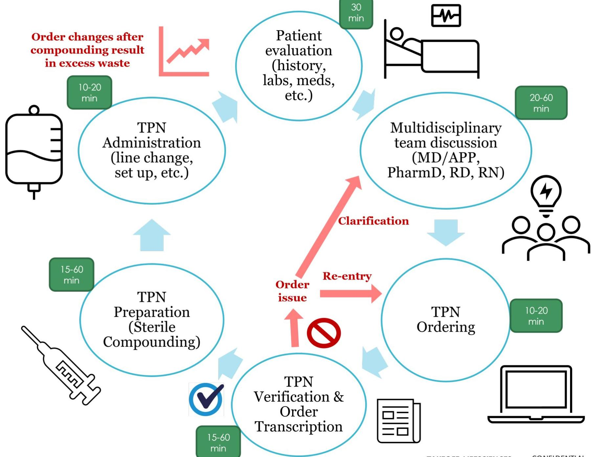
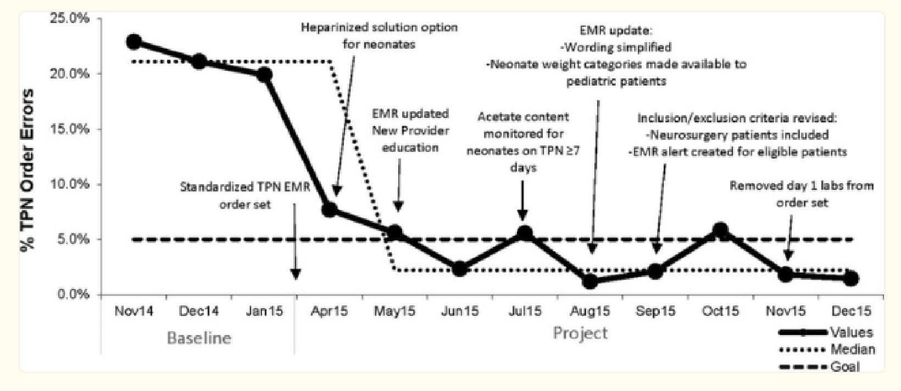

# Parenteral Nutrition Solutions: TPN 2.0 

Growing with the World of AI

TAKEOFF LIFESCIENCES

--- page 1 ---

# Christine Boulos, PharmD, BCPS, BCCCP

Lucile Packard
Children's Hospital
Stanford

Lucile Packard Children's Hospital Stanford, Palo Alto
- NICU Clinical Specialist Pharmacist
- ICU Clinical Pharmacist
- PGY1 and PGY2 Critical Care Pharmacy Residency

Board of Pharmacy Specialties
- Board Certified Pharmacotherapy Specialist
- Board Certified Critical Care Pharmacist

University of California, San Francisco
- Doctor of Pharmacy

--- page 2 ---

# Executive Summary 

## Traditional perinatal care continues to face challenges as a result of low precision, conflicting data, and varying clinical practice that often lacks standardization

Neonatal recommendations are often based on weak evidence extrapolated from studies in animals, older children, and adults

Medical advancements have allowed for delivery of an increasingly fragile population (e.g., extremely premature infants, rare congenital conditions)

Inability to predict and prevent complications has led to increased costs and morbidity

Treatment approaches are often dependent on a mix of stakeholders (e.g., nutrition strategies), yielding high variability in quality of care

## Takeoff LifeSciences' novel AIdriven treatment strategies offer predictive power that can optimize delivery of care

Our proprietary AI offers transformational predictive power for newborn conditions weeks before birth. The underlying technology was featured on the cover of Science Translational Medicine in 2023.

Optimized, precision treatment strategies developed by our AI platform have the potential to significantly improve quality of care, boost efficiency, and reduce cost of perinatal care.

Our first product is focused on AI-driven nutrition for premature newborns.

A successful pilot on ordering of appropriate total parenteral nutrition (TPN) prescriptions has already been performed at Stanford Children's Health ( $n=180$ ).

--- page 3 ---

# Takeoff LifeSciences 

Health optimization begins at birth

--- page 4 ---

# Starting Off Strong

### *Health optimization begins at (or even before) birth*

- Antenatal and postnatal exposure to certain therapies can adversely impact development and long-term outcomes

- No intervention
- Extends life a little at poor health condition
- Preventative care / health optimization

### **Takeoff LifeSciences**

Source: Updated from Lawn et al., 2005, using data from 2010 published in Liu L. et al., 2012; Wilson-Costello et al., Pediatrics, 2005; Heo et al., International Journal of Environmental Research and Public Health, 2021; Ream et al., Current neurology and neuroscience reports, 2018

--- page 5 ---

# Big Problems for Tiny Patients 

- Total parenteral nutrition (TPN) supports patients unable to tolerate enteral feeding
- Frequently used in premature or critically ill newborns
- Adequate nutrition is required for growth and healing
- Nutrition can affect clinical outcomes such as mortality, infections, and hospital length of stay
- Many question remain unanswered, leading to variation in clinical practice
- High-quality studies are needed to create standardized nutrition protocols across the healthcare setting

TPN is designated as a high-alert medication by the Institute for Safe Medication Practices
$>$ Complex ordering and preparation process
$>$ Pediatric patients may be more susceptible to errors resulting in serious patient harm

--- page 6 ---

# Where Can Mistakes Happen? 

| Safety   Guardrails | - Programming capabilities   - Vary by unit and pump type |
| :--: | :--: |
| Ordering \& Verification | - Complex process with multiple factors to consider   - Incorrect transcription |
| Preparation | - Inappropriate formulation   - Technological failure   - Contamination |
| Administration | - Order changes |
| Shortages | - Restrictions and inability to provide adequate nutrition to all patients |

## Risk at every step.

--- page 7 ---

# Novel AI-Optimized Strategy

## Safety Guardrails

- Programming capabilities
- Vary by unit and pump type

## Ordering & Verification

- Complex process with multiple factors to consider
- Incorrect transcription

## Preparation

- Inappropriate formulation
- Technological failure
- Contamination

## Administration

- Order changes

## Shortages

- Restrictions and inability to provide adequate nutrition to all patients

## Takeoff LifeSciences

- **TPN 2.0**

*Minimize the risk of error and enhance efficiency*

## Takeoff LifeSciences

- **TPN 2.0**

*Minimize the risk of error and enhance efficiency*

## Safety Guardrails

- **TPN 2.0**

*Ordering & Verification*

## Preparation

- **TPN 2.0**

*Administration*

## Shortages

- **TPN 2.0**

*Minimize the risk of error and enhance efficiency*

## Standardized formulations

- **Clinical decision support**

## Commercial available solutions

- **Reduced risk with order changes**

## Resource conservation and lower costs

- **Takesoff LifeSciences**

--- page 8 ---

# **Current State**

## **EXAMPLE: 100 – 250 minutes per patient**

--- page 9 ---

## **Future State**

**EXAMPLE:** 55 – 105 minutes per patient

*Measurable impact on hospital resources*

--- page 10 ---

# Predictive Precision for Improved Outcomes

**Takeoff LifeSciences' AI algorithm offers predictive precision that can inform long-term perinatal care strategies**

- Ability to generate a **predictive score** for likelihood of disease occurrence
- Example below shows data for one patient with prediction of diagnosed diseases (check marks)

- **66** This is a major move toward precision medicine for babies.

David Stevenson, MD
Senior Dean of Maternal and Child Health, Stanford University

**TAKEOFF LIFESCIENCES**

**CONFIDENTIAL**

--- page 11 ---

# An early prospective pilot at Stanford showed initial evidence for clinical equivalency (and potential superiority)

## Comparison of machine learning vs. human prescription performance

Healthcare providers preferred AI-generated solutions over ones previously written by the care team (p-value < 0.00001)

--- page 12 ---

"A **standardized process** for PN must be explored in order to improve **patient safety** and **clinical appropriateness**, and to **maximize resource efficiency**... A safe PN system must exist which minimizes procedural incidents and maximizes the ability to meet individual patient requirements."

*American Society for Parenteral and Enteral Nutrition (ASPEN) statement on PN standardization (2007)*

--- page 13 ---

# The Power of Standardization

**Neonatal / Pediatric TPN order issue (administrative, formulation, ordering complexities)**

- Order clarification: 22% orders
- Processing time: 10 minutes/order
- Average blood draws: 6.2 blood draws
- Order clarification: 3.2% orders (P < 0.001)
- Processing time: 5 minutes/order
- Average blood draws: 4.3 blood draws (P < 0.001)

**Intervention**

- Standardized TPN formulations
- Integration of ordering in EMR

**Table 1.**

**Standardized TPN Order Error Rates**

|  Group | Total Orders | Error Rate (No. Errors) | Total Orders | Error Rate (No. Errors) | Chi-squared Test Results  |
| --- | --- | --- | --- | --- | --- |
|  Overall | 1,996 | 21.9% (437) | 471 | 3.2% (15) | 1  |
|  Neonate only | 1,194 | 25.5% (304) | 322 | 3.4% (11) | 1  |
|  Pediatric only | 208 | 19.7% (41) | 149 | 2.7% (4) | 1  |

Implementation of standardized TPN with electronic ordering decreased TPN order errors in both neonatal and pediatric populations, and for the overall group. Baseline (collected November 2014 to January 2015) was compared with the final quarter of data (October to December 2015).

*Statistically significant difference at alpha = 0.05.

Pediatr Qual Saf. 2018 Jul-Aug; 3(4): e093.

TAKEOFF LIFESCIENCES CONFIDENTIAL

--- page 14 ---

# The Power of Standardization

**Neonatal / Pediatric TPN order issue (administrative, formulation, ordering complexities)**

- **Order clarification:** 22% orders
- **Processing time:** 10 minutes/order
- **Average blood draws:** 6.2 blood draws

- **Order clarification:** 3.2% orders (P < 0.001)
- **Processing time:** 5 minutes/order
- **Average blood draws:** 4.3 blood draws (P < 0.001)

**Intervention**
- Standardized TPN formulations
- Integration of ordering in EMR

- **↓ TPN errors (↑ patient safety)**
- **↓ Ordering and verification time**
- **↓ Blood draws (↑ conservation of resources)**

--- page 15 ---

# TPN Compounding Costs

|  TPN Production | Cost of TPN Materials |  | Fixed Cost* (Per 7,000 bags/year) | TOTAL (Per 7,000 bags/year)  |
| --- | --- | --- | --- | --- |
|   | Per bag | Per 7,000 bags/year |  |   |
|  In-house | $26.15-44.66^{2,3}
Average: $35.40 | $183,050-312,620
Average: $247,800 | $69,565.00 | $252,615-382,185
Average: $317,365  |
|  Pre-mix/ Outsourced | $37.79^{3} | $264,530 | - | $264,530  |
|   |  | Production Savings with Pre-mix/Outsourced TPN |  | $52,835  |

Note: Estimated values of materials and fixed costs from years 2010-2014; estimated lab value costs from 2020

*Depreciation and cleaning, maintenance, testing of primary engineering controls, exchange cost for cabin filters, manpower, depreciation of particle counter device, energy consumption, etc.

The price of the premixed multi-chamber bag that is available in the market that matches best with the compounded formula was used for cost calculation.

Hosp Pharm. 2014 Feb; 49(2): 170–176. Newnham, Mark. PP&P Mag. 2010.

--- page 16 ---

# TPN Standardization

|  TPN Product¹ | Number lab draws (average per patient) |  | Cost of lab
(Complete Metabolic Panel) | TOTAL
(Per 1 patient/year)  |
| --- | --- | --- | --- | --- |
|   | Per 7 days TPN | Per 1-year TPN |  |   |
|  Customized | 6.2 | 322.4 | $638 | $3,955.60  |
|  Standardized | 4.3 | 223.6 |  | $142,656.80  |
|   |  |  | Lab Draw Savings with Standardized TPN | $63,034.40  |

*Estimated per hospital charge master 2020

Standardization with AI would reduce costs associated with: - Labor/staffing resources and time - Medication errors (length of stay, clinical outcomes)

AI-generated premixed PN formulations

--- page 17 ---

# Vision for Implementation 

## Identify Patient Populations

- Eligible patients (age, comorbidities, acute clinical status, concomitant therapies)
- Groups of patients for which high variability exists (consider customized prescription)

--- page 18 ---

# Vision for Implementation 

## Identify Patient Populations

## Develop Standardized Solutions

- AI-generated formulations (5-15 types) appropriate for eligible patients
- Simple base solution with minimal additives to be available for special situations that require a more customized formulation

--- page 19 ---

# Vision for Implementation 

## Identify Patient Populations

## Develop Standardized Solutions

## Clinical Reference Tools

- Clinical application (healthcare providers only)that provides detailed information on formulations with feature for calculating delivery with different solutions

--- page 20 ---

# Vision for Implementation

|  Patient information |  |   |
| --- | --- | --- |
|  Weight: |  | kg  |
|  TPN rate: |  | $\mathrm{mL} / \mathrm{hr}$  |
|  TPN duration: |  | hr  |
|  Formulation | $\square$ | $[$ Select 1-15]  |
|  Formulation 1 |  |   |
|  Dextrose \% |  | 20  |
|  Amino Acid \% (Trophamine ${ }^{\circledR}$ ) |  | 4  |
|  Sodium (mEq/L) |  | 77  |

|  Delivery ( $\qquad$ $\mathrm{mL} / \mathrm{hr}$ for $\qquad$ hr) |   |
| --- | --- |
|  Total fluids | $\mathrm{mL}$  |
|  Total fluids | $\mathrm{mL} / \mathrm{kg}$  |
|  Calories | $\mathrm{kcal} / \mathrm{kg}$  |
|  GIR | $\mathrm{mg} / \mathrm{kg} / \mathrm{min}$  |
|  Amino acids | $\mathrm{g} / \mathrm{kg}$  |
|  Sodium | $\mathrm{mEq} / \mathrm{kg}$  |

- Clinical application (healthcare providers only) that provides detailed information on formulations with feature for calculating delivery with different solutions

--- page 21 ---

# Vision for Implementation 

## Identify Patient Populations

## Develop Standardized Solutions

## Clinical Reference Tools

## Electronic Integration

- Designed with integration compatibility for commonly used electronic medical record (EMR) systems
- Ability to pull patient information directly from the EMR to allow for reliable Al-generated recommendations that eliminate the need for manual entry

--- page 22 ---

# Regulatory Requirements and Approval: Likely SaMD - 510k De Novo Classification 

## SaMD Classification

Intended use aligns with device classification (medium risk)

## De Novo 510k Classification

TPN 2.0 cannot be compared to any of the 23 prior cleared devices under product code LNX (Medical Computers and Software products)

## Next Steps for Approval

- Submit 513 and presubmission to the FDA
- Conduct clinical performance \& usability assessment

--- page 23 ---

# TPN 3.0 - Beyond Nutrition

## TPN that reduces risks of adverse outcomes

**Example:** Personalized TPN Significantly Reduces the Risk of Necrotizing Enterocolitis in all infants grouped by birth weights and gestational age

--- page 24 ---

# Executive Summary

## Proprietary, AI-optimized total parenteral nutrition for infants

Simplifies prescriptions with an AI algorithm

Commercially available standard TPN solutions

Progressive precision

Enhanced patient safety and process efficiency

Demonstrates only 5 to 15 types of neonatal TPN prescriptions are needed for precision-level care

Reduced expenses for onsite compounding, which has major implications at a global level for underserved areas

Iterative clustering and continual data collection allows for standard TPN formulations to be optimized for long-term health outcomes

Conserves resources while reducing the risk of human error during ordering and compounding

--- page 25 ---

# APPENDIX

--- page 26 ---

# Crew et. al. 2018

Standardized Solution: Total Additive Amounts (Excluding Vitamins \& Trace Elements)

|   | $>10-30 \mathrm{~kg}$ |  | $>30 \mathrm{~kg}$ |  | $1.5-10 \mathrm{~kg}$ |   |
| --- | --- | --- | --- | --- | --- | --- |
|  Additive | Peripheral | Central | Peripheral | Central | Peripheral | Central  |
|  Protein | $2.50 \%$ | $3 \%$ | $1.90 \%$ | $3 \%$ | $2.7 \%$ | $3 \%$  |
|  Dextrose | $10 \%$ | $15 \%$ | $10 \%$ | $15 \%$ | $10 \%$ | $12.5 \%$  |
|  Na* | $53 \mathrm{mEq} / \mathrm{L}$ | $53 \mathrm{mEq} / \mathrm{L}$ | $73 \mathrm{mEq} / \mathrm{L}$ | $73 \mathrm{mEq} / \mathrm{L}$ | $33 \mathrm{mEq} / \mathrm{L}$ | $33 \mathrm{mEq} / \mathrm{L}$  |
|  K | $20 \mathrm{mEq} / \mathrm{L}$ | $25 \mathrm{mEq} / \mathrm{L}$ | $20 \mathrm{mEq} / \mathrm{L}$ | $30 \mathrm{mEq} / \mathrm{L}$ | $15 \mathrm{mEq} / \mathrm{L}$ | $15 \mathrm{mEq} / \mathrm{L}$  |
|  Cl | $50 \mathrm{mEq} / \mathrm{L}$ | $55 \mathrm{mEq} / \mathrm{L}$ | $60 \mathrm{mEq} / \mathrm{L}$ | $90 \mathrm{mEq} / \mathrm{L}$ | $20 \mathrm{mEq} / \mathrm{L}$ | $20 \mathrm{mEq} / \mathrm{L}$  |
|  Acetate | - | - | - | - | $15 \mathrm{mEq} / \mathrm{L}$ | $15 \mathrm{mEq} / \mathrm{L}$  |
|  CaGlu | $1500 \mathrm{mg} / \mathrm{L}$ | $2000 \mathrm{mg} / \mathrm{L}$ | $1500 \mathrm{mg} / \mathrm{L}$ | $2000 \mathrm{mg} / \mathrm{L}$ | $2000 \mathrm{mg} / \mathrm{L}$ | $5000 \mathrm{mg} / \mathrm{L}$  |
|  Phos | $10 \mathrm{mM} / \mathrm{L}$ | $10 \mathrm{mM} / \mathrm{L}$ | $10 \mathrm{mM} / \mathrm{L}$ | $10 \mathrm{mM} / \mathrm{L}$ | $10 \mathrm{mM} / \mathrm{L}$ | $10 \mathrm{mM} / \mathrm{L}$  |
|  MgSo4 | $2.5 \mathrm{mEq} / \mathrm{L}$ | $2.5 \mathrm{mEq} / \mathrm{L}$ | $2.5 \mathrm{mEq} / \mathrm{L}$ | $2.5 \mathrm{mEq} / \mathrm{L}$ | $2.5 \mathrm{mEq} / \mathrm{L}$ | $2.5 \mathrm{mEq} / \mathrm{L}$  |
|  Osmol | 888 | 1198 | 896 | 1268 | 866 | 1040  |
|  * - Na concentration includes the Na from $\mathrm{NaCl} \& \mathrm{Na}$ Phos ( 1.3 mEq Na per 1 mM Phos) |  |  |  |  |  |   |

--- page 27 ---

# Crew et. al. 2018 

## Fig. 1.

Run-chart of errors following implementation of standardized TPN. Errors in TPN ordering were tracked against standardized TPN utilization. Baseline data were collected between November 2014 and January 2015. Despite consistent use of standardized TPN with electronic ordering in eligible patients, the error rate remained low from the beginning of this project's implementation.

--- page 28 ---

Utilization of standardized TPN for combined neonates and pediatric patients. Utilization of the standardized TPN composition was tracked for patients on TPN and meeting eligibility criteria. A. Illustrates breakdown of usage for standardized and customized TPN solutions for all patients receiving TPN during the study period, broken down by month. B. Illustrates utilization with the proportion of orders for standardized TPN given to eligible patients by quarter for comparison to baseline.

--- page 29 ---

# Deviations from our AI increased mortality by 3X! 

Current TPN practices are a major and well-documented safety issue
Institute for Safe Medication Practices put TPN on the light of High-Alert Medications due to "a heightened risk of causing significant patient harm when they are used in error."
TPN2.0 eliminates the risk of human error during compounding. But that's not all:

Deviation by the care team from our AI Recommendations Increases the risk
Mortality by $\mathbf{3 x}$
Sepsis by $\mathbf{2 x}$
Necrotizing Enterocolitis by $\mathbf{2 . 5 x}$
Deviations were validated by manual chart review and were confirmed to be mistakes by the care team!

--- page 30 ---

# Landscape analysis

## Takeoff LifeSciences
### AI-driven Nutrition

## In-house Compound Pharmacy

## Outside Pharmacy

## Water/Saline

## Cost

--- page 31 ---

# References 

1. Crews, Jacquelyn, et al. "Total parenteral nutrition standardization and electronic ordering to reduce errors: a quality improvement initiative." Pediatric Quality \& Safety 3.4 (2018): e093.
2. Newnham, Mark. "CAPS' Outsourced Compounding Service." Pharmacy Purchasing \& Products Magazine 7 (2010): 5. https://www.pppmag.com/article/704.
3. Bozat, Erkut, et al. "Cost analysis of premixed multichamber bags versus compounded parenteral nutrition: breakeven point." Hospital pharmacy 49.2 (2014): 170-176.