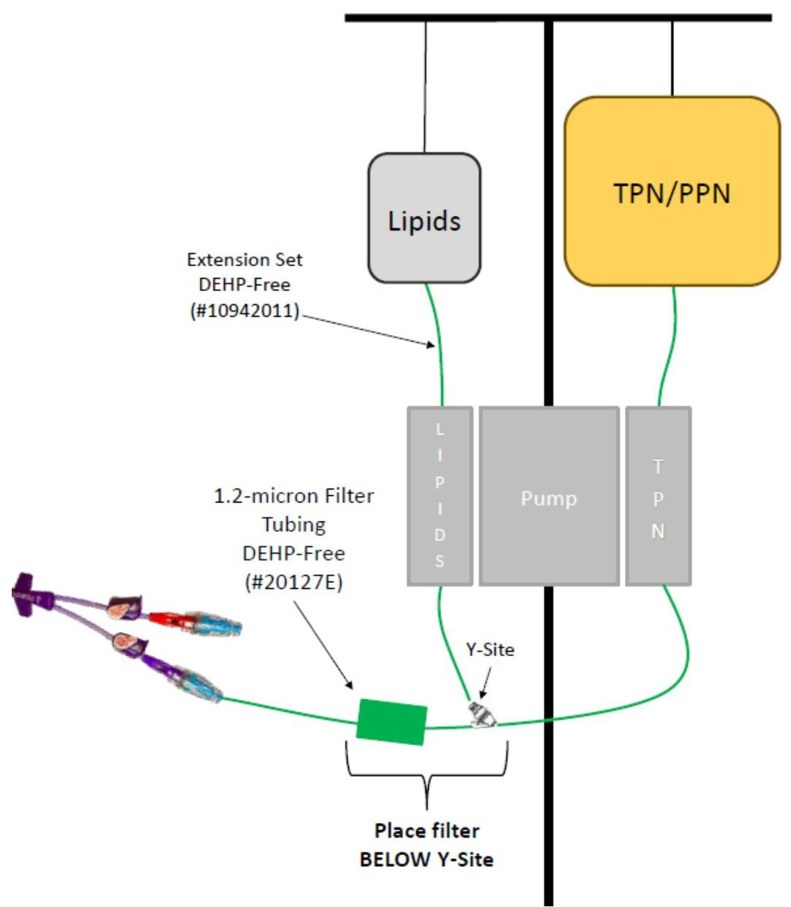

|  Stanford MEDICINE | Last Approval Date: February 2024  |
| --- | --- |
|  Procedure Title: Parenteral Nutrition – TPN, PPN, Lipid Emulsion Intravenous Infusion | Page 1 of 8  |
|  Departments Affected: Inpatient Nursing, Emergency Department, Interventional Platform |   |

## I. PURPOSE:

The purpose of this procedure is to ensure the safe administration of 1) parenteral nutrition and 2) lipid (fat) emulsion.

**Who May Perform:** Registered Nurse (RN)

## II. DEFINITIONS

### A. Parenteral nutrition (PN):

1. Consists of a dextrose and amino acid preparation which is prescribed to meet nutritional requirements of patients who cannot receive adequate nutrition via the gastrointestinal tract.
2. Administered as:
3. a. Total Parenteral Nutrition (TPN) through a central venous access device (CVAD)
4. b. Peripheral Parenteral Nutrition (PPN) through a peripheral catheter.
5. Cyclic TPN is the administration of TPN solution over less than 24 hours a day.

### B. Lipid (fat) emulsion:

Is a component of PN used to prevent essential fatty acid deficiency and provide an additional source of calories; may be a separate infusion from the other components of PN.

### C. Licensed Independent Practitioner (LIP):

Any practitioner permitted by law and the organization to provide care and services, without direction or supervision, within the scope of the practitioner license and consistent with individually assigned clinical responsibilities and can perform within their scope of practice.

### D. Advanced Practice Providers (APP):

Include but not limited to physician assistants (PAs), nurse practitioners (NPs), certified registered nurse anesthetists (CRNAs), certified nurse midwives (CNMs), and clinical nurse specialists (CNSs) who can provide care and services under the supervision of a LIP.

## III. SUPPORTIVE INFORMATION:

### A. Indications/Contraindications

1. **Indications**
2. a. Patients who are malnourished or at risk of malnutrition when enteral feeding is contraindicated, not tolerated, or insufficient to maintain or restore nutritional status.

### B. Precautions

1. **Reduce infection risk**
2. a. Verify order to use central line is present before the catheter is used for TPN.
3. b. It is preferred to dedicate a single lumen to PN administration when a multi lumen CVAD in place.
4. i. For bone marrow transplant (BMT) patients, refer to Appendix B.

--- page 1 ---

|  Stanford | |
| --- | --- |
|  MEDICINE | |

**Last Approval Date:** February 2024

**Procedure Title:** Parenteral Nutrition – TPN, PPN, Lipid Emulsion

**Intravenous Infusion**

**Departments Affected:** Inpatient Nursing, Emergency Department, Interventional Platform

**Page 2 of 8**

c. Schedule bag, tubing, filter, and dressing changes at the same time whenever possible to minimize manipulation and entry of the system.

d. Change tubing, filter, and solution every 24 hours:

i. TPN/PPN

ii. Lipids

iii. Replace with a new bag even if not completely infused. Refer to Labeling Standardization - Process Maps

1. **Lipid administration**

a. Do not give lipids to patients with egg, soy, peanut, or fish allergies without a discussion between the patient and treatment team.

b. Lipid emulsion is isotonic and can be given safely through a peripheral line or CVAD

1. Monitor labs for tolerance, glucose levels, and metabolic and nutritional status

a. Serum glucose levels should be checked at a minimum once daily on all patients receiving TPN.

b. If there is any interruption in the administration of the TPN or PPN solution, notify APP/LIP immediately for dextrose containing solution order.

1. **Extravasation risk**

a. PPN may increase risk of phlebitis.

b. May administer PPN via peripheral IV if PPN solutions/emulsions have a final concentration of 10% dextrose or lower.

c. Do not use midline catheters for TPN or PPN administration.

d. In the event of extravasation, refer to: Extravasation - Early Identification and Management of intravenous Vesicant and Irritants (Cytotoxic and Non-Cytotoxic Agents)

IV. **EQUIPMENT/SUPPLIES**

A. **Infusion pump**

B. Hospital approved disinfecting port protectors

C. Hospital approved disinfecting swab

D. **TPN/PPN**

1. Di[2-ethylhexyl] phthalate (DEHP) free IV Tubing with 1.2 micron filter (add on extension or in-line)

2. TPN or PPN solution, prepared by pharmacy

E. **Lipid**

1. DEHP free tubing with 1.2 micron filter (add on extension or in-line)

2. If infusing with TPN, Luer-Lock Y connector or stopcock

3. **Lipid emulsion**

--- page 2 ---

|  Stanford MEDICINE | Last Approval Date: February 2024  |
| --- | --- |
|  Procedure Title: Parenteral Nutrition – TPN, PPN, Lipid Emulsion Intravenous Infusion |   |
|  Departments Affected: Inpatient Nursing, Emergency Department, Interventional Platform | Page 3 of 8  |

## V. PATIENT AND FAMILY TEACHING

- A. Explain procedure to patient and/or family, including the purpose of the parenteral nutrition and lipid emulsion.
- B. Instruct patient to inform nursing staff of pain, swelling, or redness at IV insertion site, if administered peripherally.
- C. Explain to patient the signs and symptoms of hypoglycemia if insulin is added to TPN.
- D. Instruct patient about daily care of the central line, if TPN administered.

## VI. PROCEDURE:

- A. Perform hand hygiene. Don clean gloves.
- B. Confirm correct formulation aligned with order. Check for:
- Patient's name and medical record number on label.
- Match all components listed on the label against the Medication Administration Record (MAR)
- C. Verify patient's identification using two patient identifiers (e.g., patient name, date of birth, medical record number)
- D. Inspect the bag before hanging and periodically during administration.
- Confirm no bag defects or leaks present.
- Confirm no visible particles or precipitates present.
- E. Assemble and prime tubing with 1.2-micron filter on distal end of tubing.
- See Appendix A for tubing diagram.
- Do not invert filter while priming.
- F. Set up infusion pump settings using appropriate selections in drug library.
- Set rate of infusion as ordered.
- G. Connect tubing(s) to patient and initiate PN infusion.
- Trace tubing to vascular access device (catheter) before making connections to avoid tubing misconnections.
- H. Observe patient after starting PN for the following side effects.
- Side effects may include dyspnea, rash, fever, nausea, dizziness, headache, flushing.
- Notify LIP/APP if side effects occur.
- Assess patient every shift for signs and symptoms of glucose, fluid, or electrolyte imbalance.
- Notify LIP/APP for dextrose containing solution order if PN infusion is interrupted.
- Observe the patient for signs and symptoms of hypoglycemia during discontinuation of TPN and notify LIP/APP if present.
- Discard PN and lipid emulsion tubings when completed in appropriate waste container.

## VII. EVALUATION

- A. Monitor flow rate, vital signs, and IV site, as appropriate.

--- page 3 ---

|  Stanford | |
| --- | --- |
|  MEDICINE | |
|  Procedure Title: Parenteral Nutrition – TPN, PPN, Lipid Emulsion | |
|  Intravenous Infusion | |
|  Departments Affected: Inpatient Nursing, Emergency Department, | |
|  Interventional Platform | |

B. Evaluate patient tolerance. C. Monitor patient's blood glucose based on clinical condition and infusion schedule (continuous versus cyclic).

VIII. DOCUMENTATION A. Administration of TPN, PPN and/or lipids B. Document intake volumes per standards of care. C. Assessment of catheter site per standards of practice. D. Any dressing or tubing changes. E. Any side effects or intolerance to PN.

IX. COMPLIANCE A. All workforce members including employees, contracted staff, students, volunteers, credentialed medical staff, and individuals representing or engaging in the practice at Stanford Health Care (SHC) are responsible for ensuring that individuals comply with this procedure. B. Violations of this procedure will be reported to the Department Manager and any other appropriate department as determined by the Department Manager or in accordance with SHC policy. Violations will be investigated to determine the nature, extent, and potential risk to SHC. Workforce members who violate this procedure will be subject to the appropriate disciplinary action up to and including termination.

X. REFERENCES A. Ayers P, Adams S, Boullata J et al. A.S.P.E.N. Parenteral Nutrition Safety Consensus Recommendations. JPEN J Parenter Enteral Nutr. 2014;38(3):296-333. B. Compher, C., Bingham, A. L., McCall, M., Patel, J., Rice, T. W., Braunschweig, C., & McKeever, L. (2022). Guidelines for the provision of nutrition support therapy in the adult critically ill patient: The american society for parenteral and enteral nutrition. Journal of Parenteral and Enteral Nutrition, 46(1), 12–41. https://doi.org/10.1002/jpen.2267 C. Gorski, L. A., Hadaway, L., Hagle, M. E., Broadhurst, D., Clare, S., Kleidon, T., Meyer, B. M., Nickel, B., Rowley, S., Sharpe, E., & Alexander, M. (2021). Infusion therapy standards of practice, 8th edition. Journal of Infusion Nursing, 44(1S), S1–S224. https://doi.org/10.1097/nan.0000000000000396 D. Kovacevich, D. S., Corrigan, M., Ross, V. M., McKeever, L., Hall, A. M., & Braunschweig, C. (2018). American society for parenteral and enteral nutrition guidelines for the selection and care of central venous access devices for adult home parenteral nutrition administration. Journal of Parenteral and Enteral Nutrition, 43(1), 15–31. https://doi.org/10.1002/jpen.1455 E. Potter, Patricia A., and Anne Griffin Perry. Clinical Nursing Skills & Concepts. 2013 8th Ed. St Louis: Mosby Elsevier.

--- page 4 ---

|  Stanford | Last Approval Date: February 2024  |
| --- | --- |
|  MEDICINE |   |
|  Procedure Title: Parenteral Nutrition – TPN, PPN, Lipid Emulsion |   |
|  Intravenous Infusion |   |
|  Departments Affected: Inpatient Nursing, Emergency Department, |   |
|  Interventional Platform |   |

F. Worthington, P., Balint, J., Bechtold, M., Bingham, A., Chan, L.-N., Durfee, S., Jevenn, A. K., Malone, A., Mascarenhas, M., Robinson, D. T., & Holcombe, B. (2017). When is parenteral nutrition appropriate? *Journal of Parenteral and Enteral Nutrition*, 41(3), 324–377. https://doi.org/10.1177/0148607117695251

G. Worthington, P., Gura, K. M., Kraft, M. D., Nishikawa, R., Guenter, P., & Sacks, G. S. (2020). Update on the use of filters for parenteral nutrition: An aspen position paper. *Nutrition in Clinical Practice*, 36(1), 29–39. https://doi.org/10.1002/ncp.10587

XI. RELATED DOCUMENTS / PROCEDURES: A. Total Parenteral Nutrition (TPN) Guidelines B. Refeeding Syndrome Guidelines C. Central Vascular Access Device - Insertion, Maintenance, Patency, and Removal D. Standards of Practice for Acute and Critical Care Nursing E. Hypoglycemia Management F. Extravasation - Early Identification and Management of intravenous Vesicant and Irritants (Cytotoxic and Non-Cytotoxic Agents) G. Medication Administration Requirements H. Medication Administration - IV Guidelines I. Labeling Standardization - Process Maps J. FAQs - Labeling Standardization

XII. APPENDICES A. Appendix A -Tubing Diagram B. Appendix B- Considerations for BMT Population

XIII. DOCUMENT INFORMATION: A. Legal References / Regulatory Requirements: 1. Joint Commission Standards: MM05.01.09; MM06.01.01; CMS482.23; IC02.05.01; RC01.01.01 B. Original Document: 1. Author/Original Date: Hee Jeong Kim MS, RN, CNS; Theresa Latchford, MS, RN, CNS; April 2018 C. Review and Renewal Requirements: 1. This procedure will be reviewed and/or revised every three years or as required by change of law or practice. D. Review and Revision History: 1. 04/2018 Christine Henley RN, NPDS; Ria Villanueva RN, Interim CNS; Jacqueline Brencic RN, Unit Educator

--- page 5 ---

|  Stanford | Last Approval Date: February 2024  |
| --- | --- |
|  MEDICINE |   |
|  Procedure Title: Parenteral Nutrition - TPN, PPN, Lipid Emulsion |   |
|  Intravenous Infusion |   |
|  Departments Affected: Inpatient Nursing, Emergency Department, |   |
|  Interventional Platform |   |

1. 09/2023 Danielle Smith, RN, NPDS, Professional Practice; Christine Henley, MS, RN, NPDS, Professional Practice; Hee Jeong Kim, MS, RN, CNS Professional Practice; Yanli Jiang, MS, RN, CNS, Professional Practice; Lindsay Starek, MS, RN, CNS, Professional Practice; Diana Mazur, MS, RN, CNS, Professional Practice; Acacia Kautz, RN, CNIV, K7; Paul Mohabir, MD, UBMD D1; April Fong, PharmD; Janine Berta, MS, RD-AP, CNSC, Nutrition; May Carr, MS, RD, CNSC, CSO, Nutrition; May Riley, RN, Infection Prevention Consultant; Nadine Nakazawa, RN, CNIV, Vascular Access; Liz Pincus, CNS, Interventional Platform; Lee Stone, RN CNIV, Interventional Platform; Crystal Miles, MA, BSN, PCM, Emergency Services
2. 01/2024 Patient Care Services, Policy \& Procedure Committee E. Approvals:
3. 11/2023 Nutrition Committee
4. 01/2024 Medication Safety Committee
5. 01/2024 Pharmacy and Therapeutics
6. 02/2024 Practice and Education Council; Patricia Britt DNP, RN, CNS, NEA-BC, Associate Chief Nurse Officer, Ambulatory, Professional Practice, \& Clinical Improvement; Dale Beatty, DNP, RN, NEA-BC, FAONL, FAAN, Chief Nurse Executive \& Vice President, Patient Care Services "This document is intended for use by staff of Stanford Health Care. No representations or warranties are made for outside use. Not for outside reproduction or publication without permission."

--- page 6 ---

# Appendix A: Tubing Diagram 

## 1PN/PPN/Lipids Tubing Set-Up

--- page 7 ---

# Appendix B: Considerations for BMT population 

Back to Appendices

1. Do not use a TPN or PPN line for any other purpose, including blood drawing, medication administration, "piggy-backing" of other solutions, or central venous pressure (CVP) measurements.
a. Exceptions to the above include blood and marrow transplant recipients (BMT).
2. BMT patients with limited access may have compatible medications infused through the TPN line if necessary.
a. These drugs are infused by attaching a multi-access connector (e.g., three-four way stopcocks/manifold) to the TPN line setup. All other patients must have a LIP/APP order to "piggyback" solution or medications.