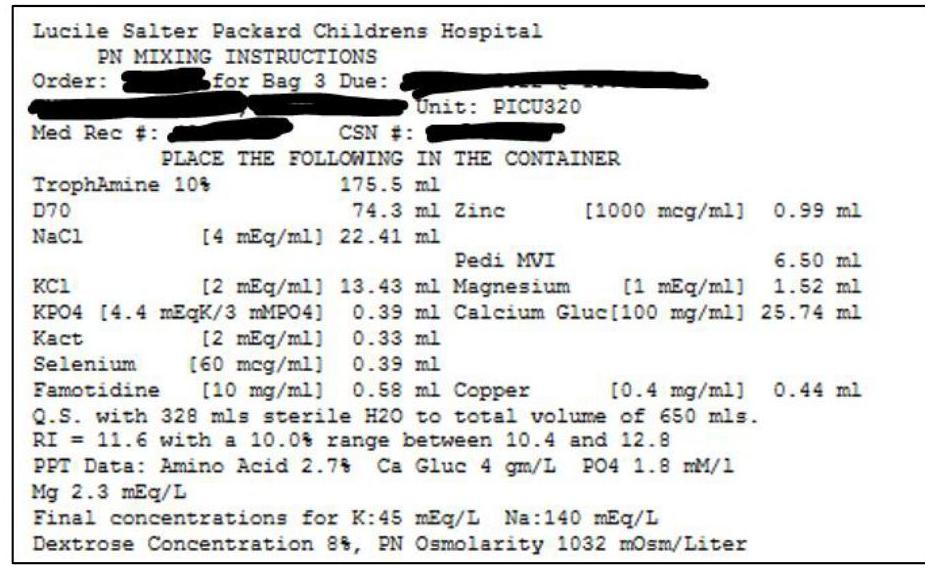
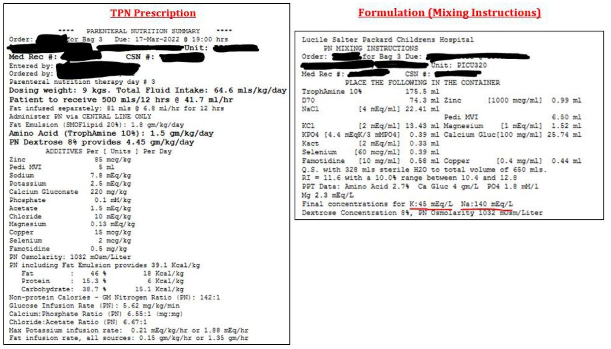

# Important considerations when formulation TPN: 

1) Electrolytes-concomitant medications, organ function, lab trends, infusion rates
a. Diuretics: Can be K-wasting or K-sparing (team may pre-emptively change the potassium based on diuretic changes)
b. Electrolyte repletion doses: Many ICU patients have "as needed" IV electrolyte repletions ordered. If several are given throughout the day, the team may adjust the dose in TPN based on total repletions to reduce line access.
c. Lab errors: The team may believe reported lab values are not accurate (Example: falsely elevated potassium if the lab is hemolyzed)
d. TPN rates are often running at different rates than ordered depending on if other fluids that may be started/stopped
i. Doses actually delivered can be different than the TPN order (double check charting information for the actual infusion rate)
2) Infusion rates- If accounting for volume from other med infusions and enteral feeds in the total fluid goals, it will take away volume of the TPN. This often limits what can "fit" in the TPN since it will be more concentrated. The AI recommendations may not be useful if it does not consider max concentrations, calcium-phosphate solubility, etc.

Could the program identify groups of similar TPN formulations (obtained from the mixing instructions in the TPN order as pictured below) for creating standardized bags?

Ideally, the program could give a recommendation on which formulation is optimal to deliver the desired doses (based on the ordered infusion rate).

--- page 1 ---

1) A TPN is entered for following prescription and mixing instructions. The TPN is ordered to run at $\mathbf{4 1 . 7} \mathbf{~ m L} / \mathrm{hr}$ for 12 hours. The mixing instructions show the final concentrations in this TPN bag.

2) Before starting the bag, the patient looks edematous, and the team wants to decrease the total fluids to $50 \mathrm{~mL} / \mathrm{kg}$ over 12 hours. They ask the nurse to run the TPN at $\mathbf{3 0 . 7} \mathbf{~ m L} / \mathrm{hr}$ and keep lipids at $6.8 \mathrm{~mL} / \mathrm{hr}$.

- If the original bag is used, the patient will receive lower amounts of TPN components if running at a lower rate. Example calculation for sodium and potassium shown:

| Original bag formulation   ( 500 mL at rate of 41.7 mL/hr over 12 hours) | Rate of $41.7 \mathrm{~mL} / \mathrm{hr}$ | Rate of $30.7 \mathrm{~mL} / \mathrm{hr}$ |
| :--: | :--: | :--: |
| Sodium $140 \mathrm{mEq} / \mathrm{L}=0.14 \mathrm{mEq} / \mathrm{mL}$ | $41.7 \mathrm{~mL} / \mathrm{hr} \times 0.14 \mathrm{mEq} / \mathrm{mL} \times 12$ hours $=70.1 \mathrm{mEq}(+9 \mathrm{~kg}=$ Na $7.8 \mathrm{mEq} / \mathrm{kg})$ | $30.7 \mathrm{~mL} / \mathrm{hr} \times 0.14 \mathrm{mEq} / \mathrm{mL} \times 12$ hours $=58 \mathrm{mEq}(+9 \mathrm{~kg}=$ Na $6.4 \mathrm{mEq} / \mathrm{kg})$ Lower than desired in initial order |
| Potassium $45 \mathrm{mEq} / \mathrm{L}=0.045 \mathrm{mEq} / \mathrm{mL}$ | $41.7 \mathrm{~mL} / \mathrm{hr} \times 0.045 \mathrm{mEq} / \mathrm{mL} \times 12 \mathrm{hr}=$ $22.5 \mathrm{mEq}(+9 \mathrm{~kg}=$ K $2.5 \mathrm{mEq} / \mathrm{kg})$ | $30.7 \mathrm{~mL} / \mathrm{hr} \times 0.045 \mathrm{mEq} / \mathrm{mL} \times 12 \mathrm{hr}=$ $16.6 \mathrm{mEq}(+9 \mathrm{~kg}=$ K $1.8 \mathrm{mEq} / \mathrm{kg})$   Lower than desired in initial order |

3) If we wanted to deliver the same doses of sodium and potassium but still run the TPN at a lower rate of $30.7 \mathrm{~mL} / \mathrm{hr}$, the solution would need to be more concentrated:

| New bag formulation   ( 368 mL at rate of 30.7 mL/hr over 12 hours) | Rate of $30.7 \mathrm{~mL} / \mathrm{hr}$ |
| :--: | :--: |
| Sodium $190 \mathrm{mEq} / \mathrm{L}=0.19 \mathrm{mEq} / \mathrm{mL}$   *HIGHER CONCENTRATION | $30.7 \mathrm{~mL} / \mathrm{hr} \times 0.19 \mathrm{mEq} / \mathrm{mL} \times 12$ hours $=$   $70 \mathrm{mEq}(+9 \mathrm{~kg}=$ Na $7.8 \mathrm{mEq} / \mathrm{kg})$   Same dose as initial order |
| Potassium $61 \mathrm{mEq} / \mathrm{L}=0.061 \mathrm{mEq} / \mathrm{mL}$   *HIGHER CONCENTRATION | $30.7 \mathrm{~mL} / \mathrm{hr} \times 0.061 \mathrm{mEq} / \mathrm{mL} \times 12 \mathrm{hr}=$   $22.5 \mathrm{mEq}(+9 \mathrm{~kg}=$ K $2.5 \mathrm{mEq} / \mathrm{kg})$   Same dose as initial order |