# Parenteral Nutrition (PN) Overview 

Dr. John Kerner, MD Joanna Cheung, PharmD, BCNSP, CNSC

Noon Conference: July 8, 2022

--- page 1 ---

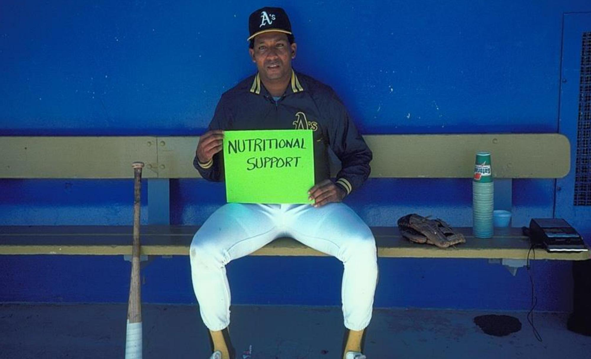

# 2018

--- page 2 ---

# ENTERAL \& PARENTERAL NUTRITION

--- page 3 ---

# HOME PARENTERA NUTRITION

--- page 4 ---

# PN Process

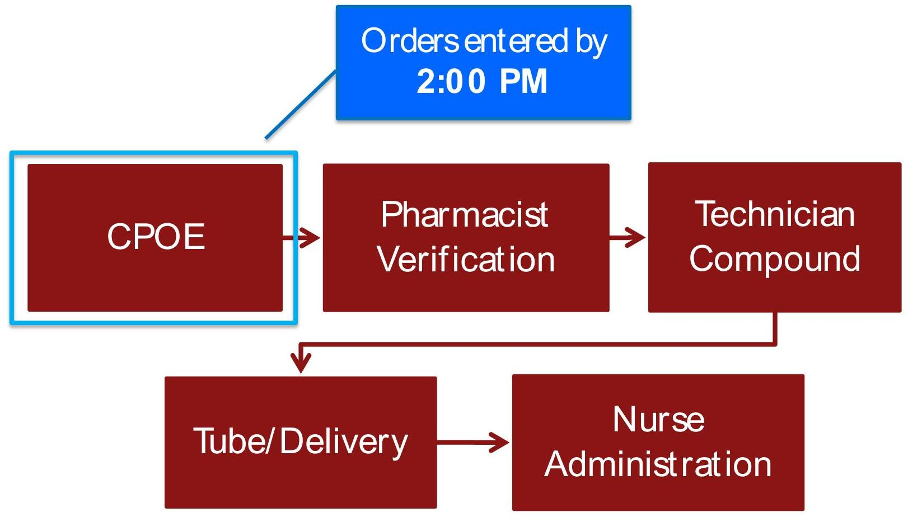

- **Orders entered by 2:00 PM**

- **CPOE** → **Pharmacist Verification** → **Technician Compound**

- **Tube/Delivery** → → **Nurse Administration**

--- page 5 ---

# PN Process

## Web Resources

### Ingredients:
- **Bedside Monitor**
- **Cardiac Cath Images**
- **Clinical Pathways**
- **Echocardiology PACS**
- **Infusion Studio**

### Inclusion Studio
- **Total Parenteral Nutrition**
- **Enter your User ID and Password:**
  - **User ID:**
  - **Password:**
  - **Sign In:**
  - **Cancel**

**Stanford Children's Health**
**Lucile Packard**
**Children's Hospital**
**Stanford**

--- page 6 ---

# Step 1: Find Patient

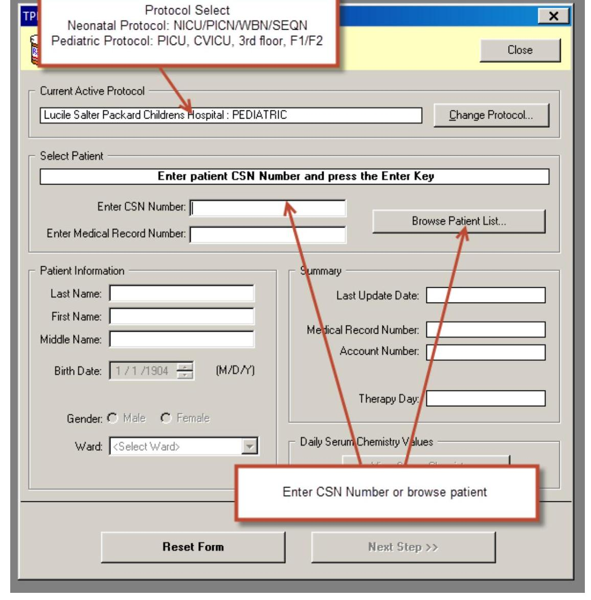

|  Protocol Select | |
| --- | --- |
|  Neonatal Protocol: NICU/PICN/WBN/SEQN | |
|  Pediatric Protocol: PICU, CVICU, 3rd floor, F1/F2 | |
|  |
|  |
|  |
|  |
|  Close | |
|  |
|  |
|  |
|  Current Active Protocol | |
|  |
|  Lucile Salter Packard Children's Hospital: PEDIATRIC | |
|  |
|  |
|  Change Protocol | |
|  |
|  Select Patient | |
|  |
|  Enter patient CSN Number and press the Enter Key | |
|  |
|  Enter CSN Number: | |
|  |
|  Enter Medical Record Number: | |
|  |
|  Patient Information | |
|  Last Name: | |
|  First Name: | |
|  Middle Name: | |
|  Birth Date: 1/1/1904 (M/D/Y) | |
|  |
|  Gender: ☑ Male ☐ Female | |
|  Ward: Select Ward: | |
|  |
|  |
|  |
|  |
|  |
|  |
|  |
|  |
|  |
|  |
|  |
|  |
|  |
|  |
|  |
|  |
|  |
|  |
|  |
|  |
|  |
|  |
|  |
|  |
|  |
|  |
|  |
|  |
|  |
|  |
|  |
|  |
|  |
|  |
|  |
|  |
|  |
|  |
|  |
|  |
|  |
|  |
|  |
|  |
|  |
|  |
|  |
|  |
|  |
|  |
|  |
|  |
|  |
|  |
|  |
|  |
|  |
|  |
|  |
|  |
|  |
|  |
|  |
|  |
|  |
|  |
| 

--- page 7 ---

# Step 2: Fluids & Macros

## Step 2: Route of Administration / Fluid Management / Macronutrients

**Order Date:** 6/1/2015

**Date Due:** 6/1/2015

**Weight (kg)**

**Pen Access Method:** - [ ] PERIPHAN or - [ ] CENTRAL TPN LINE

**Total Fluid Intake:** 100 mls/kg

**FAT EMULSION:** 1 gm/kg to run over 24 hours, 10 Kcal/kg, 5 mls/kg and 40 mls/day

**IF fluid volumes from NON-NUTRITIONAL LINES are to be INCLUDED in TOTAL FLUID INTAKE, complete the following:**

|  |   |   |
| --- | --- | --- |
|  Additive | Additive |   |
|  Additive |  |   |
|  Additive |  |   |

**IF fluid volumes from ENTERAL FEEDS are to be INCLUDED in TOTAL FLUID INTAKE, complete the following:**

- [ ] Enteral Feeding
- Feeding volume of 1 mls every 2 weeks of 1
- Strength Breast Milk/MBM
- GIR Value

**AMINO ACIDS:** 2 gm/kg Aminosyn 10% provides 8 Kcal/kg, concentration of 2.1%

**DEXTROSE:** 10 provides 32.3 Kcal/kg and 6 mg/kg/min glucose (rec range: [6 - 14] mg/kg/min)

**Osm: Amino Acids, Dextrose:** 700.8 mOsm/L

**Osm: Amino Acids, Dextrose:** 700.8 mOsm/L

**<< Previous Step**

**View Recommendations and Guidelines**

**View Serum Chemistry**

**Next Step >>**

**Stanford Medicine**

**Stanford**

**Stanford**

--- page 8 ---

# Step 2: Fluids & Macros

## Weight (kg)

- **PN Access Method:** ☐ PERIPHERAL or ☐ CENTRAL TPN LINE

### Total Fluid Intake:
- mls/kg
- Overall Volume: 40 mls
- Cycle this TPN
- Infuse over: 24 hours

### FAT EMULSION:
- Intralipid: 20% (gm/kg, to run over): 24 hours

### IF fluid volumes from NON-NUTRITIONAL LINES are to be INCLUDED in TOTAL FLUID INTAKE, complete the following:
- Additive
- Additive
- Additive
- Additive
- Additive
- Additive

### IF fluid volumes from ENTERAL FEEDS are to be INCLUDED in TOTAL FLUID INTAKE, complete the following:
- Enteral Feeding
- Feeding volume of: mls every: hours of: 1500
- Strength: Breast Milk/MBM: 150

## Amino Acids

- **Trophamine:** For patients ≤6 months, long-term PN patients, pre-liver transplant
- **Travasol:** All other patients

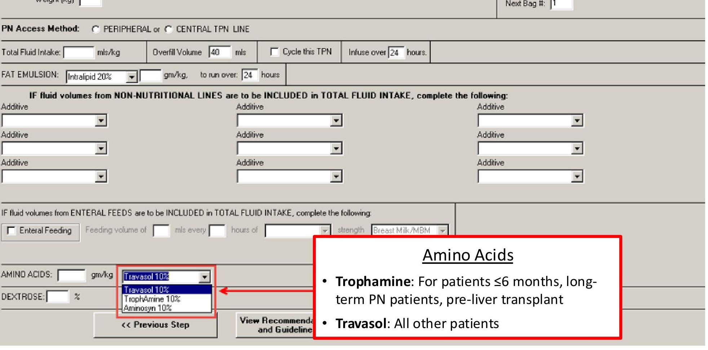

--- page 9 ---

# Step 2: Fluids & Macros

|  Weight (kg) |  |  |  |  |  |  |  | Fill this Order |  |  |  |  |  |   |
| --- | --- | --- | --- | --- | --- | --- | --- | --- | --- | --- | --- | --- | --- | --- |
|   |  |  |  |  |  |  |  |  | Yesterday's Order: 278697 |  |  |  |  | Based on Last Order: 278697  |
|  |   |   |   |   |   |   |   |   |   |   |   |   |   |   |
|  PN Access Method: |  |  |  |  |  |  |  |  |  |  |  |  |  |   |
|  |   |   |   |   |   |   |   |   |   |   |   |   |   |   |
|  Total Fluid Intake: |  |  |  |  |  |  |  |  |  |  |  |  |  |   |
|  |   |   |   |   |   |   |   |   |   |   |   |   |   |   |
|  |   |   |   |   |   |   |   |   |   |   |   |   |   |   |
|  FAT EMULSION: |  |  |  |  |  |  |  |  |  |  |  |  |  |   |
|  |   |   |   |   |   |   |   |   |   |   |   |   |   |   |
|  |   |   |   |   |   |   |   |   |   |   |   |   |   |   |
|  |   |   |   |   |   |   |   |   |   |   |   |   |   |   |
|  IF fluid |  |  |  |  |  |  |  |  |  |  |  |  |  |   |
|  |   |   |   |   |   |   |   |   |   |   |   |   |   |   |
|  |   |   |   |   |   |   |   |   |   |   |   |   |   |   |
|  Additive |  |  |  |  |  |  |  |  |  |  |  |  |  |   |
|  |   |   |   |   |   |   |   |   |   |   |   |   |   |   |
|  |   |   |   |   |   |   |   |   |   |   |   |   |   |   |
|  Additive |  |  |  |  |  |  |  |  |  |  |  |  |  |   |
|  |   |   |   |   |   |   |   |   |   |   |   |   |   |   |
|  |   |   |   |   |   |   |   |   |   |   |   |   |   |   |
|  Additive |  |  |  |  |  |  |  |  |  |  |  |  |  |   |
|  |   |   |   |   |   |   |   |   |   |   |   |   |   |   |
|  |   |   |   |   |   |   |   |   |   |   |   |   |   |   |
|  Additive |  |  |  |  |  |  |  |  |  |  |  |  |  |   |
|  |   |   |   |   |   |   |   |   |   |   |   |   |   |   |
|  |   |   |   |   |   |   |   |   |   |   |   |   |   |   |
|  IF fluid volumes from ENTERAL FEEDS are to be INCLUDED in TOTAL FLUID INTAKE, complete the following: |  |  |  |  |  |  |  |  |  |  |  |  |  |   |
|  |   |   |   |   |   |   |   |   |   |   |   |   |   |   |
|  |   |   |   |   |   |   |   |   |   |   |   |   |   |   |
|  Additive |  |  |  |  |  |  |  |  |  |  |  |  |  |   |
|  |   |   |   |   |   |   |   |   |   |   |   |   |   |   |
|  |   |   |   |   |   |   |   |   |   |   |   |   |   |   |
|  Additive |  |  |  |  |  |  |  |  |  |  |  |  |  |   |
|  |   |   |   |   |   |   |   |   |   |   |   |   |   |   |
|  |   |   |   |   |   |   |   |   |   |   |   |   |   |   |
|  Additive |  |  |  |  |  |  |  |  |  |  |  |  |  |   |
|  |   |   |   |   |   |   |   |   |   |   |   |   |   |   |
|  |   |   |   |   |   |   |   |   |   |   |   |   |   |   |
|  IF fluid volumes from ENTERAL FEEDS are to be INCLUDED in TOTAL FLUID INTAKE |  |  |  |  |  |  |  |  |  |  |  |  |  |   |
|  |   |   |   |   |   |   |   |   |   |   |   |   |   |   |
|  |   |   |   |   |   |   |   |   |   |   |   |   |   |   |
|  IF fluid volumes from ENTERAL FEEDS are to be INCLUDED in TOTAL FLUID INTAKE |  |  |  |  |  |  |  |  |  |  |  |  |  |   |
|  |   |   |   |   |   |   |   |   |   |   |   |   |   |   |
|  |   |   |   |   |   |   |   |   |   |   |   |   |   |   |
|  |   |   |   |   |   |   |   |   |   |   |   |   |   |   |
|  |   |   |   |   |   |   |   |   |   |   |   |   |   |   |
|  |   |   |   |   |   |   |   |   |   |   |   |   |   |   |
|  AMINO ACIDS: |  |  |  |  |  |  |  |  |  |  |  |  |  |   |
|  |   |   |   |   |   |   |   |   |   |   |   |   |   |   |
|  |   |   |   |   |   |   |   |   |   |   |   |   |   |   |
|  DEXTROSE: |  |  |  |  |  |  |  |  |  |  |  |  |  |   |
|  |   |   |   |   |   |   |   |   |   |   |   |   |   |   |
|  |   |   |   |   |   |   |   |   |   |   |   |   |   |   |
|  |   |   |   |   |   |   |   |   |   |   |   |   |   |   |
|  |   |   |   |   |   |   |   |   |   |   |   |   |   |   |
|  |   |   |   |   |   |   |   |   |   |   |   |   |   |   |
|  |   |   |   |   |   |   |   |   |   |   |   |   |   |   |
|  |   |   |   |   |   |   |   |   |   |   |   |   |   |   |
|  |   |   |   |   |   |   |   |   |   |   |   |   |   |   |
|  |   |   |   |   |   |   |   |   |   |   |   |   |   |   |
|  |   |   |   |   |   |   |   |   |   |   |   |   |   |   |
|  |   |   |   |   |   |   |   |   |   |   |   |   |   |   |
|  |   |   |   |   |   |   |   |   |   |   |   |   |   |   |
|  |   |   |   |   |   |   |   |   |   |   |   |   |   |   |
|  |   |   |   |   |   |   |   |   |   |   |   |   |   |   |
|  |   |   |   |   |   |   |   |   |   |   |   |   |   |   |
|  |   |   |   |   |   |   |   |   |   |   |   |   |   |   |
|  |   |   |   |   |   |   |   |   |   |   |   |   |   |   |
|  |   |   |   |   |   |   |   |   |   |   |   |   |   |   |
|  |   |   |   |   |   |   |   |   |   |   |   |   |   |   |
|  |   |   |   |   |   |   |   |   |   |   |   |   |   |   |
|  |   |   |   |   |   |   |   |   |   |   |   |   |   |   |
|  |   |   |   |   |   |   |   |   |   |   |   |   |   |   |
|  |   |   |   |   |   |   |   |   |   |   |   |   |   |   |
|  |   |   |   |   |   |   |   |   |   |   |   |   |   |   |
|  |   |   |   |   |   |   |   |   |   |   |   |   |   |   |
|  |   |   |   |   |   |   |   |   |   |   |   |   |   |   |
|  |   |   |   |   |   |   |   |   |   |   |   |   |   |   |
|  |   |   |   |   |   |   |   |   |   |   |   |   |   |   |
|  |   |   |   |   |   |   |   |   |   |   |   |   |   |   |
|  |   |   |   |   |   |   |   |   |   |   |   |   |   |   |
|  |   |   |   |   |   |   |   |   |   |   |   |   |   |   |

--- page 10 ---

# Step 3: Micronutrients & Additives

## Step 3: Electrolytes / Vitamins / Other Additives

### Hover over "Additive Entry Box" to see protocol guidelines

- **Hover over "Electrolyte Name" and "Electrolytes" to see app:**
- **NICU**
  - Peripheral: no heparin
  - Central: heparin 0.5 units/mL
- **Nitrates and Minerals: Order per guidelines**
- **Adjusted D**
- **Heparin**
- **Vitamin K (additional)**
- **Potassium**
- **Vitamin K (additional)**
- **Nitrates (0-2 units/mL)**
- **ZINC (additional)**
- **PEDIATRIC M.V.I**
- **PEDIATRIC M.V.I**
- **PEDIATRIC M.V.I**
- **PEDIATRIC M.V.I**
- **PEDIATRIC M.V.I**
- **PEDIATRIC M.V.I**
- **PEDIATRIC M.V.I**
- **PEDIATRIC M.V.I**
- **PEDIATRIC M.V.I**
- **PEDIATRIC M.V.I**
- **PEDIATRIC M.V.I**
- **PEDIATRIC M.V.I**
- **PEDIATRIC M.V.I**
- **PEDIATRIC M.V.I**
- **PEDIATRIC M.V.I**
- **PEDIATRIC M.V.I**
- **PEDIATRIC M.V.I**
- **PEDIATRIC M.V.I**
- **PEDIATRIC M.V.I**
- **PEDIATRIC M.V.I**
- **PEDIATRIC M.V.I**
- **PEDIATRIC M.V.I**
- **PEDIATRIC M.V.I**
- **PEDIATRIC M.V.I**
- **PEDIATRIC M.V.I**
- **PEDIATRIC M.V.I**
- **PEDIATRIC M.V.I**
- **PEDIATRIC M.V.I**
- **PEDIATRIC M.V.I**
- **PEDIATRIC M.V.I**
- **PEDIATRIC M.V.I**

--- page 11 ---

# Step 3: Micronutrients & Additives

## Step 3: Electrolytes / Vitamins / Other Additives

**Hover over "Additive Entry Box" to see protocol guidelines**

**Hover over "Electrolyte Name" and "Electrolytes" to see appropriate serum lab values if they are available**

### Vitamins and Minerals: Order per guidelines

**Adjusted Dose Limits**

|  |   |   |   |   |   |
| --- | --- | --- | --- | --- | --- |
|  ZINC (additional) | 400 | mcg/kg |  |  |   |
|  PEDIATRIC M.V.I | 2 | ml/kg | 0 - 2 |  |   |

### Liver Function Tests

**Hover over the "Electrolyte Name" to see recent serum lab value**

|  |   |   |   |   |   |
| --- | --- | --- | --- | --- | --- |
|  SODIUM | 7 | mEq/kg |  |  |   |
|  Na: 134 @ 06:07 AM | 4 | mEq/kg |  |  |   |
|  CALCIUM GLUCONATE | 500 | mg/kg |  |  |   |
|  PHOSPHATE | 2.2 | mM/kg |  |  |   |
|  ACETATE | 4.1 | mEq/kg |  |  |   |
|  MAGNESIUM | 0.7 | mEq/kg |  |  |   |

### Supplementation Additives: Order only as needed unless default value present

**Dose Limits**

|  |   |   |   |   |   |
| --- | --- | --- | --- | --- | --- |
|  HEPARIN | 0.5 | units/ml |  |  |   |
|  Vitamin K (additional) | 0 | mg |  |  |   |
|  COPPER | 20 | mcg/kg |  |  |   |
|  SELENIUM | 0 | mcg/kg |  |  |   |
|  CARNITINE | 5 | mg/kg |  |  |   |
|  L-CYSTEINE | 0 | mg/gm AA |  |  |   |
|  FAMOTIDINE | 0 | mg/kg |  |  |   |
|  RANITIDINE | 0 | mg/kg |  |  |   |

### Epoetin

0 units/kg

### Other Additives

|  Dose |  |  |  |  |  |  |  |  |  |  |  |  |  |  |  |  |  |  |  |  |  |  |  |  |  |  |  |  |  |  |  |  |  |  |  |  |  |  |  |  |  |  |  |  |  |  |  |  |  |  |  |  |  |  |  |  |  |  |  |  |  |  |  |  |  |  |  |  |  |  |  |  |  |  |  |  |  |  |  |  |  |  |  |  |  |  |  |  |  |  |  |  |  |  |  |  |  |  |  | 

--- page 12 ---

# Adjusting Electrolytes

|   | Preterm Neonates | Infants/Children | Adolescents \& Children Greater than 50 kg  |
| --- | --- | --- | --- |
|  Sodium | $2-5 \mathrm{mEq} / \mathrm{kg}$ | $2-5 \mathrm{mEq} / \mathrm{kg}$ | $1-2 \mathrm{mEq} / \mathrm{kg}$  |
|  Potassium | $2-4 \mathrm{mEq} / \mathrm{kg}$ | $2-4 \mathrm{mEq} / \mathrm{kg}$ | $1-2 \mathrm{mEq} / \mathrm{kg}$  |
|  Calcium | $2-4 \mathrm{mEq} / \mathrm{kg}$ | $0.5-4 \mathrm{mEq} / \mathrm{kg}$ | $10-20 \mathrm{mEq}$  |
|  Phosphorus | $1-2 \mathrm{mmol} / \mathrm{kg}$ | $0.5-2 \mathrm{mmol} / \mathrm{kg}$ | $10-40 \mathrm{mmol}$  |
|  Magnesium | $0.3-0.5 \mathrm{mEq} / \mathrm{kg}$ | $0.3-0.5 \mathrm{mEq} / \mathrm{kg}$ | $10-30 \mathrm{mEq}$  |
|  Acetate | As needed to maintain acid base-balance |  |   |
|  Chloride | As needed to maintain acid base-balance |  |   |

## Considerations

- Patient's weight (> 50 kg )
- Renal function (renally-cleared lytes $=\mathrm{K}, \mathrm{Mg}$, Phos)
- Labs and fluid status
- Medications that may affect electrolytes (i.e., diuretics, supplements, dialysate)
- Electrolyte repletions received outside of TPN (IV and enteral)
- Potassium repletion $=0.3$ to $0.5 \mathrm{mEq} / \mathrm{kg} /$ dose (max $30 \mathrm{mEq} /$ dose)
- Magnesium repletion $=0.2$ to $0.4 \mathrm{mEq} / \mathrm{kg}$ dose (max $16 \mathrm{mEq} /$ dose)
- Phosphate repletion $=0.16$ to $0.32 \mathrm{mMol} / \mathrm{kg} /$ dose (max $15 \mathrm{mMol} /$ dose)

--- page 13 ---

# Step 4: Submit... but Wait!

|  TPN Order for Test, Patient (Ped) [MRN: 00000040] |   |
| --- | --- |
|  Step 4: Formulation Results | Close  |
|  Part 1: Verify Order |   |
|  Check Ca-PO4 PPT Curves |   |
|  Enter Number of Days of Compounding: 1 |   |
|  Preview Labels |   |
|  View Fat Emulsion Label | View Content Label  |
|  View Mixing Instructions | View Summary Label  |
|  Redo Current Order | Cancel Current Order  |
|  Part 2: Submit Order |   |
|  Submit for Pharmacy Review |   |
|  Part 3: Enter New Order |   |
|  Enter Next Order |   |

|  Mixing Instructions |   |
| --- | --- |
|  Lucile Salter Packard Childrens Hospital |   |
|  PN MIXING INSTRUCTIONS |   |
|  Order: |   |
|  (PENDING) for Bag 1 Due: 05-Jul-2022 @ 19:00 hrs |   |
|  Test. Patient (Ped) Unit: 2N |   |
|  Med Rec #: 00000040 |   |
|  CSN #: 000000040 |   |
|  PLACE THE FOLLOWING IN THE CONTAINER |   |
|  Travasol 10% | 885.7 ml  |
|  D70 | 221.4 ml Zinc [1000 mcg/ml] 5.54 ml  |
|  NaCl [4 mEq/ml] 40.56 ml |   |
|  NaPO4 [4 mEqNa/3 mMPO4] 2.95 ml Pedi MVI | 5.54 ml  |
|  NaAct [2 mEq/ml] 0.89 ml |   |
|  KCl [2 mEq/ml] 22.14 ml Magnesium [4 mEq/ml] 2.21 ml |   |
|  Calcium Gluc[100 mg/ml] 22.14 ml |   |
|  Copper [0.4 mg/ml] 1.38 ml |   |
|  Q.S. with 340 mls sterile H2O to total volume of 1550 mls. |   |
|  RI = 620.7 with a 10.0% range between 558.7 and 682.8 |   |
|  PPT Data: Amino Acid 5.71% Ca Gluc 1.4 gm/L PO4 5.7 mM/l |   |
|  Mg 5.7 mEq/L |   |
|  Final concentrations for K:29 mEq/L Na:114 mEq/L |   |
|  Dextrose Concentration 10%, PN Osmolarity 1373 mOsm/Liter |   |

--- page 14 ---

# Step 4: Submit... but Wait!

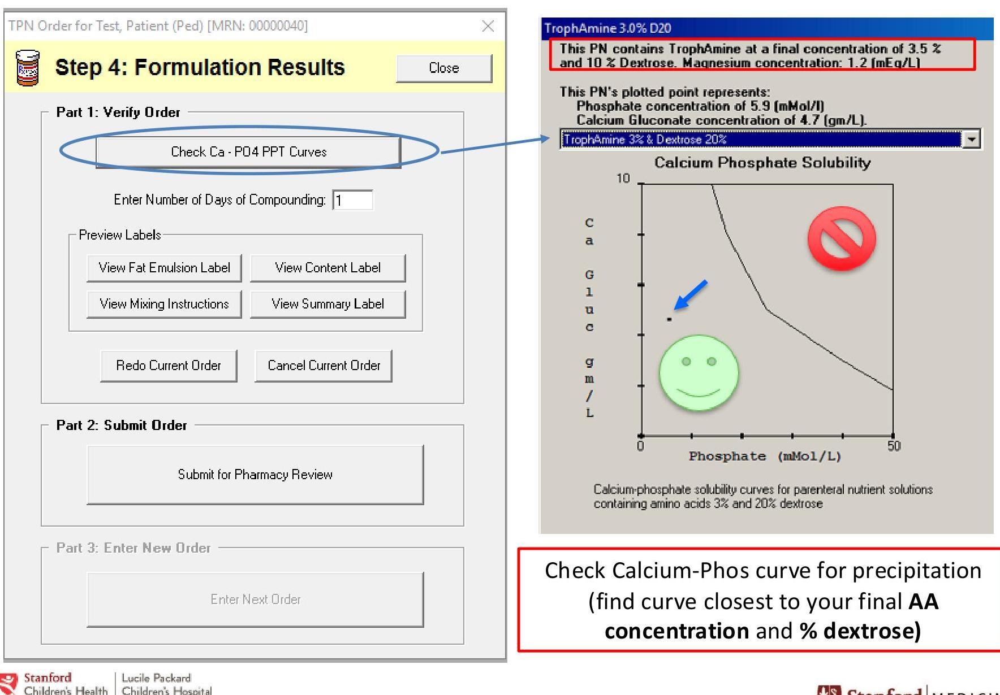

## Step 4: Formulation Results

- **Part 1: Verify Order**
- Check Ca - PO4 PPT Curves
- Enter Number of Days of Compounding: 1
- Preview Labels
- View Fat Emulsion Label
- View Content Label
- View Mixing Instructions
- View Summary Label
- Redo Current Order
- Cancel Current Order

- **Part 2: Submit Order**
- Submit for Pharmacy Review

- **Part 3: Enter New Order**
- Enter Next Order

## Step 5: Proceed to the following steps:

1. **TrophAmine 3.0% D20**
   - This PN contains TrophAmine at a final concentration of 3.5% and 10% Dextrose. Magnesium concentration: 1.2 (mEq/L)
   - This PN's plotted point represents:
     - Phosphate concentration of 5.9 (mMol/L)
     - Calcium Gluconate concentration of 4.7 (gm/L)
   - **TrophAmine 3% Dextrose 20%**

2. **Calcium Phosphate Solubility**
   - Calcium-phosphate solubility curves for parenteral nutrient solutions containing amino acids 3% and 20% dextrose
   - **Phosphate (mMol/L)**
   - Calcium-phosphate solubility curves for pre- and post-detoxication solutions containing amino acids 3% and 20% dextrose

3. **Check Calcium-Phos curve for precipitation**
   - (Find curve closest to your final AA concentration and % dextrose)

4. **Stanford Medicine**
   - **Stanford**

--- page 15 ---

# **Manual of Pediatric Parenteral Nutrition**

**JOHN A. KERNER, JR., EDITOR**

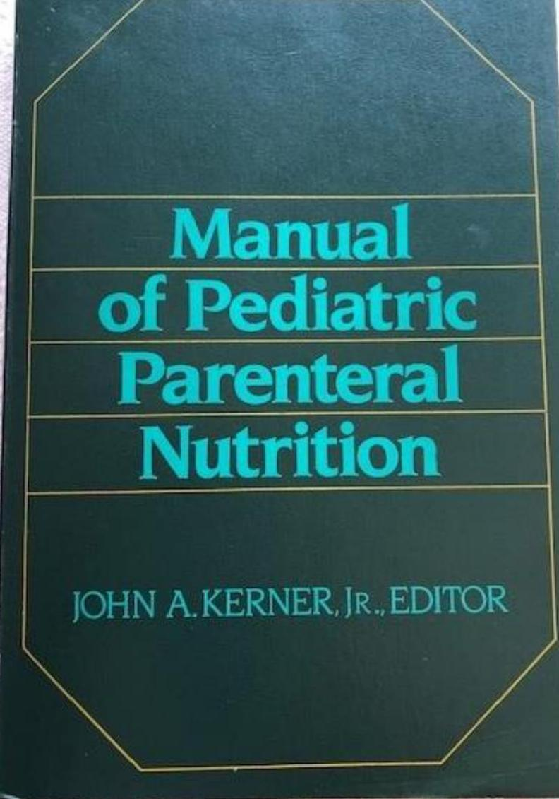

--- page 16 ---

# Educational Tools

http://med.stanford.edu/peds/rotations/core/green-team-educational-tools.html

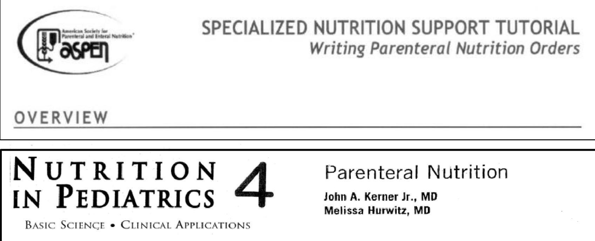

## SPECIALIZED NUTRITION SUPPORT TUTORIAL
### Writing Parenteral Nutrition Orders

## OVERVIEW

## NUTRITION IN PEDIATRICS
### Basic Science • Clinical Applications

## Parenteral Nutrition
### John A. Kerner Jr., MD
### Melissa Hurwitz, MD

--- page 17 ---

# Resources 

- LPCH Home Pharmacy
- Call page operator - On call 24/ 7!
- Recipes can be faxed
- Business hours: 650-497-8316
- LPCH Inpatient TPN Pharmacy
- 650-497-8779
- TPN RN Specialists
- Margret (Allyn) Tabunda, BSN, RN, CFN
- AlTabunda@stanfordchildrens.org
- LPCH RD's (members of Nutrition Support Team)

--- page 18 ---

# Indications for Parenteral Nutrition Use in Pediatric Patients 

Indications for PN use in children include:

- Any child who cannot meet their nutritional requirements via oral or enteral route within 5-7 days is a candidate for PN
- Clear liquid diet or poor intake $>5-7$ days
- Non-functional GI tract for $>5-7$ days
- Serious injury or illness preventing adequate enteral intake $>5$ days
- Intolerance of enteral feeding
- Malnourished child with poor intake or enteral intolerance

--- page 19 ---

Table I: Digestive indications for parenteral nutrition.

Malabsorption medical and/or surgical
Protracted and intractable diarrhoea
Short bowel syndrome
Enterocutaneous fistula
Proximal enterostomy
Intestinal bacterial overgrowth
Immune deficiency

Indication of bowel rest
Inflammatory bowel disease (Crohn's disease, ulcerative colitis, unidentified colitis)
Necrotizing enterocolitis
Intestinal lymphangiectasy
Acute pancreatitis
Gastric hypersecretion
Systemic disease: Shonlein-Hennoch, periarteritis
Radiation enteritis

Congenital or acquired neonatal pathology of the GI tract
Gastroschisis
Omphalocele
Meconial ileus
Extensive small bowel resection
Necrotizing enterocolitis
Complicated Hirschsprung disease
Chronic intestinal pseudo-obstruction syndrome

--- page 20 ---

Table II: Extra-digestive indications for parenteral nutrition.

|  Neonatology | |
| --- | --- |
|  Low-birth-weight infants (<1500 g) | |
|  Intestinal failure | |
|  Necrotizing enterocolitis | |
|  Metabolic disease | |
|  End-stage liver disease | |
|  Inborn errors of metabolism | |
|  Cystic fibrosis | |
|  Haematology and oncology | |
|  Radiation/cytotoxic therapy: solid tumours, leukaemia | |
|  Bone marrow transplantation | |
|  Organ failure | |
|  Acute liver failure | |
|  Acute renal failure | |
|  Hypercatabolism | |
|  Extensive burns | |
|  Severe trauma | |
|  Major surgery | |

--- page 21 ---

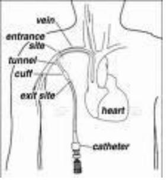

# Use PN only when Needed

## Potential Complications: Enteral vs. Parenteral Nutrition

|  Parenteral | Mechanical | Enteral  |
| --- | --- | --- |
|  Venous thrombosis |  | Tube Blockage  |
|  Catheter displacement/blockage |  | Balloon/button  |
|   |  | Dysfunction/displacement  |
|  Site/tunnel infection | Microbial |   |
|  Sepsis |  | Feeding contamination/  |
|   |  | diarrhea/(sepsis)  |
|  Under/over feeding | Metabolic |   |
|  Electrolyte disorders |  | Under/overfeeding  |
|  Hypoglycemia, hyperglycemia |  |   |
|  Hypertriglyceridemia |  |   |
|  Glycosuria/dehydration |  |   |
|  Cholestatic liver disease | Organ specific |   |
|  Nephrocalcinosis |  | Diarrhea (drugs/antibiotics)  |
|  Osteopenia |  |   |

*From Merrit RJ and Abel A. "The Safe and Appropriate Use of Parenteral Nutrition in Children." NASPGHAN Nutrition Curriculum for Pediatric Fellows (a webinar series). 2019.*

--- page 22 ---

# Routes for IV Nutritional Support 

- Peripheral IV - generally short term, limited calories
- Solution osmolality $>600-1000 \mathrm{mOsm}$ leads to vein damage or occlusion (i.e., no more than D10-2\% AA or D5-4\% AA)
- Risk of severe local tissue damage with PN extravasation
- Rarely indicated if PICC readily available

--- page 23 ---

# Routes for IV Nutritional Support

- **Central venous catheter**—useful for weeks or longer & allows full nutrition:
  - PICC suitable for many applications
  - Tunneled and/or cuffed catheters may be better in younger patients or for more extended use and with ethanol locks
  - Double lumen only if need for frequent medications, fluids, blood (increased infection risk)
  - Ports—Suitable when access need is intermittent
  - Larger lines may increase risk of DVT
  - Confirm central position with X-ray

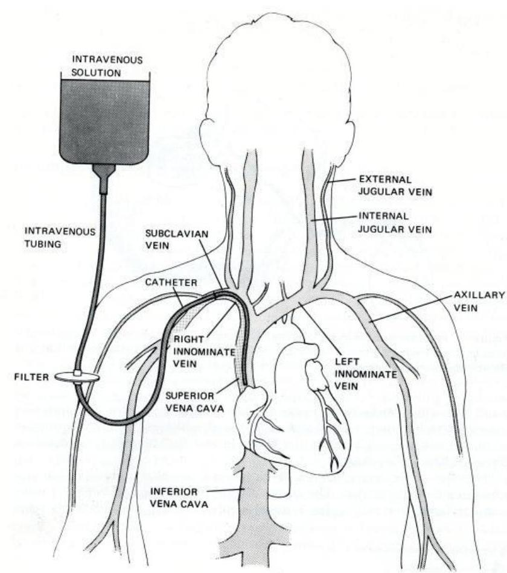

*From* Merrit RJ and Abel A. "The Safe and Appropriate Use of Parenteral Nutrition in Children." NASPGHAN Nutrition Curriculum for Pediatric Fellows (a webinar series). 2019.

--- page 24 ---

# Fluid Needs for TPN

- Maintenance fluids may not mean maintenance calories.
- Monitor patient for excessive fluid retention (ie. excessive weight gain, edema, tachycardia, increased respiratory effort, pulmonary crackles).
- Do not use TPN fluid as replacement fluid or resuscitation fluid. Can "Y" in replacement fluids during infusion.
- Give special consideration to children with cardiovascular or renal disease.

|  Weight | Fluid Recommendations  |
| --- | --- |
|  $<10 \mathrm{~kg}$ | $100-150 \mathrm{ml} / \mathrm{kg} /$ day  |
|  $11-20 \mathrm{~kg}$ | $1000 \mathrm{ml}+50 \mathrm{ml} / \mathrm{kg}$ for each $\mathrm{kg}>10 \mathrm{~kg}$  |
|  $>20 \mathrm{~kg}$ | $1500 \mathrm{ml}+20 \mathrm{ml} / \mathrm{kg}$ for each $\mathrm{kg}>20 \mathrm{~kg}$  |
|  Any weight | 1500 to $1700 \mathrm{ml} / \mathrm{m}^{2} /$ day  |

Merrit, R (ed). (2005) The A.S.P.E.N. Nutrition Support Practice Manual $2^{\text {nd }}$ Edition. Silver Spring, MD: American Society of Parenteral and Enteral Nutrition.

--- page 25 ---

# PN Water and Electrolytes

- In most situations, start PN as 24 h infusion
- Order fluid to meet patient needs according to age and weight requirements and consider any enteral intake
- Do not use PN for fluid replacement

TABLE 6. PN ELECTROLYTE AND MINERAL DAILY DOSING*

|   | Preterm Neonates | Infants/Children | Adolescents \& Children
Greater than 50 kg  |
| --- | --- | --- | --- |
|  Sodium | $2-5 \mathrm{mEq} / \mathrm{kg}$ | $2-5 \mathrm{mEq} / \mathrm{kg}$ | $1-2 \mathrm{mEq} / \mathrm{kg}$  |
|  Potassium | $2-4 \mathrm{mEq} / \mathrm{kg}$ | $2-4 \mathrm{mEq} / \mathrm{kg}$ | $1-2 \mathrm{mEq} / \mathrm{kg}$  |
|  Calcium | $2-4 \mathrm{mEq} / \mathrm{kg}$ | $0.5-4 \mathrm{mEq} / \mathrm{kg}$ | $10-20 \mathrm{mEq}$  |
|  Phosphorus | $1-2 \mathrm{mmol} / \mathrm{kg}$ | $0.5-2 \mathrm{mmol} / \mathrm{kg}$ | $10-40 \mathrm{mmol}$  |
|  Magnesium | $0.3-0.5 \mathrm{mEq} / \mathrm{kg}$ | $0.3-0.5 \mathrm{mEq} / \mathrm{kg}$ | $10-30 \mathrm{mEq}$  |
|  Acetate | As needed to maintain acid base-balance |  |   |
|  Chloride | As needed to maintain acid base-balance |  |   |

*Use caution in prescribing calcium and phosphorus related to compatibility.

From Merrit RJ and Abel A. "The Safe and Appropriate Use of Parenteral Nutrition in Children." NASPGHAN Nutrition Curriculum for Pediatric Fellows (a webinar series). 2019.

--- page 26 ---

# Water and Electrolytes Special situations 

- Don't start PN with dehydration/electrolyte disorders
- Less sodium if edema or ascites
- Potassium and phosphorus levels may rise with even mild renal failure
- Malnutrition increases initial need for K, P, Mg (refeeding syndrome)
- Chemotherapy can increase Mg need
- Antifungal therapy may increase K, Ca \& Mg need.
- Acidosis may reflect diarrhea, dehydration, d-lactic acidosis or thiamin deficiency

--- page 27 ---

# LPCH Non-NICU TPN Guide

|  Age | Goal Weight Gain | Energy Need  |
| --- | --- | --- |
|  0-3 mo | $30 \mathrm{~g} /$ day | $90-110 \mathrm{kcal} / \mathrm{kg} /$ day  |
|  3-6 mo | $20 \mathrm{~g} /$ day | $90-110 \mathrm{kcal} / \mathrm{kg} /$ day  |
|  6-12 mo | $12 \mathrm{~g} /$ day | $80-100 \mathrm{kcal} / \mathrm{kg} /$ day  |
|  1-6 yr | $8 \mathrm{~g} /$ day | $60-90 \mathrm{kcal} / \mathrm{kg} /$ day  |
|  7-10 yr | $5-12 \mathrm{~g} /$ day | $45-70 \mathrm{kcal} / \mathrm{kg} /$ day  |
|  11-18 yr | $5-12 \mathrm{~g} /$ day | $30-55 \mathrm{kcal} / \mathrm{kg} /$ day  |

RDs may use sedentary Dietary Reference Index (DRI) for critically ill patients = lower range for kcal

|  Daily Carbohydrate Requirement |  |  |   |
| --- | --- | --- | --- |
|  Age | Initial | Advance | Goal (GIR)  |
|  Infants (<1 yr) | D10 (6-9 mg/kg/min) | D 2.5 | $12 \mathrm{mg} / \mathrm{kg} / \mathrm{min}$
(max 14-18)  |
|  Children (1-10 yrs) | D10 | D 2.5-5 | $8-10 \mathrm{mg} / \mathrm{kg} / \mathrm{min}$  |
|  Adolescent (11-18 yrs) | D10 | D 2.5-5 | $5-6 \mathrm{mg} / \mathrm{kg} / \mathrm{min}$  |

--- page 28 ---

# LPCH Non-NICU TPN Guide

|  Daily Protein Requirement |  |  |   |
| --- | --- | --- | --- |
|  Age | Initial | Advance | Goal  |
|  $<1$ yr | $1.5 \mathrm{~g} / \mathrm{kg} / \mathrm{d}$ | $1 \mathrm{~g} / \mathrm{kg} / \mathrm{d}$ | $2-3.0 \mathrm{~g} / \mathrm{kg} / \mathrm{d}$  |
|  1-10 yrs | $1.2 \mathrm{~g} / \mathrm{kg} / \mathrm{d}$ | $1 \mathrm{~g} / \mathrm{kg} / \mathrm{d}$ | $1.5-3 \mathrm{~g} / \mathrm{kg} / \mathrm{d}$  |
|  11-18 yrs | $1-1.5 \mathrm{~g} / \mathrm{kg} / \mathrm{d}$ | $1 \mathrm{~g} / \mathrm{kg} / \mathrm{d}$ | $1-2.5 \mathrm{~g} / \mathrm{kg} / \mathrm{d}$  |

*Trophamine for patients $<6 \mathrm{mo}$ or on long term TPN* Travasol for patients $>6 \mathrm{mo}$

|  Daily Lipid Requirement |  |  |   |
| --- | --- | --- | --- |
|  Age | Initial | Advance | Goal  |
|  $<1$ yr | $1-2 \mathrm{~g} / \mathrm{kg} / \mathrm{d}$ | $0.5-1 \mathrm{~g} / \mathrm{kg} / \mathrm{d}$ | $3 \mathrm{~g} / \mathrm{kg} / \mathrm{d}$  |
|  1-10 yrs | $1-2 \mathrm{~g} / \mathrm{kg} / \mathrm{d}$ | $0.5-1 \mathrm{~g} / \mathrm{kg} / \mathrm{d}$ | $1-2 \mathrm{~g} / \mathrm{kg} / \mathrm{d}$  |
|  11-18 yrs | $1 \mathrm{~g} / \mathrm{kg} / \mathrm{d}$ | $1 \mathrm{~g} / \mathrm{kg} / \mathrm{d}$ | $1-2 \mathrm{~g} / \mathrm{kg} / \mathrm{d}$  |

*If Dbili elevated $>2 \mathrm{mg} / \mathrm{dL}$, decrease IL to $1 \mathrm{gm} / \mathrm{kg} /$ day* Lipids should be $<60 \%$ of daily calories *Lipids run for same length of time as other TPN components

--- page 29 ---

# Intravenous Lipid Emulsions (ILE) 

- Use to prevent EFAD and normalize distribution of calories (so not all from protein and sugar)
- Commonly given via separate pump in infants/young children rather than 3 in 1 solution due to de-stabilizing effect of high Ca concentrations used to meet pediatric Ca requirements and low AA concentration when fluid requirement is high
- Usual doses given over 12-24 hrs/d
- North American default choice has been 20\% soybean ILE given at target of $2-3 \mathrm{~g} / \mathrm{kg} / \mathrm{d}$; EFA needs met with $0.5-1 \mathrm{~g} / \mathrm{kg} / \mathrm{d}$
- Monitor serum TG or other marker of lipid concentration
- TG target $<150-250 \mathrm{mg} / \mathrm{dL}$ in infants; $<250-400 \mathrm{mg} / \mathrm{dL}$ in children
- Risk of pancreatitis (if TG>400 mg/dL) and kernicterus in infants with hypertriglyceridemia and indirect hyperbilirubinemia
- Some patients may benefit from a balanced ILE (e.g., Smoflipid ${ }^{\circledR}$ ) or IV fish oil (Omegaven ${ }^{\circledR}$ )

--- page 30 ---

# TrophAmine®

"TrophAmine® is an amino acid solution originally developed to simulate the plasma amino acid profile of breast fed infants. Unlike other standard amino acid solutions, TrophAmine® contains taurine and probably should be used in children of all ages who have evidence of PNALD."*

* Kaufman S: Pediatric Transplantation 6:37, 2002.

--- page 31 ---

# TrophAmine® versus Standard Amino Acids

|   |  | TrophAmine®
(6% and 10%
Amino Acid Injections) | Standard Adult
Amino Acid Solutions  |
| --- | --- | --- | --- |
|  Additional Essential Amino Acids
in Children | Cysteine | ☑ |   |
|   | Histidine | ☑ |   |
|   | Tyrosine | ☑ |   |
|  Conditionally Essential Amino Acid | Taurine | ☑ |   |
|  Essential Amino Acids | Isoleucine | ☑ | ☑  |
|   | Leucine | ☑ | ☑  |
|   | Lysine | ☑ | ☑  |
|   | Methionine | ☑ | ☑  |
|   | Phenylalanine | ☑ | ☑  |
|   | Threonine | ☑ | ☑  |
|   | Tryptophan | ☑ | ☑  |
|   | Valine | ☑ | ☑  |

T-19

Transthema crassum L. (Trophamine®) 100% and 100% Amino Acid Injections

Trophamine® (6% and 10% Amino Acid Injections) Standard Adult Amino Acid Solutions

Trophamine® (6% and 10% Amino Acid Injections) Standard Adult Amino Acid Solutions

Trophamine® (10% and 10% Amino Acid Injections) Standard Adult Amino Acid Solutions

Trophamine® (10% and 10% Amino Acid Injections) Standard Adult Amino Acid Solutions

Trophamine® (10% and 10% Amino Acid Injections) Standard Adult Amino Acid Solutions

Trophamine® (10% and 10% Amino Acid Injections) Standard Adult Amino Acid Solutions

Trophamine® (10% and 10% Amino Acid Injections) Standard Adult Amino Acid Solutions

Trophamine® (10% and 10% Amino Acid Injections) Standard Adult Amino Acid Solutions

Trophamine® (10% and 10% Amino Acid Injections) Standard Adult Amino Acid Solutions

Trophamine® (10% and 10% Amino Acid Injections) Standard Adult Amino Acid Solutions

Trophamine® (10% and 10% Amino Acid Injections) Standard Adult Amino Acid Solutions

Trophamine® (10% and 10% Amino Acid Injections) Standard Adult Amino Acid Solutions

Trophamine® (10% and 10% Amino Acid Injections) Standard Adult Amino Acid Solutions

Trophamine® (10% and 10% Amino Acid Injections) Standard Adult Amino Acid Solutions

Trophamine® (10% and 10% Amino Acid Injections) Standard Adult Amino Acid Solutions

Trophamine® (10% and 10% Amino Acid Injections) Standard Adult Amino Acid Solutions

Trophamine® (10% and 10% Amino Acid Injections) Standard Adult Amino Acid Solutions

Trophamine® (10% and 10% Amino Acid Injections) Standard Adult Amino Acid Solutions

Trophamine® (10% and 10% Amino Acid Injections) Standard Adult Amino Acid Solutions

Trophamine® (10% and 10% Amino Acid Injections) Standard Adult Amino Acid Solutions

Trophamine® (10% and 10% Amino Acid Injections) Standard Adult Amino Acid Solutions

Trophamine® (10% and 10% Amino Acid Injections) Standard Adult Amino Acid Solutions

Trophamine® (10% and 10% Amino Acid Injections) Standard Adult Amino Acid Solutions

Trophamine® (10% and 10% Amino Acid Injections) Standard Adult Amino Acid Solutions

Trophamine® (10% and 10% Amino Acid Injections) Standard Adult Amino Acid Solutions

Trophamine® (10% and 10% Amino Acid Injections) Standard Adult Amino Acid Solutions

Trophamine® (10% and 10% Amino Acid Injections) Standard Adult Amino Acid Solutions

Trophamine® (10% and 10% Amino Acid Injections) Standard Adult Amino Acid Solutions

Trophamine® (10% and 10% Amino Acid Injections) Standard Adult Amino Acid Solutions

Trophamine® (10% and 10% Amino Acid Injections) Standard Adult Amino Acid Solutions

Trophamine® (10% and 10% Amino Acid Injections) Standard Adult Amino Acid Solutions

Trophamine® (10% and 10% Amino Acid Injections) Standard Adult Amino Acid Solutions

Trophamine® (10% and 10% Amino Acid Injections) Standard Adult Amino Acid Solutions

--- page 32 ---

# Trophamine vs. Travasol 

- Trophamine - more protective against TPN cholestasis
- Patients on long term PN
- Preemies and infants at least to 6 months
- Travasol for everyone else
- Short term TPN
- Cheaper!

--- page 33 ---

# **ROPHAMINE**

--- page 34 ---

Table. 4-24. Recommendations for Initiation and Advancement of Macronutrients in Parenteral Nutrition

|   | INITIATION |  | ADVANCE BY |  | GOALS |   |
| --- | --- | --- | --- | --- | --- | --- |
|  INFANTS ( $<1 \mathrm{y}$ ) | PRETERM | TERM | PRETERM | TERM | PRETERM | TERM  |
|  Protein ( $\mathrm{g} / \mathrm{kg} /$ day $)^{\mathrm{a}}$ | $3-4$ | $2.5-3$ | -- | -- | $3-4$ | $2.5-3$  |
|  Dextrose ( $\mathrm{mg} / \mathrm{kg} / \mathrm{min}$ ) | $6-8$ | $6-8$ | $1.4-1.7$ | 3.5 | $10-14$ (max 14-18) | $10-14$ (max 14-18)  |
|  Fat ( $\mathrm{g} / \mathrm{kg} /$ day) | $0.5-1$ | $0.5-1$ | $0.5-1$ | $0.5-1$ | 3 (max $0.15 \mathrm{~g} / \mathrm{kg} / \mathrm{h}$ ) | $2.5-3$ (max $0.15 \mathrm{~g} / \mathrm{kg} / \mathrm{h}$ )  |
|  CHILDREN (1-10 y) |  |  |  |  |  |   |
|  Protein ( $\mathrm{g} / \mathrm{kg} /$ day) | $1.5-2.5$ |  | -- |  | $1.5-2.5$ |   |
|  Dextrose ( $\mathrm{mg} / \mathrm{kg} / \mathrm{min}$ ) | $3-6$ |  | $2-3$ |  | $8-10$ |   |
|  Fat ( $\mathrm{g} / \mathrm{kg} /$ day) | $1-2$ |  | $0.5-1$ |  | $2-2.5$ |   |
|  ADOLESCENTS |  |  |  |  |  |   |
|  Protein ( $\mathrm{g} / \mathrm{kg} /$ day) | $0.8-2$ |  | -- |  | $0.8-2$ |   |
|  Dextrose ( $\mathrm{mg} / \mathrm{kg} / \mathrm{min}$ ) | $2.5-3$ |  | $1-2$ |  | $5-6$ |   |
|  Fat ( $\mathrm{g} / \mathrm{kg} /$ day) | 1 |  | 1 |  | $1-2$ |   |

Glucose infusion rate ( $\mathrm{mg} / \mathrm{kg} / \mathrm{min}$ ) $=[$ dextrose $(\mathrm{g} /$ day $) \times 1000] /[24(\mathrm{~h} /$ day $) \times 60(\mathrm{~min} / \mathrm{h}) \times$ weight $(\mathrm{kg})]$ ${ }^{a}$ Protein does not need to be titrated; protein needs will be increased with critical illness.

--- page 35 ---

Monitoring Recommendations for TPN

|  Variable | Initial | Daily | Weekly  |
| --- | --- | --- | --- |
|  Weight | $x$ | $x$ |   |
|  Length and head circumference | $x^{*}$ |  |   |
|  Physical exam | $x$ | $x$ |   |
|  Fluid balance | $x$ | $x$ |   |
|  $\mathrm{Na}, \mathrm{K}, \mathrm{Cl}, \mathrm{CO}_{2}$ | $x$ | $x$ | $x^{ }$  |
|  Ca, Phos, Mg | $x$ | $x$ (while advancing) | $x$  |
|  Glucose | $x$ | $x$ | $x^{ }$  |
|  BUN/Cr | $x$ | $x$ (while advancing) | $x$  |
|  Liver profile | $x$ |  | $x$  |
|  Triglycerides | $x^{ *** }$ |  | $x$  |
|  Urine glucose | $x$ | $x$ |   |
|  Complete blood count | $x$ |  | $x$  |
|  Prealbumin | $x$ |  | $x$  |

*Initially, then monthly* *daily until stable, then once or twice weekly* **Initially and before each advancement, then once weekly. If septic, more frequent monitoring is prudent. The above adapted from: Merritt, R (Ed). (2005). The A.S.P.E.N. Nutrition Support Practice Manual $2^{\text {nd }}$ Edition. Silver Spring, MD: American Society of Parenteral and Enteral Nutrition.

NOTE: The above represents minimum guidelines, and lab checks may need to be more frequent depending on the status of the patient.

--- page 36 ---

# Monitoring TPN 

## Monitoring

1. Initiate "TPN Monitoring" lab order set in Epic

- Prior to ordering TPN = CBC, Chem23 (MetC, Mg, Phos, triglyceride, D-bili, GGT), Coags, UA
- CXR to insure proper placement of central line
- TPN days 1-4 = Daily renal function panel, Mg, triglyceride, and UA
- Long Term inpatient monitoring
- qMonday = CBC, Chem23 (MetC, Mg, PO4, D-bili, GGT, triglyceride)
- qThursday = Renal function panel, magnesium, triglyceride

--- page 37 ---

# Monitoring TPN

|  Order and Order Set Search |  |  |  |  |  |  |  |  |  |  |  |  |  |  |  |  |  |  |  |  |  |  |  |  |  |  |  |  |  |  |  |  |  |  |  |  |  |  |  |   |
| --- | --- | --- | --- | --- | --- | --- | --- | --- | --- | --- | --- | --- | --- | --- | --- | --- | --- | --- | --- | --- | --- | --- | --- | --- | --- | --- | --- | --- | --- | --- | --- | --- | --- | --- | --- | --- | --- | --- | --- | --- |
|  TPN |  |  |  |  |  |  |  |  |  |  |  |  |  |  |  |  |  |  |  |  |  |  |  |  |  |  |  |  |  |  |  |  |  |  |  |  |  |  |   |
|  Order Sets & Panels |  |  |  |  |  |  |  |  |  |  |  |  |  |  |  |  |  |  |  |  |  |  |  |  |  |  |  |  |  |  |  |  |  |  |  |  |  |   |
|  Name |  | User Version Name |  |  |  |  |  |  |  |  |  |  |  |  |  |  |  |  |  |  |  |  |  |  |  |  |  |  |  |  |  |  |  |  |  |  |  |   |
|  TPN Monitoring (Established) |  |  |  |  |  |  |  |  |  |  |  |  |  |  |  |  |  |  |  |  |  |  |  |  |  |  |  |  |  |  |  |  |  |  |  |  |  |   |
|  TPN Monitoring (Initiation) |  |  |  |  |  |  |  |  |  |  |  |  |  |  |  |  |  |  |  |  |  |  |  |  |  |  |  |  |  |  |  |  |  |  |  |  |  |   |

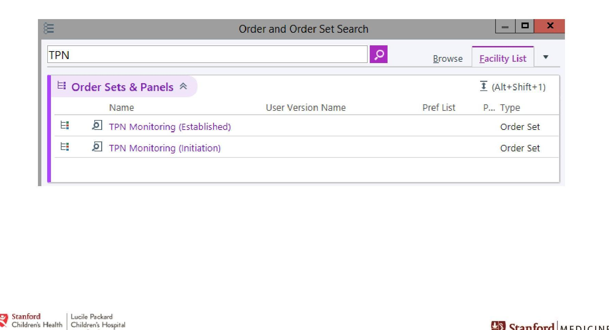

--- page 38 ---

# Micronutrients

--- page 39 ---

# Trace Elements

- Manganese*
- Copper*
  (some elimination in urine)
- Excreted in Bile

*Have the dose decreased when obstructive jaundice is present

- Selenium†
- Molybdenum †
- Chromium †
- Excreted in Urine

†Should not be given when significant renal dysfunction is present

--- page 40 ---

Table 34-7 Trace Element Requirements*

|  TRACE ELEMENT | PRETERM
NEONATES
$<3 \mathrm{~kg}(\mathrm{mcg} / \mathrm{kg} / \mathrm{d})$ | TERM NEONATES 3-
10 kg
(mcg/kg/d) | CHILDREN 10-40 kg
(mcg/kg/d) | ADOLESCENTS $>40$
kg (PER DAY)  |
| --- | --- | --- | --- | --- |
|  Zinc | 400 | $50-250$ | $50-125$ | $2-5 \mathrm{mg}$  |
|  Copper | 20 | 20 | $5.0-20$ | $200-500 \mathrm{mg}$  |
|  Manganese | 1 | 1 | 1 | $40-100 \mathrm{mcg}$  |
|  Chromium | $0.05-0.2$ | 0.2 | $0.14-0.2$ | $5-15 \mathrm{mcg}$  |
|  Selenium | $1.5-2$ | 2 | $1.0-2$ | $40-60 \mathrm{mcg}$  |

*assumes normal organ function and losses

In order to meet these trace element needs, one would need to use individual trace element products. Commercially available multi-trace element products would not meet these needs.

Reprinted with permission from Mirtallo J, Canada T, Johnson D, et al. Safe practices for parenteral nutrition. J Parenter Enteral Nutr. 2004;28(6):S39-S70

--- page 41 ---

# PN Micronutrients 

- Vitamins
- Dose pediatric multivitamin preparation by age or weight
- Give adult multivitamin preparation to adolescents
- Trace elements (Individual addition preferred)
- Zinc, copper, selenium required,
- Consider chromium in infants
- Multi-trace preparations may provide excess manganese \& chromium and are generally best avoided
- No FDA-approved PN sources of iron or iodine
- ASPEN website (nutritioncare.org) has up-to-date guidelines re: micronutrient (and other) recurring PN ingredient shortages

--- page 42 ---

# Copper Deficiency 

## Clinical Sx.

Anorexia
Failure to grow
Diarrhea
Pallor
Depigmentation of hair \& skin
Dilated superficial veins
Defective elastic formation (aneurysm)
Central nervous system abnormalities
Hypothermia
Hepatosplenomegaly
Bone fractures

Lab Tests
mild, early findings:
Anemia (hypochromic)
Neutropenia
Osteopenia/Osteoporosis
Periosteal reactions*
Cupping of long bones*
Flaring of anterior ribs*
Submetaphyseal fractures*

*These findings often resemble those of scurvy

--- page 43 ---

# Copper Deficiency During TPN: A Report of 4 Pediatric Cases* 

- Trace elements held in 4 patients for c bili. $>2$
- Copper levels in these 4: 5-20 mcg/dL at their nadir
- Sx: Asymptomatic with no abnormalities $\rightarrow$ symptomatic with evidence of anemia, leukopenia, hypercholesterolemia, hair pigment changes, osteopenia and fractures.

[^0]
[^0]:    *Hurwitz M et al. NCP 18:185, April 2003

--- page 44 ---

# Copper Deficiency During TPN: A Report of 4 Pediatric Cases* (cont'd) 

- All of these symptoms and lab abnormalities normalized after receiving copper I.V. at the standard dose of 20 $\mathrm{mcg} / \mathrm{kg} /$ day (Am J Clin Nutr 48:1324-1342, 1988)
- We then gave reduced doses of copper I.V. (10 $\mathrm{mcg} / \mathrm{kg} /$ day) to avoid deficiency from recurring.
*Hurwitz M et al. NCP 18:185, April 2003

--- page 45 ---

# Components of PN - Zinc (Zn)

- Zn is an important trace element especially in growth and wound healing
- Signs of Zn deficiency
  - Dermatitis, alopecia, diarrhea, immune deficiency
  - *Mimics acrodermatitis enteropathica*
- Zn excreted mainly in feces
  - Increased needs in diarrhea, hypercatabolic states, ostomy losses, mucositis, and chest tube losses
- Measure of Zn status
  - Serum Zn is a poor measure but is the only measure clinically available
  - A low alkaline phosphatase may suggest Zn deficiency but this is not diagnostic
- Can increase intake in PN to 1.5 - 2 times usual dose in conditions associated with increased needs

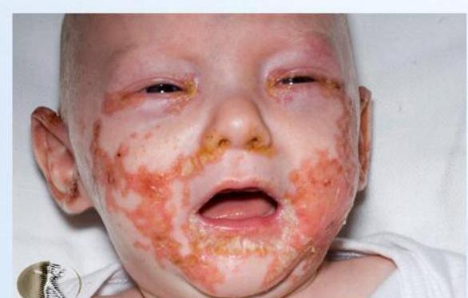

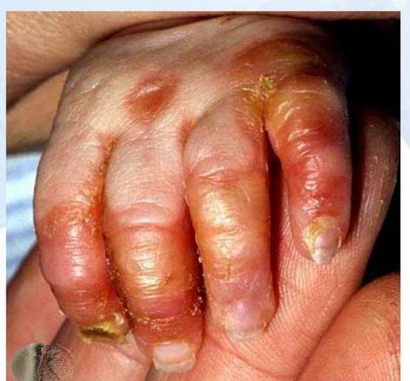

Acknowledgement to dermnetnz.org

Report of WHO/ UNICEF/ IAEA/ IZiNCG. *Food Nutr Bull.* 2007;28:S399-S400.

Woolf et al. *Dig Dis Sci.* 1987;32(1):8-15.

Prasad et al. *J Lab Clin Med.* 1963;61:537-49.

--- page 46 ---

# Components of PN - Selenium (Se)

- Se deficiency can develop within 6 weeks of Se-free PN
  - Can cause cardiomyopathy, growth retardation, pseudo-albinism, white fingernails, and skin disorder
  - Suggested that patients be supplemented if on exclusive PN for >4 weeks

- Toxicity is rare
  - Can cause nausea, diarrhea, irritability, fatigue, peripheral neuropathy, hair loss, nail changes

- Total plasma selenium
  - Most widely used test of Se status
  - Fairly accurate
  - In the presence of systemic inflammation, levels decrease

- In patients with impaired renal function, remove Se from PN and monitor levels

Pediatric Nutrition Support Core Curriculum. Editor: M. Corkins. ASPEN, 2010.
Masumoto et al. *Nutrition* 2007;23:782-87.
Kanekura et al. *Clin Exp Dermatol.* 2005;30:346-48.

--- page 47 ---

# Components of PN - Manganese (Mn) 

- Deficiency is virtually unknown in humans
- Various PN components are contaminated with Mn
- Biliary tract is the predominant route for Mn excretion
- Patients with cholestasis have decreased Mn excretion and may develop Mn toxicity
- Toxicity
- Symptoms include insomnia, headache, increased forgetfulness, anxiety and a Parkinson's disease-like illness
- Best assessed by an MRI scan of the brain (manganese accumulates in the basal ganglia)
- Monitoring
- Regular monitoring of patients receiving fixed doses of Mn over prolonged periods is recommended
- Erythrocyte or whole-blood Mn concentrations

Hardy et al. Curr Opin Clin Nutr Metab Care. 2008;11:289-96.
Koletzko et al. J Pediatr Gastroenterol Nutr. 2005;41:S1-S87.
Fell et al. Lancet 1996;347:1218-21.
Kafritsa et al. Arch Dis Child. 1998;79:263-65.

--- page 48 ---

# Parenteral Nutrition - Cycling PN 

- Daily administration of PN over a period of time which is < 24 hrs e.g., 8 - 22 hrs cycle; average 10 - 12 hrs
- Pre-requisite
- stable regimen
- ability to handle large volume of fluid and nutrients over a short amount of time
- The smaller the infant the less tolerant they may be of the cycle
- Putative benefits
- decreased hepatic steatosis
- allows for a more normal daytime routine
- increases mobility of the patient
- Wean PN rate for the last hour by decreasing the rate by $50 \%$. Consider starting the PN solution at $50 \%$ of the goal rate for first hour.
- Check serum glucose 30 - 45 minutes after stopping PN with every change in length of cycle. Monitor for glucosuria during cycle.

--- page 49 ---

# Micronutrients

- **Calcium**
  - Start: 200-350 mg/kg/d
  - Goal:
    - Pre-term: 400-550 mg/kg/d
    - Term: 300-400 mg/kg/d

- **Phosphorus**
  - Start: 0.5 mM/kg/d
  - Goal: 1 mM/kg/d

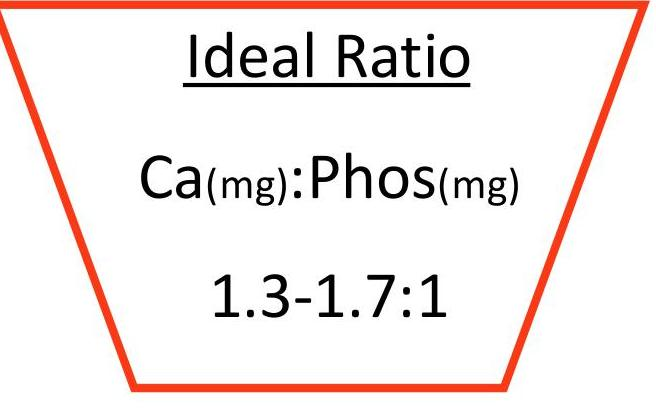

--- page 50 ---

# Monitoring Long Term PN 

- Vitamins: A, E, 25-OHD every 3-6 months; B1, B6, B12, as appropriate
- Consider carnitine
- Trace elements: plasma $\mathrm{Zn}, \mathrm{Cu}, \mathrm{Se}$, manganese (if on multitrace), urinary I every 3-6 months
- Essential fatty acid panel when deficiency suspected or using newer lipid sources
- Monitor for iron deficiency (no iron in PN)
- Nutrient levels should be obtained when patients uninfected and need to be interpreted in clinical context e.g., CRP

--- page 51 ---

# Parenteral Nutrition Component Shortages Update 

According to the FDA Drug Shortage web site the following PN components are considered in short supply.
Calcium gluconate injection
Cyanocobalamin (Vitamin B12) injection
Dextrose injection, 70\%
Magnesium sulfate injection
Multi-vitamin infusion (adult and pediatric)
Phosphate (Glycophos) injection
Potassium chloride injection
Selenium injection
Sodium chloride $23.4 \%$ injection
Sodium phosphate injection
Sterile water for injection solutions
Trace elements (adult, pediatric and neonate)
Zinc injection
https://www.nutritioncare.org/News/Product_Shortages/Parenteral_Nutrition_Component_Shortages_Update/

--- page 52 ---

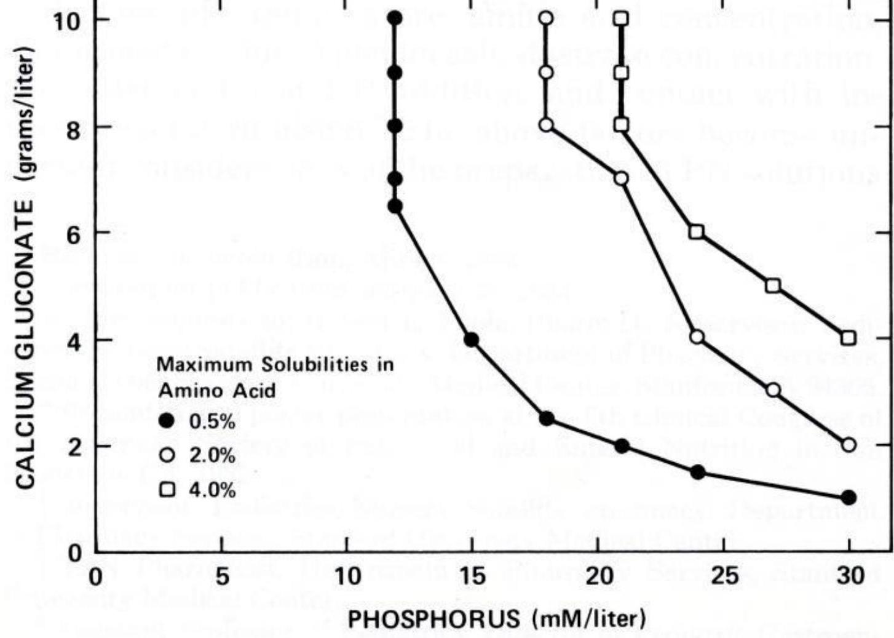

**Fig. 1.** Amino acid effect on the solubility of Ca and P in a standard PN solution.

--- page 53 ---

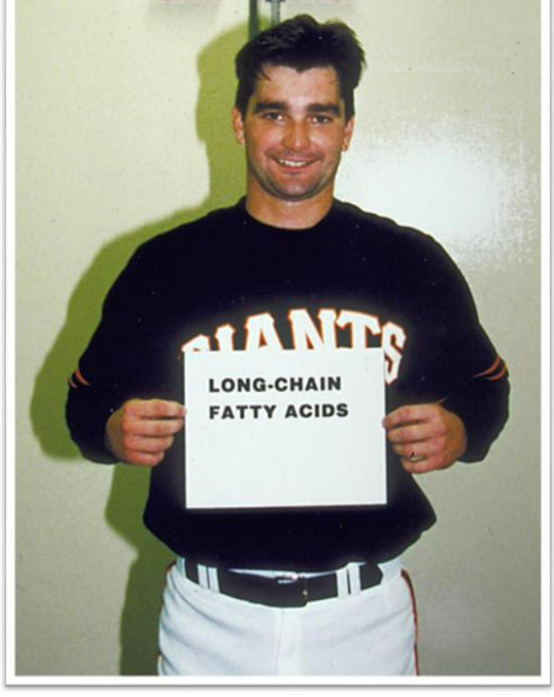

Stanford
Children's Health
Lucile Packard
Children's Hospital
Stanford

--- page 54 ---

# Role of Lipid Emulsions in Cholestasis Associated with Long Term PN in Children 

- Phytosterols contained in lipid emulsions may have a deleterious effect on biliary secretion.

--- page 55 ---

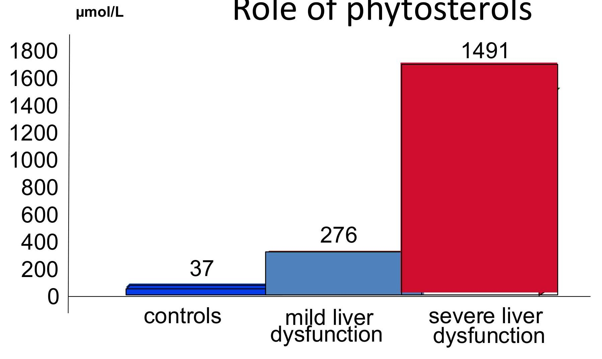

# Role of phytosterols

|  1800 | 1491  |
| --- | --- |
|  1600 |   |
|  1400 |   |
|  1200 |   |
|  1000 |   |
|  800 |   |
|  600 |   |
|  400 |   |
|  200 |   |
|  0 |   |

**controls** **mild liver dysfunction** **severe liver dysfunction**

Iyer KR, Spitz L, Clayton P. BAPS prize lecture: New insight into mechanisms of parenteral nutrition-associated cholestasis: role of plant sterols. British Association of Paediatric Surgeons. J Pediatr Surg. 1998;33:1-6.

--- page 56 ---

|   | Intralipid ${ }^{\text {® }}$ | Omegaven ${ }^{\text {® }}$ | SMOF $^{\text {® }}$  |
| --- | --- | --- | --- |
|  Vitamin E (mg/L) | 38 | 250 | 200  |
|  Phytosterols (mg/L) | 343 | 0 | 48  |
|  Oil Source |  |  |   |
|  Soybean oil \% | 100 | 0 | 30  |
|  Fish oil \% | 0 | 100 | 15  |
|  Coconut oil \% | 0 | 0 | 30  |
|  Olive oil \% | 0 | 0 | 25  |
|  Fat Composition |  |  |   |
|  Linoleic acid ( $\mathrm{g} / 100 \mathrm{cc}$ ) | 10 | $0.1-0.7$ | 2.85  |
|  Arachidonic acid ( $\mathrm{g} / 100 \mathrm{cc}$ ) | 0 | $0.1-0.4$ | 0.05  |
|  $\alpha$-Linolenic acid ( $\mathrm{g} / 100 \mathrm{cc}$ ) | 0.9 | $<0.2$ | 0.275  |
|  Eicosapentaenoic acid ( $\mathrm{g} / 100 \mathrm{cc}$ ) | 0 | $1.28-2.82$ | 0.25  |
|  Docosahexaenoic acid ( $\mathrm{g} / 100 \mathrm{cc}$ ) | 0 | $1.44-3.09$ | 0.05  |

Intralipid Dose: $0.5-3 \mathrm{~g} / \mathrm{kg} / \mathrm{d}$ Omegaven Dose: $1 \mathrm{~g} / \mathrm{kg} / \mathrm{d}$ SMOF: $2-3 \mathrm{~g} / \mathrm{kg} / \mathrm{d}$

--- page 57 ---

# IV Lipid Emulsions 

- Children requiring prolonged PN may receive
- Soybean oil (Intralipid®/IL/SOLE)
- Composite lipid emulsion (SMOFlipid®/CLE) FDA approved 3/2022
- Fish oil (Omegaven®/OM/FOLE) FDA approved 7/2018
- IL restriction is a popular method of reducing the risk of intestinal failure associated liver disease (IFALD) that may influence dosing of other emulsions ${ }^{[1,2]}$
- Essential fatty acid deficiency (EFAD) can occur with restricted protocols ${ }^{[1,3]}$

--- page 58 ---

# Low Dose Lipid Treatment Study

## (Prospective with Historical Controls)

### Eligibility Criteria:
- ≥ 2 weeks
- Direct bilirubin ≥ 2.5 mg/dL or total bilirubin ≥ 5 mg/dL

**Intervention:** 1 g/kg/d 2 x/week

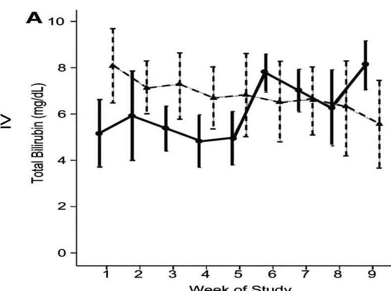

Total bilirubin concentrations decreased in the low dose group vs. standard dose group (-0.73 mg/dL/week vs. 0.29 mg/dL/week)

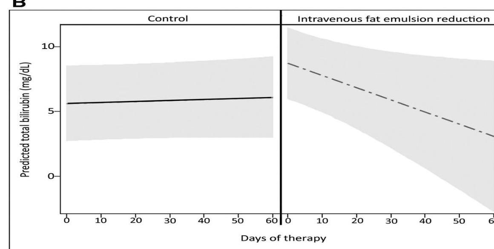

Cober MP, et al. Jour of Pediatr, 2011.

--- page 59 ---

# Fish oil

- **EPA (20: 5n-3)**
  - **DHAA (22: 6n-3)**

- **Decrease inflammation**
  - Increase antioxidant activity
  - No phytosterols
  - Increase bile flow

# Soybean oil

- **ARA (20: 4n-6)**

- **Increase inflammation**
  - Decrease antioxidant activity
  - Phytosterols present
  - Decrease bile flow

--- page 60 ---

# Omegaven® for TPNAC: The Boston Experience

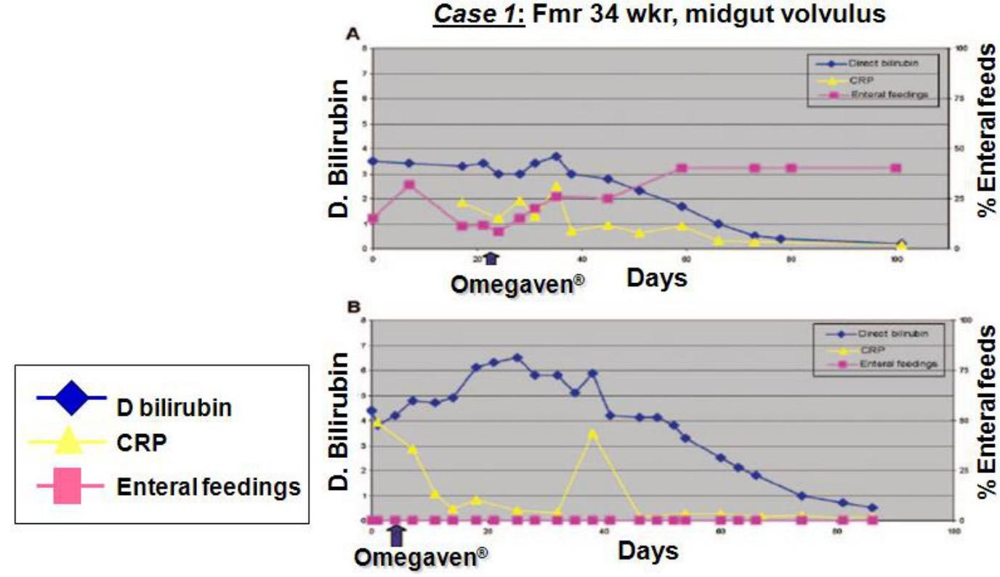

*Case 2:* Fmr 25 week infant with atrial perforation, intestinal perforation, multiple intestinal surgeries

(KM Gura *et al. Pediatrics*, Vol 118, no 1, July 2006)

--- page 61 ---

# Fish Oil Intravenous Emulsion

- Open-labeled trial: fish oil-based IV lipid in 42 infants with SBS and TPN who developed cholestasis (serum direct bilirubin >2 mg/dL) while receiving soybean oil-based IV lipid
- Compared to contemporary cohort 49 infants with SBS and cholestasis with TPN using IV soybean lipid

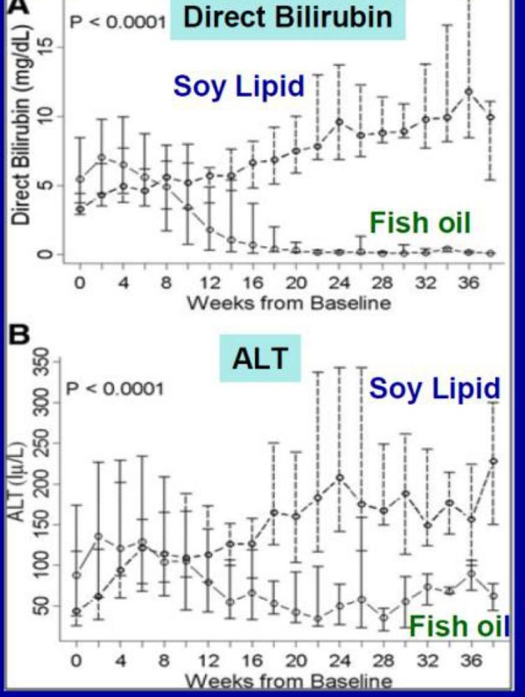

*Puder M et al. Ann Surg 2009;250:395*

--- page 62 ---

# SMOFlipid®

- Balanced 20% Lipid Emulsion
  - Soybean Oil
  - Medium Chain Triglycerides
  - Olive Oil
  - Fish Oil
    - alpha-tocopherol

--- page 63 ---

# Preventing the Progression of Intestinal Failure—Associated Liver Disease in Infants Using a Composite Lipid Emulsion: A Pilot Randomized Controlled Trial of SMOFlipid

**Ivan R. Diamond, MD¹; Robert C. Grant, MD¹; Paul B. Pencharz, MD¹; Nicole de Silva, RN¹; Brian M. Feldman, MD¹; Peter Fitzgerald, MD²; David Sigalet, MD³; Bryan Dicken, MD⁴; Justine Turner, MD⁴; Valerie Marchand, MD⁵; Simon C. Ling, MD¹; Aideen M. Moore, MD¹; Yaron Avitzur, MD¹; and Paul W. Wales, MD¹**

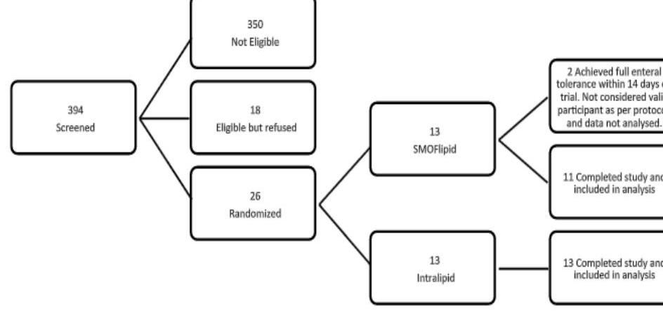

**Conjugated Bilirubin**

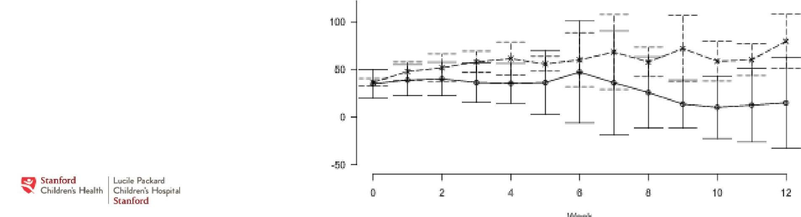

--- page 64 ---

# Reversal of Intestinal Failure-Associated Liver Disease by Switching From a Combination Lipid Emulsion Containing Fish Oil to Fish Oil Monotherapy

Lee et al. *JPEN.* 2016 Mar;40(3):437-40

**Figure 1.** Changes in direct bilirubin levels during treatment with Omegaven in case 1 (A) and case 2 (B)

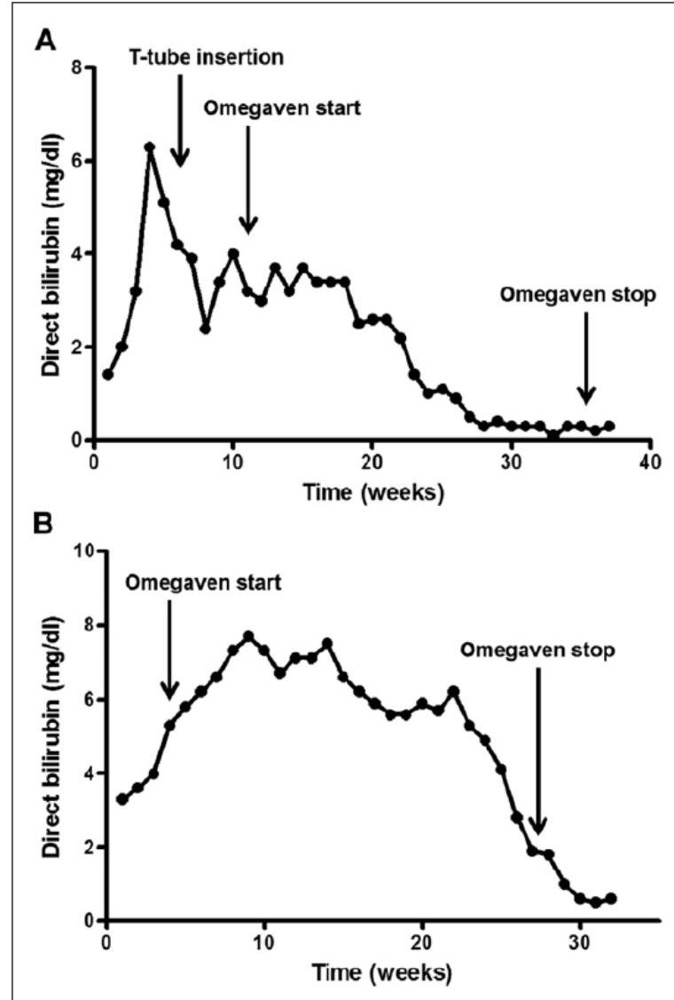

--- page 65 ---

# Omegaven 1g/kg/day

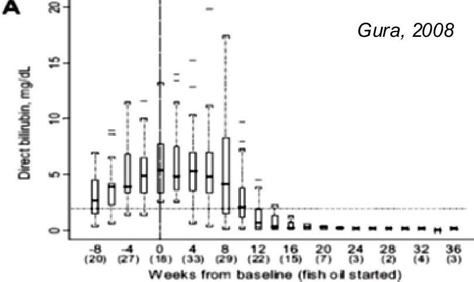

# Intralipid 1g/kg + Omegaven 1g/kg

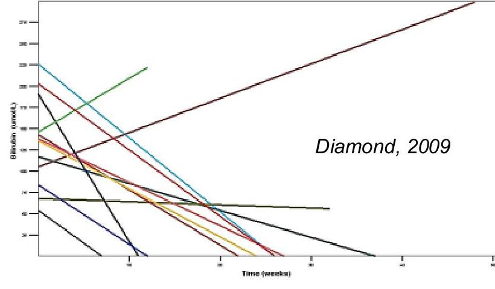

# Liposyn Minimization, 1g/kg twice weekly

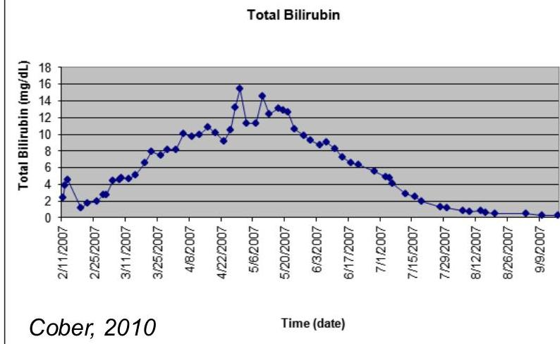

# SMOFlipid 2g/kg/d

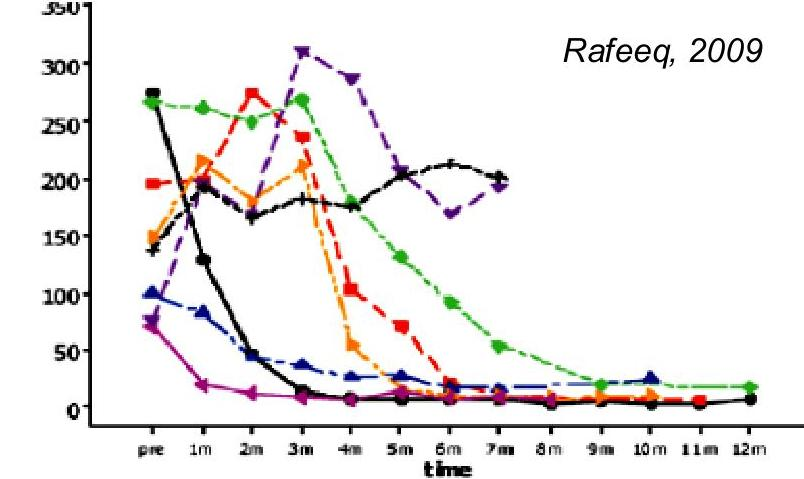

# Intafilipid MEDICINE

*Gura, 2008*

*Diamond, 2009*

--- page 66 ---

# SMOFlipid ${ }^{\circledR}$ 

- FDA approved in 2016 for adults in US
- Approved in Europe in 2000 (adults) \& 2009 (children)
- Approved in Canada in 2013
- FDA approved for children in US in March 2022
- Reported to be safe in infants and children in Europe when used short-term ${ }^{[1,2]}$
- In the US, off-label in infants/children, often dosed using foreign package insert recommendations (vary by country)

Theoretical benefit of reduced hypertriglyceridemia, improved inflammatory cascade, and decreased risk of IFALD when compared to SOLE ${ }^{[3]}$

Boston Children's Hospital
Until every child is well

1. Goulet, O., et al. JPEN J Parenter Enteral Nutr, 2010
2. Tomsits, E., et al. J Pediatr Gastroenterol Nutr, 2010
3. Mundi, M.S., R. Martindale, and R.T. Hurt, JPEN, 2017

--- page 67 ---

# SMOFlipid ${ }^{\circledR}$ Dosing

Table 13. Pediatric dosing for Smoflipid

|  Patients | Initiation (g/kg/day) | Advance By (g/kg/day) | Goal Dose (g/kg/day)  |
| --- | --- | --- | --- |
|  Preterm Infants | $0.5-1$ | $0.5-1$ | 3  |
|  Term Infants | $0.5-1$ | $0.5-1$ | $2.5-3$  |
|  Children (1-10y) | $1-2$ | $0.5-1$ | $2-2.5$  |
|  Adolescents | 1 | 1 | 2  |

A Dossier of Clinical Evidence in Support of Formulary Consideration Fresenius Kabi AG 2016

--- page 68 ---

# SMOF Guidelines 

- SMOF (FDA approved for children, March 2022)
- Must meet at least ONE of the following criteria for initiation:

1. Neonates with birthweight $<1 \mathrm{~kg}$
2. Infants $<12$ months requiring or anticipating prolonged PN use $>21$ days
3. Home PN patients with pre-existing SMOF usage
4. Anticipated PN use for longer than 21 days, and the presence of one of the following:
a. Intestinal failure (short bowel syndrome, chronic intestinal pseudo-obstruction, congenital diarrhea)
b. Elevated LFTs
c. Elevated direct bilirubin

--- page 69 ---

# Omegaven ${ }^{\circledR}$ 

https://www.accessdata.fda.gov/drugsatfda_docs/label/2018/0210589s000lbledt.pdf

- In July 2018, the US FDA approved Omegaven ${ }^{\circledR}$ as an alternative source of intravenous fat calories and fatty acids in "pediatric patients with parenteral nutritionassociated cholestasis (PNAC)" in the absence of other liver disease.
- 1 gram $/ \mathrm{kg} / \mathrm{d}$ with the $10 \%$ emulsion

--- page 70 ---

# Omegaven ${ }^{\circledR}$ Guidelines 

- "Initiate dosing in PN-dependent pediatric patients as soon as direct (or conjugated) bilirubin levels are 2mg/dL or greater"
- "Omegaven is not indicated for the prevention of PNAC"
- LPCHS policy recommends against starting Omegaven in infants < 2 wks old with cholestasis (PNAC presents after at least 14 days of PN)
- Prior to starting Omegaven ${ }^{\circledR}$, make sure the direct bilirubin $\geq 2 \mathrm{mg} / \mathrm{dL}$ is not from infection (check CBC, U/A, urine C+S, blood C+S as indicated)
- GI consult is required to approve use

--- page 71 ---

# Our Intervention: A "Central Line Care Card"

- Child ID, MDs, allergies, diagnosis, line info
- Instructions for parents (English or Spanish)

|  Name: | DOB: / / Issued: / /  |
| --- | --- |
|  Primary MD: | Phone:  |
|  Subspecialty MD: | Phone:  |
|  Drug allergies: |   |
|  Primary diagnosis: |   |
|  Reason for line: TPN / | Placement date: / /  |
|  Line type: Broviac / Hickman / Port / PICC / |   |
|  Size (Fr): Brand: | Cat #:  |
|  Material: Silicone / Polyurethane / | Ok for EtOH locks? Y / N  |
|  For Parents: If patient has fever over 100.4F or 38.0C |   |
|  - GO TO NEAREST ED, Urgent Care, or Primary MD |   |
|  - CALL PEDS GI at Stanford: 650-723-5070 or 650-723-6661 |   |

--- page 72 ---

# Our Intervention: A "Central Line Care Card"

- Rule-out sepsis protocol *checklist* for MDs

**For MDs:** If patient presents to an ED or urgent care facility with T>100.4F or >38.0C:

- Please obtain cath UA, UCx, and blood culture, CBCD, CRP, COAG panel (if worried about DIC), +/- CHEM panel **from central line before starting antibiotics.**
- Start empiric broad spectrum antibiotics (vancomycin/ceftazidime) through central line unless other allergy/contraindication/resistant organism: ______________________________
- CALL PEDS GI at Stanford: 650-723-5070 (transfer center) or 650-723-6661 (peds GI fellow on call) for **admission.** Per LPCH policy, **ALL** patients with fever and a central line require at least **48hr admission** to rule out line infection.

--- page 73 ---

# Causes of Catheter Occlusion 

- Clot or thrombus
- Fibrin deposition
- Fat deposition
- Calcium-phosphorus precipitation
- Drug precipitation

## Mechanical Causes

- Kinking of the catheter
- Catheter tip against venous wall
- Excessively tight suture

--- page 74 ---

# Causes and Management of Catheter Occlusion 

## Cause

- Clot or thrombus
- Fat deposition
- Calcium-phosphorus deposition
- Drug precipitation

## Management

- t-PA (Alteplase)
- $70 \%$ ethanol
- 0.1 N Hydrochloric acid*
- 0.1 N Hydrochloric acid* or 0.1 N NaOH
* Now we use L-cysteine I.V.

--- page 75 ---

**Stanford**

*Lugile Packard*

*Children's Health*

*Children's Hospital*

*Stanford*

--- page 76 ---

# The Subs are Back! 

--- page 77 ---

# Board Question 

Children on parenteral nutrition are at risk for zinc deficiency, which may manifest as which of the following?
A. Constipation
B. Poor wound healing and low alkaline phosphatase
C. Thrombocytopenia
D. Psychosis

Answer: B. Poor wound healing and low alkaline phosphatase. Zinc is a mineral that is important for wound healing and bone health. Low zinc is associated with diarrhea, and results in poor wound healing and low alkaline phosphatase.

--- page 78 ---

# Board Question

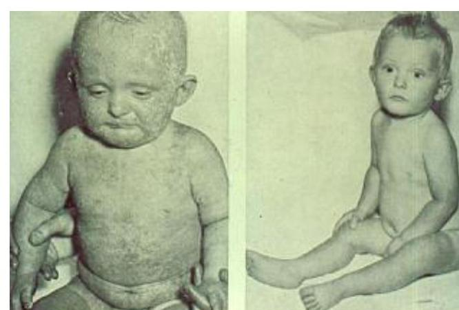

- Can cause
  - Decreased growth
  - Skin and hair changes
  - Poor wound healing
  - Alterations in platelet function
  - Increased susceptibility to infection

- How does one test for essential fatty acid deficiency?
  - Serum triene:tetraene ratio
  - What ratio is thought to be EFA sufficient?
  - Serum triene:tetraene ratio <0.2 is considered to be EFA sufficient

*Source: Stanford Childrens Health*

*Mediator: Lucile Packard*

*Mediator: Children's Hospital*

*Mediator: Stanford Childrens Health*

--- page 79 ---

**Stanford Children's Health**

**Lucile Packard Children's Hospital Stanford**

--- page 80 ---

# Biofilm impenetrable to host immune response

## CATHETER SURFACE

### Biofilm impenetrable to antibiotics

1. **Organic layer attachment**
2. **Bacterial colonisation & multiplication**
3. **Formation of protective exopolymer saccharides**

### 4. Dispersal of Biofilm Matrix

**Stanford MEDICINE**

--- page 81 ---

# Ethanol Lock 

- Ethanol is bactericidal and fungicidal
- Nonspecifically denatures cell membrane proteins
- Inhibit bacterial growth and penetrates bacterial biofilm within the line
- Improves clearance of line infection
- May save the line from replacement

--- page 82 ---

# TPN

--- page 83 ---

# Ethanol-lock for catheter salvage 

- 40 children/51 CVC-related infections
- EtOH 70\%: 0.8 - 1.4 mL for 12-24 hr, then withdrawn
- Catheters removed: 0

Onland W, et al. Arch Pediatr Adolesc Med. 2005; 160: 1049-1053.

--- page 84 ---

# Ethanol-lock for catheter salvage 

- After EtOH withdrawn, isotonic saline flush
- Repeat EtOH for 5 consecutive days
- Separate peripheral line for IV Abx.
- With double lumen catheters ethanol into 1 lumen for 24 hrs., while the other lumen used for infusion
- Both lumens were alternately treated for 10 days

Onland W, et al. Arch Pediatr Adolesc Med. 2005; 160: 1049-1053.

--- page 85 ---

# Ethanol-lock for catheter salvage 

- Relapse: $12 \%$
- $75 \%$ of polymicrobial isolates: no recurrence
- $94 \%$ of monomicrobial isolates successfully treated
- The treatments of 2 yeast isolates were also successful

Onland W, et al. Arch Pediatr Adolesc Med. 2005; 160: 1049-1053.

--- page 86 ---

40S Journal of Parenteral and Enteral Nutrition / Vol. 36, Suppl. 1, January 2012

Table 1. Ethanol Lock Therapy in Intestinal Failure

|  Author | Year | N | Pediatric or Adult | Catheter-Related Bloodstream Infections Rate ${ }^{a}$ |  | No. of Days/Wk | Dwell Time, h | Ethanol Concentration, \%  |
| --- | --- | --- | --- | --- | --- | --- | --- | --- |
|   |  |  |  | Pre-ELT | Post-ELT |  |  |   |
|  Opilla et al ${ }^{61, b}$ | 2007 | 9 | Adult | 8.3 | 2.7 | $1-7$ | $2-4$ | $25-70$  |
|  Mouw et al ${ }^{59}$ | 2008 | 5 | Pediatric | 11.5 | 2.1 | 7 | $4-14$ | 70  |
|  Jones et al ${ }^{60}$ | 2010 | 23 | Pediatric | 9.9 | 2.1 | 3 | $\geq 4$ | 70  |
|  Cober et al ${ }^{62}$ | 2011 | 15 | Pediatric | 8.0 | 1.3 | 7 | $\geq 2$ | 70  |
|  Wales et al ${ }^{63}$ | 2011 | 10 | Pediatric | 10.2 | 0.9 | 7 | $\geq 4$ | 70  |
|  Pieroni et al ${ }^{64}$ | 2011 | 13 | Pediatric | 14 | 2.8 | 1 | 2 | 70  |

ELT, ethanol lock therapy. ${ }^{a}$ Per 1000 catheter days. ${ }^{\text {b }}$ Included home parenteral nutrition patients, not exclusively short bowel or intestinal failure.

--- page 87 ---

# Ethanol Lock Data 

## Evaluation of Ethanol Lock Therapy in Pediatric Patients on Long-Term TPN

## Pieroni et al

-Nutr Clin Practice 2013; 28: 226-231.

- 73\% Reduction in CABSI's
- 77\% Reduction in line replacements

--- page 88 ---

# Results: Adverse Events

|  Source | Adverse Events (reported selectively for EL)  |
| --- | --- |
|  Mouw, 2008 | No adverse events reported by parents or health care providers 1/10 CVC-related thrombus  |
|   | 1/10 two episodes of culture negative disseminated intravascular coagulations (full recovery without ICU admission)  |
|   | 1/10 Loss of line integrity  |
|  Jones, 2010 | No adverse events  |
|  Cober, 2010 | 1/15 deep vein thrombosis in the same leg as CVC  |
|   | 3/15 families complained temporarily the difficulty of withdrawing the solution  |
|   | 7/15 patients had twenty catheter leakages or disruptions (non-significantly different when compared to the control)  |
|  Wales, 2011 | 2/10 CVC-related thrombus  |

--- page 89 ---

# ECHINOCANDIN AND ETHANOL LOCK THERAPY TREATMENT OF FUNGAL CATHETER INFECTIONS 

Kevin P. Pieroni, MD,* Colleen Nespor, RN, $\dagger$ Robert L. Poole, PharmD, $\dagger \ddagger$ John A. Kerner Jr., MD,* $\dagger$ and William E. Berquist, MD*

Abstract: Ethanol lock therapy has been implemented to prevent infections of central venous catheters as well as to treat infections. Fungal catheterassociated blood stream infections are historically more difficult to treat and have required removal of central venous catheters. We report the largest case series to date, successfully treating 5 of 7 fungal catheter-associated blood stream infections with ethanol lock therapy and systemic echinocandin administration.

--- page 90 ---

# Questions?

